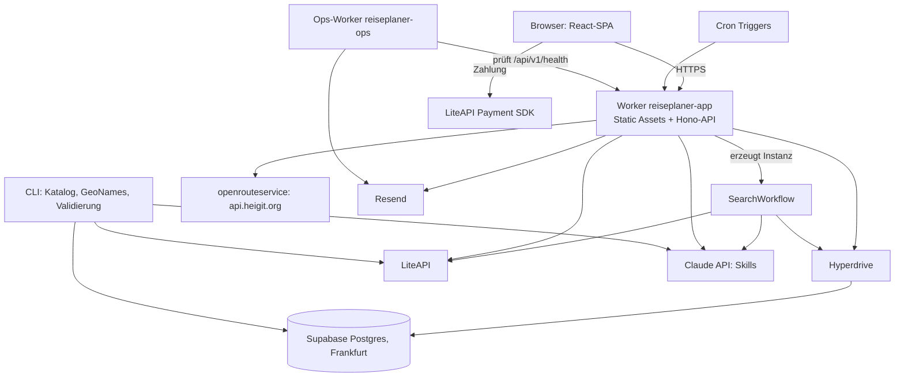
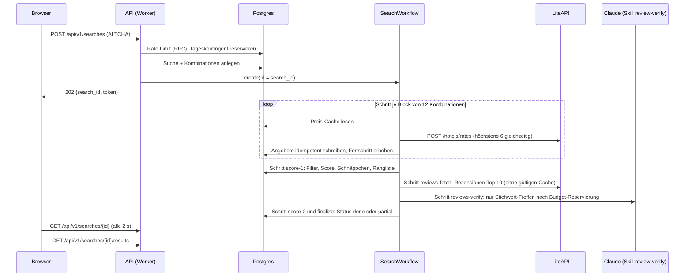
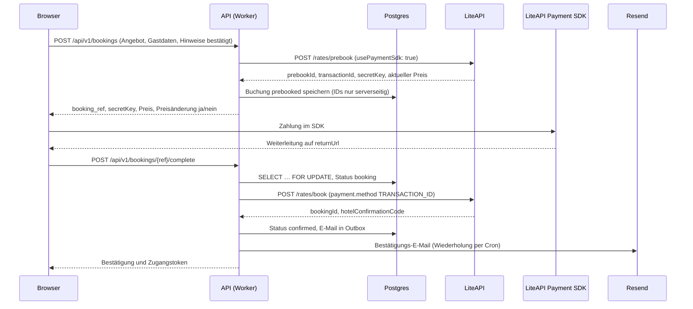
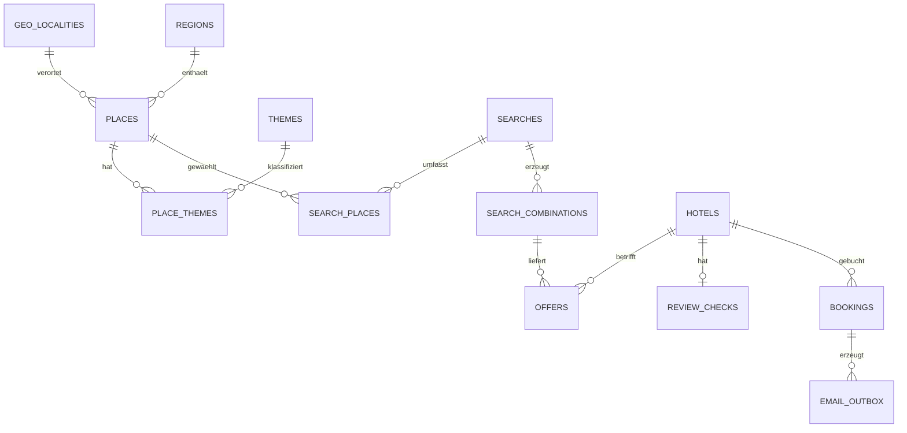

# Architektur: [ARBEITSTITEL]

Stand: 26.09.2026 · **Fassung 2 (Plattform-Angleichung)** · Ergebnis von Phase 2 · Baut auf `docs/konzept.md` (Fassung 3) auf.
Ersetzt Fassung 1 vom selben Tag (Python/FastAPI auf eigenem Hetzner-Server). Grund: Das Produkt soll nahtlos auf der bestehenden Firmenplattform laufen, die Frontlift nutzt, und mit fi-deck gebaut werden.

Preise, Limits und Endpunkte externer Dienste entsprechen dem Stand 09/2026. Jede Zahl trägt ihre Quelle in Abschnitt 18 (Belege). Vor der Implementierung werden sie gegen die aktuelle Dokumentation geprüft (`umsetzungsplan.md`, Verified contracts). Abweichungen werden gemeldet und nicht still übernommen.

**Technischer Arbeits-Slug:** `reiseplaner`. Alle technischen Bezeichner (Repository, Worker, Datenbank, Skill-IDs, npm-Scope) leiten sich davon ab. Wird vor M1 durch den endgültigen Produktnamen ersetzt, falls dieser feststeht (⛔ BEN-GATE BG-01).

---

## 0. Leitprinzipien

1. **Integration zuerst (fi-deck).** Fertig heißt verdrahtet, vorgeführt und bei allem, was Nutzer sehen, live geprüft. Reifegrade: `spec'd` → `built` → `wired` → `demonstrated` → `live-verified`. `STATUS.md` ist die einzige Wahrheit über den Baustand.
2. **Deterministisch zuerst.** Alles, was sich mit Regeln berechnen lässt, ist normaler Code mit Unit-Tests. KI nur für Sprachverständnis, immer mit Fallback ohne KI.
3. **Kosten skalieren mit Unterkünften, nicht mit Nutzern.** Preise, Fahrzeiten und Rezensionschecks liegen in gemeinsamen Zwischenspeichern für alle Nutzer.
4. **Kostenbremsen fail-closed (Frontlift).** Budget vor dem Aufruf reservieren, danach mit den echten Kosten abrechnen. Fällt die Budgetprüfung aus, wird der Aufruf verweigert, nicht durchgelassen.
5. **Austauschbare Anbieter und eigene Daten (Frontlift Golden Playbook Nr. 15).** Jeder externe Dienst liegt hinter einer Schnittstelle mit Fake-Implementierung. Was wir abrufen, landet im eigenen Speicher.
6. **Keine Marken- oder Domain-Literale im Code (Lehre aus Frontlift).** Alle produktspezifischen Werte stehen in `product.config.yaml`, die von Tag 1 im Build-Pfad hängt. In Frontlift war genau das Fehlen dieser Regel der größte Umbau-Aufwand.
7. **Hermetisch testbar (fi-deck-Fleet).** Alle automatischen Tests laufen ohne Netzwerk, ohne Docker und ohne Zugangsdaten. Das ist Voraussetzung dafür, dass fi-deck-Fleet-Worker das Produkt in ihrer abgeschotteten Sandbox bauen können.
8. **Wiederkehrende Jobs über Cloudflare Cron Triggers, GitHub Actions nur ereignisgesteuert (Firmen-Direktive).**
9. **Daten in der EU.** Datenbank in einer EU-Region, Verarbeiter mit Auftragsverarbeitungsvertrag.

## 1. Plattform-Angleichung

### 1.1 Übernommen

| Baustein | Quelle (geprüft am 26.09.2026) | Verwendung im Reiseplaner |
|---|---|---|
| Laufzeit Cloudflare Workers mit Static Assets | `frontlift/wrangler.jsonc` (Site-Worker mit `assets`-Binding) | Ein Worker liefert SPA und API aus und enthält Workflows und Cron-Jobs. |
| Supabase Postgres in der EU, eigenes Projekt pro Produkt, RLS vollständig („anon = 0“) | `frontlift/docs/ARCHITECTURE-CURRENT.md`; `ARCHITECTURE-multi-tenant-constraints.md` §6 | Eigenes Supabase-Projekt `reiseplaner-prod`, RLS auf allen Tabellen. |
| Migrationskonvention `YYYYMMDD[a-z]_name.sql`, Begleitdatei `_VERIFY.sql.notrun`, pgTAP-Tests für RLS | `frontlift/supabase/migrations/`, `frontlift/portal/supabase/tests/rls-*.sql` | Eine einzige Migrationsquelle `supabase/migrations/`. Frontlift hatte zwei parallele Bäume; das wird hier vermieden. |
| Rate Limiting über atomare Postgres-RPC, fail-closed | `frontlift/portal/functions/api/_shared/rate-limit.ts` | Funktion `increment_rate_limit` wörtlich übernommen. |
| Budget „reserve-before-call / settle“, IP-Hash mit Tagessalz, Antwortform 402 `{reason, cta}` | `frontlift/portal/functions/api/_shared/demoBudget.ts` | KI-Budget und Suchkontingent. |
| Skill-Bundle-Format (`skill.yaml`, `system.md`, `user.template.md`, JSON-Schemas, `evals/dataset.jsonl`, `baseline.json`) | `frontlift/core/skills/*/v1.0.0/`, `frontlift/core/eval/README.md` | Alle KI-Aufgaben als versionierte Skills, geprüft mit der Eval-Engine der Firma. |
| Skill-Eval-Gate in der CI (Regression gegen `baseline.json`, Kostendeckel 0,50 $ pro Skill) | `frontlift/.github/workflows/skill-eval.yml` | Gleiches Gate für die Reiseplaner-Skills. |
| Telemetrie-Ereignis je Skill-Aufruf | `frontlift/core/telemetry/types.ts` (`TelemetryEvent`) | Gleiche Felder, gespeichert in der Tabelle `skill_runs`. |
| Produktkonfiguration als einzige Quelle für Marken-Werte, Platzhalter in `wrangler.jsonc` („TENANT GUARD“) | `frontlift/tenants/*/tenant.config.yaml`; `frontlift/portal/wrangler.jsonc` | `product.config.yaml`, von Tag 1 im Build. |
| UI-Stack: React 19, Vite, Tailwind CSS 4, React Router 7, Headless UI, Heroicons, Catalyst-Komponenten | `frontlift/portal/package.json`, `frontlift/ui-kit/catalyst/` | Identischer Stack, Catalyst als eigenes Workspace-Paket. |
| Dead-Man's-Switch als eigener Worker auf `workers.dev` mit Alarmen per Resend | `frontlift/infra/cf-ops-worker/README.md` | Eigene Instanz `reiseplaner-ops`. |
| Resend für Transaktions- und Alarm-E-Mails | `frontlift/infra/cf-ops-worker` | Buchungs-E-Mails und Betriebsalarme. |
| Secret-Scan mit gitleaks (Pre-Commit-Hook und CI) | `frontlift/.githooks/pre-commit`, `.gitleaks.toml` | Unverändert übernommen. |
| KI-Kennzeichnung nach Art. 50 KI-VO, Grundsatz „im Zweifel kennzeichnen“ | `frontlift/docs/design/ai-act-labeling-spec.md` | Kennzeichnung von Rezensionsauswertung, Katalogtexten und Freitext-Übersetzung. |
| KI-Tell-Scrubber (deterministische deutsche Typografie, kein Geviertstrich) | Golden Playbook Nr. 16; `frontlift/scripts/generate-site.mjs:1335` (`normalizeGermanTypography`) | Auf alle KI-erzeugten Katalogtexte angewendet. |
| Overclaim-Guard (verbotene Behauptungen im Build prüfen) | `frontlift/HANDOFF.md` §6.5 und §6.6 | Claims-Regel für Preise (`konzept.md` Abschnitt 7, Punkt 9). |
| „Eiserne Regel“: gegen Produktion nur lesende Smoke-Tests | `frontlift/e2e/playwright.config.ts` | Buchungstests nur in Sandbox und Staging. |
| Execution-Protocol: Reifegrad-Leiter, Slice-Loop, Plan-Format, ⛔ BEN-GATE, Eskalationsregel, Meldeschwelle, Beweis-Haltbarkeit, höchstens zwei schreibende Linien | `fi-deck/docs/superpowers/EXECUTION-PROTOCOL.md` | Verbindlich; Produktfassung in `CLAUDE.md`. |
| `STATUS.md`, `HANDOFF.md`, `AGENTS.md` (Review-Richtlinien für Codex) | fi-deck Repo-Wurzel | Gleiche Rolle im Reiseplaner-Repo. |
| Live-Verifikation per Playwright-Walkthrough mit Screen-Report | `fi-deck/docs/runbooks/dogfood-walkthrough.md` | Browser-Walkthrough gegen den echt laufenden Stack. |
| TypeScript-Grundkonfiguration (`strict`, `exactOptionalPropertyTypes`, `noUncheckedIndexedAccess`), npm-Workspaces, Node 22, Vitest, zod | `fi-deck/tsconfig.base.json`, `fi-deck/package.json` | Unverändert übernommen. Kein ESLint und kein Prettier, wie in beiden Repos. |
| Supply-Chain-Policy: nur npm-Registry, Integrity-Pflicht, `npm ci --ignore-scripts` mit Rebuild-Allowlist, SHA-gepinnte Actions, `persist-credentials: false`, Prüfung „Baum nach Build und Test unverändert“ | `fi-deck/test-manifests/supply-chain-policy.json`, `fi-deck/.github/workflows/tier0.yml` | Gleiche Regeln, eigene Allowlist. |
| Fleet-Sandbox-Regeln: Egress nur zu `api.anthropic.com`, keine Paketinstallation zur Laufzeit, Änderungen an CI- und Lifecycle-Dateien werden vom Worker nicht angenommen | `fi-deck/docs/superpowers/specs/2026-07-14-fi-deck-worker-isolation-sandbox-design.md` §5.3, §6.2, §6.6 | Hermetische Tests, Toolchain-Image, Operator-Lane (Abschnitt 14). |
| Secrets in Bitwarden (`bw` interaktiv, `bws` für Fleet und CI), im Repo nur Item-Namen | `fi-deck/docs/runbooks/bitwarden-secrets-setup.md`; `frontlift/HANDOFF.md` §4 | Bitwarden-Ordner `reiseplaner`. |
| Codex-PR-Review als Pflicht-Gate | `fi-deck/docs/runbooks/codex-pr-review-gate.md` | Gleiches Gate, gesteuert über `AGENTS.md`. |
| Maximum-Regel mit Maximum-One-Pager für Funktionen, die Wettbewerbern nachgebaut sind | `EXECUTION-PROTOCOL.md` §1 | Messlatte der Kernfunktion in `konzept.md` Abschnitt 5.1. |

### 1.2 Bewusst nicht übernommen

| Baustein | Grund |
|---|---|
| n8n auf dem Hetzner-Server | Integrationen sind hier gewöhnliche Code-Pfade im Worker. Die n8n-Workflows waren laut `FRONTLIFT-MAP.md` der größte Hotspot für fest verdrahtete Werte. |
| Skill-Runner als Dienst auf dem Gour-med-Hetzner-Server | Das wäre eine gemeinsame Fehlerdomäne mit Gour-med. Die kurzen Haiku-Aufrufe laufen im Worker. Das Skill-Format bleibt identisch, deshalb bleibt ein späterer Wechsel möglich. |
| Cloudflare D1 für Signale und Kosten | Eine Datenbank genügt; Kosten und Telemetrie liegen in Postgres. |
| Cloudflare R2 | Keine eigenen Medien, Hotelfotos werden nur verlinkt. |
| `supabase-js` im Browser | Kein Nutzerlogin im MVP; alles läuft über die eigene API. |
| Opus als Bewertungsmodell | Haiku reicht für die Klassifikation; Kostenrahmen. |
| Newsletter (WBS), Stripe, Tenant-Factory, Lead-Funnel, cal.com | Nicht zutreffend: B2C-Produkt, Zahlung über LiteAPI. |
| Contract-Tests gegen Live-Infrastruktur | Ersetzt durch hermetische Tests. |
| Brevo als E-Mail-Anbieter (Vorschlag aus Fassung 1) | Das Brevo-Konto der Firma wurde dauerhaft abgelehnt (`frontlift/docs/ARCHITECTURE-CURRENT.md`, Abschnitt ABANDONED). |

### 1.3 Änderungen gegenüber Fassung 1

| Thema | Fassung 1 | Fassung 2 |
|---|---|---|
| Sprache | Python 3.12 (Backend) + TypeScript (Frontend) | Durchgehend TypeScript, gemeinsame Typen und Schemas für Frontend und Backend |
| Laufzeit | FastAPI, Docker, Hetzner CX23 | Cloudflare Worker mit Static Assets |
| Datenbank | PostgreSQL im Container | Supabase Postgres (EU), Zugriff über Cloudflare Hyperdrive |
| Hintergrundjobs | Procrastinate | Cloudflare Workflows (Suche) und Cron Triggers (Wartung) |
| KI-Aufrufe | Prompts im Code | Skill-Bundles im Firmenformat mit Eval-Gate |
| Geocoding des Startorts | openrouteservice | Eigene Ortsdatenbank aus GeoNames: deterministisch, ohne Kosten pro Abfrage |
| E-Mail | SMTP, Vorschlag Brevo | Resend |
| Tests | pytest, Docker-Postgres | Vitest, Workers-Testumgebung, PGlite (Postgres in WebAssembly) |
| Arbeitsweise | Meilensteine | Meilensteine aus Slices nach fi-deck-Plan-Format mit Reifegraden |

## 2. Tech-Stack und Entscheidungen

### 2.1 Überblick

| Bereich | Wahl |
|---|---|
| Sprache, Laufzeit lokal | TypeScript 5.8+, Node.js 22 (wie fi-deck und Frontlift) |
| Monorepo | npm-Workspaces, Pakete unter `packages/*`, Scope `@reiseplaner/*` |
| Backend-Laufzeit | Cloudflare Worker mit Static Assets, `nodejs_compat` |
| API-Routing | Hono mit zod-Validierung |
| Hintergrundjobs | Cloudflare Workflows (Suche), Cron Triggers (Wartung, Aufbewahrung, E-Mail-Wiederholungen) |
| Datenbank | Supabase Postgres (EU) über Cloudflare Hyperdrive, Treiber postgres.js |
| Datenzugriff | Handgeschriebenes SQL in Repository-Modulen, Zeilen mit zod geprüft |
| KI | Anthropic API; Skills im Firmenformat; Laufzeit-Runner im Worker; Katalog über die Batch API |
| Frontend | React 19, Vite, Tailwind CSS 4, React Router 7, Headless UI, Heroicons, Catalyst |
| Dev-Server | Cloudflare-Vite-Plugin (Worker und SPA in einem Prozess), lokale Datenbank über PGlite-Socket |
| Tests | Vitest; `@cloudflare/vitest-pool-workers` (Worker, Workflows, Cron im echten Workers-Laufzeitsystem); PGlite mit pgTAP; Playwright für Walkthroughs |
| E-Mail | Resend |
| Bot-Schutz | ALTCHA (Proof-of-Work, selbst gehostet, ohne Cookies) |
| Fahrzeiten | openrouteservice-Matrix über `api.heigit.org` |
| Ortsdaten | GeoNames-Export (CC BY 4.0) in eigener Tabelle |
| Hosting | Cloudflare (Worker, Hyperdrive, Workflows), Supabase (Frankfurt) |
| CI/CD | GitHub Actions (nur ereignisgesteuert), Organisation `fischermann-intelligence` |
| Secrets | Bitwarden; zur Laufzeit als Worker-Secrets |

### 2.2 Entscheidungen mit Alternativen

Jede Entscheidung ist als Kurz-ADR formuliert: Kontext, Optionen, Wahl, Begründung. Punkte mit ⛔ brauchen eine Freigabe (Übersicht in `umsetzungsplan.md`).

**E1 Laufzeit und Hosting**
- **A) Ein Cloudflare Worker mit Static Assets (gewählt).** SPA, API, Workflows und Cron-Jobs in einer Deploy-Einheit. Muster des Frontlift-Site-Workers.
- B) Cloudflare Pages mit Pages Functions (Muster des Frontlift-Portals). Nachteil: Workflows und Cron brauchen zusätzlich einen eigenen Worker, also zwei Deploy-Einheiten.
- C) Container auf Hetzner (Fassung 1). Nachteil: eigener Serverbetrieb und eigene Werkzeuge, die niemand sonst in der Firma nutzt.
- Begründung: Firmenstandard, keine Server-Wartung, eine Einheit statt zwei.
- ⛔ BG-03: Cloudflare Workers Paid (5 $ pro Monat, pro Account). Grund: Der Free-Plan erlaubt nur 10 ms CPU und 50 externe Unteranfragen je Aufruf; das reicht für das Parsen großer Tarifantworten nicht zuverlässig.

**E2 Datenbank und Datenzugriff**
- **A) Supabase Postgres über Hyperdrive mit postgres.js (gewählt).** Cloudflare empfiehlt für Supabase die direkte Verbindung über Hyperdrive statt `supabase-js`.
- B) `supabase-js` bzw. PostgREST wie im Frontlift-Portal. Nachteil: nicht hermetisch testbar ohne Docker, und atomare Transaktionen für den Buchungsablauf wären nur über RPCs möglich.
- C) Cloudflare D1. Nachteil: kein Postgres (keine RLS, keine Firmen-Migrationskonvention, kein pgTAP).
- Begründung: Firmen-Datenbank (Supabase), aber derselbe SQL-Pfad funktioniert in Tests gegen PGlite. Wichtig: Das Hyperdrive-Caching wird für diese Konfiguration **abgeschaltet**, weil die Voreinstellung Lesezugriffe 60 Sekunden lang zwischenspeichert. Das würde Status-Abfragen verfälschen.

**E3 Datenzugriffsschicht**
- **A) postgres.js mit handgeschriebenem SQL in Repository-Modulen, Zeilen mit zod geprüft (gewählt).** Geringste Abhängigkeitsfläche, volle Kontrolle über SQL, passend zur SQL-first-Kultur der Firma.
- B) Kysely: typsicherer Query-Builder mit Codegen. Mehr Abhängigkeiten, zusätzlicher Codegen-Schritt.
- C) Drizzle: ORM mit eigenem Migrationswerkzeug. Kollidiert mit der Firmenkonvention reiner SQL-Migrationen.

**E4 Hintergrundverarbeitung der Suche**
- **A) Cloudflare Workflows (gewählt).** Dauerhafte Schritte mit Wiederholungen, Zwischenstand bleibt bei Abstürzen erhalten, im Free- und Paid-Plan enthalten.
- B) Cloudflare Queues. Nachteil: Fortschritt und Wiederholungen müssen selbst gebaut werden.
- C) Node-Worker auf Hetzner oder n8n. Nachteil: Serverbetrieb, gemeinsame Fehlerdomäne.
- Kosten: Ab dem 10.08.2026 werden Schritte abgerechnet; der Paid-Plan enthält 500.000 Schritte pro Monat. Eine Suche braucht etwa 15 bis 20 Schritte, also rund 25.000 Suchen pro Monat inklusive.

**E5 Ausführung der KI-Skills**
- **A) Skill-Bundles im Firmenformat, zur Build-Zeit in den Worker gebündelt und dort ausgeführt (gewählt).** JSON-Schemas werden zur Build-Zeit zu Validierungsfunktionen kompiliert (Ajv-Standalone), denn Workers erlauben keine Code-Erzeugung zur Laufzeit.
- B) Aufruf des gemeinsamen Skill-Runners auf dem Hetzner-Server der Firma per Bearer-Token. Nachteil: gemeinsame Fehlerdomäne mit Gour-med und zusätzliche Latenz.
- C) Prompts direkt im Code. Nachteil: keine Evals, keine Versionierung, kein Kostendeckel.

**E6 API-Routing**
- **A) Hono mit zod (gewählt).** Klein, auf Workers ausgelegt, typisierte Routen.
- B) Dateibasiertes Routing der Pages Functions. Nicht verfügbar in einem Worker mit Static Assets.
- C) Eigener Mini-Router. Mehr eigener Code ohne Mehrwert.

**E7 Bot-Schutz**
- **A) ALTCHA (gewählt).** Proof-of-Work, zustandslos per HMAC prüfbar, ohne Cookies und ohne Drittanbieter. Damit ist kein Cookie-Banner nötig.
- B) Cloudflare Turnstile. Kostenlos und ohne neuen Auftragsverarbeiter, weil wir ohnehin bei Cloudflare hosten. Aber Turnstile setzt Cookies, deren Einwilligungspflicht unter Datenschutzexperten umstritten ist.
- C) Nur Rate Limits. Zu schwach gegen verteilte Bots, und jede Bot-Suche verschlechtert das Such-zu-Buchungs-Verhältnis bei LiteAPI.

**E8 Startort und Ortsabgleich (Geocoding)**
- **A) Eigene Ortsdatenbank aus dem GeoNames-Export (gewählt).** Städte, Orte und Postleitzahlen für DE, AT, CH und Südtirol in einer Tabelle, Autovervollständigung per Trigramm-Index. Deterministisch, ohne Kosten pro Abfrage, ohne Drittanbieter zur Laufzeit. Pflicht: Quellenangabe nach CC BY 4.0.
- B) Geocoding über openrouteservice (Fassung 1). Der alte Host `api.openrouteservice.org` wurde zugunsten von `api.heigit.org` abgekündigt, und laut einem Erfahrungsbericht bietet der neue Host kein Geocoding an (unbestätigt). Zudem gilt ein Tageskontingent.
- C) Kommerzieller Geocoder (Google, Mapbox). Kosten pro Abfrage und ein weiterer Auftragsverarbeiter.
- Auch der Ortskatalog wird gegen diese Tabelle abgeglichen; die KI liefert keine Koordinaten.

**E9 Fahrzeiten**
- **A) openrouteservice Standard (kostenlos) über `api.heigit.org`, mit Cache nach Startzelle (gewählt).** Kontingent laut Tarifseite: Matrix 500 Anfragen pro Tag, 40 pro Minute.
- B) Google Routes. Genauer und mit Verkehrslage, aber kostenpflichtig pro Element.
- C) Selbst gehostetes openrouteservice (Docker). Keine Kontingente, braucht aber einen Server mit viel Arbeitsspeicher. Das ist der vorgesehene Ausstiegspfad bei Wachstum.
- ⛔ BG-06: Laut Nutzungsbedingungen gehört jeder HeiGIT-Schlüssel einer einzelnen Person. Wer hält den Schlüssel?

**E10 E-Mail**
- **A) Resend (gewählt).** In der Firma bereits für Alarme im Einsatz. Free-Plan: 3.000 E-Mails pro Monat, höchstens 100 pro Tag, 1 Domain.
- B) Brevo. Ausgeschlossen, das Firmenkonto wurde abgelehnt.
- C) Postmark oder Amazon SES. SES ist in der Firma verworfen, Postmark wäre ein neuer Anbieter.
- ⛔ BG-08: Nutzt das Resend-Konto der Firma die eine kostenlose Domain bereits, braucht der Reiseplaner den Pro-Plan (20 $ pro Monat) oder ein eigenes Konto.

**E11 Teststrategie**
- **A) Hermetisch (gewählt):** Unit-Tests für die Fachlogik; Worker-, Workflow- und Cron-Tests im echten Workers-Laufzeitsystem (`@cloudflare/vitest-pool-workers`) mit Fakes für alle Anbieter; Datenbank-Tests gegen PGlite mit pgTAP über `pglite-socket`. Zusätzlich eine CI-Spur gegen einen echten Postgres-Dienstcontainer für Nebenläufigkeit und RLS-Parität.
- B) Lokales Supabase per Docker. Nicht Fleet-tauglich, weil die Sandbox kein Docker und kein Netzwerk erlaubt.
- C) Tests gegen Live-Dienste wie bei den Frontlift-Contract-Tests. Verworfen: Kosten, Nebenwirkungen, nicht reproduzierbar.
- Hinweis: PGlite ist eine Einzelverbindungs-Datenbank. `pglite-socket` erlaubt standardmäßig nur eine Verbindung und bietet einen Multiplexer für mehrere, ohne Garantie für alle Fälle. Die Tests fahren deshalb mit Pool-Größe 1; Nebenläufigkeitstests laufen in der Postgres-Spur der CI.

**E12 Monorepo und Werkzeuge**
- npm-Workspaces wie fi-deck. Keine zusätzlichen Build-Werkzeuge (kein Turborepo, kein pnpm), keine Linter (die Firma nutzt keine); TypeScript im Strict-Modus ist das Qualitäts-Gate.

## 3. Systemübersicht

### 3.1 Komponenten

- **Worker `reiseplaner-app`:** Liefert die React-SPA als Static Assets aus. Unter `/api/*` läuft die Hono-API. Der Worker enthält außerdem die Workflow-Klasse `SearchWorkflow` und die Cron-Handler.
- **`SearchWorkflow`:** Führt eine Suche in dauerhaften Schritten aus: Tarife abrufen, bewerten, Rezensionen prüfen, abschließen.
- **Cron Triggers:** Zwischenspeicher aufräumen, Aufbewahrungsfristen durchsetzen, Bewertungseinladungen, E-Mail-Wiederholungen, Kosten- und Quotenwächter.
- **Hyperdrive `reiseplaner-db`:** Verbindungspool zur Supabase-Datenbank, Caching abgeschaltet.
- **Supabase-Projekt `reiseplaner-prod`** (Region Frankfurt, ⛔ BG-04): alle Fachdaten, Katalog, Ortsdatenbank, Zwischenspeicher, Budgets, Telemetrie.
- **Ops-Worker `reiseplaner-ops`** auf `workers.dev`: externer Wächter nach dem Frontlift-Muster. Liegt bewusst nicht in derselben Deploy-Einheit wie das, was er überwacht.
- **CLI (`packages/cli`, Node mit tsx):** Katalog erzeugen und importieren, GeoNames importieren, Validierung, Fixtures aufzeichnen, Kostenbericht.
- **Externe Dienste:** LiteAPI (Tarife, Inhalte, Rezensionen, Buchung, Zahlung), Claude API (Skills), openrouteservice (Fahrzeit-Matrix), Resend (E-Mail).

### 3.2 Diagramm



### 3.3 Ablauf einer Suche



### 3.4 Ablauf einer Buchung



### 3.5 Betriebsmodi

`PROVIDERS_MODE` steuert alle Anbieter-Adapter gleichzeitig.

| Modus | LiteAPI | openrouteservice | Claude | Resend | Datenbank | Einsatz |
|---|---|---|---|---|---|---|
| `fake` | Fixtures | Fixtures | feste Antworten | Postausgang in der DB | PGlite (`pglite-socket`) | Entwicklung, CI, Fleet-Sandbox, Walkthroughs |
| `sandbox` | Sandbox-Schlüssel | echter Dienst | echter Dienst, kleines Budget | Testadresse | PGlite lokal oder Staging-Projekt | Validierung, manuelle Integration, Staging |
| `live` | Live-Schlüssel | echter Dienst | echter Dienst | echter Versand | Supabase Produktion | Produktion |

Einzelne Adapter lassen sich zusätzlich abschalten, etwa mit `LLM_ENABLED=false`.

## 4. Ordnerstruktur

```
/
├── CLAUDE.md                        # Arbeitsregeln (Produktfassung des Execution-Protocols)
├── AGENTS.md                        # Review-Richtlinien für Codex
├── STATUS.md                        # Baustand je Slice (einzige Wahrheit)
├── HANDOFF.md                       # Frontier, BEN-GATE-Warteschlange, Stolperfallen
├── README.md
├── product.config.yaml              # einzige Quelle für Marken-, Domain- und Betreiberwerte
├── package.json                     # npm-Workspaces, Skripte
├── package-lock.json
├── tsconfig.base.json               # übernommen aus fi-deck
├── .gitleaks.toml  .githooks/pre-commit
├── supply-chain-policy.json         # Allowlist nach fi-deck-Muster
├── toolchain/Dockerfile             # Toolchain-Image für Fleet-Worker und CI (Operator-Lane)
├── toolchain/versions.lock
├── .github/workflows/
│   ├── ci.yml                       # PR: Supply-Chain, Typecheck, Tests, Build, Baum unverändert, gitleaks
│   ├── skill-eval.yml               # PR mit Skill-Änderungen: Evals gegen baseline.json, Deckel 0,50 $
│   └── deploy.yml                   # push main: Staging; Produktion nur mit Freigabe
├── docs/
│   ├── konzept.md  architektur.md  umsetzungsplan.md
│   ├── validierung.md               # entsteht in M2
│   ├── demos/<slice-id>/            # committete Belege: Demo-Ausgaben, Screen-Reports
│   └── runbooks/                    # Deploy, Migration, Rollback, Katalogprüfung, Secrets
├── data/
│   ├── catalog/themes.yaml
│   ├── catalog/regions/<land>.yaml
│   ├── catalog/places/<region-slug>.yaml
│   └── geonames/README.md           # Herkunft, Lizenz, Stand des Imports (Rohdaten nicht im Repo)
├── supabase/
│   ├── migrations/                  # YYYYMMDD[a-z]_name.sql + _VERIFY.sql.notrun
│   └── tests/                       # pgTAP: RLS, RPCs, Constraints
├── packages/
│   ├── config/                      # product.config.yaml → zod-geprüfte, typisierte Konfiguration
│   ├── contracts/                   # zod-Schemas für API-Requests/-Responses (geteilt von worker und web)
│   ├── domain/                      # reine Fachlogik ohne IO (Termine, Score, Schnäppchen, Rangliste …)
│   ├── db/                          # postgres.js-Client, Repository-Module, Test-Harness (PGlite)
│   ├── providers/                   # Ports + Adapter + Fakes: liteapi, routing, llm, mail
│   ├── skills/                      # Skill-Bundles (Firmenformat) + Runner + kompilierte Schemas
│   ├── worker/                      # Hono-API, SearchWorkflow, Cron-Handler, Middleware
│   ├── web/                         # React-SPA (Vite)
│   ├── ui/                          # Catalyst-Komponenten (aus frontlift/ui-kit übernommen)
│   ├── ops-worker/                  # reiseplaner-ops (Dead-Man's-Switch)
│   └── cli/                         # Katalog, GeoNames, Validierung, Fixtures, Kostenbericht
└── e2e/
    ├── dogfood/                     # Walkthroughs gegen den laufenden Stack → dogfood-results/<run>/report.md
    └── playwright.config.ts
```

### 4.1 `product.config.yaml`

Einzige Quelle für alles, was sich je Produkt oder Markt unterscheidet. Wird beim Build mit zod geprüft und als typisierte Konstante in Worker und SPA eingebunden. Nach dem Frontlift-Muster enthält `wrangler.jsonc` keine Produktwerte, nur Platzhalter der Form `__REISEPLANER_…__`, die das Deploy-Skript aus dieser Datei füllt.

| Schlüssel | Inhalt |
|---|---|
| `id`, `name`, `slug` | Produktkennung, Anzeigename (Arbeitstitel), technischer Slug |
| `operator` | Betreiber (Firma, Anschrift als Verweis auf das Impressum der Firma, Kontakt-E-Mail) |
| `domains` | `primary`, `staging` |
| `brand` | Farben, Schriften, Logo-Pfad |
| `markets` | Sprache `de`, Währung `EUR`, Gast-Nationalität `DE`, Länder des Katalogs (`DE`, `AT`, `CH`, `IT-BZ` für Südtirol) |
| `support` | Support-Adresse, zugesagte Antwortzeit |
| `compliance` | Aufbewahrungsfristen, Texte der KI-Kennzeichnung, Liste verbotener Claims |
| `attribution` | Pflicht-Quellenangaben (GeoNames, OpenStreetMap) |
| `limits` | Suchumfang, Rate Limits, Tageskontingente, KI-Tagesbudget |

## 5. Datenmodell

### 5.1 Konventionen

- Alle Tabellen liegen im Schema `app`. Zeitstempel sind `timestamptz` in UTC; angezeigt wird in Europe/Berlin.
- Geldbeträge sind `integer` in Cent, zusammen mit `currency char(3)`.
- Primärschlüssel sind `uuid` (`gen_random_uuid()`), sofern nicht anders angegeben. Enums sind `text` mit CHECK-Constraint.
- Migrationen: `supabase/migrations/YYYYMMDD[a-z]_<name>.sql`, idempotent (`IF NOT EXISTS`), dazu eine Begleitdatei `YYYYMMDD[a-z]_<name>_VERIFY.sql.notrun` mit Prüfabfragen (Frontlift-Konvention). Es gibt genau einen Migrationsbaum.
- **Rollen und RLS:** Auf jeder Tabelle ist RLS aktiv. Die Supabase-Rollen `anon` und `authenticated` erhalten keine Policies und keine Grants: Zugriff null („anon = 0“, Frontlift-Regel). Der Worker verbindet sich als eigene Rolle `app_rw` mit ausdrücklichen Policies `FOR ALL TO app_rw USING (true) WITH CHECK (true)` und Grants nur auf das Schema `app`. Die CLI nutzt für Importe die Rolle `app_import` mit Rechten nur auf Katalog- und Ortstabellen. pgTAP-Tests beweisen beides.

### 5.2 Ortsdatenbank und Katalog

**geo_localities** (aus GeoNames)
| Spalte | Typ | Hinweis |
|---|---|---|
| geonameid | integer PK | GeoNames-ID |
| name, ascii_name | text | |
| alt_names_de | text[] | deutsche Alternativnamen |
| country_code | char(2) | `DE`, `AT`, `CH`, `IT` |
| admin1, admin2 | text | Bundesland bzw. Provinz, für Südtirol `BZ` |
| lat, lng | double precision | |
| population | integer | für die Sortierung der Vorschläge |
| postal_codes | text[] | aus dem GeoNames-Postleitzahlenexport |
| feature_code | text | nur Siedlungen (Klasse `P`) |
| Index | | GIN-Trigramm auf `name`, `ascii_name`, `alt_names_de`; B-Baum auf `postal_codes` |

**themes**, **regions**, **places**, **place_themes**: Der Katalog. `places.geonameid` verweist auf `geo_localities`; die Koordinaten stammen aus dem deterministischen Abgleich mit der Ortsdatenbank, nie von der KI.

| Tabelle | Wichtige Spalten |
|---|---|
| themes | `code` PK, `label_de`, `category` (`landschaft` · `aktivitaet` · `kultur` · `erholung`), `active` |
| regions | `id`, `slug` unique, `name`, `country_code`, `lat`, `lng`, `description_de`, `source` (`ai` · `manual`), `verified` |
| places | `id`, `slug` unique, `name`, `region_id` (null bei Nutzerorten), `geonameid`, `country_code`, `lat`, `lng`, `search_radius_km` (Standard 10), `description_de` (höchstens 160 Zeichen), `ai_assisted` (bool, für die Kennzeichnung), `kind` (`catalog` · `user`), `verified`, `active` |
| place_themes | `place_id`, `theme_code`, `strength` 1–3; PK aus beiden IDs |

**travel_time_cache**: `origin_cell` (auf 0,02° gerundete Startkoordinaten, etwa `48.78:9.18`), `place_id`, `duration_min`, `distance_km`, `provider`, `fetched_at` (TTL 180 Tage); PK aus `origin_cell` und `place_id`.

### 5.3 Unterkünfte und Zwischenspeicher

**hotels**: `id` (LiteAPI-`hotelId`, PK), `name`, `address`, `city`, `country_code`, `lat`, `lng`, `stars`, `rating` (auf 0–10 normalisiert), `review_count`, `hotel_type`, `main_photo_url` (wird nur verlinkt), `facility_ids int[]`, `content_fetched_at` (TTL 7 Tage).

**cache_entries**: `namespace` (`rates` · `reference_price` · `hotel_content`), `key` (SHA-256 der normalisierten Parameter), `value jsonb`, `expires_at`; PK aus `namespace` und `key`. Der Schlüssel für `rates` wird gebildet aus `place_id | checkin | checkout | occupancy | currency | guest_nationality | margin`. TTL für Tarife 30 Minuten.

### 5.4 Suchen

| Tabelle | Wichtige Spalten |
|---|---|
| searches | `id`, `token_hash`, `status` (`queued` · `running` · `reviewing` · `done` · `partial` · `failed`), `request jsonb` (validierter SearchRequest), `origin_lat`, `origin_lng`, `combos_total`, `combos_done`, `combos_failed`, `workflow_instance_id`, `ip_hash` (Tagessalz, Löschung nach 7 Tagen), `error`, `started_at`, `finished_at` |
| search_places | `search_id`, `place_id`, `drive_minutes`, `source` (`suggested` · `user`) |
| search_combinations | `id bigserial`, `search_id`, `place_id`, `checkin`, `checkout`, `status` (`pending` · `done` · `cached` · `failed`), `offers_count`, `error`; unique aus `search_id`, `place_id`, `checkin`, `checkout` |
| offers | `id bigserial`, `search_id`, `combination_id`, `hotel_id`, `offer_kind` (`cheapest` · `cheapest_refundable`), `liteapi_offer_id`, `room_name`, `board_type`, `refundable`, `free_cancel_until`, `total_price_cents`, `pay_at_property_cents`, `pay_at_property_known`, `currency`, `nights`, `price_per_night_cents`, `passes_filters`, `quality_score`, `score_breakdown jsonb`, `bargain_types text[]`, `bargain_reason`, `rank_score`; **unique aus `combination_id`, `hotel_id`, `offer_kind`**, damit wiederholte Workflow-Schritte idempotent schreiben |

### 5.5 Rezensionscheck

**review_checks**: `hotel_id` PK, `status` (`ok` · `no_reviews` · `skipped_budget` · `failed`), `reviews_analyzed`, `latest_review_date`, `recent_rating`, `recent_count`, `topics jsonb` (Liste aus `topic`, `confirmed_count`, `unverified_count`, `latest_date`, `severity`), `liteapi_sentiment jsonb`, `skill_version`, `checked_at`, `expires_at` (TTL 30 Tage). Rezensionstexte und Namen der Verfasser werden nicht gespeichert.

### 5.6 Buchungen und E-Mails

Der Buchungsstatus `booking` markiert einen laufenden Aufruf von `/rates/book`; so werden doppelte `complete`-Aufrufe erkannt. `email_outbox.provider_message_id` speichert die ID, die Resend beim Versand zurückgibt.

| Tabelle | Wichtige Spalten |
|---|---|
| bookings | `id`, `booking_ref` (8 Zeichen Crockford-Base32, zufällig), `search_id`, `hotel_id`, `offer_snapshot jsonb`, `status` (`draft` · `prebooked` · `booking` · `confirmed` · `failed` · `cancelled`), `liteapi_prebook_id`, `liteapi_transaction_id`, `liteapi_booking_id`, `hotel_confirmation_code`, `checkin`, `checkout`, `occupancy jsonb`, `total_price_cents`, `currency`, `cancellation_policy jsonb`, `holder_first_name`, `holder_last_name`, `holder_email`, `holder_phone`, `confirmed_at`, `cancelled_at`, `review_invite_sent_at`, `pii_deleted_at`, `last_error` |
| email_outbox | `id bigserial`, `type` (`booking_confirmation` · `booking_cancelled` · `access_link` · `review_invite` · `ops_alert`), `to_email`, `booking_id`, `payload jsonb`, `status` (`pending` · `sent` · `failed`), `attempts` (höchstens 5), `provider_message_id`, `last_error`, `sent_at` |

### 5.7 Schutz, Budgets und Telemetrie

| Tabelle | Wichtige Spalten | Herkunft |
|---|---|---|
| rate_limits | `key` PK, `count`, `reset_at` | wörtlich aus `frontlift/portal/functions/api/_shared/rate-limit.ts` |
| budget_ledger | `day date`, `scope` (`llm_usd` · `liteapi_calls` · `ors_calls` · `searches`), `reserved numeric`, `settled numeric`, `cap numeric`; PK aus `day` und `scope` | Muster „reserve/settle“ aus `demoBudget.ts` |
| skill_runs | `id bigserial`, `ts`, `skill`, `version`, `correlation_id`, `input_hash`, `output_hash`, `latency_ms`, `cost_usd`, `model_used`, `outcome` (`ok` · `error` · `fallback` · `skipped_budget`), `error_message`, `batch bool`, `downstream_signal`, `downstream_signal_updated_at` | Felder aus `frontlift/core/telemetry/types.ts` (`TelemetryEvent`), ergänzt um `fallback` und `skipped_budget` |
| provider_usage | `day`, `provider`, `endpoint`, `calls`; PK aus allen drei | Grundlage für die Überwachung des Such-zu-Buchungs-Verhältnisses |

**RPC-Funktionen** (alle `SECURITY INVOKER`, aufrufbar nur von `app_rw`):
- `increment_rate_limit(p_key text, p_max int, p_window bigint) returns table(count int, allowed bool)`: atomar, wörtlich wie in Frontlift.
- `budget_reserve(p_scope text, p_amount numeric, p_cap numeric) returns bool`: ein einziges `INSERT … ON CONFLICT DO UPDATE … RETURNING`. Liefert `false`, wenn `reserved + settled + amount > cap`.
- `budget_settle(p_scope text, p_reserved numeric, p_actual numeric) returns void`: bucht die Reservierung auf die tatsächlichen Kosten um.
- `look_to_book_ratio(p_days int) returns numeric`: Tarifanfragen geteilt durch bestätigte Buchungen im Zeitraum.

Fällt eine dieser Funktionen aus, gilt das als „nicht erlaubt“ (fail-closed).

### 5.8 Beziehungen



## 6. Fachlogik (deterministisch)

Die gesamte Logik dieses Abschnitts liegt in `packages/domain/src/` als reine Funktionen ohne IO. Jede Funktion hat Unit-Tests. Alle Konstanten stehen in Abschnitt 6.14 und sind über `product.config.yaml` (`limits`) bzw. die Worker-Konfiguration änderbar.

### 6.1 Termine (`dates.ts`)
- Eingabe: `window.start`, `window.end`, `nights` (1 bis 14), `arrival_weekdays` (ISO: 1 = Montag … 7 = Sonntag), `today`.
- Für jeden Tag `d` von `max(window.start, today + 1)` bis `window.end − nights`: Liegt `d` auf einem erlaubten Wochentag, entsteht der Termin `(checkin = d, checkout = d + nights)`.
- Mehr als `SEARCH_MAX_DATES` Termine: Fehler `too_many_dates` mit der tatsächlichen Anzahl.
- Orte × Termine > `SEARCH_MAX_COMBINATIONS`: Fehler `too_many_combinations`.

### 6.2 Startort, Erreichbarkeit und Vorschläge (`geo.ts`, `suggestions.ts`)
1. **Startort:** Autovervollständigung über `geo_localities` (Trigramm-Ähnlichkeit auf Name und deutschen Alternativnamen, exakte Treffer auf Postleitzahlen, sortiert nach Ähnlichkeit, dann Einwohnerzahl). Kein externer Dienst.
2. **Startzelle:** `round(lat / 0.02) · 0.02` und `round(lng / 0.02) · 0.02`, als Text `"48.78:9.18"`; etwa 2 km Raster.
3. **Kandidaten:** aktive, verifizierte Katalogorte mit mindestens einem gewählten Thema in Stärke ≥ 2. Ohne Themenwahl zählen alle Orte.
4. **Vorfilter nach Luftlinie:** Haversine-Distanz ≤ `max_drive_minutes × PREFILTER_KM_PER_MIN`.
5. **Fahrzeiten:** Fehlende Paare aus Startzelle und Ort werden in `travel_time_cache` gesucht. Nur für die fehlenden wird die ORS-Matrix abgefragt, in Blöcken von höchstens `ORS_MATRIX_CHUNK` Zielen und unter dem Tageskontingent aus `budget_ledger` (`ors_calls`). Danach gilt: `duration_min ≤ max_drive_minutes`.
6. **Regionsranking:** je Region `score = Σ strength` der passenden Themen über die erreichbaren Orte; Ausgabe der Top `SUGGEST_MAX_REGIONS` (mindestens 2, sofern vorhanden).
7. **Begründung** aus Textbaustein: „{n} passende Orte für {Themen}, {min}–{max} Fahrt“.
8. **Ortsranking je Region:** absteigend nach Themen-Score, dann aufsteigend nach Fahrzeit; bis zu 10 Orte mit Beschreibung (gekennzeichnet, siehe 6.13), Themen und Fahrzeit.
9. **Eigene Orte:** Suche erst im Katalog, dann in `geo_localities`. Ein Treffer in der Ortsdatenbank wird als `places.kind = user` angelegt (`verified = false`). Hier gilt kein Fahrzeitfilter, die Fahrzeit wird aber angezeigt.
10. **Ohne maximale Fahrzeit** entfällt Schritt 5 als Filter; die Fahrzeiten werden trotzdem angezeigt.
11. **ORS nicht verfügbar oder Kontingent erschöpft:** Die Vorschläge nutzen die Luftlinien-Schätzung, klar markiert als „geschätzte Fahrzeit“.

### 6.3 Themen und Chips (`themes.ts`, `chips.ts`)

**Themen** beschreiben Zielorte. Startvokabular: `wandern`, `bergpanorama`, `seen`, `natur_ruhe`, `radfahren`, `wellness`, `wintersport`, `staedte_kultur`, `wein_kulinarik`, `familie`. Es liegt in `data/catalog/themes.yaml` und ist erweiterbar, etwa um `strand` oder `schwarzer_sandstrand`.

**Chips** beschreiben Wünsche an die Unterkunft, jeder mit fest definierter Wirkung:

| Chip | Wirkung |
|---|---|
| `sauber` | Sauberkeitsgewicht im Score steigt von 0,2 auf 0,35 (6.7). |
| `ruhig` | Warnungen zum Thema `laerm` zählen doppelt. |
| `fruehstueck` | Filter `board_type ∈ {BB, HB, FB, AI}` |
| `kostenlos_stornierbar` | Filter `refundable = true` |
| `parkplatz`, `hund_erlaubt`, `sauna_wellness`, `wlan`, `kueche`, `barrierefrei`, `familienzimmer` | Filter auf die passenden LiteAPI-Ausstattungs-IDs (`/data/facilities`); `kueche` zusätzlich über den Unterkunftstyp Apartment bzw. Ferienwohnung |

Die Zuordnung zu den Ausstattungs-IDs wird in S4.1 aus der echten Facilities-Liste festgelegt und in `chips.ts` hinterlegt.

### 6.4 Suchablauf (`packages/worker/src/workflows/search.ts`)
1. **`POST /api/v1/searches`:** zod-Validierung (6.1), ALTCHA, `increment_rate_limit` (fail-closed), Tageskontingent `budget_reserve('searches', 1, cap)`. Danach `searches`, `search_places` und `search_combinations` anlegen, `SearchWorkflow.create({ id: search_id })` aufrufen und mit 202 antworten.
2. **Schritt `load`:** Suche laden, Status `running`. Rückgabe nur IDs und Zähler, denn Schritt-Ergebnisse sind auf 1 MiB begrenzt.
3. **Schritte `rates-<n>`:** je Block von `SEARCH_BLOCK_SIZE` Kombinationen ein Schritt, höchstens `LITEAPI_MAX_CONCURRENCY` Anfragen gleichzeitig. Workers erlauben 6 gleichzeitige ausgehende Verbindungen je Aufruf, daher ist 6 die harte Obergrenze.
   - Cache-Schlüssel bilden (5.3). Treffer: Status `cached`, Angebote übernehmen.
   - Sonst Tageskontingent `budget_reserve('liteapi_calls', 1, cap)`, dann `POST /hotels/rates` mit `latitude`, `longitude`, `radius = search_radius_km`, Terminen, `occupancies`, `currency = EUR`, `guestNationality`, `timeout = LITEAPI_RATES_TIMEOUT_S`, `limit = 200` und der Marge in der von LiteAPI vorgesehenen Form.
   - Fehler 429 und 5xx: bis zu 2 Wiederholungen mit exponentiellem Backoff innerhalb des Schritts; andere Fehler setzen die Kombination auf `failed`.
   - Angebote normalisieren (6.5), idempotent schreiben (Unique-Schlüssel aus 5.4), `cache_entries` aktualisieren, Fortschritt erhöhen, `provider_usage` zählen.
   - Schritt-Konfiguration: Timeout 60 s, Workflow-Wiederholungen 2 (exponentiell). Weil jeder Schreibzugriff idempotent ist, schadet eine Wiederholung nicht.
4. **Hotelinhalte:** fehlende oder mehr als 7 Tage alte Inhalte kommen aus der Tarifantwort; nur fehlende Felder lösen `GET /data/hotel` aus.
5. **Schritt `score-1`:** Filter (6.6), Score Stufe 1 (6.7), Schnäppchen (6.8), Rangliste (6.9). Status `reviewing`.
6. **Schritte `reviews-fetch` und `reviews-verify`:** Rezensionscheck der Top `REVIEW_TOP_N` Hotels (6.10). Getrennte Schritte, damit ein Fehler bei der KI den Abruf nicht wiederholt.
7. **Schritt `finalize`:** Score Stufe 2, Schnäppchen und Rangliste neu, Status `done`; bei mindestens einer fehlgeschlagenen Kombination `partial`, wenn alle fehlschlagen `failed`.
8. **Frist:** Jeder Schritt prüft `SEARCH_JOB_TIMEOUT_S` ab `started_at`. Nach Ablauf werden offene Kombinationen `failed`, der Workflow springt zu `finalize`.
9. **Frontend:** fragt den Status alle 2 Sekunden ab und lädt Teilergebnisse schon während `running`, damit sich die Matrix live füllt.
10. **Such-zu-Buchungs-Wächter:** Ein Cron-Job berechnet täglich `look_to_book_ratio(7)`. Ab `LOOK_TO_BOOK_ALERT` geht ein Betriebsalarm raus, ab `LOOK_TO_BOOK_THROTTLE` senkt das System automatisch `SEARCH_MAX_COMBINATIONS` für neue Suchen (fail-safe, konfigurierbar).

### 6.5 Normalisierung der Angebote (`pricing.ts`)
- Je Hotel und Kombination höchstens zwei Angebote: das günstigste insgesamt und das günstigste stornierbare, falls es ein anderes ist.
- `total_price_cents`: Endpreis für den Gast laut LiteAPI, inklusive Marge und aller im Voraus zu zahlenden Steuern und Gebühren.
- `pay_at_property_cents`: Summe aller Steuern und Gebühren, die als „nicht enthalten“ markiert sind. Fehlt die Angabe, gilt `pay_at_property_known = false`.
- `price_per_night_cents = round(total_price_cents / nights)`.
- `refundable` und `free_cancel_until` werden aus den Stornobedingungen abgeleitet.
- Die Regeln der LiteAPI zur Preisdarstellung (Suggested Selling Price) werden eingehalten; die genauen Regeln werden in S2.2 aus der Dokumentation übernommen.

### 6.6 Filter (`filters.ts`)
Ein Angebot erfüllt `passes_filters`, wenn alle gesetzten Bedingungen zutreffen: Budget (Gesamtpreis), `min_stars`, `min_rating` (normalisiert), `min_reviews`, `property_types`, `refundable_only`, `board` und die Filter der gewählten Chips. Der Ergebnis-Endpunkt wendet geänderte Filter ohne neue Suche an; `passes_filters` in der Datenbank bezieht sich auf die ursprüngliche Anfrage.

### 6.7 Qualitätsscore (`scoring.ts`)

**Stufe 1** (alle Angebote):
- `R` = Rating auf der Skala 0–10 (eine 5er-Skala wird mit 2 multipliziert), `n` = Anzahl der Bewertungen.
- Fehlt `R` oder ist `n = 0`: `quality = null` mit dem Hinweis „noch keine Bewertungen“.
- `S0 = (n · R + m · C) / (n + m)` mit `m = SCORE_PRIOR_WEIGHT`, `C = SCORE_PRIOR_MEAN`.

**Stufe 2** (nur Hotels mit gültigem `review_checks`):
- **Aktualität:** bei `recent_count ≥ 5`: `Δ = clamp(recent_rating − R, −1,5, +1,5)`, `S1 = S0 + SCORE_RECENCY_WEIGHT · Δ · recent_count / (recent_count + 10)`; sonst `S1 = S0`.
- **Sauberkeit:** mit Sauberkeitswert `Cl` (1–10) aus `liteapi_sentiment`: `S2 = (1 − w) · S1 + w · Cl`, `w = 0,2` bzw. `0,35` mit Chip `sauber`; sonst `S2 = S1`.
- **Warnungen:** `penalty = Σ severity_weight` über die bestätigten Themen (`low` 0,3 · `medium` 0,6 · `high` 1,0), `laerm` doppelt mit Chip `ruhig`, begrenzt auf `SCORE_MAX_PENALTY`; `S3 = S2 − penalty`.
- Endwert: `quality = round(clamp(S3, 0, 10), 1)`.

`score_breakdown` speichert alle Zwischenwerte für die Detailansicht; bei ungeprüften Hotels steht dort „Aktualität nicht geprüft“.

### 6.8 Schnäppchen (`bargains.ts`)

Grundlage ist die Menge `F`: Angebote mit `passes_filters` und `quality ≠ null`. Für jedes Angebot gilt `v = quality / (price_per_night_cents / 100)`.

| Typ | Bedingung | Begründung (Textbaustein) |
|---|---|---|
| `value` | mindestens 10 Angebote in F, `v ≥ BARGAIN_VALUE_FACTOR · median(v)` und `quality ≥ 7,0` | „Preis-Leistung {p} % besser als der Durchschnitt deiner Suche“ |
| `date` | dasselbe Hotel hat Angebote an ≥ 3 Terminen dieser Suche und `price_per_night ≤ BARGAIN_DATE_FACTOR · median` seiner Preise | „{p} % günstiger als dieselbe Unterkunft an deinen anderen Terminen“ |
| `place` | Vergleichsmenge: gleicher Ort, gleicher Termin, Qualitätsabstand ≤ 1,0, mindestens 5 Angebote; `price_per_night ≤ BARGAIN_PLACE_FACTOR · median` | „{p} % günstiger als vergleichbare Unterkünfte in {Ort}“ |

`{p}` wird kaufmännisch auf ganze Prozent gerundet; mehrere Begründungen werden mit „ · “ verbunden. Die Textbausteine sind die einzigen erlaubten Ersparnis-Formulierungen (Claims-Regel, 6.13).

### 6.9 Rangliste, Liste und Matrix (`ranking.ts`)
- **Rangwert:** `q_norm = quality / 10` (bei `null`: 0,5, gekennzeichnet); `p_norm = 1 − (ppn − min) / (max − min)` über `F` (bei `max = min`: 1); `rank_score = RANK_W_QUALITY · q_norm + RANK_W_PRICE · p_norm + RANK_BARGAIN_BONUS · [Schnäppchen]`. Bei Gleichstand gewinnt der niedrigere Preis.
- **Sortierung:** `best` (Standard), `price` (aufsteigend), `quality` (absteigend).
- **Liste:** Jede Unterkunft genau einmal mit ihrem besten Angebot; `other_dates_count` nennt weitere Termine, die in der Detailansicht stehen.
- **Matrix:** Zeilen Orte, Spalten Termine; eine Zelle zeigt das Angebot mit dem höchsten `rank_score` in `F`. `state`: `offer`, `empty` (kein passendes Angebot) oder `failed` (keine Daten). `price_bucket` 1–5 nach Quintilen der Zellpreise.

### 6.10 Rezensionscheck (`review-keywords.ts`, Skill `reiseplaner.review-verify`)
1. Kandidaten: die Top `REVIEW_TOP_N` unterschiedlichen Hotels nach Stufe 1; gültige `review_checks` werden wiederverwendet.
2. `GET /data/reviews` mit den neuesten `REVIEW_MAX_REVIEWS` Bewertungen; `getSentiment` nur, wenn `LITEAPI_USE_SENTIMENT = true` (abhängig von Validierung V7).
3. Bewertungen älter als `REVIEW_MAX_AGE_MONTHS` werden verworfen; daraus `recent_rating` und `recent_count` der letzten 12 Monate.
4. **Stichwortsuche:** Regex mit Wortgrenzen, ohne Groß- und Kleinschreibung. Lexikon `packages/domain/src/review-lexicon.yaml` mit Einträgen in DE, EN, FR, IT und NL je Thema: `sauberkeit`, `schimmel`, `ungeziefer`, `laerm`, `geruch`, `zustand`, `abweichung_beschreibung`. Um jeden Treffer ein Ausschnitt von ±120 Zeichen mit ID und Datum; höchstens 5 Ausschnitte je Thema und 25 insgesamt. Namen der Verfasser werden vorher entfernt.
5. **Keine Treffer:** Themen leer, kein KI-Aufruf.
6. **Treffer, KI aktiv, Budget reserviert:** Skill `reiseplaner.review-verify` (Abschnitt 9). Aggregation ohne KI: `confirmed_count` = Ausschnitte mit `is_complaint = true`, `latest_date` = spätestes Datum darunter, `severity` = Maximum.
7. **Treffer, aber KI aus oder Budget erschöpft:** als `unverified_count` gezählt und als „Hinweis (ungeprüft)“ angezeigt, ohne Abzug im Score; Status `skipped_budget`.
8. `review_checks` wird mit TTL `REVIEW_CACHE_DAYS` gespeichert.

### 6.11 Zustandsautomat der Buchung (`booking-state.ts`)

```
draft ──prebook ok──▶ prebooked ──Rückkehr von Zahlung──▶ booking ──book ok──▶ confirmed ──storno ok──▶ cancelled
  │                     │                                   │
  └─prebook fehlgeschl.─┴──────────────▶ failed ◀──book fehlgeschl.──┘
```
- Übergänge nur vorwärts, jeweils in einer Transaktion mit `SELECT … FOR UPDATE`. Hyperdrive arbeitet im Transaktionsmodus, eine Transaktion hält also genau eine Verbindung.
- `complete` ist idempotent: `confirmed` liefert den bestehenden Stand, `booking` antwortet mit 409 und dem Hinweis, es erneut zu versuchen.
- `transactionId` und `prebookId` werden nur serverseitig gelesen, nie vom Client übernommen.
- Weicht der Preis im Prebook ab, muss der Nutzer den neuen Preis bestätigen, bevor die Zahlung startet.
- Kehrt ein Nutzer nach der Zahlung nicht zur `returnUrl` zurück, bleibt die Buchung `prebooked`. LiteAPI gibt die Zahlungsreservierung dann nach 1 bis 2 Werktagen frei. Ob ein Abgleich über die `transactionId` möglich ist, klärt S2.2.

### 6.12 Wartungsjobs (Cron Triggers)

| Zeitplan | Job | Inhalt |
|---|---|---|
| `*/10 * * * *` | `outbox-retry` | Nicht versendete E-Mails erneut versuchen (höchstens 5 Versuche, Backoff) |
| `0 * * * *` | `cache-cleanup` | Abgelaufene `cache_entries` und `rate_limits` löschen |
| `30 3 * * *` | `daily` | Aufbewahrungsfristen (Suchen 30 Tage, IP-Hashes 7 Tage, Gastdaten 90 Tage nach Abreise, vorläufig), Bewertungseinladungen, Such-zu-Buchungs-Wächter, Budget-Warnungen ab 80 % |

Drei Cron Triggers (Workers Paid erlaubt 250 je Account, Free 5). Jeder Job ist idempotent und meldet dem Ops-Worker per Heartbeat, dass er gelaufen ist.

### 6.13 Kennzeichnung und Claims (`labels.ts`, `claims.ts`)
- **KI-Kennzeichnung:** Jede Oberfläche mit KI-Anteil nutzt eine Komponente `AiLabel` mit dem Text aus `product.config.yaml` (`compliance.aiLabels`) und dem Attribut `data-ai-provenance` (`ai_assisted` · `ai_generated`), nach dem Muster der Frontlift-Spezifikation. Betroffen: Rezensionsauswertung, Katalogbeschreibungen, Freitext-Übersetzung.
- **KI-Tell-Scrubber:** Jeder KI-erzeugte Katalogtext läuft vor dem Speichern durch eine deterministische Typografie-Normalisierung für Deutsch (kein Geviertstrich, korrekte Anführungszeichen), portiert aus `normalizeGermanTypography` in Frontlift.
- **Claims-Prüfung:** Ein Skript `npm run check:claims` durchsucht alle UI-Texte (`packages/web/src/i18n/de.ts`) und E-Mail-Vorlagen nach der Verbotsliste aus `compliance.forbiddenClaims`, zum Beispiel „Bestpreis“, „garantiert“, „immer am günstigsten“. Ein Treffer bricht die CI ab.

### 6.14 Konstanten (Startwerte; Kalibrierung in M6 und M7)

| Konstante | Startwert | Bedeutung |
|---|---|---|
| `SEARCH_MAX_PLACES` / `SEARCH_MAX_DATES` / `SEARCH_MAX_COMBINATIONS` | 10 / 12 / 120 | Suchumfang |
| `SEARCH_BLOCK_SIZE` | 12 | Kombinationen je Workflow-Schritt |
| `SEARCH_JOB_TIMEOUT_S` | 180 | Frist einer Suche |
| `LITEAPI_MAX_CONCURRENCY` | 6 (Sandbox 4) | 6 ist die Obergrenze der Workers-Laufzeit; die Sandbox erlaubt 5 Anfragen pro Sekunde |
| `LITEAPI_RATES_TIMEOUT_S` | 6 | Timeout-Parameter der Tarifanfrage |
| `RATE_CACHE_TTL_MIN` | 30 | |
| `LOOK_TO_BOOK_ALERT` / `LOOK_TO_BOOK_THROTTLE` | 3.000 / 4.500 | Schwellen unterhalb der kostenfreien 5.000 : 1 |
| `PREFILTER_KM_PER_MIN` | 1,2 | Luftlinie in km je Minute Fahrzeit |
| `ORS_MATRIX_CHUNK` | 50 | in S2.3 gegen die Limits der API prüfen |
| `ORS_DAILY_CAP` / `ORS_PER_MIN_CAP` | 450 / 35 | knapp unter dem Kontingent von 500 pro Tag und 40 pro Minute |
| `SUGGEST_MAX_REGIONS` | 5 | |
| `SCORE_PRIOR_MEAN` / `SCORE_PRIOR_WEIGHT` | 7,5 / 50 | |
| `SCORE_RECENCY_WEIGHT` / `SCORE_MAX_PENALTY` | 0,5 / 2,0 | |
| `BARGAIN_VALUE_FACTOR` / `BARGAIN_DATE_FACTOR` / `BARGAIN_PLACE_FACTOR` | 1,3 / 0,8 / 0,75 | |
| `RANK_W_QUALITY` / `RANK_W_PRICE` / `RANK_BARGAIN_BONUS` | 0,6 / 0,4 / 0,05 | |
| `REVIEW_TOP_N` / `REVIEW_MAX_REVIEWS` / `REVIEW_MAX_AGE_MONTHS` / `REVIEW_CACHE_DAYS` | 10 / 100 / 24 / 30 | |
| `LLM_DAILY_BUDGET_USD` | 5 | Tagesdeckel für alle Laufzeit-Skills |

## 7. API-Endpunkte

### 7.1 Konventionen
- Hono-App in `packages/worker/src/api/`. Alle Pfade beginnen mit `/api/v1`; JSON in beide Richtungen.
- Request- und Response-Schemas liegen als zod-Schemas in `packages/contracts` und werden von Worker **und** SPA importiert. So gibt es keine zweite Typdefinition im Frontend.
- Fehlerformat: `{"error": {"code": "too_many_dates", "message": "<deutscher Text>", "details": {...}}}`. Rate Limits antworten mit 429 und `Retry-After`. Ablehnungen wegen Tageskontingent oder Budget antworten nach dem Frontlift-Muster mit 402 `{reason: "quota" | "budget", cta: true}`.
- Größenlimit für Request-Bodies (16 KB), geprüft **vor** `JSON.parse` (Muster aus `frontlift/site/functions/api/lead.ts`).
- Such-Token per Query-Parameter `token` oder Header `X-Search-Token`.
- Middleware in dieser Reihenfolge: Security-Header → Body-Limit → CF-Rate-Limit-Binding (grob, je Standort) → Routen-spezifische Prüfungen (ALTCHA, RPC-Rate-Limit, Budgets).

### 7.2 Übersicht

| Methode | Pfad | Zweck | Zugriff |
|---|---|---|---|
| GET | `/health` | Datenbank, Letzter-Workflow-Erfolg, Budgets, Anbieter-Status | öffentlich (inhaltsfrei) |
| GET | `/meta/config` | Frontend-Konfiguration: Chips, Themen, Limits, Zahlungsmodus, Kennzeichnungstexte | öffentlich |
| GET | `/meta/altcha-challenge` | ALTCHA-Aufgabe | öffentlich |
| GET | `/geo/localities?q=` | Startort-Autovervollständigung aus `geo_localities` | öffentlich, Limit |
| POST | `/wishes/parse` | Freitext in Chips übersetzen (Skill `wish-parse`) | öffentlich, Limit, Budget |
| POST | `/suggestions/regions` | Regionsvorschläge | öffentlich, Limit, ORS-Kontingent |
| POST | `/suggestions/places` | Ortsvorschläge für gewählte Regionen | öffentlich, Limit |
| GET | `/places/search?q=` | Katalog, sonst Ortsdatenbank; legt bei Bedarf einen Nutzerort an | öffentlich, Limit |
| POST | `/searches` | Suche starten (Workflow) | ALTCHA, RPC-Limit, Tageskontingent |
| GET | `/searches/{id}` | Status und Fortschritt | Such-Token |
| GET | `/searches/{id}/results` | Matrix und Liste; Filter und `sort` als Parameter | Such-Token |
| GET | `/searches/{id}/hotels/{hotel_id}` | Detailansicht: alle Termine, Score-Aufschlüsselung, Rezensionscheck | Such-Token |
| GET | `/searches/{id}/hotels/{hotel_id}/reference-price?offer_id=` | Öffentlicher Vergleichspreis (Beta, Cache 6 h) | Such-Token |
| POST | `/bookings` | Buchung anlegen und Prebook | Such-Token |
| POST | `/bookings/{ref}/confirm-price` | Neuen Preis nach Preisänderung bestätigen | Sitzungstoken |
| POST | `/bookings/{ref}/complete` | Nach der Zahlung buchen (idempotent) | Sitzungstoken |
| GET | `/bookings/{ref}` | Buchungsansicht | Zugangstoken |
| POST | `/bookings/{ref}/cancel` | Stornieren; `dry_run=true` zeigt die Kosten | Zugangstoken |
| POST | `/bookings/access-link` | Zugangslink per E-Mail (antwortet immer 202) | ALTCHA, Limit |

### 7.3 Wichtige Schemas

Die Schemas sind in `packages/contracts` als zod definiert. Beispiele der Nutzlast:

**SearchRequest** (`POST /searches`)
```json
{
  "origin": {"geonameid": 2825297, "label": "Stuttgart", "lat": 48.7823, "lng": 9.177},
  "max_drive_minutes": 180,
  "themes": ["wandern", "seen"],
  "window": {"start": "2026-10-01", "end": "2026-11-30"},
  "nights": 2,
  "arrival_weekdays": [5],
  "occupancy": {"rooms": 1, "adults": 2, "children_ages": []},
  "budget_total_eur": 300,
  "filters": {"min_stars": null, "min_rating": 7.5, "min_reviews": 20,
              "property_types": [], "refundable_only": false, "board": null},
  "chips": ["sauber", "ruhig"],
  "place_ids": ["<uuid>", "<uuid>"],
  "altcha": "<payload>"
}
```
Antwort 202: `{"search_id": "<uuid>", "token": "<32 Byte base64url>"}`.

**SearchResults** (`GET /searches/{id}/results`)
```json
{
  "search": {"id": "<uuid>", "status": "done", "combos_total": 60, "combos_done": 59, "combos_failed": 1},
  "matrix": {
    "places": [{"id": "<uuid>", "name": "Oberstdorf"}],
    "dates": [{"checkin": "2026-10-02", "checkout": "2026-10-04"}],
    "cells": [{"place_id": "<uuid>", "checkin": "2026-10-02", "state": "offer",
               "offer_id": 123, "total_price_eur": 212.00, "price_bucket": 1}]
  },
  "items": [{
    "hotel": {"id": "lp1234", "name": "…", "stars": 3, "rating": 8.6, "review_count": 412,
              "place_name": "Oberstdorf", "photo_url": "…"},
    "best_offer": {"id": 123, "checkin": "2026-10-02", "checkout": "2026-10-04",
                   "total_price_eur": 212.00, "pay_at_property_eur": 6.40,
                   "refundable": true, "free_cancel_until": "2026-09-30T22:00:00Z", "board_type": "BB"},
    "other_dates_count": 3,
    "quality": {"score": 8.4, "checked": true},
    "bargain": {"types": ["date"], "reason": "28 % günstiger als dieselbe Unterkunft an deinen anderen Terminen"},
    "warnings": [{"topic": "laerm", "label": "Lärm", "count": 2, "latest_date": "2026-07-14",
                  "verified": true, "ai_provenance": "ai_assisted"}]
  }],
  "meta": {"prices_fetched_at": "2026-09-26T10:14:00Z", "sort": "best"}
}
```

**BookingCreate** (`POST /bookings`)
```json
{
  "search_id": "<uuid>", "search_token": "…", "offer_id": 123,
  "holder": {"first_name": "Max", "last_name": "Muster", "email": "max@example.org", "phone": null},
  "guests": [{"room": 1, "first_name": "Max", "last_name": "Muster"}],
  "accepted_terms": true, "acknowledged_no_withdrawal": true
}
```
Antwort: `booking_ref`, `session_token` (2 Stunden gültig), `price`, `price_changed`, `payment` mit `secret_key`, `mode` (`sandbox` · `live`) und `return_url`.

## 8. Externe Dienste

| Dienst | Zweck | Kosten (Stand 09/2026) | Limits | Zugang |
|---|---|---|---|---|
| Cloudflare Workers (Paid) | Worker, Static Assets, Workflows, Cron, Hyperdrive | 5 $ pro Monat und Account, enthält u. a. 500.000 Workflow-Schritte pro Monat; Hyperdrive ohne Aufpreis | 10.000 Unteranfragen je Aufruf (Standard), CPU bis 5 Minuten, 6 gleichzeitige ausgehende Verbindungen | Firmen-Account; ⛔ BG-03 |
| Supabase | Postgres (EU) | Pro: 25 $ pro Monat und Organisation inkl. erstem Projekt; weitere Projekte ab etwa 10 $; Free: 2 aktive Projekte, Pause nach 7 Tagen Inaktivität | Micro-Instanz im Paket | Firmen-Organisation; ⛔ BG-04 |
| LiteAPI | Tarife, Inhalte, Rezensionen, Buchung, Zahlung | Kern-Endpunkte kostenlos bis 5.000 : 1 Suche zu Buchung; Ortssuche 0,01 $, Preisindex 0,05 $ (beide nicht genutzt); Einnahmen über die Marge | Sandbox 5 Anfragen pro Sekunde | Konto, Kreditkarte für Live; ⛔ BG-05 |
| Claude API | Skills | Haiku 4.5: 1 $ / 5 $ je Mio. Tokens (Eingabe/Ausgabe); Sonnet 5: 2 $ / 10 $; Batch API −50 % | je Nutzungsstufe | eigener Workspace und Schlüssel; ⛔ BG-07 |
| openrouteservice (HeiGIT) | Fahrzeit-Matrix | Standard-Plan 0 € | Matrix 500 pro Tag und 40 pro Minute; Schlüssel gehört einer Person | ⛔ BG-06 |
| Resend | E-Mail | Free: 3.000 pro Monat, 100 pro Tag, 1 Domain; Pro 20 $ pro Monat | | ⛔ BG-08 |
| GeoNames | Ortsdaten (Export-Dateien) | kostenlos, CC BY 4.0 mit Quellenangabe | Import per CLI | ohne Konto |
| GitHub | Code, CI | Organisation `fischermann-intelligence` | Actions nur ereignisgesteuert | vorhanden |
| Bitwarden | Secrets | vorhanden | | Ordner `reiseplaner` |

### 8.1 LiteAPI (Endpunkte v3.0; in S2.2 gegen die aktuelle Doku zu verifizieren)

| Zweck | Endpunkt | Wichtige Parameter |
|---|---|---|
| Tarife suchen | `POST /hotels/rates` | `latitude`, `longitude`, `radius`, `checkin`, `checkout`, `occupancies[]`, `currency`, `guestNationality`, `timeout`, `limit`, Marge; bis zu 200 Hotels je Anfrage |
| Hoteldetails | `GET /data/hotel?hotelId=` | |
| Rezensionen | `GET /data/reviews?hotelId=&getSentiment=` | Einzelbewertungen mit Datum, optional Kategorieauswertung inkl. Sauberkeit |
| Ausstattungsliste | `GET /data/facilities` | für die Chip-Zuordnung |
| Referenzpreis (Beta) | „Get cached public price“ | öffentliche Preise von Booking.com und Expedia, 10 Anfragen pro Minute |
| Prebook | `POST /rates/prebook` | `offerId`, `usePaymentSdk: true` → `prebookId`, `transactionId`, `secretKey` |
| Buchen | `POST /rates/book` | `prebookId`, `payment: {method: "TRANSACTION_ID", transactionId}`, `holder`, `guests[]` |
| Buchung abrufen / stornieren | `GET /bookings/{bookingId}` / `PUT /bookings/{bookingId}` | |

- Basis-URLs für Daten und Buchung sind getrennt konfigurierbar (`LITEAPI_BASE_URL`, `LITEAPI_BOOK_BASE_URL`).
- Zahlungs-SDK: Skript `https://payment-wrapper.liteapi.travel/dist/liteAPIPayment.js`, konfiguriert mit `publicKey` (`sandbox` · `live`), `secretKey` und `returnUrl`. Jedes Prebook erzeugt neue `transactionId` und `prebookId`; beide werden sofort serverseitig gespeichert.

### 8.2 openrouteservice
- Matrix: `POST https://api.heigit.org/openrouteservice/v2/matrix/driving-car` mit `locations` (lng, lat), `sources: [0]`, `destinations`, `metrics: ["duration","distance"]`. Der alte Host `api.openrouteservice.org` ist abgekündigt; der Pfad auf dem neuen Host wird in S2.3 verifiziert.
- Bei 403 (Tageskontingent) oder 429 (Minutenkontingent) greift die Luftlinien-Schätzung (6.2, Punkt 11).

### 8.3 GeoNames
- Quelle: Länder-Exporte `DE`, `AT`, `CH`, `IT` (gefiltert auf die Provinz Bozen) und die Postleitzahlen-Exporte. Der Import läuft in der Operator-Lane, weil er Netzwerk braucht: Dateien herunterladen, prüfen (Prüfsumme in `data/geonames/README.md`), dann `npm run cli -- geonames import <verzeichnis>`.
- Nur Siedlungen (Feature-Klasse `P`). Aktualisierung halbjährlich oder bei Bedarf.

## 9. KI-Integration

### 9.1 Skill-Format (Firmenstandard)
Jeder Skill ist ein Bundle nach dem Frontlift-Format:

```
packages/skills/bundles/reiseplaner.<name>/
├── README.md
├── baseline.json                 # {score, n, updatedAt}, von der Eval-Engine gepflegt
├── evals/dataset.jsonl           # {id, input, expected?, assertions[] | judgeRubric}
└── v1.0.0/
    ├── skill.yaml                # id, version, description, model, temperature, maxTokens, costCapUsdPerCall, …Refs, owners, triggers
    ├── system.md
    ├── user.template.md          # {{slot}}-Platzhalter
    ├── input.schema.json
    └── output.schema.json
```

- **Laufzeit-Runner im Worker** (`packages/skills/src/runner.ts`, ein Port des Frontlift-Runners):
  1. Das Bundle kommt aus einer zur Build-Zeit erzeugten Tabelle (Workers können zur Laufzeit keine Dateien lesen).
  2. Eingabe prüfen: JSON-Schemas werden zur Build-Zeit mit Ajv-Standalone zu Validierungsfunktionen kompiliert, weil Workers keine Code-Erzeugung zur Laufzeit erlauben.
  3. `{{slot}}`-Interpolation.
  4. Kosten schätzen; liegt die Schätzung über `costCapUsdPerCall`, wird der Aufruf verweigert.
  5. `budget_reserve('llm_usd', Schätzung, LLM_DAILY_BUDGET_USD)`; bei `false` oder RPC-Fehler greift der Fallback.
  6. Modellaufruf mit erzwungenem Tool-Aufruf (`tool_choice` auf das Ausgabe-Tool), `temperature: 0`.
  7. Ausgabe gegen `output.schema.json` prüfen; bei Fehler ein Wiederholungsversuch, dann Fallback.
  8. `budget_settle` mit den echten Tokens, Zeile in `skill_runs` (Telemetrie-Felder aus Abschnitt 5.7).
- **Katalog-Skills** laufen in der CLI (Node) über die Message Batches API mit demselben Bundle.
- **Evals:** die Eval-Engine der Firma (`frontlift/core/eval`, deterministische JSONPath-Assertions und LLM-Judge-Rubriken) läuft in der CI bei jeder Änderung an einem Skill. Regression gegenüber `baseline.json` um mehr als 0,02 blockiert den Merge; Kostendeckel 0,50 $ je Skill und Lauf.
- **Preistabelle:** Der Runner nutzt eine eigene Preistabelle in der Konfiguration mit den offiziellen Preisen (Haiku 4.5: 1 $ / 5 $). Die Tabelle in `frontlift/core/runner/call-model.ts` steht noch auf 0,80 $ / 4 $ für Haiku; diese Abweichung wird an das Frontlift-Team gemeldet (HANDOFF).

### 9.2 Skills

| Skill | Modell | Aufruf | Eingabe → Ausgabe | Kostendeckel je Aufruf | Fallback |
|---|---|---|---|---|---|
| `reiseplaner.wish-parse` | `claude-haiku-4-5-20251001` | Laufzeit, `POST /wishes/parse` | `{text ≤ 300 Zeichen}` → `{chips[], themes[], review_topics[], unmatched[]}` (nur Codes aus den Vokabularen) | 0,004 $ | leere Zuordnung und Hinweis „bitte Chips wählen“ |
| `reiseplaner.review-verify` | `claude-haiku-4-5-20251001` | Laufzeit, Workflow-Schritt `reviews-verify` | `{hotelName, snippets[{id, topicHint, date, lang, text}]}` → `{findings[{snippetId, topic, isComplaint, severity}]}` | 0,01 $ | Treffer als „ungeprüft“ |
| `reiseplaner.catalog-regions` | `claude-sonnet-5` | CLI, Batch API | `{countryCode, subdivision?, themes[]}` → `{regions[{name, descriptionDe, themes[]}]}` | 0,06 $ | keiner (manuelle Pflege) |
| `reiseplaner.catalog-places` | `claude-sonnet-5` | CLI, Batch API | `{region, themes[]}` → `{places[{name, themes[{code, strength}], descriptionDe, searchRadiusKm}]}` | 0,08 $ | keiner (manuelle Pflege) |

**Kern der Prompts** (vollständige Fassung in `system.md` der Bundles):
- `wish-parse`: „Ordne die Wünsche ausschließlich den erlaubten Codes zu. Was nicht passt, kommt unverändert nach `unmatched`. Erfinde keine Codes.“
- `review-verify`: „Entscheide für jeden Ausschnitt, ob der Gast eine tatsächliche Beschwerde zum Thema beschreibt. Verneinungen (‚kein Schimmel‘), Vergleiche und Lob sind keine Beschwerde. `high` nur bei Gesundheits- oder Hygienerisiken.“
- `catalog-*`: „Nenne nur real existierende, allgemein bekannte Orte, die sich als Unterkunftsbasis eignen. Keine Koordinaten. Nur Themen aus dem Vokabular. Lieber weniger Orte als unsichere.“

**Evals (Mindestumfang):** `wish-parse` 30 Fälle, `review-verify` 40 Fälle (mit Verneinungen und fünf Sprachen), `catalog-*` je 10 Fälle mit Judge-Rubrik. Zielwert 90 % (⛔ BG-19 bestätigt den Zielwert).

### 9.3 Datenschutz im KI-Pfad
- Vor jedem Aufruf entfernt ein Regex-Filter E-Mail-Adressen, Telefonnummern und die Namen der Verfasser aus den Rezensionsmetadaten.
- An Anthropic gehen nur Freitext-Wünsche und Rezensionsausschnitte ohne Namen. Von den Wünschen speichern wir nur die erkannten Chips, nie den Freitext.

### 9.4 Kosten der KI

| Aufgabe | Annahme | Kosten |
|---|---|---|
| Katalog (einmalig) | ~80 Regionen, Sonnet 5 über Batch (1 $ / 5 $ je Mio. Tokens) | unter 2 $ |
| `wish-parse` | ~800 Tokens Eingabe, ~150 Ausgabe | unter 0,2 Cent je Aufruf |
| `review-verify` | ~2.500 Tokens Eingabe, ~300 Ausgabe, nur Hotels mit Stichwort-Treffern, Cache 30 Tage | etwa 0,4 Cent je Hotel, höchstens 4 Cent je Suche, im Schnitt deutlich weniger |

## 10. Authentifizierung und Zugriffsschutz

Im MVP gibt es keine Nutzerkonten. Der Zugriff läuft über Tokens:

| Token | Erzeugung | Gültigkeit | Zweck |
|---|---|---|---|
| Such-Token | 32 Zufallsbytes (base64url); gespeichert wird nur der SHA-256-Hash | 30 Tage (dann wird die Suche gelöscht) | Status, Ergebnisse, Details; der Link ist teilbar |
| Sitzungstoken Buchung | HMAC-SHA256 über `booking_id`, Zweck und Ablauf (Web Crypto), Schlüssel `SIGNING_KEY` | 2 Stunden | Preisbestätigung und `complete` |
| Zugangstoken Buchung | wie oben, zusätzlich Hash der E-Mail | 30 Tage | Buchungsansicht und Stornierung; nur per E-Mail und einmal direkt nach `complete` |

- `POST /bookings/access-link` antwortet immer 202, damit sich Buchungsnummern nicht ausprobieren lassen.
- Keine Admin-Oberfläche. Betrieb und Katalogpflege laufen über die CLI mit Bitwarden-Zugangsdaten.
- Spätere Nutzerkonten: Supabase Auth mit Magic Link, wie im Frontlift-Portal.

## 11. Sicherheit und Datenschutz

### 11.1 Maßnahmen
- **Security-Header** setzt eine Worker-Middleware: HSTS, `Content-Security-Policy` mit `default-src 'self'` und Ausnahmen nur für die Domains des LiteAPI-Zahlungs-SDK und seines Zahlungsdienstleisters (werden in S8.4 ermittelt), `X-Content-Type-Options`, `Referrer-Policy: strict-origin-when-cross-origin`, `Permissions-Policy`.
- **Keine Zahlungsdaten** im Produkt; das übernimmt das SDK.
- **Eingaben:** zod-Schemas mit Längen- und Wertegrenzen; Body-Limit vor dem Parsen.
- **Rate Limits:** zweistufig. Grob per Cloudflare-Rate-Limit-Binding je Standort, verbindlich per `increment_rate_limit`-RPC (fail-closed):

  | Endpunkt | Limit je IP-Hash |
  |---|---|
  | `POST /searches` | 10 pro Stunde, 30 pro Tag |
  | `/wishes/parse` | 30 pro Stunde |
  | `/geo/localities`, `/places/search`, `/suggestions/*` | 120 pro Stunde |
  | `/bookings/access-link` | 5 pro Stunde |

- **IP-Hash:** `sha256(ip | IP_HASH_SALT | UTC-Datum)`, nie die rohe IP (Frontlift-Muster). Durch das Tagesdatum lassen sich Personen nicht über Tage hinweg verfolgen.
- **Bot-Schutz:** ALTCHA bei `POST /searches` und `POST /bookings/access-link`.
- **Tageskontingente und Budgets:** `budget_ledger` für Suchen, LiteAPI-Anfragen, ORS-Anfragen und KI-Kosten. Ist das Suchkontingent erschöpft, antwortet die API mit 402 und einem freundlichen Hinweis. Erschöpfte Anbieter- oder KI-Budgets führen nicht zu Fehlern, sondern zu den Fallbacks aus Abschnitt 6 (Luftlinien-Schätzung, Status `partial`, „ungeprüft“).
- **Secrets:** nur in Bitwarden (Ordner `reiseplaner`) und als Worker-Secrets. Lokal in `.dev.vars` (gitignored, nur Sandbox-Schlüssel). Im Repo stehen höchstens Item-Namen, nie Werte.
- **Secret-Scan:** gitleaks als Pre-Commit-Hook und in der CI (Firmenkonfiguration).
- **Supply Chain:** nur npm-Registry, Integrity-Pflicht, `npm ci --ignore-scripts` mit Rebuild-Allowlist (`esbuild`, `workerd`), SHA-gepinnte Actions, `persist-credentials: false`.
- **Datenbank:** Worker-Rolle `app_rw` ohne Rechte außerhalb von `app`; `anon` und `authenticated` ohne Zugriff (pgTAP-Beweis).
- **Logs:** strukturiert (Workers Observability), E-Mail-Adressen maskiert, keine Tokens.

### 11.2 Datenübersicht

| Daten | Zweck | Rechtsgrundlage | Speicherort | Löschfrist | Empfänger |
|---|---|---|---|---|---|
| Suchparameter inkl. Startkoordinaten | Suche ausführen | Art. 6 Abs. 1 lit. b bzw. f DSGVO | Postgres | 30 Tage | ORS (Koordinaten der Startzelle); LiteAPI (Orte, Termine, Personenzahl, nicht der Startort) |
| IP-Adresse | Missbrauchsschutz | Art. 6 Abs. 1 lit. f | nur als Tages-Hash | 7 Tage | Cloudflare als Hoster |
| Freitext-Wünsche | in Chips übersetzen | Art. 6 Abs. 1 lit. b | nicht gespeichert | – | Anthropic |
| Rezensionsausschnitte | Warnhinweise | Art. 6 Abs. 1 lit. f | nur Aggregate | – | Anthropic (ohne Namen) |
| Gastdaten (Name, E-Mail, Telefon) | Buchung, Bestätigung, Storno, Bewertungseinladung | Art. 6 Abs. 1 lit. b | Postgres | Anonymisierung 90 Tage nach Abreise (vorläufig, anwaltlich klären) | LiteAPI, Resend |
| Zahlungsdaten | Zahlung | – | nicht bei uns | – | LiteAPI und deren Zahlungsdienstleister |
| Logs | Betrieb, Sicherheit | Art. 6 Abs. 1 lit. f | Cloudflare | nach Tarif, höchstens 30 Tage | – |

### 11.3 Auftragsverarbeiter
Cloudflare (Hosting, Worker, Hyperdrive), Supabase (Datenbank, Region Frankfurt), Anthropic (USA, nur Inhalte ohne Personenbezug), Resend (E-Mail), HeiGIT (openrouteservice, Deutschland), LiteAPI/Nuitée (Buchung; Rolle und Sitz klären), GitHub (nur Quellcode). Für jeden wird ein AV-Vertrag bzw. DPA abgeschlossen; die Liste steht in der Datenschutzerklärung.

### 11.4 Cookies und Tracking
Keine Tracking-Cookies, keine Analyse im MVP, ALTCHA ohne Cookies: kein Cookie-Banner nötig. Eine spätere, cookielose Reichweitenmessung wird erst nach Anpassung der Datenschutzerklärung eingeschaltet.

## 12. Konfiguration, Bindings und Secrets

**`wrangler.jsonc` (Worker `reiseplaner-app`)**, ohne Produktwerte, nur Platzhalter:

| Art | Name | Inhalt |
|---|---|---|
| Static Assets | `ASSETS` | `packages/web/dist`, `not_found_handling: "single-page-application"`, Worker zuerst nur für `/api/*` |
| Hyperdrive | `HYPERDRIVE` | Konfiguration `reiseplaner-db`, Caching abgeschaltet; lokal `localConnectionString` auf den PGlite-Socket |
| Workflow | `SEARCH_WORKFLOW` | Klasse `SearchWorkflow` |
| Rate Limiting | `RATE_LIMITER` | grobe Stufe je Standort |
| Cron | `triggers.crons` | `*/10 * * * *`, `0 * * * *`, `30 3 * * *` |
| Kompatibilität | | `compatibility_date` ab `2026-08-04` (aktiviert `nodejs_compat` standardmäßig), `observability.enabled: true` |
| Vars | `APP_ENV`, `PROVIDERS_MODE`, `LITEAPI_BASE_URL`, `LITEAPI_BOOK_BASE_URL`, `LITEAPI_PAYMENT_MODE`, `ORS_BASE_URL`, `LLM_ENABLED` | Werte je Umgebung (`env.staging`, `env.production`) |
| Secrets | `LITEAPI_API_KEY`, `ANTHROPIC_API_KEY`, `ORS_API_KEY`, `RESEND_API_KEY`, `SIGNING_KEY`, `IP_HASH_SALT`, `ALTCHA_HMAC_KEY`, `OPS_HB_TOKEN` | per `wrangler secret put`, Quelle Bitwarden |

**Ops-Worker `reiseplaner-ops`:** KV-Namespace für Heartbeats, Secrets `OPS_HB_TOKEN` und `RESEND_API_KEY`, Var `APP_HEALTH_URL`, Cron `*/15 * * * *`.

**CI-Secrets (GitHub Environments `staging`, `production`):** `CLOUDFLARE_API_TOKEN` (nur Workers und Hyperdrive bearbeiten), `CLOUDFLARE_ACCOUNT_ID`, `SUPABASE_ACCESS_TOKEN` und `SUPABASE_DB_PASSWORD` (nur für Migrationen, nur Environment `production` mit Freigabe), `ANTHROPIC_API_KEY_EVAL` (nur `skill-eval.yml`, mit eigenem Budget).

Alle Werte stehen ohne Inhalt in `.dev.vars.example`; die Tabelle hier ist die Referenz.

## 13. Umgebungen und Deployment

| Umgebung | Worker | Datenbank | Anbieter | Zweck |
|---|---|---|---|---|
| Lokal | Cloudflare-Vite-Plugin (`npm run dev`) | PGlite über `pglite-socket` (`.data/pglite`) | `fake`, wahlweise `sandbox` | Entwicklung, Walkthroughs |
| CI | `@cloudflare/vitest-pool-workers` | PGlite; zusätzlich ein Postgres-17-Dienstcontainer für Nebenläufigkeit und RLS-Parität | `fake` | Pull Requests |
| Fleet-Sandbox | wie CI | PGlite | `fake` | Fleet-Worker (ohne Netzwerk) |
| Staging | `reiseplaner-app-staging` | Supabase-Projekt in einer separaten kostenlosen Organisation (pausiert nach 7 Tagen Inaktivität) | `sandbox` | Integration, Sandbox-Buchungen |
| Produktion | `reiseplaner-app` | Supabase `reiseplaner-prod` (Pro-Organisation der Firma, Frankfurt) | `live` | Betrieb |

**Deployment (`.github/workflows/deploy.yml`, nur ereignisgesteuert):**
1. Push auf `main` nach bestandenem PR-Gate (CI grün, Codex-Review ohne Befund, gitleaks sauber) deployt automatisch nach **Staging**.
2. **Produktion** nur über das GitHub-Environment `production` mit manueller Freigabe.
3. **Migrationen** laufen als eigener Job vor dem Worker-Deploy (`supabase db push`), nur mit Freigabe (hohe Risikoklasse nach der Firmencharta). Vor jeder Produktionsmigration: manueller Dump nach Runbook. Migrationen sind vorwärts-kompatibel (erst additiv, Aufräumen in einer späteren Migration), damit ein Worker-Rollback ohne Datenbank-Rollback möglich ist.
4. **Rollback:** `wrangler rollback` auf die vorherige Worker-Version; bei Migrationen Vorwärts-Korrektur.
5. **Smoke-Test nach Deploy:** nur lesend gegen Produktion (`/api/v1/health`, Startseite); schreibende Tests nur gegen Staging (Frontlift-Regel).
6. Keine geplanten GitHub-Actions-Läufe; alles Wiederkehrende läuft per Cron Trigger.

## 14. Bauen mit fi-deck

### 14.1 Was die Fleet-Sandbox verlangt
Die fi-deck-Fleet führt Worker in einem abgeschotteten Container aus: Netzwerk nur zu `api.anthropic.com`, keine Paketinstallation zur Laufzeit. Änderungen an CI-Dateien, `.gitattributes`, `.gitmodules` und Paket-Lifecycle-Skripten werden bei der Übernahme abgelehnt, und der Host führt Worker-Ausgaben nie selbst aus. Daraus folgt für dieses Repo:

1. **Toolchain-Image:** `toolchain/Dockerfile` (Node 22 mit gepinntem Digest, `npm ci --ignore-scripts`, Rebuild der Allowlist, Playwright-Chromium) mit `toolchain/versions.lock`. Es enthält **alle** Abhängigkeiten von M1 bis M10 (Liste in 14.3). Eine neue Abhängigkeit ist ein Operator-Schritt mit neuem Image.
2. **Hermetische Tests:** `npm test` läuft ohne Netzwerk, ohne Docker und ohne Secrets (Fakes, PGlite, Workers-Testumgebung).
3. **Zwei Lanes:**
   - **Operator-Lane** (interaktive Sitzung mit Ben): Repository, CI-Workflows, Git-Hooks, Paket-Skripte, Toolchain-Image, Konten, Secrets, DNS, Deploys, Aufnahmen echter Anbieter-Antworten (`record-fixture`), GeoNames-Download, Katalog-Batch-Läufe.
   - **Fleet-Lane:** alle Slices, die nur Code, Migrationen, Tests und Dokumentation ändern.
4. **Belege im Baum:** Demo-Ausgaben und Screen-Reports liegen unter `docs/demos/<slice-id>/`, nicht in temporären Verzeichnissen (Beweis-Haltbarkeit).
5. **Höchstens zwei schreibende Linien gleichzeitig**; eine neue Linie auf derselben Fläche startet vom Stand der laufenden.

### 14.2 Anpassung in fi-deck (⛔ BG-15)
Die fi-deck-Workflows `design-preflight`, `verify-slice` und `phantom-audit` haben den Repo-Pfad fest auf fi-deck gesetzt. Für den Reiseplaner braucht es einen Parameter `repo`. Bis dahin werden die Prüfschritte manuell nach dem Execution-Protocol ausgeführt und im Commit dokumentiert.

### 14.3 Abhängigkeiten (vollständig, in M1 installiert)

| Paket | Zweck |
|---|---|
| `hono`, `zod`, `postgres`, `@anthropic-ai/sdk`, `altcha-lib` | Worker-Laufzeit |
| `react`, `react-dom`, `react-router`, `@headlessui/react`, `@heroicons/react`, `clsx`, `altcha` | SPA |
| `typescript`, `vite`, `@vitejs/plugin-react`, `tailwindcss`, `@tailwindcss/vite`, `@cloudflare/vite-plugin`, `wrangler`, `@cloudflare/workers-types` | Build und Dev |
| `vitest`, `@cloudflare/vitest-pool-workers`, `@electric-sql/pglite`, `@electric-sql/pglite-socket`, `@electric-sql/pglite-pgtap`, `@playwright/test` | Tests |
| `ajv`, `ajv-formats` (nur Build, Standalone-Kompilierung), `yaml`, `tsx`, `@types/node` | Skills, CLI, Skripte |

Rebuild-Allowlist: `esbuild`, `workerd`. Der Playwright-Browser wird beim Bau des Images installiert.

## 15. Betrieb und Überwachung

- **Health-Endpunkt** `/api/v1/health`: Datenbank erreichbar, Zeitpunkt des letzten erfolgreichen Workflows, Budget-Auslastung, Status der Anbieter-Adapter. Inhaltsfrei, keine personenbezogenen Daten.
- **Ops-Worker `reiseplaner-ops`** (Frontlift-Muster Dead-Man's-Switch): prüft alle 15 Minuten den Health-Endpunkt und die Heartbeats der Cron-Jobs, führt eine Alarm-Zustandsmaschine (Schweregrade, 4 Stunden Abkühlzeit, sofortiges „wieder in Ordnung“) und alarmiert per Resend. Pflicht, sobald das Produkt Geld kostet oder verdient (Frontlift HANDOFF §7 Nr. 7).
- **Workers Observability** für Logs und Traces.
- **Wächter** (Cron `daily`): Such-zu-Buchungs-Verhältnis, Budget-Auslastung ab 80 %, fehlgeschlagene Workflows, E-Mail-Rückstau. Gemeldet wird nur bei Auffälligkeiten (Meldeschwelle der Firma).
- **Kostenbericht** auf Abruf: `npm run cli -- cost-report --days 7`.
- **Backups:** tägliche Supabase-Backups im Pro-Plan; zusätzlich ein manueller Dump vor jeder Produktionsmigration (Runbook).

## 16. Kosten

US-Dollar grob wie Euro behandelt.

| Posten | Entwicklung | Start (~1.000 Suchen/Monat) | Wachstum (~10.000 Suchen/Monat) |
|---|---|---|---|
| Cloudflare Workers Paid | 0 € (lokal) | 5 $ (entfällt, falls der Firmen-Account schon Paid ist) | 5 $ + geringe Nutzung; Workflow-Schritte im Paket (etwa 200.000 von 500.000) |
| Supabase | 0 € (PGlite) | Pro-Organisation 25 $ inkl. erstem Projekt; ist die Firma schon Pro, etwa 10 $ für das zusätzliche Projekt; Staging 0 € | 25–50 $ (größere Instanz) |
| LiteAPI | 0 € | 0 €, solange 5.000 : 1 eingehalten wird | 0 € bei gleicher Bedingung; sonst Mehrnutzung (Preis offen) |
| openrouteservice | 0 € | 0 € (Standard-Plan) | 0 € mit Cache, sonst selbst gehostet auf Hetzner (etwa 15–30 €) |
| Claude | 0 € (Fakes) | Katalog einmalig unter 2 $; laufend etwa 5–20 $ | etwa 50–150 $ |
| Resend | 0 € | 0 € bis 100 E-Mails pro Tag; sonst 20 $ | 20 $ |
| Domain | 0 € | etwa 1 € | etwa 1 € |
| **Summe pro Monat** | **0 €** | **etwa 15–55 €**, je nach vorhandenen Firmenplänen | **etwa 100–260 €** |

Einordnung: 10.000 Suchen mit 1 % Buchungsquote und etwa 20 € Marge ergeben rund 2.000 € pro Monat (Annahmen unbestätigt). Gegenüber Fassung 1 (Hetzner, 15–30 €) kostet die Firmenplattform am Start bis zu etwa 25 € mehr. Dafür entfallen Serverpflege, eigene Werkzeuge und ein zweiter Betriebsweg neben Frontlift.

**Ausstiegspfade bei Wachstum:** Claude (Cache, nur Stichwort-Treffer, nächtliche Vorprüfung beliebter Hotels über die Batch API, oder LiteAPI-Sentiment statt eigenem Skill); ORS (selbst hosten); LiteAPI-Quote (Cache, Suchumfang, Bot-Schutz, automatische Drosselung); Resend (Anbieter über den Mail-Port austauschbar).

## 17. Erweiterbarkeit

- **SEO-Landingpages** („Wanderhotels im Allgäu“): statisch aus dem Katalog erzeugt, nach dem Generator-Muster von Frontlift (`scripts/generate-site.mjs`) und den SEO-Praktiken des Golden Playbooks (Structured Data, Sitemap, IndexNow, Steuerung der KI-Crawler). Ausgeliefert über dieselben Static Assets.
- **Eigene Preisbeobachtungen** (Golden Playbook Nr. 15): Tabelle `rate_observations` (Hotel, Termin, Belegung, Preis, Zeitpunkt, ohne Personenbezug) als Grundlage für Preishistorie und „ungewöhnlich günstig“. Erst nach Klärung, ob die LiteAPI-Bedingungen das Speichern erlauben.
- **Nutzerkonten und Preisalarm:** Supabase Auth (Magic Link); Preisalarm als Workflow mit `step.sleep` bzw. Cron.
- **Weltweite Ziele, freie Zielsuche:** Themenvokabular und Katalog erweitern; semantische Suche mit pgvector und Embeddings über Cloudflare Workers AI (kein neuer Anbieter).
- **Flüge:** eigener Anbieter-Port. Amadeus hat seine Self-Service-APIs laut Berichten im Juli 2026 eingestellt; der Anbieter ist offen. Pauschalreiserecht prüfen, sobald Flug und Unterkunft zusammen verkauft werden.
- **Weitere Märkte oder White-Label:** über `product.config.yaml`, analog zum Tenant-Modell von Frontlift.
- **Offenes Modell für Klassifikation:** Nach der Firmencharta nur, wenn Evals gleiche Qualität belegen; das Skill-Format erlaubt den Modellwechsel.

## 18. Belege

| Aussage | Quelle (abgerufen 2026-09-26) |
|---|---|
| Workers: Free 50 externe Unteranfragen und 10 ms CPU; Paid 10.000 Unteranfragen, CPU bis 5 Minuten; 6 gleichzeitige Verbindungen | developers.cloudflare.com/workers/platform/limits, Changelog 2026-02-11 |
| Workflows: in Free und Paid enthalten; Abrechnung von Schritten ab 10.08.2026; 500.000 Schritte pro Monat im Paid-Plan; Schritt-Ergebnis höchstens 1 MiB | developers.cloudflare.com/workflows/reference/limits und /pricing; Changelog Workflows |
| Hyperdrive: in allen Plänen; Supabase über direkte Verbindung mit postgres.js oder node-postgres; Standard-Cache 60 s | developers.cloudflare.com/hyperdrive/examples/…/supabase; Hyperdrive-Übersichten 07–08/2026 |
| Workers-Tests: Workflows-Introspektion, Hyperdrive-Bindung auf lokalen Port | developers.cloudflare.com/workers/testing/vitest-integration; workers-sdk Commit eac5cf7 |
| PGlite: pgTAP- und pgvector-Erweiterungen; `pglite-socket` mit Standard von einer Verbindung | pglite.dev/extensions; pglite.dev/docs/pglite-socket; electric-sql/pglite PR 980 |
| Supabase: Free 2 aktive Projekte, Pause nach 7 Tagen; Pro 25 $ je Organisation, weitere Projekte ab etwa 10 $ | supabase.com/pricing; supabase.com/docs/guides/platform/billing-faq |
| Resend: Free 3.000 pro Monat, 100 pro Tag, 1 Domain; Pro 20 $ | Resend-Tarifübersichten 2026 |
| LiteAPI: Kern-Endpunkte kostenlos; Mehrnutzung jenseits 5.000 : 1; Ortssuche 0,01 $, Preisindex 0,05 $ | docs.liteapi.travel/docs/faq; docs.liteapi.travel/reference/api-pricing-usage-costs |
| LiteAPI-Zahlung: `usePaymentSdk`, `transactionId`, `secretKey`, SDK-Skript, Freigabe der Reservierung nach 1–2 Werktagen | docs.liteapi.travel/docs/user-payment |
| openrouteservice: Standard-Plan kostenlos, Matrix 500 pro Tag und 40 pro Minute; Host-Wechsel zu `api.heigit.org`; Schlüssel je Person | openrouteservice.org/plans; ask.openrouteservice.org (Abkündigung); openrouteservice.org/terms-of-service |
| Claude-Preise: Haiku 4.5 1 $ / 5 $, Sonnet 5 2 $ / 10 $, Batch −50 % | platform.claude.com/docs/en/about-claude/pricing |
| Turnstile: kostenlos, Cookies mit umstrittener Einwilligungspflicht | datenrein.de (07/2026); e-recht24.de |
| Firmenmuster | Pfade in Abschnitt 1.1 |

## 19. Offene Fragen

Offene Entscheidungen mit Empfehlung stehen als ⛔ BEN-GATE im Dashboard von `umsetzungsplan.md`. Zusätzlich technisch offen, zu klären in den genannten Slices:

1. LiteAPI: aktuelle Basis-URLs, Antwortfelder (Rating, Bewertungsanzahl, Steuern, Stornobedingungen), Form der Marge, Regeln zum Suggested Selling Price, Kosten und Verfügbarkeit von Rezensionen und Sentiment, Abgleich unterbrochener Zahlungen, Webhooks (S2.2).
2. LiteAPI: Preis der Mehrnutzung jenseits 5.000 : 1 und ob Tarife gespeichert werden dürfen (S2.5, Validierung V6).
3. openrouteservice: genauer Pfad auf `api.heigit.org`, maximale Matrixgröße im Standard-Plan (S2.3).
4. CSP-Domains des Zahlungs-SDK (S8.4).
5. Zuordnung der Chips zu Ausstattungs-IDs (S4.1).
6. Löschfristen der Gastdaten, Rechtstexte, Rolle von LiteAPI/Nuitée im Datenschutz (BG-02, BG-17).
7. Kalibrierung der Konstanten aus 6.14 (M6, M7).
