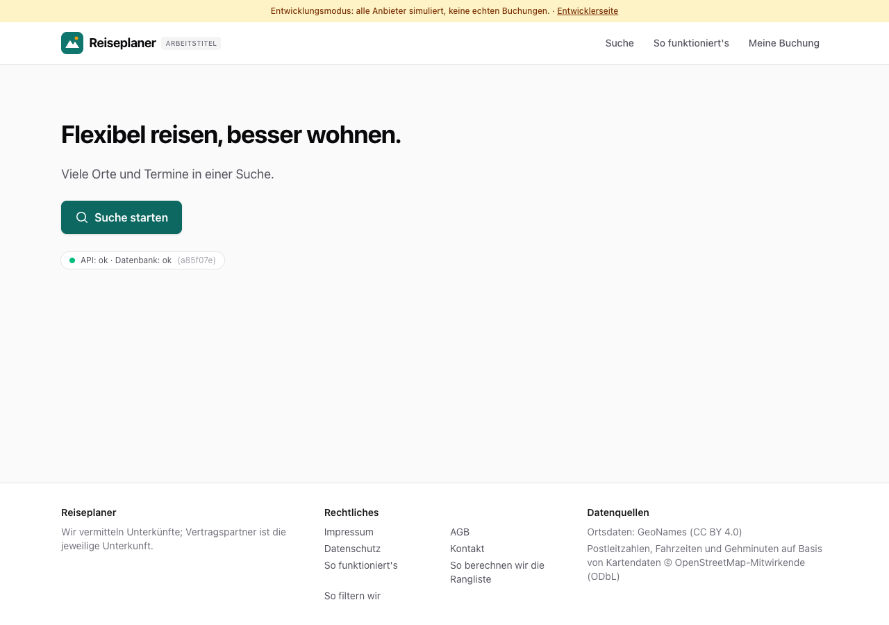
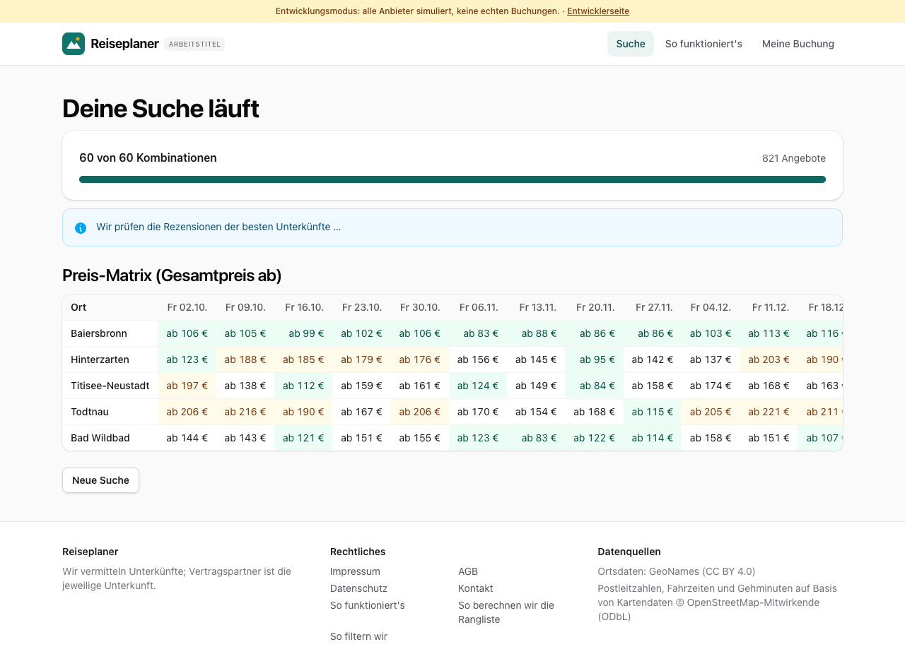
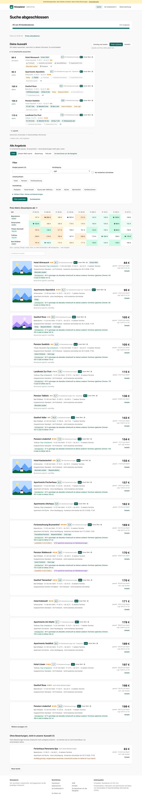
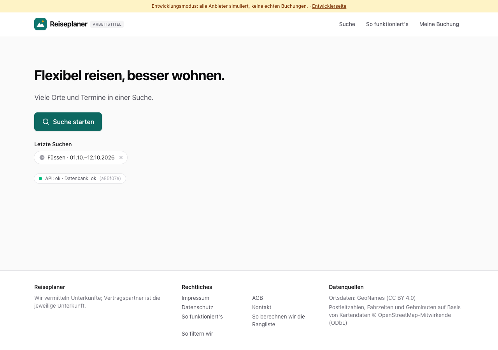
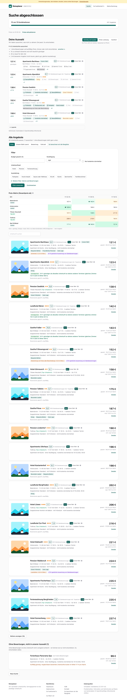

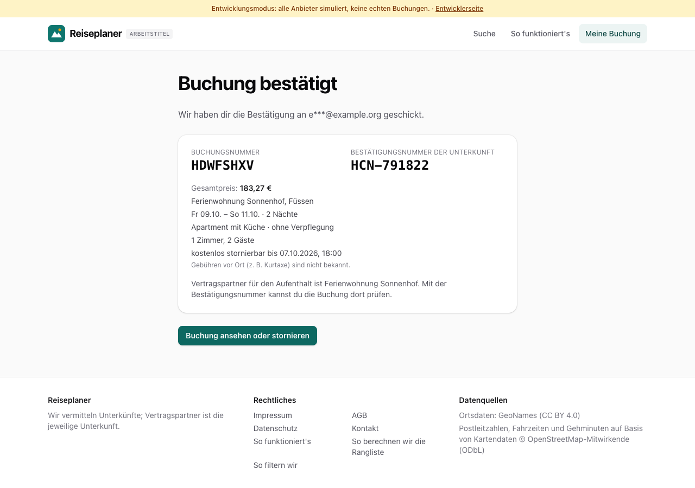
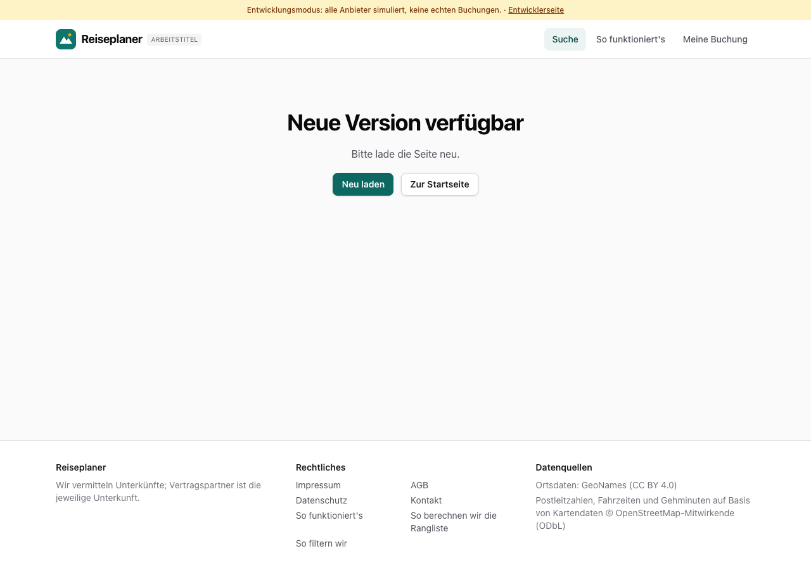

# Dogfood-Walkthrough 2026-10-01T03-36-55-P-all

- Modus: P – Pfad (Nutzerablauf mit Eingaben)
- Flows: startseite, suchrahmen, orte, naechte, zimmer, bewertung, attraktivitaet, filter, bilder, ausstattung, karte, suche, ergebnisse, listenfilter, suchverlauf, finale, warnungen, buchung, fehler, entwickler, langsam
- Basis-URL: http://localhost:57118 (echter lokaler Stack, Anbieter im Fake-Modus)
- Stand: a85f07e, gestartet 2026-10-01T03:36:55.380Z
- Ergebnis: ✅ bestanden (410/410 Prüfungen erfüllt)

## Flow „startseite“

Startseite mit einem Button „Suche starten“; auf der Suchseite „Wohin soll es gehen?“ oben (Vorschläge ab Startort und/oder eigene Orte), darunter verbunden die Leiste mit Kalender (zwei Klicks: Anreise, dann Abreise) und Reisenden im Aufklappfeld.

### 01 Startseite: nur ein Button, keine Eingabefelder

- URL: `/`
- Screenshot: 
- Prüfungen:
  - [x] enthält „Suche starten“
  - [x] enthält „Flexibel reisen, besser wohnen.“
  - [x] enthält nicht „Anreise frühestens“
  - [x] enthält nicht „Fahrzeit (Auto)“
  - [x] Element `[data-testid="hero-search"]` vorhanden (1)
- Überschriften: „Flexibel reisen, besser wohnen.“
- KI-Kennzeichnungen (`data-ai-provenance`): keine
- Konsolenfehler: keine
- Fehlgeschlagene Anfragen: keine

<details><summary>Sichtbarer Text</summary>

```text
Entwicklungsmodus: alle Anbieter simuliert, keine echten Buchungen. · Entwicklerseite
Reiseplaner
ARBEITSTITEL
Suche
So funktioniert's
Meine Buchung
Flexibel reisen, besser wohnen.

Viele Orte und Termine in einer Suche.

Suche starten

API: ok · Datenbank: ok
(a85f07e)

Reiseplaner

Wir vermitteln Unterkünfte; Vertragspartner ist die jeweilige Unterkunft.

Rechtliches

Impressum
AGB
Datenschutz
Kontakt
So funktioniert's
So berechnen wir die Rangliste
So filtern wir

Datenquellen

Ortsdaten: GeoNames (CC BY 4.0)
Postleitzahlen, Fahrzeiten und Gehminuten auf Basis von Kartendaten © OpenStreetMap-Mitwirkende (ODbL)
```

</details>

### 02 Klick auf „Suche starten“: oben „Wohin soll es gehen?“, darunter verbunden Datum und Reisende

- URL: `/suche`
- Screenshot: 
- Prüfungen:
  - [x] enthält „Wohin soll es gehen?“
  - [x] enthält „Orte vorschlagen lassen“
  - [x] enthält „Orte selbst wählen“
  - [x] enthält „Startort“
  - [x] enthält „Fahrzeit (Auto)“
  - [x] enthält „Wann und mit wem?“
  - [x] enthält „Anreise frühestens“
  - [x] enthält „Abreise spätestens“
  - [x] enthält „2 Erwachsene · 1 Zimmer“
  - [x] Element `[data-testid="where"] [data-testid="search-bar"]` vorhanden (1)
  - [x] Element `[data-testid="way-suggest"] [data-testid="origin-fields"]` vorhanden (1)
- Überschriften: „Deine Suche“, „Wohin soll es gehen?“
- KI-Kennzeichnungen (`data-ai-provenance`): „Deine Eingabe wird per KI in Auswahl-Chips übersetzt. Bitte prüfe die Auswahl. [ai_assisted]“
- Konsolenfehler: keine
- Fehlgeschlagene Anfragen: keine

<details><summary>Sichtbarer Text</summary>

```text
Entwicklungsmodus: alle Anbieter simuliert, keine echten Buchungen. · Entwicklerseite
Reiseplaner
ARBEITSTITEL
Suche
So funktioniert's
Meine Buchung

Schritt 1 von 3

Deine Suche
1
Suchrahmen
→
2
Regionen
→
3
Orte
Wohin soll es gehen?
Orte vorschlagen lassen
Passend zu Startort, Fahrzeit und Reiseart.
Startort
Fahrzeit (Auto)
egal
bis 1 Stunde
bis 1 h 30 min
bis 2 Stunden
bis 2 h 30 min
bis 3 Stunden
bis 4 Stunden
bis 5 Stunden
bis 6 Stunden

Deutschland, Österreich, Schweiz und Südtirol

Orte selbst wählen
Mehrere möglich, zusätzlich zu den Vorschlägen.

Wann und mit wem?

Anreise frühestens
Do, 08.10.2026
Abreise spätestens
Do, 19.11.2026
Reisende
2 Erwachsene · 1 Zimmer
Wie lange und ab welchem Wochentag?
Nächte
1
2
3
4
5
6
7
8
9
10
11
12
13
14
bis
2
3
4
5
6
7
8
9
10
11
12
13
14
Anreise an diesen Wochentagen
Mo
Di
Mi
Do
Fr
Sa
So
Daraus entstehen 6 Termine: 09.10., 16.10., 23.10., 30.10. …
Reiseart
Wandern
Bergpanorama
Seen
Natur und Ruhe
Radfahren
Wellness
Wintersport
Städte und Kultur
Wein und Kulinarik
Familie
Budget gesamt in € (optional)

Worauf legst du Wert?

Günstig und sauber
Preis-Leistung
Komfort

Qualität und Preis zählen gleich viel.

Wünsche an die Unterkunft
Besonders sauber
Ruhig
Mit Frühstück
Kostenlos stornierbar
Parkplatz
Hund erlaubt
Sauna oder Wellness
WLAN
Küche
Barrierefrei
Familienzimmer
Weitere Wünsche in eigenen Worten (optional)
Deine Eingabe wird per KI in Auswahl-Chips übersetzt. Bitte prüfe die Auswahl.
In Chips übersetzen
0/300
Weiter zu den Regionen

Reiseplaner

Wir vermitteln Unterkünfte; Vertragspartner ist die jeweilige Unterkunft.

Rechtliches

Impressum
AGB
Datenschutz
Kontakt
So funktioniert's
So berechnen wir die Rangliste
So filtern wir

Datenquellen

Ortsdaten: GeoNames (CC BY 4.0)
Postleitzahlen, Fahrzeiten und Gehminuten auf
… (57 weitere Zeichen)
```

</details>

### 03 Startort „Stutt“ → Stuttgart

- URL: `/suche`
- Screenshot: 
- Prüfungen:
  - [x] Element `[data-origin="2825297"]` vorhanden (1)
- Überschriften: „Deine Suche“, „Wohin soll es gehen?“
- KI-Kennzeichnungen (`data-ai-provenance`): „Deine Eingabe wird per KI in Auswahl-Chips übersetzt. Bitte prüfe die Auswahl. [ai_assisted]“
- Konsolenfehler: keine
- Fehlgeschlagene Anfragen: keine

<details><summary>Sichtbarer Text</summary>

```text
Entwicklungsmodus: alle Anbieter simuliert, keine echten Buchungen. · Entwicklerseite
Reiseplaner
ARBEITSTITEL
Suche
So funktioniert's
Meine Buchung

Schritt 1 von 3

Deine Suche
1
Suchrahmen
→
2
Regionen
→
3
Orte
Wohin soll es gehen?
Orte vorschlagen lassen
Passend zu Startort, Fahrzeit und Reiseart.
Startort
Fahrzeit (Auto)
egal
bis 1 Stunde
bis 1 h 30 min
bis 2 Stunden
bis 2 h 30 min
bis 3 Stunden
bis 4 Stunden
bis 5 Stunden
bis 6 Stunden

Deutschland, Österreich, Schweiz und Südtirol

Orte selbst wählen
Mehrere möglich, zusätzlich zu den Vorschlägen.

Wann und mit wem?

Anreise frühestens
Do, 08.10.2026
Abreise spätestens
Do, 19.11.2026
Reisende
2 Erwachsene · 1 Zimmer
Wie lange und ab welchem Wochentag?
Nächte
1
2
3
4
5
6
7
8
9
10
11
12
13
14
bis
2
3
4
5
6
7
8
9
10
11
12
13
14
Anreise an diesen Wochentagen
Mo
Di
Mi
Do
Fr
Sa
So
Daraus entstehen 6 Termine: 09.10., 16.10., 23.10., 30.10. …
Reiseart
Wandern
Bergpanorama
Seen
Natur und Ruhe
Radfahren
Wellness
Wintersport
Städte und Kultur
Wein und Kulinarik
Familie
Budget gesamt in € (optional)

Worauf legst du Wert?

Günstig und sauber
Preis-Leistung
Komfort

Qualität und Preis zählen gleich viel.

Wünsche an die Unterkunft
Besonders sauber
Ruhig
Mit Frühstück
Kostenlos stornierbar
Parkplatz
Hund erlaubt
Sauna oder Wellness
WLAN
Küche
Barrierefrei
Familienzimmer
Weitere Wünsche in eigenen Worten (optional)
Deine Eingabe wird per KI in Auswahl-Chips übersetzt. Bitte prüfe die Auswahl.
In Chips übersetzen
0/300
Weiter zu den Regionen

Reiseplaner

Wir vermitteln Unterkünfte; Vertragspartner ist die jeweilige Unterkunft.

Rechtliches

Impressum
AGB
Datenschutz
Kontakt
So funktioniert's
So berechnen wir die Rangliste
So filtern wir

Datenquellen

Ortsdaten: GeoNames (CC BY 4.0)
Postleitzahlen, Fahrzeiten und Gehminuten auf
… (57 weitere Zeichen)
```

</details>

### 04 Klick auf Anreise öffnet den Kalender mit zwei Monaten

- URL: `/suche`
- Screenshot: 
- Prüfungen:
  - [x] enthält „Wann kannst du frühestens anreisen?“
  - [x] enthält „Oktober 2026“
  - [x] Element `#window-start[aria-expanded="true"]` vorhanden (1)
- Überschriften: „Deine Suche“, „Wohin soll es gehen?“
- KI-Kennzeichnungen (`data-ai-provenance`): „Deine Eingabe wird per KI in Auswahl-Chips übersetzt. Bitte prüfe die Auswahl. [ai_assisted]“
- Konsolenfehler: keine
- Fehlgeschlagene Anfragen: keine

<details><summary>Sichtbarer Text</summary>

```text
Entwicklungsmodus: alle Anbieter simuliert, keine echten Buchungen. · Entwicklerseite
Reiseplaner
ARBEITSTITEL
Suche
So funktioniert's
Meine Buchung

Schritt 1 von 3

Deine Suche
1
Suchrahmen
→
2
Regionen
→
3
Orte
Wohin soll es gehen?
Orte vorschlagen lassen
Passend zu Startort, Fahrzeit und Reiseart.
Startort
Fahrzeit (Auto)
egal
bis 1 Stunde
bis 1 h 30 min
bis 2 Stunden
bis 2 h 30 min
bis 3 Stunden
bis 4 Stunden
bis 5 Stunden
bis 6 Stunden

Deutschland, Österreich, Schweiz und Südtirol

Orte selbst wählen
Mehrere möglich, zusätzlich zu den Vorschlägen.

Wann und mit wem?

Anreise frühestens
Do, 08.10.2026
Abreise spätestens
Do, 19.11.2026

Wann kannst du frühestens anreisen?

Oktober 2026

Mo
Di
Mi
Do
Fr
Sa
So
1
2
3
4
5
6
7
8
9
10
11
12
13
14
15
16
17
18
19
20
21
22
23
24
25
26
27
28
29
30
31

November 2026

Mo
Di
Mi
Do
Fr
Sa
So
1
2
3
4
5
6
7
8
9
10
11
12
13
14
15
16
17
18
19
20
21
22
23
24
25
26
27
28
29
30

42 Tage Zeitraum

Reisende
2 Erwachsene · 1 Zimmer
Wie lange und ab welchem Wochentag?
Nächte
1
2
3
4
5
6
7
8
9
10
11
12
13
14
bis
2
3
4
5
6
7
8
9
10
11
12
13
14
Anreise an diesen Wochentagen
Mo
Di
Mi
Do
Fr
Sa
So
Daraus entstehen 6 Termine: 09.10., 16.10., 23.10., 30.10. …
Reiseart
Wandern
Bergpanorama
Seen
Natur und Ruhe
Radfahren
Wellness
Wintersport
Städte und Kultur
Wein und Kulinarik
Familie
Budget gesamt in € (optional)

Worauf legst du Wert?

Günstig und sauber
Preis-Leistung
Komfort

Qualität und Preis zählen gleich viel.

Wünsche an die Unterkunft
Besonders sauber
Ruhig
Mit Frühstück
Kostenlos stornierbar
Parkplatz
Hund erlaubt
Sauna oder Wellness
WLAN
Küche
Barrierefrei
Familienzimmer
Weitere Wünsche in eigenen Worten (optional)
Deine Eingabe wird per KI in Auswahl-Chips übersetzt. Bitte prüfe die Auswahl.
In Chips übersetzen
0/300
Weiter zu den Regione
… (351 weitere Zeichen)
```

</details>

### 05 Erster Klick: Anreise 02.10. – der Kalender springt auf die Abreise

- URL: `/suche`
- Screenshot: 
- Prüfungen:
  - [x] enthält „Und wann musst du spätestens zurück sein?“
  - [x] enthält „Fr, 02.10.2026“
  - [x] enthält „23 Tage Zeitraum“
  - [x] Element `#window-end[aria-expanded="true"]` vorhanden (1)
- Überschriften: „Deine Suche“, „Wohin soll es gehen?“
- KI-Kennzeichnungen (`data-ai-provenance`): „Deine Eingabe wird per KI in Auswahl-Chips übersetzt. Bitte prüfe die Auswahl. [ai_assisted]“
- Konsolenfehler: keine
- Fehlgeschlagene Anfragen: keine

<details><summary>Sichtbarer Text</summary>

```text
Entwicklungsmodus: alle Anbieter simuliert, keine echten Buchungen. · Entwicklerseite
Reiseplaner
ARBEITSTITEL
Suche
So funktioniert's
Meine Buchung

Schritt 1 von 3

Deine Suche
1
Suchrahmen
→
2
Regionen
→
3
Orte
Wohin soll es gehen?
Orte vorschlagen lassen
Passend zu Startort, Fahrzeit und Reiseart.
Startort
Fahrzeit (Auto)
egal
bis 1 Stunde
bis 1 h 30 min
bis 2 Stunden
bis 2 h 30 min
bis 3 Stunden
bis 4 Stunden
bis 5 Stunden
bis 6 Stunden

Deutschland, Österreich, Schweiz und Südtirol

Orte selbst wählen
Mehrere möglich, zusätzlich zu den Vorschlägen.

Wann und mit wem?

Anreise frühestens
Fr, 02.10.2026
Abreise spätestens
Datum wählen

Und wann musst du spätestens zurück sein?

Oktober 2026

Mo
Di
Mi
Do
Fr
Sa
So
1
2
3
4
5
6
7
8
9
10
11
12
13
14
15
16
17
18
19
20
21
22
23
24
25
26
27
28
29
30
31

November 2026

Mo
Di
Mi
Do
Fr
Sa
So
1
2
3
4
5
6
7
8
9
10
11
12
13
14
15
16
17
18
19
20
21
22
23
24
25
26
27
28
29
30

23 Tage Zeitraum

Reisende
2 Erwachsene · 1 Zimmer
Wie lange und ab welchem Wochentag?
Nächte
1
2
3
4
5
6
7
8
9
10
11
12
13
14
bis
2
3
4
5
6
7
8
9
10
11
12
13
14
Anreise an diesen Wochentagen
Mo
Di
Mi
Do
Fr
Sa
So
Daraus entstehen 6 Termine: 09.10., 16.10., 23.10., 30.10. …
Reiseart
Wandern
Bergpanorama
Seen
Natur und Ruhe
Radfahren
Wellness
Wintersport
Städte und Kultur
Wein und Kulinarik
Familie
Budget gesamt in € (optional)

Worauf legst du Wert?

Günstig und sauber
Preis-Leistung
Komfort

Qualität und Preis zählen gleich viel.

Wünsche an die Unterkunft
Besonders sauber
Ruhig
Mit Frühstück
Kostenlos stornierbar
Parkplatz
Hund erlaubt
Sauna oder Wellness
WLAN
Küche
Barrierefrei
Familienzimmer
Weitere Wünsche in eigenen Worten (optional)
Deine Eingabe wird per KI in Auswahl-Chips übersetzt. Bitte prüfe die Auswahl.
In Chips übersetzen
0/300
Weiter zu den Reg
… (355 weitere Zeichen)
```

</details>

### 06 Zweiter Klick: Abreise 25.10. – der Kalender schließt sich

- URL: `/suche`
- Screenshot: 
- Prüfungen:
  - [x] enthält „Fr, 02.10.2026“
  - [x] enthält „So, 25.10.2026“
  - [x] Element `#window-end[data-value="2026-10-25"]` vorhanden (1)
- Überschriften: „Deine Suche“, „Wohin soll es gehen?“
- KI-Kennzeichnungen (`data-ai-provenance`): „Deine Eingabe wird per KI in Auswahl-Chips übersetzt. Bitte prüfe die Auswahl. [ai_assisted]“
- Konsolenfehler: keine
- Fehlgeschlagene Anfragen: keine

<details><summary>Sichtbarer Text</summary>

```text
Entwicklungsmodus: alle Anbieter simuliert, keine echten Buchungen. · Entwicklerseite
Reiseplaner
ARBEITSTITEL
Suche
So funktioniert's
Meine Buchung

Schritt 1 von 3

Deine Suche
1
Suchrahmen
→
2
Regionen
→
3
Orte
Wohin soll es gehen?
Orte vorschlagen lassen
Passend zu Startort, Fahrzeit und Reiseart.
Startort
Fahrzeit (Auto)
egal
bis 1 Stunde
bis 1 h 30 min
bis 2 Stunden
bis 2 h 30 min
bis 3 Stunden
bis 4 Stunden
bis 5 Stunden
bis 6 Stunden

Deutschland, Österreich, Schweiz und Südtirol

Orte selbst wählen
Mehrere möglich, zusätzlich zu den Vorschlägen.

Wann und mit wem?

Anreise frühestens
Fr, 02.10.2026
Abreise spätestens
So, 25.10.2026
Reisende
2 Erwachsene · 1 Zimmer
Wie lange und ab welchem Wochentag?
Nächte
1
2
3
4
5
6
7
8
9
10
11
12
13
14
bis
2
3
4
5
6
7
8
9
10
11
12
13
14
Anreise an diesen Wochentagen
Mo
Di
Mi
Do
Fr
Sa
So
Daraus entstehen 4 Termine: 02.10., 09.10., 16.10., 23.10.
Reiseart
Wandern
Bergpanorama
Seen
Natur und Ruhe
Radfahren
Wellness
Wintersport
Städte und Kultur
Wein und Kulinarik
Familie
Budget gesamt in € (optional)

Worauf legst du Wert?

Günstig und sauber
Preis-Leistung
Komfort

Qualität und Preis zählen gleich viel.

Wünsche an die Unterkunft
Besonders sauber
Ruhig
Mit Frühstück
Kostenlos stornierbar
Parkplatz
Hund erlaubt
Sauna oder Wellness
WLAN
Küche
Barrierefrei
Familienzimmer
Weitere Wünsche in eigenen Worten (optional)
Deine Eingabe wird per KI in Auswahl-Chips übersetzt. Bitte prüfe die Auswahl.
In Chips übersetzen
0/300
Weiter zu den Regionen

Reiseplaner

Wir vermitteln Unterkünfte; Vertragspartner ist die jeweilige Unterkunft.

Rechtliches

Impressum
AGB
Datenschutz
Kontakt
So funktioniert's
So berechnen wir die Rangliste
So filtern wir

Datenquellen

Ortsdaten: GeoNames (CC BY 4.0)
Postleitzahlen, Fahrzeiten und Gehminuten auf B
… (55 weitere Zeichen)
```

</details>

### 07 Reisende: 1 Kind dazu

- URL: `/suche`
- Screenshot: 
- Prüfungen:
  - [x] enthält „2 Erwachsene · 1 Kind · 1 Zimmer“
  - [x] enthält „Alter Kind 1“
  - [x] enthält „Fertig“
- Überschriften: „Deine Suche“, „Wohin soll es gehen?“
- KI-Kennzeichnungen (`data-ai-provenance`): „Deine Eingabe wird per KI in Auswahl-Chips übersetzt. Bitte prüfe die Auswahl. [ai_assisted]“
- Konsolenfehler: keine
- Fehlgeschlagene Anfragen: keine

<details><summary>Sichtbarer Text</summary>

```text
Entwicklungsmodus: alle Anbieter simuliert, keine echten Buchungen. · Entwicklerseite
Reiseplaner
ARBEITSTITEL
Suche
So funktioniert's
Meine Buchung

Schritt 1 von 3

Deine Suche
1
Suchrahmen
→
2
Regionen
→
3
Orte
Wohin soll es gehen?
Orte vorschlagen lassen
Passend zu Startort, Fahrzeit und Reiseart.
Startort
Fahrzeit (Auto)
egal
bis 1 Stunde
bis 1 h 30 min
bis 2 Stunden
bis 2 h 30 min
bis 3 Stunden
bis 4 Stunden
bis 5 Stunden
bis 6 Stunden

Deutschland, Österreich, Schweiz und Südtirol

Orte selbst wählen
Mehrere möglich, zusätzlich zu den Vorschlägen.

Wann und mit wem?

Anreise frühestens
Fr, 02.10.2026
Abreise spätestens
So, 25.10.2026
Reisende
2 Erwachsene · 1 Kind · 1 Zimmer
Erwachsene
2
Kinder
1
Alter Kind 1
0 Jahre
1 Jahr
2 Jahre
3 Jahre
4 Jahre
5 Jahre
6 Jahre
7 Jahre
8 Jahre
9 Jahre
10 Jahre
11 Jahre
12 Jahre
13 Jahre
14 Jahre
15 Jahre
16 Jahre
17 Jahre
Zimmer
1
Fertig
Wie lange und ab welchem Wochentag?
Nächte
1
2
3
4
5
6
7
8
9
10
11
12
13
14
bis
2
3
4
5
6
7
8
9
10
11
12
13
14
Anreise an diesen Wochentagen
Mo
Di
Mi
Do
Fr
Sa
So
Daraus entstehen 4 Termine: 02.10., 09.10., 16.10., 23.10.
Reiseart
Wandern
Bergpanorama
Seen
Natur und Ruhe
Radfahren
Wellness
Wintersport
Städte und Kultur
Wein und Kulinarik
Familie
Budget gesamt in € (optional)

Worauf legst du Wert?

Günstig und sauber
Preis-Leistung
Komfort

Qualität und Preis zählen gleich viel.

Wünsche an die Unterkunft
Besonders sauber
Ruhig
Mit Frühstück
Kostenlos stornierbar
Parkplatz
Hund erlaubt
Sauna oder Wellness
WLAN
Küche
Barrierefrei
Familienzimmer
Weitere Wünsche in eigenen Worten (optional)
Deine Eingabe wird per KI in Auswahl-Chips übersetzt. Bitte prüfe die Auswahl.
In Chips übersetzen
0/300
Weiter zu den Regionen

Reiseplaner

Wir vermitteln Unterkünfte; Vertragspartner ist die jeweilige Unterku
… (266 weitere Zeichen)
```

</details>

### 08 Terminvorschau und Startort passen zu den Angaben

- URL: `/suche`
- Screenshot: 
- Prüfungen:
  - [x] enthält „Schritt 1 von 3“
  - [x] enthält „Fr, 02.10.2026“
  - [x] enthält „So, 25.10.2026“
  - [x] enthält „2 Erwachsene · 1 Kind · 1 Zimmer“
  - [x] enthält „Daraus entstehen 4 Termine“
  - [x] Element `[data-origin="2825297"]` vorhanden (1)
- Überschriften: „Deine Suche“, „Wohin soll es gehen?“
- KI-Kennzeichnungen (`data-ai-provenance`): „Deine Eingabe wird per KI in Auswahl-Chips übersetzt. Bitte prüfe die Auswahl. [ai_assisted]“
- Konsolenfehler: keine
- Fehlgeschlagene Anfragen: keine

<details><summary>Sichtbarer Text</summary>

```text
Entwicklungsmodus: alle Anbieter simuliert, keine echten Buchungen. · Entwicklerseite
Reiseplaner
ARBEITSTITEL
Suche
So funktioniert's
Meine Buchung

Schritt 1 von 3

Deine Suche
1
Suchrahmen
→
2
Regionen
→
3
Orte
Wohin soll es gehen?
Orte vorschlagen lassen
Passend zu Startort, Fahrzeit und Reiseart.
Startort
Fahrzeit (Auto)
egal
bis 1 Stunde
bis 1 h 30 min
bis 2 Stunden
bis 2 h 30 min
bis 3 Stunden
bis 4 Stunden
bis 5 Stunden
bis 6 Stunden

Deutschland, Österreich, Schweiz und Südtirol

Orte selbst wählen
Mehrere möglich, zusätzlich zu den Vorschlägen.

Wann und mit wem?

Anreise frühestens
Fr, 02.10.2026
Abreise spätestens
So, 25.10.2026
Reisende
2 Erwachsene · 1 Kind · 1 Zimmer
Wie lange und ab welchem Wochentag?
Nächte
1
2
3
4
5
6
7
8
9
10
11
12
13
14
bis
2
3
4
5
6
7
8
9
10
11
12
13
14
Anreise an diesen Wochentagen
Mo
Di
Mi
Do
Fr
Sa
So
Daraus entstehen 4 Termine: 02.10., 09.10., 16.10., 23.10.
Reiseart
Wandern
Bergpanorama
Seen
Natur und Ruhe
Radfahren
Wellness
Wintersport
Städte und Kultur
Wein und Kulinarik
Familie
Budget gesamt in € (optional)

Worauf legst du Wert?

Günstig und sauber
Preis-Leistung
Komfort

Qualität und Preis zählen gleich viel.

Wünsche an die Unterkunft
Besonders sauber
Ruhig
Mit Frühstück
Kostenlos stornierbar
Parkplatz
Hund erlaubt
Sauna oder Wellness
WLAN
Küche
Barrierefrei
Familienzimmer
Weitere Wünsche in eigenen Worten (optional)
Deine Eingabe wird per KI in Auswahl-Chips übersetzt. Bitte prüfe die Auswahl.
In Chips übersetzen
0/300
Weiter zu den Regionen

Reiseplaner

Wir vermitteln Unterkünfte; Vertragspartner ist die jeweilige Unterkunft.

Rechtliches

Impressum
AGB
Datenschutz
Kontakt
So funktioniert's
So berechnen wir die Rangliste
So filtern wir

Datenquellen

Ortsdaten: GeoNames (CC BY 4.0)
Postleitzahlen, Fahrzeiten und Gehminu
… (64 weitere Zeichen)
```

</details>

### 09 Handy (390 px): Kalender mit einem Monat

- URL: `/suche`
- Screenshot: 
- Prüfungen:
  - [x] enthält „Wann kannst du frühestens anreisen?“
- Überschriften: „Deine Suche“, „Wohin soll es gehen?“
- KI-Kennzeichnungen (`data-ai-provenance`): „Deine Eingabe wird per KI in Auswahl-Chips übersetzt. Bitte prüfe die Auswahl. [ai_assisted]“
- Konsolenfehler: keine
- Fehlgeschlagene Anfragen: keine

<details><summary>Sichtbarer Text</summary>

```text
Entwicklungsmodus: alle Anbieter simuliert, keine echten Buchungen. · Entwicklerseite
Reiseplaner
Suche
Meine Buchung

Schritt 1 von 3

Deine Suche
1
Suchrahmen
→
2
Regionen
→
3
Orte
Wohin soll es gehen?
Orte vorschlagen lassen
Passend zu Startort, Fahrzeit und Reiseart.
Startort
Fahrzeit (Auto)
egal
bis 1 Stunde
bis 1 h 30 min
bis 2 Stunden
bis 2 h 30 min
bis 3 Stunden
bis 4 Stunden
bis 5 Stunden
bis 6 Stunden

Deutschland, Österreich, Schweiz und Südtirol

Orte selbst wählen
Mehrere möglich, zusätzlich zu den Vorschlägen.

Wann und mit wem?

Anreise frühestens
Fr, 02.10.2026
Abreise spätestens
So, 25.10.2026

Wann kannst du frühestens anreisen?

Oktober 2026

Mo
Di
Mi
Do
Fr
Sa
So
1
2
3
4
5
6
7
8
9
10
11
12
13
14
15
16
17
18
19
20
21
22
23
24
25
26
27
28
29
30
31

23 Tage Zeitraum

Reisende
2 Erwachsene · 1 Kind · 1 Zimmer
Wie lange und ab welchem Wochentag?
Nächte
1
2
3
4
5
6
7
8
9
10
11
12
13
14
bis
2
3
4
5
6
7
8
9
10
11
12
13
14
Anreise an diesen Wochentagen
Mo
Di
Mi
Do
Fr
Sa
So
Daraus entstehen 4 Termine: 02.10., 09.10., 16.10., 23.10.
Reiseart
Wandern
Bergpanorama
Seen
Natur und Ruhe
Radfahren
Wellness
Wintersport
Städte und Kultur
Wein und Kulinarik
Familie
Budget gesamt in € (optional)

Worauf legst du Wert?

Günstig und sauber
Preis-Leistung
Komfort

Qualität und Preis zählen gleich viel.

Wünsche an die Unterkunft
Besonders sauber
Ruhig
Mit Frühstück
Kostenlos stornierbar
Parkplatz
Hund erlaubt
Sauna oder Wellness
WLAN
Küche
Barrierefrei
Familienzimmer
Weitere Wünsche in eigenen Worten (optional)
Deine Eingabe wird per KI in Auswahl-Chips übersetzt. Bitte prüfe die Auswahl.
In Chips übersetzen
0/300
Weiter zu den Regionen

Reiseplaner

Wir vermitteln Unterkünfte; Vertragspartner ist die jeweilige Unterkunft.

Rechtliches

Impressum
AGB
Datenschutz
Kontakt
So f
… (209 weitere Zeichen)
```

</details>

## Flow „suchrahmen“

Assistent Schritt 1 bis 3 (F1–F3): Startort per Autovervollständigung, Zeitfenster mit Live-Terminanzahl, Freitext per KI in Chips, Regionsvorschläge mit Begründung, Ortsliste mit Fahrzeiten, eigener Ort, Bestätigung.

### 10 Suchrahmen öffnen

- URL: `/suche`
- Screenshot: 
- Prüfungen:
  - [x] enthält „Schritt“
  - [x] enthält „Suchrahmen“
  - [x] enthält „Regionen“
  - [x] enthält „Orte“
  - [x] enthält „Startort“
  - [x] enthält „Reiseart“
  - [x] enthält „Anreise frühestens“
  - [x] enthält „Abreise spätestens“
- Überschriften: „Deine Suche“, „Wohin soll es gehen?“
- KI-Kennzeichnungen (`data-ai-provenance`): „Deine Eingabe wird per KI in Auswahl-Chips übersetzt. Bitte prüfe die Auswahl. [ai_assisted]“
- Konsolenfehler: keine
- Fehlgeschlagene Anfragen: keine

<details><summary>Sichtbarer Text</summary>

```text
Entwicklungsmodus: alle Anbieter simuliert, keine echten Buchungen. · Entwicklerseite
Reiseplaner
ARBEITSTITEL
Suche
So funktioniert's
Meine Buchung

Schritt 1 von 3

Deine Suche
1
Suchrahmen
→
2
Regionen
→
3
Orte
Wohin soll es gehen?
Orte vorschlagen lassen
Passend zu Startort, Fahrzeit und Reiseart.
Startort
Fahrzeit (Auto)
egal
bis 1 Stunde
bis 1 h 30 min
bis 2 Stunden
bis 2 h 30 min
bis 3 Stunden
bis 4 Stunden
bis 5 Stunden
bis 6 Stunden

Deutschland, Österreich, Schweiz und Südtirol

Orte selbst wählen
Mehrere möglich, zusätzlich zu den Vorschlägen.

Wann und mit wem?

Anreise frühestens
Do, 08.10.2026
Abreise spätestens
Do, 19.11.2026
Reisende
2 Erwachsene · 1 Zimmer
Wie lange und ab welchem Wochentag?
Nächte
1
2
3
4
5
6
7
8
9
10
11
12
13
14
bis
2
3
4
5
6
7
8
9
10
11
12
13
14
Anreise an diesen Wochentagen
Mo
Di
Mi
Do
Fr
Sa
So
Daraus entstehen 6 Termine: 09.10., 16.10., 23.10., 30.10. …
Reiseart
Wandern
Bergpanorama
Seen
Natur und Ruhe
Radfahren
Wellness
Wintersport
Städte und Kultur
Wein und Kulinarik
Familie
Budget gesamt in € (optional)

Worauf legst du Wert?

Günstig und sauber
Preis-Leistung
Komfort

Qualität und Preis zählen gleich viel.

Wünsche an die Unterkunft
Besonders sauber
Ruhig
Mit Frühstück
Kostenlos stornierbar
Parkplatz
Hund erlaubt
Sauna oder Wellness
WLAN
Küche
Barrierefrei
Familienzimmer
Weitere Wünsche in eigenen Worten (optional)
Deine Eingabe wird per KI in Auswahl-Chips übersetzt. Bitte prüfe die Auswahl.
In Chips übersetzen
0/300
Weiter zu den Regionen

Reiseplaner

Wir vermitteln Unterkünfte; Vertragspartner ist die jeweilige Unterkunft.

Rechtliches

Impressum
AGB
Datenschutz
Kontakt
So funktioniert's
So berechnen wir die Rangliste
So filtern wir

Datenquellen

Ortsdaten: GeoNames (CC BY 4.0)
Postleitzahlen, Fahrzeiten und Gehminuten auf
… (57 weitere Zeichen)
```

</details>

### 11 Startort „Stutt“ → Stuttgart

- URL: `/suche`
- Screenshot: 
- Prüfungen:
  - [x] Element `[data-origin="2825297"]` vorhanden (1)
- Überschriften: „Deine Suche“, „Wohin soll es gehen?“
- KI-Kennzeichnungen (`data-ai-provenance`): „Deine Eingabe wird per KI in Auswahl-Chips übersetzt. Bitte prüfe die Auswahl. [ai_assisted]“
- Konsolenfehler: keine
- Fehlgeschlagene Anfragen: keine

<details><summary>Sichtbarer Text</summary>

```text
Entwicklungsmodus: alle Anbieter simuliert, keine echten Buchungen. · Entwicklerseite
Reiseplaner
ARBEITSTITEL
Suche
So funktioniert's
Meine Buchung

Schritt 1 von 3

Deine Suche
1
Suchrahmen
→
2
Regionen
→
3
Orte
Wohin soll es gehen?
Orte vorschlagen lassen
Passend zu Startort, Fahrzeit und Reiseart.
Startort
Fahrzeit (Auto)
egal
bis 1 Stunde
bis 1 h 30 min
bis 2 Stunden
bis 2 h 30 min
bis 3 Stunden
bis 4 Stunden
bis 5 Stunden
bis 6 Stunden

Deutschland, Österreich, Schweiz und Südtirol

Orte selbst wählen
Mehrere möglich, zusätzlich zu den Vorschlägen.

Wann und mit wem?

Anreise frühestens
Do, 08.10.2026
Abreise spätestens
Do, 19.11.2026
Reisende
2 Erwachsene · 1 Zimmer
Wie lange und ab welchem Wochentag?
Nächte
1
2
3
4
5
6
7
8
9
10
11
12
13
14
bis
2
3
4
5
6
7
8
9
10
11
12
13
14
Anreise an diesen Wochentagen
Mo
Di
Mi
Do
Fr
Sa
So
Daraus entstehen 6 Termine: 09.10., 16.10., 23.10., 30.10. …
Reiseart
Wandern
Bergpanorama
Seen
Natur und Ruhe
Radfahren
Wellness
Wintersport
Städte und Kultur
Wein und Kulinarik
Familie
Budget gesamt in € (optional)

Worauf legst du Wert?

Günstig und sauber
Preis-Leistung
Komfort

Qualität und Preis zählen gleich viel.

Wünsche an die Unterkunft
Besonders sauber
Ruhig
Mit Frühstück
Kostenlos stornierbar
Parkplatz
Hund erlaubt
Sauna oder Wellness
WLAN
Küche
Barrierefrei
Familienzimmer
Weitere Wünsche in eigenen Worten (optional)
Deine Eingabe wird per KI in Auswahl-Chips übersetzt. Bitte prüfe die Auswahl.
In Chips übersetzen
0/300
Weiter zu den Regionen

Reiseplaner

Wir vermitteln Unterkünfte; Vertragspartner ist die jeweilige Unterkunft.

Rechtliches

Impressum
AGB
Datenschutz
Kontakt
So funktioniert's
So berechnen wir die Rangliste
So filtern wir

Datenquellen

Ortsdaten: GeoNames (CC BY 4.0)
Postleitzahlen, Fahrzeiten und Gehminuten auf
… (57 weitere Zeichen)
```

</details>

### 12 Zeitfenster 01.10.–30.11.2026, 2 Nächte, Anreise Freitag, Wandern

- URL: `/suche`
- Screenshot: 
- Prüfungen:
  - [x] enthält „9 Termine“
  - [x] enthält „02.10.“
  - [x] enthält „Fr“
- Überschriften: „Deine Suche“, „Wohin soll es gehen?“
- KI-Kennzeichnungen (`data-ai-provenance`): „Deine Eingabe wird per KI in Auswahl-Chips übersetzt. Bitte prüfe die Auswahl. [ai_assisted]“
- Konsolenfehler: keine
- Fehlgeschlagene Anfragen: keine

<details><summary>Sichtbarer Text</summary>

```text
Entwicklungsmodus: alle Anbieter simuliert, keine echten Buchungen. · Entwicklerseite
Reiseplaner
ARBEITSTITEL
Suche
So funktioniert's
Meine Buchung

Schritt 1 von 3

Deine Suche
1
Suchrahmen
→
2
Regionen
→
3
Orte
Wohin soll es gehen?
Orte vorschlagen lassen
Passend zu Startort, Fahrzeit und Reiseart.
Startort
Fahrzeit (Auto)
egal
bis 1 Stunde
bis 1 h 30 min
bis 2 Stunden
bis 2 h 30 min
bis 3 Stunden
bis 4 Stunden
bis 5 Stunden
bis 6 Stunden

Deutschland, Österreich, Schweiz und Südtirol

Orte selbst wählen
Mehrere möglich, zusätzlich zu den Vorschlägen.

Wann und mit wem?

Anreise frühestens
Do, 01.10.2026
Abreise spätestens
Mo, 30.11.2026
Reisende
2 Erwachsene · 1 Zimmer
Wie lange und ab welchem Wochentag?
Nächte
1
2
3
4
5
6
7
8
9
10
11
12
13
14
bis
2
3
4
5
6
7
8
9
10
11
12
13
14
Anreise an diesen Wochentagen
Mo
Di
Mi
Do
Fr
Sa
So
Daraus entstehen 9 Termine: 02.10., 09.10., 16.10., 23.10. …
Reiseart
Wandern
Bergpanorama
Seen
Natur und Ruhe
Radfahren
Wellness
Wintersport
Städte und Kultur
Wein und Kulinarik
Familie
Budget gesamt in € (optional)

Worauf legst du Wert?

Günstig und sauber
Preis-Leistung
Komfort

Qualität und Preis zählen gleich viel.

Wünsche an die Unterkunft
Besonders sauber
Ruhig
Mit Frühstück
Kostenlos stornierbar
Parkplatz
Hund erlaubt
Sauna oder Wellness
WLAN
Küche
Barrierefrei
Familienzimmer
Weitere Wünsche in eigenen Worten (optional)
Deine Eingabe wird per KI in Auswahl-Chips übersetzt. Bitte prüfe die Auswahl.
In Chips übersetzen
0/300
Weiter zu den Regionen

Reiseplaner

Wir vermitteln Unterkünfte; Vertragspartner ist die jeweilige Unterkunft.

Rechtliches

Impressum
AGB
Datenschutz
Kontakt
So funktioniert's
So berechnen wir die Rangliste
So filtern wir

Datenquellen

Ortsdaten: GeoNames (CC BY 4.0)
Postleitzahlen, Fahrzeiten und Gehminuten auf
… (57 weitere Zeichen)
```

</details>

### 13 Zu viele Termine → verständliche Meldung

- URL: `/suche`
- Screenshot: 
- Notiz: Mit Fr, Sa und So entstehen zu viele Termine; danach wieder nur Freitag.
- Prüfungen:
  - [x] enthält „Möglich sind höchstens 12“
- Überschriften: „Deine Suche“, „Wohin soll es gehen?“
- KI-Kennzeichnungen (`data-ai-provenance`): „Deine Eingabe wird per KI in Auswahl-Chips übersetzt. Bitte prüfe die Auswahl. [ai_assisted]“
- Konsolenfehler: keine
- Fehlgeschlagene Anfragen: keine

<details><summary>Sichtbarer Text</summary>

```text
Entwicklungsmodus: alle Anbieter simuliert, keine echten Buchungen. · Entwicklerseite
Reiseplaner
ARBEITSTITEL
Suche
So funktioniert's
Meine Buchung

Schritt 1 von 3

Deine Suche
1
Suchrahmen
→
2
Regionen
→
3
Orte
Wohin soll es gehen?
Orte vorschlagen lassen
Passend zu Startort, Fahrzeit und Reiseart.
Startort
Fahrzeit (Auto)
egal
bis 1 Stunde
bis 1 h 30 min
bis 2 Stunden
bis 2 h 30 min
bis 3 Stunden
bis 4 Stunden
bis 5 Stunden
bis 6 Stunden

Deutschland, Österreich, Schweiz und Südtirol

Orte selbst wählen
Mehrere möglich, zusätzlich zu den Vorschlägen.

Wann und mit wem?

Anreise frühestens
Do, 01.10.2026
Abreise spätestens
Mo, 30.11.2026
Reisende
2 Erwachsene · 1 Zimmer
Wie lange und ab welchem Wochentag?
Nächte
1
2
3
4
5
6
7
8
9
10
11
12
13
14
bis
2
3
4
5
6
7
8
9
10
11
12
13
14
Anreise an diesen Wochentagen
Mo
Di
Mi
Do
Fr
Sa
So
Das ergibt 26 Termine. Möglich sind höchstens 12: Zeitfenster kürzen oder weniger Anreisetage wählen.
Reiseart
Wandern
Bergpanorama
Seen
Natur und Ruhe
Radfahren
Wellness
Wintersport
Städte und Kultur
Wein und Kulinarik
Familie
Budget gesamt in € (optional)

Worauf legst du Wert?

Günstig und sauber
Preis-Leistung
Komfort

Qualität und Preis zählen gleich viel.

Wünsche an die Unterkunft
Besonders sauber
Ruhig
Mit Frühstück
Kostenlos stornierbar
Parkplatz
Hund erlaubt
Sauna oder Wellness
WLAN
Küche
Barrierefrei
Familienzimmer
Weitere Wünsche in eigenen Worten (optional)
Deine Eingabe wird per KI in Auswahl-Chips übersetzt. Bitte prüfe die Auswahl.
In Chips übersetzen
0/300
Weiter zu den Regionen

Reiseplaner

Wir vermitteln Unterkünfte; Vertragspartner ist die jeweilige Unterkunft.

Rechtliches

Impressum
AGB
Datenschutz
Kontakt
So funktioniert's
So berechnen wir die Rangliste
So filtern wir

Datenquellen

Ortsdaten: GeoNames (CC BY 4.0)
Post
… (98 weitere Zeichen)
```

</details>

### 14 Freitext per KI in Chips übersetzen

- URL: `/suche`
- Screenshot: 
- Prüfungen:
  - [x] enthält „Nicht zugeordnet:“
  - [x] enthält „„Blick auf den See““
  - [x] enthält „Deine Eingabe wird per KI in Auswahl-Chips übersetzt“
  - [x] Element `[data-ai-provenance]` vorhanden (1)
  - [x] Element `[data-testid="wish-chips"] button[aria-pressed="true"]:has-text("Besonders sauber")` vorhanden (1)
  - [x] Element `[data-testid="wish-chips"] button[aria-pressed="true"]:has-text("Ruhig")` vorhanden (1)
- Überschriften: „Deine Suche“, „Wohin soll es gehen?“
- KI-Kennzeichnungen (`data-ai-provenance`): „Deine Eingabe wird per KI in Auswahl-Chips übersetzt. Bitte prüfe die Auswahl. [ai_assisted]“
- Konsolenfehler: keine
- Fehlgeschlagene Anfragen: keine

<details><summary>Sichtbarer Text</summary>

```text
Entwicklungsmodus: alle Anbieter simuliert, keine echten Buchungen. · Entwicklerseite
Reiseplaner
ARBEITSTITEL
Suche
So funktioniert's
Meine Buchung

Schritt 1 von 3

Deine Suche
1
Suchrahmen
→
2
Regionen
→
3
Orte
Wohin soll es gehen?
Orte vorschlagen lassen
Passend zu Startort, Fahrzeit und Reiseart.
Startort
Fahrzeit (Auto)
egal
bis 1 Stunde
bis 1 h 30 min
bis 2 Stunden
bis 2 h 30 min
bis 3 Stunden
bis 4 Stunden
bis 5 Stunden
bis 6 Stunden

Deutschland, Österreich, Schweiz und Südtirol

Orte selbst wählen
Mehrere möglich, zusätzlich zu den Vorschlägen.

Wann und mit wem?

Anreise frühestens
Do, 01.10.2026
Abreise spätestens
Mo, 30.11.2026
Reisende
2 Erwachsene · 1 Zimmer
Wie lange und ab welchem Wochentag?
Nächte
1
2
3
4
5
6
7
8
9
10
11
12
13
14
bis
2
3
4
5
6
7
8
9
10
11
12
13
14
Anreise an diesen Wochentagen
Mo
Di
Mi
Do
Fr
Sa
So
Daraus entstehen 9 Termine: 02.10., 09.10., 16.10., 23.10. …
Reiseart
Wandern
Bergpanorama
Seen
Natur und Ruhe
Radfahren
Wellness
Wintersport
Städte und Kultur
Wein und Kulinarik
Familie
Budget gesamt in € (optional)

Worauf legst du Wert?

Günstig und sauber
Preis-Leistung
Komfort

Qualität und Preis zählen gleich viel.

Wünsche an die Unterkunft
Besonders sauber
Ruhig
Mit Frühstück
Kostenlos stornierbar
Parkplatz
Hund erlaubt
Sauna oder Wellness
WLAN
Küche
Barrierefrei
Familienzimmer
Weitere Wünsche in eigenen Worten (optional)
Deine Eingabe wird per KI in Auswahl-Chips übersetzt. Bitte prüfe die Auswahl.
In Chips übersetzen
35/300
Übernommen – bitte prüfe die Auswahl.
Nicht zugeordnet: „Blick auf den See“. Danach können wir nicht gezielt suchen.
Weiter zu den Regionen

Reiseplaner

Wir vermitteln Unterkünfte; Vertragspartner ist die jeweilige Unterkunft.

Rechtliches

Impressum
AGB
Datenschutz
Kontakt
So funktioniert's
So berechnen wir die
… (175 weitere Zeichen)
```

</details>

### 15 Regionsvorschläge mit Begründung

- URL: `/suche`
- Screenshot: 
- Prüfungen:
  - [x] enthält „Passende Regionen“
  - [x] enthält „passende Orte für Wandern“
  - [x] enthält „Fahrt“
  - [x] enthält „Weiter zu den Orten“
  - [x] Element `[data-testid="region-card"]` vorhanden (5)
  - [x] Element `[data-ai-provenance]` vorhanden (5)
- Überschriften: „Deine Suche“, „Passende Regionen“
- KI-Kennzeichnungen (`data-ai-provenance`): „KI-gestützt erstellt, redaktionelle Prüfung ausstehend [ai_assisted]“, „KI-gestützt erstellt, redaktionelle Prüfung ausstehend [ai_assisted]“, „KI-gestützt erstellt, redaktionelle Prüfung ausstehend [ai_assisted]“, „KI-gestützt erstellt, redaktionelle Prüfung ausstehend [ai_assisted]“, „KI-gestützt erstellt, redaktionelle Prüfung ausstehend [ai_assisted]“
- Konsolenfehler: keine
- Fehlgeschlagene Anfragen: keine

<details><summary>Sichtbarer Text</summary>

```text
Entwicklungsmodus: alle Anbieter simuliert, keine echten Buchungen. · Entwicklerseite
Reiseplaner
ARBEITSTITEL
Suche
So funktioniert's
Meine Buchung

Schritt 2 von 3

Deine Suche
1
Suchrahmen
→
2
Regionen
→
3
Orte
Passende Regionen

Erreichbar in deiner Fahrzeit. Wähle eine oder mehrere.

Schwarzwald
✓

9 passende Orte für Wandern, 50 min–2 h 11 min Fahrt

Mittelgebirge mit Feldberg, Titisee und Schluchsee, Wanderwegen und Kurorten.

KI-gestützt erstellt, redaktionelle Prüfung ausstehend
Top-Urlaubsort · 8,4
Allgäu

8 passende Orte für Wandern, 2 h 4 min–2 h 37 min Fahrt

Voralpenland mit Almen, Seen und den Allgäuer Alpen rund um Oberstdorf und Füssen.

KI-gestützt erstellt, redaktionelle Prüfung ausstehend
Top-Urlaubsort · 9,0
Bregenzerwald und Montafon

7 passende Orte für Wandern, 2 h 17 min–2 h 58 min Fahrt

Vorarlberg zwischen Bodensee, Bregenzerwald mit Holzbaukultur und dem Montafon.

KI-gestützt erstellt, redaktionelle Prüfung ausstehend
Top-Urlaubsort · 9,5
Pfälzerwald und Deutsche Weinstraße

6 passende Orte für Wandern, 1 h 22 min–1 h 45 min Fahrt

Weinorte entlang der Deutschen Weinstraße und der Pfälzerwald mit seinen Buntsandsteinfelsen.

KI-gestützt erstellt, redaktionelle Prüfung ausstehend
Beliebter Urlaubsort · 6,3
Schwäbische Alb

6 passende Orte für Wandern, 44 min–1 h 14 min Fahrt

Karsthochfläche mit Wasserfällen, Höhlen und Burgen wie Schloss Lichtenstein.

KI-gestützt erstellt, redaktionelle Prüfung ausstehend
Beliebter Urlaubsort · 6,6
Zurück
Weiter zu den Orten
Orte selbst wählen

Reiseplaner

Wir vermitteln Unterkünfte; Vertragspartner ist die jeweilige Unterkunft.

Rechtliches

Impressum
AGB
Datenschutz
Kontakt
So funktioniert's
So berechnen wir die Rangliste
So filtern wir

Datenquellen

Ortsdaten: GeoNames (CC BY 4.0)
Postleitzahlen, Fahrz
… (81 weitere Zeichen)
```

</details>

### 16 Ortsliste mit Fahrzeiten

- URL: `/suche`
- Screenshot: 
- Notiz: 5 Regionen vorgeschlagen.
- Prüfungen:
  - [x] enthält „Orte für deine Suche“
  - [x] enthält „Fahrzeit“
  - [x] enthält „von 10 Orten ausgewählt“
  - [x] enthält „Kombinationen“
- Überschriften: „Deine Suche“, „Orte für deine Suche“
- KI-Kennzeichnungen (`data-ai-provenance`): „KI-gestützt erstellt, redaktionelle Prüfung ausstehend [ai_assisted]“, „KI-gestützt erstellt, redaktionelle Prüfung ausstehend [ai_assisted]“, „KI-gestützt erstellt, redaktionelle Prüfung ausstehend [ai_assisted]“, „KI-gestützt erstellt, redaktionelle Prüfung ausstehend [ai_assisted]“, „KI-gestützt erstellt, redaktionelle Prüfung ausstehend [ai_assisted]“, „KI-gestützt erstellt, redaktionelle Prüfung ausstehend [ai_assisted]“, „KI-gestützt erstellt, redaktionelle Prüfung ausstehend [ai_assisted]“, „KI-gestützt erstellt, redaktionelle Prüfung ausstehend [ai_assisted]“, „KI-gestützt erstellt, redaktionelle Prüfung ausstehend [ai_assisted]“
- Konsolenfehler: keine
- Fehlgeschlagene Anfragen: keine

<details><summary>Sichtbarer Text</summary>

```text
Entwicklungsmodus: alle Anbieter simuliert, keine echten Buchungen. · Entwicklerseite
Reiseplaner
ARBEITSTITEL
Suche
So funktioniert's
Meine Buchung

Schritt 3 von 3

Deine Suche
1
Suchrahmen
→
2
Regionen
→
3
Orte
Orte für deine Suche

Streiche Orte oder füge eigene hinzu.

9 von 10 Orten ausgewählt
9 Orte × 9 Termine = 81 Kombinationen
Schwarzwald
Baiersbronn
Beliebter Urlaubsort · 6,9
Fahrzeit 1 h 20 min

Weitläufige Gemeinde im Nordschwarzwald nahe dem Nationalpark, bekannt für ihre Gastronomie.

Wandern
Wein und Kulinarik
Natur und Ruhe
KI-gestützt erstellt, redaktionelle Prüfung ausstehend
Hinterzarten
Beliebter Urlaubsort · 7,8
Fahrzeit 1 h 49 min

Kurort im Hochschwarzwald mit Moor, Ravennaschlucht und Skisprungschanze.

Wandern
Natur und Ruhe
Wellness
Wintersport
KI-gestützt erstellt, redaktionelle Prüfung ausstehend
Titisee-Neustadt
Top-Urlaubsort · 9,1
Fahrzeit 1 h 52 min

Ferienort am Titisee, nah an Feldberg und Wutachschlucht.

Seen
Wandern
Familie
Wintersport
KI-gestützt erstellt, redaktionelle Prüfung ausstehend
Todtnau
Top-Urlaubsort · 8,2
Fahrzeit 1 h 57 min

Ort am Feldberg mit Wasserfall, Rodelbahn und Skigebieten.

Wandern
Familie
Wintersport
KI-gestützt erstellt, redaktionelle Prüfung ausstehend
Bad Wildbad
Beliebter Urlaubsort · 6,7
Fahrzeit 50 min

Thermalkurort im Enztal mit Baumwipfelpfad auf dem Sommerberg.

Wellness
Familie
Wandern
KI-gestützt erstellt, redaktionelle Prüfung ausstehend
Freudenstadt
Beliebter Urlaubsort · 6,2
Fahrzeit 1 h 15 min

Stadt mit weitläufigem Marktplatz und Wegen in den Nordschwarzwald.

Städte und Kultur
Wandern
Wellness
KI-gestützt erstellt, redaktionelle Prüfung ausstehend
Triberg im Schwarzwald
Beliebter Urlaubsort · 6,7
Fahrzeit 1 h 33 min

Ort an den Triberger Wasserfällen mit Kuckucksuhren-Tradition.

Familie
S
… (899 weitere Zeichen)
```

</details>

### 17 Eigenen Ort hinzufügen (Tübingen)

- URL: `/suche`
- Screenshot: 
- Prüfungen:
  - [x] enthält „Tübingen“
  - [x] enthält „Eigener Ort“
- Überschriften: „Deine Suche“, „Orte für deine Suche“
- KI-Kennzeichnungen (`data-ai-provenance`): „KI-gestützt erstellt, redaktionelle Prüfung ausstehend [ai_assisted]“, „KI-gestützt erstellt, redaktionelle Prüfung ausstehend [ai_assisted]“, „KI-gestützt erstellt, redaktionelle Prüfung ausstehend [ai_assisted]“, „KI-gestützt erstellt, redaktionelle Prüfung ausstehend [ai_assisted]“, „KI-gestützt erstellt, redaktionelle Prüfung ausstehend [ai_assisted]“, „KI-gestützt erstellt, redaktionelle Prüfung ausstehend [ai_assisted]“, „KI-gestützt erstellt, redaktionelle Prüfung ausstehend [ai_assisted]“, „KI-gestützt erstellt, redaktionelle Prüfung ausstehend [ai_assisted]“, „KI-gestützt erstellt, redaktionelle Prüfung ausstehend [ai_assisted]“
- Konsolenfehler: keine
- Fehlgeschlagene Anfragen: keine

<details><summary>Sichtbarer Text</summary>

```text
Entwicklungsmodus: alle Anbieter simuliert, keine echten Buchungen. · Entwicklerseite
Reiseplaner
ARBEITSTITEL
Suche
So funktioniert's
Meine Buchung

Schritt 3 von 3

Deine Suche
1
Suchrahmen
→
2
Regionen
→
3
Orte
Orte für deine Suche

Streiche Orte oder füge eigene hinzu.

10 von 10 Orten ausgewählt
10 Orte × 9 Termine = 90 Kombinationen
Deine Orte
Tübingen
Eigener Ort
Wenig los · 3,8
Fahrzeit 36 min
Schwarzwald
Baiersbronn
Beliebter Urlaubsort · 6,9
Fahrzeit 1 h 20 min

Weitläufige Gemeinde im Nordschwarzwald nahe dem Nationalpark, bekannt für ihre Gastronomie.

Wandern
Wein und Kulinarik
Natur und Ruhe
KI-gestützt erstellt, redaktionelle Prüfung ausstehend
Hinterzarten
Beliebter Urlaubsort · 7,8
Fahrzeit 1 h 49 min

Kurort im Hochschwarzwald mit Moor, Ravennaschlucht und Skisprungschanze.

Wandern
Natur und Ruhe
Wellness
Wintersport
KI-gestützt erstellt, redaktionelle Prüfung ausstehend
Titisee-Neustadt
Top-Urlaubsort · 9,1
Fahrzeit 1 h 52 min

Ferienort am Titisee, nah an Feldberg und Wutachschlucht.

Seen
Wandern
Familie
Wintersport
KI-gestützt erstellt, redaktionelle Prüfung ausstehend
Todtnau
Top-Urlaubsort · 8,2
Fahrzeit 1 h 57 min

Ort am Feldberg mit Wasserfall, Rodelbahn und Skigebieten.

Wandern
Familie
Wintersport
KI-gestützt erstellt, redaktionelle Prüfung ausstehend
Bad Wildbad
Beliebter Urlaubsort · 6,7
Fahrzeit 50 min

Thermalkurort im Enztal mit Baumwipfelpfad auf dem Sommerberg.

Wellness
Familie
Wandern
KI-gestützt erstellt, redaktionelle Prüfung ausstehend
Freudenstadt
Beliebter Urlaubsort · 6,2
Fahrzeit 1 h 15 min

Stadt mit weitläufigem Marktplatz und Wegen in den Nordschwarzwald.

Städte und Kultur
Wandern
Wellness
KI-gestützt erstellt, redaktionelle Prüfung ausstehend
Triberg im Schwarzwald
Beliebter Urlaubsort · 6,7
Fahrzeit 1 h 33 min

Ort an 
… (994 weitere Zeichen)
```

</details>

### 18 Ortsliste bestätigen

- URL: `/suche`
- Screenshot: 
- Prüfungen:
  - [x] enthält „Suche starten“
  - [x] enthält „Kombinationen“
- Überschriften: „Deine Suche“, „Suche starten“
- KI-Kennzeichnungen (`data-ai-provenance`): keine
- Konsolenfehler: keine
- Fehlgeschlagene Anfragen: keine

<details><summary>Sichtbarer Text</summary>

```text
Entwicklungsmodus: alle Anbieter simuliert, keine echten Buchungen. · Entwicklerseite
Reiseplaner
ARBEITSTITEL
Suche
So funktioniert's
Meine Buchung

Schritt 3 von 3

Deine Suche
1
Suchrahmen
→
2
Regionen
→
3
Orte
Suche starten

10 Orte × 9 Termine = 90 Kombinationen

Baiersbronn
Hinterzarten
Titisee-Neustadt
Todtnau
Bad Wildbad
Freudenstadt
Triberg im Schwarzwald
Schluchsee
St. Blasien
Tübingen
Zurück
Suche starten

Reiseplaner

Wir vermitteln Unterkünfte; Vertragspartner ist die jeweilige Unterkunft.

Rechtliches

Impressum
AGB
Datenschutz
Kontakt
So funktioniert's
So berechnen wir die Rangliste
So filtern wir

Datenquellen

Ortsdaten: GeoNames (CC BY 4.0)
Postleitzahlen, Fahrzeiten und Gehminuten auf Basis von Kartendaten © OpenStreetMap-Mitwirkende (ODbL)
```

</details>

## Flow „orte“

Startort per Postleitzahl, Orte selbst wählen (Köln, Frankfurt, Berlin) auf derselben Seite wie die Vorschläge; einmal nur die eigenen Orte, einmal eigene Orte zusätzlich zu den Vorschlägen.

### 19 Startort per Postleitzahl 70173

- URL: `/suche`
- Screenshot: 
- Prüfungen:
  - [x] enthält „Wohin soll es gehen?“
  - [x] enthält „Orte vorschlagen lassen“
  - [x] enthält „Orte selbst wählen“
  - [x] Element `[data-origin="2825297"]` vorhanden (1)
- Überschriften: „Deine Suche“, „Wohin soll es gehen?“
- KI-Kennzeichnungen (`data-ai-provenance`): „Deine Eingabe wird per KI in Auswahl-Chips übersetzt. Bitte prüfe die Auswahl. [ai_assisted]“
- Konsolenfehler: keine
- Fehlgeschlagene Anfragen: keine

<details><summary>Sichtbarer Text</summary>

```text
Entwicklungsmodus: alle Anbieter simuliert, keine echten Buchungen. · Entwicklerseite
Reiseplaner
ARBEITSTITEL
Suche
So funktioniert's
Meine Buchung

Schritt 1 von 3

Deine Suche
1
Suchrahmen
→
2
Regionen
→
3
Orte
Wohin soll es gehen?
Orte vorschlagen lassen
Passend zu Startort, Fahrzeit und Reiseart.
Startort
Fahrzeit (Auto)
egal
bis 1 Stunde
bis 1 h 30 min
bis 2 Stunden
bis 2 h 30 min
bis 3 Stunden
bis 4 Stunden
bis 5 Stunden
bis 6 Stunden

Deutschland, Österreich, Schweiz und Südtirol

Orte selbst wählen
Mehrere möglich, zusätzlich zu den Vorschlägen.

Wann und mit wem?

Anreise frühestens
Do, 08.10.2026
Abreise spätestens
Do, 19.11.2026
Reisende
2 Erwachsene · 1 Zimmer
Wie lange und ab welchem Wochentag?
Nächte
1
2
3
4
5
6
7
8
9
10
11
12
13
14
bis
2
3
4
5
6
7
8
9
10
11
12
13
14
Anreise an diesen Wochentagen
Mo
Di
Mi
Do
Fr
Sa
So
Daraus entstehen 6 Termine: 09.10., 16.10., 23.10., 30.10. …
Reiseart
Wandern
Bergpanorama
Seen
Natur und Ruhe
Radfahren
Wellness
Wintersport
Städte und Kultur
Wein und Kulinarik
Familie
Budget gesamt in € (optional)

Worauf legst du Wert?

Günstig und sauber
Preis-Leistung
Komfort

Qualität und Preis zählen gleich viel.

Wünsche an die Unterkunft
Besonders sauber
Ruhig
Mit Frühstück
Kostenlos stornierbar
Parkplatz
Hund erlaubt
Sauna oder Wellness
WLAN
Küche
Barrierefrei
Familienzimmer
Weitere Wünsche in eigenen Worten (optional)
Deine Eingabe wird per KI in Auswahl-Chips übersetzt. Bitte prüfe die Auswahl.
In Chips übersetzen
0/300
Weiter zu den Regionen

Reiseplaner

Wir vermitteln Unterkünfte; Vertragspartner ist die jeweilige Unterkunft.

Rechtliches

Impressum
AGB
Datenschutz
Kontakt
So funktioniert's
So berechnen wir die Rangliste
So filtern wir

Datenquellen

Ortsdaten: GeoNames (CC BY 4.0)
Postleitzahlen, Fahrzeiten und Gehminuten auf
… (57 weitere Zeichen)
```

</details>

### 20 Orte selbst wählen: Köln, Frankfurt, Berlin

- URL: `/suche`
- Screenshot: 
- Prüfungen:
  - [x] enthält „Köln“
  - [x] enthält „Frankfurt am Main“
  - [x] enthält „Berlin“
  - [x] enthält „Weiter zu den Regionen“
- Überschriften: „Deine Suche“, „Wohin soll es gehen?“
- KI-Kennzeichnungen (`data-ai-provenance`): „Deine Eingabe wird per KI in Auswahl-Chips übersetzt. Bitte prüfe die Auswahl. [ai_assisted]“
- Konsolenfehler: keine
- Fehlgeschlagene Anfragen: keine

<details><summary>Sichtbarer Text</summary>

```text
Entwicklungsmodus: alle Anbieter simuliert, keine echten Buchungen. · Entwicklerseite
Reiseplaner
ARBEITSTITEL
Suche
So funktioniert's
Meine Buchung

Schritt 1 von 3

Deine Suche
1
Suchrahmen
→
2
Regionen
→
3
Orte
Wohin soll es gehen?
Orte vorschlagen lassen
Passend zu Startort, Fahrzeit und Reiseart.
Startort
Fahrzeit (Auto)
egal
bis 1 Stunde
bis 1 h 30 min
bis 2 Stunden
bis 2 h 30 min
bis 3 Stunden
bis 4 Stunden
bis 5 Stunden
bis 6 Stunden

Deutschland, Österreich, Schweiz und Südtirol

Orte selbst wählen
Mehrere möglich, zusätzlich zu den Vorschlägen.
Köln
· 4 h 6 min
Frankfurt am Main
· 2 h 12 min
Berlin
· 7 h 43 min

Wann und mit wem?

Anreise frühestens
Do, 01.10.2026
Abreise spätestens
Mo, 12.10.2026
Reisende
2 Erwachsene · 1 Zimmer
Wie lange und ab welchem Wochentag?
Nächte
1
2
3
4
5
6
7
8
9
10
11
12
13
14
bis
2
3
4
5
6
7
8
9
10
11
12
13
14
Anreise an diesen Wochentagen
Mo
Di
Mi
Do
Fr
Sa
So
Daraus entstehen 2 Termine: 02.10., 09.10.
Reiseart
Wandern
Bergpanorama
Seen
Natur und Ruhe
Radfahren
Wellness
Wintersport
Städte und Kultur
Wein und Kulinarik
Familie
Budget gesamt in € (optional)

Worauf legst du Wert?

Günstig und sauber
Preis-Leistung
Komfort

Qualität und Preis zählen gleich viel.

Wünsche an die Unterkunft
Besonders sauber
Ruhig
Mit Frühstück
Kostenlos stornierbar
Parkplatz
Hund erlaubt
Sauna oder Wellness
WLAN
Küche
Barrierefrei
Familienzimmer
Weitere Wünsche in eigenen Worten (optional)
Deine Eingabe wird per KI in Auswahl-Chips übersetzt. Bitte prüfe die Auswahl.
In Chips übersetzen
0/300
Weiter zu den Regionen

Reiseplaner

Wir vermitteln Unterkünfte; Vertragspartner ist die jeweilige Unterkunft.

Rechtliches

Impressum
AGB
Datenschutz
Kontakt
So funktioniert's
So berechnen wir die Rangliste
So filtern wir

Datenquellen

Ortsdaten: GeoNames (CC BY 
… (107 weitere Zeichen)
```

</details>

### 21 Häkchen „Orte vorschlagen lassen“ raus → Startort nur noch optional, Fahrzeiten bleiben an den Orten, Ortsliste mit genau diesen Orten

- URL: `/suche`
- Screenshot: 
- Prüfungen:
  - [x] enthält „Deine Orte“
  - [x] enthält „Köln“
  - [x] enthält „Frankfurt am Main“
  - [x] enthält „Berlin“
  - [x] enthält „3 von 10 Orten ausgewählt“
- Überschriften: „Deine Suche“, „Orte für deine Suche“
- KI-Kennzeichnungen (`data-ai-provenance`): keine
- Konsolenfehler: keine
- Fehlgeschlagene Anfragen: keine

<details><summary>Sichtbarer Text</summary>

```text
Entwicklungsmodus: alle Anbieter simuliert, keine echten Buchungen. · Entwicklerseite
Reiseplaner
ARBEITSTITEL
Suche
So funktioniert's
Meine Buchung

Schritt 3 von 3

Deine Suche
1
Suchrahmen
→
2
Regionen
→
3
Orte
Orte für deine Suche

Streiche Orte oder füge eigene hinzu.

3 von 10 Orten ausgewählt
3 Orte × 2 Termine = 6 Kombinationen
Deine Orte
Köln
Eigener Ort
Top-Urlaubsort · 8,7
Fahrzeit 4 h 6 min
Frankfurt am Main
Eigener Ort
Top-Urlaubsort · 8,7
Fahrzeit 2 h 12 min
Berlin
Eigener Ort
Top-Urlaubsort · 8,7
Fahrzeit 7 h 43 min
Eigenen Ort hinzufügen

Eigene Orte gelten ohne Fahrzeitgrenze.

Zurück
Orte bestätigen

Reiseplaner

Wir vermitteln Unterkünfte; Vertragspartner ist die jeweilige Unterkunft.

Rechtliches

Impressum
AGB
Datenschutz
Kontakt
So funktioniert's
So berechnen wir die Rangliste
So filtern wir

Datenquellen

Ortsdaten: GeoNames (CC BY 4.0)
Postleitzahlen, Fahrzeiten und Gehminuten auf Basis von Kartendaten © OpenStreetMap-Mitwirkende (ODbL)
```

</details>

### 22 Zurück, Frankfurt entfernen, Wandern, Weiter zu den Regionen: eigene Orte und Vorschläge zusammen

- URL: `/suche`
- Screenshot: 
- Prüfungen:
  - [x] enthält „Deine Orte“
  - [x] enthält „Köln“
  - [x] enthält „Berlin“
  - [x] enthält nicht „Frankfurt am Main“
- Überschriften: „Deine Suche“, „Orte für deine Suche“
- KI-Kennzeichnungen (`data-ai-provenance`): „KI-gestützt erstellt, redaktionelle Prüfung ausstehend [ai_assisted]“, „KI-gestützt erstellt, redaktionelle Prüfung ausstehend [ai_assisted]“, „KI-gestützt erstellt, redaktionelle Prüfung ausstehend [ai_assisted]“, „KI-gestützt erstellt, redaktionelle Prüfung ausstehend [ai_assisted]“, „KI-gestützt erstellt, redaktionelle Prüfung ausstehend [ai_assisted]“, „KI-gestützt erstellt, redaktionelle Prüfung ausstehend [ai_assisted]“, „KI-gestützt erstellt, redaktionelle Prüfung ausstehend [ai_assisted]“, „KI-gestützt erstellt, redaktionelle Prüfung ausstehend [ai_assisted]“, „KI-gestützt erstellt, redaktionelle Prüfung ausstehend [ai_assisted]“
- Konsolenfehler: keine
- Fehlgeschlagene Anfragen: keine

<details><summary>Sichtbarer Text</summary>

```text
Entwicklungsmodus: alle Anbieter simuliert, keine echten Buchungen. · Entwicklerseite
Reiseplaner
ARBEITSTITEL
Suche
So funktioniert's
Meine Buchung

Schritt 3 von 3

Deine Suche
1
Suchrahmen
→
2
Regionen
→
3
Orte
Orte für deine Suche

Streiche Orte oder füge eigene hinzu.

10 von 10 Orten ausgewählt
10 Orte × 2 Termine = 20 Kombinationen
Deine Orte
Köln
Eigener Ort
Top-Urlaubsort · 8,7
Fahrzeit 4 h 6 min
Berlin
Eigener Ort
Top-Urlaubsort · 8,7
Fahrzeit 7 h 43 min
Schwarzwald
Baiersbronn
Beliebter Urlaubsort · 6,9
Fahrzeit 1 h 20 min

Weitläufige Gemeinde im Nordschwarzwald nahe dem Nationalpark, bekannt für ihre Gastronomie.

Wandern
Wein und Kulinarik
Natur und Ruhe
KI-gestützt erstellt, redaktionelle Prüfung ausstehend
Hinterzarten
Beliebter Urlaubsort · 7,8
Fahrzeit 1 h 49 min

Kurort im Hochschwarzwald mit Moor, Ravennaschlucht und Skisprungschanze.

Wandern
Natur und Ruhe
Wellness
Wintersport
KI-gestützt erstellt, redaktionelle Prüfung ausstehend
Titisee-Neustadt
Top-Urlaubsort · 9,1
Fahrzeit 1 h 52 min

Ferienort am Titisee, nah an Feldberg und Wutachschlucht.

Seen
Wandern
Familie
Wintersport
KI-gestützt erstellt, redaktionelle Prüfung ausstehend
Todtnau
Top-Urlaubsort · 8,2
Fahrzeit 1 h 57 min

Ort am Feldberg mit Wasserfall, Rodelbahn und Skigebieten.

Wandern
Familie
Wintersport
KI-gestützt erstellt, redaktionelle Prüfung ausstehend
Bad Wildbad
Beliebter Urlaubsort · 6,7
Fahrzeit 50 min

Thermalkurort im Enztal mit Baumwipfelpfad auf dem Sommerberg.

Wellness
Familie
Wandern
KI-gestützt erstellt, redaktionelle Prüfung ausstehend
Freudenstadt
Beliebter Urlaubsort · 6,2
Fahrzeit 1 h 15 min

Stadt mit weitläufigem Marktplatz und Wegen in den Nordschwarzwald.

Städte und Kultur
Wandern
Wellness
KI-gestützt erstellt, redaktionelle Prüfung ausstehend
Triberg im Sch
… (1058 weitere Zeichen)
```

</details>

### 23 Bestätigen und Suche über eigene und vorgeschlagene Orte starten

- URL: `/suche/546f56bf-ede0-4592-b637-e9e5221f7222#t=WcHl12umwxuGwdwbXhlAb7zuGuaz0OR6qSD--Mw50XA`
- Screenshot: 
- Prüfungen:
  - [x] enthält „Köln“
  - [x] enthält „Berlin“
- Überschriften: „Suche abgeschlossen“, „Deine Auswahl“, „Alle Angebote“
- KI-Kennzeichnungen (`data-ai-provenance`): „KI-gestützte Auswertung von Gästebewertungen [ai_assisted]“, „KI-gestützte Auswertung von Gästebewertungen [ai_assisted]“, „KI-gestützte Auswertung von Gästebewertungen [ai_assisted]“
- Konsolenfehler: keine
- Fehlgeschlagene Anfragen: keine

<details><summary>Sichtbarer Text</summary>

```text
Entwicklungsmodus: alle Anbieter simuliert, keine echten Buchungen. · Entwicklerseite
Reiseplaner
ARBEITSTITEL
Suche
So funktioniert's
Meine Buchung
Suche abgeschlossen

20 von 20 Kombinationen

262 Angebote

Für einige Kombinationen kamen keine Daten.

Preise von 05:37 Uhr
Preise aktualisieren

Deine Auswahl

Wir haben aussortiert, was nicht zu deinem Ziel passt. Du entscheidest.

Günstig und sauber
Preis-Leistung
Komfort

Qualität und Preis zählen gleich viel.

79 Unterkünfte aussortiert
123 €
günstigste
Apartments Alpenblick
Unsere Wahl
8,1
122 Gästebewertungen inkl. Tripadvisor
8,1
Unser Wert

Hinterzarten · Fr 02.10. – So 04.10.★★★

Sauna/Wellness
Ruhig
Küche
138 €
+15 €
Pension Seeblick
8,8
19 Gästebewertungen
8,3
Unser Wert

Titisee-Neustadt · Fr 09.10. – So 11.10.★★

Frühstück
kostenlos stornierbar
Lift 7 min
Bahnhof 9 min
Ruhig
Küche
+10
146 €
+23 €
Pension Brunnenhof
8,2
149 Gästebewertungen
7,5
Unser Wert

Schluchsee · Fr 02.10. – So 04.10.★★

Frühstück
Bus 6 min
Restaurants nah
Bequeme Betten
Ruhig
Küche
Nicht sauber
+4
147 €
+24 €
Ferienwohnung Felsenkeller
9,2
487 Gästebewertungen
7,5
Unser Wert

Freudenstadt · Fr 02.10. – So 04.10.

487 Bewertungen
Bus 3 min
Restaurants nah
Bequeme Betten
Sauna/Wellness
Ruhig
Schimmel
+6
164 €
+41 €
Ferienwohnung Seeblick
7,5
481 Gästebewertungen
7,5
Unser Wert

Köln · Fr 09.10. – So 11.10.★★★

481 Bewertungen
Besonders sauber
Parkplatz
Ruhig
Sauna/Wellness
Küche
Legende

Gehminuten: Kartendaten © OpenStreetMap-Mitwirkende

11 weitere unter „Alle Angebote“.

Alle Angebote

65 Unterkünfte passen, 30 aussortiert. 4 ohne Bewertungen stehen ganz unten.

Preis
Unsere Wahl zuerst
Bewertung
Fahrzeit
So berechnen wir die Rangliste
Filter
Budget gesamt (€)
Verpflegung
egal
ohne
Frühstück
Halbpension
Vollpension
All inclusive
Nur k
… (8646 weitere Zeichen)
```

</details>

## Flow „naechte“

Flexible Nächte: Füssen, Freitage 02.–19.10., 2 bis 3 Nächte → je Freitag Fr–So und Fr–Mo; Matrix-Spalten je Variante, Übersicht „3 statt 2 Nächte?“, Hinweis zur 3. Nacht in Liste und Detailansicht.

### 24 2 bis 3 Nächte einstellen: 6 Termine

- URL: `/suche`
- Screenshot: 
- Prüfungen:
  - [x] enthält „Daraus entstehen 6 Termine“
  - [x] enthält „02.10.–04.10.“
  - [x] enthält „02.10.–05.10.“
  - [x] enthält „mit 2 bis 3 Nächten“
- Überschriften: „Deine Suche“, „Wohin soll es gehen?“
- KI-Kennzeichnungen (`data-ai-provenance`): „Deine Eingabe wird per KI in Auswahl-Chips übersetzt. Bitte prüfe die Auswahl. [ai_assisted]“
- Konsolenfehler: keine
- Fehlgeschlagene Anfragen: keine

<details><summary>Sichtbarer Text</summary>

```text
Entwicklungsmodus: alle Anbieter simuliert, keine echten Buchungen. · Entwicklerseite
Reiseplaner
ARBEITSTITEL
Suche
So funktioniert's
Meine Buchung

Schritt 1 von 3

Deine Suche
1
Suchrahmen
→
2
Regionen
→
3
Orte
Wohin soll es gehen?
Orte vorschlagen lassen
Passend zu Startort, Fahrzeit und Reiseart.
Orte selbst wählen
Mehrere möglich. Mit Startort siehst du die Fahrzeit zu jedem Ort.
Startort (optional)

Für die Fahrzeit zu jedem Ort.

Wann und mit wem?

Anreise frühestens
Do, 01.10.2026
Abreise spätestens
Mo, 19.10.2026
Reisende
2 Erwachsene · 1 Zimmer
Wie lange und ab welchem Wochentag?
Nächte
1
2
3
4
5
6
7
8
9
10
11
12
13
14
bis
2
3
4
5
6
7
8
9
10
11
12
13
14

Jede Anreise mit 2 bis 3 Nächten

Anreise an diesen Wochentagen
Mo
Di
Mi
Do
Fr
Sa
So
Daraus entstehen 6 Termine: 02.10.–04.10., 02.10.–05.10., 09.10.–11.10., 09.10.–12.10. …
Reiseart
Wandern
Bergpanorama
Seen
Natur und Ruhe
Radfahren
Wellness
Wintersport
Städte und Kultur
Wein und Kulinarik
Familie
Budget gesamt in € (optional)

Worauf legst du Wert?

Günstig und sauber
Preis-Leistung
Komfort

Qualität und Preis zählen gleich viel.

Wünsche an die Unterkunft
Besonders sauber
Ruhig
Mit Frühstück
Kostenlos stornierbar
Parkplatz
Hund erlaubt
Sauna oder Wellness
WLAN
Küche
Barrierefrei
Familienzimmer
Weitere Wünsche in eigenen Worten (optional)
Deine Eingabe wird per KI in Auswahl-Chips übersetzt. Bitte prüfe die Auswahl.
In Chips übersetzen
0/300
Weiter zu den Orten

Reiseplaner

Wir vermitteln Unterkünfte; Vertragspartner ist die jeweilige Unterkunft.

Rechtliches

Impressum
AGB
Datenschutz
Kontakt
So funktioniert's
So berechnen wir die Rangliste
So filtern wir

Datenquellen

Ortsdaten: GeoNames (CC BY 4.0)
Postleitzahlen, Fahrzeiten und Gehminuten auf Basis von Kartendaten © OpenStreetMap-Mitwirkende (ODbL)
```

</details>

### 25 Nur Füssen, Suche starten

- URL: `/suche/7f9593bd-bb02-442d-8f54-9129b8a0ba99#t=r0PSu0hjAYdR0pO9c6DdNRMWE5bPVsY9ucX411Gdil8`
- Screenshot: 
- Prüfungen:
  - [x] enthält „6 von 6 Kombinationen“
  - [x] enthält „2 Nächte“
  - [x] enthält „3 Nächte“
  - [x] enthält „3 statt 2 Nächte?“
  - [x] enthält „3. Nacht“
  - [x] Element `[data-testid="nights-summary"]` vorhanden (1)
  - [x] Element `[data-testid="extra-night"]` vorhanden (8)
- Überschriften: „Suche abgeschlossen“, „Deine Auswahl“, „Alle Angebote“
- KI-Kennzeichnungen (`data-ai-provenance`): „KI-gestützte Auswertung von Gästebewertungen [ai_assisted]“, „KI-gestützte Auswertung von Gästebewertungen [ai_assisted]“
- Konsolenfehler: keine
- Fehlgeschlagene Anfragen: keine

<details><summary>Sichtbarer Text</summary>

```text
Entwicklungsmodus: alle Anbieter simuliert, keine echten Buchungen. · Entwicklerseite
Reiseplaner
ARBEITSTITEL
Suche
So funktioniert's
Meine Buchung
Suche abgeschlossen

6 von 6 Kombinationen

117 Angebote

Preise von 05:37 Uhr
Preise aktualisieren

Deine Auswahl

Wir haben aussortiert, was nicht zu deinem Ziel passt. Du entscheidest.

Günstig und sauber
Preis-Leistung
Komfort

Qualität und Preis zählen gleich viel.

9 Unterkünfte aussortiert
118 €
günstigste
Ferienwohnung Sonnenhof
Unsere Wahl
6,8
86 Gästebewertungen inkl. Tripadvisor
6,7
Unser Wert

Füssen · Fr 02.10. – So 04.10.

Sauna/Wellness
Pool
Bus 5 min
Supermarkt 7 min
Parkplatz
Küche
172 €
+54 €
Pension Waldesruh
9,3
114 Gästebewertungen
8,6
Unser Wert

Füssen · Fr 16.10. – So 18.10.

Frühstück
kostenlos stornierbar
Ortskern
Restaurants nah
Sauna/Wellness
Pool
Baulicher Zustand
+8
179 €
+60 €
Landhotel Bären
10,0
2 Gästebewertungen
7,7
Unser Wert

Füssen · Fr 09.10. – So 11.10.★★★

Frühstück
kostenlos stornierbar
Familienzimmer
barrierefrei
Sauna/Wellness
Pool
+4
197 €
+78 €
Gasthof Waldesruh
8,9
44 Gästebewertungen
8,9
Unser Wert

Füssen · Fr 02.10. – So 04.10.★★

Frühstück
Ruhig
Gute Lage
Hund erlaubt
Sauna/Wellness
Pool
+5
271 €
+152 €
Landhotel Lindenhof
7,9
264 Gästebewertungen
7,9
Unser Wert

Füssen · Fr 02.10. – So 04.10.★★★

Frühstück
Ortskern
Familienzimmer
Restaurant
Sauna/Wellness
Pool
+4
Legende

Gehminuten: Kartendaten © OpenStreetMap-Mitwirkende

2 weitere unter „Alle Angebote“.

Alle Angebote

9 Unterkünfte passen, 7 aussortiert. 1 ohne Bewertungen steht ganz unten.

Preis
Unsere Wahl zuerst
Bewertung
So berechnen wir die Rangliste
Filter
Budget gesamt (€)
Verpflegung
egal
ohne
Frühstück
Halbpension
Vollpension
All inclusive
Nur kostenlos stornierbar

Unterkunftsart

Hotel
Pension
Ferienwohnung
… (4678 weitere Zeichen)
```

</details>

### 26 Detailansicht: Hinweis zur 3. Nacht je Termin und Zimmer

- URL: `/suche/7f9593bd-bb02-442d-8f54-9129b8a0ba99/unterkunft/lpf-4757-1070-10#t=r0PSu0hjAYdR0pO9c6DdNRMWE5bPVsY9ucX411Gdil8`
- Screenshot: 
- Notiz: Hinweise zur 3. Nacht in der Liste: 8 (günstig 2, normal 5, teuer 1).
- Notiz: Übersicht: 3 statt 2 Nächte? Die 3. Nacht kostet im Mittel +80 € (sonst 118 € pro Nacht); deutlich günstiger bei 2, deutlich teurer bei 1 von 8 Unterkünften.
- Prüfungen:
  - [x] enthält „3. Nacht“
  - [x] enthält „Fr 02.10. – Mo 05.10.“
  - [x] Element `[data-testid="detail-offers"] [data-testid="extra-night"]` vorhanden (3)
- Überschriften: „Ferienwohnung Sonnenhof“, „Alle Termine und Tarife“, „Unser Qualitätswert“, „Rezensionscheck“, „Beschreibung“, „Ausstattung“
- KI-Kennzeichnungen (`data-ai-provenance`): keine
- Konsolenfehler: keine
- Fehlgeschlagene Anfragen: keine

<details><summary>Sichtbarer Text</summary>

```text
Entwicklungsmodus: alle Anbieter simuliert, keine echten Buchungen. · Entwicklerseite
Reiseplaner
ARBEITSTITEL
Suche
So funktioniert's
Meine Buchung
← Zurück zu den Ergebnissen
Ferienwohnung Sonnenhof

Ferienwohnung · Sonnenweg 29 · Karte ↗

6,8
86 Gästebewertungen inkl. Tripadvisor
6,7
Unser Wert
Alle Termine und Tarife

Zimmer an deinen Terminen (für 2 Personen):

Apartment mit Küche
ab 118 €
· für bis zu 4 Personen

Preise für den ganzen Aufenthalt.

Apartment mit Küche · ab 118 €
Termin	Verpflegung	Stornierung	Preis	

Fr 02.10. – So 04.10.
Füssen
	
ohne Verpflegung

3. Nacht +53 €, etwa wie die Nächte davor (59 €)

	nicht kostenlos stornierbar	
118 €
59,18 € pro Nacht
evtl. zzgl. Kurtaxe
Vergleichspreis anzeigen
	Buchen

Fr 02.10. – Mo 05.10.
Füssen
	
ohne Verpflegung
	nicht kostenlos stornierbar	
171 €
57,08 € pro Nacht
evtl. zzgl. Kurtaxe
Vergleichspreis anzeigen
	Buchen

Fr 09.10. – So 11.10.
Füssen
	
ohne Verpflegung

3. Nacht +69 €, etwa wie die Nächte davor (92 €)

	kostenlos stornierbar bis 07.10.2026, 18:00	
183 €
91,64 € pro Nacht
evtl. zzgl. Kurtaxe
Vergleichspreis anzeigen
	Buchen

Fr 09.10. – Mo 12.10.
Füssen
	
ohne Verpflegung
	kostenlos stornierbar bis 07.10.2026, 18:00	
252 €
83,97 € pro Nacht
evtl. zzgl. Kurtaxe
Vergleichspreis anzeigen
	Buchen

Fr 16.10. – So 18.10.
Füssen
	
ohne Verpflegung

3. Nacht +69 €, etwa wie die Nächte davor (91 €)

	kostenlos stornierbar bis 14.10.2026, 18:00	
182 €
91,24 € pro Nacht
evtl. zzgl. Kurtaxe
Vergleichspreis anzeigen
	Buchen

Fr 16.10. – Mo 19.10.
Füssen
	
ohne Verpflegung
	kostenlos stornierbar bis 14.10.2026, 18:00	
251 €
83,74 € pro Nacht
evtl. zzgl. Kurtaxe
Vergleichspreis anzeigen
	Buchen
Unser Qualitätswert
Durchschnitt 6,8 aus 86 Bewertungen
Ferienwohnung: ab 20 Bewertungen zählt der Durchschnitt voll
6,8
… (1430 weitere Zeichen)
```

</details>

## Flow „zimmer“

Zimmer und Personen: 1 Erwachsener, Füssen und Oberstdorf, Freitage im Oktober. Ferienwohnungen für 4 sind größer als nötig: unten unter „Nur größere Unterkünfte frei“, nicht in Liste und Matrix; Zimmerübersicht in der Detailansicht (passende zuerst, größere grau).

### 27 Suche 1 Erwachsener, Füssen und Oberstdorf, 4 Freitage

- URL: `/suche/bcd9d0e0-aedf-47f3-9a5d-f9196ef57a2c#t=B5OXNU08lbsO98r4Pj32O4cSPN7Qv3DmZfB30OoOwGs`
- Screenshot: 
- Prüfungen:
  - [x] enthält „8 von 8 Kombinationen“
  - [x] enthält „Nur größere Unterkünfte frei“
  - [x] enthält „größer als nötig – nicht im Preisvergleich“
- Überschriften: „Suche abgeschlossen“, „Deine Auswahl“, „Alle Angebote“
- KI-Kennzeichnungen (`data-ai-provenance`): „KI-gestützte Auswertung von Gästebewertungen [ai_assisted]“, „KI-gestützte Auswertung von Gästebewertungen [ai_assisted]“, „KI-gestützte Auswertung von Gästebewertungen [ai_assisted]“
- Konsolenfehler: keine
- Fehlgeschlagene Anfragen: keine

<details><summary>Sichtbarer Text</summary>

```text
Entwicklungsmodus: alle Anbieter simuliert, keine echten Buchungen. · Entwicklerseite
Reiseplaner
ARBEITSTITEL
Suche
So funktioniert's
Meine Buchung
Suche abgeschlossen

8 von 8 Kombinationen

121 Angebote

Preise von 05:37 Uhr
Preise aktualisieren

Deine Auswahl

Wir haben aussortiert, was nicht zu deinem Ziel passt. Du entscheidest.

Günstig und sauber
Preis-Leistung
Komfort

Qualität und Preis zählen gleich viel.

20 Unterkünfte aussortiert
82 €
günstigste
Hotel Kastanienhof
Unsere Wahl
6,9
162 Gästebewertungen
6,8
Unser Wert

Oberstdorf · Fr 09.10. – So 11.10.★★★

Frühstück
Sauna/Wellness
Supermarkt 4 min
Parkplatz
Küche
Familienzimmer
+1
113 €
+31 €
Gasthof Waldesruh
8,9
44 Gästebewertungen
8,9
Unser Wert

Füssen · Fr 02.10. – So 04.10.★★

Bus 10 min
Ruhig
Gute Lage
Hund erlaubt
Sauna/Wellness
Küche
+5
137 €
+55 €
Pension Fischerhaus
9,1
610 Gästebewertungen
8,4
Unser Wert

Oberstdorf · Fr 23.10. – So 25.10.★★

Pool
610 Bewertungen
Ruhig
Bequeme Betten
Sauna/Wellness
Küche
Nicht sauber
+7
138 €
+56 €
Pension Waldesruh
9,3
114 Gästebewertungen
8,6
Unser Wert

Füssen · Fr 16.10. – So 18.10.

kostenlos stornierbar
Bus 7 min
Ortskern
Restaurants nah
Sauna/Wellness
Supermarkt 4 min
Baulicher Zustand
+8
143 €
+61 €
Landhotel Bären
10,0
2 Gästebewertungen
7,7
Unser Wert

Füssen · Fr 09.10. – So 11.10.★★★

kostenlos stornierbar
Bus 4 min
barrierefrei
Sauna/Wellness
Supermarkt 4 min
Parkplatz
+4
Legende

Gehminuten: Kartendaten © OpenStreetMap-Mitwirkende

1 weitere unter „Alle Angebote“.

Alle Angebote

11 Unterkünfte passen, 11 aussortiert.

Preis
Unsere Wahl zuerst
Bewertung
So berechnen wir die Rangliste
Filter
Budget gesamt (€)
Verpflegung
egal
ohne
Frühstück
Halbpension
Vollpension
All inclusive
Nur kostenlos stornierbar

Unterkunftsart

Hotel
Pension
Ferienwohnung

A
… (5816 weitere Zeichen)
```

</details>

### 28 Detailansicht eines Hotels mit Einzel- und Familienzimmer: Zimmerübersicht

- URL: `/suche/bcd9d0e0-aedf-47f3-9a5d-f9196ef57a2c/unterkunft/lpf-4741-1028-0#t=B5OXNU08lbsO98r4Pj32O4cSPN7Qv3DmZfB30OoOwGs`
- Screenshot: 
- Notiz: Unterkünfte nur mit größeren Wohnungen: 4
- Notiz: In der Liste (passende Zimmer): Hotel Kastanienhof, Gasthof Waldesruh, Pension Fischerhaus, Pension Waldesruh, Landhotel Bären, Landhotel Lindenhof, Hotel Alte Mühle, Boutique-Hotel Panorama, Pension Kaiserblick, Hotel Schwanen, Hotel Zur Post
- Prüfungen:
  - [x] enthält „Zimmer an deinen Terminen (für 1 Person)“
  - [x] enthält „für bis zu“
  - [x] Element `[data-testid="room-overview"]` vorhanden (1)
- Überschriften: „Hotel Kastanienhof“, „Alle Termine und Tarife“, „Unser Qualitätswert“, „Rezensionscheck“, „Beschreibung“, „Ausstattung“
- KI-Kennzeichnungen (`data-ai-provenance`): keine
- Konsolenfehler: keine
- Fehlgeschlagene Anfragen: keine

<details><summary>Sichtbarer Text</summary>

```text
Entwicklungsmodus: alle Anbieter simuliert, keine echten Buchungen. · Entwicklerseite
Reiseplaner
ARBEITSTITEL
Suche
So funktioniert's
Meine Buchung
← Zurück zu den Ergebnissen
Hotel Kastanienhof

★★★ · Hotel · Marktplatz 23 · Karte ↗

6,9
162 Gästebewertungen
6,8
Unser Wert
Alle Termine und Tarife

Zimmer an deinen Terminen (für 1 Person):

Einzelzimmer
ab 82 €
· für 1 Person
Doppelzimmer Standard
ab 114 €
· für bis zu 2 Personen

Preise für den ganzen Aufenthalt.

Einzelzimmer · ab 82 €
Termin	Verpflegung	Stornierung	Preis	

Fr 02.10. – So 04.10.
Oberstdorf
	
mit Frühstück
	nicht kostenlos stornierbar	
118 €
59,02 € pro Nacht
zzgl. 4,00 € vor Ort
Vergleichspreis anzeigen
	Buchen

Fr 02.10. – So 04.10.
Oberstdorf
	
mit Frühstück
	nicht kostenlos stornierbar	
131 €
65,57 € pro Nacht
zzgl. 4,00 € vor Ort
Vergleichspreis anzeigen
	Buchen

Fr 09.10. – So 11.10.
Oberstdorf
	
mit Frühstück
Schnäppchen 30 % günstiger als dieselbe Unterkunft an deinen anderen Terminen (gleiches Zimmer: 82 € statt im Mittel 117 €)
	nicht kostenlos stornierbar	
82 €
41,08 € pro Nacht
zzgl. 4,00 € vor Ort
Vergleichspreis anzeigen
	Buchen

Fr 09.10. – So 11.10.
Oberstdorf
	
mit Frühstück
	kostenlos stornierbar bis 07.10.2026, 18:00	
91 €
45,64 € pro Nacht
zzgl. 4,00 € vor Ort
Vergleichspreis anzeigen
	Buchen

Fr 16.10. – So 18.10.
Oberstdorf
	
mit Frühstück
	nicht kostenlos stornierbar	
116 €
57,85 € pro Nacht
zzgl. 4,00 € vor Ort
Vergleichspreis anzeigen
	Buchen

Fr 16.10. – So 18.10.
Oberstdorf
	
mit Frühstück
	kostenlos stornierbar bis 14.10.2026, 18:00	
129 €
64,27 € pro Nacht
zzgl. 4,00 € vor Ort
Vergleichspreis anzeigen
	Buchen
Doppelzimmer Standard · ab 167 €
Termin	Verpflegung	Stornierung	Preis	

Fr 23.10. – So 25.10.
Oberstdorf
	
mit Frühstück
	nicht kostenlos stornierbar	
167 €
83,26 € p
… (1531 weitere Zeichen)
```

</details>

## Flow „bewertung“

Gästebewertung und unser Wert nebeneinander in Liste, Auswahl und Detailansicht; das „i“ erklärt beim Draufhalten, warum sich die Werte bei dieser Unterkunft unterscheiden, mit Link zur Rechenweise.

### 29 Suche Füssen, Liste mit beiden Werten

- URL: `/suche/55d4857d-7d16-47a0-a55a-06d46754ec91#t=cq5JF2D3GxzhaYtw4657bE02nWeHfk2Ssu_QOATY0nQ`
- Screenshot: 
- Prüfungen:
  - [x] enthält „Gästebewertungen“
  - [x] enthält „Unser Wert“
  - [x] Element `[data-testid="rating-pair"] [data-testid="guest-rating"]` vorhanden (11)
  - [x] Element `[data-testid="rating-pair"] [data-testid="our-rating"]` vorhanden (11)
- Überschriften: „Suche abgeschlossen“, „Deine Auswahl“, „Alle Angebote“
- KI-Kennzeichnungen (`data-ai-provenance`): „KI-gestützte Auswertung von Gästebewertungen [ai_assisted]“, „KI-gestützte Auswertung von Gästebewertungen [ai_assisted]“
- Konsolenfehler: keine
- Fehlgeschlagene Anfragen: keine

<details><summary>Sichtbarer Text</summary>

```text
Entwicklungsmodus: alle Anbieter simuliert, keine echten Buchungen. · Entwicklerseite
Reiseplaner
ARBEITSTITEL
Suche
So funktioniert's
Meine Buchung
Suche abgeschlossen

2 von 2 Kombinationen

40 Angebote

Preise von 05:37 Uhr
Preise aktualisieren

Deine Auswahl

Wir haben aussortiert, was nicht zu deinem Ziel passt. Du entscheidest.

Günstig und sauber
Preis-Leistung
Komfort

Qualität und Preis zählen gleich viel.

9 Unterkünfte aussortiert
118 €
günstigste
Ferienwohnung Sonnenhof
Unsere Wahl
6,8
86 Gästebewertungen inkl. Tripadvisor
6,7
Unser Wert

Füssen · Fr 02.10. – So 04.10.

Sauna/Wellness
Pool
Bus 5 min
Supermarkt 7 min
Parkplatz
Küche
173 €
+54 €
Pension Waldesruh
9,3
114 Gästebewertungen
8,6
Unser Wert

Füssen · Fr 02.10. – So 04.10.

Frühstück
Ortskern
Restaurants nah
Schöne Aussicht
Sauna/Wellness
Pool
Baulicher Zustand
+7
179 €
+60 €
Landhotel Bären
10,0
2 Gästebewertungen
7,7
Unser Wert

Füssen · Fr 09.10. – So 11.10.★★★

Frühstück
kostenlos stornierbar
Familienzimmer
barrierefrei
Sauna/Wellness
Pool
+4
197 €
+78 €
Gasthof Waldesruh
8,9
44 Gästebewertungen
8,9
Unser Wert

Füssen · Fr 02.10. – So 04.10.★★

Frühstück
Ruhig
Gute Lage
Hund erlaubt
Sauna/Wellness
Pool
+5
271 €
+152 €
Landhotel Lindenhof
7,9
264 Gästebewertungen
7,9
Unser Wert

Füssen · Fr 02.10. – So 04.10.★★★

Frühstück
Ortskern
Familienzimmer
Restaurant
Sauna/Wellness
Pool
+4
Legende

Gehminuten: Kartendaten © OpenStreetMap-Mitwirkende

2 weitere unter „Alle Angebote“.

Alle Angebote

9 Unterkünfte passen, 7 aussortiert. 1 ohne Bewertungen steht ganz unten.

Preis
Unsere Wahl zuerst
Bewertung
Fahrzeit
So berechnen wir die Rangliste
Filter
Budget gesamt (€)
Verpflegung
egal
ohne
Frühstück
Halbpension
Vollpension
All inclusive
Nur kostenlos stornierbar

Unterkunftsart

Hotel
Pension
Ferienwohnu
… (4060 weitere Zeichen)
```

</details>

### 30 Maus auf das „i“ neben „Unser Wert“ einer Unterkunft mit Unterschied

- URL: `/suche/55d4857d-7d16-47a0-a55a-06d46754ec91#t=cq5JF2D3GxzhaYtw4657bE02nWeHfk2Ssu_QOATY0nQ`
- Screenshot: 
- Notiz: Gäste → unser Wert in der Liste: 6.8 → 6.7, 9.3 → 8.6, 10 → 7.7, 8.9 → 8.9, 7.9 → 7.9, 9.1 → 8.4
- Notiz: Erklärung: Warum 6,7 statt 6,8? | Die Gästebewertung ist der reine Durchschnitt. Unser Wert berücksichtigt auch Anzahl und Alter der Bewertungen und gemeldete Mängel. | Neuere Bewertungen fallen schlechter aus (−0,1). | So berechnen wir unseren Wert
- Prüfungen:
  - [x] enthält „Die Gästebewertung ist der reine Durchschnitt“
  - [x] enthält „So berechnen wir unseren Wert“
  - [x] Element `[data-testid="rating-info-panel"] a[href="/ranking"]` vorhanden (1)
- Überschriften: „Suche abgeschlossen“, „Deine Auswahl“, „Alle Angebote“
- KI-Kennzeichnungen (`data-ai-provenance`): „KI-gestützte Auswertung von Gästebewertungen [ai_assisted]“, „KI-gestützte Auswertung von Gästebewertungen [ai_assisted]“
- Konsolenfehler: keine
- Fehlgeschlagene Anfragen: keine

<details><summary>Sichtbarer Text</summary>

```text
Entwicklungsmodus: alle Anbieter simuliert, keine echten Buchungen. · Entwicklerseite
Reiseplaner
ARBEITSTITEL
Suche
So funktioniert's
Meine Buchung
Suche abgeschlossen

2 von 2 Kombinationen

40 Angebote

Preise von 05:37 Uhr
Preise aktualisieren

Deine Auswahl

Wir haben aussortiert, was nicht zu deinem Ziel passt. Du entscheidest.

Günstig und sauber
Preis-Leistung
Komfort

Qualität und Preis zählen gleich viel.

9 Unterkünfte aussortiert
118 €
günstigste
Ferienwohnung Sonnenhof
Unsere Wahl
6,8
86 Gästebewertungen inkl. Tripadvisor
6,7
Unser Wert

Füssen · Fr 02.10. – So 04.10.

Sauna/Wellness
Pool
Bus 5 min
Supermarkt 7 min
Parkplatz
Küche
173 €
+54 €
Pension Waldesruh
9,3
114 Gästebewertungen
8,6
Unser Wert

Füssen · Fr 02.10. – So 04.10.

Frühstück
Ortskern
Restaurants nah
Schöne Aussicht
Sauna/Wellness
Pool
Baulicher Zustand
+7
179 €
+60 €
Landhotel Bären
10,0
2 Gästebewertungen
7,7
Unser Wert

Füssen · Fr 09.10. – So 11.10.★★★

Frühstück
kostenlos stornierbar
Familienzimmer
barrierefrei
Sauna/Wellness
Pool
+4
197 €
+78 €
Gasthof Waldesruh
8,9
44 Gästebewertungen
8,9
Unser Wert

Füssen · Fr 02.10. – So 04.10.★★

Frühstück
Ruhig
Gute Lage
Hund erlaubt
Sauna/Wellness
Pool
+5
271 €
+152 €
Landhotel Lindenhof
7,9
264 Gästebewertungen
7,9
Unser Wert

Füssen · Fr 02.10. – So 04.10.★★★

Frühstück
Ortskern
Familienzimmer
Restaurant
Sauna/Wellness
Pool
+4
Legende

Gehminuten: Kartendaten © OpenStreetMap-Mitwirkende

2 weitere unter „Alle Angebote“.

Alle Angebote

9 Unterkünfte passen, 7 aussortiert. 1 ohne Bewertungen steht ganz unten.

Preis
Unsere Wahl zuerst
Bewertung
Fahrzeit
So berechnen wir die Rangliste
Filter
Budget gesamt (€)
Verpflegung
egal
ohne
Frühstück
Halbpension
Vollpension
All inclusive
Nur kostenlos stornierbar

Unterkunftsart

Hotel
Pension
Ferienwohnu
… (4293 weitere Zeichen)
```

</details>

### 31 Detailansicht: beide Werte oben, Aufschlüsselung mit Art der Unterkunft

- URL: `/suche/55d4857d-7d16-47a0-a55a-06d46754ec91/unterkunft/lpf-4757-1070-10#t=cq5JF2D3GxzhaYtw4657bE02nWeHfk2Ssu_QOATY0nQ`
- Screenshot: 
- Prüfungen:
  - [x] enthält „Unser Wert“
  - [x] enthält „Gästebewertungen“
  - [x] enthält „Unser Qualitätswert“
  - [x] Element `[data-testid="rating-pair"]` vorhanden (1)
- Überschriften: „Ferienwohnung Sonnenhof“, „Alle Termine und Tarife“, „Unser Qualitätswert“, „Rezensionscheck“, „Beschreibung“, „Ausstattung“
- KI-Kennzeichnungen (`data-ai-provenance`): keine
- Konsolenfehler: keine
- Fehlgeschlagene Anfragen: keine

<details><summary>Sichtbarer Text</summary>

```text
Entwicklungsmodus: alle Anbieter simuliert, keine echten Buchungen. · Entwicklerseite
Reiseplaner
ARBEITSTITEL
Suche
So funktioniert's
Meine Buchung
← Zurück zu den Ergebnissen
Ferienwohnung Sonnenhof

Ferienwohnung · Sonnenweg 29 · Karte ↗

6,8
86 Gästebewertungen inkl. Tripadvisor
6,7
Unser Wert
Alle Termine und Tarife

Zimmer an deinen Terminen (für 2 Personen):

Apartment mit Küche
ab 118 €
· für bis zu 4 Personen

Preise für den ganzen Aufenthalt.

Apartment mit Küche · ab 118 €
Termin	Verpflegung	Stornierung	Preis	

Fr 02.10. – So 04.10.
Füssen
	
ohne Verpflegung
	nicht kostenlos stornierbar	
118 €
59,18 € pro Nacht
evtl. zzgl. Kurtaxe
Vergleichspreis anzeigen
	Buchen

Fr 09.10. – So 11.10.
Füssen
	
ohne Verpflegung
	kostenlos stornierbar bis 07.10.2026, 18:00	
183 €
91,64 € pro Nacht
evtl. zzgl. Kurtaxe
Vergleichspreis anzeigen
	Buchen
Unser Qualitätswert
Durchschnitt 6,8 aus 86 Bewertungen
Ferienwohnung: ab 20 Bewertungen zählt der Durchschnitt voll
6,8
Aktualität
6,7
Sauberkeit
kein gesonderter Sauberkeitswert
Abzüge aus Warnhinweisen
–
Qualitätswert
6,7

Wegen weniger Bewertungen fasst die Note auch Bewertungen von Tripadvisor zusammen; diese zählen dabei halb.

Rezensionscheck

Keine Auffälligkeiten in den geprüften Rezensionen.

29 Bewertungen geprüft am 01.10.2026, 05:37.

Beschreibung
Ferienwohnung Sonnenhof

Das Ferienquartier bietet 1 Zimmerkategorien und liegt im Ort. Die Beschreibung ist simuliert (Entwicklungsmodus).

Ausstattung

Kostenloses WLAN & Parkplatz.

Anreise ab 15:00, Abreise bis 10:30

Ausstattung
Internet
Kostenloses WLAN
Parken und Mobilität
Parkplatz
Essen und Trinken
Bar
Frühstücksbuffet
Wellness und Sport
Sauna
Spa- und Wellnessbereich
Hallenbad
Draußen
Terrasse
Garten
Aktivitäten
Wandern
Zimmer und Wohnung
Küche
Nichtraucherzimmer
He
… (605 weitere Zeichen)
```

</details>

### 32 Handy: Tippen auf das „i“

- URL: `/suche/55d4857d-7d16-47a0-a55a-06d46754ec91/unterkunft/lpf-4757-1070-10#t=cq5JF2D3GxzhaYtw4657bE02nWeHfk2Ssu_QOATY0nQ`
- Screenshot: 
- Notiz: Erklärung auf 390 px: links 94 px, rechts 382 px
- Prüfungen:
  - [x] enthält „So berechnen wir unseren Wert“
- Überschriften: „Ferienwohnung Sonnenhof“, „Alle Termine und Tarife“, „Unser Qualitätswert“, „Rezensionscheck“, „Beschreibung“, „Ausstattung“
- KI-Kennzeichnungen (`data-ai-provenance`): keine
- Konsolenfehler: keine
- Fehlgeschlagene Anfragen: keine

<details><summary>Sichtbarer Text</summary>

```text
Entwicklungsmodus: alle Anbieter simuliert, keine echten Buchungen. · Entwicklerseite
Reiseplaner
Suche
Meine Buchung
← Zurück zu den Ergebnissen
Ferienwohnung Sonnenhof

Ferienwohnung · Sonnenweg 29 · Karte ↗

6,8
86 Gästebewertungen inkl. Tripadvisor
6,7
Unser Wert
Warum 6,7 statt 6,8?
Die Gästebewertung ist der reine Durchschnitt. Unser Wert berücksichtigt auch Anzahl und Alter der Bewertungen und gemeldete Mängel.
Neuere Bewertungen fallen schlechter aus (−0,1).
So berechnen wir unseren Wert
Alle Termine und Tarife

Zimmer an deinen Terminen (für 2 Personen):

Apartment mit Küche
ab 118 €
· für bis zu 4 Personen

Preise für den ganzen Aufenthalt.

Apartment mit Küche · ab 118 €
Termin	Verpflegung	Stornierung	Preis	

Fr 02.10. – So 04.10.
Füssen
	
ohne Verpflegung
	nicht kostenlos stornierbar	
118 €
59,18 € pro Nacht
evtl. zzgl. Kurtaxe
Vergleichspreis anzeigen
	Buchen

Fr 09.10. – So 11.10.
Füssen
	
ohne Verpflegung
	kostenlos stornierbar bis 07.10.2026, 18:00	
183 €
91,64 € pro Nacht
evtl. zzgl. Kurtaxe
Vergleichspreis anzeigen
	Buchen
Unser Qualitätswert
Durchschnitt 6,8 aus 86 Bewertungen
Ferienwohnung: ab 20 Bewertungen zählt der Durchschnitt voll
6,8
Aktualität
6,7
Sauberkeit
kein gesonderter Sauberkeitswert
Abzüge aus Warnhinweisen
–
Qualitätswert
6,7

Wegen weniger Bewertungen fasst die Note auch Bewertungen von Tripadvisor zusammen; diese zählen dabei halb.

Rezensionscheck

Keine Auffälligkeiten in den geprüften Rezensionen.

29 Bewertungen geprüft am 01.10.2026, 05:37.

Beschreibung
Ferienwohnung Sonnenhof

Das Ferienquartier bietet 1 Zimmerkategorien und liegt im Ort. Die Beschreibung ist simuliert (Entwicklungsmodus).

Ausstattung

Kostenloses WLAN & Parkplatz.

Anreise ab 15:00, Abreise bis 10:30

Ausstattung
Internet
Kostenloses WLAN
Parken und Mobilit
… (807 weitere Zeichen)
```

</details>

## Flow „attraktivitaet“

Attraktivität: Regionen und Orte mit Stufe (Top-Urlaubsort … Wenig los) und Erklärung beim Draufhalten; ein kleines Dorf (Balderschwang) als eigener Ort ist in Preis-Matrix und Liste als „wenig los“ markiert, bleibt aber drin.

### 33 Regionen mit Stufe

- URL: `/suche`
- Screenshot: 
- Prüfungen:
  - [x] enthält „Top-Urlaubsort“
  - [x] Element `[data-testid="region-list"] [data-testid="attractiveness"]` vorhanden (5)
- Überschriften: „Deine Suche“, „Passende Regionen“
- KI-Kennzeichnungen (`data-ai-provenance`): „KI-gestützt erstellt, redaktionelle Prüfung ausstehend [ai_assisted]“, „KI-gestützt erstellt, redaktionelle Prüfung ausstehend [ai_assisted]“, „KI-gestützt erstellt, redaktionelle Prüfung ausstehend [ai_assisted]“, „KI-gestützt erstellt, redaktionelle Prüfung ausstehend [ai_assisted]“, „KI-gestützt erstellt, redaktionelle Prüfung ausstehend [ai_assisted]“
- Konsolenfehler: keine
- Fehlgeschlagene Anfragen: keine

<details><summary>Sichtbarer Text</summary>

```text
Entwicklungsmodus: alle Anbieter simuliert, keine echten Buchungen. · Entwicklerseite
Reiseplaner
ARBEITSTITEL
Suche
So funktioniert's
Meine Buchung

Schritt 2 von 3

Deine Suche
1
Suchrahmen
→
2
Regionen
→
3
Orte
Passende Regionen

Erreichbar in deiner Fahrzeit. Wähle eine oder mehrere.

Schwarzwald
✓

9 passende Orte für Wandern, 50 min–2 h 11 min Fahrt

Mittelgebirge mit Feldberg, Titisee und Schluchsee, Wanderwegen und Kurorten.

KI-gestützt erstellt, redaktionelle Prüfung ausstehend
Top-Urlaubsort · 8,4
Allgäu

8 passende Orte für Wandern, 2 h 4 min–2 h 37 min Fahrt

Voralpenland mit Almen, Seen und den Allgäuer Alpen rund um Oberstdorf und Füssen.

KI-gestützt erstellt, redaktionelle Prüfung ausstehend
Top-Urlaubsort · 9,0
Bregenzerwald und Montafon

7 passende Orte für Wandern, 2 h 17 min–2 h 58 min Fahrt

Vorarlberg zwischen Bodensee, Bregenzerwald mit Holzbaukultur und dem Montafon.

KI-gestützt erstellt, redaktionelle Prüfung ausstehend
Top-Urlaubsort · 9,5
Graubünden

7 passende Orte für Wandern, 3 h 4 min–3 h 57 min Fahrt

Engadin, Davos und Flims mit Hochtälern, Seen und der Rhätischen Bahn.

KI-gestützt erstellt, redaktionelle Prüfung ausstehend
Top-Urlaubsort · 9,0
Pfälzerwald und Deutsche Weinstraße

6 passende Orte für Wandern, 1 h 22 min–1 h 45 min Fahrt

Weinorte entlang der Deutschen Weinstraße und der Pfälzerwald mit seinen Buntsandsteinfelsen.

KI-gestützt erstellt, redaktionelle Prüfung ausstehend
Beliebter Urlaubsort · 6,3
Zurück
Weiter zu den Orten
Orte selbst wählen

Reiseplaner

Wir vermitteln Unterkünfte; Vertragspartner ist die jeweilige Unterkunft.

Rechtliches

Impressum
AGB
Datenschutz
Kontakt
So funktioniert's
So berechnen wir die Rangliste
So filtern wir

Datenquellen

Ortsdaten: GeoNames (CC BY 4.0)
Postleitzahlen, Fahrzeiten und Gehmi
… (66 weitere Zeichen)
```

</details>

### 34 Maus auf das „i“ einer Region

- URL: `/suche`
- Screenshot: 
- Prüfungen:
  - [x] enthält „Eine Region zählt so viel wie ihre besten Orte.“
  - [x] enthält „Die besten Orte:“
  - [x] enthält „So bewerten wir Orte“
- Überschriften: „Deine Suche“, „Passende Regionen“
- KI-Kennzeichnungen (`data-ai-provenance`): „KI-gestützt erstellt, redaktionelle Prüfung ausstehend [ai_assisted]“, „KI-gestützt erstellt, redaktionelle Prüfung ausstehend [ai_assisted]“, „KI-gestützt erstellt, redaktionelle Prüfung ausstehend [ai_assisted]“, „KI-gestützt erstellt, redaktionelle Prüfung ausstehend [ai_assisted]“, „KI-gestützt erstellt, redaktionelle Prüfung ausstehend [ai_assisted]“
- Konsolenfehler: keine
- Fehlgeschlagene Anfragen: keine

<details><summary>Sichtbarer Text</summary>

```text
Entwicklungsmodus: alle Anbieter simuliert, keine echten Buchungen. · Entwicklerseite
Reiseplaner
ARBEITSTITEL
Suche
So funktioniert's
Meine Buchung

Schritt 2 von 3

Deine Suche
1
Suchrahmen
→
2
Regionen
→
3
Orte
Passende Regionen

Erreichbar in deiner Fahrzeit. Wähle eine oder mehrere.

Schwarzwald
✓

9 passende Orte für Wandern, 50 min–2 h 11 min Fahrt

Mittelgebirge mit Feldberg, Titisee und Schluchsee, Wanderwegen und Kurorten.

KI-gestützt erstellt, redaktionelle Prüfung ausstehend
Top-Urlaubsort · 8,4
Schwarzwald: Top-Urlaubsort (8,4 / 10)
Eine Region zählt so viel wie ihre besten Orte.
Die besten Orte: Titisee-Neustadt, Todtnau, Hinterzarten.
So bewerten wir Orte
Allgäu

8 passende Orte für Wandern, 2 h 4 min–2 h 37 min Fahrt

Voralpenland mit Almen, Seen und den Allgäuer Alpen rund um Oberstdorf und Füssen.

KI-gestützt erstellt, redaktionelle Prüfung ausstehend
Top-Urlaubsort · 9,0
Bregenzerwald und Montafon

7 passende Orte für Wandern, 2 h 17 min–2 h 58 min Fahrt

Vorarlberg zwischen Bodensee, Bregenzerwald mit Holzbaukultur und dem Montafon.

KI-gestützt erstellt, redaktionelle Prüfung ausstehend
Top-Urlaubsort · 9,5
Graubünden

7 passende Orte für Wandern, 3 h 4 min–3 h 57 min Fahrt

Engadin, Davos und Flims mit Hochtälern, Seen und der Rhätischen Bahn.

KI-gestützt erstellt, redaktionelle Prüfung ausstehend
Top-Urlaubsort · 9,0
Pfälzerwald und Deutsche Weinstraße

6 passende Orte für Wandern, 1 h 22 min–1 h 45 min Fahrt

Weinorte entlang der Deutschen Weinstraße und der Pfälzerwald mit seinen Buntsandsteinfelsen.

KI-gestützt erstellt, redaktionelle Prüfung ausstehend
Beliebter Urlaubsort · 6,3
Zurück
Weiter zu den Orten
Orte selbst wählen

Reiseplaner

Wir vermitteln Unterkünfte; Vertragspartner ist die jeweilige Unterkunft.

Rechtliches

Impressum
AGB
D
… (232 weitere Zeichen)
```

</details>

### 35 Orte mit Stufe, eigenes kleines Dorf dazu

- URL: `/suche`
- Screenshot: 
- Prüfungen:
  - [x] enthält „Balderschwang“
  - [x] enthält „Wenig los“
  - [x] Element `[data-testid="place-row"] [data-testid="attractiveness"]` vorhanden (10)
- Überschriften: „Deine Suche“, „Orte für deine Suche“
- KI-Kennzeichnungen (`data-ai-provenance`): „KI-gestützt erstellt, redaktionelle Prüfung ausstehend [ai_assisted]“, „KI-gestützt erstellt, redaktionelle Prüfung ausstehend [ai_assisted]“, „KI-gestützt erstellt, redaktionelle Prüfung ausstehend [ai_assisted]“, „KI-gestützt erstellt, redaktionelle Prüfung ausstehend [ai_assisted]“, „KI-gestützt erstellt, redaktionelle Prüfung ausstehend [ai_assisted]“, „KI-gestützt erstellt, redaktionelle Prüfung ausstehend [ai_assisted]“, „KI-gestützt erstellt, redaktionelle Prüfung ausstehend [ai_assisted]“, „KI-gestützt erstellt, redaktionelle Prüfung ausstehend [ai_assisted]“, „KI-gestützt erstellt, redaktionelle Prüfung ausstehend [ai_assisted]“
- Konsolenfehler: keine
- Fehlgeschlagene Anfragen: keine

<details><summary>Sichtbarer Text</summary>

```text
Entwicklungsmodus: alle Anbieter simuliert, keine echten Buchungen. · Entwicklerseite
Reiseplaner
ARBEITSTITEL
Suche
So funktioniert's
Meine Buchung

Schritt 3 von 3

Deine Suche
1
Suchrahmen
→
2
Regionen
→
3
Orte
Orte für deine Suche

Streiche Orte oder füge eigene hinzu.

3 von 10 Orten ausgewählt
3 Orte × 2 Termine = 6 Kombinationen
Deine Orte
Balderschwang
Eigener Ort
Wenig los · 2,0
Fahrzeit 2 h 18 min
Schwarzwald
Baiersbronn
Beliebter Urlaubsort · 6,9
Fahrzeit 1 h 20 min

Weitläufige Gemeinde im Nordschwarzwald nahe dem Nationalpark, bekannt für ihre Gastronomie.

Wandern
Wein und Kulinarik
Natur und Ruhe
KI-gestützt erstellt, redaktionelle Prüfung ausstehend
Hinterzarten
Beliebter Urlaubsort · 7,8
Fahrzeit 1 h 49 min

Kurort im Hochschwarzwald mit Moor, Ravennaschlucht und Skisprungschanze.

Wandern
Natur und Ruhe
Wellness
Wintersport
KI-gestützt erstellt, redaktionelle Prüfung ausstehend
Titisee-Neustadt
Top-Urlaubsort · 9,1
Fahrzeit 1 h 52 min

Ferienort am Titisee, nah an Feldberg und Wutachschlucht.

Seen
Wandern
Familie
Wintersport
KI-gestützt erstellt, redaktionelle Prüfung ausstehend
Todtnau
Top-Urlaubsort · 8,2
Fahrzeit 1 h 57 min

Ort am Feldberg mit Wasserfall, Rodelbahn und Skigebieten.

Wandern
Familie
Wintersport
KI-gestützt erstellt, redaktionelle Prüfung ausstehend
Bad Wildbad
Beliebter Urlaubsort · 6,7
Fahrzeit 50 min

Thermalkurort im Enztal mit Baumwipfelpfad auf dem Sommerberg.

Wellness
Familie
Wandern
KI-gestützt erstellt, redaktionelle Prüfung ausstehend
Freudenstadt
Beliebter Urlaubsort · 6,2
Fahrzeit 1 h 15 min

Stadt mit weitläufigem Marktplatz und Wegen in den Nordschwarzwald.

Städte und Kultur
Wandern
Wellness
KI-gestützt erstellt, redaktionelle Prüfung ausstehend
Triberg im Schwarzwald
Beliebter Urlaubsort · 6,7
Fahrzeit 1 h 33 min

O
… (971 weitere Zeichen)
```

</details>

### 36 Suche: Matrix und Liste markieren das Dorf

- URL: `/suche/29d1792a-f46c-4903-ac03-277a83904016#t=zC-nYTnAX2s9au5HaJVpjTz7xpTrjkfZFsCheTD_X1A`
- Screenshot: 
- Prüfungen:
  - [x] enthält „wenig los“
  - [x] enthält „günstiger, hat aber wenig zu bieten“
  - [x] Element `[data-testid="matrix-place-level"][data-level="wenig"]` vorhanden (1)
  - [x] Element `[data-testid="place-little-to-offer"]` vorhanden (4)
- Überschriften: „Suche abgeschlossen“, „Deine Auswahl“, „Alle Angebote“
- KI-Kennzeichnungen (`data-ai-provenance`): „KI-gestützte Auswertung von Gästebewertungen [ai_assisted]“, „KI-gestützte Auswertung von Gästebewertungen [ai_assisted]“
- Konsolenfehler: keine
- Fehlgeschlagene Anfragen: keine

<details><summary>Sichtbarer Text</summary>

```text
Entwicklungsmodus: alle Anbieter simuliert, keine echten Buchungen. · Entwicklerseite
Reiseplaner
ARBEITSTITEL
Suche
So funktioniert's
Meine Buchung
Suche abgeschlossen

6 von 6 Kombinationen

76 Angebote

Preise von 05:37 Uhr
Preise aktualisieren

Deine Auswahl

Wir haben aussortiert, was nicht zu deinem Ziel passt. Du entscheidest.

Günstig und sauber
Preis-Leistung
Komfort

Qualität und Preis zählen gleich viel.

21 Unterkünfte aussortiert
123 €
günstigste
Apartments Alpenblick
Unsere Wahl
8,1
122 Gästebewertungen inkl. Tripadvisor
8,1
Unser Wert

Hinterzarten · Fr 02.10. – So 04.10.★★★

Sauna/Wellness
Ruhig
Küche
149 €
+27 €
Pension Wiesengrund
8,2
74 Gästebewertungen inkl. Tripadvisor
8,0
Unser Wert

Balderschwang: günstiger, hat aber wenig zu bieten

Balderschwang · Fr 09.10. – So 11.10.★★

Frühstück
Supermarkt 9 min
Ortskern
Restaurants nah
Ruhig
Küche
+4
187 €
+64 €
Gasthof Rose
9,0
1059 Gästebewertungen
9,0
Unser Wert

Baiersbronn · Fr 02.10. – So 04.10.★★

Frühstück
1.059 Bewertungen
Bus 9 min
Bequeme Betten
Sauna/Wellness
Küche
+7
202 €
+79 €
Landhotel Bergfrieden
8,1
43 Gästebewertungen
8,0
Unser Wert

Baiersbronn · Fr 09.10. – So 11.10.★★★

Frühstück
kostenlos stornierbar
Bus 2 min
Restaurants nah
Parkplatz
Küche
+5
203 €
+80 €
Hotel Kastanienhof
9,3
749 Gästebewertungen
9,2
Unser Wert

Hinterzarten · Fr 02.10. – So 04.10.★★

Frühstück
Lift 11 min
Bahnhof 13 min
Bus 1 min
Sauna/Wellness
Ruhig
+8
Legende

Gehminuten: Kartendaten © OpenStreetMap-Mitwirkende

Alle Angebote

15 Unterkünfte passen, 11 aussortiert. 2 ohne Bewertungen stehen ganz unten.

Preis
Unsere Wahl zuerst
Bewertung
Fahrzeit
So berechnen wir die Rangliste
Filter
Budget gesamt (€)
Verpflegung
egal
ohne
Frühstück
Halbpension
Vollpension
All inclusive
Nur kostenlos stornierbar

Unterkunftsart


… (6522 weitere Zeichen)
```

</details>

## Flow „filter“

Info-Symbol an der Preis-Matrix: beim Draufhalten kurzer Hinweis, dass vorgefiltert wurde und was, mit Link auf die Seite „So filtern wir“.

### 37 Ergebnisse: „i“ neben der Preis-Matrix, Hinweis nicht dauerhaft sichtbar

- URL: `/suche/3885d8a1-9cd1-4544-b9fe-822adba7e220#t=3CPdajJ_MgVE2Cx-HuSjL6FPHYyFPW6HBhI0IIjyyRE`
- Screenshot: 
- Prüfungen:
  - [x] enthält „Preis-Matrix (Gesamtpreis ab)“
  - [x] enthält nicht „Nicht eingerechnet“
  - [x] Element `[data-testid="matrix-filter-info"]` vorhanden (1)
- Überschriften: „Suche abgeschlossen“, „Deine Auswahl“, „Alle Angebote“
- KI-Kennzeichnungen (`data-ai-provenance`): „KI-gestützte Auswertung von Gästebewertungen [ai_assisted]“, „KI-gestützte Auswertung von Gästebewertungen [ai_assisted]“
- Konsolenfehler: keine
- Fehlgeschlagene Anfragen: keine

<details><summary>Sichtbarer Text</summary>

```text
Entwicklungsmodus: alle Anbieter simuliert, keine echten Buchungen. · Entwicklerseite
Reiseplaner
ARBEITSTITEL
Suche
So funktioniert's
Meine Buchung
Suche abgeschlossen

2 von 2 Kombinationen

40 Angebote

Preise von 05:37 Uhr
Preise aktualisieren

Deine Auswahl

Wir haben aussortiert, was nicht zu deinem Ziel passt. Du entscheidest.

Günstig und sauber
Preis-Leistung
Komfort

Qualität und Preis zählen gleich viel.

9 Unterkünfte aussortiert
118 €
günstigste
Ferienwohnung Sonnenhof
Unsere Wahl
6,8
86 Gästebewertungen inkl. Tripadvisor
6,7
Unser Wert

Füssen · Fr 02.10. – So 04.10.

Sauna/Wellness
Pool
Bus 5 min
Supermarkt 7 min
Parkplatz
Küche
173 €
+54 €
Pension Waldesruh
9,3
114 Gästebewertungen
8,6
Unser Wert

Füssen · Fr 02.10. – So 04.10.

Frühstück
Ortskern
Restaurants nah
Schöne Aussicht
Sauna/Wellness
Pool
Baulicher Zustand
+7
179 €
+60 €
Landhotel Bären
10,0
2 Gästebewertungen
7,7
Unser Wert

Füssen · Fr 09.10. – So 11.10.★★★

Frühstück
kostenlos stornierbar
Familienzimmer
barrierefrei
Sauna/Wellness
Pool
+4
197 €
+78 €
Gasthof Waldesruh
8,9
44 Gästebewertungen
8,9
Unser Wert

Füssen · Fr 02.10. – So 04.10.★★

Frühstück
Ruhig
Gute Lage
Hund erlaubt
Sauna/Wellness
Pool
+5
271 €
+152 €
Landhotel Lindenhof
7,9
264 Gästebewertungen
7,9
Unser Wert

Füssen · Fr 02.10. – So 04.10.★★★

Frühstück
Ortskern
Familienzimmer
Restaurant
Sauna/Wellness
Pool
+4
Legende

Gehminuten: Kartendaten © OpenStreetMap-Mitwirkende

2 weitere unter „Alle Angebote“.

Alle Angebote

9 Unterkünfte passen, 7 aussortiert. 1 ohne Bewertungen steht ganz unten.

Preis
Unsere Wahl zuerst
Bewertung
Fahrzeit
So berechnen wir die Rangliste
Filter
Budget gesamt (€)
Verpflegung
egal
ohne
Frühstück
Halbpension
Vollpension
All inclusive
Nur kostenlos stornierbar

Unterkunftsart

Hotel
Pension
Ferienwohnu
… (4060 weitere Zeichen)
```

</details>

### 38 Maus auf das „i“

- URL: `/suche/3885d8a1-9cd1-4544-b9fe-822adba7e220#t=3CPdajJ_MgVE2Cx-HuSjL6FPHYyFPW6HBhI0IIjyyRE`
- Screenshot: 
- Prüfungen:
  - [x] enthält „Vorgefiltert“
  - [x] enthält „Nicht eingerechnet“
  - [x] enthält „Schimmel“
  - [x] enthält „So filtern wir“
- Überschriften: „Suche abgeschlossen“, „Deine Auswahl“, „Alle Angebote“
- KI-Kennzeichnungen (`data-ai-provenance`): „KI-gestützte Auswertung von Gästebewertungen [ai_assisted]“, „KI-gestützte Auswertung von Gästebewertungen [ai_assisted]“
- Konsolenfehler: keine
- Fehlgeschlagene Anfragen: keine

<details><summary>Sichtbarer Text</summary>

```text
Entwicklungsmodus: alle Anbieter simuliert, keine echten Buchungen. · Entwicklerseite
Reiseplaner
ARBEITSTITEL
Suche
So funktioniert's
Meine Buchung
Suche abgeschlossen

2 von 2 Kombinationen

40 Angebote

Preise von 05:37 Uhr
Preise aktualisieren

Deine Auswahl

Wir haben aussortiert, was nicht zu deinem Ziel passt. Du entscheidest.

Günstig und sauber
Preis-Leistung
Komfort

Qualität und Preis zählen gleich viel.

9 Unterkünfte aussortiert
118 €
günstigste
Ferienwohnung Sonnenhof
Unsere Wahl
6,8
86 Gästebewertungen inkl. Tripadvisor
6,7
Unser Wert

Füssen · Fr 02.10. – So 04.10.

Sauna/Wellness
Pool
Bus 5 min
Supermarkt 7 min
Parkplatz
Küche
173 €
+54 €
Pension Waldesruh
9,3
114 Gästebewertungen
8,6
Unser Wert

Füssen · Fr 02.10. – So 04.10.

Frühstück
Ortskern
Restaurants nah
Schöne Aussicht
Sauna/Wellness
Pool
Baulicher Zustand
+7
179 €
+60 €
Landhotel Bären
10,0
2 Gästebewertungen
7,7
Unser Wert

Füssen · Fr 09.10. – So 11.10.★★★

Frühstück
kostenlos stornierbar
Familienzimmer
barrierefrei
Sauna/Wellness
Pool
+4
197 €
+78 €
Gasthof Waldesruh
8,9
44 Gästebewertungen
8,9
Unser Wert

Füssen · Fr 02.10. – So 04.10.★★

Frühstück
Ruhig
Gute Lage
Hund erlaubt
Sauna/Wellness
Pool
+5
271 €
+152 €
Landhotel Lindenhof
7,9
264 Gästebewertungen
7,9
Unser Wert

Füssen · Fr 02.10. – So 04.10.★★★

Frühstück
Ortskern
Familienzimmer
Restaurant
Sauna/Wellness
Pool
+4
Legende

Gehminuten: Kartendaten © OpenStreetMap-Mitwirkende

2 weitere unter „Alle Angebote“.

Alle Angebote

9 Unterkünfte passen, 7 aussortiert. 1 ohne Bewertungen steht ganz unten.

Preis
Unsere Wahl zuerst
Bewertung
Fahrzeit
So berechnen wir die Rangliste
Filter
Budget gesamt (€)
Verpflegung
egal
ohne
Frühstück
Halbpension
Vollpension
All inclusive
Nur kostenlos stornierbar

Unterkunftsart

Hotel
Pension
Ferienwohnu
… (4294 weitere Zeichen)
```

</details>

### 39 Link → Seite „So filtern wir“

- URL: `/so-filtern-wir`
- Screenshot: 
- Prüfungen:
  - [x] enthält „So filtern wir“
  - [x] enthält „Schimmel, Ungeziefer, Schmutz“
  - [x] enthält „Zu schwach bewertet“
  - [x] enthält „Viele Sterne zum Billigpreis“
  - [x] enthält „Was nicht herausfällt“
- Überschriften: „So filtern wir“, „Deine Wünsche“, „Passende Zimmer“, „Schimmel, Ungeziefer, Schmutz“, „Zu schwach bewertet“, „Viele Sterne zum Billigpreis“, „Ohne Bewertungen und auffällig“, „Was nicht herausfällt“, „„Deine Auswahl““
- KI-Kennzeichnungen (`data-ai-provenance`): keine
- Konsolenfehler: keine
- Fehlgeschlagene Anfragen: keine

<details><summary>Sichtbarer Text</summary>

```text
Entwicklungsmodus: alle Anbieter simuliert, keine echten Buchungen. · Entwicklerseite
Reiseplaner
ARBEITSTITEL
Suche
So funktioniert's
Meine Buchung
So filtern wir

Matrix und Liste zeigen „ab“-Preise der Unterkünfte, die zu deiner Suche passen. Was wir vorher herausnehmen und warum:

Deine Wünsche

Was du angegeben hast, gilt streng: Budget, Hund, Parkplatz, Verpflegung, kostenlose Stornierung, Sterne und Mindestbewertung. Angebote, die das nicht erfüllen, zählen nicht.

Passende Zimmer

Wir vergleichen nur Zimmer und Wohnungen, die zu deiner Personenzahl passen. Ist eine Wohnung um mehr als 2 Plätze größer als nötig – etwa die Ferienwohnung für sechs, wenn ihr zu zweit reist –, zeigen wir sie weiter unten, rechnen sie aber nicht in die Preise ein.

Schimmel, Ungeziefer, Schmutz

Wir lesen die Bewertungen der aussichtsreichsten Unterkünfte. Häufen sich Beschwerden, fliegt die Unterkunft raus: bei einem Hotel ab 3 Gästen und 10 % der geprüften Bewertungen mit Schimmel oder Ungeziefer (Schmutz ab 4 Gästen und 15 %), bei einer Ferienwohnung schon ab 2 Gästen und 5 %, weil es dort genau die Wohnung trifft, die du buchst. Einzelne Meldungen zeigen wir als Hinweis bei der Unterkunft und ziehen sie vom Qualitätswert ab.

Zu schwach bewertet

Jedes Ziel hat eine Mindestbewertung (unser Wert): Günstig und sauber: 7,0 · Preis-Leistung: 7,5 · Komfort: 8,3. Darunter zählt eine Unterkunft nicht – außer bei „Günstig und sauber“ und „Preis-Leistung“, wenn sie geprüft ist, keine Warnsignale hat, mindestens 6,5 erreicht und mindestens 25 % günstiger ist als die günstigste Unterkunft über der Mindestbewertung.

Viele Sterne zum Billigpreis

Ein Haus mit 4 oder mehr Sternen, das mindestens 30 % billiger ist als die einfachen Häuser deiner Suche, ist oft in die Jahre gekommen. Es zählt nu
… (1348 weitere Zeichen)
```

</details>

## Flow „bilder“

Detailansicht: Klick auf ein Foto öffnet es groß, mit Vor/Zurück, Pfeiltasten, Zähler und Vorschaubildern; Escape schließt.

### 40 Detailansicht mit Fotos

- URL: `/suche/fe5b597b-b98a-4f6a-be02-311f2ab0145a/unterkunft/lpf-4757-1070-10#t=XVWK8g14ycEqiO8Lw5eBh4iWrZGCzAMS-cripG-xCKA`
- Screenshot: 
- Prüfungen:
  - [x] Element `[data-testid="detail-photo"]` vorhanden (3)
- Überschriften: „Ferienwohnung Sonnenhof“, „Alle Termine und Tarife“, „Unser Qualitätswert“, „Rezensionscheck“, „Beschreibung“, „Ausstattung“
- KI-Kennzeichnungen (`data-ai-provenance`): keine
- Konsolenfehler: keine
- Fehlgeschlagene Anfragen: keine

<details><summary>Sichtbarer Text</summary>

```text
Entwicklungsmodus: alle Anbieter simuliert, keine echten Buchungen. · Entwicklerseite
Reiseplaner
ARBEITSTITEL
Suche
So funktioniert's
Meine Buchung
← Zurück zu den Ergebnissen
Ferienwohnung Sonnenhof

Ferienwohnung · Sonnenweg 29 · Karte ↗

6,8
86 Gästebewertungen inkl. Tripadvisor
6,7
Unser Wert
Alle Termine und Tarife

Zimmer an deinen Terminen (für 2 Personen):

Apartment mit Küche
ab 118 €
· für bis zu 4 Personen

Preise für den ganzen Aufenthalt.

Apartment mit Küche · ab 118 €
Termin	Verpflegung	Stornierung	Preis	

Fr 02.10. – So 04.10.
Füssen
	
ohne Verpflegung
	nicht kostenlos stornierbar	
118 €
59,18 € pro Nacht
evtl. zzgl. Kurtaxe
Vergleichspreis anzeigen
	Buchen

Fr 09.10. – So 11.10.
Füssen
	
ohne Verpflegung
	kostenlos stornierbar bis 07.10.2026, 18:00	
183 €
91,64 € pro Nacht
evtl. zzgl. Kurtaxe
Vergleichspreis anzeigen
	Buchen
Unser Qualitätswert
Durchschnitt 6,8 aus 86 Bewertungen
Ferienwohnung: ab 20 Bewertungen zählt der Durchschnitt voll
6,8
Aktualität
6,7
Sauberkeit
kein gesonderter Sauberkeitswert
Abzüge aus Warnhinweisen
–
Qualitätswert
6,7

Wegen weniger Bewertungen fasst die Note auch Bewertungen von Tripadvisor zusammen; diese zählen dabei halb.

Rezensionscheck

Keine Auffälligkeiten in den geprüften Rezensionen.

29 Bewertungen geprüft am 01.10.2026, 05:37.

Beschreibung
Ferienwohnung Sonnenhof

Das Ferienquartier bietet 1 Zimmerkategorien und liegt im Ort. Die Beschreibung ist simuliert (Entwicklungsmodus).

Ausstattung

Kostenloses WLAN & Parkplatz.

Anreise ab 15:00, Abreise bis 10:30

Ausstattung
Internet
Kostenloses WLAN
Parken und Mobilität
Parkplatz
Essen und Trinken
Bar
Frühstücksbuffet
Wellness und Sport
Sauna
Spa- und Wellnessbereich
Hallenbad
Draußen
Terrasse
Garten
Aktivitäten
Wandern
Zimmer und Wohnung
Küche
Nichtraucherzimmer
He
… (605 weitere Zeichen)
```

</details>

### 41 Klick auf das erste Foto: groß

- URL: `/suche/fe5b597b-b98a-4f6a-be02-311f2ab0145a/unterkunft/lpf-4757-1070-10#t=XVWK8g14ycEqiO8Lw5eBh4iWrZGCzAMS-cripG-xCKA`
- Screenshot: 
- Prüfungen:
  - [x] enthält „1 /“
  - [x] Element `[data-testid="lightbox"]` vorhanden (1)
  - [x] Element `[data-testid="lightbox-next"]` vorhanden (1)
- Überschriften: „Ferienwohnung Sonnenhof“, „Alle Termine und Tarife“, „Unser Qualitätswert“, „Rezensionscheck“, „Beschreibung“, „Ausstattung“, „Ferienwohnung Sonnenhof“
- KI-Kennzeichnungen (`data-ai-provenance`): keine
- Konsolenfehler: keine
- Fehlgeschlagene Anfragen: keine

<details><summary>Sichtbarer Text</summary>

```text
Entwicklungsmodus: alle Anbieter simuliert, keine echten Buchungen. · Entwicklerseite
Reiseplaner
ARBEITSTITEL
Suche
So funktioniert's
Meine Buchung
← Zurück zu den Ergebnissen
Ferienwohnung Sonnenhof

Ferienwohnung · Sonnenweg 29 · Karte ↗

6,8
86 Gästebewertungen inkl. Tripadvisor
6,7
Unser Wert
Alle Termine und Tarife

Zimmer an deinen Terminen (für 2 Personen):

Apartment mit Küche
ab 118 €
· für bis zu 4 Personen

Preise für den ganzen Aufenthalt.

Apartment mit Küche · ab 118 €
Termin	Verpflegung	Stornierung	Preis	

Fr 02.10. – So 04.10.
Füssen
	
ohne Verpflegung
	nicht kostenlos stornierbar	
118 €
59,18 € pro Nacht
evtl. zzgl. Kurtaxe
Vergleichspreis anzeigen
	Buchen

Fr 09.10. – So 11.10.
Füssen
	
ohne Verpflegung
	kostenlos stornierbar bis 07.10.2026, 18:00	
183 €
91,64 € pro Nacht
evtl. zzgl. Kurtaxe
Vergleichspreis anzeigen
	Buchen
Unser Qualitätswert
Durchschnitt 6,8 aus 86 Bewertungen
Ferienwohnung: ab 20 Bewertungen zählt der Durchschnitt voll
6,8
Aktualität
6,7
Sauberkeit
kein gesonderter Sauberkeitswert
Abzüge aus Warnhinweisen
–
Qualitätswert
6,7

Wegen weniger Bewertungen fasst die Note auch Bewertungen von Tripadvisor zusammen; diese zählen dabei halb.

Rezensionscheck

Keine Auffälligkeiten in den geprüften Rezensionen.

29 Bewertungen geprüft am 01.10.2026, 05:37.

Beschreibung
Ferienwohnung Sonnenhof

Das Ferienquartier bietet 1 Zimmerkategorien und liegt im Ort. Die Beschreibung ist simuliert (Entwicklungsmodus).

Ausstattung

Kostenloses WLAN & Parkplatz.

Anreise ab 15:00, Abreise bis 10:30

Ausstattung
Internet
Kostenloses WLAN
Parken und Mobilität
Parkplatz
Essen und Trinken
Bar
Frühstücksbuffet
Wellness und Sport
Sauna
Spa- und Wellnessbereich
Hallenbad
Draußen
Terrasse
Garten
Aktivitäten
Wandern
Zimmer und Wohnung
Küche
Nichtraucherzimmer
He
… (635 weitere Zeichen)
```

</details>

### 42 Weiter mit dem Pfeil-Knopf und der Pfeiltaste

- URL: `/suche/fe5b597b-b98a-4f6a-be02-311f2ab0145a/unterkunft/lpf-4757-1070-10#t=XVWK8g14ycEqiO8Lw5eBh4iWrZGCzAMS-cripG-xCKA`
- Screenshot: 
- Notiz: Nach „zurück“ vom ersten Foto: 3 / 3 (springt ans Ende)
- Prüfungen:
  - [x] Element `[data-testid="lightbox-image"]` vorhanden (1)
- Überschriften: „Ferienwohnung Sonnenhof“, „Alle Termine und Tarife“, „Unser Qualitätswert“, „Rezensionscheck“, „Beschreibung“, „Ausstattung“, „Ferienwohnung Sonnenhof“
- KI-Kennzeichnungen (`data-ai-provenance`): keine
- Konsolenfehler: keine
- Fehlgeschlagene Anfragen: keine

<details><summary>Sichtbarer Text</summary>

```text
Entwicklungsmodus: alle Anbieter simuliert, keine echten Buchungen. · Entwicklerseite
Reiseplaner
ARBEITSTITEL
Suche
So funktioniert's
Meine Buchung
← Zurück zu den Ergebnissen
Ferienwohnung Sonnenhof

Ferienwohnung · Sonnenweg 29 · Karte ↗

6,8
86 Gästebewertungen inkl. Tripadvisor
6,7
Unser Wert
Alle Termine und Tarife

Zimmer an deinen Terminen (für 2 Personen):

Apartment mit Küche
ab 118 €
· für bis zu 4 Personen

Preise für den ganzen Aufenthalt.

Apartment mit Küche · ab 118 €
Termin	Verpflegung	Stornierung	Preis	

Fr 02.10. – So 04.10.
Füssen
	
ohne Verpflegung
	nicht kostenlos stornierbar	
118 €
59,18 € pro Nacht
evtl. zzgl. Kurtaxe
Vergleichspreis anzeigen
	Buchen

Fr 09.10. – So 11.10.
Füssen
	
ohne Verpflegung
	kostenlos stornierbar bis 07.10.2026, 18:00	
183 €
91,64 € pro Nacht
evtl. zzgl. Kurtaxe
Vergleichspreis anzeigen
	Buchen
Unser Qualitätswert
Durchschnitt 6,8 aus 86 Bewertungen
Ferienwohnung: ab 20 Bewertungen zählt der Durchschnitt voll
6,8
Aktualität
6,7
Sauberkeit
kein gesonderter Sauberkeitswert
Abzüge aus Warnhinweisen
–
Qualitätswert
6,7

Wegen weniger Bewertungen fasst die Note auch Bewertungen von Tripadvisor zusammen; diese zählen dabei halb.

Rezensionscheck

Keine Auffälligkeiten in den geprüften Rezensionen.

29 Bewertungen geprüft am 01.10.2026, 05:37.

Beschreibung
Ferienwohnung Sonnenhof

Das Ferienquartier bietet 1 Zimmerkategorien und liegt im Ort. Die Beschreibung ist simuliert (Entwicklungsmodus).

Ausstattung

Kostenloses WLAN & Parkplatz.

Anreise ab 15:00, Abreise bis 10:30

Ausstattung
Internet
Kostenloses WLAN
Parken und Mobilität
Parkplatz
Essen und Trinken
Bar
Frühstücksbuffet
Wellness und Sport
Sauna
Spa- und Wellnessbereich
Hallenbad
Draußen
Terrasse
Garten
Aktivitäten
Wandern
Zimmer und Wohnung
Küche
Nichtraucherzimmer
He
… (635 weitere Zeichen)
```

</details>

### 43 Escape schließt

- URL: `/suche/fe5b597b-b98a-4f6a-be02-311f2ab0145a/unterkunft/lpf-4757-1070-10#t=XVWK8g14ycEqiO8Lw5eBh4iWrZGCzAMS-cripG-xCKA`
- Screenshot: 
- Prüfungen:
  - [x] Element `[data-testid="detail-photos"]` vorhanden (1)
- Überschriften: „Ferienwohnung Sonnenhof“, „Alle Termine und Tarife“, „Unser Qualitätswert“, „Rezensionscheck“, „Beschreibung“, „Ausstattung“
- KI-Kennzeichnungen (`data-ai-provenance`): keine
- Konsolenfehler: keine
- Fehlgeschlagene Anfragen: keine

<details><summary>Sichtbarer Text</summary>

```text
Entwicklungsmodus: alle Anbieter simuliert, keine echten Buchungen. · Entwicklerseite
Reiseplaner
ARBEITSTITEL
Suche
So funktioniert's
Meine Buchung
← Zurück zu den Ergebnissen
Ferienwohnung Sonnenhof

Ferienwohnung · Sonnenweg 29 · Karte ↗

6,8
86 Gästebewertungen inkl. Tripadvisor
6,7
Unser Wert
Alle Termine und Tarife

Zimmer an deinen Terminen (für 2 Personen):

Apartment mit Küche
ab 118 €
· für bis zu 4 Personen

Preise für den ganzen Aufenthalt.

Apartment mit Küche · ab 118 €
Termin	Verpflegung	Stornierung	Preis	

Fr 02.10. – So 04.10.
Füssen
	
ohne Verpflegung
	nicht kostenlos stornierbar	
118 €
59,18 € pro Nacht
evtl. zzgl. Kurtaxe
Vergleichspreis anzeigen
	Buchen

Fr 09.10. – So 11.10.
Füssen
	
ohne Verpflegung
	kostenlos stornierbar bis 07.10.2026, 18:00	
183 €
91,64 € pro Nacht
evtl. zzgl. Kurtaxe
Vergleichspreis anzeigen
	Buchen
Unser Qualitätswert
Durchschnitt 6,8 aus 86 Bewertungen
Ferienwohnung: ab 20 Bewertungen zählt der Durchschnitt voll
6,8
Aktualität
6,7
Sauberkeit
kein gesonderter Sauberkeitswert
Abzüge aus Warnhinweisen
–
Qualitätswert
6,7

Wegen weniger Bewertungen fasst die Note auch Bewertungen von Tripadvisor zusammen; diese zählen dabei halb.

Rezensionscheck

Keine Auffälligkeiten in den geprüften Rezensionen.

29 Bewertungen geprüft am 01.10.2026, 05:37.

Beschreibung
Ferienwohnung Sonnenhof

Das Ferienquartier bietet 1 Zimmerkategorien und liegt im Ort. Die Beschreibung ist simuliert (Entwicklungsmodus).

Ausstattung

Kostenloses WLAN & Parkplatz.

Anreise ab 15:00, Abreise bis 10:30

Ausstattung
Internet
Kostenloses WLAN
Parken und Mobilität
Parkplatz
Essen und Trinken
Bar
Frühstücksbuffet
Wellness und Sport
Sauna
Spa- und Wellnessbereich
Hallenbad
Draußen
Terrasse
Garten
Aktivitäten
Wandern
Zimmer und Wohnung
Küche
Nichtraucherzimmer
He
… (605 weitere Zeichen)
```

</details>

### 44 Handy: Foto groß

- URL: `/suche/fe5b597b-b98a-4f6a-be02-311f2ab0145a/unterkunft/lpf-4757-1070-10#t=XVWK8g14ycEqiO8Lw5eBh4iWrZGCzAMS-cripG-xCKA`
- Screenshot: 
- Prüfungen:
  - [x] enthält „2 /“
- Überschriften: „Ferienwohnung Sonnenhof“, „Alle Termine und Tarife“, „Unser Qualitätswert“, „Rezensionscheck“, „Beschreibung“, „Ausstattung“, „Ferienwohnung Sonnenhof“
- KI-Kennzeichnungen (`data-ai-provenance`): keine
- Konsolenfehler: keine
- Fehlgeschlagene Anfragen: keine

<details><summary>Sichtbarer Text</summary>

```text
Entwicklungsmodus: alle Anbieter simuliert, keine echten Buchungen. · Entwicklerseite
Reiseplaner
Suche
Meine Buchung
← Zurück zu den Ergebnissen
Ferienwohnung Sonnenhof

Ferienwohnung · Sonnenweg 29 · Karte ↗

6,8
86 Gästebewertungen inkl. Tripadvisor
6,7
Unser Wert
Alle Termine und Tarife

Zimmer an deinen Terminen (für 2 Personen):

Apartment mit Küche
ab 118 €
· für bis zu 4 Personen

Preise für den ganzen Aufenthalt.

Apartment mit Küche · ab 118 €
Termin	Verpflegung	Stornierung	Preis	

Fr 02.10. – So 04.10.
Füssen
	
ohne Verpflegung
	nicht kostenlos stornierbar	
118 €
59,18 € pro Nacht
evtl. zzgl. Kurtaxe
Vergleichspreis anzeigen
	Buchen

Fr 09.10. – So 11.10.
Füssen
	
ohne Verpflegung
	kostenlos stornierbar bis 07.10.2026, 18:00	
183 €
91,64 € pro Nacht
evtl. zzgl. Kurtaxe
Vergleichspreis anzeigen
	Buchen
Unser Qualitätswert
Durchschnitt 6,8 aus 86 Bewertungen
Ferienwohnung: ab 20 Bewertungen zählt der Durchschnitt voll
6,8
Aktualität
6,7
Sauberkeit
kein gesonderter Sauberkeitswert
Abzüge aus Warnhinweisen
–
Qualitätswert
6,7

Wegen weniger Bewertungen fasst die Note auch Bewertungen von Tripadvisor zusammen; diese zählen dabei halb.

Rezensionscheck

Keine Auffälligkeiten in den geprüften Rezensionen.

29 Bewertungen geprüft am 01.10.2026, 05:37.

Beschreibung
Ferienwohnung Sonnenhof

Das Ferienquartier bietet 1 Zimmerkategorien und liegt im Ort. Die Beschreibung ist simuliert (Entwicklungsmodus).

Ausstattung

Kostenloses WLAN & Parkplatz.

Anreise ab 15:00, Abreise bis 10:30

Ausstattung
Internet
Kostenloses WLAN
Parken und Mobilität
Parkplatz
Essen und Trinken
Bar
Frühstücksbuffet
Wellness und Sport
Sauna
Spa- und Wellnessbereich
Hallenbad
Draußen
Terrasse
Garten
Aktivitäten
Wandern
Zimmer und Wohnung
Küche
Nichtraucherzimmer
Heizung

Wichtige Hinweise der Un
… (604 weitere Zeichen)
```

</details>

## Flow „ausstattung“

Detailansicht: Ausstattung auf Deutsch, nach Gruppen mit Symbol (Internet, Parken, Wellness, Draußen …); keine englischen Begriffe.

### 45 Ausstattung in der Detailansicht

- URL: `/suche/799b438b-db87-425f-89be-2df5385a60be/unterkunft/lpf-4757-1070-10#t=52lRIFXUUQ75cSFy6RO_0WrkvnV9jR95hI9Gl0C1pSs`
- Screenshot: 
- Prüfungen:
  - [x] enthält „Ausstattung“
  - [x] enthält „Heizung“
  - [x] enthält „Internet“
  - [x] enthält nicht „Free WiFi“
  - [x] enthält nicht „Parking“
  - [x] enthält nicht „Heating“
  - [x] enthält nicht „Non-smoking“
  - [x] enthält nicht „Tour desk“
  - [x] enthält nicht „Pets allowed“
  - [x] enthält nicht „Hiking“
  - [x] enthält nicht „Terrace“
  - [x] enthält nicht „Garden“
  - [x] Element `[data-testid="facility-group"]` vorhanden (7)
- Überschriften: „Ferienwohnung Sonnenhof“, „Alle Termine und Tarife“, „Unser Qualitätswert“, „Rezensionscheck“, „Beschreibung“, „Ausstattung“
- KI-Kennzeichnungen (`data-ai-provenance`): keine
- Konsolenfehler: keine
- Fehlgeschlagene Anfragen: keine

<details><summary>Sichtbarer Text</summary>

```text
Entwicklungsmodus: alle Anbieter simuliert, keine echten Buchungen. · Entwicklerseite
Reiseplaner
ARBEITSTITEL
Suche
So funktioniert's
Meine Buchung
← Zurück zu den Ergebnissen
Ferienwohnung Sonnenhof

Ferienwohnung · Sonnenweg 29 · Karte ↗

6,8
86 Gästebewertungen inkl. Tripadvisor
6,7
Unser Wert
Alle Termine und Tarife

Zimmer an deinen Terminen (für 2 Personen):

Apartment mit Küche
ab 118 €
· für bis zu 4 Personen

Preise für den ganzen Aufenthalt.

Apartment mit Küche · ab 118 €
Termin	Verpflegung	Stornierung	Preis	

Fr 02.10. – So 04.10.
Füssen
	
ohne Verpflegung
	nicht kostenlos stornierbar	
118 €
59,18 € pro Nacht
evtl. zzgl. Kurtaxe
Vergleichspreis anzeigen
	Buchen

Fr 09.10. – So 11.10.
Füssen
	
ohne Verpflegung
	kostenlos stornierbar bis 07.10.2026, 18:00	
183 €
91,64 € pro Nacht
evtl. zzgl. Kurtaxe
Vergleichspreis anzeigen
	Buchen
Unser Qualitätswert
Durchschnitt 6,8 aus 86 Bewertungen
Ferienwohnung: ab 20 Bewertungen zählt der Durchschnitt voll
6,8
Aktualität
6,7
Sauberkeit
kein gesonderter Sauberkeitswert
Abzüge aus Warnhinweisen
–
Qualitätswert
6,7

Wegen weniger Bewertungen fasst die Note auch Bewertungen von Tripadvisor zusammen; diese zählen dabei halb.

Rezensionscheck

Keine Auffälligkeiten in den geprüften Rezensionen.

29 Bewertungen geprüft am 01.10.2026, 05:37.

Beschreibung
Ferienwohnung Sonnenhof

Das Ferienquartier bietet 1 Zimmerkategorien und liegt im Ort. Die Beschreibung ist simuliert (Entwicklungsmodus).

Ausstattung

Kostenloses WLAN & Parkplatz.

Anreise ab 15:00, Abreise bis 10:30

Ausstattung
Internet
Kostenloses WLAN
Parken und Mobilität
Parkplatz
Essen und Trinken
Bar
Frühstücksbuffet
Wellness und Sport
Sauna
Spa- und Wellnessbereich
Hallenbad
Draußen
Terrasse
Garten
Aktivitäten
Wandern
Zimmer und Wohnung
Küche
Nichtraucherzimmer
He
… (605 weitere Zeichen)
```

</details>

## Flow „karte“

Passende Regionen: eine kleine Karte je Region zeigt die Lage; das große Übersichtsbild oben gibt es nicht mehr (Ben, 29.09.).

### 46 Regionen ohne große Übersichtskarte, aber mit Mini-Karte je Region

- URL: `/suche`
- Screenshot: 
- Notiz: 5 Regionskarten, jede mit Mini-Karte; keine große Übersichtskarte.
- Prüfungen:
  - [x] enthält „Passende Regionen“
  - [x] enthält nicht „Wo liegen die Regionen?“
  - [x] Element `[data-testid="region-card"] svg[data-testid="overview-map"]` vorhanden (5)
- Überschriften: „Deine Suche“, „Passende Regionen“
- KI-Kennzeichnungen (`data-ai-provenance`): „KI-gestützt erstellt, redaktionelle Prüfung ausstehend [ai_assisted]“, „KI-gestützt erstellt, redaktionelle Prüfung ausstehend [ai_assisted]“, „KI-gestützt erstellt, redaktionelle Prüfung ausstehend [ai_assisted]“, „KI-gestützt erstellt, redaktionelle Prüfung ausstehend [ai_assisted]“, „KI-gestützt erstellt, redaktionelle Prüfung ausstehend [ai_assisted]“
- Konsolenfehler: keine
- Fehlgeschlagene Anfragen: keine

<details><summary>Sichtbarer Text</summary>

```text
Entwicklungsmodus: alle Anbieter simuliert, keine echten Buchungen. · Entwicklerseite
Reiseplaner
ARBEITSTITEL
Suche
So funktioniert's
Meine Buchung

Schritt 2 von 3

Deine Suche
1
Suchrahmen
→
2
Regionen
→
3
Orte
Passende Regionen

Erreichbar in deiner Fahrzeit. Wähle eine oder mehrere.

Schwarzwald
✓

9 passende Orte für Wandern, 50 min–2 h 11 min Fahrt

Mittelgebirge mit Feldberg, Titisee und Schluchsee, Wanderwegen und Kurorten.

KI-gestützt erstellt, redaktionelle Prüfung ausstehend
Top-Urlaubsort · 8,4
Allgäu

8 passende Orte für Wandern, 2 h 4 min–2 h 37 min Fahrt

Voralpenland mit Almen, Seen und den Allgäuer Alpen rund um Oberstdorf und Füssen.

KI-gestützt erstellt, redaktionelle Prüfung ausstehend
Top-Urlaubsort · 9,0
Bregenzerwald und Montafon

7 passende Orte für Wandern, 2 h 17 min–2 h 58 min Fahrt

Vorarlberg zwischen Bodensee, Bregenzerwald mit Holzbaukultur und dem Montafon.

KI-gestützt erstellt, redaktionelle Prüfung ausstehend
Top-Urlaubsort · 9,5
Graubünden

7 passende Orte für Wandern, 3 h 4 min–3 h 57 min Fahrt

Engadin, Davos und Flims mit Hochtälern, Seen und der Rhätischen Bahn.

KI-gestützt erstellt, redaktionelle Prüfung ausstehend
Top-Urlaubsort · 9,0
Pfälzerwald und Deutsche Weinstraße

6 passende Orte für Wandern, 1 h 22 min–1 h 45 min Fahrt

Weinorte entlang der Deutschen Weinstraße und der Pfälzerwald mit seinen Buntsandsteinfelsen.

KI-gestützt erstellt, redaktionelle Prüfung ausstehend
Beliebter Urlaubsort · 6,3
Zurück
Weiter zu den Orten
Orte selbst wählen

Reiseplaner

Wir vermitteln Unterkünfte; Vertragspartner ist die jeweilige Unterkunft.

Rechtliches

Impressum
AGB
Datenschutz
Kontakt
So funktioniert's
So berechnen wir die Rangliste
So filtern wir

Datenquellen

Ortsdaten: GeoNames (CC BY 4.0)
Postleitzahlen, Fahrzeiten und Gehmi
… (66 weitere Zeichen)
```

</details>

### 47 Handy (390 px)

- URL: `/suche`
- Screenshot: 
- Prüfungen:
  - [x] Element `[data-testid="region-list"]` vorhanden (1)
- Überschriften: „Deine Suche“, „Passende Regionen“
- KI-Kennzeichnungen (`data-ai-provenance`): „KI-gestützt erstellt, redaktionelle Prüfung ausstehend [ai_assisted]“, „KI-gestützt erstellt, redaktionelle Prüfung ausstehend [ai_assisted]“, „KI-gestützt erstellt, redaktionelle Prüfung ausstehend [ai_assisted]“, „KI-gestützt erstellt, redaktionelle Prüfung ausstehend [ai_assisted]“, „KI-gestützt erstellt, redaktionelle Prüfung ausstehend [ai_assisted]“
- Konsolenfehler: keine
- Fehlgeschlagene Anfragen: keine

<details><summary>Sichtbarer Text</summary>

```text
Entwicklungsmodus: alle Anbieter simuliert, keine echten Buchungen. · Entwicklerseite
Reiseplaner
Suche
Meine Buchung

Schritt 2 von 3

Deine Suche
1
Suchrahmen
→
2
Regionen
→
3
Orte
Passende Regionen

Erreichbar in deiner Fahrzeit. Wähle eine oder mehrere.

Schwarzwald
✓

9 passende Orte für Wandern, 50 min–2 h 11 min Fahrt

Mittelgebirge mit Feldberg, Titisee und Schluchsee, Wanderwegen und Kurorten.

KI-gestützt erstellt, redaktionelle Prüfung ausstehend
Top-Urlaubsort · 8,4
Allgäu

8 passende Orte für Wandern, 2 h 4 min–2 h 37 min Fahrt

Voralpenland mit Almen, Seen und den Allgäuer Alpen rund um Oberstdorf und Füssen.

KI-gestützt erstellt, redaktionelle Prüfung ausstehend
Top-Urlaubsort · 9,0
Bregenzerwald und Montafon

7 passende Orte für Wandern, 2 h 17 min–2 h 58 min Fahrt

Vorarlberg zwischen Bodensee, Bregenzerwald mit Holzbaukultur und dem Montafon.

KI-gestützt erstellt, redaktionelle Prüfung ausstehend
Top-Urlaubsort · 9,5
Graubünden

7 passende Orte für Wandern, 3 h 4 min–3 h 57 min Fahrt

Engadin, Davos und Flims mit Hochtälern, Seen und der Rhätischen Bahn.

KI-gestützt erstellt, redaktionelle Prüfung ausstehend
Top-Urlaubsort · 9,0
Pfälzerwald und Deutsche Weinstraße

6 passende Orte für Wandern, 1 h 22 min–1 h 45 min Fahrt

Weinorte entlang der Deutschen Weinstraße und der Pfälzerwald mit seinen Buntsandsteinfelsen.

KI-gestützt erstellt, redaktionelle Prüfung ausstehend
Beliebter Urlaubsort · 6,3
Zurück
Weiter zu den Orten
Orte selbst wählen

Reiseplaner

Wir vermitteln Unterkünfte; Vertragspartner ist die jeweilige Unterkunft.

Rechtliches

Impressum
AGB
Datenschutz
Kontakt
So funktioniert's
So berechnen wir die Rangliste
So filtern wir

Datenquellen

Ortsdaten: GeoNames (CC BY 4.0)
Postleitzahlen, Fahrzeiten und Gehminuten auf Basis von Kartendaten
… (35 weitere Zeichen)
```

</details>

## Flow „suche“

Kombinationssuche (F4): 5 Orte × 12 Termine, Start mit ALTCHA im Browser, Fortschritt „x von 60“, Matrix füllt sich live, Hinweis bei Teilergebnissen.

### 48 Ortsliste bestätigt: 60 Kombinationen

- URL: `/suche`
- Screenshot: 
- Prüfungen:
  - [x] enthält „5 Orte × 12 Termine = 60 Kombinationen“
  - [x] enthält „Suche starten“
- Überschriften: „Deine Suche“, „Suche starten“
- KI-Kennzeichnungen (`data-ai-provenance`): keine
- Konsolenfehler: keine
- Fehlgeschlagene Anfragen: keine

<details><summary>Sichtbarer Text</summary>

```text
Entwicklungsmodus: alle Anbieter simuliert, keine echten Buchungen. · Entwicklerseite
Reiseplaner
ARBEITSTITEL
Suche
So funktioniert's
Meine Buchung

Schritt 3 von 3

Deine Suche
1
Suchrahmen
→
2
Regionen
→
3
Orte
Suche starten

5 Orte × 12 Termine = 60 Kombinationen

Baiersbronn
Hinterzarten
Titisee-Neustadt
Todtnau
Bad Wildbad
Zurück
Suche starten

Reiseplaner

Wir vermitteln Unterkünfte; Vertragspartner ist die jeweilige Unterkunft.

Rechtliches

Impressum
AGB
Datenschutz
Kontakt
So funktioniert's
So berechnen wir die Rangliste
So filtern wir

Datenquellen

Ortsdaten: GeoNames (CC BY 4.0)
Postleitzahlen, Fahrzeiten und Gehminuten auf Basis von Kartendaten © OpenStreetMap-Mitwirkende (ODbL)
```

</details>

### 49 Suche gestartet: Fortschritt und Matrix mit Platzhaltern

- URL: `/suche/1bf5b84b-da9f-4c26-bae0-2f3e7519d69c#t=lAnW_Q161FFtEJ9N6V_lEuloIwgySi9DsOrV_mh2vJQ`
- Screenshot: 
- Prüfungen:
  - [x] enthält „Kombinationen“
  - [x] enthält „Preis-Matrix“
  - [x] Element `[data-testid="matrix"]` vorhanden (1)
  - [x] Element `[role="progressbar"]` vorhanden (1)
- Überschriften: „Deine Suche läuft“, „Preis-Matrix (Gesamtpreis ab)“
- KI-Kennzeichnungen (`data-ai-provenance`): keine
- Konsolenfehler: keine
- Fehlgeschlagene Anfragen: keine

<details><summary>Sichtbarer Text</summary>

```text
Entwicklungsmodus: alle Anbieter simuliert, keine echten Buchungen. · Entwicklerseite
Reiseplaner
ARBEITSTITEL
Suche
So funktioniert's
Meine Buchung
Deine Suche läuft

0 von 60 Kombinationen

41 Angebote

Preis-Matrix (Gesamtpreis ab)
Ort	Fr 02.10.	Fr 09.10.	Fr 16.10.	Fr 23.10.	Fr 30.10.	Fr 06.11.	Fr 13.11.	Fr 20.11.	Fr 27.11.	Fr 04.12.	Fr 11.12.	Fr 18.12.
Baiersbronn												
Hinterzarten												
Titisee-Neustadt												
Todtnau												
Bad Wildbad												
Neue Suche

Reiseplaner

Wir vermitteln Unterkünfte; Vertragspartner ist die jeweilige Unterkunft.

Rechtliches

Impressum
AGB
Datenschutz
Kontakt
So funktioniert's
So berechnen wir die Rangliste
So filtern wir

Datenquellen

Ortsdaten: GeoNames (CC BY 4.0)
Postleitzahlen, Fahrzeiten und Gehminuten auf Basis von Kartendaten © OpenStreetMap-Mitwirkende (ODbL)
```

</details>

### 50 Suche abgeschlossen: 60 von 60, Matrix gefüllt

- URL: `/suche/1bf5b84b-da9f-4c26-bae0-2f3e7519d69c#t=lAnW_Q161FFtEJ9N6V_lEuloIwgySi9DsOrV_mh2vJQ`
- Screenshot: 
- Notiz: Live-Matrix: 60 Zellen mit Angebot, 0 ohne Daten.
- Prüfungen:
  - [x] enthält „60 von 60 Kombinationen“
  - [x] enthält „Angebote“
  - [x] enthält nicht „wird gesucht“
  - [x] Element `[data-testid="matrix"] td[data-state="offer"], [data-testid="result-matrix"] td[data-state="offer"]` vorhanden (60)
- Überschriften: „Deine Suche läuft“, „Preis-Matrix (Gesamtpreis ab)“
- KI-Kennzeichnungen (`data-ai-provenance`): keine
- Konsolenfehler: keine
- Fehlgeschlagene Anfragen: keine

<details><summary>Sichtbarer Text</summary>

```text
Entwicklungsmodus: alle Anbieter simuliert, keine echten Buchungen. · Entwicklerseite
Reiseplaner
ARBEITSTITEL
Suche
So funktioniert's
Meine Buchung
Deine Suche läuft

60 von 60 Kombinationen

821 Angebote

Wir prüfen die Rezensionen der besten Unterkünfte …
Preis-Matrix (Gesamtpreis ab)
Ort	Fr 02.10.	Fr 09.10.	Fr 16.10.	Fr 23.10.	Fr 30.10.	Fr 06.11.	Fr 13.11.	Fr 20.11.	Fr 27.11.	Fr 04.12.	Fr 11.12.	Fr 18.12.
Baiersbronn	ab 106 €	ab 105 €	ab 99 €	ab 102 €	ab 106 €	ab 83 €	ab 88 €	ab 86 €	ab 86 €	ab 103 €	ab 113 €	ab 116 €
Hinterzarten	ab 123 €	ab 188 €	ab 185 €	ab 179 €	ab 176 €	ab 156 €	ab 145 €	ab 95 €	ab 142 €	ab 137 €	ab 203 €	ab 190 €
Titisee-Neustadt	ab 197 €	ab 138 €	ab 112 €	ab 159 €	ab 161 €	ab 124 €	ab 149 €	ab 84 €	ab 158 €	ab 174 €	ab 168 €	ab 163 €
Todtnau	ab 206 €	ab 216 €	ab 190 €	ab 167 €	ab 206 €	ab 170 €	ab 154 €	ab 168 €	ab 115 €	ab 205 €	ab 221 €	ab 211 €
Bad Wildbad	ab 144 €	ab 143 €	ab 121 €	ab 151 €	ab 155 €	ab 123 €	ab 83 €	ab 122 €	ab 114 €	ab 158 €	ab 151 €	ab 107 €
Neue Suche

Reiseplaner

Wir vermitteln Unterkünfte; Vertragspartner ist die jeweilige Unterkunft.

Rechtliches

Impressum
AGB
Datenschutz
Kontakt
So funktioniert's
So berechnen wir die Rangliste
So filtern wir

Datenquellen

Ortsdaten: GeoNames (CC BY 4.0)
Postleitzahlen, Fahrzeiten und Gehminuten auf Basis von Kartendaten © OpenStreetMap-Mitwirkende (ODbL)
```

</details>

## Flow „ergebnisse“

Ergebnisse (F5, F7, F9, F10, Akzeptanzbeispiel 1): Suche Stuttgart, 5 Orte × 9 Freitage; Matrix mit Farbstufen und Hinweis beim Draufhalten (Unterkunft, Zimmer, Schnäppchen-Begründung), Liste mit Schnäppchen-Begründung, Sortierung, Zellfilter, Filter ohne neue Suche, aussortierte Unterkünfte ohne Bewertungen unten, Detailansicht mit Score-Aufschlüsselung und lesbaren deutschen Texten, Seite zur Rangliste.

### 51 Suche 5 Orte × 9 Termine gestartet und abgeschlossen

- URL: `/suche/7f8ce147-0d72-4563-b971-2537575ba681#t=6fOv5u7JwG7dkfRxvoxllAaumvSYBmKTEy6satL7OiQ`
- Screenshot: 
- Prüfungen:
  - [x] enthält „45 von 45 Kombinationen“
  - [x] enthält „Deine Auswahl“
  - [x] enthält „Alle Angebote“
  - [x] enthält „Preise von“
  - [x] enthält „Unsere Wahl zuerst“
  - [x] enthält „So berechnen wir die Rangliste“
  - [x] enthält „pro Nacht“
  - [x] enthält „Schnäppchen“
  - [x] enthält „gleiches Zimmer“
  - [x] Element `[data-testid="result-matrix"]` vorhanden (1)
  - [x] Element `[data-testid="bargain-reason"]` vorhanden (12)
  - [x] Element `[data-testid="result-filters"]` vorhanden (1)
- Überschriften: „Suche abgeschlossen“, „Deine Auswahl“, „Alle Angebote“
- KI-Kennzeichnungen (`data-ai-provenance`): „KI-gestützte Auswertung von Gästebewertungen [ai_assisted]“, „KI-gestützte Auswertung von Gästebewertungen [ai_assisted]“
- Konsolenfehler: keine
- Fehlgeschlagene Anfragen: keine

<details><summary>Sichtbarer Text</summary>

```text
Entwicklungsmodus: alle Anbieter simuliert, keine echten Buchungen. · Entwicklerseite
Reiseplaner
ARBEITSTITEL
Suche
So funktioniert's
Meine Buchung
Suche abgeschlossen

45 von 45 Kombinationen

613 Angebote

Preise von 05:38 Uhr
Preise aktualisieren

Deine Auswahl

Wir haben aussortiert, was nicht zu deinem Ziel passt. Du entscheidest.

Günstig und sauber
Preis-Leistung
Komfort

Qualität und Preis zählen gleich viel.

41 Unterkünfte aussortiert
84 €
günstigste
Hotel Almrausch
Unsere Wahl
8,1
49 Gästebewertungen
8,1
Unser Wert

Titisee-Neustadt · Fr 20.11. – So 22.11.★★

Frühstück
kostenlos stornierbar
Sauna/Wellness
Supermarkt 8 min
Besonders sauber
Parkplatz
+2
95 €
+11 €
Apartments Alpenblick
8,1
122 Gästebewertungen inkl. Tripadvisor
8,1
Unser Wert

Hinterzarten · Fr 20.11. – So 22.11.★★★

Ruhig
Küche
Frühstück
kostenlos stornierbar
Supermarkt 8 min
Besonders sauber
+4
105 €
+21 €
Gasthof Rose
9,0
1059 Gästebewertungen
9,0
Unser Wert

Baiersbronn · Fr 20.11. – So 22.11.★★

1.059 Bewertungen
Bus 9 min
Ruhig
Bequeme Betten
Sauna/Wellness
Supermarkt 8 min
+9
105 €
+21 €
Pension Seeblick
8,8
19 Gästebewertungen
8,3
Unser Wert

Titisee-Neustadt · Fr 20.11. – So 22.11.★★

Lift 7 min
Bahnhof 9 min
Bus 2 min
Gutes Frühstück
Gute Lage
Besonders sauber
+9
115 €
+31 €
Landhotel Zur Post
7,8
319 Gästebewertungen
7,8
Unser Wert

Todtnau · Fr 27.11. – So 29.11.★★★

Lift 8 min
Bahnhof 10 min
Bus 7 min
Restaurants nah
kostenlos stornierbar
Supermarkt 8 min
+8
Legende

Gehminuten: Kartendaten © OpenStreetMap-Mitwirkende

1 weitere unter „Alle Angebote“.

Alle Angebote

31 Unterkünfte passen, 16 aussortiert. 1 ohne Bewertungen steht ganz unten.

Preis
Unsere Wahl zuerst
Bewertung
Fahrzeit
So berechnen wir die Rangliste
Filter
Budget gesamt (€)
Verpflegung
egal
ohne
Frühstück
Halbpens
… (9506 weitere Zeichen)
```

</details>

### 52 Maus auf einen ★-Preis der Matrix: Unterkunft, Zimmer und Begründung

- URL: `/suche/7f8ce147-0d72-4563-b971-2537575ba681#t=6fOv5u7JwG7dkfRxvoxllAaumvSYBmKTEy6satL7OiQ`
- Screenshot: 
- Notiz: Hinweis beim Draufhalten: Landhotel Bergfrieden | Doppelzimmer Standard · mit Frühstück | ★ Schnäppchen: 25 % günstiger als dieselbe Unterkunft an deinen anderen Terminen (gleiches Zimmer: 202 € statt im Mittel 268 €) | Klick: nur diese Kombination
- Notiz: Beschriftung für Screenreader: Baiersbronn, Fr 09.10. – So 11.10.: 202 €. Landhotel Bergfrieden. Doppelzimmer Standard · mit Frühstück. Schnäppchen: 25 % günstiger als dieselbe Unterkunft an deinen anderen Terminen (gleiches Zimmer: 202 € statt im Mittel 268 €)
- Prüfungen:
  - [x] enthält „günstiger als dieselbe Unterkunft an deinen anderen Terminen (gleiches Zimmer:“
  - [x] enthält „pro Nacht“
  - [x] enthält „Klick: nur diese Kombination“
  - [x] Element `[data-testid="tooltip"] [data-testid="matrix-bargain-reason"]` vorhanden (1)
- Überschriften: „Suche abgeschlossen“, „Deine Auswahl“, „Alle Angebote“
- KI-Kennzeichnungen (`data-ai-provenance`): „KI-gestützte Auswertung von Gästebewertungen [ai_assisted]“, „KI-gestützte Auswertung von Gästebewertungen [ai_assisted]“
- Konsolenfehler: keine
- Fehlgeschlagene Anfragen: keine

<details><summary>Sichtbarer Text</summary>

```text
Entwicklungsmodus: alle Anbieter simuliert, keine echten Buchungen. · Entwicklerseite
Reiseplaner
ARBEITSTITEL
Suche
So funktioniert's
Meine Buchung
Suche abgeschlossen

45 von 45 Kombinationen

613 Angebote

Preise von 05:38 Uhr
Preise aktualisieren

Deine Auswahl

Wir haben aussortiert, was nicht zu deinem Ziel passt. Du entscheidest.

Günstig und sauber
Preis-Leistung
Komfort

Qualität und Preis zählen gleich viel.

41 Unterkünfte aussortiert
84 €
günstigste
Hotel Almrausch
Unsere Wahl
8,1
49 Gästebewertungen
8,1
Unser Wert

Titisee-Neustadt · Fr 20.11. – So 22.11.★★

Frühstück
kostenlos stornierbar
Sauna/Wellness
Supermarkt 8 min
Besonders sauber
Parkplatz
+2
95 €
+11 €
Apartments Alpenblick
8,1
122 Gästebewertungen inkl. Tripadvisor
8,1
Unser Wert

Hinterzarten · Fr 20.11. – So 22.11.★★★

Ruhig
Küche
Frühstück
kostenlos stornierbar
Supermarkt 8 min
Besonders sauber
+4
105 €
+21 €
Gasthof Rose
9,0
1059 Gästebewertungen
9,0
Unser Wert

Baiersbronn · Fr 20.11. – So 22.11.★★

1.059 Bewertungen
Bus 9 min
Ruhig
Bequeme Betten
Sauna/Wellness
Supermarkt 8 min
+9
105 €
+21 €
Pension Seeblick
8,8
19 Gästebewertungen
8,3
Unser Wert

Titisee-Neustadt · Fr 20.11. – So 22.11.★★

Lift 7 min
Bahnhof 9 min
Bus 2 min
Gutes Frühstück
Gute Lage
Besonders sauber
+9
115 €
+31 €
Landhotel Zur Post
7,8
319 Gästebewertungen
7,8
Unser Wert

Todtnau · Fr 27.11. – So 29.11.★★★

Lift 8 min
Bahnhof 10 min
Bus 7 min
Restaurants nah
kostenlos stornierbar
Supermarkt 8 min
+8
Legende

Gehminuten: Kartendaten © OpenStreetMap-Mitwirkende

1 weitere unter „Alle Angebote“.

Alle Angebote

31 Unterkünfte passen, 16 aussortiert. 1 ohne Bewertungen steht ganz unten.

Preis
Unsere Wahl zuerst
Bewertung
Fahrzeit
So berechnen wir die Rangliste
Filter
Budget gesamt (€)
Verpflegung
egal
ohne
Frühstück
Halbpens
… (9723 weitere Zeichen)
```

</details>

### 53 Sortierung „Unsere Wahl zuerst“ (Standard: Preis)

- URL: `/suche/7f8ce147-0d72-4563-b971-2537575ba681#t=6fOv5u7JwG7dkfRxvoxllAaumvSYBmKTEy6satL7OiQ`
- Screenshot: 
- Notiz: Matrix mit 45 Zellen; Liste mit 21 Einträgen, jede Unterkunft genau einmal (21 verschiedene Unterkünfte).
- Notiz: Standard nach Preis: 20 Unterkünfte, aufsteigend. Oben bei „Unsere Wahl zuerst“: Hotel Almrausch.
- Prüfungen:
  - [x] Element `[data-testid="sort"] [aria-checked="true"]` vorhanden (1)
  - [x] Element `[data-testid="result-list"] li:first-child [data-testid="recommended"]` vorhanden (1)
- Überschriften: „Suche abgeschlossen“, „Deine Auswahl“, „Alle Angebote“
- KI-Kennzeichnungen (`data-ai-provenance`): „KI-gestützte Auswertung von Gästebewertungen [ai_assisted]“, „KI-gestützte Auswertung von Gästebewertungen [ai_assisted]“
- Konsolenfehler: keine
- Fehlgeschlagene Anfragen: keine

<details><summary>Sichtbarer Text</summary>

```text
Entwicklungsmodus: alle Anbieter simuliert, keine echten Buchungen. · Entwicklerseite
Reiseplaner
ARBEITSTITEL
Suche
So funktioniert's
Meine Buchung
Suche abgeschlossen

45 von 45 Kombinationen

613 Angebote

Preise von 05:38 Uhr
Preise aktualisieren

Deine Auswahl

Wir haben aussortiert, was nicht zu deinem Ziel passt. Du entscheidest.

Günstig und sauber
Preis-Leistung
Komfort

Qualität und Preis zählen gleich viel.

41 Unterkünfte aussortiert
84 €
günstigste
Hotel Almrausch
Unsere Wahl
8,1
49 Gästebewertungen
8,1
Unser Wert

Titisee-Neustadt · Fr 20.11. – So 22.11.★★

Frühstück
kostenlos stornierbar
Sauna/Wellness
Supermarkt 8 min
Besonders sauber
Parkplatz
+2
95 €
+11 €
Apartments Alpenblick
8,1
122 Gästebewertungen inkl. Tripadvisor
8,1
Unser Wert

Hinterzarten · Fr 20.11. – So 22.11.★★★

Ruhig
Küche
Frühstück
kostenlos stornierbar
Supermarkt 8 min
Besonders sauber
+4
105 €
+21 €
Gasthof Rose
9,0
1059 Gästebewertungen
9,0
Unser Wert

Baiersbronn · Fr 20.11. – So 22.11.★★

1.059 Bewertungen
Bus 9 min
Ruhig
Bequeme Betten
Sauna/Wellness
Supermarkt 8 min
+9
105 €
+21 €
Pension Seeblick
8,8
19 Gästebewertungen
8,3
Unser Wert

Titisee-Neustadt · Fr 20.11. – So 22.11.★★

Lift 7 min
Bahnhof 9 min
Bus 2 min
Gutes Frühstück
Gute Lage
Besonders sauber
+9
115 €
+31 €
Landhotel Zur Post
7,8
319 Gästebewertungen
7,8
Unser Wert

Todtnau · Fr 27.11. – So 29.11.★★★

Lift 8 min
Bahnhof 10 min
Bus 7 min
Restaurants nah
kostenlos stornierbar
Supermarkt 8 min
+8
Legende

Gehminuten: Kartendaten © OpenStreetMap-Mitwirkende

1 weitere unter „Alle Angebote“.

Alle Angebote

31 Unterkünfte passen, 16 aussortiert. 1 ohne Bewertungen steht ganz unten.

Preis
Unsere Wahl zuerst
Bewertung
Fahrzeit
So berechnen wir die Rangliste
Filter
Budget gesamt (€)
Verpflegung
egal
ohne
Frühstück
Halbpens
… (9561 weitere Zeichen)
```

</details>

### 54 Klick auf eine Matrix-Zelle filtert die Liste

- URL: `/suche/7f8ce147-0d72-4563-b971-2537575ba681#t=6fOv5u7JwG7dkfRxvoxllAaumvSYBmKTEy6satL7OiQ`
- Screenshot: 
- Prüfungen:
  - [x] enthält „Nur “
  - [x] enthält „Alle Orte und Termine zeigen“
  - [x] Element `[data-testid="result-list"]` vorhanden (1)
- Überschriften: „Suche abgeschlossen“, „Deine Auswahl“, „Alle Angebote“
- KI-Kennzeichnungen (`data-ai-provenance`): „KI-gestützte Auswertung von Gästebewertungen [ai_assisted]“
- Konsolenfehler: keine
- Fehlgeschlagene Anfragen: keine

<details><summary>Sichtbarer Text</summary>

```text
Entwicklungsmodus: alle Anbieter simuliert, keine echten Buchungen. · Entwicklerseite
Reiseplaner
ARBEITSTITEL
Suche
So funktioniert's
Meine Buchung
Suche abgeschlossen

45 von 45 Kombinationen

613 Angebote

Preise von 05:38 Uhr
Preise aktualisieren

Deine Auswahl

Wir haben aussortiert, was nicht zu deinem Ziel passt. Du entscheidest.

Günstig und sauber
Preis-Leistung
Komfort

Qualität und Preis zählen gleich viel.

41 Unterkünfte aussortiert
84 €
günstigste
Hotel Almrausch
Unsere Wahl
8,1
49 Gästebewertungen
8,1
Unser Wert

Titisee-Neustadt · Fr 20.11. – So 22.11.★★

Frühstück
kostenlos stornierbar
Sauna/Wellness
Supermarkt 8 min
Besonders sauber
Parkplatz
+2
95 €
+11 €
Apartments Alpenblick
8,1
122 Gästebewertungen inkl. Tripadvisor
8,1
Unser Wert

Hinterzarten · Fr 20.11. – So 22.11.★★★

Ruhig
Küche
Frühstück
kostenlos stornierbar
Supermarkt 8 min
Besonders sauber
+4
105 €
+21 €
Gasthof Rose
9,0
1059 Gästebewertungen
9,0
Unser Wert

Baiersbronn · Fr 20.11. – So 22.11.★★

1.059 Bewertungen
Bus 9 min
Ruhig
Bequeme Betten
Sauna/Wellness
Supermarkt 8 min
+9
105 €
+21 €
Pension Seeblick
8,8
19 Gästebewertungen
8,3
Unser Wert

Titisee-Neustadt · Fr 20.11. – So 22.11.★★

Lift 7 min
Bahnhof 9 min
Bus 2 min
Gutes Frühstück
Gute Lage
Besonders sauber
+9
115 €
+31 €
Landhotel Zur Post
7,8
319 Gästebewertungen
7,8
Unser Wert

Todtnau · Fr 27.11. – So 29.11.★★★

Lift 8 min
Bahnhof 10 min
Bus 7 min
Restaurants nah
kostenlos stornierbar
Supermarkt 8 min
+8
Legende

Gehminuten: Kartendaten © OpenStreetMap-Mitwirkende

1 weitere unter „Alle Angebote“.

Alle Angebote

31 Unterkünfte passen, 16 aussortiert. 1 ohne Bewertungen steht ganz unten.

Preis
Unsere Wahl zuerst
Bewertung
Fahrzeit
So berechnen wir die Rangliste
Filter
Budget gesamt (€)
Verpflegung
egal
ohne
Frühstück
Halbpens
… (4217 weitere Zeichen)
```

</details>

### 55 Filter ohne neue Suche: Budget 200 € lässt einen Teil übrig

- URL: `/suche/7f8ce147-0d72-4563-b971-2537575ba681#t=6fOv5u7JwG7dkfRxvoxllAaumvSYBmKTEy6satL7OiQ`
- Screenshot: 
- Notiz: Budget 200 €: 21 Unterkünfte passen, 12 aussortiert. 1 ohne Bewertungen steht ganz unten. (vorher: 31 Unterkünfte passen, 16 aussortiert. 1 ohne Bewertungen steht ganz unten.); alle 21 angezeigten Gesamtpreise ≤ 200 €.
- Prüfungen:
  - [x] Element `[data-testid="result-total"]` vorhanden (21)
- Überschriften: „Suche abgeschlossen“, „Deine Auswahl“, „Alle Angebote“
- KI-Kennzeichnungen (`data-ai-provenance`): „KI-gestützte Auswertung von Gästebewertungen [ai_assisted]“, „KI-gestützte Auswertung von Gästebewertungen [ai_assisted]“
- Konsolenfehler: keine
- Fehlgeschlagene Anfragen: keine

<details><summary>Sichtbarer Text</summary>

```text
Entwicklungsmodus: alle Anbieter simuliert, keine echten Buchungen. · Entwicklerseite
Reiseplaner
ARBEITSTITEL
Suche
So funktioniert's
Meine Buchung
Suche abgeschlossen

45 von 45 Kombinationen

613 Angebote

Preise von 05:38 Uhr
Preise aktualisieren

Deine Auswahl

Wir haben aussortiert, was nicht zu deinem Ziel passt. Du entscheidest.

Günstig und sauber
Preis-Leistung
Komfort

Qualität und Preis zählen gleich viel.

41 Unterkünfte aussortiert
84 €
günstigste
Hotel Almrausch
Unsere Wahl
8,1
49 Gästebewertungen
8,1
Unser Wert

Titisee-Neustadt · Fr 20.11. – So 22.11.★★

Frühstück
kostenlos stornierbar
Sauna/Wellness
Supermarkt 8 min
Besonders sauber
Parkplatz
+2
95 €
+11 €
Apartments Alpenblick
8,1
122 Gästebewertungen inkl. Tripadvisor
8,1
Unser Wert

Hinterzarten · Fr 20.11. – So 22.11.★★★

Ruhig
Küche
Frühstück
kostenlos stornierbar
Supermarkt 8 min
Besonders sauber
+4
105 €
+21 €
Gasthof Rose
9,0
1059 Gästebewertungen
9,0
Unser Wert

Baiersbronn · Fr 20.11. – So 22.11.★★

1.059 Bewertungen
Bus 9 min
Ruhig
Bequeme Betten
Sauna/Wellness
Supermarkt 8 min
+9
105 €
+21 €
Pension Seeblick
8,8
19 Gästebewertungen
8,3
Unser Wert

Titisee-Neustadt · Fr 20.11. – So 22.11.★★

Lift 7 min
Bahnhof 9 min
Bus 2 min
Gutes Frühstück
Gute Lage
Besonders sauber
+9
115 €
+31 €
Landhotel Zur Post
7,8
319 Gästebewertungen
7,8
Unser Wert

Todtnau · Fr 27.11. – So 29.11.★★★

Lift 8 min
Bahnhof 10 min
Bus 7 min
Restaurants nah
kostenlos stornierbar
Supermarkt 8 min
+8
Legende

Gehminuten: Kartendaten © OpenStreetMap-Mitwirkende

1 weitere unter „Alle Angebote“.

Alle Angebote

21 Unterkünfte passen, 12 aussortiert. 1 ohne Bewertungen steht ganz unten.

Preis
Unsere Wahl zuerst
Bewertung
Fahrzeit
So berechnen wir die Rangliste
Filter
Budget gesamt (€)
Verpflegung
egal
ohne
Frühstück
Halbpens
… (8477 weitere Zeichen)
```

</details>

### 56 Filter ohne neue Suche: Budget 50 €

- URL: `/suche/7f8ce147-0d72-4563-b971-2537575ba681#t=6fOv5u7JwG7dkfRxvoxllAaumvSYBmKTEy6satL7OiQ`
- Screenshot: 
- Prüfungen:
  - [x] enthält „Keine Unterkunft erfüllt diese Filter“
- Überschriften: „Suche abgeschlossen“, „Deine Auswahl“, „Alle Angebote“
- KI-Kennzeichnungen (`data-ai-provenance`): keine
- Konsolenfehler: keine
- Fehlgeschlagene Anfragen: keine

<details><summary>Sichtbarer Text</summary>

```text
Entwicklungsmodus: alle Anbieter simuliert, keine echten Buchungen. · Entwicklerseite
Reiseplaner
ARBEITSTITEL
Suche
So funktioniert's
Meine Buchung
Suche abgeschlossen

45 von 45 Kombinationen

613 Angebote

Preise von 05:38 Uhr
Preise aktualisieren

Deine Auswahl

Wir haben aussortiert, was nicht zu deinem Ziel passt. Du entscheidest.

Günstig und sauber
Preis-Leistung
Komfort

Qualität und Preis zählen gleich viel.

47 Unterkünfte aussortiert
Nichts passt zu Ziel und Filtern. Probiere ein anderes Ziel oder sieh dir alle Angebote an.
Alle Angebote

0 Unterkünfte passen.

Preis
Unsere Wahl zuerst
Bewertung
Fahrzeit
So berechnen wir die Rangliste
Filter
Budget gesamt (€)
Verpflegung
egal
ohne
Frühstück
Halbpension
Vollpension
All inclusive
Nur kostenlos stornierbar

Unterkunftsart

Hotel
Pension
Ferienwohnung

Ausstattung

Parkplatz
Hund erlaubt
Sauna oder Wellness
WLAN
Küche
Barrierefrei
Familienzimmer
Weitere Filter: Sterne und Bewertungen
Filter anwenden
Zurücksetzen
Preis-Matrix (Gesamtpreis ab)
Ort	Fr 02.10.	Fr 09.10.	Fr 16.10.	Fr 23.10.	Fr 30.10.	Fr 06.11.	Fr 13.11.	Fr 20.11.	Fr 27.11.
Baiersbronn
beliebt
	–	–	–	–	–	–	–	–	–
Hinterzarten
beliebt
	–	–	–	–	–	–	–	–	–
Titisee-Neustadt
Top-Ort
	–	–	–	–	–	–	–	–	–
Todtnau
Top-Ort
	–	–	–	–	–	–	–	–	–
Bad Wildbad
beliebt
	–	–	–	–	–	–	–	–	–

Grün = günstig, Orange = teuer. Klick: nur diese Kombination. ★ Schnäppchen · – kein Angebot

Unterkunft suchen
Keine Unterkunft erfüllt diese Filter.
Neue Suche

Reiseplaner

Wir vermitteln Unterkünfte; Vertragspartner ist die jeweilige Unterkunft.

Rechtliches

Impressum
AGB
Datenschutz
Kontakt
So funktioniert's
So berechnen wir die Rangliste
So filtern wir

Datenquellen

Ortsdaten: GeoNames (CC BY 4.0)
Postleitzahlen, Fahrzeiten und Gehminuten auf Basis von Kartendaten © OpenStreetMap-
… (18 weitere Zeichen)
```

</details>

### 57 Aussortierte Unterkünfte ohne Bewertungen stehen unten, mit Grund

- URL: `/suche/7f8ce147-0d72-4563-b971-2537575ba681#t=6fOv5u7JwG7dkfRxvoxllAaumvSYBmKTEy6satL7OiQ`
- Screenshot: 
- Notiz: 1 Unterkünfte ohne Bewertungen unten: Ferienhaus Panorama Spa („Auffällig günstig: vergleichbare bewertete Unterkünfte kosten im Mittel 81 € pro Nacht.“)
- Notiz: Zähler: 31 Unterkünfte passen, 16 aussortiert. 1 ohne Bewertungen steht ganz unten.
- Prüfungen:
  - [x] enthält „Ohne Bewertungen, nicht in unserer Auswahl“
  - [x] enthält „nicht zwingend schlecht“
  - [x] enthält „noch keine Bewertungen“
  - [x] Element `[data-testid="unrated-section"] [data-testid="unrated-doubt"]` vorhanden (1)
- Überschriften: „Suche abgeschlossen“, „Deine Auswahl“, „Alle Angebote“
- KI-Kennzeichnungen (`data-ai-provenance`): „KI-gestützte Auswertung von Gästebewertungen [ai_assisted]“, „KI-gestützte Auswertung von Gästebewertungen [ai_assisted]“
- Konsolenfehler: keine
- Fehlgeschlagene Anfragen: keine

<details><summary>Sichtbarer Text</summary>

```text
Entwicklungsmodus: alle Anbieter simuliert, keine echten Buchungen. · Entwicklerseite
Reiseplaner
ARBEITSTITEL
Suche
So funktioniert's
Meine Buchung
Suche abgeschlossen

45 von 45 Kombinationen

613 Angebote

Preise von 05:38 Uhr
Preise aktualisieren

Deine Auswahl

Wir haben aussortiert, was nicht zu deinem Ziel passt. Du entscheidest.

Günstig und sauber
Preis-Leistung
Komfort

Qualität und Preis zählen gleich viel.

41 Unterkünfte aussortiert
84 €
günstigste
Hotel Almrausch
Unsere Wahl
8,1
49 Gästebewertungen
8,1
Unser Wert

Titisee-Neustadt · Fr 20.11. – So 22.11.★★

Frühstück
kostenlos stornierbar
Sauna/Wellness
Supermarkt 8 min
Besonders sauber
Parkplatz
+2
95 €
+11 €
Apartments Alpenblick
8,1
122 Gästebewertungen inkl. Tripadvisor
8,1
Unser Wert

Hinterzarten · Fr 20.11. – So 22.11.★★★

Ruhig
Küche
Frühstück
kostenlos stornierbar
Supermarkt 8 min
Besonders sauber
+4
105 €
+21 €
Gasthof Rose
9,0
1059 Gästebewertungen
9,0
Unser Wert

Baiersbronn · Fr 20.11. – So 22.11.★★

1.059 Bewertungen
Bus 9 min
Ruhig
Bequeme Betten
Sauna/Wellness
Supermarkt 8 min
+9
105 €
+21 €
Pension Seeblick
8,8
19 Gästebewertungen
8,3
Unser Wert

Titisee-Neustadt · Fr 20.11. – So 22.11.★★

Lift 7 min
Bahnhof 9 min
Bus 2 min
Gutes Frühstück
Gute Lage
Besonders sauber
+9
115 €
+31 €
Landhotel Zur Post
7,8
319 Gästebewertungen
7,8
Unser Wert

Todtnau · Fr 27.11. – So 29.11.★★★

Lift 8 min
Bahnhof 10 min
Bus 7 min
Restaurants nah
kostenlos stornierbar
Supermarkt 8 min
+8
Legende

Gehminuten: Kartendaten © OpenStreetMap-Mitwirkende

1 weitere unter „Alle Angebote“.

Alle Angebote

31 Unterkünfte passen, 16 aussortiert. 1 ohne Bewertungen steht ganz unten.

Preis
Unsere Wahl zuerst
Bewertung
Fahrzeit
So berechnen wir die Rangliste
Filter
Budget gesamt (€)
Verpflegung
egal
ohne
Frühstück
Halbpens
… (9506 weitere Zeichen)
```

</details>

### 58 Fusionierte Note nennt ihre Quelle in Liste und Detailansicht

- URL: `/suche/7f8ce147-0d72-4563-b971-2537575ba681/unterkunft/lpf-4790-811-2#t=6fOv5u7JwG7dkfRxvoxllAaumvSYBmKTEy6satL7OiQ`
- Screenshot: 
- Notiz: Liste: 122 Gästebewertungen inkl. Tripadvisor
- Notiz: Detail: Wegen weniger Bewertungen fasst die Note auch Bewertungen von Tripadvisor zusammen; diese zählen dabei halb.
- Prüfungen:
  - [x] enthält „inkl. Tripadvisor“
  - [x] enthält „Bewertungen von Tripadvisor zusammen“
  - [x] enthält „zählen dabei halb“
  - [x] Element `[data-testid="rating-sources"]` vorhanden (1)
  - [x] Element `[data-testid="rating-sources-note"]` vorhanden (1)
- Überschriften: „Apartments Alpenblick“, „Alle Termine und Tarife“, „Unser Qualitätswert“, „Rezensionscheck“, „Beschreibung“, „Ausstattung“
- KI-Kennzeichnungen (`data-ai-provenance`): keine
- Konsolenfehler: keine
- Fehlgeschlagene Anfragen: keine

<details><summary>Sichtbarer Text</summary>

```text
Entwicklungsmodus: alle Anbieter simuliert, keine echten Buchungen. · Entwicklerseite
Reiseplaner
ARBEITSTITEL
Suche
So funktioniert's
Meine Buchung
← Zurück zu den Ergebnissen
Apartments Alpenblick

★★★ · Apartments · Seestraße 33 · Karte ↗

8,1
122 Gästebewertungen inkl. Tripadvisor
8,1
Unser Wert
Alle Termine und Tarife

Zimmer an deinen Terminen (für 2 Personen):

Apartment mit Küche
ab 95 €
· für bis zu 4 Personen
Apartment Deluxe mit Balkon
ab 159 €
· für bis zu 5 Personen
· größer als nötig

Preise für den ganzen Aufenthalt.

Apartment mit Küche · ab 95 €
Termin	Verpflegung	Stornierung	Preis	

Fr 02.10. – So 04.10.
Hinterzarten
	
ohne Verpflegung
Schnäppchen 23 % günstiger als dieselbe Unterkunft an deinen anderen Terminen (gleiches Zimmer: 123 € statt im Mittel 158 €)
	nicht kostenlos stornierbar	
123 €
61,35 € pro Nacht
zzgl. 9,60 € vor Ort
Vergleichspreis anzeigen
	Buchen

Fr 02.10. – So 04.10.
Hinterzarten
	
ohne Verpflegung
	nicht kostenlos stornierbar	
136 €
68,16 € pro Nacht
zzgl. 9,60 € vor Ort
Vergleichspreis anzeigen
	Buchen

Fr 09.10. – So 11.10.
Hinterzarten
	
ohne Verpflegung
	nicht kostenlos stornierbar	
188 €
94,05 € pro Nacht
zzgl. 9,60 € vor Ort
Vergleichspreis anzeigen
	Buchen

Fr 09.10. – So 11.10.
Hinterzarten
	
ohne Verpflegung
	kostenlos stornierbar bis 07.10.2026, 18:00	
209 €
104,50 € pro Nacht
zzgl. 9,60 € vor Ort
Vergleichspreis anzeigen
	Buchen

Fr 16.10. – So 18.10.
Hinterzarten
	
ohne Verpflegung
	nicht kostenlos stornierbar	
185 €
92,37 € pro Nacht
zzgl. 9,60 € vor Ort
Vergleichspreis anzeigen
	Buchen

Fr 16.10. – So 18.10.
Hinterzarten
	
ohne Verpflegung
	kostenlos stornierbar bis 14.10.2026, 18:00	
205 €
102,63 € pro Nacht
zzgl. 9,60 € vor Ort
Vergleichspreis anzeigen
	Buchen

Fr 23.10. – So 25.10.
Hinterzarten
	
ohne Verpflegung
	
… (3807 weitere Zeichen)
```

</details>

### 59 Detailansicht mit allen Terminen und Score-Aufschlüsselung

- URL: `/suche/7f8ce147-0d72-4563-b971-2537575ba681/unterkunft/lpf-4792-819-0#t=6fOv5u7JwG7dkfRxvoxllAaumvSYBmKTEy6satL7OiQ`
- Screenshot: 
- Prüfungen:
  - [x] enthält „Alle Termine und Tarife“
  - [x] enthält „Unser Qualitätswert“
  - [x] enthält „Aktualität“
  - [x] enthält „Rezensionscheck“
  - [x] enthält „Bewertungen geprüft am“
  - [x] enthält „Buchen“
  - [x] enthält „Beschreibung“
  - [x] enthält „Wichtige Hinweise der Unterkunft“
  - [x] enthält „Junggesellenabschiede“
  - [x] enthält nicht „<p>“
  - [x] enthält nicht „<strong>“
  - [x] enthält nicht „&amp;“
  - [x] enthält nicht „This property“
  - [x] enthält nicht „nur auf Englisch“
  - [x] Element `[data-testid="score-breakdown"]` vorhanden (1)
  - [x] Element `[data-testid="book-offer"]` vorhanden (5)
  - [x] Element `[data-testid="hotel-description"] h3` vorhanden (2)
  - [x] Element `[data-testid="important-information"]` vorhanden (1)
- Überschriften: „Hotel Almrausch“, „Alle Termine und Tarife“, „Unser Qualitätswert“, „Rezensionscheck“, „Beschreibung“, „Ausstattung“
- KI-Kennzeichnungen (`data-ai-provenance`): keine
- Konsolenfehler: keine
- Fehlgeschlagene Anfragen: keine

<details><summary>Sichtbarer Text</summary>

```text
Entwicklungsmodus: alle Anbieter simuliert, keine echten Buchungen. · Entwicklerseite
Reiseplaner
ARBEITSTITEL
Suche
So funktioniert's
Meine Buchung
← Zurück zu den Ergebnissen
Hotel Almrausch

★★ · Hotel · Bergstraße 7 · Karte ↗

8,1
49 Gästebewertungen
8,1
Unser Wert
Alle Termine und Tarife

Zimmer an deinen Terminen (für 2 Personen):

Doppelzimmer Standard
ab 84 €
· für bis zu 2 Personen

Preise für den ganzen Aufenthalt.

Doppelzimmer Standard · ab 84 €
Termin	Verpflegung	Stornierung	Preis	

Fr 09.10. – So 11.10.
Titisee-Neustadt
	
mit Frühstück
	kostenlos stornierbar bis 07.10.2026, 18:00	
158 €
79,25 € pro Nacht
zzgl. 8,40 € vor Ort
Vergleichspreis anzeigen
	Buchen

Fr 23.10. – So 25.10.
Titisee-Neustadt
	
mit Frühstück
	kostenlos stornierbar bis 21.10.2026, 18:00	
159 €
79,56 € pro Nacht
zzgl. 8,40 € vor Ort
Vergleichspreis anzeigen
	Buchen

Fr 30.10. – So 01.11.
Titisee-Neustadt
	
mit Frühstück
	kostenlos stornierbar bis 28.10.2026, 17:00	
161 €
80,59 € pro Nacht
zzgl. 8,40 € vor Ort
Vergleichspreis anzeigen
	Buchen

Fr 06.11. – So 08.11.
Titisee-Neustadt
	
mit Frühstück
	kostenlos stornierbar bis 04.11.2026, 17:00	
124 €
62,20 € pro Nacht
zzgl. 8,40 € vor Ort
Vergleichspreis anzeigen
	Buchen

Fr 20.11. – So 22.11.
Titisee-Neustadt
	
mit Frühstück
Schnäppchen 44 % günstiger als dieselbe Unterkunft an deinen anderen Terminen (gleiches Zimmer: 84 € statt im Mittel 151 €)
	kostenlos stornierbar bis 18.11.2026, 17:00	
84 €
42,10 € pro Nacht
zzgl. 8,40 € vor Ort
Vergleichspreis anzeigen
	Buchen
Unser Qualitätswert
Durchschnitt 8,1 aus 49 Bewertungen
Hotel: ab 30 Bewertungen zählt der Durchschnitt voll
8,1
Aktualität
8,1
Sauberkeit
kein gesonderter Sauberkeitswert
Abzüge aus Warnhinweisen
–
Qualitätswert
8,1
Rezensionscheck

Keine Auffälligkeiten in den geprüften Reze
… (1279 weitere Zeichen)
```

</details>

### 60 Vergleichspreis auf Abruf

- URL: `/suche/7f8ce147-0d72-4563-b971-2537575ba681/unterkunft/lpf-4792-819-0#t=6fOv5u7JwG7dkfRxvoxllAaumvSYBmKTEy6satL7OiQ`
- Screenshot: 
- Notiz: Vergleichspreise für 3 Termine: Kein öffentlicher Vergleichspreis. | Öffentlicher Preis bei Expedia: 155 € | Öffentlicher Preis bei Expedia: 170 €
- Prüfungen:
  - [x] enthält nicht „Bestpreis“
  - [x] enthält nicht „spare“
  - [x] enthält nicht „günstiger als bei“
  - [x] Element `[data-testid="reference-price"]` vorhanden (3)
- Überschriften: „Hotel Almrausch“, „Alle Termine und Tarife“, „Unser Qualitätswert“, „Rezensionscheck“, „Beschreibung“, „Ausstattung“
- KI-Kennzeichnungen (`data-ai-provenance`): keine
- Konsolenfehler: keine
- Fehlgeschlagene Anfragen: keine

<details><summary>Sichtbarer Text</summary>

```text
Entwicklungsmodus: alle Anbieter simuliert, keine echten Buchungen. · Entwicklerseite
Reiseplaner
ARBEITSTITEL
Suche
So funktioniert's
Meine Buchung
← Zurück zu den Ergebnissen
Hotel Almrausch

★★ · Hotel · Bergstraße 7 · Karte ↗

8,1
49 Gästebewertungen
8,1
Unser Wert
Alle Termine und Tarife

Zimmer an deinen Terminen (für 2 Personen):

Doppelzimmer Standard
ab 84 €
· für bis zu 2 Personen

Preise für den ganzen Aufenthalt.

Doppelzimmer Standard · ab 84 €
Termin	Verpflegung	Stornierung	Preis	

Fr 09.10. – So 11.10.
Titisee-Neustadt
	
mit Frühstück
	kostenlos stornierbar bis 07.10.2026, 18:00	
158 €
79,25 € pro Nacht
zzgl. 8,40 € vor Ort

Kein öffentlicher Vergleichspreis.

	Buchen

Fr 23.10. – So 25.10.
Titisee-Neustadt
	
mit Frühstück
	kostenlos stornierbar bis 21.10.2026, 18:00	
159 €
79,56 € pro Nacht
zzgl. 8,40 € vor Ort

Öffentlicher Preis bei Expedia: 155 €

Stand 05:38 Uhr; Zimmer und Bedingungen können abweichen.

	Buchen

Fr 30.10. – So 01.11.
Titisee-Neustadt
	
mit Frühstück
	kostenlos stornierbar bis 28.10.2026, 17:00	
161 €
80,59 € pro Nacht
zzgl. 8,40 € vor Ort

Öffentlicher Preis bei Expedia: 170 €

Stand 05:38 Uhr; Zimmer und Bedingungen können abweichen.

	Buchen

Fr 06.11. – So 08.11.
Titisee-Neustadt
	
mit Frühstück
	kostenlos stornierbar bis 04.11.2026, 17:00	
124 €
62,20 € pro Nacht
zzgl. 8,40 € vor Ort
Vergleichspreis anzeigen
	Buchen

Fr 20.11. – So 22.11.
Titisee-Neustadt
	
mit Frühstück
Schnäppchen 44 % günstiger als dieselbe Unterkunft an deinen anderen Terminen (gleiches Zimmer: 84 € statt im Mittel 151 €)
	kostenlos stornierbar bis 18.11.2026, 17:00	
84 €
42,10 € pro Nacht
zzgl. 8,40 € vor Ort
Vergleichspreis anzeigen
	Buchen
Unser Qualitätswert
Durchschnitt 8,1 aus 49 Bewertungen
Hotel: ab 30 Bewertungen zählt der Durchschnitt voll
8,1
Aktu
… (1439 weitere Zeichen)
```

</details>

### 61 Seite „So berechnen wir die Rangliste“

- URL: `/ranking`
- Screenshot: 
- Prüfungen:
  - [x] enthält „Qualitätswert“
  - [x] enthält „Preis“
  - [x] enthält „Unsere Wahl“
  - [x] enthält „Schnäppchen (★)“
  - [x] enthält „dasselbe Zimmer“
  - [x] enthält „Durchschnittspreis an deinen anderen Terminen“
  - [x] enthält „ganz unten“
  - [x] enthält „Provisionen oder Margen haben keinen Einfluss“
  - [x] enthält nicht „Wir empfehlen keinen Favoriten“
  - [x] enthält nicht „gegenüber dem Durchschnitt aller Treffer“
  - [x] enthält nicht „Rangwert“
- Überschriften: „So berechnen wir die Rangliste“, „Qualitätswert“, „Preis“, „„Unsere Wahl““, „Schnäppchen (★)“, „„Deine Auswahl“: So sortieren wir vor“, „Warnsignale“, „Lob-Labels“, „So bewerten wir Orte und Regionen“, „Sortierungen“, „Was nicht einfließt“
- KI-Kennzeichnungen (`data-ai-provenance`): keine
- Konsolenfehler: keine
- Fehlgeschlagene Anfragen: keine

<details><summary>Sichtbarer Text</summary>

```text
Entwicklungsmodus: alle Anbieter simuliert, keine echten Buchungen. · Entwicklerseite
Reiseplaner
ARBEITSTITEL
Suche
So funktioniert's
Meine Buchung
So berechnen wir die Rangliste

Die Hauptkriterien, nach denen wir Angebote ordnen, aussortieren und markieren.

Qualitätswert

Grundlage ist der Durchschnitt der Gästebewertungen. Ab einer gewissen Zahl von Bewertungen zählt er so, wie er ist; darunter ziehen wir ihn zum Gesamtmittel, damit eine 10 aus drei Bewertungen nicht vor einer 9,0 aus 400 Bewertungen landet. Die Zahl hängt von der Art der Unterkunft ab, weil ein Hotel mit vielen Zimmern naturgemäß viel mehr Bewertungen sammelt als eine einzelne Ferienwohnung: bei Hotels 30, bei Pensionen und Gasthöfen 25, bei Ferienwohnungen 20 Bewertungen. Umgekehrt wiegen Mängel wie Schimmel, Ungeziefer oder Schmutz bei einer Ferienwohnung schwerer als bei einem großen Hotel, denn sie betreffen genau die Wohnung, die du buchst; eine Ferienwohnung fliegt deshalb schon bei weniger Meldungen aus unserer Auswahl. Bewertungen, die älter als 36 Monate sind, zählen dabei ein Drittel, sobald wir ihr Datum kennen. Wo wir die Rezensionen geprüft haben, fließen die Aktualität der Bewertungen und Warnhinweise ein. Sterne fließen nie in den Qualitätswert ein.

Preis

Verglichen wird der Gesamtpreis des Aufenthalts inklusive aller im Voraus zu zahlenden Steuern und Gebühren. Die Liste zeigt jede Unterkunft einmal mit ihrem günstigsten passenden Angebot, standardmäßig die günstigste zuerst.

„Unsere Wahl“

„Unsere Wahl“ markiert das Angebot, bei dem nachweisbare Vorteile den Preis am besten aufwiegen. Dafür rechnen wir jeden Preis in einen Vergleichspreis um: Jeder Punkt Bewertung über der Mindestnote deines Ziels ist 2 % („Günstig und sauber“), 5 % („Preis-Leistung“) oder 10 % („Komfort“) des 
… (5144 weitere Zeichen)
```

</details>

## Flow „listenfilter“

Ergebnisliste wie bei Buchungsportalen (B1, B2): Unterkunftsart und Ausstattung als Filter ohne neue Suche, Namenssuche, Liste seitenweise mit „Weitere anzeigen“, Sortierung nach Fahrzeit.

### 62 Suche 5 Orte × 9 Termine: Liste zeigt die erste Seite

- URL: `/suche/28e573f8-ab09-46d0-934b-5fe528e115c8#t=pCL41W-oXEfke-CKaCmZoEn5nhBKtXYtdzo0RK8gB2E`
- Screenshot: 
- Notiz: Erste Seite: 20 Unterkünfte; Knopf: Weitere anzeigen (11)
- Prüfungen:
  - [x] Element `[data-testid="show-more"]` vorhanden (1)
  - [x] Element `[data-testid="filter-kinds"]` vorhanden (1)
  - [x] Element `[data-testid="filter-facilities"]` vorhanden (1)
  - [x] Element `[data-testid="name-search"]` vorhanden (1)
  - [x] Element `[data-testid="result-photo"] img` vorhanden (21)
- Überschriften: „Suche abgeschlossen“, „Deine Auswahl“, „Alle Angebote“
- KI-Kennzeichnungen (`data-ai-provenance`): „KI-gestützte Auswertung von Gästebewertungen [ai_assisted]“, „KI-gestützte Auswertung von Gästebewertungen [ai_assisted]“
- Konsolenfehler: keine
- Fehlgeschlagene Anfragen: keine

<details><summary>Sichtbarer Text</summary>

```text
Entwicklungsmodus: alle Anbieter simuliert, keine echten Buchungen. · Entwicklerseite
Reiseplaner
ARBEITSTITEL
Suche
So funktioniert's
Meine Buchung
Suche abgeschlossen

45 von 45 Kombinationen

613 Angebote

Preise von 05:38 Uhr
Preise aktualisieren

Deine Auswahl

Wir haben aussortiert, was nicht zu deinem Ziel passt. Du entscheidest.

Günstig und sauber
Preis-Leistung
Komfort

Qualität und Preis zählen gleich viel.

41 Unterkünfte aussortiert
84 €
günstigste
Hotel Almrausch
Unsere Wahl
8,1
49 Gästebewertungen
8,1
Unser Wert

Titisee-Neustadt · Fr 20.11. – So 22.11.★★

Frühstück
kostenlos stornierbar
Sauna/Wellness
Supermarkt 8 min
Besonders sauber
Parkplatz
+2
95 €
+11 €
Apartments Alpenblick
8,1
122 Gästebewertungen inkl. Tripadvisor
8,1
Unser Wert

Hinterzarten · Fr 20.11. – So 22.11.★★★

Ruhig
Küche
Frühstück
kostenlos stornierbar
Supermarkt 8 min
Besonders sauber
+4
105 €
+21 €
Gasthof Rose
9,0
1059 Gästebewertungen
9,0
Unser Wert

Baiersbronn · Fr 20.11. – So 22.11.★★

1.059 Bewertungen
Bus 9 min
Ruhig
Bequeme Betten
Sauna/Wellness
Supermarkt 8 min
+9
105 €
+21 €
Pension Seeblick
8,8
19 Gästebewertungen
8,3
Unser Wert

Titisee-Neustadt · Fr 20.11. – So 22.11.★★

Lift 7 min
Bahnhof 9 min
Bus 2 min
Gutes Frühstück
Gute Lage
Besonders sauber
+9
115 €
+31 €
Landhotel Zur Post
7,8
319 Gästebewertungen
7,8
Unser Wert

Todtnau · Fr 27.11. – So 29.11.★★★

Lift 8 min
Bahnhof 10 min
Bus 7 min
Restaurants nah
kostenlos stornierbar
Supermarkt 8 min
+8
Legende

Gehminuten: Kartendaten © OpenStreetMap-Mitwirkende

1 weitere unter „Alle Angebote“.

Alle Angebote

31 Unterkünfte passen, 16 aussortiert. 1 ohne Bewertungen steht ganz unten.

Preis
Unsere Wahl zuerst
Bewertung
Fahrzeit
So berechnen wir die Rangliste
Filter
Budget gesamt (€)
Verpflegung
egal
ohne
Frühstück
Halbpens
… (9506 weitere Zeichen)
```

</details>

### 63 „Weitere anzeigen“ hängt die nächste Seite an

- URL: `/suche/28e573f8-ab09-46d0-934b-5fe528e115c8#t=pCL41W-oXEfke-CKaCmZoEn5nhBKtXYtdzo0RK8gB2E`
- Screenshot: 
- Notiz: Vorher 20, nachher 31 Unterkünfte, keine doppelt.
- Prüfungen:
  - [x] Element `[data-testid="result-list"]` vorhanden (1)
- Überschriften: „Suche abgeschlossen“, „Deine Auswahl“, „Alle Angebote“
- KI-Kennzeichnungen (`data-ai-provenance`): „KI-gestützte Auswertung von Gästebewertungen [ai_assisted]“, „KI-gestützte Auswertung von Gästebewertungen [ai_assisted]“
- Konsolenfehler: keine
- Fehlgeschlagene Anfragen: keine

<details><summary>Sichtbarer Text</summary>

```text
Entwicklungsmodus: alle Anbieter simuliert, keine echten Buchungen. · Entwicklerseite
Reiseplaner
ARBEITSTITEL
Suche
So funktioniert's
Meine Buchung
Suche abgeschlossen

45 von 45 Kombinationen

613 Angebote

Preise von 05:38 Uhr
Preise aktualisieren

Deine Auswahl

Wir haben aussortiert, was nicht zu deinem Ziel passt. Du entscheidest.

Günstig und sauber
Preis-Leistung
Komfort

Qualität und Preis zählen gleich viel.

41 Unterkünfte aussortiert
84 €
günstigste
Hotel Almrausch
Unsere Wahl
8,1
49 Gästebewertungen
8,1
Unser Wert

Titisee-Neustadt · Fr 20.11. – So 22.11.★★

Frühstück
kostenlos stornierbar
Sauna/Wellness
Supermarkt 8 min
Besonders sauber
Parkplatz
+2
95 €
+11 €
Apartments Alpenblick
8,1
122 Gästebewertungen inkl. Tripadvisor
8,1
Unser Wert

Hinterzarten · Fr 20.11. – So 22.11.★★★

Ruhig
Küche
Frühstück
kostenlos stornierbar
Supermarkt 8 min
Besonders sauber
+4
105 €
+21 €
Gasthof Rose
9,0
1059 Gästebewertungen
9,0
Unser Wert

Baiersbronn · Fr 20.11. – So 22.11.★★

1.059 Bewertungen
Bus 9 min
Ruhig
Bequeme Betten
Sauna/Wellness
Supermarkt 8 min
+9
105 €
+21 €
Pension Seeblick
8,8
19 Gästebewertungen
8,3
Unser Wert

Titisee-Neustadt · Fr 20.11. – So 22.11.★★

Lift 7 min
Bahnhof 9 min
Bus 2 min
Gutes Frühstück
Gute Lage
Besonders sauber
+9
115 €
+31 €
Landhotel Zur Post
7,8
319 Gästebewertungen
7,8
Unser Wert

Todtnau · Fr 27.11. – So 29.11.★★★

Lift 8 min
Bahnhof 10 min
Bus 7 min
Restaurants nah
kostenlos stornierbar
Supermarkt 8 min
+8
Legende

Gehminuten: Kartendaten © OpenStreetMap-Mitwirkende

1 weitere unter „Alle Angebote“.

Alle Angebote

31 Unterkünfte passen, 16 aussortiert. 1 ohne Bewertungen steht ganz unten.

Preis
Unsere Wahl zuerst
Bewertung
Fahrzeit
So berechnen wir die Rangliste
Filter
Budget gesamt (€)
Verpflegung
egal
ohne
Frühstück
Halbpens
… (13408 weitere Zeichen)
```

</details>

### 64 Unterkunftsart „Ferienwohnung“: nur Wohnungen

- URL: `/suche/28e573f8-ab09-46d0-934b-5fe528e115c8#t=pCL41W-oXEfke-CKaCmZoEn5nhBKtXYtdzo0RK8gB2E`
- Screenshot: 
- Notiz: Nur Ferienwohnungen: Apartments Alpenblick, Apartments Fischerhaus, Apartments Uferhaus, Ferienwohnung Brunnenhof, Apartments Am Markt, Apartments Seeblick, Ferienwohnung Bergfrieden, Ferienwohnung Traube
- Prüfungen:
  - [x] Element `[data-testid="filter-kinds"] [aria-pressed="true"]` vorhanden (1)
- Überschriften: „Suche abgeschlossen“, „Deine Auswahl“, „Alle Angebote“
- KI-Kennzeichnungen (`data-ai-provenance`): „KI-gestützte Auswertung von Gästebewertungen [ai_assisted]“
- Konsolenfehler: keine
- Fehlgeschlagene Anfragen: keine

<details><summary>Sichtbarer Text</summary>

```text
Entwicklungsmodus: alle Anbieter simuliert, keine echten Buchungen. · Entwicklerseite
Reiseplaner
ARBEITSTITEL
Suche
So funktioniert's
Meine Buchung
Suche abgeschlossen

45 von 45 Kombinationen

613 Angebote

Preise von 05:38 Uhr
Preise aktualisieren

Deine Auswahl

Wir haben aussortiert, was nicht zu deinem Ziel passt. Du entscheidest.

Günstig und sauber
Preis-Leistung
Komfort

Qualität und Preis zählen gleich viel.

44 Unterkünfte aussortiert
95 €
günstigste
Apartments Alpenblick
Unsere Wahl
8,1
122 Gästebewertungen inkl. Tripadvisor
8,1
Unser Wert

Hinterzarten · Fr 20.11. – So 22.11.★★★

Sauna/Wellness
Ruhig
Küche
157 €
+62 €
Apartments Fischerhaus
8,0
328 Gästebewertungen
8,0
Unser Wert

Baiersbronn · Fr 23.10. – So 25.10.

328 Bewertungen
Parkplatz
Hund erlaubt
Ruhig
Sauna/Wellness
Küche
162 €
+67 €
Apartments Uferhaus
9,0
40 Gästebewertungen
9,0
Unser Wert

Todtnau · Fr 27.11. – So 29.11.

kostenlos stornierbar
Parkplatz
Familienzimmer
barrierefrei
Sauna/Wellness
Ruhig
+1
Legende
Alle Angebote

8 Unterkünfte passen, 3 aussortiert. 1 ohne Bewertungen steht ganz unten.

Preis
Unsere Wahl zuerst
Bewertung
Fahrzeit
So berechnen wir die Rangliste
Filter
Budget gesamt (€)
Verpflegung
egal
ohne
Frühstück
Halbpension
Vollpension
All inclusive
Nur kostenlos stornierbar

Unterkunftsart

Hotel
Pension
Ferienwohnung

Ausstattung

Parkplatz
Hund erlaubt
Sauna oder Wellness
WLAN
Küche
Barrierefrei
Familienzimmer
Weitere Filter: Sterne und Bewertungen
Filter anwenden
Zurücksetzen
Preis-Matrix (Gesamtpreis ab)
Ort	Fr 02.10.	Fr 09.10.	Fr 16.10.	Fr 23.10.	Fr 30.10.	Fr 06.11.	Fr 13.11.	Fr 20.11.	Fr 27.11.
Baiersbronn
beliebt
	
235 €
	
237 €
	
235 €
	
★ 157 €
	
212 €
	
180 €
	
★ 169 €
	
247 €
	
181 €

Hinterzarten
beliebt
	
★ 123 €
	
188 €
	
185 €
	
179 €
	
176 €
	–	
145 €
	
★ 95 €
… (4222 weitere Zeichen)
```

</details>

### 65 Ausstattung „Parkplatz“ dazu: Liste schrumpft oder bleibt, Filter bleibt gesetzt

- URL: `/suche/28e573f8-ab09-46d0-934b-5fe528e115c8#t=pCL41W-oXEfke-CKaCmZoEn5nhBKtXYtdzo0RK8gB2E`
- Screenshot: 
- Notiz: Mit Parkplatz: 7 von 8 Wohnungen.
- Prüfungen:
  - [x] Element `[data-testid="filter-facilities"] [aria-pressed="true"]` vorhanden (1)
- Überschriften: „Suche abgeschlossen“, „Deine Auswahl“, „Alle Angebote“
- KI-Kennzeichnungen (`data-ai-provenance`): „KI-gestützte Auswertung von Gästebewertungen [ai_assisted]“
- Konsolenfehler: keine
- Fehlgeschlagene Anfragen: keine

<details><summary>Sichtbarer Text</summary>

```text
Entwicklungsmodus: alle Anbieter simuliert, keine echten Buchungen. · Entwicklerseite
Reiseplaner
ARBEITSTITEL
Suche
So funktioniert's
Meine Buchung
Suche abgeschlossen

45 von 45 Kombinationen

613 Angebote

Preise von 05:38 Uhr
Preise aktualisieren

Deine Auswahl

Wir haben aussortiert, was nicht zu deinem Ziel passt. Du entscheidest.

Günstig und sauber
Preis-Leistung
Komfort

Qualität und Preis zählen gleich viel.

40 Unterkünfte aussortiert
157 €
günstigste
Apartments Fischerhaus
Unsere Wahl
8,0
328 Gästebewertungen
8,0
Unser Wert

Baiersbronn · Fr 23.10. – So 25.10.

Sauna/Wellness
328 Bewertungen
Parkplatz
Küche
Hund erlaubt
162 €
+5 €
Apartments Uferhaus
9,0
40 Gästebewertungen
9,0
Unser Wert

Todtnau · Fr 27.11. – So 29.11.

kostenlos stornierbar
Familienzimmer
barrierefrei
Sauna/Wellness
328 Bewertungen
Hund erlaubt
+2
169 €
+12 €
Ferienwohnung Brunnenhof
8,8
520 Gästebewertungen
8,0
Unser Wert

Baiersbronn · Fr 13.11. – So 15.11.★★★★

kostenlos stornierbar
Freundliches Personal
Bequeme Betten
Gute Lage
barrierefrei
Sauna/Wellness
Lautstärke
+4
178 €
+21 €
Apartments Am Markt
9,1
117 Gästebewertungen
9,1
Unser Wert

Todtnau · Fr 13.11. – So 15.11.

Ortskern
Hund erlaubt
Sauna/Wellness
117 Bewertungen
Parkplatz
Küche
189 €
+31 €
Apartments Seeblick
8,4
34 Gästebewertungen inkl. Tripadvisor
8,4
Unser Wert

Bad Wildbad · Fr 27.11. – So 29.11.

Familienzimmer
barrierefrei
E-Ladestation
328 Bewertungen
Hund erlaubt
Sauna/Wellness
+2
Legende

2 weitere unter „Alle Angebote“.

Alle Angebote

7 Unterkünfte passen, 1 aussortiert. 1 ohne Bewertungen steht ganz unten.

Preis
Unsere Wahl zuerst
Bewertung
Fahrzeit
So berechnen wir die Rangliste
Filter
Budget gesamt (€)
Verpflegung
egal
ohne
Frühstück
Halbpension
Vollpension
All inclusive
Nur kostenlos stornierbar

Unterkun
… (4214 weitere Zeichen)
```

</details>

### 66 Namenssuche „gasthof“ (Groß-/Kleinschreibung egal)

- URL: `/suche/28e573f8-ab09-46d0-934b-5fe528e115c8#t=pCL41W-oXEfke-CKaCmZoEn5nhBKtXYtdzo0RK8gB2E`
- Screenshot: 
- Notiz: Treffer: Gasthof Rose, Gasthof Adler, Gasthof Tannenhof, Gasthof Rose
- Prüfungen:
  - [x] Element `[data-testid="result-matrix"]` vorhanden (1)
- Überschriften: „Suche abgeschlossen“, „Deine Auswahl“, „Alle Angebote“
- KI-Kennzeichnungen (`data-ai-provenance`): keine
- Konsolenfehler: keine
- Fehlgeschlagene Anfragen: keine

<details><summary>Sichtbarer Text</summary>

```text
Entwicklungsmodus: alle Anbieter simuliert, keine echten Buchungen. · Entwicklerseite
Reiseplaner
ARBEITSTITEL
Suche
So funktioniert's
Meine Buchung
Suche abgeschlossen

45 von 45 Kombinationen

613 Angebote

Preise von 05:38 Uhr
Preise aktualisieren

Deine Auswahl

Wir haben aussortiert, was nicht zu deinem Ziel passt. Du entscheidest.

Günstig und sauber
Preis-Leistung
Komfort

Qualität und Preis zählen gleich viel.

41 Unterkünfte aussortiert
84 €
günstigste
Hotel Almrausch
Unsere Wahl
8,1
49 Gästebewertungen
8,1
Unser Wert

Titisee-Neustadt · Fr 20.11. – So 22.11.★★

Frühstück
kostenlos stornierbar
Sauna/Wellness
Supermarkt 8 min
Besonders sauber
Parkplatz
+2
95 €
+11 €
Apartments Alpenblick
8,1
122 Gästebewertungen inkl. Tripadvisor
8,1
Unser Wert

Hinterzarten · Fr 20.11. – So 22.11.★★★

Ruhig
Küche
Frühstück
kostenlos stornierbar
Supermarkt 8 min
Besonders sauber
+4
105 €
+21 €
Gasthof Rose
9,0
1059 Gästebewertungen
9,0
Unser Wert

Baiersbronn · Fr 20.11. – So 22.11.★★

1.059 Bewertungen
Bus 9 min
Ruhig
Bequeme Betten
Sauna/Wellness
Supermarkt 8 min
+9
105 €
+21 €
Pension Seeblick
8,8
19 Gästebewertungen
8,3
Unser Wert

Titisee-Neustadt · Fr 20.11. – So 22.11.★★

Lift 7 min
Bahnhof 9 min
Bus 2 min
Gutes Frühstück
Gute Lage
Besonders sauber
+9
115 €
+31 €
Landhotel Zur Post
7,8
319 Gästebewertungen
7,8
Unser Wert

Todtnau · Fr 27.11. – So 29.11.★★★

Lift 8 min
Bahnhof 10 min
Bus 7 min
Restaurants nah
kostenlos stornierbar
Supermarkt 8 min
+8
Legende

Gehminuten: Kartendaten © OpenStreetMap-Mitwirkende

1 weitere unter „Alle Angebote“.

Alle Angebote

31 Unterkünfte passen, 16 aussortiert. 1 ohne Bewertungen steht ganz unten.

Preis
Unsere Wahl zuerst
Bewertung
Fahrzeit
So berechnen wir die Rangliste
Filter
Budget gesamt (€)
Verpflegung
egal
ohne
Frühstück
Halbpens
… (2735 weitere Zeichen)
```

</details>

### 67 Namenssuche ohne Treffer

- URL: `/suche/28e573f8-ab09-46d0-934b-5fe528e115c8#t=pCL41W-oXEfke-CKaCmZoEn5nhBKtXYtdzo0RK8gB2E`
- Screenshot: 
- Prüfungen:
  - [x] enthält „Keine Unterkunft mit diesem Namen.“
- Überschriften: „Suche abgeschlossen“, „Deine Auswahl“, „Alle Angebote“
- KI-Kennzeichnungen (`data-ai-provenance`): keine
- Konsolenfehler: keine
- Fehlgeschlagene Anfragen: keine

<details><summary>Sichtbarer Text</summary>

```text
Entwicklungsmodus: alle Anbieter simuliert, keine echten Buchungen. · Entwicklerseite
Reiseplaner
ARBEITSTITEL
Suche
So funktioniert's
Meine Buchung
Suche abgeschlossen

45 von 45 Kombinationen

613 Angebote

Preise von 05:38 Uhr
Preise aktualisieren

Deine Auswahl

Wir haben aussortiert, was nicht zu deinem Ziel passt. Du entscheidest.

Günstig und sauber
Preis-Leistung
Komfort

Qualität und Preis zählen gleich viel.

41 Unterkünfte aussortiert
84 €
günstigste
Hotel Almrausch
Unsere Wahl
8,1
49 Gästebewertungen
8,1
Unser Wert

Titisee-Neustadt · Fr 20.11. – So 22.11.★★

Frühstück
kostenlos stornierbar
Sauna/Wellness
Supermarkt 8 min
Besonders sauber
Parkplatz
+2
95 €
+11 €
Apartments Alpenblick
8,1
122 Gästebewertungen inkl. Tripadvisor
8,1
Unser Wert

Hinterzarten · Fr 20.11. – So 22.11.★★★

Ruhig
Küche
Frühstück
kostenlos stornierbar
Supermarkt 8 min
Besonders sauber
+4
105 €
+21 €
Gasthof Rose
9,0
1059 Gästebewertungen
9,0
Unser Wert

Baiersbronn · Fr 20.11. – So 22.11.★★

1.059 Bewertungen
Bus 9 min
Ruhig
Bequeme Betten
Sauna/Wellness
Supermarkt 8 min
+9
105 €
+21 €
Pension Seeblick
8,8
19 Gästebewertungen
8,3
Unser Wert

Titisee-Neustadt · Fr 20.11. – So 22.11.★★

Lift 7 min
Bahnhof 9 min
Bus 2 min
Gutes Frühstück
Gute Lage
Besonders sauber
+9
115 €
+31 €
Landhotel Zur Post
7,8
319 Gästebewertungen
7,8
Unser Wert

Todtnau · Fr 27.11. – So 29.11.★★★

Lift 8 min
Bahnhof 10 min
Bus 7 min
Restaurants nah
kostenlos stornierbar
Supermarkt 8 min
+8
Legende

Gehminuten: Kartendaten © OpenStreetMap-Mitwirkende

1 weitere unter „Alle Angebote“.

Alle Angebote

31 Unterkünfte passen, 16 aussortiert. 1 ohne Bewertungen steht ganz unten.

Preis
Unsere Wahl zuerst
Bewertung
Fahrzeit
So berechnen wir die Rangliste
Filter
Budget gesamt (€)
Verpflegung
egal
ohne
Frühstück
Halbpens
… (1379 weitere Zeichen)
```

</details>

### 68 Sortierung „Fahrzeit“: nächster Ort zuerst

- URL: `/suche/28e573f8-ab09-46d0-934b-5fe528e115c8#t=pCL41W-oXEfke-CKaCmZoEn5nhBKtXYtdzo0RK8gB2E`
- Screenshot: 
- Notiz: Orte von oben nach unten: Bad Wildbad → Baiersbronn → Hinterzarten
- Prüfungen:
  - [x] Element `[data-testid="sort"] [aria-checked="true"]` vorhanden (1)
- Überschriften: „Suche abgeschlossen“, „Deine Auswahl“, „Alle Angebote“
- KI-Kennzeichnungen (`data-ai-provenance`): „KI-gestützte Auswertung von Gästebewertungen [ai_assisted]“, „KI-gestützte Auswertung von Gästebewertungen [ai_assisted]“
- Konsolenfehler: keine
- Fehlgeschlagene Anfragen: keine

<details><summary>Sichtbarer Text</summary>

```text
Entwicklungsmodus: alle Anbieter simuliert, keine echten Buchungen. · Entwicklerseite
Reiseplaner
ARBEITSTITEL
Suche
So funktioniert's
Meine Buchung
Suche abgeschlossen

45 von 45 Kombinationen

613 Angebote

Preise von 05:38 Uhr
Preise aktualisieren

Deine Auswahl

Wir haben aussortiert, was nicht zu deinem Ziel passt. Du entscheidest.

Günstig und sauber
Preis-Leistung
Komfort

Qualität und Preis zählen gleich viel.

41 Unterkünfte aussortiert
84 €
günstigste
Hotel Almrausch
Unsere Wahl
8,1
49 Gästebewertungen
8,1
Unser Wert

Titisee-Neustadt · Fr 20.11. – So 22.11.★★

Frühstück
kostenlos stornierbar
Sauna/Wellness
Supermarkt 8 min
Besonders sauber
Parkplatz
+2
95 €
+11 €
Apartments Alpenblick
8,1
122 Gästebewertungen inkl. Tripadvisor
8,1
Unser Wert

Hinterzarten · Fr 20.11. – So 22.11.★★★

Ruhig
Küche
Frühstück
kostenlos stornierbar
Supermarkt 8 min
Besonders sauber
+4
105 €
+21 €
Gasthof Rose
9,0
1059 Gästebewertungen
9,0
Unser Wert

Baiersbronn · Fr 20.11. – So 22.11.★★

1.059 Bewertungen
Bus 9 min
Ruhig
Bequeme Betten
Sauna/Wellness
Supermarkt 8 min
+9
105 €
+21 €
Pension Seeblick
8,8
19 Gästebewertungen
8,3
Unser Wert

Titisee-Neustadt · Fr 20.11. – So 22.11.★★

Lift 7 min
Bahnhof 9 min
Bus 2 min
Gutes Frühstück
Gute Lage
Besonders sauber
+9
115 €
+31 €
Landhotel Zur Post
7,8
319 Gästebewertungen
7,8
Unser Wert

Todtnau · Fr 27.11. – So 29.11.★★★

Lift 8 min
Bahnhof 10 min
Bus 7 min
Restaurants nah
kostenlos stornierbar
Supermarkt 8 min
+8
Legende

Gehminuten: Kartendaten © OpenStreetMap-Mitwirkende

1 weitere unter „Alle Angebote“.

Alle Angebote

31 Unterkünfte passen, 16 aussortiert. 1 ohne Bewertungen steht ganz unten.

Preis
Unsere Wahl zuerst
Bewertung
Fahrzeit
So berechnen wir die Rangliste
Filter
Budget gesamt (€)
Verpflegung
egal
ohne
Frühstück
Halbpens
… (9293 weitere Zeichen)
```

</details>

## Flow „suchverlauf“

Letzte Suchen und frische Preise (B3): die Startseite zeigt die letzten Suchen dieses Browsers; nach 30 Minuten warnt die Ergebnisseite vor alten Preisen und startet dieselbe Suche neu.

### 69 Suche Füssen, 2 Termine: Preise mit Uhrzeit

- URL: `/suche/3e7a7df6-1936-4891-b4e9-faf518473332#t=OtBgMOF-oATGrsNQ3B38y3Tt9ZwAlb7Qj2TDoAS7_yM`
- Screenshot: 
- Prüfungen:
  - [x] enthält „Preise von“
  - [x] enthält „Preise aktualisieren“
  - [x] Element `[data-testid="fetched-at"]:not([data-stale])` vorhanden (1)
- Überschriften: „Suche abgeschlossen“, „Deine Auswahl“, „Alle Angebote“
- KI-Kennzeichnungen (`data-ai-provenance`): „KI-gestützte Auswertung von Gästebewertungen [ai_assisted]“, „KI-gestützte Auswertung von Gästebewertungen [ai_assisted]“
- Konsolenfehler: keine
- Fehlgeschlagene Anfragen: keine

<details><summary>Sichtbarer Text</summary>

```text
Entwicklungsmodus: alle Anbieter simuliert, keine echten Buchungen. · Entwicklerseite
Reiseplaner
ARBEITSTITEL
Suche
So funktioniert's
Meine Buchung
Suche abgeschlossen

2 von 2 Kombinationen

40 Angebote

Preise von 05:38 Uhr
Preise aktualisieren

Deine Auswahl

Wir haben aussortiert, was nicht zu deinem Ziel passt. Du entscheidest.

Günstig und sauber
Preis-Leistung
Komfort

Qualität und Preis zählen gleich viel.

9 Unterkünfte aussortiert
118 €
günstigste
Ferienwohnung Sonnenhof
Unsere Wahl
6,8
86 Gästebewertungen inkl. Tripadvisor
6,7
Unser Wert

Füssen · Fr 02.10. – So 04.10.

Sauna/Wellness
Pool
Bus 5 min
Supermarkt 7 min
Parkplatz
Küche
173 €
+54 €
Pension Waldesruh
9,3
114 Gästebewertungen
8,6
Unser Wert

Füssen · Fr 02.10. – So 04.10.

Frühstück
Ortskern
Restaurants nah
Schöne Aussicht
Sauna/Wellness
Pool
Baulicher Zustand
+7
179 €
+60 €
Landhotel Bären
10,0
2 Gästebewertungen
7,7
Unser Wert

Füssen · Fr 09.10. – So 11.10.★★★

Frühstück
kostenlos stornierbar
Familienzimmer
barrierefrei
Sauna/Wellness
Pool
+4
197 €
+78 €
Gasthof Waldesruh
8,9
44 Gästebewertungen
8,9
Unser Wert

Füssen · Fr 02.10. – So 04.10.★★

Frühstück
Ruhig
Gute Lage
Hund erlaubt
Sauna/Wellness
Pool
+5
271 €
+152 €
Landhotel Lindenhof
7,9
264 Gästebewertungen
7,9
Unser Wert

Füssen · Fr 02.10. – So 04.10.★★★

Frühstück
Ortskern
Familienzimmer
Restaurant
Sauna/Wellness
Pool
+4
Legende

Gehminuten: Kartendaten © OpenStreetMap-Mitwirkende

2 weitere unter „Alle Angebote“.

Alle Angebote

9 Unterkünfte passen, 7 aussortiert. 1 ohne Bewertungen steht ganz unten.

Preis
Unsere Wahl zuerst
Bewertung
Fahrzeit
So berechnen wir die Rangliste
Filter
Budget gesamt (€)
Verpflegung
egal
ohne
Frühstück
Halbpension
Vollpension
All inclusive
Nur kostenlos stornierbar

Unterkunftsart

Hotel
Pension
Ferienwohnu
… (4060 weitere Zeichen)
```

</details>

### 70 Startseite: „Letzte Suchen“ mit Ort und Zeitraum

- URL: `/`
- Screenshot: 
- Notiz: Einträge: Füssen · 01.10.–12.10.2026
- Prüfungen:
  - [x] enthält „Letzte Suchen“
  - [x] enthält „Füssen · 01.10.–12.10.2026“
- Überschriften: „Flexibel reisen, besser wohnen.“, „Letzte Suchen“
- KI-Kennzeichnungen (`data-ai-provenance`): keine
- Konsolenfehler: keine
- Fehlgeschlagene Anfragen: keine

<details><summary>Sichtbarer Text</summary>

```text
Entwicklungsmodus: alle Anbieter simuliert, keine echten Buchungen. · Entwicklerseite
Reiseplaner
ARBEITSTITEL
Suche
So funktioniert's
Meine Buchung
Flexibel reisen, besser wohnen.

Viele Orte und Termine in einer Suche.

Suche starten
Letzte Suchen
Füssen · 01.10.–12.10.2026

API: ok · Datenbank: ok
(a85f07e)

Reiseplaner

Wir vermitteln Unterkünfte; Vertragspartner ist die jeweilige Unterkunft.

Rechtliches

Impressum
AGB
Datenschutz
Kontakt
So funktioniert's
So berechnen wir die Rangliste
So filtern wir

Datenquellen

Ortsdaten: GeoNames (CC BY 4.0)
Postleitzahlen, Fahrzeiten und Gehminuten auf Basis von Kartendaten © OpenStreetMap-Mitwirkende (ODbL)
```

</details>

### 71 Klick auf die letzte Suche öffnet ihre Ergebnisse

- URL: `/suche/3e7a7df6-1936-4891-b4e9-faf518473332#t=OtBgMOF-oATGrsNQ3B38y3Tt9ZwAlb7Qj2TDoAS7_yM`
- Screenshot: 
- Prüfungen:
  - [x] enthält „Alle Angebote“
- Überschriften: „Suche abgeschlossen“, „Deine Auswahl“, „Alle Angebote“
- KI-Kennzeichnungen (`data-ai-provenance`): „KI-gestützte Auswertung von Gästebewertungen [ai_assisted]“, „KI-gestützte Auswertung von Gästebewertungen [ai_assisted]“
- Konsolenfehler: keine
- Fehlgeschlagene Anfragen: keine

<details><summary>Sichtbarer Text</summary>

```text
Entwicklungsmodus: alle Anbieter simuliert, keine echten Buchungen. · Entwicklerseite
Reiseplaner
ARBEITSTITEL
Suche
So funktioniert's
Meine Buchung
Suche abgeschlossen

2 von 2 Kombinationen

40 Angebote

Preise von 05:38 Uhr
Preise aktualisieren

Deine Auswahl

Wir haben aussortiert, was nicht zu deinem Ziel passt. Du entscheidest.

Günstig und sauber
Preis-Leistung
Komfort

Qualität und Preis zählen gleich viel.

9 Unterkünfte aussortiert
118 €
günstigste
Ferienwohnung Sonnenhof
Unsere Wahl
6,8
86 Gästebewertungen inkl. Tripadvisor
6,7
Unser Wert

Füssen · Fr 02.10. – So 04.10.

Sauna/Wellness
Pool
Bus 5 min
Supermarkt 7 min
Parkplatz
Küche
173 €
+54 €
Pension Waldesruh
9,3
114 Gästebewertungen
8,6
Unser Wert

Füssen · Fr 02.10. – So 04.10.

Frühstück
Ortskern
Restaurants nah
Schöne Aussicht
Sauna/Wellness
Pool
Baulicher Zustand
+7
179 €
+60 €
Landhotel Bären
10,0
2 Gästebewertungen
7,7
Unser Wert

Füssen · Fr 09.10. – So 11.10.★★★

Frühstück
kostenlos stornierbar
Familienzimmer
barrierefrei
Sauna/Wellness
Pool
+4
197 €
+78 €
Gasthof Waldesruh
8,9
44 Gästebewertungen
8,9
Unser Wert

Füssen · Fr 02.10. – So 04.10.★★

Frühstück
Ruhig
Gute Lage
Hund erlaubt
Sauna/Wellness
Pool
+5
271 €
+152 €
Landhotel Lindenhof
7,9
264 Gästebewertungen
7,9
Unser Wert

Füssen · Fr 02.10. – So 04.10.★★★

Frühstück
Ortskern
Familienzimmer
Restaurant
Sauna/Wellness
Pool
+4
Legende

Gehminuten: Kartendaten © OpenStreetMap-Mitwirkende

2 weitere unter „Alle Angebote“.

Alle Angebote

9 Unterkünfte passen, 7 aussortiert. 1 ohne Bewertungen steht ganz unten.

Preis
Unsere Wahl zuerst
Bewertung
Fahrzeit
So berechnen wir die Rangliste
Filter
Budget gesamt (€)
Verpflegung
egal
ohne
Frühstück
Halbpension
Vollpension
All inclusive
Nur kostenlos stornierbar

Unterkunftsart

Hotel
Pension
Ferienwohnu
… (4060 weitere Zeichen)
```

</details>

### 72 40 Minuten später: Hinweis auf alte Preise mit „Preise aktualisieren“

- URL: `/suche/3e7a7df6-1936-4891-b4e9-faf518473332#t=OtBgMOF-oATGrsNQ3B38y3Tt9ZwAlb7Qj2TDoAS7_yM`
- Screenshot: 
- Prüfungen:
  - [x] enthält „sie können sich inzwischen geändert haben“
  - [x] enthält „Preise aktualisieren“
  - [x] Element `[data-testid="fetched-at"][data-stale] [data-testid="refresh-prices"]` vorhanden (1)
- Überschriften: „Suche abgeschlossen“, „Deine Auswahl“, „Alle Angebote“
- KI-Kennzeichnungen (`data-ai-provenance`): „KI-gestützte Auswertung von Gästebewertungen [ai_assisted]“, „KI-gestützte Auswertung von Gästebewertungen [ai_assisted]“
- Konsolenfehler: keine
- Fehlgeschlagene Anfragen: keine

<details><summary>Sichtbarer Text</summary>

```text
Entwicklungsmodus: alle Anbieter simuliert, keine echten Buchungen. · Entwicklerseite
Reiseplaner
ARBEITSTITEL
Suche
So funktioniert's
Meine Buchung
Suche abgeschlossen

2 von 2 Kombinationen

40 Angebote

Preise von 05:38 Uhr – sie können sich inzwischen geändert haben.
Preise aktualisieren
Deine Auswahl

Wir haben aussortiert, was nicht zu deinem Ziel passt. Du entscheidest.

Günstig und sauber
Preis-Leistung
Komfort

Qualität und Preis zählen gleich viel.

9 Unterkünfte aussortiert
118 €
günstigste
Ferienwohnung Sonnenhof
Unsere Wahl
6,8
86 Gästebewertungen inkl. Tripadvisor
6,7
Unser Wert

Füssen · Fr 02.10. – So 04.10.

Sauna/Wellness
Pool
Bus 5 min
Supermarkt 7 min
Parkplatz
Küche
173 €
+54 €
Pension Waldesruh
9,3
114 Gästebewertungen
8,6
Unser Wert

Füssen · Fr 02.10. – So 04.10.

Frühstück
Ortskern
Restaurants nah
Schöne Aussicht
Sauna/Wellness
Pool
Baulicher Zustand
+7
179 €
+60 €
Landhotel Bären
10,0
2 Gästebewertungen
7,7
Unser Wert

Füssen · Fr 09.10. – So 11.10.★★★

Frühstück
kostenlos stornierbar
Familienzimmer
barrierefrei
Sauna/Wellness
Pool
+4
197 €
+78 €
Gasthof Waldesruh
8,9
44 Gästebewertungen
8,9
Unser Wert

Füssen · Fr 02.10. – So 04.10.★★

Frühstück
Ruhig
Gute Lage
Hund erlaubt
Sauna/Wellness
Pool
+5
271 €
+152 €
Landhotel Lindenhof
7,9
264 Gästebewertungen
7,9
Unser Wert

Füssen · Fr 02.10. – So 04.10.★★★

Frühstück
Ortskern
Familienzimmer
Restaurant
Sauna/Wellness
Pool
+4
Legende

Gehminuten: Kartendaten © OpenStreetMap-Mitwirkende

2 weitere unter „Alle Angebote“.

Alle Angebote

9 Unterkünfte passen, 7 aussortiert. 1 ohne Bewertungen steht ganz unten.

Preis
Unsere Wahl zuerst
Bewertung
Fahrzeit
So berechnen wir die Rangliste
Filter
Budget gesamt (€)
Verpflegung
egal
ohne
Frühstück
Halbpension
Vollpension
All inclusive
Nur kostenlos stornierba
… (4104 weitere Zeichen)
```

</details>

### 73 „Preise aktualisieren“ startet dieselbe Suche neu

- URL: `/suche/6bc3dea0-5c95-41aa-86ad-dab77559ab3d#t=0YebgyA12oe8ZlqqwRYYqEsk_S-TxeibnGlNBnQbin8`
- Screenshot: 
- Notiz: Neue Suche: http://localhost:57118/suche/6bc3dea0-5c95-41aa-86ad-dab77559ab3d
- Prüfungen:
  - [x] enthält „Kombinationen“
- Überschriften: „Deine Suche läuft“, „Preis-Matrix (Gesamtpreis ab)“
- KI-Kennzeichnungen (`data-ai-provenance`): keine
- Konsolenfehler: keine
- Fehlgeschlagene Anfragen: keine

<details><summary>Sichtbarer Text</summary>

```text
Entwicklungsmodus: alle Anbieter simuliert, keine echten Buchungen. · Entwicklerseite
Reiseplaner
ARBEITSTITEL
Suche
So funktioniert's
Meine Buchung
Deine Suche läuft

2 von 2 Kombinationen

40 Angebote

Preis-Matrix (Gesamtpreis ab)
Ort	Fr 02.10.	Fr 09.10.
Füssen	ab 93 €	ab 66 €
Neue Suche

Reiseplaner

Wir vermitteln Unterkünfte; Vertragspartner ist die jeweilige Unterkunft.

Rechtliches

Impressum
AGB
Datenschutz
Kontakt
So funktioniert's
So berechnen wir die Rangliste
So filtern wir

Datenquellen

Ortsdaten: GeoNames (CC BY 4.0)
Postleitzahlen, Fahrzeiten und Gehminuten auf Basis von Kartendaten © OpenStreetMap-Mitwirkende (ODbL)
```

</details>

### 74 Startseite: beide Suchen, die neue zuerst; eine entfernen

- URL: `/`
- Screenshot: 
- Notiz: Vorher 2, nach „entfernen“ 1.
- Prüfungen:
  - [x] Element `[data-testid="recent-searches"]` vorhanden (1)
- Überschriften: „Flexibel reisen, besser wohnen.“, „Letzte Suchen“
- KI-Kennzeichnungen (`data-ai-provenance`): keine
- Konsolenfehler: keine
- Fehlgeschlagene Anfragen: keine

<details><summary>Sichtbarer Text</summary>

```text
Entwicklungsmodus: alle Anbieter simuliert, keine echten Buchungen. · Entwicklerseite
Reiseplaner
ARBEITSTITEL
Suche
So funktioniert's
Meine Buchung
Flexibel reisen, besser wohnen.

Viele Orte und Termine in einer Suche.

Suche starten
Letzte Suchen
Füssen · 01.10.–12.10.2026

API: ok · Datenbank: ok
(a85f07e)

Reiseplaner

Wir vermitteln Unterkünfte; Vertragspartner ist die jeweilige Unterkunft.

Rechtliches

Impressum
AGB
Datenschutz
Kontakt
So funktioniert's
So berechnen wir die Rangliste
So filtern wir

Datenquellen

Ortsdaten: GeoNames (CC BY 4.0)
Postleitzahlen, Fahrzeiten und Gehminuten auf Basis von Kartendaten © OpenStreetMap-Mitwirkende (ODbL)
```

</details>

## Flow „finale“

Entscheidungshilfe (F15–F17, konzept.md 9.9–9.11): Ziel „Günstig und sauber“ im Suchformular, Suche Stuttgart → 5 Orte × 3 Freitage; oben „Deine Auswahl“ als Preisleiter mit höchstens 5 Unterkünften, die günstigste zuerst, bei den anderen Aufpreis und Badges (Legende: grün zusätzlich, weiß gleich, durchgestrichen fehlt, gelb Lob, grau Kritik), Gehminuten aus OpenStreetMap, „Unsere Wahl“ markiert; aussortierte Unterkünfte mit Gründen; Zielwechsel ohne neue Suche; Lob-Labels in Liste und Detailansicht; Sterne und Mindestbewertung unter „Weitere Filter“.

### 75 Suchformular: Ziel „Günstig und sauber“ mit einem Tipp

- URL: `/suche`
- Screenshot: 
- Prüfungen:
  - [x] enthält „Worauf legst du Wert?“
  - [x] enthält „Günstig und sauber“
  - [x] enthält „Preis-Leistung“
  - [x] enthält „Komfort“
  - [x] enthält „Der Preis zählt am meisten, Sauberkeit ist Pflicht.“
  - [x] enthält nicht „Mindestens Sterne“
  - [x] enthält nicht „Mindeststandard“
  - [x] Element `[data-testid="goal-switch"] [aria-checked="true"][data-goal="sparen"]` vorhanden (1)
- Überschriften: „Deine Suche“, „Wohin soll es gehen?“
- KI-Kennzeichnungen (`data-ai-provenance`): „Deine Eingabe wird per KI in Auswahl-Chips übersetzt. Bitte prüfe die Auswahl. [ai_assisted]“
- Konsolenfehler: keine
- Fehlgeschlagene Anfragen: keine

<details><summary>Sichtbarer Text</summary>

```text
Entwicklungsmodus: alle Anbieter simuliert, keine echten Buchungen. · Entwicklerseite
Reiseplaner
ARBEITSTITEL
Suche
So funktioniert's
Meine Buchung

Schritt 1 von 3

Deine Suche
1
Suchrahmen
→
2
Regionen
→
3
Orte
Wohin soll es gehen?
Orte vorschlagen lassen
Passend zu Startort, Fahrzeit und Reiseart.
Startort
Fahrzeit (Auto)
egal
bis 1 Stunde
bis 1 h 30 min
bis 2 Stunden
bis 2 h 30 min
bis 3 Stunden
bis 4 Stunden
bis 5 Stunden
bis 6 Stunden

Deutschland, Österreich, Schweiz und Südtirol

Orte selbst wählen
Mehrere möglich, zusätzlich zu den Vorschlägen.

Wann und mit wem?

Anreise frühestens
Do, 01.10.2026
Abreise spätestens
Di, 20.10.2026
Reisende
2 Erwachsene · 1 Zimmer
Wie lange und ab welchem Wochentag?
Nächte
1
2
3
4
5
6
7
8
9
10
11
12
13
14
bis
2
3
4
5
6
7
8
9
10
11
12
13
14
Anreise an diesen Wochentagen
Mo
Di
Mi
Do
Fr
Sa
So
Daraus entstehen 3 Termine: 02.10., 09.10., 16.10.
Reiseart
Wandern
Bergpanorama
Seen
Natur und Ruhe
Radfahren
Wellness
Wintersport
Städte und Kultur
Wein und Kulinarik
Familie
Budget gesamt in € (optional)

Worauf legst du Wert?

Günstig und sauber
Preis-Leistung
Komfort

Der Preis zählt am meisten, Sauberkeit ist Pflicht.

Wünsche an die Unterkunft
Besonders sauber
Ruhig
Mit Frühstück
Kostenlos stornierbar
Parkplatz
Hund erlaubt
Sauna oder Wellness
WLAN
Küche
Barrierefrei
Familienzimmer
Weitere Wünsche in eigenen Worten (optional)
Deine Eingabe wird per KI in Auswahl-Chips übersetzt. Bitte prüfe die Auswahl.
In Chips übersetzen
0/300
Weiter zu den Regionen

Reiseplaner

Wir vermitteln Unterkünfte; Vertragspartner ist die jeweilige Unterkunft.

Rechtliches

Impressum
AGB
Datenschutz
Kontakt
So funktioniert's
So berechnen wir die Rangliste
So filtern wir

Datenquellen

Ortsdaten: GeoNames (CC BY 4.0)
Postleitzahlen, Fahrzeiten und Gehminuten 
… (60 weitere Zeichen)
```

</details>

### 76 Suche abgeschlossen: „Deine Auswahl“ steht oben

- URL: `/suche/cbca8ede-8760-4710-968e-bdbfda2d55ab#t=eZRJerWv8bX8x6EM7cptX7eX29sgri7t3V5DvhiMgc0`
- Screenshot: 
- Notiz: 5 Finalisten, Gesamtpreise 120.64 € · 122.69 € · 137.94 € · 152.14 € · 158.49 €; Aufpreise +2.05 €, +17.3 €, +31.5 €, +37.85 €.
- Prüfungen:
  - [x] enthält „Deine Auswahl“
  - [x] enthält „Wir haben aussortiert“
  - [x] enthält „günstigste“
  - [x] enthält „aussortiert“
  - [x] enthält „Legende“
  - [x] enthält „Unsere Wahl“
  - [x] enthält „Alle Angebote“
  - [x] enthält nicht „Unsere Empfehlung“
  - [x] enthält nicht „Testsieger“
  - [x] Element `[data-testid="finalist"]` vorhanden (5)
  - [x] Element `[data-testid="excluded"]` vorhanden (1)
  - [x] Element `[data-testid="feature-badge"]` vorhanden (30)
  - [x] Element `[data-testid="finale-legend"]` vorhanden (1)
- Überschriften: „Suche abgeschlossen“, „Deine Auswahl“, „Alle Angebote“
- KI-Kennzeichnungen (`data-ai-provenance`): „KI-gestützte Auswertung von Gästebewertungen [ai_assisted]“, „KI-gestützte Auswertung von Gästebewertungen [ai_assisted]“, „KI-gestützte Auswertung von Gästebewertungen [ai_assisted]“
- Konsolenfehler: keine
- Fehlgeschlagene Anfragen: keine

<details><summary>Sichtbarer Text</summary>

```text
Entwicklungsmodus: alle Anbieter simuliert, keine echten Buchungen. · Entwicklerseite
Reiseplaner
ARBEITSTITEL
Suche
So funktioniert's
Meine Buchung
Suche abgeschlossen

15 von 15 Kombinationen

207 Angebote

Preise von 05:38 Uhr
Preise aktualisieren

Deine Auswahl

Wir haben aussortiert, was nicht zu deinem Ziel passt. Du entscheidest.

Günstig und sauber
Preis-Leistung
Komfort

Der Preis zählt am meisten, Sauberkeit ist Pflicht.

42 Unterkünfte aussortiert
121 €
günstigste
Apartments Bachhaus
Unsere Wahl
8,9
632 Gästebewertungen
7,2
Unser Wert

Bad Wildbad · Fr 16.10. – So 18.10.

Pool
632 Bewertungen
Lift 11 min
Bahnhof 13 min
Bus 3 min
Supermarkt 6 min
Schimmel
+5
123 €
+2 €
Apartments Alpenblick
8,1
122 Gästebewertungen inkl. Tripadvisor
8,1
Unser Wert

Hinterzarten · Fr 02.10. – So 04.10.★★★

Sauna/Wellness
Ruhig
Pool
632 Bewertungen
Lift 11 min
Bahnhof 13 min
+7
138 €
+17 €
Pension Seeblick
8,8
19 Gästebewertungen
8,3
Unser Wert

Titisee-Neustadt · Fr 09.10. – So 11.10.★★

Frühstück
kostenlos stornierbar
Sauna/Wellness
Gutes Frühstück
Pool
632 Bewertungen
+13
152 €
+32 €
Gasthof Wiesengrund
8,3
21 Gästebewertungen
7,2
Unser Wert

Bad Wildbad · Fr 09.10. – So 11.10.★★

Frühstück
Restaurants nah
Parkplatz
Hund erlaubt
Pool
632 Bewertungen
Abweichung von Fotos oder Beschreibung
+9
158 €
+38 €
Hotel Almrausch
8,1
49 Gästebewertungen
8,1
Unser Wert

Titisee-Neustadt · Fr 09.10. – So 11.10.★★

Frühstück
kostenlos stornierbar
Sauna/Wellness
Besonders sauber
Pool
632 Bewertungen
+11
Legende

Gehminuten: Kartendaten © OpenStreetMap-Mitwirkende

Alle Angebote

36 Unterkünfte passen, 11 aussortiert. 1 ohne Bewertungen steht ganz unten.

Preis
Unsere Wahl zuerst
Bewertung
Fahrzeit
So berechnen wir die Rangliste
Filter
Budget gesamt (€)
Verpflegung
egal
ohne
Frühstück
Halbpen
… (8226 weitere Zeichen)
```

</details>

### 77 Aussortiert, mit Grund und Anzahl

- URL: `/suche/cbca8ede-8760-4710-968e-bdbfda2d55ab#t=eZRJerWv8bX8x6EM7cptX7eX29sgri7t3V5DvhiMgc0`
- Screenshot: 
- Notiz: Gründe: 1 ohne Bewertungen und auffällig (Preis, Extras) oder nicht einschätzbar · ansehen ↓ | 10 zu schwach bewertet und nicht deutlich günstiger | 29 zu teuer für dein Ziel | 2 mit besserem Angebot (nicht teurer, gleich gut, gleiche Ausstattung)
- Prüfungen:
  - [x] enthält „zu teuer für dein Ziel“
  - [x] Element `[data-testid="excluded"] li[data-reason]` vorhanden (4)
- Überschriften: „Suche abgeschlossen“, „Deine Auswahl“, „Alle Angebote“
- KI-Kennzeichnungen (`data-ai-provenance`): „KI-gestützte Auswertung von Gästebewertungen [ai_assisted]“, „KI-gestützte Auswertung von Gästebewertungen [ai_assisted]“, „KI-gestützte Auswertung von Gästebewertungen [ai_assisted]“
- Konsolenfehler: keine
- Fehlgeschlagene Anfragen: keine

<details><summary>Sichtbarer Text</summary>

```text
Entwicklungsmodus: alle Anbieter simuliert, keine echten Buchungen. · Entwicklerseite
Reiseplaner
ARBEITSTITEL
Suche
So funktioniert's
Meine Buchung
Suche abgeschlossen

15 von 15 Kombinationen

207 Angebote

Preise von 05:38 Uhr
Preise aktualisieren

Deine Auswahl

Wir haben aussortiert, was nicht zu deinem Ziel passt. Du entscheidest.

Günstig und sauber
Preis-Leistung
Komfort

Der Preis zählt am meisten, Sauberkeit ist Pflicht.

42 Unterkünfte aussortiert
1 ohne Bewertungen und auffällig (Preis, Extras) oder nicht einschätzbar · ansehen ↓
10 zu schwach bewertet und nicht deutlich günstiger
29 zu teuer für dein Ziel
2 mit besserem Angebot (nicht teurer, gleich gut, gleiche Ausstattung)
121 €
günstigste
Apartments Bachhaus
Unsere Wahl
8,9
632 Gästebewertungen
7,2
Unser Wert

Bad Wildbad · Fr 16.10. – So 18.10.

Pool
632 Bewertungen
Lift 11 min
Bahnhof 13 min
Bus 3 min
Supermarkt 6 min
Schimmel
+5
123 €
+2 €
Apartments Alpenblick
8,1
122 Gästebewertungen inkl. Tripadvisor
8,1
Unser Wert

Hinterzarten · Fr 02.10. – So 04.10.★★★

Sauna/Wellness
Ruhig
Pool
632 Bewertungen
Lift 11 min
Bahnhof 13 min
+7
138 €
+17 €
Pension Seeblick
8,8
19 Gästebewertungen
8,3
Unser Wert

Titisee-Neustadt · Fr 09.10. – So 11.10.★★

Frühstück
kostenlos stornierbar
Sauna/Wellness
Gutes Frühstück
Pool
632 Bewertungen
+13
152 €
+32 €
Gasthof Wiesengrund
8,3
21 Gästebewertungen
7,2
Unser Wert

Bad Wildbad · Fr 09.10. – So 11.10.★★

Frühstück
Restaurants nah
Parkplatz
Hund erlaubt
Pool
632 Bewertungen
Abweichung von Fotos oder Beschreibung
+9
158 €
+38 €
Hotel Almrausch
8,1
49 Gästebewertungen
8,1
Unser Wert

Titisee-Neustadt · Fr 09.10. – So 11.10.★★

Frühstück
kostenlos stornierbar
Sauna/Wellness
Besonders sauber
Pool
632 Bewertungen
+11
Legende

Gehminuten: Kartendaten © OpenStreetMap-Mitwirkend
… (8460 weitere Zeichen)
```

</details>

### 78 Preisleiter: Aufpreis und Badges statt Sätzen, Gehminuten aus OpenStreetMap

- URL: `/suche/cbca8ede-8760-4710-968e-bdbfda2d55ab#t=eZRJerWv8bX8x6EM7cptX7eX29sgri7t3V5DvhiMgc0`
- Screenshot: 
- Notiz: Leiter: Apartments Bachhaus (günstigste): Pool, 632 Bewertungen, Lift 11 min, Bahnhof 13 min, Bus 3 min, Supermarkt 6 min || Apartments Alpenblick (+2 €): +Sauna/Wellness, +Ruhig, −Pool, −632 Bewertungen, −Lift 11 min, −Bahnhof 13 min || Pension Seeblick (+17 €): +Frühstück, +kostenlos stornierbar, +Sauna/Wellness, +Gutes Frühstück, −Pool, −632 Bewertungen || Gasthof Wiesengrund (+32 €): +Frühstück, +Restaurants nah, +Parkplatz, +Hund erlaubt, −Pool, −632 Bewertungen || Hotel Almrausch (+38 €): +Frühstück, +kostenlos stornierbar, +Sauna/Wellness, +Besonders sauber, −Pool, −632 Bewertungen
- Prüfungen:
  - [x] enthält „min“
  - [x] enthält „Kartendaten © OpenStreetMap-Mitwirkende“
  - [x] enthält nicht „Dafür nicht:“
  - [x] enthält nicht „gegenüber“
  - [x] Element `[data-testid="feature-badge"][data-code^="lage_"]` vorhanden (7)
  - [x] Element `[data-testid="osm-attribution"]` vorhanden (1)
- Überschriften: „Suche abgeschlossen“, „Deine Auswahl“, „Alle Angebote“
- KI-Kennzeichnungen (`data-ai-provenance`): „KI-gestützte Auswertung von Gästebewertungen [ai_assisted]“, „KI-gestützte Auswertung von Gästebewertungen [ai_assisted]“, „KI-gestützte Auswertung von Gästebewertungen [ai_assisted]“
- Konsolenfehler: keine
- Fehlgeschlagene Anfragen: keine

<details><summary>Sichtbarer Text</summary>

```text
Entwicklungsmodus: alle Anbieter simuliert, keine echten Buchungen. · Entwicklerseite
Reiseplaner
ARBEITSTITEL
Suche
So funktioniert's
Meine Buchung
Suche abgeschlossen

15 von 15 Kombinationen

207 Angebote

Preise von 05:38 Uhr
Preise aktualisieren

Deine Auswahl

Wir haben aussortiert, was nicht zu deinem Ziel passt. Du entscheidest.

Günstig und sauber
Preis-Leistung
Komfort

Der Preis zählt am meisten, Sauberkeit ist Pflicht.

42 Unterkünfte aussortiert
1 ohne Bewertungen und auffällig (Preis, Extras) oder nicht einschätzbar · ansehen ↓
10 zu schwach bewertet und nicht deutlich günstiger
29 zu teuer für dein Ziel
2 mit besserem Angebot (nicht teurer, gleich gut, gleiche Ausstattung)
121 €
günstigste
Apartments Bachhaus
Unsere Wahl
8,9
632 Gästebewertungen
7,2
Unser Wert

Bad Wildbad · Fr 16.10. – So 18.10.

Pool
632 Bewertungen
Lift 11 min
Bahnhof 13 min
Bus 3 min
Supermarkt 6 min
Schimmel
+5
123 €
+2 €
Apartments Alpenblick
8,1
122 Gästebewertungen inkl. Tripadvisor
8,1
Unser Wert

Hinterzarten · Fr 02.10. – So 04.10.★★★

Sauna/Wellness
Ruhig
Pool
632 Bewertungen
Lift 11 min
Bahnhof 13 min
+7
138 €
+17 €
Pension Seeblick
8,8
19 Gästebewertungen
8,3
Unser Wert

Titisee-Neustadt · Fr 09.10. – So 11.10.★★

Frühstück
kostenlos stornierbar
Sauna/Wellness
Gutes Frühstück
Pool
632 Bewertungen
+13
152 €
+32 €
Gasthof Wiesengrund
8,3
21 Gästebewertungen
7,2
Unser Wert

Bad Wildbad · Fr 09.10. – So 11.10.★★

Frühstück
Restaurants nah
Parkplatz
Hund erlaubt
Pool
632 Bewertungen
Abweichung von Fotos oder Beschreibung
+9
158 €
+38 €
Hotel Almrausch
8,1
49 Gästebewertungen
8,1
Unser Wert

Titisee-Neustadt · Fr 09.10. – So 11.10.★★

Frühstück
kostenlos stornierbar
Sauna/Wellness
Besonders sauber
Pool
632 Bewertungen
+11
Legende

Gehminuten: Kartendaten © OpenStreetMap-Mitwirkend
… (8460 weitere Zeichen)
```

</details>

### 79 Legende unter der Auswahl (Aufgabe 10), aufgeklappt

- URL: `/suche/cbca8ede-8760-4710-968e-bdbfda2d55ab#t=eZRJerWv8bX8x6EM7cptX7eX29sgri7t3V5DvhiMgc0`
- Screenshot: 
- Prüfungen:
  - [x] enthält „Verglichen mit der günstigsten Unterkunft“
  - [x] enthält „zusätzlich“
  - [x] enthält „fehlt“
  - [x] enthält „Aus Gästebewertungen“
  - [x] enthält „Lob“
  - [x] enthält „Kritik“
  - [x] enthält „Lob und Kritik stammen aus Bewertungen von Gästen“
- Überschriften: „Suche abgeschlossen“, „Deine Auswahl“, „Alle Angebote“
- KI-Kennzeichnungen (`data-ai-provenance`): „KI-gestützte Auswertung von Gästebewertungen [ai_assisted]“, „KI-gestützte Auswertung von Gästebewertungen [ai_assisted]“, „KI-gestützte Auswertung von Gästebewertungen [ai_assisted]“
- Konsolenfehler: keine
- Fehlgeschlagene Anfragen: keine

<details><summary>Sichtbarer Text</summary>

```text
Entwicklungsmodus: alle Anbieter simuliert, keine echten Buchungen. · Entwicklerseite
Reiseplaner
ARBEITSTITEL
Suche
So funktioniert's
Meine Buchung
Suche abgeschlossen

15 von 15 Kombinationen

207 Angebote

Preise von 05:38 Uhr
Preise aktualisieren

Deine Auswahl

Wir haben aussortiert, was nicht zu deinem Ziel passt. Du entscheidest.

Günstig und sauber
Preis-Leistung
Komfort

Der Preis zählt am meisten, Sauberkeit ist Pflicht.

42 Unterkünfte aussortiert
1 ohne Bewertungen und auffällig (Preis, Extras) oder nicht einschätzbar · ansehen ↓
10 zu schwach bewertet und nicht deutlich günstiger
29 zu teuer für dein Ziel
2 mit besserem Angebot (nicht teurer, gleich gut, gleiche Ausstattung)
121 €
günstigste
Apartments Bachhaus
Unsere Wahl
8,9
632 Gästebewertungen
7,2
Unser Wert

Bad Wildbad · Fr 16.10. – So 18.10.

Pool
632 Bewertungen
Lift 11 min
Bahnhof 13 min
Bus 3 min
Supermarkt 6 min
Schimmel
+5
123 €
+2 €
Apartments Alpenblick
8,1
122 Gästebewertungen inkl. Tripadvisor
8,1
Unser Wert

Hinterzarten · Fr 02.10. – So 04.10.★★★

Sauna/Wellness
Ruhig
Pool
632 Bewertungen
Lift 11 min
Bahnhof 13 min
+7
138 €
+17 €
Pension Seeblick
8,8
19 Gästebewertungen
8,3
Unser Wert

Titisee-Neustadt · Fr 09.10. – So 11.10.★★

Frühstück
kostenlos stornierbar
Sauna/Wellness
Gutes Frühstück
Pool
632 Bewertungen
+13
152 €
+32 €
Gasthof Wiesengrund
8,3
21 Gästebewertungen
7,2
Unser Wert

Bad Wildbad · Fr 09.10. – So 11.10.★★

Frühstück
Restaurants nah
Parkplatz
Hund erlaubt
Pool
632 Bewertungen
Abweichung von Fotos oder Beschreibung
+9
158 €
+38 €
Hotel Almrausch
8,1
49 Gästebewertungen
8,1
Unser Wert

Titisee-Neustadt · Fr 09.10. – So 11.10.★★

Frühstück
kostenlos stornierbar
Sauna/Wellness
Besonders sauber
Pool
632 Bewertungen
+11
Legende

Verglichen mit der günstigsten Unterkunft

Sauna
z
… (8706 weitere Zeichen)
```

</details>

### 80 Infofeld „i“ neben „Unser Wert“ wird in der Auswahl nicht abgeschnitten

- URL: `/suche/cbca8ede-8760-4710-968e-bdbfda2d55ab#t=eZRJerWv8bX8x6EM7cptX7eX29sgri7t3V5DvhiMgc0`
- Screenshot: 
- Notiz: Infofeld vollständig sichtbar (5 Prüfpunkte).
- Prüfungen:
  - [x] Element `[data-testid="rating-info-panel"]` vorhanden (1)
- Überschriften: „Suche abgeschlossen“, „Deine Auswahl“, „Alle Angebote“
- KI-Kennzeichnungen (`data-ai-provenance`): „KI-gestützte Auswertung von Gästebewertungen [ai_assisted]“, „KI-gestützte Auswertung von Gästebewertungen [ai_assisted]“, „KI-gestützte Auswertung von Gästebewertungen [ai_assisted]“
- Konsolenfehler: keine
- Fehlgeschlagene Anfragen: keine

<details><summary>Sichtbarer Text</summary>

```text
Entwicklungsmodus: alle Anbieter simuliert, keine echten Buchungen. · Entwicklerseite
Reiseplaner
ARBEITSTITEL
Suche
So funktioniert's
Meine Buchung
Suche abgeschlossen

15 von 15 Kombinationen

207 Angebote

Preise von 05:38 Uhr
Preise aktualisieren

Deine Auswahl

Wir haben aussortiert, was nicht zu deinem Ziel passt. Du entscheidest.

Günstig und sauber
Preis-Leistung
Komfort

Der Preis zählt am meisten, Sauberkeit ist Pflicht.

42 Unterkünfte aussortiert
1 ohne Bewertungen und auffällig (Preis, Extras) oder nicht einschätzbar · ansehen ↓
10 zu schwach bewertet und nicht deutlich günstiger
29 zu teuer für dein Ziel
2 mit besserem Angebot (nicht teurer, gleich gut, gleiche Ausstattung)
121 €
günstigste
Apartments Bachhaus
Unsere Wahl
8,9
632 Gästebewertungen
7,2
Unser Wert

Bad Wildbad · Fr 16.10. – So 18.10.

Pool
632 Bewertungen
Lift 11 min
Bahnhof 13 min
Bus 3 min
Supermarkt 6 min
Schimmel
+5
123 €
+2 €
Apartments Alpenblick
8,1
122 Gästebewertungen inkl. Tripadvisor
8,1
Unser Wert

Hinterzarten · Fr 02.10. – So 04.10.★★★

Sauna/Wellness
Ruhig
Pool
632 Bewertungen
Lift 11 min
Bahnhof 13 min
+7
138 €
+17 €
Pension Seeblick
8,8
19 Gästebewertungen
8,3
Unser Wert

Titisee-Neustadt · Fr 09.10. – So 11.10.★★

Frühstück
kostenlos stornierbar
Sauna/Wellness
Gutes Frühstück
Pool
632 Bewertungen
+13
152 €
+32 €
Gasthof Wiesengrund
8,3
21 Gästebewertungen
7,2
Unser Wert

Bad Wildbad · Fr 09.10. – So 11.10.★★

Frühstück
Restaurants nah
Parkplatz
Hund erlaubt
Pool
632 Bewertungen
Abweichung von Fotos oder Beschreibung
+9
158 €
+38 €
Hotel Almrausch
8,1
49 Gästebewertungen
8,1
Unser Wert
Unser Wert entspricht der Gästebewertung
Die Gästebewertung ist der reine Durchschnitt. Unser Wert berücksichtigt auch Anzahl und Alter der Bewertungen und gemeldete Mängel.
Genug Bewertungen, 
… (8988 weitere Zeichen)
```

</details>

### 81 Preisleiter auf dem Handy (390 px)

- URL: `/suche/cbca8ede-8760-4710-968e-bdbfda2d55ab#t=eZRJerWv8bX8x6EM7cptX7eX29sgri7t3V5DvhiMgc0`
- Screenshot: 
- Prüfungen:
  - [x] Element `[data-testid="finalist"] [data-testid="feature-badge"]` vorhanden (30)
- Überschriften: „Suche abgeschlossen“, „Deine Auswahl“, „Alle Angebote“
- KI-Kennzeichnungen (`data-ai-provenance`): „KI-gestützte Auswertung von Gästebewertungen [ai_assisted]“, „KI-gestützte Auswertung von Gästebewertungen [ai_assisted]“, „KI-gestützte Auswertung von Gästebewertungen [ai_assisted]“
- Konsolenfehler: keine
- Fehlgeschlagene Anfragen: keine

<details><summary>Sichtbarer Text</summary>

```text
Entwicklungsmodus: alle Anbieter simuliert, keine echten Buchungen. · Entwicklerseite
Reiseplaner
Suche
Meine Buchung
Suche abgeschlossen

15 von 15 Kombinationen

207 Angebote

Preise von 05:38 Uhr
Preise aktualisieren

Deine Auswahl

Wir haben aussortiert, was nicht zu deinem Ziel passt. Du entscheidest.

Günstig und sauber
Preis-Leistung
Komfort

Der Preis zählt am meisten, Sauberkeit ist Pflicht.

42 Unterkünfte aussortiert
1 ohne Bewertungen und auffällig (Preis, Extras) oder nicht einschätzbar · ansehen ↓
10 zu schwach bewertet und nicht deutlich günstiger
29 zu teuer für dein Ziel
2 mit besserem Angebot (nicht teurer, gleich gut, gleiche Ausstattung)
121 €
günstigste
Apartments Bachhaus
Unsere Wahl
8,9
632 Gästebewertungen
7,2
Unser Wert

Bad Wildbad · Fr 16.10. – So 18.10.

Pool
632 Bewertungen
Lift 11 min
Bahnhof 13 min
Bus 3 min
Supermarkt 6 min
Schimmel
+5
123 €
+2 €
Apartments Alpenblick
8,1
122 Gästebewertungen inkl. Tripadvisor
8,1
Unser Wert

Hinterzarten · Fr 02.10. – So 04.10.★★★

Sauna/Wellness
Ruhig
Pool
632 Bewertungen
Lift 11 min
Bahnhof 13 min
+7
138 €
+17 €
Pension Seeblick
8,8
19 Gästebewertungen
8,3
Unser Wert

Titisee-Neustadt · Fr 09.10. – So 11.10.★★

Frühstück
kostenlos stornierbar
Sauna/Wellness
Gutes Frühstück
Pool
632 Bewertungen
+13
152 €
+32 €
Gasthof Wiesengrund
8,3
21 Gästebewertungen
7,2
Unser Wert

Bad Wildbad · Fr 09.10. – So 11.10.★★

Frühstück
Restaurants nah
Parkplatz
Hund erlaubt
Pool
632 Bewertungen
Abweichung von Fotos oder Beschreibung
+9
158 €
+38 €
Hotel Almrausch
8,1
49 Gästebewertungen
8,1
Unser Wert

Titisee-Neustadt · Fr 09.10. – So 11.10.★★

Frühstück
kostenlos stornierbar
Sauna/Wellness
Besonders sauber
Pool
632 Bewertungen
+11
Legende

Verglichen mit der günstigsten Unterkunft

Sauna
zusätzlich
Bus 5 min
gleich
Pool
… (8675 weitere Zeichen)
```

</details>

### 82 Zielwechsel ohne neue Suche: „Komfort“

- URL: `/suche/cbca8ede-8760-4710-968e-bdbfda2d55ab#t=eZRJerWv8bX8x6EM7cptX7eX29sgri7t3V5DvhiMgc0`
- Screenshot: 
- Notiz: Komfort-Finalisten: Pension Seeblick, Pension Talblick, Gasthof Rose, Hotel Kastanienhof, Pension Waldesruh
- Prüfungen:
  - [x] enthält „Qualität zählt mehr als der Preis.“
  - [x] Element `[data-testid="finale"][data-goal="komfort"] [data-testid="finalist"]` vorhanden (5)
- Überschriften: „Suche abgeschlossen“, „Deine Auswahl“, „Alle Angebote“
- KI-Kennzeichnungen (`data-ai-provenance`): „KI-gestützte Auswertung von Gästebewertungen [ai_assisted]“
- Konsolenfehler: keine
- Fehlgeschlagene Anfragen: keine

<details><summary>Sichtbarer Text</summary>

```text
Entwicklungsmodus: alle Anbieter simuliert, keine echten Buchungen. · Entwicklerseite
Reiseplaner
ARBEITSTITEL
Suche
So funktioniert's
Meine Buchung
Suche abgeschlossen

15 von 15 Kombinationen

207 Angebote

Preise von 05:38 Uhr
Preise aktualisieren

Deine Auswahl

Wir haben aussortiert, was nicht zu deinem Ziel passt. Du entscheidest.

Günstig und sauber
Preis-Leistung
Komfort

Qualität zählt mehr als der Preis.

33 Unterkünfte aussortiert
2 ohne Bewertungen und auffällig (Preis, Extras) oder nicht einschätzbar · ansehen ↓
31 zu schwach bewertet
138 €
günstigste
Pension Seeblick
Unsere Wahl
8,8
19 Gästebewertungen
8,3
Unser Wert

Titisee-Neustadt · Fr 09.10. – So 11.10.★★

Frühstück
kostenlos stornierbar
Sauna/Wellness
Lift 7 min
Bahnhof 9 min
Bus 2 min
+8
175 €
+38 €
Pension Talblick
8,7
64 Gästebewertungen inkl. Tripadvisor
8,4
Unser Wert

Bad Wildbad · Fr 16.10. – So 18.10.★★

Besonders sauber
E-Ladestation
kostenlos stornierbar
Sauna/Wellness
Lift 7 min
Bahnhof 9 min
+10
187 €
+49 €
Gasthof Rose
9,0
1059 Gästebewertungen
9,0
Unser Wert

Baiersbronn · Fr 02.10. – So 04.10.★★

1.059 Bewertungen
Ruhig
Bequeme Betten
E-Ladestation
kostenlos stornierbar
Sauna/Wellness
+12
198 €
+60 €
Hotel Kastanienhof
9,3
749 Gästebewertungen
9,2
Unser Wert

Hinterzarten · Fr 16.10. – So 18.10.★★

Restaurants nah
Besonders sauber
Bequeme Betten
kostenlos stornierbar
Sauna/Wellness
Gutes Frühstück
+11
224 €
+86 €
Pension Waldesruh
9,0
731 Gästebewertungen
8,3
Unser Wert

Bad Wildbad · Fr 02.10. – So 04.10.★★★

731 Bewertungen
kostenlos stornierbar
Supermarkt 6 min
barrierefrei
Restaurant
Frühstück
Lautstärke
+9
Legende

Verglichen mit der günstigsten Unterkunft

Sauna
zusätzlich
Bus 5 min
gleich
Pool
fehlt
Unsere Wahl
bestes Verhältnis aus Preis und Bewertung

Aus Gästebewertungen

Ruh
… (6512 weitere Zeichen)
```

</details>

### 83 Lob-Labels erscheinen von selbst in der Liste

- URL: `/suche/cbca8ede-8760-4710-968e-bdbfda2d55ab#t=eZRJerWv8bX8x6EM7cptX7eX29sgri7t3V5DvhiMgc0`
- Screenshot: 
- Notiz: Labels in der Liste: Gutes Frühstück, Gute Lage, Besonders sauber, Ruhig, Bequeme Betten, Freundliches Personal (14 insgesamt).
- Prüfungen:
  - [x] Element `[data-testid="result-list"] [data-testid="praise-label"]` vorhanden (14)
- Überschriften: „Suche abgeschlossen“, „Deine Auswahl“, „Alle Angebote“
- KI-Kennzeichnungen (`data-ai-provenance`): „KI-gestützte Auswertung von Gästebewertungen [ai_assisted]“
- Konsolenfehler: keine
- Fehlgeschlagene Anfragen: keine

<details><summary>Sichtbarer Text</summary>

```text
Entwicklungsmodus: alle Anbieter simuliert, keine echten Buchungen. · Entwicklerseite
Reiseplaner
ARBEITSTITEL
Suche
So funktioniert's
Meine Buchung
Suche abgeschlossen

15 von 15 Kombinationen

207 Angebote

Preise von 05:38 Uhr
Preise aktualisieren

Deine Auswahl

Wir haben aussortiert, was nicht zu deinem Ziel passt. Du entscheidest.

Günstig und sauber
Preis-Leistung
Komfort

Qualität zählt mehr als der Preis.

33 Unterkünfte aussortiert
2 ohne Bewertungen und auffällig (Preis, Extras) oder nicht einschätzbar · ansehen ↓
31 zu schwach bewertet
138 €
günstigste
Pension Seeblick
Unsere Wahl
8,8
19 Gästebewertungen
8,3
Unser Wert

Titisee-Neustadt · Fr 09.10. – So 11.10.★★

Frühstück
kostenlos stornierbar
Sauna/Wellness
Lift 7 min
Bahnhof 9 min
Bus 2 min
+8
175 €
+38 €
Pension Talblick
8,7
64 Gästebewertungen inkl. Tripadvisor
8,4
Unser Wert

Bad Wildbad · Fr 16.10. – So 18.10.★★

Besonders sauber
E-Ladestation
kostenlos stornierbar
Sauna/Wellness
Lift 7 min
Bahnhof 9 min
+10
187 €
+49 €
Gasthof Rose
9,0
1059 Gästebewertungen
9,0
Unser Wert

Baiersbronn · Fr 02.10. – So 04.10.★★

1.059 Bewertungen
Ruhig
Bequeme Betten
E-Ladestation
kostenlos stornierbar
Sauna/Wellness
+12
198 €
+60 €
Hotel Kastanienhof
9,3
749 Gästebewertungen
9,2
Unser Wert

Hinterzarten · Fr 16.10. – So 18.10.★★

Restaurants nah
Besonders sauber
Bequeme Betten
kostenlos stornierbar
Sauna/Wellness
Gutes Frühstück
+11
224 €
+86 €
Pension Waldesruh
9,0
731 Gästebewertungen
8,3
Unser Wert

Bad Wildbad · Fr 02.10. – So 04.10.★★★

731 Bewertungen
kostenlos stornierbar
Supermarkt 6 min
barrierefrei
Restaurant
Frühstück
Lautstärke
+9
Legende

Verglichen mit der günstigsten Unterkunft

Sauna
zusätzlich
Bus 5 min
gleich
Pool
fehlt
Unsere Wahl
bestes Verhältnis aus Preis und Bewertung

Aus Gästebewertungen

Ruh
… (6512 weitere Zeichen)
```

</details>

### 84 Detailansicht: „Was Gäste loben“ mit Zahlen

- URL: `/suche/cbca8ede-8760-4710-968e-bdbfda2d55ab/unterkunft/lpf-4792-819-2#t=eZRJerWv8bX8x6EM7cptX7eX29sgri7t3V5DvhiMgc0`
- Screenshot: 
- Notiz: Detail: Frühstück: 6× gelobt, 0× kritisiert | Lage: 4× gelobt, 0× kritisiert
- Prüfungen:
  - [x] enthält „Was Gäste loben“
  - [x] enthält „× gelobt“
  - [x] enthält „× kritisiert“
  - [x] enthält „Ohne KI“
  - [x] Element `[data-testid="praise"] [data-testid="praise-label"]` vorhanden (2)
  - [x] Element `[data-testid="praise-count"]` vorhanden (2)
- Überschriften: „Pension Seeblick“, „Alle Termine und Tarife“, „Unser Qualitätswert“, „Rezensionscheck“, „Beschreibung“, „Ausstattung“
- KI-Kennzeichnungen (`data-ai-provenance`): keine
- Konsolenfehler: keine
- Fehlgeschlagene Anfragen: keine

<details><summary>Sichtbarer Text</summary>

```text
Entwicklungsmodus: alle Anbieter simuliert, keine echten Buchungen. · Entwicklerseite
Reiseplaner
ARBEITSTITEL
Suche
So funktioniert's
Meine Buchung
← Zurück zu den Ergebnissen
Pension Seeblick

★★ · Pension · Lindenallee 18 · Karte ↗

8,8
19 Gästebewertungen
8,3
Unser Wert
Alle Termine und Tarife

Zimmer an deinen Terminen (für 2 Personen):

Doppelzimmer Standard
ab 138 €
· für bis zu 2 Personen
Familienzimmer
ab 193 €
· für bis zu 4 Personen

Preise für den ganzen Aufenthalt.

Doppelzimmer Standard · ab 138 €
Termin	Verpflegung	Stornierung	Preis	

Fr 02.10. – So 04.10.
Titisee-Neustadt
	
mit Frühstück
	nicht kostenlos stornierbar	
197 €
98,29 € pro Nacht
zzgl. 12,00 € vor Ort
Vergleichspreis anzeigen
	Buchen

Fr 09.10. – So 11.10.
Titisee-Neustadt
	
mit Frühstück
	kostenlos stornierbar bis 07.10.2026, 18:00	
138 €
68,97 € pro Nacht
zzgl. 12,00 € vor Ort
Vergleichspreis anzeigen
	Buchen

Fr 16.10. – So 18.10.
Titisee-Neustadt
	
mit Frühstück
	kostenlos stornierbar bis 14.10.2026, 18:00	
211 €
105,57 € pro Nacht
zzgl. 12,00 € vor Ort
Vergleichspreis anzeigen
	Buchen
Unser Qualitätswert
Durchschnitt 8,8 aus 19 Bewertungen
Pension oder Gasthof, unter 25 Bewertungen: angeglichen an das Mittel 7,5 (Gewicht 6)
8,5
Aktualität
8,3
Sauberkeit
kein gesonderter Sauberkeitswert
Abzüge aus Warnhinweisen
–
Qualitätswert
8,3
Rezensionscheck

Keine Auffälligkeiten in den geprüften Rezensionen.

Was Gäste loben
Gutes Frühstück
Gute Lage
Frühstück: 6× gelobt, 0× kritisiert
Lage: 4× gelobt, 0× kritisiert

Ohne KI gezählt aus „Positiv“ und „Negativ“ der letzten 24 Monate; Label ab 3 lobenden Gästen und 80 % Lob.

19 Bewertungen geprüft am 01.10.2026, 05:37.

Beschreibung
Pension Seeblick

Das Haus bietet 3 Zimmerkategorien und liegt im Ort. Die Beschreibung ist simuliert (Entwicklungsmodu
… (856 weitere Zeichen)
```

</details>

### 85 Sterne und Mindestbewertung unter „Weitere Filter“

- URL: `/suche/cbca8ede-8760-4710-968e-bdbfda2d55ab#t=eZRJerWv8bX8x6EM7cptX7eX29sgri7t3V5DvhiMgc0`
- Screenshot: 
- Prüfungen:
  - [x] enthält „Weitere Filter: Sterne und Bewertungen“
  - [x] enthält „Sterne ab“
  - [x] enthält „Bewertung ab“
- Überschriften: „Suche abgeschlossen“, „Deine Auswahl“, „Alle Angebote“
- KI-Kennzeichnungen (`data-ai-provenance`): „KI-gestützte Auswertung von Gästebewertungen [ai_assisted]“, „KI-gestützte Auswertung von Gästebewertungen [ai_assisted]“, „KI-gestützte Auswertung von Gästebewertungen [ai_assisted]“
- Konsolenfehler: keine
- Fehlgeschlagene Anfragen: keine

<details><summary>Sichtbarer Text</summary>

```text
Entwicklungsmodus: alle Anbieter simuliert, keine echten Buchungen. · Entwicklerseite
Reiseplaner
ARBEITSTITEL
Suche
So funktioniert's
Meine Buchung
Suche abgeschlossen

15 von 15 Kombinationen

207 Angebote

Preise von 05:38 Uhr
Preise aktualisieren

Deine Auswahl

Wir haben aussortiert, was nicht zu deinem Ziel passt. Du entscheidest.

Günstig und sauber
Preis-Leistung
Komfort

Der Preis zählt am meisten, Sauberkeit ist Pflicht.

42 Unterkünfte aussortiert
121 €
günstigste
Apartments Bachhaus
Unsere Wahl
8,9
632 Gästebewertungen
7,2
Unser Wert

Bad Wildbad · Fr 16.10. – So 18.10.

Pool
632 Bewertungen
Lift 11 min
Bahnhof 13 min
Bus 3 min
Supermarkt 6 min
Schimmel
+5
123 €
+2 €
Apartments Alpenblick
8,1
122 Gästebewertungen inkl. Tripadvisor
8,1
Unser Wert

Hinterzarten · Fr 02.10. – So 04.10.★★★

Sauna/Wellness
Ruhig
Pool
632 Bewertungen
Lift 11 min
Bahnhof 13 min
+7
138 €
+17 €
Pension Seeblick
8,8
19 Gästebewertungen
8,3
Unser Wert

Titisee-Neustadt · Fr 09.10. – So 11.10.★★

Frühstück
kostenlos stornierbar
Sauna/Wellness
Gutes Frühstück
Pool
632 Bewertungen
+13
152 €
+32 €
Gasthof Wiesengrund
8,3
21 Gästebewertungen
7,2
Unser Wert

Bad Wildbad · Fr 09.10. – So 11.10.★★

Frühstück
Restaurants nah
Parkplatz
Hund erlaubt
Pool
632 Bewertungen
Abweichung von Fotos oder Beschreibung
+9
158 €
+38 €
Hotel Almrausch
8,1
49 Gästebewertungen
8,1
Unser Wert

Titisee-Neustadt · Fr 09.10. – So 11.10.★★

Frühstück
kostenlos stornierbar
Sauna/Wellness
Besonders sauber
Pool
632 Bewertungen
+11
Legende

Gehminuten: Kartendaten © OpenStreetMap-Mitwirkende

Alle Angebote

36 Unterkünfte passen, 11 aussortiert. 1 ohne Bewertungen steht ganz unten.

Preis
Unsere Wahl zuerst
Bewertung
Fahrzeit
So berechnen wir die Rangliste
Filter
Budget gesamt (€)
Verpflegung
egal
ohne
Frühstück
Halbpen
… (8331 weitere Zeichen)
```

</details>

## Flow „warnungen“

Rezensionscheck (F8, Akzeptanzbeispiel 4) und Warnsignale nach Anteil (Ben, 29.09.): Suche Stuttgart → Füssen und Höfen (Tirol) × 2 Freitage; die Rezensionen der wahrscheinlichen Finalisten werden geprüft. Häuser mit 3 Schimmel-Meldungen bei 100 geprüften Bewertungen stehen ganz normal in der Liste, mit Warnhinweis und KI-Kennzeichnung; die Detailansicht zeigt „Schimmel: 3 Erwähnungen, davon 3 in den letzten 6 Monaten“. Ein kleines Haus in Höfen mit denselben 3 Meldungen bei 38 Gästen ist aussortiert („Beschwerden … häufen sich“). Eine geprüfte Unterkunft ohne Treffer zeigt „keine Auffälligkeiten“.

### 86 Suchrahmen gesetzt, eigene Orte Füssen und Höfen gewählt

- URL: `/suche`
- Screenshot: 
- Prüfungen:
  - [x] enthält „2 Orte × 2 Termine = 4 Kombinationen“
  - [x] enthält „Suche starten“
- Überschriften: „Deine Suche“, „Suche starten“
- KI-Kennzeichnungen (`data-ai-provenance`): keine
- Konsolenfehler: keine
- Fehlgeschlagene Anfragen: keine

<details><summary>Sichtbarer Text</summary>

```text
Entwicklungsmodus: alle Anbieter simuliert, keine echten Buchungen. · Entwicklerseite
Reiseplaner
ARBEITSTITEL
Suche
So funktioniert's
Meine Buchung

Schritt 3 von 3

Deine Suche
1
Suchrahmen
→
2
Regionen
→
3
Orte
Suche starten

2 Orte × 2 Termine = 4 Kombinationen

Füssen
Höfen
Zurück
Suche starten

Reiseplaner

Wir vermitteln Unterkünfte; Vertragspartner ist die jeweilige Unterkunft.

Rechtliches

Impressum
AGB
Datenschutz
Kontakt
So funktioniert's
So berechnen wir die Rangliste
So filtern wir

Datenquellen

Ortsdaten: GeoNames (CC BY 4.0)
Postleitzahlen, Fahrzeiten und Gehminuten auf Basis von Kartendaten © OpenStreetMap-Mitwirkende (ODbL)
```

</details>

### 87 Suche mit Rezensionscheck abgeschlossen

- URL: `/suche/982b5256-9d57-4d57-86cd-2d0e761a0e25#t=Bo9GzssF3nGmuA1bIR4JHbBzLscK2-20J-Yowz3WQ1w`
- Screenshot: 
- Notiz: Der Rezensionscheck war zu schnell für den Zwischenstand.
- Prüfungen:
  - [x] enthält „Suche abgeschlossen“
  - [x] enthält „4 von 4 Kombinationen“
  - [x] enthält „Alle Angebote“
  - [x] Element `[data-testid="result-warnings"]` vorhanden (3)
- Überschriften: „Suche abgeschlossen“, „Deine Auswahl“, „Alle Angebote“
- KI-Kennzeichnungen (`data-ai-provenance`): „KI-gestützte Auswertung von Gästebewertungen [ai_assisted]“, „KI-gestützte Auswertung von Gästebewertungen [ai_assisted]“, „KI-gestützte Auswertung von Gästebewertungen [ai_assisted]“
- Konsolenfehler: keine
- Fehlgeschlagene Anfragen: keine

<details><summary>Sichtbarer Text</summary>

```text
Entwicklungsmodus: alle Anbieter simuliert, keine echten Buchungen. · Entwicklerseite
Reiseplaner
ARBEITSTITEL
Suche
So funktioniert's
Meine Buchung
Suche abgeschlossen

4 von 4 Kombinationen

86 Angebote

Preise von 05:38 Uhr
Preise aktualisieren

Deine Auswahl

Wir haben aussortiert, was nicht zu deinem Ziel passt. Du entscheidest.

Günstig und sauber
Preis-Leistung
Komfort

Qualität und Preis zählen gleich viel.

19 Unterkünfte aussortiert
118 €
günstigste
Ferienwohnung Sonnenhof
Unsere Wahl
6,8
86 Gästebewertungen inkl. Tripadvisor
6,7
Unser Wert

Füssen · Fr 02.10. – So 04.10.

Sauna/Wellness
Pool
Bus 5 min
Supermarkt 7 min
Parkplatz
Küche
173 €
+54 €
Pension Waldesruh
9,3
114 Gästebewertungen
8,6
Unser Wert

Füssen · Fr 02.10. – So 04.10.

Frühstück
Ortskern
Restaurants nah
Schöne Aussicht
Sauna/Wellness
Pool
Baulicher Zustand
+7
179 €
+60 €
Landhotel Bären
10,0
2 Gästebewertungen
7,7
Unser Wert

Füssen · Fr 09.10. – So 11.10.★★★

Frühstück
kostenlos stornierbar
Familienzimmer
barrierefrei
Sauna/Wellness
Pool
+4
197 €
+78 €
Gasthof Waldesruh
8,9
44 Gästebewertungen
8,9
Unser Wert

Füssen · Fr 02.10. – So 04.10.★★

Frühstück
Ruhig
Gute Lage
Hund erlaubt
Sauna/Wellness
Pool
+5
211 €
+93 €
Hotel Rose
8,8
35 Gästebewertungen
8,8
Unser Wert

Höfen: günstiger, hat aber wenig zu bieten

Höfen · Fr 02.10. – So 04.10.★★★

Frühstück
Schöne Aussicht
Freundliches Personal
Hund erlaubt
Sauna/Wellness
Pool
+5
Legende

Gehminuten: Kartendaten © OpenStreetMap-Mitwirkende

4 weitere unter „Alle Angebote“.

Alle Angebote

14 Unterkünfte passen, 14 aussortiert. 3 ohne Bewertungen stehen ganz unten.

Preis
Unsere Wahl zuerst
Bewertung
Fahrzeit
So berechnen wir die Rangliste
Filter
Budget gesamt (€)
Verpflegung
egal
ohne
Frühstück
Halbpension
Vollpension
All inclusive
Nur kostenlos st
… (6569 weitere Zeichen)
```

</details>

### 88 Liste: Häuser mit wenigen Schimmel-Meldungen normal gelistet, „Pension Alpenblick“ (3 bei 38 Gästen) aussortiert

- URL: `/suche/982b5256-9d57-4d57-86cd-2d0e761a0e25#t=Bo9GzssF3nGmuA1bIR4JHbBzLscK2-20J-Yowz3WQ1w`
- Screenshot: 
- Notiz: Aussortiert: 3 ohne Bewertungen und auffällig (Preis, Extras) oder nicht einschätzbar · ansehen ↓ | 1 mit Warnsignalen: Beschwerden über Schimmel, Ungeziefer oder Schmutz häufen sich | 1 Sterne-Falle: 4+ Sterne zum Billigpreis ohne geprüfte gute Bewertungen | 9 zu schwach bewertet und nicht deutlich günstiger | 3 zu teuer für dein Ziel | 2 mit besserem Angebot (nicht teurer, gleich gut, gleiche Ausstattung)
- Notiz: Liste: 14 Unterkünfte; mit Schimmel-Hinweis normal gelistet: „Hotel Schwanen“ (Platz 11); „Hotel Schwanen“ zeigt „Schimmel: 3 (3 in 6 Mon.) KI-gestützte Auswertung von Gästebewertungen“; „Pension Alpenblick“ nicht dabei.
- Prüfungen:
  - [x] enthält „mit Warnsignalen: Beschwerden über Schimmel, Ungeziefer oder Schmutz häufen sich“
  - [x] enthält „KI-gestützte Auswertung von Gästebewertungen“
  - [x] Element `[data-testid="excluded"] li[data-reason="red_flag"]` vorhanden (1)
  - [x] Element `[data-testid="result-warnings"] [data-ai-provenance="ai_assisted"]` vorhanden (3)
  - [x] Element `[data-testid="result-review-ok"]` vorhanden (5)
- Überschriften: „Suche abgeschlossen“, „Deine Auswahl“, „Alle Angebote“
- KI-Kennzeichnungen (`data-ai-provenance`): „KI-gestützte Auswertung von Gästebewertungen [ai_assisted]“, „KI-gestützte Auswertung von Gästebewertungen [ai_assisted]“, „KI-gestützte Auswertung von Gästebewertungen [ai_assisted]“
- Konsolenfehler: keine
- Fehlgeschlagene Anfragen: keine

<details><summary>Sichtbarer Text</summary>

```text
Entwicklungsmodus: alle Anbieter simuliert, keine echten Buchungen. · Entwicklerseite
Reiseplaner
ARBEITSTITEL
Suche
So funktioniert's
Meine Buchung
Suche abgeschlossen

4 von 4 Kombinationen

86 Angebote

Preise von 05:38 Uhr
Preise aktualisieren

Deine Auswahl

Wir haben aussortiert, was nicht zu deinem Ziel passt. Du entscheidest.

Günstig und sauber
Preis-Leistung
Komfort

Qualität und Preis zählen gleich viel.

19 Unterkünfte aussortiert
3 ohne Bewertungen und auffällig (Preis, Extras) oder nicht einschätzbar · ansehen ↓
1 mit Warnsignalen: Beschwerden über Schimmel, Ungeziefer oder Schmutz häufen sich
1 Sterne-Falle: 4+ Sterne zum Billigpreis ohne geprüfte gute Bewertungen
9 zu schwach bewertet und nicht deutlich günstiger
3 zu teuer für dein Ziel
2 mit besserem Angebot (nicht teurer, gleich gut, gleiche Ausstattung)
118 €
günstigste
Ferienwohnung Sonnenhof
Unsere Wahl
6,8
86 Gästebewertungen inkl. Tripadvisor
6,7
Unser Wert

Füssen · Fr 02.10. – So 04.10.

Sauna/Wellness
Pool
Bus 5 min
Supermarkt 7 min
Parkplatz
Küche
173 €
+54 €
Pension Waldesruh
9,3
114 Gästebewertungen
8,6
Unser Wert

Füssen · Fr 02.10. – So 04.10.

Frühstück
Ortskern
Restaurants nah
Schöne Aussicht
Sauna/Wellness
Pool
Baulicher Zustand
+7
179 €
+60 €
Landhotel Bären
10,0
2 Gästebewertungen
7,7
Unser Wert

Füssen · Fr 09.10. – So 11.10.★★★

Frühstück
kostenlos stornierbar
Familienzimmer
barrierefrei
Sauna/Wellness
Pool
+4
197 €
+78 €
Gasthof Waldesruh
8,9
44 Gästebewertungen
8,9
Unser Wert

Füssen · Fr 02.10. – So 04.10.★★

Frühstück
Ruhig
Gute Lage
Hund erlaubt
Sauna/Wellness
Pool
+5
211 €
+93 €
Hotel Rose
8,8
35 Gästebewertungen
8,8
Unser Wert

Höfen: günstiger, hat aber wenig zu bieten

Höfen · Fr 02.10. – So 04.10.★★★

Frühstück
Schöne Aussicht
Freundliches Personal
Hund erlaubt
Sauna/Well
… (6957 weitere Zeichen)
```

</details>

### 89 Detailansicht des Hauses mit wenigen Schimmel-Meldungen: 3 in den letzten 6 Monaten, KI-gestützt (Akzeptanzbeispiel 4)

- URL: `/suche/982b5256-9d57-4d57-86cd-2d0e761a0e25/unterkunft/lpf-4757-1070-1#t=Bo9GzssF3nGmuA1bIR4JHbBzLscK2-20J-Yowz3WQ1w`
- Screenshot: 
- Notiz: Detailansicht „Hotel Schwanen“.
- Prüfungen:
  - [x] enthält „Schimmel: 3 Erwähnungen, davon 3 in den letzten 6 Monaten“
  - [x] enthält „KI-gestützte Auswertung von Gästebewertungen“
  - [x] enthält „erheblich“
  - [x] enthält „Bewertungen geprüft am“
  - [x] enthält „Abzüge aus Warnhinweisen“
  - [x] enthält nicht „Hinweis (ungeprüft)“
  - [x] Element `[data-testid="review-check"] [data-ai-provenance="ai_assisted"]` vorhanden (1)
  - [x] Element `[data-testid="warning"][data-verified="true"]` vorhanden (1)
- Überschriften: „Hotel Schwanen“, „Alle Termine und Tarife“, „Unser Qualitätswert“, „Rezensionscheck“, „Beschreibung“, „Ausstattung“
- KI-Kennzeichnungen (`data-ai-provenance`): „KI-gestützte Auswertung von Gästebewertungen [ai_assisted]“
- Konsolenfehler: keine
- Fehlgeschlagene Anfragen: keine

<details><summary>Sichtbarer Text</summary>

```text
Entwicklungsmodus: alle Anbieter simuliert, keine echten Buchungen. · Entwicklerseite
Reiseplaner
ARBEITSTITEL
Suche
So funktioniert's
Meine Buchung
← Zurück zu den Ergebnissen
Hotel Schwanen

★★★★ · Hotel · Marktplatz 29 · Karte ↗

9,1
334 Gästebewertungen
8,4
Unser Wert
Alle Termine und Tarife

Zimmer an deinen Terminen (für 2 Personen):

Doppelzimmer Komfort mit Balkon
ab 293 €
· für bis zu 2 Personen
Doppelzimmer Standard
ab 355 €
· für bis zu 2 Personen

Preise für den ganzen Aufenthalt.

Doppelzimmer Komfort mit Balkon · ab 293 €
Termin	Verpflegung	Stornierung	Preis	

Fr 09.10. – So 11.10.
Füssen
	
mit Frühstück
	nicht kostenlos stornierbar	
293 €
146,57 € pro Nacht
zzgl. 12,00 € vor Ort
Vergleichspreis anzeigen
	Buchen

Fr 09.10. – So 11.10.
Füssen
	
mit Frühstück
	kostenlos stornierbar bis 07.10.2026, 18:00	
326 €
162,86 € pro Nacht
zzgl. 12,00 € vor Ort
Vergleichspreis anzeigen
	Buchen
Doppelzimmer Standard · ab 355 €
Termin	Verpflegung	Stornierung	Preis	

Fr 02.10. – So 04.10.
Füssen
	
mit Frühstück
	nicht kostenlos stornierbar	
355 €
177,50 € pro Nacht
zzgl. 12,00 € vor Ort
Vergleichspreis anzeigen
	Buchen

Fr 02.10. – So 04.10.
Füssen
	
mit Frühstück
	nicht kostenlos stornierbar	
394 €
197,22 € pro Nacht
zzgl. 12,00 € vor Ort
Vergleichspreis anzeigen
	Buchen
Unser Qualitätswert
Durchschnitt 9,1 aus 334 Bewertungen
Hotel: ab 30 Bewertungen zählt der Durchschnitt voll
9,1
Aktualität
9,0
Sauberkeit
kein gesonderter Sauberkeitswert
Abzüge aus Warnhinweisen
− 0,6
Mängel zählen schwächer: sie betreffen meist einzelne Zimmer.
Qualitätswert
8,4
Rezensionscheck
KI-gestützte Auswertung von Gästebewertungen
Schimmel: 3 Erwähnungen, davon 3 in den letzten 6 Monaten
zuletzt am 23.09.2026 · erheblich
Was Gäste loben
Ruhig
Freundliches Personal
Bequeme Betten
Ruhe: 24× gel
… (1129 weitere Zeichen)
```

</details>

### 90 Geprüfte Unterkunft ohne Auffälligkeiten

- URL: `/suche/982b5256-9d57-4d57-86cd-2d0e761a0e25/unterkunft/lpf-4757-1070-10#t=Bo9GzssF3nGmuA1bIR4JHbBzLscK2-20J-Yowz3WQ1w`
- Screenshot: 
- Prüfungen:
  - [x] enthält „Keine Auffälligkeiten in den geprüften Rezensionen“
  - [x] enthält „Bewertungen geprüft am“
  - [x] Element `[data-testid="review-no-issues"]` vorhanden (1)
- Überschriften: „Ferienwohnung Sonnenhof“, „Alle Termine und Tarife“, „Unser Qualitätswert“, „Rezensionscheck“, „Beschreibung“, „Ausstattung“
- KI-Kennzeichnungen (`data-ai-provenance`): keine
- Konsolenfehler: keine
- Fehlgeschlagene Anfragen: keine

<details><summary>Sichtbarer Text</summary>

```text
Entwicklungsmodus: alle Anbieter simuliert, keine echten Buchungen. · Entwicklerseite
Reiseplaner
ARBEITSTITEL
Suche
So funktioniert's
Meine Buchung
← Zurück zu den Ergebnissen
Ferienwohnung Sonnenhof

Ferienwohnung · Sonnenweg 29 · Karte ↗

6,8
86 Gästebewertungen inkl. Tripadvisor
6,7
Unser Wert
Alle Termine und Tarife

Zimmer an deinen Terminen (für 2 Personen):

Apartment mit Küche
ab 118 €
· für bis zu 4 Personen

Preise für den ganzen Aufenthalt.

Apartment mit Küche · ab 118 €
Termin	Verpflegung	Stornierung	Preis	

Fr 02.10. – So 04.10.
Füssen
	
ohne Verpflegung
	nicht kostenlos stornierbar	
118 €
59,18 € pro Nacht
evtl. zzgl. Kurtaxe
Vergleichspreis anzeigen
	Buchen

Fr 09.10. – So 11.10.
Füssen
	
ohne Verpflegung
	kostenlos stornierbar bis 07.10.2026, 18:00	
183 €
91,64 € pro Nacht
evtl. zzgl. Kurtaxe
Vergleichspreis anzeigen
	Buchen
Unser Qualitätswert
Durchschnitt 6,8 aus 86 Bewertungen
Ferienwohnung: ab 20 Bewertungen zählt der Durchschnitt voll
6,8
Aktualität
6,7
Sauberkeit
kein gesonderter Sauberkeitswert
Abzüge aus Warnhinweisen
–
Qualitätswert
6,7

Wegen weniger Bewertungen fasst die Note auch Bewertungen von Tripadvisor zusammen; diese zählen dabei halb.

Rezensionscheck

Keine Auffälligkeiten in den geprüften Rezensionen.

29 Bewertungen geprüft am 01.10.2026, 05:37.

Beschreibung
Ferienwohnung Sonnenhof

Das Ferienquartier bietet 1 Zimmerkategorien und liegt im Ort. Die Beschreibung ist simuliert (Entwicklungsmodus).

Ausstattung

Kostenloses WLAN & Parkplatz.

Anreise ab 15:00, Abreise bis 10:30

Ausstattung
Internet
Kostenloses WLAN
Parken und Mobilität
Parkplatz
Essen und Trinken
Bar
Frühstücksbuffet
Wellness und Sport
Sauna
Spa- und Wellnessbereich
Hallenbad
Draußen
Terrasse
Garten
Aktivitäten
Wandern
Zimmer und Wohnung
Küche
Nichtraucherzimmer
He
… (605 weitere Zeichen)
```

</details>

## Flow „buchung“

Buchung (F11–F13, Akzeptanzbeispiel 5): Suche Füssen × 2 Freitage → Detailansicht → Buchungsformular mit Pflicht-Bestätigungen → simulierte Zahlung (Fake-Modus) → Bestätigung mit Buchungsnummer und Hotel-Bestätigungsnummer → Buchungsansicht → Stornierung mit Kostenvorschau → Zugangslink unter „Meine Buchung“, auch nur mit E-Mail als Übersicht aller Buchungen.

### 91 Suche abgeschlossen, Detailansicht geöffnet

- URL: `/suche/ecbee0d6-d7ab-4a64-a960-ffd591006825/unterkunft/lpf-4757-1070-10#t=P1zv9TurhOob6oYdlu9lKGzdhWWyfQkV7i7lVJt9Nq4`
- Screenshot: 
- Prüfungen:
  - [x] enthält „Alle Termine und Tarife“
  - [x] enthält „Buchen“
  - [x] enthält „Karte ↗“
  - [x] Element `[data-testid="book-offer"]` vorhanden (2)
  - [x] Element `a[data-testid="map-link"][href^="https://www.openstreetmap.org/?mlat="]` vorhanden (1)
- Überschriften: „Ferienwohnung Sonnenhof“, „Alle Termine und Tarife“, „Unser Qualitätswert“, „Rezensionscheck“, „Beschreibung“, „Ausstattung“
- KI-Kennzeichnungen (`data-ai-provenance`): keine
- Konsolenfehler: keine
- Fehlgeschlagene Anfragen: keine

<details><summary>Sichtbarer Text</summary>

```text
Entwicklungsmodus: alle Anbieter simuliert, keine echten Buchungen. · Entwicklerseite
Reiseplaner
ARBEITSTITEL
Suche
So funktioniert's
Meine Buchung
← Zurück zu den Ergebnissen
Ferienwohnung Sonnenhof

Ferienwohnung · Sonnenweg 29 · Karte ↗

6,8
86 Gästebewertungen inkl. Tripadvisor
6,7
Unser Wert
Alle Termine und Tarife

Zimmer an deinen Terminen (für 2 Personen):

Apartment mit Küche
ab 118 €
· für bis zu 4 Personen

Preise für den ganzen Aufenthalt.

Apartment mit Küche · ab 118 €
Termin	Verpflegung	Stornierung	Preis	

Fr 02.10. – So 04.10.
Füssen
	
ohne Verpflegung
	nicht kostenlos stornierbar	
118 €
59,18 € pro Nacht
evtl. zzgl. Kurtaxe
Vergleichspreis anzeigen
	Buchen

Fr 09.10. – So 11.10.
Füssen
	
ohne Verpflegung
	kostenlos stornierbar bis 07.10.2026, 18:00	
183 €
91,64 € pro Nacht
evtl. zzgl. Kurtaxe
Vergleichspreis anzeigen
	Buchen
Unser Qualitätswert
Durchschnitt 6,8 aus 86 Bewertungen
Ferienwohnung: ab 20 Bewertungen zählt der Durchschnitt voll
6,8
Aktualität
6,7
Sauberkeit
kein gesonderter Sauberkeitswert
Abzüge aus Warnhinweisen
–
Qualitätswert
6,7

Wegen weniger Bewertungen fasst die Note auch Bewertungen von Tripadvisor zusammen; diese zählen dabei halb.

Rezensionscheck

Keine Auffälligkeiten in den geprüften Rezensionen.

29 Bewertungen geprüft am 01.10.2026, 05:37.

Beschreibung
Ferienwohnung Sonnenhof

Das Ferienquartier bietet 1 Zimmerkategorien und liegt im Ort. Die Beschreibung ist simuliert (Entwicklungsmodus).

Ausstattung

Kostenloses WLAN & Parkplatz.

Anreise ab 15:00, Abreise bis 10:30

Ausstattung
Internet
Kostenloses WLAN
Parken und Mobilität
Parkplatz
Essen und Trinken
Bar
Frühstücksbuffet
Wellness und Sport
Sauna
Spa- und Wellnessbereich
Hallenbad
Draußen
Terrasse
Garten
Aktivitäten
Wandern
Zimmer und Wohnung
Küche
Nichtraucherzimmer
He
… (605 weitere Zeichen)
```

</details>

### 92 Buchungsformular mit Angebot, Pflicht-Bestätigungen und Hinweis auf Beträge vor Ort

- URL: `/buchen/ecbee0d6-d7ab-4a64-a960-ffd591006825/lpf-4757-1070-10/3190#t=P1zv9TurhOob6oYdlu9lKGzdhWWyfQkV7i7lVJt9Nq4`
- Screenshot: 
- Prüfungen:
  - [x] enthält „Dein Angebot“
  - [x] enthält „Gesamtpreis“
  - [x] enthält „Deine Angaben“
  - [x] enthält „Gäste je Zimmer“
  - [x] enthält „Vertragspartner für den Aufenthalt ist die Unterkunft“
  - [x] enthält „kein Widerrufsrecht“
  - [x] enthält „Weiter zur Zahlung“
  - [x] Element `[data-testid="booking-summary"]` vorhanden (1)
  - [x] Element `[data-testid="guest-row"]` vorhanden (1)
- Überschriften: „Buchen“, „Dein Angebot“
- KI-Kennzeichnungen (`data-ai-provenance`): keine
- Konsolenfehler: keine
- Fehlgeschlagene Anfragen: keine

<details><summary>Sichtbarer Text</summary>

```text
Entwicklungsmodus: alle Anbieter simuliert, keine echten Buchungen. · Entwicklerseite
Reiseplaner
ARBEITSTITEL
Suche
So funktioniert's
Meine Buchung
← Zurück zur Unterkunft
Buchen
Dein Angebot

Ferienwohnung Sonnenhof

Füssen · Fr 09.10. – So 11.10. · 2 Nächte

Apartment mit Küche · ohne Verpflegung

kostenlos stornierbar bis 07.10.2026, 18:00

Gesamtpreis
183,27 €

Gebühren vor Ort (z. B. Kurtaxe) sind nicht bekannt.

Deine Angaben
Vorname
Nachname
E-Mail

Für Bestätigung und Link zur Buchung.

Telefon (optional)
Gäste je Zimmer
Gast in Zimmer 1 – Vorname
Nachname
Bestätigungen
Ich akzeptiere die AGB. Reiseplaner vermittelt nur; Vertragspartner für den Aufenthalt ist die Unterkunft.
AGB lesen
Mir ist bekannt, dass bei Beherbergung zu einem festen Termin kein Widerrufsrecht besteht (§ 312g Abs. 2 Nr. 9 BGB). Es gelten die Stornobedingungen des Tarifs.
Weiter zur Zahlung

Reiseplaner

Wir vermitteln Unterkünfte; Vertragspartner ist die jeweilige Unterkunft.

Rechtliches

Impressum
AGB
Datenschutz
Kontakt
So funktioniert's
So berechnen wir die Rangliste
So filtern wir

Datenquellen

Ortsdaten: GeoNames (CC BY 4.0)
Postleitzahlen, Fahrzeiten und Gehminuten auf Basis von Kartendaten © OpenStreetMap-Mitwirkende (ODbL)
```

</details>

### 93 Angebot reserviert, Zahlungsseite (simuliert)

- URL: `/buchung/HDWFSHXV/zahlung`
- Screenshot: 
- Notiz: Preis unverändert, direkt zur Zahlung.
- Prüfungen:
  - [x] enthält „Zahlung“
  - [x] enthält „Simulierte Zahlung (Entwicklungsmodus)“
  - [x] enthält „Testzahlung abschließen“
  - [x] enthält „wir sehen keine Kartendaten“
- Überschriften: „Zahlung“, „Simulierte Zahlung (Entwicklungsmodus)“
- KI-Kennzeichnungen (`data-ai-provenance`): keine
- Konsolenfehler: keine
- Fehlgeschlagene Anfragen: keine

<details><summary>Sichtbarer Text</summary>

```text
Entwicklungsmodus: alle Anbieter simuliert, keine echten Buchungen. · Entwicklerseite
Reiseplaner
ARBEITSTITEL
Suche
So funktioniert's
Meine Buchung
Zahlung

Zu zahlen: 183,27 €. Die Zahlung wickelt LiteAPI (Nuitée) ab; wir sehen keine Kartendaten.

Buchungsnummer: HDWFSHXV · Ferienwohnung Sonnenhof

Simulierte Zahlung (Entwicklungsmodus)

Keine echte Zahlung: der Knopf simuliert die Rückkehr vom Zahlungsanbieter.

Testzahlung abschließen

Reiseplaner

Wir vermitteln Unterkünfte; Vertragspartner ist die jeweilige Unterkunft.

Rechtliches

Impressum
AGB
Datenschutz
Kontakt
So funktioniert's
So berechnen wir die Rangliste
So filtern wir

Datenquellen

Ortsdaten: GeoNames (CC BY 4.0)
Postleitzahlen, Fahrzeiten und Gehminuten auf Basis von Kartendaten © OpenStreetMap-Mitwirkende (ODbL)
```

</details>

### 94 Bestätigung mit Buchungsnummer und Hotel-Bestätigungsnummer

- URL: `/buchung/HDWFSHXV/abschluss`
- Screenshot: 
- Notiz: Buchungsnummer HDWFSHXV, Bestätigungsnummer der Unterkunft HCN-791822.
- Prüfungen:
  - [x] enthält „Buchung bestätigt“
  - [x] enthält „BUCHUNGSNUMMER“
  - [x] enthält „BESTÄTIGUNGSNUMMER DER UNTERKUNFT“
  - [x] enthält „HCN-“
  - [x] enthält „Vertragspartner für den Aufenthalt ist“
  - [x] enthält „e***@example.org“
  - [x] Element `[data-testid="booking-ref"]` vorhanden (1)
  - [x] Element `[data-testid="hotel-confirmation"]` vorhanden (1)
  - [x] Element `[data-testid="view-booking"]` vorhanden (1)
- Überschriften: „Buchung bestätigt“
- KI-Kennzeichnungen (`data-ai-provenance`): keine
- Konsolenfehler: keine
- Fehlgeschlagene Anfragen: keine

<details><summary>Sichtbarer Text</summary>

```text
Entwicklungsmodus: alle Anbieter simuliert, keine echten Buchungen. · Entwicklerseite
Reiseplaner
ARBEITSTITEL
Suche
So funktioniert's
Meine Buchung
Buchung bestätigt

Wir haben dir die Bestätigung an e***@example.org geschickt.

BUCHUNGSNUMMER
HDWFSHXV
BESTÄTIGUNGSNUMMER DER UNTERKUNFT
HCN-791822

Gesamtpreis: 183,27 €

Ferienwohnung Sonnenhof, Füssen

Fr 09.10. – So 11.10. · 2 Nächte

Apartment mit Küche · ohne Verpflegung

1 Zimmer, 2 Gäste

kostenlos stornierbar bis 07.10.2026, 18:00

Gebühren vor Ort (z. B. Kurtaxe) sind nicht bekannt.

Vertragspartner für den Aufenthalt ist Ferienwohnung Sonnenhof. Mit der Bestätigungsnummer kannst du die Buchung dort prüfen.

Buchung ansehen oder stornieren

Reiseplaner

Wir vermitteln Unterkünfte; Vertragspartner ist die jeweilige Unterkunft.

Rechtliches

Impressum
AGB
Datenschutz
Kontakt
So funktioniert's
So berechnen wir die Rangliste
So filtern wir

Datenquellen

Ortsdaten: GeoNames (CC BY 4.0)
Postleitzahlen, Fahrzeiten und Gehminuten auf Basis von Kartendaten © OpenStreetMap-Mitwirkende (ODbL)
```

</details>

### 95 Buchungsansicht mit Stornierung und Kostenvorschau

- URL: `/buchung/HDWFSHXV#a=eyJiIjoiMjY4Njg2MDItYTk1Ny00OTkzLTlhYTEtYjFmNGJkMDBiZGVkIiwicCI6ImFjY2VzcyIsImUiOjE3OTM0MTc5NDksImgiOiJfMVA1eWw2V2VTVEZDUmNRQXBFMGdmIn0.ztyVeCPLidH0fm1aRboRyPEvcE7ul0gxmWzRmEDBu7s`
- Screenshot: 
- Prüfungen:
  - [x] enthält „Deine Buchung“
  - [x] enthält „bestätigt“
  - [x] enthält „Buchung stornieren?“
  - [x] enthält „Die Stornierung ist jetzt kostenlos“
  - [x] Element `[data-testid="cancel-confirm"]` vorhanden (1)
- Überschriften: „Deine Buchung“, „Stornierung“, „Buchung stornieren?“
- KI-Kennzeichnungen (`data-ai-provenance`): keine
- Konsolenfehler: keine
- Fehlgeschlagene Anfragen: keine

<details><summary>Sichtbarer Text</summary>

```text
Entwicklungsmodus: alle Anbieter simuliert, keine echten Buchungen. · Entwicklerseite
Reiseplaner
ARBEITSTITEL
Suche
So funktioniert's
Meine Buchung
Deine Buchung
bestätigt
BUCHUNGSNUMMER
HDWFSHXV
BESTÄTIGUNGSNUMMER DER UNTERKUNFT
HCN-791822

Gesamtpreis: 183,27 €

Ferienwohnung Sonnenhof, Füssen

Fr 09.10. – So 11.10. · 2 Nächte

Apartment mit Küche · ohne Verpflegung

1 Zimmer, 2 Gäste

kostenlos stornierbar bis 07.10.2026, 18:00

Gebühren vor Ort (z. B. Kurtaxe) sind nicht bekannt.

Gebucht von: Erika Mustermann (e***@example.org)

Vertragspartner für den Aufenthalt ist Ferienwohnung Sonnenhof. Mit der Bestätigungsnummer kannst du die Buchung dort prüfen.

Stornierung
Buchung stornieren

Reiseplaner

Wir vermitteln Unterkünfte; Vertragspartner ist die jeweilige Unterkunft.

Rechtliches

Impressum
AGB
Datenschutz
Kontakt
So funktioniert's
So berechnen wir die Rangliste
So filtern wir

Datenquellen

Ortsdaten: GeoNames (CC BY 4.0)
Postleitzahlen, Fahrzeiten und Gehminuten auf Basis von Kartendaten © OpenStreetMap-Mitwirkende (ODbL)
Buchung stornieren?
Die Stornierung ist jetzt kostenlos. Du erhältst 183,27 € zurück.
Buchung behalten
Jetzt stornieren
```

</details>

### 96 Buchung storniert

- URL: `/buchung/HDWFSHXV#a=eyJiIjoiMjY4Njg2MDItYTk1Ny00OTkzLTlhYTEtYjFmNGJkMDBiZGVkIiwicCI6ImFjY2VzcyIsImUiOjE3OTM0MTc5NDksImgiOiJfMVA1eWw2V2VTVEZDUmNRQXBFMGdmIn0.ztyVeCPLidH0fm1aRboRyPEvcE7ul0gxmWzRmEDBu7s`
- Screenshot: 
- Prüfungen:
  - [x] enthält „storniert“
  - [x] enthält „Stornogebühr 0,00“
  - [x] enthält „Erstattung“
  - [x] Element `[data-testid="cancelled-note"]` vorhanden (1)
- Überschriften: „Deine Buchung“, „Stornierung“
- KI-Kennzeichnungen (`data-ai-provenance`): keine
- Konsolenfehler: keine
- Fehlgeschlagene Anfragen: keine

<details><summary>Sichtbarer Text</summary>

```text
Entwicklungsmodus: alle Anbieter simuliert, keine echten Buchungen. · Entwicklerseite
Reiseplaner
ARBEITSTITEL
Suche
So funktioniert's
Meine Buchung
Deine Buchung
storniert
BUCHUNGSNUMMER
HDWFSHXV
BESTÄTIGUNGSNUMMER DER UNTERKUNFT
HCN-791822

Gesamtpreis: 183,27 €

Ferienwohnung Sonnenhof, Füssen

Fr 09.10. – So 11.10. · 2 Nächte

Apartment mit Küche · ohne Verpflegung

1 Zimmer, 2 Gäste

kostenlos stornierbar bis 07.10.2026, 18:00

Gebühren vor Ort (z. B. Kurtaxe) sind nicht bekannt.

Gebucht von: Erika Mustermann (e***@example.org)

Vertragspartner für den Aufenthalt ist Ferienwohnung Sonnenhof. Mit der Bestätigungsnummer kannst du die Buchung dort prüfen.

Stornierung

Storniert. Stornogebühr 0,00 €, Erstattung 183,27 €.

Reiseplaner

Wir vermitteln Unterkünfte; Vertragspartner ist die jeweilige Unterkunft.

Rechtliches

Impressum
AGB
Datenschutz
Kontakt
So funktioniert's
So berechnen wir die Rangliste
So filtern wir

Datenquellen

Ortsdaten: GeoNames (CC BY 4.0)
Postleitzahlen, Fahrzeiten und Gehminuten auf Basis von Kartendaten © OpenStreetMap-Mitwirkende (ODbL)
```

</details>

### 97 „Meine Buchung“: Zugangslink anfordern

- URL: `/buchung`
- Screenshot: 
- Prüfungen:
  - [x] enthält „Meine Buchung“
  - [x] enthält „Wenn es zu deinen Angaben Buchungen gibt“
- Überschriften: „Meine Buchung“
- KI-Kennzeichnungen (`data-ai-provenance`): keine
- Konsolenfehler: keine
- Fehlgeschlagene Anfragen: keine

<details><summary>Sichtbarer Text</summary>

```text
Entwicklungsmodus: alle Anbieter simuliert, keine echten Buchungen. · Entwicklerseite
Reiseplaner
ARBEITSTITEL
Suche
So funktioniert's
Meine Buchung
Meine Buchung

Wir schicken dir einen Link zum Ansehen und Stornieren per E-Mail.

Wenn es zu deinen Angaben Buchungen gibt, bekommst du gleich eine E-Mail.

Reiseplaner

Wir vermitteln Unterkünfte; Vertragspartner ist die jeweilige Unterkunft.

Rechtliches

Impressum
AGB
Datenschutz
Kontakt
So funktioniert's
So berechnen wir die Rangliste
So filtern wir

Datenquellen

Ortsdaten: GeoNames (CC BY 4.0)
Postleitzahlen, Fahrzeiten und Gehminuten auf Basis von Kartendaten © OpenStreetMap-Mitwirkende (ODbL)
```

</details>

### 98 „Meine Buchung“ nur mit E-Mail: Übersicht aller Buchungen anfordern (B4)

- URL: `/buchung`
- Screenshot: 
- Prüfungen:
  - [x] enthält „Wenn es zu deinen Angaben Buchungen gibt“
- Überschriften: „Meine Buchung“
- KI-Kennzeichnungen (`data-ai-provenance`): keine
- Konsolenfehler: keine
- Fehlgeschlagene Anfragen: keine

<details><summary>Sichtbarer Text</summary>

```text
Entwicklungsmodus: alle Anbieter simuliert, keine echten Buchungen. · Entwicklerseite
Reiseplaner
ARBEITSTITEL
Suche
So funktioniert's
Meine Buchung
Meine Buchung

Wir schicken dir einen Link zum Ansehen und Stornieren per E-Mail.

Wenn es zu deinen Angaben Buchungen gibt, bekommst du gleich eine E-Mail.

Reiseplaner

Wir vermitteln Unterkünfte; Vertragspartner ist die jeweilige Unterkunft.

Rechtliches

Impressum
AGB
Datenschutz
Kontakt
So funktioniert's
So berechnen wir die Rangliste
So filtern wir

Datenquellen

Ortsdaten: GeoNames (CC BY 4.0)
Postleitzahlen, Fahrzeiten und Gehminuten auf Basis von Kartendaten © OpenStreetMap-Mitwirkende (ODbL)
```

</details>

## Flow „fehler“

Fehlerfälle (B6): falscher Link zur Suche, Unterkunft ohne Verbindung, Serverfehler mit Fehler-ID, Seitencode nicht ladbar (alte Version im Tab), unbekannte Seite – jeweils eine kurze deutsche Meldung statt Absturz.

### 99 Suche Füssen als Ausgangspunkt

- URL: `/suche/9c53994f-b00a-4ff9-8397-cf12537194ab#t=pTpq50iqNhGdZy1Z6e77a4uKLUZs_w11Mi4pYnENMoc`
- Screenshot: 
- Prüfungen:
  - [x] enthält „Alle Angebote“
- Überschriften: „Suche abgeschlossen“, „Deine Auswahl“, „Alle Angebote“
- KI-Kennzeichnungen (`data-ai-provenance`): „KI-gestützte Auswertung von Gästebewertungen [ai_assisted]“, „KI-gestützte Auswertung von Gästebewertungen [ai_assisted]“
- Konsolenfehler: keine
- Fehlgeschlagene Anfragen: keine

<details><summary>Sichtbarer Text</summary>

```text
Entwicklungsmodus: alle Anbieter simuliert, keine echten Buchungen. · Entwicklerseite
Reiseplaner
ARBEITSTITEL
Suche
So funktioniert's
Meine Buchung
Suche abgeschlossen

2 von 2 Kombinationen

40 Angebote

Preise von 05:39 Uhr
Preise aktualisieren

Deine Auswahl

Wir haben aussortiert, was nicht zu deinem Ziel passt. Du entscheidest.

Günstig und sauber
Preis-Leistung
Komfort

Qualität und Preis zählen gleich viel.

9 Unterkünfte aussortiert
118 €
günstigste
Ferienwohnung Sonnenhof
Unsere Wahl
6,8
86 Gästebewertungen inkl. Tripadvisor
6,7
Unser Wert

Füssen · Fr 02.10. – So 04.10.

Sauna/Wellness
Pool
Bus 5 min
Supermarkt 7 min
Parkplatz
Küche
173 €
+54 €
Pension Waldesruh
9,3
114 Gästebewertungen
8,6
Unser Wert

Füssen · Fr 02.10. – So 04.10.

Frühstück
Ortskern
Restaurants nah
Schöne Aussicht
Sauna/Wellness
Pool
Baulicher Zustand
+7
179 €
+60 €
Landhotel Bären
10,0
2 Gästebewertungen
7,7
Unser Wert

Füssen · Fr 09.10. – So 11.10.★★★

Frühstück
kostenlos stornierbar
Familienzimmer
barrierefrei
Sauna/Wellness
Pool
+4
197 €
+78 €
Gasthof Waldesruh
8,9
44 Gästebewertungen
8,9
Unser Wert

Füssen · Fr 02.10. – So 04.10.★★

Frühstück
Ruhig
Gute Lage
Hund erlaubt
Sauna/Wellness
Pool
+5
271 €
+152 €
Landhotel Lindenhof
7,9
264 Gästebewertungen
7,9
Unser Wert

Füssen · Fr 02.10. – So 04.10.★★★

Frühstück
Ortskern
Familienzimmer
Restaurant
Sauna/Wellness
Pool
+4
Legende

Gehminuten: Kartendaten © OpenStreetMap-Mitwirkende

2 weitere unter „Alle Angebote“.

Alle Angebote

9 Unterkünfte passen, 7 aussortiert. 1 ohne Bewertungen steht ganz unten.

Preis
Unsere Wahl zuerst
Bewertung
Fahrzeit
So berechnen wir die Rangliste
Filter
Budget gesamt (€)
Verpflegung
egal
ohne
Frühstück
Halbpension
Vollpension
All inclusive
Nur kostenlos stornierbar

Unterkunftsart

Hotel
Pension
Ferienwohnu
… (4060 weitere Zeichen)
```

</details>

### 100 Link mit falschem Schlüssel: „Diese Suche gibt es nicht“

- URL: `/suche/9c53994f-b00a-4ff9-8397-cf12537194ab#t=xxxxxxxxxxxxxxxxxxxxxxxxxxxxxxxxxxxxxxxxxxx`
- Screenshot: 
- Prüfungen:
  - [x] enthält „Diese Suche gibt es nicht oder der Link ist ungültig.“
  - [x] enthält nicht „Unexpected Application Error“
- Überschriften: keine
- KI-Kennzeichnungen (`data-ai-provenance`): keine
- Konsolenfehler: Failed to load resource: the server responded with a status of 404 (Not Found)
- Fehlgeschlagene Anfragen: keine

<details><summary>Sichtbarer Text</summary>

```text
Entwicklungsmodus: alle Anbieter simuliert, keine echten Buchungen. · Entwicklerseite
Reiseplaner
ARBEITSTITEL
Suche
So funktioniert's
Meine Buchung
Diese Suche gibt es nicht oder der Link ist ungültig.

Reiseplaner

Wir vermitteln Unterkünfte; Vertragspartner ist die jeweilige Unterkunft.

Rechtliches

Impressum
AGB
Datenschutz
Kontakt
So funktioniert's
So berechnen wir die Rangliste
So filtern wir

Datenquellen

Ortsdaten: GeoNames (CC BY 4.0)
Postleitzahlen, Fahrzeiten und Gehminuten auf Basis von Kartendaten © OpenStreetMap-Mitwirkende (ODbL)
```

</details>

### 101 Unterkunft öffnen ohne Verbindung zur API: „Keine Verbindung“

- URL: `/suche/9c53994f-b00a-4ff9-8397-cf12537194ab/unterkunft/lpf-4757-1070-10#t=pTpq50iqNhGdZy1Z6e77a4uKLUZs_w11Mi4pYnENMoc`
- Screenshot: 
- Prüfungen:
  - [x] enthält „Keine Verbindung. Bitte prüfe dein Internet“
  - [x] enthält nicht „Diese Suche gibt es nicht“
- Überschriften: keine
- KI-Kennzeichnungen (`data-ai-provenance`): keine
- Konsolenfehler: Failed to load resource: net::ERR_INTERNET_DISCONNECTED
- Fehlgeschlagene Anfragen: net::ERR_INTERNET_DISCONNECTED /api/v1/searches/9c53994f-b00a-4ff9-8397-cf12537194ab/hotels/lpf-4757-1070-10

<details><summary>Sichtbarer Text</summary>

```text
Entwicklungsmodus: alle Anbieter simuliert, keine echten Buchungen. · Entwicklerseite
Reiseplaner
ARBEITSTITEL
Suche
So funktioniert's
Meine Buchung
Keine Verbindung. Bitte prüfe dein Internet und versuche es noch einmal.
← Zurück zu den Ergebnissen

Reiseplaner

Wir vermitteln Unterkünfte; Vertragspartner ist die jeweilige Unterkunft.

Rechtliches

Impressum
AGB
Datenschutz
Kontakt
So funktioniert's
So berechnen wir die Rangliste
So filtern wir

Datenquellen

Ortsdaten: GeoNames (CC BY 4.0)
Postleitzahlen, Fahrzeiten und Gehminuten auf Basis von Kartendaten © OpenStreetMap-Mitwirkende (ODbL)
```

</details>

### 102 Serverfehler: Meldung mit Fehler-ID

- URL: `/suche/9c53994f-b00a-4ff9-8397-cf12537194ab/unterkunft/lpf-4757-1070-10#t=pTpq50iqNhGdZy1Z6e77a4uKLUZs_w11Mi4pYnENMoc`
- Screenshot: 
- Prüfungen:
  - [x] enthält „Interner Fehler. Bitte versuche es später erneut. (Fehler-ID 3f2a9c1e)“
- Überschriften: keine
- KI-Kennzeichnungen (`data-ai-provenance`): keine
- Konsolenfehler: Failed to load resource: the server responded with a status of 500 (Internal Server Error)
- Fehlgeschlagene Anfragen: 500 /api/v1/searches/9c53994f-b00a-4ff9-8397-cf12537194ab/hotels/lpf-4757-1070-10

<details><summary>Sichtbarer Text</summary>

```text
Entwicklungsmodus: alle Anbieter simuliert, keine echten Buchungen. · Entwicklerseite
Reiseplaner
ARBEITSTITEL
Suche
So funktioniert's
Meine Buchung
Interner Fehler. Bitte versuche es später erneut. (Fehler-ID 3f2a9c1e)
← Zurück zu den Ergebnissen

Reiseplaner

Wir vermitteln Unterkünfte; Vertragspartner ist die jeweilige Unterkunft.

Rechtliches

Impressum
AGB
Datenschutz
Kontakt
So funktioniert's
So berechnen wir die Rangliste
So filtern wir

Datenquellen

Ortsdaten: GeoNames (CC BY 4.0)
Postleitzahlen, Fahrzeiten und Gehminuten auf Basis von Kartendaten © OpenStreetMap-Mitwirkende (ODbL)
```

</details>

### 103 Seitencode nicht ladbar (alte Version im Tab): „Neue Version verfügbar“ mit „Neu laden“

- URL: `/suche/9c53994f-b00a-4ff9-8397-cf12537194ab/unterkunft/lpf-4757-1070-10#t=pTpq50iqNhGdZy1Z6e77a4uKLUZs_w11Mi4pYnENMoc`
- Screenshot: 
- Notiz: Kopf und Fuß bleiben: ja
- Prüfungen:
  - [x] enthält „Neue Version verfügbar“
  - [x] enthält „Neu laden“
  - [x] enthält „Zur Startseite“
  - [x] enthält nicht „Unexpected Application Error“
  - [x] Element `[data-testid="site-footer"]` vorhanden (1)
- Überschriften: „Neue Version verfügbar“
- KI-Kennzeichnungen (`data-ai-provenance`): keine
- Konsolenfehler: Failed to load resource: net::ERR_FAILED
- Fehlgeschlagene Anfragen: net::ERR_FAILED /src/pages/HotelDetail.tsx

<details><summary>Sichtbarer Text</summary>

```text
Entwicklungsmodus: alle Anbieter simuliert, keine echten Buchungen. · Entwicklerseite
Reiseplaner
ARBEITSTITEL
Suche
So funktioniert's
Meine Buchung
Neue Version verfügbar

Bitte lade die Seite neu.

Neu laden
Zur Startseite

Reiseplaner

Wir vermitteln Unterkünfte; Vertragspartner ist die jeweilige Unterkunft.

Rechtliches

Impressum
AGB
Datenschutz
Kontakt
So funktioniert's
So berechnen wir die Rangliste
So filtern wir

Datenquellen

Ortsdaten: GeoNames (CC BY 4.0)
Postleitzahlen, Fahrzeiten und Gehminuten auf Basis von Kartendaten © OpenStreetMap-Mitwirkende (ODbL)
```

</details>

### 104 „Neu laden“ öffnet die Unterkunft

- URL: `/suche/9c53994f-b00a-4ff9-8397-cf12537194ab/unterkunft/lpf-4757-1070-10#t=pTpq50iqNhGdZy1Z6e77a4uKLUZs_w11Mi4pYnENMoc`
- Screenshot: 
- Prüfungen:
  - [x] enthält „Alle Termine und Tarife“
- Überschriften: „Ferienwohnung Sonnenhof“, „Alle Termine und Tarife“, „Unser Qualitätswert“, „Rezensionscheck“, „Beschreibung“, „Ausstattung“
- KI-Kennzeichnungen (`data-ai-provenance`): keine
- Konsolenfehler: keine
- Fehlgeschlagene Anfragen: keine

<details><summary>Sichtbarer Text</summary>

```text
Entwicklungsmodus: alle Anbieter simuliert, keine echten Buchungen. · Entwicklerseite
Reiseplaner
ARBEITSTITEL
Suche
So funktioniert's
Meine Buchung
← Zurück zu den Ergebnissen
Ferienwohnung Sonnenhof

Ferienwohnung · Sonnenweg 29 · Karte ↗

6,8
86 Gästebewertungen inkl. Tripadvisor
6,7
Unser Wert
Alle Termine und Tarife

Zimmer an deinen Terminen (für 2 Personen):

Apartment mit Küche
ab 118 €
· für bis zu 4 Personen

Preise für den ganzen Aufenthalt.

Apartment mit Küche · ab 118 €
Termin	Verpflegung	Stornierung	Preis	

Fr 02.10. – So 04.10.
Füssen
	
ohne Verpflegung
	nicht kostenlos stornierbar	
118 €
59,18 € pro Nacht
evtl. zzgl. Kurtaxe
Vergleichspreis anzeigen
	Buchen

Fr 09.10. – So 11.10.
Füssen
	
ohne Verpflegung
	kostenlos stornierbar bis 07.10.2026, 18:00	
183 €
91,64 € pro Nacht
evtl. zzgl. Kurtaxe
Vergleichspreis anzeigen
	Buchen
Unser Qualitätswert
Durchschnitt 6,8 aus 86 Bewertungen
Ferienwohnung: ab 20 Bewertungen zählt der Durchschnitt voll
6,8
Aktualität
6,7
Sauberkeit
kein gesonderter Sauberkeitswert
Abzüge aus Warnhinweisen
–
Qualitätswert
6,7

Wegen weniger Bewertungen fasst die Note auch Bewertungen von Tripadvisor zusammen; diese zählen dabei halb.

Rezensionscheck

Keine Auffälligkeiten in den geprüften Rezensionen.

29 Bewertungen geprüft am 01.10.2026, 05:37.

Beschreibung
Ferienwohnung Sonnenhof

Das Ferienquartier bietet 1 Zimmerkategorien und liegt im Ort. Die Beschreibung ist simuliert (Entwicklungsmodus).

Ausstattung

Kostenloses WLAN & Parkplatz.

Anreise ab 15:00, Abreise bis 10:30

Ausstattung
Internet
Kostenloses WLAN
Parken und Mobilität
Parkplatz
Essen und Trinken
Bar
Frühstücksbuffet
Wellness und Sport
Sauna
Spa- und Wellnessbereich
Hallenbad
Draußen
Terrasse
Garten
Aktivitäten
Wandern
Zimmer und Wohnung
Küche
Nichtraucherzimmer
He
… (605 weitere Zeichen)
```

</details>

### 105 Unbekannte Seite

- URL: `/gibt-es-nicht`
- Screenshot: 
- Prüfungen:
  - [x] enthält „Seite nicht gefunden“
  - [x] enthält „Zur Startseite“
- Überschriften: „Seite nicht gefunden“
- KI-Kennzeichnungen (`data-ai-provenance`): keine
- Konsolenfehler: keine
- Fehlgeschlagene Anfragen: keine

<details><summary>Sichtbarer Text</summary>

```text
Entwicklungsmodus: alle Anbieter simuliert, keine echten Buchungen. · Entwicklerseite
Reiseplaner
ARBEITSTITEL
Suche
So funktioniert's
Meine Buchung
Seite nicht gefunden

Diese Seite gibt es nicht (mehr).

Zur Startseite

Reiseplaner

Wir vermitteln Unterkünfte; Vertragspartner ist die jeweilige Unterkunft.

Rechtliches

Impressum
AGB
Datenschutz
Kontakt
So funktioniert's
So berechnen wir die Rangliste
So filtern wir

Datenquellen

Ortsdaten: GeoNames (CC BY 4.0)
Postleitzahlen, Fahrzeiten und Gehminuten auf Basis von Kartendaten © OpenStreetMap-Mitwirkende (ODbL)
```

</details>

## Flow „entwickler“

Entwicklerseite (S11.8): über den Hinweisbalken erreichbar; KI-Prüfung mit einem Schalter aus- und wieder einschalten; bei ausgeschalteter KI ist das Freitextfeld der Suche ausgegraut (simulierte KI: standardmäßig an, echte KI: standardmäßig aus); Suchgrenzen im lokalen Test.

### 106 Entwicklerseite über den Hinweisbalken

- URL: `/entwickler`
- Screenshot: 
- Prüfungen:
  - [x] enthält „Entwicklerseite“
  - [x] enthält „nie für Kunden“
  - [x] enthält „KI-Prüfung der Rezensionen“
  - [x] enthält „simuliert und kostet nichts“
  - [x] enthält „Suchgrenzen im Test“
  - [x] enthält „60 Suchen pro Stunde, 200 pro Tag“
  - [x] Element `[data-testid="ai-switch"][aria-checked="true"]` vorhanden (1)
- Überschriften: „Entwicklerseite“, „KI-Prüfung der Rezensionen“, „Suchgrenzen im Test“
- KI-Kennzeichnungen (`data-ai-provenance`): keine
- Konsolenfehler: keine
- Fehlgeschlagene Anfragen: keine

<details><summary>Sichtbarer Text</summary>

```text
Entwicklungsmodus: alle Anbieter simuliert, keine echten Buchungen. · Entwicklerseite
Reiseplaner
ARBEITSTITEL
Suche
So funktioniert's
Meine Buchung
Entwicklerseite

Schalter für deinen lokalen Test. Diese Seite gibt es nur auf deinem Rechner, nie für Kunden.

KI-Prüfung der Rezensionen
an

Die KI ist simuliert und kostet nichts. Ausschalten zeigt, wie die Seite ohne KI aussieht.

Gilt ab der nächsten Suche.

Suchgrenzen im Test

60 Suchen pro Stunde, 200 pro Tag (für Kunden gelten niedrigere Grenzen).

Reiseplaner

Wir vermitteln Unterkünfte; Vertragspartner ist die jeweilige Unterkunft.

Rechtliches

Impressum
AGB
Datenschutz
Kontakt
So funktioniert's
So berechnen wir die Rangliste
So filtern wir

Datenquellen

Ortsdaten: GeoNames (CC BY 4.0)
Postleitzahlen, Fahrzeiten und Gehminuten auf Basis von Kartendaten © OpenStreetMap-Mitwirkende (ODbL)
```

</details>

### 107 KI ausschalten: Hinweisbalken und Schalter zeigen „aus“

- URL: `/entwickler`
- Screenshot: 
- Notiz: Zustand nach Neuladen: aus
- Prüfungen:
  - [x] enthält „aus“
  - [x] enthält „Gilt ab der nächsten Suche.“
  - [x] Element `[data-testid="ai-switch"][aria-checked="false"]` vorhanden (1)
- Überschriften: „Entwicklerseite“, „KI-Prüfung der Rezensionen“, „Suchgrenzen im Test“
- KI-Kennzeichnungen (`data-ai-provenance`): keine
- Konsolenfehler: keine
- Fehlgeschlagene Anfragen: keine

<details><summary>Sichtbarer Text</summary>

```text
Entwicklungsmodus: alle Anbieter simuliert, keine echten Buchungen. · Entwicklerseite
Reiseplaner
ARBEITSTITEL
Suche
So funktioniert's
Meine Buchung
Entwicklerseite

Schalter für deinen lokalen Test. Diese Seite gibt es nur auf deinem Rechner, nie für Kunden.

KI-Prüfung der Rezensionen
aus

Die KI ist simuliert und kostet nichts. Ausschalten zeigt, wie die Seite ohne KI aussieht.

Gilt ab der nächsten Suche.

Suchgrenzen im Test

60 Suchen pro Stunde, 200 pro Tag (für Kunden gelten niedrigere Grenzen).

Reiseplaner

Wir vermitteln Unterkünfte; Vertragspartner ist die jeweilige Unterkunft.

Rechtliches

Impressum
AGB
Datenschutz
Kontakt
So funktioniert's
So berechnen wir die Rangliste
So filtern wir

Datenquellen

Ortsdaten: GeoNames (CC BY 4.0)
Postleitzahlen, Fahrzeiten und Gehminuten auf Basis von Kartendaten © OpenStreetMap-Mitwirkende (ODbL)
```

</details>

### 108 Suche bei ausgeschalteter KI: Freitextfeld ausgegraut, Chips wählbar

- URL: `/suche`
- Screenshot: 
- Prüfungen:
  - [x] enthält „KI ausgeschaltet (Entwicklerseite)“
  - [x] Element `#wish-text:disabled` vorhanden (1)
  - [x] Element `[data-testid="wish-chips"] [aria-pressed="true"]` vorhanden (1)
- Überschriften: „Deine Suche“, „Wohin soll es gehen?“
- KI-Kennzeichnungen (`data-ai-provenance`): „Deine Eingabe wird per KI in Auswahl-Chips übersetzt. Bitte prüfe die Auswahl. [ai_assisted]“
- Konsolenfehler: keine
- Fehlgeschlagene Anfragen: keine

<details><summary>Sichtbarer Text</summary>

```text
Entwicklungsmodus: alle Anbieter simuliert, keine echten Buchungen. · Entwicklerseite
Reiseplaner
ARBEITSTITEL
Suche
So funktioniert's
Meine Buchung

Schritt 1 von 3

Deine Suche
1
Suchrahmen
→
2
Regionen
→
3
Orte
Wohin soll es gehen?
Orte vorschlagen lassen
Passend zu Startort, Fahrzeit und Reiseart.
Startort
Fahrzeit (Auto)
egal
bis 1 Stunde
bis 1 h 30 min
bis 2 Stunden
bis 2 h 30 min
bis 3 Stunden
bis 4 Stunden
bis 5 Stunden
bis 6 Stunden

Deutschland, Österreich, Schweiz und Südtirol

Orte selbst wählen
Mehrere möglich, zusätzlich zu den Vorschlägen.

Wann und mit wem?

Anreise frühestens
Do, 08.10.2026
Abreise spätestens
Do, 19.11.2026
Reisende
2 Erwachsene · 1 Zimmer
Wie lange und ab welchem Wochentag?
Nächte
1
2
3
4
5
6
7
8
9
10
11
12
13
14
bis
2
3
4
5
6
7
8
9
10
11
12
13
14
Anreise an diesen Wochentagen
Mo
Di
Mi
Do
Fr
Sa
So
Daraus entstehen 6 Termine: 09.10., 16.10., 23.10., 30.10. …
Reiseart
Wandern
Bergpanorama
Seen
Natur und Ruhe
Radfahren
Wellness
Wintersport
Städte und Kultur
Wein und Kulinarik
Familie
Budget gesamt in € (optional)

Worauf legst du Wert?

Günstig und sauber
Preis-Leistung
Komfort

Qualität und Preis zählen gleich viel.

Wünsche an die Unterkunft
Besonders sauber
Ruhig
Mit Frühstück
Kostenlos stornierbar
Parkplatz
Hund erlaubt
Sauna oder Wellness
WLAN
Küche
Barrierefrei
Familienzimmer
Weitere Wünsche in eigenen Worten (optional)
Deine Eingabe wird per KI in Auswahl-Chips übersetzt. Bitte prüfe die Auswahl.
In Chips übersetzen
0/300

KI ausgeschaltet (Entwicklerseite) – bitte die Chips oben nutzen.

Weiter zu den Regionen

Reiseplaner

Wir vermitteln Unterkünfte; Vertragspartner ist die jeweilige Unterkunft.

Rechtliches

Impressum
AGB
Datenschutz
Kontakt
So funktioniert's
So berechnen wir die Rangliste
So filtern wir

Datenquellen

Ortsdaten
… (125 weitere Zeichen)
```

</details>

### 109 KI wieder einschalten

- URL: `/entwickler`
- Screenshot: 
- Prüfungen:
  - [x] Element `[data-testid="ai-switch"][aria-checked="true"]` vorhanden (1)
- Überschriften: „Entwicklerseite“, „KI-Prüfung der Rezensionen“, „Suchgrenzen im Test“
- KI-Kennzeichnungen (`data-ai-provenance`): keine
- Konsolenfehler: keine
- Fehlgeschlagene Anfragen: keine

<details><summary>Sichtbarer Text</summary>

```text
Entwicklungsmodus: alle Anbieter simuliert, keine echten Buchungen. · Entwicklerseite
Reiseplaner
ARBEITSTITEL
Suche
So funktioniert's
Meine Buchung
Entwicklerseite

Schalter für deinen lokalen Test. Diese Seite gibt es nur auf deinem Rechner, nie für Kunden.

KI-Prüfung der Rezensionen
an

Die KI ist simuliert und kostet nichts. Ausschalten zeigt, wie die Seite ohne KI aussieht.

Gilt ab der nächsten Suche.

Suchgrenzen im Test

60 Suchen pro Stunde, 200 pro Tag (für Kunden gelten niedrigere Grenzen).

Reiseplaner

Wir vermitteln Unterkünfte; Vertragspartner ist die jeweilige Unterkunft.

Rechtliches

Impressum
AGB
Datenschutz
Kontakt
So funktioniert's
So berechnen wir die Rangliste
So filtern wir

Datenquellen

Ortsdaten: GeoNames (CC BY 4.0)
Postleitzahlen, Fahrzeiten und Gehminuten auf Basis von Kartendaten © OpenStreetMap-Mitwirkende (ODbL)
```

</details>

## Flow „langsam“

Suche mit langsamen Anbietern (REISEPLANER_FAKE_LATENCY_MS, z. B. 4000 wie die echte LiteAPI): 5 Orte × 12 Termine; jede Fortschrittsabfrage der Seite gelingt, keine Serverfehler, die Suche endet mit Ergebnissen.

### 110 Ortsliste bestätigt: 60 Kombinationen

- URL: `/suche`
- Screenshot: 
- Prüfungen:
  - [x] enthält „5 Orte × 12 Termine = 60 Kombinationen“
  - [x] enthält „Suche starten“
- Überschriften: „Deine Suche“, „Suche starten“
- KI-Kennzeichnungen (`data-ai-provenance`): keine
- Konsolenfehler: keine
- Fehlgeschlagene Anfragen: keine

<details><summary>Sichtbarer Text</summary>

```text
Entwicklungsmodus: alle Anbieter simuliert, keine echten Buchungen. · Entwicklerseite
Reiseplaner
ARBEITSTITEL
Suche
So funktioniert's
Meine Buchung

Schritt 3 von 3

Deine Suche
1
Suchrahmen
→
2
Regionen
→
3
Orte
Suche starten

5 Orte × 12 Termine = 60 Kombinationen

Baiersbronn
Hinterzarten
Titisee-Neustadt
Todtnau
Bad Wildbad
Zurück
Suche starten

Reiseplaner

Wir vermitteln Unterkünfte; Vertragspartner ist die jeweilige Unterkunft.

Rechtliches

Impressum
AGB
Datenschutz
Kontakt
So funktioniert's
So berechnen wir die Rangliste
So filtern wir

Datenquellen

Ortsdaten: GeoNames (CC BY 4.0)
Postleitzahlen, Fahrzeiten und Gehminuten auf Basis von Kartendaten © OpenStreetMap-Mitwirkende (ODbL)
```

</details>

### 111 Suche mit langsamen Anbietern bis zum Ergebnis, ohne Serverfehler

- URL: `/suche/e35f9742-b299-4035-9154-6b168951ef88#t=bWZ5vIzb42oDcDVpHJsl1XrbpQdyAKyCo-TiLC4pdDQ`
- Screenshot: 
- Notiz: Latenz der simulierten Anbieter: 150 (Standard) ms je Aufruf (0,5- bis 1,5-fach).
- Notiz: Bis zu den Ergebnissen: 3 s; längste Zeit ohne neue Anzeige: 2 s.
- Notiz: Fortschritt: 0 s: 0 von 60 Kombinationen → 2 s: 60 von 60 Kombinationen → 3 s: Ergebnisse
- Notiz: Serverfehler der Seite während der Suche: 0.
- Prüfungen:
  - [x] enthält „Deine Auswahl“
  - [x] enthält „Alle Angebote“
  - [x] Element `[data-testid="results"]` vorhanden (1)
- Überschriften: „Suche abgeschlossen“, „Deine Auswahl“, „Alle Angebote“
- KI-Kennzeichnungen (`data-ai-provenance`): „KI-gestützte Auswertung von Gästebewertungen [ai_assisted]“, „KI-gestützte Auswertung von Gästebewertungen [ai_assisted]“
- Konsolenfehler: keine
- Fehlgeschlagene Anfragen: keine

<details><summary>Sichtbarer Text</summary>

```text
Entwicklungsmodus: alle Anbieter simuliert, keine echten Buchungen. · Entwicklerseite
Reiseplaner
ARBEITSTITEL
Suche
So funktioniert's
Meine Buchung
Suche abgeschlossen

60 von 60 Kombinationen

821 Angebote

Preise von 05:39 Uhr
Preise aktualisieren

Deine Auswahl

Wir haben aussortiert, was nicht zu deinem Ziel passt. Du entscheidest.

Günstig und sauber
Preis-Leistung
Komfort

Qualität und Preis zählen gleich viel.

40 Unterkünfte aussortiert
84 €
günstigste
Hotel Almrausch
Unsere Wahl
8,1
49 Gästebewertungen
8,1
Unser Wert

Titisee-Neustadt · Fr 20.11. – So 22.11.★★

Frühstück
kostenlos stornierbar
Sauna/Wellness
Supermarkt 8 min
Besonders sauber
Parkplatz
+2
95 €
+11 €
Apartments Alpenblick
8,1
122 Gästebewertungen inkl. Tripadvisor
8,1
Unser Wert

Hinterzarten · Fr 20.11. – So 22.11.★★★

Ruhig
Küche
Frühstück
kostenlos stornierbar
Supermarkt 8 min
Besonders sauber
+4
105 €
+21 €
Gasthof Rose
9,0
1059 Gästebewertungen
9,0
Unser Wert

Baiersbronn · Fr 20.11. – So 22.11.★★

1.059 Bewertungen
Bus 9 min
Ruhig
Bequeme Betten
Sauna/Wellness
Supermarkt 8 min
+9
105 €
+21 €
Pension Seeblick
8,8
19 Gästebewertungen
8,3
Unser Wert

Titisee-Neustadt · Fr 20.11. – So 22.11.★★

Lift 7 min
Bahnhof 9 min
Bus 2 min
Gutes Frühstück
Gute Lage
Besonders sauber
+9
115 €
+31 €
Landhotel Zur Post
7,8
319 Gästebewertungen
7,8
Unser Wert

Todtnau · Fr 27.11. – So 29.11.★★★

Lift 8 min
Bahnhof 10 min
Bus 7 min
Restaurants nah
kostenlos stornierbar
Supermarkt 8 min
+8
Legende

Gehminuten: Kartendaten © OpenStreetMap-Mitwirkende

2 weitere unter „Alle Angebote“.

Alle Angebote

31 Unterkünfte passen, 16 aussortiert. 1 ohne Bewertungen steht ganz unten.

Preis
Unsere Wahl zuerst
Bewertung
Fahrzeit
So berechnen wir die Rangliste
Filter
Budget gesamt (€)
Verpflegung
egal
ohne
Frühstück
Halbpens
… (9835 weitere Zeichen)
```

</details>

