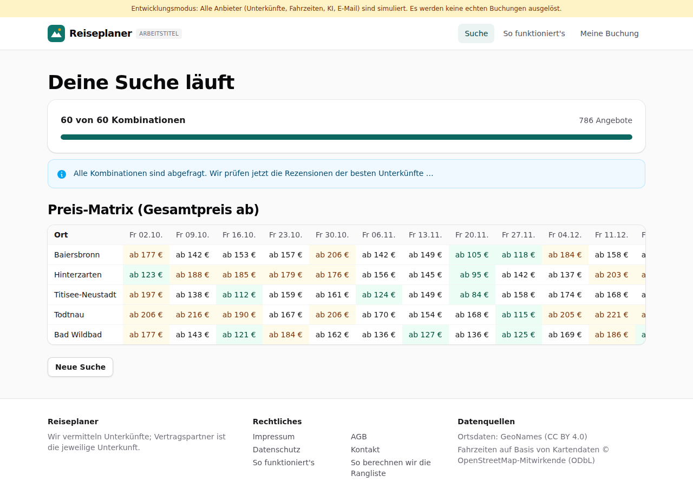
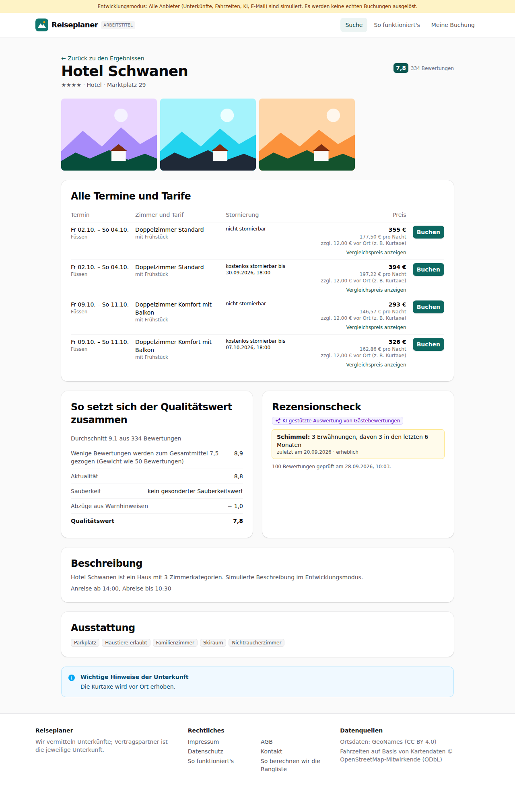
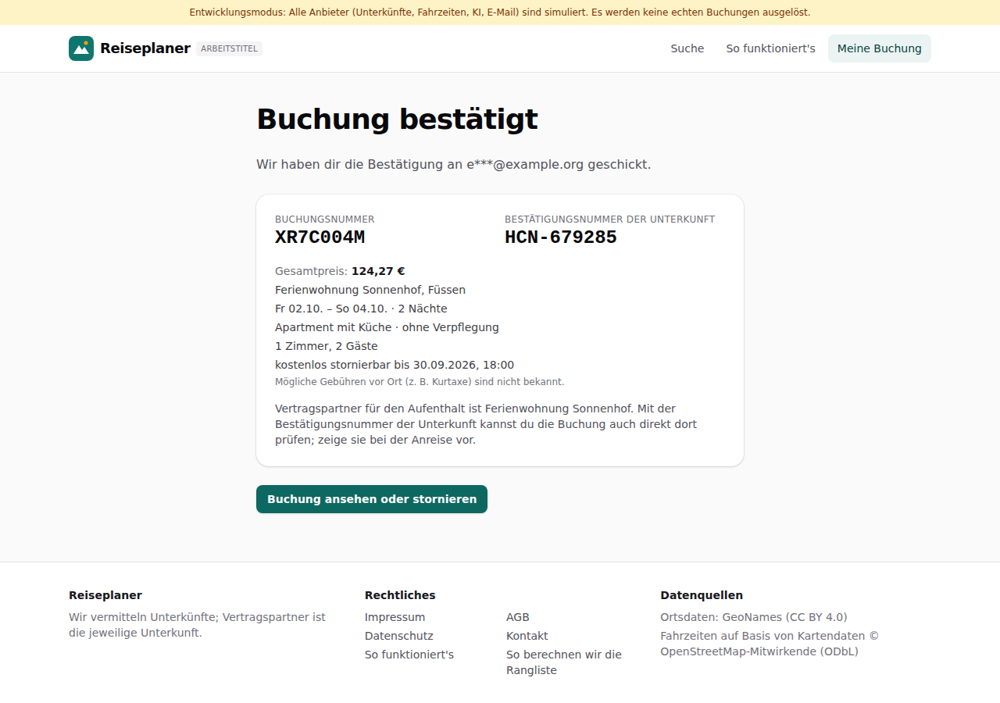

# Dogfood-Walkthrough 2026-09-28T08-03-07-P-all

- Modus: P – Pfad (Nutzerablauf mit Eingaben)
- Flows: suchrahmen, suche, ergebnisse, warnungen, buchung
- Basis-URL: http://localhost:41021 (echter lokaler Stack, Anbieter im Fake-Modus)
- Stand: a009652, gestartet 2026-09-28T08:03:07.635Z
- Ergebnis: ✅ bestanden (134/134 Prüfungen erfüllt)

## Flow „suchrahmen“

Assistent Schritt 1 bis 3 (F1–F3): Startort per Autovervollständigung, Zeitfenster mit Live-Terminanzahl, Freitext per KI in Chips, Regionsvorschläge mit Begründung, Ortsliste mit Fahrzeiten, eigener Ort, Bestätigung.

### 01 Suchrahmen öffnen

- URL: `/suche`
- Screenshot: 
- Prüfungen:
  - [x] enthält „Schritt“
  - [x] enthält „Suchrahmen“
  - [x] enthält „Regionen“
  - [x] enthält „Orte“
  - [x] enthält „Startort“
  - [x] enthält „Reiseart“
  - [x] enthält „Zeitfenster“
- Überschriften: „Deine Suche“
- KI-Kennzeichnungen (`data-ai-provenance`): „Deine Eingabe wird per KI in Auswahl-Chips übersetzt. Bitte prüfe die Auswahl. [ai_assisted]“
- Konsolenfehler: keine
- Fehlgeschlagene Anfragen: keine

<details><summary>Sichtbarer Text</summary>

```text
Entwicklungsmodus: Alle Anbieter (Unterkünfte, Fahrzeiten, KI, E-Mail) sind simuliert. Es werden keine echten Buchungen ausgelöst.
Reiseplaner
ARBEITSTITEL
Suche
So funktioniert's
Meine Buchung

Schritt 1 von 3

Deine Suche
1
Suchrahmen
→
2
Regionen
→
3
Orte
Startort

Städte und Orte in Deutschland, Österreich, der Schweiz und Südtirol.

Maximale Fahrzeit (Auto)
Keine Begrenzung
1 Stunde
1 h 30 min
2 Stunden
2 h 30 min
3 Stunden
4 Stunden
5 Stunden
6 Stunden
Reiseart

Was möchtest du vor Ort machen? Mehrfachauswahl möglich.

Wandern
Bergpanorama
Seen
Natur und Ruhe
Radfahren
Wellness
Wintersport
Städte und Kultur
Wein und Kulinarik
Familie
Zeitfenster
Früheste Anreise
Späteste Abreise
Nächte
1
2
3
4
5
6
7
8
9
10
11
12
13
14
Anreise an diesen Wochentagen
Mo
Di
Mi
Do
Fr
Sa
So
Daraus entstehen 6 Termine: 09.10., 16.10., 23.10., 30.10. …
Reisende
Erwachsene
1
2
3
4
5
6
Zimmer
1
2
3
4
5
Kinder
Kind hinzufügen
Budget in € (optional)

Gilt für den gesamten Aufenthalt inklusive Steuern und Gebühren.

Mindestens Sterne
egal
2+
3+
4+
5+
Mindestbewertung
egal
7+
7,5+
8+
8,5+
9+
Wünsche an die Unterkunft
Besonders sauber
Ruhig
Mit Frühstück
Kostenlos stornierbar
Parkplatz
Hund erlaubt
Sauna oder Wellness
WLAN
Küche
Barrierefrei
Familienzimmer
Weitere Wünsche in eigenen Worten (optional)
Deine Eingabe wird per KI in Auswahl-Chips übersetzt. Bitte prüfe die Auswahl.
In Chips übersetzen
0/300
Weiter zu den Regionen
Orte direkt eingeben

Reiseplaner

Wir vermitteln Unterkünfte; Vertragspartner ist die jeweilige Unterkunft.

Rechtliches

Impressum
AGB
Datenschutz
Kontakt
So funktioniert's
So berechnen wir die Rangliste

Datenquellen

Ortsdaten: GeoNames (CC BY 4.0)
Fahrzeiten auf Basis von Kartendaten © OpenStreetMap-Mitwirkende (ODbL)
```

</details>

### 02 Startort „Stutt“ → Stuttgart

- URL: `/suche`
- Screenshot: 
- Prüfungen:
  - [x] Element `[data-origin="2825297"]` vorhanden (1)
- Überschriften: „Deine Suche“
- KI-Kennzeichnungen (`data-ai-provenance`): „Deine Eingabe wird per KI in Auswahl-Chips übersetzt. Bitte prüfe die Auswahl. [ai_assisted]“
- Konsolenfehler: keine
- Fehlgeschlagene Anfragen: keine

<details><summary>Sichtbarer Text</summary>

```text
Entwicklungsmodus: Alle Anbieter (Unterkünfte, Fahrzeiten, KI, E-Mail) sind simuliert. Es werden keine echten Buchungen ausgelöst.
Reiseplaner
ARBEITSTITEL
Suche
So funktioniert's
Meine Buchung

Schritt 1 von 3

Deine Suche
1
Suchrahmen
→
2
Regionen
→
3
Orte
Startort

Städte und Orte in Deutschland, Österreich, der Schweiz und Südtirol.

Maximale Fahrzeit (Auto)
Keine Begrenzung
1 Stunde
1 h 30 min
2 Stunden
2 h 30 min
3 Stunden
4 Stunden
5 Stunden
6 Stunden
Reiseart

Was möchtest du vor Ort machen? Mehrfachauswahl möglich.

Wandern
Bergpanorama
Seen
Natur und Ruhe
Radfahren
Wellness
Wintersport
Städte und Kultur
Wein und Kulinarik
Familie
Zeitfenster
Früheste Anreise
Späteste Abreise
Nächte
1
2
3
4
5
6
7
8
9
10
11
12
13
14
Anreise an diesen Wochentagen
Mo
Di
Mi
Do
Fr
Sa
So
Daraus entstehen 6 Termine: 09.10., 16.10., 23.10., 30.10. …
Reisende
Erwachsene
1
2
3
4
5
6
Zimmer
1
2
3
4
5
Kinder
Kind hinzufügen
Budget in € (optional)

Gilt für den gesamten Aufenthalt inklusive Steuern und Gebühren.

Mindestens Sterne
egal
2+
3+
4+
5+
Mindestbewertung
egal
7+
7,5+
8+
8,5+
9+
Wünsche an die Unterkunft
Besonders sauber
Ruhig
Mit Frühstück
Kostenlos stornierbar
Parkplatz
Hund erlaubt
Sauna oder Wellness
WLAN
Küche
Barrierefrei
Familienzimmer
Weitere Wünsche in eigenen Worten (optional)
Deine Eingabe wird per KI in Auswahl-Chips übersetzt. Bitte prüfe die Auswahl.
In Chips übersetzen
0/300
Weiter zu den Regionen
Orte direkt eingeben

Reiseplaner

Wir vermitteln Unterkünfte; Vertragspartner ist die jeweilige Unterkunft.

Rechtliches

Impressum
AGB
Datenschutz
Kontakt
So funktioniert's
So berechnen wir die Rangliste

Datenquellen

Ortsdaten: GeoNames (CC BY 4.0)
Fahrzeiten auf Basis von Kartendaten © OpenStreetMap-Mitwirkende (ODbL)
```

</details>

### 03 Zeitfenster 01.10.–30.11.2026, 2 Nächte, Anreise Freitag, Wandern

- URL: `/suche`
- Screenshot: 
- Prüfungen:
  - [x] enthält „9 Termine“
  - [x] enthält „02.10.“
  - [x] enthält „Fr“
- Überschriften: „Deine Suche“
- KI-Kennzeichnungen (`data-ai-provenance`): „Deine Eingabe wird per KI in Auswahl-Chips übersetzt. Bitte prüfe die Auswahl. [ai_assisted]“
- Konsolenfehler: keine
- Fehlgeschlagene Anfragen: keine

<details><summary>Sichtbarer Text</summary>

```text
Entwicklungsmodus: Alle Anbieter (Unterkünfte, Fahrzeiten, KI, E-Mail) sind simuliert. Es werden keine echten Buchungen ausgelöst.
Reiseplaner
ARBEITSTITEL
Suche
So funktioniert's
Meine Buchung

Schritt 1 von 3

Deine Suche
1
Suchrahmen
→
2
Regionen
→
3
Orte
Startort

Städte und Orte in Deutschland, Österreich, der Schweiz und Südtirol.

Maximale Fahrzeit (Auto)
Keine Begrenzung
1 Stunde
1 h 30 min
2 Stunden
2 h 30 min
3 Stunden
4 Stunden
5 Stunden
6 Stunden
Reiseart

Was möchtest du vor Ort machen? Mehrfachauswahl möglich.

Wandern
Bergpanorama
Seen
Natur und Ruhe
Radfahren
Wellness
Wintersport
Städte und Kultur
Wein und Kulinarik
Familie
Zeitfenster
Früheste Anreise
Späteste Abreise
Nächte
1
2
3
4
5
6
7
8
9
10
11
12
13
14
Anreise an diesen Wochentagen
Mo
Di
Mi
Do
Fr
Sa
So
Daraus entstehen 9 Termine: 02.10., 09.10., 16.10., 23.10. …
Reisende
Erwachsene
1
2
3
4
5
6
Zimmer
1
2
3
4
5
Kinder
Kind hinzufügen
Budget in € (optional)

Gilt für den gesamten Aufenthalt inklusive Steuern und Gebühren.

Mindestens Sterne
egal
2+
3+
4+
5+
Mindestbewertung
egal
7+
7,5+
8+
8,5+
9+
Wünsche an die Unterkunft
Besonders sauber
Ruhig
Mit Frühstück
Kostenlos stornierbar
Parkplatz
Hund erlaubt
Sauna oder Wellness
WLAN
Küche
Barrierefrei
Familienzimmer
Weitere Wünsche in eigenen Worten (optional)
Deine Eingabe wird per KI in Auswahl-Chips übersetzt. Bitte prüfe die Auswahl.
In Chips übersetzen
0/300
Weiter zu den Regionen
Orte direkt eingeben

Reiseplaner

Wir vermitteln Unterkünfte; Vertragspartner ist die jeweilige Unterkunft.

Rechtliches

Impressum
AGB
Datenschutz
Kontakt
So funktioniert's
So berechnen wir die Rangliste

Datenquellen

Ortsdaten: GeoNames (CC BY 4.0)
Fahrzeiten auf Basis von Kartendaten © OpenStreetMap-Mitwirkende (ODbL)
```

</details>

### 04 Zu viele Termine → verständliche Meldung

- URL: `/suche`
- Screenshot: 
- Notiz: Mit Fr, Sa und So entstehen zu viele Termine; danach wieder nur Freitag.
- Prüfungen:
  - [x] enthält „Möglich sind höchstens 12“
- Überschriften: „Deine Suche“
- KI-Kennzeichnungen (`data-ai-provenance`): „Deine Eingabe wird per KI in Auswahl-Chips übersetzt. Bitte prüfe die Auswahl. [ai_assisted]“
- Konsolenfehler: keine
- Fehlgeschlagene Anfragen: keine

<details><summary>Sichtbarer Text</summary>

```text
Entwicklungsmodus: Alle Anbieter (Unterkünfte, Fahrzeiten, KI, E-Mail) sind simuliert. Es werden keine echten Buchungen ausgelöst.
Reiseplaner
ARBEITSTITEL
Suche
So funktioniert's
Meine Buchung

Schritt 1 von 3

Deine Suche
1
Suchrahmen
→
2
Regionen
→
3
Orte
Startort

Städte und Orte in Deutschland, Österreich, der Schweiz und Südtirol.

Maximale Fahrzeit (Auto)
Keine Begrenzung
1 Stunde
1 h 30 min
2 Stunden
2 h 30 min
3 Stunden
4 Stunden
5 Stunden
6 Stunden
Reiseart

Was möchtest du vor Ort machen? Mehrfachauswahl möglich.

Wandern
Bergpanorama
Seen
Natur und Ruhe
Radfahren
Wellness
Wintersport
Städte und Kultur
Wein und Kulinarik
Familie
Zeitfenster
Früheste Anreise
Späteste Abreise
Nächte
1
2
3
4
5
6
7
8
9
10
11
12
13
14
Anreise an diesen Wochentagen
Mo
Di
Mi
Do
Fr
Sa
So
Das ergibt 26 Termine. Möglich sind höchstens 12: Bitte verkürze das Zeitfenster oder wähle weniger Anreisetage.
Reisende
Erwachsene
1
2
3
4
5
6
Zimmer
1
2
3
4
5
Kinder
Kind hinzufügen
Budget in € (optional)

Gilt für den gesamten Aufenthalt inklusive Steuern und Gebühren.

Mindestens Sterne
egal
2+
3+
4+
5+
Mindestbewertung
egal
7+
7,5+
8+
8,5+
9+
Wünsche an die Unterkunft
Besonders sauber
Ruhig
Mit Frühstück
Kostenlos stornierbar
Parkplatz
Hund erlaubt
Sauna oder Wellness
WLAN
Küche
Barrierefrei
Familienzimmer
Weitere Wünsche in eigenen Worten (optional)
Deine Eingabe wird per KI in Auswahl-Chips übersetzt. Bitte prüfe die Auswahl.
In Chips übersetzen
0/300
Weiter zu den Regionen
Orte direkt eingeben

Reiseplaner

Wir vermitteln Unterkünfte; Vertragspartner ist die jeweilige Unterkunft.

Rechtliches

Impressum
AGB
Datenschutz
Kontakt
So funktioniert's
So berechnen wir die Rangliste

Datenquellen

Ortsdaten: GeoNames (CC BY 4.0)
Fahrzeiten auf Basis von Kartendaten © OpenStreetMap-Mitwirkende (ODbL)
```

</details>

### 05 Freitext per KI in Chips übersetzen

- URL: `/suche`
- Screenshot: 
- Prüfungen:
  - [x] enthält „Nicht zugeordnet:“
  - [x] enthält „„Blick auf den See““
  - [x] enthält „Deine Eingabe wird per KI in Auswahl-Chips übersetzt“
  - [x] Element `[data-ai-provenance]` vorhanden (1)
  - [x] Element `[data-testid="wish-chips"] button[aria-pressed="true"]:has-text("Besonders sauber")` vorhanden (1)
  - [x] Element `[data-testid="wish-chips"] button[aria-pressed="true"]:has-text("Ruhig")` vorhanden (1)
- Überschriften: „Deine Suche“
- KI-Kennzeichnungen (`data-ai-provenance`): „Deine Eingabe wird per KI in Auswahl-Chips übersetzt. Bitte prüfe die Auswahl. [ai_assisted]“
- Konsolenfehler: keine
- Fehlgeschlagene Anfragen: keine

<details><summary>Sichtbarer Text</summary>

```text
Entwicklungsmodus: Alle Anbieter (Unterkünfte, Fahrzeiten, KI, E-Mail) sind simuliert. Es werden keine echten Buchungen ausgelöst.
Reiseplaner
ARBEITSTITEL
Suche
So funktioniert's
Meine Buchung

Schritt 1 von 3

Deine Suche
1
Suchrahmen
→
2
Regionen
→
3
Orte
Startort

Städte und Orte in Deutschland, Österreich, der Schweiz und Südtirol.

Maximale Fahrzeit (Auto)
Keine Begrenzung
1 Stunde
1 h 30 min
2 Stunden
2 h 30 min
3 Stunden
4 Stunden
5 Stunden
6 Stunden
Reiseart

Was möchtest du vor Ort machen? Mehrfachauswahl möglich.

Wandern
Bergpanorama
Seen
Natur und Ruhe
Radfahren
Wellness
Wintersport
Städte und Kultur
Wein und Kulinarik
Familie
Zeitfenster
Früheste Anreise
Späteste Abreise
Nächte
1
2
3
4
5
6
7
8
9
10
11
12
13
14
Anreise an diesen Wochentagen
Mo
Di
Mi
Do
Fr
Sa
So
Daraus entstehen 9 Termine: 02.10., 09.10., 16.10., 23.10. …
Reisende
Erwachsene
1
2
3
4
5
6
Zimmer
1
2
3
4
5
Kinder
Kind hinzufügen
Budget in € (optional)

Gilt für den gesamten Aufenthalt inklusive Steuern und Gebühren.

Mindestens Sterne
egal
2+
3+
4+
5+
Mindestbewertung
egal
7+
7,5+
8+
8,5+
9+
Wünsche an die Unterkunft
Besonders sauber
Ruhig
Mit Frühstück
Kostenlos stornierbar
Parkplatz
Hund erlaubt
Sauna oder Wellness
WLAN
Küche
Barrierefrei
Familienzimmer
Weitere Wünsche in eigenen Worten (optional)
Deine Eingabe wird per KI in Auswahl-Chips übersetzt. Bitte prüfe die Auswahl.
In Chips übersetzen
35/300
Übernommen und vorausgewählt. Bitte prüfe die Auswahl.
Nicht zugeordnet: „Blick auf den See“. Diese Wünsche können wir nicht gezielt suchen.
Weiter zu den Regionen
Orte direkt eingeben

Reiseplaner

Wir vermitteln Unterkünfte; Vertragspartner ist die jeweilige Unterkunft.

Rechtliches

Impressum
AGB
Datenschutz
Kontakt
So funktioniert's
So berechnen wir die Rangliste

Datenquellen

Ortsdaten: Ge
… (90 weitere Zeichen)
```

</details>

### 06 Regionsvorschläge mit Begründung

- URL: `/suche`
- Screenshot: 
- Prüfungen:
  - [x] enthält „Passende Regionen“
  - [x] enthält „passende Orte für Wandern“
  - [x] enthält „Fahrt“
  - [x] enthält „Weiter zu den Orten“
  - [x] Element `[data-testid="region-card"]` vorhanden (5)
  - [x] Element `[data-ai-provenance]` vorhanden (5)
- Überschriften: „Deine Suche“, „Passende Regionen“
- KI-Kennzeichnungen (`data-ai-provenance`): „KI-gestützt erstellt, redaktionelle Prüfung ausstehend [ai_assisted]“, „KI-gestützt erstellt, redaktionelle Prüfung ausstehend [ai_assisted]“, „KI-gestützt erstellt, redaktionelle Prüfung ausstehend [ai_assisted]“, „KI-gestützt erstellt, redaktionelle Prüfung ausstehend [ai_assisted]“, „KI-gestützt erstellt, redaktionelle Prüfung ausstehend [ai_assisted]“
- Konsolenfehler: keine
- Fehlgeschlagene Anfragen: keine

<details><summary>Sichtbarer Text</summary>

```text
Entwicklungsmodus: Alle Anbieter (Unterkünfte, Fahrzeiten, KI, E-Mail) sind simuliert. Es werden keine echten Buchungen ausgelöst.
Reiseplaner
ARBEITSTITEL
Suche
So funktioniert's
Meine Buchung

Schritt 2 von 3

Deine Suche
1
Suchrahmen
→
2
Regionen
→
3
Orte
Passende Regionen

Aus unserem Ortskatalog, erreichbar in deiner maximalen Fahrzeit. Wähle eine oder mehrere Regionen.

Schwarzwald
✓

9 passende Orte für Wandern, 50 min–2 h 11 min Fahrt

Mittelgebirge mit Feldberg, Titisee und Schluchsee, Wanderwegen und Kurorten.

KI-gestützt erstellt, redaktionelle Prüfung ausstehend
Allgäu

8 passende Orte für Wandern, 2 h 4 min–2 h 37 min Fahrt

Voralpenland mit Almen, Seen und den Allgäuer Alpen rund um Oberstdorf und Füssen.

KI-gestützt erstellt, redaktionelle Prüfung ausstehend
Pfälzerwald und Deutsche Weinstraße

6 passende Orte für Wandern, 1 h 22 min–1 h 45 min Fahrt

Weinorte entlang der Deutschen Weinstraße und der Pfälzerwald mit seinen Buntsandsteinfelsen.

KI-gestützt erstellt, redaktionelle Prüfung ausstehend
Schwäbische Alb

6 passende Orte für Wandern, 44 min–1 h 14 min Fahrt

Karsthochfläche mit Wasserfällen, Höhlen und Burgen wie Schloss Lichtenstein.

KI-gestützt erstellt, redaktionelle Prüfung ausstehend
Bregenzerwald und Montafon

6 passende Orte für Wandern, 2 h 17 min–2 h 46 min Fahrt

Vorarlberg zwischen Bodensee, Bregenzerwald mit Holzbaukultur und dem Montafon.

KI-gestützt erstellt, redaktionelle Prüfung ausstehend
Zurück
Weiter zu den Orten
Überspringen und Orte selbst eingeben

Reiseplaner

Wir vermitteln Unterkünfte; Vertragspartner ist die jeweilige Unterkunft.

Rechtliches

Impressum
AGB
Datenschutz
Kontakt
So funktioniert's
So berechnen wir die Rangliste

Datenquellen

Ortsdaten: GeoNames (CC BY 4.0)
Fahrzeiten auf Basis von Kartendaten © OpenSt
… (26 weitere Zeichen)
```

</details>

### 07 Ortsliste mit Fahrzeiten

- URL: `/suche`
- Screenshot: 
- Notiz: 5 Regionen vorgeschlagen.
- Prüfungen:
  - [x] enthält „Orte für deine Suche“
  - [x] enthält „Fahrzeit“
  - [x] enthält „von 10 Orten ausgewählt“
  - [x] enthält „Kombinationen“
- Überschriften: „Deine Suche“, „Orte für deine Suche“
- KI-Kennzeichnungen (`data-ai-provenance`): „KI-gestützt erstellt, redaktionelle Prüfung ausstehend [ai_assisted]“, „KI-gestützt erstellt, redaktionelle Prüfung ausstehend [ai_assisted]“, „KI-gestützt erstellt, redaktionelle Prüfung ausstehend [ai_assisted]“, „KI-gestützt erstellt, redaktionelle Prüfung ausstehend [ai_assisted]“, „KI-gestützt erstellt, redaktionelle Prüfung ausstehend [ai_assisted]“, „KI-gestützt erstellt, redaktionelle Prüfung ausstehend [ai_assisted]“, „KI-gestützt erstellt, redaktionelle Prüfung ausstehend [ai_assisted]“, „KI-gestützt erstellt, redaktionelle Prüfung ausstehend [ai_assisted]“, „KI-gestützt erstellt, redaktionelle Prüfung ausstehend [ai_assisted]“
- Konsolenfehler: keine
- Fehlgeschlagene Anfragen: keine

<details><summary>Sichtbarer Text</summary>

```text
Entwicklungsmodus: Alle Anbieter (Unterkünfte, Fahrzeiten, KI, E-Mail) sind simuliert. Es werden keine echten Buchungen ausgelöst.
Reiseplaner
ARBEITSTITEL
Suche
So funktioniert's
Meine Buchung

Schritt 3 von 3

Deine Suche
1
Suchrahmen
→
2
Regionen
→
3
Orte
Orte für deine Suche

Wir durchsuchen alle ausgewählten Orte an allen Terminen. Streiche Orte oder füge eigene hinzu.

9 von 10 Orten ausgewählt
9 Orte × 9 Termine = 81 Kombinationen
Schwarzwald
Baiersbronn
Fahrzeit 1 h 20 min

Weitläufige Gemeinde im Nordschwarzwald nahe dem Nationalpark, bekannt für ihre Gastronomie.

Wandern
Wein und Kulinarik
Natur und Ruhe
KI-gestützt erstellt, redaktionelle Prüfung ausstehend
Hinterzarten
Fahrzeit 1 h 49 min

Kurort im Hochschwarzwald mit Moor, Ravennaschlucht und Skisprungschanze.

Wandern
Natur und Ruhe
Wellness
Wintersport
KI-gestützt erstellt, redaktionelle Prüfung ausstehend
Titisee-Neustadt
Fahrzeit 1 h 52 min

Ferienort am Titisee, nah an Feldberg und Wutachschlucht.

Seen
Wandern
Familie
Wintersport
KI-gestützt erstellt, redaktionelle Prüfung ausstehend
Todtnau
Fahrzeit 1 h 57 min

Ort am Feldberg mit Wasserfall, Rodelbahn und Skigebieten.

Wandern
Familie
Wintersport
KI-gestützt erstellt, redaktionelle Prüfung ausstehend
Bad Wildbad
Fahrzeit 50 min

Thermalkurort im Enztal mit Baumwipfelpfad auf dem Sommerberg.

Wellness
Familie
Wandern
KI-gestützt erstellt, redaktionelle Prüfung ausstehend
Freudenstadt
Fahrzeit 1 h 15 min

Stadt mit weitläufigem Marktplatz und Wegen in den Nordschwarzwald.

Städte und Kultur
Wandern
Wellness
KI-gestützt erstellt, redaktionelle Prüfung ausstehend
Triberg im Schwarzwald
Fahrzeit 1 h 33 min

Ort an den Triberger Wasserfällen mit Kuckucksuhren-Tradition.

Familie
Städte und Kultur
Wandern
KI-gestützt erstellt, redaktionelle Prüfung ausst
… (777 weitere Zeichen)
```

</details>

### 08 Eigenen Ort hinzufügen (Tübingen)

- URL: `/suche`
- Screenshot: 
- Prüfungen:
  - [x] enthält „Tübingen“
  - [x] enthält „Eigener Ort“
- Überschriften: „Deine Suche“, „Orte für deine Suche“
- KI-Kennzeichnungen (`data-ai-provenance`): „KI-gestützt erstellt, redaktionelle Prüfung ausstehend [ai_assisted]“, „KI-gestützt erstellt, redaktionelle Prüfung ausstehend [ai_assisted]“, „KI-gestützt erstellt, redaktionelle Prüfung ausstehend [ai_assisted]“, „KI-gestützt erstellt, redaktionelle Prüfung ausstehend [ai_assisted]“, „KI-gestützt erstellt, redaktionelle Prüfung ausstehend [ai_assisted]“, „KI-gestützt erstellt, redaktionelle Prüfung ausstehend [ai_assisted]“, „KI-gestützt erstellt, redaktionelle Prüfung ausstehend [ai_assisted]“, „KI-gestützt erstellt, redaktionelle Prüfung ausstehend [ai_assisted]“, „KI-gestützt erstellt, redaktionelle Prüfung ausstehend [ai_assisted]“
- Konsolenfehler: keine
- Fehlgeschlagene Anfragen: keine

<details><summary>Sichtbarer Text</summary>

```text
Entwicklungsmodus: Alle Anbieter (Unterkünfte, Fahrzeiten, KI, E-Mail) sind simuliert. Es werden keine echten Buchungen ausgelöst.
Reiseplaner
ARBEITSTITEL
Suche
So funktioniert's
Meine Buchung

Schritt 3 von 3

Deine Suche
1
Suchrahmen
→
2
Regionen
→
3
Orte
Orte für deine Suche

Wir durchsuchen alle ausgewählten Orte an allen Terminen. Streiche Orte oder füge eigene hinzu.

10 von 10 Orten ausgewählt
10 Orte × 9 Termine = 90 Kombinationen
Schwarzwald
Baiersbronn
Fahrzeit 1 h 20 min

Weitläufige Gemeinde im Nordschwarzwald nahe dem Nationalpark, bekannt für ihre Gastronomie.

Wandern
Wein und Kulinarik
Natur und Ruhe
KI-gestützt erstellt, redaktionelle Prüfung ausstehend
Hinterzarten
Fahrzeit 1 h 49 min

Kurort im Hochschwarzwald mit Moor, Ravennaschlucht und Skisprungschanze.

Wandern
Natur und Ruhe
Wellness
Wintersport
KI-gestützt erstellt, redaktionelle Prüfung ausstehend
Titisee-Neustadt
Fahrzeit 1 h 52 min

Ferienort am Titisee, nah an Feldberg und Wutachschlucht.

Seen
Wandern
Familie
Wintersport
KI-gestützt erstellt, redaktionelle Prüfung ausstehend
Todtnau
Fahrzeit 1 h 57 min

Ort am Feldberg mit Wasserfall, Rodelbahn und Skigebieten.

Wandern
Familie
Wintersport
KI-gestützt erstellt, redaktionelle Prüfung ausstehend
Bad Wildbad
Fahrzeit 50 min

Thermalkurort im Enztal mit Baumwipfelpfad auf dem Sommerberg.

Wellness
Familie
Wandern
KI-gestützt erstellt, redaktionelle Prüfung ausstehend
Freudenstadt
Fahrzeit 1 h 15 min

Stadt mit weitläufigem Marktplatz und Wegen in den Nordschwarzwald.

Städte und Kultur
Wandern
Wellness
KI-gestützt erstellt, redaktionelle Prüfung ausstehend
Triberg im Schwarzwald
Fahrzeit 1 h 33 min

Ort an den Triberger Wasserfällen mit Kuckucksuhren-Tradition.

Familie
Städte und Kultur
Wandern
KI-gestützt erstellt, redaktionelle Prüfung aus
… (857 weitere Zeichen)
```

</details>

### 09 Ortsliste bestätigen

- URL: `/suche`
- Screenshot: 
- Prüfungen:
  - [x] enthält „Ortsliste bestätigt“
  - [x] enthält „Kombinationen“
- Überschriften: „Deine Suche“, „Ortsliste bestätigt“, „Suche starten“
- KI-Kennzeichnungen (`data-ai-provenance`): keine
- Konsolenfehler: keine
- Fehlgeschlagene Anfragen: keine

<details><summary>Sichtbarer Text</summary>

```text
Entwicklungsmodus: Alle Anbieter (Unterkünfte, Fahrzeiten, KI, E-Mail) sind simuliert. Es werden keine echten Buchungen ausgelöst.
Reiseplaner
ARBEITSTITEL
Suche
So funktioniert's
Meine Buchung

Schritt 3 von 3

Deine Suche
1
Suchrahmen
→
2
Regionen
→
3
Orte
Ortsliste bestätigt

10 Orte × 9 Termine = 90 Kombinationen

Suche starten

Wir fragen jetzt alle Kombinationen aus Ort und Termin gleichzeitig ab. Das dauert meist unter einer Minute.

Baiersbronn
Hinterzarten
Titisee-Neustadt
Todtnau
Bad Wildbad
Freudenstadt
Triberg im Schwarzwald
Schluchsee
St. Blasien
Tübingen
Zurück
Suche starten

Zum Schutz vor automatisierten Anfragen löst dein Browser eine kleine Rechenaufgabe. Es werden keine Cookies gesetzt.

Reiseplaner

Wir vermitteln Unterkünfte; Vertragspartner ist die jeweilige Unterkunft.

Rechtliches

Impressum
AGB
Datenschutz
Kontakt
So funktioniert's
So berechnen wir die Rangliste

Datenquellen

Ortsdaten: GeoNames (CC BY 4.0)
Fahrzeiten auf Basis von Kartendaten © OpenStreetMap-Mitwirkende (ODbL)
```

</details>

## Flow „suche“

Kombinationssuche (F4): 5 Orte × 12 Termine, Start mit ALTCHA im Browser, Fortschritt „x von 60“, Matrix füllt sich live, Hinweis bei Teilergebnissen.

### 10 Ortsliste bestätigt: 60 Kombinationen

- URL: `/suche`
- Screenshot: 
- Prüfungen:
  - [x] enthält „Ortsliste bestätigt“
  - [x] enthält „5 Orte × 12 Termine = 60 Kombinationen“
  - [x] enthält „Suche starten“
  - [x] enthält „Rechenaufgabe“
- Überschriften: „Deine Suche“, „Ortsliste bestätigt“, „Suche starten“
- KI-Kennzeichnungen (`data-ai-provenance`): keine
- Konsolenfehler: keine
- Fehlgeschlagene Anfragen: keine

<details><summary>Sichtbarer Text</summary>

```text
Entwicklungsmodus: Alle Anbieter (Unterkünfte, Fahrzeiten, KI, E-Mail) sind simuliert. Es werden keine echten Buchungen ausgelöst.
Reiseplaner
ARBEITSTITEL
Suche
So funktioniert's
Meine Buchung

Schritt 3 von 3

Deine Suche
1
Suchrahmen
→
2
Regionen
→
3
Orte
Ortsliste bestätigt

5 Orte × 12 Termine = 60 Kombinationen

Suche starten

Wir fragen jetzt alle Kombinationen aus Ort und Termin gleichzeitig ab. Das dauert meist unter einer Minute.

Baiersbronn
Hinterzarten
Titisee-Neustadt
Todtnau
Bad Wildbad
Zurück
Suche starten

Zum Schutz vor automatisierten Anfragen löst dein Browser eine kleine Rechenaufgabe. Es werden keine Cookies gesetzt.

Reiseplaner

Wir vermitteln Unterkünfte; Vertragspartner ist die jeweilige Unterkunft.

Rechtliches

Impressum
AGB
Datenschutz
Kontakt
So funktioniert's
So berechnen wir die Rangliste

Datenquellen

Ortsdaten: GeoNames (CC BY 4.0)
Fahrzeiten auf Basis von Kartendaten © OpenStreetMap-Mitwirkende (ODbL)
```

</details>

### 11 Suche gestartet: Fortschritt und Matrix mit Platzhaltern

- URL: `/suche/75a63156-4404-483b-b267-0722771d7c08#t=nlGe5Xh6E3yHdBFacMBRdTu0ukv2pK7O8rUU8t11Hhc`
- Screenshot: 
- Prüfungen:
  - [x] enthält „Kombinationen“
  - [x] enthält „Preis-Matrix“
  - [x] Element `[data-testid="matrix"]` vorhanden (1)
  - [x] Element `[role="progressbar"]` vorhanden (1)
- Überschriften: „Deine Suche läuft“, „Preis-Matrix (Gesamtpreis ab)“
- KI-Kennzeichnungen (`data-ai-provenance`): keine
- Konsolenfehler: keine
- Fehlgeschlagene Anfragen: keine

<details><summary>Sichtbarer Text</summary>

```text
Entwicklungsmodus: Alle Anbieter (Unterkünfte, Fahrzeiten, KI, E-Mail) sind simuliert. Es werden keine echten Buchungen ausgelöst.
Reiseplaner
ARBEITSTITEL
Suche
So funktioniert's
Meine Buchung
Deine Suche läuft

12 von 60 Kombinationen

241 Angebote

Preis-Matrix (Gesamtpreis ab)
Ort	Fr 02.10.	Fr 09.10.	Fr 16.10.	Fr 23.10.	Fr 30.10.	Fr 06.11.	Fr 13.11.	Fr 20.11.	Fr 27.11.	Fr 04.12.	Fr 11.12.	Fr 18.12.
Baiersbronn	ab 177 €	ab 142 €	ab 153 €	ab 157 €	ab 206 €	ab 142 €	ab 149 €	ab 105 €	ab 118 €	ab 184 €	ab 158 €	ab 161 €
Hinterzarten												
Titisee-Neustadt												
Todtnau												
Bad Wildbad												
Neue Suche

Reiseplaner

Wir vermitteln Unterkünfte; Vertragspartner ist die jeweilige Unterkunft.

Rechtliches

Impressum
AGB
Datenschutz
Kontakt
So funktioniert's
So berechnen wir die Rangliste

Datenquellen

Ortsdaten: GeoNames (CC BY 4.0)
Fahrzeiten auf Basis von Kartendaten © OpenStreetMap-Mitwirkende (ODbL)
```

</details>

### 12 Suche abgeschlossen: 60 von 60, Matrix gefüllt

- URL: `/suche/75a63156-4404-483b-b267-0722771d7c08#t=nlGe5Xh6E3yHdBFacMBRdTu0ukv2pK7O8rUU8t11Hhc`
- Screenshot: 
- Notiz: Matrix: 60 Zellen mit Angebot, 0 ohne Daten.
- Prüfungen:
  - [x] enthält „60 von 60 Kombinationen“
  - [x] enthält „Angebote“
  - [x] enthält „ab “
  - [x] enthält nicht „wird gesucht“
  - [x] Element `[data-testid="matrix"] td[data-state="offer"]` vorhanden (60)
- Überschriften: „Deine Suche läuft“, „Preis-Matrix (Gesamtpreis ab)“
- KI-Kennzeichnungen (`data-ai-provenance`): keine
- Konsolenfehler: keine
- Fehlgeschlagene Anfragen: keine

<details><summary>Sichtbarer Text</summary>

```text
Entwicklungsmodus: Alle Anbieter (Unterkünfte, Fahrzeiten, KI, E-Mail) sind simuliert. Es werden keine echten Buchungen ausgelöst.
Reiseplaner
ARBEITSTITEL
Suche
So funktioniert's
Meine Buchung
Deine Suche läuft

60 von 60 Kombinationen

786 Angebote

Alle Kombinationen sind abgefragt. Wir prüfen jetzt die Rezensionen der besten Unterkünfte …
Preis-Matrix (Gesamtpreis ab)
Ort	Fr 02.10.	Fr 09.10.	Fr 16.10.	Fr 23.10.	Fr 30.10.	Fr 06.11.	Fr 13.11.	Fr 20.11.	Fr 27.11.	Fr 04.12.	Fr 11.12.	Fr 18.12.
Baiersbronn	ab 177 €	ab 142 €	ab 153 €	ab 157 €	ab 206 €	ab 142 €	ab 149 €	ab 105 €	ab 118 €	ab 184 €	ab 158 €	ab 161 €
Hinterzarten	ab 123 €	ab 188 €	ab 185 €	ab 179 €	ab 176 €	ab 156 €	ab 145 €	ab 95 €	ab 142 €	ab 137 €	ab 203 €	ab 190 €
Titisee-Neustadt	ab 197 €	ab 138 €	ab 112 €	ab 159 €	ab 161 €	ab 124 €	ab 149 €	ab 84 €	ab 158 €	ab 174 €	ab 168 €	ab 163 €
Todtnau	ab 206 €	ab 216 €	ab 190 €	ab 167 €	ab 206 €	ab 170 €	ab 154 €	ab 168 €	ab 115 €	ab 205 €	ab 221 €	ab 211 €
Bad Wildbad	ab 177 €	ab 143 €	ab 121 €	ab 184 €	ab 162 €	ab 136 €	ab 127 €	ab 136 €	ab 125 €	ab 169 €	ab 186 €	ab 107 €
Neue Suche

Reiseplaner

Wir vermitteln Unterkünfte; Vertragspartner ist die jeweilige Unterkunft.

Rechtliches

Impressum
AGB
Datenschutz
Kontakt
So funktioniert's
So berechnen wir die Rangliste

Datenquellen

Ortsdaten: GeoNames (CC BY 4.0)
Fahrzeiten auf Basis von Kartendaten © OpenStreetMap-Mitwirkende (ODbL)
```

</details>

## Flow „ergebnisse“

Ergebnisse (F5, F7, F9, F10, Akzeptanzbeispiel 1): Suche Stuttgart, 5 Orte × 9 Freitage; Matrix mit Farbstufen, Liste mit Schnäppchen-Begründung, Sortierung, Zellfilter, Filter ohne neue Suche, Detailansicht mit Score-Aufschlüsselung, Seite zur Rangliste.

### 13 Suche 5 Orte × 9 Termine gestartet und abgeschlossen

- URL: `/suche/67026d7d-0794-425b-bd66-9b61e36672c7#t=RABpdGo7ihAiwlT6rYWiWF3MKTMHrna1DaTBxePR6yE`
- Screenshot: 
- Prüfungen:
  - [x] enthält „45 von 45 Kombinationen“
  - [x] enthält „Ergebnisse“
  - [x] enthält „Preise abgerufen um“
  - [x] enthält „Bestes Angebot“
  - [x] enthält „So berechnen wir die Rangliste“
  - [x] enthält „pro Nacht“
  - [x] enthält „Schnäppchen“
  - [x] Element `[data-testid="result-matrix"]` vorhanden (1)
  - [x] Element `[data-testid="bargain-reason"]` vorhanden (30)
  - [x] Element `[data-testid="result-filters"]` vorhanden (1)
- Überschriften: „Suche abgeschlossen“, „Ergebnisse“
- KI-Kennzeichnungen (`data-ai-provenance`): „KI-gestützte Auswertung von Gästebewertungen [ai_assisted]“, „KI-gestützte Auswertung von Gästebewertungen [ai_assisted]“, „KI-gestützte Auswertung von Gästebewertungen [ai_assisted]“, „KI-gestützte Auswertung von Gästebewertungen [ai_assisted]“
- Konsolenfehler: keine
- Fehlgeschlagene Anfragen: keine

<details><summary>Sichtbarer Text</summary>

```text
Entwicklungsmodus: Alle Anbieter (Unterkünfte, Fahrzeiten, KI, E-Mail) sind simuliert. Es werden keine echten Buchungen ausgelöst.
Reiseplaner
ARBEITSTITEL
Suche
So funktioniert's
Meine Buchung
Suche abgeschlossen

45 von 45 Kombinationen

587 Angebote

Ergebnisse

45 Unterkünfte, 587 passende Angebote

Preise abgerufen um 10:03 Uhr. Preise können sich bis zur Buchung ändern.

Sortierung
Bestes Angebot
Preis
Bewertung
So berechnen wir die Rangliste
Filter
Budget gesamt (€)
Sterne ab
egal
2+
3+
4+
5+
Bewertung ab
egal
7+
7,5+
8+
8,5+
9+
Bewertungen mindestens
egal
10
20
50
100
Verpflegung
egal
ohne
Frühstück
Halbpension
Vollpension
All inclusive
Nur kostenlos stornierbar
Filter anwenden
Filter der Suche
Ort	Fr 02.10.	Fr 09.10.	Fr 16.10.	Fr 23.10.	Fr 30.10.	Fr 06.11.	Fr 13.11.	Fr 20.11.	Fr 27.11.
Baiersbronn	★ 187 €	★ 142 €	★ 188 €	★ 196 €	★ 212 €	★ 142 €	★ 149 €	★ 105 €	★ 159 €
Hinterzarten	★ 203 €	234 €	★ 198 €	★ 198 €	★ 192 €	★ 156 €	★ 155 €	★ 158 €	★ 191 €
Titisee-Neustadt	197 €	★ 138 €	★ 112 €	★ 159 €	★ 161 €	★ 124 €	★ 156 €	★ 84 €	★ 158 €
Todtnau	209 €	263 €	196 €	★ 167 €	★ 206 €	★ 234 €	★ 178 €	★ 168 €	★ 162 €
Bad Wildbad	★ 177 €	★ 152 €	★ 121 €	★ 184 €	★ 162 €	★ 148 €	★ 127 €	★ 223 €	★ 170 €

Klicke auf eine Zelle, um nur diese Kombination zu sehen. Grün = günstig, Orange = teuer. ★ = Schnäppchen · – = kein passendes Angebot · „keine Daten“ = für diese Kombination kam keine Antwort

Gasthof Rose
★★
8,9
1059 Bewertungen

Baiersbronn · Fr 20.11. – So 22.11. · 6 weitere Termine

Doppelzimmer Standard · mit Frühstück · kostenlos stornierbar bis 18.11.2026, 17:00

Schnäppchen Preis-Leistung 157 % besser als der Durchschnitt deiner Suche · 34 % günstiger als dieselbe Unterkunft an deinen anderen Terminen

Rezensionen geprüft: keine Auffälligkeiten

GESAMTPREIS
105 €
52,
… (15932 weitere Zeichen)
```

</details>

### 14 Sortierung nach Preis

- URL: `/suche/67026d7d-0794-425b-bd66-9b61e36672c7#t=RABpdGo7ihAiwlT6rYWiWF3MKTMHrna1DaTBxePR6yE`
- Screenshot: 
- Notiz: Matrix mit 45 Zellen; Liste mit 45 Einträgen, jede Unterkunft genau einmal (45 verschiedene Unterkünfte).
- Prüfungen:
  - [x] Element `[data-testid="sort"] [aria-checked="true"]` vorhanden (1)
- Überschriften: „Suche abgeschlossen“, „Ergebnisse“
- KI-Kennzeichnungen (`data-ai-provenance`): „KI-gestützte Auswertung von Gästebewertungen [ai_assisted]“, „KI-gestützte Auswertung von Gästebewertungen [ai_assisted]“, „KI-gestützte Auswertung von Gästebewertungen [ai_assisted]“, „KI-gestützte Auswertung von Gästebewertungen [ai_assisted]“
- Konsolenfehler: keine
- Fehlgeschlagene Anfragen: keine

<details><summary>Sichtbarer Text</summary>

```text
Entwicklungsmodus: Alle Anbieter (Unterkünfte, Fahrzeiten, KI, E-Mail) sind simuliert. Es werden keine echten Buchungen ausgelöst.
Reiseplaner
ARBEITSTITEL
Suche
So funktioniert's
Meine Buchung
Suche abgeschlossen

45 von 45 Kombinationen

587 Angebote

Ergebnisse

45 Unterkünfte, 587 passende Angebote

Preise abgerufen um 10:03 Uhr. Preise können sich bis zur Buchung ändern.

Sortierung
Bestes Angebot
Preis
Bewertung
So berechnen wir die Rangliste
Filter
Budget gesamt (€)
Sterne ab
egal
2+
3+
4+
5+
Bewertung ab
egal
7+
7,5+
8+
8,5+
9+
Bewertungen mindestens
egal
10
20
50
100
Verpflegung
egal
ohne
Frühstück
Halbpension
Vollpension
All inclusive
Nur kostenlos stornierbar
Filter anwenden
Filter der Suche
Ort	Fr 02.10.	Fr 09.10.	Fr 16.10.	Fr 23.10.	Fr 30.10.	Fr 06.11.	Fr 13.11.	Fr 20.11.	Fr 27.11.
Baiersbronn	★ 187 €	★ 142 €	★ 188 €	★ 196 €	★ 212 €	★ 142 €	★ 149 €	★ 105 €	★ 159 €
Hinterzarten	★ 203 €	234 €	★ 198 €	★ 198 €	★ 192 €	★ 156 €	★ 155 €	★ 158 €	★ 191 €
Titisee-Neustadt	197 €	★ 138 €	★ 112 €	★ 159 €	★ 161 €	★ 124 €	★ 156 €	★ 84 €	★ 158 €
Todtnau	209 €	263 €	196 €	★ 167 €	★ 206 €	★ 234 €	★ 178 €	★ 168 €	★ 162 €
Bad Wildbad	★ 177 €	★ 152 €	★ 121 €	★ 184 €	★ 162 €	★ 148 €	★ 127 €	★ 223 €	★ 170 €

Klicke auf eine Zelle, um nur diese Kombination zu sehen. Grün = günstig, Orange = teuer. ★ = Schnäppchen · – = kein passendes Angebot · „keine Daten“ = für diese Kombination kam keine Antwort

Hotel Almrausch
★★
7,8
49 Bewertungen

Titisee-Neustadt · Fr 20.11. – So 22.11. · 4 weitere Termine

Doppelzimmer Standard · mit Frühstück · kostenlos stornierbar bis 18.11.2026, 17:00

Schnäppchen Preis-Leistung 180 % besser als der Durchschnitt deiner Suche · 47 % günstiger als dieselbe Unterkunft an deinen anderen Terminen · 42 % günstiger als vergleichbare Unterkünfte in Titisee-Ne
… (15859 weitere Zeichen)
```

</details>

### 15 Klick auf eine Matrix-Zelle filtert die Liste

- URL: `/suche/67026d7d-0794-425b-bd66-9b61e36672c7#t=RABpdGo7ihAiwlT6rYWiWF3MKTMHrna1DaTBxePR6yE`
- Screenshot: 
- Prüfungen:
  - [x] enthält „Nur “
  - [x] enthält „Alle Orte und Termine zeigen“
  - [x] Element `[data-testid="result-list"]` vorhanden (1)
- Überschriften: „Suche abgeschlossen“, „Ergebnisse“
- KI-Kennzeichnungen (`data-ai-provenance`): „KI-gestützte Auswertung von Gästebewertungen [ai_assisted]“
- Konsolenfehler: keine
- Fehlgeschlagene Anfragen: keine

<details><summary>Sichtbarer Text</summary>

```text
Entwicklungsmodus: Alle Anbieter (Unterkünfte, Fahrzeiten, KI, E-Mail) sind simuliert. Es werden keine echten Buchungen ausgelöst.
Reiseplaner
ARBEITSTITEL
Suche
So funktioniert's
Meine Buchung
Suche abgeschlossen

45 von 45 Kombinationen

587 Angebote

Ergebnisse

45 Unterkünfte, 587 passende Angebote

Preise abgerufen um 10:03 Uhr. Preise können sich bis zur Buchung ändern.

Sortierung
Bestes Angebot
Preis
Bewertung
So berechnen wir die Rangliste
Filter
Budget gesamt (€)
Sterne ab
egal
2+
3+
4+
5+
Bewertung ab
egal
7+
7,5+
8+
8,5+
9+
Bewertungen mindestens
egal
10
20
50
100
Verpflegung
egal
ohne
Frühstück
Halbpension
Vollpension
All inclusive
Nur kostenlos stornierbar
Filter anwenden
Filter der Suche
Ort	Fr 02.10.	Fr 09.10.	Fr 16.10.	Fr 23.10.	Fr 30.10.	Fr 06.11.	Fr 13.11.	Fr 20.11.	Fr 27.11.
Baiersbronn	★ 187 €	★ 142 €	★ 188 €	★ 196 €	★ 212 €	★ 142 €	★ 149 €	★ 105 €	★ 159 €
Hinterzarten	★ 203 €	234 €	★ 198 €	★ 198 €	★ 192 €	★ 156 €	★ 155 €	★ 158 €	★ 191 €
Titisee-Neustadt	197 €	★ 138 €	★ 112 €	★ 159 €	★ 161 €	★ 124 €	★ 156 €	★ 84 €	★ 158 €
Todtnau	209 €	263 €	196 €	★ 167 €	★ 206 €	★ 234 €	★ 178 €	★ 168 €	★ 162 €
Bad Wildbad	★ 177 €	★ 152 €	★ 121 €	★ 184 €	★ 162 €	★ 148 €	★ 127 €	★ 223 €	★ 170 €

Klicke auf eine Zelle, um nur diese Kombination zu sehen. Grün = günstig, Orange = teuer. ★ = Schnäppchen · – = kein passendes Angebot · „keine Daten“ = für diese Kombination kam keine Antwort

Nur Baiersbronn am Fr 02.10.
Alle Orte und Termine zeigen
Hotel Bergfrieden
★★★★
7,5
730 Bewertungen

Baiersbronn · Fr 02.10. – So 04.10.

Doppelzimmer Standard · mit Frühstück · nicht stornierbar

Schnäppchen 26 % günstiger als vergleichbare Unterkünfte in Baiersbronn

GESAMTPREIS
177 €
88,54 € pro Nacht
Details und alle Termine
Gasthof Rose
★★
8,9
1059 Bewertungen

Baiersbronn · Fr 0
… (3201 weitere Zeichen)
```

</details>

### 16 Filter ohne neue Suche: Budget 200 € lässt einen Teil übrig

- URL: `/suche/67026d7d-0794-425b-bd66-9b61e36672c7#t=RABpdGo7ihAiwlT6rYWiWF3MKTMHrna1DaTBxePR6yE`
- Screenshot: 
- Notiz: Budget 200 €: 31 Unterkünfte, 182 passende Angebote (vorher: 45 Unterkünfte, 587 passende Angebote); alle 31 angezeigten Gesamtpreise ≤ 200 €.
- Prüfungen:
  - [x] Element `[data-testid="result-total"]` vorhanden (31)
- Überschriften: „Suche abgeschlossen“, „Ergebnisse“
- KI-Kennzeichnungen (`data-ai-provenance`): „KI-gestützte Auswertung von Gästebewertungen [ai_assisted]“, „KI-gestützte Auswertung von Gästebewertungen [ai_assisted]“, „KI-gestützte Auswertung von Gästebewertungen [ai_assisted]“, „KI-gestützte Auswertung von Gästebewertungen [ai_assisted]“
- Konsolenfehler: keine
- Fehlgeschlagene Anfragen: keine

<details><summary>Sichtbarer Text</summary>

```text
Entwicklungsmodus: Alle Anbieter (Unterkünfte, Fahrzeiten, KI, E-Mail) sind simuliert. Es werden keine echten Buchungen ausgelöst.
Reiseplaner
ARBEITSTITEL
Suche
So funktioniert's
Meine Buchung
Suche abgeschlossen

45 von 45 Kombinationen

587 Angebote

Ergebnisse

31 Unterkünfte, 182 passende Angebote

Preise abgerufen um 10:03 Uhr. Preise können sich bis zur Buchung ändern.

Sortierung
Bestes Angebot
Preis
Bewertung
So berechnen wir die Rangliste
Filter
Budget gesamt (€)
Sterne ab
egal
2+
3+
4+
5+
Bewertung ab
egal
7+
7,5+
8+
8,5+
9+
Bewertungen mindestens
egal
10
20
50
100
Verpflegung
egal
ohne
Frühstück
Halbpension
Vollpension
All inclusive
Nur kostenlos stornierbar
Filter anwenden
Filter der Suche
Ort	Fr 02.10.	Fr 09.10.	Fr 16.10.	Fr 23.10.	Fr 30.10.	Fr 06.11.	Fr 13.11.	Fr 20.11.	Fr 27.11.
Baiersbronn	187 €	142 €	188 €	157 €	–	★ 142 €	★ 149 €	★ 105 €	★ 118 €
Hinterzarten	★ 123 €	188 €	198 €	198 €	192 €	156 €	155 €	★ 95 €	142 €
Titisee-Neustadt	197 €	138 €	★ 112 €	159 €	161 €	★ 124 €	156 €	★ 84 €	158 €
Todtnau	–	–	190 €	167 €	–	170 €	154 €	168 €	★ 115 €
Bad Wildbad	177 €	143 €	★ 121 €	184 €	162 €	136 €	★ 127 €	136 €	★ 125 €

Klicke auf eine Zelle, um nur diese Kombination zu sehen. Grün = günstig, Orange = teuer. ★ = Schnäppchen · – = kein passendes Angebot · „keine Daten“ = für diese Kombination kam keine Antwort

Hotel Almrausch
★★
7,8
49 Bewertungen

Titisee-Neustadt · Fr 20.11. – So 22.11. · 4 weitere Termine

Doppelzimmer Standard · mit Frühstück · kostenlos stornierbar bis 18.11.2026, 17:00

Schnäppchen Preis-Leistung 104 % besser als der Durchschnitt deiner Suche · 47 % günstiger als dieselbe Unterkunft an deinen anderen Terminen · 39 % günstiger als vergleichbare Unterkünfte in Titisee-Neustadt

Rezensionen geprüft: keine Auffälligkeiten

GESAMTPREIS
84 €
42
… (9367 weitere Zeichen)
```

</details>

### 17 Filter ohne neue Suche: Budget 50 €

- URL: `/suche/67026d7d-0794-425b-bd66-9b61e36672c7#t=RABpdGo7ihAiwlT6rYWiWF3MKTMHrna1DaTBxePR6yE`
- Screenshot: 
- Prüfungen:
  - [x] enthält „Keine Unterkunft erfüllt diese Filter“
- Überschriften: „Suche abgeschlossen“, „Ergebnisse“
- KI-Kennzeichnungen (`data-ai-provenance`): keine
- Konsolenfehler: keine
- Fehlgeschlagene Anfragen: keine

<details><summary>Sichtbarer Text</summary>

```text
Entwicklungsmodus: Alle Anbieter (Unterkünfte, Fahrzeiten, KI, E-Mail) sind simuliert. Es werden keine echten Buchungen ausgelöst.
Reiseplaner
ARBEITSTITEL
Suche
So funktioniert's
Meine Buchung
Suche abgeschlossen

45 von 45 Kombinationen

587 Angebote

Ergebnisse

0 Unterkünfte, 0 passende Angebote

Preise abgerufen um 10:03 Uhr. Preise können sich bis zur Buchung ändern.

Sortierung
Bestes Angebot
Preis
Bewertung
So berechnen wir die Rangliste
Filter
Budget gesamt (€)
Sterne ab
egal
2+
3+
4+
5+
Bewertung ab
egal
7+
7,5+
8+
8,5+
9+
Bewertungen mindestens
egal
10
20
50
100
Verpflegung
egal
ohne
Frühstück
Halbpension
Vollpension
All inclusive
Nur kostenlos stornierbar
Filter anwenden
Filter der Suche
Ort	Fr 02.10.	Fr 09.10.	Fr 16.10.	Fr 23.10.	Fr 30.10.	Fr 06.11.	Fr 13.11.	Fr 20.11.	Fr 27.11.
Baiersbronn	–	–	–	–	–	–	–	–	–
Hinterzarten	–	–	–	–	–	–	–	–	–
Titisee-Neustadt	–	–	–	–	–	–	–	–	–
Todtnau	–	–	–	–	–	–	–	–	–
Bad Wildbad	–	–	–	–	–	–	–	–	–

Klicke auf eine Zelle, um nur diese Kombination zu sehen. Grün = günstig, Orange = teuer. ★ = Schnäppchen · – = kein passendes Angebot · „keine Daten“ = für diese Kombination kam keine Antwort

Keine Unterkunft erfüllt diese Filter. Lockere die Filter, um mehr Ergebnisse zu sehen.
Neue Suche

Reiseplaner

Wir vermitteln Unterkünfte; Vertragspartner ist die jeweilige Unterkunft.

Rechtliches

Impressum
AGB
Datenschutz
Kontakt
So funktioniert's
So berechnen wir die Rangliste

Datenquellen

Ortsdaten: GeoNames (CC BY 4.0)
Fahrzeiten auf Basis von Kartendaten © OpenStreetMap-Mitwirkende (ODbL)
```

</details>

### 18 Detailansicht mit allen Terminen und Score-Aufschlüsselung

- URL: `/suche/67026d7d-0794-425b-bd66-9b61e36672c7/unterkunft/lpf-4792-819-0#t=RABpdGo7ihAiwlT6rYWiWF3MKTMHrna1DaTBxePR6yE`
- Screenshot: 
- Prüfungen:
  - [x] enthält „Alle Termine und Tarife“
  - [x] enthält „So setzt sich der Qualitätswert zusammen“
  - [x] enthält „Aktualität“
  - [x] enthält „Rezensionscheck“
  - [x] enthält „Bewertungen geprüft am“
  - [x] enthält „Buchen“
  - [x] Element `[data-testid="score-breakdown"]` vorhanden (1)
  - [x] Element `[data-testid="book-offer"]` vorhanden (5)
- Überschriften: „Hotel Almrausch“, „Alle Termine und Tarife“, „So setzt sich der Qualitätswert zusammen“, „Rezensionscheck“, „Beschreibung“, „Ausstattung“
- KI-Kennzeichnungen (`data-ai-provenance`): keine
- Konsolenfehler: keine
- Fehlgeschlagene Anfragen: keine

<details><summary>Sichtbarer Text</summary>

```text
Entwicklungsmodus: Alle Anbieter (Unterkünfte, Fahrzeiten, KI, E-Mail) sind simuliert. Es werden keine echten Buchungen ausgelöst.
Reiseplaner
ARBEITSTITEL
Suche
So funktioniert's
Meine Buchung
← Zurück zu den Ergebnissen
Hotel Almrausch

★★ · Hotel · Bergstraße 7

7,8
49 Bewertungen
Alle Termine und Tarife
Termin	Zimmer und Tarif	Stornierung	Preis	

Fr 09.10. – So 11.10.
Titisee-Neustadt
	
Doppelzimmer Standard
mit Frühstück
Schnäppchen Preis-Leistung 49 % besser als der Durchschnitt deiner Suche
	kostenlos stornierbar bis 07.10.2026, 18:00	
158 €
79,25 € pro Nacht
zzgl. 8,40 € vor Ort (z. B. Kurtaxe)
Vergleichspreis anzeigen
	Buchen

Fr 23.10. – So 25.10.
Titisee-Neustadt
	
Doppelzimmer Standard
mit Frühstück
Schnäppchen Preis-Leistung 48 % besser als der Durchschnitt deiner Suche
	kostenlos stornierbar bis 21.10.2026, 18:00	
159 €
79,56 € pro Nacht
zzgl. 8,40 € vor Ort (z. B. Kurtaxe)
Vergleichspreis anzeigen
	Buchen

Fr 30.10. – So 01.11.
Titisee-Neustadt
	
Doppelzimmer Standard
mit Frühstück
Schnäppchen Preis-Leistung 46 % besser als der Durchschnitt deiner Suche
	kostenlos stornierbar bis 28.10.2026, 17:00	
161 €
80,59 € pro Nacht
zzgl. 8,40 € vor Ort (z. B. Kurtaxe)
Vergleichspreis anzeigen
	Buchen

Fr 06.11. – So 08.11.
Titisee-Neustadt
	
Doppelzimmer Standard
mit Frühstück
Schnäppchen Preis-Leistung 90 % besser als der Durchschnitt deiner Suche · 22 % günstiger als dieselbe Unterkunft an deinen anderen Terminen
	kostenlos stornierbar bis 04.11.2026, 17:00	
124 €
62,20 € pro Nacht
zzgl. 8,40 € vor Ort (z. B. Kurtaxe)
Vergleichspreis anzeigen
	Buchen

Fr 20.11. – So 22.11.
Titisee-Neustadt
	
Doppelzimmer Standard
mit Frühstück
Schnäppchen Preis-Leistung 180 % besser als der Durchschnitt deiner Suche · 47 % günstiger als dieselbe Unterkunft an deinen anderen Termi
… (1266 weitere Zeichen)
```

</details>

### 19 Vergleichspreis auf Abruf

- URL: `/suche/67026d7d-0794-425b-bd66-9b61e36672c7/unterkunft/lpf-4792-819-0#t=RABpdGo7ihAiwlT6rYWiWF3MKTMHrna1DaTBxePR6yE`
- Screenshot: 
- Notiz: Vergleichspreise für 3 Termine: Für diesen Termin liegt kein öffentlicher Vergleichspreis vor. | Öffentlicher Preis bei Expedia: 155 € | Öffentlicher Preis bei Expedia: 170 €
- Prüfungen:
  - [x] enthält nicht „Bestpreis“
  - [x] enthält nicht „spare“
  - [x] enthält nicht „günstiger als bei“
  - [x] Element `[data-testid="reference-price"]` vorhanden (3)
- Überschriften: „Hotel Almrausch“, „Alle Termine und Tarife“, „So setzt sich der Qualitätswert zusammen“, „Rezensionscheck“, „Beschreibung“, „Ausstattung“
- KI-Kennzeichnungen (`data-ai-provenance`): keine
- Konsolenfehler: keine
- Fehlgeschlagene Anfragen: keine

<details><summary>Sichtbarer Text</summary>

```text
Entwicklungsmodus: Alle Anbieter (Unterkünfte, Fahrzeiten, KI, E-Mail) sind simuliert. Es werden keine echten Buchungen ausgelöst.
Reiseplaner
ARBEITSTITEL
Suche
So funktioniert's
Meine Buchung
← Zurück zu den Ergebnissen
Hotel Almrausch

★★ · Hotel · Bergstraße 7

7,8
49 Bewertungen
Alle Termine und Tarife
Termin	Zimmer und Tarif	Stornierung	Preis	

Fr 09.10. – So 11.10.
Titisee-Neustadt
	
Doppelzimmer Standard
mit Frühstück
Schnäppchen Preis-Leistung 49 % besser als der Durchschnitt deiner Suche
	kostenlos stornierbar bis 07.10.2026, 18:00	
158 €
79,25 € pro Nacht
zzgl. 8,40 € vor Ort (z. B. Kurtaxe)

Für diesen Termin liegt kein öffentlicher Vergleichspreis vor.

	Buchen

Fr 23.10. – So 25.10.
Titisee-Neustadt
	
Doppelzimmer Standard
mit Frühstück
Schnäppchen Preis-Leistung 48 % besser als der Durchschnitt deiner Suche
	kostenlos stornierbar bis 21.10.2026, 18:00	
159 €
79,56 € pro Nacht
zzgl. 8,40 € vor Ort (z. B. Kurtaxe)

Öffentlicher Preis bei Expedia: 155 €

Zwischengespeicherter Preis für denselben Aufenthalt, Stand 10:03 Uhr. Zimmer und Bedingungen können abweichen.

	Buchen

Fr 30.10. – So 01.11.
Titisee-Neustadt
	
Doppelzimmer Standard
mit Frühstück
Schnäppchen Preis-Leistung 46 % besser als der Durchschnitt deiner Suche
	kostenlos stornierbar bis 28.10.2026, 17:00	
161 €
80,59 € pro Nacht
zzgl. 8,40 € vor Ort (z. B. Kurtaxe)

Öffentlicher Preis bei Expedia: 170 €

Zwischengespeicherter Preis für denselben Aufenthalt, Stand 10:03 Uhr. Zimmer und Bedingungen können abweichen.

	Buchen

Fr 06.11. – So 08.11.
Titisee-Neustadt
	
Doppelzimmer Standard
mit Frühstück
Schnäppchen Preis-Leistung 90 % besser als der Durchschnitt deiner Suche · 22 % günstiger als dieselbe Unterkunft an deinen anderen Terminen
	kostenlos stornierbar bis 04.11.2026, 17:00	
124 €
62,20 € 
… (1562 weitere Zeichen)
```

</details>

### 20 Seite „So berechnen wir die Rangliste“

- URL: `/ranking`
- Screenshot: 
- Prüfungen:
  - [x] enthält „Qualitätswert“
  - [x] enthält „Preis“
  - [x] enthält „Schnäppchen“
  - [x] enthält „Provisionen oder Margen haben keinen Einfluss“
- Überschriften: „So berechnen wir die Rangliste“, „Qualitätswert“, „Preis“, „Schnäppchen“, „Andere Sortierungen“, „Was nicht einfließt“
- KI-Kennzeichnungen (`data-ai-provenance`): keine
- Konsolenfehler: keine
- Fehlgeschlagene Anfragen: keine

<details><summary>Sichtbarer Text</summary>

```text
Entwicklungsmodus: Alle Anbieter (Unterkünfte, Fahrzeiten, KI, E-Mail) sind simuliert. Es werden keine echten Buchungen ausgelöst.
Reiseplaner
ARBEITSTITEL
Suche
So funktioniert's
Meine Buchung
So berechnen wir die Rangliste

Die Standardsortierung „Bestes Angebot“ verbindet Qualität und Preis. Wir erklären hier die Hauptkriterien, damit du nachvollziehen kannst, warum ein Angebot oben steht.

Qualitätswert

Grundlage ist der Durchschnitt der Gästebewertungen. Unterkünfte mit wenigen Bewertungen werden zum Gesamtmittel gezogen, damit eine 5,0 aus drei Bewertungen nicht vor einer 9,0 aus 400 Bewertungen landet. Wo verfügbar, fließen die Aktualität der Bewertungen, ein gesonderter Sauberkeitswert und Warnhinweise aus dem Rezensionscheck ein.

Preis

Verglichen wird der Gesamtpreis des Aufenthalts inklusive aller im Voraus zu zahlenden Steuern und Gebühren, umgerechnet auf den Preis pro Nacht. Der Rangwert gewichtet Qualität mit 60 % und den Preis mit 40 %. Schnäppchen erhalten einen Bonus von 5 Prozentpunkten.

Schnäppchen

Ein Angebot gilt als Schnäppchen, wenn es im Vergleich innerhalb deiner Suche deutlich günstiger ist: gegenüber dem Durchschnitt aller Treffer, gegenüber derselben Unterkunft an deinen anderen Terminen oder gegenüber vergleichbaren Unterkünften im selben Ort. Jede Markierung nennt ihre Begründung.

Andere Sortierungen

Du kannst die Liste auch nach Preis (aufsteigend) oder nach Bewertung (absteigend) sortieren.

Was nicht einfließt

Unterkünfte können sich keine bessere Platzierung kaufen. Provisionen oder Margen haben keinen Einfluss auf die Reihenfolge.

Reiseplaner

Wir vermitteln Unterkünfte; Vertragspartner ist die jeweilige Unterkunft.

Rechtliches

Impressum
AGB
Datenschutz
Kontakt
So funktioniert's
So berechnen wir die Rangliste

Datenquellen


… (103 weitere Zeichen)
```

</details>

## Flow „warnungen“

Rezensionscheck (F8, Akzeptanzbeispiel 4): Suche Stuttgart → Füssen × 2 Freitage; die Rezensionen der Top 10 werden geprüft. „Hotel Schwanen“ zeigt in Liste und Detailansicht „Schimmel: 3 Erwähnungen, davon 3 in den letzten 6 Monaten“ mit KI-Kennzeichnung; eine geprüfte Unterkunft ohne Treffer zeigt „keine Auffälligkeiten“.

### 21 Suchrahmen gesetzt und eigener Ort Füssen gewählt

- URL: `/suche`
- Screenshot: 
- Prüfungen:
  - [x] enthält „1 Ort × 2 Termine = 2 Kombinationen“
  - [x] enthält „Suche starten“
- Überschriften: „Deine Suche“, „Ortsliste bestätigt“, „Suche starten“
- KI-Kennzeichnungen (`data-ai-provenance`): keine
- Konsolenfehler: keine
- Fehlgeschlagene Anfragen: keine

<details><summary>Sichtbarer Text</summary>

```text
Entwicklungsmodus: Alle Anbieter (Unterkünfte, Fahrzeiten, KI, E-Mail) sind simuliert. Es werden keine echten Buchungen ausgelöst.
Reiseplaner
ARBEITSTITEL
Suche
So funktioniert's
Meine Buchung

Schritt 3 von 3

Deine Suche
1
Suchrahmen
→
2
Regionen
→
3
Orte
Ortsliste bestätigt

1 Ort × 2 Termine = 2 Kombinationen

Suche starten

Wir fragen jetzt alle Kombinationen aus Ort und Termin gleichzeitig ab. Das dauert meist unter einer Minute.

Füssen
Zurück
Suche starten

Zum Schutz vor automatisierten Anfragen löst dein Browser eine kleine Rechenaufgabe. Es werden keine Cookies gesetzt.

Reiseplaner

Wir vermitteln Unterkünfte; Vertragspartner ist die jeweilige Unterkunft.

Rechtliches

Impressum
AGB
Datenschutz
Kontakt
So funktioniert's
So berechnen wir die Rangliste

Datenquellen

Ortsdaten: GeoNames (CC BY 4.0)
Fahrzeiten auf Basis von Kartendaten © OpenStreetMap-Mitwirkende (ODbL)
```

</details>

### 22 Suche mit Rezensionscheck abgeschlossen

- URL: `/suche/ccac2d67-3510-4703-b38b-d783e9908190#t=mgWSkM8uAkrFXkljf59w60bQHWCWBD62I-QaeNhsp_k`
- Screenshot: 
- Notiz: Der Rezensionscheck war zu schnell für den Zwischenstand.
- Prüfungen:
  - [x] enthält „Suche abgeschlossen“
  - [x] enthält „2 von 2 Kombinationen“
  - [x] enthält „Ergebnisse“
  - [x] Element `[data-testid="result-warnings"]` vorhanden (4)
- Überschriften: „Suche abgeschlossen“, „Ergebnisse“
- KI-Kennzeichnungen (`data-ai-provenance`): „KI-gestützte Auswertung von Gästebewertungen [ai_assisted]“, „KI-gestützte Auswertung von Gästebewertungen [ai_assisted]“, „KI-gestützte Auswertung von Gästebewertungen [ai_assisted]“, „KI-gestützte Auswertung von Gästebewertungen [ai_assisted]“
- Konsolenfehler: keine
- Fehlgeschlagene Anfragen: keine

<details><summary>Sichtbarer Text</summary>

```text
Entwicklungsmodus: Alle Anbieter (Unterkünfte, Fahrzeiten, KI, E-Mail) sind simuliert. Es werden keine echten Buchungen ausgelöst.
Reiseplaner
ARBEITSTITEL
Suche
So funktioniert's
Meine Buchung
Suche abgeschlossen

2 von 2 Kombinationen

34 Angebote

Ergebnisse

14 Unterkünfte, 34 passende Angebote

Preise abgerufen um 10:03 Uhr. Preise können sich bis zur Buchung ändern.

Sortierung
Bestes Angebot
Preis
Bewertung
So berechnen wir die Rangliste
Filter
Budget gesamt (€)
Sterne ab
egal
2+
3+
4+
5+
Bewertung ab
egal
7+
7,5+
8+
8,5+
9+
Bewertungen mindestens
egal
10
20
50
100
Verpflegung
egal
ohne
Frühstück
Halbpension
Vollpension
All inclusive
Nur kostenlos stornierbar
Filter anwenden
Filter der Suche
Ort	Fr 02.10.	Fr 09.10.
Füssen	★ 118 €	★ 179 €

Klicke auf eine Zelle, um nur diese Kombination zu sehen. Grün = günstig, Orange = teuer. ★ = Schnäppchen · – = kein passendes Angebot · „keine Daten“ = für diese Kombination kam keine Antwort

Ferienwohnung Sonnenhof
7,2
29 Bewertungen

Füssen · Fr 02.10. – So 04.10. · 1 weiterer Termin

Apartment mit Küche · ohne Verpflegung · kostenlos stornierbar bis 30.09.2026, 18:00

Schnäppchen Preis-Leistung 108 % besser als der Durchschnitt deiner Suche · 54 % günstiger als vergleichbare Unterkünfte in Füssen

Rezensionen geprüft: keine Auffälligkeiten

GESAMTPREIS
118 €
59,18 € pro Nacht
Mögliche Gebühren vor Ort (z. B. Kurtaxe) sind nicht bekannt.
Details und alle Termine
Pension Waldesruh
8,0
114 Bewertungen

Füssen · Fr 02.10. – So 04.10.

Doppelzimmer Standard · mit Frühstück · kostenlos stornierbar bis 30.09.2026, 18:00

Schnäppchen Preis-Leistung 59 % besser als der Durchschnitt deiner Suche · 34 % günstiger als vergleichbare Unterkünfte in Füssen

Baulicher Zustand: 4 (4 in 6 Mon.)
KI-gestützte Auswertung von Gästebewertungen
GE
… (4268 weitere Zeichen)
```

</details>

### 23 Liste: Warnhinweis mit KI-Kennzeichnung

- URL: `/suche/ccac2d67-3510-4703-b38b-d783e9908190#t=mgWSkM8uAkrFXkljf59w60bQHWCWBD62I-QaeNhsp_k`
- Screenshot: 
- Notiz: Liste: 4 Unterkünfte mit Warnhinweisen, 6 geprüft ohne Auffälligkeiten.
- Prüfungen:
  - [x] enthält „Schimmel: 3 (3 in 6 Mon.)“
  - [x] enthält „KI-gestützte Auswertung von Gästebewertungen“
  - [x] Element `[data-testid="result-warnings"] [data-ai-provenance="ai_assisted"]` vorhanden (4)
  - [x] Element `[data-testid="result-review-ok"]` vorhanden (6)
- Überschriften: „Suche abgeschlossen“, „Ergebnisse“
- KI-Kennzeichnungen (`data-ai-provenance`): „KI-gestützte Auswertung von Gästebewertungen [ai_assisted]“, „KI-gestützte Auswertung von Gästebewertungen [ai_assisted]“, „KI-gestützte Auswertung von Gästebewertungen [ai_assisted]“, „KI-gestützte Auswertung von Gästebewertungen [ai_assisted]“
- Konsolenfehler: keine
- Fehlgeschlagene Anfragen: keine

<details><summary>Sichtbarer Text</summary>

```text
Entwicklungsmodus: Alle Anbieter (Unterkünfte, Fahrzeiten, KI, E-Mail) sind simuliert. Es werden keine echten Buchungen ausgelöst.
Reiseplaner
ARBEITSTITEL
Suche
So funktioniert's
Meine Buchung
Suche abgeschlossen

2 von 2 Kombinationen

34 Angebote

Ergebnisse

14 Unterkünfte, 34 passende Angebote

Preise abgerufen um 10:03 Uhr. Preise können sich bis zur Buchung ändern.

Sortierung
Bestes Angebot
Preis
Bewertung
So berechnen wir die Rangliste
Filter
Budget gesamt (€)
Sterne ab
egal
2+
3+
4+
5+
Bewertung ab
egal
7+
7,5+
8+
8,5+
9+
Bewertungen mindestens
egal
10
20
50
100
Verpflegung
egal
ohne
Frühstück
Halbpension
Vollpension
All inclusive
Nur kostenlos stornierbar
Filter anwenden
Filter der Suche
Ort	Fr 02.10.	Fr 09.10.
Füssen	★ 118 €	★ 179 €

Klicke auf eine Zelle, um nur diese Kombination zu sehen. Grün = günstig, Orange = teuer. ★ = Schnäppchen · – = kein passendes Angebot · „keine Daten“ = für diese Kombination kam keine Antwort

Ferienwohnung Sonnenhof
7,2
29 Bewertungen

Füssen · Fr 02.10. – So 04.10. · 1 weiterer Termin

Apartment mit Küche · ohne Verpflegung · kostenlos stornierbar bis 30.09.2026, 18:00

Schnäppchen Preis-Leistung 108 % besser als der Durchschnitt deiner Suche · 54 % günstiger als vergleichbare Unterkünfte in Füssen

Rezensionen geprüft: keine Auffälligkeiten

GESAMTPREIS
118 €
59,18 € pro Nacht
Mögliche Gebühren vor Ort (z. B. Kurtaxe) sind nicht bekannt.
Details und alle Termine
Pension Waldesruh
8,0
114 Bewertungen

Füssen · Fr 02.10. – So 04.10.

Doppelzimmer Standard · mit Frühstück · kostenlos stornierbar bis 30.09.2026, 18:00

Schnäppchen Preis-Leistung 59 % besser als der Durchschnitt deiner Suche · 34 % günstiger als vergleichbare Unterkünfte in Füssen

Baulicher Zustand: 4 (4 in 6 Mon.)
KI-gestützte Auswertung von Gästebewertungen
GE
… (4268 weitere Zeichen)
```

</details>

### 24 Detailansicht: Schimmel 3 von 3 in den letzten 6 Monaten, KI-gestützt

- URL: `/suche/ccac2d67-3510-4703-b38b-d783e9908190/unterkunft/lpf-4757-1070-1#t=mgWSkM8uAkrFXkljf59w60bQHWCWBD62I-QaeNhsp_k`
- Screenshot: 
- Prüfungen:
  - [x] enthält „Schimmel: 3 Erwähnungen, davon 3 in den letzten 6 Monaten“
  - [x] enthält „KI-gestützte Auswertung von Gästebewertungen“
  - [x] enthält „erheblich“
  - [x] enthält „Bewertungen geprüft am“
  - [x] enthält „Abzüge aus Warnhinweisen“
  - [x] enthält nicht „Hinweis (ungeprüft)“
  - [x] Element `[data-testid="review-check"] [data-ai-provenance="ai_assisted"]` vorhanden (1)
  - [x] Element `[data-testid="warning"][data-verified="true"]` vorhanden (1)
- Überschriften: „Hotel Schwanen“, „Alle Termine und Tarife“, „So setzt sich der Qualitätswert zusammen“, „Rezensionscheck“, „Beschreibung“, „Ausstattung“
- KI-Kennzeichnungen (`data-ai-provenance`): „KI-gestützte Auswertung von Gästebewertungen [ai_assisted]“
- Konsolenfehler: keine
- Fehlgeschlagene Anfragen: keine

<details><summary>Sichtbarer Text</summary>

```text
Entwicklungsmodus: Alle Anbieter (Unterkünfte, Fahrzeiten, KI, E-Mail) sind simuliert. Es werden keine echten Buchungen ausgelöst.
Reiseplaner
ARBEITSTITEL
Suche
So funktioniert's
Meine Buchung
← Zurück zu den Ergebnissen
Hotel Schwanen

★★★★ · Hotel · Marktplatz 29

7,8
334 Bewertungen
Alle Termine und Tarife
Termin	Zimmer und Tarif	Stornierung	Preis	

Fr 02.10. – So 04.10.
Füssen
	
Doppelzimmer Standard
mit Frühstück
	nicht stornierbar	
355 €
177,50 € pro Nacht
zzgl. 12,00 € vor Ort (z. B. Kurtaxe)
Vergleichspreis anzeigen
	Buchen

Fr 02.10. – So 04.10.
Füssen
	
Doppelzimmer Standard
mit Frühstück
	kostenlos stornierbar bis 30.09.2026, 18:00	
394 €
197,22 € pro Nacht
zzgl. 12,00 € vor Ort (z. B. Kurtaxe)
Vergleichspreis anzeigen
	Buchen

Fr 09.10. – So 11.10.
Füssen
	
Doppelzimmer Komfort mit Balkon
mit Frühstück
	nicht stornierbar	
293 €
146,57 € pro Nacht
zzgl. 12,00 € vor Ort (z. B. Kurtaxe)
Vergleichspreis anzeigen
	Buchen

Fr 09.10. – So 11.10.
Füssen
	
Doppelzimmer Komfort mit Balkon
mit Frühstück
	kostenlos stornierbar bis 07.10.2026, 18:00	
326 €
162,86 € pro Nacht
zzgl. 12,00 € vor Ort (z. B. Kurtaxe)
Vergleichspreis anzeigen
	Buchen
So setzt sich der Qualitätswert zusammen
Durchschnitt 9,1 aus 334 Bewertungen
Wenige Bewertungen werden zum Gesamtmittel 7,5 gezogen (Gewicht wie 50 Bewertungen)
8,9
Aktualität
8,8
Sauberkeit
kein gesonderter Sauberkeitswert
Abzüge aus Warnhinweisen
− 1,0
Qualitätswert
7,8
Rezensionscheck
KI-gestützte Auswertung von Gästebewertungen
Schimmel: 3 Erwähnungen, davon 3 in den letzten 6 Monaten
zuletzt am 20.09.2026 · erheblich

100 Bewertungen geprüft am 28.09.2026, 10:03.

Beschreibung

Hotel Schwanen ist ein Haus mit 3 Zimmerkategorien. Simulierte Beschreibung im Entwicklungsmodus.

Anreise ab 14:00, Abreise bis 10:30

Ausstattung

… (442 weitere Zeichen)
```

</details>

### 25 Geprüfte Unterkunft ohne Auffälligkeiten

- URL: `/suche/ccac2d67-3510-4703-b38b-d783e9908190/unterkunft/lpf-4757-1070-10#t=mgWSkM8uAkrFXkljf59w60bQHWCWBD62I-QaeNhsp_k`
- Screenshot: 
- Prüfungen:
  - [x] enthält „Keine Auffälligkeiten in den geprüften Rezensionen“
  - [x] enthält „Bewertungen geprüft am“
  - [x] Element `[data-testid="review-no-issues"]` vorhanden (1)
- Überschriften: „Ferienwohnung Sonnenhof“, „Alle Termine und Tarife“, „So setzt sich der Qualitätswert zusammen“, „Rezensionscheck“, „Beschreibung“, „Ausstattung“
- KI-Kennzeichnungen (`data-ai-provenance`): keine
- Konsolenfehler: keine
- Fehlgeschlagene Anfragen: keine

<details><summary>Sichtbarer Text</summary>

```text
Entwicklungsmodus: Alle Anbieter (Unterkünfte, Fahrzeiten, KI, E-Mail) sind simuliert. Es werden keine echten Buchungen ausgelöst.
Reiseplaner
ARBEITSTITEL
Suche
So funktioniert's
Meine Buchung
← Zurück zu den Ergebnissen
Ferienwohnung Sonnenhof

Ferienwohnung · Sonnenweg 29

7,2
29 Bewertungen
Alle Termine und Tarife
Termin	Zimmer und Tarif	Stornierung	Preis	

Fr 02.10. – So 04.10.
Füssen
	
Apartment mit Küche
ohne Verpflegung
Schnäppchen Preis-Leistung 108 % besser als der Durchschnitt deiner Suche · 54 % günstiger als vergleichbare Unterkünfte in Füssen
	kostenlos stornierbar bis 30.09.2026, 18:00	
118 €
59,18 € pro Nacht
Mögliche Gebühren vor Ort (z. B. Kurtaxe) sind nicht bekannt.
Vergleichspreis anzeigen
	Buchen

Fr 09.10. – So 11.10.
Füssen
	
Apartment mit Küche
ohne Verpflegung
Schnäppchen Preis-Leistung 35 % besser als der Durchschnitt deiner Suche · 32 % günstiger als vergleichbare Unterkünfte in Füssen
	kostenlos stornierbar bis 07.10.2026, 18:00	
183 €
91,64 € pro Nacht
Mögliche Gebühren vor Ort (z. B. Kurtaxe) sind nicht bekannt.
Vergleichspreis anzeigen
	Buchen
So setzt sich der Qualitätswert zusammen
Durchschnitt 6,8 aus 29 Bewertungen
Wenige Bewertungen werden zum Gesamtmittel 7,5 gezogen (Gewicht wie 50 Bewertungen)
7,2
Aktualität
7,2
Sauberkeit
kein gesonderter Sauberkeitswert
Abzüge aus Warnhinweisen
–
Qualitätswert
7,2
Rezensionscheck

Keine Auffälligkeiten in den geprüften Rezensionen (29 geprüft).

29 Bewertungen geprüft am 28.09.2026, 10:03.

Beschreibung

Ferienwohnung Sonnenhof ist ein Ferienquartier mit 1 Zimmerkategorien. Simulierte Beschreibung im Entwicklungsmodus.

Anreise ab 15:00, Abreise bis 10:30

Ausstattung
Parkplatz
Kostenloses WLAN
Sauna
Wellnessbereich
Küche
Bar
Terrasse
Garten
Frühstücksbuffet
Hallenbad
Nichtraucherzimmer

Wichtig
… (364 weitere Zeichen)
```

</details>

## Flow „buchung“

Buchung (F11–F13, Akzeptanzbeispiel 5): Suche Füssen × 2 Freitage → Detailansicht → Buchungsformular mit Pflicht-Bestätigungen → simulierte Zahlung (Fake-Modus) → Bestätigung mit Buchungsnummer und Hotel-Bestätigungsnummer → Buchungsansicht → Stornierung mit Kostenvorschau → Zugangslink unter „Meine Buchung“.

### 26 Suche abgeschlossen, Detailansicht geöffnet

- URL: `/suche/5c904393-719f-4a3c-9920-014f54fc809d/unterkunft/lpf-4757-1070-10#t=s8zVtDG0QtJUX97sAhta0g-_koOZ8-cCwzIdzvjsrJU`
- Screenshot: 
- Prüfungen:
  - [x] enthält „Alle Termine und Tarife“
  - [x] enthält „Buchen“
  - [x] Element `[data-testid="book-offer"]` vorhanden (2)
- Überschriften: „Ferienwohnung Sonnenhof“, „Alle Termine und Tarife“, „So setzt sich der Qualitätswert zusammen“, „Rezensionscheck“, „Beschreibung“, „Ausstattung“
- KI-Kennzeichnungen (`data-ai-provenance`): keine
- Konsolenfehler: keine
- Fehlgeschlagene Anfragen: keine

<details><summary>Sichtbarer Text</summary>

```text
Entwicklungsmodus: Alle Anbieter (Unterkünfte, Fahrzeiten, KI, E-Mail) sind simuliert. Es werden keine echten Buchungen ausgelöst.
Reiseplaner
ARBEITSTITEL
Suche
So funktioniert's
Meine Buchung
← Zurück zu den Ergebnissen
Ferienwohnung Sonnenhof

Ferienwohnung · Sonnenweg 29

7,2
29 Bewertungen
Alle Termine und Tarife
Termin	Zimmer und Tarif	Stornierung	Preis	

Fr 02.10. – So 04.10.
Füssen
	
Apartment mit Küche
ohne Verpflegung
Schnäppchen Preis-Leistung 108 % besser als der Durchschnitt deiner Suche · 54 % günstiger als vergleichbare Unterkünfte in Füssen
	kostenlos stornierbar bis 30.09.2026, 18:00	
118 €
59,18 € pro Nacht
Mögliche Gebühren vor Ort (z. B. Kurtaxe) sind nicht bekannt.
Vergleichspreis anzeigen
	Buchen

Fr 09.10. – So 11.10.
Füssen
	
Apartment mit Küche
ohne Verpflegung
Schnäppchen Preis-Leistung 35 % besser als der Durchschnitt deiner Suche · 32 % günstiger als vergleichbare Unterkünfte in Füssen
	kostenlos stornierbar bis 07.10.2026, 18:00	
183 €
91,64 € pro Nacht
Mögliche Gebühren vor Ort (z. B. Kurtaxe) sind nicht bekannt.
Vergleichspreis anzeigen
	Buchen
So setzt sich der Qualitätswert zusammen
Durchschnitt 6,8 aus 29 Bewertungen
Wenige Bewertungen werden zum Gesamtmittel 7,5 gezogen (Gewicht wie 50 Bewertungen)
7,2
Aktualität
7,2
Sauberkeit
kein gesonderter Sauberkeitswert
Abzüge aus Warnhinweisen
–
Qualitätswert
7,2
Rezensionscheck

Keine Auffälligkeiten in den geprüften Rezensionen (29 geprüft).

29 Bewertungen geprüft am 28.09.2026, 10:03.

Beschreibung

Ferienwohnung Sonnenhof ist ein Ferienquartier mit 1 Zimmerkategorien. Simulierte Beschreibung im Entwicklungsmodus.

Anreise ab 15:00, Abreise bis 10:30

Ausstattung
Parkplatz
Kostenloses WLAN
Sauna
Wellnessbereich
Küche
Bar
Terrasse
Garten
Frühstücksbuffet
Hallenbad
Nichtraucherzimmer

Wichtig
… (364 weitere Zeichen)
```

</details>

### 27 Buchungsformular mit Angebot, Pflicht-Bestätigungen und Hinweis auf Beträge vor Ort

- URL: `/buchen/5c904393-719f-4a3c-9920-014f54fc809d/lpf-4757-1070-10/1422#t=s8zVtDG0QtJUX97sAhta0g-_koOZ8-cCwzIdzvjsrJU`
- Screenshot: 
- Prüfungen:
  - [x] enthält „Dein Angebot“
  - [x] enthält „Gesamtpreis“
  - [x] enthält „Deine Angaben“
  - [x] enthält „Gäste je Zimmer“
  - [x] enthält „Vertragspartner für den Aufenthalt ist die Unterkunft“
  - [x] enthält „kein Widerrufsrecht“
  - [x] enthält „Weiter zur Zahlung“
  - [x] Element `[data-testid="booking-summary"]` vorhanden (1)
  - [x] Element `[data-testid="guest-row"]` vorhanden (1)
- Überschriften: „Buchen“, „Dein Angebot“
- KI-Kennzeichnungen (`data-ai-provenance`): keine
- Konsolenfehler: keine
- Fehlgeschlagene Anfragen: keine

<details><summary>Sichtbarer Text</summary>

```text
Entwicklungsmodus: Alle Anbieter (Unterkünfte, Fahrzeiten, KI, E-Mail) sind simuliert. Es werden keine echten Buchungen ausgelöst.
Reiseplaner
ARBEITSTITEL
Suche
So funktioniert's
Meine Buchung
← Zurück zur Unterkunft
Buchen
Dein Angebot

Ferienwohnung Sonnenhof

Füssen · Fr 02.10. – So 04.10. · 2 Nächte

Apartment mit Küche · ohne Verpflegung

kostenlos stornierbar bis 30.09.2026, 18:00

Gesamtpreis
118,35 €

Mögliche Gebühren vor Ort (z. B. Kurtaxe) sind nicht bekannt.

Deine Angaben
Vorname
Nachname
E-Mail

An diese Adresse schicken wir die Bestätigung und den Link zu deiner Buchung.

Telefon (optional)
Gäste je Zimmer
Zimmer 1: Name eines Gastes – Vorname
Nachname
Bestätigungen
Ich habe die AGB gelesen und akzeptiere sie. Mir ist bekannt, dass Reiseplaner Unterkünfte vermittelt; Vertragspartner für den Aufenthalt ist die Unterkunft.
AGB lesen
Mir ist bekannt, dass bei Beherbergung zu einem festen Termin kein Widerrufsrecht besteht (§ 312g Abs. 2 Nr. 9 BGB). Es gelten die Stornobedingungen des Tarifs.
Weiter zur Zahlung

Reiseplaner

Wir vermitteln Unterkünfte; Vertragspartner ist die jeweilige Unterkunft.

Rechtliches

Impressum
AGB
Datenschutz
Kontakt
So funktioniert's
So berechnen wir die Rangliste

Datenquellen

Ortsdaten: GeoNames (CC BY 4.0)
Fahrzeiten auf Basis von Kartendaten © OpenStreetMap-Mitwirkende (ODbL)
```

</details>

### 28 Angebot reserviert, Zahlungsseite (simuliert)

- URL: `/buchung/XR7C004M/zahlung`
- Screenshot: 
- Notiz: Der Preis hatte sich geändert; der neue Preis wurde im Dialog bestätigt.
- Prüfungen:
  - [x] enthält „Zahlung“
  - [x] enthält „Simulierte Zahlung (Entwicklungsmodus)“
  - [x] enthält „Testzahlung abschließen“
  - [x] enthält „wir sehen keine Kartendaten“
- Überschriften: „Zahlung“, „Simulierte Zahlung (Entwicklungsmodus)“
- KI-Kennzeichnungen (`data-ai-provenance`): keine
- Konsolenfehler: keine
- Fehlgeschlagene Anfragen: keine

<details><summary>Sichtbarer Text</summary>

```text
Entwicklungsmodus: Alle Anbieter (Unterkünfte, Fahrzeiten, KI, E-Mail) sind simuliert. Es werden keine echten Buchungen ausgelöst.
Reiseplaner
ARBEITSTITEL
Suche
So funktioniert's
Meine Buchung
Zahlung

Zu zahlen: 124,27 €. Die Zahlung wickelt LiteAPI (Nuitée) ab; wir sehen keine Kartendaten.

Buchungsnummer: XR7C004M · Ferienwohnung Sonnenhof

Simulierte Zahlung (Entwicklungsmodus)

Im Entwicklungsmodus wird keine echte Zahlung ausgelöst. Die Schaltfläche simuliert die Rückkehr vom Zahlungsanbieter.

Testzahlung abschließen

Reiseplaner

Wir vermitteln Unterkünfte; Vertragspartner ist die jeweilige Unterkunft.

Rechtliches

Impressum
AGB
Datenschutz
Kontakt
So funktioniert's
So berechnen wir die Rangliste

Datenquellen

Ortsdaten: GeoNames (CC BY 4.0)
Fahrzeiten auf Basis von Kartendaten © OpenStreetMap-Mitwirkende (ODbL)
```

</details>

### 29 Bestätigung mit Buchungsnummer und Hotel-Bestätigungsnummer

- URL: `/buchung/XR7C004M/abschluss`
- Screenshot: 
- Notiz: Buchungsnummer XR7C004M, Bestätigungsnummer der Unterkunft HCN-679285.
- Prüfungen:
  - [x] enthält „Buchung bestätigt“
  - [x] enthält „BUCHUNGSNUMMER“
  - [x] enthält „BESTÄTIGUNGSNUMMER DER UNTERKUNFT“
  - [x] enthält „HCN-“
  - [x] enthält „Vertragspartner für den Aufenthalt ist“
  - [x] enthält „e***@example.org“
  - [x] Element `[data-testid="booking-ref"]` vorhanden (1)
  - [x] Element `[data-testid="hotel-confirmation"]` vorhanden (1)
  - [x] Element `[data-testid="view-booking"]` vorhanden (1)
- Überschriften: „Buchung bestätigt“
- KI-Kennzeichnungen (`data-ai-provenance`): keine
- Konsolenfehler: keine
- Fehlgeschlagene Anfragen: keine

<details><summary>Sichtbarer Text</summary>

```text
Entwicklungsmodus: Alle Anbieter (Unterkünfte, Fahrzeiten, KI, E-Mail) sind simuliert. Es werden keine echten Buchungen ausgelöst.
Reiseplaner
ARBEITSTITEL
Suche
So funktioniert's
Meine Buchung
Buchung bestätigt

Wir haben dir die Bestätigung an e***@example.org geschickt.

BUCHUNGSNUMMER
XR7C004M
BESTÄTIGUNGSNUMMER DER UNTERKUNFT
HCN-679285

Gesamtpreis: 124,27 €

Ferienwohnung Sonnenhof, Füssen

Fr 02.10. – So 04.10. · 2 Nächte

Apartment mit Küche · ohne Verpflegung

1 Zimmer, 2 Gäste

kostenlos stornierbar bis 30.09.2026, 18:00

Mögliche Gebühren vor Ort (z. B. Kurtaxe) sind nicht bekannt.

Vertragspartner für den Aufenthalt ist Ferienwohnung Sonnenhof. Mit der Bestätigungsnummer der Unterkunft kannst du die Buchung auch direkt dort prüfen; zeige sie bei der Anreise vor.

Buchung ansehen oder stornieren

Reiseplaner

Wir vermitteln Unterkünfte; Vertragspartner ist die jeweilige Unterkunft.

Rechtliches

Impressum
AGB
Datenschutz
Kontakt
So funktioniert's
So berechnen wir die Rangliste

Datenquellen

Ortsdaten: GeoNames (CC BY 4.0)
Fahrzeiten auf Basis von Kartendaten © OpenStreetMap-Mitwirkende (ODbL)
```

</details>

### 30 Buchungsansicht mit Stornierung und Kostenvorschau

- URL: `/buchung/XR7C004M#a=eyJiIjoiYjE2OWQ2MDItYzI5Ny00NDcxLWI5OTYtOTBkNzBjNGZmNDdjIiwicCI6ImFjY2VzcyIsImUiOjE3OTMxNzQ2NjAsImgiOiJfMVA1eWw2V2VTVEZDUmNRQXBFMGdmIn0.2ajXSFb0Ta-JGQ67vkd0s8cTxx6v3gZYfX8QnFt81bA`
- Screenshot: 
- Prüfungen:
  - [x] enthält „Deine Buchung“
  - [x] enthält „bestätigt“
  - [x] enthält „Buchung stornieren?“
  - [x] enthält „Die Stornierung ist jetzt kostenlos“
  - [x] Element `[data-testid="cancel-confirm"]` vorhanden (1)
- Überschriften: „Deine Buchung“, „Stornierung“, „Buchung stornieren?“
- KI-Kennzeichnungen (`data-ai-provenance`): keine
- Konsolenfehler: keine
- Fehlgeschlagene Anfragen: keine

<details><summary>Sichtbarer Text</summary>

```text
Entwicklungsmodus: Alle Anbieter (Unterkünfte, Fahrzeiten, KI, E-Mail) sind simuliert. Es werden keine echten Buchungen ausgelöst.
Reiseplaner
ARBEITSTITEL
Suche
So funktioniert's
Meine Buchung
Deine Buchung
bestätigt
BUCHUNGSNUMMER
XR7C004M
BESTÄTIGUNGSNUMMER DER UNTERKUNFT
HCN-679285

Gesamtpreis: 124,27 €

Ferienwohnung Sonnenhof, Füssen

Fr 02.10. – So 04.10. · 2 Nächte

Apartment mit Küche · ohne Verpflegung

1 Zimmer, 2 Gäste

kostenlos stornierbar bis 30.09.2026, 18:00

Mögliche Gebühren vor Ort (z. B. Kurtaxe) sind nicht bekannt.

Gebucht von: Erika Mustermann (e***@example.org)

Vertragspartner für den Aufenthalt ist Ferienwohnung Sonnenhof. Mit der Bestätigungsnummer der Unterkunft kannst du die Buchung auch direkt dort prüfen; zeige sie bei der Anreise vor.

Stornierung
Buchung stornieren

Reiseplaner

Wir vermitteln Unterkünfte; Vertragspartner ist die jeweilige Unterkunft.

Rechtliches

Impressum
AGB
Datenschutz
Kontakt
So funktioniert's
So berechnen wir die Rangliste

Datenquellen

Ortsdaten: GeoNames (CC BY 4.0)
Fahrzeiten auf Basis von Kartendaten © OpenStreetMap-Mitwirkende (ODbL)
Buchung stornieren?
Die Stornierung ist jetzt kostenlos. Du erhältst 124,27 € zurück.
Buchung behalten
Jetzt stornieren
```

</details>

### 31 Buchung storniert

- URL: `/buchung/XR7C004M#a=eyJiIjoiYjE2OWQ2MDItYzI5Ny00NDcxLWI5OTYtOTBkNzBjNGZmNDdjIiwicCI6ImFjY2VzcyIsImUiOjE3OTMxNzQ2NjAsImgiOiJfMVA1eWw2V2VTVEZDUmNRQXBFMGdmIn0.2ajXSFb0Ta-JGQ67vkd0s8cTxx6v3gZYfX8QnFt81bA`
- Screenshot: 
- Prüfungen:
  - [x] enthält „storniert“
  - [x] enthält „Stornogebühr 0,00“
  - [x] enthält „Erstattung“
  - [x] Element `[data-testid="cancelled-note"]` vorhanden (1)
- Überschriften: „Deine Buchung“, „Stornierung“
- KI-Kennzeichnungen (`data-ai-provenance`): keine
- Konsolenfehler: keine
- Fehlgeschlagene Anfragen: keine

<details><summary>Sichtbarer Text</summary>

```text
Entwicklungsmodus: Alle Anbieter (Unterkünfte, Fahrzeiten, KI, E-Mail) sind simuliert. Es werden keine echten Buchungen ausgelöst.
Reiseplaner
ARBEITSTITEL
Suche
So funktioniert's
Meine Buchung
Deine Buchung
storniert
BUCHUNGSNUMMER
XR7C004M
BESTÄTIGUNGSNUMMER DER UNTERKUNFT
HCN-679285

Gesamtpreis: 124,27 €

Ferienwohnung Sonnenhof, Füssen

Fr 02.10. – So 04.10. · 2 Nächte

Apartment mit Küche · ohne Verpflegung

1 Zimmer, 2 Gäste

kostenlos stornierbar bis 30.09.2026, 18:00

Mögliche Gebühren vor Ort (z. B. Kurtaxe) sind nicht bekannt.

Gebucht von: Erika Mustermann (e***@example.org)

Vertragspartner für den Aufenthalt ist Ferienwohnung Sonnenhof. Mit der Bestätigungsnummer der Unterkunft kannst du die Buchung auch direkt dort prüfen; zeige sie bei der Anreise vor.

Stornierung

Storniert. Stornogebühr 0,00 €, Erstattung 124,27 €.

Reiseplaner

Wir vermitteln Unterkünfte; Vertragspartner ist die jeweilige Unterkunft.

Rechtliches

Impressum
AGB
Datenschutz
Kontakt
So funktioniert's
So berechnen wir die Rangliste

Datenquellen

Ortsdaten: GeoNames (CC BY 4.0)
Fahrzeiten auf Basis von Kartendaten © OpenStreetMap-Mitwirkende (ODbL)
```

</details>

### 32 „Meine Buchung“: Zugangslink anfordern

- URL: `/buchung`
- Screenshot: 
- Prüfungen:
  - [x] enthält „Meine Buchung“
  - [x] enthält „Wenn die Angaben zu einer Buchung passen“
- Überschriften: „Meine Buchung“
- KI-Kennzeichnungen (`data-ai-provenance`): keine
- Konsolenfehler: keine
- Fehlgeschlagene Anfragen: keine

<details><summary>Sichtbarer Text</summary>

```text
Entwicklungsmodus: Alle Anbieter (Unterkünfte, Fahrzeiten, KI, E-Mail) sind simuliert. Es werden keine echten Buchungen ausgelöst.
Reiseplaner
ARBEITSTITEL
Suche
So funktioniert's
Meine Buchung
Meine Buchung

Gib deine Buchungsnummer und die E-Mail-Adresse der Buchung ein. Wir schicken dir einen Link, mit dem du die Buchung ansehen oder stornieren kannst.

Wenn die Angaben zu einer Buchung passen, schicken wir dir gleich einen Link per E-Mail.

Reiseplaner

Wir vermitteln Unterkünfte; Vertragspartner ist die jeweilige Unterkunft.

Rechtliches

Impressum
AGB
Datenschutz
Kontakt
So funktioniert's
So berechnen wir die Rangliste

Datenquellen

Ortsdaten: GeoNames (CC BY 4.0)
Fahrzeiten auf Basis von Kartendaten © OpenStreetMap-Mitwirkende (ODbL)
```

</details>

