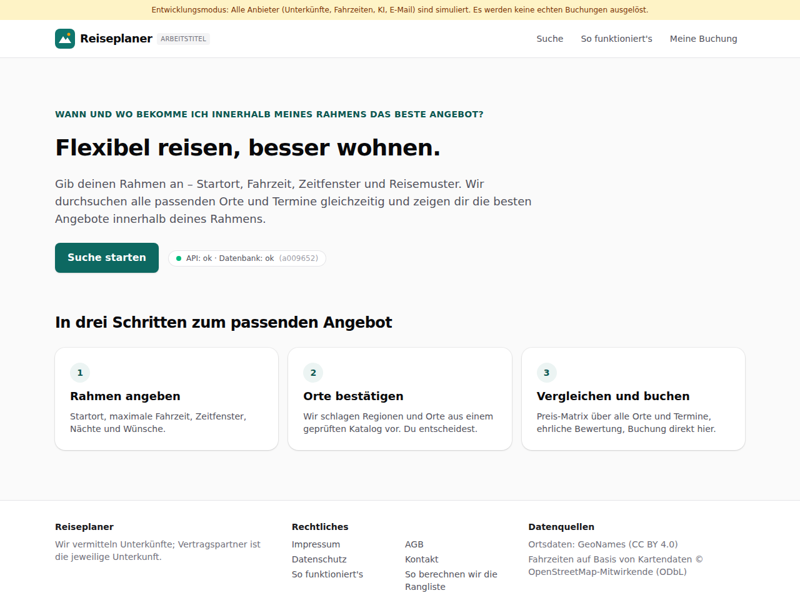

# Dogfood-Walkthrough 2026-09-28T08-04-25-R-all

- Modus: R – Rundgang (erster Besuch, nur Navigation)
- Flows: start, pflichtseiten
- Basis-URL: http://localhost:37351 (echter lokaler Stack, Anbieter im Fake-Modus)
- Stand: a009652, gestartet 2026-09-28T08:04:25.276Z
- Ergebnis: ✅ bestanden (30/30 Prüfungen erfüllt)

## Flow „start“

Erster Besuch der Startseite: Die Statuszeile belegt den Pfad Browser → Worker → Datenbank.

### 01 Startseite

- URL: `/`
- Screenshot: 
- Prüfungen:
  - [x] enthält „API: ok · Datenbank: ok“
  - [x] enthält „Suche starten“
  - [x] enthält „Impressum“
  - [x] enthält „Datenschutz“
  - [x] enthält „AGB“
  - [x] enthält „Kontakt“
  - [x] Element `[data-testid="site-footer"]` vorhanden (1)
  - [x] Element `[data-testid="attribution"]` vorhanden (1)
- Überschriften: „Flexibel reisen, besser wohnen.“, „In drei Schritten zum passenden Angebot“
- KI-Kennzeichnungen (`data-ai-provenance`): keine
- Konsolenfehler: keine
- Fehlgeschlagene Anfragen: keine

<details><summary>Sichtbarer Text</summary>

```text
Entwicklungsmodus: Alle Anbieter (Unterkünfte, Fahrzeiten, KI, E-Mail) sind simuliert. Es werden keine echten Buchungen ausgelöst.
Reiseplaner
ARBEITSTITEL
Suche
So funktioniert's
Meine Buchung

WANN UND WO BEKOMME ICH INNERHALB MEINES RAHMENS DAS BESTE ANGEBOT?

Flexibel reisen, besser wohnen.

Gib deinen Rahmen an – Startort, Fahrzeit, Zeitfenster und Reisemuster. Wir durchsuchen alle passenden Orte und Termine gleichzeitig und zeigen dir die besten Angebote innerhalb deines Rahmens.

Suche starten

API: ok · Datenbank: ok
(a009652)

In drei Schritten zum passenden Angebot
1
Rahmen angeben

Startort, maximale Fahrzeit, Zeitfenster, Nächte und Wünsche.

2
Orte bestätigen

Wir schlagen Regionen und Orte aus einem geprüften Katalog vor. Du entscheidest.

3
Vergleichen und buchen

Preis-Matrix über alle Orte und Termine, ehrliche Bewertung, Buchung direkt hier.

Reiseplaner

Wir vermitteln Unterkünfte; Vertragspartner ist die jeweilige Unterkunft.

Rechtliches

Impressum
AGB
Datenschutz
Kontakt
So funktioniert's
So berechnen wir die Rangliste

Datenquellen

Ortsdaten: GeoNames (CC BY 4.0)
Fahrzeiten auf Basis von Kartendaten © OpenStreetMap-Mitwirkende (ODbL)
```

</details>

## Flow „pflichtseiten“

Pflicht- und Transparenzseiten (F14): Impressum, AGB, Datenschutz und Kontakt sind von Startseite, Suche und „So funktioniert's“ aus über die Fußzeile erreichbar; Platzhalter sind markiert; „So funktioniert's“ erklärt Datenquelle, Vermittlerrolle, Zahlung, Rangliste und KI-Einsatz mit den KI-Kennzeichnungen.

### 02 Impressum über die Fußzeile

- URL: `/impressum`
- Screenshot: 
- Notiz: Impressum von 3 Seiten aus erreicht (Start, Suche, So funktioniert's).
- Prüfungen:
  - [x] enthält „Impressum“
  - [x] enthält „Anbieter (§ 5 DDG)“
  - [x] Element `[data-testid="legal-page"]` vorhanden (1)
- Überschriften: „Impressum“, „Anbieter (§ 5 DDG)“, „Vertreten durch“, „Kontakt“, „Registereintrag“, „Umsatzsteuer-Identifikationsnummer“, „Verantwortlich für den Inhalt (§ 18 Abs. 2 MStV)“, „Rolle des Betreibers“, „Verbraucherstreitbeilegung“
- KI-Kennzeichnungen (`data-ai-provenance`): keine
- Konsolenfehler: keine
- Fehlgeschlagene Anfragen: keine

<details><summary>Sichtbarer Text</summary>

```text
Entwicklungsmodus: Alle Anbieter (Unterkünfte, Fahrzeiten, KI, E-Mail) sind simuliert. Es werden keine echten Buchungen ausgelöst.
Reiseplaner
ARBEITSTITEL
Suche
So funktioniert's
Meine Buchung
Impressum
Platzhalter: Die endgültigen Rechtstexte folgen nach der Entscheidung über den Betreiber und der Prüfung durch den Anwalt (BG-02). Die Gliederung enthält bereits alle Pflichtabschnitte.
Anbieter (§ 5 DDG)

Fischermann Intelligence
[Anschrift folgt – Platzhalter bis BG-02]

Vertreten durch

[Vertretungsberechtigte Person folgt – Platzhalter bis BG-02]

Kontakt

kontakt@reiseplaner.example

Registereintrag

[Registereintrag folgt – Platzhalter bis BG-02]

Umsatzsteuer-Identifikationsnummer

[USt-IdNr. folgt – Platzhalter bis BG-02]

Verantwortlich für den Inhalt (§ 18 Abs. 2 MStV)

[Vertretungsberechtigte Person folgt – Platzhalter bis BG-02]

Rolle des Betreibers

Wir vermitteln Unterkünfte. Vertragspartner für die Beherbergung ist die jeweilige Unterkunft; Zahlung und Buchungsabwicklung übernimmt LiteAPI (Nuitée) als Merchant of Record.

Verbraucherstreitbeilegung

Wir sind nicht verpflichtet und nicht bereit, an einem Streitbeilegungsverfahren vor einer Verbraucherschlichtungsstelle teilzunehmen. [Platzhalter, anwaltlich zu prüfen]

Reiseplaner

Wir vermitteln Unterkünfte; Vertragspartner ist die jeweilige Unterkunft.

Rechtliches

Impressum
AGB
Datenschutz
Kontakt
So funktioniert's
So berechnen wir die Rangliste

Datenquellen

Ortsdaten: GeoNames (CC BY 4.0)
Fahrzeiten auf Basis von Kartendaten © OpenStreetMap-Mitwirkende (ODbL)
```

</details>

### 03 Allgemeine Geschäftsbedingungen über die Fußzeile

- URL: `/agb`
- Screenshot: 
- Notiz: AGB von 3 Seiten aus erreicht (Start, Suche, So funktioniert's).
- Prüfungen:
  - [x] enthält „Allgemeine Geschäftsbedingungen“
  - [x] enthält „Kein Widerrufsrecht“
  - [x] Element `[data-testid="legal-page"]` vorhanden (1)
- Überschriften: „Allgemeine Geschäftsbedingungen“, „1. Geltungsbereich“, „2. Unsere Rolle als Vermittler“, „3. Vertragsschluss“, „4. Preise und Zahlung“, „5. Stornierung“, „6. Kein Widerrufsrecht“, „7. Haftung“, „8. Datenschutz“, „9. Schlussbestimmungen“
- KI-Kennzeichnungen (`data-ai-provenance`): keine
- Konsolenfehler: keine
- Fehlgeschlagene Anfragen: keine

<details><summary>Sichtbarer Text</summary>

```text
Entwicklungsmodus: Alle Anbieter (Unterkünfte, Fahrzeiten, KI, E-Mail) sind simuliert. Es werden keine echten Buchungen ausgelöst.
Reiseplaner
ARBEITSTITEL
Suche
So funktioniert's
Meine Buchung
Allgemeine Geschäftsbedingungen
Platzhalter: Die endgültigen Rechtstexte folgen nach der Entscheidung über den Betreiber und der Prüfung durch den Anwalt (BG-02). Die Gliederung enthält bereits alle Pflichtabschnitte.
1. Geltungsbereich

Diese Bedingungen gelten für die Nutzung der Suche und die Vermittlung von Unterkünften über diese Website. [Platzhalter]

2. Unsere Rolle als Vermittler

Wir vermitteln Unterkünfte. Der Beherbergungsvertrag kommt zwischen dir und der Unterkunft zustande. Zahlung und Buchungsabwicklung übernimmt LiteAPI (Nuitée) als Merchant of Record. [Platzhalter]

3. Vertragsschluss

Mit „Weiter zur Zahlung“ reservierst du das Angebot. Der Vertrag mit der Unterkunft kommt mit der Buchungsbestätigung zustande, die die Bestätigungsnummer der Unterkunft enthält. [Platzhalter]

4. Preise und Zahlung

Es gilt der Gesamtpreis, der vor der Zahlung angezeigt wird. Beträge, die vor Ort zu zahlen sind (etwa Kurtaxe), nennen wir vor der Buchung, soweit sie bekannt sind. [Platzhalter]

5. Stornierung

Es gelten die Stornobedingungen des gebuchten Tarifs, die vor der Buchung angezeigt werden. [Platzhalter]

6. Kein Widerrufsrecht

Bei Beherbergungsleistungen zu einem bestimmten Termin besteht kein Widerrufsrecht (§ 312g Abs. 2 Nr. 9 BGB). [Platzhalter]

7. Haftung

[Platzhalter: Haftungsregelung folgt nach anwaltlicher Prüfung]

8. Datenschutz

Wie wir mit deinen Daten umgehen, steht in der Datenschutzerklärung.

9. Schlussbestimmungen

[Platzhalter: Rechtswahl, Gerichtsstand, salvatorische Klausel]

Reiseplaner

Wir vermitteln Unterkünfte; Vertragspartner ist die jeweilig
… (229 weitere Zeichen)
```

</details>

### 04 Datenschutzerklärung über die Fußzeile

- URL: `/datenschutz`
- Screenshot: 
- Notiz: Datenschutz von 3 Seiten aus erreicht (Start, Suche, So funktioniert's).
- Prüfungen:
  - [x] enthält „Datenschutzerklärung“
  - [x] enthält „Deine Rechte“
  - [x] Element `[data-testid="legal-page"]` vorhanden (1)
- Überschriften: „Datenschutzerklärung“, „Verantwortlicher“, „Welche Daten wir wofür verarbeiten“, „Auftragsverarbeiter und Empfänger“, „Cookies und Tracking“, „Deine Rechte“
- KI-Kennzeichnungen (`data-ai-provenance`): keine
- Konsolenfehler: keine
- Fehlgeschlagene Anfragen: keine

<details><summary>Sichtbarer Text</summary>

```text
Entwicklungsmodus: Alle Anbieter (Unterkünfte, Fahrzeiten, KI, E-Mail) sind simuliert. Es werden keine echten Buchungen ausgelöst.
Reiseplaner
ARBEITSTITEL
Suche
So funktioniert's
Meine Buchung
Datenschutzerklärung
Platzhalter: Die endgültigen Rechtstexte folgen nach der Entscheidung über den Betreiber und der Prüfung durch den Anwalt (BG-02). Die Gliederung enthält bereits alle Pflichtabschnitte.
Verantwortlicher

Fischermann Intelligence, [Anschrift folgt – Platzhalter bis BG-02], kontakt@reiseplaner.example

Welche Daten wir wofür verarbeiten
Suchparameter mit Startort
Um die Suche auszuführen (Art. 6 Abs. 1 lit. b DSGVO). Gelöscht nach 30 Tagen. Die Koordinaten der Startzelle gehen an openrouteservice, Orte, Termine und Personenzahl an LiteAPI.
IP-Adresse
Nur als Tages-Hash zum Schutz vor Missbrauch (Art. 6 Abs. 1 lit. f DSGVO), gelöscht nach 7 Tagen.
Freitext-Wünsche
Werden per KI in Auswahl-Chips übersetzt (Anthropic) und nicht gespeichert (Art. 6 Abs. 1 lit. b DSGVO).
Ausschnitte aus Gästebewertungen
Werden ohne Namen per KI auf Beschwerden geprüft (Anthropic); wir speichern nur zusammengefasste Ergebnisse (Art. 6 Abs. 1 lit. f DSGVO).
Gastdaten (Name, E-Mail, Telefon)
Für Buchung, Bestätigung, Stornierung und die Einladung zur Bewertung (Art. 6 Abs. 1 lit. b DSGVO). Weitergabe an LiteAPI und Resend. Anonymisiert 90 Tage nach der Abreise (vorläufige Frist).
Zahlungsdaten
Gibst du nur im Zahlungsformular von LiteAPI ein; wir sehen und speichern sie nicht.
Server-Logs
Für Betrieb und Sicherheit (Art. 6 Abs. 1 lit. f DSGVO), höchstens 30 Tage, ohne vollständige E-Mail-Adressen.
Auftragsverarbeiter und Empfänger

Cloudflare (Hosting), Supabase (Datenbank, Region Frankfurt), Anthropic (KI, USA, nur Inhalte ohne Personenbezug), Resend (E-Mail), HeiGIT (openrouteservice
… (877 weitere Zeichen)
```

</details>

### 05 Kontakt über die Fußzeile

- URL: `/kontakt`
- Screenshot: 
- Notiz: Kontakt von 3 Seiten aus erreicht (Start, Suche, So funktioniert's).
- Prüfungen:
  - [x] enthält „Kontakt“
  - [x] enthält „Wir antworten in der Regel innerhalb von“
  - [x] Element `[data-testid="legal-page"]` vorhanden (1)
- Überschriften: „Kontakt“
- KI-Kennzeichnungen (`data-ai-provenance`): keine
- Konsolenfehler: keine
- Fehlgeschlagene Anfragen: keine

<details><summary>Sichtbarer Text</summary>

```text
Entwicklungsmodus: Alle Anbieter (Unterkünfte, Fahrzeiten, KI, E-Mail) sind simuliert. Es werden keine echten Buchungen ausgelöst.
Reiseplaner
ARBEITSTITEL
Suche
So funktioniert's
Meine Buchung
Kontakt

Schreib uns an support@reiseplaner.example. Wir antworten in der Regel innerhalb von 48 Stunden.

Fragen zu einer Buchung? Gib bitte deine Buchungsnummer an. Anliegen, die die Unterkunft selbst betreffen, leiten wir an den Support von LiteAPI weiter.

Reiseplaner

Wir vermitteln Unterkünfte; Vertragspartner ist die jeweilige Unterkunft.

Rechtliches

Impressum
AGB
Datenschutz
Kontakt
So funktioniert's
So berechnen wir die Rangliste

Datenquellen

Ortsdaten: GeoNames (CC BY 4.0)
Fahrzeiten auf Basis von Kartendaten © OpenStreetMap-Mitwirkende (ODbL)
```

</details>

### 06 „So funktioniert's“ mit KI-Kennzeichnungen

- URL: `/so-funktionierts`
- Screenshot: 
- Prüfungen:
  - [x] enthält „Woher die Angebote kommen“
  - [x] enthält „Unsere Rolle“
  - [x] enthält „Zahlung“
  - [x] enthält „Rangliste“
  - [x] enthält „Einsatz von KI“
  - [x] enthält „GeoNames (CC BY 4.0)“
  - [x] enthält „OpenStreetMap“
  - [x] enthält „KI-gestützte Auswertung von Gästebewertungen“
  - [x] enthält nicht „Platzhalter: Die endgültigen Rechtstexte“
  - [x] Element `[data-ai-provenance="ai_assisted"]` vorhanden (4)
- Überschriften: „So funktioniert's“, „Woher die Angebote kommen“, „Unsere Rolle“, „Zahlung“, „Rangliste“, „Einsatz von KI“, „Datenquellen“
- KI-Kennzeichnungen (`data-ai-provenance`): „KI-gestützte Auswertung von Gästebewertungen [ai_assisted]“, „KI-gestützt erstellt, redaktionell geprüft [ai_assisted]“, „KI-gestützt erstellt, redaktionelle Prüfung ausstehend [ai_assisted]“, „Deine Eingabe wird per KI in Auswahl-Chips übersetzt. Bitte prüfe die Auswahl. [ai_assisted]“
- Konsolenfehler: keine
- Fehlgeschlagene Anfragen: keine

<details><summary>Sichtbarer Text</summary>

```text
Entwicklungsmodus: Alle Anbieter (Unterkünfte, Fahrzeiten, KI, E-Mail) sind simuliert. Es werden keine echten Buchungen ausgelöst.
Reiseplaner
ARBEITSTITEL
Suche
So funktioniert's
Meine Buchung
So funktioniert's

Reiseplaner sucht für dich über viele Orte und Termine gleichzeitig nach Unterkünften und zeigt ehrlich, was die Angebote taugen.

Woher die Angebote kommen

Preise, Verfügbarkeit, Beschreibungen und Gästebewertungen stammen von LiteAPI (Nuitée), einem Großhändler für Unterkunftsangebote. Wir fragen alle Kombinationen aus deinen Orten und Terminen gleichzeitig ab.

Unsere Rolle

Wir vermitteln Unterkünfte. Vertragspartner für den Aufenthalt ist die Unterkunft; jede Bestätigung enthält ihre Bestätigungsnummer, mit der du die Buchung direkt bei ihr prüfen kannst.

Zahlung

Du zahlst im Zahlungsformular von LiteAPI mit gängigen Zahlungsmitteln. Wir sehen keine Kartendaten. Bei einer Kreditkarte hast du zusätzlich die Rückbuchungsmöglichkeit deiner Bank.

Rangliste

Die Standardsortierung verbindet einen ehrlichen Qualitätswert mit dem Preis; Unterkünfte können sich keine bessere Platzierung kaufen.

So berechnen wir die Rangliste
Einsatz von KI

Eine KI übersetzt deine Freitext-Wünsche in Auswahl-Chips, prüft Stichwort-Treffer aus Gästebewertungen auf echte Beschwerden und hat die Beschreibungen im Ortskatalog vorbereitet. Alles davon ist auf der Seite gekennzeichnet.

Diese Kennzeichnungen siehst du auf der Seite:

KI-gestützte Auswertung von Gästebewertungen
KI-gestützt erstellt, redaktionell geprüft
KI-gestützt erstellt, redaktionelle Prüfung ausstehend
Deine Eingabe wird per KI in Auswahl-Chips übersetzt. Bitte prüfe die Auswahl.
Datenquellen

Ortsdaten: GeoNames (CC BY 4.0). Fahrzeiten: openrouteservice auf Basis von Kartendaten der OpenStreetMap-Mitwirkenden
… (312 weitere Zeichen)
```

</details>

