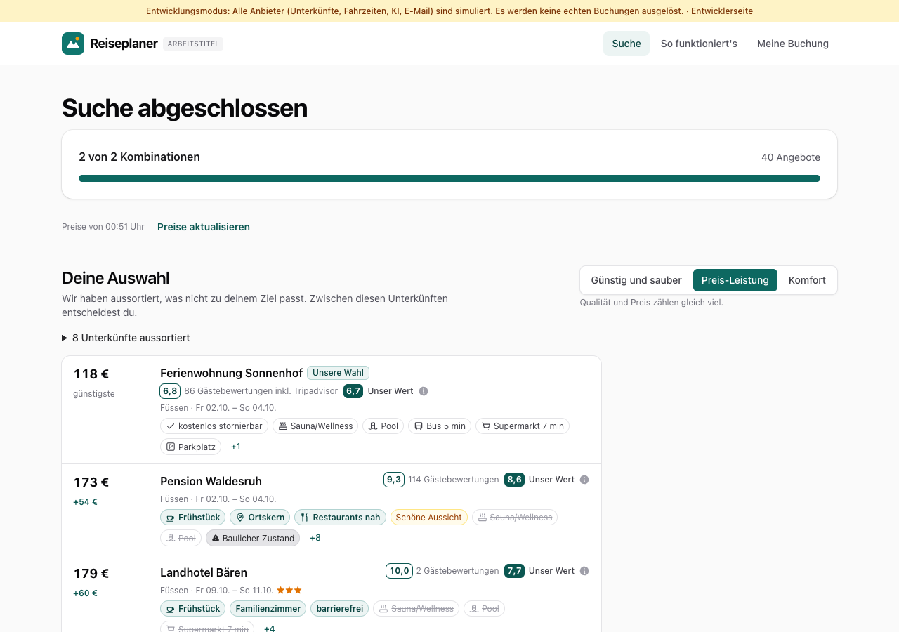
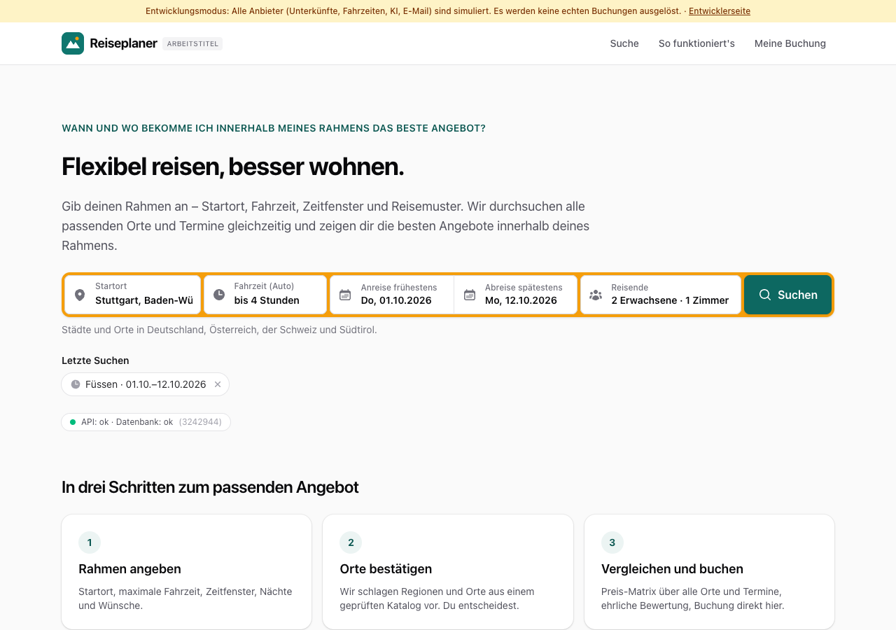
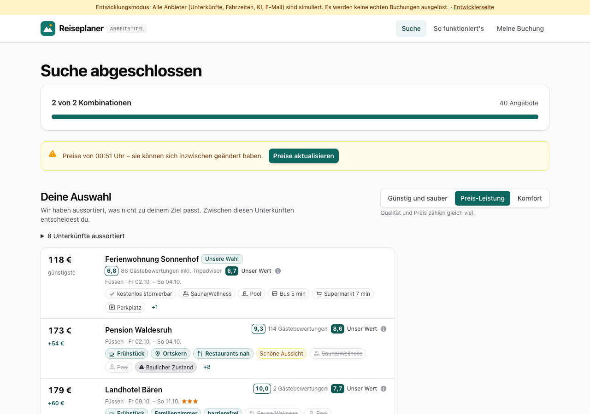
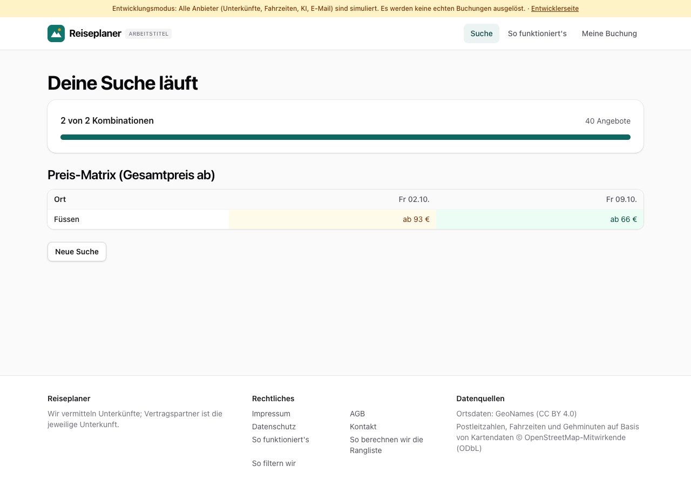

# Dogfood-Walkthrough 2026-09-30T22-51-27-P-suchverlauf

- Modus: P – Pfad (Nutzerablauf mit Eingaben)
- Flows: suchverlauf
- Basis-URL: http://localhost:5391 (echter lokaler Stack, Anbieter im Fake-Modus)
- Stand: 194e50b, gestartet 2026-09-30T22:51:27.969Z
- Ergebnis: ✅ bestanden (11/11 Prüfungen erfüllt)

## Flow „suchverlauf“

Letzte Suchen und frische Preise (B3): die Startseite zeigt die letzten Suchen dieses Browsers; nach 30 Minuten warnt die Ergebnisseite vor alten Preisen und startet dieselbe Suche neu.

### 01 Suche Füssen, 2 Termine: Preise mit Uhrzeit

- URL: `/suche/570eff89-0ee2-4604-a14d-62511259756a#t=_nGSlxLGiu28TU5-zsqQW2kRMk1PswUIZYXfL0__rlU`
- Screenshot: 
- Prüfungen:
  - [x] enthält „Preise von“
  - [x] enthält „Preise aktualisieren“
  - [x] Element `[data-testid="fetched-at"]:not([data-stale])` vorhanden (1)
- Überschriften: „Suche abgeschlossen“, „Deine Auswahl“, „Alle Angebote“
- KI-Kennzeichnungen (`data-ai-provenance`): „KI-gestützte Auswertung von Gästebewertungen [ai_assisted]“, „KI-gestützte Auswertung von Gästebewertungen [ai_assisted]“
- Konsolenfehler: keine
- Fehlgeschlagene Anfragen: keine

<details><summary>Sichtbarer Text</summary>

```text
Entwicklungsmodus: Alle Anbieter (Unterkünfte, Fahrzeiten, KI, E-Mail) sind simuliert. Es werden keine echten Buchungen ausgelöst. · Entwicklerseite
Reiseplaner
ARBEITSTITEL
Suche
So funktioniert's
Meine Buchung
Suche abgeschlossen

2 von 2 Kombinationen

40 Angebote

Preise von 00:51 Uhr
Preise aktualisieren

Deine Auswahl

Wir haben aussortiert, was nicht zu deinem Ziel passt. Zwischen diesen Unterkünften entscheidest du.

Günstig und sauber
Preis-Leistung
Komfort

Qualität und Preis zählen gleich viel.

8 Unterkünfte aussortiert
118 €
günstigste
Ferienwohnung Sonnenhof
Unsere Wahl
6,8
86 Gästebewertungen inkl. Tripadvisor
6,7
Unser Wert

Füssen · Fr 02.10. – So 04.10.

kostenlos stornierbar
Sauna/Wellness
Pool
Bus 5 min
Supermarkt 7 min
Parkplatz
+1
173 €
+54 €
Pension Waldesruh
9,3
114 Gästebewertungen
8,6
Unser Wert

Füssen · Fr 02.10. – So 04.10.

Frühstück
Ortskern
Restaurants nah
Schöne Aussicht
Sauna/Wellness
Pool
Baulicher Zustand
+8
179 €
+60 €
Landhotel Bären
10,0
2 Gästebewertungen
7,7
Unser Wert

Füssen · Fr 09.10. – So 11.10.★★★

Frühstück
Familienzimmer
barrierefrei
Sauna/Wellness
Pool
Supermarkt 7 min
+4
197 €
+78 €
Gasthof Waldesruh
8,9
44 Gästebewertungen
8,9
Unser Wert

Füssen · Fr 02.10. – So 04.10.★★

Frühstück
Ruhig
Gute Lage
Hund erlaubt
kostenlos stornierbar
Sauna/Wellness
+6
271 €
+152 €
Landhotel Lindenhof
7,9
264 Gästebewertungen
7,9
Unser Wert

Füssen · Fr 02.10. – So 04.10.★★★

Frühstück
Ortskern
Familienzimmer
Restaurant
Sauna/Wellness
Pool
+5

Legende

Verglichen mit der günstigsten Unterkunft

Sauna
zusätzlich
Bus 5 min
gleich
Pool
fehlt
Unsere Wahl
bestes Verhältnis aus Preis und Bewertung

Aus Gästebewertungen

Ruhig
Lob
Lärm
Kritik

Lob und Kritik stammen aus Bewertungen von Gästen, nicht von der Unterkunft.

Gehminuten: Kartendaten ©
… (5677 weitere Zeichen)
```

</details>

### 02 Startseite: „Letzte Suchen“ mit Ort und Zeitraum

- URL: `/`
- Screenshot: 
- Notiz: Einträge: Füssen · 01.10.–12.10.2026
- Prüfungen:
  - [x] enthält „Letzte Suchen“
  - [x] enthält „Füssen · 01.10.–12.10.2026“
- Überschriften: „Flexibel reisen, besser wohnen.“, „Letzte Suchen“, „In drei Schritten zum passenden Angebot“
- KI-Kennzeichnungen (`data-ai-provenance`): keine
- Konsolenfehler: keine
- Fehlgeschlagene Anfragen: keine

<details><summary>Sichtbarer Text</summary>

```text
Entwicklungsmodus: Alle Anbieter (Unterkünfte, Fahrzeiten, KI, E-Mail) sind simuliert. Es werden keine echten Buchungen ausgelöst. · Entwicklerseite
Reiseplaner
ARBEITSTITEL
Suche
So funktioniert's
Meine Buchung

WANN UND WO BEKOMME ICH INNERHALB MEINES RAHMENS DAS BESTE ANGEBOT?

Flexibel reisen, besser wohnen.

Gib deinen Rahmen an – Startort, Fahrzeit, Zeitfenster und Reisemuster. Wir durchsuchen alle passenden Orte und Termine gleichzeitig und zeigen dir die besten Angebote innerhalb deines Rahmens.

Startort
Fahrzeit (Auto)
egal
bis 1 Stunde
bis 1 h 30 min
bis 2 Stunden
bis 2 h 30 min
bis 3 Stunden
bis 4 Stunden
bis 5 Stunden
bis 6 Stunden
Anreise frühestens
Do, 01.10.2026
Abreise spätestens
Mo, 12.10.2026
Reisende
2 Erwachsene · 1 Zimmer
Suchen

Städte und Orte in Deutschland, Österreich, der Schweiz und Südtirol.

Letzte Suchen
Füssen · 01.10.–12.10.2026

API: ok · Datenbank: ok
(3242944)

In drei Schritten zum passenden Angebot
1
Rahmen angeben

Startort, maximale Fahrzeit, Zeitfenster, Nächte und Wünsche.

2
Orte bestätigen

Wir schlagen Regionen und Orte aus einem geprüften Katalog vor. Du entscheidest.

3
Vergleichen und buchen

Preis-Matrix über alle Orte und Termine, ehrliche Bewertung, Buchung direkt hier.

Reiseplaner

Wir vermitteln Unterkünfte; Vertragspartner ist die jeweilige Unterkunft.

Rechtliches

Impressum
AGB
Datenschutz
Kontakt
So funktioniert's
So berechnen wir die Rangliste
So filtern wir

Datenquellen

Ortsdaten: GeoNames (CC BY 4.0)
Postleitzahlen, Fahrzeiten und Gehminuten auf Basis von Kartendaten © OpenStreetMap-Mitwirkende (ODbL)
```

</details>

### 03 Klick auf die letzte Suche öffnet ihre Ergebnisse

- URL: `/suche/570eff89-0ee2-4604-a14d-62511259756a#t=_nGSlxLGiu28TU5-zsqQW2kRMk1PswUIZYXfL0__rlU`
- Screenshot: 
- Prüfungen:
  - [x] enthält „Alle Angebote“
- Überschriften: „Suche abgeschlossen“, „Deine Auswahl“, „Alle Angebote“
- KI-Kennzeichnungen (`data-ai-provenance`): „KI-gestützte Auswertung von Gästebewertungen [ai_assisted]“, „KI-gestützte Auswertung von Gästebewertungen [ai_assisted]“
- Konsolenfehler: keine
- Fehlgeschlagene Anfragen: keine

<details><summary>Sichtbarer Text</summary>

```text
Entwicklungsmodus: Alle Anbieter (Unterkünfte, Fahrzeiten, KI, E-Mail) sind simuliert. Es werden keine echten Buchungen ausgelöst. · Entwicklerseite
Reiseplaner
ARBEITSTITEL
Suche
So funktioniert's
Meine Buchung
Suche abgeschlossen

2 von 2 Kombinationen

40 Angebote

Preise von 00:51 Uhr
Preise aktualisieren

Deine Auswahl

Wir haben aussortiert, was nicht zu deinem Ziel passt. Zwischen diesen Unterkünften entscheidest du.

Günstig und sauber
Preis-Leistung
Komfort

Qualität und Preis zählen gleich viel.

8 Unterkünfte aussortiert
118 €
günstigste
Ferienwohnung Sonnenhof
Unsere Wahl
6,8
86 Gästebewertungen inkl. Tripadvisor
6,7
Unser Wert

Füssen · Fr 02.10. – So 04.10.

kostenlos stornierbar
Sauna/Wellness
Pool
Bus 5 min
Supermarkt 7 min
Parkplatz
+1
173 €
+54 €
Pension Waldesruh
9,3
114 Gästebewertungen
8,6
Unser Wert

Füssen · Fr 02.10. – So 04.10.

Frühstück
Ortskern
Restaurants nah
Schöne Aussicht
Sauna/Wellness
Pool
Baulicher Zustand
+8
179 €
+60 €
Landhotel Bären
10,0
2 Gästebewertungen
7,7
Unser Wert

Füssen · Fr 09.10. – So 11.10.★★★

Frühstück
Familienzimmer
barrierefrei
Sauna/Wellness
Pool
Supermarkt 7 min
+4
197 €
+78 €
Gasthof Waldesruh
8,9
44 Gästebewertungen
8,9
Unser Wert

Füssen · Fr 02.10. – So 04.10.★★

Frühstück
Ruhig
Gute Lage
Hund erlaubt
kostenlos stornierbar
Sauna/Wellness
+6
271 €
+152 €
Landhotel Lindenhof
7,9
264 Gästebewertungen
7,9
Unser Wert

Füssen · Fr 02.10. – So 04.10.★★★

Frühstück
Ortskern
Familienzimmer
Restaurant
Sauna/Wellness
Pool
+5

Legende

Verglichen mit der günstigsten Unterkunft

Sauna
zusätzlich
Bus 5 min
gleich
Pool
fehlt
Unsere Wahl
bestes Verhältnis aus Preis und Bewertung

Aus Gästebewertungen

Ruhig
Lob
Lärm
Kritik

Lob und Kritik stammen aus Bewertungen von Gästen, nicht von der Unterkunft.

Gehminuten: Kartendaten ©
… (5677 weitere Zeichen)
```

</details>

### 04 40 Minuten später: Hinweis auf alte Preise mit „Preise aktualisieren“

- URL: `/suche/570eff89-0ee2-4604-a14d-62511259756a#t=_nGSlxLGiu28TU5-zsqQW2kRMk1PswUIZYXfL0__rlU`
- Screenshot: 
- Prüfungen:
  - [x] enthält „sie können sich inzwischen geändert haben“
  - [x] enthält „Preise aktualisieren“
  - [x] Element `[data-testid="fetched-at"][data-stale] [data-testid="refresh-prices"]` vorhanden (1)
- Überschriften: „Suche abgeschlossen“, „Deine Auswahl“, „Alle Angebote“
- KI-Kennzeichnungen (`data-ai-provenance`): „KI-gestützte Auswertung von Gästebewertungen [ai_assisted]“, „KI-gestützte Auswertung von Gästebewertungen [ai_assisted]“
- Konsolenfehler: keine
- Fehlgeschlagene Anfragen: keine

<details><summary>Sichtbarer Text</summary>

```text
Entwicklungsmodus: Alle Anbieter (Unterkünfte, Fahrzeiten, KI, E-Mail) sind simuliert. Es werden keine echten Buchungen ausgelöst. · Entwicklerseite
Reiseplaner
ARBEITSTITEL
Suche
So funktioniert's
Meine Buchung
Suche abgeschlossen

2 von 2 Kombinationen

40 Angebote

Preise von 00:51 Uhr – sie können sich inzwischen geändert haben.
Preise aktualisieren
Deine Auswahl

Wir haben aussortiert, was nicht zu deinem Ziel passt. Zwischen diesen Unterkünften entscheidest du.

Günstig und sauber
Preis-Leistung
Komfort

Qualität und Preis zählen gleich viel.

8 Unterkünfte aussortiert
118 €
günstigste
Ferienwohnung Sonnenhof
Unsere Wahl
6,8
86 Gästebewertungen inkl. Tripadvisor
6,7
Unser Wert

Füssen · Fr 02.10. – So 04.10.

kostenlos stornierbar
Sauna/Wellness
Pool
Bus 5 min
Supermarkt 7 min
Parkplatz
+1
173 €
+54 €
Pension Waldesruh
9,3
114 Gästebewertungen
8,6
Unser Wert

Füssen · Fr 02.10. – So 04.10.

Frühstück
Ortskern
Restaurants nah
Schöne Aussicht
Sauna/Wellness
Pool
Baulicher Zustand
+8
179 €
+60 €
Landhotel Bären
10,0
2 Gästebewertungen
7,7
Unser Wert

Füssen · Fr 09.10. – So 11.10.★★★

Frühstück
Familienzimmer
barrierefrei
Sauna/Wellness
Pool
Supermarkt 7 min
+4
197 €
+78 €
Gasthof Waldesruh
8,9
44 Gästebewertungen
8,9
Unser Wert

Füssen · Fr 02.10. – So 04.10.★★

Frühstück
Ruhig
Gute Lage
Hund erlaubt
kostenlos stornierbar
Sauna/Wellness
+6
271 €
+152 €
Landhotel Lindenhof
7,9
264 Gästebewertungen
7,9
Unser Wert

Füssen · Fr 02.10. – So 04.10.★★★

Frühstück
Ortskern
Familienzimmer
Restaurant
Sauna/Wellness
Pool
+5

Legende

Verglichen mit der günstigsten Unterkunft

Sauna
zusätzlich
Bus 5 min
gleich
Pool
fehlt
Unsere Wahl
bestes Verhältnis aus Preis und Bewertung

Aus Gästebewertungen

Ruhig
Lob
Lärm
Kritik

Lob und Kritik stammen aus Bewertungen von Gästen, nicht vo
… (5721 weitere Zeichen)
```

</details>

### 05 „Preise aktualisieren“ startet dieselbe Suche neu

- URL: `/suche/5ad98564-a0f0-4f54-85f2-06186e9fc603#t=4PPJcioZ3W7hgnp1aL_q4Zx9ZdwmUEAwf0wWstcxgNI`
- Screenshot: 
- Notiz: Neue Suche: http://localhost:5391/suche/5ad98564-a0f0-4f54-85f2-06186e9fc603
- Prüfungen:
  - [x] enthält „Kombinationen“
- Überschriften: „Deine Suche läuft“, „Preis-Matrix (Gesamtpreis ab)“
- KI-Kennzeichnungen (`data-ai-provenance`): keine
- Konsolenfehler: Failed to load resource: the server responded with a status of 404 (Not Found) | Failed to load resource: the server responded with a status of 404 (Not Found)
- Fehlgeschlagene Anfragen: keine

<details><summary>Sichtbarer Text</summary>

```text
Entwicklungsmodus: Alle Anbieter (Unterkünfte, Fahrzeiten, KI, E-Mail) sind simuliert. Es werden keine echten Buchungen ausgelöst. · Entwicklerseite
Reiseplaner
ARBEITSTITEL
Suche
So funktioniert's
Meine Buchung
Deine Suche läuft

2 von 2 Kombinationen

40 Angebote

Preis-Matrix (Gesamtpreis ab)
Ort	Fr 02.10.	Fr 09.10.
Füssen	ab 93 €	ab 66 €
Neue Suche

Reiseplaner

Wir vermitteln Unterkünfte; Vertragspartner ist die jeweilige Unterkunft.

Rechtliches

Impressum
AGB
Datenschutz
Kontakt
So funktioniert's
So berechnen wir die Rangliste
So filtern wir

Datenquellen

Ortsdaten: GeoNames (CC BY 4.0)
Postleitzahlen, Fahrzeiten und Gehminuten auf Basis von Kartendaten © OpenStreetMap-Mitwirkende (ODbL)
```

</details>

### 06 Startseite: beide Suchen, die neue zuerst; eine entfernen

- URL: `/`
- Screenshot: 
- Notiz: Vorher 2, nach „entfernen“ 1.
- Prüfungen:
  - [x] Element `[data-testid="recent-searches"]` vorhanden (1)
- Überschriften: „Flexibel reisen, besser wohnen.“, „Letzte Suchen“, „In drei Schritten zum passenden Angebot“
- KI-Kennzeichnungen (`data-ai-provenance`): keine
- Konsolenfehler: keine
- Fehlgeschlagene Anfragen: keine

<details><summary>Sichtbarer Text</summary>

```text
Entwicklungsmodus: Alle Anbieter (Unterkünfte, Fahrzeiten, KI, E-Mail) sind simuliert. Es werden keine echten Buchungen ausgelöst. · Entwicklerseite
Reiseplaner
ARBEITSTITEL
Suche
So funktioniert's
Meine Buchung

WANN UND WO BEKOMME ICH INNERHALB MEINES RAHMENS DAS BESTE ANGEBOT?

Flexibel reisen, besser wohnen.

Gib deinen Rahmen an – Startort, Fahrzeit, Zeitfenster und Reisemuster. Wir durchsuchen alle passenden Orte und Termine gleichzeitig und zeigen dir die besten Angebote innerhalb deines Rahmens.

Startort
Fahrzeit (Auto)
egal
bis 1 Stunde
bis 1 h 30 min
bis 2 Stunden
bis 2 h 30 min
bis 3 Stunden
bis 4 Stunden
bis 5 Stunden
bis 6 Stunden
Anreise frühestens
Do, 01.10.2026
Abreise spätestens
Mo, 12.10.2026
Reisende
2 Erwachsene · 1 Zimmer
Suchen

Städte und Orte in Deutschland, Österreich, der Schweiz und Südtirol.

Letzte Suchen
Füssen · 01.10.–12.10.2026

API: ok · Datenbank: ok
(3242944)

In drei Schritten zum passenden Angebot
1
Rahmen angeben

Startort, maximale Fahrzeit, Zeitfenster, Nächte und Wünsche.

2
Orte bestätigen

Wir schlagen Regionen und Orte aus einem geprüften Katalog vor. Du entscheidest.

3
Vergleichen und buchen

Preis-Matrix über alle Orte und Termine, ehrliche Bewertung, Buchung direkt hier.

Reiseplaner

Wir vermitteln Unterkünfte; Vertragspartner ist die jeweilige Unterkunft.

Rechtliches

Impressum
AGB
Datenschutz
Kontakt
So funktioniert's
So berechnen wir die Rangliste
So filtern wir

Datenquellen

Ortsdaten: GeoNames (CC BY 4.0)
Postleitzahlen, Fahrzeiten und Gehminuten auf Basis von Kartendaten © OpenStreetMap-Mitwirkende (ODbL)
```

</details>

