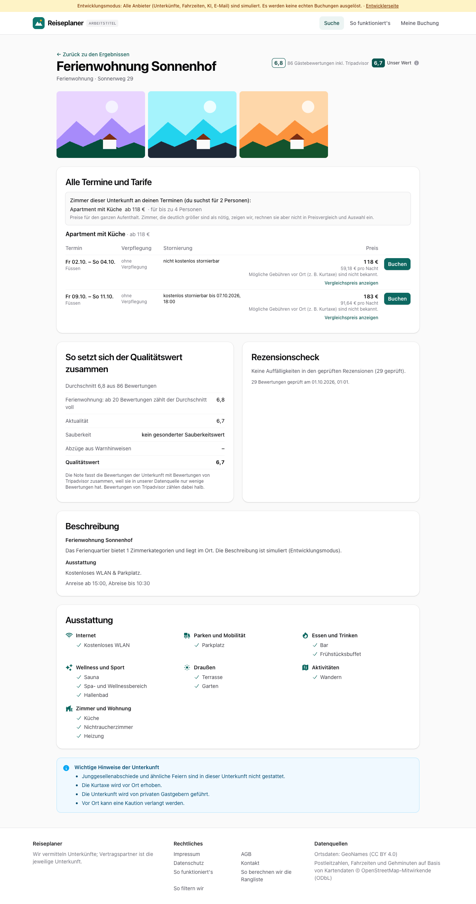
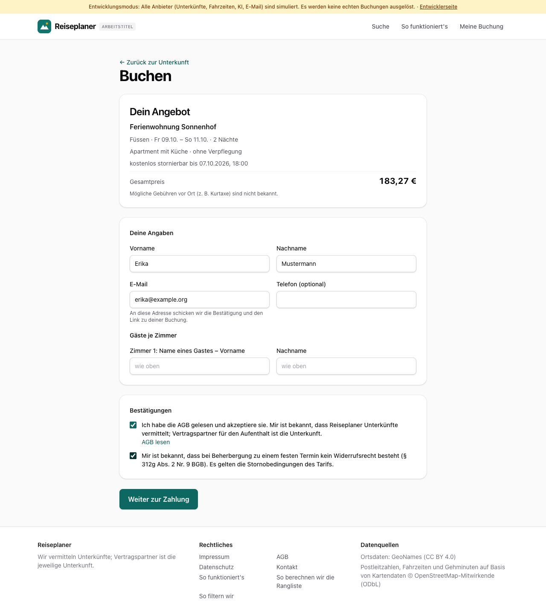
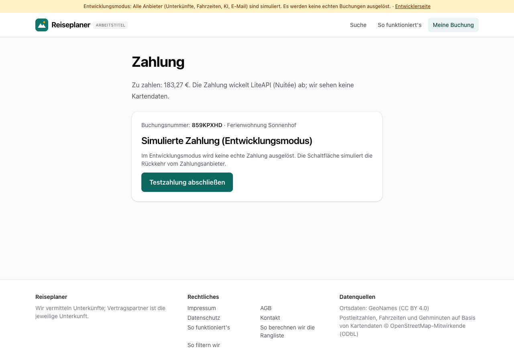
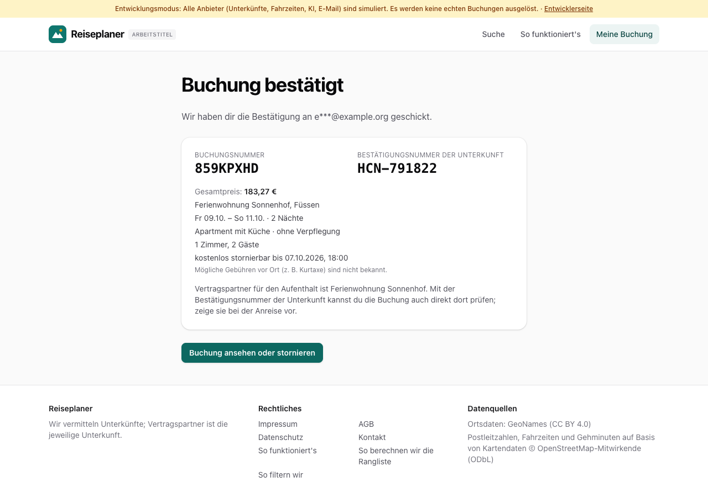
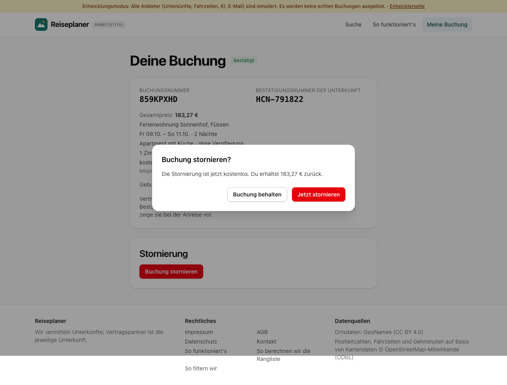
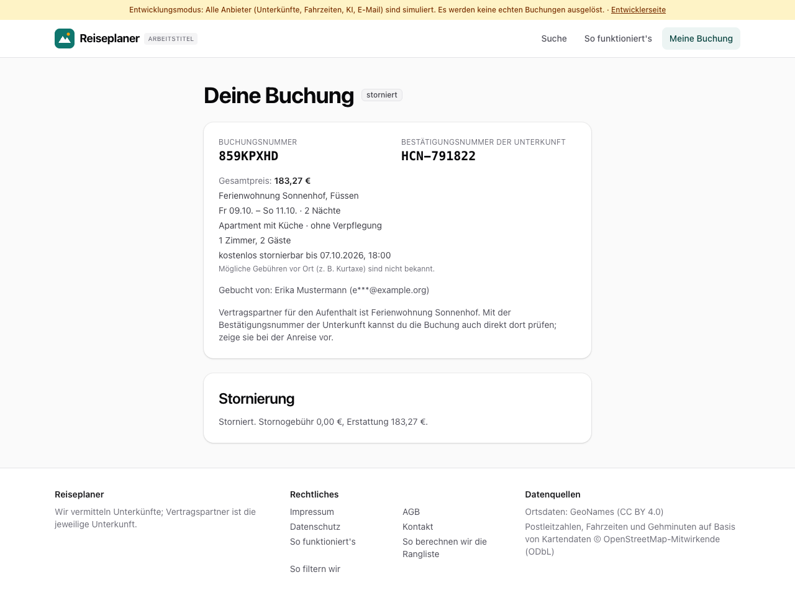
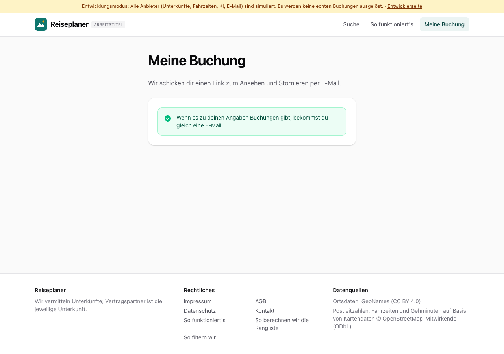

# Dogfood-Walkthrough 2026-09-30T23-00-55-P-buchung

- Modus: P – Pfad (Nutzerablauf mit Eingaben)
- Flows: buchung
- Basis-URL: http://localhost:59866 (echter lokaler Stack, Anbieter im Fake-Modus)
- Stand: 57459f2, gestartet 2026-09-30T23:00:55.636Z
- Ergebnis: ✅ bestanden (37/37 Prüfungen erfüllt)

## Flow „buchung“

Buchung (F11–F13, Akzeptanzbeispiel 5): Suche Füssen × 2 Freitage → Detailansicht → Buchungsformular mit Pflicht-Bestätigungen → simulierte Zahlung (Fake-Modus) → Bestätigung mit Buchungsnummer und Hotel-Bestätigungsnummer → Buchungsansicht → Stornierung mit Kostenvorschau → Zugangslink unter „Meine Buchung“, auch nur mit E-Mail als Übersicht aller Buchungen.

### 01 Suche abgeschlossen, Detailansicht geöffnet

- URL: `/suche/0468bc03-dd32-475a-8a8f-90bcac327efe/unterkunft/lpf-4757-1070-10#t=Zqz2hHygdNWGOgoZrGnLoRy8fJe7gbC2ZhE1LI8nLCg`
- Screenshot: 
- Prüfungen:
  - [x] enthält „Alle Termine und Tarife“
  - [x] enthält „Buchen“
  - [x] Element `[data-testid="book-offer"]` vorhanden (2)
- Überschriften: „Ferienwohnung Sonnenhof“, „Alle Termine und Tarife“, „So setzt sich der Qualitätswert zusammen“, „Rezensionscheck“, „Beschreibung“, „Ausstattung“
- KI-Kennzeichnungen (`data-ai-provenance`): keine
- Konsolenfehler: keine
- Fehlgeschlagene Anfragen: keine

<details><summary>Sichtbarer Text</summary>

```text
Entwicklungsmodus: Alle Anbieter (Unterkünfte, Fahrzeiten, KI, E-Mail) sind simuliert. Es werden keine echten Buchungen ausgelöst. · Entwicklerseite
Reiseplaner
ARBEITSTITEL
Suche
So funktioniert's
Meine Buchung
← Zurück zu den Ergebnissen
Ferienwohnung Sonnenhof

Ferienwohnung · Sonnenweg 29

6,8
86 Gästebewertungen inkl. Tripadvisor
6,7
Unser Wert
Alle Termine und Tarife

Zimmer dieser Unterkunft an deinen Terminen (du suchst für 2 Personen):

Apartment mit Küche
ab 118 €
· für bis zu 4 Personen

Preise für den ganzen Aufenthalt. Zimmer, die deutlich größer sind als nötig, zeigen wir, rechnen sie aber nicht in Preisvergleich und Auswahl ein.

Apartment mit Küche · ab 118 €
Termin	Verpflegung	Stornierung	Preis	

Fr 02.10. – So 04.10.
Füssen
	
ohne Verpflegung
	nicht kostenlos stornierbar	
118 €
59,18 € pro Nacht
Mögliche Gebühren vor Ort (z. B. Kurtaxe) sind nicht bekannt.
Vergleichspreis anzeigen
	Buchen

Fr 09.10. – So 11.10.
Füssen
	
ohne Verpflegung
	kostenlos stornierbar bis 07.10.2026, 18:00	
183 €
91,64 € pro Nacht
Mögliche Gebühren vor Ort (z. B. Kurtaxe) sind nicht bekannt.
Vergleichspreis anzeigen
	Buchen
So setzt sich der Qualitätswert zusammen
Durchschnitt 6,8 aus 86 Bewertungen
Ferienwohnung: ab 20 Bewertungen zählt der Durchschnitt voll
6,8
Aktualität
6,7
Sauberkeit
kein gesonderter Sauberkeitswert
Abzüge aus Warnhinweisen
–
Qualitätswert
6,7

Die Note fasst die Bewertungen der Unterkunft mit Bewertungen von Tripadvisor zusammen, weil sie in unserer Datenquelle nur wenige Bewertungen hat. Bewertungen von Tripadvisor zählen dabei halb.

Rezensionscheck

Keine Auffälligkeiten in den geprüften Rezensionen (29 geprüft).

29 Bewertungen geprüft am 01.10.2026, 01:01.

Beschreibung
Ferienwohnung Sonnenhof

Das Ferienquartier bietet 1 Zimmerkategorien und liegt i
… (1004 weitere Zeichen)
```

</details>

### 02 Buchungsformular mit Angebot, Pflicht-Bestätigungen und Hinweis auf Beträge vor Ort

- URL: `/buchen/0468bc03-dd32-475a-8a8f-90bcac327efe/lpf-4757-1070-10/34#t=Zqz2hHygdNWGOgoZrGnLoRy8fJe7gbC2ZhE1LI8nLCg`
- Screenshot: 
- Prüfungen:
  - [x] enthält „Dein Angebot“
  - [x] enthält „Gesamtpreis“
  - [x] enthält „Deine Angaben“
  - [x] enthält „Gäste je Zimmer“
  - [x] enthält „Vertragspartner für den Aufenthalt ist die Unterkunft“
  - [x] enthält „kein Widerrufsrecht“
  - [x] enthält „Weiter zur Zahlung“
  - [x] Element `[data-testid="booking-summary"]` vorhanden (1)
  - [x] Element `[data-testid="guest-row"]` vorhanden (1)
- Überschriften: „Buchen“, „Dein Angebot“
- KI-Kennzeichnungen (`data-ai-provenance`): keine
- Konsolenfehler: keine
- Fehlgeschlagene Anfragen: keine

<details><summary>Sichtbarer Text</summary>

```text
Entwicklungsmodus: Alle Anbieter (Unterkünfte, Fahrzeiten, KI, E-Mail) sind simuliert. Es werden keine echten Buchungen ausgelöst. · Entwicklerseite
Reiseplaner
ARBEITSTITEL
Suche
So funktioniert's
Meine Buchung
← Zurück zur Unterkunft
Buchen
Dein Angebot

Ferienwohnung Sonnenhof

Füssen · Fr 09.10. – So 11.10. · 2 Nächte

Apartment mit Küche · ohne Verpflegung

kostenlos stornierbar bis 07.10.2026, 18:00

Gesamtpreis
183,27 €

Mögliche Gebühren vor Ort (z. B. Kurtaxe) sind nicht bekannt.

Deine Angaben
Vorname
Nachname
E-Mail

An diese Adresse schicken wir die Bestätigung und den Link zu deiner Buchung.

Telefon (optional)
Gäste je Zimmer
Zimmer 1: Name eines Gastes – Vorname
Nachname
Bestätigungen
Ich habe die AGB gelesen und akzeptiere sie. Mir ist bekannt, dass Reiseplaner Unterkünfte vermittelt; Vertragspartner für den Aufenthalt ist die Unterkunft.
AGB lesen
Mir ist bekannt, dass bei Beherbergung zu einem festen Termin kein Widerrufsrecht besteht (§ 312g Abs. 2 Nr. 9 BGB). Es gelten die Stornobedingungen des Tarifs.
Weiter zur Zahlung

Reiseplaner

Wir vermitteln Unterkünfte; Vertragspartner ist die jeweilige Unterkunft.

Rechtliches

Impressum
AGB
Datenschutz
Kontakt
So funktioniert's
So berechnen wir die Rangliste
So filtern wir

Datenquellen

Ortsdaten: GeoNames (CC BY 4.0)
Postleitzahlen, Fahrzeiten und Gehminuten auf Basis von Kartendaten © OpenStreetMap-Mitwirkende (ODbL)
```

</details>

### 03 Angebot reserviert, Zahlungsseite (simuliert)

- URL: `/buchung/859KPXHD/zahlung`
- Screenshot: 
- Notiz: Preis unverändert, direkt zur Zahlung.
- Prüfungen:
  - [x] enthält „Zahlung“
  - [x] enthält „Simulierte Zahlung (Entwicklungsmodus)“
  - [x] enthält „Testzahlung abschließen“
  - [x] enthält „wir sehen keine Kartendaten“
- Überschriften: „Zahlung“, „Simulierte Zahlung (Entwicklungsmodus)“
- KI-Kennzeichnungen (`data-ai-provenance`): keine
- Konsolenfehler: keine
- Fehlgeschlagene Anfragen: keine

<details><summary>Sichtbarer Text</summary>

```text
Entwicklungsmodus: Alle Anbieter (Unterkünfte, Fahrzeiten, KI, E-Mail) sind simuliert. Es werden keine echten Buchungen ausgelöst. · Entwicklerseite
Reiseplaner
ARBEITSTITEL
Suche
So funktioniert's
Meine Buchung
Zahlung

Zu zahlen: 183,27 €. Die Zahlung wickelt LiteAPI (Nuitée) ab; wir sehen keine Kartendaten.

Buchungsnummer: 859KPXHD · Ferienwohnung Sonnenhof

Simulierte Zahlung (Entwicklungsmodus)

Im Entwicklungsmodus wird keine echte Zahlung ausgelöst. Die Schaltfläche simuliert die Rückkehr vom Zahlungsanbieter.

Testzahlung abschließen

Reiseplaner

Wir vermitteln Unterkünfte; Vertragspartner ist die jeweilige Unterkunft.

Rechtliches

Impressum
AGB
Datenschutz
Kontakt
So funktioniert's
So berechnen wir die Rangliste
So filtern wir

Datenquellen

Ortsdaten: GeoNames (CC BY 4.0)
Postleitzahlen, Fahrzeiten und Gehminuten auf Basis von Kartendaten © OpenStreetMap-Mitwirkende (ODbL)
```

</details>

### 04 Bestätigung mit Buchungsnummer und Hotel-Bestätigungsnummer

- URL: `/buchung/859KPXHD/abschluss`
- Screenshot: 
- Notiz: Buchungsnummer 859KPXHD, Bestätigungsnummer der Unterkunft HCN-791822.
- Prüfungen:
  - [x] enthält „Buchung bestätigt“
  - [x] enthält „BUCHUNGSNUMMER“
  - [x] enthält „BESTÄTIGUNGSNUMMER DER UNTERKUNFT“
  - [x] enthält „HCN-“
  - [x] enthält „Vertragspartner für den Aufenthalt ist“
  - [x] enthält „e***@example.org“
  - [x] Element `[data-testid="booking-ref"]` vorhanden (1)
  - [x] Element `[data-testid="hotel-confirmation"]` vorhanden (1)
  - [x] Element `[data-testid="view-booking"]` vorhanden (1)
- Überschriften: „Buchung bestätigt“
- KI-Kennzeichnungen (`data-ai-provenance`): keine
- Konsolenfehler: keine
- Fehlgeschlagene Anfragen: keine

<details><summary>Sichtbarer Text</summary>

```text
Entwicklungsmodus: Alle Anbieter (Unterkünfte, Fahrzeiten, KI, E-Mail) sind simuliert. Es werden keine echten Buchungen ausgelöst. · Entwicklerseite
Reiseplaner
ARBEITSTITEL
Suche
So funktioniert's
Meine Buchung
Buchung bestätigt

Wir haben dir die Bestätigung an e***@example.org geschickt.

BUCHUNGSNUMMER
859KPXHD
BESTÄTIGUNGSNUMMER DER UNTERKUNFT
HCN-791822

Gesamtpreis: 183,27 €

Ferienwohnung Sonnenhof, Füssen

Fr 09.10. – So 11.10. · 2 Nächte

Apartment mit Küche · ohne Verpflegung

1 Zimmer, 2 Gäste

kostenlos stornierbar bis 07.10.2026, 18:00

Mögliche Gebühren vor Ort (z. B. Kurtaxe) sind nicht bekannt.

Vertragspartner für den Aufenthalt ist Ferienwohnung Sonnenhof. Mit der Bestätigungsnummer der Unterkunft kannst du die Buchung auch direkt dort prüfen; zeige sie bei der Anreise vor.

Buchung ansehen oder stornieren

Reiseplaner

Wir vermitteln Unterkünfte; Vertragspartner ist die jeweilige Unterkunft.

Rechtliches

Impressum
AGB
Datenschutz
Kontakt
So funktioniert's
So berechnen wir die Rangliste
So filtern wir

Datenquellen

Ortsdaten: GeoNames (CC BY 4.0)
Postleitzahlen, Fahrzeiten und Gehminuten auf Basis von Kartendaten © OpenStreetMap-Mitwirkende (ODbL)
```

</details>

### 05 Buchungsansicht mit Stornierung und Kostenvorschau

- URL: `/buchung/859KPXHD#a=eyJiIjoiYmQ2NjIxNTQtYzAzMy00NWM5LWIxZjQtYmUzODMyZDc0ODNjIiwicCI6ImFjY2VzcyIsImUiOjE3OTM0MDEyNjgsImgiOiJfMVA1eWw2V2VTVEZDUmNRQXBFMGdmIn0.cp_QNmTLizFXHRvV_jbIZfcgpnQ3Hli0LNoI77dw-W0`
- Screenshot: 
- Prüfungen:
  - [x] enthält „Deine Buchung“
  - [x] enthält „bestätigt“
  - [x] enthält „Buchung stornieren?“
  - [x] enthält „Die Stornierung ist jetzt kostenlos“
  - [x] Element `[data-testid="cancel-confirm"]` vorhanden (1)
- Überschriften: „Deine Buchung“, „Stornierung“, „Buchung stornieren?“
- KI-Kennzeichnungen (`data-ai-provenance`): keine
- Konsolenfehler: keine
- Fehlgeschlagene Anfragen: keine

<details><summary>Sichtbarer Text</summary>

```text
Entwicklungsmodus: Alle Anbieter (Unterkünfte, Fahrzeiten, KI, E-Mail) sind simuliert. Es werden keine echten Buchungen ausgelöst. · Entwicklerseite
Reiseplaner
ARBEITSTITEL
Suche
So funktioniert's
Meine Buchung
Deine Buchung
bestätigt
BUCHUNGSNUMMER
859KPXHD
BESTÄTIGUNGSNUMMER DER UNTERKUNFT
HCN-791822

Gesamtpreis: 183,27 €

Ferienwohnung Sonnenhof, Füssen

Fr 09.10. – So 11.10. · 2 Nächte

Apartment mit Küche · ohne Verpflegung

1 Zimmer, 2 Gäste

kostenlos stornierbar bis 07.10.2026, 18:00

Mögliche Gebühren vor Ort (z. B. Kurtaxe) sind nicht bekannt.

Gebucht von: Erika Mustermann (e***@example.org)

Vertragspartner für den Aufenthalt ist Ferienwohnung Sonnenhof. Mit der Bestätigungsnummer der Unterkunft kannst du die Buchung auch direkt dort prüfen; zeige sie bei der Anreise vor.

Stornierung
Buchung stornieren

Reiseplaner

Wir vermitteln Unterkünfte; Vertragspartner ist die jeweilige Unterkunft.

Rechtliches

Impressum
AGB
Datenschutz
Kontakt
So funktioniert's
So berechnen wir die Rangliste
So filtern wir

Datenquellen

Ortsdaten: GeoNames (CC BY 4.0)
Postleitzahlen, Fahrzeiten und Gehminuten auf Basis von Kartendaten © OpenStreetMap-Mitwirkende (ODbL)
Buchung stornieren?
Die Stornierung ist jetzt kostenlos. Du erhältst 183,27 € zurück.
Buchung behalten
Jetzt stornieren
```

</details>

### 06 Buchung storniert

- URL: `/buchung/859KPXHD#a=eyJiIjoiYmQ2NjIxNTQtYzAzMy00NWM5LWIxZjQtYmUzODMyZDc0ODNjIiwicCI6ImFjY2VzcyIsImUiOjE3OTM0MDEyNjgsImgiOiJfMVA1eWw2V2VTVEZDUmNRQXBFMGdmIn0.cp_QNmTLizFXHRvV_jbIZfcgpnQ3Hli0LNoI77dw-W0`
- Screenshot: 
- Prüfungen:
  - [x] enthält „storniert“
  - [x] enthält „Stornogebühr 0,00“
  - [x] enthält „Erstattung“
  - [x] Element `[data-testid="cancelled-note"]` vorhanden (1)
- Überschriften: „Deine Buchung“, „Stornierung“
- KI-Kennzeichnungen (`data-ai-provenance`): keine
- Konsolenfehler: keine
- Fehlgeschlagene Anfragen: keine

<details><summary>Sichtbarer Text</summary>

```text
Entwicklungsmodus: Alle Anbieter (Unterkünfte, Fahrzeiten, KI, E-Mail) sind simuliert. Es werden keine echten Buchungen ausgelöst. · Entwicklerseite
Reiseplaner
ARBEITSTITEL
Suche
So funktioniert's
Meine Buchung
Deine Buchung
storniert
BUCHUNGSNUMMER
859KPXHD
BESTÄTIGUNGSNUMMER DER UNTERKUNFT
HCN-791822

Gesamtpreis: 183,27 €

Ferienwohnung Sonnenhof, Füssen

Fr 09.10. – So 11.10. · 2 Nächte

Apartment mit Küche · ohne Verpflegung

1 Zimmer, 2 Gäste

kostenlos stornierbar bis 07.10.2026, 18:00

Mögliche Gebühren vor Ort (z. B. Kurtaxe) sind nicht bekannt.

Gebucht von: Erika Mustermann (e***@example.org)

Vertragspartner für den Aufenthalt ist Ferienwohnung Sonnenhof. Mit der Bestätigungsnummer der Unterkunft kannst du die Buchung auch direkt dort prüfen; zeige sie bei der Anreise vor.

Stornierung

Storniert. Stornogebühr 0,00 €, Erstattung 183,27 €.

Reiseplaner

Wir vermitteln Unterkünfte; Vertragspartner ist die jeweilige Unterkunft.

Rechtliches

Impressum
AGB
Datenschutz
Kontakt
So funktioniert's
So berechnen wir die Rangliste
So filtern wir

Datenquellen

Ortsdaten: GeoNames (CC BY 4.0)
Postleitzahlen, Fahrzeiten und Gehminuten auf Basis von Kartendaten © OpenStreetMap-Mitwirkende (ODbL)
```

</details>

### 07 „Meine Buchung“: Zugangslink anfordern

- URL: `/buchung`
- Screenshot: 
- Prüfungen:
  - [x] enthält „Meine Buchung“
  - [x] enthält „Wenn es zu deinen Angaben Buchungen gibt“
- Überschriften: „Meine Buchung“
- KI-Kennzeichnungen (`data-ai-provenance`): keine
- Konsolenfehler: keine
- Fehlgeschlagene Anfragen: keine

<details><summary>Sichtbarer Text</summary>

```text
Entwicklungsmodus: Alle Anbieter (Unterkünfte, Fahrzeiten, KI, E-Mail) sind simuliert. Es werden keine echten Buchungen ausgelöst. · Entwicklerseite
Reiseplaner
ARBEITSTITEL
Suche
So funktioniert's
Meine Buchung
Meine Buchung

Wir schicken dir einen Link zum Ansehen und Stornieren per E-Mail.

Wenn es zu deinen Angaben Buchungen gibt, bekommst du gleich eine E-Mail.

Reiseplaner

Wir vermitteln Unterkünfte; Vertragspartner ist die jeweilige Unterkunft.

Rechtliches

Impressum
AGB
Datenschutz
Kontakt
So funktioniert's
So berechnen wir die Rangliste
So filtern wir

Datenquellen

Ortsdaten: GeoNames (CC BY 4.0)
Postleitzahlen, Fahrzeiten und Gehminuten auf Basis von Kartendaten © OpenStreetMap-Mitwirkende (ODbL)
```

</details>

### 08 „Meine Buchung“ nur mit E-Mail: Übersicht aller Buchungen anfordern (B4)

- URL: `/buchung`
- Screenshot: 
- Prüfungen:
  - [x] enthält „Wenn es zu deinen Angaben Buchungen gibt“
- Überschriften: „Meine Buchung“
- KI-Kennzeichnungen (`data-ai-provenance`): keine
- Konsolenfehler: keine
- Fehlgeschlagene Anfragen: keine

<details><summary>Sichtbarer Text</summary>

```text
Entwicklungsmodus: Alle Anbieter (Unterkünfte, Fahrzeiten, KI, E-Mail) sind simuliert. Es werden keine echten Buchungen ausgelöst. · Entwicklerseite
Reiseplaner
ARBEITSTITEL
Suche
So funktioniert's
Meine Buchung
Meine Buchung

Wir schicken dir einen Link zum Ansehen und Stornieren per E-Mail.

Wenn es zu deinen Angaben Buchungen gibt, bekommst du gleich eine E-Mail.

Reiseplaner

Wir vermitteln Unterkünfte; Vertragspartner ist die jeweilige Unterkunft.

Rechtliches

Impressum
AGB
Datenschutz
Kontakt
So funktioniert's
So berechnen wir die Rangliste
So filtern wir

Datenquellen

Ortsdaten: GeoNames (CC BY 4.0)
Postleitzahlen, Fahrzeiten und Gehminuten auf Basis von Kartendaten © OpenStreetMap-Mitwirkende (ODbL)
```

</details>

