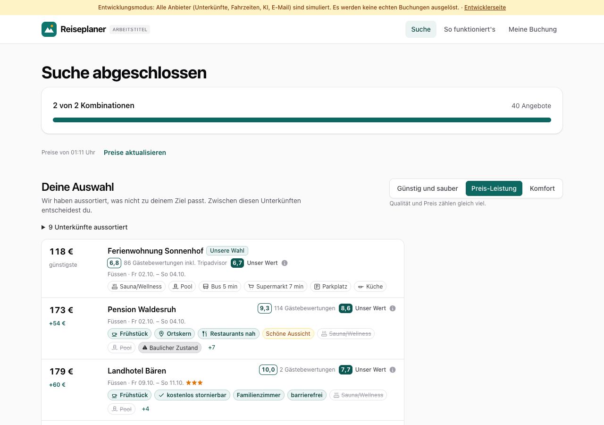
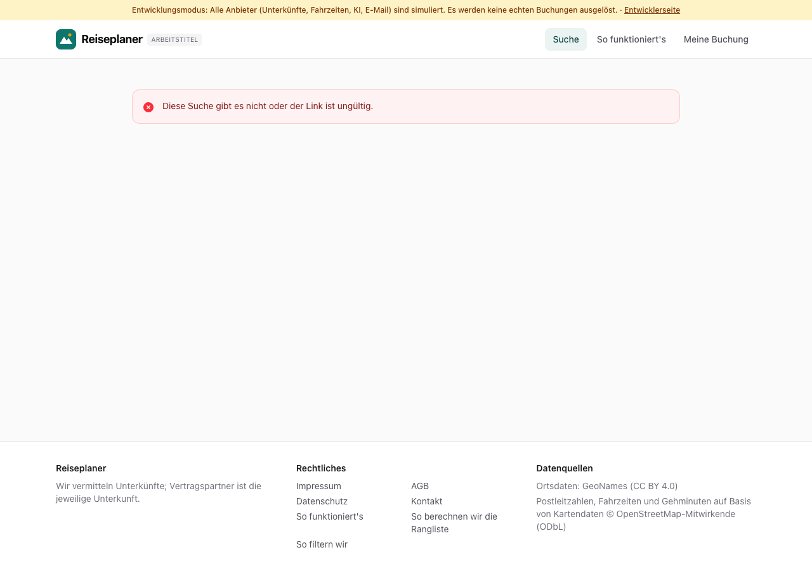
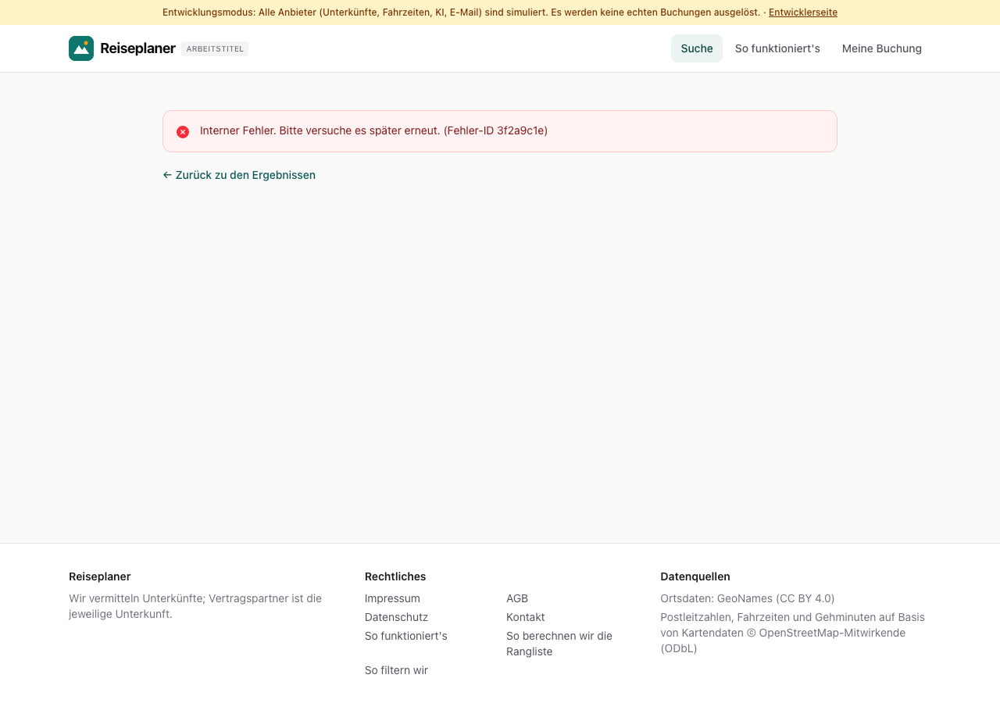
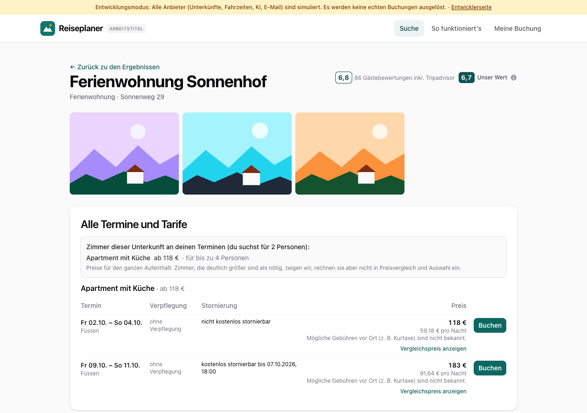

# Dogfood-Walkthrough 2026-09-30T23-11-34-P-fehler

- Modus: P – Pfad (Nutzerablauf mit Eingaben)
- Flows: fehler
- Basis-URL: http://localhost:5391 (echter lokaler Stack, Anbieter im Fake-Modus)
- Stand: 894e2d9, gestartet 2026-09-30T23:11:34.898Z
- Ergebnis: ✅ bestanden (14/14 Prüfungen erfüllt)

## Flow „fehler“

Fehlerfälle (B6): falscher Link zur Suche, Unterkunft ohne Verbindung, Serverfehler mit Fehler-ID, Seitencode nicht ladbar (alte Version im Tab), unbekannte Seite – jeweils eine kurze deutsche Meldung statt Absturz.

### 01 Suche Füssen als Ausgangspunkt

- URL: `/suche/a9865cdd-5464-4dad-bc7b-a8a0dc2aa8d5#t=j8ggrTNnm71SPOaLsDeN1I1d9aQeQOmHA6yaql0apko`
- Screenshot: 
- Prüfungen:
  - [x] enthält „Alle Angebote“
- Überschriften: „Suche abgeschlossen“, „Deine Auswahl“, „Alle Angebote“
- KI-Kennzeichnungen (`data-ai-provenance`): „KI-gestützte Auswertung von Gästebewertungen [ai_assisted]“, „KI-gestützte Auswertung von Gästebewertungen [ai_assisted]“
- Konsolenfehler: keine
- Fehlgeschlagene Anfragen: keine

<details><summary>Sichtbarer Text</summary>

```text
Entwicklungsmodus: Alle Anbieter (Unterkünfte, Fahrzeiten, KI, E-Mail) sind simuliert. Es werden keine echten Buchungen ausgelöst. · Entwicklerseite
Reiseplaner
ARBEITSTITEL
Suche
So funktioniert's
Meine Buchung
Suche abgeschlossen

2 von 2 Kombinationen

40 Angebote

Preise von 01:11 Uhr
Preise aktualisieren

Deine Auswahl

Wir haben aussortiert, was nicht zu deinem Ziel passt. Zwischen diesen Unterkünften entscheidest du.

Günstig und sauber
Preis-Leistung
Komfort

Qualität und Preis zählen gleich viel.

9 Unterkünfte aussortiert
118 €
günstigste
Ferienwohnung Sonnenhof
Unsere Wahl
6,8
86 Gästebewertungen inkl. Tripadvisor
6,7
Unser Wert

Füssen · Fr 02.10. – So 04.10.

Sauna/Wellness
Pool
Bus 5 min
Supermarkt 7 min
Parkplatz
Küche
173 €
+54 €
Pension Waldesruh
9,3
114 Gästebewertungen
8,6
Unser Wert

Füssen · Fr 02.10. – So 04.10.

Frühstück
Ortskern
Restaurants nah
Schöne Aussicht
Sauna/Wellness
Pool
Baulicher Zustand
+7
179 €
+60 €
Landhotel Bären
10,0
2 Gästebewertungen
7,7
Unser Wert

Füssen · Fr 09.10. – So 11.10.★★★

Frühstück
kostenlos stornierbar
Familienzimmer
barrierefrei
Sauna/Wellness
Pool
+4
197 €
+78 €
Gasthof Waldesruh
8,9
44 Gästebewertungen
8,9
Unser Wert

Füssen · Fr 02.10. – So 04.10.★★

Frühstück
Ruhig
Gute Lage
Hund erlaubt
Sauna/Wellness
Pool
+5
271 €
+152 €
Landhotel Lindenhof
7,9
264 Gästebewertungen
7,9
Unser Wert

Füssen · Fr 02.10. – So 04.10.★★★

Frühstück
Ortskern
Familienzimmer
Restaurant
Sauna/Wellness
Pool
+4

Legende

Verglichen mit der günstigsten Unterkunft

Sauna
zusätzlich
Bus 5 min
gleich
Pool
fehlt
Unsere Wahl
bestes Verhältnis aus Preis und Bewertung

Aus Gästebewertungen

Ruhig
Lob
Lärm
Kritik

Lob und Kritik stammen aus Bewertungen von Gästen, nicht von der Unterkunft.

Gehminuten: Kartendaten © OpenStreetMap-Mitwirkende

Lin
… (5612 weitere Zeichen)
```

</details>

### 02 Link mit falschem Schlüssel: „Diese Suche gibt es nicht“

- URL: `/suche/a9865cdd-5464-4dad-bc7b-a8a0dc2aa8d5#t=xxxxxxxxxxxxxxxxxxxxxxxxxxxxxxxxxxxxxxxxxxx`
- Screenshot: 
- Prüfungen:
  - [x] enthält „Diese Suche gibt es nicht oder der Link ist ungültig.“
  - [x] enthält nicht „Unexpected Application Error“
- Überschriften: keine
- KI-Kennzeichnungen (`data-ai-provenance`): keine
- Konsolenfehler: Failed to load resource: the server responded with a status of 404 (Not Found) | Failed to load resource: the server responded with a status of 404 (Not Found) | Failed to load resource: the server responded with a status of 404 (Not Found)
- Fehlgeschlagene Anfragen: keine

<details><summary>Sichtbarer Text</summary>

```text
Entwicklungsmodus: Alle Anbieter (Unterkünfte, Fahrzeiten, KI, E-Mail) sind simuliert. Es werden keine echten Buchungen ausgelöst. · Entwicklerseite
Reiseplaner
ARBEITSTITEL
Suche
So funktioniert's
Meine Buchung
Diese Suche gibt es nicht oder der Link ist ungültig.

Reiseplaner

Wir vermitteln Unterkünfte; Vertragspartner ist die jeweilige Unterkunft.

Rechtliches

Impressum
AGB
Datenschutz
Kontakt
So funktioniert's
So berechnen wir die Rangliste
So filtern wir

Datenquellen

Ortsdaten: GeoNames (CC BY 4.0)
Postleitzahlen, Fahrzeiten und Gehminuten auf Basis von Kartendaten © OpenStreetMap-Mitwirkende (ODbL)
```

</details>

### 03 Unterkunft öffnen ohne Verbindung zur API: „Keine Verbindung“

- URL: `/suche/a9865cdd-5464-4dad-bc7b-a8a0dc2aa8d5/unterkunft/lpf-4757-1070-10#t=j8ggrTNnm71SPOaLsDeN1I1d9aQeQOmHA6yaql0apko`
- Screenshot: 
- Prüfungen:
  - [x] enthält „Keine Verbindung. Bitte prüfe dein Internet“
  - [x] enthält nicht „Diese Suche gibt es nicht“
- Überschriften: keine
- KI-Kennzeichnungen (`data-ai-provenance`): keine
- Konsolenfehler: Failed to load resource: net::ERR_INTERNET_DISCONNECTED
- Fehlgeschlagene Anfragen: net::ERR_INTERNET_DISCONNECTED /api/v1/searches/a9865cdd-5464-4dad-bc7b-a8a0dc2aa8d5/hotels/lpf-4757-1070-10

<details><summary>Sichtbarer Text</summary>

```text
Entwicklungsmodus: Alle Anbieter (Unterkünfte, Fahrzeiten, KI, E-Mail) sind simuliert. Es werden keine echten Buchungen ausgelöst. · Entwicklerseite
Reiseplaner
ARBEITSTITEL
Suche
So funktioniert's
Meine Buchung
Keine Verbindung. Bitte prüfe dein Internet und versuche es noch einmal.
← Zurück zu den Ergebnissen

Reiseplaner

Wir vermitteln Unterkünfte; Vertragspartner ist die jeweilige Unterkunft.

Rechtliches

Impressum
AGB
Datenschutz
Kontakt
So funktioniert's
So berechnen wir die Rangliste
So filtern wir

Datenquellen

Ortsdaten: GeoNames (CC BY 4.0)
Postleitzahlen, Fahrzeiten und Gehminuten auf Basis von Kartendaten © OpenStreetMap-Mitwirkende (ODbL)
```

</details>

### 04 Serverfehler: Meldung mit Fehler-ID

- URL: `/suche/a9865cdd-5464-4dad-bc7b-a8a0dc2aa8d5/unterkunft/lpf-4757-1070-10#t=j8ggrTNnm71SPOaLsDeN1I1d9aQeQOmHA6yaql0apko`
- Screenshot: 
- Prüfungen:
  - [x] enthält „Interner Fehler. Bitte versuche es später erneut. (Fehler-ID 3f2a9c1e)“
- Überschriften: keine
- KI-Kennzeichnungen (`data-ai-provenance`): keine
- Konsolenfehler: Failed to load resource: the server responded with a status of 500 (Internal Server Error)
- Fehlgeschlagene Anfragen: 500 /api/v1/searches/a9865cdd-5464-4dad-bc7b-a8a0dc2aa8d5/hotels/lpf-4757-1070-10

<details><summary>Sichtbarer Text</summary>

```text
Entwicklungsmodus: Alle Anbieter (Unterkünfte, Fahrzeiten, KI, E-Mail) sind simuliert. Es werden keine echten Buchungen ausgelöst. · Entwicklerseite
Reiseplaner
ARBEITSTITEL
Suche
So funktioniert's
Meine Buchung
Interner Fehler. Bitte versuche es später erneut. (Fehler-ID 3f2a9c1e)
← Zurück zu den Ergebnissen

Reiseplaner

Wir vermitteln Unterkünfte; Vertragspartner ist die jeweilige Unterkunft.

Rechtliches

Impressum
AGB
Datenschutz
Kontakt
So funktioniert's
So berechnen wir die Rangliste
So filtern wir

Datenquellen

Ortsdaten: GeoNames (CC BY 4.0)
Postleitzahlen, Fahrzeiten und Gehminuten auf Basis von Kartendaten © OpenStreetMap-Mitwirkende (ODbL)
```

</details>

### 05 Seitencode nicht ladbar (alte Version im Tab): „Neue Version verfügbar“ mit „Neu laden“

- URL: `/suche/a9865cdd-5464-4dad-bc7b-a8a0dc2aa8d5/unterkunft/lpf-4757-1070-10#t=j8ggrTNnm71SPOaLsDeN1I1d9aQeQOmHA6yaql0apko`
- Screenshot: 
- Notiz: Kopf und Fuß bleiben: ja
- Prüfungen:
  - [x] enthält „Neue Version verfügbar“
  - [x] enthält „Neu laden“
  - [x] enthält „Zur Startseite“
  - [x] enthält nicht „Unexpected Application Error“
  - [x] Element `[data-testid="site-footer"]` vorhanden (1)
- Überschriften: „Neue Version verfügbar“
- KI-Kennzeichnungen (`data-ai-provenance`): keine
- Konsolenfehler: Failed to load resource: net::ERR_FAILED
- Fehlgeschlagene Anfragen: net::ERR_FAILED /src/pages/HotelDetail.tsx

<details><summary>Sichtbarer Text</summary>

```text
Entwicklungsmodus: Alle Anbieter (Unterkünfte, Fahrzeiten, KI, E-Mail) sind simuliert. Es werden keine echten Buchungen ausgelöst. · Entwicklerseite
Reiseplaner
ARBEITSTITEL
Suche
So funktioniert's
Meine Buchung
Neue Version verfügbar

Bitte lade die Seite neu.

Neu laden
Zur Startseite

Reiseplaner

Wir vermitteln Unterkünfte; Vertragspartner ist die jeweilige Unterkunft.

Rechtliches

Impressum
AGB
Datenschutz
Kontakt
So funktioniert's
So berechnen wir die Rangliste
So filtern wir

Datenquellen

Ortsdaten: GeoNames (CC BY 4.0)
Postleitzahlen, Fahrzeiten und Gehminuten auf Basis von Kartendaten © OpenStreetMap-Mitwirkende (ODbL)
```

</details>

### 06 „Neu laden“ öffnet die Unterkunft

- URL: `/suche/a9865cdd-5464-4dad-bc7b-a8a0dc2aa8d5/unterkunft/lpf-4757-1070-10#t=j8ggrTNnm71SPOaLsDeN1I1d9aQeQOmHA6yaql0apko`
- Screenshot: 
- Prüfungen:
  - [x] enthält „Alle Termine und Tarife“
- Überschriften: „Ferienwohnung Sonnenhof“, „Alle Termine und Tarife“, „So setzt sich der Qualitätswert zusammen“, „Rezensionscheck“, „Beschreibung“, „Ausstattung“
- KI-Kennzeichnungen (`data-ai-provenance`): keine
- Konsolenfehler: keine
- Fehlgeschlagene Anfragen: keine

<details><summary>Sichtbarer Text</summary>

```text
Entwicklungsmodus: Alle Anbieter (Unterkünfte, Fahrzeiten, KI, E-Mail) sind simuliert. Es werden keine echten Buchungen ausgelöst. · Entwicklerseite
Reiseplaner
ARBEITSTITEL
Suche
So funktioniert's
Meine Buchung
← Zurück zu den Ergebnissen
Ferienwohnung Sonnenhof

Ferienwohnung · Sonnenweg 29

6,8
86 Gästebewertungen inkl. Tripadvisor
6,7
Unser Wert
Alle Termine und Tarife

Zimmer dieser Unterkunft an deinen Terminen (du suchst für 2 Personen):

Apartment mit Küche
ab 118 €
· für bis zu 4 Personen

Preise für den ganzen Aufenthalt. Zimmer, die deutlich größer sind als nötig, zeigen wir, rechnen sie aber nicht in Preisvergleich und Auswahl ein.

Apartment mit Küche · ab 118 €
Termin	Verpflegung	Stornierung	Preis	

Fr 02.10. – So 04.10.
Füssen
	
ohne Verpflegung
	nicht kostenlos stornierbar	
118 €
59,18 € pro Nacht
Mögliche Gebühren vor Ort (z. B. Kurtaxe) sind nicht bekannt.
Vergleichspreis anzeigen
	Buchen

Fr 09.10. – So 11.10.
Füssen
	
ohne Verpflegung
	kostenlos stornierbar bis 07.10.2026, 18:00	
183 €
91,64 € pro Nacht
Mögliche Gebühren vor Ort (z. B. Kurtaxe) sind nicht bekannt.
Vergleichspreis anzeigen
	Buchen
So setzt sich der Qualitätswert zusammen
Durchschnitt 6,8 aus 86 Bewertungen
Ferienwohnung: ab 20 Bewertungen zählt der Durchschnitt voll
6,8
Aktualität
6,7
Sauberkeit
kein gesonderter Sauberkeitswert
Abzüge aus Warnhinweisen
–
Qualitätswert
6,7

Die Note fasst die Bewertungen der Unterkunft mit Bewertungen von Tripadvisor zusammen, weil sie in unserer Datenquelle nur wenige Bewertungen hat. Bewertungen von Tripadvisor zählen dabei halb.

Rezensionscheck

Keine Auffälligkeiten in den geprüften Rezensionen (29 geprüft).

29 Bewertungen geprüft am 01.10.2026, 00:42.

Beschreibung
Ferienwohnung Sonnenhof

Das Ferienquartier bietet 1 Zimmerkategorien und liegt i
… (1004 weitere Zeichen)
```

</details>

### 07 Unbekannte Seite

- URL: `/gibt-es-nicht`
- Screenshot: 
- Prüfungen:
  - [x] enthält „Seite nicht gefunden“
  - [x] enthält „Zur Startseite“
- Überschriften: „Seite nicht gefunden“
- KI-Kennzeichnungen (`data-ai-provenance`): keine
- Konsolenfehler: keine
- Fehlgeschlagene Anfragen: keine

<details><summary>Sichtbarer Text</summary>

```text
Entwicklungsmodus: Alle Anbieter (Unterkünfte, Fahrzeiten, KI, E-Mail) sind simuliert. Es werden keine echten Buchungen ausgelöst. · Entwicklerseite
Reiseplaner
ARBEITSTITEL
Suche
So funktioniert's
Meine Buchung
Seite nicht gefunden

Diese Seite gibt es nicht (mehr).

Zur Startseite

Reiseplaner

Wir vermitteln Unterkünfte; Vertragspartner ist die jeweilige Unterkunft.

Rechtliches

Impressum
AGB
Datenschutz
Kontakt
So funktioniert's
So berechnen wir die Rangliste
So filtern wir

Datenquellen

Ortsdaten: GeoNames (CC BY 4.0)
Postleitzahlen, Fahrzeiten und Gehminuten auf Basis von Kartendaten © OpenStreetMap-Mitwirkende (ODbL)
```

</details>

