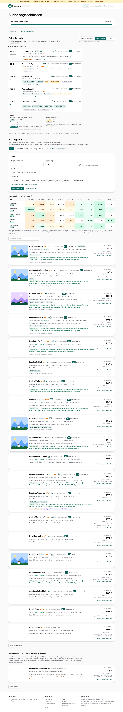
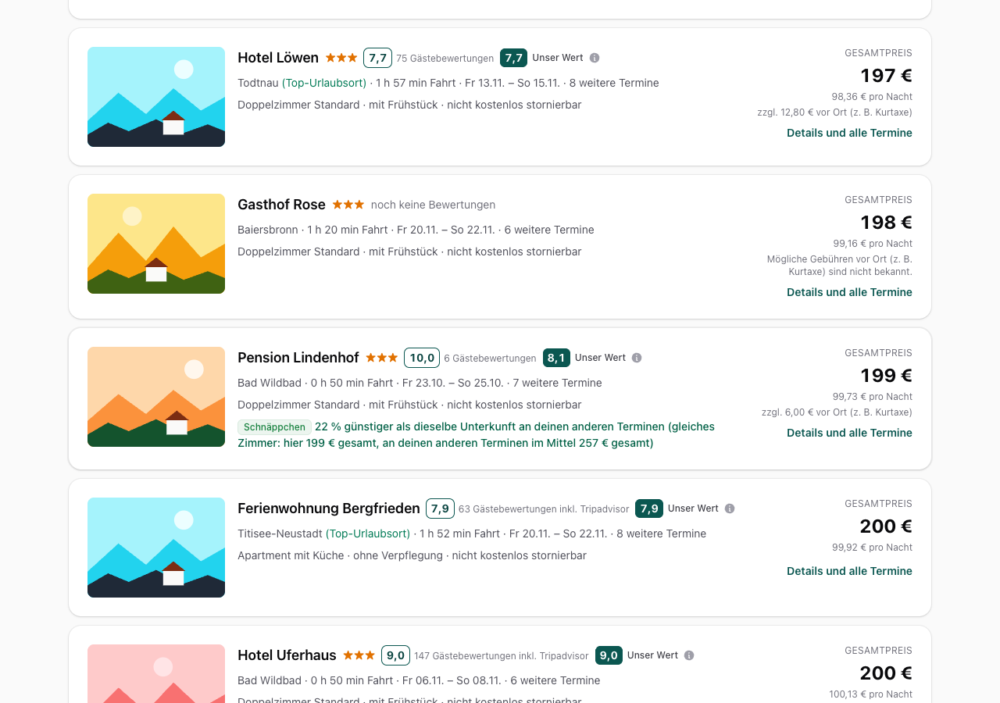
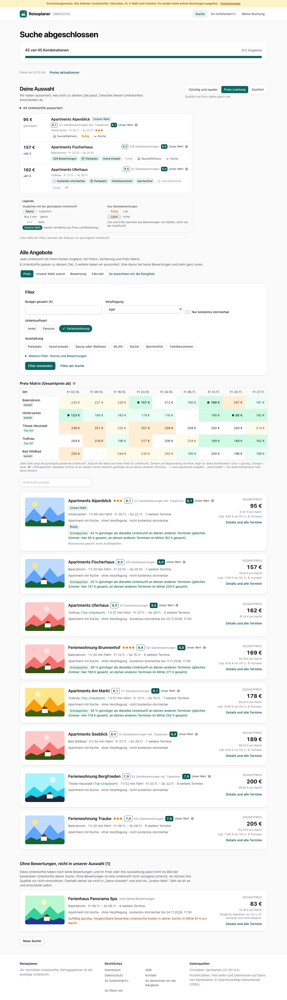
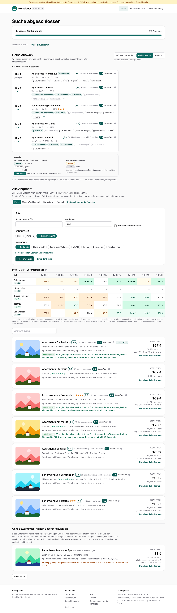
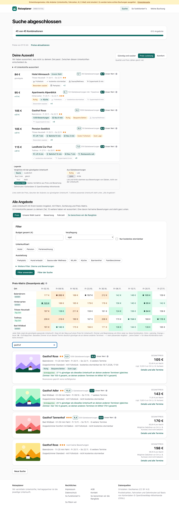
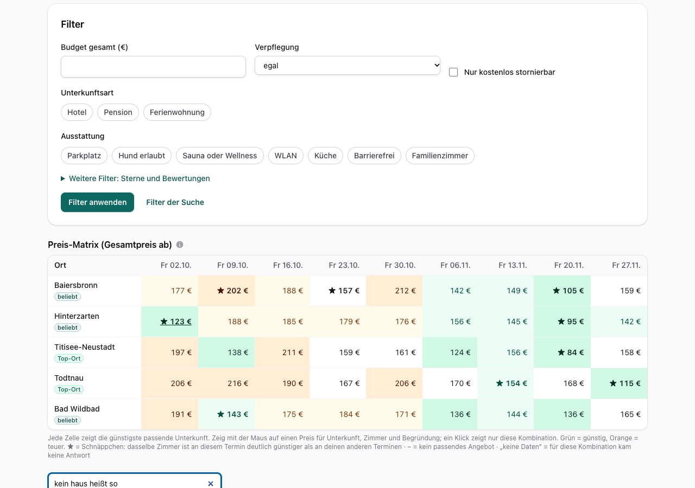
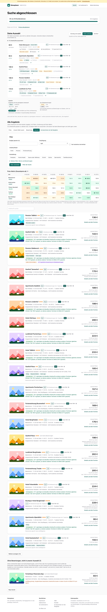

# Dogfood-Walkthrough 2026-09-30T23-13-31-P-listenfilter

- Modus: P – Pfad (Nutzerablauf mit Eingaben)
- Flows: listenfilter
- Basis-URL: http://localhost:5391 (echter lokaler Stack, Anbieter im Fake-Modus)
- Stand: f169f5a, gestartet 2026-09-30T23:13:31.813Z
- Ergebnis: ✅ bestanden (11/11 Prüfungen erfüllt)

## Flow „listenfilter“

Ergebnisliste wie bei Buchungsportalen (B1, B2): Unterkunftsart und Ausstattung als Filter ohne neue Suche, Namenssuche, Liste seitenweise mit „Weitere anzeigen“, Sortierung nach Fahrzeit.

### 01 Suche 5 Orte × 9 Termine: Liste zeigt die erste Seite

- URL: `/suche/9eeba346-3ff1-4248-8a6c-af8e94fa0e3c#t=JaPzA_PDOLpvWfrcBimaaathp2M1I2NMzNsBaKdHUN4`
- Screenshot: 
- Notiz: Erste Seite: 20 Unterkünfte; Knopf: Weitere anzeigen (12)
- Prüfungen:
  - [x] Element `[data-testid="show-more"]` vorhanden (1)
  - [x] Element `[data-testid="filter-kinds"]` vorhanden (1)
  - [x] Element `[data-testid="filter-facilities"]` vorhanden (1)
  - [x] Element `[data-testid="name-search"]` vorhanden (1)
  - [x] Element `[data-testid="result-photo"] img` vorhanden (21)
- Überschriften: „Suche abgeschlossen“, „Deine Auswahl“, „Alle Angebote“
- KI-Kennzeichnungen (`data-ai-provenance`): „KI-gestützte Auswertung von Gästebewertungen [ai_assisted]“
- Konsolenfehler: keine
- Fehlgeschlagene Anfragen: keine

<details><summary>Sichtbarer Text</summary>

```text
Entwicklungsmodus: Alle Anbieter (Unterkünfte, Fahrzeiten, KI, E-Mail) sind simuliert. Es werden keine echten Buchungen ausgelöst. · Entwicklerseite
Reiseplaner
ARBEITSTITEL
Suche
So funktioniert's
Meine Buchung
Suche abgeschlossen

45 von 45 Kombinationen

613 Angebote

Preise von 01:13 Uhr
Preise aktualisieren

Deine Auswahl

Wir haben aussortiert, was nicht zu deinem Ziel passt. Zwischen diesen Unterkünften entscheidest du.

Günstig und sauber
Preis-Leistung
Komfort

Qualität und Preis zählen gleich viel.

41 Unterkünfte aussortiert
84 €
günstigste
Hotel Almrausch
Unsere Wahl
8,1
49 Gästebewertungen
8,1
Unser Wert

Titisee-Neustadt · Fr 20.11. – So 22.11.★★

Frühstück
kostenlos stornierbar
Sauna/Wellness
Supermarkt 8 min
Besonders sauber
Parkplatz
+2
95 €
+11 €
Apartments Alpenblick
8,1
122 Gästebewertungen inkl. Tripadvisor
8,1
Unser Wert

Hinterzarten · Fr 20.11. – So 22.11.★★★

Ruhig
Küche
Frühstück
kostenlos stornierbar
Supermarkt 8 min
Besonders sauber
+4
105 €
+21 €
Gasthof Rose
9,0
1059 Gästebewertungen
9,0
Unser Wert

Baiersbronn · Fr 20.11. – So 22.11.★★

1.059 Bewertungen
Bus 9 min
Ruhig
Bequeme Betten
Sauna/Wellness
Supermarkt 8 min
+9
105 €
+21 €
Pension Seeblick
8,8
19 Gästebewertungen
8,3
Unser Wert

Titisee-Neustadt · Fr 20.11. – So 22.11.★★

Lift 7 min
Bahnhof 9 min
Bus 2 min
Gutes Frühstück
Gute Lage
Besonders sauber
+9
115 €
+31 €
Landhotel Zur Post
7,8
319 Gästebewertungen
7,8
Unser Wert

Todtnau · Fr 27.11. – So 29.11.★★★

Lift 8 min
Bahnhof 10 min
Bus 7 min
Restaurants nah
kostenlos stornierbar
Supermarkt 8 min
+8

Legende

Verglichen mit der günstigsten Unterkunft

Sauna
zusätzlich
Bus 5 min
gleich
Pool
fehlt
Unsere Wahl
bestes Verhältnis aus Preis und Bewertung

Aus Gästebewertungen

Ruhig
Lob
Lärm
Kritik

Lob und Kritik stammen aus Bewertungen
… (11681 weitere Zeichen)
```

</details>

### 02 „Weitere anzeigen“ hängt die nächste Seite an

- URL: `/suche/9eeba346-3ff1-4248-8a6c-af8e94fa0e3c#t=JaPzA_PDOLpvWfrcBimaaathp2M1I2NMzNsBaKdHUN4`
- Screenshot: 
- Notiz: Vorher 20, nachher 32 Unterkünfte, keine doppelt.
- Prüfungen:
  - [x] Element `[data-testid="result-list"]` vorhanden (1)
- Überschriften: „Suche abgeschlossen“, „Deine Auswahl“, „Alle Angebote“
- KI-Kennzeichnungen (`data-ai-provenance`): „KI-gestützte Auswertung von Gästebewertungen [ai_assisted]“
- Konsolenfehler: keine
- Fehlgeschlagene Anfragen: keine

<details><summary>Sichtbarer Text</summary>

```text
Entwicklungsmodus: Alle Anbieter (Unterkünfte, Fahrzeiten, KI, E-Mail) sind simuliert. Es werden keine echten Buchungen ausgelöst. · Entwicklerseite
Reiseplaner
ARBEITSTITEL
Suche
So funktioniert's
Meine Buchung
Suche abgeschlossen

45 von 45 Kombinationen

613 Angebote

Preise von 01:13 Uhr
Preise aktualisieren

Deine Auswahl

Wir haben aussortiert, was nicht zu deinem Ziel passt. Zwischen diesen Unterkünften entscheidest du.

Günstig und sauber
Preis-Leistung
Komfort

Qualität und Preis zählen gleich viel.

41 Unterkünfte aussortiert
84 €
günstigste
Hotel Almrausch
Unsere Wahl
8,1
49 Gästebewertungen
8,1
Unser Wert

Titisee-Neustadt · Fr 20.11. – So 22.11.★★

Frühstück
kostenlos stornierbar
Sauna/Wellness
Supermarkt 8 min
Besonders sauber
Parkplatz
+2
95 €
+11 €
Apartments Alpenblick
8,1
122 Gästebewertungen inkl. Tripadvisor
8,1
Unser Wert

Hinterzarten · Fr 20.11. – So 22.11.★★★

Ruhig
Küche
Frühstück
kostenlos stornierbar
Supermarkt 8 min
Besonders sauber
+4
105 €
+21 €
Gasthof Rose
9,0
1059 Gästebewertungen
9,0
Unser Wert

Baiersbronn · Fr 20.11. – So 22.11.★★

1.059 Bewertungen
Bus 9 min
Ruhig
Bequeme Betten
Sauna/Wellness
Supermarkt 8 min
+9
105 €
+21 €
Pension Seeblick
8,8
19 Gästebewertungen
8,3
Unser Wert

Titisee-Neustadt · Fr 20.11. – So 22.11.★★

Lift 7 min
Bahnhof 9 min
Bus 2 min
Gutes Frühstück
Gute Lage
Besonders sauber
+9
115 €
+31 €
Landhotel Zur Post
7,8
319 Gästebewertungen
7,8
Unser Wert

Todtnau · Fr 27.11. – So 29.11.★★★

Lift 8 min
Bahnhof 10 min
Bus 7 min
Restaurants nah
kostenlos stornierbar
Supermarkt 8 min
+8

Legende

Verglichen mit der günstigsten Unterkunft

Sauna
zusätzlich
Bus 5 min
gleich
Pool
fehlt
Unsere Wahl
bestes Verhältnis aus Preis und Bewertung

Aus Gästebewertungen

Ruhig
Lob
Lärm
Kritik

Lob und Kritik stammen aus Bewertungen
… (16490 weitere Zeichen)
```

</details>

### 03 Unterkunftsart „Ferienwohnung“: nur Wohnungen

- URL: `/suche/9eeba346-3ff1-4248-8a6c-af8e94fa0e3c#t=JaPzA_PDOLpvWfrcBimaaathp2M1I2NMzNsBaKdHUN4`
- Screenshot: 
- Notiz: Nur Ferienwohnungen: Apartments Alpenblick, Apartments Fischerhaus, Apartments Uferhaus, Ferienwohnung Brunnenhof, Apartments Am Markt, Apartments Seeblick, Ferienwohnung Bergfrieden, Ferienwohnung Traube
- Prüfungen:
  - [x] Element `[data-testid="filter-kinds"] [aria-pressed="true"]` vorhanden (1)
- Überschriften: „Suche abgeschlossen“, „Deine Auswahl“, „Alle Angebote“
- KI-Kennzeichnungen (`data-ai-provenance`): keine
- Konsolenfehler: keine
- Fehlgeschlagene Anfragen: keine

<details><summary>Sichtbarer Text</summary>

```text
Entwicklungsmodus: Alle Anbieter (Unterkünfte, Fahrzeiten, KI, E-Mail) sind simuliert. Es werden keine echten Buchungen ausgelöst. · Entwicklerseite
Reiseplaner
ARBEITSTITEL
Suche
So funktioniert's
Meine Buchung
Suche abgeschlossen

45 von 45 Kombinationen

613 Angebote

Preise von 01:13 Uhr
Preise aktualisieren

Deine Auswahl

Wir haben aussortiert, was nicht zu deinem Ziel passt. Zwischen diesen Unterkünften entscheidest du.

Günstig und sauber
Preis-Leistung
Komfort

Qualität und Preis zählen gleich viel.

44 Unterkünfte aussortiert
95 €
günstigste
Apartments Alpenblick
Unsere Wahl
8,1
122 Gästebewertungen inkl. Tripadvisor
8,1
Unser Wert

Hinterzarten · Fr 20.11. – So 22.11.★★★

Sauna/Wellness
Ruhig
Küche
157 €
+62 €
Apartments Fischerhaus
8,0
328 Gästebewertungen
8,0
Unser Wert

Baiersbronn · Fr 23.10. – So 25.10.

328 Bewertungen
Parkplatz
Hund erlaubt
Ruhig
Sauna/Wellness
Küche
162 €
+67 €
Apartments Uferhaus
9,0
40 Gästebewertungen
9,0
Unser Wert

Todtnau · Fr 27.11. – So 29.11.

kostenlos stornierbar
Parkplatz
Familienzimmer
barrierefrei
Sauna/Wellness
Ruhig
+1

Legende

Verglichen mit der günstigsten Unterkunft

Sauna
zusätzlich
Bus 5 min
gleich
Pool
fehlt
Unsere Wahl
bestes Verhältnis aus Preis und Bewertung

Aus Gästebewertungen

Ruhig
Lob
Lärm
Kritik

Lob und Kritik stammen aus Bewertungen von Gästen, nicht von der Unterkunft.

Links steht der Preis, darunter der Aufpreis zur günstigsten Unterkunft.

Alle Angebote

Jede Unterkunft mit ihrem besten Angebot, mit Filtern, Sortierung und Preis-Matrix.

8 Unterkünfte passen zu deinem Ziel, 3 weitere haben wir aussortiert. Eine davon hat keine Bewertungen und steht ganz unten.

Sortierung
Preis
Unsere Wahl zuerst
Bewertung
Fahrzeit
So berechnen wir die Rangliste
Filter
Budget gesamt (€)
Verpflegung
egal
ohne
Früh
… (5731 weitere Zeichen)
```

</details>

### 04 Ausstattung „Parkplatz“ dazu: Liste schrumpft oder bleibt, Filter bleibt gesetzt

- URL: `/suche/9eeba346-3ff1-4248-8a6c-af8e94fa0e3c#t=JaPzA_PDOLpvWfrcBimaaathp2M1I2NMzNsBaKdHUN4`
- Screenshot: 
- Notiz: Mit Parkplatz: 7 von 8 Wohnungen.
- Prüfungen:
  - [x] Element `[data-testid="filter-facilities"] [aria-pressed="true"]` vorhanden (1)
- Überschriften: „Suche abgeschlossen“, „Deine Auswahl“, „Alle Angebote“
- KI-Kennzeichnungen (`data-ai-provenance`): keine
- Konsolenfehler: keine
- Fehlgeschlagene Anfragen: keine

<details><summary>Sichtbarer Text</summary>

```text
Entwicklungsmodus: Alle Anbieter (Unterkünfte, Fahrzeiten, KI, E-Mail) sind simuliert. Es werden keine echten Buchungen ausgelöst. · Entwicklerseite
Reiseplaner
ARBEITSTITEL
Suche
So funktioniert's
Meine Buchung
Suche abgeschlossen

45 von 45 Kombinationen

613 Angebote

Preise von 01:13 Uhr
Preise aktualisieren

Deine Auswahl

Wir haben aussortiert, was nicht zu deinem Ziel passt. Zwischen diesen Unterkünften entscheidest du.

Günstig und sauber
Preis-Leistung
Komfort

Qualität und Preis zählen gleich viel.

40 Unterkünfte aussortiert
157 €
günstigste
Apartments Fischerhaus
Unsere Wahl
8,0
328 Gästebewertungen
8,0
Unser Wert

Baiersbronn · Fr 23.10. – So 25.10.

Sauna/Wellness
328 Bewertungen
Parkplatz
Küche
Hund erlaubt
162 €
+5 €
Apartments Uferhaus
9,0
40 Gästebewertungen
9,0
Unser Wert

Todtnau · Fr 27.11. – So 29.11.

kostenlos stornierbar
Familienzimmer
barrierefrei
Sauna/Wellness
328 Bewertungen
Hund erlaubt
+2
169 €
+12 €
Ferienwohnung Brunnenhof
8,8
520 Gästebewertungen
8,8
Unser Wert

Baiersbronn · Fr 13.11. – So 15.11.★★★★

kostenlos stornierbar
barrierefrei
Sauna/Wellness
520 Bewertungen
Parkplatz
Küche
+1
178 €
+21 €
Apartments Am Markt
9,1
117 Gästebewertungen
9,1
Unser Wert

Todtnau · Fr 13.11. – So 15.11.

Ortskern
Hund erlaubt
Sauna/Wellness
117 Bewertungen
Parkplatz
Küche
189 €
+31 €
Apartments Seeblick
8,4
34 Gästebewertungen inkl. Tripadvisor
8,4
Unser Wert

Bad Wildbad · Fr 27.11. – So 29.11.

Familienzimmer
barrierefrei
E-Ladestation
328 Bewertungen
Hund erlaubt
Sauna/Wellness
+2

Legende

Verglichen mit der günstigsten Unterkunft

Sauna
zusätzlich
Bus 5 min
gleich
Pool
fehlt
Unsere Wahl
bestes Verhältnis aus Preis und Bewertung

Aus Gästebewertungen

Ruhig
Lob
Lärm
Kritik

Lob und Kritik stammen aus Bewertungen von Gästen, nicht von der Unterkunf
… (5636 weitere Zeichen)
```

</details>

### 05 Namenssuche „gasthof“ (Groß-/Kleinschreibung egal)

- URL: `/suche/9eeba346-3ff1-4248-8a6c-af8e94fa0e3c#t=JaPzA_PDOLpvWfrcBimaaathp2M1I2NMzNsBaKdHUN4`
- Screenshot: 
- Notiz: Treffer: Gasthof Rose, Gasthof Adler, Gasthof Tannenhof, Gasthof Rose
- Prüfungen:
  - [x] Element `[data-testid="result-matrix"]` vorhanden (1)
- Überschriften: „Suche abgeschlossen“, „Deine Auswahl“, „Alle Angebote“
- KI-Kennzeichnungen (`data-ai-provenance`): keine
- Konsolenfehler: keine
- Fehlgeschlagene Anfragen: keine

<details><summary>Sichtbarer Text</summary>

```text
Entwicklungsmodus: Alle Anbieter (Unterkünfte, Fahrzeiten, KI, E-Mail) sind simuliert. Es werden keine echten Buchungen ausgelöst. · Entwicklerseite
Reiseplaner
ARBEITSTITEL
Suche
So funktioniert's
Meine Buchung
Suche abgeschlossen

45 von 45 Kombinationen

613 Angebote

Preise von 01:13 Uhr
Preise aktualisieren

Deine Auswahl

Wir haben aussortiert, was nicht zu deinem Ziel passt. Zwischen diesen Unterkünften entscheidest du.

Günstig und sauber
Preis-Leistung
Komfort

Qualität und Preis zählen gleich viel.

41 Unterkünfte aussortiert
84 €
günstigste
Hotel Almrausch
Unsere Wahl
8,1
49 Gästebewertungen
8,1
Unser Wert

Titisee-Neustadt · Fr 20.11. – So 22.11.★★

Frühstück
kostenlos stornierbar
Sauna/Wellness
Supermarkt 8 min
Besonders sauber
Parkplatz
+2
95 €
+11 €
Apartments Alpenblick
8,1
122 Gästebewertungen inkl. Tripadvisor
8,1
Unser Wert

Hinterzarten · Fr 20.11. – So 22.11.★★★

Ruhig
Küche
Frühstück
kostenlos stornierbar
Supermarkt 8 min
Besonders sauber
+4
105 €
+21 €
Gasthof Rose
9,0
1059 Gästebewertungen
9,0
Unser Wert

Baiersbronn · Fr 20.11. – So 22.11.★★

1.059 Bewertungen
Bus 9 min
Ruhig
Bequeme Betten
Sauna/Wellness
Supermarkt 8 min
+9
105 €
+21 €
Pension Seeblick
8,8
19 Gästebewertungen
8,3
Unser Wert

Titisee-Neustadt · Fr 20.11. – So 22.11.★★

Lift 7 min
Bahnhof 9 min
Bus 2 min
Gutes Frühstück
Gute Lage
Besonders sauber
+9
115 €
+31 €
Landhotel Zur Post
7,8
319 Gästebewertungen
7,8
Unser Wert

Todtnau · Fr 27.11. – So 29.11.★★★

Lift 8 min
Bahnhof 10 min
Bus 7 min
Restaurants nah
kostenlos stornierbar
Supermarkt 8 min
+8

Legende

Verglichen mit der günstigsten Unterkunft

Sauna
zusätzlich
Bus 5 min
gleich
Pool
fehlt
Unsere Wahl
bestes Verhältnis aus Preis und Bewertung

Aus Gästebewertungen

Ruhig
Lob
Lärm
Kritik

Lob und Kritik stammen aus Bewertungen
… (3927 weitere Zeichen)
```

</details>

### 06 Namenssuche ohne Treffer

- URL: `/suche/9eeba346-3ff1-4248-8a6c-af8e94fa0e3c#t=JaPzA_PDOLpvWfrcBimaaathp2M1I2NMzNsBaKdHUN4`
- Screenshot: 
- Prüfungen:
  - [x] enthält „Keine Unterkunft mit diesem Namen.“
- Überschriften: „Suche abgeschlossen“, „Deine Auswahl“, „Alle Angebote“
- KI-Kennzeichnungen (`data-ai-provenance`): keine
- Konsolenfehler: keine
- Fehlgeschlagene Anfragen: keine

<details><summary>Sichtbarer Text</summary>

```text
Entwicklungsmodus: Alle Anbieter (Unterkünfte, Fahrzeiten, KI, E-Mail) sind simuliert. Es werden keine echten Buchungen ausgelöst. · Entwicklerseite
Reiseplaner
ARBEITSTITEL
Suche
So funktioniert's
Meine Buchung
Suche abgeschlossen

45 von 45 Kombinationen

613 Angebote

Preise von 01:13 Uhr
Preise aktualisieren

Deine Auswahl

Wir haben aussortiert, was nicht zu deinem Ziel passt. Zwischen diesen Unterkünften entscheidest du.

Günstig und sauber
Preis-Leistung
Komfort

Qualität und Preis zählen gleich viel.

41 Unterkünfte aussortiert
84 €
günstigste
Hotel Almrausch
Unsere Wahl
8,1
49 Gästebewertungen
8,1
Unser Wert

Titisee-Neustadt · Fr 20.11. – So 22.11.★★

Frühstück
kostenlos stornierbar
Sauna/Wellness
Supermarkt 8 min
Besonders sauber
Parkplatz
+2
95 €
+11 €
Apartments Alpenblick
8,1
122 Gästebewertungen inkl. Tripadvisor
8,1
Unser Wert

Hinterzarten · Fr 20.11. – So 22.11.★★★

Ruhig
Küche
Frühstück
kostenlos stornierbar
Supermarkt 8 min
Besonders sauber
+4
105 €
+21 €
Gasthof Rose
9,0
1059 Gästebewertungen
9,0
Unser Wert

Baiersbronn · Fr 20.11. – So 22.11.★★

1.059 Bewertungen
Bus 9 min
Ruhig
Bequeme Betten
Sauna/Wellness
Supermarkt 8 min
+9
105 €
+21 €
Pension Seeblick
8,8
19 Gästebewertungen
8,3
Unser Wert

Titisee-Neustadt · Fr 20.11. – So 22.11.★★

Lift 7 min
Bahnhof 9 min
Bus 2 min
Gutes Frühstück
Gute Lage
Besonders sauber
+9
115 €
+31 €
Landhotel Zur Post
7,8
319 Gästebewertungen
7,8
Unser Wert

Todtnau · Fr 27.11. – So 29.11.★★★

Lift 8 min
Bahnhof 10 min
Bus 7 min
Restaurants nah
kostenlos stornierbar
Supermarkt 8 min
+8

Legende

Verglichen mit der günstigsten Unterkunft

Sauna
zusätzlich
Bus 5 min
gleich
Pool
fehlt
Unsere Wahl
bestes Verhältnis aus Preis und Bewertung

Aus Gästebewertungen

Ruhig
Lob
Lärm
Kritik

Lob und Kritik stammen aus Bewertungen
… (2283 weitere Zeichen)
```

</details>

### 07 Sortierung „Fahrzeit“: nächster Ort zuerst

- URL: `/suche/9eeba346-3ff1-4248-8a6c-af8e94fa0e3c#t=JaPzA_PDOLpvWfrcBimaaathp2M1I2NMzNsBaKdHUN4`
- Screenshot: 
- Notiz: Orte von oben nach unten: Bad Wildbad → Baiersbronn → Hinterzarten
- Prüfungen:
  - [x] Element `[data-testid="sort"] [aria-checked="true"]` vorhanden (1)
- Überschriften: „Suche abgeschlossen“, „Deine Auswahl“, „Alle Angebote“
- KI-Kennzeichnungen (`data-ai-provenance`): „KI-gestützte Auswertung von Gästebewertungen [ai_assisted]“
- Konsolenfehler: keine
- Fehlgeschlagene Anfragen: keine

<details><summary>Sichtbarer Text</summary>

```text
Entwicklungsmodus: Alle Anbieter (Unterkünfte, Fahrzeiten, KI, E-Mail) sind simuliert. Es werden keine echten Buchungen ausgelöst. · Entwicklerseite
Reiseplaner
ARBEITSTITEL
Suche
So funktioniert's
Meine Buchung
Suche abgeschlossen

45 von 45 Kombinationen

613 Angebote

Preise von 01:13 Uhr
Preise aktualisieren

Deine Auswahl

Wir haben aussortiert, was nicht zu deinem Ziel passt. Zwischen diesen Unterkünften entscheidest du.

Günstig und sauber
Preis-Leistung
Komfort

Qualität und Preis zählen gleich viel.

41 Unterkünfte aussortiert
84 €
günstigste
Hotel Almrausch
Unsere Wahl
8,1
49 Gästebewertungen
8,1
Unser Wert

Titisee-Neustadt · Fr 20.11. – So 22.11.★★

Frühstück
kostenlos stornierbar
Sauna/Wellness
Supermarkt 8 min
Besonders sauber
Parkplatz
+2
95 €
+11 €
Apartments Alpenblick
8,1
122 Gästebewertungen inkl. Tripadvisor
8,1
Unser Wert

Hinterzarten · Fr 20.11. – So 22.11.★★★

Ruhig
Küche
Frühstück
kostenlos stornierbar
Supermarkt 8 min
Besonders sauber
+4
105 €
+21 €
Gasthof Rose
9,0
1059 Gästebewertungen
9,0
Unser Wert

Baiersbronn · Fr 20.11. – So 22.11.★★

1.059 Bewertungen
Bus 9 min
Ruhig
Bequeme Betten
Sauna/Wellness
Supermarkt 8 min
+9
105 €
+21 €
Pension Seeblick
8,8
19 Gästebewertungen
8,3
Unser Wert

Titisee-Neustadt · Fr 20.11. – So 22.11.★★

Lift 7 min
Bahnhof 9 min
Bus 2 min
Gutes Frühstück
Gute Lage
Besonders sauber
+9
115 €
+31 €
Landhotel Zur Post
7,8
319 Gästebewertungen
7,8
Unser Wert

Todtnau · Fr 27.11. – So 29.11.★★★

Lift 8 min
Bahnhof 10 min
Bus 7 min
Restaurants nah
kostenlos stornierbar
Supermarkt 8 min
+8

Legende

Verglichen mit der günstigsten Unterkunft

Sauna
zusätzlich
Bus 5 min
gleich
Pool
fehlt
Unsere Wahl
bestes Verhältnis aus Preis und Bewertung

Aus Gästebewertungen

Ruhig
Lob
Lärm
Kritik

Lob und Kritik stammen aus Bewertungen
… (11483 weitere Zeichen)
```

</details>

