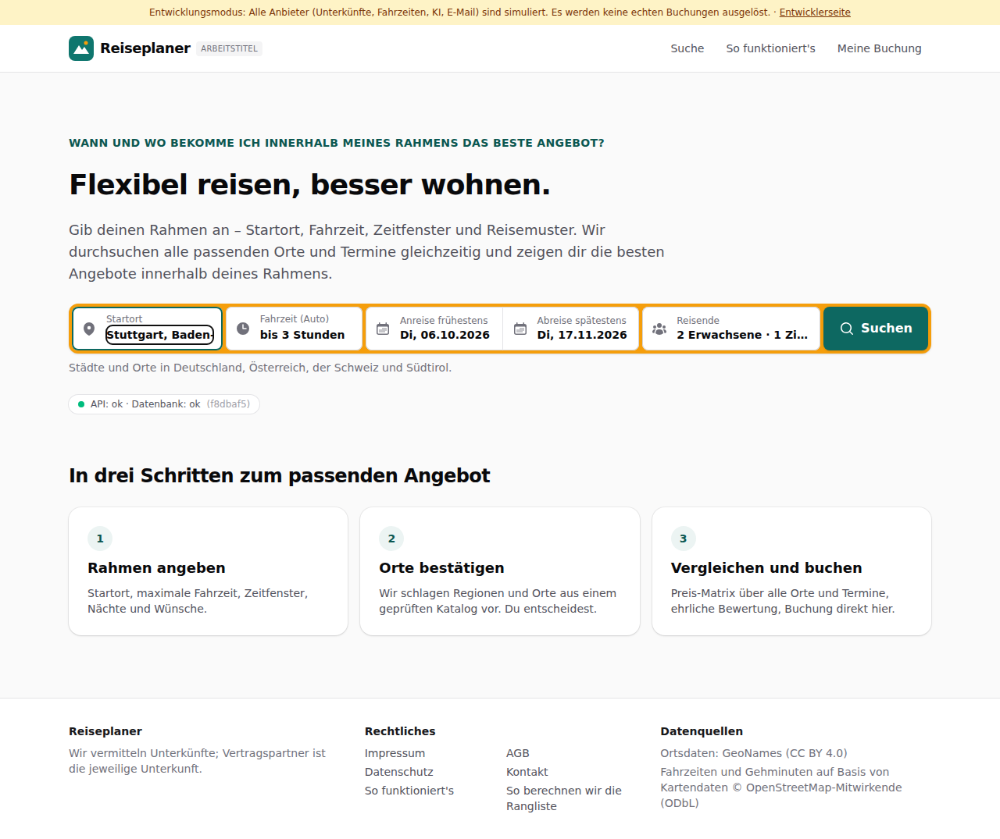
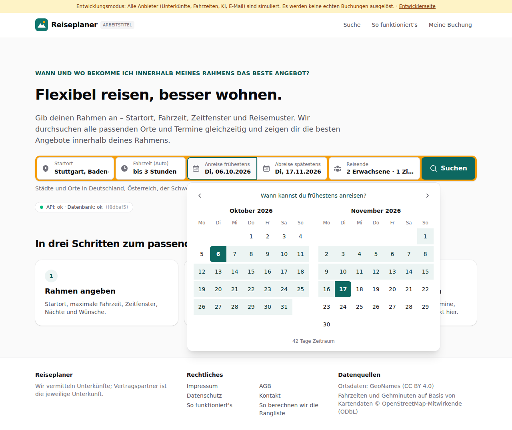
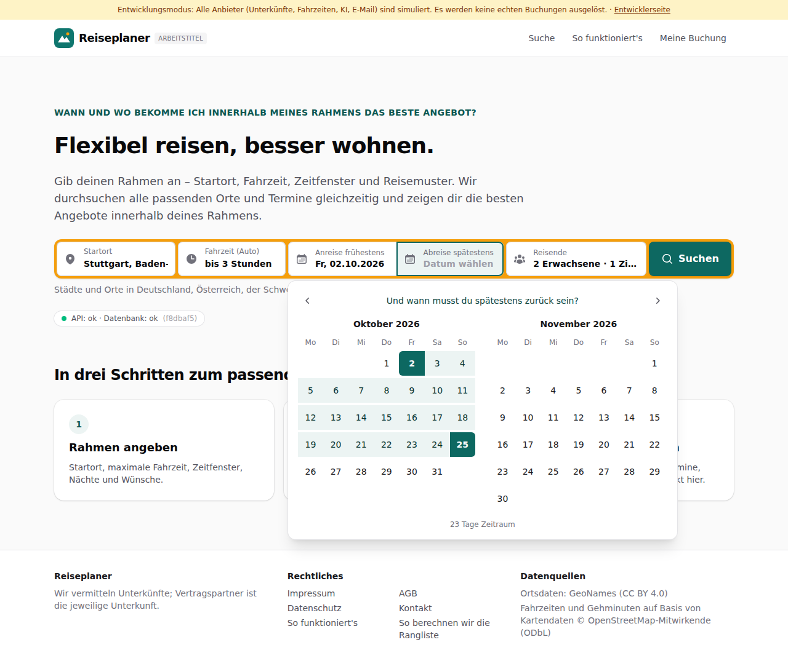
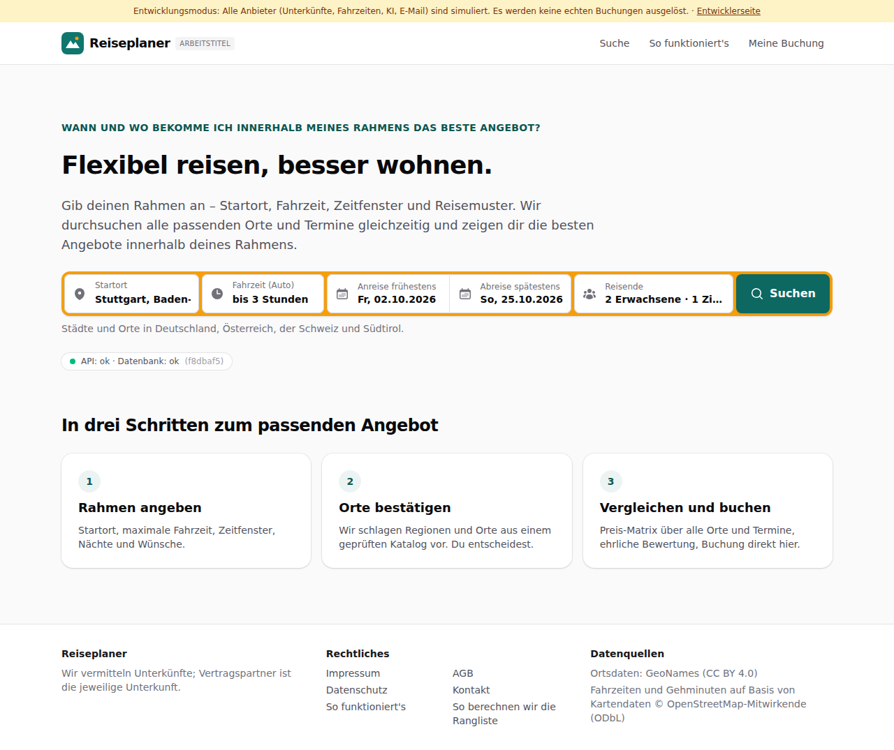
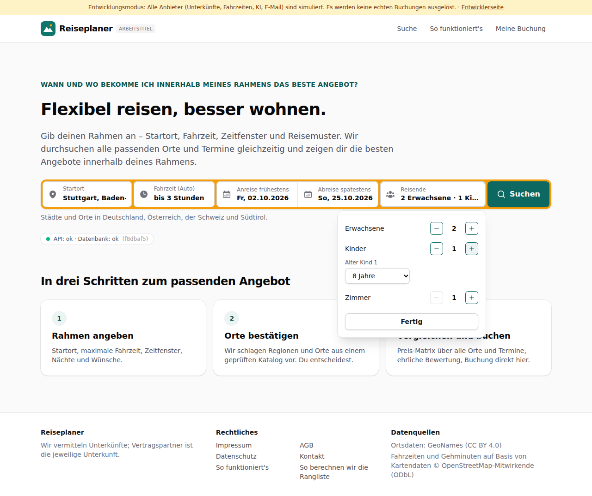
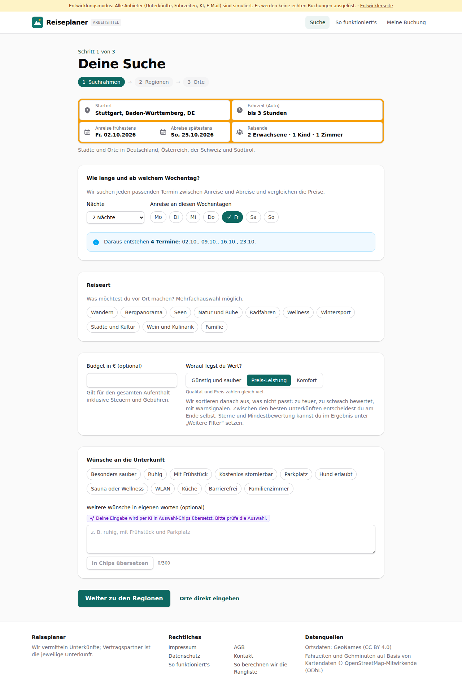
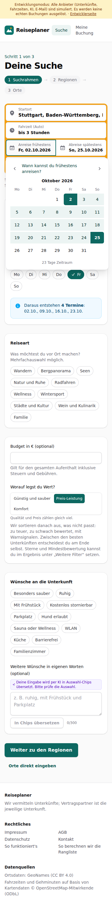

# Dogfood-Walkthrough 2026-09-29T16-11-17-P-startseite

- Modus: P – Pfad (Nutzerablauf mit Eingaben)
- Flows: startseite
- Basis-URL: http://localhost:33741 (echter lokaler Stack, Anbieter im Fake-Modus)
- Stand: f8dbaf5, gestartet 2026-09-29T16:11:17.027Z
- Ergebnis: ✅ bestanden (26/26 Prüfungen erfüllt)

## Flow „startseite“

Startseite mit Suchleiste wie bei Buchungsportalen: Startort, Fahrzeit, Kalender mit zwei Klicks (Anreise, dann Abreise), Reisende im Aufklappfeld, weiter zur Suche mit denselben Angaben.

### 01 Startseite mit Suchleiste

- URL: `/`
- Screenshot: 
- Prüfungen:
  - [x] enthält „Anreise frühestens“
  - [x] enthält „Abreise spätestens“
  - [x] enthält „Reisende“
  - [x] enthält „2 Erwachsene · 1 Zimmer“
  - [x] enthält „Suchen“
- Überschriften: „Flexibel reisen, besser wohnen.“, „In drei Schritten zum passenden Angebot“
- KI-Kennzeichnungen (`data-ai-provenance`): keine
- Konsolenfehler: keine
- Fehlgeschlagene Anfragen: keine

<details><summary>Sichtbarer Text</summary>

```text
Entwicklungsmodus: Alle Anbieter (Unterkünfte, Fahrzeiten, KI, E-Mail) sind simuliert. Es werden keine echten Buchungen ausgelöst. · Entwicklerseite
Reiseplaner
ARBEITSTITEL
Suche
So funktioniert's
Meine Buchung

WANN UND WO BEKOMME ICH INNERHALB MEINES RAHMENS DAS BESTE ANGEBOT?

Flexibel reisen, besser wohnen.

Gib deinen Rahmen an – Startort, Fahrzeit, Zeitfenster und Reisemuster. Wir durchsuchen alle passenden Orte und Termine gleichzeitig und zeigen dir die besten Angebote innerhalb deines Rahmens.

Startort
Fahrzeit (Auto)
egal
bis 1 Stunde
bis 1 h 30 min
bis 2 Stunden
bis 2 h 30 min
bis 3 Stunden
bis 4 Stunden
bis 5 Stunden
bis 6 Stunden
Anreise frühestens
Di, 06.10.2026
Abreise spätestens
Di, 17.11.2026
Reisende
2 Erwachsene · 1 Zimmer
Suchen

Städte und Orte in Deutschland, Österreich, der Schweiz und Südtirol.

API: ok · Datenbank: ok
(f8dbaf5)

In drei Schritten zum passenden Angebot
1
Rahmen angeben

Startort, maximale Fahrzeit, Zeitfenster, Nächte und Wünsche.

2
Orte bestätigen

Wir schlagen Regionen und Orte aus einem geprüften Katalog vor. Du entscheidest.

3
Vergleichen und buchen

Preis-Matrix über alle Orte und Termine, ehrliche Bewertung, Buchung direkt hier.

Reiseplaner

Wir vermitteln Unterkünfte; Vertragspartner ist die jeweilige Unterkunft.

Rechtliches

Impressum
AGB
Datenschutz
Kontakt
So funktioniert's
So berechnen wir die Rangliste

Datenquellen

Ortsdaten: GeoNames (CC BY 4.0)
Fahrzeiten und Gehminuten auf Basis von Kartendaten © OpenStreetMap-Mitwirkende (ODbL)
```

</details>

### 02 Startort „Stutt“ → Stuttgart

- URL: `/`
- Screenshot: 
- Prüfungen:
  - [x] Element `[data-origin="2825297"]` vorhanden (1)
- Überschriften: „Flexibel reisen, besser wohnen.“, „In drei Schritten zum passenden Angebot“
- KI-Kennzeichnungen (`data-ai-provenance`): keine
- Konsolenfehler: keine
- Fehlgeschlagene Anfragen: keine

<details><summary>Sichtbarer Text</summary>

```text
Entwicklungsmodus: Alle Anbieter (Unterkünfte, Fahrzeiten, KI, E-Mail) sind simuliert. Es werden keine echten Buchungen ausgelöst. · Entwicklerseite
Reiseplaner
ARBEITSTITEL
Suche
So funktioniert's
Meine Buchung

WANN UND WO BEKOMME ICH INNERHALB MEINES RAHMENS DAS BESTE ANGEBOT?

Flexibel reisen, besser wohnen.

Gib deinen Rahmen an – Startort, Fahrzeit, Zeitfenster und Reisemuster. Wir durchsuchen alle passenden Orte und Termine gleichzeitig und zeigen dir die besten Angebote innerhalb deines Rahmens.

Startort
Fahrzeit (Auto)
egal
bis 1 Stunde
bis 1 h 30 min
bis 2 Stunden
bis 2 h 30 min
bis 3 Stunden
bis 4 Stunden
bis 5 Stunden
bis 6 Stunden
Anreise frühestens
Di, 06.10.2026
Abreise spätestens
Di, 17.11.2026
Reisende
2 Erwachsene · 1 Zimmer
Suchen

Städte und Orte in Deutschland, Österreich, der Schweiz und Südtirol.

API: ok · Datenbank: ok
(f8dbaf5)

In drei Schritten zum passenden Angebot
1
Rahmen angeben

Startort, maximale Fahrzeit, Zeitfenster, Nächte und Wünsche.

2
Orte bestätigen

Wir schlagen Regionen und Orte aus einem geprüften Katalog vor. Du entscheidest.

3
Vergleichen und buchen

Preis-Matrix über alle Orte und Termine, ehrliche Bewertung, Buchung direkt hier.

Reiseplaner

Wir vermitteln Unterkünfte; Vertragspartner ist die jeweilige Unterkunft.

Rechtliches

Impressum
AGB
Datenschutz
Kontakt
So funktioniert's
So berechnen wir die Rangliste

Datenquellen

Ortsdaten: GeoNames (CC BY 4.0)
Fahrzeiten und Gehminuten auf Basis von Kartendaten © OpenStreetMap-Mitwirkende (ODbL)
```

</details>

### 03 Klick auf Anreise öffnet den Kalender mit zwei Monaten

- URL: `/`
- Screenshot: 
- Prüfungen:
  - [x] enthält „Wann kannst du frühestens anreisen?“
  - [x] enthält „Oktober 2026“
  - [x] Element `#window-start[aria-expanded="true"]` vorhanden (1)
- Überschriften: „Flexibel reisen, besser wohnen.“, „In drei Schritten zum passenden Angebot“
- KI-Kennzeichnungen (`data-ai-provenance`): keine
- Konsolenfehler: keine
- Fehlgeschlagene Anfragen: keine

<details><summary>Sichtbarer Text</summary>

```text
Entwicklungsmodus: Alle Anbieter (Unterkünfte, Fahrzeiten, KI, E-Mail) sind simuliert. Es werden keine echten Buchungen ausgelöst. · Entwicklerseite
Reiseplaner
ARBEITSTITEL
Suche
So funktioniert's
Meine Buchung

WANN UND WO BEKOMME ICH INNERHALB MEINES RAHMENS DAS BESTE ANGEBOT?

Flexibel reisen, besser wohnen.

Gib deinen Rahmen an – Startort, Fahrzeit, Zeitfenster und Reisemuster. Wir durchsuchen alle passenden Orte und Termine gleichzeitig und zeigen dir die besten Angebote innerhalb deines Rahmens.

Startort
Fahrzeit (Auto)
egal
bis 1 Stunde
bis 1 h 30 min
bis 2 Stunden
bis 2 h 30 min
bis 3 Stunden
bis 4 Stunden
bis 5 Stunden
bis 6 Stunden
Anreise frühestens
Di, 06.10.2026
Abreise spätestens
Di, 17.11.2026

Wann kannst du frühestens anreisen?

Oktober 2026

Mo
Di
Mi
Do
Fr
Sa
So
1
2
3
4
5
6
7
8
9
10
11
12
13
14
15
16
17
18
19
20
21
22
23
24
25
26
27
28
29
30
31

November 2026

Mo
Di
Mi
Do
Fr
Sa
So
1
2
3
4
5
6
7
8
9
10
11
12
13
14
15
16
17
18
19
20
21
22
23
24
25
26
27
28
29
30

42 Tage Zeitraum

Reisende
2 Erwachsene · 1 Zimmer
Suchen

Städte und Orte in Deutschland, Österreich, der Schweiz und Südtirol.

API: ok · Datenbank: ok
(f8dbaf5)

In drei Schritten zum passenden Angebot
1
Rahmen angeben

Startort, maximale Fahrzeit, Zeitfenster, Nächte und Wünsche.

2
Orte bestätigen

Wir schlagen Regionen und Orte aus einem geprüften Katalog vor. Du entscheidest.

3
Vergleichen und buchen

Preis-Matrix über alle Orte und Termine, ehrliche Bewertung, Buchung direkt hier.

Reiseplaner

Wir vermitteln Unterkünfte; Vertragspartner ist die jeweilige Unterkunft.

Rechtliches

Impressum
AGB
Datenschutz
Kontakt
So funktioniert's
So berechnen wir die Rangliste

Datenquellen

Ortsdaten: GeoNames (CC BY 4.0)
Fahrzeiten und Gehminuten auf Basis von Kartendaten © OpenStreetMap-Mitwirke
… (10 weitere Zeichen)
```

</details>

### 04 Erster Klick: Anreise 02.10. – der Kalender springt auf die Abreise

- URL: `/`
- Screenshot: 
- Prüfungen:
  - [x] enthält „Und wann musst du spätestens zurück sein?“
  - [x] enthält „Fr, 02.10.2026“
  - [x] enthält „23 Tage Zeitraum“
  - [x] Element `#window-end[aria-expanded="true"]` vorhanden (1)
- Überschriften: „Flexibel reisen, besser wohnen.“, „In drei Schritten zum passenden Angebot“
- KI-Kennzeichnungen (`data-ai-provenance`): keine
- Konsolenfehler: keine
- Fehlgeschlagene Anfragen: keine

<details><summary>Sichtbarer Text</summary>

```text
Entwicklungsmodus: Alle Anbieter (Unterkünfte, Fahrzeiten, KI, E-Mail) sind simuliert. Es werden keine echten Buchungen ausgelöst. · Entwicklerseite
Reiseplaner
ARBEITSTITEL
Suche
So funktioniert's
Meine Buchung

WANN UND WO BEKOMME ICH INNERHALB MEINES RAHMENS DAS BESTE ANGEBOT?

Flexibel reisen, besser wohnen.

Gib deinen Rahmen an – Startort, Fahrzeit, Zeitfenster und Reisemuster. Wir durchsuchen alle passenden Orte und Termine gleichzeitig und zeigen dir die besten Angebote innerhalb deines Rahmens.

Startort
Fahrzeit (Auto)
egal
bis 1 Stunde
bis 1 h 30 min
bis 2 Stunden
bis 2 h 30 min
bis 3 Stunden
bis 4 Stunden
bis 5 Stunden
bis 6 Stunden
Anreise frühestens
Fr, 02.10.2026
Abreise spätestens
Datum wählen

Und wann musst du spätestens zurück sein?

Oktober 2026

Mo
Di
Mi
Do
Fr
Sa
So
1
2
3
4
5
6
7
8
9
10
11
12
13
14
15
16
17
18
19
20
21
22
23
24
25
26
27
28
29
30
31

November 2026

Mo
Di
Mi
Do
Fr
Sa
So
1
2
3
4
5
6
7
8
9
10
11
12
13
14
15
16
17
18
19
20
21
22
23
24
25
26
27
28
29
30

23 Tage Zeitraum

Reisende
2 Erwachsene · 1 Zimmer
Suchen

Städte und Orte in Deutschland, Österreich, der Schweiz und Südtirol.

API: ok · Datenbank: ok
(f8dbaf5)

In drei Schritten zum passenden Angebot
1
Rahmen angeben

Startort, maximale Fahrzeit, Zeitfenster, Nächte und Wünsche.

2
Orte bestätigen

Wir schlagen Regionen und Orte aus einem geprüften Katalog vor. Du entscheidest.

3
Vergleichen und buchen

Preis-Matrix über alle Orte und Termine, ehrliche Bewertung, Buchung direkt hier.

Reiseplaner

Wir vermitteln Unterkünfte; Vertragspartner ist die jeweilige Unterkunft.

Rechtliches

Impressum
AGB
Datenschutz
Kontakt
So funktioniert's
So berechnen wir die Rangliste

Datenquellen

Ortsdaten: GeoNames (CC BY 4.0)
Fahrzeiten und Gehminuten auf Basis von Kartendaten © OpenStreetMap-Mitw
… (14 weitere Zeichen)
```

</details>

### 05 Zweiter Klick: Abreise 25.10. – der Kalender schließt sich

- URL: `/`
- Screenshot: 
- Prüfungen:
  - [x] enthält „Fr, 02.10.2026“
  - [x] enthält „So, 25.10.2026“
  - [x] Element `#window-end[data-value="2026-10-25"]` vorhanden (1)
- Überschriften: „Flexibel reisen, besser wohnen.“, „In drei Schritten zum passenden Angebot“
- KI-Kennzeichnungen (`data-ai-provenance`): keine
- Konsolenfehler: keine
- Fehlgeschlagene Anfragen: keine

<details><summary>Sichtbarer Text</summary>

```text
Entwicklungsmodus: Alle Anbieter (Unterkünfte, Fahrzeiten, KI, E-Mail) sind simuliert. Es werden keine echten Buchungen ausgelöst. · Entwicklerseite
Reiseplaner
ARBEITSTITEL
Suche
So funktioniert's
Meine Buchung

WANN UND WO BEKOMME ICH INNERHALB MEINES RAHMENS DAS BESTE ANGEBOT?

Flexibel reisen, besser wohnen.

Gib deinen Rahmen an – Startort, Fahrzeit, Zeitfenster und Reisemuster. Wir durchsuchen alle passenden Orte und Termine gleichzeitig und zeigen dir die besten Angebote innerhalb deines Rahmens.

Startort
Fahrzeit (Auto)
egal
bis 1 Stunde
bis 1 h 30 min
bis 2 Stunden
bis 2 h 30 min
bis 3 Stunden
bis 4 Stunden
bis 5 Stunden
bis 6 Stunden
Anreise frühestens
Fr, 02.10.2026
Abreise spätestens
So, 25.10.2026
Reisende
2 Erwachsene · 1 Zimmer
Suchen

Städte und Orte in Deutschland, Österreich, der Schweiz und Südtirol.

API: ok · Datenbank: ok
(f8dbaf5)

In drei Schritten zum passenden Angebot
1
Rahmen angeben

Startort, maximale Fahrzeit, Zeitfenster, Nächte und Wünsche.

2
Orte bestätigen

Wir schlagen Regionen und Orte aus einem geprüften Katalog vor. Du entscheidest.

3
Vergleichen und buchen

Preis-Matrix über alle Orte und Termine, ehrliche Bewertung, Buchung direkt hier.

Reiseplaner

Wir vermitteln Unterkünfte; Vertragspartner ist die jeweilige Unterkunft.

Rechtliches

Impressum
AGB
Datenschutz
Kontakt
So funktioniert's
So berechnen wir die Rangliste

Datenquellen

Ortsdaten: GeoNames (CC BY 4.0)
Fahrzeiten und Gehminuten auf Basis von Kartendaten © OpenStreetMap-Mitwirkende (ODbL)
```

</details>

### 06 Reisende: 1 Kind dazu

- URL: `/`
- Screenshot: 
- Prüfungen:
  - [x] enthält „2 Erwachsene · 1 Kind · 1 Zimmer“
  - [x] enthält „Alter Kind 1“
  - [x] enthält „Fertig“
- Überschriften: „Flexibel reisen, besser wohnen.“, „In drei Schritten zum passenden Angebot“
- KI-Kennzeichnungen (`data-ai-provenance`): keine
- Konsolenfehler: keine
- Fehlgeschlagene Anfragen: keine

<details><summary>Sichtbarer Text</summary>

```text
Entwicklungsmodus: Alle Anbieter (Unterkünfte, Fahrzeiten, KI, E-Mail) sind simuliert. Es werden keine echten Buchungen ausgelöst. · Entwicklerseite
Reiseplaner
ARBEITSTITEL
Suche
So funktioniert's
Meine Buchung

WANN UND WO BEKOMME ICH INNERHALB MEINES RAHMENS DAS BESTE ANGEBOT?

Flexibel reisen, besser wohnen.

Gib deinen Rahmen an – Startort, Fahrzeit, Zeitfenster und Reisemuster. Wir durchsuchen alle passenden Orte und Termine gleichzeitig und zeigen dir die besten Angebote innerhalb deines Rahmens.

Startort
Fahrzeit (Auto)
egal
bis 1 Stunde
bis 1 h 30 min
bis 2 Stunden
bis 2 h 30 min
bis 3 Stunden
bis 4 Stunden
bis 5 Stunden
bis 6 Stunden
Anreise frühestens
Fr, 02.10.2026
Abreise spätestens
So, 25.10.2026
Reisende
2 Erwachsene · 1 Kind · 1 Zimmer
Erwachsene
2
Kinder
1
Alter Kind 1
0 Jahre
1 Jahr
2 Jahre
3 Jahre
4 Jahre
5 Jahre
6 Jahre
7 Jahre
8 Jahre
9 Jahre
10 Jahre
11 Jahre
12 Jahre
13 Jahre
14 Jahre
15 Jahre
16 Jahre
17 Jahre
Zimmer
1
Fertig
Suchen

Städte und Orte in Deutschland, Österreich, der Schweiz und Südtirol.

API: ok · Datenbank: ok
(f8dbaf5)

In drei Schritten zum passenden Angebot
1
Rahmen angeben

Startort, maximale Fahrzeit, Zeitfenster, Nächte und Wünsche.

2
Orte bestätigen

Wir schlagen Regionen und Orte aus einem geprüften Katalog vor. Du entscheidest.

3
Vergleichen und buchen

Preis-Matrix über alle Orte und Termine, ehrliche Bewertung, Buchung direkt hier.

Reiseplaner

Wir vermitteln Unterkünfte; Vertragspartner ist die jeweilige Unterkunft.

Rechtliches

Impressum
AGB
Datenschutz
Kontakt
So funktioniert's
So berechnen wir die Rangliste

Datenquellen

Ortsdaten: GeoNames (CC BY 4.0)
Fahrzeiten und Gehminuten auf Basis von Kartendaten © OpenStreetMap-Mitwirkende (ODbL)
```

</details>

### 07 Suchen → Schritt 1 mit denselben Angaben und Terminvorschau

- URL: `/suche`
- Screenshot: 
- Prüfungen:
  - [x] enthält „Schritt 1 von 3“
  - [x] enthält „Fr, 02.10.2026“
  - [x] enthält „So, 25.10.2026“
  - [x] enthält „2 Erwachsene · 1 Kind · 1 Zimmer“
  - [x] enthält „Daraus entstehen 4 Termine“
  - [x] Element `[data-origin="2825297"]` vorhanden (1)
- Überschriften: „Deine Suche“
- KI-Kennzeichnungen (`data-ai-provenance`): „Deine Eingabe wird per KI in Auswahl-Chips übersetzt. Bitte prüfe die Auswahl. [ai_assisted]“
- Konsolenfehler: keine
- Fehlgeschlagene Anfragen: keine

<details><summary>Sichtbarer Text</summary>

```text
Entwicklungsmodus: Alle Anbieter (Unterkünfte, Fahrzeiten, KI, E-Mail) sind simuliert. Es werden keine echten Buchungen ausgelöst. · Entwicklerseite
Reiseplaner
ARBEITSTITEL
Suche
So funktioniert's
Meine Buchung

Schritt 1 von 3

Deine Suche
1
Suchrahmen
→
2
Regionen
→
3
Orte
Startort
Fahrzeit (Auto)
egal
bis 1 Stunde
bis 1 h 30 min
bis 2 Stunden
bis 2 h 30 min
bis 3 Stunden
bis 4 Stunden
bis 5 Stunden
bis 6 Stunden
Anreise frühestens
Fr, 02.10.2026
Abreise spätestens
So, 25.10.2026
Reisende
2 Erwachsene · 1 Kind · 1 Zimmer

Städte und Orte in Deutschland, Österreich, der Schweiz und Südtirol.

Wie lange und ab welchem Wochentag?

Wir suchen jeden passenden Termin zwischen Anreise und Abreise und vergleichen die Preise.

Nächte
1 Nacht
2 Nächte
3 Nächte
4 Nächte
5 Nächte
6 Nächte
7 Nächte
8 Nächte
9 Nächte
10 Nächte
11 Nächte
12 Nächte
13 Nächte
14 Nächte
Anreise an diesen Wochentagen
Mo
Di
Mi
Do
Fr
Sa
So
Daraus entstehen 4 Termine: 02.10., 09.10., 16.10., 23.10.
Reiseart

Was möchtest du vor Ort machen? Mehrfachauswahl möglich.

Wandern
Bergpanorama
Seen
Natur und Ruhe
Radfahren
Wellness
Wintersport
Städte und Kultur
Wein und Kulinarik
Familie
Budget in € (optional)

Gilt für den gesamten Aufenthalt inklusive Steuern und Gebühren.

Worauf legst du Wert?

Günstig und sauber
Preis-Leistung
Komfort

Qualität und Preis zählen gleich viel.

Wir sortieren danach aus, was nicht passt: zu teuer, zu schwach bewertet, mit Warnsignalen. Zwischen den besten Unterkünften entscheidest du am Ende selbst. Sterne und Mindestbewertung kannst du im Ergebnis unter „Weitere Filter“ setzen.

Wünsche an die Unterkunft
Besonders sauber
Ruhig
Mit Frühstück
Kostenlos stornierbar
Parkplatz
Hund erlaubt
Sauna oder Wellness
WLAN
Küche
Barrierefrei
Familienzimmer
Weitere Wünsche in eigenen Worten (
… (477 weitere Zeichen)
```

</details>

### 08 Handy (390 px): Kalender mit einem Monat

- URL: `/suche`
- Screenshot: 
- Prüfungen:
  - [x] enthält „Wann kannst du frühestens anreisen?“
- Überschriften: „Deine Suche“
- KI-Kennzeichnungen (`data-ai-provenance`): „Deine Eingabe wird per KI in Auswahl-Chips übersetzt. Bitte prüfe die Auswahl. [ai_assisted]“
- Konsolenfehler: keine
- Fehlgeschlagene Anfragen: keine

<details><summary>Sichtbarer Text</summary>

```text
Entwicklungsmodus: Alle Anbieter (Unterkünfte, Fahrzeiten, KI, E-Mail) sind simuliert. Es werden keine echten Buchungen ausgelöst. · Entwicklerseite
Reiseplaner
Suche
Meine Buchung

Schritt 1 von 3

Deine Suche
1
Suchrahmen
→
2
Regionen
→
3
Orte
Startort
Fahrzeit (Auto)
egal
bis 1 Stunde
bis 1 h 30 min
bis 2 Stunden
bis 2 h 30 min
bis 3 Stunden
bis 4 Stunden
bis 5 Stunden
bis 6 Stunden
Anreise frühestens
Fr, 02.10.2026
Abreise spätestens
So, 25.10.2026

Wann kannst du frühestens anreisen?

Oktober 2026

Mo
Di
Mi
Do
Fr
Sa
So
1
2
3
4
5
6
7
8
9
10
11
12
13
14
15
16
17
18
19
20
21
22
23
24
25
26
27
28
29
30
31

23 Tage Zeitraum

Reisende
2 Erwachsene · 1 Kind · 1 Zimmer

Städte und Orte in Deutschland, Österreich, der Schweiz und Südtirol.

Wie lange und ab welchem Wochentag?

Wir suchen jeden passenden Termin zwischen Anreise und Abreise und vergleichen die Preise.

Nächte
1 Nacht
2 Nächte
3 Nächte
4 Nächte
5 Nächte
6 Nächte
7 Nächte
8 Nächte
9 Nächte
10 Nächte
11 Nächte
12 Nächte
13 Nächte
14 Nächte
Anreise an diesen Wochentagen
Mo
Di
Mi
Do
Fr
Sa
So
Daraus entstehen 4 Termine: 02.10., 09.10., 16.10., 23.10.
Reiseart

Was möchtest du vor Ort machen? Mehrfachauswahl möglich.

Wandern
Bergpanorama
Seen
Natur und Ruhe
Radfahren
Wellness
Wintersport
Städte und Kultur
Wein und Kulinarik
Familie
Budget in € (optional)

Gilt für den gesamten Aufenthalt inklusive Steuern und Gebühren.

Worauf legst du Wert?

Günstig und sauber
Preis-Leistung
Komfort

Qualität und Preis zählen gleich viel.

Wir sortieren danach aus, was nicht passt: zu teuer, zu schwach bewertet, mit Warnsignalen. Zwischen den besten Unterkünften entscheidest du am Ende selbst. Sterne und Mindestbewertung kannst du im Ergebnis unter „Weitere Filter“ setzen.

Wünsche an die Unterkunft
Besonders sauber
Ruhig
Mit Früh
… (622 weitere Zeichen)
```

</details>

