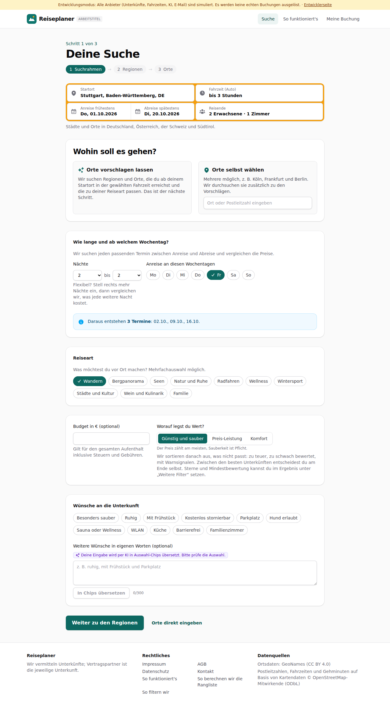
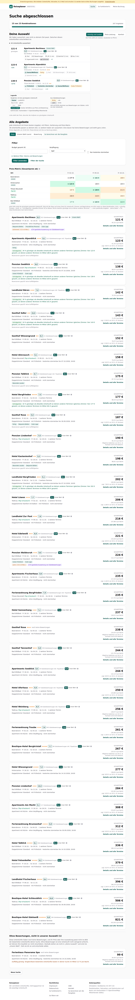
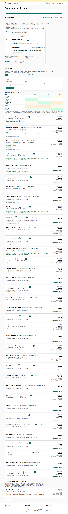
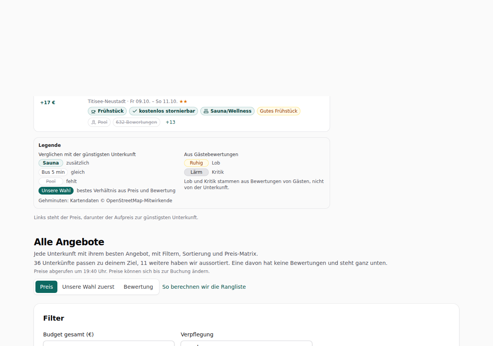

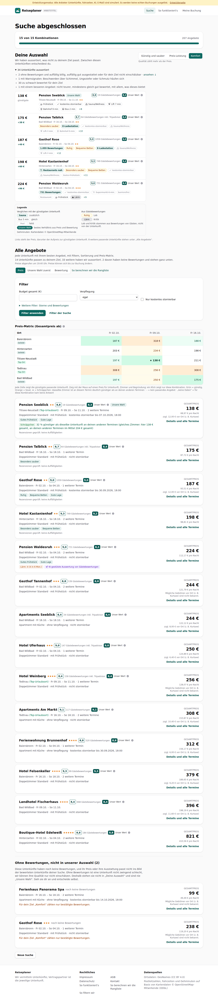
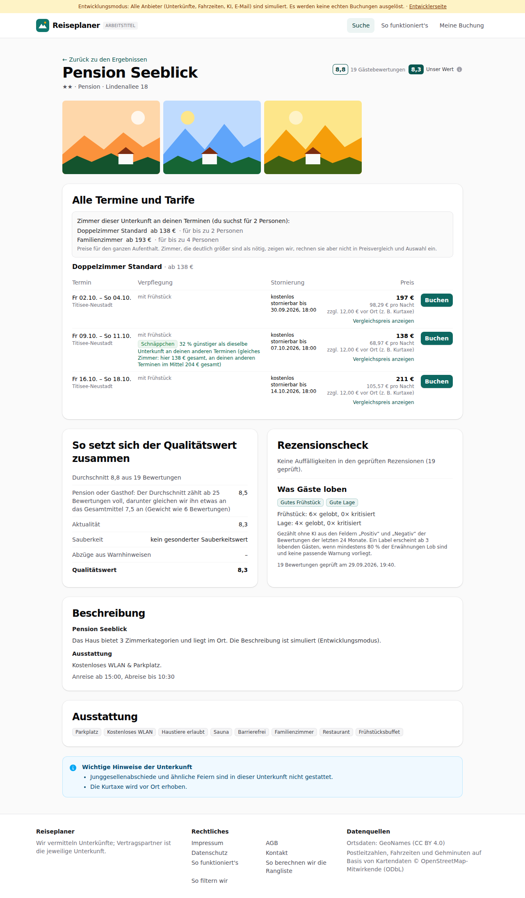
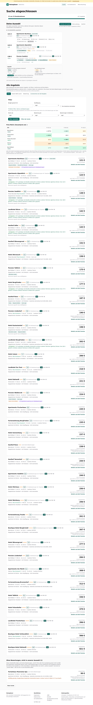

# Dogfood-Walkthrough 2026-09-29T17-40-38-P-finale

- Modus: P – Pfad (Nutzerablauf mit Eingaben)
- Flows: finale
- Basis-URL: http://localhost:35197 (echter lokaler Stack, Anbieter im Fake-Modus)
- Stand: 8777458, gestartet 2026-09-29T17:40:38.884Z
- Ergebnis: ✅ bestanden (51/51 Prüfungen erfüllt)

## Flow „finale“

Entscheidungshilfe (F15–F17, konzept.md 9.9–9.11): Ziel „Günstig und sauber“ im Suchformular, Suche Stuttgart → 5 Orte × 3 Freitage; oben „Deine Auswahl“ als Preisleiter mit höchstens 5 Unterkünften, die günstigste zuerst, bei den anderen Aufpreis und Badges (Legende: grün zusätzlich, weiß gleich, durchgestrichen fehlt, gelb Lob, grau Kritik), Gehminuten aus OpenStreetMap, „Unsere Wahl“ markiert; aussortierte Unterkünfte mit Gründen; Zielwechsel ohne neue Suche; Lob-Labels in Liste und Detailansicht; Sterne und Mindestbewertung unter „Weitere Filter“.

### 01 Suchformular: Ziel „Günstig und sauber“ mit einem Tipp

- URL: `/suche`
- Screenshot: 
- Prüfungen:
  - [x] enthält „Worauf legst du Wert?“
  - [x] enthält „Günstig und sauber“
  - [x] enthält „Preis-Leistung“
  - [x] enthält „Komfort“
  - [x] enthält „Der Preis zählt am meisten, Sauberkeit ist Pflicht.“
  - [x] enthält „Weitere Filter“
  - [x] enthält nicht „Mindestens Sterne“
  - [x] enthält nicht „Mindeststandard“
  - [x] Element `[data-testid="goal-switch"] [aria-checked="true"][data-goal="sparen"]` vorhanden (1)
- Überschriften: „Deine Suche“, „Wohin soll es gehen?“
- KI-Kennzeichnungen (`data-ai-provenance`): „Deine Eingabe wird per KI in Auswahl-Chips übersetzt. Bitte prüfe die Auswahl. [ai_assisted]“
- Konsolenfehler: keine
- Fehlgeschlagene Anfragen: keine

<details><summary>Sichtbarer Text</summary>

```text
Entwicklungsmodus: Alle Anbieter (Unterkünfte, Fahrzeiten, KI, E-Mail) sind simuliert. Es werden keine echten Buchungen ausgelöst. · Entwicklerseite
Reiseplaner
ARBEITSTITEL
Suche
So funktioniert's
Meine Buchung

Schritt 1 von 3

Deine Suche
1
Suchrahmen
→
2
Regionen
→
3
Orte
Startort
Fahrzeit (Auto)
egal
bis 1 Stunde
bis 1 h 30 min
bis 2 Stunden
bis 2 h 30 min
bis 3 Stunden
bis 4 Stunden
bis 5 Stunden
bis 6 Stunden
Anreise frühestens
Do, 01.10.2026
Abreise spätestens
Di, 20.10.2026
Reisende
2 Erwachsene · 1 Zimmer

Städte und Orte in Deutschland, Österreich, der Schweiz und Südtirol.

Wohin soll es gehen?

Orte vorschlagen lassen

Wir suchen Regionen und Orte, die du ab deinem Startort in der gewählten Fahrzeit erreichst und die zu deiner Reiseart passen. Das ist der nächste Schritt.

Orte selbst wählen

Mehrere möglich, z. B. Köln, Frankfurt und Berlin. Wir durchsuchen sie zusätzlich zu den Vorschlägen.

Wie lange und ab welchem Wochentag?

Wir suchen jeden passenden Termin zwischen Anreise und Abreise und vergleichen die Preise.

Nächte
1
2
3
4
5
6
7
8
9
10
11
12
13
14
bis
2
3
4
5
6
7
8
9
10
11
12
13
14

Flexibel? Stell rechts mehr Nächte ein, dann vergleichen wir, was jede weitere Nacht kostet.

Anreise an diesen Wochentagen
Mo
Di
Mi
Do
Fr
Sa
So
Daraus entstehen 3 Termine: 02.10., 09.10., 16.10.
Reiseart

Was möchtest du vor Ort machen? Mehrfachauswahl möglich.

Wandern
Bergpanorama
Seen
Natur und Ruhe
Radfahren
Wellness
Wintersport
Städte und Kultur
Wein und Kulinarik
Familie
Budget in € (optional)

Gilt für den gesamten Aufenthalt inklusive Steuern und Gebühren.

Worauf legst du Wert?

Günstig und sauber
Preis-Leistung
Komfort

Der Preis zählt am meisten, Sauberkeit ist Pflicht.

Wir sortieren danach aus, was nicht passt: zu teuer, zu schwach bewertet, mit Warnsig
… (864 weitere Zeichen)
```

</details>

### 02 Suche abgeschlossen: „Deine Auswahl“ steht oben

- URL: `/suche/2eb42095-d4ee-430d-9099-a957a4cfb8e2#t=3TvKWM_3HPMDhsOesI_qAPNa8Z9ViCjvfYmnL2uKwEg`
- Screenshot: 
- Notiz: 3 Finalisten, Gesamtpreise 120.64 € · 122.69 € · 137.94 €; Aufpreise +2.05 €, +17.3 €.
- Prüfungen:
  - [x] enthält „Deine Auswahl“
  - [x] enthält „Wir haben aussortiert“
  - [x] enthält „günstigste“
  - [x] enthält „aussortiert“
  - [x] enthält „Legende“
  - [x] enthält „zusätzlich“
  - [x] enthält „fehlt“
  - [x] enthält „Lob und Kritik stammen aus Bewertungen von Gästen“
  - [x] enthält „Unsere Wahl“
  - [x] enthält „Alle Angebote“
  - [x] enthält nicht „Unsere Empfehlung“
  - [x] enthält nicht „Testsieger“
  - [x] Element `[data-testid="finalist"]` vorhanden (3)
  - [x] Element `[data-testid="excluded"]` vorhanden (1)
  - [x] Element `[data-testid="feature-badge"]` vorhanden (18)
  - [x] Element `[data-testid="finale-legend"]` vorhanden (1)
- Überschriften: „Suche abgeschlossen“, „Deine Auswahl“, „Alle Angebote“
- KI-Kennzeichnungen (`data-ai-provenance`): „KI-gestützte Auswertung von Gästebewertungen [ai_assisted]“, „KI-gestützte Auswertung von Gästebewertungen [ai_assisted]“
- Konsolenfehler: keine
- Fehlgeschlagene Anfragen: keine

<details><summary>Sichtbarer Text</summary>

```text
Entwicklungsmodus: Alle Anbieter (Unterkünfte, Fahrzeiten, KI, E-Mail) sind simuliert. Es werden keine echten Buchungen ausgelöst. · Entwicklerseite
Reiseplaner
ARBEITSTITEL
Suche
So funktioniert's
Meine Buchung
Suche abgeschlossen

15 von 15 Kombinationen

207 Angebote

Deine Auswahl

Wir haben aussortiert, was nicht zu deinem Ziel passt. Zwischen diesen Unterkünften entscheidest du.

Günstig und sauber
Preis-Leistung
Komfort

Der Preis zählt am meisten, Sauberkeit ist Pflicht.

44 Unterkünfte aussortiert
121 €
günstigste
Apartments Bachhaus
Unsere Wahl
8,9
632 Gästebewertungen
7,2
Unser Wert

Bad Wildbad · Fr 16.10. – So 18.10.

Pool
632 Bewertungen
Lift 11 min
Bahnhof 13 min
Bus 3 min
Supermarkt 6 min
Schimmel
+5
123 €
+2 €
Apartments Alpenblick
8,1
122 Gästebewertungen inkl. Tripadvisor
8,1
Unser Wert

Hinterzarten · Fr 02.10. – So 04.10.★★★

Sauna/Wellness
Ruhig
Pool
632 Bewertungen
Lift 11 min
Bahnhof 13 min
+7
138 €
+17 €
Pension Seeblick
8,8
19 Gästebewertungen
8,3
Unser Wert

Titisee-Neustadt · Fr 09.10. – So 11.10.★★

Frühstück
kostenlos stornierbar
Sauna/Wellness
Gutes Frühstück
Pool
632 Bewertungen
+13

Legende

Verglichen mit der günstigsten Unterkunft

Sauna
zusätzlich
Bus 5 min
gleich
Pool
fehlt
Unsere Wahl
bestes Verhältnis aus Preis und Bewertung

Aus Gästebewertungen

Ruhig
Lob
Lärm
Kritik

Lob und Kritik stammen aus Bewertungen von Gästen, nicht von der Unterkunft.

Gehminuten: Kartendaten © OpenStreetMap-Mitwirkende

Links steht der Preis, darunter der Aufpreis zur günstigsten Unterkunft.

Alle Angebote

Jede Unterkunft mit ihrem besten Angebot, mit Filtern, Sortierung und Preis-Matrix.

36 Unterkünfte passen zu deinem Ziel, 11 weitere haben wir aussortiert. Eine davon hat keine Bewertungen und steht ganz unten.

Preise abgerufen um 19:40 Uhr. Preise
… (14032 weitere Zeichen)
```

</details>

### 03 Aussortiert, mit Grund und Anzahl

- URL: `/suche/2eb42095-d4ee-430d-9099-a957a4cfb8e2#t=3TvKWM_3HPMDhsOesI_qAPNa8Z9ViCjvfYmnL2uKwEg`
- Screenshot: 
- Notiz: Gründe: 1 ohne Bewertungen und auffällig billig, auffällig gut ausgestattet oder für dein Ziel nicht einschätzbar · ansehen ↓ | 1 mit Warnsignalen: Beschwerden über Schimmel, Ungeziefer oder Schmutz häufen sich | 9 zu schwach bewertet für dein Ziel und nicht deutlich günstiger | 29 zu teuer für dein Ziel | 4 mit einem besseren Angebot: nicht teurer, mindestens gleich gut bewertet, mit allem, was dieses bietet
- Prüfungen:
  - [x] enthält „zu teuer für dein Ziel“
  - [x] Element `[data-testid="excluded"] li[data-reason]` vorhanden (5)
- Überschriften: „Suche abgeschlossen“, „Deine Auswahl“, „Alle Angebote“
- KI-Kennzeichnungen (`data-ai-provenance`): „KI-gestützte Auswertung von Gästebewertungen [ai_assisted]“, „KI-gestützte Auswertung von Gästebewertungen [ai_assisted]“
- Konsolenfehler: keine
- Fehlgeschlagene Anfragen: keine

<details><summary>Sichtbarer Text</summary>

```text
Entwicklungsmodus: Alle Anbieter (Unterkünfte, Fahrzeiten, KI, E-Mail) sind simuliert. Es werden keine echten Buchungen ausgelöst. · Entwicklerseite
Reiseplaner
ARBEITSTITEL
Suche
So funktioniert's
Meine Buchung
Suche abgeschlossen

15 von 15 Kombinationen

207 Angebote

Deine Auswahl

Wir haben aussortiert, was nicht zu deinem Ziel passt. Zwischen diesen Unterkünften entscheidest du.

Günstig und sauber
Preis-Leistung
Komfort

Der Preis zählt am meisten, Sauberkeit ist Pflicht.

44 Unterkünfte aussortiert
1 ohne Bewertungen und auffällig billig, auffällig gut ausgestattet oder für dein Ziel nicht einschätzbar · ansehen ↓
1 mit Warnsignalen: Beschwerden über Schimmel, Ungeziefer oder Schmutz häufen sich
9 zu schwach bewertet für dein Ziel und nicht deutlich günstiger
29 zu teuer für dein Ziel
4 mit einem besseren Angebot: nicht teurer, mindestens gleich gut bewertet, mit allem, was dieses bietet
121 €
günstigste
Apartments Bachhaus
Unsere Wahl
8,9
632 Gästebewertungen
7,2
Unser Wert

Bad Wildbad · Fr 16.10. – So 18.10.

Pool
632 Bewertungen
Lift 11 min
Bahnhof 13 min
Bus 3 min
Supermarkt 6 min
Schimmel
+5
123 €
+2 €
Apartments Alpenblick
8,1
122 Gästebewertungen inkl. Tripadvisor
8,1
Unser Wert

Hinterzarten · Fr 02.10. – So 04.10.★★★

Sauna/Wellness
Ruhig
Pool
632 Bewertungen
Lift 11 min
Bahnhof 13 min
+7
138 €
+17 €
Pension Seeblick
8,8
19 Gästebewertungen
8,3
Unser Wert

Titisee-Neustadt · Fr 09.10. – So 11.10.★★

Frühstück
kostenlos stornierbar
Sauna/Wellness
Gutes Frühstück
Pool
632 Bewertungen
+13

Legende

Verglichen mit der günstigsten Unterkunft

Sauna
zusätzlich
Bus 5 min
gleich
Pool
fehlt
Unsere Wahl
bestes Verhältnis aus Preis und Bewertung

Aus Gästebewertungen

Ruhig
Lob
Lärm
Kritik

Lob und Kritik stammen aus Bewertungen von Gästen, nicht von der Unterkun
… (14429 weitere Zeichen)
```

</details>

### 04 Preisleiter: Aufpreis und Badges statt Sätzen, Gehminuten aus OpenStreetMap

- URL: `/suche/2eb42095-d4ee-430d-9099-a957a4cfb8e2#t=3TvKWM_3HPMDhsOesI_qAPNa8Z9ViCjvfYmnL2uKwEg`
- Screenshot: 
- Notiz: Leiter: Apartments Bachhaus (günstigste): Pool, 632 Bewertungen, Lift 11 min, Bahnhof 13 min, Bus 3 min, Supermarkt 6 min || Apartments Alpenblick (+2 €): +Sauna/Wellness, +Ruhig, −Pool, −632 Bewertungen, −Lift 11 min, −Bahnhof 13 min || Pension Seeblick (+17 €): +Frühstück, +kostenlos stornierbar, +Sauna/Wellness, +Gutes Frühstück, −Pool, −632 Bewertungen
- Prüfungen:
  - [x] enthält „min“
  - [x] enthält „Kartendaten © OpenStreetMap-Mitwirkende“
  - [x] enthält nicht „Dafür nicht:“
  - [x] enthält nicht „gegenüber“
  - [x] Element `[data-testid="feature-badge"][data-code^="lage_"]` vorhanden (6)
  - [x] Element `[data-testid="osm-attribution"]` vorhanden (1)
- Überschriften: „Suche abgeschlossen“, „Deine Auswahl“, „Alle Angebote“
- KI-Kennzeichnungen (`data-ai-provenance`): „KI-gestützte Auswertung von Gästebewertungen [ai_assisted]“, „KI-gestützte Auswertung von Gästebewertungen [ai_assisted]“
- Konsolenfehler: keine
- Fehlgeschlagene Anfragen: keine

<details><summary>Sichtbarer Text</summary>

```text
Entwicklungsmodus: Alle Anbieter (Unterkünfte, Fahrzeiten, KI, E-Mail) sind simuliert. Es werden keine echten Buchungen ausgelöst. · Entwicklerseite
Reiseplaner
ARBEITSTITEL
Suche
So funktioniert's
Meine Buchung
Suche abgeschlossen

15 von 15 Kombinationen

207 Angebote

Deine Auswahl

Wir haben aussortiert, was nicht zu deinem Ziel passt. Zwischen diesen Unterkünften entscheidest du.

Günstig und sauber
Preis-Leistung
Komfort

Der Preis zählt am meisten, Sauberkeit ist Pflicht.

44 Unterkünfte aussortiert
1 ohne Bewertungen und auffällig billig, auffällig gut ausgestattet oder für dein Ziel nicht einschätzbar · ansehen ↓
1 mit Warnsignalen: Beschwerden über Schimmel, Ungeziefer oder Schmutz häufen sich
9 zu schwach bewertet für dein Ziel und nicht deutlich günstiger
29 zu teuer für dein Ziel
4 mit einem besseren Angebot: nicht teurer, mindestens gleich gut bewertet, mit allem, was dieses bietet
121 €
günstigste
Apartments Bachhaus
Unsere Wahl
8,9
632 Gästebewertungen
7,2
Unser Wert

Bad Wildbad · Fr 16.10. – So 18.10.

Pool
632 Bewertungen
Lift 11 min
Bahnhof 13 min
Bus 3 min
Supermarkt 6 min
Schimmel
+5
123 €
+2 €
Apartments Alpenblick
8,1
122 Gästebewertungen inkl. Tripadvisor
8,1
Unser Wert

Hinterzarten · Fr 02.10. – So 04.10.★★★

Sauna/Wellness
Ruhig
Pool
632 Bewertungen
Lift 11 min
Bahnhof 13 min
+7
138 €
+17 €
Pension Seeblick
8,8
19 Gästebewertungen
8,3
Unser Wert

Titisee-Neustadt · Fr 09.10. – So 11.10.★★

Frühstück
kostenlos stornierbar
Sauna/Wellness
Gutes Frühstück
Pool
632 Bewertungen
+13

Legende

Verglichen mit der günstigsten Unterkunft

Sauna
zusätzlich
Bus 5 min
gleich
Pool
fehlt
Unsere Wahl
bestes Verhältnis aus Preis und Bewertung

Aus Gästebewertungen

Ruhig
Lob
Lärm
Kritik

Lob und Kritik stammen aus Bewertungen von Gästen, nicht von der Unterkun
… (14429 weitere Zeichen)
```

</details>

### 05 Legende unter der Auswahl (Aufgabe 10)

- URL: `/suche/2eb42095-d4ee-430d-9099-a957a4cfb8e2#t=3TvKWM_3HPMDhsOesI_qAPNa8Z9ViCjvfYmnL2uKwEg`
- Screenshot: 
- Prüfungen:
  - [x] enthält „Verglichen mit der günstigsten Unterkunft“
  - [x] enthält „Aus Gästebewertungen“
  - [x] enthält „Lob“
  - [x] enthält „Kritik“
- Überschriften: „Suche abgeschlossen“, „Deine Auswahl“, „Alle Angebote“
- KI-Kennzeichnungen (`data-ai-provenance`): „KI-gestützte Auswertung von Gästebewertungen [ai_assisted]“, „KI-gestützte Auswertung von Gästebewertungen [ai_assisted]“
- Konsolenfehler: keine
- Fehlgeschlagene Anfragen: keine

<details><summary>Sichtbarer Text</summary>

```text
Entwicklungsmodus: Alle Anbieter (Unterkünfte, Fahrzeiten, KI, E-Mail) sind simuliert. Es werden keine echten Buchungen ausgelöst. · Entwicklerseite
Reiseplaner
ARBEITSTITEL
Suche
So funktioniert's
Meine Buchung
Suche abgeschlossen

15 von 15 Kombinationen

207 Angebote

Deine Auswahl

Wir haben aussortiert, was nicht zu deinem Ziel passt. Zwischen diesen Unterkünften entscheidest du.

Günstig und sauber
Preis-Leistung
Komfort

Der Preis zählt am meisten, Sauberkeit ist Pflicht.

44 Unterkünfte aussortiert
1 ohne Bewertungen und auffällig billig, auffällig gut ausgestattet oder für dein Ziel nicht einschätzbar · ansehen ↓
1 mit Warnsignalen: Beschwerden über Schimmel, Ungeziefer oder Schmutz häufen sich
9 zu schwach bewertet für dein Ziel und nicht deutlich günstiger
29 zu teuer für dein Ziel
4 mit einem besseren Angebot: nicht teurer, mindestens gleich gut bewertet, mit allem, was dieses bietet
121 €
günstigste
Apartments Bachhaus
Unsere Wahl
8,9
632 Gästebewertungen
7,2
Unser Wert

Bad Wildbad · Fr 16.10. – So 18.10.

Pool
632 Bewertungen
Lift 11 min
Bahnhof 13 min
Bus 3 min
Supermarkt 6 min
Schimmel
+5
123 €
+2 €
Apartments Alpenblick
8,1
122 Gästebewertungen inkl. Tripadvisor
8,1
Unser Wert

Hinterzarten · Fr 02.10. – So 04.10.★★★

Sauna/Wellness
Ruhig
Pool
632 Bewertungen
Lift 11 min
Bahnhof 13 min
+7
138 €
+17 €
Pension Seeblick
8,8
19 Gästebewertungen
8,3
Unser Wert

Titisee-Neustadt · Fr 09.10. – So 11.10.★★

Frühstück
kostenlos stornierbar
Sauna/Wellness
Gutes Frühstück
Pool
632 Bewertungen
+13

Legende

Verglichen mit der günstigsten Unterkunft

Sauna
zusätzlich
Bus 5 min
gleich
Pool
fehlt
Unsere Wahl
bestes Verhältnis aus Preis und Bewertung

Aus Gästebewertungen

Ruhig
Lob
Lärm
Kritik

Lob und Kritik stammen aus Bewertungen von Gästen, nicht von der Unterkun
… (14429 weitere Zeichen)
```

</details>

### 06 Preisleiter auf dem Handy (390 px)

- URL: `/suche/2eb42095-d4ee-430d-9099-a957a4cfb8e2#t=3TvKWM_3HPMDhsOesI_qAPNa8Z9ViCjvfYmnL2uKwEg`
- Screenshot: 
- Prüfungen:
  - [x] Element `[data-testid="finalist"] [data-testid="feature-badge"]` vorhanden (18)
- Überschriften: „Suche abgeschlossen“, „Deine Auswahl“, „Alle Angebote“
- KI-Kennzeichnungen (`data-ai-provenance`): „KI-gestützte Auswertung von Gästebewertungen [ai_assisted]“, „KI-gestützte Auswertung von Gästebewertungen [ai_assisted]“
- Konsolenfehler: keine
- Fehlgeschlagene Anfragen: keine

<details><summary>Sichtbarer Text</summary>

```text
Entwicklungsmodus: Alle Anbieter (Unterkünfte, Fahrzeiten, KI, E-Mail) sind simuliert. Es werden keine echten Buchungen ausgelöst. · Entwicklerseite
Reiseplaner
Suche
Meine Buchung
Suche abgeschlossen

15 von 15 Kombinationen

207 Angebote

Deine Auswahl

Wir haben aussortiert, was nicht zu deinem Ziel passt. Zwischen diesen Unterkünften entscheidest du.

Günstig und sauber
Preis-Leistung
Komfort

Der Preis zählt am meisten, Sauberkeit ist Pflicht.

44 Unterkünfte aussortiert
1 ohne Bewertungen und auffällig billig, auffällig gut ausgestattet oder für dein Ziel nicht einschätzbar · ansehen ↓
1 mit Warnsignalen: Beschwerden über Schimmel, Ungeziefer oder Schmutz häufen sich
9 zu schwach bewertet für dein Ziel und nicht deutlich günstiger
29 zu teuer für dein Ziel
4 mit einem besseren Angebot: nicht teurer, mindestens gleich gut bewertet, mit allem, was dieses bietet
121 €
günstigste
Apartments Bachhaus
Unsere Wahl
8,9
632 Gästebewertungen
7,2
Unser Wert

Bad Wildbad · Fr 16.10. – So 18.10.

Pool
632 Bewertungen
Lift 11 min
Bahnhof 13 min
Bus 3 min
Supermarkt 6 min
Schimmel
+5
123 €
+2 €
Apartments Alpenblick
8,1
122 Gästebewertungen inkl. Tripadvisor
8,1
Unser Wert

Hinterzarten · Fr 02.10. – So 04.10.★★★

Sauna/Wellness
Ruhig
Pool
632 Bewertungen
Lift 11 min
Bahnhof 13 min
+7
138 €
+17 €
Pension Seeblick
8,8
19 Gästebewertungen
8,3
Unser Wert

Titisee-Neustadt · Fr 09.10. – So 11.10.★★

Frühstück
kostenlos stornierbar
Sauna/Wellness
Gutes Frühstück
Pool
632 Bewertungen
+13

Legende

Verglichen mit der günstigsten Unterkunft

Sauna
zusätzlich
Bus 5 min
gleich
Pool
fehlt
Unsere Wahl
bestes Verhältnis aus Preis und Bewertung

Aus Gästebewertungen

Ruhig
Lob
Lärm
Kritik

Lob und Kritik stammen aus Bewertungen von Gästen, nicht von der Unterkunft.

Gehminuten: Kartendaten © 
… (14398 weitere Zeichen)
```

</details>

### 07 Zielwechsel ohne neue Suche: „Komfort“

- URL: `/suche/2eb42095-d4ee-430d-9099-a957a4cfb8e2#t=3TvKWM_3HPMDhsOesI_qAPNa8Z9ViCjvfYmnL2uKwEg`
- Screenshot: 
- Notiz: Komfort-Finalisten: Pension Seeblick, Pension Talblick, Gasthof Rose, Hotel Kastanienhof, Pension Waldesruh
- Prüfungen:
  - [x] enthält „Qualität zählt mehr als der Preis.“
  - [x] Element `[data-testid="finale"][data-goal="komfort"] [data-testid="finalist"]` vorhanden (5)
- Überschriften: „Suche abgeschlossen“, „Deine Auswahl“, „Alle Angebote“
- KI-Kennzeichnungen (`data-ai-provenance`): „KI-gestützte Auswertung von Gästebewertungen [ai_assisted]“
- Konsolenfehler: keine
- Fehlgeschlagene Anfragen: keine

<details><summary>Sichtbarer Text</summary>

```text
Entwicklungsmodus: Alle Anbieter (Unterkünfte, Fahrzeiten, KI, E-Mail) sind simuliert. Es werden keine echten Buchungen ausgelöst. · Entwicklerseite
Reiseplaner
ARBEITSTITEL
Suche
So funktioniert's
Meine Buchung
Suche abgeschlossen

15 von 15 Kombinationen

207 Angebote

Deine Auswahl

Wir haben aussortiert, was nicht zu deinem Ziel passt. Zwischen diesen Unterkünften entscheidest du.

Günstig und sauber
Preis-Leistung
Komfort

Qualität zählt mehr als der Preis.

34 Unterkünfte aussortiert
2 ohne Bewertungen und auffällig billig, auffällig gut ausgestattet oder für dein Ziel nicht einschätzbar · ansehen ↓
1 mit Warnsignalen: Beschwerden über Schimmel, Ungeziefer oder Schmutz häufen sich
30 zu schwach bewertet für dein Ziel
1 mit einem besseren Angebot: nicht teurer, mindestens gleich gut bewertet, mit allem, was dieses bietet
138 €
günstigste
Pension Seeblick
Unsere Wahl
8,8
19 Gästebewertungen
8,3
Unser Wert

Titisee-Neustadt · Fr 09.10. – So 11.10.★★

Frühstück
kostenlos stornierbar
Sauna/Wellness
Lift 7 min
Bahnhof 9 min
Bus 2 min
+8
175 €
+38 €
Pension Talblick
8,7
64 Gästebewertungen inkl. Tripadvisor
8,4
Unser Wert

Bad Wildbad · Fr 16.10. – So 18.10.★★

Besonders sauber
E-Ladestation
kostenlos stornierbar
Sauna/Wellness
Lift 7 min
Bahnhof 9 min
+10
187 €
+49 €
Gasthof Rose
9,0
1059 Gästebewertungen
9,0
Unser Wert

Baiersbronn · Fr 02.10. – So 04.10.★★

1.059 Bewertungen
Ruhig
Bequeme Betten
E-Ladestation
Sauna/Wellness
Lift 7 min
+12
198 €
+60 €
Hotel Kastanienhof
9,3
749 Gästebewertungen
9,2
Unser Wert

Hinterzarten · Fr 16.10. – So 18.10.★★

Restaurants nah
Besonders sauber
Bequeme Betten
kostenlos stornierbar
Sauna/Wellness
Gutes Frühstück
+11
224 €
+86 €
Pension Waldesruh
9,0
731 Gästebewertungen
8,3
Unser Wert

Bad Wildbad · Fr 02.10. – So 04.10.★★★

731 Bew
… (7835 weitere Zeichen)
```

</details>

### 08 Lob-Labels erscheinen von selbst in der Liste

- URL: `/suche/2eb42095-d4ee-430d-9099-a957a4cfb8e2#t=3TvKWM_3HPMDhsOesI_qAPNa8Z9ViCjvfYmnL2uKwEg`
- Screenshot: 
- Notiz: Labels in der Liste: Gutes Frühstück, Gute Lage, Besonders sauber, Ruhig, Bequeme Betten (10 insgesamt).
- Prüfungen:
  - [x] Element `[data-testid="result-list"] [data-testid="praise-label"]` vorhanden (10)
- Überschriften: „Suche abgeschlossen“, „Deine Auswahl“, „Alle Angebote“
- KI-Kennzeichnungen (`data-ai-provenance`): „KI-gestützte Auswertung von Gästebewertungen [ai_assisted]“
- Konsolenfehler: keine
- Fehlgeschlagene Anfragen: keine

<details><summary>Sichtbarer Text</summary>

```text
Entwicklungsmodus: Alle Anbieter (Unterkünfte, Fahrzeiten, KI, E-Mail) sind simuliert. Es werden keine echten Buchungen ausgelöst. · Entwicklerseite
Reiseplaner
ARBEITSTITEL
Suche
So funktioniert's
Meine Buchung
Suche abgeschlossen

15 von 15 Kombinationen

207 Angebote

Deine Auswahl

Wir haben aussortiert, was nicht zu deinem Ziel passt. Zwischen diesen Unterkünften entscheidest du.

Günstig und sauber
Preis-Leistung
Komfort

Qualität zählt mehr als der Preis.

34 Unterkünfte aussortiert
2 ohne Bewertungen und auffällig billig, auffällig gut ausgestattet oder für dein Ziel nicht einschätzbar · ansehen ↓
1 mit Warnsignalen: Beschwerden über Schimmel, Ungeziefer oder Schmutz häufen sich
30 zu schwach bewertet für dein Ziel
1 mit einem besseren Angebot: nicht teurer, mindestens gleich gut bewertet, mit allem, was dieses bietet
138 €
günstigste
Pension Seeblick
Unsere Wahl
8,8
19 Gästebewertungen
8,3
Unser Wert

Titisee-Neustadt · Fr 09.10. – So 11.10.★★

Frühstück
kostenlos stornierbar
Sauna/Wellness
Lift 7 min
Bahnhof 9 min
Bus 2 min
+8
175 €
+38 €
Pension Talblick
8,7
64 Gästebewertungen inkl. Tripadvisor
8,4
Unser Wert

Bad Wildbad · Fr 16.10. – So 18.10.★★

Besonders sauber
E-Ladestation
kostenlos stornierbar
Sauna/Wellness
Lift 7 min
Bahnhof 9 min
+10
187 €
+49 €
Gasthof Rose
9,0
1059 Gästebewertungen
9,0
Unser Wert

Baiersbronn · Fr 02.10. – So 04.10.★★

1.059 Bewertungen
Ruhig
Bequeme Betten
E-Ladestation
Sauna/Wellness
Lift 7 min
+12
198 €
+60 €
Hotel Kastanienhof
9,3
749 Gästebewertungen
9,2
Unser Wert

Hinterzarten · Fr 16.10. – So 18.10.★★

Restaurants nah
Besonders sauber
Bequeme Betten
kostenlos stornierbar
Sauna/Wellness
Gutes Frühstück
+11
224 €
+86 €
Pension Waldesruh
9,0
731 Gästebewertungen
8,3
Unser Wert

Bad Wildbad · Fr 02.10. – So 04.10.★★★

731 Bew
… (7835 weitere Zeichen)
```

</details>

### 09 Detailansicht: „Was Gäste loben“ mit Zahlen

- URL: `/suche/2eb42095-d4ee-430d-9099-a957a4cfb8e2/unterkunft/lpf-4792-819-2#t=3TvKWM_3HPMDhsOesI_qAPNa8Z9ViCjvfYmnL2uKwEg`
- Screenshot: 
- Notiz: Detail: Frühstück: 6× gelobt, 0× kritisiert | Lage: 4× gelobt, 0× kritisiert
- Prüfungen:
  - [x] enthält „Was Gäste loben“
  - [x] enthält „× gelobt“
  - [x] enthält „× kritisiert“
  - [x] enthält „ohne KI“
  - [x] Element `[data-testid="praise"] [data-testid="praise-label"]` vorhanden (2)
  - [x] Element `[data-testid="praise-count"]` vorhanden (2)
- Überschriften: „Pension Seeblick“, „Alle Termine und Tarife“, „So setzt sich der Qualitätswert zusammen“, „Rezensionscheck“, „Beschreibung“, „Ausstattung“
- KI-Kennzeichnungen (`data-ai-provenance`): keine
- Konsolenfehler: keine
- Fehlgeschlagene Anfragen: keine

<details><summary>Sichtbarer Text</summary>

```text
Entwicklungsmodus: Alle Anbieter (Unterkünfte, Fahrzeiten, KI, E-Mail) sind simuliert. Es werden keine echten Buchungen ausgelöst. · Entwicklerseite
Reiseplaner
ARBEITSTITEL
Suche
So funktioniert's
Meine Buchung
← Zurück zu den Ergebnissen
Pension Seeblick

★★ · Pension · Lindenallee 18

8,8
19 Gästebewertungen
8,3
Unser Wert
Alle Termine und Tarife

Zimmer dieser Unterkunft an deinen Terminen (du suchst für 2 Personen):

Doppelzimmer Standard
ab 138 €
· für bis zu 2 Personen
Familienzimmer
ab 193 €
· für bis zu 4 Personen

Preise für den ganzen Aufenthalt. Zimmer, die deutlich größer sind als nötig, zeigen wir, rechnen sie aber nicht in Preisvergleich und Auswahl ein.

Doppelzimmer Standard · ab 138 €
Termin	Verpflegung	Stornierung	Preis	

Fr 02.10. – So 04.10.
Titisee-Neustadt
	
mit Frühstück
	kostenlos stornierbar bis 30.09.2026, 18:00	
197 €
98,29 € pro Nacht
zzgl. 12,00 € vor Ort (z. B. Kurtaxe)
Vergleichspreis anzeigen
	Buchen

Fr 09.10. – So 11.10.
Titisee-Neustadt
	
mit Frühstück
Schnäppchen 32 % günstiger als dieselbe Unterkunft an deinen anderen Terminen (gleiches Zimmer: hier 138 € gesamt, an deinen anderen Terminen im Mittel 204 € gesamt)
	kostenlos stornierbar bis 07.10.2026, 18:00	
138 €
68,97 € pro Nacht
zzgl. 12,00 € vor Ort (z. B. Kurtaxe)
Vergleichspreis anzeigen
	Buchen

Fr 16.10. – So 18.10.
Titisee-Neustadt
	
mit Frühstück
	kostenlos stornierbar bis 14.10.2026, 18:00	
211 €
105,57 € pro Nacht
zzgl. 12,00 € vor Ort (z. B. Kurtaxe)
Vergleichspreis anzeigen
	Buchen
So setzt sich der Qualitätswert zusammen
Durchschnitt 8,8 aus 19 Bewertungen
Pension oder Gasthof: Der Durchschnitt zählt ab 25 Bewertungen voll, darunter gleichen wir ihn etwas an das Gesamtmittel 7,5 an (Gewicht wie 6 Bewertungen)
8,5
Aktualität
8,3
Sauberkeit
kein gesonderter Sauberkeitsw
… (1349 weitere Zeichen)
```

</details>

### 10 Sterne und Mindestbewertung unter „Weitere Filter“

- URL: `/suche/2eb42095-d4ee-430d-9099-a957a4cfb8e2#t=3TvKWM_3HPMDhsOesI_qAPNa8Z9ViCjvfYmnL2uKwEg`
- Screenshot: 
- Prüfungen:
  - [x] enthält „Weitere Filter: Sterne und Bewertungen“
  - [x] enthält „Sterne ab“
  - [x] enthält „Bewertung ab“
  - [x] enthält „Sterne sagen wenig über Sauberkeit und Zustand.“
- Überschriften: „Suche abgeschlossen“, „Deine Auswahl“, „Alle Angebote“
- KI-Kennzeichnungen (`data-ai-provenance`): „KI-gestützte Auswertung von Gästebewertungen [ai_assisted]“, „KI-gestützte Auswertung von Gästebewertungen [ai_assisted]“
- Konsolenfehler: keine
- Fehlgeschlagene Anfragen: keine

<details><summary>Sichtbarer Text</summary>

```text
Entwicklungsmodus: Alle Anbieter (Unterkünfte, Fahrzeiten, KI, E-Mail) sind simuliert. Es werden keine echten Buchungen ausgelöst. · Entwicklerseite
Reiseplaner
ARBEITSTITEL
Suche
So funktioniert's
Meine Buchung
Suche abgeschlossen

15 von 15 Kombinationen

207 Angebote

Deine Auswahl

Wir haben aussortiert, was nicht zu deinem Ziel passt. Zwischen diesen Unterkünften entscheidest du.

Günstig und sauber
Preis-Leistung
Komfort

Der Preis zählt am meisten, Sauberkeit ist Pflicht.

44 Unterkünfte aussortiert
121 €
günstigste
Apartments Bachhaus
Unsere Wahl
8,9
632 Gästebewertungen
7,2
Unser Wert

Bad Wildbad · Fr 16.10. – So 18.10.

Pool
632 Bewertungen
Lift 11 min
Bahnhof 13 min
Bus 3 min
Supermarkt 6 min
Schimmel
+5
123 €
+2 €
Apartments Alpenblick
8,1
122 Gästebewertungen inkl. Tripadvisor
8,1
Unser Wert

Hinterzarten · Fr 02.10. – So 04.10.★★★

Sauna/Wellness
Ruhig
Pool
632 Bewertungen
Lift 11 min
Bahnhof 13 min
+7
138 €
+17 €
Pension Seeblick
8,8
19 Gästebewertungen
8,3
Unser Wert

Titisee-Neustadt · Fr 09.10. – So 11.10.★★

Frühstück
kostenlos stornierbar
Sauna/Wellness
Gutes Frühstück
Pool
632 Bewertungen
+13

Legende

Verglichen mit der günstigsten Unterkunft

Sauna
zusätzlich
Bus 5 min
gleich
Pool
fehlt
Unsere Wahl
bestes Verhältnis aus Preis und Bewertung

Aus Gästebewertungen

Ruhig
Lob
Lärm
Kritik

Lob und Kritik stammen aus Bewertungen von Gästen, nicht von der Unterkunft.

Gehminuten: Kartendaten © OpenStreetMap-Mitwirkende

Links steht der Preis, darunter der Aufpreis zur günstigsten Unterkunft.

Alle Angebote

Jede Unterkunft mit ihrem besten Angebot, mit Filtern, Sortierung und Preis-Matrix.

36 Unterkünfte passen zu deinem Ziel, 11 weitere haben wir aussortiert. Eine davon hat keine Bewertungen und steht ganz unten.

Preise abgerufen um 19:40 Uhr. Preise
… (14249 weitere Zeichen)
```

</details>

