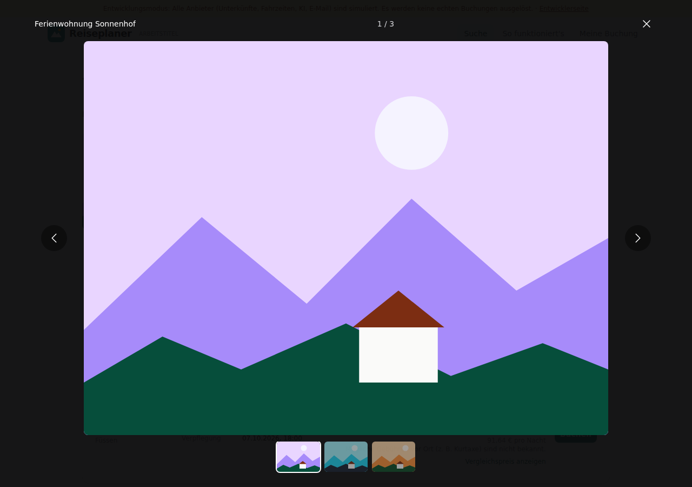
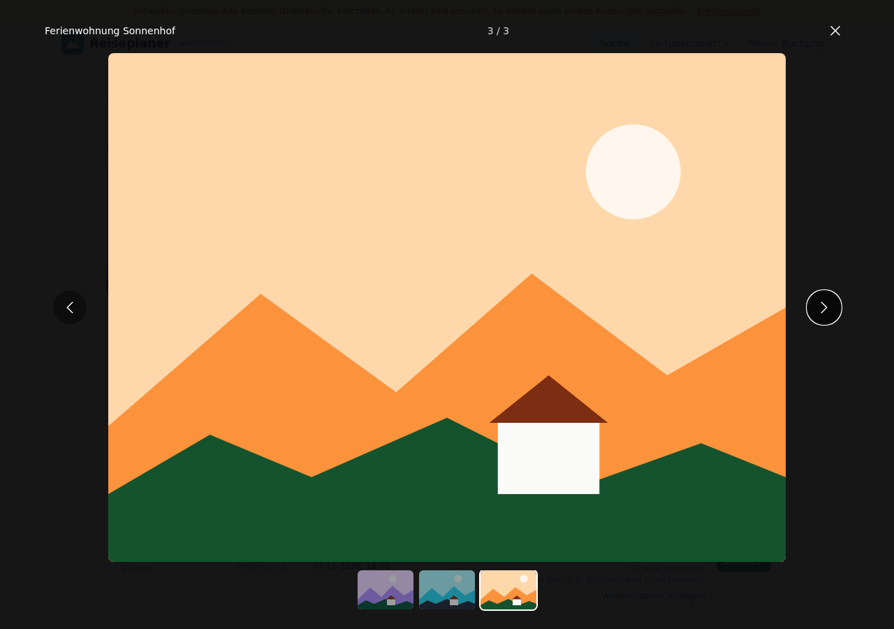
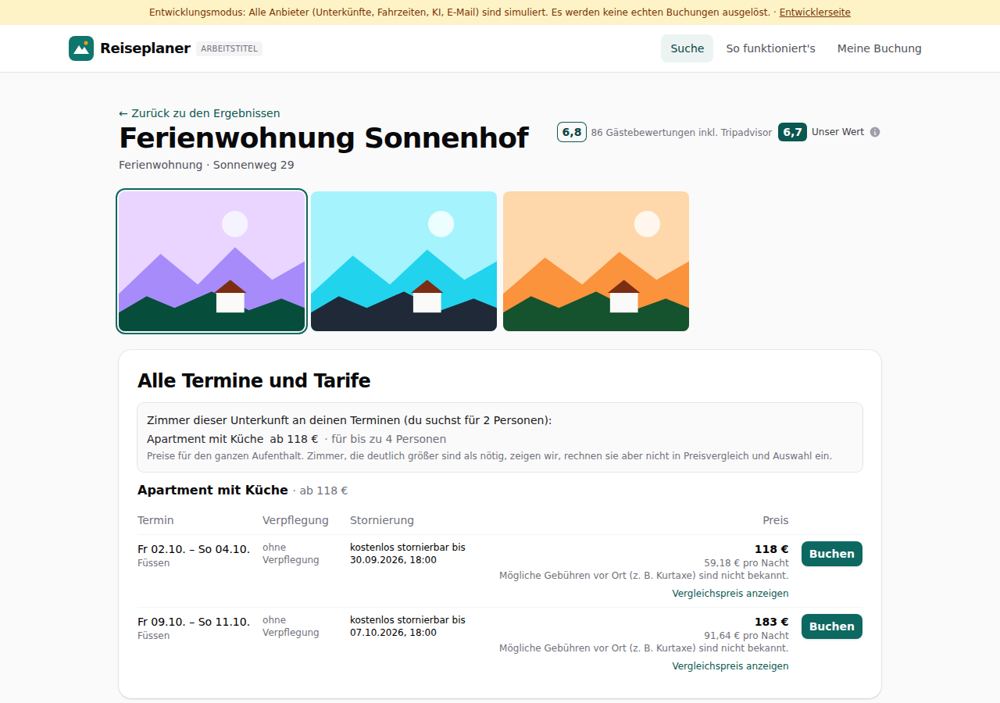

# Dogfood-Walkthrough 2026-09-29T17-45-55-P-bilder

- Modus: P – Pfad (Nutzerablauf mit Eingaben)
- Flows: bilder
- Basis-URL: http://localhost:46511 (echter lokaler Stack, Anbieter im Fake-Modus)
- Stand: a7839b5, gestartet 2026-09-29T17:45:55.624Z
- Ergebnis: ✅ bestanden (7/7 Prüfungen erfüllt)

## Flow „bilder“

Detailansicht: Klick auf ein Foto öffnet es groß, mit Vor/Zurück, Pfeiltasten, Zähler und Vorschaubildern; Escape schließt.

### 01 Detailansicht mit Fotos

- URL: `/suche/4bb2c06e-44c6-4cc4-a654-a44ce2ff55ed/unterkunft/lpf-4757-1070-10#t=Lgn1bKPRoG9kYlMrqJjvTbBMceaWALuxliz_mEPTErs`
- Screenshot: 
- Prüfungen:
  - [x] Element `[data-testid="detail-photo"]` vorhanden (3)
- Überschriften: „Ferienwohnung Sonnenhof“, „Alle Termine und Tarife“, „So setzt sich der Qualitätswert zusammen“, „Rezensionscheck“, „Beschreibung“, „Ausstattung“
- KI-Kennzeichnungen (`data-ai-provenance`): keine
- Konsolenfehler: keine
- Fehlgeschlagene Anfragen: keine

<details><summary>Sichtbarer Text</summary>

```text
Entwicklungsmodus: Alle Anbieter (Unterkünfte, Fahrzeiten, KI, E-Mail) sind simuliert. Es werden keine echten Buchungen ausgelöst. · Entwicklerseite
Reiseplaner
ARBEITSTITEL
Suche
So funktioniert's
Meine Buchung
← Zurück zu den Ergebnissen
Ferienwohnung Sonnenhof

Ferienwohnung · Sonnenweg 29

6,8
86 Gästebewertungen inkl. Tripadvisor
6,7
Unser Wert
Alle Termine und Tarife

Zimmer dieser Unterkunft an deinen Terminen (du suchst für 2 Personen):

Apartment mit Küche
ab 118 €
· für bis zu 4 Personen

Preise für den ganzen Aufenthalt. Zimmer, die deutlich größer sind als nötig, zeigen wir, rechnen sie aber nicht in Preisvergleich und Auswahl ein.

Apartment mit Küche · ab 118 €
Termin	Verpflegung	Stornierung	Preis	

Fr 02.10. – So 04.10.
Füssen
	
ohne Verpflegung
	kostenlos stornierbar bis 30.09.2026, 18:00	
118 €
59,18 € pro Nacht
Mögliche Gebühren vor Ort (z. B. Kurtaxe) sind nicht bekannt.
Vergleichspreis anzeigen
	Buchen

Fr 09.10. – So 11.10.
Füssen
	
ohne Verpflegung
	kostenlos stornierbar bis 07.10.2026, 18:00	
183 €
91,64 € pro Nacht
Mögliche Gebühren vor Ort (z. B. Kurtaxe) sind nicht bekannt.
Vergleichspreis anzeigen
	Buchen
So setzt sich der Qualitätswert zusammen
Durchschnitt 6,8 aus 86 Bewertungen
Ferienwohnung: ab 20 Bewertungen zählt der Durchschnitt voll
6,8
Aktualität
6,7
Sauberkeit
kein gesonderter Sauberkeitswert
Abzüge aus Warnhinweisen
–
Qualitätswert
6,7

Die Note fasst die Bewertungen der Unterkunft mit Bewertungen von Tripadvisor zusammen, weil sie in unserer Datenquelle nur wenige Bewertungen hat. Bewertungen von Tripadvisor zählen dabei halb.

Rezensionscheck

Keine Auffälligkeiten in den geprüften Rezensionen (29 geprüft).

29 Bewertungen geprüft am 29.09.2026, 19:46.

Beschreibung
Ferienwohnung Sonnenhof

Das Ferienquartier bietet 1 Zimmerkatego
… (889 weitere Zeichen)
```

</details>

### 02 Klick auf das erste Foto: groß

- URL: `/suche/4bb2c06e-44c6-4cc4-a654-a44ce2ff55ed/unterkunft/lpf-4757-1070-10#t=Lgn1bKPRoG9kYlMrqJjvTbBMceaWALuxliz_mEPTErs`
- Screenshot: 
- Prüfungen:
  - [x] enthält „1 /“
  - [x] Element `[data-testid="lightbox"]` vorhanden (1)
  - [x] Element `[data-testid="lightbox-next"]` vorhanden (1)
- Überschriften: „Ferienwohnung Sonnenhof“, „Alle Termine und Tarife“, „So setzt sich der Qualitätswert zusammen“, „Rezensionscheck“, „Beschreibung“, „Ausstattung“, „Ferienwohnung Sonnenhof“
- KI-Kennzeichnungen (`data-ai-provenance`): keine
- Konsolenfehler: keine
- Fehlgeschlagene Anfragen: keine

<details><summary>Sichtbarer Text</summary>

```text
Entwicklungsmodus: Alle Anbieter (Unterkünfte, Fahrzeiten, KI, E-Mail) sind simuliert. Es werden keine echten Buchungen ausgelöst. · Entwicklerseite
Reiseplaner
ARBEITSTITEL
Suche
So funktioniert's
Meine Buchung
← Zurück zu den Ergebnissen
Ferienwohnung Sonnenhof

Ferienwohnung · Sonnenweg 29

6,8
86 Gästebewertungen inkl. Tripadvisor
6,7
Unser Wert
Alle Termine und Tarife

Zimmer dieser Unterkunft an deinen Terminen (du suchst für 2 Personen):

Apartment mit Küche
ab 118 €
· für bis zu 4 Personen

Preise für den ganzen Aufenthalt. Zimmer, die deutlich größer sind als nötig, zeigen wir, rechnen sie aber nicht in Preisvergleich und Auswahl ein.

Apartment mit Küche · ab 118 €
Termin	Verpflegung	Stornierung	Preis	

Fr 02.10. – So 04.10.
Füssen
	
ohne Verpflegung
	kostenlos stornierbar bis 30.09.2026, 18:00	
118 €
59,18 € pro Nacht
Mögliche Gebühren vor Ort (z. B. Kurtaxe) sind nicht bekannt.
Vergleichspreis anzeigen
	Buchen

Fr 09.10. – So 11.10.
Füssen
	
ohne Verpflegung
	kostenlos stornierbar bis 07.10.2026, 18:00	
183 €
91,64 € pro Nacht
Mögliche Gebühren vor Ort (z. B. Kurtaxe) sind nicht bekannt.
Vergleichspreis anzeigen
	Buchen
So setzt sich der Qualitätswert zusammen
Durchschnitt 6,8 aus 86 Bewertungen
Ferienwohnung: ab 20 Bewertungen zählt der Durchschnitt voll
6,8
Aktualität
6,7
Sauberkeit
kein gesonderter Sauberkeitswert
Abzüge aus Warnhinweisen
–
Qualitätswert
6,7

Die Note fasst die Bewertungen der Unterkunft mit Bewertungen von Tripadvisor zusammen, weil sie in unserer Datenquelle nur wenige Bewertungen hat. Bewertungen von Tripadvisor zählen dabei halb.

Rezensionscheck

Keine Auffälligkeiten in den geprüften Rezensionen (29 geprüft).

29 Bewertungen geprüft am 29.09.2026, 19:46.

Beschreibung
Ferienwohnung Sonnenhof

Das Ferienquartier bietet 1 Zimmerkatego
… (919 weitere Zeichen)
```

</details>

### 03 Weiter mit dem Pfeil-Knopf und der Pfeiltaste

- URL: `/suche/4bb2c06e-44c6-4cc4-a654-a44ce2ff55ed/unterkunft/lpf-4757-1070-10#t=Lgn1bKPRoG9kYlMrqJjvTbBMceaWALuxliz_mEPTErs`
- Screenshot: 
- Notiz: Nach „zurück“ vom ersten Foto: 3 / 3 (springt ans Ende)
- Prüfungen:
  - [x] Element `[data-testid="lightbox-image"]` vorhanden (1)
- Überschriften: „Ferienwohnung Sonnenhof“, „Alle Termine und Tarife“, „So setzt sich der Qualitätswert zusammen“, „Rezensionscheck“, „Beschreibung“, „Ausstattung“, „Ferienwohnung Sonnenhof“
- KI-Kennzeichnungen (`data-ai-provenance`): keine
- Konsolenfehler: keine
- Fehlgeschlagene Anfragen: keine

<details><summary>Sichtbarer Text</summary>

```text
Entwicklungsmodus: Alle Anbieter (Unterkünfte, Fahrzeiten, KI, E-Mail) sind simuliert. Es werden keine echten Buchungen ausgelöst. · Entwicklerseite
Reiseplaner
ARBEITSTITEL
Suche
So funktioniert's
Meine Buchung
← Zurück zu den Ergebnissen
Ferienwohnung Sonnenhof

Ferienwohnung · Sonnenweg 29

6,8
86 Gästebewertungen inkl. Tripadvisor
6,7
Unser Wert
Alle Termine und Tarife

Zimmer dieser Unterkunft an deinen Terminen (du suchst für 2 Personen):

Apartment mit Küche
ab 118 €
· für bis zu 4 Personen

Preise für den ganzen Aufenthalt. Zimmer, die deutlich größer sind als nötig, zeigen wir, rechnen sie aber nicht in Preisvergleich und Auswahl ein.

Apartment mit Küche · ab 118 €
Termin	Verpflegung	Stornierung	Preis	

Fr 02.10. – So 04.10.
Füssen
	
ohne Verpflegung
	kostenlos stornierbar bis 30.09.2026, 18:00	
118 €
59,18 € pro Nacht
Mögliche Gebühren vor Ort (z. B. Kurtaxe) sind nicht bekannt.
Vergleichspreis anzeigen
	Buchen

Fr 09.10. – So 11.10.
Füssen
	
ohne Verpflegung
	kostenlos stornierbar bis 07.10.2026, 18:00	
183 €
91,64 € pro Nacht
Mögliche Gebühren vor Ort (z. B. Kurtaxe) sind nicht bekannt.
Vergleichspreis anzeigen
	Buchen
So setzt sich der Qualitätswert zusammen
Durchschnitt 6,8 aus 86 Bewertungen
Ferienwohnung: ab 20 Bewertungen zählt der Durchschnitt voll
6,8
Aktualität
6,7
Sauberkeit
kein gesonderter Sauberkeitswert
Abzüge aus Warnhinweisen
–
Qualitätswert
6,7

Die Note fasst die Bewertungen der Unterkunft mit Bewertungen von Tripadvisor zusammen, weil sie in unserer Datenquelle nur wenige Bewertungen hat. Bewertungen von Tripadvisor zählen dabei halb.

Rezensionscheck

Keine Auffälligkeiten in den geprüften Rezensionen (29 geprüft).

29 Bewertungen geprüft am 29.09.2026, 19:46.

Beschreibung
Ferienwohnung Sonnenhof

Das Ferienquartier bietet 1 Zimmerkatego
… (919 weitere Zeichen)
```

</details>

### 04 Escape schließt

- URL: `/suche/4bb2c06e-44c6-4cc4-a654-a44ce2ff55ed/unterkunft/lpf-4757-1070-10#t=Lgn1bKPRoG9kYlMrqJjvTbBMceaWALuxliz_mEPTErs`
- Screenshot: 
- Prüfungen:
  - [x] Element `[data-testid="detail-photos"]` vorhanden (1)
- Überschriften: „Ferienwohnung Sonnenhof“, „Alle Termine und Tarife“, „So setzt sich der Qualitätswert zusammen“, „Rezensionscheck“, „Beschreibung“, „Ausstattung“
- KI-Kennzeichnungen (`data-ai-provenance`): keine
- Konsolenfehler: keine
- Fehlgeschlagene Anfragen: keine

<details><summary>Sichtbarer Text</summary>

```text
Entwicklungsmodus: Alle Anbieter (Unterkünfte, Fahrzeiten, KI, E-Mail) sind simuliert. Es werden keine echten Buchungen ausgelöst. · Entwicklerseite
Reiseplaner
ARBEITSTITEL
Suche
So funktioniert's
Meine Buchung
← Zurück zu den Ergebnissen
Ferienwohnung Sonnenhof

Ferienwohnung · Sonnenweg 29

6,8
86 Gästebewertungen inkl. Tripadvisor
6,7
Unser Wert
Alle Termine und Tarife

Zimmer dieser Unterkunft an deinen Terminen (du suchst für 2 Personen):

Apartment mit Küche
ab 118 €
· für bis zu 4 Personen

Preise für den ganzen Aufenthalt. Zimmer, die deutlich größer sind als nötig, zeigen wir, rechnen sie aber nicht in Preisvergleich und Auswahl ein.

Apartment mit Küche · ab 118 €
Termin	Verpflegung	Stornierung	Preis	

Fr 02.10. – So 04.10.
Füssen
	
ohne Verpflegung
	kostenlos stornierbar bis 30.09.2026, 18:00	
118 €
59,18 € pro Nacht
Mögliche Gebühren vor Ort (z. B. Kurtaxe) sind nicht bekannt.
Vergleichspreis anzeigen
	Buchen

Fr 09.10. – So 11.10.
Füssen
	
ohne Verpflegung
	kostenlos stornierbar bis 07.10.2026, 18:00	
183 €
91,64 € pro Nacht
Mögliche Gebühren vor Ort (z. B. Kurtaxe) sind nicht bekannt.
Vergleichspreis anzeigen
	Buchen
So setzt sich der Qualitätswert zusammen
Durchschnitt 6,8 aus 86 Bewertungen
Ferienwohnung: ab 20 Bewertungen zählt der Durchschnitt voll
6,8
Aktualität
6,7
Sauberkeit
kein gesonderter Sauberkeitswert
Abzüge aus Warnhinweisen
–
Qualitätswert
6,7

Die Note fasst die Bewertungen der Unterkunft mit Bewertungen von Tripadvisor zusammen, weil sie in unserer Datenquelle nur wenige Bewertungen hat. Bewertungen von Tripadvisor zählen dabei halb.

Rezensionscheck

Keine Auffälligkeiten in den geprüften Rezensionen (29 geprüft).

29 Bewertungen geprüft am 29.09.2026, 19:46.

Beschreibung
Ferienwohnung Sonnenhof

Das Ferienquartier bietet 1 Zimmerkatego
… (889 weitere Zeichen)
```

</details>

### 05 Handy: Foto groß

- URL: `/suche/4bb2c06e-44c6-4cc4-a654-a44ce2ff55ed/unterkunft/lpf-4757-1070-10#t=Lgn1bKPRoG9kYlMrqJjvTbBMceaWALuxliz_mEPTErs`
- Screenshot: 
- Prüfungen:
  - [x] enthält „2 /“
- Überschriften: „Ferienwohnung Sonnenhof“, „Alle Termine und Tarife“, „So setzt sich der Qualitätswert zusammen“, „Rezensionscheck“, „Beschreibung“, „Ausstattung“, „Ferienwohnung Sonnenhof“
- KI-Kennzeichnungen (`data-ai-provenance`): keine
- Konsolenfehler: keine
- Fehlgeschlagene Anfragen: keine

<details><summary>Sichtbarer Text</summary>

```text
Entwicklungsmodus: Alle Anbieter (Unterkünfte, Fahrzeiten, KI, E-Mail) sind simuliert. Es werden keine echten Buchungen ausgelöst. · Entwicklerseite
Reiseplaner
Suche
Meine Buchung
← Zurück zu den Ergebnissen
Ferienwohnung Sonnenhof

Ferienwohnung · Sonnenweg 29

6,8
86 Gästebewertungen inkl. Tripadvisor
6,7
Unser Wert
Alle Termine und Tarife

Zimmer dieser Unterkunft an deinen Terminen (du suchst für 2 Personen):

Apartment mit Küche
ab 118 €
· für bis zu 4 Personen

Preise für den ganzen Aufenthalt. Zimmer, die deutlich größer sind als nötig, zeigen wir, rechnen sie aber nicht in Preisvergleich und Auswahl ein.

Apartment mit Küche · ab 118 €
Termin	Verpflegung	Stornierung	Preis	

Fr 02.10. – So 04.10.
Füssen
	
ohne Verpflegung
	kostenlos stornierbar bis 30.09.2026, 18:00	
118 €
59,18 € pro Nacht
Mögliche Gebühren vor Ort (z. B. Kurtaxe) sind nicht bekannt.
Vergleichspreis anzeigen
	Buchen

Fr 09.10. – So 11.10.
Füssen
	
ohne Verpflegung
	kostenlos stornierbar bis 07.10.2026, 18:00	
183 €
91,64 € pro Nacht
Mögliche Gebühren vor Ort (z. B. Kurtaxe) sind nicht bekannt.
Vergleichspreis anzeigen
	Buchen
So setzt sich der Qualitätswert zusammen
Durchschnitt 6,8 aus 86 Bewertungen
Ferienwohnung: ab 20 Bewertungen zählt der Durchschnitt voll
6,8
Aktualität
6,7
Sauberkeit
kein gesonderter Sauberkeitswert
Abzüge aus Warnhinweisen
–
Qualitätswert
6,7

Die Note fasst die Bewertungen der Unterkunft mit Bewertungen von Tripadvisor zusammen, weil sie in unserer Datenquelle nur wenige Bewertungen hat. Bewertungen von Tripadvisor zählen dabei halb.

Rezensionscheck

Keine Auffälligkeiten in den geprüften Rezensionen (29 geprüft).

29 Bewertungen geprüft am 29.09.2026, 19:46.

Beschreibung
Ferienwohnung Sonnenhof

Das Ferienquartier bietet 1 Zimmerkategorien und liegt im Ort. Die Besc
… (888 weitere Zeichen)
```

</details>

