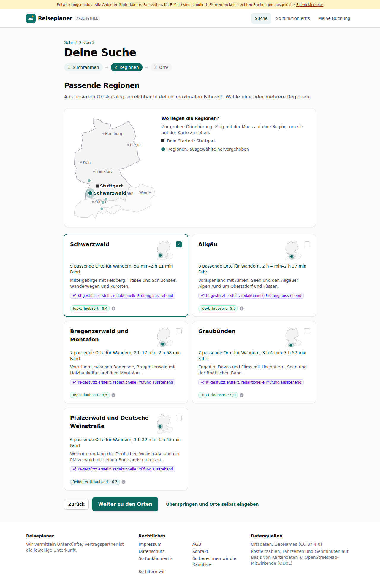
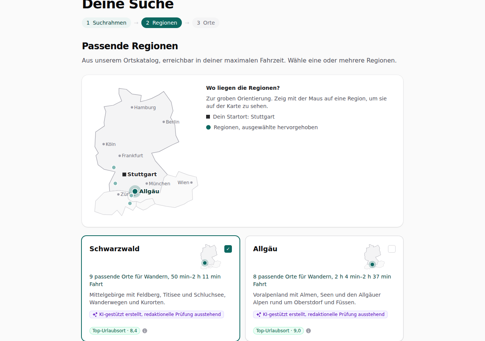
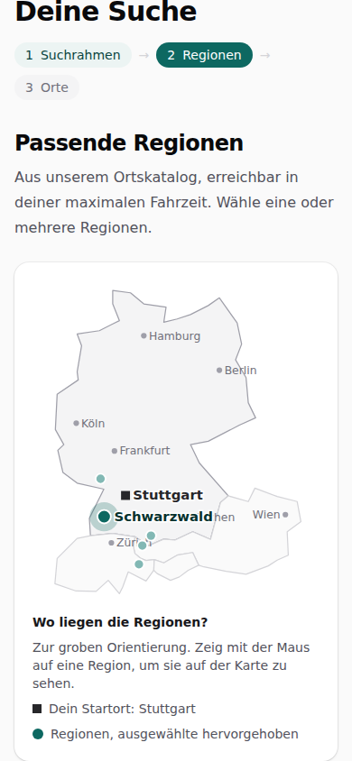

# Dogfood-Walkthrough 2026-09-29T17-59-01-P-karte

- Modus: P – Pfad (Nutzerablauf mit Eingaben)
- Flows: karte
- Basis-URL: http://localhost:37229 (echter lokaler Stack, Anbieter im Fake-Modus)
- Stand: 0f1f4b4, gestartet 2026-09-29T17:59:01.595Z
- Ergebnis: ✅ bestanden (6/6 Prüfungen erfüllt)

## Flow „karte“

Regionen mit grober Karte: Übersicht mit Startort und allen Regionen, Mini-Karte je Region, beim Draufzeigen wird die Region auf der Übersicht hervorgehoben.

### 01 Regionen mit Übersichtskarte und Mini-Karten

- URL: `/suche`
- Screenshot: 
- Prüfungen:
  - [x] enthält „Wo liegen die Regionen?“
  - [x] enthält „Dein Startort: Stuttgart“
  - [x] Element `[data-testid="region-map"] [data-testid="map-marker"]` vorhanden (5)
  - [x] Element `[data-testid="region-card"] svg[data-testid="overview-map"]` vorhanden (5)
- Überschriften: „Deine Suche“, „Passende Regionen“
- KI-Kennzeichnungen (`data-ai-provenance`): „KI-gestützt erstellt, redaktionelle Prüfung ausstehend [ai_assisted]“, „KI-gestützt erstellt, redaktionelle Prüfung ausstehend [ai_assisted]“, „KI-gestützt erstellt, redaktionelle Prüfung ausstehend [ai_assisted]“, „KI-gestützt erstellt, redaktionelle Prüfung ausstehend [ai_assisted]“, „KI-gestützt erstellt, redaktionelle Prüfung ausstehend [ai_assisted]“
- Konsolenfehler: keine
- Fehlgeschlagene Anfragen: keine

<details><summary>Sichtbarer Text</summary>

```text
Entwicklungsmodus: Alle Anbieter (Unterkünfte, Fahrzeiten, KI, E-Mail) sind simuliert. Es werden keine echten Buchungen ausgelöst. · Entwicklerseite
Reiseplaner
ARBEITSTITEL
Suche
So funktioniert's
Meine Buchung

Schritt 2 von 3

Deine Suche
1
Suchrahmen
→
2
Regionen
→
3
Orte
Passende Regionen

Aus unserem Ortskatalog, erreichbar in deiner maximalen Fahrzeit. Wähle eine oder mehrere Regionen.

Berlin
Hamburg
Köln
Frankfurt
München
Wien
Zürich
Stuttgart
Schwarzwald

Wo liegen die Regionen?

Zur groben Orientierung. Zeig mit der Maus auf eine Region, um sie auf der Karte zu sehen.

Dein Startort: Stuttgart

Regionen, ausgewählte hervorgehoben

Schwarzwald
✓

9 passende Orte für Wandern, 50 min–2 h 11 min Fahrt

Mittelgebirge mit Feldberg, Titisee und Schluchsee, Wanderwegen und Kurorten.

KI-gestützt erstellt, redaktionelle Prüfung ausstehend
Top-Urlaubsort · 8,4
Allgäu

8 passende Orte für Wandern, 2 h 4 min–2 h 37 min Fahrt

Voralpenland mit Almen, Seen und den Allgäuer Alpen rund um Oberstdorf und Füssen.

KI-gestützt erstellt, redaktionelle Prüfung ausstehend
Top-Urlaubsort · 9,0
Bregenzerwald und Montafon

7 passende Orte für Wandern, 2 h 17 min–2 h 58 min Fahrt

Vorarlberg zwischen Bodensee, Bregenzerwald mit Holzbaukultur und dem Montafon.

KI-gestützt erstellt, redaktionelle Prüfung ausstehend
Top-Urlaubsort · 9,5
Graubünden

7 passende Orte für Wandern, 3 h 4 min–3 h 57 min Fahrt

Engadin, Davos und Flims mit Hochtälern, Seen und der Rhätischen Bahn.

KI-gestützt erstellt, redaktionelle Prüfung ausstehend
Top-Urlaubsort · 9,0
Pfälzerwald und Deutsche Weinstraße

6 passende Orte für Wandern, 1 h 22 min–1 h 45 min Fahrt

Weinorte entlang der Deutschen Weinstraße und der Pfälzerwald mit seinen Buntsandsteinfelsen.

KI-gestützt erstellt, redaktionelle Prüfung aussteh
… (445 weitere Zeichen)
```

</details>

### 02 Maus auf „Allgäu“: auf der Karte hervorgehoben

- URL: `/suche`
- Screenshot: 
- Notiz: Hervorgehoben: 
- Prüfungen:
  - [x] Element `[data-testid="region-map"] [data-testid="map-marker"][data-strong]` vorhanden (1)
- Überschriften: „Deine Suche“, „Passende Regionen“
- KI-Kennzeichnungen (`data-ai-provenance`): „KI-gestützt erstellt, redaktionelle Prüfung ausstehend [ai_assisted]“, „KI-gestützt erstellt, redaktionelle Prüfung ausstehend [ai_assisted]“, „KI-gestützt erstellt, redaktionelle Prüfung ausstehend [ai_assisted]“, „KI-gestützt erstellt, redaktionelle Prüfung ausstehend [ai_assisted]“, „KI-gestützt erstellt, redaktionelle Prüfung ausstehend [ai_assisted]“
- Konsolenfehler: keine
- Fehlgeschlagene Anfragen: keine

<details><summary>Sichtbarer Text</summary>

```text
Entwicklungsmodus: Alle Anbieter (Unterkünfte, Fahrzeiten, KI, E-Mail) sind simuliert. Es werden keine echten Buchungen ausgelöst. · Entwicklerseite
Reiseplaner
ARBEITSTITEL
Suche
So funktioniert's
Meine Buchung

Schritt 2 von 3

Deine Suche
1
Suchrahmen
→
2
Regionen
→
3
Orte
Passende Regionen

Aus unserem Ortskatalog, erreichbar in deiner maximalen Fahrzeit. Wähle eine oder mehrere Regionen.

Berlin
Hamburg
Köln
Frankfurt
München
Wien
Zürich
Stuttgart
Allgäu

Wo liegen die Regionen?

Zur groben Orientierung. Zeig mit der Maus auf eine Region, um sie auf der Karte zu sehen.

Dein Startort: Stuttgart

Regionen, ausgewählte hervorgehoben

Schwarzwald
✓

9 passende Orte für Wandern, 50 min–2 h 11 min Fahrt

Mittelgebirge mit Feldberg, Titisee und Schluchsee, Wanderwegen und Kurorten.

KI-gestützt erstellt, redaktionelle Prüfung ausstehend
Top-Urlaubsort · 8,4
Allgäu

8 passende Orte für Wandern, 2 h 4 min–2 h 37 min Fahrt

Voralpenland mit Almen, Seen und den Allgäuer Alpen rund um Oberstdorf und Füssen.

KI-gestützt erstellt, redaktionelle Prüfung ausstehend
Top-Urlaubsort · 9,0
Bregenzerwald und Montafon

7 passende Orte für Wandern, 2 h 17 min–2 h 58 min Fahrt

Vorarlberg zwischen Bodensee, Bregenzerwald mit Holzbaukultur und dem Montafon.

KI-gestützt erstellt, redaktionelle Prüfung ausstehend
Top-Urlaubsort · 9,5
Graubünden

7 passende Orte für Wandern, 3 h 4 min–3 h 57 min Fahrt

Engadin, Davos und Flims mit Hochtälern, Seen und der Rhätischen Bahn.

KI-gestützt erstellt, redaktionelle Prüfung ausstehend
Top-Urlaubsort · 9,0
Pfälzerwald und Deutsche Weinstraße

6 passende Orte für Wandern, 1 h 22 min–1 h 45 min Fahrt

Weinorte entlang der Deutschen Weinstraße und der Pfälzerwald mit seinen Buntsandsteinfelsen.

KI-gestützt erstellt, redaktionelle Prüfung ausstehend
B
… (440 weitere Zeichen)
```

</details>

### 03 Handy (390 px)

- URL: `/suche`
- Screenshot: 
- Prüfungen:
  - [x] Element `[data-testid="region-map"]` vorhanden (1)
- Überschriften: „Deine Suche“, „Passende Regionen“
- KI-Kennzeichnungen (`data-ai-provenance`): „KI-gestützt erstellt, redaktionelle Prüfung ausstehend [ai_assisted]“, „KI-gestützt erstellt, redaktionelle Prüfung ausstehend [ai_assisted]“, „KI-gestützt erstellt, redaktionelle Prüfung ausstehend [ai_assisted]“, „KI-gestützt erstellt, redaktionelle Prüfung ausstehend [ai_assisted]“, „KI-gestützt erstellt, redaktionelle Prüfung ausstehend [ai_assisted]“
- Konsolenfehler: keine
- Fehlgeschlagene Anfragen: keine

<details><summary>Sichtbarer Text</summary>

```text
Entwicklungsmodus: Alle Anbieter (Unterkünfte, Fahrzeiten, KI, E-Mail) sind simuliert. Es werden keine echten Buchungen ausgelöst. · Entwicklerseite
Reiseplaner
Suche
Meine Buchung

Schritt 2 von 3

Deine Suche
1
Suchrahmen
→
2
Regionen
→
3
Orte
Passende Regionen

Aus unserem Ortskatalog, erreichbar in deiner maximalen Fahrzeit. Wähle eine oder mehrere Regionen.

Berlin
Hamburg
Köln
Frankfurt
München
Wien
Zürich
Stuttgart
Schwarzwald

Wo liegen die Regionen?

Zur groben Orientierung. Zeig mit der Maus auf eine Region, um sie auf der Karte zu sehen.

Dein Startort: Stuttgart

Regionen, ausgewählte hervorgehoben

Schwarzwald
✓

9 passende Orte für Wandern, 50 min–2 h 11 min Fahrt

Mittelgebirge mit Feldberg, Titisee und Schluchsee, Wanderwegen und Kurorten.

KI-gestützt erstellt, redaktionelle Prüfung ausstehend
Top-Urlaubsort · 8,4
Allgäu

8 passende Orte für Wandern, 2 h 4 min–2 h 37 min Fahrt

Voralpenland mit Almen, Seen und den Allgäuer Alpen rund um Oberstdorf und Füssen.

KI-gestützt erstellt, redaktionelle Prüfung ausstehend
Top-Urlaubsort · 9,0
Bregenzerwald und Montafon

7 passende Orte für Wandern, 2 h 17 min–2 h 58 min Fahrt

Vorarlberg zwischen Bodensee, Bregenzerwald mit Holzbaukultur und dem Montafon.

KI-gestützt erstellt, redaktionelle Prüfung ausstehend
Top-Urlaubsort · 9,5
Graubünden

7 passende Orte für Wandern, 3 h 4 min–3 h 57 min Fahrt

Engadin, Davos und Flims mit Hochtälern, Seen und der Rhätischen Bahn.

KI-gestützt erstellt, redaktionelle Prüfung ausstehend
Top-Urlaubsort · 9,0
Pfälzerwald und Deutsche Weinstraße

6 passende Orte für Wandern, 1 h 22 min–1 h 45 min Fahrt

Weinorte entlang der Deutschen Weinstraße und der Pfälzerwald mit seinen Buntsandsteinfelsen.

KI-gestützt erstellt, redaktionelle Prüfung ausstehend
Beliebter Urlaubsort · 6,3

… (414 weitere Zeichen)
```

</details>

