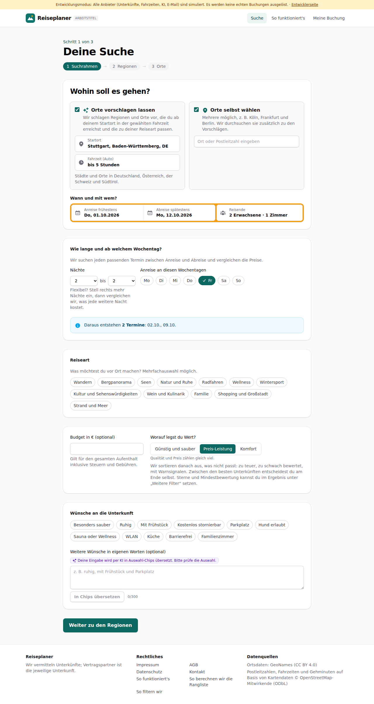
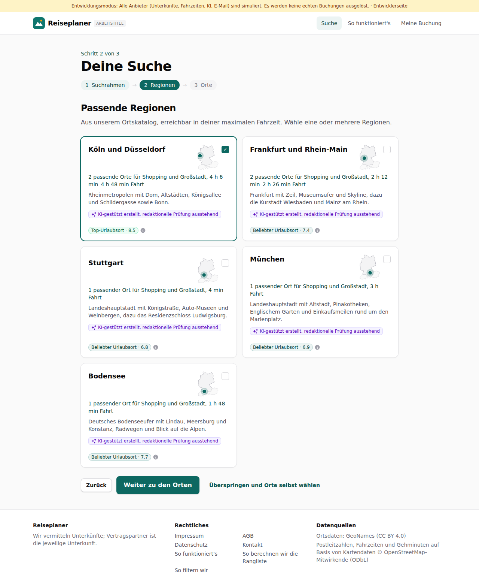
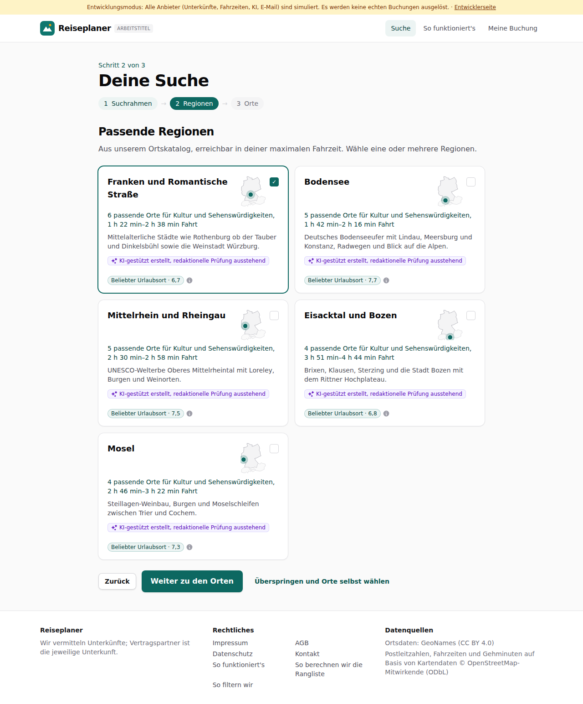

# Dogfood-Walkthrough 2026-09-29T21-20-05-P-themen

- Modus: P – Pfad (Nutzerablauf mit Eingaben)
- Flows: themen
- Basis-URL: http://localhost:34637 (echter lokaler Stack, Anbieter im Fake-Modus)
- Stand: fbd2848, gestartet 2026-09-29T21:20:05.153Z
- Ergebnis: ✅ bestanden (9/9 Prüfungen erfüllt)

## Flow „themen“

Reiseart: „Kultur und Sehenswürdigkeiten“ und „Shopping und Großstadt“ sind getrennte Themen; Shopping schlägt Großstädte vor (Ben, 29.09.).

### 01 Themen mit Kultur, Shopping und Strand

- URL: `/suche`
- Screenshot: 
- Prüfungen:
  - [x] enthält „Kultur und Sehenswürdigkeiten“
  - [x] enthält „Shopping und Großstadt“
  - [x] enthält „Strand und Meer“
  - [x] enthält nicht „Städte und Kultur“
- Überschriften: „Deine Suche“, „Wohin soll es gehen?“
- KI-Kennzeichnungen (`data-ai-provenance`): „Deine Eingabe wird per KI in Auswahl-Chips übersetzt. Bitte prüfe die Auswahl. [ai_assisted]“
- Konsolenfehler: keine
- Fehlgeschlagene Anfragen: keine

<details><summary>Sichtbarer Text</summary>

```text
Entwicklungsmodus: Alle Anbieter (Unterkünfte, Fahrzeiten, KI, E-Mail) sind simuliert. Es werden keine echten Buchungen ausgelöst. · Entwicklerseite
Reiseplaner
ARBEITSTITEL
Suche
So funktioniert's
Meine Buchung

Schritt 1 von 3

Deine Suche
1
Suchrahmen
→
2
Regionen
→
3
Orte
Wohin soll es gehen?
Orte vorschlagen lassen
Wir schlagen Regionen und Orte vor, die du ab deinem Startort in der gewählten Fahrzeit erreichst und die zu deiner Reiseart passen.
Startort
Fahrzeit (Auto)
egal
bis 1 Stunde
bis 1 h 30 min
bis 2 Stunden
bis 2 h 30 min
bis 3 Stunden
bis 4 Stunden
bis 5 Stunden
bis 6 Stunden

Städte und Orte in Deutschland, Österreich, der Schweiz und Südtirol.

Orte selbst wählen
Mehrere möglich, z. B. Köln, Frankfurt und Berlin. Wir durchsuchen sie zusätzlich zu den Vorschlägen.

Wann und mit wem?

Anreise frühestens
Do, 01.10.2026
Abreise spätestens
Mo, 12.10.2026
Reisende
2 Erwachsene · 1 Zimmer
Wie lange und ab welchem Wochentag?

Wir suchen jeden passenden Termin zwischen Anreise und Abreise und vergleichen die Preise.

Nächte
1
2
3
4
5
6
7
8
9
10
11
12
13
14
bis
2
3
4
5
6
7
8
9
10
11
12
13
14

Flexibel? Stell rechts mehr Nächte ein, dann vergleichen wir, was jede weitere Nacht kostet.

Anreise an diesen Wochentagen
Mo
Di
Mi
Do
Fr
Sa
So
Daraus entstehen 2 Termine: 02.10., 09.10.
Reiseart

Was möchtest du vor Ort machen? Mehrfachauswahl möglich.

Wandern
Bergpanorama
Seen
Natur und Ruhe
Radfahren
Wellness
Wintersport
Kultur und Sehenswürdigkeiten
Wein und Kulinarik
Familie
Shopping und Großstadt
Strand und Meer
Budget in € (optional)

Gilt für den gesamten Aufenthalt inklusive Steuern und Gebühren.

Worauf legst du Wert?

Günstig und sauber
Preis-Leistung
Komfort

Qualität und Preis zählen gleich viel.

Wir sortieren danach aus, was nicht passt: zu teuer, zu schwach
… (865 weitere Zeichen)
```

</details>

### 02 Shopping: Großstädte statt Altstädte

- URL: `/suche`
- Screenshot: 
- Notiz: Regionen bei Shopping: Köln und Düsseldorf, Frankfurt und Rhein-Main, Stuttgart, München, Bodensee
- Prüfungen:
  - [x] enthält „Frankfurt“
  - [x] enthält „Shopping und Großstadt“
  - [x] enthält nicht „Allgäu“
- Überschriften: „Deine Suche“, „Passende Regionen“
- KI-Kennzeichnungen (`data-ai-provenance`): „KI-gestützt erstellt, redaktionelle Prüfung ausstehend [ai_assisted]“, „KI-gestützt erstellt, redaktionelle Prüfung ausstehend [ai_assisted]“, „KI-gestützt erstellt, redaktionelle Prüfung ausstehend [ai_assisted]“, „KI-gestützt erstellt, redaktionelle Prüfung ausstehend [ai_assisted]“, „KI-gestützt erstellt, redaktionelle Prüfung ausstehend [ai_assisted]“
- Konsolenfehler: keine
- Fehlgeschlagene Anfragen: keine

<details><summary>Sichtbarer Text</summary>

```text
Entwicklungsmodus: Alle Anbieter (Unterkünfte, Fahrzeiten, KI, E-Mail) sind simuliert. Es werden keine echten Buchungen ausgelöst. · Entwicklerseite
Reiseplaner
ARBEITSTITEL
Suche
So funktioniert's
Meine Buchung

Schritt 2 von 3

Deine Suche
1
Suchrahmen
→
2
Regionen
→
3
Orte
Passende Regionen

Aus unserem Ortskatalog, erreichbar in deiner maximalen Fahrzeit. Wähle eine oder mehrere Regionen.

Köln und Düsseldorf
✓

2 passende Orte für Shopping und Großstadt, 4 h 6 min–4 h 48 min Fahrt

Rheinmetropolen mit Dom, Altstädten, Königsallee und Schildergasse sowie Bonn.

KI-gestützt erstellt, redaktionelle Prüfung ausstehend
Top-Urlaubsort · 8,5
Frankfurt und Rhein-Main

2 passende Orte für Shopping und Großstadt, 2 h 12 min–2 h 26 min Fahrt

Frankfurt mit Zeil, Museumsufer und Skyline, dazu die Kurstadt Wiesbaden und Mainz am Rhein.

KI-gestützt erstellt, redaktionelle Prüfung ausstehend
Beliebter Urlaubsort · 7,4
Stuttgart

1 passender Ort für Shopping und Großstadt, 4 min Fahrt

Landeshauptstadt mit Königstraße, Auto-Museen und Weinbergen, dazu das Residenzschloss Ludwigsburg.

KI-gestützt erstellt, redaktionelle Prüfung ausstehend
Beliebter Urlaubsort · 6,8
München

1 passender Ort für Shopping und Großstadt, 3 h Fahrt

Landeshauptstadt mit Altstadt, Pinakotheken, Englischem Garten und Einkaufsmeilen rund um den Marienplatz.

KI-gestützt erstellt, redaktionelle Prüfung ausstehend
Beliebter Urlaubsort · 6,9
Bodensee

1 passender Ort für Shopping und Großstadt, 1 h 48 min Fahrt

Deutsches Bodenseeufer mit Lindau, Meersburg und Konstanz, Radwegen und Blick auf die Alpen.

KI-gestützt erstellt, redaktionelle Prüfung ausstehend
Beliebter Urlaubsort · 7,7
Zurück
Weiter zu den Orten
Überspringen und Orte selbst wählen

Reiseplaner

Wir vermitteln Unterkünfte; Vertragspartner ist
… (288 weitere Zeichen)
```

</details>

### 03 Kultur: Altstädte und Sehenswürdigkeiten

- URL: `/suche`
- Screenshot: 
- Notiz: Regionen bei Kultur: Franken und Romantische Straße, Bodensee, Mittelrhein und Rheingau, Eisacktal und Bozen, Mosel
- Prüfungen:
  - [x] enthält „Romantische Straße“
  - [x] enthält „Kultur und Sehenswürdigkeiten“
- Überschriften: „Deine Suche“, „Passende Regionen“
- KI-Kennzeichnungen (`data-ai-provenance`): „KI-gestützt erstellt, redaktionelle Prüfung ausstehend [ai_assisted]“, „KI-gestützt erstellt, redaktionelle Prüfung ausstehend [ai_assisted]“, „KI-gestützt erstellt, redaktionelle Prüfung ausstehend [ai_assisted]“, „KI-gestützt erstellt, redaktionelle Prüfung ausstehend [ai_assisted]“, „KI-gestützt erstellt, redaktionelle Prüfung ausstehend [ai_assisted]“
- Konsolenfehler: keine
- Fehlgeschlagene Anfragen: keine

<details><summary>Sichtbarer Text</summary>

```text
Entwicklungsmodus: Alle Anbieter (Unterkünfte, Fahrzeiten, KI, E-Mail) sind simuliert. Es werden keine echten Buchungen ausgelöst. · Entwicklerseite
Reiseplaner
ARBEITSTITEL
Suche
So funktioniert's
Meine Buchung

Schritt 2 von 3

Deine Suche
1
Suchrahmen
→
2
Regionen
→
3
Orte
Passende Regionen

Aus unserem Ortskatalog, erreichbar in deiner maximalen Fahrzeit. Wähle eine oder mehrere Regionen.

Franken und Romantische Straße
✓

6 passende Orte für Kultur und Sehenswürdigkeiten, 1 h 22 min–2 h 38 min Fahrt

Mittelalterliche Städte wie Rothenburg ob der Tauber und Dinkelsbühl sowie die Weinstadt Würzburg.

KI-gestützt erstellt, redaktionelle Prüfung ausstehend
Beliebter Urlaubsort · 6,7
Bodensee

5 passende Orte für Kultur und Sehenswürdigkeiten, 1 h 42 min–2 h 16 min Fahrt

Deutsches Bodenseeufer mit Lindau, Meersburg und Konstanz, Radwegen und Blick auf die Alpen.

KI-gestützt erstellt, redaktionelle Prüfung ausstehend
Beliebter Urlaubsort · 7,7
Mittelrhein und Rheingau

5 passende Orte für Kultur und Sehenswürdigkeiten, 2 h 30 min–2 h 58 min Fahrt

UNESCO-Welterbe Oberes Mittelrheintal mit Loreley, Burgen und Weinorten.

KI-gestützt erstellt, redaktionelle Prüfung ausstehend
Beliebter Urlaubsort · 7,5
Eisacktal und Bozen

4 passende Orte für Kultur und Sehenswürdigkeiten, 3 h 51 min–4 h 44 min Fahrt

Brixen, Klausen, Sterzing und die Stadt Bozen mit dem Rittner Hochplateau.

KI-gestützt erstellt, redaktionelle Prüfung ausstehend
Beliebter Urlaubsort · 6,8
Mosel

4 passende Orte für Kultur und Sehenswürdigkeiten, 2 h 46 min–3 h 22 min Fahrt

Steillagen-Weinbau, Burgen und Moselschleifen zwischen Trier und Cochem.

KI-gestützt erstellt, redaktionelle Prüfung ausstehend
Beliebter Urlaubsort · 7,3
Zurück
Weiter zu den Orten
Überspringen und Orte selbst wählen

Reiseplaner


… (335 weitere Zeichen)
```

</details>

