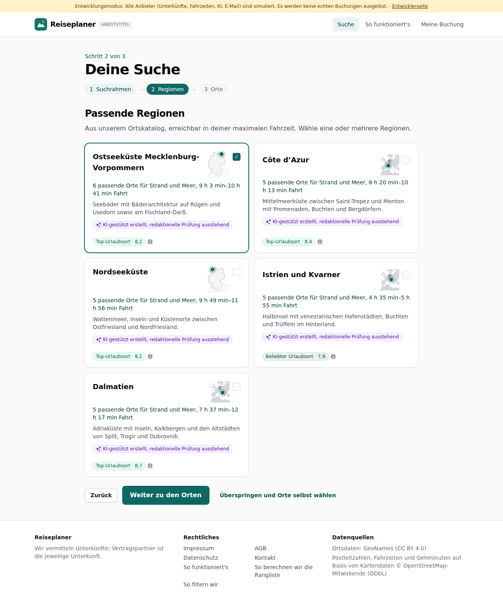
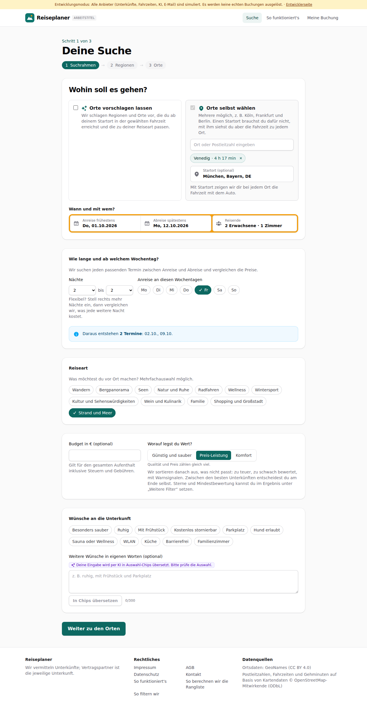
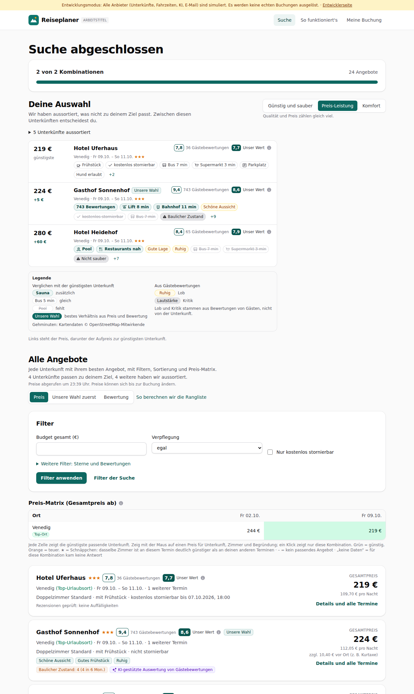
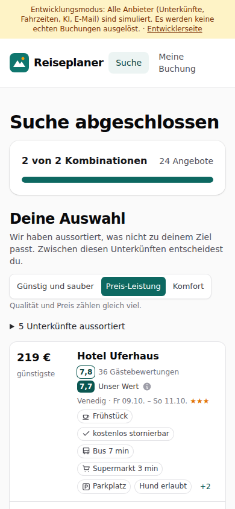

# Dogfood-Walkthrough 2026-09-29T21-39-29-P-europa

- Modus: P – Pfad (Nutzerablauf mit Eingaben)
- Flows: europa
- Basis-URL: http://localhost:38419 (echter lokaler Stack, Anbieter im Fake-Modus)
- Stand: 5292d15, gestartet 2026-09-29T21:39:29.993Z
- Ergebnis: ✅ bestanden (7/7 Prüfungen erfüllt)

## Flow „europa“

Europa-Erweiterung: Regionen in ganz Europa (Strand ab München), Mini-Karte mit Europa-Ausschnitt, Venedig als eigener Ort bis zur fertigen Suche.

### 01 Startort München, Fahrzeit egal, Strand und Meer

- URL: `/suche`
- Screenshot: 
- Notiz: Regionen: Ostseeküste Mecklenburg-Vorpommern, Côte d’Azur, Nordseeküste, Istrien und Kvarner, Dalmatien; 3 Mini-Karten mit Europa-Ausschnitt.
- Prüfungen:
  - [x] enthält „Passende Regionen“
  - [x] enthält „Strand und Meer“
  - [x] Element `[data-testid="region-card"] svg[data-frame="europe"]` vorhanden (3)
- Überschriften: „Deine Suche“, „Passende Regionen“
- KI-Kennzeichnungen (`data-ai-provenance`): „KI-gestützt erstellt, redaktionelle Prüfung ausstehend [ai_assisted]“, „KI-gestützt erstellt, redaktionelle Prüfung ausstehend [ai_assisted]“, „KI-gestützt erstellt, redaktionelle Prüfung ausstehend [ai_assisted]“, „KI-gestützt erstellt, redaktionelle Prüfung ausstehend [ai_assisted]“, „KI-gestützt erstellt, redaktionelle Prüfung ausstehend [ai_assisted]“
- Konsolenfehler: keine
- Fehlgeschlagene Anfragen: keine

<details><summary>Sichtbarer Text</summary>

```text
Entwicklungsmodus: Alle Anbieter (Unterkünfte, Fahrzeiten, KI, E-Mail) sind simuliert. Es werden keine echten Buchungen ausgelöst. · Entwicklerseite
Reiseplaner
ARBEITSTITEL
Suche
So funktioniert's
Meine Buchung

Schritt 2 von 3

Deine Suche
1
Suchrahmen
→
2
Regionen
→
3
Orte
Passende Regionen

Aus unserem Ortskatalog, erreichbar in deiner maximalen Fahrzeit. Wähle eine oder mehrere Regionen.

Ostseeküste Mecklenburg-Vorpommern
✓

6 passende Orte für Strand und Meer, 9 h 3 min–10 h 41 min Fahrt

Seebäder mit Bäderarchitektur auf Rügen und Usedom sowie am Fischland-Darß.

KI-gestützt erstellt, redaktionelle Prüfung ausstehend
Top-Urlaubsort · 8,2
Côte d’Azur

5 passende Orte für Strand und Meer, 8 h 20 min–10 h 13 min Fahrt

Mittelmeerküste zwischen Saint-Tropez und Menton mit Promenaden, Buchten und Bergdörfern.

KI-gestützt erstellt, redaktionelle Prüfung ausstehend
Top-Urlaubsort · 8,4
Nordseeküste

5 passende Orte für Strand und Meer, 9 h 49 min–11 h 56 min Fahrt

Wattenmeer, Inseln und Küstenorte zwischen Ostfriesland und Nordfriesland.

KI-gestützt erstellt, redaktionelle Prüfung ausstehend
Top-Urlaubsort · 8,1
Istrien und Kvarner

5 passende Orte für Strand und Meer, 4 h 35 min–5 h 55 min Fahrt

Halbinsel mit venezianischen Hafenstädten, Buchten und Trüffeln im Hinterland.

KI-gestützt erstellt, redaktionelle Prüfung ausstehend
Beliebter Urlaubsort · 7,9
Dalmatien

5 passende Orte für Strand und Meer, 7 h 37 min–12 h 17 min Fahrt

Adriaküste mit Inseln, Kalkbergen und den Altstädten von Split, Trogir und Dubrovnik.

KI-gestützt erstellt, redaktionelle Prüfung ausstehend
Top-Urlaubsort · 8,7
Zurück
Weiter zu den Orten
Überspringen und Orte selbst wählen

Reiseplaner

Wir vermitteln Unterkünfte; Vertragspartner ist die jeweilige Unterkunft.

Rechtliches

Impressum
A
… (236 weitere Zeichen)
```

</details>

### 02 Zurück: Venedig als eigenen Ort wählen, nur diesen Ort suchen

- URL: `/suche`
- Screenshot: 
- Prüfungen:
  - [x] enthält „Venedig“
- Überschriften: „Deine Suche“, „Wohin soll es gehen?“
- KI-Kennzeichnungen (`data-ai-provenance`): „Deine Eingabe wird per KI in Auswahl-Chips übersetzt. Bitte prüfe die Auswahl. [ai_assisted]“
- Konsolenfehler: keine
- Fehlgeschlagene Anfragen: keine

<details><summary>Sichtbarer Text</summary>

```text
Entwicklungsmodus: Alle Anbieter (Unterkünfte, Fahrzeiten, KI, E-Mail) sind simuliert. Es werden keine echten Buchungen ausgelöst. · Entwicklerseite
Reiseplaner
ARBEITSTITEL
Suche
So funktioniert's
Meine Buchung

Schritt 1 von 3

Deine Suche
1
Suchrahmen
→
2
Regionen
→
3
Orte
Wohin soll es gehen?
Orte vorschlagen lassen
Wir schlagen Regionen und Orte vor, die du ab deinem Startort in der gewählten Fahrzeit erreichst und die zu deiner Reiseart passen.
Orte selbst wählen
Mehrere möglich, z. B. Köln, Frankfurt und Berlin. Einen Startort brauchst du dafür nicht, mit ihm siehst du aber die Fahrzeit zu jedem Ort.
Venedig
· 4 h 17 min
Startort (optional)

Mit Startort zeigen wir dir bei jedem Ort die Fahrzeit mit dem Auto.

Wann und mit wem?

Anreise frühestens
Do, 01.10.2026
Abreise spätestens
Mo, 12.10.2026
Reisende
2 Erwachsene · 1 Zimmer
Wie lange und ab welchem Wochentag?

Wir suchen jeden passenden Termin zwischen Anreise und Abreise und vergleichen die Preise.

Nächte
1
2
3
4
5
6
7
8
9
10
11
12
13
14
bis
2
3
4
5
6
7
8
9
10
11
12
13
14

Flexibel? Stell rechts mehr Nächte ein, dann vergleichen wir, was jede weitere Nacht kostet.

Anreise an diesen Wochentagen
Mo
Di
Mi
Do
Fr
Sa
So
Daraus entstehen 2 Termine: 02.10., 09.10.
Reiseart

Was möchtest du vor Ort machen? Mehrfachauswahl möglich.

Wandern
Bergpanorama
Seen
Natur und Ruhe
Radfahren
Wellness
Wintersport
Kultur und Sehenswürdigkeiten
Wein und Kulinarik
Familie
Shopping und Großstadt
Strand und Meer
Budget in € (optional)

Gilt für den gesamten Aufenthalt inklusive Steuern und Gebühren.

Worauf legst du Wert?

Günstig und sauber
Preis-Leistung
Komfort

Qualität und Preis zählen gleich viel.

Wir sortieren danach aus, was nicht passt: zu teuer, zu schwach bewertet, mit Warnsignalen. Zwischen den besten Unterkünften ent
… (797 weitere Zeichen)
```

</details>

### 03 Suche über Venedig bis zum Ergebnis

- URL: `/suche/0518f784-fc88-48ea-be6f-d4134eb51f42#t=jkS-zsHx1K44GW7aI125DUuTEuAKmgXLZo-0qzr0TQA`
- Screenshot: 
- Prüfungen:
  - [x] enthält „Venedig“
  - [x] enthält „Suche abgeschlossen“
- Überschriften: „Suche abgeschlossen“, „Deine Auswahl“, „Alle Angebote“
- KI-Kennzeichnungen (`data-ai-provenance`): „KI-gestützte Auswertung von Gästebewertungen [ai_assisted]“, „KI-gestützte Auswertung von Gästebewertungen [ai_assisted]“
- Konsolenfehler: keine
- Fehlgeschlagene Anfragen: keine

<details><summary>Sichtbarer Text</summary>

```text
Entwicklungsmodus: Alle Anbieter (Unterkünfte, Fahrzeiten, KI, E-Mail) sind simuliert. Es werden keine echten Buchungen ausgelöst. · Entwicklerseite
Reiseplaner
ARBEITSTITEL
Suche
So funktioniert's
Meine Buchung
Suche abgeschlossen

2 von 2 Kombinationen

24 Angebote

Deine Auswahl

Wir haben aussortiert, was nicht zu deinem Ziel passt. Zwischen diesen Unterkünften entscheidest du.

Günstig und sauber
Preis-Leistung
Komfort

Qualität und Preis zählen gleich viel.

5 Unterkünfte aussortiert
219 €
günstigste
Hotel Uferhaus
7,8
36 Gästebewertungen
7,7
Unser Wert

Venedig · Fr 09.10. – So 11.10.★★★

Frühstück
kostenlos stornierbar
Bus 7 min
Supermarkt 3 min
Parkplatz
Hund erlaubt
+2
224 €
+5 €
Gasthof Sonnenhof
Unsere Wahl
9,4
743 Gästebewertungen
8,6
Unser Wert

Venedig · Fr 09.10. – So 11.10.★★★

743 Bewertungen
Lift 8 min
Bahnhof 11 min
Schöne Aussicht
kostenlos stornierbar
Bus 7 min
Baulicher Zustand
+9
280 €
+60 €
Hotel Heidehof
8,4
65 Gästebewertungen
7,9
Unser Wert

Venedig · Fr 09.10. – So 11.10.★★★

Pool
Restaurants nah
Gute Lage
Ruhig
Bus 7 min
Supermarkt 3 min
Nicht sauber
+7

Legende

Verglichen mit der günstigsten Unterkunft

Sauna
zusätzlich
Bus 5 min
gleich
Pool
fehlt
Unsere Wahl
bestes Verhältnis aus Preis und Bewertung

Aus Gästebewertungen

Ruhig
Lob
Lautstärke
Kritik

Lob und Kritik stammen aus Bewertungen von Gästen, nicht von der Unterkunft.

Gehminuten: Kartendaten © OpenStreetMap-Mitwirkende

Links steht der Preis, darunter der Aufpreis zur günstigsten Unterkunft.

Alle Angebote

Jede Unterkunft mit ihrem besten Angebot, mit Filtern, Sortierung und Preis-Matrix.

4 Unterkünfte passen zu deinem Ziel, 4 weitere haben wir aussortiert.

Preise abgerufen um 23:39 Uhr. Preise können sich bis zur Buchung ändern.

Sortierung
Preis
Unsere Wahl zuerst
Bewertung
… (2507 weitere Zeichen)
```

</details>

### 04 Handy (390 px)

- URL: `/suche/0518f784-fc88-48ea-be6f-d4134eb51f42#t=jkS-zsHx1K44GW7aI125DUuTEuAKmgXLZo-0qzr0TQA`
- Screenshot: 
- Prüfungen:
  - [x] enthält „Venedig“
- Überschriften: „Suche abgeschlossen“, „Deine Auswahl“, „Alle Angebote“
- KI-Kennzeichnungen (`data-ai-provenance`): „KI-gestützte Auswertung von Gästebewertungen [ai_assisted]“, „KI-gestützte Auswertung von Gästebewertungen [ai_assisted]“
- Konsolenfehler: keine
- Fehlgeschlagene Anfragen: keine

<details><summary>Sichtbarer Text</summary>

```text
Entwicklungsmodus: Alle Anbieter (Unterkünfte, Fahrzeiten, KI, E-Mail) sind simuliert. Es werden keine echten Buchungen ausgelöst. · Entwicklerseite
Reiseplaner
Suche
Meine Buchung
Suche abgeschlossen

2 von 2 Kombinationen

24 Angebote

Deine Auswahl

Wir haben aussortiert, was nicht zu deinem Ziel passt. Zwischen diesen Unterkünften entscheidest du.

Günstig und sauber
Preis-Leistung
Komfort

Qualität und Preis zählen gleich viel.

5 Unterkünfte aussortiert
219 €
günstigste
Hotel Uferhaus
7,8
36 Gästebewertungen
7,7
Unser Wert

Venedig · Fr 09.10. – So 11.10.★★★

Frühstück
kostenlos stornierbar
Bus 7 min
Supermarkt 3 min
Parkplatz
Hund erlaubt
+2
224 €
+5 €
Gasthof Sonnenhof
Unsere Wahl
9,4
743 Gästebewertungen
8,6
Unser Wert

Venedig · Fr 09.10. – So 11.10.★★★

743 Bewertungen
Lift 8 min
Bahnhof 11 min
Schöne Aussicht
kostenlos stornierbar
Bus 7 min
Baulicher Zustand
+9
280 €
+60 €
Hotel Heidehof
8,4
65 Gästebewertungen
7,9
Unser Wert

Venedig · Fr 09.10. – So 11.10.★★★

Pool
Restaurants nah
Gute Lage
Ruhig
Bus 7 min
Supermarkt 3 min
Nicht sauber
+7

Legende

Verglichen mit der günstigsten Unterkunft

Sauna
zusätzlich
Bus 5 min
gleich
Pool
fehlt
Unsere Wahl
bestes Verhältnis aus Preis und Bewertung

Aus Gästebewertungen

Ruhig
Lob
Lautstärke
Kritik

Lob und Kritik stammen aus Bewertungen von Gästen, nicht von der Unterkunft.

Gehminuten: Kartendaten © OpenStreetMap-Mitwirkende

Links steht der Preis, darunter der Aufpreis zur günstigsten Unterkunft.

Alle Angebote

Jede Unterkunft mit ihrem besten Angebot, mit Filtern, Sortierung und Preis-Matrix.

4 Unterkünfte passen zu deinem Ziel, 4 weitere haben wir aussortiert.

Preise abgerufen um 23:39 Uhr. Preise können sich bis zur Buchung ändern.

Sortierung
Preis
Unsere Wahl zuerst
Bewertung
So berechnen wir die Rangliste
… (2476 weitere Zeichen)
```

</details>

