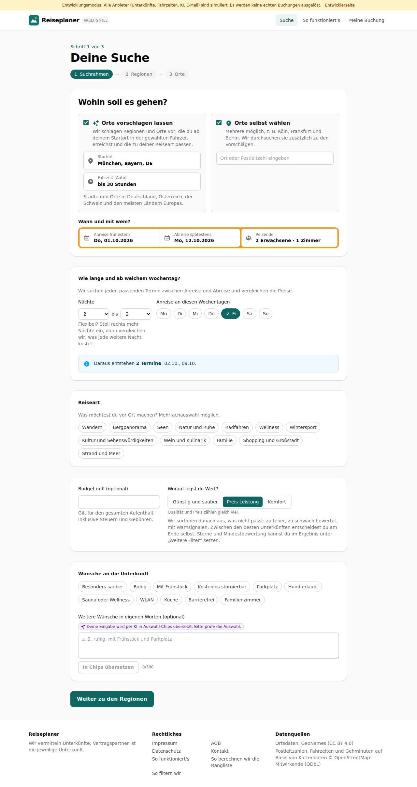
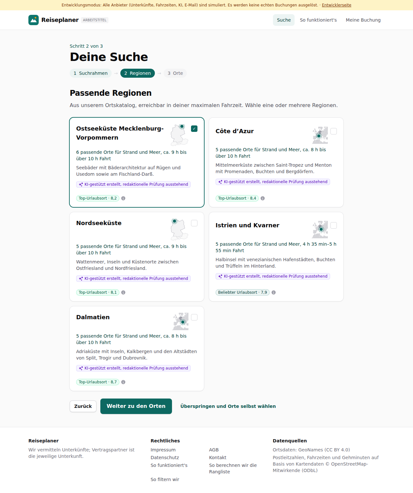
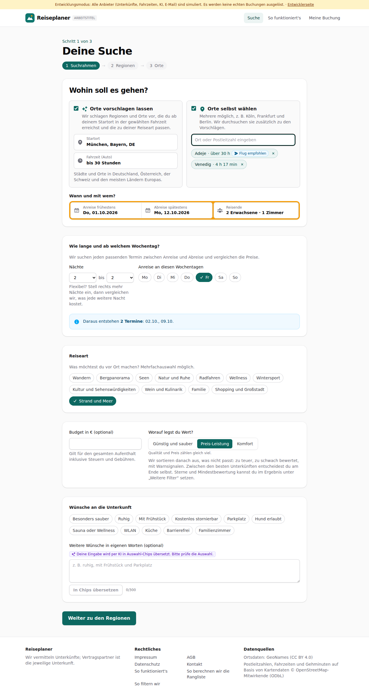
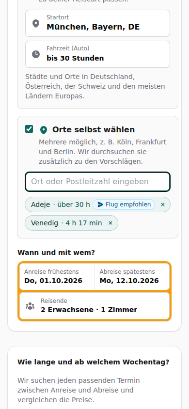

# Dogfood-Walkthrough 2026-09-29T21-54-04-P-fahrzeit

- Modus: P – Pfad (Nutzerablauf mit Eingaben)
- Flows: fahrzeit
- Basis-URL: http://localhost:39993 (echter lokaler Stack, Anbieter im Fake-Modus)
- Stand: 7a8d3c0, gestartet 2026-09-29T21:54:04.670Z
- Ergebnis: ✅ bestanden (6/6 Prüfungen erfüllt)

## Flow „fahrzeit“

Fahrzeiten in groben Blöcken: genau unter 7 h, dann „ca. 8 h“, „über 10 h“, „über 20 h“; ab 30 h Flugzeug-Hinweis (nur Anzeige); Auswahl bis 30 Stunden.

### 01 Fahrzeit-Auswahl bis 30 Stunden

- URL: `/suche`
- Screenshot: 
- Notiz: Optionen: egal (ganz Europa), bis 1 Stunde, bis 1 h 30 min, bis 2 Stunden, bis 2 h 30 min, bis 3 Stunden, bis 4 Stunden, bis 5 Stunden, bis 6 Stunden, bis 7 Stunden, bis 10 Stunden, bis 20 Stunden, bis 30 Stunden
- Prüfungen:
  - [x] enthält „Fahrzeit (Auto)“
- Überschriften: „Deine Suche“, „Wohin soll es gehen?“
- KI-Kennzeichnungen (`data-ai-provenance`): „Deine Eingabe wird per KI in Auswahl-Chips übersetzt. Bitte prüfe die Auswahl. [ai_assisted]“
- Konsolenfehler: keine
- Fehlgeschlagene Anfragen: keine

<details><summary>Sichtbarer Text</summary>

```text
Entwicklungsmodus: Alle Anbieter (Unterkünfte, Fahrzeiten, KI, E-Mail) sind simuliert. Es werden keine echten Buchungen ausgelöst. · Entwicklerseite
Reiseplaner
ARBEITSTITEL
Suche
So funktioniert's
Meine Buchung

Schritt 1 von 3

Deine Suche
1
Suchrahmen
→
2
Regionen
→
3
Orte
Wohin soll es gehen?
Orte vorschlagen lassen
Wir schlagen Regionen und Orte vor, die du ab deinem Startort in der gewählten Fahrzeit erreichst und die zu deiner Reiseart passen.
Startort
Fahrzeit (Auto)
egal (ganz Europa)
bis 1 Stunde
bis 1 h 30 min
bis 2 Stunden
bis 2 h 30 min
bis 3 Stunden
bis 4 Stunden
bis 5 Stunden
bis 6 Stunden
bis 7 Stunden
bis 10 Stunden
bis 20 Stunden
bis 30 Stunden

Städte und Orte in Deutschland, Österreich, der Schweiz und den meisten Ländern Europas.

Orte selbst wählen
Mehrere möglich, z. B. Köln, Frankfurt und Berlin. Wir durchsuchen sie zusätzlich zu den Vorschlägen.

Wann und mit wem?

Anreise frühestens
Do, 01.10.2026
Abreise spätestens
Mo, 12.10.2026
Reisende
2 Erwachsene · 1 Zimmer
Wie lange und ab welchem Wochentag?

Wir suchen jeden passenden Termin zwischen Anreise und Abreise und vergleichen die Preise.

Nächte
1
2
3
4
5
6
7
8
9
10
11
12
13
14
bis
2
3
4
5
6
7
8
9
10
11
12
13
14

Flexibel? Stell rechts mehr Nächte ein, dann vergleichen wir, was jede weitere Nacht kostet.

Anreise an diesen Wochentagen
Mo
Di
Mi
Do
Fr
Sa
So
Daraus entstehen 2 Termine: 02.10., 09.10.
Reiseart

Was möchtest du vor Ort machen? Mehrfachauswahl möglich.

Wandern
Bergpanorama
Seen
Natur und Ruhe
Radfahren
Wellness
Wintersport
Kultur und Sehenswürdigkeiten
Wein und Kulinarik
Familie
Shopping und Großstadt
Strand und Meer
Budget in € (optional)

Gilt für den gesamten Aufenthalt inklusive Steuern und Gebühren.

Worauf legst du Wert?

Günstig und sauber
Preis-Leistung
Komfort

Qualität un
… (957 weitere Zeichen)
```

</details>

### 02 Strand und Meer bis 30 h: Blöcke statt Minuten bei fernen Regionen

- URL: `/suche`
- Screenshot: 
- Notiz: 6 passende Orte für Strand und Meer, ca. 9 h bis über 10 h Fahrt | 5 passende Orte für Strand und Meer, ca. 8 h bis über 10 h Fahrt | 5 passende Orte für Strand und Meer, ca. 9 h bis über 10 h Fahrt | 5 passende Orte für Strand und Meer, 4 h 35 min–5 h 55 min Fahrt | 5 passende Orte für Strand und Meer, ca. 8 h bis über 10 h Fahrt
- Prüfungen:
  - [x] enthält „über 10 h“
- Überschriften: „Deine Suche“, „Passende Regionen“
- KI-Kennzeichnungen (`data-ai-provenance`): „KI-gestützt erstellt, redaktionelle Prüfung ausstehend [ai_assisted]“, „KI-gestützt erstellt, redaktionelle Prüfung ausstehend [ai_assisted]“, „KI-gestützt erstellt, redaktionelle Prüfung ausstehend [ai_assisted]“, „KI-gestützt erstellt, redaktionelle Prüfung ausstehend [ai_assisted]“, „KI-gestützt erstellt, redaktionelle Prüfung ausstehend [ai_assisted]“
- Konsolenfehler: keine
- Fehlgeschlagene Anfragen: keine

<details><summary>Sichtbarer Text</summary>

```text
Entwicklungsmodus: Alle Anbieter (Unterkünfte, Fahrzeiten, KI, E-Mail) sind simuliert. Es werden keine echten Buchungen ausgelöst. · Entwicklerseite
Reiseplaner
ARBEITSTITEL
Suche
So funktioniert's
Meine Buchung

Schritt 2 von 3

Deine Suche
1
Suchrahmen
→
2
Regionen
→
3
Orte
Passende Regionen

Aus unserem Ortskatalog, erreichbar in deiner maximalen Fahrzeit. Wähle eine oder mehrere Regionen.

Ostseeküste Mecklenburg-Vorpommern
✓

6 passende Orte für Strand und Meer, ca. 9 h bis über 10 h Fahrt

Seebäder mit Bäderarchitektur auf Rügen und Usedom sowie am Fischland-Darß.

KI-gestützt erstellt, redaktionelle Prüfung ausstehend
Top-Urlaubsort · 8,2
Côte d’Azur

5 passende Orte für Strand und Meer, ca. 8 h bis über 10 h Fahrt

Mittelmeerküste zwischen Saint-Tropez und Menton mit Promenaden, Buchten und Bergdörfern.

KI-gestützt erstellt, redaktionelle Prüfung ausstehend
Top-Urlaubsort · 8,4
Nordseeküste

5 passende Orte für Strand und Meer, ca. 9 h bis über 10 h Fahrt

Wattenmeer, Inseln und Küstenorte zwischen Ostfriesland und Nordfriesland.

KI-gestützt erstellt, redaktionelle Prüfung ausstehend
Top-Urlaubsort · 8,1
Istrien und Kvarner

5 passende Orte für Strand und Meer, 4 h 35 min–5 h 55 min Fahrt

Halbinsel mit venezianischen Hafenstädten, Buchten und Trüffeln im Hinterland.

KI-gestützt erstellt, redaktionelle Prüfung ausstehend
Beliebter Urlaubsort · 7,9
Dalmatien

5 passende Orte für Strand und Meer, ca. 8 h bis über 10 h Fahrt

Adriaküste mit Inseln, Kalkbergen und den Altstädten von Split, Trogir und Dubrovnik.

KI-gestützt erstellt, redaktionelle Prüfung ausstehend
Top-Urlaubsort · 8,7
Zurück
Weiter zu den Orten
Überspringen und Orte selbst wählen

Reiseplaner

Wir vermitteln Unterkünfte; Vertragspartner ist die jeweilige Unterkunft.

Rechtliches

Impressum
AGB

… (233 weitere Zeichen)
```

</details>

### 03 Eigener Ort Adeje (Teneriffa): über 30 h mit Flugzeug-Hinweis

- URL: `/suche`
- Screenshot: 
- Notiz: Chips: Adeje
· über 30 h
Flug empfohlen | Venedig
· 4 h 17 min
- Prüfungen:
  - [x] enthält „über 30 h“
  - [x] enthält „Flug empfohlen“
  - [x] Element `[data-testid="flight-badge"]` vorhanden (1)
- Überschriften: „Deine Suche“, „Wohin soll es gehen?“
- KI-Kennzeichnungen (`data-ai-provenance`): „Deine Eingabe wird per KI in Auswahl-Chips übersetzt. Bitte prüfe die Auswahl. [ai_assisted]“
- Konsolenfehler: keine
- Fehlgeschlagene Anfragen: keine

<details><summary>Sichtbarer Text</summary>

```text
Entwicklungsmodus: Alle Anbieter (Unterkünfte, Fahrzeiten, KI, E-Mail) sind simuliert. Es werden keine echten Buchungen ausgelöst. · Entwicklerseite
Reiseplaner
ARBEITSTITEL
Suche
So funktioniert's
Meine Buchung

Schritt 1 von 3

Deine Suche
1
Suchrahmen
→
2
Regionen
→
3
Orte
Wohin soll es gehen?
Orte vorschlagen lassen
Wir schlagen Regionen und Orte vor, die du ab deinem Startort in der gewählten Fahrzeit erreichst und die zu deiner Reiseart passen.
Startort
Fahrzeit (Auto)
egal (ganz Europa)
bis 1 Stunde
bis 1 h 30 min
bis 2 Stunden
bis 2 h 30 min
bis 3 Stunden
bis 4 Stunden
bis 5 Stunden
bis 6 Stunden
bis 7 Stunden
bis 10 Stunden
bis 20 Stunden
bis 30 Stunden

Städte und Orte in Deutschland, Österreich, der Schweiz und den meisten Ländern Europas.

Orte selbst wählen
Mehrere möglich, z. B. Köln, Frankfurt und Berlin. Wir durchsuchen sie zusätzlich zu den Vorschlägen.
Adeje
· über 30 h
Flug empfohlen
Venedig
· 4 h 17 min

Wann und mit wem?

Anreise frühestens
Do, 01.10.2026
Abreise spätestens
Mo, 12.10.2026
Reisende
2 Erwachsene · 1 Zimmer
Wie lange und ab welchem Wochentag?

Wir suchen jeden passenden Termin zwischen Anreise und Abreise und vergleichen die Preise.

Nächte
1
2
3
4
5
6
7
8
9
10
11
12
13
14
bis
2
3
4
5
6
7
8
9
10
11
12
13
14

Flexibel? Stell rechts mehr Nächte ein, dann vergleichen wir, was jede weitere Nacht kostet.

Anreise an diesen Wochentagen
Mo
Di
Mi
Do
Fr
Sa
So
Daraus entstehen 2 Termine: 02.10., 09.10.
Reiseart

Was möchtest du vor Ort machen? Mehrfachauswahl möglich.

Wandern
Bergpanorama
Seen
Natur und Ruhe
Radfahren
Wellness
Wintersport
Kultur und Sehenswürdigkeiten
Wein und Kulinarik
Familie
Shopping und Großstadt
Strand und Meer
Budget in € (optional)

Gilt für den gesamten Aufenthalt inklusive Steuern und Gebühren.

Worauf legst du Wert?


… (1011 weitere Zeichen)
```

</details>

### 04 Handy (390 px)

- URL: `/suche`
- Screenshot: 
- Prüfungen:
  - [x] enthält „Flug empfohlen“
- Überschriften: „Deine Suche“, „Wohin soll es gehen?“
- KI-Kennzeichnungen (`data-ai-provenance`): „Deine Eingabe wird per KI in Auswahl-Chips übersetzt. Bitte prüfe die Auswahl. [ai_assisted]“
- Konsolenfehler: keine
- Fehlgeschlagene Anfragen: keine

<details><summary>Sichtbarer Text</summary>

```text
Entwicklungsmodus: Alle Anbieter (Unterkünfte, Fahrzeiten, KI, E-Mail) sind simuliert. Es werden keine echten Buchungen ausgelöst. · Entwicklerseite
Reiseplaner
Suche
Meine Buchung

Schritt 1 von 3

Deine Suche
1
Suchrahmen
→
2
Regionen
→
3
Orte
Wohin soll es gehen?
Orte vorschlagen lassen
Wir schlagen Regionen und Orte vor, die du ab deinem Startort in der gewählten Fahrzeit erreichst und die zu deiner Reiseart passen.
Startort
Fahrzeit (Auto)
egal (ganz Europa)
bis 1 Stunde
bis 1 h 30 min
bis 2 Stunden
bis 2 h 30 min
bis 3 Stunden
bis 4 Stunden
bis 5 Stunden
bis 6 Stunden
bis 7 Stunden
bis 10 Stunden
bis 20 Stunden
bis 30 Stunden

Städte und Orte in Deutschland, Österreich, der Schweiz und den meisten Ländern Europas.

Orte selbst wählen
Mehrere möglich, z. B. Köln, Frankfurt und Berlin. Wir durchsuchen sie zusätzlich zu den Vorschlägen.
Adeje
· über 30 h
Flug empfohlen
Venedig
· 4 h 17 min

Wann und mit wem?

Anreise frühestens
Do, 01.10.2026
Abreise spätestens
Mo, 12.10.2026
Reisende
2 Erwachsene · 1 Zimmer
Wie lange und ab welchem Wochentag?

Wir suchen jeden passenden Termin zwischen Anreise und Abreise und vergleichen die Preise.

Nächte
1
2
3
4
5
6
7
8
9
10
11
12
13
14
bis
2
3
4
5
6
7
8
9
10
11
12
13
14

Flexibel? Stell rechts mehr Nächte ein, dann vergleichen wir, was jede weitere Nacht kostet.

Anreise an diesen Wochentagen
Mo
Di
Mi
Do
Fr
Sa
So
Daraus entstehen 2 Termine: 02.10., 09.10.
Reiseart

Was möchtest du vor Ort machen? Mehrfachauswahl möglich.

Wandern
Bergpanorama
Seen
Natur und Ruhe
Radfahren
Wellness
Wintersport
Kultur und Sehenswürdigkeiten
Wein und Kulinarik
Familie
Shopping und Großstadt
Strand und Meer
Budget in € (optional)

Gilt für den gesamten Aufenthalt inklusive Steuern und Gebühren.

Worauf legst du Wert?

Günstig und sauber
Preis-Leistu
… (980 weitere Zeichen)
```

</details>

