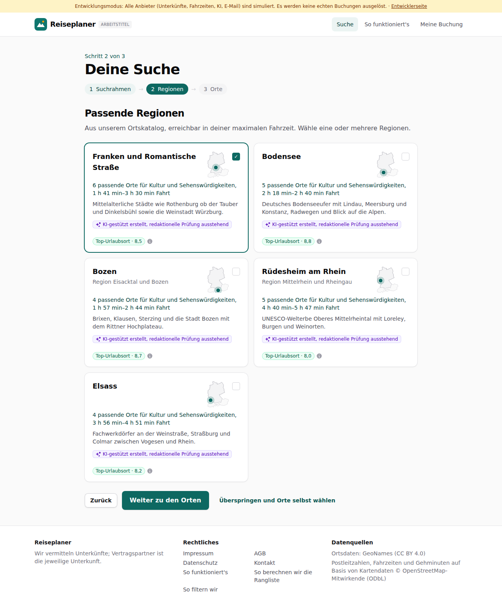
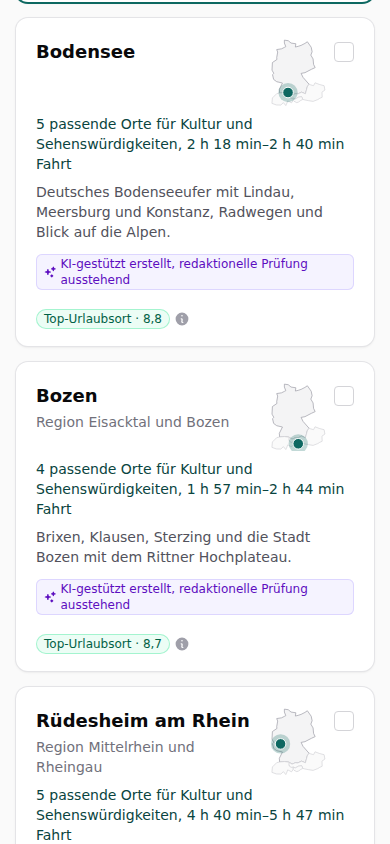

# Dogfood-Walkthrough 2026-09-29T22-02-53-P-regionsname

- Modus: P – Pfad (Nutzerablauf mit Eingaben)
- Flows: regionsname
- Basis-URL: http://localhost:37005 (echter lokaler Stack, Anbieter im Fake-Modus)
- Stand: 68e2be2, gestartet 2026-09-29T22:02:53.569Z
- Ergebnis: ✅ bestanden (5/5 Prüfungen erfüllt)

## Flow „regionsname“

Regionsname: bei nur einem Highlight-Ort steht der Ort als Überschrift (darunter „Region …“), bei mehreren Highlights der Regionsname (Ben, 29.09.).

### 01 Kultur ab München bis 7 h: Bozen statt „Eisacktal und Bozen“, Elsass bleibt Elsass

- URL: `/suche`
- Screenshot: 
- Notiz: Überschriften: Franken und Romantische Straße, Bodensee, Bozen, Rüdesheim am Rhein, Elsass; Unterzeilen: Region Eisacktal und Bozen, Region Mittelrhein und Rheingau
- Prüfungen:
  - [x] enthält „Bozen“
  - [x] enthält „Region Eisacktal und Bozen“
  - [x] enthält „Elsass“
  - [x] Element `[data-testid="region-subtitle"]` vorhanden (2)
- Überschriften: „Deine Suche“, „Passende Regionen“
- KI-Kennzeichnungen (`data-ai-provenance`): „KI-gestützt erstellt, redaktionelle Prüfung ausstehend [ai_assisted]“, „KI-gestützt erstellt, redaktionelle Prüfung ausstehend [ai_assisted]“, „KI-gestützt erstellt, redaktionelle Prüfung ausstehend [ai_assisted]“, „KI-gestützt erstellt, redaktionelle Prüfung ausstehend [ai_assisted]“, „KI-gestützt erstellt, redaktionelle Prüfung ausstehend [ai_assisted]“
- Konsolenfehler: keine
- Fehlgeschlagene Anfragen: keine

<details><summary>Sichtbarer Text</summary>

```text
Entwicklungsmodus: Alle Anbieter (Unterkünfte, Fahrzeiten, KI, E-Mail) sind simuliert. Es werden keine echten Buchungen ausgelöst. · Entwicklerseite
Reiseplaner
ARBEITSTITEL
Suche
So funktioniert's
Meine Buchung

Schritt 2 von 3

Deine Suche
1
Suchrahmen
→
2
Regionen
→
3
Orte
Passende Regionen

Aus unserem Ortskatalog, erreichbar in deiner maximalen Fahrzeit. Wähle eine oder mehrere Regionen.

Franken und Romantische Straße
✓

6 passende Orte für Kultur und Sehenswürdigkeiten, 1 h 41 min–3 h 30 min Fahrt

Mittelalterliche Städte wie Rothenburg ob der Tauber und Dinkelsbühl sowie die Weinstadt Würzburg.

KI-gestützt erstellt, redaktionelle Prüfung ausstehend
Top-Urlaubsort · 8,5
Bodensee

5 passende Orte für Kultur und Sehenswürdigkeiten, 2 h 18 min–2 h 40 min Fahrt

Deutsches Bodenseeufer mit Lindau, Meersburg und Konstanz, Radwegen und Blick auf die Alpen.

KI-gestützt erstellt, redaktionelle Prüfung ausstehend
Top-Urlaubsort · 8,8
Bozen

Region Eisacktal und Bozen

4 passende Orte für Kultur und Sehenswürdigkeiten, 1 h 57 min–2 h 44 min Fahrt

Brixen, Klausen, Sterzing und die Stadt Bozen mit dem Rittner Hochplateau.

KI-gestützt erstellt, redaktionelle Prüfung ausstehend
Top-Urlaubsort · 8,7
Rüdesheim am Rhein

Region Mittelrhein und Rheingau

5 passende Orte für Kultur und Sehenswürdigkeiten, 4 h 40 min–5 h 47 min Fahrt

UNESCO-Welterbe Oberes Mittelrheintal mit Loreley, Burgen und Weinorten.

KI-gestützt erstellt, redaktionelle Prüfung ausstehend
Top-Urlaubsort · 8,0
Elsass

4 passende Orte für Kultur und Sehenswürdigkeiten, 3 h 56 min–4 h 51 min Fahrt

Fachwerkdörfer an der Weinstraße, Straßburg und Colmar zwischen Vogesen und Rhein.

KI-gestützt erstellt, redaktionelle Prüfung ausstehend
Top-Urlaubsort · 8,2
Zurück
Weiter zu den Orten
Überspringen und Orte selbst
… (357 weitere Zeichen)
```

</details>

### 02 Handy (390 px)

- URL: `/suche`
- Screenshot: 
- Prüfungen:
  - [x] enthält „Region Eisacktal und Bozen“
- Überschriften: „Deine Suche“, „Passende Regionen“
- KI-Kennzeichnungen (`data-ai-provenance`): „KI-gestützt erstellt, redaktionelle Prüfung ausstehend [ai_assisted]“, „KI-gestützt erstellt, redaktionelle Prüfung ausstehend [ai_assisted]“, „KI-gestützt erstellt, redaktionelle Prüfung ausstehend [ai_assisted]“, „KI-gestützt erstellt, redaktionelle Prüfung ausstehend [ai_assisted]“, „KI-gestützt erstellt, redaktionelle Prüfung ausstehend [ai_assisted]“
- Konsolenfehler: keine
- Fehlgeschlagene Anfragen: keine

<details><summary>Sichtbarer Text</summary>

```text
Entwicklungsmodus: Alle Anbieter (Unterkünfte, Fahrzeiten, KI, E-Mail) sind simuliert. Es werden keine echten Buchungen ausgelöst. · Entwicklerseite
Reiseplaner
Suche
Meine Buchung

Schritt 2 von 3

Deine Suche
1
Suchrahmen
→
2
Regionen
→
3
Orte
Passende Regionen

Aus unserem Ortskatalog, erreichbar in deiner maximalen Fahrzeit. Wähle eine oder mehrere Regionen.

Franken und Romantische Straße
✓

6 passende Orte für Kultur und Sehenswürdigkeiten, 1 h 41 min–3 h 30 min Fahrt

Mittelalterliche Städte wie Rothenburg ob der Tauber und Dinkelsbühl sowie die Weinstadt Würzburg.

KI-gestützt erstellt, redaktionelle Prüfung ausstehend
Top-Urlaubsort · 8,5
Bodensee

5 passende Orte für Kultur und Sehenswürdigkeiten, 2 h 18 min–2 h 40 min Fahrt

Deutsches Bodenseeufer mit Lindau, Meersburg und Konstanz, Radwegen und Blick auf die Alpen.

KI-gestützt erstellt, redaktionelle Prüfung ausstehend
Top-Urlaubsort · 8,8
Bozen

Region Eisacktal und Bozen

4 passende Orte für Kultur und Sehenswürdigkeiten, 1 h 57 min–2 h 44 min Fahrt

Brixen, Klausen, Sterzing und die Stadt Bozen mit dem Rittner Hochplateau.

KI-gestützt erstellt, redaktionelle Prüfung ausstehend
Top-Urlaubsort · 8,7
Rüdesheim am Rhein

Region Mittelrhein und Rheingau

5 passende Orte für Kultur und Sehenswürdigkeiten, 4 h 40 min–5 h 47 min Fahrt

UNESCO-Welterbe Oberes Mittelrheintal mit Loreley, Burgen und Weinorten.

KI-gestützt erstellt, redaktionelle Prüfung ausstehend
Top-Urlaubsort · 8,0
Elsass

4 passende Orte für Kultur und Sehenswürdigkeiten, 3 h 56 min–4 h 51 min Fahrt

Fachwerkdörfer an der Weinstraße, Straßburg und Colmar zwischen Vogesen und Rhein.

KI-gestützt erstellt, redaktionelle Prüfung ausstehend
Top-Urlaubsort · 8,2
Zurück
Weiter zu den Orten
Überspringen und Orte selbst wählen

Reiseplaner

Wir vermi
… (326 weitere Zeichen)
```

</details>

