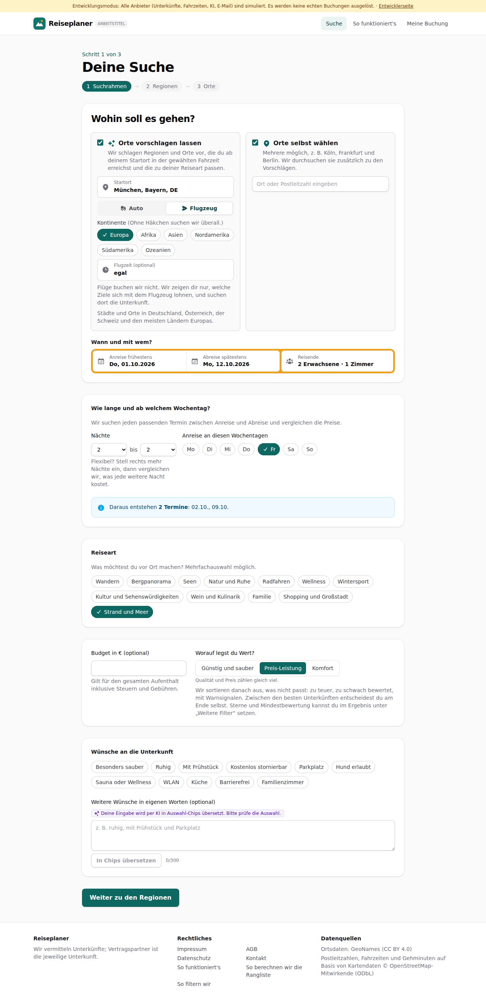
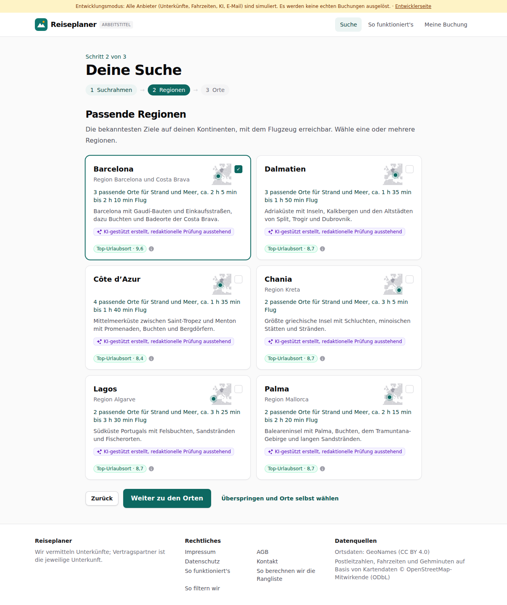
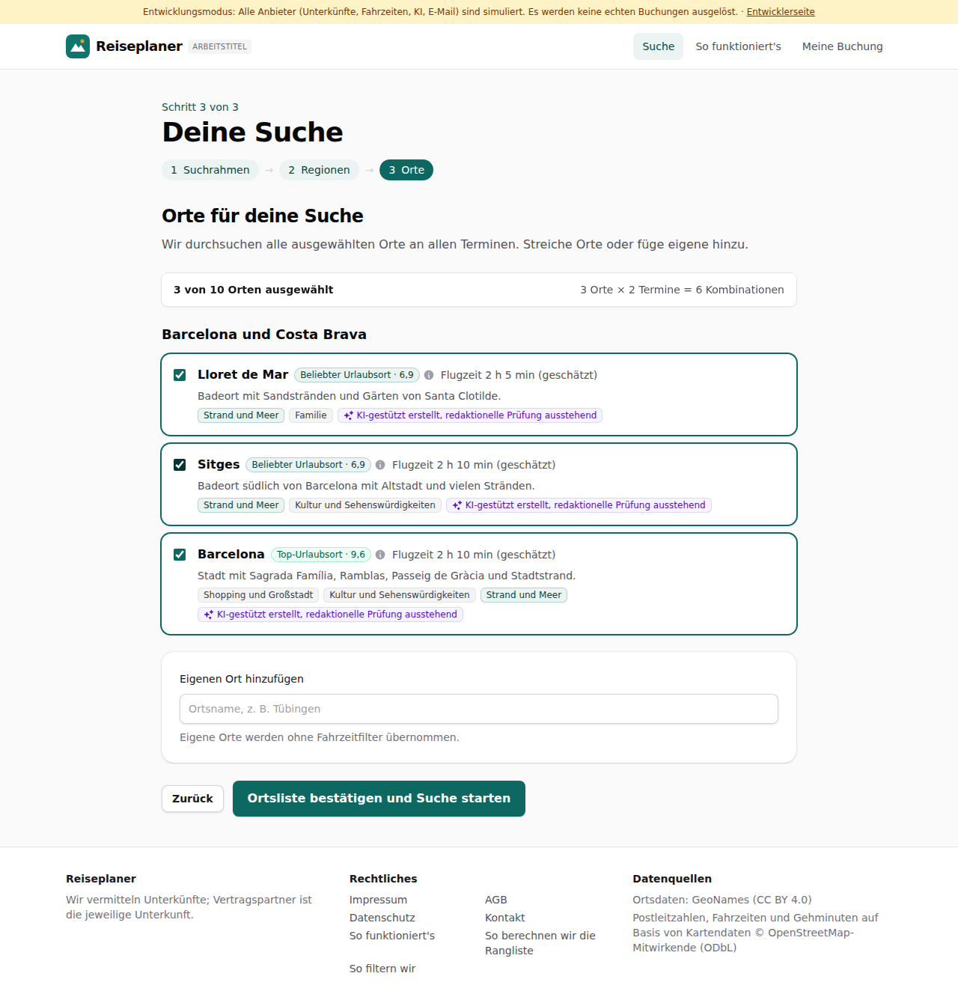

# Dogfood-Walkthrough 2026-09-30T08-38-10-P-flugzeug

- Modus: P – Pfad (Nutzerablauf mit Eingaben)
- Flows: flugzeug
- Basis-URL: http://localhost:34165 (echter lokaler Stack, Anbieter im Fake-Modus)
- Stand: 7b0ee0b, gestartet 2026-09-30T08:38:10.743Z
- Ergebnis: ✅ bestanden (11/11 Prüfungen erfüllt)

## Flow „flugzeug“

Vorschläge nach Entfernung: Wandern nah dran offen, Strand weit weg nur Hotspots; Schalter Auto/Flugzeug, Kontinente, Flugzeit optional.

### 01 Wandern bis 3 Stunden: viele Vorschläge

- URL: `/suche`
- Screenshot: 
- Notiz: 8 Regionen
- Prüfungen:
  - [x] enthält „Passende Regionen“
- Überschriften: „Deine Suche“, „Passende Regionen“
- KI-Kennzeichnungen (`data-ai-provenance`): „KI-gestützt erstellt, redaktionelle Prüfung ausstehend [ai_assisted]“, „KI-gestützt erstellt, redaktionelle Prüfung ausstehend [ai_assisted]“, „KI-gestützt erstellt, redaktionelle Prüfung ausstehend [ai_assisted]“, „KI-gestützt erstellt, redaktionelle Prüfung ausstehend [ai_assisted]“, „KI-gestützt erstellt, redaktionelle Prüfung ausstehend [ai_assisted]“, „KI-gestützt erstellt, redaktionelle Prüfung ausstehend [ai_assisted]“, „KI-gestützt erstellt, redaktionelle Prüfung ausstehend [ai_assisted]“, „KI-gestützt erstellt, redaktionelle Prüfung ausstehend [ai_assisted]“
- Konsolenfehler: keine
- Fehlgeschlagene Anfragen: keine

<details><summary>Sichtbarer Text</summary>

```text
Entwicklungsmodus: Alle Anbieter (Unterkünfte, Fahrzeiten, KI, E-Mail) sind simuliert. Es werden keine echten Buchungen ausgelöst. · Entwicklerseite
Reiseplaner
ARBEITSTITEL
Suche
So funktioniert's
Meine Buchung

Schritt 2 von 3

Deine Suche
1
Suchrahmen
→
2
Regionen
→
3
Orte
Passende Regionen

Aus unserem Ortskatalog, erreichbar in deiner maximalen Fahrzeit. Wähle eine oder mehrere Regionen.

Allgäu
✓

8 passende Orte für Wandern, 1 h 19 min–2 h 3 min Fahrt

Voralpenland mit Almen, Seen und den Allgäuer Alpen rund um Oberstdorf und Füssen.

KI-gestützt erstellt, redaktionelle Prüfung ausstehend
Top-Urlaubsort · 9,3
Bregenzerwald und Montafon

7 passende Orte für Wandern, 2 h 12 min–2 h 44 min Fahrt

Vorarlberg zwischen Bodensee, Bregenzerwald mit Holzbaukultur und dem Montafon.

KI-gestützt erstellt, redaktionelle Prüfung ausstehend
Top-Urlaubsort · 9,5
Bayerischer Wald

7 passende Orte für Wandern, 2 h 15 min–2 h 32 min Fahrt

Waldgebirge an der Grenze zu Tschechien mit dem Nationalpark Bayerischer Wald.

KI-gestützt erstellt, redaktionelle Prüfung ausstehend
Beliebter Urlaubsort · 7,0
Gröden und Seiser Alm

6 passende Orte für Wandern, 2 h 27 min–2 h 44 min Fahrt

Dolomitental mit Langkofel und Sella sowie die Seiser Alm am Schlern.

KI-gestützt erstellt, redaktionelle Prüfung ausstehend
Top-Urlaubsort · 9,1
Bruneck

Region Pustertal und Drei Zinnen

7 passende Orte für Wandern, 1 h 58 min–2 h 43 min Fahrt

Bruneck, das Hochpustertal und die Sextner Dolomiten mit den Drei Zinnen.

KI-gestützt erstellt, redaktionelle Prüfung ausstehend
Top-Urlaubsort · 8,0
Meran

Region Meraner Land

7 passende Orte für Wandern, 2 h 20 min–2 h 38 min Fahrt

Kurstadt Meran, Waalwege, Obstgärten und die Gärten von Schloss Trauttmansdorff.

KI-gestützt erstellt, redaktionelle Prüfung aus
… (924 weitere Zeichen)
```

</details>

### 02 Strand und Meer bis 20 Stunden: nur bekannte Hotspots

- URL: `/suche`
- Screenshot: 
- Notiz: Dalmatien | Barcelona | Rovinj | Monterosso al Mare | Côte d’Azur | Ostseeküste Mecklenburg-Vorpommern
- Prüfungen:
  - [x] enthält „Top-Urlaubsort“
- Überschriften: „Deine Suche“, „Passende Regionen“
- KI-Kennzeichnungen (`data-ai-provenance`): „KI-gestützt erstellt, redaktionelle Prüfung ausstehend [ai_assisted]“, „KI-gestützt erstellt, redaktionelle Prüfung ausstehend [ai_assisted]“, „KI-gestützt erstellt, redaktionelle Prüfung ausstehend [ai_assisted]“, „KI-gestützt erstellt, redaktionelle Prüfung ausstehend [ai_assisted]“, „KI-gestützt erstellt, redaktionelle Prüfung ausstehend [ai_assisted]“, „KI-gestützt erstellt, redaktionelle Prüfung ausstehend [ai_assisted]“
- Konsolenfehler: keine
- Fehlgeschlagene Anfragen: keine

<details><summary>Sichtbarer Text</summary>

```text
Entwicklungsmodus: Alle Anbieter (Unterkünfte, Fahrzeiten, KI, E-Mail) sind simuliert. Es werden keine echten Buchungen ausgelöst. · Entwicklerseite
Reiseplaner
ARBEITSTITEL
Suche
So funktioniert's
Meine Buchung

Schritt 2 von 3

Deine Suche
1
Suchrahmen
→
2
Regionen
→
3
Orte
Passende Regionen

Aus unserem Ortskatalog, erreichbar in deiner maximalen Fahrzeit. Wähle eine oder mehrere Regionen.

Dalmatien
✓

3 passende Orte für Strand und Meer, ca. 9 h bis über 10 h Fahrt

Adriaküste mit Inseln, Kalkbergen und den Altstädten von Split, Trogir und Dubrovnik.

KI-gestützt erstellt, redaktionelle Prüfung ausstehend
Top-Urlaubsort · 8,7
Barcelona

Region Barcelona und Costa Brava

3 passende Orte für Strand und Meer, über 10 h Fahrt

Barcelona mit Gaudí-Bauten und Einkaufsstraßen, dazu Buchten und Badeorte der Costa Brava.

KI-gestützt erstellt, redaktionelle Prüfung ausstehend
Top-Urlaubsort · 9,6
Rovinj

Region Istrien und Kvarner

5 passende Orte für Strand und Meer, 4 h 35 min–5 h 55 min Fahrt

Halbinsel mit venezianischen Hafenstädten, Buchten und Trüffeln im Hinterland.

KI-gestützt erstellt, redaktionelle Prüfung ausstehend
Top-Urlaubsort · 8,7
Monterosso al Mare

Region Cinque Terre und Ligurische Küste

2 passende Orte für Strand und Meer, 6 h 59 min bis ca. 7 h Fahrt

Fünf Dörfer an der Steilküste mit Weinterrassen, Küstenwanderweg und Badebuchten, dazu Portofino.

KI-gestützt erstellt, redaktionelle Prüfung ausstehend
Top-Urlaubsort · 8,7
Côte d’Azur

4 passende Orte für Strand und Meer, ca. 8 h bis über 10 h Fahrt

Mittelmeerküste zwischen Saint-Tropez und Menton mit Promenaden, Buchten und Bergdörfern.

KI-gestützt erstellt, redaktionelle Prüfung ausstehend
Top-Urlaubsort · 8,4
Ostseeküste Mecklenburg-Vorpommern

5 passende Orte für Strand und Meer, ca. 9 h bis ü
… (581 weitere Zeichen)
```

</details>

### 03 Schalter Flugzeug: Kontinente und optionale Flugzeit

- URL: `/suche`
- Screenshot: 
- Notiz: Kontinente: Europa Afrika Asien Nordamerika Südamerika Ozeanien
- Prüfungen:
  - [x] enthält „Flugzeug“
  - [x] enthält „Europa“
  - [x] enthält „Flugzeit (optional)“
  - [x] Element `[data-testid="continent-chips"]` vorhanden (1)
- Überschriften: „Deine Suche“, „Wohin soll es gehen?“
- KI-Kennzeichnungen (`data-ai-provenance`): „Deine Eingabe wird per KI in Auswahl-Chips übersetzt. Bitte prüfe die Auswahl. [ai_assisted]“
- Konsolenfehler: keine
- Fehlgeschlagene Anfragen: keine

<details><summary>Sichtbarer Text</summary>

```text
Entwicklungsmodus: Alle Anbieter (Unterkünfte, Fahrzeiten, KI, E-Mail) sind simuliert. Es werden keine echten Buchungen ausgelöst. · Entwicklerseite
Reiseplaner
ARBEITSTITEL
Suche
So funktioniert's
Meine Buchung

Schritt 1 von 3

Deine Suche
1
Suchrahmen
→
2
Regionen
→
3
Orte
Wohin soll es gehen?
Orte vorschlagen lassen
Wir schlagen Regionen und Orte vor, die du ab deinem Startort in der gewählten Fahrzeit erreichst und die zu deiner Reiseart passen.
Startort
Auto
Flugzeug
Kontinente (Ohne Häkchen suchen wir überall.)
Europa
Afrika
Asien
Nordamerika
Südamerika
Ozeanien
Flugzeit (optional)
egal
bis 2 Stunden
bis 3 Stunden
bis 4 Stunden
bis 5 Stunden
bis 6 Stunden
bis 8 Stunden
bis 12 Stunden

Flüge buchen wir nicht. Wir zeigen dir nur, welche Ziele sich mit dem Flugzeug lohnen, und suchen dort die Unterkunft.

Städte und Orte in Deutschland, Österreich, der Schweiz und den meisten Ländern Europas.

Orte selbst wählen
Mehrere möglich, z. B. Köln, Frankfurt und Berlin. Wir durchsuchen sie zusätzlich zu den Vorschlägen.

Wann und mit wem?

Anreise frühestens
Do, 01.10.2026
Abreise spätestens
Mo, 12.10.2026
Reisende
2 Erwachsene · 1 Zimmer
Wie lange und ab welchem Wochentag?

Wir suchen jeden passenden Termin zwischen Anreise und Abreise und vergleichen die Preise.

Nächte
1
2
3
4
5
6
7
8
9
10
11
12
13
14
bis
2
3
4
5
6
7
8
9
10
11
12
13
14

Flexibel? Stell rechts mehr Nächte ein, dann vergleichen wir, was jede weitere Nacht kostet.

Anreise an diesen Wochentagen
Mo
Di
Mi
Do
Fr
Sa
So
Daraus entstehen 2 Termine: 02.10., 09.10.
Reiseart

Was möchtest du vor Ort machen? Mehrfachauswahl möglich.

Wandern
Bergpanorama
Seen
Natur und Ruhe
Radfahren
Wellness
Wintersport
Kultur und Sehenswürdigkeiten
Wein und Kulinarik
Familie
Shopping und Großstadt
Strand und Meer
Budget in € (optio
… (1106 weitere Zeichen)
```

</details>

### 04 Flug nach Europa, Strand: Top-Ziele mit Flugzeit

- URL: `/suche`
- Screenshot: 
- Notiz: 3 passende Orte für Strand und Meer, ca. 2 h 5 min bis 2 h 10 min Flug | 3 passende Orte für Strand und Meer, ca. 1 h 35 min bis 1 h 50 min Flug | 4 passende Orte für Strand und Meer, ca. 1 h 35 min bis 1 h 40 min Flug | 2 passende Orte für Strand und Meer, ca. 3 h 5 min Flug | 2 passende Orte für Strand und Meer, ca. 3 h 25 min bis 3 h 30 min Flug | 2 passende Orte für Strand und Meer, ca. 2 h 15 min bis 2 h 20 min Flug
- Prüfungen:
  - [x] enthält „Flug“
  - [x] enthält „Top-Urlaubsort“
- Überschriften: „Deine Suche“, „Passende Regionen“
- KI-Kennzeichnungen (`data-ai-provenance`): „KI-gestützt erstellt, redaktionelle Prüfung ausstehend [ai_assisted]“, „KI-gestützt erstellt, redaktionelle Prüfung ausstehend [ai_assisted]“, „KI-gestützt erstellt, redaktionelle Prüfung ausstehend [ai_assisted]“, „KI-gestützt erstellt, redaktionelle Prüfung ausstehend [ai_assisted]“, „KI-gestützt erstellt, redaktionelle Prüfung ausstehend [ai_assisted]“, „KI-gestützt erstellt, redaktionelle Prüfung ausstehend [ai_assisted]“
- Konsolenfehler: keine
- Fehlgeschlagene Anfragen: keine

<details><summary>Sichtbarer Text</summary>

```text
Entwicklungsmodus: Alle Anbieter (Unterkünfte, Fahrzeiten, KI, E-Mail) sind simuliert. Es werden keine echten Buchungen ausgelöst. · Entwicklerseite
Reiseplaner
ARBEITSTITEL
Suche
So funktioniert's
Meine Buchung

Schritt 2 von 3

Deine Suche
1
Suchrahmen
→
2
Regionen
→
3
Orte
Passende Regionen

Die bekanntesten Ziele auf deinen Kontinenten, mit dem Flugzeug erreichbar. Wähle eine oder mehrere Regionen.

Barcelona

Region Barcelona und Costa Brava

✓

3 passende Orte für Strand und Meer, ca. 2 h 5 min bis 2 h 10 min Flug

Barcelona mit Gaudí-Bauten und Einkaufsstraßen, dazu Buchten und Badeorte der Costa Brava.

KI-gestützt erstellt, redaktionelle Prüfung ausstehend
Top-Urlaubsort · 9,6
Dalmatien

3 passende Orte für Strand und Meer, ca. 1 h 35 min bis 1 h 50 min Flug

Adriaküste mit Inseln, Kalkbergen und den Altstädten von Split, Trogir und Dubrovnik.

KI-gestützt erstellt, redaktionelle Prüfung ausstehend
Top-Urlaubsort · 8,7
Côte d’Azur

4 passende Orte für Strand und Meer, ca. 1 h 35 min bis 1 h 40 min Flug

Mittelmeerküste zwischen Saint-Tropez und Menton mit Promenaden, Buchten und Bergdörfern.

KI-gestützt erstellt, redaktionelle Prüfung ausstehend
Top-Urlaubsort · 8,4
Chania

Region Kreta

2 passende Orte für Strand und Meer, ca. 3 h 5 min Flug

Größte griechische Insel mit Schluchten, minoischen Stätten und Stränden.

KI-gestützt erstellt, redaktionelle Prüfung ausstehend
Top-Urlaubsort · 8,7
Lagos

Region Algarve

2 passende Orte für Strand und Meer, ca. 3 h 25 min bis 3 h 30 min Flug

Südküste Portugals mit Felsbuchten, Sandstränden und Fischerorten.

KI-gestützt erstellt, redaktionelle Prüfung ausstehend
Top-Urlaubsort · 8,7
Palma

Region Mallorca

2 passende Orte für Strand und Meer, ca. 2 h 15 min bis 2 h 20 min Flug

Baleareninsel mit Palma, Buchten, dem 
… (533 weitere Zeichen)
```

</details>

### 05 Orte der Flugregion zeigen die Flugzeit

- URL: `/suche`
- Screenshot: 
- Notiz: Flugzeit 2 h 5 min (geschätzt)
- Prüfungen:
  - [x] enthält „Flugzeit“
- Überschriften: „Deine Suche“, „Orte für deine Suche“
- KI-Kennzeichnungen (`data-ai-provenance`): „KI-gestützt erstellt, redaktionelle Prüfung ausstehend [ai_assisted]“, „KI-gestützt erstellt, redaktionelle Prüfung ausstehend [ai_assisted]“, „KI-gestützt erstellt, redaktionelle Prüfung ausstehend [ai_assisted]“
- Konsolenfehler: keine
- Fehlgeschlagene Anfragen: keine

<details><summary>Sichtbarer Text</summary>

```text
Entwicklungsmodus: Alle Anbieter (Unterkünfte, Fahrzeiten, KI, E-Mail) sind simuliert. Es werden keine echten Buchungen ausgelöst. · Entwicklerseite
Reiseplaner
ARBEITSTITEL
Suche
So funktioniert's
Meine Buchung

Schritt 3 von 3

Deine Suche
1
Suchrahmen
→
2
Regionen
→
3
Orte
Orte für deine Suche

Wir durchsuchen alle ausgewählten Orte an allen Terminen. Streiche Orte oder füge eigene hinzu.

3 von 10 Orten ausgewählt
3 Orte × 2 Termine = 6 Kombinationen
Barcelona und Costa Brava
Lloret de Mar
Beliebter Urlaubsort · 6,9
Flugzeit 2 h 5 min (geschätzt)

Badeort mit Sandstränden und Gärten von Santa Clotilde.

Strand und Meer
Familie
KI-gestützt erstellt, redaktionelle Prüfung ausstehend
Sitges
Beliebter Urlaubsort · 6,9
Flugzeit 2 h 10 min (geschätzt)

Badeort südlich von Barcelona mit Altstadt und vielen Stränden.

Strand und Meer
Kultur und Sehenswürdigkeiten
KI-gestützt erstellt, redaktionelle Prüfung ausstehend
Barcelona
Top-Urlaubsort · 9,6
Flugzeit 2 h 10 min (geschätzt)

Stadt mit Sagrada Família, Ramblas, Passeig de Gràcia und Stadtstrand.

Shopping und Großstadt
Kultur und Sehenswürdigkeiten
Strand und Meer
KI-gestützt erstellt, redaktionelle Prüfung ausstehend
Eigenen Ort hinzufügen

Eigene Orte werden ohne Fahrzeitfilter übernommen.

Zurück
Ortsliste bestätigen und Suche starten

Reiseplaner

Wir vermitteln Unterkünfte; Vertragspartner ist die jeweilige Unterkunft.

Rechtliches

Impressum
AGB
Datenschutz
Kontakt
So funktioniert's
So berechnen wir die Rangliste
So filtern wir

Datenquellen

Ortsdaten: GeoNames (CC BY 4.0)
Postleitzahlen, Fahrzeiten und Gehminuten auf Basis von Kartendaten © OpenStreetMap-Mitwirkende (ODbL)
```

</details>

### 06 Flug nach Asien: leere Liste mit Hinweis

- URL: `/suche`
- Screenshot: 
- Prüfungen:
  - [x] enthält „nur Ziele in Europa“
- Überschriften: „Deine Suche“, „Passende Regionen“
- KI-Kennzeichnungen (`data-ai-provenance`): keine
- Konsolenfehler: keine
- Fehlgeschlagene Anfragen: keine

<details><summary>Sichtbarer Text</summary>

```text
Entwicklungsmodus: Alle Anbieter (Unterkünfte, Fahrzeiten, KI, E-Mail) sind simuliert. Es werden keine echten Buchungen ausgelöst. · Entwicklerseite
Reiseplaner
ARBEITSTITEL
Suche
So funktioniert's
Meine Buchung

Schritt 2 von 3

Deine Suche
1
Suchrahmen
→
2
Regionen
→
3
Orte
Passende Regionen

Die bekanntesten Ziele auf deinen Kontinenten, mit dem Flugzeug erreichbar. Wähle eine oder mehrere Regionen.

Für diese Auswahl haben wir keine Ziele gefunden. Unser Katalog kennt bisher nur Ziele in Europa. Wähle Europa, andere Themen oder Orte selbst.
Zurück
Weiter zu den Orten
Überspringen und Orte selbst wählen

Reiseplaner

Wir vermitteln Unterkünfte; Vertragspartner ist die jeweilige Unterkunft.

Rechtliches

Impressum
AGB
Datenschutz
Kontakt
So funktioniert's
So berechnen wir die Rangliste
So filtern wir

Datenquellen

Ortsdaten: GeoNames (CC BY 4.0)
Postleitzahlen, Fahrzeiten und Gehminuten auf Basis von Kartendaten © OpenStreetMap-Mitwirkende (ODbL)
```

</details>

### 07 Handy (390 px)

- URL: `/suche`
- Screenshot: 
- Prüfungen:
  - [x] enthält „Flugzeug“
- Überschriften: „Deine Suche“, „Wohin soll es gehen?“
- KI-Kennzeichnungen (`data-ai-provenance`): „Deine Eingabe wird per KI in Auswahl-Chips übersetzt. Bitte prüfe die Auswahl. [ai_assisted]“
- Konsolenfehler: keine
- Fehlgeschlagene Anfragen: keine

<details><summary>Sichtbarer Text</summary>

```text
Entwicklungsmodus: Alle Anbieter (Unterkünfte, Fahrzeiten, KI, E-Mail) sind simuliert. Es werden keine echten Buchungen ausgelöst. · Entwicklerseite
Reiseplaner
Suche
Meine Buchung

Schritt 1 von 3

Deine Suche
1
Suchrahmen
→
2
Regionen
→
3
Orte
Wohin soll es gehen?
Orte vorschlagen lassen
Wir schlagen Regionen und Orte vor, die du ab deinem Startort in der gewählten Fahrzeit erreichst und die zu deiner Reiseart passen.
Startort
Auto
Flugzeug
Kontinente (Ohne Häkchen suchen wir überall.)
Europa
Afrika
Asien
Nordamerika
Südamerika
Ozeanien
Flugzeit (optional)
egal
bis 2 Stunden
bis 3 Stunden
bis 4 Stunden
bis 5 Stunden
bis 6 Stunden
bis 8 Stunden
bis 12 Stunden

Flüge buchen wir nicht. Wir zeigen dir nur, welche Ziele sich mit dem Flugzeug lohnen, und suchen dort die Unterkunft.

Städte und Orte in Deutschland, Österreich, der Schweiz und den meisten Ländern Europas.

Orte selbst wählen
Mehrere möglich, z. B. Köln, Frankfurt und Berlin. Wir durchsuchen sie zusätzlich zu den Vorschlägen.

Wann und mit wem?

Anreise frühestens
Do, 01.10.2026
Abreise spätestens
Mo, 12.10.2026
Reisende
2 Erwachsene · 1 Zimmer
Wie lange und ab welchem Wochentag?

Wir suchen jeden passenden Termin zwischen Anreise und Abreise und vergleichen die Preise.

Nächte
1
2
3
4
5
6
7
8
9
10
11
12
13
14
bis
2
3
4
5
6
7
8
9
10
11
12
13
14

Flexibel? Stell rechts mehr Nächte ein, dann vergleichen wir, was jede weitere Nacht kostet.

Anreise an diesen Wochentagen
Mo
Di
Mi
Do
Fr
Sa
So
Daraus entstehen 2 Termine: 02.10., 09.10.
Reiseart

Was möchtest du vor Ort machen? Mehrfachauswahl möglich.

Wandern
Bergpanorama
Seen
Natur und Ruhe
Radfahren
Wellness
Wintersport
Kultur und Sehenswürdigkeiten
Wein und Kulinarik
Familie
Shopping und Großstadt
Strand und Meer
Budget in € (optional)

Gilt für den gesamten Auf
… (1075 weitere Zeichen)
```

</details>

