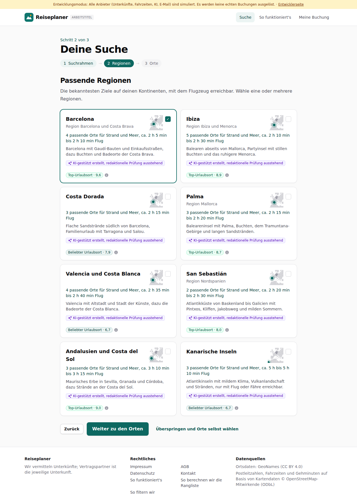
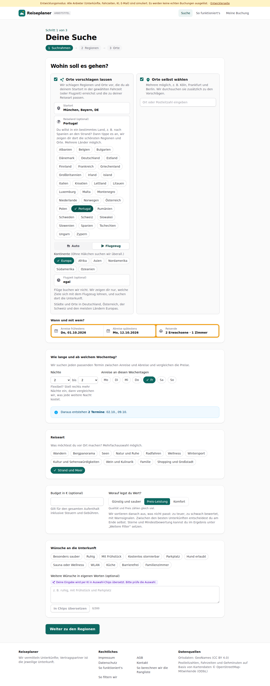
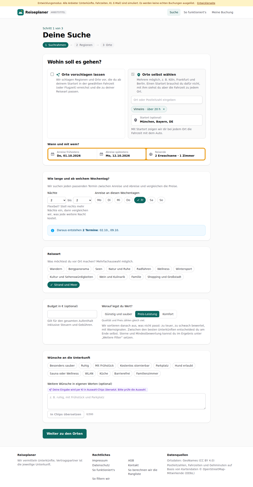
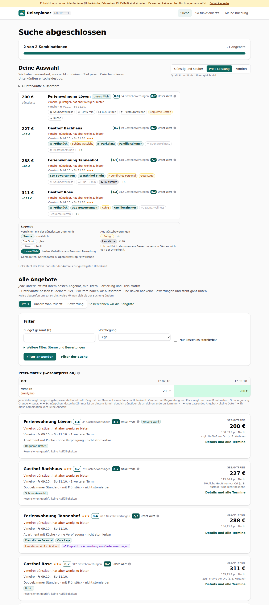

# Dogfood-Walkthrough 2026-09-30T11-54-17-P-reiseland

- Modus: P – Pfad (Nutzerablauf mit Eingaben)
- Flows: reiseland
- Basis-URL: http://localhost:37819 (echter lokaler Stack, Anbieter im Fake-Modus)
- Stand: 3d7fbc3, gestartet 2026-09-30T11:54:17.960Z
- Ergebnis: ✅ bestanden (8/8 Prüfungen erfüllt)

## Flow „reiseland“

Reiseland wählen (Spanien, Strand, Flug), dann einen kleinen Ort ohne Katalogeintrag (Vimeiro, Portugal) suchen.

### 01 Flug, Strand und Meer, Reiseland Spanien

- URL: `/suche`
- Screenshot: 
- Notiz: Regionen: Barcelona, Ibiza, Costa Dorada, Palma, Valencia und Costa Blanca, San Sebastián, Andalusien und Costa del Sol, Kanarische Inseln
- Prüfungen:
  - [x] enthält „Passende Regionen“
  - [x] enthält „Strand und Meer“
  - [x] Element `[data-testid="region-card"]` vorhanden (8)
- Überschriften: „Deine Suche“, „Passende Regionen“
- KI-Kennzeichnungen (`data-ai-provenance`): „KI-gestützt erstellt, redaktionelle Prüfung ausstehend [ai_assisted]“, „KI-gestützt erstellt, redaktionelle Prüfung ausstehend [ai_assisted]“, „KI-gestützt erstellt, redaktionelle Prüfung ausstehend [ai_assisted]“, „KI-gestützt erstellt, redaktionelle Prüfung ausstehend [ai_assisted]“, „KI-gestützt erstellt, redaktionelle Prüfung ausstehend [ai_assisted]“, „KI-gestützt erstellt, redaktionelle Prüfung ausstehend [ai_assisted]“, „KI-gestützt erstellt, redaktionelle Prüfung ausstehend [ai_assisted]“, „KI-gestützt erstellt, redaktionelle Prüfung ausstehend [ai_assisted]“
- Konsolenfehler: keine
- Fehlgeschlagene Anfragen: keine

<details><summary>Sichtbarer Text</summary>

```text
Entwicklungsmodus: Alle Anbieter (Unterkünfte, Fahrzeiten, KI, E-Mail) sind simuliert. Es werden keine echten Buchungen ausgelöst. · Entwicklerseite
Reiseplaner
ARBEITSTITEL
Suche
So funktioniert's
Meine Buchung

Schritt 2 von 3

Deine Suche
1
Suchrahmen
→
2
Regionen
→
3
Orte
Passende Regionen

Die bekanntesten Ziele auf deinen Kontinenten, mit dem Flugzeug erreichbar. Wähle eine oder mehrere Regionen.

Barcelona

Region Barcelona und Costa Brava

✓

4 passende Orte für Strand und Meer, ca. 2 h 5 min bis 2 h 10 min Flug

Barcelona mit Gaudí-Bauten und Einkaufsstraßen, dazu Buchten und Badeorte der Costa Brava.

KI-gestützt erstellt, redaktionelle Prüfung ausstehend
Top-Urlaubsort · 9,6
Ibiza

Region Ibiza und Menorca

5 passende Orte für Strand und Meer, ca. 2 h 10 min bis 2 h 30 min Flug

Balearen abseits von Mallorca, Partyinsel mit stillen Buchten und das ruhigere Menorca.

KI-gestützt erstellt, redaktionelle Prüfung ausstehend
Top-Urlaubsort · 8,9
Costa Dorada

3 passende Orte für Strand und Meer, ca. 2 h 15 min Flug

Flache Sandstrände südlich von Barcelona, Familienurlaub mit Tarragona und Salou.

KI-gestützt erstellt, redaktionelle Prüfung ausstehend
Beliebter Urlaubsort · 7,9
Palma

Region Mallorca

3 passende Orte für Strand und Meer, ca. 2 h 15 min bis 2 h 20 min Flug

Baleareninsel mit Palma, Buchten, dem Tramuntana-Gebirge und langen Sandstränden.

KI-gestützt erstellt, redaktionelle Prüfung ausstehend
Top-Urlaubsort · 8,7
Valencia und Costa Blanca

4 passende Orte für Strand und Meer, ca. 2 h 35 min bis 2 h 40 min Flug

Valencia mit Altstadt und Stadt der Künste, dazu die Badeorte der Costa Blanca.

KI-gestützt erstellt, redaktionelle Prüfung ausstehend
Beliebter Urlaubsort · 6,7
San Sebastián

Region Nordspanien

2 passende Orte für Strand und Meer, ca. 2 
… (1145 weitere Zeichen)
```

</details>

### 02 Zurück: die Auswahl steht noch, Land abwählen und Portugal wählen

- URL: `/suche`
- Screenshot: 
- Notiz: Reiseland: Portugal
- Prüfungen:
  - [x] enthält „Reiseland“
  - [x] enthält „Portugal“
- Überschriften: „Deine Suche“, „Wohin soll es gehen?“
- KI-Kennzeichnungen (`data-ai-provenance`): „Deine Eingabe wird per KI in Auswahl-Chips übersetzt. Bitte prüfe die Auswahl. [ai_assisted]“
- Konsolenfehler: keine
- Fehlgeschlagene Anfragen: keine

<details><summary>Sichtbarer Text</summary>

```text
Entwicklungsmodus: Alle Anbieter (Unterkünfte, Fahrzeiten, KI, E-Mail) sind simuliert. Es werden keine echten Buchungen ausgelöst. · Entwicklerseite
Reiseplaner
ARBEITSTITEL
Suche
So funktioniert's
Meine Buchung

Schritt 1 von 3

Deine Suche
1
Suchrahmen
→
2
Regionen
→
3
Orte
Wohin soll es gehen?
Orte vorschlagen lassen
Wir schlagen Regionen und Orte vor, die du ab deinem Startort in der gewählten Fahrzeit (oder Flugzeit) erreichst und die zu deiner Reiseart passen.
Startort
Reiseland (optional)
Portugal

Du willst in ein bestimmtes Land, z. B. nach Spanien an den Strand? Dann tippe es an, wir zeigen dir dort die schönsten Regionen und Orte. Mehrere Länder möglich.

Albanien
Belgien
Bulgarien
Dänemark
Deutschland
Estland
Finnland
Frankreich
Griechenland
Großbritannien
Irland
Island
Italien
Kroatien
Lettland
Litauen
Luxemburg
Malta
Montenegro
Niederlande
Norwegen
Österreich
Polen
Portugal
Rumänien
Schweden
Schweiz
Slowakei
Slowenien
Spanien
Tschechien
Ungarn
Zypern
Auto
Flugzeug
Kontinente (Ohne Häkchen suchen wir überall.)
Europa
Afrika
Asien
Nordamerika
Südamerika
Ozeanien
Flugzeit (optional)
egal
bis 2 Stunden
bis 3 Stunden
bis 4 Stunden
bis 5 Stunden
bis 6 Stunden
bis 8 Stunden
bis 12 Stunden

Flüge buchen wir nicht. Wir zeigen dir nur, welche Ziele sich mit dem Flugzeug lohnen, und suchen dort die Unterkunft.

Städte und Orte in Deutschland, Österreich, der Schweiz und den meisten Ländern Europas.

Orte selbst wählen
Mehrere möglich, z. B. Köln, Frankfurt und Berlin. Wir durchsuchen sie zusätzlich zu den Vorschlägen.

Wann und mit wem?

Anreise frühestens
Do, 01.10.2026
Abreise spätestens
Mo, 12.10.2026
Reisende
2 Erwachsene · 1 Zimmer
Wie lange und ab welchem Wochentag?

Wir suchen jeden passenden Termin zwischen Anreise und Abreise und vergleichen die Preise.

Näc
… (1621 weitere Zeichen)
```

</details>

### 03 Kleiner Ort ohne Katalog: Vimeiro als eigener Ort, nur diesen Ort suchen

- URL: `/suche`
- Screenshot: 
- Prüfungen:
  - [x] enthält „Vimeiro“
- Überschriften: „Deine Suche“, „Wohin soll es gehen?“
- KI-Kennzeichnungen (`data-ai-provenance`): „Deine Eingabe wird per KI in Auswahl-Chips übersetzt. Bitte prüfe die Auswahl. [ai_assisted]“
- Konsolenfehler: keine
- Fehlgeschlagene Anfragen: keine

<details><summary>Sichtbarer Text</summary>

```text
Entwicklungsmodus: Alle Anbieter (Unterkünfte, Fahrzeiten, KI, E-Mail) sind simuliert. Es werden keine echten Buchungen ausgelöst. · Entwicklerseite
Reiseplaner
ARBEITSTITEL
Suche
So funktioniert's
Meine Buchung

Schritt 1 von 3

Deine Suche
1
Suchrahmen
→
2
Regionen
→
3
Orte
Wohin soll es gehen?
Orte vorschlagen lassen
Wir schlagen Regionen und Orte vor, die du ab deinem Startort in der gewählten Fahrzeit (oder Flugzeit) erreichst und die zu deiner Reiseart passen.
Orte selbst wählen
Mehrere möglich, z. B. Köln, Frankfurt und Berlin. Einen Startort brauchst du dafür nicht, mit ihm siehst du aber die Fahrzeit zu jedem Ort.
Vimeiro
· über 20 h
Startort (optional)

Mit Startort zeigen wir dir bei jedem Ort die Fahrzeit mit dem Auto.

Wann und mit wem?

Anreise frühestens
Do, 01.10.2026
Abreise spätestens
Mo, 12.10.2026
Reisende
2 Erwachsene · 1 Zimmer
Wie lange und ab welchem Wochentag?

Wir suchen jeden passenden Termin zwischen Anreise und Abreise und vergleichen die Preise.

Nächte
1
2
3
4
5
6
7
8
9
10
11
12
13
14
bis
2
3
4
5
6
7
8
9
10
11
12
13
14

Flexibel? Stell rechts mehr Nächte ein, dann vergleichen wir, was jede weitere Nacht kostet.

Anreise an diesen Wochentagen
Mo
Di
Mi
Do
Fr
Sa
So
Daraus entstehen 2 Termine: 02.10., 09.10.
Reiseart

Was möchtest du vor Ort machen? Mehrfachauswahl möglich.

Wandern
Bergpanorama
Seen
Natur und Ruhe
Radfahren
Wellness
Wintersport
Kultur und Sehenswürdigkeiten
Wein und Kulinarik
Familie
Shopping und Großstadt
Strand und Meer
Budget in € (optional)

Gilt für den gesamten Aufenthalt inklusive Steuern und Gebühren.

Worauf legst du Wert?

Günstig und sauber
Preis-Leistung
Komfort

Qualität und Preis zählen gleich viel.

Wir sortieren danach aus, was nicht passt: zu teuer, zu schwach bewertet, mit Warnsignalen. Zwischen den besten U
… (812 weitere Zeichen)
```

</details>

### 04 Suche über Vimeiro bis zum Ergebnis

- URL: `/suche/77318e3c-0dcc-45cc-a6c5-6f60d6505230#t=IkDPfSUfktp-S3_6RvqGCjT47BlPgAZQ9O7kfIJ-LVg`
- Screenshot: 
- Prüfungen:
  - [x] enthält „Vimeiro“
  - [x] enthält „Suche abgeschlossen“
- Überschriften: „Suche abgeschlossen“, „Deine Auswahl“, „Alle Angebote“
- KI-Kennzeichnungen (`data-ai-provenance`): „KI-gestützte Auswertung von Gästebewertungen [ai_assisted]“
- Konsolenfehler: keine
- Fehlgeschlagene Anfragen: keine

<details><summary>Sichtbarer Text</summary>

```text
Entwicklungsmodus: Alle Anbieter (Unterkünfte, Fahrzeiten, KI, E-Mail) sind simuliert. Es werden keine echten Buchungen ausgelöst. · Entwicklerseite
Reiseplaner
ARBEITSTITEL
Suche
So funktioniert's
Meine Buchung
Suche abgeschlossen

2 von 2 Kombinationen

21 Angebote

Deine Auswahl

Wir haben aussortiert, was nicht zu deinem Ziel passt. Zwischen diesen Unterkünften entscheidest du.

Günstig und sauber
Preis-Leistung
Komfort

Qualität und Preis zählen gleich viel.

4 Unterkünfte aussortiert
200 €
günstigste
Ferienwohnung Löwen
Unsere Wahl
8,8
34 Gästebewertungen
8,7
Unser Wert

Vimeiro: günstiger, hat aber wenig zu bieten

Vimeiro · Fr 09.10. – So 11.10.

Sauna/Wellness
Lift 5 min
Bus 10 min
Restaurants nah
Bequeme Betten
Küche
227 €
+27 €
Gasthof Bachhaus
8,7
79 Gästebewertungen
8,7
Unser Wert

Vimeiro: günstiger, hat aber wenig zu bieten

Vimeiro · Fr 09.10. – So 11.10.★★★

Frühstück
Schöne Aussicht
Parkplatz
Familienzimmer
Sauna/Wellness
Restaurants nah
+4
288 €
+88 €
Ferienwohnung Tannenhof
8,4
618 Gästebewertungen
7,7
Unser Wert

Vimeiro: günstiger, hat aber wenig zu bieten

Vimeiro · Fr 09.10. – So 11.10.★★★

618 Bewertungen
Bahnhof 5 min
Freundliches Personal
Gute Lage
Sauna/Wellness
Bus 10 min
Lautstärke
+5
311 €
+111 €
Gasthof Rose
8,2
312 Gästebewertungen
8,2
Unser Wert

Vimeiro: günstiger, hat aber wenig zu bieten

Vimeiro · Fr 09.10. – So 11.10.★★★

Frühstück
312 Bewertungen
Ruhig
Familienzimmer
Sauna/Wellness
Bequeme Betten
+5

Legende

Verglichen mit der günstigsten Unterkunft

Sauna
zusätzlich
Bus 5 min
gleich
Pool
fehlt
Unsere Wahl
bestes Verhältnis aus Preis und Bewertung

Aus Gästebewertungen

Ruhig
Lob
Lautstärke
Kritik

Lob und Kritik stammen aus Bewertungen von Gästen, nicht von der Unterkunft.

Gehminuten: Kartendaten © OpenStreetMap-Mitwirkende

Li
… (4205 weitere Zeichen)
```

</details>

