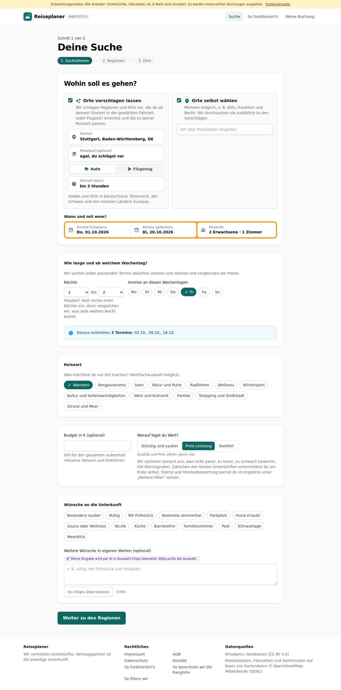
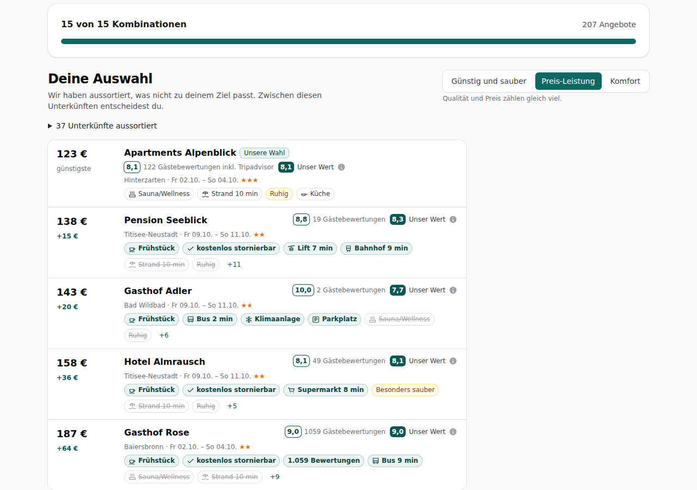

# Dogfood-Walkthrough 2026-09-30T13-45-50-P-komfortlabels

- Modus: P – Pfad (Nutzerablauf mit Eingaben)
- Flows: komfortlabels
- Basis-URL: http://localhost:38833 (echter lokaler Stack, Anbieter im Fake-Modus)
- Stand: 3b75484, gestartet 2026-09-30T13:45:50.220Z
- Ergebnis: ✅ bestanden (6/6 Prüfungen erfüllt)

## Flow „komfortlabels“

Wünsche Pool, Klimaanlage, Meerblick als Chips (filtern hart) und als positive Labels ohne Chip; Strand in Gehminuten in der Preisleiter.

### 01 Suchrahmen: die drei neuen Wünsche unten bei den Chips

- URL: `/suche`
- Screenshot: 
- Notiz: Wünsche: Besonders sauber Ruhig Mit Frühstück Kostenlos stornierbar Parkplatz Hund erlaubt Sauna oder Wellness WLAN Küche Barrierefrei Familienzimmer Pool Klimaanlage Meerblick
- Prüfungen:
  - [x] enthält „Pool“
  - [x] enthält „Klimaanlage“
  - [x] enthält „Meerblick“
  - [x] enthält „Besonders sauber“
  - [x] enthält „Barrierefrei“
- Überschriften: „Deine Suche“, „Wohin soll es gehen?“
- KI-Kennzeichnungen (`data-ai-provenance`): „Deine Eingabe wird per KI in Auswahl-Chips übersetzt. Bitte prüfe die Auswahl. [ai_assisted]“
- Konsolenfehler: keine
- Fehlgeschlagene Anfragen: keine

<details><summary>Sichtbarer Text</summary>

```text
Entwicklungsmodus: Alle Anbieter (Unterkünfte, Fahrzeiten, KI, E-Mail) sind simuliert. Es werden keine echten Buchungen ausgelöst. · Entwicklerseite
Reiseplaner
ARBEITSTITEL
Suche
So funktioniert's
Meine Buchung

Schritt 1 von 3

Deine Suche
1
Suchrahmen
→
2
Regionen
→
3
Orte
Wohin soll es gehen?
Orte vorschlagen lassen
Wir schlagen Regionen und Orte vor, die du ab deinem Startort in der gewählten Fahrzeit (oder Flugzeit) erreichst und die zu deiner Reiseart passen.
Startort
Reiseland (optional)
egal, du schlägst vor
Auto
Flugzeug
Fahrzeit (Auto)
egal (ganz Europa)
bis 1 Stunde
bis 1 h 30 min
bis 2 Stunden
bis 2 h 30 min
bis 3 Stunden
bis 4 Stunden
bis 5 Stunden
bis 6 Stunden
bis 7 Stunden
bis 10 Stunden
bis 20 Stunden
bis 30 Stunden

Städte und Orte in Deutschland, Österreich, der Schweiz und den meisten Ländern Europas.

Orte selbst wählen
Mehrere möglich, z. B. Köln, Frankfurt und Berlin. Wir durchsuchen sie zusätzlich zu den Vorschlägen.

Wann und mit wem?

Anreise frühestens
Do, 01.10.2026
Abreise spätestens
Di, 20.10.2026
Reisende
2 Erwachsene · 1 Zimmer
Wie lange und ab welchem Wochentag?

Wir suchen jeden passenden Termin zwischen Anreise und Abreise und vergleichen die Preise.

Nächte
1
2
3
4
5
6
7
8
9
10
11
12
13
14
bis
2
3
4
5
6
7
8
9
10
11
12
13
14

Flexibel? Stell rechts mehr Nächte ein, dann vergleichen wir, was jede weitere Nacht kostet.

Anreise an diesen Wochentagen
Mo
Di
Mi
Do
Fr
Sa
So
Daraus entstehen 3 Termine: 02.10., 09.10., 16.10.
Reiseart

Was möchtest du vor Ort machen? Mehrfachauswahl möglich.

Wandern
Bergpanorama
Seen
Natur und Ruhe
Radfahren
Wellness
Wintersport
Kultur und Sehenswürdigkeiten
Wein und Kulinarik
Familie
Shopping und Großstadt
Strand und Meer
Budget in € (optional)

Gilt für den gesamten Aufenthalt inklusive Steuern und Gebühre
… (1065 weitere Zeichen)
```

</details>

### 02 Ohne Häkchen: Häuser mit Pool, Klima oder Meerblick zeigen es als Label, Strand in Gehminuten

- URL: `/suche/03df3512-bf4c-49b4-925c-7314ff0e4685#t=QsV_XMjX6nShCtNrkpkIHe7GLjk_p2gp3cnE26EpndA`
- Screenshot: 
- Notiz: Badges in der Preisleiter: Klima 1, Meerblick 0, Pool 0, Strand 4.
- Prüfungen:
  - [x] Element `[data-testid="feature-badge"]` vorhanden (28)
- Überschriften: „Suche abgeschlossen“, „Deine Auswahl“, „Alle Angebote“
- KI-Kennzeichnungen (`data-ai-provenance`): „KI-gestützte Auswertung von Gästebewertungen [ai_assisted]“
- Konsolenfehler: keine
- Fehlgeschlagene Anfragen: keine

<details><summary>Sichtbarer Text</summary>

```text
Entwicklungsmodus: Alle Anbieter (Unterkünfte, Fahrzeiten, KI, E-Mail) sind simuliert. Es werden keine echten Buchungen ausgelöst. · Entwicklerseite
Reiseplaner
ARBEITSTITEL
Suche
So funktioniert's
Meine Buchung
Suche abgeschlossen

15 von 15 Kombinationen

207 Angebote

Deine Auswahl

Wir haben aussortiert, was nicht zu deinem Ziel passt. Zwischen diesen Unterkünften entscheidest du.

Günstig und sauber
Preis-Leistung
Komfort

Qualität und Preis zählen gleich viel.

37 Unterkünfte aussortiert
123 €
günstigste
Apartments Alpenblick
Unsere Wahl
8,1
122 Gästebewertungen inkl. Tripadvisor
8,1
Unser Wert

Hinterzarten · Fr 02.10. – So 04.10.★★★

Sauna/Wellness
Strand 10 min
Ruhig
Küche
138 €
+15 €
Pension Seeblick
8,8
19 Gästebewertungen
8,3
Unser Wert

Titisee-Neustadt · Fr 09.10. – So 11.10.★★

Frühstück
kostenlos stornierbar
Lift 7 min
Bahnhof 9 min
Strand 10 min
Ruhig
+11
143 €
+20 €
Gasthof Adler
10,0
2 Gästebewertungen
7,7
Unser Wert

Bad Wildbad · Fr 09.10. – So 11.10.★★

Frühstück
Bus 2 min
Klimaanlage
Parkplatz
Sauna/Wellness
Ruhig
+6
158 €
+36 €
Hotel Almrausch
8,1
49 Gästebewertungen
8,1
Unser Wert

Titisee-Neustadt · Fr 09.10. – So 11.10.★★

Frühstück
kostenlos stornierbar
Supermarkt 8 min
Besonders sauber
Strand 10 min
Ruhig
+5
187 €
+64 €
Gasthof Rose
9,0
1059 Gästebewertungen
9,0
Unser Wert

Baiersbronn · Fr 02.10. – So 04.10.★★

Frühstück
kostenlos stornierbar
1.059 Bewertungen
Bus 9 min
Sauna/Wellness
Strand 10 min
+9

Legende

Verglichen mit der günstigsten Unterkunft

Sauna
zusätzlich
Bus 5 min
gleich
Pool
fehlt
Unsere Wahl
bestes Verhältnis aus Preis und Bewertung

Aus Gästebewertungen

Ruhig
Lob
Lautstärke
Kritik

Lob und Kritik stammen aus Bewertungen von Gästen, nicht von der Unterkunft.

Gehminuten: Kartendaten © OpenStreetMap-Mitwirkende

Links steh
… (12843 weitere Zeichen)
```

</details>

