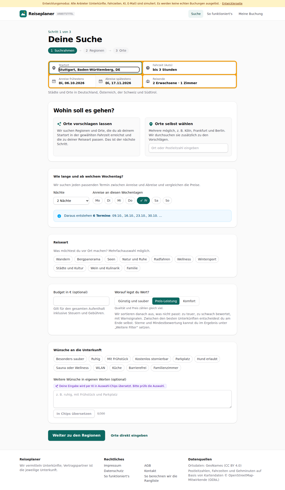
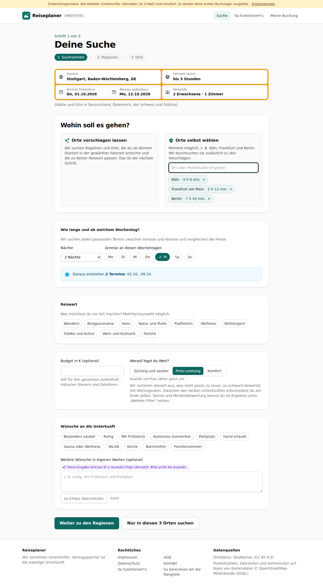
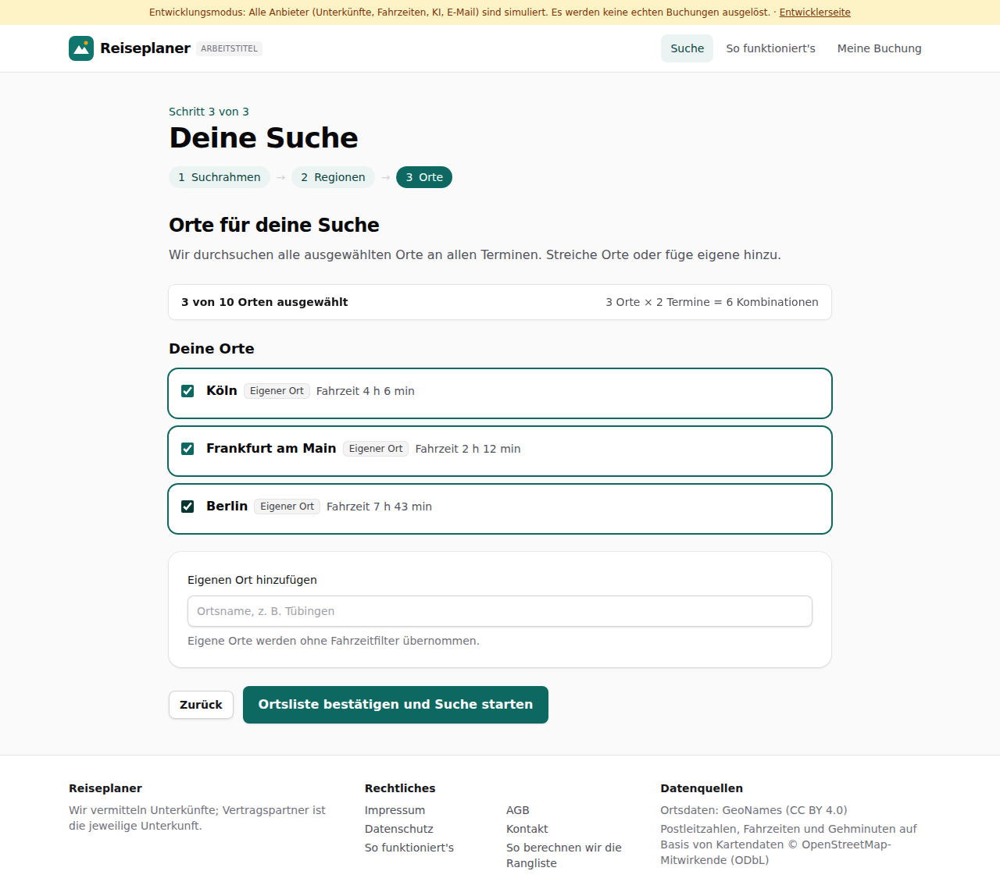
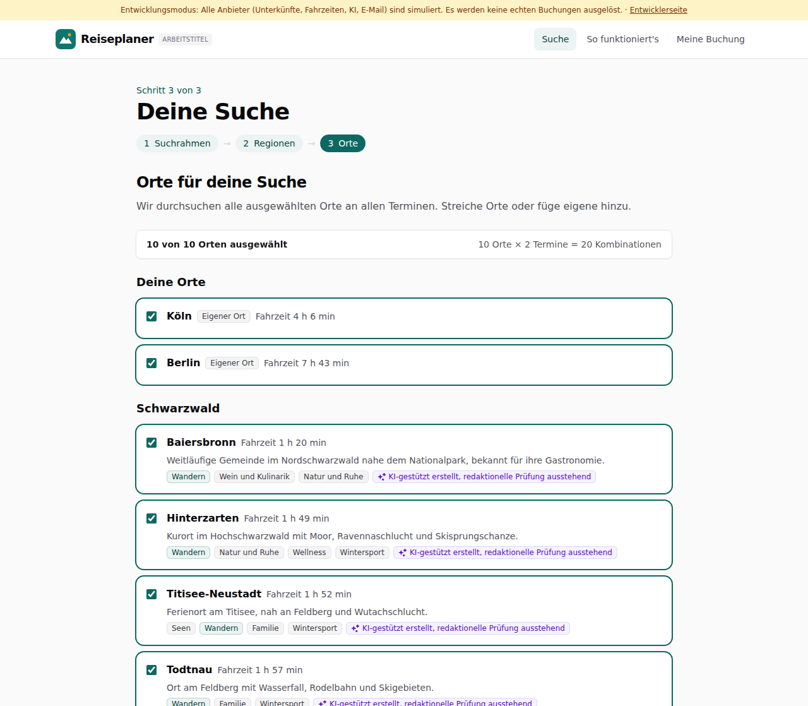


# Dogfood-Walkthrough 2026-09-29T16-33-21-P-orte

- Modus: P – Pfad (Nutzerablauf mit Eingaben)
- Flows: orte
- Basis-URL: http://localhost:42975 (echter lokaler Stack, Anbieter im Fake-Modus)
- Stand: dd60e13, gestartet 2026-09-29T16:33:21.321Z
- Ergebnis: ✅ bestanden (20/20 Prüfungen erfüllt)

## Flow „orte“

Startort per Postleitzahl, Orte selbst wählen (Köln, Frankfurt, Berlin) auf derselben Seite wie die Vorschläge; einmal nur die eigenen Orte, einmal eigene Orte zusätzlich zu den Vorschlägen.

### 01 Startort per Postleitzahl 70173

- URL: `/suche`
- Screenshot: 
- Prüfungen:
  - [x] enthält „Wohin soll es gehen?“
  - [x] enthält „Orte vorschlagen lassen“
  - [x] enthält „Orte selbst wählen“
  - [x] Element `[data-origin="2825297"]` vorhanden (1)
- Überschriften: „Deine Suche“, „Wohin soll es gehen?“
- KI-Kennzeichnungen (`data-ai-provenance`): „Deine Eingabe wird per KI in Auswahl-Chips übersetzt. Bitte prüfe die Auswahl. [ai_assisted]“
- Konsolenfehler: keine
- Fehlgeschlagene Anfragen: keine

<details><summary>Sichtbarer Text</summary>

```text
Entwicklungsmodus: Alle Anbieter (Unterkünfte, Fahrzeiten, KI, E-Mail) sind simuliert. Es werden keine echten Buchungen ausgelöst. · Entwicklerseite
Reiseplaner
ARBEITSTITEL
Suche
So funktioniert's
Meine Buchung

Schritt 1 von 3

Deine Suche
1
Suchrahmen
→
2
Regionen
→
3
Orte
Startort
Fahrzeit (Auto)
egal
bis 1 Stunde
bis 1 h 30 min
bis 2 Stunden
bis 2 h 30 min
bis 3 Stunden
bis 4 Stunden
bis 5 Stunden
bis 6 Stunden
Anreise frühestens
Di, 06.10.2026
Abreise spätestens
Di, 17.11.2026
Reisende
2 Erwachsene · 1 Zimmer

Städte und Orte in Deutschland, Österreich, der Schweiz und Südtirol.

Wohin soll es gehen?

Orte vorschlagen lassen

Wir suchen Regionen und Orte, die du ab deinem Startort in der gewählten Fahrzeit erreichst und die zu deiner Reiseart passen. Das ist der nächste Schritt.

Orte selbst wählen

Mehrere möglich, z. B. Köln, Frankfurt und Berlin. Wir durchsuchen sie zusätzlich zu den Vorschlägen.

Wie lange und ab welchem Wochentag?

Wir suchen jeden passenden Termin zwischen Anreise und Abreise und vergleichen die Preise.

Nächte
1 Nacht
2 Nächte
3 Nächte
4 Nächte
5 Nächte
6 Nächte
7 Nächte
8 Nächte
9 Nächte
10 Nächte
11 Nächte
12 Nächte
13 Nächte
14 Nächte
Anreise an diesen Wochentagen
Mo
Di
Mi
Do
Fr
Sa
So
Daraus entstehen 6 Termine: 09.10., 16.10., 23.10., 30.10. …
Reiseart

Was möchtest du vor Ort machen? Mehrfachauswahl möglich.

Wandern
Bergpanorama
Seen
Natur und Ruhe
Radfahren
Wellness
Wintersport
Städte und Kultur
Wein und Kulinarik
Familie
Budget in € (optional)

Gilt für den gesamten Aufenthalt inklusive Steuern und Gebühren.

Worauf legst du Wert?

Günstig und sauber
Preis-Leistung
Komfort

Qualität und Preis zählen gleich viel.

Wir sortieren danach aus, was nicht passt: zu teuer, zu schwach bewertet, mit Warnsignalen. Zwischen den besten Unterkünf
… (813 weitere Zeichen)
```

</details>

### 02 Orte selbst wählen: Köln, Frankfurt, Berlin

- URL: `/suche`
- Screenshot: 
- Prüfungen:
  - [x] enthält „Köln“
  - [x] enthält „Frankfurt am Main“
  - [x] enthält „Berlin“
  - [x] enthält „Nur in diesen 3 Orten suchen“
  - [x] enthält „Weiter zu den Regionen“
- Überschriften: „Deine Suche“, „Wohin soll es gehen?“
- KI-Kennzeichnungen (`data-ai-provenance`): „Deine Eingabe wird per KI in Auswahl-Chips übersetzt. Bitte prüfe die Auswahl. [ai_assisted]“
- Konsolenfehler: keine
- Fehlgeschlagene Anfragen: keine

<details><summary>Sichtbarer Text</summary>

```text
Entwicklungsmodus: Alle Anbieter (Unterkünfte, Fahrzeiten, KI, E-Mail) sind simuliert. Es werden keine echten Buchungen ausgelöst. · Entwicklerseite
Reiseplaner
ARBEITSTITEL
Suche
So funktioniert's
Meine Buchung

Schritt 1 von 3

Deine Suche
1
Suchrahmen
→
2
Regionen
→
3
Orte
Startort
Fahrzeit (Auto)
egal
bis 1 Stunde
bis 1 h 30 min
bis 2 Stunden
bis 2 h 30 min
bis 3 Stunden
bis 4 Stunden
bis 5 Stunden
bis 6 Stunden
Anreise frühestens
Do, 01.10.2026
Abreise spätestens
Mo, 12.10.2026
Reisende
2 Erwachsene · 1 Zimmer

Städte und Orte in Deutschland, Österreich, der Schweiz und Südtirol.

Wohin soll es gehen?

Orte vorschlagen lassen

Wir suchen Regionen und Orte, die du ab deinem Startort in der gewählten Fahrzeit erreichst und die zu deiner Reiseart passen. Das ist der nächste Schritt.

Orte selbst wählen

Mehrere möglich, z. B. Köln, Frankfurt und Berlin. Wir durchsuchen sie zusätzlich zu den Vorschlägen.

Köln
· 4 h 6 min
Frankfurt am Main
· 2 h 12 min
Berlin
· 7 h 43 min
Wie lange und ab welchem Wochentag?

Wir suchen jeden passenden Termin zwischen Anreise und Abreise und vergleichen die Preise.

Nächte
1 Nacht
2 Nächte
3 Nächte
4 Nächte
5 Nächte
6 Nächte
7 Nächte
8 Nächte
9 Nächte
10 Nächte
11 Nächte
12 Nächte
13 Nächte
14 Nächte
Anreise an diesen Wochentagen
Mo
Di
Mi
Do
Fr
Sa
So
Daraus entstehen 2 Termine: 02.10., 09.10.
Reiseart

Was möchtest du vor Ort machen? Mehrfachauswahl möglich.

Wandern
Bergpanorama
Seen
Natur und Ruhe
Radfahren
Wellness
Wintersport
Städte und Kultur
Wein und Kulinarik
Familie
Budget in € (optional)

Gilt für den gesamten Aufenthalt inklusive Steuern und Gebühren.

Worauf legst du Wert?

Günstig und sauber
Preis-Leistung
Komfort

Qualität und Preis zählen gleich viel.

Wir sortieren danach aus, was nicht passt: zu teuer, zu schwach bewerte
… (871 weitere Zeichen)
```

</details>

### 03 „Nur in diesen 3 Orten suchen“ → Ortsliste mit genau diesen Orten

- URL: `/suche`
- Screenshot: 
- Prüfungen:
  - [x] enthält „Deine Orte“
  - [x] enthält „Köln“
  - [x] enthält „Frankfurt am Main“
  - [x] enthält „Berlin“
  - [x] enthält „3 von 10 Orten ausgewählt“
- Überschriften: „Deine Suche“, „Orte für deine Suche“
- KI-Kennzeichnungen (`data-ai-provenance`): keine
- Konsolenfehler: keine
- Fehlgeschlagene Anfragen: keine

<details><summary>Sichtbarer Text</summary>

```text
Entwicklungsmodus: Alle Anbieter (Unterkünfte, Fahrzeiten, KI, E-Mail) sind simuliert. Es werden keine echten Buchungen ausgelöst. · Entwicklerseite
Reiseplaner
ARBEITSTITEL
Suche
So funktioniert's
Meine Buchung

Schritt 3 von 3

Deine Suche
1
Suchrahmen
→
2
Regionen
→
3
Orte
Orte für deine Suche

Wir durchsuchen alle ausgewählten Orte an allen Terminen. Streiche Orte oder füge eigene hinzu.

3 von 10 Orten ausgewählt
3 Orte × 2 Termine = 6 Kombinationen
Deine Orte
Köln
Eigener Ort
Fahrzeit 4 h 6 min
Frankfurt am Main
Eigener Ort
Fahrzeit 2 h 12 min
Berlin
Eigener Ort
Fahrzeit 7 h 43 min
Eigenen Ort hinzufügen

Eigene Orte werden ohne Fahrzeitfilter übernommen.

Zurück
Ortsliste bestätigen und Suche starten

Reiseplaner

Wir vermitteln Unterkünfte; Vertragspartner ist die jeweilige Unterkunft.

Rechtliches

Impressum
AGB
Datenschutz
Kontakt
So funktioniert's
So berechnen wir die Rangliste

Datenquellen

Ortsdaten: GeoNames (CC BY 4.0)
Postleitzahlen, Fahrzeiten und Gehminuten auf Basis von Kartendaten © OpenStreetMap-Mitwirkende (ODbL)
```

</details>

### 04 Zurück, Frankfurt entfernen, Wandern, Weiter zu den Regionen: eigene Orte und Vorschläge zusammen

- URL: `/suche`
- Screenshot: 
- Prüfungen:
  - [x] enthält „Deine Orte“
  - [x] enthält „Köln“
  - [x] enthält „Berlin“
  - [x] enthält nicht „Frankfurt am Main“
- Überschriften: „Deine Suche“, „Orte für deine Suche“
- KI-Kennzeichnungen (`data-ai-provenance`): „KI-gestützt erstellt, redaktionelle Prüfung ausstehend [ai_assisted]“, „KI-gestützt erstellt, redaktionelle Prüfung ausstehend [ai_assisted]“, „KI-gestützt erstellt, redaktionelle Prüfung ausstehend [ai_assisted]“, „KI-gestützt erstellt, redaktionelle Prüfung ausstehend [ai_assisted]“, „KI-gestützt erstellt, redaktionelle Prüfung ausstehend [ai_assisted]“, „KI-gestützt erstellt, redaktionelle Prüfung ausstehend [ai_assisted]“, „KI-gestützt erstellt, redaktionelle Prüfung ausstehend [ai_assisted]“, „KI-gestützt erstellt, redaktionelle Prüfung ausstehend [ai_assisted]“, „KI-gestützt erstellt, redaktionelle Prüfung ausstehend [ai_assisted]“
- Konsolenfehler: keine
- Fehlgeschlagene Anfragen: keine

<details><summary>Sichtbarer Text</summary>

```text
Entwicklungsmodus: Alle Anbieter (Unterkünfte, Fahrzeiten, KI, E-Mail) sind simuliert. Es werden keine echten Buchungen ausgelöst. · Entwicklerseite
Reiseplaner
ARBEITSTITEL
Suche
So funktioniert's
Meine Buchung

Schritt 3 von 3

Deine Suche
1
Suchrahmen
→
2
Regionen
→
3
Orte
Orte für deine Suche

Wir durchsuchen alle ausgewählten Orte an allen Terminen. Streiche Orte oder füge eigene hinzu.

10 von 10 Orten ausgewählt
10 Orte × 2 Termine = 20 Kombinationen
Deine Orte
Köln
Eigener Ort
Fahrzeit 4 h 6 min
Berlin
Eigener Ort
Fahrzeit 7 h 43 min
Schwarzwald
Baiersbronn
Fahrzeit 1 h 20 min

Weitläufige Gemeinde im Nordschwarzwald nahe dem Nationalpark, bekannt für ihre Gastronomie.

Wandern
Wein und Kulinarik
Natur und Ruhe
KI-gestützt erstellt, redaktionelle Prüfung ausstehend
Hinterzarten
Fahrzeit 1 h 49 min

Kurort im Hochschwarzwald mit Moor, Ravennaschlucht und Skisprungschanze.

Wandern
Natur und Ruhe
Wellness
Wintersport
KI-gestützt erstellt, redaktionelle Prüfung ausstehend
Titisee-Neustadt
Fahrzeit 1 h 52 min

Ferienort am Titisee, nah an Feldberg und Wutachschlucht.

Seen
Wandern
Familie
Wintersport
KI-gestützt erstellt, redaktionelle Prüfung ausstehend
Todtnau
Fahrzeit 1 h 57 min

Ort am Feldberg mit Wasserfall, Rodelbahn und Skigebieten.

Wandern
Familie
Wintersport
KI-gestützt erstellt, redaktionelle Prüfung ausstehend
Bad Wildbad
Fahrzeit 50 min

Thermalkurort im Enztal mit Baumwipfelpfad auf dem Sommerberg.

Wellness
Familie
Wandern
KI-gestützt erstellt, redaktionelle Prüfung ausstehend
Freudenstadt
Fahrzeit 1 h 15 min

Stadt mit weitläufigem Marktplatz und Wegen in den Nordschwarzwald.

Städte und Kultur
Wandern
Wellness
KI-gestützt erstellt, redaktionelle Prüfung ausstehend
Triberg im Schwarzwald
Fahrzeit 1 h 33 min

Ort an den Triberger Wasserfällen mit Kuc
… (943 weitere Zeichen)
```

</details>

### 05 Bestätigen und Suche über eigene und vorgeschlagene Orte starten

- URL: `/suche/9ca040b7-835b-4506-9648-e78b5627d780#t=ReopNc-iTmDFyPEnQokYExc-ywc_-1jNEeyGVpKQ9Uw`
- Screenshot: 
- Prüfungen:
  - [x] enthält „Köln“
  - [x] enthält „Berlin“
- Überschriften: „Suche abgeschlossen“, „Deine Auswahl“, „Alle Angebote“
- KI-Kennzeichnungen (`data-ai-provenance`): „KI-gestützte Auswertung von Gästebewertungen [ai_assisted]“, „KI-gestützte Auswertung von Gästebewertungen [ai_assisted]“, „KI-gestützte Auswertung von Gästebewertungen [ai_assisted]“, „KI-gestützte Auswertung von Gästebewertungen [ai_assisted]“, „KI-gestützte Auswertung von Gästebewertungen [ai_assisted]“
- Konsolenfehler: keine
- Fehlgeschlagene Anfragen: keine

<details><summary>Sichtbarer Text</summary>

```text
Entwicklungsmodus: Alle Anbieter (Unterkünfte, Fahrzeiten, KI, E-Mail) sind simuliert. Es werden keine echten Buchungen ausgelöst. · Entwicklerseite
Reiseplaner
ARBEITSTITEL
Suche
So funktioniert's
Meine Buchung
Suche abgeschlossen

20 von 20 Kombinationen

262 Angebote

Für einige Kombinationen kamen keine Daten zurück. Die übrigen Ergebnisse sind vollständig.
Deine Auswahl

Wir haben aussortiert, was nicht zu deinem Ziel passt. Zwischen diesen Unterkünften entscheidest du.

Günstig und sauber
Preis-Leistung
Komfort

Qualität und Preis zählen gleich viel.

77 Unterkünfte aussortiert
123 €
günstigste
Apartments Alpenblick
Unsere Wahl
8,1

Hinterzarten · Fr 02.10. – So 04.10.★★★

Sauna/Wellness
Ruhig
Küche
138 €
+15 €
Pension Seeblick
8,2

Titisee-Neustadt · Fr 09.10. – So 11.10.★★

Frühstück
kostenlos stornierbar
Lift 7 min
Bahnhof 9 min
Ruhig
Küche
+10
146 €
+23 €
Pension Brunnenhof
7,5

Schluchsee · Fr 02.10. – So 04.10.★★

Frühstück
Bus 6 min
Restaurants nah
Bequeme Betten
Ruhig
Küche
Sauberkeit
+4
147 €
+24 €
Ferienwohnung Felsenkeller
8,1

Freudenstadt · Fr 02.10. – So 04.10.

kostenlos stornierbar
Bus 3 min
Restaurants nah
Bequeme Betten
Sauna/Wellness
Ruhig
Schimmel
+6
178 €
+55 €
Gasthof Alte Mühle
8,2

Schluchsee · Fr 02.10. – So 04.10.★★

Frühstück
Supermarkt 5 min
Freundliches Personal
Bequeme Betten
Sauna/Wellness
Ruhig
+3
hat es zusätzlich
fehlt
wie beim günstigsten
Gehminuten: Kartendaten © OpenStreetMap-Mitwirkende

Ob dir ein Aufpreis das wert ist, entscheidest du. „Unsere Wahl“ markiert das Angebot, bei dem nachweisbare Vorteile (Bewertung, viele Bewertungen, bei Komfort Extras) den Preis am besten aufwiegen. 13 weitere passende Unterkünfte stehen unter „Alle Angebote“.

Alle Angebote

Jede Unterkunft mit ihrem besten Angebot, mit Filtern, Sortierung un
… (21276 weitere Zeichen)
```

</details>

