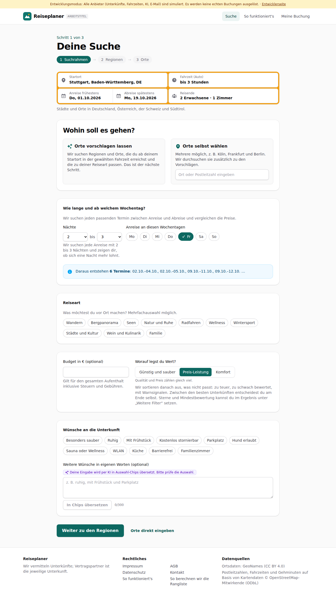
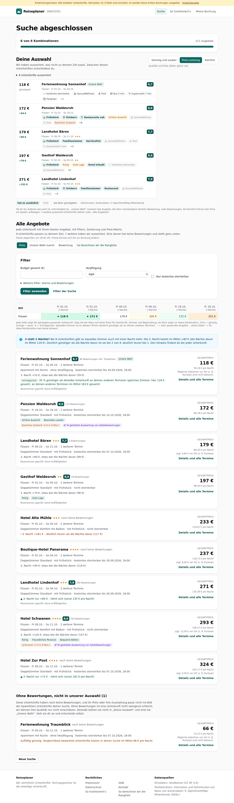
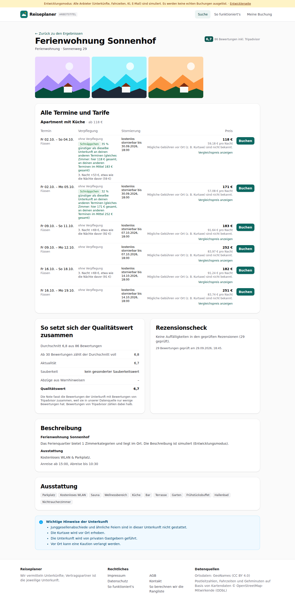

# Dogfood-Walkthrough 2026-09-29T16-44-53-P-naechte

- Modus: P – Pfad (Nutzerablauf mit Eingaben)
- Flows: naechte
- Basis-URL: http://localhost:38523 (echter lokaler Stack, Anbieter im Fake-Modus)
- Stand: 7101d8a, gestartet 2026-09-29T16:44:53.175Z
- Ergebnis: ✅ bestanden (14/14 Prüfungen erfüllt)

## Flow „naechte“

Flexible Nächte: Füssen, Freitage 02.–19.10., 2 bis 3 Nächte → je Freitag Fr–So und Fr–Mo; Matrix-Spalten je Variante, Übersicht „3 statt 2 Nächte?“, Hinweis zur 3. Nacht in Liste und Detailansicht.

### 01 2 bis 3 Nächte einstellen: 6 Termine

- URL: `/suche`
- Screenshot: 
- Prüfungen:
  - [x] enthält „Daraus entstehen 6 Termine“
  - [x] enthält „02.10.–04.10.“
  - [x] enthält „02.10.–05.10.“
  - [x] enthält „mit 2 bis 3 Nächten“
- Überschriften: „Deine Suche“, „Wohin soll es gehen?“
- KI-Kennzeichnungen (`data-ai-provenance`): „Deine Eingabe wird per KI in Auswahl-Chips übersetzt. Bitte prüfe die Auswahl. [ai_assisted]“
- Konsolenfehler: keine
- Fehlgeschlagene Anfragen: keine

<details><summary>Sichtbarer Text</summary>

```text
Entwicklungsmodus: Alle Anbieter (Unterkünfte, Fahrzeiten, KI, E-Mail) sind simuliert. Es werden keine echten Buchungen ausgelöst. · Entwicklerseite
Reiseplaner
ARBEITSTITEL
Suche
So funktioniert's
Meine Buchung

Schritt 1 von 3

Deine Suche
1
Suchrahmen
→
2
Regionen
→
3
Orte
Startort
Fahrzeit (Auto)
egal
bis 1 Stunde
bis 1 h 30 min
bis 2 Stunden
bis 2 h 30 min
bis 3 Stunden
bis 4 Stunden
bis 5 Stunden
bis 6 Stunden
Anreise frühestens
Do, 01.10.2026
Abreise spätestens
Mo, 19.10.2026
Reisende
2 Erwachsene · 1 Zimmer

Städte und Orte in Deutschland, Österreich, der Schweiz und Südtirol.

Wohin soll es gehen?

Orte vorschlagen lassen

Wir suchen Regionen und Orte, die du ab deinem Startort in der gewählten Fahrzeit erreichst und die zu deiner Reiseart passen. Das ist der nächste Schritt.

Orte selbst wählen

Mehrere möglich, z. B. Köln, Frankfurt und Berlin. Wir durchsuchen sie zusätzlich zu den Vorschlägen.

Wie lange und ab welchem Wochentag?

Wir suchen jeden passenden Termin zwischen Anreise und Abreise und vergleichen die Preise.

Nächte
1
2
3
4
5
6
7
8
9
10
11
12
13
14
bis
2
3
4
5
6
7
8
9
10
11
12
13
14

Wir suchen jede Anreise mit 2 bis 3 Nächten und zeigen dir, ob sich eine Nacht mehr lohnt.

Anreise an diesen Wochentagen
Mo
Di
Mi
Do
Fr
Sa
So
Daraus entstehen 6 Termine: 02.10.–04.10., 02.10.–05.10., 09.10.–11.10., 09.10.–12.10. …
Reiseart

Was möchtest du vor Ort machen? Mehrfachauswahl möglich.

Wandern
Bergpanorama
Seen
Natur und Ruhe
Radfahren
Wellness
Wintersport
Städte und Kultur
Wein und Kulinarik
Familie
Budget in € (optional)

Gilt für den gesamten Aufenthalt inklusive Steuern und Gebühren.

Worauf legst du Wert?

Günstig und sauber
Preis-Leistung
Komfort

Qualität und Preis zählen gleich viel.

Wir sortieren danach aus, was nicht passt: zu teuer, zu schwac
… (872 weitere Zeichen)
```

</details>

### 02 Nur Füssen, Suche starten

- URL: `/suche/01bebbf2-c9c9-4913-a4ab-ab93411f5f75#t=j2xHsDW2IYLY_BiabDQOAS_CE8XucpvdYjmmethZffs`
- Screenshot: 
- Prüfungen:
  - [x] enthält „6 von 6 Kombinationen“
  - [x] enthält „2 Nächte“
  - [x] enthält „3 Nächte“
  - [x] enthält „3 statt 2 Nächte?“
  - [x] enthält „3. Nacht“
  - [x] Element `[data-testid="nights-summary"]` vorhanden (1)
  - [x] Element `[data-testid="extra-night"]` vorhanden (8)
- Überschriften: „Suche abgeschlossen“, „Deine Auswahl“, „Alle Angebote“
- KI-Kennzeichnungen (`data-ai-provenance`): „KI-gestützte Auswertung von Gästebewertungen [ai_assisted]“, „KI-gestützte Auswertung von Gästebewertungen [ai_assisted]“
- Konsolenfehler: keine
- Fehlgeschlagene Anfragen: keine

<details><summary>Sichtbarer Text</summary>

```text
Entwicklungsmodus: Alle Anbieter (Unterkünfte, Fahrzeiten, KI, E-Mail) sind simuliert. Es werden keine echten Buchungen ausgelöst. · Entwicklerseite
Reiseplaner
ARBEITSTITEL
Suche
So funktioniert's
Meine Buchung
Suche abgeschlossen

6 von 6 Kombinationen

117 Angebote

Deine Auswahl

Wir haben aussortiert, was nicht zu deinem Ziel passt. Zwischen diesen Unterkünften entscheidest du.

Günstig und sauber
Preis-Leistung
Komfort

Qualität und Preis zählen gleich viel.

8 Unterkünfte aussortiert
118 €
günstigste
Ferienwohnung Sonnenhof
Unsere Wahl
6,7

Füssen · Fr 02.10. – So 04.10.

kostenlos stornierbar
Sauna/Wellness
Pool
Bus 5 min
Supermarkt 7 min
Parkplatz
+1
172 €
+54 €
Pension Waldesruh
8,6

Füssen · Fr 16.10. – So 18.10.

Frühstück
Ortskern
Restaurants nah
Schöne Aussicht
Sauna/Wellness
Pool
Baulicher Zustand
+8
179 €
+60 €
Landhotel Bären
7,7

Füssen · Fr 09.10. – So 11.10.★★★

Frühstück
Familienzimmer
barrierefrei
Sauna/Wellness
Pool
Supermarkt 7 min
+4
197 €
+78 €
Gasthof Waldesruh
8,9

Füssen · Fr 02.10. – So 04.10.★★

Frühstück
Ruhig
Gute Lage
Hund erlaubt
kostenlos stornierbar
Sauna/Wellness
+6
271 €
+152 €
Landhotel Lindenhof
7,9

Füssen · Fr 02.10. – So 04.10.★★★

Frühstück
Ortskern
Familienzimmer
Restaurant
Sauna/Wellness
Pool
+5
hat es zusätzlich
fehlt
wie beim günstigsten
Gehminuten: Kartendaten © OpenStreetMap-Mitwirkende

Ob dir ein Aufpreis das wert ist, entscheidest du. „Unsere Wahl“ markiert das Angebot, bei dem nachweisbare Vorteile (Bewertung, viele Bewertungen, bei Komfort Extras) den Preis am besten aufwiegen. 3 weitere passende Unterkünfte stehen unter „Alle Angebote“.

Alle Angebote

Jede Unterkunft mit ihrem besten Angebot, mit Filtern, Sortierung und Preis-Matrix.

9 Unterkünfte passen zu deinem Ziel, 7 weitere haben wir aussortiert. Eine davo
… (5814 weitere Zeichen)
```

</details>

### 03 Detailansicht: Hinweis zur 3. Nacht je Termin und Zimmer

- URL: `/suche/01bebbf2-c9c9-4913-a4ab-ab93411f5f75/unterkunft/lpf-4757-1070-10#t=j2xHsDW2IYLY_BiabDQOAS_CE8XucpvdYjmmethZffs`
- Screenshot: 
- Notiz: Hinweise zur 3. Nacht in der Liste: 8 (günstig 2, normal 5, teuer 1).
- Notiz: Übersicht: 3 statt 2 Nächte? Bei 8 Unterkünften gibt es dasselbe Zimmer auch mit einer Nacht mehr. Die 3. Nacht kostet im Mittel +80 € (die Nächte davor im Mittel 118 €). Deutlich günstiger als die Nächte davor ist sie bei 2 von 8, deutlich teurer bei 1. Den Hinweis findest du bei jeder Unterkunft.
- Prüfungen:
  - [x] enthält „3. Nacht“
  - [x] enthält „Fr 02.10. – Mo 05.10.“
  - [x] Element `[data-testid="detail-offers"] [data-testid="extra-night"]` vorhanden (3)
- Überschriften: „Ferienwohnung Sonnenhof“, „Alle Termine und Tarife“, „So setzt sich der Qualitätswert zusammen“, „Rezensionscheck“, „Beschreibung“, „Ausstattung“
- KI-Kennzeichnungen (`data-ai-provenance`): keine
- Konsolenfehler: keine
- Fehlgeschlagene Anfragen: keine

<details><summary>Sichtbarer Text</summary>

```text
Entwicklungsmodus: Alle Anbieter (Unterkünfte, Fahrzeiten, KI, E-Mail) sind simuliert. Es werden keine echten Buchungen ausgelöst. · Entwicklerseite
Reiseplaner
ARBEITSTITEL
Suche
So funktioniert's
Meine Buchung
← Zurück zu den Ergebnissen
Ferienwohnung Sonnenhof

Ferienwohnung · Sonnenweg 29

6,7
86 Bewertungen inkl. Tripadvisor
Alle Termine und Tarife
Apartment mit Küche · ab 118 €
Termin	Verpflegung	Stornierung	Preis	

Fr 02.10. – So 04.10.
Füssen
	
ohne Verpflegung
Schnäppchen 35 % günstiger als dieselbe Unterkunft an deinen anderen Terminen (gleiches Zimmer: hier 118 € gesamt, an deinen anderen Terminen im Mittel 183 € gesamt)

3. Nacht +53 €, etwa wie die Nächte davor (59 €)

	kostenlos stornierbar bis 30.09.2026, 18:00	
118 €
59,18 € pro Nacht
Mögliche Gebühren vor Ort (z. B. Kurtaxe) sind nicht bekannt.
Vergleichspreis anzeigen
	Buchen

Fr 02.10. – Mo 05.10.
Füssen
	
ohne Verpflegung
Schnäppchen 32 % günstiger als dieselbe Unterkunft an deinen anderen Terminen (gleiches Zimmer: hier 171 € gesamt, an deinen anderen Terminen im Mittel 252 € gesamt)
	kostenlos stornierbar bis 30.09.2026, 18:00	
171 €
57,08 € pro Nacht
Mögliche Gebühren vor Ort (z. B. Kurtaxe) sind nicht bekannt.
Vergleichspreis anzeigen
	Buchen

Fr 09.10. – So 11.10.
Füssen
	
ohne Verpflegung

3. Nacht +69 €, etwa wie die Nächte davor (92 €)

	kostenlos stornierbar bis 07.10.2026, 18:00	
183 €
91,64 € pro Nacht
Mögliche Gebühren vor Ort (z. B. Kurtaxe) sind nicht bekannt.
Vergleichspreis anzeigen
	Buchen

Fr 09.10. – Mo 12.10.
Füssen
	
ohne Verpflegung
	kostenlos stornierbar bis 07.10.2026, 18:00	
252 €
83,97 € pro Nacht
Mögliche Gebühren vor Ort (z. B. Kurtaxe) sind nicht bekannt.
Vergleichspreis anzeigen
	Buchen

Fr 16.10. – So 18.10.
Füssen
	
ohne Verpflegung

3. Nacht +69 €, etwa wie die Nächte
… (1903 weitere Zeichen)
```

</details>

