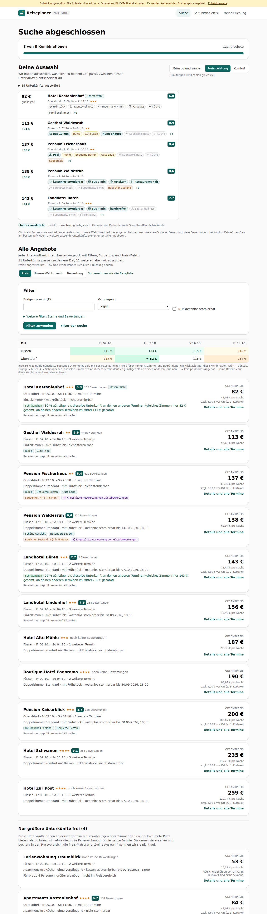
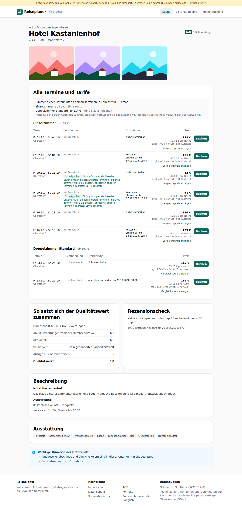

# Dogfood-Walkthrough 2026-09-29T16-56-48-P-zimmer

- Modus: P – Pfad (Nutzerablauf mit Eingaben)
- Flows: zimmer
- Basis-URL: http://localhost:44263 (echter lokaler Stack, Anbieter im Fake-Modus)
- Stand: 1e32a2d, gestartet 2026-09-29T16:56:48.480Z
- Ergebnis: ✅ bestanden (6/6 Prüfungen erfüllt)

## Flow „zimmer“

Zimmer und Personen: 1 Erwachsener, Füssen und Oberstdorf, Freitage im Oktober. Ferienwohnungen für 4 sind größer als nötig: unten unter „Nur größere Unterkünfte frei“, nicht in Liste und Matrix; Zimmerübersicht in der Detailansicht (passende zuerst, größere grau).

### 01 Suche 1 Erwachsener, Füssen und Oberstdorf, 4 Freitage

- URL: `/suche/3770e695-c046-49a1-b85c-7e770cf1df82#t=-UgvAyWfRE083LuZPUXurCXZaPc7iok8JCWcD4EnBCc`
- Screenshot: 
- Prüfungen:
  - [x] enthält „8 von 8 Kombinationen“
  - [x] enthält „Nur größere Unterkünfte frei“
  - [x] enthält „größer als nötig – nicht im Preisvergleich“
- Überschriften: „Suche abgeschlossen“, „Deine Auswahl“, „Alle Angebote“
- KI-Kennzeichnungen (`data-ai-provenance`): „KI-gestützte Auswertung von Gästebewertungen [ai_assisted]“, „KI-gestützte Auswertung von Gästebewertungen [ai_assisted]“
- Konsolenfehler: keine
- Fehlgeschlagene Anfragen: keine

<details><summary>Sichtbarer Text</summary>

```text
Entwicklungsmodus: Alle Anbieter (Unterkünfte, Fahrzeiten, KI, E-Mail) sind simuliert. Es werden keine echten Buchungen ausgelöst. · Entwicklerseite
Reiseplaner
ARBEITSTITEL
Suche
So funktioniert's
Meine Buchung
Suche abgeschlossen

8 von 8 Kombinationen

121 Angebote

Deine Auswahl

Wir haben aussortiert, was nicht zu deinem Ziel passt. Zwischen diesen Unterkünften entscheidest du.

Günstig und sauber
Preis-Leistung
Komfort

Qualität und Preis zählen gleich viel.

19 Unterkünfte aussortiert
82 €
günstigste
Hotel Kastanienhof
Unsere Wahl
6,8

Oberstdorf · Fr 09.10. – So 11.10.★★★

Frühstück
Sauna/Wellness
Supermarkt 4 min
Parkplatz
Küche
Familienzimmer
+1
113 €
+31 €
Gasthof Waldesruh
8,9

Füssen · Fr 02.10. – So 04.10.★★

Bus 10 min
Ruhig
Gute Lage
Hund erlaubt
Sauna/Wellness
Küche
+5
137 €
+55 €
Pension Fischerhaus
8,4

Oberstdorf · Fr 23.10. – So 25.10.★★

Pool
Ruhig
Bequeme Betten
Gute Lage
Sauna/Wellness
Küche
Sauberkeit
+6
138 €
+56 €
Pension Waldesruh
8,6

Füssen · Fr 16.10. – So 18.10.

kostenlos stornierbar
Bus 7 min
Ortskern
Restaurants nah
Sauna/Wellness
Supermarkt 4 min
Baulicher Zustand
+8
143 €
+61 €
Landhotel Bären
7,7

Füssen · Fr 09.10. – So 11.10.★★★

kostenlos stornierbar
Bus 4 min
barrierefrei
Sauna/Wellness
Supermarkt 4 min
Parkplatz
+4
hat es zusätzlich
fehlt
wie beim günstigsten
Gehminuten: Kartendaten © OpenStreetMap-Mitwirkende

Ob dir ein Aufpreis das wert ist, entscheidest du. „Unsere Wahl“ markiert das Angebot, bei dem nachweisbare Vorteile (Bewertung, viele Bewertungen, bei Komfort Extras) den Preis am besten aufwiegen. 2 weitere passende Unterkünfte stehen unter „Alle Angebote“.

Alle Angebote

Jede Unterkunft mit ihrem besten Angebot, mit Filtern, Sortierung und Preis-Matrix.

11 Unterkünfte passen zu deinem Ziel, 11 weitere haben wir auss
… (6601 weitere Zeichen)
```

</details>

### 02 Detailansicht eines Hotels mit Einzel- und Familienzimmer: Zimmerübersicht

- URL: `/suche/3770e695-c046-49a1-b85c-7e770cf1df82/unterkunft/lpf-4741-1028-0#t=-UgvAyWfRE083LuZPUXurCXZaPc7iok8JCWcD4EnBCc`
- Screenshot: 
- Notiz: Unterkünfte nur mit größeren Wohnungen: 4
- Notiz: In der Liste (passende Zimmer): Hotel Kastanienhof, Gasthof Waldesruh, Pension Fischerhaus, Pension Waldesruh, Landhotel Bären, Landhotel Lindenhof, Hotel Alte Mühle, Boutique-Hotel Panorama, Pension Kaiserblick, Hotel Schwanen, Hotel Zur Post
- Prüfungen:
  - [x] enthält „Zimmer dieser Unterkunft an deinen Terminen (du suchst für 1 Person)“
  - [x] enthält „für bis zu“
  - [x] Element `[data-testid="room-overview"]` vorhanden (1)
- Überschriften: „Hotel Kastanienhof“, „Alle Termine und Tarife“, „So setzt sich der Qualitätswert zusammen“, „Rezensionscheck“, „Beschreibung“, „Ausstattung“
- KI-Kennzeichnungen (`data-ai-provenance`): keine
- Konsolenfehler: keine
- Fehlgeschlagene Anfragen: keine

<details><summary>Sichtbarer Text</summary>

```text
Entwicklungsmodus: Alle Anbieter (Unterkünfte, Fahrzeiten, KI, E-Mail) sind simuliert. Es werden keine echten Buchungen ausgelöst. · Entwicklerseite
Reiseplaner
ARBEITSTITEL
Suche
So funktioniert's
Meine Buchung
← Zurück zu den Ergebnissen
Hotel Kastanienhof

★★★ · Hotel · Marktplatz 23

6,8
162 Bewertungen
Alle Termine und Tarife

Zimmer dieser Unterkunft an deinen Terminen (du suchst für 1 Person):

Einzelzimmer
ab 82 €
· für 1 Person
Doppelzimmer Standard
ab 114 €
· für bis zu 2 Personen

Preise für den ganzen Aufenthalt. Zimmer, die deutlich größer sind als nötig, zeigen wir, rechnen sie aber nicht in Preisvergleich und Auswahl ein.

Einzelzimmer · ab 82 €
Termin	Verpflegung	Stornierung	Preis	

Fr 02.10. – So 04.10.
Oberstdorf
	
mit Frühstück
	nicht stornierbar	
118 €
59,02 € pro Nacht
zzgl. 4,00 € vor Ort (z. B. Kurtaxe)
Vergleichspreis anzeigen
	Buchen

Fr 02.10. – So 04.10.
Oberstdorf
	
mit Frühstück
	kostenlos stornierbar bis 30.09.2026, 18:00	
131 €
65,57 € pro Nacht
zzgl. 4,00 € vor Ort (z. B. Kurtaxe)
Vergleichspreis anzeigen
	Buchen

Fr 09.10. – So 11.10.
Oberstdorf
	
mit Frühstück
Schnäppchen 30 % günstiger als dieselbe Unterkunft an deinen anderen Terminen (gleiches Zimmer: hier 82 € gesamt, an deinen anderen Terminen im Mittel 117 € gesamt)
	nicht stornierbar	
82 €
41,08 € pro Nacht
zzgl. 4,00 € vor Ort (z. B. Kurtaxe)
Vergleichspreis anzeigen
	Buchen

Fr 09.10. – So 11.10.
Oberstdorf
	
mit Frühstück
Schnäppchen 30 % günstiger als dieselbe Unterkunft an deinen anderen Terminen (gleiches Zimmer: hier 91 € gesamt, an deinen anderen Terminen im Mittel 130 € gesamt)
	kostenlos stornierbar bis 07.10.2026, 18:00	
91 €
45,64 € pro Nacht
zzgl. 4,00 € vor Ort (z. B. Kurtaxe)
Vergleichspreis anzeigen
	Buchen

Fr 16.10. – So 18.10.
Oberstdorf
	
mit Frühstück
	nicht 
… (1904 weitere Zeichen)
```

</details>

