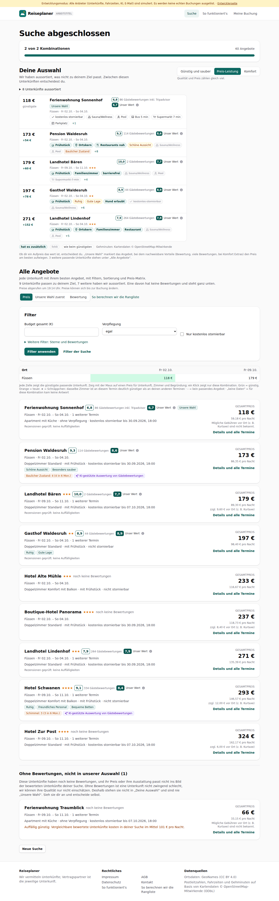
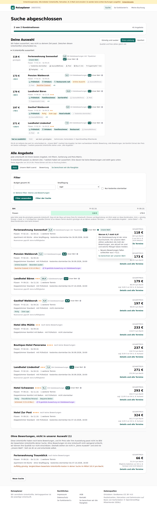
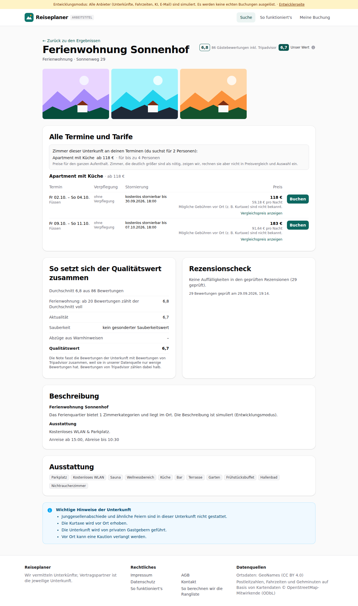
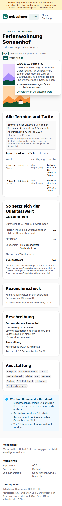

# Dogfood-Walkthrough 2026-09-29T17-14-20-P-bewertung

- Modus: P – Pfad (Nutzerablauf mit Eingaben)
- Flows: bewertung
- Basis-URL: http://localhost:40651 (echter lokaler Stack, Anbieter im Fake-Modus)
- Stand: 4864532, gestartet 2026-09-29T17:14:20.945Z
- Ergebnis: ✅ bestanden (12/12 Prüfungen erfüllt)

## Flow „bewertung“

Gästebewertung und unser Wert nebeneinander in Liste, Auswahl und Detailansicht; das „i“ erklärt beim Draufhalten, warum sich die Werte bei dieser Unterkunft unterscheiden, mit Link zur Rechenweise.

### 01 Suche Füssen, Liste mit beiden Werten

- URL: `/suche/074ab375-3af4-4ec0-9189-b22470cb74db#t=AxI5qhaAATfVQLsaun5ruMwp2vpgG3fAA310e-m4XTg`
- Screenshot: 
- Prüfungen:
  - [x] enthält „Gästebewertungen“
  - [x] enthält „Unser Wert“
  - [x] Element `[data-testid="rating-pair"] [data-testid="guest-rating"]` vorhanden (11)
  - [x] Element `[data-testid="rating-pair"] [data-testid="our-rating"]` vorhanden (11)
- Überschriften: „Suche abgeschlossen“, „Deine Auswahl“, „Alle Angebote“
- KI-Kennzeichnungen (`data-ai-provenance`): „KI-gestützte Auswertung von Gästebewertungen [ai_assisted]“, „KI-gestützte Auswertung von Gästebewertungen [ai_assisted]“
- Konsolenfehler: keine
- Fehlgeschlagene Anfragen: keine

<details><summary>Sichtbarer Text</summary>

```text
Entwicklungsmodus: Alle Anbieter (Unterkünfte, Fahrzeiten, KI, E-Mail) sind simuliert. Es werden keine echten Buchungen ausgelöst. · Entwicklerseite
Reiseplaner
ARBEITSTITEL
Suche
So funktioniert's
Meine Buchung
Suche abgeschlossen

2 von 2 Kombinationen

40 Angebote

Deine Auswahl

Wir haben aussortiert, was nicht zu deinem Ziel passt. Zwischen diesen Unterkünften entscheidest du.

Günstig und sauber
Preis-Leistung
Komfort

Qualität und Preis zählen gleich viel.

8 Unterkünfte aussortiert
118 €
günstigste
Ferienwohnung Sonnenhof
Unsere Wahl
6,8
86 Gästebewertungen inkl. Tripadvisor
6,7
Unser Wert

Füssen · Fr 02.10. – So 04.10.

kostenlos stornierbar
Sauna/Wellness
Pool
Bus 5 min
Supermarkt 7 min
Parkplatz
+1
173 €
+54 €
Pension Waldesruh
9,3
114 Gästebewertungen
8,6
Unser Wert

Füssen · Fr 02.10. – So 04.10.

Frühstück
Ortskern
Restaurants nah
Schöne Aussicht
Sauna/Wellness
Pool
Baulicher Zustand
+8
179 €
+60 €
Landhotel Bären
10,0
2 Gästebewertungen
7,7
Unser Wert

Füssen · Fr 09.10. – So 11.10.★★★

Frühstück
Familienzimmer
barrierefrei
Sauna/Wellness
Pool
Supermarkt 7 min
+4
197 €
+78 €
Gasthof Waldesruh
8,9
44 Gästebewertungen
8,9
Unser Wert

Füssen · Fr 02.10. – So 04.10.★★

Frühstück
Ruhig
Gute Lage
Hund erlaubt
kostenlos stornierbar
Sauna/Wellness
+6
271 €
+152 €
Landhotel Lindenhof
7,9
264 Gästebewertungen
7,9
Unser Wert

Füssen · Fr 02.10. – So 04.10.★★★

Frühstück
Ortskern
Familienzimmer
Restaurant
Sauna/Wellness
Pool
+5
hat es zusätzlich
fehlt
wie beim günstigsten
Gehminuten: Kartendaten © OpenStreetMap-Mitwirkende

Ob dir ein Aufpreis das wert ist, entscheidest du. „Unsere Wahl“ markiert das Angebot, bei dem nachweisbare Vorteile (Bewertung, viele Bewertungen, bei Komfort Extras) den Preis am besten aufwiegen. 3 weitere passende Unterkünfte stehen unter „Al
… (5041 weitere Zeichen)
```

</details>

### 02 Maus auf das „i“ neben „Unser Wert“ einer Unterkunft mit Unterschied

- URL: `/suche/074ab375-3af4-4ec0-9189-b22470cb74db#t=AxI5qhaAATfVQLsaun5ruMwp2vpgG3fAA310e-m4XTg`
- Screenshot: 
- Notiz: Gäste → unser Wert in der Liste: 6.8 → 6.7, 9.3 → 8.6, 10 → 7.7, 8.9 → 8.9, 7.9 → 7.9, 9.1 → 8.4
- Notiz: Erklärung: Warum 6,7 statt 6,8? | Die Gästebewertung ist der reine Durchschnitt. Für unseren Wert zählen außerdem die Zahl der Bewertungen, wie aktuell sie sind und welche Mängel Gäste melden. | Neuere Bewertungen fallen schlechter aus (−0,1). | So berechnen wir unseren Wert
- Prüfungen:
  - [x] enthält „Die Gästebewertung ist der reine Durchschnitt“
  - [x] enthält „So berechnen wir unseren Wert“
  - [x] Element `[data-testid="rating-info-panel"] a[href="/ranking"]` vorhanden (1)
- Überschriften: „Suche abgeschlossen“, „Deine Auswahl“, „Alle Angebote“
- KI-Kennzeichnungen (`data-ai-provenance`): „KI-gestützte Auswertung von Gästebewertungen [ai_assisted]“, „KI-gestützte Auswertung von Gästebewertungen [ai_assisted]“
- Konsolenfehler: keine
- Fehlgeschlagene Anfragen: keine

<details><summary>Sichtbarer Text</summary>

```text
Entwicklungsmodus: Alle Anbieter (Unterkünfte, Fahrzeiten, KI, E-Mail) sind simuliert. Es werden keine echten Buchungen ausgelöst. · Entwicklerseite
Reiseplaner
ARBEITSTITEL
Suche
So funktioniert's
Meine Buchung
Suche abgeschlossen

2 von 2 Kombinationen

40 Angebote

Deine Auswahl

Wir haben aussortiert, was nicht zu deinem Ziel passt. Zwischen diesen Unterkünften entscheidest du.

Günstig und sauber
Preis-Leistung
Komfort

Qualität und Preis zählen gleich viel.

8 Unterkünfte aussortiert
118 €
günstigste
Ferienwohnung Sonnenhof
Unsere Wahl
6,8
86 Gästebewertungen inkl. Tripadvisor
6,7
Unser Wert

Füssen · Fr 02.10. – So 04.10.

kostenlos stornierbar
Sauna/Wellness
Pool
Bus 5 min
Supermarkt 7 min
Parkplatz
+1
173 €
+54 €
Pension Waldesruh
9,3
114 Gästebewertungen
8,6
Unser Wert

Füssen · Fr 02.10. – So 04.10.

Frühstück
Ortskern
Restaurants nah
Schöne Aussicht
Sauna/Wellness
Pool
Baulicher Zustand
+8
179 €
+60 €
Landhotel Bären
10,0
2 Gästebewertungen
7,7
Unser Wert

Füssen · Fr 09.10. – So 11.10.★★★

Frühstück
Familienzimmer
barrierefrei
Sauna/Wellness
Pool
Supermarkt 7 min
+4
197 €
+78 €
Gasthof Waldesruh
8,9
44 Gästebewertungen
8,9
Unser Wert

Füssen · Fr 02.10. – So 04.10.★★

Frühstück
Ruhig
Gute Lage
Hund erlaubt
kostenlos stornierbar
Sauna/Wellness
+6
271 €
+152 €
Landhotel Lindenhof
7,9
264 Gästebewertungen
7,9
Unser Wert

Füssen · Fr 02.10. – So 04.10.★★★

Frühstück
Ortskern
Familienzimmer
Restaurant
Sauna/Wellness
Pool
+5
hat es zusätzlich
fehlt
wie beim günstigsten
Gehminuten: Kartendaten © OpenStreetMap-Mitwirkende

Ob dir ein Aufpreis das wert ist, entscheidest du. „Unsere Wahl“ markiert das Angebot, bei dem nachweisbare Vorteile (Bewertung, viele Bewertungen, bei Komfort Extras) den Preis am besten aufwiegen. 3 weitere passende Unterkünfte stehen unter „Al
… (5300 weitere Zeichen)
```

</details>

### 03 Detailansicht: beide Werte oben, Aufschlüsselung mit Art der Unterkunft

- URL: `/suche/074ab375-3af4-4ec0-9189-b22470cb74db/unterkunft/lpf-4757-1070-10#t=AxI5qhaAATfVQLsaun5ruMwp2vpgG3fAA310e-m4XTg`
- Screenshot: 
- Prüfungen:
  - [x] enthält „Unser Wert“
  - [x] enthält „Gästebewertungen“
  - [x] enthält „So setzt sich der Qualitätswert zusammen“
  - [x] Element `[data-testid="rating-pair"]` vorhanden (1)
- Überschriften: „Ferienwohnung Sonnenhof“, „Alle Termine und Tarife“, „So setzt sich der Qualitätswert zusammen“, „Rezensionscheck“, „Beschreibung“, „Ausstattung“
- KI-Kennzeichnungen (`data-ai-provenance`): keine
- Konsolenfehler: keine
- Fehlgeschlagene Anfragen: keine

<details><summary>Sichtbarer Text</summary>

```text
Entwicklungsmodus: Alle Anbieter (Unterkünfte, Fahrzeiten, KI, E-Mail) sind simuliert. Es werden keine echten Buchungen ausgelöst. · Entwicklerseite
Reiseplaner
ARBEITSTITEL
Suche
So funktioniert's
Meine Buchung
← Zurück zu den Ergebnissen
Ferienwohnung Sonnenhof

Ferienwohnung · Sonnenweg 29

6,8
86 Gästebewertungen inkl. Tripadvisor
6,7
Unser Wert
Alle Termine und Tarife

Zimmer dieser Unterkunft an deinen Terminen (du suchst für 2 Personen):

Apartment mit Küche
ab 118 €
· für bis zu 4 Personen

Preise für den ganzen Aufenthalt. Zimmer, die deutlich größer sind als nötig, zeigen wir, rechnen sie aber nicht in Preisvergleich und Auswahl ein.

Apartment mit Küche · ab 118 €
Termin	Verpflegung	Stornierung	Preis	

Fr 02.10. – So 04.10.
Füssen
	
ohne Verpflegung
	kostenlos stornierbar bis 30.09.2026, 18:00	
118 €
59,18 € pro Nacht
Mögliche Gebühren vor Ort (z. B. Kurtaxe) sind nicht bekannt.
Vergleichspreis anzeigen
	Buchen

Fr 09.10. – So 11.10.
Füssen
	
ohne Verpflegung
	kostenlos stornierbar bis 07.10.2026, 18:00	
183 €
91,64 € pro Nacht
Mögliche Gebühren vor Ort (z. B. Kurtaxe) sind nicht bekannt.
Vergleichspreis anzeigen
	Buchen
So setzt sich der Qualitätswert zusammen
Durchschnitt 6,8 aus 86 Bewertungen
Ferienwohnung: ab 20 Bewertungen zählt der Durchschnitt voll
6,8
Aktualität
6,7
Sauberkeit
kein gesonderter Sauberkeitswert
Abzüge aus Warnhinweisen
–
Qualitätswert
6,7

Die Note fasst die Bewertungen der Unterkunft mit Bewertungen von Tripadvisor zusammen, weil sie in unserer Datenquelle nur wenige Bewertungen hat. Bewertungen von Tripadvisor zählen dabei halb.

Rezensionscheck

Keine Auffälligkeiten in den geprüften Rezensionen (29 geprüft).

29 Bewertungen geprüft am 29.09.2026, 19:14.

Beschreibung
Ferienwohnung Sonnenhof

Das Ferienquartier bietet 1 Zimmerkatego
… (874 weitere Zeichen)
```

</details>

### 04 Handy: Tippen auf das „i“

- URL: `/suche/074ab375-3af4-4ec0-9189-b22470cb74db/unterkunft/lpf-4757-1070-10#t=AxI5qhaAATfVQLsaun5ruMwp2vpgG3fAA310e-m4XTg`
- Screenshot: 
- Notiz: Erklärung auf 390 px: links 94 px, rechts 382 px
- Prüfungen:
  - [x] enthält „So berechnen wir unseren Wert“
- Überschriften: „Ferienwohnung Sonnenhof“, „Alle Termine und Tarife“, „So setzt sich der Qualitätswert zusammen“, „Rezensionscheck“, „Beschreibung“, „Ausstattung“
- KI-Kennzeichnungen (`data-ai-provenance`): keine
- Konsolenfehler: keine
- Fehlgeschlagene Anfragen: keine

<details><summary>Sichtbarer Text</summary>

```text
Entwicklungsmodus: Alle Anbieter (Unterkünfte, Fahrzeiten, KI, E-Mail) sind simuliert. Es werden keine echten Buchungen ausgelöst. · Entwicklerseite
Reiseplaner
Suche
Meine Buchung
← Zurück zu den Ergebnissen
Ferienwohnung Sonnenhof

Ferienwohnung · Sonnenweg 29

6,8
86 Gästebewertungen inkl. Tripadvisor
6,7
Unser Wert
Warum 6,7 statt 6,8?
Die Gästebewertung ist der reine Durchschnitt. Für unseren Wert zählen außerdem die Zahl der Bewertungen, wie aktuell sie sind und welche Mängel Gäste melden.
Neuere Bewertungen fallen schlechter aus (−0,1).
So berechnen wir unseren Wert
Alle Termine und Tarife

Zimmer dieser Unterkunft an deinen Terminen (du suchst für 2 Personen):

Apartment mit Küche
ab 118 €
· für bis zu 4 Personen

Preise für den ganzen Aufenthalt. Zimmer, die deutlich größer sind als nötig, zeigen wir, rechnen sie aber nicht in Preisvergleich und Auswahl ein.

Apartment mit Küche · ab 118 €
Termin	Verpflegung	Stornierung	Preis	

Fr 02.10. – So 04.10.
Füssen
	
ohne Verpflegung
	kostenlos stornierbar bis 30.09.2026, 18:00	
118 €
59,18 € pro Nacht
Mögliche Gebühren vor Ort (z. B. Kurtaxe) sind nicht bekannt.
Vergleichspreis anzeigen
	Buchen

Fr 09.10. – So 11.10.
Füssen
	
ohne Verpflegung
	kostenlos stornierbar bis 07.10.2026, 18:00	
183 €
91,64 € pro Nacht
Mögliche Gebühren vor Ort (z. B. Kurtaxe) sind nicht bekannt.
Vergleichspreis anzeigen
	Buchen
So setzt sich der Qualitätswert zusammen
Durchschnitt 6,8 aus 86 Bewertungen
Ferienwohnung: ab 20 Bewertungen zählt der Durchschnitt voll
6,8
Aktualität
6,7
Sauberkeit
kein gesonderter Sauberkeitswert
Abzüge aus Warnhinweisen
–
Qualitätswert
6,7

Die Note fasst die Bewertungen der Unterkunft mit Bewertungen von Tripadvisor zusammen, weil sie in unserer Datenquelle nur wenige Bewertungen hat. Bewertungen von Tripadvisor
… (1102 weitere Zeichen)
```

</details>

