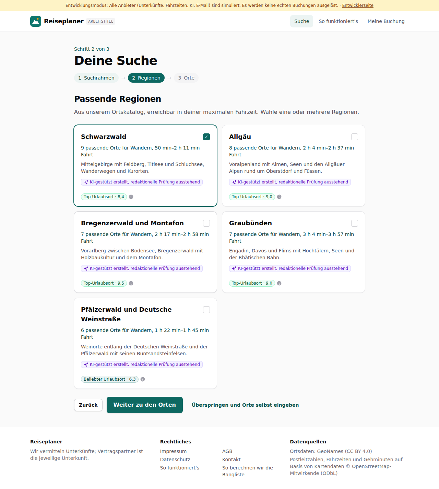
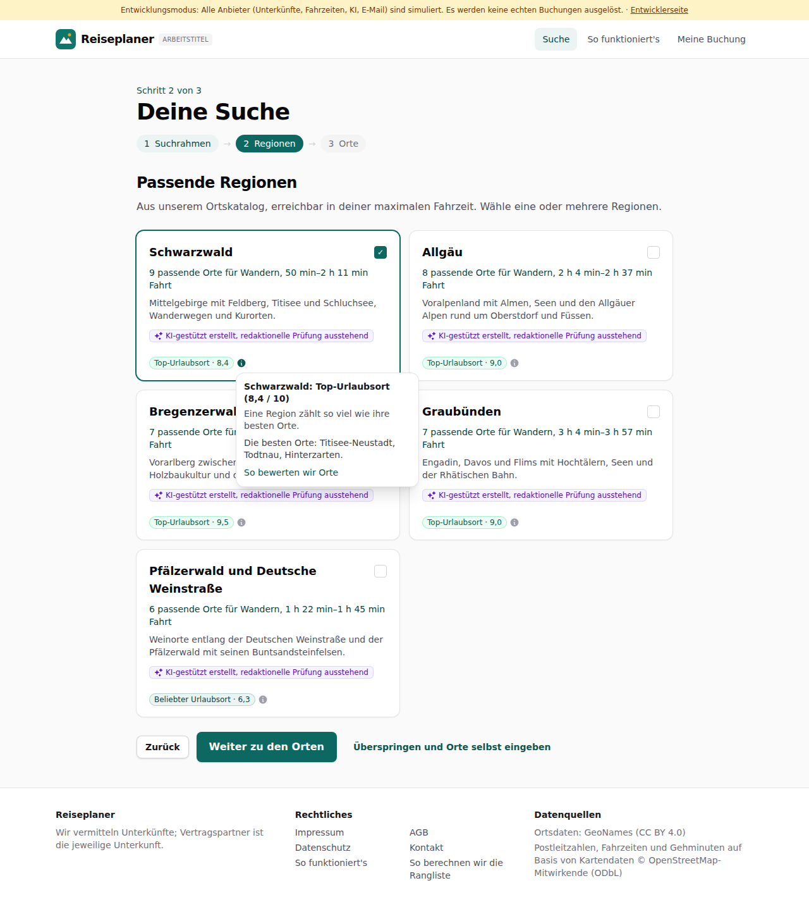
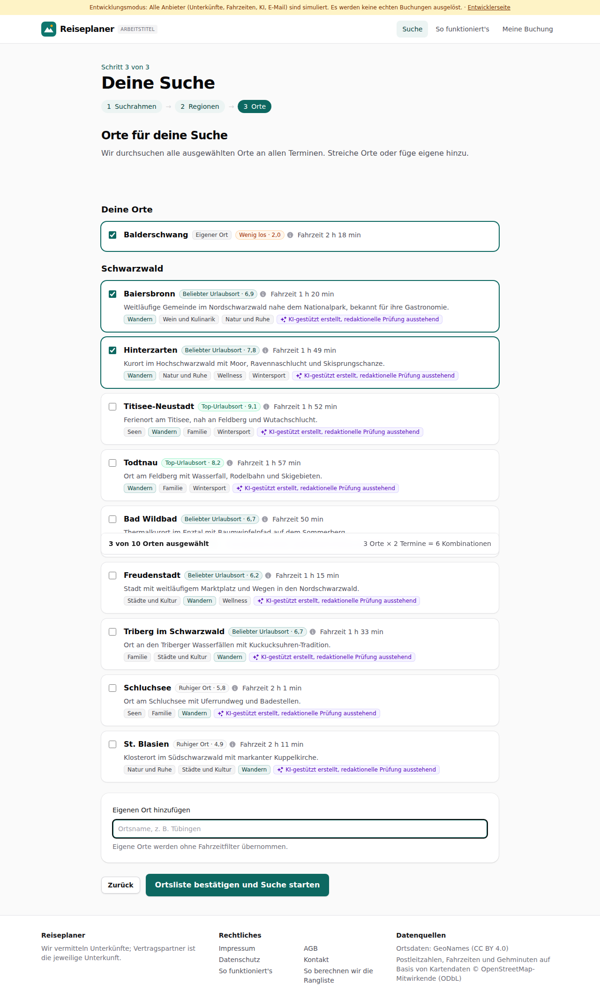
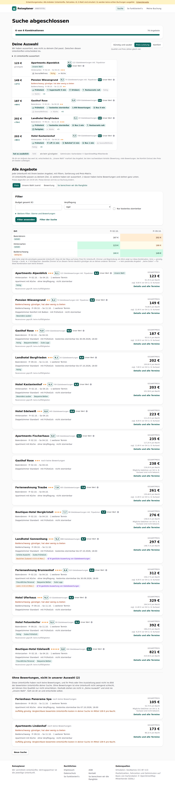

# Dogfood-Walkthrough 2026-09-29T17-29-54-P-attraktivitaet

- Modus: P – Pfad (Nutzerablauf mit Eingaben)
- Flows: attraktivitaet
- Basis-URL: http://localhost:45039 (echter lokaler Stack, Anbieter im Fake-Modus)
- Stand: 697c431, gestartet 2026-09-29T17:29:54.106Z
- Ergebnis: ✅ bestanden (12/12 Prüfungen erfüllt)

## Flow „attraktivitaet“

Attraktivität: Regionen und Orte mit Stufe (Top-Urlaubsort … Wenig los) und Erklärung beim Draufhalten; ein kleines Dorf (Balderschwang) als eigener Ort ist in Preis-Matrix und Liste als „wenig los“ markiert, bleibt aber drin.

### 01 Regionen mit Stufe

- URL: `/suche`
- Screenshot: 
- Prüfungen:
  - [x] enthält „Top-Urlaubsort“
  - [x] Element `[data-testid="region-list"] [data-testid="attractiveness"]` vorhanden (5)
- Überschriften: „Deine Suche“, „Passende Regionen“
- KI-Kennzeichnungen (`data-ai-provenance`): „KI-gestützt erstellt, redaktionelle Prüfung ausstehend [ai_assisted]“, „KI-gestützt erstellt, redaktionelle Prüfung ausstehend [ai_assisted]“, „KI-gestützt erstellt, redaktionelle Prüfung ausstehend [ai_assisted]“, „KI-gestützt erstellt, redaktionelle Prüfung ausstehend [ai_assisted]“, „KI-gestützt erstellt, redaktionelle Prüfung ausstehend [ai_assisted]“
- Konsolenfehler: keine
- Fehlgeschlagene Anfragen: keine

<details><summary>Sichtbarer Text</summary>

```text
Entwicklungsmodus: Alle Anbieter (Unterkünfte, Fahrzeiten, KI, E-Mail) sind simuliert. Es werden keine echten Buchungen ausgelöst. · Entwicklerseite
Reiseplaner
ARBEITSTITEL
Suche
So funktioniert's
Meine Buchung

Schritt 2 von 3

Deine Suche
1
Suchrahmen
→
2
Regionen
→
3
Orte
Passende Regionen

Aus unserem Ortskatalog, erreichbar in deiner maximalen Fahrzeit. Wähle eine oder mehrere Regionen.

Schwarzwald
✓

9 passende Orte für Wandern, 50 min–2 h 11 min Fahrt

Mittelgebirge mit Feldberg, Titisee und Schluchsee, Wanderwegen und Kurorten.

KI-gestützt erstellt, redaktionelle Prüfung ausstehend
Top-Urlaubsort · 8,4
Allgäu

8 passende Orte für Wandern, 2 h 4 min–2 h 37 min Fahrt

Voralpenland mit Almen, Seen und den Allgäuer Alpen rund um Oberstdorf und Füssen.

KI-gestützt erstellt, redaktionelle Prüfung ausstehend
Top-Urlaubsort · 9,0
Bregenzerwald und Montafon

7 passende Orte für Wandern, 2 h 17 min–2 h 58 min Fahrt

Vorarlberg zwischen Bodensee, Bregenzerwald mit Holzbaukultur und dem Montafon.

KI-gestützt erstellt, redaktionelle Prüfung ausstehend
Top-Urlaubsort · 9,5
Graubünden

7 passende Orte für Wandern, 3 h 4 min–3 h 57 min Fahrt

Engadin, Davos und Flims mit Hochtälern, Seen und der Rhätischen Bahn.

KI-gestützt erstellt, redaktionelle Prüfung ausstehend
Top-Urlaubsort · 9,0
Pfälzerwald und Deutsche Weinstraße

6 passende Orte für Wandern, 1 h 22 min–1 h 45 min Fahrt

Weinorte entlang der Deutschen Weinstraße und der Pfälzerwald mit seinen Buntsandsteinfelsen.

KI-gestützt erstellt, redaktionelle Prüfung ausstehend
Beliebter Urlaubsort · 6,3
Zurück
Weiter zu den Orten
Überspringen und Orte selbst eingeben

Reiseplaner

Wir vermitteln Unterkünfte; Vertragspartner ist die jeweilige Unterkunft.

Rechtliches

Impressum
AGB
Datenschutz
Kontakt
So funktioniert's
So 
… (177 weitere Zeichen)
```

</details>

### 02 Maus auf das „i“ einer Region

- URL: `/suche`
- Screenshot: 
- Prüfungen:
  - [x] enthält „Eine Region zählt so viel wie ihre besten Orte.“
  - [x] enthält „Die besten Orte:“
  - [x] enthält „So bewerten wir Orte“
- Überschriften: „Deine Suche“, „Passende Regionen“
- KI-Kennzeichnungen (`data-ai-provenance`): „KI-gestützt erstellt, redaktionelle Prüfung ausstehend [ai_assisted]“, „KI-gestützt erstellt, redaktionelle Prüfung ausstehend [ai_assisted]“, „KI-gestützt erstellt, redaktionelle Prüfung ausstehend [ai_assisted]“, „KI-gestützt erstellt, redaktionelle Prüfung ausstehend [ai_assisted]“, „KI-gestützt erstellt, redaktionelle Prüfung ausstehend [ai_assisted]“
- Konsolenfehler: keine
- Fehlgeschlagene Anfragen: keine

<details><summary>Sichtbarer Text</summary>

```text
Entwicklungsmodus: Alle Anbieter (Unterkünfte, Fahrzeiten, KI, E-Mail) sind simuliert. Es werden keine echten Buchungen ausgelöst. · Entwicklerseite
Reiseplaner
ARBEITSTITEL
Suche
So funktioniert's
Meine Buchung

Schritt 2 von 3

Deine Suche
1
Suchrahmen
→
2
Regionen
→
3
Orte
Passende Regionen

Aus unserem Ortskatalog, erreichbar in deiner maximalen Fahrzeit. Wähle eine oder mehrere Regionen.

Schwarzwald
✓

9 passende Orte für Wandern, 50 min–2 h 11 min Fahrt

Mittelgebirge mit Feldberg, Titisee und Schluchsee, Wanderwegen und Kurorten.

KI-gestützt erstellt, redaktionelle Prüfung ausstehend
Top-Urlaubsort · 8,4
Schwarzwald: Top-Urlaubsort (8,4 / 10)
Eine Region zählt so viel wie ihre besten Orte.
Die besten Orte: Titisee-Neustadt, Todtnau, Hinterzarten.
So bewerten wir Orte
Allgäu

8 passende Orte für Wandern, 2 h 4 min–2 h 37 min Fahrt

Voralpenland mit Almen, Seen und den Allgäuer Alpen rund um Oberstdorf und Füssen.

KI-gestützt erstellt, redaktionelle Prüfung ausstehend
Top-Urlaubsort · 9,0
Bregenzerwald und Montafon

7 passende Orte für Wandern, 2 h 17 min–2 h 58 min Fahrt

Vorarlberg zwischen Bodensee, Bregenzerwald mit Holzbaukultur und dem Montafon.

KI-gestützt erstellt, redaktionelle Prüfung ausstehend
Top-Urlaubsort · 9,5
Graubünden

7 passende Orte für Wandern, 3 h 4 min–3 h 57 min Fahrt

Engadin, Davos und Flims mit Hochtälern, Seen und der Rhätischen Bahn.

KI-gestützt erstellt, redaktionelle Prüfung ausstehend
Top-Urlaubsort · 9,0
Pfälzerwald und Deutsche Weinstraße

6 passende Orte für Wandern, 1 h 22 min–1 h 45 min Fahrt

Weinorte entlang der Deutschen Weinstraße und der Pfälzerwald mit seinen Buntsandsteinfelsen.

KI-gestützt erstellt, redaktionelle Prüfung ausstehend
Beliebter Urlaubsort · 6,3
Zurück
Weiter zu den Orten
Überspringen und Orte selbst 
… (343 weitere Zeichen)
```

</details>

### 03 Orte mit Stufe, eigenes kleines Dorf dazu

- URL: `/suche`
- Screenshot: 
- Prüfungen:
  - [x] enthält „Balderschwang“
  - [x] enthält „Wenig los“
  - [x] Element `[data-testid="place-row"] [data-testid="attractiveness"]` vorhanden (10)
- Überschriften: „Deine Suche“, „Orte für deine Suche“
- KI-Kennzeichnungen (`data-ai-provenance`): „KI-gestützt erstellt, redaktionelle Prüfung ausstehend [ai_assisted]“, „KI-gestützt erstellt, redaktionelle Prüfung ausstehend [ai_assisted]“, „KI-gestützt erstellt, redaktionelle Prüfung ausstehend [ai_assisted]“, „KI-gestützt erstellt, redaktionelle Prüfung ausstehend [ai_assisted]“, „KI-gestützt erstellt, redaktionelle Prüfung ausstehend [ai_assisted]“, „KI-gestützt erstellt, redaktionelle Prüfung ausstehend [ai_assisted]“, „KI-gestützt erstellt, redaktionelle Prüfung ausstehend [ai_assisted]“, „KI-gestützt erstellt, redaktionelle Prüfung ausstehend [ai_assisted]“, „KI-gestützt erstellt, redaktionelle Prüfung ausstehend [ai_assisted]“
- Konsolenfehler: keine
- Fehlgeschlagene Anfragen: keine

<details><summary>Sichtbarer Text</summary>

```text
Entwicklungsmodus: Alle Anbieter (Unterkünfte, Fahrzeiten, KI, E-Mail) sind simuliert. Es werden keine echten Buchungen ausgelöst. · Entwicklerseite
Reiseplaner
ARBEITSTITEL
Suche
So funktioniert's
Meine Buchung

Schritt 3 von 3

Deine Suche
1
Suchrahmen
→
2
Regionen
→
3
Orte
Orte für deine Suche

Wir durchsuchen alle ausgewählten Orte an allen Terminen. Streiche Orte oder füge eigene hinzu.

3 von 10 Orten ausgewählt
3 Orte × 2 Termine = 6 Kombinationen
Deine Orte
Balderschwang
Eigener Ort
Wenig los · 2,0
Fahrzeit 2 h 18 min
Schwarzwald
Baiersbronn
Beliebter Urlaubsort · 6,9
Fahrzeit 1 h 20 min

Weitläufige Gemeinde im Nordschwarzwald nahe dem Nationalpark, bekannt für ihre Gastronomie.

Wandern
Wein und Kulinarik
Natur und Ruhe
KI-gestützt erstellt, redaktionelle Prüfung ausstehend
Hinterzarten
Beliebter Urlaubsort · 7,8
Fahrzeit 1 h 49 min

Kurort im Hochschwarzwald mit Moor, Ravennaschlucht und Skisprungschanze.

Wandern
Natur und Ruhe
Wellness
Wintersport
KI-gestützt erstellt, redaktionelle Prüfung ausstehend
Titisee-Neustadt
Top-Urlaubsort · 9,1
Fahrzeit 1 h 52 min

Ferienort am Titisee, nah an Feldberg und Wutachschlucht.

Seen
Wandern
Familie
Wintersport
KI-gestützt erstellt, redaktionelle Prüfung ausstehend
Todtnau
Top-Urlaubsort · 8,2
Fahrzeit 1 h 57 min

Ort am Feldberg mit Wasserfall, Rodelbahn und Skigebieten.

Wandern
Familie
Wintersport
KI-gestützt erstellt, redaktionelle Prüfung ausstehend
Bad Wildbad
Beliebter Urlaubsort · 6,7
Fahrzeit 50 min

Thermalkurort im Enztal mit Baumwipfelpfad auf dem Sommerberg.

Wellness
Familie
Wandern
KI-gestützt erstellt, redaktionelle Prüfung ausstehend
Freudenstadt
Beliebter Urlaubsort · 6,2
Fahrzeit 1 h 15 min

Stadt mit weitläufigem Marktplatz und Wegen in den Nordschwarzwald.

Städte und Kultur
Wandern
Wellness
KI-ges
… (1111 weitere Zeichen)
```

</details>

### 04 Suche: Matrix und Liste markieren das Dorf

- URL: `/suche/4c71f213-8133-4d60-80e4-508243e684d0#t=dBBzWA60DN13PtQg7ojRRPbRs5mUkRleknyYecWSX5M`
- Screenshot: 
- Prüfungen:
  - [x] enthält „wenig los“
  - [x] enthält „günstiger, hat aber wenig zu bieten“
  - [x] Element `[data-testid="matrix-place-level"][data-level="wenig"]` vorhanden (1)
  - [x] Element `[data-testid="place-little-to-offer"]` vorhanden (4)
- Überschriften: „Suche abgeschlossen“, „Deine Auswahl“, „Alle Angebote“
- KI-Kennzeichnungen (`data-ai-provenance`): „KI-gestützte Auswertung von Gästebewertungen [ai_assisted]“, „KI-gestützte Auswertung von Gästebewertungen [ai_assisted]“
- Konsolenfehler: keine
- Fehlgeschlagene Anfragen: keine

<details><summary>Sichtbarer Text</summary>

```text
Entwicklungsmodus: Alle Anbieter (Unterkünfte, Fahrzeiten, KI, E-Mail) sind simuliert. Es werden keine echten Buchungen ausgelöst. · Entwicklerseite
Reiseplaner
ARBEITSTITEL
Suche
So funktioniert's
Meine Buchung
Suche abgeschlossen

6 von 6 Kombinationen

76 Angebote

Deine Auswahl

Wir haben aussortiert, was nicht zu deinem Ziel passt. Zwischen diesen Unterkünften entscheidest du.

Günstig und sauber
Preis-Leistung
Komfort

Qualität und Preis zählen gleich viel.

21 Unterkünfte aussortiert
123 €
günstigste
Apartments Alpenblick
Unsere Wahl
8,1
122 Gästebewertungen inkl. Tripadvisor
8,1
Unser Wert

Hinterzarten · Fr 02.10. – So 04.10.★★★

Sauna/Wellness
Ruhig
Küche
149 €
+27 €
Pension Wiesengrund
8,2
74 Gästebewertungen inkl. Tripadvisor
8,0
Unser Wert

Balderschwang: günstiger, hat aber wenig zu bieten

Balderschwang · Fr 09.10. – So 11.10.★★

Frühstück
Supermarkt 9 min
Ortskern
Restaurants nah
Ruhig
Küche
+4
187 €
+64 €
Gasthof Rose
9,0
1059 Gästebewertungen
9,0
Unser Wert

Baiersbronn · Fr 02.10. – So 04.10.★★

Frühstück
kostenlos stornierbar
1.059 Bewertungen
Bus 9 min
Sauna/Wellness
Küche
+8
202 €
+79 €
Landhotel Bergfrieden
8,1
43 Gästebewertungen
8,0
Unser Wert

Baiersbronn · Fr 09.10. – So 11.10.★★★

Frühstück
kostenlos stornierbar
Bus 2 min
Restaurants nah
Parkplatz
Küche
+5
203 €
+80 €
Hotel Kastanienhof
9,3
749 Gästebewertungen
9,2
Unser Wert

Hinterzarten · Fr 02.10. – So 04.10.★★

Frühstück
Lift 11 min
Bahnhof 13 min
Bus 1 min
Sauna/Wellness
Ruhig
+8
hat es zusätzlich
fehlt
wie beim günstigsten
Gehminuten: Kartendaten © OpenStreetMap-Mitwirkende

Ob dir ein Aufpreis das wert ist, entscheidest du. „Unsere Wahl“ markiert das Angebot, bei dem nachweisbare Vorteile (Bewertung, viele Bewertungen, bei Komfort Extras) den Preis am besten aufwiegen.

Alle Angebote

… (7712 weitere Zeichen)
```

</details>

