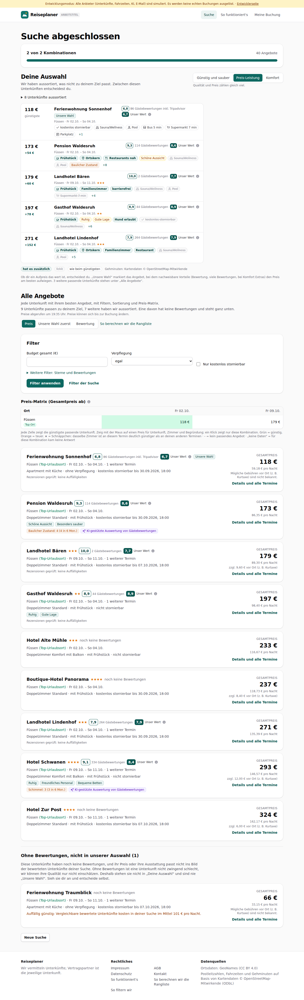
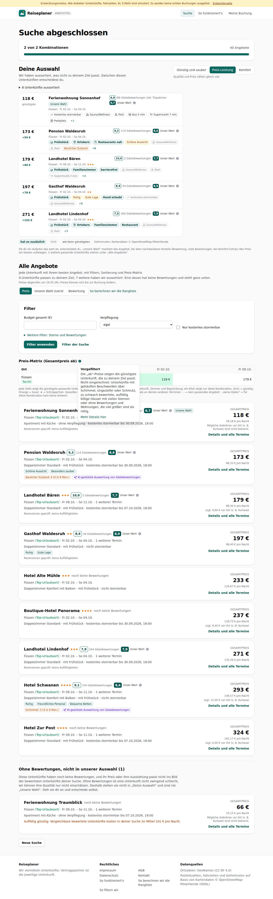
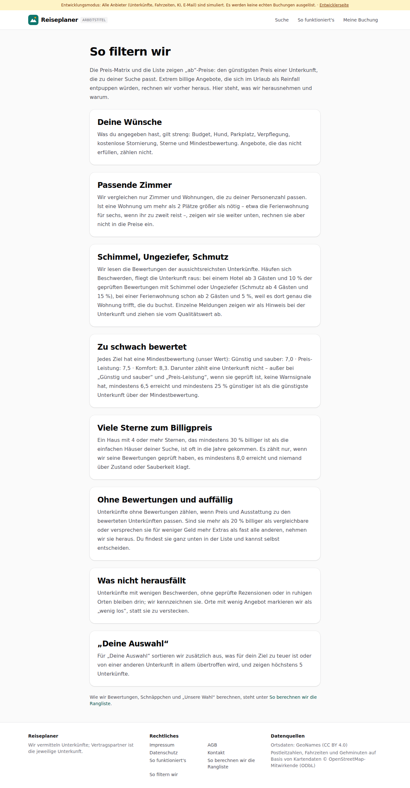

# Dogfood-Walkthrough 2026-09-29T17-34-47-P-filter

- Modus: P – Pfad (Nutzerablauf mit Eingaben)
- Flows: filter
- Basis-URL: http://localhost:33021 (echter lokaler Stack, Anbieter im Fake-Modus)
- Stand: 4bc6687, gestartet 2026-09-29T17:34:47.596Z
- Ergebnis: ✅ bestanden (12/12 Prüfungen erfüllt)

## Flow „filter“

Info-Symbol an der Preis-Matrix: beim Draufhalten kurzer Hinweis, dass vorgefiltert wurde und was, mit Link „Mehr Details hier“ auf die Seite „So filtern wir“.

### 01 Ergebnisse: „i“ neben der Preis-Matrix, Hinweis nicht dauerhaft sichtbar

- URL: `/suche/7c37d98f-1047-42c4-99bf-798c91ec61bd#t=2SyvNEjJYWGb_lJRmmMVoUam9TCrWKLCHEoS_uLApeA`
- Screenshot: 
- Prüfungen:
  - [x] enthält „Preis-Matrix (Gesamtpreis ab)“
  - [x] enthält nicht „Nicht eingerechnet“
  - [x] Element `[data-testid="matrix-filter-info"]` vorhanden (1)
- Überschriften: „Suche abgeschlossen“, „Deine Auswahl“, „Alle Angebote“
- KI-Kennzeichnungen (`data-ai-provenance`): „KI-gestützte Auswertung von Gästebewertungen [ai_assisted]“, „KI-gestützte Auswertung von Gästebewertungen [ai_assisted]“
- Konsolenfehler: keine
- Fehlgeschlagene Anfragen: keine

<details><summary>Sichtbarer Text</summary>

```text
Entwicklungsmodus: Alle Anbieter (Unterkünfte, Fahrzeiten, KI, E-Mail) sind simuliert. Es werden keine echten Buchungen ausgelöst. · Entwicklerseite
Reiseplaner
ARBEITSTITEL
Suche
So funktioniert's
Meine Buchung
Suche abgeschlossen

2 von 2 Kombinationen

40 Angebote

Deine Auswahl

Wir haben aussortiert, was nicht zu deinem Ziel passt. Zwischen diesen Unterkünften entscheidest du.

Günstig und sauber
Preis-Leistung
Komfort

Qualität und Preis zählen gleich viel.

8 Unterkünfte aussortiert
118 €
günstigste
Ferienwohnung Sonnenhof
Unsere Wahl
6,8
86 Gästebewertungen inkl. Tripadvisor
6,7
Unser Wert

Füssen · Fr 02.10. – So 04.10.

kostenlos stornierbar
Sauna/Wellness
Pool
Bus 5 min
Supermarkt 7 min
Parkplatz
+1
173 €
+54 €
Pension Waldesruh
9,3
114 Gästebewertungen
8,6
Unser Wert

Füssen · Fr 02.10. – So 04.10.

Frühstück
Ortskern
Restaurants nah
Schöne Aussicht
Sauna/Wellness
Pool
Baulicher Zustand
+8
179 €
+60 €
Landhotel Bären
10,0
2 Gästebewertungen
7,7
Unser Wert

Füssen · Fr 09.10. – So 11.10.★★★

Frühstück
Familienzimmer
barrierefrei
Sauna/Wellness
Pool
Supermarkt 7 min
+4
197 €
+78 €
Gasthof Waldesruh
8,9
44 Gästebewertungen
8,9
Unser Wert

Füssen · Fr 02.10. – So 04.10.★★

Frühstück
Ruhig
Gute Lage
Hund erlaubt
kostenlos stornierbar
Sauna/Wellness
+6
271 €
+152 €
Landhotel Lindenhof
7,9
264 Gästebewertungen
7,9
Unser Wert

Füssen · Fr 02.10. – So 04.10.★★★

Frühstück
Ortskern
Familienzimmer
Restaurant
Sauna/Wellness
Pool
+5
hat es zusätzlich
fehlt
wie beim günstigsten
Gehminuten: Kartendaten © OpenStreetMap-Mitwirkende

Ob dir ein Aufpreis das wert ist, entscheidest du. „Unsere Wahl“ markiert das Angebot, bei dem nachweisbare Vorteile (Bewertung, viele Bewertungen, bei Komfort Extras) den Preis am besten aufwiegen. 3 weitere passende Unterkünfte stehen unter „Al
… (5265 weitere Zeichen)
```

</details>

### 02 Maus auf das „i“

- URL: `/suche/7c37d98f-1047-42c4-99bf-798c91ec61bd#t=2SyvNEjJYWGb_lJRmmMVoUam9TCrWKLCHEoS_uLApeA`
- Screenshot: 
- Prüfungen:
  - [x] enthält „Vorgefiltert“
  - [x] enthält „Nicht eingerechnet“
  - [x] enthält „Schimmel“
  - [x] enthält „Mehr Details hier“
- Überschriften: „Suche abgeschlossen“, „Deine Auswahl“, „Alle Angebote“
- KI-Kennzeichnungen (`data-ai-provenance`): „KI-gestützte Auswertung von Gästebewertungen [ai_assisted]“, „KI-gestützte Auswertung von Gästebewertungen [ai_assisted]“
- Konsolenfehler: keine
- Fehlgeschlagene Anfragen: keine

<details><summary>Sichtbarer Text</summary>

```text
Entwicklungsmodus: Alle Anbieter (Unterkünfte, Fahrzeiten, KI, E-Mail) sind simuliert. Es werden keine echten Buchungen ausgelöst. · Entwicklerseite
Reiseplaner
ARBEITSTITEL
Suche
So funktioniert's
Meine Buchung
Suche abgeschlossen

2 von 2 Kombinationen

40 Angebote

Deine Auswahl

Wir haben aussortiert, was nicht zu deinem Ziel passt. Zwischen diesen Unterkünften entscheidest du.

Günstig und sauber
Preis-Leistung
Komfort

Qualität und Preis zählen gleich viel.

8 Unterkünfte aussortiert
118 €
günstigste
Ferienwohnung Sonnenhof
Unsere Wahl
6,8
86 Gästebewertungen inkl. Tripadvisor
6,7
Unser Wert

Füssen · Fr 02.10. – So 04.10.

kostenlos stornierbar
Sauna/Wellness
Pool
Bus 5 min
Supermarkt 7 min
Parkplatz
+1
173 €
+54 €
Pension Waldesruh
9,3
114 Gästebewertungen
8,6
Unser Wert

Füssen · Fr 02.10. – So 04.10.

Frühstück
Ortskern
Restaurants nah
Schöne Aussicht
Sauna/Wellness
Pool
Baulicher Zustand
+8
179 €
+60 €
Landhotel Bären
10,0
2 Gästebewertungen
7,7
Unser Wert

Füssen · Fr 09.10. – So 11.10.★★★

Frühstück
Familienzimmer
barrierefrei
Sauna/Wellness
Pool
Supermarkt 7 min
+4
197 €
+78 €
Gasthof Waldesruh
8,9
44 Gästebewertungen
8,9
Unser Wert

Füssen · Fr 02.10. – So 04.10.★★

Frühstück
Ruhig
Gute Lage
Hund erlaubt
kostenlos stornierbar
Sauna/Wellness
+6
271 €
+152 €
Landhotel Lindenhof
7,9
264 Gästebewertungen
7,9
Unser Wert

Füssen · Fr 02.10. – So 04.10.★★★

Frühstück
Ortskern
Familienzimmer
Restaurant
Sauna/Wellness
Pool
+5
hat es zusätzlich
fehlt
wie beim günstigsten
Gehminuten: Kartendaten © OpenStreetMap-Mitwirkende

Ob dir ein Aufpreis das wert ist, entscheidest du. „Unsere Wahl“ markiert das Angebot, bei dem nachweisbare Vorteile (Bewertung, viele Bewertungen, bei Komfort Extras) den Preis am besten aufwiegen. 3 weitere passende Unterkünfte stehen unter „Al
… (5605 weitere Zeichen)
```

</details>

### 03 „Mehr Details hier“ → Seite „So filtern wir“

- URL: `/so-filtern-wir`
- Screenshot: 
- Prüfungen:
  - [x] enthält „So filtern wir“
  - [x] enthält „Schimmel, Ungeziefer, Schmutz“
  - [x] enthält „Zu schwach bewertet“
  - [x] enthält „Viele Sterne zum Billigpreis“
  - [x] enthält „Was nicht herausfällt“
- Überschriften: „So filtern wir“, „Deine Wünsche“, „Passende Zimmer“, „Schimmel, Ungeziefer, Schmutz“, „Zu schwach bewertet“, „Viele Sterne zum Billigpreis“, „Ohne Bewertungen und auffällig“, „Was nicht herausfällt“, „„Deine Auswahl““
- KI-Kennzeichnungen (`data-ai-provenance`): keine
- Konsolenfehler: keine
- Fehlgeschlagene Anfragen: keine

<details><summary>Sichtbarer Text</summary>

```text
Entwicklungsmodus: Alle Anbieter (Unterkünfte, Fahrzeiten, KI, E-Mail) sind simuliert. Es werden keine echten Buchungen ausgelöst. · Entwicklerseite
Reiseplaner
ARBEITSTITEL
Suche
So funktioniert's
Meine Buchung
So filtern wir

Die Preis-Matrix und die Liste zeigen „ab“-Preise: den günstigsten Preis einer Unterkunft, die zu deiner Suche passt. Extrem billige Angebote, die sich im Urlaub als Reinfall entpuppen würden, rechnen wir vorher heraus. Hier steht, was wir herausnehmen und warum.

Deine Wünsche

Was du angegeben hast, gilt streng: Budget, Hund, Parkplatz, Verpflegung, kostenlose Stornierung, Sterne und Mindestbewertung. Angebote, die das nicht erfüllen, zählen nicht.

Passende Zimmer

Wir vergleichen nur Zimmer und Wohnungen, die zu deiner Personenzahl passen. Ist eine Wohnung um mehr als 2 Plätze größer als nötig – etwa die Ferienwohnung für sechs, wenn ihr zu zweit reist –, zeigen wir sie weiter unten, rechnen sie aber nicht in die Preise ein.

Schimmel, Ungeziefer, Schmutz

Wir lesen die Bewertungen der aussichtsreichsten Unterkünfte. Häufen sich Beschwerden, fliegt die Unterkunft raus: bei einem Hotel ab 3 Gästen und 10 % der geprüften Bewertungen mit Schimmel oder Ungeziefer (Schmutz ab 4 Gästen und 15 %), bei einer Ferienwohnung schon ab 2 Gästen und 5 %, weil es dort genau die Wohnung trifft, die du buchst. Einzelne Meldungen zeigen wir als Hinweis bei der Unterkunft und ziehen sie vom Qualitätswert ab.

Zu schwach bewertet

Jedes Ziel hat eine Mindestbewertung (unser Wert): Günstig und sauber: 7,0 · Preis-Leistung: 7,5 · Komfort: 8,3. Darunter zählt eine Unterkunft nicht – außer bei „Günstig und sauber“ und „Preis-Leistung“, wenn sie geprüft ist, keine Warnsignale hat, mindestens 6,5 erreicht und mindestens 25 % günstiger ist als die günstigste Unterkunft
… (1555 weitere Zeichen)
```

</details>

