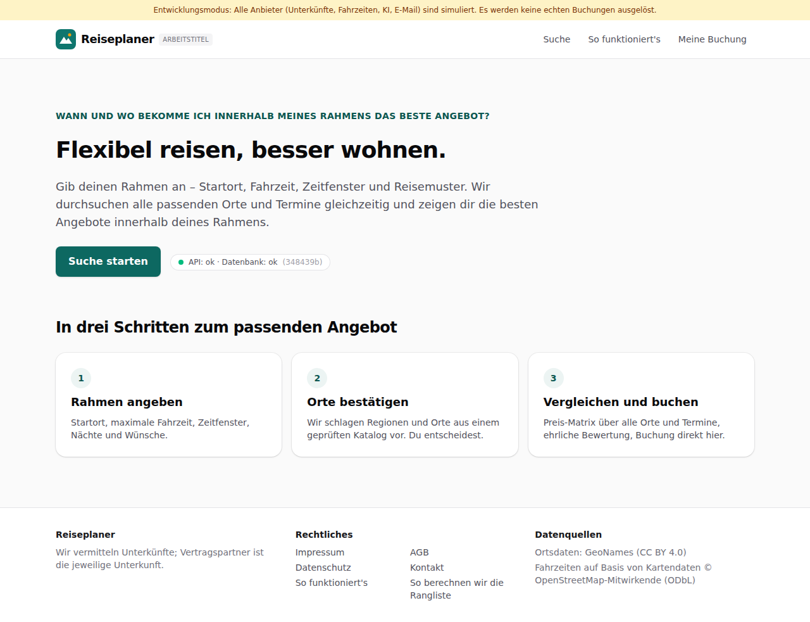

# Dogfood-Walkthrough 2026-09-27T04-23-44-R-start

- Modus: R – Rundgang (erster Besuch, nur Navigation)
- Flows: start
- Basis-URL: http://localhost:45619 (echter lokaler Stack, Anbieter im Fake-Modus)
- Stand: 348439b, gestartet 2026-09-27T04:23:44.904Z
- Ergebnis: ✅ bestanden (8/8 Prüfungen erfüllt)

## Flow „start“

Erster Besuch der Startseite: Die Statuszeile belegt den Pfad Browser → Worker → Datenbank.

### 01 Startseite

- URL: `/`
- Screenshot: 
- Prüfungen:
  - [x] enthält „API: ok · Datenbank: ok“
  - [x] enthält „Suche starten“
  - [x] enthält „Impressum“
  - [x] enthält „Datenschutz“
  - [x] enthält „AGB“
  - [x] enthält „Kontakt“
  - [x] Element `[data-testid="site-footer"]` vorhanden (1)
  - [x] Element `[data-testid="attribution"]` vorhanden (1)
- Überschriften: „Flexibel reisen, besser wohnen.“, „In drei Schritten zum passenden Angebot“
- KI-Kennzeichnungen (`data-ai-provenance`): keine
- Konsolenfehler: keine
- Fehlgeschlagene Anfragen: keine

<details><summary>Sichtbarer Text</summary>

```text
Entwicklungsmodus: Alle Anbieter (Unterkünfte, Fahrzeiten, KI, E-Mail) sind simuliert. Es werden keine echten Buchungen ausgelöst.
Reiseplaner
ARBEITSTITEL
Suche
So funktioniert's
Meine Buchung

WANN UND WO BEKOMME ICH INNERHALB MEINES RAHMENS DAS BESTE ANGEBOT?

Flexibel reisen, besser wohnen.

Gib deinen Rahmen an – Startort, Fahrzeit, Zeitfenster und Reisemuster. Wir durchsuchen alle passenden Orte und Termine gleichzeitig und zeigen dir die besten Angebote innerhalb deines Rahmens.

Suche starten

API: ok · Datenbank: ok
(348439b)

In drei Schritten zum passenden Angebot
1
Rahmen angeben

Startort, maximale Fahrzeit, Zeitfenster, Nächte und Wünsche.

2
Orte bestätigen

Wir schlagen Regionen und Orte aus einem geprüften Katalog vor. Du entscheidest.

3
Vergleichen und buchen

Preis-Matrix über alle Orte und Termine, ehrliche Bewertung, Buchung direkt hier.

Reiseplaner

Wir vermitteln Unterkünfte; Vertragspartner ist die jeweilige Unterkunft.

Rechtliches

Impressum
AGB
Datenschutz
Kontakt
So funktioniert's
So berechnen wir die Rangliste

Datenquellen

Ortsdaten: GeoNames (CC BY 4.0)
Fahrzeiten auf Basis von Kartendaten © OpenStreetMap-Mitwirkende (ODbL)
```

</details>

