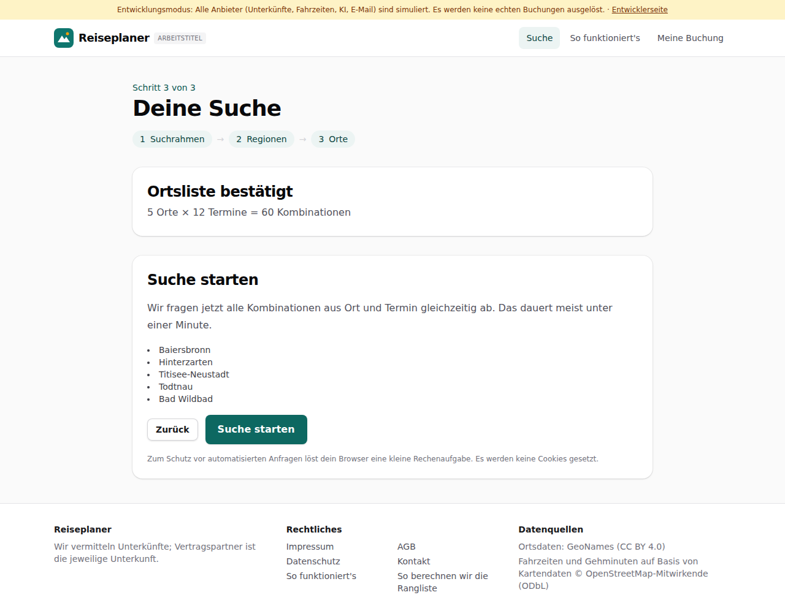
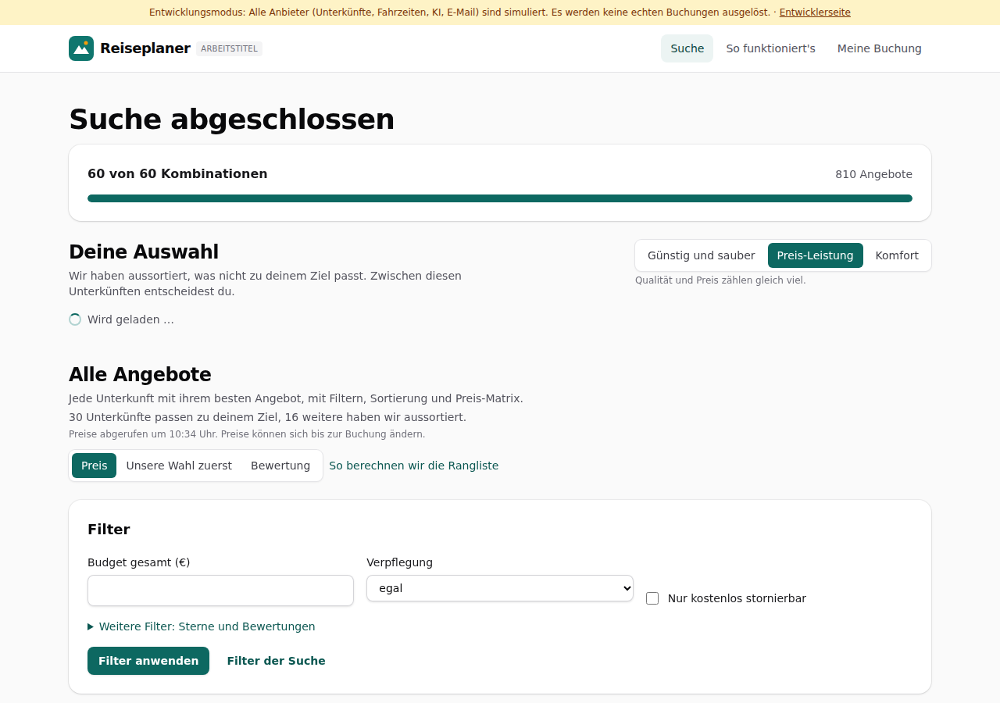

# Dogfood-Walkthrough 2026-09-29T08-33-29-P-langsam

- Modus: P – Pfad (Nutzerablauf mit Eingaben)
- Flows: langsam
- Basis-URL: http://localhost:34537 (echter lokaler Stack, Anbieter im Fake-Modus)
- Stand: fa77254, gestartet 2026-09-29T08:33:29.217Z
- Ergebnis: ✅ bestanden (5/5 Prüfungen erfüllt)

## Flow „langsam“

Suche mit langsamen Anbietern (REISEPLANER_FAKE_LATENCY_MS, z. B. 4000 wie die echte LiteAPI): 5 Orte × 12 Termine; jede Fortschrittsabfrage der Seite gelingt, keine Serverfehler, die Suche endet mit Ergebnissen.

### 01 Ortsliste bestätigt: 60 Kombinationen

- URL: `/suche`
- Screenshot: 
- Prüfungen:
  - [x] enthält „5 Orte × 12 Termine = 60 Kombinationen“
  - [x] enthält „Suche starten“
- Überschriften: „Deine Suche“, „Ortsliste bestätigt“, „Suche starten“
- KI-Kennzeichnungen (`data-ai-provenance`): keine
- Konsolenfehler: keine
- Fehlgeschlagene Anfragen: keine

<details><summary>Sichtbarer Text</summary>

```text
Entwicklungsmodus: Alle Anbieter (Unterkünfte, Fahrzeiten, KI, E-Mail) sind simuliert. Es werden keine echten Buchungen ausgelöst. · Entwicklerseite
Reiseplaner
ARBEITSTITEL
Suche
So funktioniert's
Meine Buchung

Schritt 3 von 3

Deine Suche
1
Suchrahmen
→
2
Regionen
→
3
Orte
Ortsliste bestätigt

5 Orte × 12 Termine = 60 Kombinationen

Suche starten

Wir fragen jetzt alle Kombinationen aus Ort und Termin gleichzeitig ab. Das dauert meist unter einer Minute.

Baiersbronn
Hinterzarten
Titisee-Neustadt
Todtnau
Bad Wildbad
Zurück
Suche starten

Zum Schutz vor automatisierten Anfragen löst dein Browser eine kleine Rechenaufgabe. Es werden keine Cookies gesetzt.

Reiseplaner

Wir vermitteln Unterkünfte; Vertragspartner ist die jeweilige Unterkunft.

Rechtliches

Impressum
AGB
Datenschutz
Kontakt
So funktioniert's
So berechnen wir die Rangliste

Datenquellen

Ortsdaten: GeoNames (CC BY 4.0)
Fahrzeiten und Gehminuten auf Basis von Kartendaten © OpenStreetMap-Mitwirkende (ODbL)
```

</details>

### 02 Suche mit langsamen Anbietern bis zum Ergebnis, ohne Serverfehler

- URL: `/suche/951e5d86-8779-4c2e-b58a-46b8a05988c4#t=Uh6aCNoo6AB7jlQonaxUH-H4bDVoJY8FQNhUNUkg9ok`
- Screenshot: 
- Notiz: Latenz der simulierten Anbieter: 4000 ms je Aufruf (0,5- bis 1,5-fach).
- Notiz: Bis zu den Ergebnissen: 78 s; längste Zeit ohne neue Anzeige: 22 s.
- Notiz: Fortschritt: 0 s: 0 von 60 Kombinationen → 12 s: 12 von 60 Kombinationen → 23 s: 24 von 60 Kombinationen → 33 s: 36 von 60 Kombinationen → 43 s: 48 von 60 Kombinationen → 55 s: 60 von 60 Kombinationen → 78 s: Ergebnisse
- Notiz: Serverfehler der Seite während der Suche: 0.
- Prüfungen:
  - [x] enthält „Deine Auswahl“
  - [x] enthält „Alle Angebote“
  - [x] Element `[data-testid="results"]` vorhanden (1)
- Überschriften: „Suche abgeschlossen“, „Deine Auswahl“, „Alle Angebote“
- KI-Kennzeichnungen (`data-ai-provenance`): „KI-gestützte Auswertung von Gästebewertungen [ai_assisted]“, „KI-gestützte Auswertung von Gästebewertungen [ai_assisted]“, „KI-gestützte Auswertung von Gästebewertungen [ai_assisted]“
- Konsolenfehler: keine
- Fehlgeschlagene Anfragen: keine

<details><summary>Sichtbarer Text</summary>

```text
Entwicklungsmodus: Alle Anbieter (Unterkünfte, Fahrzeiten, KI, E-Mail) sind simuliert. Es werden keine echten Buchungen ausgelöst. · Entwicklerseite
Reiseplaner
ARBEITSTITEL
Suche
So funktioniert's
Meine Buchung
Suche abgeschlossen

60 von 60 Kombinationen

810 Angebote

Deine Auswahl

Wir haben aussortiert, was nicht zu deinem Ziel passt. Zwischen diesen Unterkünften entscheidest du.

Günstig und sauber
Preis-Leistung
Komfort

Qualität und Preis zählen gleich viel.

Wird geladen …
Alle Angebote

Jede Unterkunft mit ihrem besten Angebot, mit Filtern, Sortierung und Preis-Matrix.

30 Unterkünfte passen zu deinem Ziel, 16 weitere haben wir aussortiert.

Preise abgerufen um 10:34 Uhr. Preise können sich bis zur Buchung ändern.

Sortierung
Preis
Unsere Wahl zuerst
Bewertung
So berechnen wir die Rangliste
Filter
Budget gesamt (€)
Verpflegung
egal
ohne
Frühstück
Halbpension
Vollpension
All inclusive
Nur kostenlos stornierbar
Weitere Filter: Sterne und Bewertungen
Filter anwenden
Filter der Suche
Ort	Fr 02.10.	Fr 09.10.	Fr 16.10.	Fr 23.10.	Fr 30.10.	Fr 06.11.	Fr 13.11.	Fr 20.11.	Fr 27.11.	Fr 04.12.	Fr 11.12.	Fr 18.12.
Baiersbronn	
177 €
	
★ 142 €
	
188 €
	
157 €
	
206 €
	
★ 142 €
	
149 €
	
★ 105 €
	
159 €
	
184 €
	
158 €
	
161 €

Hinterzarten	
★ 123 €
	
188 €
	
185 €
	
179 €
	
176 €
	
156 €
	
145 €
	
★ 95 €
	
142 €
	
★ 137 €
	
203 €
	
190 €

Titisee-Neustadt	
197 €
	
★ 138 €
	
211 €
	
159 €
	
161 €
	
★ 124 €
	
★ 156 €
	
★ 84 €
	
★ 158 €
	
174 €
	
168 €
	
166 €

Todtnau	
206 €
	
216 €
	
190 €
	
167 €
	
222 €
	
170 €
	
★ 154 €
	
181 €
	
★ 115 €
	
216 €
	
221 €
	
211 €

Bad Wildbad	
191 €
	
143 €
	
175 €
	
184 €
	
171 €
	
★ 136 €
	
144 €
	
★ 136 €
	
165 €
	
★ 169 €
	
186 €
	
142 €

Jede Zelle zeigt die günstigste passende Unterkunft. Zeig mit der Maus auf einen Preis für Unterkun
… (11302 weitere Zeichen)
```

</details>

