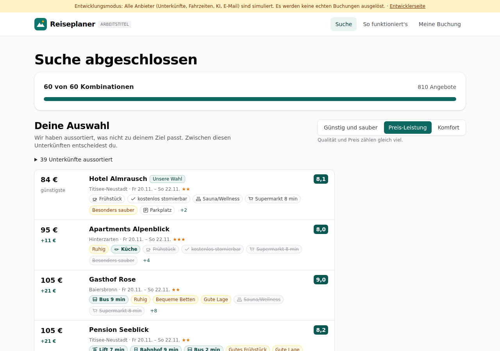

# Dogfood-Walkthrough 2026-09-29T08-31-14-P-langsam

- Modus: P – Pfad (Nutzerablauf mit Eingaben)
- Flows: langsam
- Basis-URL: http://localhost:35501 (echter lokaler Stack, Anbieter im Fake-Modus)
- Stand: fa77254, gestartet 2026-09-29T08:31:14.691Z
- Ergebnis: ❌ nicht bestanden (5/5 Prüfungen erfüllt)

## Flow „langsam“

Suche mit langsamen Anbietern (REISEPLANER_FAKE_LATENCY_MS, z. B. 4000 wie die echte LiteAPI): 5 Orte × 12 Termine; jede Fortschrittsabfrage der Seite gelingt, keine Serverfehler, die Suche endet mit Ergebnissen.

**Abbruch:** step „Suche mit langsamen Anbietern bis zum Ergebnis, ohne Serverfehler“ failed: 8 server errors during the search, e.g. 500 /api/v1/searches/9f7171aa-8813-459d-8024-866e9702c11c

### 01 Ortsliste bestätigt: 60 Kombinationen

- URL: `/suche`
- Screenshot: 
- Prüfungen:
  - [x] enthält „5 Orte × 12 Termine = 60 Kombinationen“
  - [x] enthält „Suche starten“
- Überschriften: „Deine Suche“, „Ortsliste bestätigt“, „Suche starten“
- KI-Kennzeichnungen (`data-ai-provenance`): keine
- Konsolenfehler: keine
- Fehlgeschlagene Anfragen: keine

<details><summary>Sichtbarer Text</summary>

```text
Entwicklungsmodus: Alle Anbieter (Unterkünfte, Fahrzeiten, KI, E-Mail) sind simuliert. Es werden keine echten Buchungen ausgelöst. · Entwicklerseite
Reiseplaner
ARBEITSTITEL
Suche
So funktioniert's
Meine Buchung

Schritt 3 von 3

Deine Suche
1
Suchrahmen
→
2
Regionen
→
3
Orte
Ortsliste bestätigt

5 Orte × 12 Termine = 60 Kombinationen

Suche starten

Wir fragen jetzt alle Kombinationen aus Ort und Termin gleichzeitig ab. Das dauert meist unter einer Minute.

Baiersbronn
Hinterzarten
Titisee-Neustadt
Todtnau
Bad Wildbad
Zurück
Suche starten

Zum Schutz vor automatisierten Anfragen löst dein Browser eine kleine Rechenaufgabe. Es werden keine Cookies gesetzt.

Reiseplaner

Wir vermitteln Unterkünfte; Vertragspartner ist die jeweilige Unterkunft.

Rechtliches

Impressum
AGB
Datenschutz
Kontakt
So funktioniert's
So berechnen wir die Rangliste

Datenquellen

Ortsdaten: GeoNames (CC BY 4.0)
Fahrzeiten und Gehminuten auf Basis von Kartendaten © OpenStreetMap-Mitwirkende (ODbL)
```

</details>

### 02 Suche mit langsamen Anbietern bis zum Ergebnis, ohne Serverfehler

- URL: `/suche/9f7171aa-8813-459d-8024-866e9702c11c#t=sNDeD50dYZ2LovxuXprFl_Odb2rs4rlsAo74nymgDW8`
- Screenshot: 
- **Fehler:** 8 server errors during the search, e.g. 500 /api/v1/searches/9f7171aa-8813-459d-8024-866e9702c11c
- Notiz: Latenz der simulierten Anbieter: 4000 ms je Aufruf (0,5- bis 1,5-fach).
- Notiz: Bis zu den Ergebnissen: 80 s; längste Zeit ohne neue Anzeige: 26 s.
- Notiz: Fortschritt: 22 s: 24 von 60 Kombinationen → 32 s: 36 von 60 Kombinationen → 43 s: 48 von 60 Kombinationen → 54 s: 60 von 60 Kombinationen → 80 s: Ergebnisse
- Notiz: Serverfehler der Seite während der Suche: 8 (500 /api/v1/searches/9f7171aa-8813-459d-8024-866e9702c11c).
- Prüfungen:
  - [x] enthält „Deine Auswahl“
  - [x] enthält „Alle Angebote“
  - [x] Element `[data-testid="results"]` vorhanden (1)
- Überschriften: „Suche abgeschlossen“, „Deine Auswahl“, „Alle Angebote“
- KI-Kennzeichnungen (`data-ai-provenance`): „KI-gestützte Auswertung von Gästebewertungen [ai_assisted]“, „KI-gestützte Auswertung von Gästebewertungen [ai_assisted]“, „KI-gestützte Auswertung von Gästebewertungen [ai_assisted]“
- Konsolenfehler: Failed to load resource: the server responded with a status of 500 (Internal Server Error) | Failed to load resource: the server responded with a status of 500 (Internal Server Error) | Failed to load resource: the server responded with a status of 500 (Internal Server Error) | Failed to load resource: the server responded with a status of 500 (Internal Server Error) | Failed to load resource: the server responded with a status of 500 (Internal Server Error) | Failed to load resource: the server responded with a status of 500 (Internal Server Error) | Failed to load resource: the server responded with a status of 500 (Internal Server Error) | Failed to load resource: the server responded with a status of 500 (Internal Server Error)
- Fehlgeschlagene Anfragen: 500 /api/v1/searches/9f7171aa-8813-459d-8024-866e9702c11c | 500 /api/v1/searches/9f7171aa-8813-459d-8024-866e9702c11c | 500 /api/v1/searches/9f7171aa-8813-459d-8024-866e9702c11c | 500 /api/v1/searches/9f7171aa-8813-459d-8024-866e9702c11c | 500 /api/v1/searches/9f7171aa-8813-459d-8024-866e9702c11c | 500 /api/v1/searches/9f7171aa-8813-459d-8024-866e9702c11c | 500 /api/v1/searches/9f7171aa-8813-459d-8024-866e9702c11c | 500 /api/v1/searches/9f7171aa-8813-459d-8024-866e9702c11c

<details><summary>Sichtbarer Text</summary>

```text
Entwicklungsmodus: Alle Anbieter (Unterkünfte, Fahrzeiten, KI, E-Mail) sind simuliert. Es werden keine echten Buchungen ausgelöst. · Entwicklerseite
Reiseplaner
ARBEITSTITEL
Suche
So funktioniert's
Meine Buchung
Suche abgeschlossen

60 von 60 Kombinationen

810 Angebote

Deine Auswahl

Wir haben aussortiert, was nicht zu deinem Ziel passt. Zwischen diesen Unterkünften entscheidest du.

Günstig und sauber
Preis-Leistung
Komfort

Qualität und Preis zählen gleich viel.

39 Unterkünfte aussortiert
84 €
günstigste
Hotel Almrausch
Unsere Wahl
8,1

Titisee-Neustadt · Fr 20.11. – So 22.11.★★

Frühstück
kostenlos stornierbar
Sauna/Wellness
Supermarkt 8 min
Besonders sauber
Parkplatz
+2
95 €
+11 €
Apartments Alpenblick
8,0

Hinterzarten · Fr 20.11. – So 22.11.★★★

Ruhig
Küche
Frühstück
kostenlos stornierbar
Supermarkt 8 min
Besonders sauber
+4
105 €
+21 €
Gasthof Rose
9,0

Baiersbronn · Fr 20.11. – So 22.11.★★

Bus 9 min
Ruhig
Bequeme Betten
Gute Lage
Sauna/Wellness
Supermarkt 8 min
+8
105 €
+21 €
Pension Seeblick
8,2

Titisee-Neustadt · Fr 20.11. – So 22.11.★★

Lift 7 min
Bahnhof 9 min
Bus 2 min
Gutes Frühstück
Gute Lage
Besonders sauber
+9
115 €
+31 €
Landhotel Zur Post
7,8

Todtnau · Fr 27.11. – So 29.11.★★★

Lift 8 min
Bahnhof 10 min
Bus 7 min
Restaurants nah
kostenlos stornierbar
Supermarkt 8 min
+8
hat es zusätzlich
fehlt
wie beim günstigsten
Gehminuten: Kartendaten © OpenStreetMap-Mitwirkende

Ob dir ein Aufpreis das wert ist, entscheidest du. „Unsere Wahl“ markiert das Angebot, bei dem nachweisbare Vorteile (Bewertung, viele Bewertungen, bei Komfort Extras) den Preis am besten aufwiegen. 2 weitere passende Unterkünfte stehen unter „Alle Angebote“.

Alle Angebote

Jede Unterkunft mit ihrem besten Angebot, mit Filtern, Sortierung und Preis-Matrix.

30 Unterkünfte passen zu 
… (12490 weitere Zeichen)
```

</details>

