# Dogfood-Walkthrough 2026-09-29T08-48-08-P-all

- Modus: P – Pfad (Nutzerablauf mit Eingaben)
- Flows: suchrahmen, suche, ergebnisse, finale, warnungen, buchung, entwickler, langsam
- Basis-URL: http://localhost:46493 (echter lokaler Stack, Anbieter im Fake-Modus)
- Stand: fa77254, gestartet 2026-09-29T08:48:08.226Z
- Ergebnis: ✅ bestanden (227/227 Prüfungen erfüllt)

## Flow „suchrahmen“

Assistent Schritt 1 bis 3 (F1–F3): Startort per Autovervollständigung, Zeitfenster mit Live-Terminanzahl, Freitext per KI in Chips, Regionsvorschläge mit Begründung, Ortsliste mit Fahrzeiten, eigener Ort, Bestätigung.

### 01 Suchrahmen öffnen

- URL: `/suche`
- Screenshot: 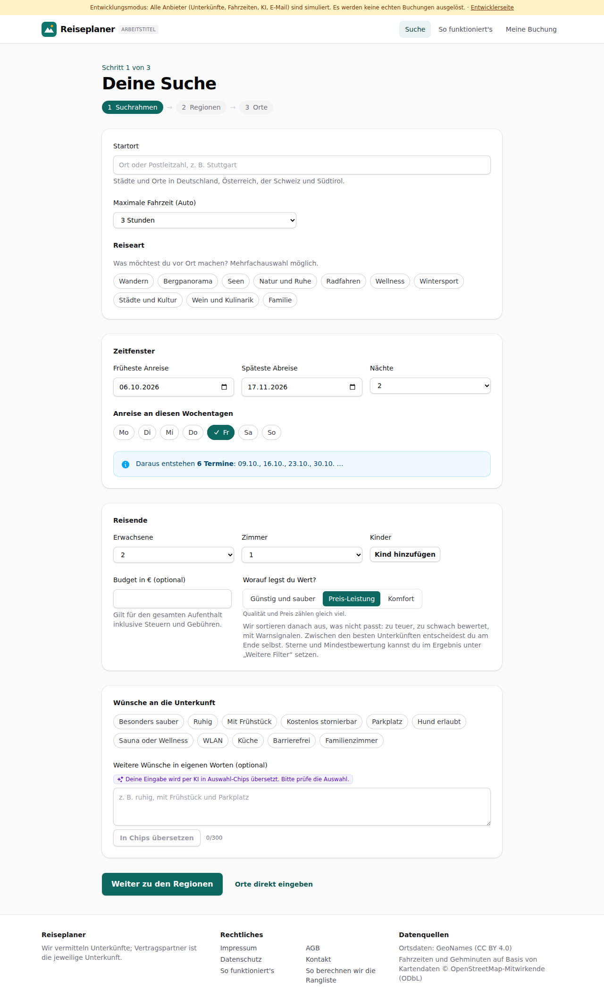
- Prüfungen:
  - [x] enthält „Schritt“
  - [x] enthält „Suchrahmen“
  - [x] enthält „Regionen“
  - [x] enthält „Orte“
  - [x] enthält „Startort“
  - [x] enthält „Reiseart“
  - [x] enthält „Zeitfenster“
- Überschriften: „Deine Suche“
- KI-Kennzeichnungen (`data-ai-provenance`): „Deine Eingabe wird per KI in Auswahl-Chips übersetzt. Bitte prüfe die Auswahl. [ai_assisted]“
- Konsolenfehler: keine
- Fehlgeschlagene Anfragen: keine

<details><summary>Sichtbarer Text</summary>

```text
Entwicklungsmodus: Alle Anbieter (Unterkünfte, Fahrzeiten, KI, E-Mail) sind simuliert. Es werden keine echten Buchungen ausgelöst. · Entwicklerseite
Reiseplaner
ARBEITSTITEL
Suche
So funktioniert's
Meine Buchung

Schritt 1 von 3

Deine Suche
1
Suchrahmen
→
2
Regionen
→
3
Orte
Startort

Städte und Orte in Deutschland, Österreich, der Schweiz und Südtirol.

Maximale Fahrzeit (Auto)
Keine Begrenzung
1 Stunde
1 h 30 min
2 Stunden
2 h 30 min
3 Stunden
4 Stunden
5 Stunden
6 Stunden
Reiseart

Was möchtest du vor Ort machen? Mehrfachauswahl möglich.

Wandern
Bergpanorama
Seen
Natur und Ruhe
Radfahren
Wellness
Wintersport
Städte und Kultur
Wein und Kulinarik
Familie
Zeitfenster
Früheste Anreise
Späteste Abreise
Nächte
1
2
3
4
5
6
7
8
9
10
11
12
13
14
Anreise an diesen Wochentagen
Mo
Di
Mi
Do
Fr
Sa
So
Daraus entstehen 6 Termine: 09.10., 16.10., 23.10., 30.10. …
Reisende
Erwachsene
1
2
3
4
5
6
Zimmer
1
2
3
4
5
Kinder
Kind hinzufügen
Budget in € (optional)

Gilt für den gesamten Aufenthalt inklusive Steuern und Gebühren.

Worauf legst du Wert?

Günstig und sauber
Preis-Leistung
Komfort

Qualität und Preis zählen gleich viel.

Wir sortieren danach aus, was nicht passt: zu teuer, zu schwach bewertet, mit Warnsignalen. Zwischen den besten Unterkünften entscheidest du am Ende selbst. Sterne und Mindestbewertung kannst du im Ergebnis unter „Weitere Filter“ setzen.

Wünsche an die Unterkunft
Besonders sauber
Ruhig
Mit Frühstück
Kostenlos stornierbar
Parkplatz
Hund erlaubt
Sauna oder Wellness
WLAN
Küche
Barrierefrei
Familienzimmer
Weitere Wünsche in eigenen Worten (optional)
Deine Eingabe wird per KI in Auswahl-Chips übersetzt. Bitte prüfe die Auswahl.
In Chips übersetzen
0/300
Weiter zu den Regionen
Orte direkt eingeben

Reiseplaner

Wir vermitteln Unterkünfte; Vertragspartner ist die je
… (250 weitere Zeichen)
```

</details>

### 02 Startort „Stutt“ → Stuttgart

- URL: `/suche`
- Screenshot: 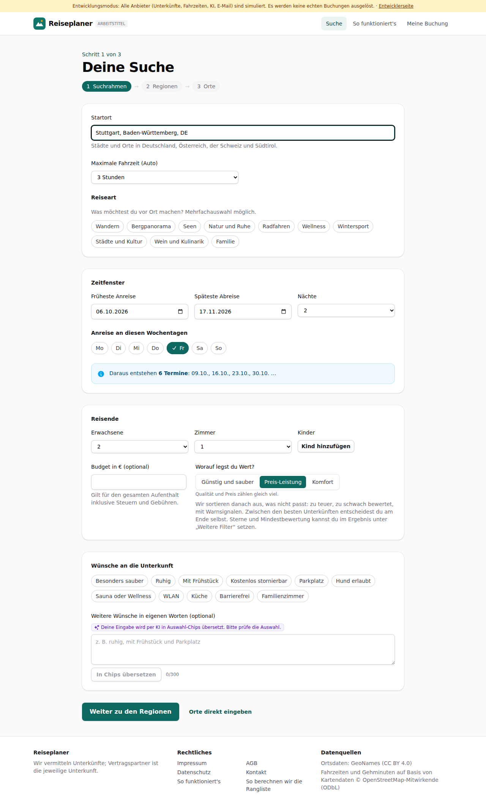
- Prüfungen:
  - [x] Element `[data-origin="2825297"]` vorhanden (1)
- Überschriften: „Deine Suche“
- KI-Kennzeichnungen (`data-ai-provenance`): „Deine Eingabe wird per KI in Auswahl-Chips übersetzt. Bitte prüfe die Auswahl. [ai_assisted]“
- Konsolenfehler: keine
- Fehlgeschlagene Anfragen: keine

<details><summary>Sichtbarer Text</summary>

```text
Entwicklungsmodus: Alle Anbieter (Unterkünfte, Fahrzeiten, KI, E-Mail) sind simuliert. Es werden keine echten Buchungen ausgelöst. · Entwicklerseite
Reiseplaner
ARBEITSTITEL
Suche
So funktioniert's
Meine Buchung

Schritt 1 von 3

Deine Suche
1
Suchrahmen
→
2
Regionen
→
3
Orte
Startort

Städte und Orte in Deutschland, Österreich, der Schweiz und Südtirol.

Maximale Fahrzeit (Auto)
Keine Begrenzung
1 Stunde
1 h 30 min
2 Stunden
2 h 30 min
3 Stunden
4 Stunden
5 Stunden
6 Stunden
Reiseart

Was möchtest du vor Ort machen? Mehrfachauswahl möglich.

Wandern
Bergpanorama
Seen
Natur und Ruhe
Radfahren
Wellness
Wintersport
Städte und Kultur
Wein und Kulinarik
Familie
Zeitfenster
Früheste Anreise
Späteste Abreise
Nächte
1
2
3
4
5
6
7
8
9
10
11
12
13
14
Anreise an diesen Wochentagen
Mo
Di
Mi
Do
Fr
Sa
So
Daraus entstehen 6 Termine: 09.10., 16.10., 23.10., 30.10. …
Reisende
Erwachsene
1
2
3
4
5
6
Zimmer
1
2
3
4
5
Kinder
Kind hinzufügen
Budget in € (optional)

Gilt für den gesamten Aufenthalt inklusive Steuern und Gebühren.

Worauf legst du Wert?

Günstig und sauber
Preis-Leistung
Komfort

Qualität und Preis zählen gleich viel.

Wir sortieren danach aus, was nicht passt: zu teuer, zu schwach bewertet, mit Warnsignalen. Zwischen den besten Unterkünften entscheidest du am Ende selbst. Sterne und Mindestbewertung kannst du im Ergebnis unter „Weitere Filter“ setzen.

Wünsche an die Unterkunft
Besonders sauber
Ruhig
Mit Frühstück
Kostenlos stornierbar
Parkplatz
Hund erlaubt
Sauna oder Wellness
WLAN
Küche
Barrierefrei
Familienzimmer
Weitere Wünsche in eigenen Worten (optional)
Deine Eingabe wird per KI in Auswahl-Chips übersetzt. Bitte prüfe die Auswahl.
In Chips übersetzen
0/300
Weiter zu den Regionen
Orte direkt eingeben

Reiseplaner

Wir vermitteln Unterkünfte; Vertragspartner ist die je
… (250 weitere Zeichen)
```

</details>

### 03 Zeitfenster 01.10.–30.11.2026, 2 Nächte, Anreise Freitag, Wandern

- URL: `/suche`
- Screenshot: 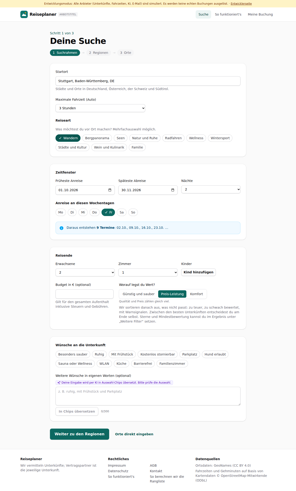
- Prüfungen:
  - [x] enthält „9 Termine“
  - [x] enthält „02.10.“
  - [x] enthält „Fr“
- Überschriften: „Deine Suche“
- KI-Kennzeichnungen (`data-ai-provenance`): „Deine Eingabe wird per KI in Auswahl-Chips übersetzt. Bitte prüfe die Auswahl. [ai_assisted]“
- Konsolenfehler: keine
- Fehlgeschlagene Anfragen: keine

<details><summary>Sichtbarer Text</summary>

```text
Entwicklungsmodus: Alle Anbieter (Unterkünfte, Fahrzeiten, KI, E-Mail) sind simuliert. Es werden keine echten Buchungen ausgelöst. · Entwicklerseite
Reiseplaner
ARBEITSTITEL
Suche
So funktioniert's
Meine Buchung

Schritt 1 von 3

Deine Suche
1
Suchrahmen
→
2
Regionen
→
3
Orte
Startort

Städte und Orte in Deutschland, Österreich, der Schweiz und Südtirol.

Maximale Fahrzeit (Auto)
Keine Begrenzung
1 Stunde
1 h 30 min
2 Stunden
2 h 30 min
3 Stunden
4 Stunden
5 Stunden
6 Stunden
Reiseart

Was möchtest du vor Ort machen? Mehrfachauswahl möglich.

Wandern
Bergpanorama
Seen
Natur und Ruhe
Radfahren
Wellness
Wintersport
Städte und Kultur
Wein und Kulinarik
Familie
Zeitfenster
Früheste Anreise
Späteste Abreise
Nächte
1
2
3
4
5
6
7
8
9
10
11
12
13
14
Anreise an diesen Wochentagen
Mo
Di
Mi
Do
Fr
Sa
So
Daraus entstehen 9 Termine: 02.10., 09.10., 16.10., 23.10. …
Reisende
Erwachsene
1
2
3
4
5
6
Zimmer
1
2
3
4
5
Kinder
Kind hinzufügen
Budget in € (optional)

Gilt für den gesamten Aufenthalt inklusive Steuern und Gebühren.

Worauf legst du Wert?

Günstig und sauber
Preis-Leistung
Komfort

Qualität und Preis zählen gleich viel.

Wir sortieren danach aus, was nicht passt: zu teuer, zu schwach bewertet, mit Warnsignalen. Zwischen den besten Unterkünften entscheidest du am Ende selbst. Sterne und Mindestbewertung kannst du im Ergebnis unter „Weitere Filter“ setzen.

Wünsche an die Unterkunft
Besonders sauber
Ruhig
Mit Frühstück
Kostenlos stornierbar
Parkplatz
Hund erlaubt
Sauna oder Wellness
WLAN
Küche
Barrierefrei
Familienzimmer
Weitere Wünsche in eigenen Worten (optional)
Deine Eingabe wird per KI in Auswahl-Chips übersetzt. Bitte prüfe die Auswahl.
In Chips übersetzen
0/300
Weiter zu den Regionen
Orte direkt eingeben

Reiseplaner

Wir vermitteln Unterkünfte; Vertragspartner ist die je
… (250 weitere Zeichen)
```

</details>

### 04 Zu viele Termine → verständliche Meldung

- URL: `/suche`
- Screenshot: 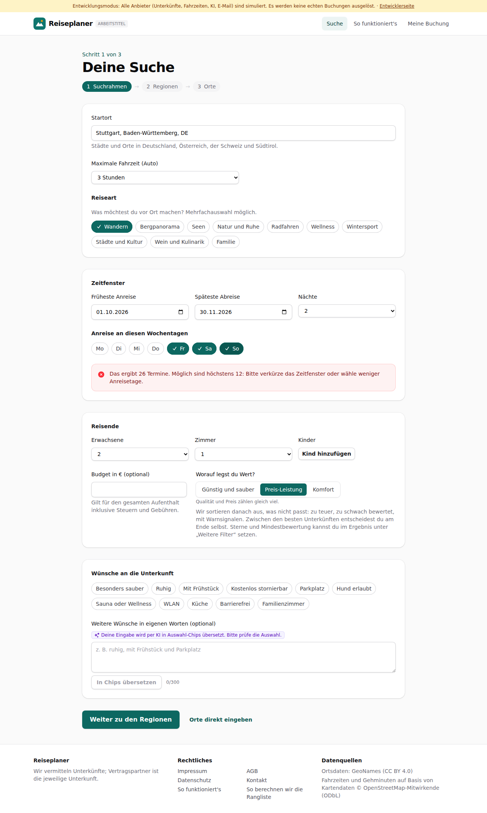
- Notiz: Mit Fr, Sa und So entstehen zu viele Termine; danach wieder nur Freitag.
- Prüfungen:
  - [x] enthält „Möglich sind höchstens 12“
- Überschriften: „Deine Suche“
- KI-Kennzeichnungen (`data-ai-provenance`): „Deine Eingabe wird per KI in Auswahl-Chips übersetzt. Bitte prüfe die Auswahl. [ai_assisted]“
- Konsolenfehler: keine
- Fehlgeschlagene Anfragen: keine

<details><summary>Sichtbarer Text</summary>

```text
Entwicklungsmodus: Alle Anbieter (Unterkünfte, Fahrzeiten, KI, E-Mail) sind simuliert. Es werden keine echten Buchungen ausgelöst. · Entwicklerseite
Reiseplaner
ARBEITSTITEL
Suche
So funktioniert's
Meine Buchung

Schritt 1 von 3

Deine Suche
1
Suchrahmen
→
2
Regionen
→
3
Orte
Startort

Städte und Orte in Deutschland, Österreich, der Schweiz und Südtirol.

Maximale Fahrzeit (Auto)
Keine Begrenzung
1 Stunde
1 h 30 min
2 Stunden
2 h 30 min
3 Stunden
4 Stunden
5 Stunden
6 Stunden
Reiseart

Was möchtest du vor Ort machen? Mehrfachauswahl möglich.

Wandern
Bergpanorama
Seen
Natur und Ruhe
Radfahren
Wellness
Wintersport
Städte und Kultur
Wein und Kulinarik
Familie
Zeitfenster
Früheste Anreise
Späteste Abreise
Nächte
1
2
3
4
5
6
7
8
9
10
11
12
13
14
Anreise an diesen Wochentagen
Mo
Di
Mi
Do
Fr
Sa
So
Das ergibt 26 Termine. Möglich sind höchstens 12: Bitte verkürze das Zeitfenster oder wähle weniger Anreisetage.
Reisende
Erwachsene
1
2
3
4
5
6
Zimmer
1
2
3
4
5
Kinder
Kind hinzufügen
Budget in € (optional)

Gilt für den gesamten Aufenthalt inklusive Steuern und Gebühren.

Worauf legst du Wert?

Günstig und sauber
Preis-Leistung
Komfort

Qualität und Preis zählen gleich viel.

Wir sortieren danach aus, was nicht passt: zu teuer, zu schwach bewertet, mit Warnsignalen. Zwischen den besten Unterkünften entscheidest du am Ende selbst. Sterne und Mindestbewertung kannst du im Ergebnis unter „Weitere Filter“ setzen.

Wünsche an die Unterkunft
Besonders sauber
Ruhig
Mit Frühstück
Kostenlos stornierbar
Parkplatz
Hund erlaubt
Sauna oder Wellness
WLAN
Küche
Barrierefrei
Familienzimmer
Weitere Wünsche in eigenen Worten (optional)
Deine Eingabe wird per KI in Auswahl-Chips übersetzt. Bitte prüfe die Auswahl.
In Chips übersetzen
0/300
Weiter zu den Regionen
Orte direkt eingeben

Reiseplaner

Wi
… (302 weitere Zeichen)
```

</details>

### 05 Freitext per KI in Chips übersetzen

- URL: `/suche`
- Screenshot: 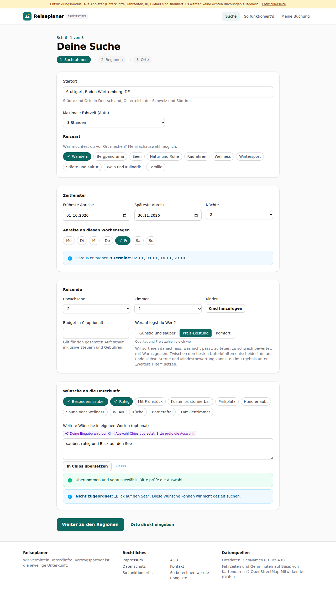
- Prüfungen:
  - [x] enthält „Nicht zugeordnet:“
  - [x] enthält „„Blick auf den See““
  - [x] enthält „Deine Eingabe wird per KI in Auswahl-Chips übersetzt“
  - [x] Element `[data-ai-provenance]` vorhanden (1)
  - [x] Element `[data-testid="wish-chips"] button[aria-pressed="true"]:has-text("Besonders sauber")` vorhanden (1)
  - [x] Element `[data-testid="wish-chips"] button[aria-pressed="true"]:has-text("Ruhig")` vorhanden (1)
- Überschriften: „Deine Suche“
- KI-Kennzeichnungen (`data-ai-provenance`): „Deine Eingabe wird per KI in Auswahl-Chips übersetzt. Bitte prüfe die Auswahl. [ai_assisted]“
- Konsolenfehler: keine
- Fehlgeschlagene Anfragen: keine

<details><summary>Sichtbarer Text</summary>

```text
Entwicklungsmodus: Alle Anbieter (Unterkünfte, Fahrzeiten, KI, E-Mail) sind simuliert. Es werden keine echten Buchungen ausgelöst. · Entwicklerseite
Reiseplaner
ARBEITSTITEL
Suche
So funktioniert's
Meine Buchung

Schritt 1 von 3

Deine Suche
1
Suchrahmen
→
2
Regionen
→
3
Orte
Startort

Städte und Orte in Deutschland, Österreich, der Schweiz und Südtirol.

Maximale Fahrzeit (Auto)
Keine Begrenzung
1 Stunde
1 h 30 min
2 Stunden
2 h 30 min
3 Stunden
4 Stunden
5 Stunden
6 Stunden
Reiseart

Was möchtest du vor Ort machen? Mehrfachauswahl möglich.

Wandern
Bergpanorama
Seen
Natur und Ruhe
Radfahren
Wellness
Wintersport
Städte und Kultur
Wein und Kulinarik
Familie
Zeitfenster
Früheste Anreise
Späteste Abreise
Nächte
1
2
3
4
5
6
7
8
9
10
11
12
13
14
Anreise an diesen Wochentagen
Mo
Di
Mi
Do
Fr
Sa
So
Daraus entstehen 9 Termine: 02.10., 09.10., 16.10., 23.10. …
Reisende
Erwachsene
1
2
3
4
5
6
Zimmer
1
2
3
4
5
Kinder
Kind hinzufügen
Budget in € (optional)

Gilt für den gesamten Aufenthalt inklusive Steuern und Gebühren.

Worauf legst du Wert?

Günstig und sauber
Preis-Leistung
Komfort

Qualität und Preis zählen gleich viel.

Wir sortieren danach aus, was nicht passt: zu teuer, zu schwach bewertet, mit Warnsignalen. Zwischen den besten Unterkünften entscheidest du am Ende selbst. Sterne und Mindestbewertung kannst du im Ergebnis unter „Weitere Filter“ setzen.

Wünsche an die Unterkunft
Besonders sauber
Ruhig
Mit Frühstück
Kostenlos stornierbar
Parkplatz
Hund erlaubt
Sauna oder Wellness
WLAN
Küche
Barrierefrei
Familienzimmer
Weitere Wünsche in eigenen Worten (optional)
Deine Eingabe wird per KI in Auswahl-Chips übersetzt. Bitte prüfe die Auswahl.
In Chips übersetzen
35/300
Übernommen und vorausgewählt. Bitte prüfe die Auswahl.
Nicht zugeordnet: „Blick auf den See“. Diese Wünsche kön
… (392 weitere Zeichen)
```

</details>

### 06 Regionsvorschläge mit Begründung

- URL: `/suche`
- Screenshot: 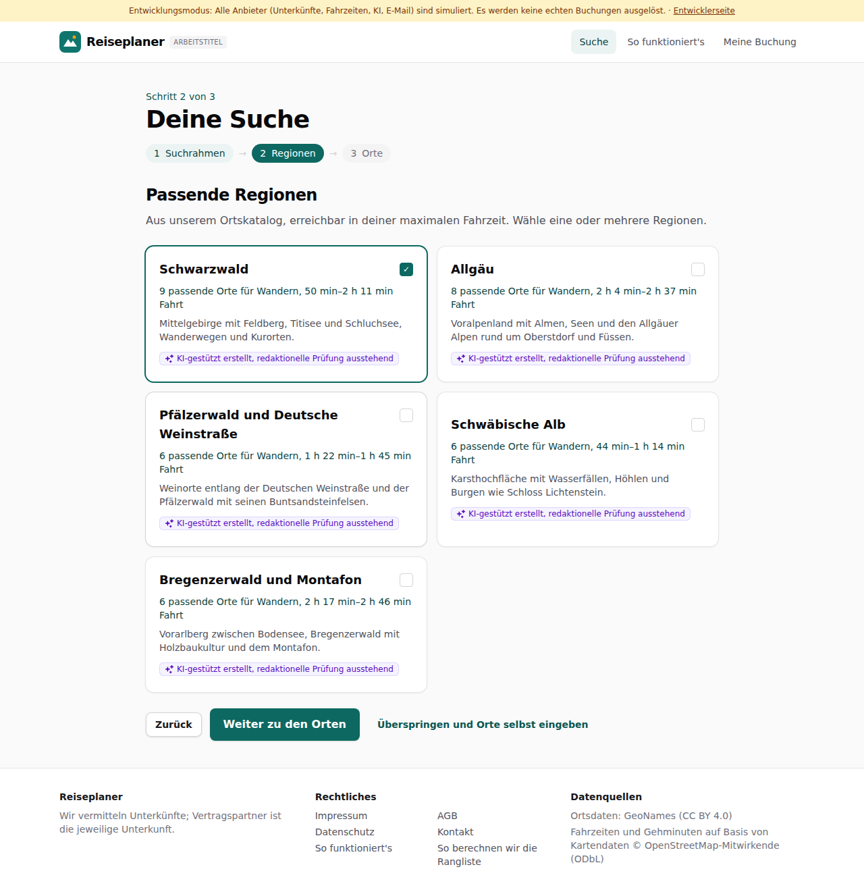
- Prüfungen:
  - [x] enthält „Passende Regionen“
  - [x] enthält „passende Orte für Wandern“
  - [x] enthält „Fahrt“
  - [x] enthält „Weiter zu den Orten“
  - [x] Element `[data-testid="region-card"]` vorhanden (5)
  - [x] Element `[data-ai-provenance]` vorhanden (5)
- Überschriften: „Deine Suche“, „Passende Regionen“
- KI-Kennzeichnungen (`data-ai-provenance`): „KI-gestützt erstellt, redaktionelle Prüfung ausstehend [ai_assisted]“, „KI-gestützt erstellt, redaktionelle Prüfung ausstehend [ai_assisted]“, „KI-gestützt erstellt, redaktionelle Prüfung ausstehend [ai_assisted]“, „KI-gestützt erstellt, redaktionelle Prüfung ausstehend [ai_assisted]“, „KI-gestützt erstellt, redaktionelle Prüfung ausstehend [ai_assisted]“
- Konsolenfehler: keine
- Fehlgeschlagene Anfragen: keine

<details><summary>Sichtbarer Text</summary>

```text
Entwicklungsmodus: Alle Anbieter (Unterkünfte, Fahrzeiten, KI, E-Mail) sind simuliert. Es werden keine echten Buchungen ausgelöst. · Entwicklerseite
Reiseplaner
ARBEITSTITEL
Suche
So funktioniert's
Meine Buchung

Schritt 2 von 3

Deine Suche
1
Suchrahmen
→
2
Regionen
→
3
Orte
Passende Regionen

Aus unserem Ortskatalog, erreichbar in deiner maximalen Fahrzeit. Wähle eine oder mehrere Regionen.

Schwarzwald
✓

9 passende Orte für Wandern, 50 min–2 h 11 min Fahrt

Mittelgebirge mit Feldberg, Titisee und Schluchsee, Wanderwegen und Kurorten.

KI-gestützt erstellt, redaktionelle Prüfung ausstehend
Allgäu

8 passende Orte für Wandern, 2 h 4 min–2 h 37 min Fahrt

Voralpenland mit Almen, Seen und den Allgäuer Alpen rund um Oberstdorf und Füssen.

KI-gestützt erstellt, redaktionelle Prüfung ausstehend
Pfälzerwald und Deutsche Weinstraße

6 passende Orte für Wandern, 1 h 22 min–1 h 45 min Fahrt

Weinorte entlang der Deutschen Weinstraße und der Pfälzerwald mit seinen Buntsandsteinfelsen.

KI-gestützt erstellt, redaktionelle Prüfung ausstehend
Schwäbische Alb

6 passende Orte für Wandern, 44 min–1 h 14 min Fahrt

Karsthochfläche mit Wasserfällen, Höhlen und Burgen wie Schloss Lichtenstein.

KI-gestützt erstellt, redaktionelle Prüfung ausstehend
Bregenzerwald und Montafon

6 passende Orte für Wandern, 2 h 17 min–2 h 46 min Fahrt

Vorarlberg zwischen Bodensee, Bregenzerwald mit Holzbaukultur und dem Montafon.

KI-gestützt erstellt, redaktionelle Prüfung ausstehend
Zurück
Weiter zu den Orten
Überspringen und Orte selbst eingeben

Reiseplaner

Wir vermitteln Unterkünfte; Vertragspartner ist die jeweilige Unterkunft.

Rechtliches

Impressum
AGB
Datenschutz
Kontakt
So funktioniert's
So berechnen wir die Rangliste

Datenquellen

Ortsdaten: GeoNames (CC BY 4.0)
Fahrzeiten und Gehminuten a
… (59 weitere Zeichen)
```

</details>

### 07 Ortsliste mit Fahrzeiten

- URL: `/suche`
- Screenshot: 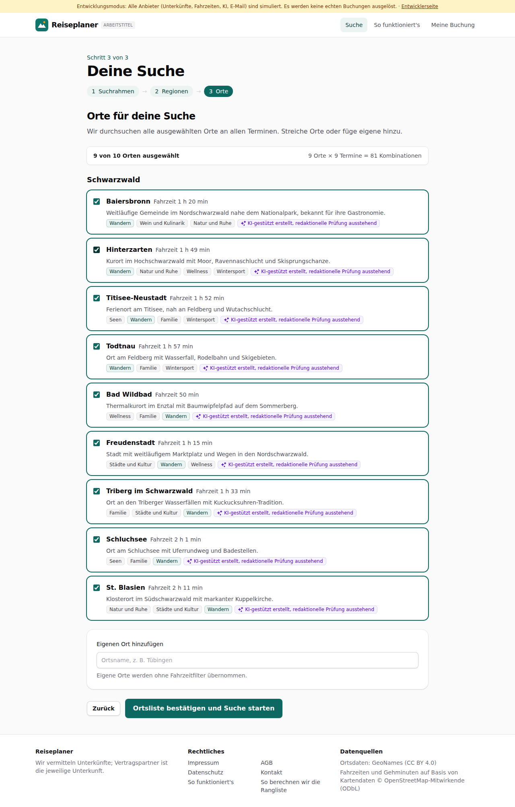
- Notiz: 5 Regionen vorgeschlagen.
- Prüfungen:
  - [x] enthält „Orte für deine Suche“
  - [x] enthält „Fahrzeit“
  - [x] enthält „von 10 Orten ausgewählt“
  - [x] enthält „Kombinationen“
- Überschriften: „Deine Suche“, „Orte für deine Suche“
- KI-Kennzeichnungen (`data-ai-provenance`): „KI-gestützt erstellt, redaktionelle Prüfung ausstehend [ai_assisted]“, „KI-gestützt erstellt, redaktionelle Prüfung ausstehend [ai_assisted]“, „KI-gestützt erstellt, redaktionelle Prüfung ausstehend [ai_assisted]“, „KI-gestützt erstellt, redaktionelle Prüfung ausstehend [ai_assisted]“, „KI-gestützt erstellt, redaktionelle Prüfung ausstehend [ai_assisted]“, „KI-gestützt erstellt, redaktionelle Prüfung ausstehend [ai_assisted]“, „KI-gestützt erstellt, redaktionelle Prüfung ausstehend [ai_assisted]“, „KI-gestützt erstellt, redaktionelle Prüfung ausstehend [ai_assisted]“, „KI-gestützt erstellt, redaktionelle Prüfung ausstehend [ai_assisted]“
- Konsolenfehler: keine
- Fehlgeschlagene Anfragen: keine

<details><summary>Sichtbarer Text</summary>

```text
Entwicklungsmodus: Alle Anbieter (Unterkünfte, Fahrzeiten, KI, E-Mail) sind simuliert. Es werden keine echten Buchungen ausgelöst. · Entwicklerseite
Reiseplaner
ARBEITSTITEL
Suche
So funktioniert's
Meine Buchung

Schritt 3 von 3

Deine Suche
1
Suchrahmen
→
2
Regionen
→
3
Orte
Orte für deine Suche

Wir durchsuchen alle ausgewählten Orte an allen Terminen. Streiche Orte oder füge eigene hinzu.

9 von 10 Orten ausgewählt
9 Orte × 9 Termine = 81 Kombinationen
Schwarzwald
Baiersbronn
Fahrzeit 1 h 20 min

Weitläufige Gemeinde im Nordschwarzwald nahe dem Nationalpark, bekannt für ihre Gastronomie.

Wandern
Wein und Kulinarik
Natur und Ruhe
KI-gestützt erstellt, redaktionelle Prüfung ausstehend
Hinterzarten
Fahrzeit 1 h 49 min

Kurort im Hochschwarzwald mit Moor, Ravennaschlucht und Skisprungschanze.

Wandern
Natur und Ruhe
Wellness
Wintersport
KI-gestützt erstellt, redaktionelle Prüfung ausstehend
Titisee-Neustadt
Fahrzeit 1 h 52 min

Ferienort am Titisee, nah an Feldberg und Wutachschlucht.

Seen
Wandern
Familie
Wintersport
KI-gestützt erstellt, redaktionelle Prüfung ausstehend
Todtnau
Fahrzeit 1 h 57 min

Ort am Feldberg mit Wasserfall, Rodelbahn und Skigebieten.

Wandern
Familie
Wintersport
KI-gestützt erstellt, redaktionelle Prüfung ausstehend
Bad Wildbad
Fahrzeit 50 min

Thermalkurort im Enztal mit Baumwipfelpfad auf dem Sommerberg.

Wellness
Familie
Wandern
KI-gestützt erstellt, redaktionelle Prüfung ausstehend
Freudenstadt
Fahrzeit 1 h 15 min

Stadt mit weitläufigem Marktplatz und Wegen in den Nordschwarzwald.

Städte und Kultur
Wandern
Wellness
KI-gestützt erstellt, redaktionelle Prüfung ausstehend
Triberg im Schwarzwald
Fahrzeit 1 h 33 min

Ort an den Triberger Wasserfällen mit Kuckucksuhren-Tradition.

Familie
Städte und Kultur
Wandern
KI-gestützt erstellt, redaktion
… (810 weitere Zeichen)
```

</details>

### 08 Eigenen Ort hinzufügen (Tübingen)

- URL: `/suche`
- Screenshot: 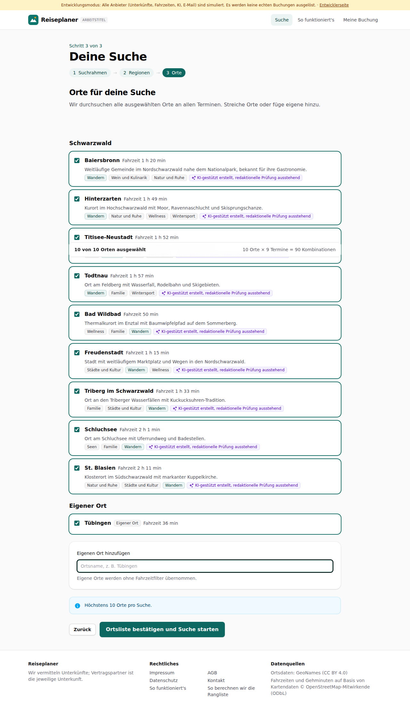
- Prüfungen:
  - [x] enthält „Tübingen“
  - [x] enthält „Eigener Ort“
- Überschriften: „Deine Suche“, „Orte für deine Suche“
- KI-Kennzeichnungen (`data-ai-provenance`): „KI-gestützt erstellt, redaktionelle Prüfung ausstehend [ai_assisted]“, „KI-gestützt erstellt, redaktionelle Prüfung ausstehend [ai_assisted]“, „KI-gestützt erstellt, redaktionelle Prüfung ausstehend [ai_assisted]“, „KI-gestützt erstellt, redaktionelle Prüfung ausstehend [ai_assisted]“, „KI-gestützt erstellt, redaktionelle Prüfung ausstehend [ai_assisted]“, „KI-gestützt erstellt, redaktionelle Prüfung ausstehend [ai_assisted]“, „KI-gestützt erstellt, redaktionelle Prüfung ausstehend [ai_assisted]“, „KI-gestützt erstellt, redaktionelle Prüfung ausstehend [ai_assisted]“, „KI-gestützt erstellt, redaktionelle Prüfung ausstehend [ai_assisted]“
- Konsolenfehler: keine
- Fehlgeschlagene Anfragen: keine

<details><summary>Sichtbarer Text</summary>

```text
Entwicklungsmodus: Alle Anbieter (Unterkünfte, Fahrzeiten, KI, E-Mail) sind simuliert. Es werden keine echten Buchungen ausgelöst. · Entwicklerseite
Reiseplaner
ARBEITSTITEL
Suche
So funktioniert's
Meine Buchung

Schritt 3 von 3

Deine Suche
1
Suchrahmen
→
2
Regionen
→
3
Orte
Orte für deine Suche

Wir durchsuchen alle ausgewählten Orte an allen Terminen. Streiche Orte oder füge eigene hinzu.

10 von 10 Orten ausgewählt
10 Orte × 9 Termine = 90 Kombinationen
Schwarzwald
Baiersbronn
Fahrzeit 1 h 20 min

Weitläufige Gemeinde im Nordschwarzwald nahe dem Nationalpark, bekannt für ihre Gastronomie.

Wandern
Wein und Kulinarik
Natur und Ruhe
KI-gestützt erstellt, redaktionelle Prüfung ausstehend
Hinterzarten
Fahrzeit 1 h 49 min

Kurort im Hochschwarzwald mit Moor, Ravennaschlucht und Skisprungschanze.

Wandern
Natur und Ruhe
Wellness
Wintersport
KI-gestützt erstellt, redaktionelle Prüfung ausstehend
Titisee-Neustadt
Fahrzeit 1 h 52 min

Ferienort am Titisee, nah an Feldberg und Wutachschlucht.

Seen
Wandern
Familie
Wintersport
KI-gestützt erstellt, redaktionelle Prüfung ausstehend
Todtnau
Fahrzeit 1 h 57 min

Ort am Feldberg mit Wasserfall, Rodelbahn und Skigebieten.

Wandern
Familie
Wintersport
KI-gestützt erstellt, redaktionelle Prüfung ausstehend
Bad Wildbad
Fahrzeit 50 min

Thermalkurort im Enztal mit Baumwipfelpfad auf dem Sommerberg.

Wellness
Familie
Wandern
KI-gestützt erstellt, redaktionelle Prüfung ausstehend
Freudenstadt
Fahrzeit 1 h 15 min

Stadt mit weitläufigem Marktplatz und Wegen in den Nordschwarzwald.

Städte und Kultur
Wandern
Wellness
KI-gestützt erstellt, redaktionelle Prüfung ausstehend
Triberg im Schwarzwald
Fahrzeit 1 h 33 min

Ort an den Triberger Wasserfällen mit Kuckucksuhren-Tradition.

Familie
Städte und Kultur
Wandern
KI-gestützt erstellt, redakti
… (890 weitere Zeichen)
```

</details>

### 09 Ortsliste bestätigen

- URL: `/suche`
- Screenshot: 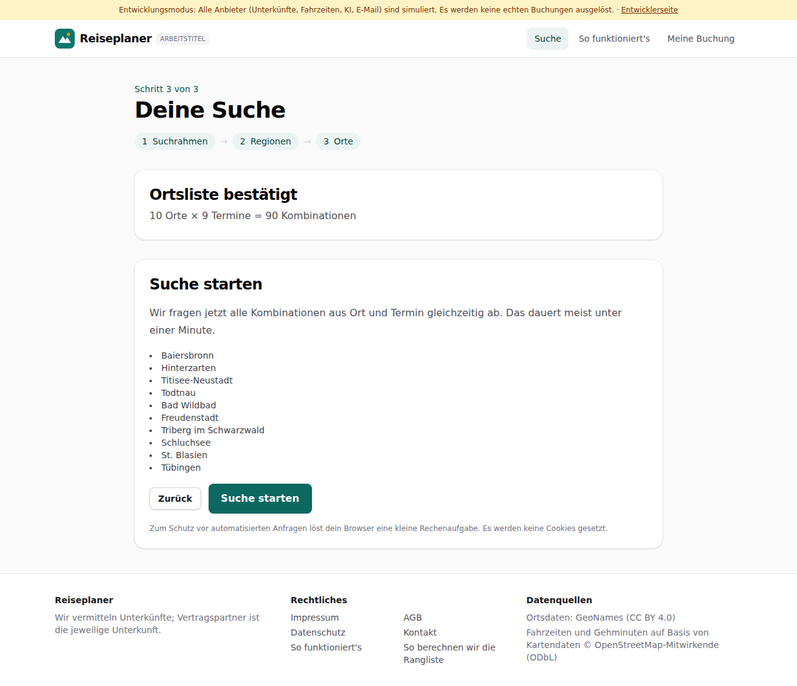
- Prüfungen:
  - [x] enthält „Ortsliste bestätigt“
  - [x] enthält „Kombinationen“
- Überschriften: „Deine Suche“, „Ortsliste bestätigt“, „Suche starten“
- KI-Kennzeichnungen (`data-ai-provenance`): keine
- Konsolenfehler: keine
- Fehlgeschlagene Anfragen: keine

<details><summary>Sichtbarer Text</summary>

```text
Entwicklungsmodus: Alle Anbieter (Unterkünfte, Fahrzeiten, KI, E-Mail) sind simuliert. Es werden keine echten Buchungen ausgelöst. · Entwicklerseite
Reiseplaner
ARBEITSTITEL
Suche
So funktioniert's
Meine Buchung

Schritt 3 von 3

Deine Suche
1
Suchrahmen
→
2
Regionen
→
3
Orte
Ortsliste bestätigt

10 Orte × 9 Termine = 90 Kombinationen

Suche starten

Wir fragen jetzt alle Kombinationen aus Ort und Termin gleichzeitig ab. Das dauert meist unter einer Minute.

Baiersbronn
Hinterzarten
Titisee-Neustadt
Todtnau
Bad Wildbad
Freudenstadt
Triberg im Schwarzwald
Schluchsee
St. Blasien
Tübingen
Zurück
Suche starten

Zum Schutz vor automatisierten Anfragen löst dein Browser eine kleine Rechenaufgabe. Es werden keine Cookies gesetzt.

Reiseplaner

Wir vermitteln Unterkünfte; Vertragspartner ist die jeweilige Unterkunft.

Rechtliches

Impressum
AGB
Datenschutz
Kontakt
So funktioniert's
So berechnen wir die Rangliste

Datenquellen

Ortsdaten: GeoNames (CC BY 4.0)
Fahrzeiten und Gehminuten auf Basis von Kartendaten © OpenStreetMap-Mitwirkende (ODbL)
```

</details>

## Flow „suche“

Kombinationssuche (F4): 5 Orte × 12 Termine, Start mit ALTCHA im Browser, Fortschritt „x von 60“, Matrix füllt sich live, Hinweis bei Teilergebnissen.

### 10 Ortsliste bestätigt: 60 Kombinationen

- URL: `/suche`
- Screenshot: 
- Prüfungen:
  - [x] enthält „Ortsliste bestätigt“
  - [x] enthält „5 Orte × 12 Termine = 60 Kombinationen“
  - [x] enthält „Suche starten“
  - [x] enthält „Rechenaufgabe“
- Überschriften: „Deine Suche“, „Ortsliste bestätigt“, „Suche starten“
- KI-Kennzeichnungen (`data-ai-provenance`): keine
- Konsolenfehler: keine
- Fehlgeschlagene Anfragen: keine

<details><summary>Sichtbarer Text</summary>

```text
Entwicklungsmodus: Alle Anbieter (Unterkünfte, Fahrzeiten, KI, E-Mail) sind simuliert. Es werden keine echten Buchungen ausgelöst. · Entwicklerseite
Reiseplaner
ARBEITSTITEL
Suche
So funktioniert's
Meine Buchung

Schritt 3 von 3

Deine Suche
1
Suchrahmen
→
2
Regionen
→
3
Orte
Ortsliste bestätigt

5 Orte × 12 Termine = 60 Kombinationen

Suche starten

Wir fragen jetzt alle Kombinationen aus Ort und Termin gleichzeitig ab. Das dauert meist unter einer Minute.

Baiersbronn
Hinterzarten
Titisee-Neustadt
Todtnau
Bad Wildbad
Zurück
Suche starten

Zum Schutz vor automatisierten Anfragen löst dein Browser eine kleine Rechenaufgabe. Es werden keine Cookies gesetzt.

Reiseplaner

Wir vermitteln Unterkünfte; Vertragspartner ist die jeweilige Unterkunft.

Rechtliches

Impressum
AGB
Datenschutz
Kontakt
So funktioniert's
So berechnen wir die Rangliste

Datenquellen

Ortsdaten: GeoNames (CC BY 4.0)
Fahrzeiten und Gehminuten auf Basis von Kartendaten © OpenStreetMap-Mitwirkende (ODbL)
```

</details>

### 11 Suche gestartet: Fortschritt und Matrix mit Platzhaltern

- URL: `/suche/8a970bd8-41fa-4267-aeb9-631d48a051ac#t=FNzYe2NI_yqXtYhiL7fDLUJfuBtdvejbocAApPqctaU`
- Screenshot: 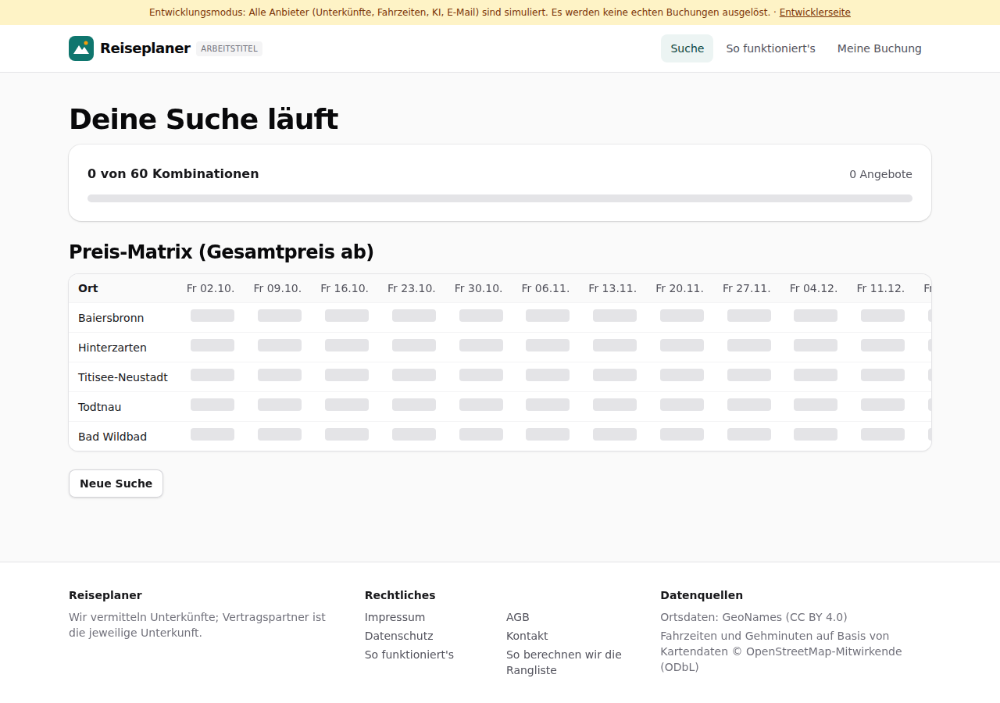
- Prüfungen:
  - [x] enthält „Kombinationen“
  - [x] enthält „Preis-Matrix“
  - [x] Element `[data-testid="matrix"]` vorhanden (1)
  - [x] Element `[role="progressbar"]` vorhanden (1)
- Überschriften: „Deine Suche läuft“, „Preis-Matrix (Gesamtpreis ab)“
- KI-Kennzeichnungen (`data-ai-provenance`): keine
- Konsolenfehler: keine
- Fehlgeschlagene Anfragen: keine

<details><summary>Sichtbarer Text</summary>

```text
Entwicklungsmodus: Alle Anbieter (Unterkünfte, Fahrzeiten, KI, E-Mail) sind simuliert. Es werden keine echten Buchungen ausgelöst. · Entwicklerseite
Reiseplaner
ARBEITSTITEL
Suche
So funktioniert's
Meine Buchung
Deine Suche läuft

0 von 60 Kombinationen

0 Angebote

Preis-Matrix (Gesamtpreis ab)
Ort	Fr 02.10.	Fr 09.10.	Fr 16.10.	Fr 23.10.	Fr 30.10.	Fr 06.11.	Fr 13.11.	Fr 20.11.	Fr 27.11.	Fr 04.12.	Fr 11.12.	Fr 18.12.
Baiersbronn												
Hinterzarten												
Titisee-Neustadt												
Todtnau												
Bad Wildbad												
Neue Suche

Reiseplaner

Wir vermitteln Unterkünfte; Vertragspartner ist die jeweilige Unterkunft.

Rechtliches

Impressum
AGB
Datenschutz
Kontakt
So funktioniert's
So berechnen wir die Rangliste

Datenquellen

Ortsdaten: GeoNames (CC BY 4.0)
Fahrzeiten und Gehminuten auf Basis von Kartendaten © OpenStreetMap-Mitwirkende (ODbL)
```

</details>

### 12 Suche abgeschlossen: 60 von 60, Matrix gefüllt

- URL: `/suche/8a970bd8-41fa-4267-aeb9-631d48a051ac#t=FNzYe2NI_yqXtYhiL7fDLUJfuBtdvejbocAApPqctaU`
- Screenshot: 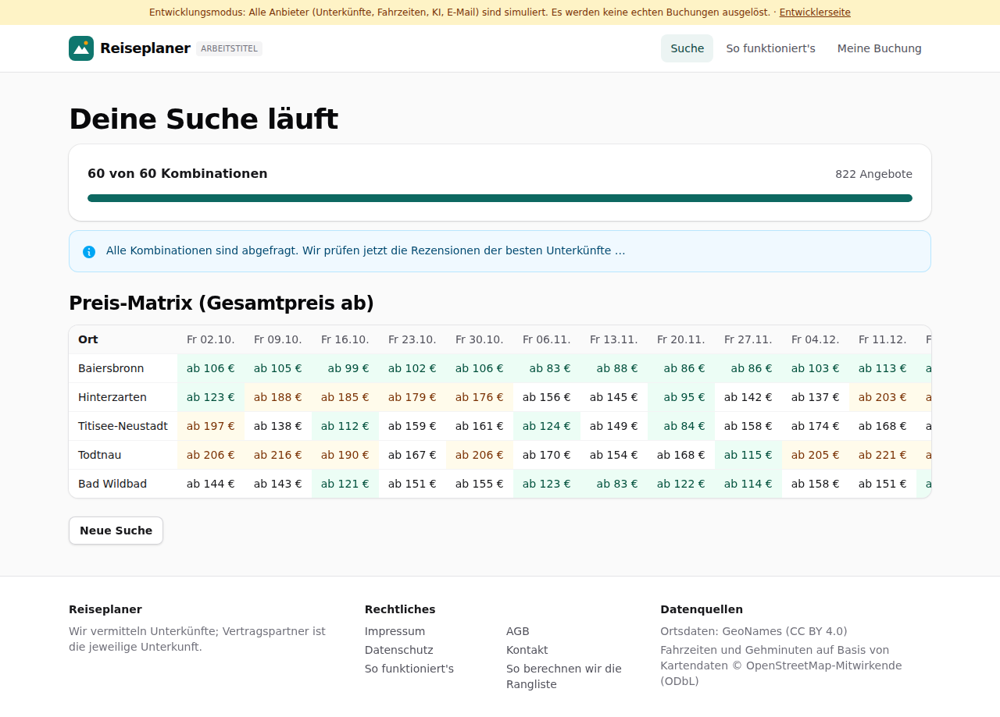
- Notiz: Matrix: 60 Zellen mit Angebot, 0 ohne Daten.
- Prüfungen:
  - [x] enthält „60 von 60 Kombinationen“
  - [x] enthält „Angebote“
  - [x] enthält „ab “
  - [x] enthält nicht „wird gesucht“
  - [x] Element `[data-testid="matrix"] td[data-state="offer"]` vorhanden (60)
- Überschriften: „Deine Suche läuft“, „Preis-Matrix (Gesamtpreis ab)“
- KI-Kennzeichnungen (`data-ai-provenance`): keine
- Konsolenfehler: keine
- Fehlgeschlagene Anfragen: keine

<details><summary>Sichtbarer Text</summary>

```text
Entwicklungsmodus: Alle Anbieter (Unterkünfte, Fahrzeiten, KI, E-Mail) sind simuliert. Es werden keine echten Buchungen ausgelöst. · Entwicklerseite
Reiseplaner
ARBEITSTITEL
Suche
So funktioniert's
Meine Buchung
Deine Suche läuft

60 von 60 Kombinationen

822 Angebote

Alle Kombinationen sind abgefragt. Wir prüfen jetzt die Rezensionen der besten Unterkünfte …
Preis-Matrix (Gesamtpreis ab)
Ort	Fr 02.10.	Fr 09.10.	Fr 16.10.	Fr 23.10.	Fr 30.10.	Fr 06.11.	Fr 13.11.	Fr 20.11.	Fr 27.11.	Fr 04.12.	Fr 11.12.	Fr 18.12.
Baiersbronn	ab 106 €	ab 105 €	ab 99 €	ab 102 €	ab 106 €	ab 83 €	ab 88 €	ab 86 €	ab 86 €	ab 103 €	ab 113 €	ab 116 €
Hinterzarten	ab 123 €	ab 188 €	ab 185 €	ab 179 €	ab 176 €	ab 156 €	ab 145 €	ab 95 €	ab 142 €	ab 137 €	ab 203 €	ab 190 €
Titisee-Neustadt	ab 197 €	ab 138 €	ab 112 €	ab 159 €	ab 161 €	ab 124 €	ab 149 €	ab 84 €	ab 158 €	ab 174 €	ab 168 €	ab 163 €
Todtnau	ab 206 €	ab 216 €	ab 190 €	ab 167 €	ab 206 €	ab 170 €	ab 154 €	ab 168 €	ab 115 €	ab 205 €	ab 221 €	ab 211 €
Bad Wildbad	ab 144 €	ab 143 €	ab 121 €	ab 151 €	ab 155 €	ab 123 €	ab 83 €	ab 122 €	ab 114 €	ab 158 €	ab 151 €	ab 107 €
Neue Suche

Reiseplaner

Wir vermitteln Unterkünfte; Vertragspartner ist die jeweilige Unterkunft.

Rechtliches

Impressum
AGB
Datenschutz
Kontakt
So funktioniert's
So berechnen wir die Rangliste

Datenquellen

Ortsdaten: GeoNames (CC BY 4.0)
Fahrzeiten und Gehminuten auf Basis von Kartendaten © OpenStreetMap-Mitwirkende (ODbL)
```

</details>

## Flow „ergebnisse“

Ergebnisse (F5, F7, F9, F10, Akzeptanzbeispiel 1): Suche Stuttgart, 5 Orte × 9 Freitage; Matrix mit Farbstufen und Hinweis beim Draufhalten (Unterkunft, Zimmer, Schnäppchen-Begründung), Liste mit Schnäppchen-Begründung, Sortierung, Zellfilter, Filter ohne neue Suche, aussortierte Unterkünfte ohne Bewertungen unten, Detailansicht mit Score-Aufschlüsselung und lesbaren deutschen Texten, Seite zur Rangliste.

### 13 Suche 5 Orte × 9 Termine gestartet und abgeschlossen

- URL: `/suche/f43edafc-d621-4bf9-886d-137194d9ef1a#t=XWjlMcwaqV01P2L5vdgg3McYdFKi1qT2sOpr_cYZfRE`
- Screenshot: 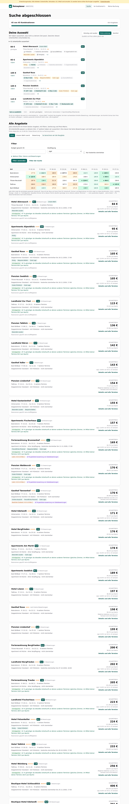
- Prüfungen:
  - [x] enthält „45 von 45 Kombinationen“
  - [x] enthält „Deine Auswahl“
  - [x] enthält „Alle Angebote“
  - [x] enthält „Preise abgerufen um“
  - [x] enthält „Unsere Wahl zuerst“
  - [x] enthält „So berechnen wir die Rangliste“
  - [x] enthält „pro Nacht“
  - [x] enthält „Schnäppchen“
  - [x] enthält „dasselbe Zimmer“
  - [x] Element `[data-testid="result-matrix"]` vorhanden (1)
  - [x] Element `[data-testid="bargain-reason"]` vorhanden (15)
  - [x] Element `[data-testid="result-filters"]` vorhanden (1)
- Überschriften: „Suche abgeschlossen“, „Deine Auswahl“, „Alle Angebote“
- KI-Kennzeichnungen (`data-ai-provenance`): „KI-gestützte Auswertung von Gästebewertungen [ai_assisted]“, „KI-gestützte Auswertung von Gästebewertungen [ai_assisted]“, „KI-gestützte Auswertung von Gästebewertungen [ai_assisted]“
- Konsolenfehler: keine
- Fehlgeschlagene Anfragen: keine

<details><summary>Sichtbarer Text</summary>

```text
Entwicklungsmodus: Alle Anbieter (Unterkünfte, Fahrzeiten, KI, E-Mail) sind simuliert. Es werden keine echten Buchungen ausgelöst. · Entwicklerseite
Reiseplaner
ARBEITSTITEL
Suche
So funktioniert's
Meine Buchung
Suche abgeschlossen

45 von 45 Kombinationen

614 Angebote

Deine Auswahl

Wir haben aussortiert, was nicht zu deinem Ziel passt. Zwischen diesen Unterkünften entscheidest du.

Günstig und sauber
Preis-Leistung
Komfort

Qualität und Preis zählen gleich viel.

41 Unterkünfte aussortiert
84 €
günstigste
Hotel Almrausch
Unsere Wahl
8,1

Titisee-Neustadt · Fr 20.11. – So 22.11.★★

Frühstück
kostenlos stornierbar
Sauna/Wellness
Supermarkt 8 min
Besonders sauber
Parkplatz
+2
95 €
+11 €
Apartments Alpenblick
8,0

Hinterzarten · Fr 20.11. – So 22.11.★★★

Ruhig
Küche
Frühstück
kostenlos stornierbar
Supermarkt 8 min
Besonders sauber
+4
105 €
+21 €
Gasthof Rose
9,0

Baiersbronn · Fr 20.11. – So 22.11.★★

Bus 9 min
Ruhig
Bequeme Betten
Gute Lage
Sauna/Wellness
Supermarkt 8 min
+8
105 €
+21 €
Pension Seeblick
8,2

Titisee-Neustadt · Fr 20.11. – So 22.11.★★

Lift 7 min
Bahnhof 9 min
Bus 2 min
Gutes Frühstück
Gute Lage
Besonders sauber
+9
115 €
+31 €
Landhotel Zur Post
7,8

Todtnau · Fr 27.11. – So 29.11.★★★

Lift 8 min
Bahnhof 10 min
Bus 7 min
Restaurants nah
kostenlos stornierbar
Supermarkt 8 min
+8
hat es zusätzlich
fehlt
wie beim günstigsten
Gehminuten: Kartendaten © OpenStreetMap-Mitwirkende

Ob dir ein Aufpreis das wert ist, entscheidest du. „Unsere Wahl“ markiert das Angebot, bei dem nachweisbare Vorteile (Bewertung, viele Bewertungen, bei Komfort Extras) den Preis am besten aufwiegen. 1 weitere passende Unterkunft steht unter „Alle Angebote“.

Alle Angebote

Jede Unterkunft mit ihrem besten Angebot, mit Filtern, Sortierung und Preis-Matrix.

30 Unterkünfte passen zu de
… (13218 weitere Zeichen)
```

</details>

### 14 Maus auf einen ★-Preis der Matrix: Unterkunft, Zimmer und Begründung

- URL: `/suche/f43edafc-d621-4bf9-886d-137194d9ef1a#t=XWjlMcwaqV01P2L5vdgg3McYdFKi1qT2sOpr_cYZfRE`
- Screenshot: 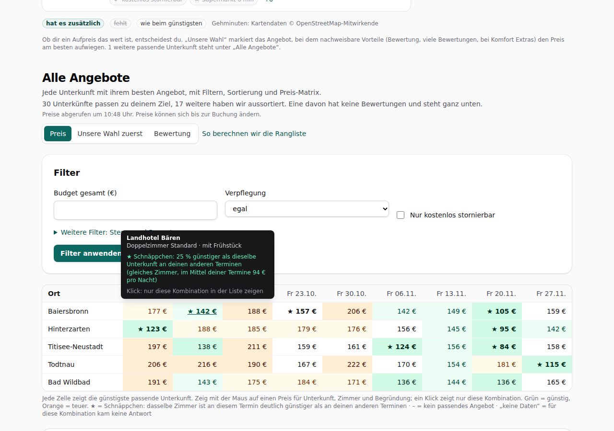
- Notiz: Hinweis beim Draufhalten: Landhotel Bären | Doppelzimmer Standard · mit Frühstück | ★ Schnäppchen: 25 % günstiger als dieselbe Unterkunft an deinen anderen Terminen (gleiches Zimmer, im Mittel deiner Termine 94 € pro Nacht) | Klick: nur diese Kombination in der Liste zeigen
- Notiz: Beschriftung für Screenreader: Baiersbronn, Fr 09.10.: 142 €. Landhotel Bären. Doppelzimmer Standard · mit Frühstück. Schnäppchen: 25 % günstiger als dieselbe Unterkunft an deinen anderen Terminen (gleiches Zimmer, im Mittel deiner Termine 94 € pro Nacht)
- Prüfungen:
  - [x] enthält „günstiger als dieselbe Unterkunft an deinen anderen Terminen (gleiches Zimmer, im Mittel deiner Termine“
  - [x] enthält „pro Nacht“
  - [x] enthält „Klick: nur diese Kombination“
  - [x] Element `[data-testid="tooltip"] [data-testid="matrix-bargain-reason"]` vorhanden (1)
- Überschriften: „Suche abgeschlossen“, „Deine Auswahl“, „Alle Angebote“
- KI-Kennzeichnungen (`data-ai-provenance`): „KI-gestützte Auswertung von Gästebewertungen [ai_assisted]“, „KI-gestützte Auswertung von Gästebewertungen [ai_assisted]“, „KI-gestützte Auswertung von Gästebewertungen [ai_assisted]“
- Konsolenfehler: keine
- Fehlgeschlagene Anfragen: keine

<details><summary>Sichtbarer Text</summary>

```text
Entwicklungsmodus: Alle Anbieter (Unterkünfte, Fahrzeiten, KI, E-Mail) sind simuliert. Es werden keine echten Buchungen ausgelöst. · Entwicklerseite
Reiseplaner
ARBEITSTITEL
Suche
So funktioniert's
Meine Buchung
Suche abgeschlossen

45 von 45 Kombinationen

614 Angebote

Deine Auswahl

Wir haben aussortiert, was nicht zu deinem Ziel passt. Zwischen diesen Unterkünften entscheidest du.

Günstig und sauber
Preis-Leistung
Komfort

Qualität und Preis zählen gleich viel.

41 Unterkünfte aussortiert
84 €
günstigste
Hotel Almrausch
Unsere Wahl
8,1

Titisee-Neustadt · Fr 20.11. – So 22.11.★★

Frühstück
kostenlos stornierbar
Sauna/Wellness
Supermarkt 8 min
Besonders sauber
Parkplatz
+2
95 €
+11 €
Apartments Alpenblick
8,0

Hinterzarten · Fr 20.11. – So 22.11.★★★

Ruhig
Küche
Frühstück
kostenlos stornierbar
Supermarkt 8 min
Besonders sauber
+4
105 €
+21 €
Gasthof Rose
9,0

Baiersbronn · Fr 20.11. – So 22.11.★★

Bus 9 min
Ruhig
Bequeme Betten
Gute Lage
Sauna/Wellness
Supermarkt 8 min
+8
105 €
+21 €
Pension Seeblick
8,2

Titisee-Neustadt · Fr 20.11. – So 22.11.★★

Lift 7 min
Bahnhof 9 min
Bus 2 min
Gutes Frühstück
Gute Lage
Besonders sauber
+9
115 €
+31 €
Landhotel Zur Post
7,8

Todtnau · Fr 27.11. – So 29.11.★★★

Lift 8 min
Bahnhof 10 min
Bus 7 min
Restaurants nah
kostenlos stornierbar
Supermarkt 8 min
+8
hat es zusätzlich
fehlt
wie beim günstigsten
Gehminuten: Kartendaten © OpenStreetMap-Mitwirkende

Ob dir ein Aufpreis das wert ist, entscheidest du. „Unsere Wahl“ markiert das Angebot, bei dem nachweisbare Vorteile (Bewertung, viele Bewertungen, bei Komfort Extras) den Preis am besten aufwiegen. 1 weitere passende Unterkunft steht unter „Alle Angebote“.

Alle Angebote

Jede Unterkunft mit ihrem besten Angebot, mit Filtern, Sortierung und Preis-Matrix.

30 Unterkünfte passen zu de
… (13461 weitere Zeichen)
```

</details>

### 15 Sortierung „Unsere Wahl zuerst“ (Standard: Preis)

- URL: `/suche/f43edafc-d621-4bf9-886d-137194d9ef1a#t=XWjlMcwaqV01P2L5vdgg3McYdFKi1qT2sOpr_cYZfRE`
- Screenshot: 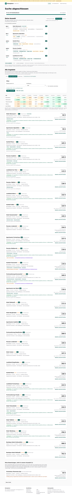
- Notiz: Matrix mit 45 Zellen; Liste mit 31 Einträgen, jede Unterkunft genau einmal (31 verschiedene Unterkünfte).
- Notiz: Standard nach Preis: 30 Unterkünfte, aufsteigend. Oben bei „Unsere Wahl zuerst“: Hotel Almrausch.
- Prüfungen:
  - [x] Element `[data-testid="sort"] [aria-checked="true"]` vorhanden (1)
  - [x] Element `[data-testid="result-list"] li:first-child [data-testid="recommended"]` vorhanden (1)
- Überschriften: „Suche abgeschlossen“, „Deine Auswahl“, „Alle Angebote“
- KI-Kennzeichnungen (`data-ai-provenance`): „KI-gestützte Auswertung von Gästebewertungen [ai_assisted]“, „KI-gestützte Auswertung von Gästebewertungen [ai_assisted]“, „KI-gestützte Auswertung von Gästebewertungen [ai_assisted]“
- Konsolenfehler: keine
- Fehlgeschlagene Anfragen: keine

<details><summary>Sichtbarer Text</summary>

```text
Entwicklungsmodus: Alle Anbieter (Unterkünfte, Fahrzeiten, KI, E-Mail) sind simuliert. Es werden keine echten Buchungen ausgelöst. · Entwicklerseite
Reiseplaner
ARBEITSTITEL
Suche
So funktioniert's
Meine Buchung
Suche abgeschlossen

45 von 45 Kombinationen

614 Angebote

Deine Auswahl

Wir haben aussortiert, was nicht zu deinem Ziel passt. Zwischen diesen Unterkünften entscheidest du.

Günstig und sauber
Preis-Leistung
Komfort

Qualität und Preis zählen gleich viel.

41 Unterkünfte aussortiert
84 €
günstigste
Hotel Almrausch
Unsere Wahl
8,1

Titisee-Neustadt · Fr 20.11. – So 22.11.★★

Frühstück
kostenlos stornierbar
Sauna/Wellness
Supermarkt 8 min
Besonders sauber
Parkplatz
+2
95 €
+11 €
Apartments Alpenblick
8,0

Hinterzarten · Fr 20.11. – So 22.11.★★★

Ruhig
Küche
Frühstück
kostenlos stornierbar
Supermarkt 8 min
Besonders sauber
+4
105 €
+21 €
Gasthof Rose
9,0

Baiersbronn · Fr 20.11. – So 22.11.★★

Bus 9 min
Ruhig
Bequeme Betten
Gute Lage
Sauna/Wellness
Supermarkt 8 min
+8
105 €
+21 €
Pension Seeblick
8,2

Titisee-Neustadt · Fr 20.11. – So 22.11.★★

Lift 7 min
Bahnhof 9 min
Bus 2 min
Gutes Frühstück
Gute Lage
Besonders sauber
+9
115 €
+31 €
Landhotel Zur Post
7,8

Todtnau · Fr 27.11. – So 29.11.★★★

Lift 8 min
Bahnhof 10 min
Bus 7 min
Restaurants nah
kostenlos stornierbar
Supermarkt 8 min
+8
hat es zusätzlich
fehlt
wie beim günstigsten
Gehminuten: Kartendaten © OpenStreetMap-Mitwirkende

Ob dir ein Aufpreis das wert ist, entscheidest du. „Unsere Wahl“ markiert das Angebot, bei dem nachweisbare Vorteile (Bewertung, viele Bewertungen, bei Komfort Extras) den Preis am besten aufwiegen. 1 weitere passende Unterkunft steht unter „Alle Angebote“.

Alle Angebote

Jede Unterkunft mit ihrem besten Angebot, mit Filtern, Sortierung und Preis-Matrix.

30 Unterkünfte passen zu de
… (13218 weitere Zeichen)
```

</details>

### 16 Klick auf eine Matrix-Zelle filtert die Liste

- URL: `/suche/f43edafc-d621-4bf9-886d-137194d9ef1a#t=XWjlMcwaqV01P2L5vdgg3McYdFKi1qT2sOpr_cYZfRE`
- Screenshot: 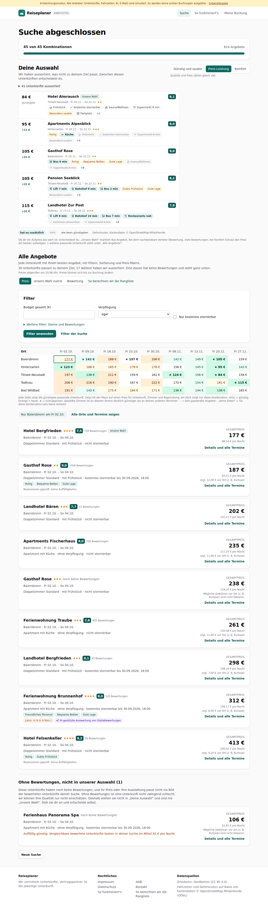
- Prüfungen:
  - [x] enthält „Nur “
  - [x] enthält „Alle Orte und Termine zeigen“
  - [x] Element `[data-testid="result-list"]` vorhanden (1)
- Überschriften: „Suche abgeschlossen“, „Deine Auswahl“, „Alle Angebote“
- KI-Kennzeichnungen (`data-ai-provenance`): „KI-gestützte Auswertung von Gästebewertungen [ai_assisted]“
- Konsolenfehler: keine
- Fehlgeschlagene Anfragen: keine

<details><summary>Sichtbarer Text</summary>

```text
Entwicklungsmodus: Alle Anbieter (Unterkünfte, Fahrzeiten, KI, E-Mail) sind simuliert. Es werden keine echten Buchungen ausgelöst. · Entwicklerseite
Reiseplaner
ARBEITSTITEL
Suche
So funktioniert's
Meine Buchung
Suche abgeschlossen

45 von 45 Kombinationen

614 Angebote

Deine Auswahl

Wir haben aussortiert, was nicht zu deinem Ziel passt. Zwischen diesen Unterkünften entscheidest du.

Günstig und sauber
Preis-Leistung
Komfort

Qualität und Preis zählen gleich viel.

41 Unterkünfte aussortiert
84 €
günstigste
Hotel Almrausch
Unsere Wahl
8,1

Titisee-Neustadt · Fr 20.11. – So 22.11.★★

Frühstück
kostenlos stornierbar
Sauna/Wellness
Supermarkt 8 min
Besonders sauber
Parkplatz
+2
95 €
+11 €
Apartments Alpenblick
8,0

Hinterzarten · Fr 20.11. – So 22.11.★★★

Ruhig
Küche
Frühstück
kostenlos stornierbar
Supermarkt 8 min
Besonders sauber
+4
105 €
+21 €
Gasthof Rose
9,0

Baiersbronn · Fr 20.11. – So 22.11.★★

Bus 9 min
Ruhig
Bequeme Betten
Gute Lage
Sauna/Wellness
Supermarkt 8 min
+8
105 €
+21 €
Pension Seeblick
8,2

Titisee-Neustadt · Fr 20.11. – So 22.11.★★

Lift 7 min
Bahnhof 9 min
Bus 2 min
Gutes Frühstück
Gute Lage
Besonders sauber
+9
115 €
+31 €
Landhotel Zur Post
7,8

Todtnau · Fr 27.11. – So 29.11.★★★

Lift 8 min
Bahnhof 10 min
Bus 7 min
Restaurants nah
kostenlos stornierbar
Supermarkt 8 min
+8
hat es zusätzlich
fehlt
wie beim günstigsten
Gehminuten: Kartendaten © OpenStreetMap-Mitwirkende

Ob dir ein Aufpreis das wert ist, entscheidest du. „Unsere Wahl“ markiert das Angebot, bei dem nachweisbare Vorteile (Bewertung, viele Bewertungen, bei Komfort Extras) den Preis am besten aufwiegen. 1 weitere passende Unterkunft steht unter „Alle Angebote“.

Alle Angebote

Jede Unterkunft mit ihrem besten Angebot, mit Filtern, Sortierung und Preis-Matrix.

30 Unterkünfte passen zu de
… (5018 weitere Zeichen)
```

</details>

### 17 Filter ohne neue Suche: Budget 200 € lässt einen Teil übrig

- URL: `/suche/f43edafc-d621-4bf9-886d-137194d9ef1a#t=XWjlMcwaqV01P2L5vdgg3McYdFKi1qT2sOpr_cYZfRE`
- Screenshot: 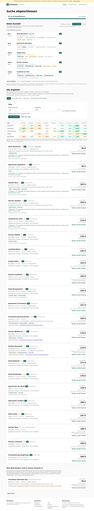
- Notiz: Budget 200 €: 22 Unterkünfte passen zu deinem Ziel, 11 weitere haben wir aussortiert. Eine davon hat keine Bewertungen und steht ganz unten. (vorher: 30 Unterkünfte passen zu deinem Ziel, 17 weitere haben wir aussortiert. Eine davon hat keine Bewertungen und steht ganz unten.); alle 23 angezeigten Gesamtpreise ≤ 200 €.
- Prüfungen:
  - [x] Element `[data-testid="result-total"]` vorhanden (23)
- Überschriften: „Suche abgeschlossen“, „Deine Auswahl“, „Alle Angebote“
- KI-Kennzeichnungen (`data-ai-provenance`): „KI-gestützte Auswertung von Gästebewertungen [ai_assisted]“, „KI-gestützte Auswertung von Gästebewertungen [ai_assisted]“, „KI-gestützte Auswertung von Gästebewertungen [ai_assisted]“
- Konsolenfehler: keine
- Fehlgeschlagene Anfragen: keine

<details><summary>Sichtbarer Text</summary>

```text
Entwicklungsmodus: Alle Anbieter (Unterkünfte, Fahrzeiten, KI, E-Mail) sind simuliert. Es werden keine echten Buchungen ausgelöst. · Entwicklerseite
Reiseplaner
ARBEITSTITEL
Suche
So funktioniert's
Meine Buchung
Suche abgeschlossen

45 von 45 Kombinationen

614 Angebote

Deine Auswahl

Wir haben aussortiert, was nicht zu deinem Ziel passt. Zwischen diesen Unterkünften entscheidest du.

Günstig und sauber
Preis-Leistung
Komfort

Qualität und Preis zählen gleich viel.

41 Unterkünfte aussortiert
84 €
günstigste
Hotel Almrausch
Unsere Wahl
8,1

Titisee-Neustadt · Fr 20.11. – So 22.11.★★

Frühstück
kostenlos stornierbar
Sauna/Wellness
Supermarkt 8 min
Besonders sauber
Parkplatz
+2
95 €
+11 €
Apartments Alpenblick
8,0

Hinterzarten · Fr 20.11. – So 22.11.★★★

Ruhig
Küche
Frühstück
kostenlos stornierbar
Supermarkt 8 min
Besonders sauber
+4
105 €
+21 €
Gasthof Rose
9,0

Baiersbronn · Fr 20.11. – So 22.11.★★

Bus 9 min
Ruhig
Bequeme Betten
Gute Lage
Sauna/Wellness
Supermarkt 8 min
+8
105 €
+21 €
Pension Seeblick
8,2

Titisee-Neustadt · Fr 20.11. – So 22.11.★★

Lift 7 min
Bahnhof 9 min
Bus 2 min
Gutes Frühstück
Gute Lage
Besonders sauber
+9
115 €
+31 €
Landhotel Zur Post
7,8

Todtnau · Fr 27.11. – So 29.11.★★★

Lift 8 min
Bahnhof 10 min
Bus 7 min
Restaurants nah
kostenlos stornierbar
Supermarkt 8 min
+8
hat es zusätzlich
fehlt
wie beim günstigsten
Gehminuten: Kartendaten © OpenStreetMap-Mitwirkende

Ob dir ein Aufpreis das wert ist, entscheidest du. „Unsere Wahl“ markiert das Angebot, bei dem nachweisbare Vorteile (Bewertung, viele Bewertungen, bei Komfort Extras) den Preis am besten aufwiegen. 1 weitere passende Unterkunft steht unter „Alle Angebote“.

Alle Angebote

Jede Unterkunft mit ihrem besten Angebot, mit Filtern, Sortierung und Preis-Matrix.

22 Unterkünfte passen zu de
… (9495 weitere Zeichen)
```

</details>

### 18 Filter ohne neue Suche: Budget 50 €

- URL: `/suche/f43edafc-d621-4bf9-886d-137194d9ef1a#t=XWjlMcwaqV01P2L5vdgg3McYdFKi1qT2sOpr_cYZfRE`
- Screenshot: 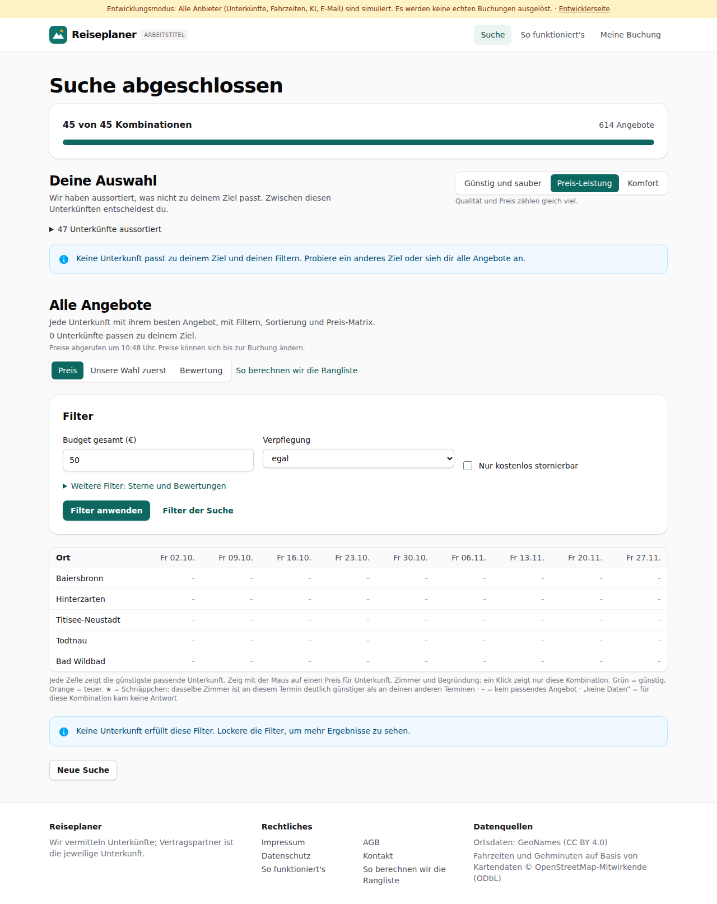
- Prüfungen:
  - [x] enthält „Keine Unterkunft erfüllt diese Filter“
- Überschriften: „Suche abgeschlossen“, „Deine Auswahl“, „Alle Angebote“
- KI-Kennzeichnungen (`data-ai-provenance`): keine
- Konsolenfehler: keine
- Fehlgeschlagene Anfragen: keine

<details><summary>Sichtbarer Text</summary>

```text
Entwicklungsmodus: Alle Anbieter (Unterkünfte, Fahrzeiten, KI, E-Mail) sind simuliert. Es werden keine echten Buchungen ausgelöst. · Entwicklerseite
Reiseplaner
ARBEITSTITEL
Suche
So funktioniert's
Meine Buchung
Suche abgeschlossen

45 von 45 Kombinationen

614 Angebote

Deine Auswahl

Wir haben aussortiert, was nicht zu deinem Ziel passt. Zwischen diesen Unterkünften entscheidest du.

Günstig und sauber
Preis-Leistung
Komfort

Qualität und Preis zählen gleich viel.

47 Unterkünfte aussortiert
Keine Unterkunft passt zu deinem Ziel und deinen Filtern. Probiere ein anderes Ziel oder sieh dir alle Angebote an.
Alle Angebote

Jede Unterkunft mit ihrem besten Angebot, mit Filtern, Sortierung und Preis-Matrix.

0 Unterkünfte passen zu deinem Ziel.

Preise abgerufen um 10:48 Uhr. Preise können sich bis zur Buchung ändern.

Sortierung
Preis
Unsere Wahl zuerst
Bewertung
So berechnen wir die Rangliste
Filter
Budget gesamt (€)
Verpflegung
egal
ohne
Frühstück
Halbpension
Vollpension
All inclusive
Nur kostenlos stornierbar
Weitere Filter: Sterne und Bewertungen
Filter anwenden
Filter der Suche
Ort	Fr 02.10.	Fr 09.10.	Fr 16.10.	Fr 23.10.	Fr 30.10.	Fr 06.11.	Fr 13.11.	Fr 20.11.	Fr 27.11.
Baiersbronn	–	–	–	–	–	–	–	–	–
Hinterzarten	–	–	–	–	–	–	–	–	–
Titisee-Neustadt	–	–	–	–	–	–	–	–	–
Todtnau	–	–	–	–	–	–	–	–	–
Bad Wildbad	–	–	–	–	–	–	–	–	–

Jede Zelle zeigt die günstigste passende Unterkunft. Zeig mit der Maus auf einen Preis für Unterkunft, Zimmer und Begründung; ein Klick zeigt nur diese Kombination. Grün = günstig, Orange = teuer. ★ = Schnäppchen: dasselbe Zimmer ist an diesem Termin deutlich günstiger als an deinen anderen Terminen · – = kein passendes Angebot · „keine Daten“ = für diese Kombination kam keine Antwort

Keine Unterkunft erfüllt diese Filter. Lockere die Filter, um mehr
… (351 weitere Zeichen)
```

</details>

### 19 Aussortierte Unterkünfte ohne Bewertungen stehen unten, mit Grund

- URL: `/suche/f43edafc-d621-4bf9-886d-137194d9ef1a#t=XWjlMcwaqV01P2L5vdgg3McYdFKi1qT2sOpr_cYZfRE`
- Screenshot: 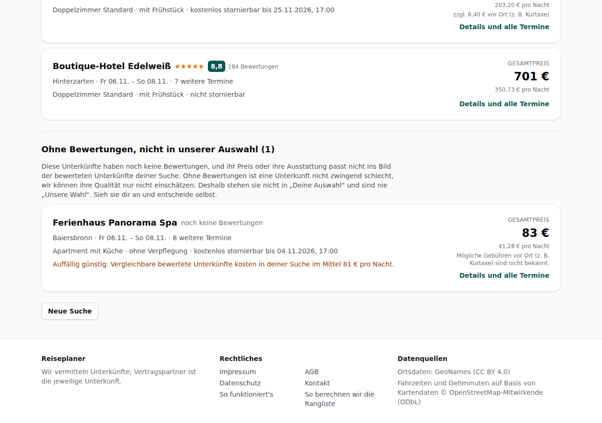
- Notiz: 1 Unterkünfte ohne Bewertungen unten: Ferienhaus Panorama Spa („Auffällig günstig: Vergleichbare bewertete Unterkünfte kosten in deiner Suche im Mittel 81 € pro Nacht.“)
- Notiz: Zähler: 30 Unterkünfte passen zu deinem Ziel, 17 weitere haben wir aussortiert. Eine davon hat keine Bewertungen und steht ganz unten.
- Prüfungen:
  - [x] enthält „Ohne Bewertungen, nicht in unserer Auswahl“
  - [x] enthält „nicht zwingend schlecht“
  - [x] enthält „noch keine Bewertungen“
  - [x] Element `[data-testid="unrated-section"] [data-testid="unrated-doubt"]` vorhanden (1)
- Überschriften: „Suche abgeschlossen“, „Deine Auswahl“, „Alle Angebote“
- KI-Kennzeichnungen (`data-ai-provenance`): „KI-gestützte Auswertung von Gästebewertungen [ai_assisted]“, „KI-gestützte Auswertung von Gästebewertungen [ai_assisted]“, „KI-gestützte Auswertung von Gästebewertungen [ai_assisted]“
- Konsolenfehler: keine
- Fehlgeschlagene Anfragen: keine

<details><summary>Sichtbarer Text</summary>

```text
Entwicklungsmodus: Alle Anbieter (Unterkünfte, Fahrzeiten, KI, E-Mail) sind simuliert. Es werden keine echten Buchungen ausgelöst. · Entwicklerseite
Reiseplaner
ARBEITSTITEL
Suche
So funktioniert's
Meine Buchung
Suche abgeschlossen

45 von 45 Kombinationen

614 Angebote

Deine Auswahl

Wir haben aussortiert, was nicht zu deinem Ziel passt. Zwischen diesen Unterkünften entscheidest du.

Günstig und sauber
Preis-Leistung
Komfort

Qualität und Preis zählen gleich viel.

41 Unterkünfte aussortiert
84 €
günstigste
Hotel Almrausch
Unsere Wahl
8,1

Titisee-Neustadt · Fr 20.11. – So 22.11.★★

Frühstück
kostenlos stornierbar
Sauna/Wellness
Supermarkt 8 min
Besonders sauber
Parkplatz
+2
95 €
+11 €
Apartments Alpenblick
8,0

Hinterzarten · Fr 20.11. – So 22.11.★★★

Ruhig
Küche
Frühstück
kostenlos stornierbar
Supermarkt 8 min
Besonders sauber
+4
105 €
+21 €
Gasthof Rose
9,0

Baiersbronn · Fr 20.11. – So 22.11.★★

Bus 9 min
Ruhig
Bequeme Betten
Gute Lage
Sauna/Wellness
Supermarkt 8 min
+8
105 €
+21 €
Pension Seeblick
8,2

Titisee-Neustadt · Fr 20.11. – So 22.11.★★

Lift 7 min
Bahnhof 9 min
Bus 2 min
Gutes Frühstück
Gute Lage
Besonders sauber
+9
115 €
+31 €
Landhotel Zur Post
7,8

Todtnau · Fr 27.11. – So 29.11.★★★

Lift 8 min
Bahnhof 10 min
Bus 7 min
Restaurants nah
kostenlos stornierbar
Supermarkt 8 min
+8
hat es zusätzlich
fehlt
wie beim günstigsten
Gehminuten: Kartendaten © OpenStreetMap-Mitwirkende

Ob dir ein Aufpreis das wert ist, entscheidest du. „Unsere Wahl“ markiert das Angebot, bei dem nachweisbare Vorteile (Bewertung, viele Bewertungen, bei Komfort Extras) den Preis am besten aufwiegen. 1 weitere passende Unterkunft steht unter „Alle Angebote“.

Alle Angebote

Jede Unterkunft mit ihrem besten Angebot, mit Filtern, Sortierung und Preis-Matrix.

30 Unterkünfte passen zu de
… (13218 weitere Zeichen)
```

</details>

### 20 Detailansicht mit allen Terminen und Score-Aufschlüsselung

- URL: `/suche/f43edafc-d621-4bf9-886d-137194d9ef1a/unterkunft/lpf-4792-819-0#t=XWjlMcwaqV01P2L5vdgg3McYdFKi1qT2sOpr_cYZfRE`
- Screenshot: 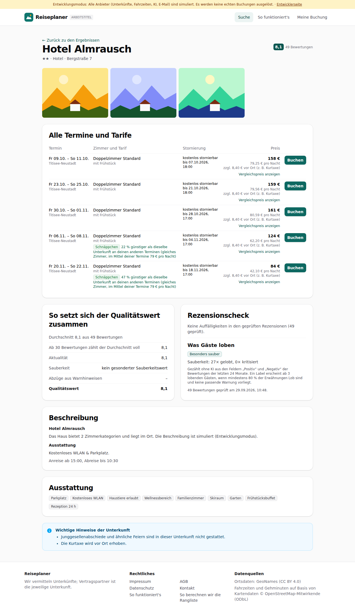
- Prüfungen:
  - [x] enthält „Alle Termine und Tarife“
  - [x] enthält „So setzt sich der Qualitätswert zusammen“
  - [x] enthält „Aktualität“
  - [x] enthält „Rezensionscheck“
  - [x] enthält „Bewertungen geprüft am“
  - [x] enthält „Buchen“
  - [x] enthält „Beschreibung“
  - [x] enthält „Wichtige Hinweise der Unterkunft“
  - [x] enthält „Junggesellenabschiede“
  - [x] enthält nicht „<p>“
  - [x] enthält nicht „<strong>“
  - [x] enthält nicht „&amp;“
  - [x] enthält nicht „This property“
  - [x] enthält nicht „nur auf Englisch“
  - [x] Element `[data-testid="score-breakdown"]` vorhanden (1)
  - [x] Element `[data-testid="book-offer"]` vorhanden (5)
  - [x] Element `[data-testid="hotel-description"] h3` vorhanden (2)
  - [x] Element `[data-testid="important-information"]` vorhanden (1)
- Überschriften: „Hotel Almrausch“, „Alle Termine und Tarife“, „So setzt sich der Qualitätswert zusammen“, „Rezensionscheck“, „Beschreibung“, „Ausstattung“
- KI-Kennzeichnungen (`data-ai-provenance`): keine
- Konsolenfehler: keine
- Fehlgeschlagene Anfragen: keine

<details><summary>Sichtbarer Text</summary>

```text
Entwicklungsmodus: Alle Anbieter (Unterkünfte, Fahrzeiten, KI, E-Mail) sind simuliert. Es werden keine echten Buchungen ausgelöst. · Entwicklerseite
Reiseplaner
ARBEITSTITEL
Suche
So funktioniert's
Meine Buchung
← Zurück zu den Ergebnissen
Hotel Almrausch

★★ · Hotel · Bergstraße 7

8,1
49 Bewertungen
Alle Termine und Tarife
Termin	Zimmer und Tarif	Stornierung	Preis	

Fr 09.10. – So 11.10.
Titisee-Neustadt
	
Doppelzimmer Standard
mit Frühstück
	kostenlos stornierbar bis 07.10.2026, 18:00	
158 €
79,25 € pro Nacht
zzgl. 8,40 € vor Ort (z. B. Kurtaxe)
Vergleichspreis anzeigen
	Buchen

Fr 23.10. – So 25.10.
Titisee-Neustadt
	
Doppelzimmer Standard
mit Frühstück
	kostenlos stornierbar bis 21.10.2026, 18:00	
159 €
79,56 € pro Nacht
zzgl. 8,40 € vor Ort (z. B. Kurtaxe)
Vergleichspreis anzeigen
	Buchen

Fr 30.10. – So 01.11.
Titisee-Neustadt
	
Doppelzimmer Standard
mit Frühstück
	kostenlos stornierbar bis 28.10.2026, 17:00	
161 €
80,59 € pro Nacht
zzgl. 8,40 € vor Ort (z. B. Kurtaxe)
Vergleichspreis anzeigen
	Buchen

Fr 06.11. – So 08.11.
Titisee-Neustadt
	
Doppelzimmer Standard
mit Frühstück
Schnäppchen 22 % günstiger als dieselbe Unterkunft an deinen anderen Terminen (gleiches Zimmer, im Mittel deiner Termine 79 € pro Nacht)
	kostenlos stornierbar bis 04.11.2026, 17:00	
124 €
62,20 € pro Nacht
zzgl. 8,40 € vor Ort (z. B. Kurtaxe)
Vergleichspreis anzeigen
	Buchen

Fr 20.11. – So 22.11.
Titisee-Neustadt
	
Doppelzimmer Standard
mit Frühstück
Schnäppchen 47 % günstiger als dieselbe Unterkunft an deinen anderen Terminen (gleiches Zimmer, im Mittel deiner Termine 79 € pro Nacht)
	kostenlos stornierbar bis 18.11.2026, 17:00	
84 €
42,10 € pro Nacht
zzgl. 8,40 € vor Ort (z. B. Kurtaxe)
Vergleichspreis anzeigen
	Buchen
So setzt sich der Qualitätswert zusammen
Durchschnitt 8,1 aus 49 Be
… (1410 weitere Zeichen)
```

</details>

### 21 Vergleichspreis auf Abruf

- URL: `/suche/f43edafc-d621-4bf9-886d-137194d9ef1a/unterkunft/lpf-4792-819-0#t=XWjlMcwaqV01P2L5vdgg3McYdFKi1qT2sOpr_cYZfRE`
- Screenshot: 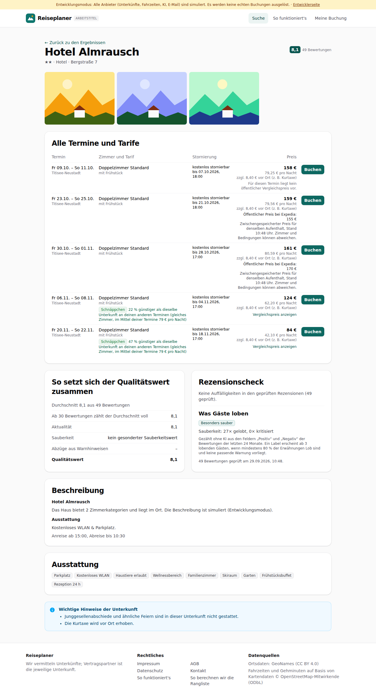
- Notiz: Vergleichspreise für 3 Termine: Für diesen Termin liegt kein öffentlicher Vergleichspreis vor. | Öffentlicher Preis bei Expedia: 155 € | Öffentlicher Preis bei Expedia: 170 €
- Prüfungen:
  - [x] enthält nicht „Bestpreis“
  - [x] enthält nicht „spare“
  - [x] enthält nicht „günstiger als bei“
  - [x] Element `[data-testid="reference-price"]` vorhanden (3)
- Überschriften: „Hotel Almrausch“, „Alle Termine und Tarife“, „So setzt sich der Qualitätswert zusammen“, „Rezensionscheck“, „Beschreibung“, „Ausstattung“
- KI-Kennzeichnungen (`data-ai-provenance`): keine
- Konsolenfehler: keine
- Fehlgeschlagene Anfragen: keine

<details><summary>Sichtbarer Text</summary>

```text
Entwicklungsmodus: Alle Anbieter (Unterkünfte, Fahrzeiten, KI, E-Mail) sind simuliert. Es werden keine echten Buchungen ausgelöst. · Entwicklerseite
Reiseplaner
ARBEITSTITEL
Suche
So funktioniert's
Meine Buchung
← Zurück zu den Ergebnissen
Hotel Almrausch

★★ · Hotel · Bergstraße 7

8,1
49 Bewertungen
Alle Termine und Tarife
Termin	Zimmer und Tarif	Stornierung	Preis	

Fr 09.10. – So 11.10.
Titisee-Neustadt
	
Doppelzimmer Standard
mit Frühstück
	kostenlos stornierbar bis 07.10.2026, 18:00	
158 €
79,25 € pro Nacht
zzgl. 8,40 € vor Ort (z. B. Kurtaxe)

Für diesen Termin liegt kein öffentlicher Vergleichspreis vor.

	Buchen

Fr 23.10. – So 25.10.
Titisee-Neustadt
	
Doppelzimmer Standard
mit Frühstück
	kostenlos stornierbar bis 21.10.2026, 18:00	
159 €
79,56 € pro Nacht
zzgl. 8,40 € vor Ort (z. B. Kurtaxe)

Öffentlicher Preis bei Expedia: 155 €

Zwischengespeicherter Preis für denselben Aufenthalt, Stand 10:48 Uhr. Zimmer und Bedingungen können abweichen.

	Buchen

Fr 30.10. – So 01.11.
Titisee-Neustadt
	
Doppelzimmer Standard
mit Frühstück
	kostenlos stornierbar bis 28.10.2026, 17:00	
161 €
80,59 € pro Nacht
zzgl. 8,40 € vor Ort (z. B. Kurtaxe)

Öffentlicher Preis bei Expedia: 170 €

Zwischengespeicherter Preis für denselben Aufenthalt, Stand 10:48 Uhr. Zimmer und Bedingungen können abweichen.

	Buchen

Fr 06.11. – So 08.11.
Titisee-Neustadt
	
Doppelzimmer Standard
mit Frühstück
Schnäppchen 22 % günstiger als dieselbe Unterkunft an deinen anderen Terminen (gleiches Zimmer, im Mittel deiner Termine 79 € pro Nacht)
	kostenlos stornierbar bis 04.11.2026, 17:00	
124 €
62,20 € pro Nacht
zzgl. 8,40 € vor Ort (z. B. Kurtaxe)
Vergleichspreis anzeigen
	Buchen

Fr 20.11. – So 22.11.
Titisee-Neustadt
	
Doppelzimmer Standard
mit Frühstück
Schnäppchen 47 % günstiger als dieselbe Unterku
… (1706 weitere Zeichen)
```

</details>

### 22 Seite „So berechnen wir die Rangliste“

- URL: `/ranking`
- Screenshot: 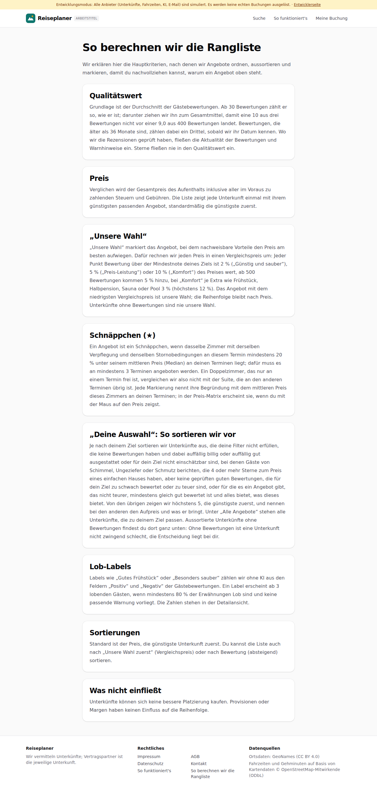
- Prüfungen:
  - [x] enthält „Qualitätswert“
  - [x] enthält „Preis“
  - [x] enthält „Unsere Wahl“
  - [x] enthält „Schnäppchen (★)“
  - [x] enthält „dasselbe Zimmer“
  - [x] enthält „mittleren Preis dieses Zimmers“
  - [x] enthält „ganz unten“
  - [x] enthält „Provisionen oder Margen haben keinen Einfluss“
  - [x] enthält nicht „Wir empfehlen keinen Favoriten“
  - [x] enthält nicht „gegenüber dem Durchschnitt aller Treffer“
  - [x] enthält nicht „Rangwert“
- Überschriften: „So berechnen wir die Rangliste“, „Qualitätswert“, „Preis“, „„Unsere Wahl““, „Schnäppchen (★)“, „„Deine Auswahl“: So sortieren wir vor“, „Lob-Labels“, „Sortierungen“, „Was nicht einfließt“
- KI-Kennzeichnungen (`data-ai-provenance`): keine
- Konsolenfehler: keine
- Fehlgeschlagene Anfragen: keine

<details><summary>Sichtbarer Text</summary>

```text
Entwicklungsmodus: Alle Anbieter (Unterkünfte, Fahrzeiten, KI, E-Mail) sind simuliert. Es werden keine echten Buchungen ausgelöst. · Entwicklerseite
Reiseplaner
ARBEITSTITEL
Suche
So funktioniert's
Meine Buchung
So berechnen wir die Rangliste

Wir erklären hier die Hauptkriterien, nach denen wir Angebote ordnen, aussortieren und markieren, damit du nachvollziehen kannst, warum ein Angebot oben steht.

Qualitätswert

Grundlage ist der Durchschnitt der Gästebewertungen. Ab 30 Bewertungen zählt er so, wie er ist; darunter ziehen wir ihn zum Gesamtmittel, damit eine 10 aus drei Bewertungen nicht vor einer 9,0 aus 400 Bewertungen landet. Bewertungen, die älter als 36 Monate sind, zählen dabei ein Drittel, sobald wir ihr Datum kennen. Wo wir die Rezensionen geprüft haben, fließen die Aktualität der Bewertungen und Warnhinweise ein. Sterne fließen nie in den Qualitätswert ein.

Preis

Verglichen wird der Gesamtpreis des Aufenthalts inklusive aller im Voraus zu zahlenden Steuern und Gebühren. Die Liste zeigt jede Unterkunft einmal mit ihrem günstigsten passenden Angebot, standardmäßig die günstigste zuerst.

„Unsere Wahl“

„Unsere Wahl“ markiert das Angebot, bei dem nachweisbare Vorteile den Preis am besten aufwiegen. Dafür rechnen wir jeden Preis in einen Vergleichspreis um: Jeder Punkt Bewertung über der Mindestnote deines Ziels ist 2 % („Günstig und sauber“), 5 % („Preis-Leistung“) oder 10 % („Komfort“) des Preises wert, ab 500 Bewertungen kommen 5 % hinzu, bei „Komfort“ je Extra wie Frühstück, Halbpension, Sauna oder Pool 3 % (höchstens 12 %). Das Angebot mit dem niedrigsten Vergleichspreis ist unsere Wahl; die Reihenfolge bleibt nach Preis. Unterkünfte ohne Bewertungen sind nie unsere Wahl.

Schnäppchen (★)

Ein Angebot ist ein Schnäppchen, wenn dasselbe Zimmer mit derselb
… (2437 weitere Zeichen)
```

</details>

## Flow „finale“

Entscheidungshilfe (F15–F17, konzept.md 9.9–9.11): Ziel „Günstig und sauber“ im Suchformular, Suche Stuttgart → 5 Orte × 3 Freitage; oben „Deine Auswahl“ als Preisleiter mit höchstens 5 Unterkünften, die günstigste zuerst, bei den anderen Aufpreis und Badges (grün: hat es zusätzlich, durchgestrichen: fehlt), Gehminuten aus OpenStreetMap, „Unsere Wahl“ markiert; aussortierte Unterkünfte mit Gründen; Zielwechsel ohne neue Suche; Lob-Labels in Liste und Detailansicht; Sterne und Mindestbewertung unter „Weitere Filter“.

### 23 Suchformular: Ziel „Günstig und sauber“ mit einem Tipp

- URL: `/suche`
- Screenshot: 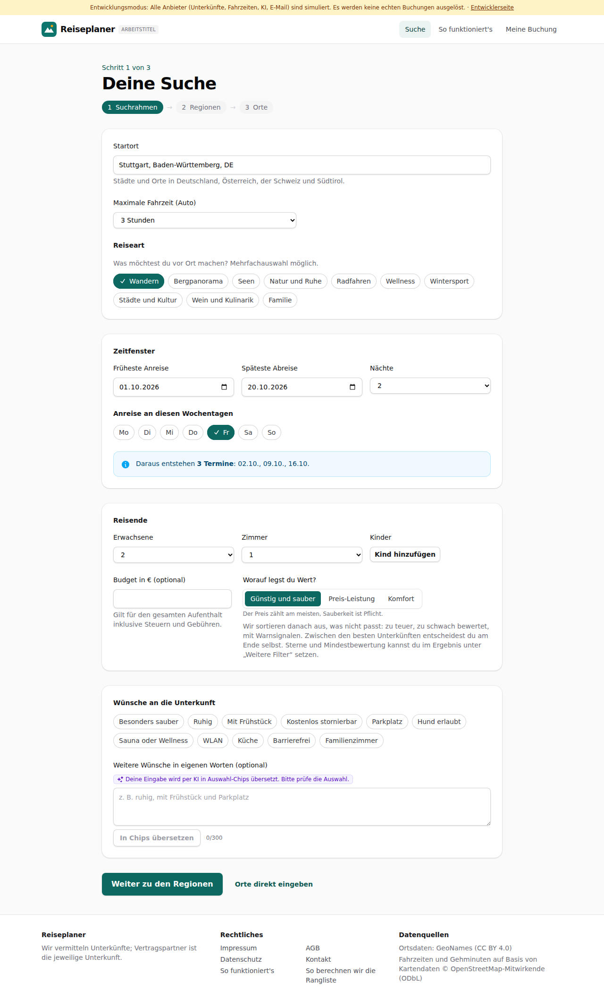
- Prüfungen:
  - [x] enthält „Worauf legst du Wert?“
  - [x] enthält „Günstig und sauber“
  - [x] enthält „Preis-Leistung“
  - [x] enthält „Komfort“
  - [x] enthält „Der Preis zählt am meisten, Sauberkeit ist Pflicht.“
  - [x] enthält „Weitere Filter“
  - [x] enthält nicht „Mindestens Sterne“
  - [x] enthält nicht „Mindeststandard“
  - [x] Element `[data-testid="goal-switch"] [aria-checked="true"][data-goal="sparen"]` vorhanden (1)
- Überschriften: „Deine Suche“
- KI-Kennzeichnungen (`data-ai-provenance`): „Deine Eingabe wird per KI in Auswahl-Chips übersetzt. Bitte prüfe die Auswahl. [ai_assisted]“
- Konsolenfehler: keine
- Fehlgeschlagene Anfragen: keine

<details><summary>Sichtbarer Text</summary>

```text
Entwicklungsmodus: Alle Anbieter (Unterkünfte, Fahrzeiten, KI, E-Mail) sind simuliert. Es werden keine echten Buchungen ausgelöst. · Entwicklerseite
Reiseplaner
ARBEITSTITEL
Suche
So funktioniert's
Meine Buchung

Schritt 1 von 3

Deine Suche
1
Suchrahmen
→
2
Regionen
→
3
Orte
Startort

Städte und Orte in Deutschland, Österreich, der Schweiz und Südtirol.

Maximale Fahrzeit (Auto)
Keine Begrenzung
1 Stunde
1 h 30 min
2 Stunden
2 h 30 min
3 Stunden
4 Stunden
5 Stunden
6 Stunden
Reiseart

Was möchtest du vor Ort machen? Mehrfachauswahl möglich.

Wandern
Bergpanorama
Seen
Natur und Ruhe
Radfahren
Wellness
Wintersport
Städte und Kultur
Wein und Kulinarik
Familie
Zeitfenster
Früheste Anreise
Späteste Abreise
Nächte
1
2
3
4
5
6
7
8
9
10
11
12
13
14
Anreise an diesen Wochentagen
Mo
Di
Mi
Do
Fr
Sa
So
Daraus entstehen 3 Termine: 02.10., 09.10., 16.10.
Reisende
Erwachsene
1
2
3
4
5
6
Zimmer
1
2
3
4
5
Kinder
Kind hinzufügen
Budget in € (optional)

Gilt für den gesamten Aufenthalt inklusive Steuern und Gebühren.

Worauf legst du Wert?

Günstig und sauber
Preis-Leistung
Komfort

Der Preis zählt am meisten, Sauberkeit ist Pflicht.

Wir sortieren danach aus, was nicht passt: zu teuer, zu schwach bewertet, mit Warnsignalen. Zwischen den besten Unterkünften entscheidest du am Ende selbst. Sterne und Mindestbewertung kannst du im Ergebnis unter „Weitere Filter“ setzen.

Wünsche an die Unterkunft
Besonders sauber
Ruhig
Mit Frühstück
Kostenlos stornierbar
Parkplatz
Hund erlaubt
Sauna oder Wellness
WLAN
Küche
Barrierefrei
Familienzimmer
Weitere Wünsche in eigenen Worten (optional)
Deine Eingabe wird per KI in Auswahl-Chips übersetzt. Bitte prüfe die Auswahl.
In Chips übersetzen
0/300
Weiter zu den Regionen
Orte direkt eingeben

Reiseplaner

Wir vermitteln Unterkünfte; Vertragspartner ist die
… (253 weitere Zeichen)
```

</details>

### 24 Suche abgeschlossen: „Deine Auswahl“ steht oben

- URL: `/suche/5422e73d-8d0d-480d-adaa-3c91823d5805#t=au6O3cistU5oRsXUNBFgSn5EZBawWpW1kmkcX9Obzn4`
- Screenshot: 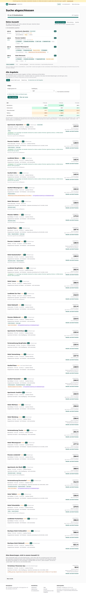
- Notiz: 4 Finalisten, Gesamtpreise 122.69 € · 137.94 € · 152.14 € · 158.49 €; Aufpreise +15.25 €, +29.45 €, +35.8 €.
- Prüfungen:
  - [x] enthält „Deine Auswahl“
  - [x] enthält „Wir haben aussortiert“
  - [x] enthält „günstigste“
  - [x] enthält „aussortiert“
  - [x] enthält „hat es zusätzlich“
  - [x] enthält „fehlt“
  - [x] enthält „Unsere Wahl“
  - [x] enthält „Alle Angebote“
  - [x] enthält nicht „Unsere Empfehlung“
  - [x] enthält nicht „Testsieger“
  - [x] Element `[data-testid="finalist"]` vorhanden (4)
  - [x] Element `[data-testid="excluded"]` vorhanden (1)
  - [x] Element `[data-testid="feature-badge"]` vorhanden (21)
  - [x] Element `[data-testid="finale-legend"]` vorhanden (1)
- Überschriften: „Suche abgeschlossen“, „Deine Auswahl“, „Alle Angebote“
- KI-Kennzeichnungen (`data-ai-provenance`): „KI-gestützte Auswertung von Gästebewertungen [ai_assisted]“, „KI-gestützte Auswertung von Gästebewertungen [ai_assisted]“, „KI-gestützte Auswertung von Gästebewertungen [ai_assisted]“, „KI-gestützte Auswertung von Gästebewertungen [ai_assisted]“
- Konsolenfehler: keine
- Fehlgeschlagene Anfragen: keine

<details><summary>Sichtbarer Text</summary>

```text
Entwicklungsmodus: Alle Anbieter (Unterkünfte, Fahrzeiten, KI, E-Mail) sind simuliert. Es werden keine echten Buchungen ausgelöst. · Entwicklerseite
Reiseplaner
ARBEITSTITEL
Suche
So funktioniert's
Meine Buchung
Suche abgeschlossen

15 von 15 Kombinationen

207 Angebote

Deine Auswahl

Wir haben aussortiert, was nicht zu deinem Ziel passt. Zwischen diesen Unterkünften entscheidest du.

Günstig und sauber
Preis-Leistung
Komfort

Der Preis zählt am meisten, Sauberkeit ist Pflicht.

43 Unterkünfte aussortiert
123 €
günstigste
Apartments Alpenblick
Unsere Wahl
8,0

Hinterzarten · Fr 02.10. – So 04.10.★★★

Sauna/Wellness
Ruhig
Küche
138 €
+15 €
Pension Seeblick
8,2

Titisee-Neustadt · Fr 09.10. – So 11.10.★★

Frühstück
kostenlos stornierbar
Lift 7 min
Bahnhof 9 min
Ruhig
Küche
+10
152 €
+29 €
Gasthof Wiesengrund
7,1

Bad Wildbad · Fr 09.10. – So 11.10.★★

Frühstück
Restaurants nah
Bequeme Betten
Parkplatz
Sauna/Wellness
Ruhig
Abweichung von Fotos oder Beschreibung
+3
158 €
+36 €
Hotel Almrausch
8,1

Titisee-Neustadt · Fr 09.10. – So 11.10.★★

Frühstück
kostenlos stornierbar
Supermarkt 8 min
Besonders sauber
Ruhig
Küche
+4
hat es zusätzlich
fehlt
wie beim günstigsten
Gehminuten: Kartendaten © OpenStreetMap-Mitwirkende

Ob dir ein Aufpreis das wert ist, entscheidest du. „Unsere Wahl“ markiert das Angebot, bei dem nachweisbare Vorteile (Bewertung, viele Bewertungen, bei Komfort Extras) den Preis am besten aufwiegen.

Alle Angebote

Jede Unterkunft mit ihrem besten Angebot, mit Filtern, Sortierung und Preis-Matrix.

33 Unterkünfte passen zu deinem Ziel, 14 weitere haben wir aussortiert. Eine davon hat keine Bewertungen und steht ganz unten.

Preise abgerufen um 10:48 Uhr. Preise können sich bis zur Buchung ändern.

Sortierung
Preis
Unsere Wahl zuerst
Bewertung
So berechnen wir d
… (12259 weitere Zeichen)
```

</details>

### 25 Aussortiert, mit Grund und Anzahl

- URL: `/suche/5422e73d-8d0d-480d-adaa-3c91823d5805#t=au6O3cistU5oRsXUNBFgSn5EZBawWpW1kmkcX9Obzn4`
- Screenshot: 
- Notiz: Gründe: 1 ohne Bewertungen und auffällig billig, auffällig gut ausgestattet oder für dein Ziel nicht einschätzbar · ansehen ↓ | 2 mit Warnsignalen: Gäste berichten von Schimmel, Ungeziefer oder Schmutz | 11 zu schwach bewertet für dein Ziel und nicht deutlich günstiger | 27 zu teuer für dein Ziel | 2 mit einem besseren Angebot: nicht teurer, mindestens gleich gut bewertet, mit allem, was dieses bietet
- Prüfungen:
  - [x] enthält „zu teuer für dein Ziel“
  - [x] Element `[data-testid="excluded"] li[data-reason]` vorhanden (5)
- Überschriften: „Suche abgeschlossen“, „Deine Auswahl“, „Alle Angebote“
- KI-Kennzeichnungen (`data-ai-provenance`): „KI-gestützte Auswertung von Gästebewertungen [ai_assisted]“, „KI-gestützte Auswertung von Gästebewertungen [ai_assisted]“, „KI-gestützte Auswertung von Gästebewertungen [ai_assisted]“, „KI-gestützte Auswertung von Gästebewertungen [ai_assisted]“
- Konsolenfehler: keine
- Fehlgeschlagene Anfragen: keine

<details><summary>Sichtbarer Text</summary>

```text
Entwicklungsmodus: Alle Anbieter (Unterkünfte, Fahrzeiten, KI, E-Mail) sind simuliert. Es werden keine echten Buchungen ausgelöst. · Entwicklerseite
Reiseplaner
ARBEITSTITEL
Suche
So funktioniert's
Meine Buchung
Suche abgeschlossen

15 von 15 Kombinationen

207 Angebote

Deine Auswahl

Wir haben aussortiert, was nicht zu deinem Ziel passt. Zwischen diesen Unterkünften entscheidest du.

Günstig und sauber
Preis-Leistung
Komfort

Der Preis zählt am meisten, Sauberkeit ist Pflicht.

43 Unterkünfte aussortiert
1 ohne Bewertungen und auffällig billig, auffällig gut ausgestattet oder für dein Ziel nicht einschätzbar · ansehen ↓
2 mit Warnsignalen: Gäste berichten von Schimmel, Ungeziefer oder Schmutz
11 zu schwach bewertet für dein Ziel und nicht deutlich günstiger
27 zu teuer für dein Ziel
2 mit einem besseren Angebot: nicht teurer, mindestens gleich gut bewertet, mit allem, was dieses bietet
123 €
günstigste
Apartments Alpenblick
Unsere Wahl
8,0

Hinterzarten · Fr 02.10. – So 04.10.★★★

Sauna/Wellness
Ruhig
Küche
138 €
+15 €
Pension Seeblick
8,2

Titisee-Neustadt · Fr 09.10. – So 11.10.★★

Frühstück
kostenlos stornierbar
Lift 7 min
Bahnhof 9 min
Ruhig
Küche
+10
152 €
+29 €
Gasthof Wiesengrund
7,1

Bad Wildbad · Fr 09.10. – So 11.10.★★

Frühstück
Restaurants nah
Bequeme Betten
Parkplatz
Sauna/Wellness
Ruhig
Abweichung von Fotos oder Beschreibung
+3
158 €
+36 €
Hotel Almrausch
8,1

Titisee-Neustadt · Fr 09.10. – So 11.10.★★

Frühstück
kostenlos stornierbar
Supermarkt 8 min
Besonders sauber
Ruhig
Küche
+4
hat es zusätzlich
fehlt
wie beim günstigsten
Gehminuten: Kartendaten © OpenStreetMap-Mitwirkende

Ob dir ein Aufpreis das wert ist, entscheidest du. „Unsere Wahl“ markiert das Angebot, bei dem nachweisbare Vorteile (Bewertung, viele Bewertungen, bei Komfort Extras) den Preis 
… (12648 weitere Zeichen)
```

</details>

### 26 Preisleiter: Aufpreis und Badges statt Sätzen, Gehminuten aus OpenStreetMap

- URL: `/suche/5422e73d-8d0d-480d-adaa-3c91823d5805#t=au6O3cistU5oRsXUNBFgSn5EZBawWpW1kmkcX9Obzn4`
- Screenshot: 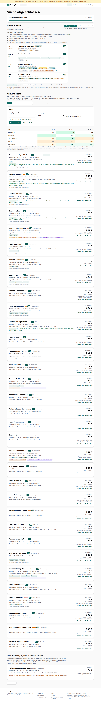
- Notiz: Leiter: Apartments Alpenblick (günstigste): Sauna/Wellness, Ruhig, Küche || Pension Seeblick (+15 €): +Frühstück, +kostenlos stornierbar, +Lift 7 min, +Bahnhof 9 min, −Ruhig, −Küche || Gasthof Wiesengrund (+29 €): +Frühstück, +Restaurants nah, +Bequeme Betten, +Parkplatz, −Sauna/Wellness, −Ruhig || Hotel Almrausch (+36 €): +Frühstück, +kostenlos stornierbar, +Supermarkt 8 min, +Besonders sauber, −Ruhig, −Küche
- Prüfungen:
  - [x] enthält „min“
  - [x] enthält „Kartendaten © OpenStreetMap-Mitwirkende“
  - [x] enthält nicht „Dafür nicht:“
  - [x] enthält nicht „gegenüber“
  - [x] Element `[data-testid="feature-badge"][data-code^="lage_"]` vorhanden (4)
  - [x] Element `[data-testid="osm-attribution"]` vorhanden (1)
- Überschriften: „Suche abgeschlossen“, „Deine Auswahl“, „Alle Angebote“
- KI-Kennzeichnungen (`data-ai-provenance`): „KI-gestützte Auswertung von Gästebewertungen [ai_assisted]“, „KI-gestützte Auswertung von Gästebewertungen [ai_assisted]“, „KI-gestützte Auswertung von Gästebewertungen [ai_assisted]“, „KI-gestützte Auswertung von Gästebewertungen [ai_assisted]“
- Konsolenfehler: keine
- Fehlgeschlagene Anfragen: keine

<details><summary>Sichtbarer Text</summary>

```text
Entwicklungsmodus: Alle Anbieter (Unterkünfte, Fahrzeiten, KI, E-Mail) sind simuliert. Es werden keine echten Buchungen ausgelöst. · Entwicklerseite
Reiseplaner
ARBEITSTITEL
Suche
So funktioniert's
Meine Buchung
Suche abgeschlossen

15 von 15 Kombinationen

207 Angebote

Deine Auswahl

Wir haben aussortiert, was nicht zu deinem Ziel passt. Zwischen diesen Unterkünften entscheidest du.

Günstig und sauber
Preis-Leistung
Komfort

Der Preis zählt am meisten, Sauberkeit ist Pflicht.

43 Unterkünfte aussortiert
1 ohne Bewertungen und auffällig billig, auffällig gut ausgestattet oder für dein Ziel nicht einschätzbar · ansehen ↓
2 mit Warnsignalen: Gäste berichten von Schimmel, Ungeziefer oder Schmutz
11 zu schwach bewertet für dein Ziel und nicht deutlich günstiger
27 zu teuer für dein Ziel
2 mit einem besseren Angebot: nicht teurer, mindestens gleich gut bewertet, mit allem, was dieses bietet
123 €
günstigste
Apartments Alpenblick
Unsere Wahl
8,0

Hinterzarten · Fr 02.10. – So 04.10.★★★

Sauna/Wellness
Ruhig
Küche
138 €
+15 €
Pension Seeblick
8,2

Titisee-Neustadt · Fr 09.10. – So 11.10.★★

Frühstück
kostenlos stornierbar
Lift 7 min
Bahnhof 9 min
Ruhig
Küche
+10
152 €
+29 €
Gasthof Wiesengrund
7,1

Bad Wildbad · Fr 09.10. – So 11.10.★★

Frühstück
Restaurants nah
Bequeme Betten
Parkplatz
Sauna/Wellness
Ruhig
Abweichung von Fotos oder Beschreibung
+3
158 €
+36 €
Hotel Almrausch
8,1

Titisee-Neustadt · Fr 09.10. – So 11.10.★★

Frühstück
kostenlos stornierbar
Supermarkt 8 min
Besonders sauber
Ruhig
Küche
+4
hat es zusätzlich
fehlt
wie beim günstigsten
Gehminuten: Kartendaten © OpenStreetMap-Mitwirkende

Ob dir ein Aufpreis das wert ist, entscheidest du. „Unsere Wahl“ markiert das Angebot, bei dem nachweisbare Vorteile (Bewertung, viele Bewertungen, bei Komfort Extras) den Preis 
… (12648 weitere Zeichen)
```

</details>

### 27 Preisleiter auf dem Handy (390 px)

- URL: `/suche/5422e73d-8d0d-480d-adaa-3c91823d5805#t=au6O3cistU5oRsXUNBFgSn5EZBawWpW1kmkcX9Obzn4`
- Screenshot: 
- Prüfungen:
  - [x] Element `[data-testid="finalist"] [data-testid="feature-badge"]` vorhanden (21)
- Überschriften: „Suche abgeschlossen“, „Deine Auswahl“, „Alle Angebote“
- KI-Kennzeichnungen (`data-ai-provenance`): „KI-gestützte Auswertung von Gästebewertungen [ai_assisted]“, „KI-gestützte Auswertung von Gästebewertungen [ai_assisted]“, „KI-gestützte Auswertung von Gästebewertungen [ai_assisted]“, „KI-gestützte Auswertung von Gästebewertungen [ai_assisted]“
- Konsolenfehler: keine
- Fehlgeschlagene Anfragen: keine

<details><summary>Sichtbarer Text</summary>

```text
Entwicklungsmodus: Alle Anbieter (Unterkünfte, Fahrzeiten, KI, E-Mail) sind simuliert. Es werden keine echten Buchungen ausgelöst. · Entwicklerseite
Reiseplaner
Suche
Meine Buchung
Suche abgeschlossen

15 von 15 Kombinationen

207 Angebote

Deine Auswahl

Wir haben aussortiert, was nicht zu deinem Ziel passt. Zwischen diesen Unterkünften entscheidest du.

Günstig und sauber
Preis-Leistung
Komfort

Der Preis zählt am meisten, Sauberkeit ist Pflicht.

43 Unterkünfte aussortiert
1 ohne Bewertungen und auffällig billig, auffällig gut ausgestattet oder für dein Ziel nicht einschätzbar · ansehen ↓
2 mit Warnsignalen: Gäste berichten von Schimmel, Ungeziefer oder Schmutz
11 zu schwach bewertet für dein Ziel und nicht deutlich günstiger
27 zu teuer für dein Ziel
2 mit einem besseren Angebot: nicht teurer, mindestens gleich gut bewertet, mit allem, was dieses bietet
123 €
günstigste
Apartments Alpenblick
Unsere Wahl
8,0

Hinterzarten · Fr 02.10. – So 04.10.★★★

Sauna/Wellness
Ruhig
Küche
138 €
+15 €
Pension Seeblick
8,2

Titisee-Neustadt · Fr 09.10. – So 11.10.★★

Frühstück
kostenlos stornierbar
Lift 7 min
Bahnhof 9 min
Ruhig
Küche
+10
152 €
+29 €
Gasthof Wiesengrund
7,1

Bad Wildbad · Fr 09.10. – So 11.10.★★

Frühstück
Restaurants nah
Bequeme Betten
Parkplatz
Sauna/Wellness
Ruhig
Abweichung von Fotos oder Beschreibung
+3
158 €
+36 €
Hotel Almrausch
8,1

Titisee-Neustadt · Fr 09.10. – So 11.10.★★

Frühstück
kostenlos stornierbar
Supermarkt 8 min
Besonders sauber
Ruhig
Küche
+4
hat es zusätzlich
fehlt
wie beim günstigsten
Gehminuten: Kartendaten © OpenStreetMap-Mitwirkende

Ob dir ein Aufpreis das wert ist, entscheidest du. „Unsere Wahl“ markiert das Angebot, bei dem nachweisbare Vorteile (Bewertung, viele Bewertungen, bei Komfort Extras) den Preis am besten aufwiegen.

Alle Ange
… (12617 weitere Zeichen)
```

</details>

### 28 Zielwechsel ohne neue Suche: „Komfort“

- URL: `/suche/5422e73d-8d0d-480d-adaa-3c91823d5805#t=au6O3cistU5oRsXUNBFgSn5EZBawWpW1kmkcX9Obzn4`
- Screenshot: 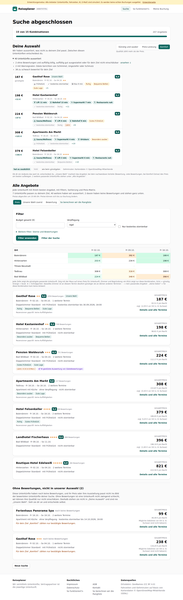
- Notiz: Komfort-Finalisten: Gasthof Rose, Hotel Kastanienhof, Pension Waldesruh, Apartments Am Markt, Hotel Felsenkeller
- Prüfungen:
  - [x] enthält „Qualität zählt mehr als der Preis.“
  - [x] Element `[data-testid="finale"][data-goal="komfort"] [data-testid="finalist"]` vorhanden (5)
- Überschriften: „Suche abgeschlossen“, „Deine Auswahl“, „Alle Angebote“
- KI-Kennzeichnungen (`data-ai-provenance`): „KI-gestützte Auswertung von Gästebewertungen [ai_assisted]“
- Konsolenfehler: keine
- Fehlgeschlagene Anfragen: keine

<details><summary>Sichtbarer Text</summary>

```text
Entwicklungsmodus: Alle Anbieter (Unterkünfte, Fahrzeiten, KI, E-Mail) sind simuliert. Es werden keine echten Buchungen ausgelöst. · Entwicklerseite
Reiseplaner
ARBEITSTITEL
Suche
So funktioniert's
Meine Buchung
Suche abgeschlossen

15 von 15 Kombinationen

207 Angebote

Deine Auswahl

Wir haben aussortiert, was nicht zu deinem Ziel passt. Zwischen diesen Unterkünften entscheidest du.

Günstig und sauber
Preis-Leistung
Komfort

Qualität zählt mehr als der Preis.

40 Unterkünfte aussortiert
2 ohne Bewertungen und auffällig billig, auffällig gut ausgestattet oder für dein Ziel nicht einschätzbar · ansehen ↓
2 mit Warnsignalen: Gäste berichten von Schimmel, Ungeziefer oder Schmutz
36 zu schwach bewertet für dein Ziel
187 €
günstigste
Gasthof Rose
Unsere Wahl
9,0

Baiersbronn · Fr 02.10. – So 04.10.★★

Frühstück
kostenlos stornierbar
Bus 9 min
Ruhig
Bequeme Betten
Gute Lage
+5
198 €
+11 €
Hotel Kastanienhof
9,2

Hinterzarten · Fr 16.10. – So 18.10.★★

Lift 11 min
Bahnhof 13 min
Supermarkt 7 min
Restaurants nah
kostenlos stornierbar
Ruhig
+11
224 €
+37 €
Pension Waldesruh
8,3

Bad Wildbad · Fr 02.10. – So 04.10.★★★

Sauna/Wellness
Lift 6 min
Bahnhof 8 min
Gutes Frühstück
kostenlos stornierbar
Ruhig
Lärm
+9
308 €
+121 €
Apartments Am Markt
9,0

Todtnau · Fr 16.10. – So 18.10.

Sauna/Wellness
Supermarkt 4 min
Ortskern
Besonders sauber
Frühstück
kostenlos stornierbar
+10
379 €
+192 €
Hotel Felsenkeller
9,2

Baiersbronn · Fr 16.10. – So 18.10.★★★★

Sauna/Wellness
Lift 3 min
Supermarkt 6 min
Restaurants nah
kostenlos stornierbar
Bequeme Betten
+10
hat es zusätzlich
fehlt
wie beim günstigsten
Gehminuten: Kartendaten © OpenStreetMap-Mitwirkende

Ob dir ein Aufpreis das wert ist, entscheidest du. „Unsere Wahl“ markiert das Angebot, bei dem nachweisbare Vorteile (Bewertung, viele Bew
… (4846 weitere Zeichen)
```

</details>

### 29 Lob-Labels erscheinen von selbst in der Liste

- URL: `/suche/5422e73d-8d0d-480d-adaa-3c91823d5805#t=au6O3cistU5oRsXUNBFgSn5EZBawWpW1kmkcX9Obzn4`
- Screenshot: 
- Notiz: Labels in der Liste: Ruhig, Bequeme Betten, Gute Lage, Besonders sauber, Gutes Frühstück (11 insgesamt).
- Prüfungen:
  - [x] Element `[data-testid="result-list"] [data-testid="praise-label"]` vorhanden (11)
- Überschriften: „Suche abgeschlossen“, „Deine Auswahl“, „Alle Angebote“
- KI-Kennzeichnungen (`data-ai-provenance`): „KI-gestützte Auswertung von Gästebewertungen [ai_assisted]“
- Konsolenfehler: keine
- Fehlgeschlagene Anfragen: keine

<details><summary>Sichtbarer Text</summary>

```text
Entwicklungsmodus: Alle Anbieter (Unterkünfte, Fahrzeiten, KI, E-Mail) sind simuliert. Es werden keine echten Buchungen ausgelöst. · Entwicklerseite
Reiseplaner
ARBEITSTITEL
Suche
So funktioniert's
Meine Buchung
Suche abgeschlossen

15 von 15 Kombinationen

207 Angebote

Deine Auswahl

Wir haben aussortiert, was nicht zu deinem Ziel passt. Zwischen diesen Unterkünften entscheidest du.

Günstig und sauber
Preis-Leistung
Komfort

Qualität zählt mehr als der Preis.

40 Unterkünfte aussortiert
2 ohne Bewertungen und auffällig billig, auffällig gut ausgestattet oder für dein Ziel nicht einschätzbar · ansehen ↓
2 mit Warnsignalen: Gäste berichten von Schimmel, Ungeziefer oder Schmutz
36 zu schwach bewertet für dein Ziel
187 €
günstigste
Gasthof Rose
Unsere Wahl
9,0

Baiersbronn · Fr 02.10. – So 04.10.★★

Frühstück
kostenlos stornierbar
Bus 9 min
Ruhig
Bequeme Betten
Gute Lage
+5
198 €
+11 €
Hotel Kastanienhof
9,2

Hinterzarten · Fr 16.10. – So 18.10.★★

Lift 11 min
Bahnhof 13 min
Supermarkt 7 min
Restaurants nah
kostenlos stornierbar
Ruhig
+11
224 €
+37 €
Pension Waldesruh
8,3

Bad Wildbad · Fr 02.10. – So 04.10.★★★

Sauna/Wellness
Lift 6 min
Bahnhof 8 min
Gutes Frühstück
kostenlos stornierbar
Ruhig
Lärm
+9
308 €
+121 €
Apartments Am Markt
9,0

Todtnau · Fr 16.10. – So 18.10.

Sauna/Wellness
Supermarkt 4 min
Ortskern
Besonders sauber
Frühstück
kostenlos stornierbar
+10
379 €
+192 €
Hotel Felsenkeller
9,2

Baiersbronn · Fr 16.10. – So 18.10.★★★★

Sauna/Wellness
Lift 3 min
Supermarkt 6 min
Restaurants nah
kostenlos stornierbar
Bequeme Betten
+10
hat es zusätzlich
fehlt
wie beim günstigsten
Gehminuten: Kartendaten © OpenStreetMap-Mitwirkende

Ob dir ein Aufpreis das wert ist, entscheidest du. „Unsere Wahl“ markiert das Angebot, bei dem nachweisbare Vorteile (Bewertung, viele Bew
… (4846 weitere Zeichen)
```

</details>

### 30 Detailansicht: „Was Gäste loben“ mit Zahlen

- URL: `/suche/5422e73d-8d0d-480d-adaa-3c91823d5805/unterkunft/lpf-4850-838-6#t=au6O3cistU5oRsXUNBFgSn5EZBawWpW1kmkcX9Obzn4`
- Screenshot: 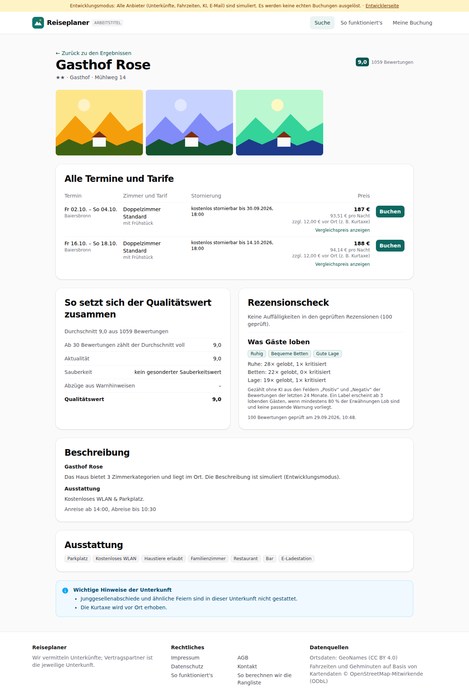
- Notiz: Detail: Ruhe: 28× gelobt, 1× kritisiert | Betten: 22× gelobt, 0× kritisiert | Lage: 19× gelobt, 1× kritisiert
- Prüfungen:
  - [x] enthält „Was Gäste loben“
  - [x] enthält „× gelobt“
  - [x] enthält „× kritisiert“
  - [x] enthält „ohne KI“
  - [x] Element `[data-testid="praise"] [data-testid="praise-label"]` vorhanden (3)
  - [x] Element `[data-testid="praise-count"]` vorhanden (3)
- Überschriften: „Gasthof Rose“, „Alle Termine und Tarife“, „So setzt sich der Qualitätswert zusammen“, „Rezensionscheck“, „Beschreibung“, „Ausstattung“
- KI-Kennzeichnungen (`data-ai-provenance`): keine
- Konsolenfehler: keine
- Fehlgeschlagene Anfragen: keine

<details><summary>Sichtbarer Text</summary>

```text
Entwicklungsmodus: Alle Anbieter (Unterkünfte, Fahrzeiten, KI, E-Mail) sind simuliert. Es werden keine echten Buchungen ausgelöst. · Entwicklerseite
Reiseplaner
ARBEITSTITEL
Suche
So funktioniert's
Meine Buchung
← Zurück zu den Ergebnissen
Gasthof Rose

★★ · Gasthof · Mühlweg 14

9,0
1059 Bewertungen
Alle Termine und Tarife
Termin	Zimmer und Tarif	Stornierung	Preis	

Fr 02.10. – So 04.10.
Baiersbronn
	
Doppelzimmer Standard
mit Frühstück
	kostenlos stornierbar bis 30.09.2026, 18:00	
187 €
93,51 € pro Nacht
zzgl. 12,00 € vor Ort (z. B. Kurtaxe)
Vergleichspreis anzeigen
	Buchen

Fr 16.10. – So 18.10.
Baiersbronn
	
Doppelzimmer Standard
mit Frühstück
	kostenlos stornierbar bis 14.10.2026, 18:00	
188 €
94,14 € pro Nacht
zzgl. 12,00 € vor Ort (z. B. Kurtaxe)
Vergleichspreis anzeigen
	Buchen
So setzt sich der Qualitätswert zusammen
Durchschnitt 9,0 aus 1059 Bewertungen
Ab 30 Bewertungen zählt der Durchschnitt voll
9,0
Aktualität
9,0
Sauberkeit
kein gesonderter Sauberkeitswert
Abzüge aus Warnhinweisen
–
Qualitätswert
9,0
Rezensionscheck

Keine Auffälligkeiten in den geprüften Rezensionen (100 geprüft).

Was Gäste loben
Ruhig
Bequeme Betten
Gute Lage
Ruhe: 28× gelobt, 1× kritisiert
Betten: 22× gelobt, 0× kritisiert
Lage: 19× gelobt, 1× kritisiert

Gezählt ohne KI aus den Feldern „Positiv“ und „Negativ“ der Bewertungen der letzten 24 Monate. Ein Label erscheint ab 3 lobenden Gästen, wenn mindestens 80 % der Erwähnungen Lob sind und keine passende Warnung vorliegt.

100 Bewertungen geprüft am 29.09.2026, 10:48.

Beschreibung
Gasthof Rose

Das Haus bietet 3 Zimmerkategorien und liegt im Ort. Die Beschreibung ist simuliert (Entwicklungsmodus).

Ausstattung

Kostenloses WLAN & Parkplatz.

Anreise ab 14:00, Abreise bis 10:30

Ausstattung
Parkplatz
Kostenloses WLAN
Haustiere erlaubt
F
… (515 weitere Zeichen)
```

</details>

### 31 Sterne und Mindestbewertung unter „Weitere Filter“

- URL: `/suche/5422e73d-8d0d-480d-adaa-3c91823d5805#t=au6O3cistU5oRsXUNBFgSn5EZBawWpW1kmkcX9Obzn4`
- Screenshot: 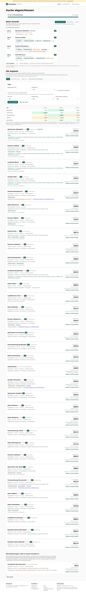
- Prüfungen:
  - [x] enthält „Weitere Filter: Sterne und Bewertungen“
  - [x] enthält „Sterne ab“
  - [x] enthält „Bewertung ab“
  - [x] enthält „Sterne sagen wenig über Sauberkeit und Zustand.“
- Überschriften: „Suche abgeschlossen“, „Deine Auswahl“, „Alle Angebote“
- KI-Kennzeichnungen (`data-ai-provenance`): „KI-gestützte Auswertung von Gästebewertungen [ai_assisted]“, „KI-gestützte Auswertung von Gästebewertungen [ai_assisted]“, „KI-gestützte Auswertung von Gästebewertungen [ai_assisted]“, „KI-gestützte Auswertung von Gästebewertungen [ai_assisted]“
- Konsolenfehler: keine
- Fehlgeschlagene Anfragen: keine

<details><summary>Sichtbarer Text</summary>

```text
Entwicklungsmodus: Alle Anbieter (Unterkünfte, Fahrzeiten, KI, E-Mail) sind simuliert. Es werden keine echten Buchungen ausgelöst. · Entwicklerseite
Reiseplaner
ARBEITSTITEL
Suche
So funktioniert's
Meine Buchung
Suche abgeschlossen

15 von 15 Kombinationen

207 Angebote

Deine Auswahl

Wir haben aussortiert, was nicht zu deinem Ziel passt. Zwischen diesen Unterkünften entscheidest du.

Günstig und sauber
Preis-Leistung
Komfort

Der Preis zählt am meisten, Sauberkeit ist Pflicht.

43 Unterkünfte aussortiert
123 €
günstigste
Apartments Alpenblick
Unsere Wahl
8,0

Hinterzarten · Fr 02.10. – So 04.10.★★★

Sauna/Wellness
Ruhig
Küche
138 €
+15 €
Pension Seeblick
8,2

Titisee-Neustadt · Fr 09.10. – So 11.10.★★

Frühstück
kostenlos stornierbar
Lift 7 min
Bahnhof 9 min
Ruhig
Küche
+10
152 €
+29 €
Gasthof Wiesengrund
7,1

Bad Wildbad · Fr 09.10. – So 11.10.★★

Frühstück
Restaurants nah
Bequeme Betten
Parkplatz
Sauna/Wellness
Ruhig
Abweichung von Fotos oder Beschreibung
+3
158 €
+36 €
Hotel Almrausch
8,1

Titisee-Neustadt · Fr 09.10. – So 11.10.★★

Frühstück
kostenlos stornierbar
Supermarkt 8 min
Besonders sauber
Ruhig
Küche
+4
hat es zusätzlich
fehlt
wie beim günstigsten
Gehminuten: Kartendaten © OpenStreetMap-Mitwirkende

Ob dir ein Aufpreis das wert ist, entscheidest du. „Unsere Wahl“ markiert das Angebot, bei dem nachweisbare Vorteile (Bewertung, viele Bewertungen, bei Komfort Extras) den Preis am besten aufwiegen.

Alle Angebote

Jede Unterkunft mit ihrem besten Angebot, mit Filtern, Sortierung und Preis-Matrix.

33 Unterkünfte passen zu deinem Ziel, 14 weitere haben wir aussortiert. Eine davon hat keine Bewertungen und steht ganz unten.

Preise abgerufen um 10:48 Uhr. Preise können sich bis zur Buchung ändern.

Sortierung
Preis
Unsere Wahl zuerst
Bewertung
So berechnen wir d
… (12476 weitere Zeichen)
```

</details>

## Flow „warnungen“

Rezensionscheck (F8, Akzeptanzbeispiel 4): Suche Stuttgart → Füssen × 2 Freitage; die Rezensionen der wahrscheinlichen Finalisten werden geprüft. „Hotel Schwanen“ (Schimmel) ist seit dem 28.09. aus Liste und Matrix aussortiert („mit Warnsignalen“); seine Detailansicht zeigt „Schimmel: 3 Erwähnungen, davon 3 in den letzten 6 Monaten“ mit KI-Kennzeichnung; Warnhinweise anderer Häuser stehen mit KI-Kennzeichnung in der Liste; eine geprüfte Unterkunft ohne Treffer zeigt „keine Auffälligkeiten“.

### 32 Suchrahmen gesetzt und eigener Ort Füssen gewählt

- URL: `/suche`
- Screenshot: 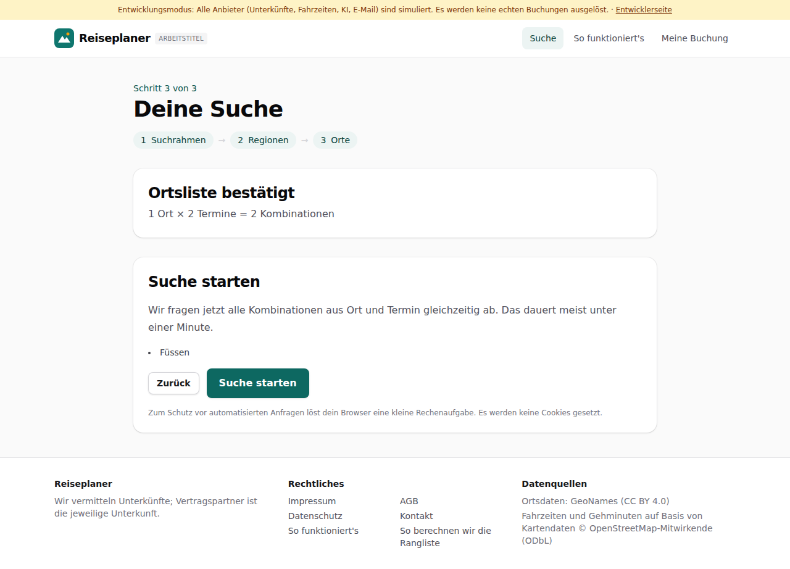
- Prüfungen:
  - [x] enthält „1 Ort × 2 Termine = 2 Kombinationen“
  - [x] enthält „Suche starten“
- Überschriften: „Deine Suche“, „Ortsliste bestätigt“, „Suche starten“
- KI-Kennzeichnungen (`data-ai-provenance`): keine
- Konsolenfehler: keine
- Fehlgeschlagene Anfragen: keine

<details><summary>Sichtbarer Text</summary>

```text
Entwicklungsmodus: Alle Anbieter (Unterkünfte, Fahrzeiten, KI, E-Mail) sind simuliert. Es werden keine echten Buchungen ausgelöst. · Entwicklerseite
Reiseplaner
ARBEITSTITEL
Suche
So funktioniert's
Meine Buchung

Schritt 3 von 3

Deine Suche
1
Suchrahmen
→
2
Regionen
→
3
Orte
Ortsliste bestätigt

1 Ort × 2 Termine = 2 Kombinationen

Suche starten

Wir fragen jetzt alle Kombinationen aus Ort und Termin gleichzeitig ab. Das dauert meist unter einer Minute.

Füssen
Zurück
Suche starten

Zum Schutz vor automatisierten Anfragen löst dein Browser eine kleine Rechenaufgabe. Es werden keine Cookies gesetzt.

Reiseplaner

Wir vermitteln Unterkünfte; Vertragspartner ist die jeweilige Unterkunft.

Rechtliches

Impressum
AGB
Datenschutz
Kontakt
So funktioniert's
So berechnen wir die Rangliste

Datenquellen

Ortsdaten: GeoNames (CC BY 4.0)
Fahrzeiten und Gehminuten auf Basis von Kartendaten © OpenStreetMap-Mitwirkende (ODbL)
```

</details>

### 33 Suche mit Rezensionscheck abgeschlossen

- URL: `/suche/9a204ae9-8141-4118-9cfa-3a5af8ca41d6#t=_TaHxt5N97iDrQi59OhsyZjx97w51iB-OXqJnif_f3o`
- Screenshot: 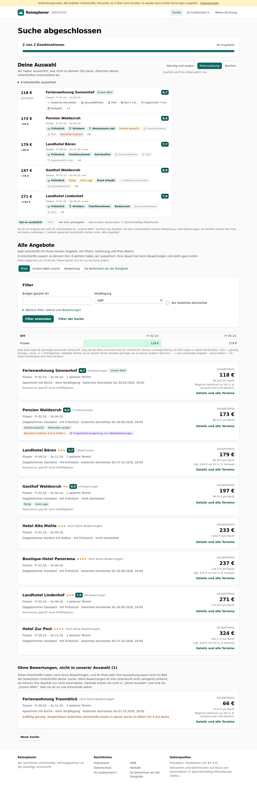
- Notiz: Der Rezensionscheck war zu schnell für den Zwischenstand.
- Prüfungen:
  - [x] enthält „Suche abgeschlossen“
  - [x] enthält „2 von 2 Kombinationen“
  - [x] enthält „Alle Angebote“
  - [x] Element `[data-testid="result-warnings"]` vorhanden (1)
- Überschriften: „Suche abgeschlossen“, „Deine Auswahl“, „Alle Angebote“
- KI-Kennzeichnungen (`data-ai-provenance`): „KI-gestützte Auswertung von Gästebewertungen [ai_assisted]“
- Konsolenfehler: keine
- Fehlgeschlagene Anfragen: keine

<details><summary>Sichtbarer Text</summary>

```text
Entwicklungsmodus: Alle Anbieter (Unterkünfte, Fahrzeiten, KI, E-Mail) sind simuliert. Es werden keine echten Buchungen ausgelöst. · Entwicklerseite
Reiseplaner
ARBEITSTITEL
Suche
So funktioniert's
Meine Buchung
Suche abgeschlossen

2 von 2 Kombinationen

40 Angebote

Deine Auswahl

Wir haben aussortiert, was nicht zu deinem Ziel passt. Zwischen diesen Unterkünften entscheidest du.

Günstig und sauber
Preis-Leistung
Komfort

Qualität und Preis zählen gleich viel.

9 Unterkünfte aussortiert
118 €
günstigste
Ferienwohnung Sonnenhof
Unsere Wahl
6,7

Füssen · Fr 02.10. – So 04.10.

kostenlos stornierbar
Sauna/Wellness
Pool
Bus 5 min
Supermarkt 7 min
Parkplatz
+1
173 €
+54 €
Pension Waldesruh
8,6

Füssen · Fr 02.10. – So 04.10.

Frühstück
Ortskern
Restaurants nah
Schöne Aussicht
Sauna/Wellness
Pool
Baulicher Zustand
+8
179 €
+60 €
Landhotel Bären
7,7

Füssen · Fr 09.10. – So 11.10.★★★

Frühstück
Familienzimmer
barrierefrei
Sauna/Wellness
Pool
Supermarkt 7 min
+4
197 €
+78 €
Gasthof Waldesruh
8,9

Füssen · Fr 02.10. – So 04.10.★★

Frühstück
Ruhig
Gute Lage
Hund erlaubt
kostenlos stornierbar
Sauna/Wellness
+6
271 €
+152 €
Landhotel Lindenhof
7,9

Füssen · Fr 02.10. – So 04.10.★★★

Frühstück
Ortskern
Familienzimmer
Restaurant
Sauna/Wellness
Pool
+5
hat es zusätzlich
fehlt
wie beim günstigsten
Gehminuten: Kartendaten © OpenStreetMap-Mitwirkende

Ob dir ein Aufpreis das wert ist, entscheidest du. „Unsere Wahl“ markiert das Angebot, bei dem nachweisbare Vorteile (Bewertung, viele Bewertungen, bei Komfort Extras) den Preis am besten aufwiegen. 2 weitere passende Unterkünfte stehen unter „Alle Angebote“.

Alle Angebote

Jede Unterkunft mit ihrem besten Angebot, mit Filtern, Sortierung und Preis-Matrix.

8 Unterkünfte passen zu deinem Ziel, 8 weitere haben wir aussortiert. Eine davon
… (4315 weitere Zeichen)
```

</details>

### 34 Liste: „Hotel Schwanen“ (Schimmel) aussortiert, andere Warnhinweise mit KI-Kennzeichnung

- URL: `/suche/9a204ae9-8141-4118-9cfa-3a5af8ca41d6#t=_TaHxt5N97iDrQi59OhsyZjx97w51iB-OXqJnif_f3o`
- Screenshot: 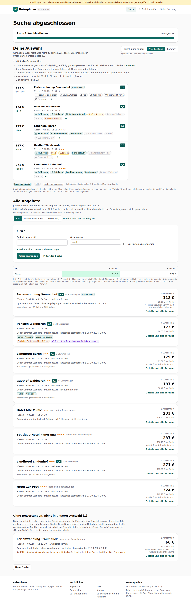
- Notiz: Aussortiert: 1 ohne Bewertungen und auffällig billig, auffällig gut ausgestattet oder für dein Ziel nicht einschätzbar · ansehen ↓ | 2 mit Warnsignalen: Gäste berichten von Schimmel, Ungeziefer oder Schmutz | 1 Sterne-Falle: 4 oder mehr Sterne zum Preis eines einfachen Hauses, aber ohne geprüfte gute Bewertungen | 4 zu schwach bewertet für dein Ziel und nicht deutlich günstiger | 1 zu teuer für dein Ziel
- Notiz: Liste: 8 Unterkünfte, 1 davon mit Warnhinweisen, 4 geprüft ohne Auffälligkeiten; „Hotel Schwanen“ nicht dabei.
- Prüfungen:
  - [x] enthält „mit Warnsignalen: Gäste berichten von Schimmel“
  - [x] enthält „KI-gestützte Auswertung von Gästebewertungen“
  - [x] Element `[data-testid="excluded"] li[data-reason="red_flag"]` vorhanden (1)
  - [x] Element `[data-testid="result-warnings"] [data-ai-provenance="ai_assisted"]` vorhanden (1)
  - [x] Element `[data-testid="result-review-ok"]` vorhanden (4)
- Überschriften: „Suche abgeschlossen“, „Deine Auswahl“, „Alle Angebote“
- KI-Kennzeichnungen (`data-ai-provenance`): „KI-gestützte Auswertung von Gästebewertungen [ai_assisted]“
- Konsolenfehler: keine
- Fehlgeschlagene Anfragen: keine

<details><summary>Sichtbarer Text</summary>

```text
Entwicklungsmodus: Alle Anbieter (Unterkünfte, Fahrzeiten, KI, E-Mail) sind simuliert. Es werden keine echten Buchungen ausgelöst. · Entwicklerseite
Reiseplaner
ARBEITSTITEL
Suche
So funktioniert's
Meine Buchung
Suche abgeschlossen

2 von 2 Kombinationen

40 Angebote

Deine Auswahl

Wir haben aussortiert, was nicht zu deinem Ziel passt. Zwischen diesen Unterkünften entscheidest du.

Günstig und sauber
Preis-Leistung
Komfort

Qualität und Preis zählen gleich viel.

9 Unterkünfte aussortiert
1 ohne Bewertungen und auffällig billig, auffällig gut ausgestattet oder für dein Ziel nicht einschätzbar · ansehen ↓
2 mit Warnsignalen: Gäste berichten von Schimmel, Ungeziefer oder Schmutz
1 Sterne-Falle: 4 oder mehr Sterne zum Preis eines einfachen Hauses, aber ohne geprüfte gute Bewertungen
4 zu schwach bewertet für dein Ziel und nicht deutlich günstiger
1 zu teuer für dein Ziel
118 €
günstigste
Ferienwohnung Sonnenhof
Unsere Wahl
6,7

Füssen · Fr 02.10. – So 04.10.

kostenlos stornierbar
Sauna/Wellness
Pool
Bus 5 min
Supermarkt 7 min
Parkplatz
+1
173 €
+54 €
Pension Waldesruh
8,6

Füssen · Fr 02.10. – So 04.10.

Frühstück
Ortskern
Restaurants nah
Schöne Aussicht
Sauna/Wellness
Pool
Baulicher Zustand
+8
179 €
+60 €
Landhotel Bären
7,7

Füssen · Fr 09.10. – So 11.10.★★★

Frühstück
Familienzimmer
barrierefrei
Sauna/Wellness
Pool
Supermarkt 7 min
+4
197 €
+78 €
Gasthof Waldesruh
8,9

Füssen · Fr 02.10. – So 04.10.★★

Frühstück
Ruhig
Gute Lage
Hund erlaubt
kostenlos stornierbar
Sauna/Wellness
+6
271 €
+152 €
Landhotel Lindenhof
7,9

Füssen · Fr 02.10. – So 04.10.★★★

Frühstück
Ortskern
Familienzimmer
Restaurant
Sauna/Wellness
Pool
+5
hat es zusätzlich
fehlt
wie beim günstigsten
Gehminuten: Kartendaten © OpenStreetMap-Mitwirkende

Ob dir ein Aufpreis das wert ist, entscheidest du. „Un
… (4702 weitere Zeichen)
```

</details>

### 35 Detailansicht „Hotel Schwanen“: Schimmel 3 von 3 in den letzten 6 Monaten, KI-gestützt (Akzeptanzbeispiel 4)

- URL: `/suche/9a204ae9-8141-4118-9cfa-3a5af8ca41d6/unterkunft/lpf-4757-1070-1#t=_TaHxt5N97iDrQi59OhsyZjx97w51iB-OXqJnif_f3o`
- Screenshot: 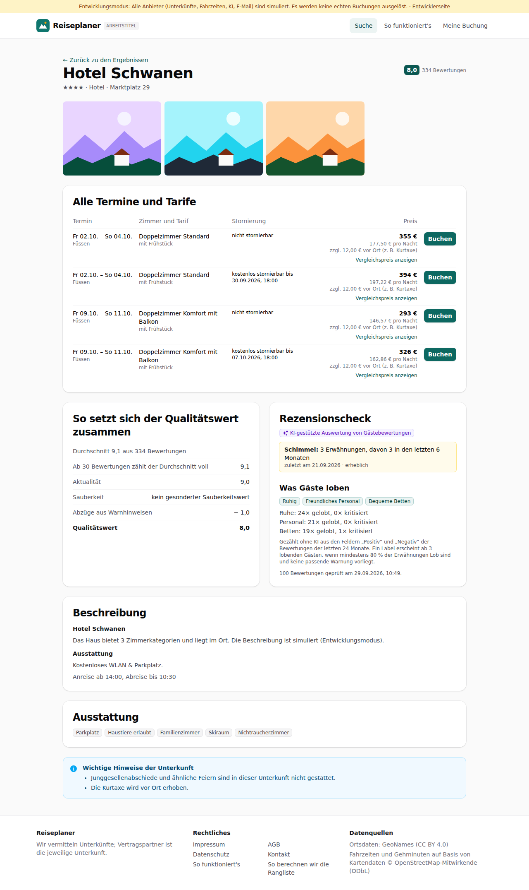
- Prüfungen:
  - [x] enthält „Schimmel: 3 Erwähnungen, davon 3 in den letzten 6 Monaten“
  - [x] enthält „KI-gestützte Auswertung von Gästebewertungen“
  - [x] enthält „erheblich“
  - [x] enthält „Bewertungen geprüft am“
  - [x] enthält „Abzüge aus Warnhinweisen“
  - [x] enthält nicht „Hinweis (ungeprüft)“
  - [x] Element `[data-testid="review-check"] [data-ai-provenance="ai_assisted"]` vorhanden (1)
  - [x] Element `[data-testid="warning"][data-verified="true"]` vorhanden (1)
- Überschriften: „Hotel Schwanen“, „Alle Termine und Tarife“, „So setzt sich der Qualitätswert zusammen“, „Rezensionscheck“, „Beschreibung“, „Ausstattung“
- KI-Kennzeichnungen (`data-ai-provenance`): „KI-gestützte Auswertung von Gästebewertungen [ai_assisted]“
- Konsolenfehler: keine
- Fehlgeschlagene Anfragen: keine

<details><summary>Sichtbarer Text</summary>

```text
Entwicklungsmodus: Alle Anbieter (Unterkünfte, Fahrzeiten, KI, E-Mail) sind simuliert. Es werden keine echten Buchungen ausgelöst. · Entwicklerseite
Reiseplaner
ARBEITSTITEL
Suche
So funktioniert's
Meine Buchung
← Zurück zu den Ergebnissen
Hotel Schwanen

★★★★ · Hotel · Marktplatz 29

8,0
334 Bewertungen
Alle Termine und Tarife
Termin	Zimmer und Tarif	Stornierung	Preis	

Fr 02.10. – So 04.10.
Füssen
	
Doppelzimmer Standard
mit Frühstück
	nicht stornierbar	
355 €
177,50 € pro Nacht
zzgl. 12,00 € vor Ort (z. B. Kurtaxe)
Vergleichspreis anzeigen
	Buchen

Fr 02.10. – So 04.10.
Füssen
	
Doppelzimmer Standard
mit Frühstück
	kostenlos stornierbar bis 30.09.2026, 18:00	
394 €
197,22 € pro Nacht
zzgl. 12,00 € vor Ort (z. B. Kurtaxe)
Vergleichspreis anzeigen
	Buchen

Fr 09.10. – So 11.10.
Füssen
	
Doppelzimmer Komfort mit Balkon
mit Frühstück
	nicht stornierbar	
293 €
146,57 € pro Nacht
zzgl. 12,00 € vor Ort (z. B. Kurtaxe)
Vergleichspreis anzeigen
	Buchen

Fr 09.10. – So 11.10.
Füssen
	
Doppelzimmer Komfort mit Balkon
mit Frühstück
	kostenlos stornierbar bis 07.10.2026, 18:00	
326 €
162,86 € pro Nacht
zzgl. 12,00 € vor Ort (z. B. Kurtaxe)
Vergleichspreis anzeigen
	Buchen
So setzt sich der Qualitätswert zusammen
Durchschnitt 9,1 aus 334 Bewertungen
Ab 30 Bewertungen zählt der Durchschnitt voll
9,1
Aktualität
9,0
Sauberkeit
kein gesonderter Sauberkeitswert
Abzüge aus Warnhinweisen
− 1,0
Qualitätswert
8,0
Rezensionscheck
KI-gestützte Auswertung von Gästebewertungen
Schimmel: 3 Erwähnungen, davon 3 in den letzten 6 Monaten
zuletzt am 21.09.2026 · erheblich
Was Gäste loben
Ruhig
Freundliches Personal
Bequeme Betten
Ruhe: 24× gelobt, 0× kritisiert
Personal: 21× gelobt, 0× kritisiert
Betten: 19× gelobt, 1× kritisiert

Gezählt ohne KI aus den Feldern „Positiv“ und „Negativ“ der Bewertun
… (970 weitere Zeichen)
```

</details>

### 36 Geprüfte Unterkunft ohne Auffälligkeiten

- URL: `/suche/9a204ae9-8141-4118-9cfa-3a5af8ca41d6/unterkunft/lpf-4757-1070-10#t=_TaHxt5N97iDrQi59OhsyZjx97w51iB-OXqJnif_f3o`
- Screenshot: 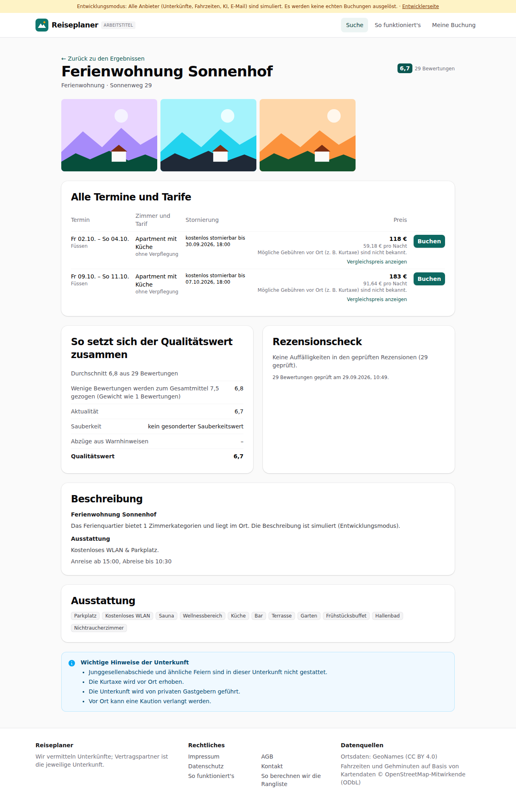
- Prüfungen:
  - [x] enthält „Keine Auffälligkeiten in den geprüften Rezensionen“
  - [x] enthält „Bewertungen geprüft am“
  - [x] Element `[data-testid="review-no-issues"]` vorhanden (1)
- Überschriften: „Ferienwohnung Sonnenhof“, „Alle Termine und Tarife“, „So setzt sich der Qualitätswert zusammen“, „Rezensionscheck“, „Beschreibung“, „Ausstattung“
- KI-Kennzeichnungen (`data-ai-provenance`): keine
- Konsolenfehler: keine
- Fehlgeschlagene Anfragen: keine

<details><summary>Sichtbarer Text</summary>

```text
Entwicklungsmodus: Alle Anbieter (Unterkünfte, Fahrzeiten, KI, E-Mail) sind simuliert. Es werden keine echten Buchungen ausgelöst. · Entwicklerseite
Reiseplaner
ARBEITSTITEL
Suche
So funktioniert's
Meine Buchung
← Zurück zu den Ergebnissen
Ferienwohnung Sonnenhof

Ferienwohnung · Sonnenweg 29

6,7
29 Bewertungen
Alle Termine und Tarife
Termin	Zimmer und Tarif	Stornierung	Preis	

Fr 02.10. – So 04.10.
Füssen
	
Apartment mit Küche
ohne Verpflegung
	kostenlos stornierbar bis 30.09.2026, 18:00	
118 €
59,18 € pro Nacht
Mögliche Gebühren vor Ort (z. B. Kurtaxe) sind nicht bekannt.
Vergleichspreis anzeigen
	Buchen

Fr 09.10. – So 11.10.
Füssen
	
Apartment mit Küche
ohne Verpflegung
	kostenlos stornierbar bis 07.10.2026, 18:00	
183 €
91,64 € pro Nacht
Mögliche Gebühren vor Ort (z. B. Kurtaxe) sind nicht bekannt.
Vergleichspreis anzeigen
	Buchen
So setzt sich der Qualitätswert zusammen
Durchschnitt 6,8 aus 29 Bewertungen
Wenige Bewertungen werden zum Gesamtmittel 7,5 gezogen (Gewicht wie 1 Bewertungen)
6,8
Aktualität
6,7
Sauberkeit
kein gesonderter Sauberkeitswert
Abzüge aus Warnhinweisen
–
Qualitätswert
6,7
Rezensionscheck

Keine Auffälligkeiten in den geprüften Rezensionen (29 geprüft).

29 Bewertungen geprüft am 29.09.2026, 10:49.

Beschreibung
Ferienwohnung Sonnenhof

Das Ferienquartier bietet 1 Zimmerkategorien und liegt im Ort. Die Beschreibung ist simuliert (Entwicklungsmodus).

Ausstattung

Kostenloses WLAN & Parkplatz.

Anreise ab 15:00, Abreise bis 10:30

Ausstattung
Parkplatz
Kostenloses WLAN
Sauna
Wellnessbereich
Küche
Bar
Terrasse
Garten
Frühstücksbuffet
Hallenbad
Nichtraucherzimmer

Wichtige Hinweise der Unterkunft

Junggesellenabschiede und ähnliche Feiern sind in dieser Unterkunft nicht gestattet.
Die Kurtaxe wird vor Ort erhoben.
Die Unterkunft wird von privaten
… (382 weitere Zeichen)
```

</details>

## Flow „buchung“

Buchung (F11–F13, Akzeptanzbeispiel 5): Suche Füssen × 2 Freitage → Detailansicht → Buchungsformular mit Pflicht-Bestätigungen → simulierte Zahlung (Fake-Modus) → Bestätigung mit Buchungsnummer und Hotel-Bestätigungsnummer → Buchungsansicht → Stornierung mit Kostenvorschau → Zugangslink unter „Meine Buchung“.

### 37 Suche abgeschlossen, Detailansicht geöffnet

- URL: `/suche/94643e27-c89d-4a22-bd5b-849f9aeb1414/unterkunft/lpf-4757-1070-10#t=MOtOt4WfXRlX1b3VRSaUEdZEoAdnCLLpJQd-ZNuTu0A`
- Screenshot: 
- Prüfungen:
  - [x] enthält „Alle Termine und Tarife“
  - [x] enthält „Buchen“
  - [x] Element `[data-testid="book-offer"]` vorhanden (2)
- Überschriften: „Ferienwohnung Sonnenhof“, „Alle Termine und Tarife“, „So setzt sich der Qualitätswert zusammen“, „Rezensionscheck“, „Beschreibung“, „Ausstattung“
- KI-Kennzeichnungen (`data-ai-provenance`): keine
- Konsolenfehler: keine
- Fehlgeschlagene Anfragen: keine

<details><summary>Sichtbarer Text</summary>

```text
Entwicklungsmodus: Alle Anbieter (Unterkünfte, Fahrzeiten, KI, E-Mail) sind simuliert. Es werden keine echten Buchungen ausgelöst. · Entwicklerseite
Reiseplaner
ARBEITSTITEL
Suche
So funktioniert's
Meine Buchung
← Zurück zu den Ergebnissen
Ferienwohnung Sonnenhof

Ferienwohnung · Sonnenweg 29

6,7
29 Bewertungen
Alle Termine und Tarife
Termin	Zimmer und Tarif	Stornierung	Preis	

Fr 02.10. – So 04.10.
Füssen
	
Apartment mit Küche
ohne Verpflegung
	kostenlos stornierbar bis 30.09.2026, 18:00	
118 €
59,18 € pro Nacht
Mögliche Gebühren vor Ort (z. B. Kurtaxe) sind nicht bekannt.
Vergleichspreis anzeigen
	Buchen

Fr 09.10. – So 11.10.
Füssen
	
Apartment mit Küche
ohne Verpflegung
	kostenlos stornierbar bis 07.10.2026, 18:00	
183 €
91,64 € pro Nacht
Mögliche Gebühren vor Ort (z. B. Kurtaxe) sind nicht bekannt.
Vergleichspreis anzeigen
	Buchen
So setzt sich der Qualitätswert zusammen
Durchschnitt 6,8 aus 29 Bewertungen
Wenige Bewertungen werden zum Gesamtmittel 7,5 gezogen (Gewicht wie 1 Bewertungen)
6,8
Aktualität
6,7
Sauberkeit
kein gesonderter Sauberkeitswert
Abzüge aus Warnhinweisen
–
Qualitätswert
6,7
Rezensionscheck

Keine Auffälligkeiten in den geprüften Rezensionen (29 geprüft).

29 Bewertungen geprüft am 29.09.2026, 10:49.

Beschreibung
Ferienwohnung Sonnenhof

Das Ferienquartier bietet 1 Zimmerkategorien und liegt im Ort. Die Beschreibung ist simuliert (Entwicklungsmodus).

Ausstattung

Kostenloses WLAN & Parkplatz.

Anreise ab 15:00, Abreise bis 10:30

Ausstattung
Parkplatz
Kostenloses WLAN
Sauna
Wellnessbereich
Küche
Bar
Terrasse
Garten
Frühstücksbuffet
Hallenbad
Nichtraucherzimmer

Wichtige Hinweise der Unterkunft

Junggesellenabschiede und ähnliche Feiern sind in dieser Unterkunft nicht gestattet.
Die Kurtaxe wird vor Ort erhoben.
Die Unterkunft wird von privaten
… (382 weitere Zeichen)
```

</details>

### 38 Buchungsformular mit Angebot, Pflicht-Bestätigungen und Hinweis auf Beträge vor Ort

- URL: `/buchen/94643e27-c89d-4a22-bd5b-849f9aeb1414/lpf-4757-1070-10/1698#t=MOtOt4WfXRlX1b3VRSaUEdZEoAdnCLLpJQd-ZNuTu0A`
- Screenshot: 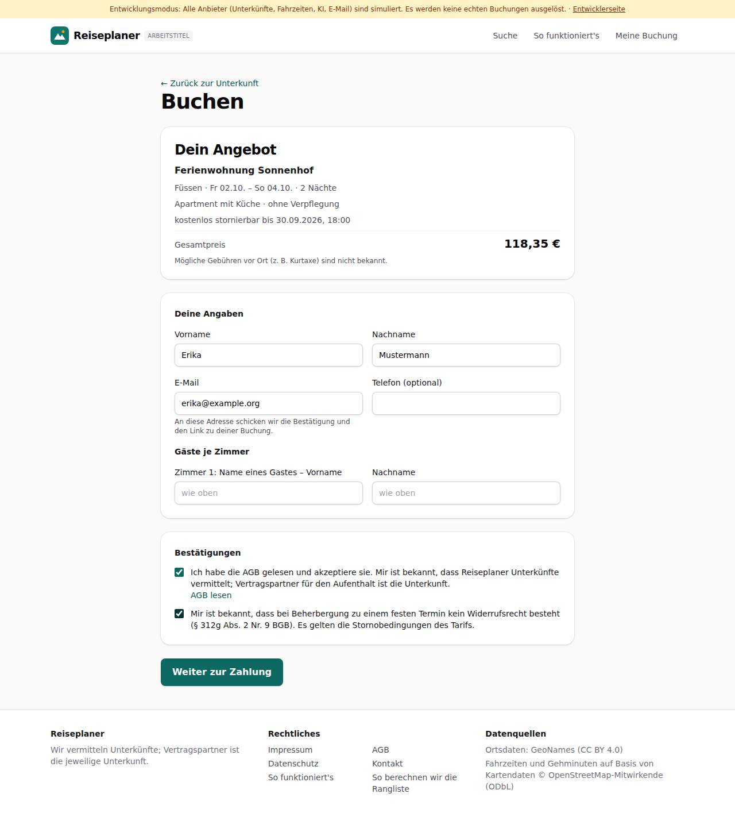
- Prüfungen:
  - [x] enthält „Dein Angebot“
  - [x] enthält „Gesamtpreis“
  - [x] enthält „Deine Angaben“
  - [x] enthält „Gäste je Zimmer“
  - [x] enthält „Vertragspartner für den Aufenthalt ist die Unterkunft“
  - [x] enthält „kein Widerrufsrecht“
  - [x] enthält „Weiter zur Zahlung“
  - [x] Element `[data-testid="booking-summary"]` vorhanden (1)
  - [x] Element `[data-testid="guest-row"]` vorhanden (1)
- Überschriften: „Buchen“, „Dein Angebot“
- KI-Kennzeichnungen (`data-ai-provenance`): keine
- Konsolenfehler: keine
- Fehlgeschlagene Anfragen: keine

<details><summary>Sichtbarer Text</summary>

```text
Entwicklungsmodus: Alle Anbieter (Unterkünfte, Fahrzeiten, KI, E-Mail) sind simuliert. Es werden keine echten Buchungen ausgelöst. · Entwicklerseite
Reiseplaner
ARBEITSTITEL
Suche
So funktioniert's
Meine Buchung
← Zurück zur Unterkunft
Buchen
Dein Angebot

Ferienwohnung Sonnenhof

Füssen · Fr 02.10. – So 04.10. · 2 Nächte

Apartment mit Küche · ohne Verpflegung

kostenlos stornierbar bis 30.09.2026, 18:00

Gesamtpreis
118,35 €

Mögliche Gebühren vor Ort (z. B. Kurtaxe) sind nicht bekannt.

Deine Angaben
Vorname
Nachname
E-Mail

An diese Adresse schicken wir die Bestätigung und den Link zu deiner Buchung.

Telefon (optional)
Gäste je Zimmer
Zimmer 1: Name eines Gastes – Vorname
Nachname
Bestätigungen
Ich habe die AGB gelesen und akzeptiere sie. Mir ist bekannt, dass Reiseplaner Unterkünfte vermittelt; Vertragspartner für den Aufenthalt ist die Unterkunft.
AGB lesen
Mir ist bekannt, dass bei Beherbergung zu einem festen Termin kein Widerrufsrecht besteht (§ 312g Abs. 2 Nr. 9 BGB). Es gelten die Stornobedingungen des Tarifs.
Weiter zur Zahlung

Reiseplaner

Wir vermitteln Unterkünfte; Vertragspartner ist die jeweilige Unterkunft.

Rechtliches

Impressum
AGB
Datenschutz
Kontakt
So funktioniert's
So berechnen wir die Rangliste

Datenquellen

Ortsdaten: GeoNames (CC BY 4.0)
Fahrzeiten und Gehminuten auf Basis von Kartendaten © OpenStreetMap-Mitwirkende (ODbL)
```

</details>

### 39 Angebot reserviert, Zahlungsseite (simuliert)

- URL: `/buchung/XNEGPEAS/zahlung`
- Screenshot: 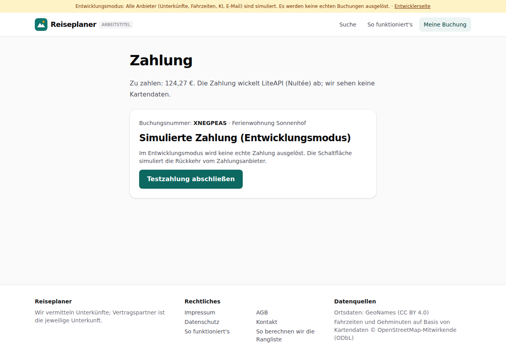
- Notiz: Der Preis hatte sich geändert; der neue Preis wurde im Dialog bestätigt.
- Prüfungen:
  - [x] enthält „Zahlung“
  - [x] enthält „Simulierte Zahlung (Entwicklungsmodus)“
  - [x] enthält „Testzahlung abschließen“
  - [x] enthält „wir sehen keine Kartendaten“
- Überschriften: „Zahlung“, „Simulierte Zahlung (Entwicklungsmodus)“
- KI-Kennzeichnungen (`data-ai-provenance`): keine
- Konsolenfehler: keine
- Fehlgeschlagene Anfragen: keine

<details><summary>Sichtbarer Text</summary>

```text
Entwicklungsmodus: Alle Anbieter (Unterkünfte, Fahrzeiten, KI, E-Mail) sind simuliert. Es werden keine echten Buchungen ausgelöst. · Entwicklerseite
Reiseplaner
ARBEITSTITEL
Suche
So funktioniert's
Meine Buchung
Zahlung

Zu zahlen: 124,27 €. Die Zahlung wickelt LiteAPI (Nuitée) ab; wir sehen keine Kartendaten.

Buchungsnummer: XNEGPEAS · Ferienwohnung Sonnenhof

Simulierte Zahlung (Entwicklungsmodus)

Im Entwicklungsmodus wird keine echte Zahlung ausgelöst. Die Schaltfläche simuliert die Rückkehr vom Zahlungsanbieter.

Testzahlung abschließen

Reiseplaner

Wir vermitteln Unterkünfte; Vertragspartner ist die jeweilige Unterkunft.

Rechtliches

Impressum
AGB
Datenschutz
Kontakt
So funktioniert's
So berechnen wir die Rangliste

Datenquellen

Ortsdaten: GeoNames (CC BY 4.0)
Fahrzeiten und Gehminuten auf Basis von Kartendaten © OpenStreetMap-Mitwirkende (ODbL)
```

</details>

### 40 Bestätigung mit Buchungsnummer und Hotel-Bestätigungsnummer

- URL: `/buchung/XNEGPEAS/abschluss`
- Screenshot: 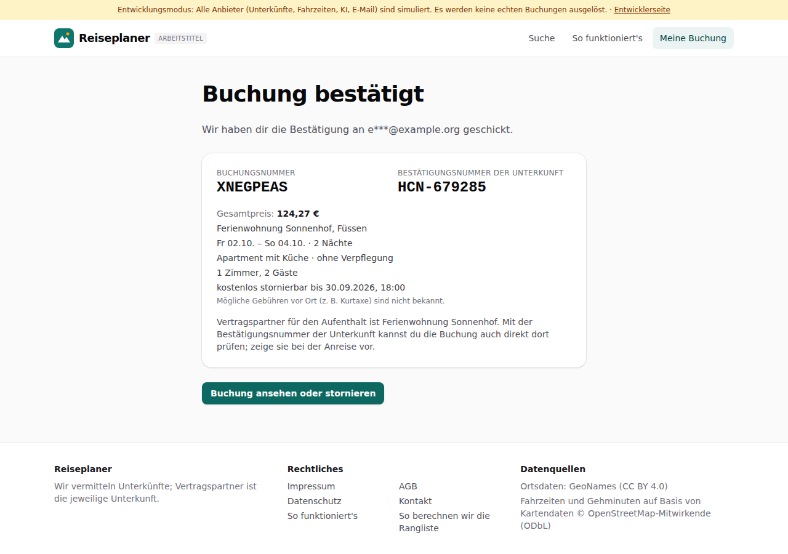
- Notiz: Buchungsnummer XNEGPEAS, Bestätigungsnummer der Unterkunft HCN-679285.
- Prüfungen:
  - [x] enthält „Buchung bestätigt“
  - [x] enthält „BUCHUNGSNUMMER“
  - [x] enthält „BESTÄTIGUNGSNUMMER DER UNTERKUNFT“
  - [x] enthält „HCN-“
  - [x] enthält „Vertragspartner für den Aufenthalt ist“
  - [x] enthält „e***@example.org“
  - [x] Element `[data-testid="booking-ref"]` vorhanden (1)
  - [x] Element `[data-testid="hotel-confirmation"]` vorhanden (1)
  - [x] Element `[data-testid="view-booking"]` vorhanden (1)
- Überschriften: „Buchung bestätigt“
- KI-Kennzeichnungen (`data-ai-provenance`): keine
- Konsolenfehler: keine
- Fehlgeschlagene Anfragen: keine

<details><summary>Sichtbarer Text</summary>

```text
Entwicklungsmodus: Alle Anbieter (Unterkünfte, Fahrzeiten, KI, E-Mail) sind simuliert. Es werden keine echten Buchungen ausgelöst. · Entwicklerseite
Reiseplaner
ARBEITSTITEL
Suche
So funktioniert's
Meine Buchung
Buchung bestätigt

Wir haben dir die Bestätigung an e***@example.org geschickt.

BUCHUNGSNUMMER
XNEGPEAS
BESTÄTIGUNGSNUMMER DER UNTERKUNFT
HCN-679285

Gesamtpreis: 124,27 €

Ferienwohnung Sonnenhof, Füssen

Fr 02.10. – So 04.10. · 2 Nächte

Apartment mit Küche · ohne Verpflegung

1 Zimmer, 2 Gäste

kostenlos stornierbar bis 30.09.2026, 18:00

Mögliche Gebühren vor Ort (z. B. Kurtaxe) sind nicht bekannt.

Vertragspartner für den Aufenthalt ist Ferienwohnung Sonnenhof. Mit der Bestätigungsnummer der Unterkunft kannst du die Buchung auch direkt dort prüfen; zeige sie bei der Anreise vor.

Buchung ansehen oder stornieren

Reiseplaner

Wir vermitteln Unterkünfte; Vertragspartner ist die jeweilige Unterkunft.

Rechtliches

Impressum
AGB
Datenschutz
Kontakt
So funktioniert's
So berechnen wir die Rangliste

Datenquellen

Ortsdaten: GeoNames (CC BY 4.0)
Fahrzeiten und Gehminuten auf Basis von Kartendaten © OpenStreetMap-Mitwirkende (ODbL)
```

</details>

### 41 Buchungsansicht mit Stornierung und Kostenvorschau

- URL: `/buchung/XNEGPEAS#a=eyJiIjoiOTY3ZmM0OTQtZDExMS00ZDFhLTg4NDAtYWRlMjFhZWM0YTQ5IiwicCI6ImFjY2VzcyIsImUiOjE3OTMyNjM3NzcsImgiOiJfMVA1eWw2V2VTVEZDUmNRQXBFMGdmIn0.7ZHSURzgg2GExfXctNJ_hgQE_-3_GMPNgWi0sxe954g`
- Screenshot: 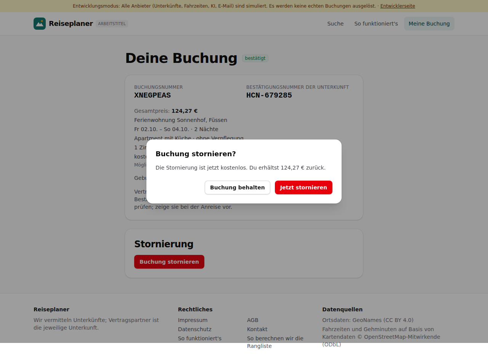
- Prüfungen:
  - [x] enthält „Deine Buchung“
  - [x] enthält „bestätigt“
  - [x] enthält „Buchung stornieren?“
  - [x] enthält „Die Stornierung ist jetzt kostenlos“
  - [x] Element `[data-testid="cancel-confirm"]` vorhanden (1)
- Überschriften: „Deine Buchung“, „Stornierung“, „Buchung stornieren?“
- KI-Kennzeichnungen (`data-ai-provenance`): keine
- Konsolenfehler: keine
- Fehlgeschlagene Anfragen: keine

<details><summary>Sichtbarer Text</summary>

```text
Entwicklungsmodus: Alle Anbieter (Unterkünfte, Fahrzeiten, KI, E-Mail) sind simuliert. Es werden keine echten Buchungen ausgelöst. · Entwicklerseite
Reiseplaner
ARBEITSTITEL
Suche
So funktioniert's
Meine Buchung
Deine Buchung
bestätigt
BUCHUNGSNUMMER
XNEGPEAS
BESTÄTIGUNGSNUMMER DER UNTERKUNFT
HCN-679285

Gesamtpreis: 124,27 €

Ferienwohnung Sonnenhof, Füssen

Fr 02.10. – So 04.10. · 2 Nächte

Apartment mit Küche · ohne Verpflegung

1 Zimmer, 2 Gäste

kostenlos stornierbar bis 30.09.2026, 18:00

Mögliche Gebühren vor Ort (z. B. Kurtaxe) sind nicht bekannt.

Gebucht von: Erika Mustermann (e***@example.org)

Vertragspartner für den Aufenthalt ist Ferienwohnung Sonnenhof. Mit der Bestätigungsnummer der Unterkunft kannst du die Buchung auch direkt dort prüfen; zeige sie bei der Anreise vor.

Stornierung
Buchung stornieren

Reiseplaner

Wir vermitteln Unterkünfte; Vertragspartner ist die jeweilige Unterkunft.

Rechtliches

Impressum
AGB
Datenschutz
Kontakt
So funktioniert's
So berechnen wir die Rangliste

Datenquellen

Ortsdaten: GeoNames (CC BY 4.0)
Fahrzeiten und Gehminuten auf Basis von Kartendaten © OpenStreetMap-Mitwirkende (ODbL)
Buchung stornieren?
Die Stornierung ist jetzt kostenlos. Du erhältst 124,27 € zurück.
Buchung behalten
Jetzt stornieren
```

</details>

### 42 Buchung storniert

- URL: `/buchung/XNEGPEAS#a=eyJiIjoiOTY3ZmM0OTQtZDExMS00ZDFhLTg4NDAtYWRlMjFhZWM0YTQ5IiwicCI6ImFjY2VzcyIsImUiOjE3OTMyNjM3NzcsImgiOiJfMVA1eWw2V2VTVEZDUmNRQXBFMGdmIn0.7ZHSURzgg2GExfXctNJ_hgQE_-3_GMPNgWi0sxe954g`
- Screenshot: 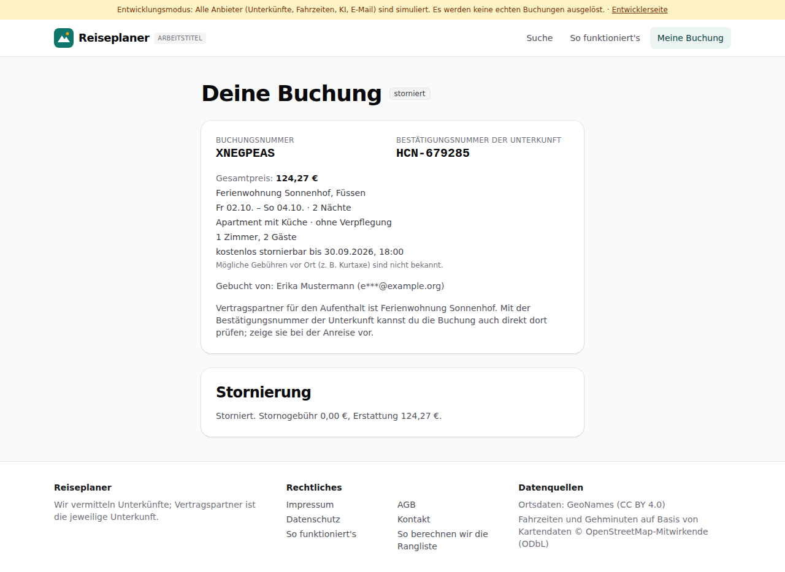
- Prüfungen:
  - [x] enthält „storniert“
  - [x] enthält „Stornogebühr 0,00“
  - [x] enthält „Erstattung“
  - [x] Element `[data-testid="cancelled-note"]` vorhanden (1)
- Überschriften: „Deine Buchung“, „Stornierung“
- KI-Kennzeichnungen (`data-ai-provenance`): keine
- Konsolenfehler: keine
- Fehlgeschlagene Anfragen: keine

<details><summary>Sichtbarer Text</summary>

```text
Entwicklungsmodus: Alle Anbieter (Unterkünfte, Fahrzeiten, KI, E-Mail) sind simuliert. Es werden keine echten Buchungen ausgelöst. · Entwicklerseite
Reiseplaner
ARBEITSTITEL
Suche
So funktioniert's
Meine Buchung
Deine Buchung
storniert
BUCHUNGSNUMMER
XNEGPEAS
BESTÄTIGUNGSNUMMER DER UNTERKUNFT
HCN-679285

Gesamtpreis: 124,27 €

Ferienwohnung Sonnenhof, Füssen

Fr 02.10. – So 04.10. · 2 Nächte

Apartment mit Küche · ohne Verpflegung

1 Zimmer, 2 Gäste

kostenlos stornierbar bis 30.09.2026, 18:00

Mögliche Gebühren vor Ort (z. B. Kurtaxe) sind nicht bekannt.

Gebucht von: Erika Mustermann (e***@example.org)

Vertragspartner für den Aufenthalt ist Ferienwohnung Sonnenhof. Mit der Bestätigungsnummer der Unterkunft kannst du die Buchung auch direkt dort prüfen; zeige sie bei der Anreise vor.

Stornierung

Storniert. Stornogebühr 0,00 €, Erstattung 124,27 €.

Reiseplaner

Wir vermitteln Unterkünfte; Vertragspartner ist die jeweilige Unterkunft.

Rechtliches

Impressum
AGB
Datenschutz
Kontakt
So funktioniert's
So berechnen wir die Rangliste

Datenquellen

Ortsdaten: GeoNames (CC BY 4.0)
Fahrzeiten und Gehminuten auf Basis von Kartendaten © OpenStreetMap-Mitwirkende (ODbL)
```

</details>

### 43 „Meine Buchung“: Zugangslink anfordern

- URL: `/buchung`
- Screenshot: 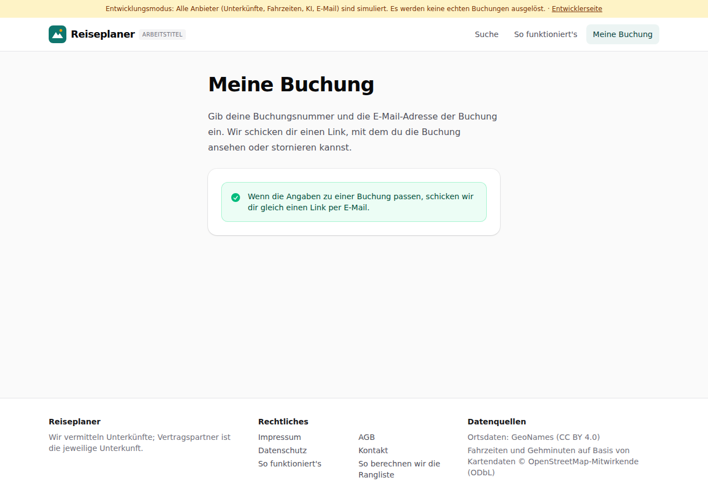
- Prüfungen:
  - [x] enthält „Meine Buchung“
  - [x] enthält „Wenn die Angaben zu einer Buchung passen“
- Überschriften: „Meine Buchung“
- KI-Kennzeichnungen (`data-ai-provenance`): keine
- Konsolenfehler: keine
- Fehlgeschlagene Anfragen: keine

<details><summary>Sichtbarer Text</summary>

```text
Entwicklungsmodus: Alle Anbieter (Unterkünfte, Fahrzeiten, KI, E-Mail) sind simuliert. Es werden keine echten Buchungen ausgelöst. · Entwicklerseite
Reiseplaner
ARBEITSTITEL
Suche
So funktioniert's
Meine Buchung
Meine Buchung

Gib deine Buchungsnummer und die E-Mail-Adresse der Buchung ein. Wir schicken dir einen Link, mit dem du die Buchung ansehen oder stornieren kannst.

Wenn die Angaben zu einer Buchung passen, schicken wir dir gleich einen Link per E-Mail.

Reiseplaner

Wir vermitteln Unterkünfte; Vertragspartner ist die jeweilige Unterkunft.

Rechtliches

Impressum
AGB
Datenschutz
Kontakt
So funktioniert's
So berechnen wir die Rangliste

Datenquellen

Ortsdaten: GeoNames (CC BY 4.0)
Fahrzeiten und Gehminuten auf Basis von Kartendaten © OpenStreetMap-Mitwirkende (ODbL)
```

</details>

## Flow „entwickler“

Entwicklerseite (S11.8): über den Hinweisbalken erreichbar; KI-Prüfung mit einem Schalter aus- und wieder einschalten; bei ausgeschalteter KI ist das Freitextfeld der Suche ausgegraut (simulierte KI: standardmäßig an, echte KI: standardmäßig aus); Suchgrenzen im lokalen Test.

### 44 Entwicklerseite über den Hinweisbalken

- URL: `/entwickler`
- Screenshot: 
- Prüfungen:
  - [x] enthält „Entwicklerseite“
  - [x] enthält „nie für Kunden“
  - [x] enthält „KI-Prüfung der Rezensionen“
  - [x] enthält „simuliert und kostet nichts“
  - [x] enthält „Suchgrenzen im Test“
  - [x] enthält „60 Suchen pro Stunde, 200 pro Tag“
  - [x] Element `[data-testid="ai-switch"][aria-checked="true"]` vorhanden (1)
- Überschriften: „Entwicklerseite“, „KI-Prüfung der Rezensionen“, „Suchgrenzen im Test“
- KI-Kennzeichnungen (`data-ai-provenance`): keine
- Konsolenfehler: keine
- Fehlgeschlagene Anfragen: keine

<details><summary>Sichtbarer Text</summary>

```text
Entwicklungsmodus: Alle Anbieter (Unterkünfte, Fahrzeiten, KI, E-Mail) sind simuliert. Es werden keine echten Buchungen ausgelöst. · Entwicklerseite
Reiseplaner
ARBEITSTITEL
Suche
So funktioniert's
Meine Buchung
Entwicklerseite

Schalter für deinen lokalen Test. Diese Seite gibt es nur auf deinem Rechner, nie für Kunden.

KI-Prüfung der Rezensionen
an

Die KI ist simuliert und kostet nichts. Ausschalten zeigt, wie die Seite ohne KI aussieht.

Gilt ab der nächsten Suche.

Suchgrenzen im Test

60 Suchen pro Stunde, 200 pro Tag (für Kunden gelten niedrigere Grenzen).

Reiseplaner

Wir vermitteln Unterkünfte; Vertragspartner ist die jeweilige Unterkunft.

Rechtliches

Impressum
AGB
Datenschutz
Kontakt
So funktioniert's
So berechnen wir die Rangliste

Datenquellen

Ortsdaten: GeoNames (CC BY 4.0)
Fahrzeiten und Gehminuten auf Basis von Kartendaten © OpenStreetMap-Mitwirkende (ODbL)
```

</details>

### 45 KI ausschalten: Hinweisbalken und Schalter zeigen „aus“

- URL: `/entwickler`
- Screenshot: 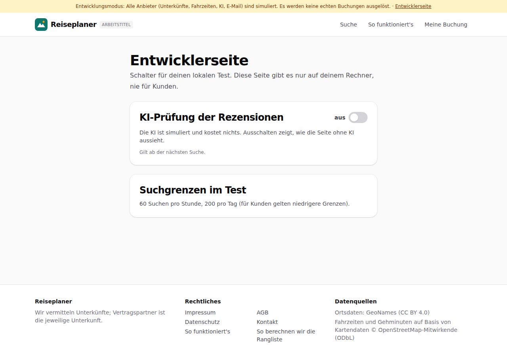
- Notiz: Zustand nach Neuladen: aus
- Prüfungen:
  - [x] enthält „aus“
  - [x] enthält „Gilt ab der nächsten Suche.“
  - [x] Element `[data-testid="ai-switch"][aria-checked="false"]` vorhanden (1)
- Überschriften: „Entwicklerseite“, „KI-Prüfung der Rezensionen“, „Suchgrenzen im Test“
- KI-Kennzeichnungen (`data-ai-provenance`): keine
- Konsolenfehler: keine
- Fehlgeschlagene Anfragen: keine

<details><summary>Sichtbarer Text</summary>

```text
Entwicklungsmodus: Alle Anbieter (Unterkünfte, Fahrzeiten, KI, E-Mail) sind simuliert. Es werden keine echten Buchungen ausgelöst. · Entwicklerseite
Reiseplaner
ARBEITSTITEL
Suche
So funktioniert's
Meine Buchung
Entwicklerseite

Schalter für deinen lokalen Test. Diese Seite gibt es nur auf deinem Rechner, nie für Kunden.

KI-Prüfung der Rezensionen
aus

Die KI ist simuliert und kostet nichts. Ausschalten zeigt, wie die Seite ohne KI aussieht.

Gilt ab der nächsten Suche.

Suchgrenzen im Test

60 Suchen pro Stunde, 200 pro Tag (für Kunden gelten niedrigere Grenzen).

Reiseplaner

Wir vermitteln Unterkünfte; Vertragspartner ist die jeweilige Unterkunft.

Rechtliches

Impressum
AGB
Datenschutz
Kontakt
So funktioniert's
So berechnen wir die Rangliste

Datenquellen

Ortsdaten: GeoNames (CC BY 4.0)
Fahrzeiten und Gehminuten auf Basis von Kartendaten © OpenStreetMap-Mitwirkende (ODbL)
```

</details>

### 46 Suche bei ausgeschalteter KI: Freitextfeld ausgegraut, Chips wählbar

- URL: `/suche`
- Screenshot: 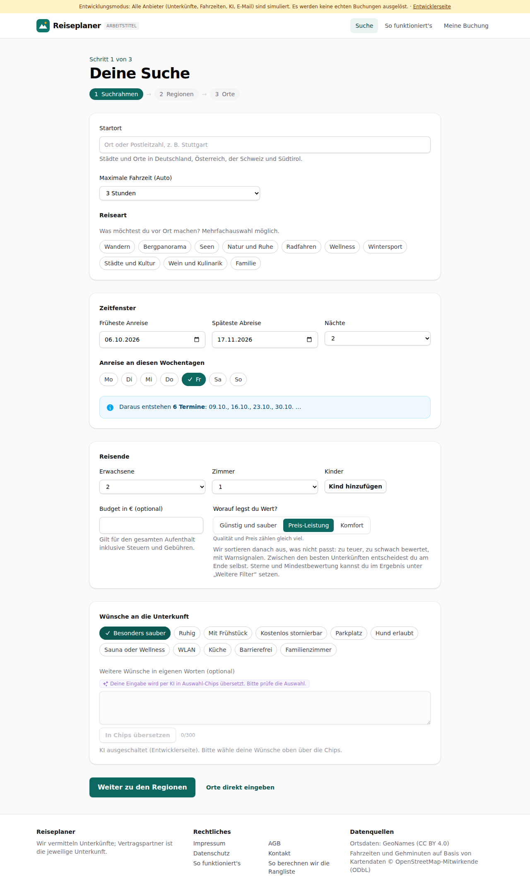
- Prüfungen:
  - [x] enthält „KI ausgeschaltet (Entwicklerseite)“
  - [x] Element `#wish-text:disabled` vorhanden (1)
  - [x] Element `[data-testid="wish-chips"] [aria-pressed="true"]` vorhanden (1)
- Überschriften: „Deine Suche“
- KI-Kennzeichnungen (`data-ai-provenance`): „Deine Eingabe wird per KI in Auswahl-Chips übersetzt. Bitte prüfe die Auswahl. [ai_assisted]“
- Konsolenfehler: keine
- Fehlgeschlagene Anfragen: keine

<details><summary>Sichtbarer Text</summary>

```text
Entwicklungsmodus: Alle Anbieter (Unterkünfte, Fahrzeiten, KI, E-Mail) sind simuliert. Es werden keine echten Buchungen ausgelöst. · Entwicklerseite
Reiseplaner
ARBEITSTITEL
Suche
So funktioniert's
Meine Buchung

Schritt 1 von 3

Deine Suche
1
Suchrahmen
→
2
Regionen
→
3
Orte
Startort

Städte und Orte in Deutschland, Österreich, der Schweiz und Südtirol.

Maximale Fahrzeit (Auto)
Keine Begrenzung
1 Stunde
1 h 30 min
2 Stunden
2 h 30 min
3 Stunden
4 Stunden
5 Stunden
6 Stunden
Reiseart

Was möchtest du vor Ort machen? Mehrfachauswahl möglich.

Wandern
Bergpanorama
Seen
Natur und Ruhe
Radfahren
Wellness
Wintersport
Städte und Kultur
Wein und Kulinarik
Familie
Zeitfenster
Früheste Anreise
Späteste Abreise
Nächte
1
2
3
4
5
6
7
8
9
10
11
12
13
14
Anreise an diesen Wochentagen
Mo
Di
Mi
Do
Fr
Sa
So
Daraus entstehen 6 Termine: 09.10., 16.10., 23.10., 30.10. …
Reisende
Erwachsene
1
2
3
4
5
6
Zimmer
1
2
3
4
5
Kinder
Kind hinzufügen
Budget in € (optional)

Gilt für den gesamten Aufenthalt inklusive Steuern und Gebühren.

Worauf legst du Wert?

Günstig und sauber
Preis-Leistung
Komfort

Qualität und Preis zählen gleich viel.

Wir sortieren danach aus, was nicht passt: zu teuer, zu schwach bewertet, mit Warnsignalen. Zwischen den besten Unterkünften entscheidest du am Ende selbst. Sterne und Mindestbewertung kannst du im Ergebnis unter „Weitere Filter“ setzen.

Wünsche an die Unterkunft
Besonders sauber
Ruhig
Mit Frühstück
Kostenlos stornierbar
Parkplatz
Hund erlaubt
Sauna oder Wellness
WLAN
Küche
Barrierefrei
Familienzimmer
Weitere Wünsche in eigenen Worten (optional)
Deine Eingabe wird per KI in Auswahl-Chips übersetzt. Bitte prüfe die Auswahl.
In Chips übersetzen
0/300

KI ausgeschaltet (Entwicklerseite). Bitte wähle deine Wünsche oben über die Chips.

Weiter zu den Regionen
Orte
… (335 weitere Zeichen)
```

</details>

### 47 KI wieder einschalten

- URL: `/entwickler`
- Screenshot: 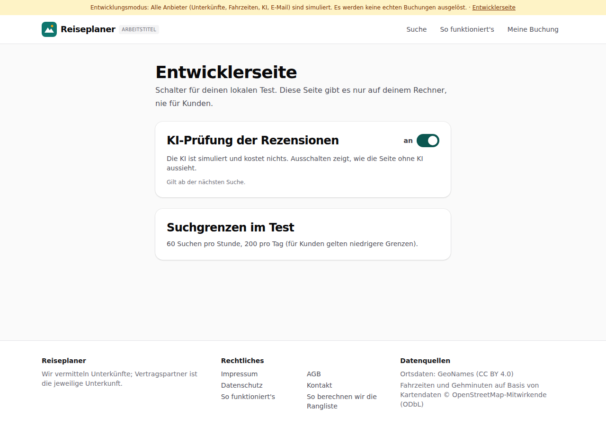
- Prüfungen:
  - [x] Element `[data-testid="ai-switch"][aria-checked="true"]` vorhanden (1)
- Überschriften: „Entwicklerseite“, „KI-Prüfung der Rezensionen“, „Suchgrenzen im Test“
- KI-Kennzeichnungen (`data-ai-provenance`): keine
- Konsolenfehler: keine
- Fehlgeschlagene Anfragen: keine

<details><summary>Sichtbarer Text</summary>

```text
Entwicklungsmodus: Alle Anbieter (Unterkünfte, Fahrzeiten, KI, E-Mail) sind simuliert. Es werden keine echten Buchungen ausgelöst. · Entwicklerseite
Reiseplaner
ARBEITSTITEL
Suche
So funktioniert's
Meine Buchung
Entwicklerseite

Schalter für deinen lokalen Test. Diese Seite gibt es nur auf deinem Rechner, nie für Kunden.

KI-Prüfung der Rezensionen
an

Die KI ist simuliert und kostet nichts. Ausschalten zeigt, wie die Seite ohne KI aussieht.

Gilt ab der nächsten Suche.

Suchgrenzen im Test

60 Suchen pro Stunde, 200 pro Tag (für Kunden gelten niedrigere Grenzen).

Reiseplaner

Wir vermitteln Unterkünfte; Vertragspartner ist die jeweilige Unterkunft.

Rechtliches

Impressum
AGB
Datenschutz
Kontakt
So funktioniert's
So berechnen wir die Rangliste

Datenquellen

Ortsdaten: GeoNames (CC BY 4.0)
Fahrzeiten und Gehminuten auf Basis von Kartendaten © OpenStreetMap-Mitwirkende (ODbL)
```

</details>

## Flow „langsam“

Suche mit langsamen Anbietern (REISEPLANER_FAKE_LATENCY_MS, z. B. 4000 wie die echte LiteAPI): 5 Orte × 12 Termine; jede Fortschrittsabfrage der Seite gelingt, keine Serverfehler, die Suche endet mit Ergebnissen.

### 48 Ortsliste bestätigt: 60 Kombinationen

- URL: `/suche`
- Screenshot: 
- Prüfungen:
  - [x] enthält „5 Orte × 12 Termine = 60 Kombinationen“
  - [x] enthält „Suche starten“
- Überschriften: „Deine Suche“, „Ortsliste bestätigt“, „Suche starten“
- KI-Kennzeichnungen (`data-ai-provenance`): keine
- Konsolenfehler: keine
- Fehlgeschlagene Anfragen: keine

<details><summary>Sichtbarer Text</summary>

```text
Entwicklungsmodus: Alle Anbieter (Unterkünfte, Fahrzeiten, KI, E-Mail) sind simuliert. Es werden keine echten Buchungen ausgelöst. · Entwicklerseite
Reiseplaner
ARBEITSTITEL
Suche
So funktioniert's
Meine Buchung

Schritt 3 von 3

Deine Suche
1
Suchrahmen
→
2
Regionen
→
3
Orte
Ortsliste bestätigt

5 Orte × 12 Termine = 60 Kombinationen

Suche starten

Wir fragen jetzt alle Kombinationen aus Ort und Termin gleichzeitig ab. Das dauert meist unter einer Minute.

Baiersbronn
Hinterzarten
Titisee-Neustadt
Todtnau
Bad Wildbad
Zurück
Suche starten

Zum Schutz vor automatisierten Anfragen löst dein Browser eine kleine Rechenaufgabe. Es werden keine Cookies gesetzt.

Reiseplaner

Wir vermitteln Unterkünfte; Vertragspartner ist die jeweilige Unterkunft.

Rechtliches

Impressum
AGB
Datenschutz
Kontakt
So funktioniert's
So berechnen wir die Rangliste

Datenquellen

Ortsdaten: GeoNames (CC BY 4.0)
Fahrzeiten und Gehminuten auf Basis von Kartendaten © OpenStreetMap-Mitwirkende (ODbL)
```

</details>

### 49 Suche mit langsamen Anbietern bis zum Ergebnis, ohne Serverfehler

- URL: `/suche/84885b18-620b-42ba-b527-d52a02971581#t=4el7rPff48n5YlBaCJsAbSFz2GA4Ye0usLuyoTeaMF4`
- Screenshot: 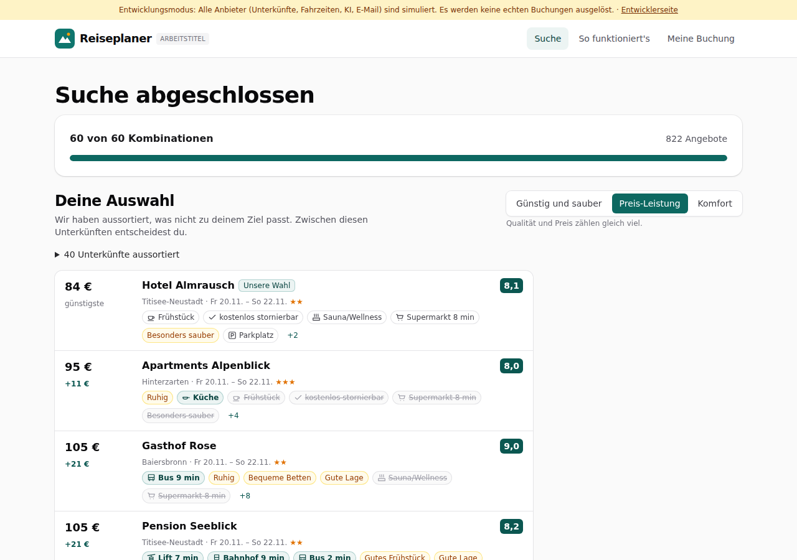
- Notiz: Latenz der simulierten Anbieter: 150 (Standard) ms je Aufruf (0,5- bis 1,5-fach).
- Notiz: Bis zu den Ergebnissen: 3 s; längste Zeit ohne neue Anzeige: 2 s.
- Notiz: Fortschritt: 0 s: 0 von 60 Kombinationen → 2 s: 60 von 60 Kombinationen → 3 s: Ergebnisse
- Notiz: Serverfehler der Seite während der Suche: 0.
- Prüfungen:
  - [x] enthält „Deine Auswahl“
  - [x] enthält „Alle Angebote“
  - [x] Element `[data-testid="results"]` vorhanden (1)
- Überschriften: „Suche abgeschlossen“, „Deine Auswahl“, „Alle Angebote“
- KI-Kennzeichnungen (`data-ai-provenance`): „KI-gestützte Auswertung von Gästebewertungen [ai_assisted]“, „KI-gestützte Auswertung von Gästebewertungen [ai_assisted]“, „KI-gestützte Auswertung von Gästebewertungen [ai_assisted]“
- Konsolenfehler: keine
- Fehlgeschlagene Anfragen: keine

<details><summary>Sichtbarer Text</summary>

```text
Entwicklungsmodus: Alle Anbieter (Unterkünfte, Fahrzeiten, KI, E-Mail) sind simuliert. Es werden keine echten Buchungen ausgelöst. · Entwicklerseite
Reiseplaner
ARBEITSTITEL
Suche
So funktioniert's
Meine Buchung
Suche abgeschlossen

60 von 60 Kombinationen

822 Angebote

Deine Auswahl

Wir haben aussortiert, was nicht zu deinem Ziel passt. Zwischen diesen Unterkünften entscheidest du.

Günstig und sauber
Preis-Leistung
Komfort

Qualität und Preis zählen gleich viel.

40 Unterkünfte aussortiert
84 €
günstigste
Hotel Almrausch
Unsere Wahl
8,1

Titisee-Neustadt · Fr 20.11. – So 22.11.★★

Frühstück
kostenlos stornierbar
Sauna/Wellness
Supermarkt 8 min
Besonders sauber
Parkplatz
+2
95 €
+11 €
Apartments Alpenblick
8,0

Hinterzarten · Fr 20.11. – So 22.11.★★★

Ruhig
Küche
Frühstück
kostenlos stornierbar
Supermarkt 8 min
Besonders sauber
+4
105 €
+21 €
Gasthof Rose
9,0

Baiersbronn · Fr 20.11. – So 22.11.★★

Bus 9 min
Ruhig
Bequeme Betten
Gute Lage
Sauna/Wellness
Supermarkt 8 min
+8
105 €
+21 €
Pension Seeblick
8,2

Titisee-Neustadt · Fr 20.11. – So 22.11.★★

Lift 7 min
Bahnhof 9 min
Bus 2 min
Gutes Frühstück
Gute Lage
Besonders sauber
+9
115 €
+31 €
Landhotel Zur Post
7,8

Todtnau · Fr 27.11. – So 29.11.★★★

Lift 8 min
Bahnhof 10 min
Bus 7 min
Restaurants nah
kostenlos stornierbar
Supermarkt 8 min
+8
hat es zusätzlich
fehlt
wie beim günstigsten
Gehminuten: Kartendaten © OpenStreetMap-Mitwirkende

Ob dir ein Aufpreis das wert ist, entscheidest du. „Unsere Wahl“ markiert das Angebot, bei dem nachweisbare Vorteile (Bewertung, viele Bewertungen, bei Komfort Extras) den Preis am besten aufwiegen. 2 weitere passende Unterkünfte stehen unter „Alle Angebote“.

Alle Angebote

Jede Unterkunft mit ihrem besten Angebot, mit Filtern, Sortierung und Preis-Matrix.

29 Unterkünfte passen zu 
… (14099 weitere Zeichen)
```

</details>

