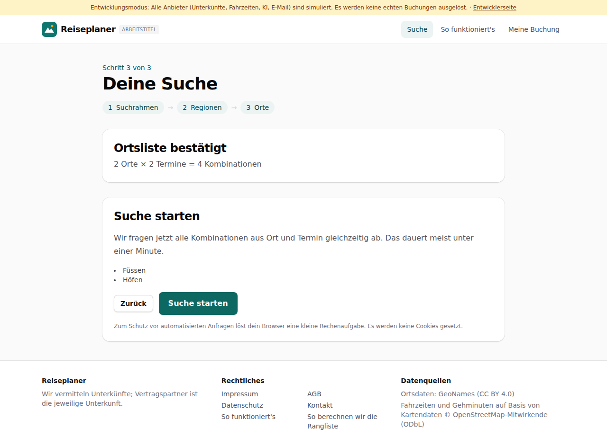
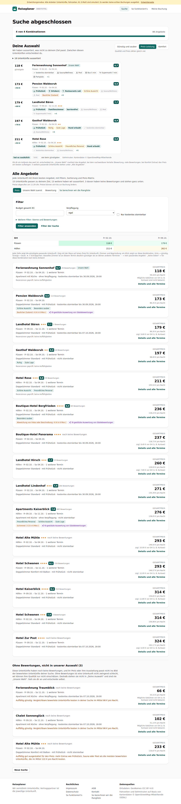
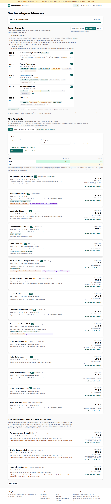
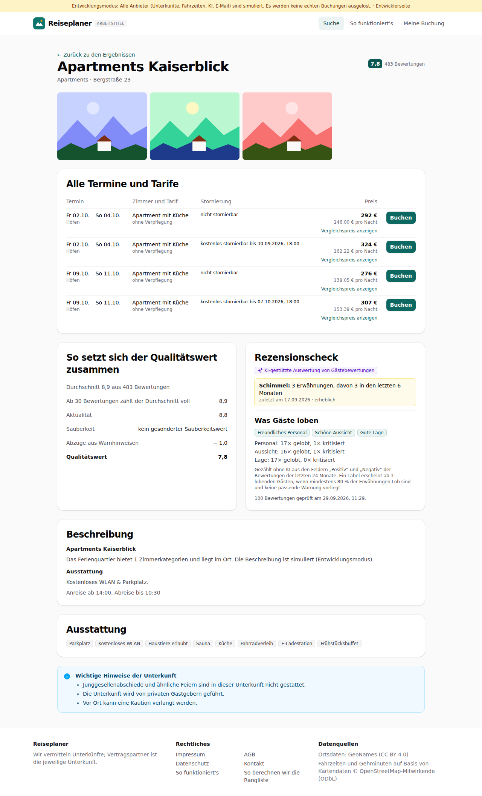
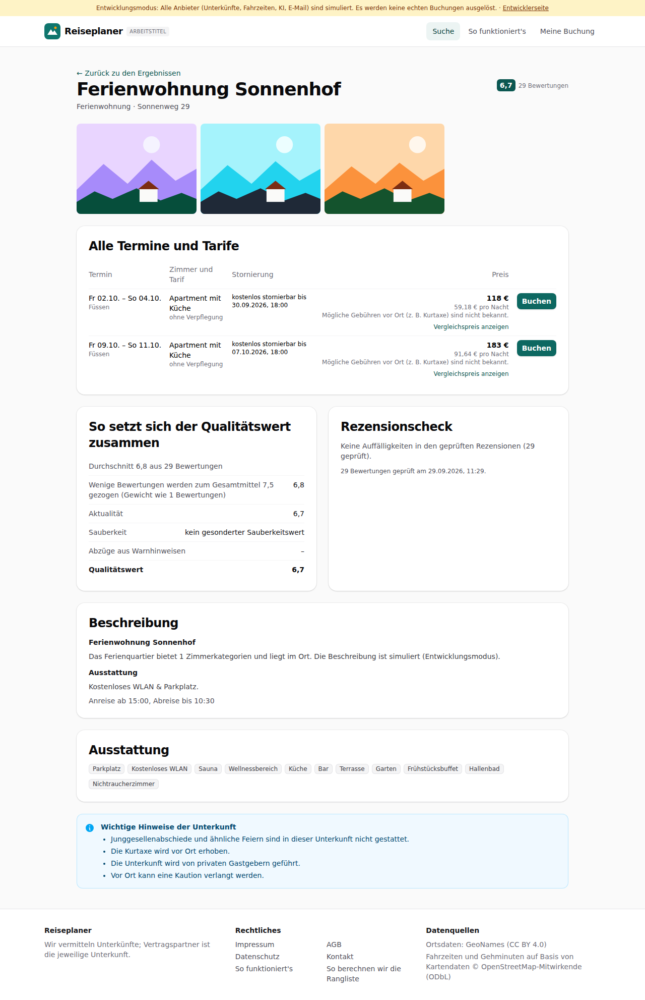

# Dogfood-Walkthrough 2026-09-29T09-29-37-P-warnungen

- Modus: P – Pfad (Nutzerablauf mit Eingaben)
- Flows: warnungen
- Basis-URL: http://localhost:40471 (echter lokaler Stack, Anbieter im Fake-Modus)
- Stand: 64a1161, gestartet 2026-09-29T09:29:37.291Z
- Ergebnis: ✅ bestanden (22/22 Prüfungen erfüllt)

## Flow „warnungen“

Rezensionscheck (F8, Akzeptanzbeispiel 4) und Warnsignale nach Anteil (Ben, 29.09.): Suche Stuttgart → Füssen und Höfen (Tirol) × 2 Freitage; die Rezensionen der wahrscheinlichen Finalisten werden geprüft. Häuser mit 3 Schimmel-Meldungen bei 100 geprüften Bewertungen stehen ganz normal in der Liste, mit Warnhinweis und KI-Kennzeichnung; die Detailansicht zeigt „Schimmel: 3 Erwähnungen, davon 3 in den letzten 6 Monaten“. Ein kleines Haus in Höfen mit denselben 3 Meldungen bei 38 Gästen ist aussortiert („Beschwerden … häufen sich“). Eine geprüfte Unterkunft ohne Treffer zeigt „keine Auffälligkeiten“.

### 01 Suchrahmen gesetzt, eigene Orte Füssen und Höfen gewählt

- URL: `/suche`
- Screenshot: 
- Prüfungen:
  - [x] enthält „2 Orte × 2 Termine = 4 Kombinationen“
  - [x] enthält „Suche starten“
- Überschriften: „Deine Suche“, „Ortsliste bestätigt“, „Suche starten“
- KI-Kennzeichnungen (`data-ai-provenance`): keine
- Konsolenfehler: keine
- Fehlgeschlagene Anfragen: keine

<details><summary>Sichtbarer Text</summary>

```text
Entwicklungsmodus: Alle Anbieter (Unterkünfte, Fahrzeiten, KI, E-Mail) sind simuliert. Es werden keine echten Buchungen ausgelöst. · Entwicklerseite
Reiseplaner
ARBEITSTITEL
Suche
So funktioniert's
Meine Buchung

Schritt 3 von 3

Deine Suche
1
Suchrahmen
→
2
Regionen
→
3
Orte
Ortsliste bestätigt

2 Orte × 2 Termine = 4 Kombinationen

Suche starten

Wir fragen jetzt alle Kombinationen aus Ort und Termin gleichzeitig ab. Das dauert meist unter einer Minute.

Füssen
Höfen
Zurück
Suche starten

Zum Schutz vor automatisierten Anfragen löst dein Browser eine kleine Rechenaufgabe. Es werden keine Cookies gesetzt.

Reiseplaner

Wir vermitteln Unterkünfte; Vertragspartner ist die jeweilige Unterkunft.

Rechtliches

Impressum
AGB
Datenschutz
Kontakt
So funktioniert's
So berechnen wir die Rangliste

Datenquellen

Ortsdaten: GeoNames (CC BY 4.0)
Fahrzeiten und Gehminuten auf Basis von Kartendaten © OpenStreetMap-Mitwirkende (ODbL)
```

</details>

### 02 Suche mit Rezensionscheck abgeschlossen

- URL: `/suche/0254d5c8-c8c1-443b-bd6c-28eaa94edae3#t=NK64bewwR8S6XqiuG473qNT_66_Xtiie1hAAjFxpn_A`
- Screenshot: 
- Notiz: Der Rezensionscheck war zu schnell für den Zwischenstand.
- Prüfungen:
  - [x] enthält „Suche abgeschlossen“
  - [x] enthält „4 von 4 Kombinationen“
  - [x] enthält „Alle Angebote“
  - [x] Element `[data-testid="result-warnings"]` vorhanden (3)
- Überschriften: „Suche abgeschlossen“, „Deine Auswahl“, „Alle Angebote“
- KI-Kennzeichnungen (`data-ai-provenance`): „KI-gestützte Auswertung von Gästebewertungen [ai_assisted]“, „KI-gestützte Auswertung von Gästebewertungen [ai_assisted]“, „KI-gestützte Auswertung von Gästebewertungen [ai_assisted]“
- Konsolenfehler: keine
- Fehlgeschlagene Anfragen: keine

<details><summary>Sichtbarer Text</summary>

```text
Entwicklungsmodus: Alle Anbieter (Unterkünfte, Fahrzeiten, KI, E-Mail) sind simuliert. Es werden keine echten Buchungen ausgelöst. · Entwicklerseite
Reiseplaner
ARBEITSTITEL
Suche
So funktioniert's
Meine Buchung
Suche abgeschlossen

4 von 4 Kombinationen

86 Angebote

Deine Auswahl

Wir haben aussortiert, was nicht zu deinem Ziel passt. Zwischen diesen Unterkünften entscheidest du.

Günstig und sauber
Preis-Leistung
Komfort

Qualität und Preis zählen gleich viel.

18 Unterkünfte aussortiert
118 €
günstigste
Ferienwohnung Sonnenhof
Unsere Wahl
6,7

Füssen · Fr 02.10. – So 04.10.

kostenlos stornierbar
Sauna/Wellness
Pool
Bus 5 min
Supermarkt 7 min
Parkplatz
+1
173 €
+54 €
Pension Waldesruh
8,6

Füssen · Fr 02.10. – So 04.10.

Frühstück
Ortskern
Restaurants nah
Schöne Aussicht
Sauna/Wellness
Pool
Baulicher Zustand
+8
179 €
+60 €
Landhotel Bären
7,7

Füssen · Fr 09.10. – So 11.10.★★★

Frühstück
Familienzimmer
barrierefrei
Sauna/Wellness
Pool
Supermarkt 7 min
+4
197 €
+78 €
Gasthof Waldesruh
8,9

Füssen · Fr 02.10. – So 04.10.★★

Frühstück
Ruhig
Gute Lage
Hund erlaubt
kostenlos stornierbar
Sauna/Wellness
+6
211 €
+93 €
Hotel Rose
8,8

Höfen · Fr 02.10. – So 04.10.★★★

Frühstück
Schöne Aussicht
Freundliches Personal
Hund erlaubt
kostenlos stornierbar
Sauna/Wellness
+6
hat es zusätzlich
fehlt
wie beim günstigsten
Gehminuten: Kartendaten © OpenStreetMap-Mitwirkende

Ob dir ein Aufpreis das wert ist, entscheidest du. „Unsere Wahl“ markiert das Angebot, bei dem nachweisbare Vorteile (Bewertung, viele Bewertungen, bei Komfort Extras) den Preis am besten aufwiegen. 5 weitere passende Unterkünfte stehen unter „Alle Angebote“.

Alle Angebote

Jede Unterkunft mit ihrem besten Angebot, mit Filtern, Sortierung und Preis-Matrix.

15 Unterkünfte passen zu deinem Ziel, 13 weitere haben wi
… (7088 weitere Zeichen)
```

</details>

### 03 Liste: Häuser mit wenigen Schimmel-Meldungen normal gelistet, „Pension Alpenblick“ (3 bei 38 Gästen) aussortiert

- URL: `/suche/0254d5c8-c8c1-443b-bd6c-28eaa94edae3#t=NK64bewwR8S6XqiuG473qNT_66_Xtiie1hAAjFxpn_A`
- Screenshot: 
- Notiz: Aussortiert: 3 ohne Bewertungen und auffällig billig, auffällig gut ausgestattet oder für dein Ziel nicht einschätzbar · ansehen ↓ | 1 mit Warnsignalen: Beschwerden über Schimmel, Ungeziefer oder Schmutz häufen sich | 1 Sterne-Falle: 4 oder mehr Sterne zum Preis eines einfachen Hauses, aber ohne geprüfte gute Bewertungen | 8 zu schwach bewertet für dein Ziel und nicht deutlich günstiger | 3 zu teuer für dein Ziel | 2 mit einem besseren Angebot: nicht teurer, mindestens gleich gut bewertet, mit allem, was dieses bietet
- Notiz: Liste: 15 Unterkünfte; mit Schimmel-Hinweis normal gelistet: „Apartments Kaiserblick“ (Platz 10); „Apartments Kaiserblick“ zeigt „Schimmel: 3 (3 in 6 Mon.) KI-gestützte Auswertung von Gästebewertungen“; „Pension Alpenblick“ nicht dabei.
- Prüfungen:
  - [x] enthält „mit Warnsignalen: Beschwerden über Schimmel, Ungeziefer oder Schmutz häufen sich“
  - [x] enthält „KI-gestützte Auswertung von Gästebewertungen“
  - [x] Element `[data-testid="excluded"] li[data-reason="red_flag"]` vorhanden (1)
  - [x] Element `[data-testid="result-warnings"] [data-ai-provenance="ai_assisted"]` vorhanden (3)
  - [x] Element `[data-testid="result-review-ok"]` vorhanden (4)
- Überschriften: „Suche abgeschlossen“, „Deine Auswahl“, „Alle Angebote“
- KI-Kennzeichnungen (`data-ai-provenance`): „KI-gestützte Auswertung von Gästebewertungen [ai_assisted]“, „KI-gestützte Auswertung von Gästebewertungen [ai_assisted]“, „KI-gestützte Auswertung von Gästebewertungen [ai_assisted]“
- Konsolenfehler: keine
- Fehlgeschlagene Anfragen: keine

<details><summary>Sichtbarer Text</summary>

```text
Entwicklungsmodus: Alle Anbieter (Unterkünfte, Fahrzeiten, KI, E-Mail) sind simuliert. Es werden keine echten Buchungen ausgelöst. · Entwicklerseite
Reiseplaner
ARBEITSTITEL
Suche
So funktioniert's
Meine Buchung
Suche abgeschlossen

4 von 4 Kombinationen

86 Angebote

Deine Auswahl

Wir haben aussortiert, was nicht zu deinem Ziel passt. Zwischen diesen Unterkünften entscheidest du.

Günstig und sauber
Preis-Leistung
Komfort

Qualität und Preis zählen gleich viel.

18 Unterkünfte aussortiert
3 ohne Bewertungen und auffällig billig, auffällig gut ausgestattet oder für dein Ziel nicht einschätzbar · ansehen ↓
1 mit Warnsignalen: Beschwerden über Schimmel, Ungeziefer oder Schmutz häufen sich
1 Sterne-Falle: 4 oder mehr Sterne zum Preis eines einfachen Hauses, aber ohne geprüfte gute Bewertungen
8 zu schwach bewertet für dein Ziel und nicht deutlich günstiger
3 zu teuer für dein Ziel
2 mit einem besseren Angebot: nicht teurer, mindestens gleich gut bewertet, mit allem, was dieses bietet
118 €
günstigste
Ferienwohnung Sonnenhof
Unsere Wahl
6,7

Füssen · Fr 02.10. – So 04.10.

kostenlos stornierbar
Sauna/Wellness
Pool
Bus 5 min
Supermarkt 7 min
Parkplatz
+1
173 €
+54 €
Pension Waldesruh
8,6

Füssen · Fr 02.10. – So 04.10.

Frühstück
Ortskern
Restaurants nah
Schöne Aussicht
Sauna/Wellness
Pool
Baulicher Zustand
+8
179 €
+60 €
Landhotel Bären
7,7

Füssen · Fr 09.10. – So 11.10.★★★

Frühstück
Familienzimmer
barrierefrei
Sauna/Wellness
Pool
Supermarkt 7 min
+4
197 €
+78 €
Gasthof Waldesruh
8,9

Füssen · Fr 02.10. – So 04.10.★★

Frühstück
Ruhig
Gute Lage
Hund erlaubt
kostenlos stornierbar
Sauna/Wellness
+6
211 €
+93 €
Hotel Rose
8,8

Höfen · Fr 02.10. – So 04.10.★★★

Frühstück
Schöne Aussicht
Freundliches Personal
Hund erlaubt
kostenlos stornierbar
Sauna/Wellness
+6
hat es zusätzli
… (7589 weitere Zeichen)
```

</details>

### 04 Detailansicht des Hauses mit wenigen Schimmel-Meldungen: 3 in den letzten 6 Monaten, KI-gestützt (Akzeptanzbeispiel 4)

- URL: `/suche/0254d5c8-c8c1-443b-bd6c-28eaa94edae3/unterkunft/lpf-4747-1068-11#t=NK64bewwR8S6XqiuG473qNT_66_Xtiie1hAAjFxpn_A`
- Screenshot: 
- Notiz: Detailansicht „Apartments Kaiserblick“.
- Prüfungen:
  - [x] enthält „Schimmel: 3 Erwähnungen, davon 3 in den letzten 6 Monaten“
  - [x] enthält „KI-gestützte Auswertung von Gästebewertungen“
  - [x] enthält „erheblich“
  - [x] enthält „Bewertungen geprüft am“
  - [x] enthält „Abzüge aus Warnhinweisen“
  - [x] enthält nicht „Hinweis (ungeprüft)“
  - [x] Element `[data-testid="review-check"] [data-ai-provenance="ai_assisted"]` vorhanden (1)
  - [x] Element `[data-testid="warning"][data-verified="true"]` vorhanden (1)
- Überschriften: „Apartments Kaiserblick“, „Alle Termine und Tarife“, „So setzt sich der Qualitätswert zusammen“, „Rezensionscheck“, „Beschreibung“, „Ausstattung“
- KI-Kennzeichnungen (`data-ai-provenance`): „KI-gestützte Auswertung von Gästebewertungen [ai_assisted]“
- Konsolenfehler: keine
- Fehlgeschlagene Anfragen: keine

<details><summary>Sichtbarer Text</summary>

```text
Entwicklungsmodus: Alle Anbieter (Unterkünfte, Fahrzeiten, KI, E-Mail) sind simuliert. Es werden keine echten Buchungen ausgelöst. · Entwicklerseite
Reiseplaner
ARBEITSTITEL
Suche
So funktioniert's
Meine Buchung
← Zurück zu den Ergebnissen
Apartments Kaiserblick

Apartments · Bergstraße 23

7,8
483 Bewertungen
Alle Termine und Tarife
Termin	Zimmer und Tarif	Stornierung	Preis	

Fr 02.10. – So 04.10.
Höfen
	
Apartment mit Küche
ohne Verpflegung
	nicht stornierbar	
292 €
146,00 € pro Nacht
Vergleichspreis anzeigen
	Buchen

Fr 02.10. – So 04.10.
Höfen
	
Apartment mit Küche
ohne Verpflegung
	kostenlos stornierbar bis 30.09.2026, 18:00	
324 €
162,22 € pro Nacht
Vergleichspreis anzeigen
	Buchen

Fr 09.10. – So 11.10.
Höfen
	
Apartment mit Küche
ohne Verpflegung
	nicht stornierbar	
276 €
138,05 € pro Nacht
Vergleichspreis anzeigen
	Buchen

Fr 09.10. – So 11.10.
Höfen
	
Apartment mit Küche
ohne Verpflegung
	kostenlos stornierbar bis 07.10.2026, 18:00	
307 €
153,39 € pro Nacht
Vergleichspreis anzeigen
	Buchen
So setzt sich der Qualitätswert zusammen
Durchschnitt 8,9 aus 483 Bewertungen
Ab 30 Bewertungen zählt der Durchschnitt voll
8,9
Aktualität
8,8
Sauberkeit
kein gesonderter Sauberkeitswert
Abzüge aus Warnhinweisen
− 1,0
Qualitätswert
7,8
Rezensionscheck
KI-gestützte Auswertung von Gästebewertungen
Schimmel: 3 Erwähnungen, davon 3 in den letzten 6 Monaten
zuletzt am 17.09.2026 · erheblich
Was Gäste loben
Freundliches Personal
Schöne Aussicht
Gute Lage
Personal: 17× gelobt, 1× kritisiert
Aussicht: 16× gelobt, 1× kritisiert
Lage: 17× gelobt, 0× kritisiert

Gezählt ohne KI aus den Feldern „Positiv“ und „Negativ“ der Bewertungen der letzten 24 Monate. Ein Label erscheint ab 3 lobenden Gästen, wenn mindestens 80 % der Erwähnungen Lob sind und keine passende Warnung vorliegt.

100 Be
… (924 weitere Zeichen)
```

</details>

### 05 Geprüfte Unterkunft ohne Auffälligkeiten

- URL: `/suche/0254d5c8-c8c1-443b-bd6c-28eaa94edae3/unterkunft/lpf-4757-1070-10#t=NK64bewwR8S6XqiuG473qNT_66_Xtiie1hAAjFxpn_A`
- Screenshot: 
- Prüfungen:
  - [x] enthält „Keine Auffälligkeiten in den geprüften Rezensionen“
  - [x] enthält „Bewertungen geprüft am“
  - [x] Element `[data-testid="review-no-issues"]` vorhanden (1)
- Überschriften: „Ferienwohnung Sonnenhof“, „Alle Termine und Tarife“, „So setzt sich der Qualitätswert zusammen“, „Rezensionscheck“, „Beschreibung“, „Ausstattung“
- KI-Kennzeichnungen (`data-ai-provenance`): keine
- Konsolenfehler: keine
- Fehlgeschlagene Anfragen: keine

<details><summary>Sichtbarer Text</summary>

```text
Entwicklungsmodus: Alle Anbieter (Unterkünfte, Fahrzeiten, KI, E-Mail) sind simuliert. Es werden keine echten Buchungen ausgelöst. · Entwicklerseite
Reiseplaner
ARBEITSTITEL
Suche
So funktioniert's
Meine Buchung
← Zurück zu den Ergebnissen
Ferienwohnung Sonnenhof

Ferienwohnung · Sonnenweg 29

6,7
29 Bewertungen
Alle Termine und Tarife
Termin	Zimmer und Tarif	Stornierung	Preis	

Fr 02.10. – So 04.10.
Füssen
	
Apartment mit Küche
ohne Verpflegung
	kostenlos stornierbar bis 30.09.2026, 18:00	
118 €
59,18 € pro Nacht
Mögliche Gebühren vor Ort (z. B. Kurtaxe) sind nicht bekannt.
Vergleichspreis anzeigen
	Buchen

Fr 09.10. – So 11.10.
Füssen
	
Apartment mit Küche
ohne Verpflegung
	kostenlos stornierbar bis 07.10.2026, 18:00	
183 €
91,64 € pro Nacht
Mögliche Gebühren vor Ort (z. B. Kurtaxe) sind nicht bekannt.
Vergleichspreis anzeigen
	Buchen
So setzt sich der Qualitätswert zusammen
Durchschnitt 6,8 aus 29 Bewertungen
Wenige Bewertungen werden zum Gesamtmittel 7,5 gezogen (Gewicht wie 1 Bewertungen)
6,8
Aktualität
6,7
Sauberkeit
kein gesonderter Sauberkeitswert
Abzüge aus Warnhinweisen
–
Qualitätswert
6,7
Rezensionscheck

Keine Auffälligkeiten in den geprüften Rezensionen (29 geprüft).

29 Bewertungen geprüft am 29.09.2026, 11:29.

Beschreibung
Ferienwohnung Sonnenhof

Das Ferienquartier bietet 1 Zimmerkategorien und liegt im Ort. Die Beschreibung ist simuliert (Entwicklungsmodus).

Ausstattung

Kostenloses WLAN & Parkplatz.

Anreise ab 15:00, Abreise bis 10:30

Ausstattung
Parkplatz
Kostenloses WLAN
Sauna
Wellnessbereich
Küche
Bar
Terrasse
Garten
Frühstücksbuffet
Hallenbad
Nichtraucherzimmer

Wichtige Hinweise der Unterkunft

Junggesellenabschiede und ähnliche Feiern sind in dieser Unterkunft nicht gestattet.
Die Kurtaxe wird vor Ort erhoben.
Die Unterkunft wird von privaten
… (382 weitere Zeichen)
```

</details>

