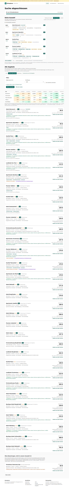
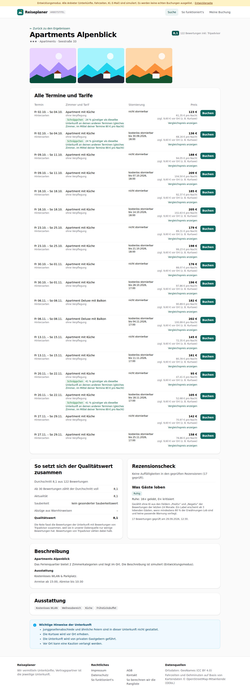

# Dogfood-Walkthrough 2026-09-29T10-29-43-R-ergebnisse

- Modus: R – Rundgang (erster Besuch, nur Navigation)
- Flows: ergebnisse
- Basis-URL: http://localhost:35345 (echter lokaler Stack, Anbieter im Fake-Modus)
- Stand: dcdb0f7, gestartet 2026-09-29T10:29:43.768Z
- Ergebnis: ✅ bestanden (65/65 Prüfungen erfüllt)

## Flow „ergebnisse“

Ergebnisse (F5, F7, F9, F10, Akzeptanzbeispiel 1): Suche Stuttgart, 5 Orte × 9 Freitage; Matrix mit Farbstufen und Hinweis beim Draufhalten (Unterkunft, Zimmer, Schnäppchen-Begründung), Liste mit Schnäppchen-Begründung, Sortierung, Zellfilter, Filter ohne neue Suche, aussortierte Unterkünfte ohne Bewertungen unten, Detailansicht mit Score-Aufschlüsselung und lesbaren deutschen Texten, Seite zur Rangliste.

### 01 Suche 5 Orte × 9 Termine gestartet und abgeschlossen

- URL: `/suche/0c4d7509-2044-4794-8b01-c4192aad1afa#t=K3dsDU37RBEaHPiaYMdhxrp895mP5q-HjIVkCtysgog`
- Screenshot: 
- Prüfungen:
  - [x] enthält „45 von 45 Kombinationen“
  - [x] enthält „Deine Auswahl“
  - [x] enthält „Alle Angebote“
  - [x] enthält „Preise abgerufen um“
  - [x] enthält „Unsere Wahl zuerst“
  - [x] enthält „So berechnen wir die Rangliste“
  - [x] enthält „pro Nacht“
  - [x] enthält „Schnäppchen“
  - [x] enthält „dasselbe Zimmer“
  - [x] Element `[data-testid="result-matrix"]` vorhanden (1)
  - [x] Element `[data-testid="bargain-reason"]` vorhanden (14)
  - [x] Element `[data-testid="result-filters"]` vorhanden (1)
- Überschriften: „Suche abgeschlossen“, „Deine Auswahl“, „Alle Angebote“
- KI-Kennzeichnungen (`data-ai-provenance`): „KI-gestützte Auswertung von Gästebewertungen [ai_assisted]“, „KI-gestützte Auswertung von Gästebewertungen [ai_assisted]“, „KI-gestützte Auswertung von Gästebewertungen [ai_assisted]“
- Konsolenfehler: keine
- Fehlgeschlagene Anfragen: keine

<details><summary>Sichtbarer Text</summary>

```text
Entwicklungsmodus: Alle Anbieter (Unterkünfte, Fahrzeiten, KI, E-Mail) sind simuliert. Es werden keine echten Buchungen ausgelöst. · Entwicklerseite
Reiseplaner
ARBEITSTITEL
Suche
So funktioniert's
Meine Buchung
Suche abgeschlossen

45 von 45 Kombinationen

614 Angebote

Deine Auswahl

Wir haben aussortiert, was nicht zu deinem Ziel passt. Zwischen diesen Unterkünften entscheidest du.

Günstig und sauber
Preis-Leistung
Komfort

Qualität und Preis zählen gleich viel.

40 Unterkünfte aussortiert
84 €
günstigste
Hotel Almrausch
Unsere Wahl
8,1

Titisee-Neustadt · Fr 20.11. – So 22.11.★★

Frühstück
kostenlos stornierbar
Sauna/Wellness
Supermarkt 8 min
Besonders sauber
Parkplatz
+2
95 €
+11 €
Apartments Alpenblick
8,1

Hinterzarten · Fr 20.11. – So 22.11.★★★

Ruhig
Küche
Frühstück
kostenlos stornierbar
Supermarkt 8 min
Besonders sauber
+4
105 €
+21 €
Gasthof Rose
9,0

Baiersbronn · Fr 20.11. – So 22.11.★★

Bus 9 min
Ruhig
Bequeme Betten
Gute Lage
Sauna/Wellness
Supermarkt 8 min
+8
105 €
+21 €
Pension Seeblick
8,2

Titisee-Neustadt · Fr 20.11. – So 22.11.★★

Lift 7 min
Bahnhof 9 min
Bus 2 min
Gutes Frühstück
Gute Lage
Besonders sauber
+9
115 €
+31 €
Landhotel Zur Post
7,8

Todtnau · Fr 27.11. – So 29.11.★★★

Lift 8 min
Bahnhof 10 min
Bus 7 min
Restaurants nah
kostenlos stornierbar
Supermarkt 8 min
+8
hat es zusätzlich
fehlt
wie beim günstigsten
Gehminuten: Kartendaten © OpenStreetMap-Mitwirkende

Ob dir ein Aufpreis das wert ist, entscheidest du. „Unsere Wahl“ markiert das Angebot, bei dem nachweisbare Vorteile (Bewertung, viele Bewertungen, bei Komfort Extras) den Preis am besten aufwiegen. 2 weitere passende Unterkünfte stehen unter „Alle Angebote“.

Alle Angebote

Jede Unterkunft mit ihrem besten Angebot, mit Filtern, Sortierung und Preis-Matrix.

32 Unterkünfte passen zu 
… (13623 weitere Zeichen)
```

</details>

### 02 Maus auf einen ★-Preis der Matrix: Unterkunft, Zimmer und Begründung

- URL: `/suche/0c4d7509-2044-4794-8b01-c4192aad1afa#t=K3dsDU37RBEaHPiaYMdhxrp895mP5q-HjIVkCtysgog`
- Screenshot: 
- Notiz: Hinweis beim Draufhalten: Apartments Fischerhaus | Apartment mit Küche · ohne Verpflegung | ★ Schnäppchen: 20 % günstiger als dieselbe Unterkunft an deinen anderen Terminen (gleiches Zimmer, im Mittel deiner Termine 99 € pro Nacht) | Klick: nur diese Kombination in der Liste zeigen
- Notiz: Beschriftung für Screenreader: Baiersbronn, Fr 23.10.: 157 €. Apartments Fischerhaus. Apartment mit Küche · ohne Verpflegung. Schnäppchen: 20 % günstiger als dieselbe Unterkunft an deinen anderen Terminen (gleiches Zimmer, im Mittel deiner Termine 99 € pro Nacht)
- Prüfungen:
  - [x] enthält „günstiger als dieselbe Unterkunft an deinen anderen Terminen (gleiches Zimmer, im Mittel deiner Termine“
  - [x] enthält „pro Nacht“
  - [x] enthält „Klick: nur diese Kombination“
  - [x] Element `[data-testid="tooltip"] [data-testid="matrix-bargain-reason"]` vorhanden (1)
- Überschriften: „Suche abgeschlossen“, „Deine Auswahl“, „Alle Angebote“
- KI-Kennzeichnungen (`data-ai-provenance`): „KI-gestützte Auswertung von Gästebewertungen [ai_assisted]“, „KI-gestützte Auswertung von Gästebewertungen [ai_assisted]“, „KI-gestützte Auswertung von Gästebewertungen [ai_assisted]“
- Konsolenfehler: keine
- Fehlgeschlagene Anfragen: keine

<details><summary>Sichtbarer Text</summary>

```text
Entwicklungsmodus: Alle Anbieter (Unterkünfte, Fahrzeiten, KI, E-Mail) sind simuliert. Es werden keine echten Buchungen ausgelöst. · Entwicklerseite
Reiseplaner
ARBEITSTITEL
Suche
So funktioniert's
Meine Buchung
Suche abgeschlossen

45 von 45 Kombinationen

614 Angebote

Deine Auswahl

Wir haben aussortiert, was nicht zu deinem Ziel passt. Zwischen diesen Unterkünften entscheidest du.

Günstig und sauber
Preis-Leistung
Komfort

Qualität und Preis zählen gleich viel.

40 Unterkünfte aussortiert
84 €
günstigste
Hotel Almrausch
Unsere Wahl
8,1

Titisee-Neustadt · Fr 20.11. – So 22.11.★★

Frühstück
kostenlos stornierbar
Sauna/Wellness
Supermarkt 8 min
Besonders sauber
Parkplatz
+2
95 €
+11 €
Apartments Alpenblick
8,1

Hinterzarten · Fr 20.11. – So 22.11.★★★

Ruhig
Küche
Frühstück
kostenlos stornierbar
Supermarkt 8 min
Besonders sauber
+4
105 €
+21 €
Gasthof Rose
9,0

Baiersbronn · Fr 20.11. – So 22.11.★★

Bus 9 min
Ruhig
Bequeme Betten
Gute Lage
Sauna/Wellness
Supermarkt 8 min
+8
105 €
+21 €
Pension Seeblick
8,2

Titisee-Neustadt · Fr 20.11. – So 22.11.★★

Lift 7 min
Bahnhof 9 min
Bus 2 min
Gutes Frühstück
Gute Lage
Besonders sauber
+9
115 €
+31 €
Landhotel Zur Post
7,8

Todtnau · Fr 27.11. – So 29.11.★★★

Lift 8 min
Bahnhof 10 min
Bus 7 min
Restaurants nah
kostenlos stornierbar
Supermarkt 8 min
+8
hat es zusätzlich
fehlt
wie beim günstigsten
Gehminuten: Kartendaten © OpenStreetMap-Mitwirkende

Ob dir ein Aufpreis das wert ist, entscheidest du. „Unsere Wahl“ markiert das Angebot, bei dem nachweisbare Vorteile (Bewertung, viele Bewertungen, bei Komfort Extras) den Preis am besten aufwiegen. 2 weitere passende Unterkünfte stehen unter „Alle Angebote“.

Alle Angebote

Jede Unterkunft mit ihrem besten Angebot, mit Filtern, Sortierung und Preis-Matrix.

32 Unterkünfte passen zu 
… (13874 weitere Zeichen)
```

</details>

### 03 Sortierung „Unsere Wahl zuerst“ (Standard: Preis)

- URL: `/suche/0c4d7509-2044-4794-8b01-c4192aad1afa#t=K3dsDU37RBEaHPiaYMdhxrp895mP5q-HjIVkCtysgog`
- Screenshot: 
- Notiz: Matrix mit 45 Zellen; Liste mit 33 Einträgen, jede Unterkunft genau einmal (33 verschiedene Unterkünfte).
- Notiz: Standard nach Preis: 32 Unterkünfte, aufsteigend. Oben bei „Unsere Wahl zuerst“: Hotel Almrausch.
- Prüfungen:
  - [x] Element `[data-testid="sort"] [aria-checked="true"]` vorhanden (1)
  - [x] Element `[data-testid="result-list"] li:first-child [data-testid="recommended"]` vorhanden (1)
- Überschriften: „Suche abgeschlossen“, „Deine Auswahl“, „Alle Angebote“
- KI-Kennzeichnungen (`data-ai-provenance`): „KI-gestützte Auswertung von Gästebewertungen [ai_assisted]“, „KI-gestützte Auswertung von Gästebewertungen [ai_assisted]“, „KI-gestützte Auswertung von Gästebewertungen [ai_assisted]“
- Konsolenfehler: keine
- Fehlgeschlagene Anfragen: keine

<details><summary>Sichtbarer Text</summary>

```text
Entwicklungsmodus: Alle Anbieter (Unterkünfte, Fahrzeiten, KI, E-Mail) sind simuliert. Es werden keine echten Buchungen ausgelöst. · Entwicklerseite
Reiseplaner
ARBEITSTITEL
Suche
So funktioniert's
Meine Buchung
Suche abgeschlossen

45 von 45 Kombinationen

614 Angebote

Deine Auswahl

Wir haben aussortiert, was nicht zu deinem Ziel passt. Zwischen diesen Unterkünften entscheidest du.

Günstig und sauber
Preis-Leistung
Komfort

Qualität und Preis zählen gleich viel.

40 Unterkünfte aussortiert
84 €
günstigste
Hotel Almrausch
Unsere Wahl
8,1

Titisee-Neustadt · Fr 20.11. – So 22.11.★★

Frühstück
kostenlos stornierbar
Sauna/Wellness
Supermarkt 8 min
Besonders sauber
Parkplatz
+2
95 €
+11 €
Apartments Alpenblick
8,1

Hinterzarten · Fr 20.11. – So 22.11.★★★

Ruhig
Küche
Frühstück
kostenlos stornierbar
Supermarkt 8 min
Besonders sauber
+4
105 €
+21 €
Gasthof Rose
9,0

Baiersbronn · Fr 20.11. – So 22.11.★★

Bus 9 min
Ruhig
Bequeme Betten
Gute Lage
Sauna/Wellness
Supermarkt 8 min
+8
105 €
+21 €
Pension Seeblick
8,2

Titisee-Neustadt · Fr 20.11. – So 22.11.★★

Lift 7 min
Bahnhof 9 min
Bus 2 min
Gutes Frühstück
Gute Lage
Besonders sauber
+9
115 €
+31 €
Landhotel Zur Post
7,8

Todtnau · Fr 27.11. – So 29.11.★★★

Lift 8 min
Bahnhof 10 min
Bus 7 min
Restaurants nah
kostenlos stornierbar
Supermarkt 8 min
+8
hat es zusätzlich
fehlt
wie beim günstigsten
Gehminuten: Kartendaten © OpenStreetMap-Mitwirkende

Ob dir ein Aufpreis das wert ist, entscheidest du. „Unsere Wahl“ markiert das Angebot, bei dem nachweisbare Vorteile (Bewertung, viele Bewertungen, bei Komfort Extras) den Preis am besten aufwiegen. 2 weitere passende Unterkünfte stehen unter „Alle Angebote“.

Alle Angebote

Jede Unterkunft mit ihrem besten Angebot, mit Filtern, Sortierung und Preis-Matrix.

32 Unterkünfte passen zu 
… (13623 weitere Zeichen)
```

</details>

### 04 Klick auf eine Matrix-Zelle filtert die Liste

- URL: `/suche/0c4d7509-2044-4794-8b01-c4192aad1afa#t=K3dsDU37RBEaHPiaYMdhxrp895mP5q-HjIVkCtysgog`
- Screenshot: 
- Prüfungen:
  - [x] enthält „Nur “
  - [x] enthält „Alle Orte und Termine zeigen“
  - [x] Element `[data-testid="result-list"]` vorhanden (1)
- Überschriften: „Suche abgeschlossen“, „Deine Auswahl“, „Alle Angebote“
- KI-Kennzeichnungen (`data-ai-provenance`): keine
- Konsolenfehler: keine
- Fehlgeschlagene Anfragen: keine

<details><summary>Sichtbarer Text</summary>

```text
Entwicklungsmodus: Alle Anbieter (Unterkünfte, Fahrzeiten, KI, E-Mail) sind simuliert. Es werden keine echten Buchungen ausgelöst. · Entwicklerseite
Reiseplaner
ARBEITSTITEL
Suche
So funktioniert's
Meine Buchung
Suche abgeschlossen

45 von 45 Kombinationen

614 Angebote

Deine Auswahl

Wir haben aussortiert, was nicht zu deinem Ziel passt. Zwischen diesen Unterkünften entscheidest du.

Günstig und sauber
Preis-Leistung
Komfort

Qualität und Preis zählen gleich viel.

40 Unterkünfte aussortiert
84 €
günstigste
Hotel Almrausch
Unsere Wahl
8,1

Titisee-Neustadt · Fr 20.11. – So 22.11.★★

Frühstück
kostenlos stornierbar
Sauna/Wellness
Supermarkt 8 min
Besonders sauber
Parkplatz
+2
95 €
+11 €
Apartments Alpenblick
8,1

Hinterzarten · Fr 20.11. – So 22.11.★★★

Ruhig
Küche
Frühstück
kostenlos stornierbar
Supermarkt 8 min
Besonders sauber
+4
105 €
+21 €
Gasthof Rose
9,0

Baiersbronn · Fr 20.11. – So 22.11.★★

Bus 9 min
Ruhig
Bequeme Betten
Gute Lage
Sauna/Wellness
Supermarkt 8 min
+8
105 €
+21 €
Pension Seeblick
8,2

Titisee-Neustadt · Fr 20.11. – So 22.11.★★

Lift 7 min
Bahnhof 9 min
Bus 2 min
Gutes Frühstück
Gute Lage
Besonders sauber
+9
115 €
+31 €
Landhotel Zur Post
7,8

Todtnau · Fr 27.11. – So 29.11.★★★

Lift 8 min
Bahnhof 10 min
Bus 7 min
Restaurants nah
kostenlos stornierbar
Supermarkt 8 min
+8
hat es zusätzlich
fehlt
wie beim günstigsten
Gehminuten: Kartendaten © OpenStreetMap-Mitwirkende

Ob dir ein Aufpreis das wert ist, entscheidest du. „Unsere Wahl“ markiert das Angebot, bei dem nachweisbare Vorteile (Bewertung, viele Bewertungen, bei Komfort Extras) den Preis am besten aufwiegen. 2 weitere passende Unterkünfte stehen unter „Alle Angebote“.

Alle Angebote

Jede Unterkunft mit ihrem besten Angebot, mit Filtern, Sortierung und Preis-Matrix.

32 Unterkünfte passen zu 
… (4930 weitere Zeichen)
```

</details>

### 05 Filter ohne neue Suche: Budget 200 € lässt einen Teil übrig

- URL: `/suche/0c4d7509-2044-4794-8b01-c4192aad1afa#t=K3dsDU37RBEaHPiaYMdhxrp895mP5q-HjIVkCtysgog`
- Screenshot: 
- Notiz: Budget 200 €: 22 Unterkünfte passen zu deinem Ziel, 11 weitere haben wir aussortiert. Eine davon hat keine Bewertungen und steht ganz unten. (vorher: 32 Unterkünfte passen zu deinem Ziel, 15 weitere haben wir aussortiert. Eine davon hat keine Bewertungen und steht ganz unten.); alle 23 angezeigten Gesamtpreise ≤ 200 €.
- Prüfungen:
  - [x] Element `[data-testid="result-total"]` vorhanden (23)
- Überschriften: „Suche abgeschlossen“, „Deine Auswahl“, „Alle Angebote“
- KI-Kennzeichnungen (`data-ai-provenance`): „KI-gestützte Auswertung von Gästebewertungen [ai_assisted]“, „KI-gestützte Auswertung von Gästebewertungen [ai_assisted]“, „KI-gestützte Auswertung von Gästebewertungen [ai_assisted]“
- Konsolenfehler: keine
- Fehlgeschlagene Anfragen: keine

<details><summary>Sichtbarer Text</summary>

```text
Entwicklungsmodus: Alle Anbieter (Unterkünfte, Fahrzeiten, KI, E-Mail) sind simuliert. Es werden keine echten Buchungen ausgelöst. · Entwicklerseite
Reiseplaner
ARBEITSTITEL
Suche
So funktioniert's
Meine Buchung
Suche abgeschlossen

45 von 45 Kombinationen

614 Angebote

Deine Auswahl

Wir haben aussortiert, was nicht zu deinem Ziel passt. Zwischen diesen Unterkünften entscheidest du.

Günstig und sauber
Preis-Leistung
Komfort

Qualität und Preis zählen gleich viel.

40 Unterkünfte aussortiert
84 €
günstigste
Hotel Almrausch
Unsere Wahl
8,1

Titisee-Neustadt · Fr 20.11. – So 22.11.★★

Frühstück
kostenlos stornierbar
Sauna/Wellness
Supermarkt 8 min
Besonders sauber
Parkplatz
+2
95 €
+11 €
Apartments Alpenblick
8,1

Hinterzarten · Fr 20.11. – So 22.11.★★★

Ruhig
Küche
Frühstück
kostenlos stornierbar
Supermarkt 8 min
Besonders sauber
+4
105 €
+21 €
Gasthof Rose
9,0

Baiersbronn · Fr 20.11. – So 22.11.★★

Bus 9 min
Ruhig
Bequeme Betten
Gute Lage
Sauna/Wellness
Supermarkt 8 min
+8
105 €
+21 €
Pension Seeblick
8,2

Titisee-Neustadt · Fr 20.11. – So 22.11.★★

Lift 7 min
Bahnhof 9 min
Bus 2 min
Gutes Frühstück
Gute Lage
Besonders sauber
+9
115 €
+31 €
Landhotel Zur Post
7,8

Todtnau · Fr 27.11. – So 29.11.★★★

Lift 8 min
Bahnhof 10 min
Bus 7 min
Restaurants nah
kostenlos stornierbar
Supermarkt 8 min
+8
hat es zusätzlich
fehlt
wie beim günstigsten
Gehminuten: Kartendaten © OpenStreetMap-Mitwirkende

Ob dir ein Aufpreis das wert ist, entscheidest du. „Unsere Wahl“ markiert das Angebot, bei dem nachweisbare Vorteile (Bewertung, viele Bewertungen, bei Komfort Extras) den Preis am besten aufwiegen. 2 weitere passende Unterkünfte stehen unter „Alle Angebote“.

Alle Angebote

Jede Unterkunft mit ihrem besten Angebot, mit Filtern, Sortierung und Preis-Matrix.

22 Unterkünfte passen zu 
… (9498 weitere Zeichen)
```

</details>

### 06 Filter ohne neue Suche: Budget 50 €

- URL: `/suche/0c4d7509-2044-4794-8b01-c4192aad1afa#t=K3dsDU37RBEaHPiaYMdhxrp895mP5q-HjIVkCtysgog`
- Screenshot: 
- Prüfungen:
  - [x] enthält „Keine Unterkunft erfüllt diese Filter“
- Überschriften: „Suche abgeschlossen“, „Deine Auswahl“, „Alle Angebote“
- KI-Kennzeichnungen (`data-ai-provenance`): keine
- Konsolenfehler: keine
- Fehlgeschlagene Anfragen: keine

<details><summary>Sichtbarer Text</summary>

```text
Entwicklungsmodus: Alle Anbieter (Unterkünfte, Fahrzeiten, KI, E-Mail) sind simuliert. Es werden keine echten Buchungen ausgelöst. · Entwicklerseite
Reiseplaner
ARBEITSTITEL
Suche
So funktioniert's
Meine Buchung
Suche abgeschlossen

45 von 45 Kombinationen

614 Angebote

Deine Auswahl

Wir haben aussortiert, was nicht zu deinem Ziel passt. Zwischen diesen Unterkünften entscheidest du.

Günstig und sauber
Preis-Leistung
Komfort

Qualität und Preis zählen gleich viel.

47 Unterkünfte aussortiert
Keine Unterkunft passt zu deinem Ziel und deinen Filtern. Probiere ein anderes Ziel oder sieh dir alle Angebote an.
Alle Angebote

Jede Unterkunft mit ihrem besten Angebot, mit Filtern, Sortierung und Preis-Matrix.

0 Unterkünfte passen zu deinem Ziel.

Preise abgerufen um 12:30 Uhr. Preise können sich bis zur Buchung ändern.

Sortierung
Preis
Unsere Wahl zuerst
Bewertung
So berechnen wir die Rangliste
Filter
Budget gesamt (€)
Verpflegung
egal
ohne
Frühstück
Halbpension
Vollpension
All inclusive
Nur kostenlos stornierbar
Weitere Filter: Sterne und Bewertungen
Filter anwenden
Filter der Suche
Ort	Fr 02.10.	Fr 09.10.	Fr 16.10.	Fr 23.10.	Fr 30.10.	Fr 06.11.	Fr 13.11.	Fr 20.11.	Fr 27.11.
Baiersbronn	–	–	–	–	–	–	–	–	–
Hinterzarten	–	–	–	–	–	–	–	–	–
Titisee-Neustadt	–	–	–	–	–	–	–	–	–
Todtnau	–	–	–	–	–	–	–	–	–
Bad Wildbad	–	–	–	–	–	–	–	–	–

Jede Zelle zeigt die günstigste passende Unterkunft. Zeig mit der Maus auf einen Preis für Unterkunft, Zimmer und Begründung; ein Klick zeigt nur diese Kombination. Grün = günstig, Orange = teuer. ★ = Schnäppchen: dasselbe Zimmer ist an diesem Termin deutlich günstiger als an deinen anderen Terminen · – = kein passendes Angebot · „keine Daten“ = für diese Kombination kam keine Antwort

Keine Unterkunft erfüllt diese Filter. Lockere die Filter, um mehr
… (351 weitere Zeichen)
```

</details>

### 07 Aussortierte Unterkünfte ohne Bewertungen stehen unten, mit Grund

- URL: `/suche/0c4d7509-2044-4794-8b01-c4192aad1afa#t=K3dsDU37RBEaHPiaYMdhxrp895mP5q-HjIVkCtysgog`
- Screenshot: 
- Notiz: 1 Unterkünfte ohne Bewertungen unten: Ferienhaus Panorama Spa („Auffällig günstig: Vergleichbare bewertete Unterkünfte kosten in deiner Suche im Mittel 81 € pro Nacht.“)
- Notiz: Zähler: 32 Unterkünfte passen zu deinem Ziel, 15 weitere haben wir aussortiert. Eine davon hat keine Bewertungen und steht ganz unten.
- Prüfungen:
  - [x] enthält „Ohne Bewertungen, nicht in unserer Auswahl“
  - [x] enthält „nicht zwingend schlecht“
  - [x] enthält „noch keine Bewertungen“
  - [x] Element `[data-testid="unrated-section"] [data-testid="unrated-doubt"]` vorhanden (1)
- Überschriften: „Suche abgeschlossen“, „Deine Auswahl“, „Alle Angebote“
- KI-Kennzeichnungen (`data-ai-provenance`): „KI-gestützte Auswertung von Gästebewertungen [ai_assisted]“, „KI-gestützte Auswertung von Gästebewertungen [ai_assisted]“, „KI-gestützte Auswertung von Gästebewertungen [ai_assisted]“
- Konsolenfehler: keine
- Fehlgeschlagene Anfragen: keine

<details><summary>Sichtbarer Text</summary>

```text
Entwicklungsmodus: Alle Anbieter (Unterkünfte, Fahrzeiten, KI, E-Mail) sind simuliert. Es werden keine echten Buchungen ausgelöst. · Entwicklerseite
Reiseplaner
ARBEITSTITEL
Suche
So funktioniert's
Meine Buchung
Suche abgeschlossen

45 von 45 Kombinationen

614 Angebote

Deine Auswahl

Wir haben aussortiert, was nicht zu deinem Ziel passt. Zwischen diesen Unterkünften entscheidest du.

Günstig und sauber
Preis-Leistung
Komfort

Qualität und Preis zählen gleich viel.

40 Unterkünfte aussortiert
84 €
günstigste
Hotel Almrausch
Unsere Wahl
8,1

Titisee-Neustadt · Fr 20.11. – So 22.11.★★

Frühstück
kostenlos stornierbar
Sauna/Wellness
Supermarkt 8 min
Besonders sauber
Parkplatz
+2
95 €
+11 €
Apartments Alpenblick
8,1

Hinterzarten · Fr 20.11. – So 22.11.★★★

Ruhig
Küche
Frühstück
kostenlos stornierbar
Supermarkt 8 min
Besonders sauber
+4
105 €
+21 €
Gasthof Rose
9,0

Baiersbronn · Fr 20.11. – So 22.11.★★

Bus 9 min
Ruhig
Bequeme Betten
Gute Lage
Sauna/Wellness
Supermarkt 8 min
+8
105 €
+21 €
Pension Seeblick
8,2

Titisee-Neustadt · Fr 20.11. – So 22.11.★★

Lift 7 min
Bahnhof 9 min
Bus 2 min
Gutes Frühstück
Gute Lage
Besonders sauber
+9
115 €
+31 €
Landhotel Zur Post
7,8

Todtnau · Fr 27.11. – So 29.11.★★★

Lift 8 min
Bahnhof 10 min
Bus 7 min
Restaurants nah
kostenlos stornierbar
Supermarkt 8 min
+8
hat es zusätzlich
fehlt
wie beim günstigsten
Gehminuten: Kartendaten © OpenStreetMap-Mitwirkende

Ob dir ein Aufpreis das wert ist, entscheidest du. „Unsere Wahl“ markiert das Angebot, bei dem nachweisbare Vorteile (Bewertung, viele Bewertungen, bei Komfort Extras) den Preis am besten aufwiegen. 2 weitere passende Unterkünfte stehen unter „Alle Angebote“.

Alle Angebote

Jede Unterkunft mit ihrem besten Angebot, mit Filtern, Sortierung und Preis-Matrix.

32 Unterkünfte passen zu 
… (13623 weitere Zeichen)
```

</details>

### 08 Fusionierte Note nennt ihre Quelle in Liste und Detailansicht

- URL: `/suche/0c4d7509-2044-4794-8b01-c4192aad1afa/unterkunft/lpf-4790-811-2#t=K3dsDU37RBEaHPiaYMdhxrp895mP5q-HjIVkCtysgog`
- Screenshot: 
- Notiz: Liste: 122 Bewertungen inkl. Tripadvisor
- Notiz: Detail: Die Note fasst die Bewertungen der Unterkunft mit Bewertungen von Tripadvisor zusammen, weil sie in unserer Datenquelle nur wenige Bewertungen hat. Bewertungen von Tripadvisor zählen dabei halb.
- Prüfungen:
  - [x] enthält „inkl. Tripadvisor“
  - [x] enthält „Bewertungen von Tripadvisor zusammen“
  - [x] enthält „zählen dabei halb“
  - [x] Element `[data-testid="rating-sources"]` vorhanden (1)
  - [x] Element `[data-testid="rating-sources-note"]` vorhanden (1)
- Überschriften: „Apartments Alpenblick“, „Alle Termine und Tarife“, „So setzt sich der Qualitätswert zusammen“, „Rezensionscheck“, „Beschreibung“, „Ausstattung“
- KI-Kennzeichnungen (`data-ai-provenance`): keine
- Konsolenfehler: keine
- Fehlgeschlagene Anfragen: keine

<details><summary>Sichtbarer Text</summary>

```text
Entwicklungsmodus: Alle Anbieter (Unterkünfte, Fahrzeiten, KI, E-Mail) sind simuliert. Es werden keine echten Buchungen ausgelöst. · Entwicklerseite
Reiseplaner
ARBEITSTITEL
Suche
So funktioniert's
Meine Buchung
← Zurück zu den Ergebnissen
Apartments Alpenblick

★★★ · Apartments · Seestraße 33

8,1
122 Bewertungen inkl. Tripadvisor
Alle Termine und Tarife
Termin	Zimmer und Tarif	Stornierung	Preis	

Fr 02.10. – So 04.10.
Hinterzarten
	
Apartment mit Küche
ohne Verpflegung
Schnäppchen 24 % günstiger als dieselbe Unterkunft an deinen anderen Terminen (gleiches Zimmer, im Mittel deiner Termine 80 € pro Nacht)
	nicht stornierbar	
123 €
61,35 € pro Nacht
zzgl. 9,60 € vor Ort (z. B. Kurtaxe)
Vergleichspreis anzeigen
	Buchen

Fr 02.10. – So 04.10.
Hinterzarten
	
Apartment mit Küche
ohne Verpflegung
Schnäppchen 24 % günstiger als dieselbe Unterkunft an deinen anderen Terminen (gleiches Zimmer, im Mittel deiner Termine 89 € pro Nacht)
	kostenlos stornierbar bis 30.09.2026, 18:00	
136 €
68,16 € pro Nacht
zzgl. 9,60 € vor Ort (z. B. Kurtaxe)
Vergleichspreis anzeigen
	Buchen

Fr 09.10. – So 11.10.
Hinterzarten
	
Apartment mit Küche
ohne Verpflegung
	nicht stornierbar	
188 €
94,05 € pro Nacht
zzgl. 9,60 € vor Ort (z. B. Kurtaxe)
Vergleichspreis anzeigen
	Buchen

Fr 09.10. – So 11.10.
Hinterzarten
	
Apartment mit Küche
ohne Verpflegung
	kostenlos stornierbar bis 07.10.2026, 18:00	
209 €
104,50 € pro Nacht
zzgl. 9,60 € vor Ort (z. B. Kurtaxe)
Vergleichspreis anzeigen
	Buchen

Fr 16.10. – So 18.10.
Hinterzarten
	
Apartment mit Küche
ohne Verpflegung
	nicht stornierbar	
185 €
92,37 € pro Nacht
zzgl. 9,60 € vor Ort (z. B. Kurtaxe)
Vergleichspreis anzeigen
	Buchen

Fr 16.10. – So 18.10.
Hinterzarten
	
Apartment mit Küche
ohne Verpflegung
	kostenlos stornierbar bis 14.10.2026, 18:00	
205 €

… (4506 weitere Zeichen)
```

</details>

### 09 Detailansicht mit allen Terminen und Score-Aufschlüsselung

- URL: `/suche/0c4d7509-2044-4794-8b01-c4192aad1afa/unterkunft/lpf-4792-819-0#t=K3dsDU37RBEaHPiaYMdhxrp895mP5q-HjIVkCtysgog`
- Screenshot: 
- Prüfungen:
  - [x] enthält „Alle Termine und Tarife“
  - [x] enthält „So setzt sich der Qualitätswert zusammen“
  - [x] enthält „Aktualität“
  - [x] enthält „Rezensionscheck“
  - [x] enthält „Bewertungen geprüft am“
  - [x] enthält „Buchen“
  - [x] enthält „Beschreibung“
  - [x] enthält „Wichtige Hinweise der Unterkunft“
  - [x] enthält „Junggesellenabschiede“
  - [x] enthält nicht „<p>“
  - [x] enthält nicht „<strong>“
  - [x] enthält nicht „&amp;“
  - [x] enthält nicht „This property“
  - [x] enthält nicht „nur auf Englisch“
  - [x] Element `[data-testid="score-breakdown"]` vorhanden (1)
  - [x] Element `[data-testid="book-offer"]` vorhanden (5)
  - [x] Element `[data-testid="hotel-description"] h3` vorhanden (2)
  - [x] Element `[data-testid="important-information"]` vorhanden (1)
- Überschriften: „Hotel Almrausch“, „Alle Termine und Tarife“, „So setzt sich der Qualitätswert zusammen“, „Rezensionscheck“, „Beschreibung“, „Ausstattung“
- KI-Kennzeichnungen (`data-ai-provenance`): keine
- Konsolenfehler: keine
- Fehlgeschlagene Anfragen: keine

<details><summary>Sichtbarer Text</summary>

```text
Entwicklungsmodus: Alle Anbieter (Unterkünfte, Fahrzeiten, KI, E-Mail) sind simuliert. Es werden keine echten Buchungen ausgelöst. · Entwicklerseite
Reiseplaner
ARBEITSTITEL
Suche
So funktioniert's
Meine Buchung
← Zurück zu den Ergebnissen
Hotel Almrausch

★★ · Hotel · Bergstraße 7

8,1
49 Bewertungen
Alle Termine und Tarife
Termin	Zimmer und Tarif	Stornierung	Preis	

Fr 09.10. – So 11.10.
Titisee-Neustadt
	
Doppelzimmer Standard
mit Frühstück
	kostenlos stornierbar bis 07.10.2026, 18:00	
158 €
79,25 € pro Nacht
zzgl. 8,40 € vor Ort (z. B. Kurtaxe)
Vergleichspreis anzeigen
	Buchen

Fr 23.10. – So 25.10.
Titisee-Neustadt
	
Doppelzimmer Standard
mit Frühstück
	kostenlos stornierbar bis 21.10.2026, 18:00	
159 €
79,56 € pro Nacht
zzgl. 8,40 € vor Ort (z. B. Kurtaxe)
Vergleichspreis anzeigen
	Buchen

Fr 30.10. – So 01.11.
Titisee-Neustadt
	
Doppelzimmer Standard
mit Frühstück
	kostenlos stornierbar bis 28.10.2026, 17:00	
161 €
80,59 € pro Nacht
zzgl. 8,40 € vor Ort (z. B. Kurtaxe)
Vergleichspreis anzeigen
	Buchen

Fr 06.11. – So 08.11.
Titisee-Neustadt
	
Doppelzimmer Standard
mit Frühstück
Schnäppchen 22 % günstiger als dieselbe Unterkunft an deinen anderen Terminen (gleiches Zimmer, im Mittel deiner Termine 79 € pro Nacht)
	kostenlos stornierbar bis 04.11.2026, 17:00	
124 €
62,20 € pro Nacht
zzgl. 8,40 € vor Ort (z. B. Kurtaxe)
Vergleichspreis anzeigen
	Buchen

Fr 20.11. – So 22.11.
Titisee-Neustadt
	
Doppelzimmer Standard
mit Frühstück
Schnäppchen 47 % günstiger als dieselbe Unterkunft an deinen anderen Terminen (gleiches Zimmer, im Mittel deiner Termine 79 € pro Nacht)
	kostenlos stornierbar bis 18.11.2026, 17:00	
84 €
42,10 € pro Nacht
zzgl. 8,40 € vor Ort (z. B. Kurtaxe)
Vergleichspreis anzeigen
	Buchen
So setzt sich der Qualitätswert zusammen
Durchschnitt 8,1 aus 49 Be
… (1410 weitere Zeichen)
```

</details>

### 10 Vergleichspreis auf Abruf

- URL: `/suche/0c4d7509-2044-4794-8b01-c4192aad1afa/unterkunft/lpf-4792-819-0#t=K3dsDU37RBEaHPiaYMdhxrp895mP5q-HjIVkCtysgog`
- Screenshot: 
- Notiz: Vergleichspreise für 3 Termine: Für diesen Termin liegt kein öffentlicher Vergleichspreis vor. | Öffentlicher Preis bei Expedia: 155 € | Öffentlicher Preis bei Expedia: 170 €
- Prüfungen:
  - [x] enthält nicht „Bestpreis“
  - [x] enthält nicht „spare“
  - [x] enthält nicht „günstiger als bei“
  - [x] Element `[data-testid="reference-price"]` vorhanden (3)
- Überschriften: „Hotel Almrausch“, „Alle Termine und Tarife“, „So setzt sich der Qualitätswert zusammen“, „Rezensionscheck“, „Beschreibung“, „Ausstattung“
- KI-Kennzeichnungen (`data-ai-provenance`): keine
- Konsolenfehler: keine
- Fehlgeschlagene Anfragen: keine

<details><summary>Sichtbarer Text</summary>

```text
Entwicklungsmodus: Alle Anbieter (Unterkünfte, Fahrzeiten, KI, E-Mail) sind simuliert. Es werden keine echten Buchungen ausgelöst. · Entwicklerseite
Reiseplaner
ARBEITSTITEL
Suche
So funktioniert's
Meine Buchung
← Zurück zu den Ergebnissen
Hotel Almrausch

★★ · Hotel · Bergstraße 7

8,1
49 Bewertungen
Alle Termine und Tarife
Termin	Zimmer und Tarif	Stornierung	Preis	

Fr 09.10. – So 11.10.
Titisee-Neustadt
	
Doppelzimmer Standard
mit Frühstück
	kostenlos stornierbar bis 07.10.2026, 18:00	
158 €
79,25 € pro Nacht
zzgl. 8,40 € vor Ort (z. B. Kurtaxe)

Für diesen Termin liegt kein öffentlicher Vergleichspreis vor.

	Buchen

Fr 23.10. – So 25.10.
Titisee-Neustadt
	
Doppelzimmer Standard
mit Frühstück
	kostenlos stornierbar bis 21.10.2026, 18:00	
159 €
79,56 € pro Nacht
zzgl. 8,40 € vor Ort (z. B. Kurtaxe)

Öffentlicher Preis bei Expedia: 155 €

Zwischengespeicherter Preis für denselben Aufenthalt, Stand 12:30 Uhr. Zimmer und Bedingungen können abweichen.

	Buchen

Fr 30.10. – So 01.11.
Titisee-Neustadt
	
Doppelzimmer Standard
mit Frühstück
	kostenlos stornierbar bis 28.10.2026, 17:00	
161 €
80,59 € pro Nacht
zzgl. 8,40 € vor Ort (z. B. Kurtaxe)

Öffentlicher Preis bei Expedia: 170 €

Zwischengespeicherter Preis für denselben Aufenthalt, Stand 12:30 Uhr. Zimmer und Bedingungen können abweichen.

	Buchen

Fr 06.11. – So 08.11.
Titisee-Neustadt
	
Doppelzimmer Standard
mit Frühstück
Schnäppchen 22 % günstiger als dieselbe Unterkunft an deinen anderen Terminen (gleiches Zimmer, im Mittel deiner Termine 79 € pro Nacht)
	kostenlos stornierbar bis 04.11.2026, 17:00	
124 €
62,20 € pro Nacht
zzgl. 8,40 € vor Ort (z. B. Kurtaxe)
Vergleichspreis anzeigen
	Buchen

Fr 20.11. – So 22.11.
Titisee-Neustadt
	
Doppelzimmer Standard
mit Frühstück
Schnäppchen 47 % günstiger als dieselbe Unterku
… (1706 weitere Zeichen)
```

</details>

### 11 Seite „So berechnen wir die Rangliste“

- URL: `/ranking`
- Screenshot: 
- Prüfungen:
  - [x] enthält „Qualitätswert“
  - [x] enthält „Preis“
  - [x] enthält „Unsere Wahl“
  - [x] enthält „Schnäppchen (★)“
  - [x] enthält „dasselbe Zimmer“
  - [x] enthält „mittleren Preis dieses Zimmers“
  - [x] enthält „ganz unten“
  - [x] enthält „Provisionen oder Margen haben keinen Einfluss“
  - [x] enthält nicht „Wir empfehlen keinen Favoriten“
  - [x] enthält nicht „gegenüber dem Durchschnitt aller Treffer“
  - [x] enthält nicht „Rangwert“
- Überschriften: „So berechnen wir die Rangliste“, „Qualitätswert“, „Preis“, „„Unsere Wahl““, „Schnäppchen (★)“, „„Deine Auswahl“: So sortieren wir vor“, „Warnsignale“, „Lob-Labels“, „Sortierungen“, „Was nicht einfließt“
- KI-Kennzeichnungen (`data-ai-provenance`): keine
- Konsolenfehler: keine
- Fehlgeschlagene Anfragen: keine

<details><summary>Sichtbarer Text</summary>

```text
Entwicklungsmodus: Alle Anbieter (Unterkünfte, Fahrzeiten, KI, E-Mail) sind simuliert. Es werden keine echten Buchungen ausgelöst. · Entwicklerseite
Reiseplaner
ARBEITSTITEL
Suche
So funktioniert's
Meine Buchung
So berechnen wir die Rangliste

Wir erklären hier die Hauptkriterien, nach denen wir Angebote ordnen, aussortieren und markieren, damit du nachvollziehen kannst, warum ein Angebot oben steht.

Qualitätswert

Grundlage ist der Durchschnitt der Gästebewertungen. Ab 30 Bewertungen zählt er so, wie er ist; darunter ziehen wir ihn zum Gesamtmittel, damit eine 10 aus drei Bewertungen nicht vor einer 9,0 aus 400 Bewertungen landet. Bewertungen, die älter als 36 Monate sind, zählen dabei ein Drittel, sobald wir ihr Datum kennen. Wo wir die Rezensionen geprüft haben, fließen die Aktualität der Bewertungen und Warnhinweise ein. Sterne fließen nie in den Qualitätswert ein.

Preis

Verglichen wird der Gesamtpreis des Aufenthalts inklusive aller im Voraus zu zahlenden Steuern und Gebühren. Die Liste zeigt jede Unterkunft einmal mit ihrem günstigsten passenden Angebot, standardmäßig die günstigste zuerst.

„Unsere Wahl“

„Unsere Wahl“ markiert das Angebot, bei dem nachweisbare Vorteile den Preis am besten aufwiegen. Dafür rechnen wir jeden Preis in einen Vergleichspreis um: Jeder Punkt Bewertung über der Mindestnote deines Ziels ist 2 % („Günstig und sauber“), 5 % („Preis-Leistung“) oder 10 % („Komfort“) des Preises wert, ab 500 Bewertungen kommen 5 % hinzu, bei „Komfort“ je Extra wie Frühstück, Halbpension, Sauna oder Pool 3 % (höchstens 12 %). Das Angebot mit dem niedrigsten Vergleichspreis ist unsere Wahl; die Reihenfolge bleibt nach Preis. Unterkünfte ohne Bewertungen sind nie unsere Wahl.

Schnäppchen (★)

Ein Angebot ist ein Schnäppchen, wenn dasselbe Zimmer mit derselb
… (3117 weitere Zeichen)
```

</details>

