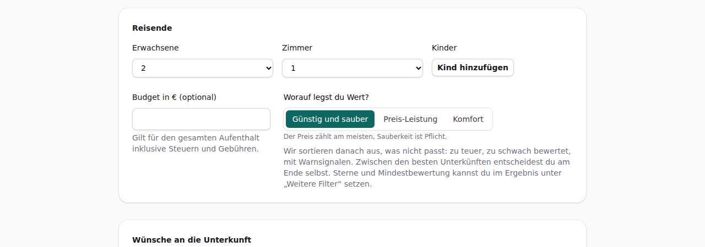
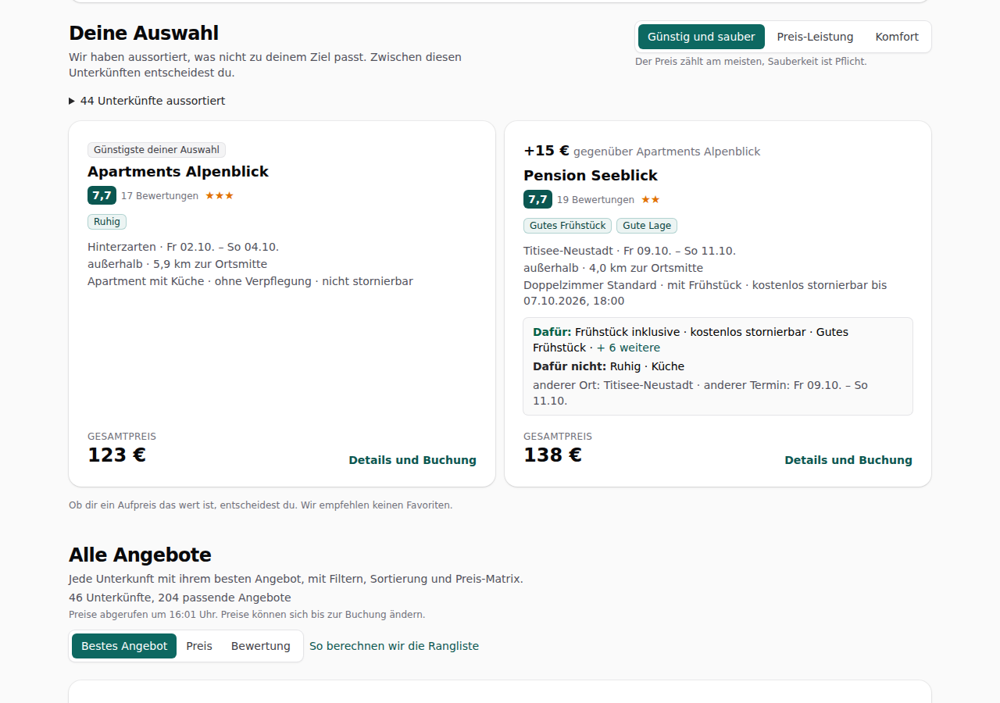
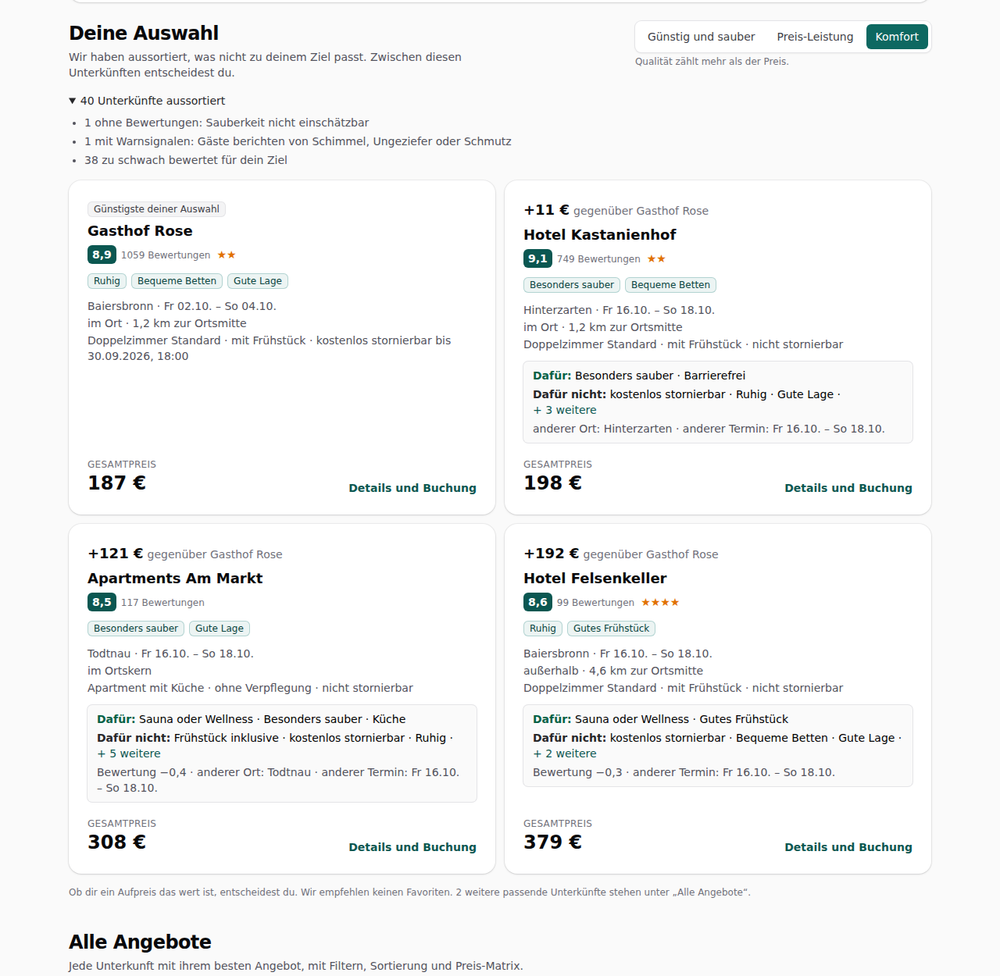
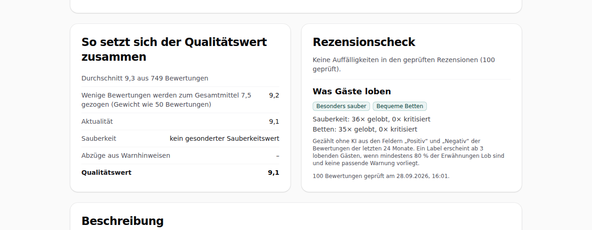

# Dogfood-Walkthrough 2026-09-28T14-01-42-P-finale

- Modus: P – Pfad (Nutzerablauf mit Eingaben)
- Flows: finale
- Basis-URL: http://localhost:42089 (echter lokaler Stack, Anbieter im Fake-Modus)
- Stand: af85003, gestartet 2026-09-28T14:01:42.523Z
- Ergebnis: ✅ bestanden (36/36 Prüfungen erfüllt)

## Flow „finale“

Entscheidungshilfe (F15–F17, konzept.md 9.9–9.11): Ziel „Günstig und sauber“ im Suchformular, Suche Stuttgart → 5 Orte × 3 Freitage; oben „Deine Auswahl“ mit höchstens 4 Finalisten, die günstigste zuerst, bei den anderen Aufpreis und was er bringt, ohne Empfehlung; aussortierte Unterkünfte mit Gründen; Zielwechsel ohne neue Suche; Lob-Labels in Liste und Detailansicht; Sterne und Mindestbewertung unter „Weitere Filter“.

### 01 Suchformular: Ziel „Günstig und sauber“ mit einem Tipp

- URL: `/suche`
- Screenshot: 
- Prüfungen:
  - [x] enthält „Worauf legst du Wert?“
  - [x] enthält „Günstig und sauber“
  - [x] enthält „Preis-Leistung“
  - [x] enthält „Komfort“
  - [x] enthält „Der Preis zählt am meisten, Sauberkeit ist Pflicht.“
  - [x] enthält „Weitere Filter“
  - [x] enthält nicht „Mindestens Sterne“
  - [x] enthält nicht „Mindeststandard“
  - [x] Element `[data-testid="goal-switch"] [aria-checked="true"][data-goal="sparen"]` vorhanden (1)
- Überschriften: „Deine Suche“
- KI-Kennzeichnungen (`data-ai-provenance`): „Deine Eingabe wird per KI in Auswahl-Chips übersetzt. Bitte prüfe die Auswahl. [ai_assisted]“
- Konsolenfehler: keine
- Fehlgeschlagene Anfragen: keine

<details><summary>Sichtbarer Text</summary>

```text
Entwicklungsmodus: Alle Anbieter (Unterkünfte, Fahrzeiten, KI, E-Mail) sind simuliert. Es werden keine echten Buchungen ausgelöst.
Reiseplaner
ARBEITSTITEL
Suche
So funktioniert's
Meine Buchung

Schritt 1 von 3

Deine Suche
1
Suchrahmen
→
2
Regionen
→
3
Orte
Startort

Städte und Orte in Deutschland, Österreich, der Schweiz und Südtirol.

Maximale Fahrzeit (Auto)
Keine Begrenzung
1 Stunde
1 h 30 min
2 Stunden
2 h 30 min
3 Stunden
4 Stunden
5 Stunden
6 Stunden
Reiseart

Was möchtest du vor Ort machen? Mehrfachauswahl möglich.

Wandern
Bergpanorama
Seen
Natur und Ruhe
Radfahren
Wellness
Wintersport
Städte und Kultur
Wein und Kulinarik
Familie
Zeitfenster
Früheste Anreise
Späteste Abreise
Nächte
1
2
3
4
5
6
7
8
9
10
11
12
13
14
Anreise an diesen Wochentagen
Mo
Di
Mi
Do
Fr
Sa
So
Daraus entstehen 3 Termine: 02.10., 09.10., 16.10.
Reisende
Erwachsene
1
2
3
4
5
6
Zimmer
1
2
3
4
5
Kinder
Kind hinzufügen
Budget in € (optional)

Gilt für den gesamten Aufenthalt inklusive Steuern und Gebühren.

Worauf legst du Wert?

Günstig und sauber
Preis-Leistung
Komfort

Der Preis zählt am meisten, Sauberkeit ist Pflicht.

Wir sortieren danach aus, was nicht passt: zu teuer, zu schwach bewertet, mit Warnsignalen. Zwischen den besten Unterkünften entscheidest du am Ende selbst. Sterne und Mindestbewertung kannst du im Ergebnis unter „Weitere Filter“ setzen.

Wünsche an die Unterkunft
Besonders sauber
Ruhig
Mit Frühstück
Kostenlos stornierbar
Parkplatz
Hund erlaubt
Sauna oder Wellness
WLAN
Küche
Barrierefrei
Familienzimmer
Weitere Wünsche in eigenen Worten (optional)
Deine Eingabe wird per KI in Auswahl-Chips übersetzt. Bitte prüfe die Auswahl.
In Chips übersetzen
0/300
Weiter zu den Regionen
Orte direkt eingeben

Reiseplaner

Wir vermitteln Unterkünfte; Vertragspartner ist die jeweilige Unterku
… (220 weitere Zeichen)
```

</details>

### 02 Suche abgeschlossen: „Deine Auswahl“ steht oben

- URL: `/suche/715d81d2-1dcc-4414-aef2-5ce6f27c0ed4#t=RFk8fqIJatsEffcd1RTO0bZGiQxoeItZjZCKPs-tXF0`
- Screenshot: 
- Notiz: 2 Finalisten, Gesamtpreise 122.69 € · 137.94 €; Aufpreise +15.25 €.
- Prüfungen:
  - [x] enthält „Deine Auswahl“
  - [x] enthält „Wir haben aussortiert“
  - [x] enthält „Günstigste deiner Auswahl“
  - [x] enthält „aussortiert“
  - [x] enthält „Wir empfehlen keinen Favoriten“
  - [x] enthält „Alle Angebote“
  - [x] enthält nicht „Unsere Empfehlung“
  - [x] enthält nicht „Testsieger“
  - [x] Element `[data-testid="finalist"]` vorhanden (2)
  - [x] Element `[data-testid="excluded"]` vorhanden (1)
- Überschriften: „Suche abgeschlossen“, „Deine Auswahl“, „Alle Angebote“
- KI-Kennzeichnungen (`data-ai-provenance`): „KI-gestützte Auswertung von Gästebewertungen [ai_assisted]“, „KI-gestützte Auswertung von Gästebewertungen [ai_assisted]“, „KI-gestützte Auswertung von Gästebewertungen [ai_assisted]“, „KI-gestützte Auswertung von Gästebewertungen [ai_assisted]“, „KI-gestützte Auswertung von Gästebewertungen [ai_assisted]“
- Konsolenfehler: keine
- Fehlgeschlagene Anfragen: keine

<details><summary>Sichtbarer Text</summary>

```text
Entwicklungsmodus: Alle Anbieter (Unterkünfte, Fahrzeiten, KI, E-Mail) sind simuliert. Es werden keine echten Buchungen ausgelöst.
Reiseplaner
ARBEITSTITEL
Suche
So funktioniert's
Meine Buchung
Suche abgeschlossen

15 von 15 Kombinationen

204 Angebote

Deine Auswahl

Wir haben aussortiert, was nicht zu deinem Ziel passt. Zwischen diesen Unterkünften entscheidest du.

Günstig und sauber
Preis-Leistung
Komfort

Der Preis zählt am meisten, Sauberkeit ist Pflicht.

44 Unterkünfte aussortiert
Günstigste deiner Auswahl
Apartments Alpenblick
7,7
17 Bewertungen
★★★
Ruhig

Hinterzarten · Fr 02.10. – So 04.10.

außerhalb · 5,9 km zur Ortsmitte

Apartment mit Küche · ohne Verpflegung · nicht stornierbar

GESAMTPREIS
123 €
Details und Buchung

+15 € gegenüber Apartments Alpenblick

Pension Seeblick
7,7
19 Bewertungen
★★
Gutes Frühstück
Gute Lage

Titisee-Neustadt · Fr 09.10. – So 11.10.

außerhalb · 4,0 km zur Ortsmitte

Doppelzimmer Standard · mit Frühstück · kostenlos stornierbar bis 07.10.2026, 18:00

Dafür: Frühstück inklusive · kostenlos stornierbar · Gutes Frühstück · + 6 weitere

Dafür nicht: Ruhig · Küche

anderer Ort: Titisee-Neustadt · anderer Termin: Fr 09.10. – So 11.10.

GESAMTPREIS
138 €
Details und Buchung

Ob dir ein Aufpreis das wert ist, entscheidest du. Wir empfehlen keinen Favoriten.

Alle Angebote

Jede Unterkunft mit ihrem besten Angebot, mit Filtern, Sortierung und Preis-Matrix.

46 Unterkünfte, 204 passende Angebote

Preise abgerufen um 16:01 Uhr. Preise können sich bis zur Buchung ändern.

Sortierung
Bestes Angebot
Preis
Bewertung
So berechnen wir die Rangliste
Filter
Budget gesamt (€)
Verpflegung
egal
ohne
Frühstück
Halbpension
Vollpension
All inclusive
Nur kostenlos stornierbar
Weitere Filter: Sterne und Bewertungen
Filter anwenden
Filter der Suche
Ort	F
… (15729 weitere Zeichen)
```

</details>

### 03 Aussortiert, mit Grund und Anzahl

- URL: `/suche/715d81d2-1dcc-4414-aef2-5ce6f27c0ed4#t=RFk8fqIJatsEffcd1RTO0bZGiQxoeItZjZCKPs-tXF0`
- Screenshot: 
- Notiz: Gründe: 1 ohne Bewertungen: Sauberkeit nicht einschätzbar | 1 mit Warnsignalen: Gäste berichten von Schimmel, Ungeziefer oder Schmutz | 7 zu schwach bewertet für dein Ziel | 31 zu teuer für dein Ziel | 4 mit einem besseren Angebot: nicht teurer, mindestens gleich gut bewertet, mit allem, was dieses bietet
- Prüfungen:
  - [x] enthält „zu teuer für dein Ziel“
  - [x] Element `[data-testid="excluded"] li[data-reason]` vorhanden (5)
- Überschriften: „Suche abgeschlossen“, „Deine Auswahl“, „Alle Angebote“
- KI-Kennzeichnungen (`data-ai-provenance`): „KI-gestützte Auswertung von Gästebewertungen [ai_assisted]“, „KI-gestützte Auswertung von Gästebewertungen [ai_assisted]“, „KI-gestützte Auswertung von Gästebewertungen [ai_assisted]“, „KI-gestützte Auswertung von Gästebewertungen [ai_assisted]“, „KI-gestützte Auswertung von Gästebewertungen [ai_assisted]“
- Konsolenfehler: keine
- Fehlgeschlagene Anfragen: keine

<details><summary>Sichtbarer Text</summary>

```text
Entwicklungsmodus: Alle Anbieter (Unterkünfte, Fahrzeiten, KI, E-Mail) sind simuliert. Es werden keine echten Buchungen ausgelöst.
Reiseplaner
ARBEITSTITEL
Suche
So funktioniert's
Meine Buchung
Suche abgeschlossen

15 von 15 Kombinationen

204 Angebote

Deine Auswahl

Wir haben aussortiert, was nicht zu deinem Ziel passt. Zwischen diesen Unterkünften entscheidest du.

Günstig und sauber
Preis-Leistung
Komfort

Der Preis zählt am meisten, Sauberkeit ist Pflicht.

44 Unterkünfte aussortiert
1 ohne Bewertungen: Sauberkeit nicht einschätzbar
1 mit Warnsignalen: Gäste berichten von Schimmel, Ungeziefer oder Schmutz
7 zu schwach bewertet für dein Ziel
31 zu teuer für dein Ziel
4 mit einem besseren Angebot: nicht teurer, mindestens gleich gut bewertet, mit allem, was dieses bietet
Günstigste deiner Auswahl
Apartments Alpenblick
7,7
17 Bewertungen
★★★
Ruhig

Hinterzarten · Fr 02.10. – So 04.10.

außerhalb · 5,9 km zur Ortsmitte

Apartment mit Küche · ohne Verpflegung · nicht stornierbar

GESAMTPREIS
123 €
Details und Buchung

+15 € gegenüber Apartments Alpenblick

Pension Seeblick
7,7
19 Bewertungen
★★
Gutes Frühstück
Gute Lage

Titisee-Neustadt · Fr 09.10. – So 11.10.

außerhalb · 4,0 km zur Ortsmitte

Doppelzimmer Standard · mit Frühstück · kostenlos stornierbar bis 07.10.2026, 18:00

Dafür: Frühstück inklusive · kostenlos stornierbar · Gutes Frühstück · + 6 weitere

Dafür nicht: Ruhig · Küche

anderer Ort: Titisee-Neustadt · anderer Termin: Fr 09.10. – So 11.10.

GESAMTPREIS
138 €
Details und Buchung

Ob dir ein Aufpreis das wert ist, entscheidest du. Wir empfehlen keinen Favoriten.

Alle Angebote

Jede Unterkunft mit ihrem besten Angebot, mit Filtern, Sortierung und Preis-Matrix.

46 Unterkünfte, 204 passende Angebote

Preise abgerufen um 16:01 Uhr. Preise können sich bis z
… (16020 weitere Zeichen)
```

</details>

### 04 Aufpreis und was er bringt oder kostet

- URL: `/suche/715d81d2-1dcc-4414-aef2-5ce6f27c0ed4#t=RFk8fqIJatsEffcd1RTO0bZGiQxoeItZjZCKPs-tXF0`
- Screenshot: 
- Notiz: Vergleich: Dafür: Frühstück inklusive · kostenlos stornierbar · Gutes Frühstück · + 6 weitere /  / Dafür nicht: Ruhig · Küche /  / anderer Ort: Titisee-Neustadt · anderer Termin: Fr 09.10. – So 11.10.
- Prüfungen:
  - [x] enthält „gegenüber“
  - [x] Element `[data-testid="comparison"]` vorhanden (1)
- Überschriften: „Suche abgeschlossen“, „Deine Auswahl“, „Alle Angebote“
- KI-Kennzeichnungen (`data-ai-provenance`): „KI-gestützte Auswertung von Gästebewertungen [ai_assisted]“, „KI-gestützte Auswertung von Gästebewertungen [ai_assisted]“, „KI-gestützte Auswertung von Gästebewertungen [ai_assisted]“, „KI-gestützte Auswertung von Gästebewertungen [ai_assisted]“, „KI-gestützte Auswertung von Gästebewertungen [ai_assisted]“
- Konsolenfehler: keine
- Fehlgeschlagene Anfragen: keine

<details><summary>Sichtbarer Text</summary>

```text
Entwicklungsmodus: Alle Anbieter (Unterkünfte, Fahrzeiten, KI, E-Mail) sind simuliert. Es werden keine echten Buchungen ausgelöst.
Reiseplaner
ARBEITSTITEL
Suche
So funktioniert's
Meine Buchung
Suche abgeschlossen

15 von 15 Kombinationen

204 Angebote

Deine Auswahl

Wir haben aussortiert, was nicht zu deinem Ziel passt. Zwischen diesen Unterkünften entscheidest du.

Günstig und sauber
Preis-Leistung
Komfort

Der Preis zählt am meisten, Sauberkeit ist Pflicht.

44 Unterkünfte aussortiert
1 ohne Bewertungen: Sauberkeit nicht einschätzbar
1 mit Warnsignalen: Gäste berichten von Schimmel, Ungeziefer oder Schmutz
7 zu schwach bewertet für dein Ziel
31 zu teuer für dein Ziel
4 mit einem besseren Angebot: nicht teurer, mindestens gleich gut bewertet, mit allem, was dieses bietet
Günstigste deiner Auswahl
Apartments Alpenblick
7,7
17 Bewertungen
★★★
Ruhig

Hinterzarten · Fr 02.10. – So 04.10.

außerhalb · 5,9 km zur Ortsmitte

Apartment mit Küche · ohne Verpflegung · nicht stornierbar

GESAMTPREIS
123 €
Details und Buchung

+15 € gegenüber Apartments Alpenblick

Pension Seeblick
7,7
19 Bewertungen
★★
Gutes Frühstück
Gute Lage

Titisee-Neustadt · Fr 09.10. – So 11.10.

außerhalb · 4,0 km zur Ortsmitte

Doppelzimmer Standard · mit Frühstück · kostenlos stornierbar bis 07.10.2026, 18:00

Dafür: Frühstück inklusive · kostenlos stornierbar · Gutes Frühstück · + 6 weitere

Dafür nicht: Ruhig · Küche

anderer Ort: Titisee-Neustadt · anderer Termin: Fr 09.10. – So 11.10.

GESAMTPREIS
138 €
Details und Buchung

Ob dir ein Aufpreis das wert ist, entscheidest du. Wir empfehlen keinen Favoriten.

Alle Angebote

Jede Unterkunft mit ihrem besten Angebot, mit Filtern, Sortierung und Preis-Matrix.

46 Unterkünfte, 204 passende Angebote

Preise abgerufen um 16:01 Uhr. Preise können sich bis z
… (16020 weitere Zeichen)
```

</details>

### 05 Zielwechsel ohne neue Suche: „Komfort“

- URL: `/suche/715d81d2-1dcc-4414-aef2-5ce6f27c0ed4#t=RFk8fqIJatsEffcd1RTO0bZGiQxoeItZjZCKPs-tXF0`
- Screenshot: 
- Notiz: Komfort-Finalisten: Gasthof Rose, Hotel Kastanienhof, Apartments Am Markt, Hotel Felsenkeller
- Prüfungen:
  - [x] enthält „Qualität zählt mehr als der Preis.“
  - [x] Element `[data-testid="finale"][data-goal="komfort"] [data-testid="finalist"]` vorhanden (4)
- Überschriften: „Suche abgeschlossen“, „Deine Auswahl“, „Alle Angebote“
- KI-Kennzeichnungen (`data-ai-provenance`): „KI-gestützte Auswertung von Gästebewertungen [ai_assisted]“, „KI-gestützte Auswertung von Gästebewertungen [ai_assisted]“, „KI-gestützte Auswertung von Gästebewertungen [ai_assisted]“, „KI-gestützte Auswertung von Gästebewertungen [ai_assisted]“, „KI-gestützte Auswertung von Gästebewertungen [ai_assisted]“
- Konsolenfehler: keine
- Fehlgeschlagene Anfragen: keine

<details><summary>Sichtbarer Text</summary>

```text
Entwicklungsmodus: Alle Anbieter (Unterkünfte, Fahrzeiten, KI, E-Mail) sind simuliert. Es werden keine echten Buchungen ausgelöst.
Reiseplaner
ARBEITSTITEL
Suche
So funktioniert's
Meine Buchung
Suche abgeschlossen

15 von 15 Kombinationen

204 Angebote

Deine Auswahl

Wir haben aussortiert, was nicht zu deinem Ziel passt. Zwischen diesen Unterkünften entscheidest du.

Günstig und sauber
Preis-Leistung
Komfort

Qualität zählt mehr als der Preis.

40 Unterkünfte aussortiert
1 ohne Bewertungen: Sauberkeit nicht einschätzbar
1 mit Warnsignalen: Gäste berichten von Schimmel, Ungeziefer oder Schmutz
38 zu schwach bewertet für dein Ziel
Günstigste deiner Auswahl
Gasthof Rose
8,9
1059 Bewertungen
★★
Ruhig
Bequeme Betten
Gute Lage

Baiersbronn · Fr 02.10. – So 04.10.

im Ort · 1,2 km zur Ortsmitte

Doppelzimmer Standard · mit Frühstück · kostenlos stornierbar bis 30.09.2026, 18:00

GESAMTPREIS
187 €
Details und Buchung

+11 € gegenüber Gasthof Rose

Hotel Kastanienhof
9,1
749 Bewertungen
★★
Besonders sauber
Bequeme Betten

Hinterzarten · Fr 16.10. – So 18.10.

im Ort · 1,2 km zur Ortsmitte

Doppelzimmer Standard · mit Frühstück · nicht stornierbar

Dafür: Besonders sauber · Barrierefrei

Dafür nicht: kostenlos stornierbar · Ruhig · Gute Lage · + 3 weitere

anderer Ort: Hinterzarten · anderer Termin: Fr 16.10. – So 18.10.

GESAMTPREIS
198 €
Details und Buchung

+121 € gegenüber Gasthof Rose

Apartments Am Markt
8,5
117 Bewertungen
Besonders sauber
Gute Lage

Todtnau · Fr 16.10. – So 18.10.

im Ortskern

Apartment mit Küche · ohne Verpflegung · nicht stornierbar

Dafür: Sauna oder Wellness · Besonders sauber · Küche

Dafür nicht: Frühstück inklusive · kostenlos stornierbar · Ruhig · + 5 weitere

Bewertung −0,4 · anderer Ort: Todtnau · anderer Termin: Fr 16.10. – So 18.10.

GESAMTP
… (16838 weitere Zeichen)
```

</details>

### 06 Lob-Labels erscheinen von selbst in der Liste

- URL: `/suche/715d81d2-1dcc-4414-aef2-5ce6f27c0ed4#t=RFk8fqIJatsEffcd1RTO0bZGiQxoeItZjZCKPs-tXF0`
- Screenshot: 
- Notiz: Labels in der Liste: Besonders sauber, Bequeme Betten, Ruhig, Gute Lage, Freundliches Personal, Gutes Frühstück, Schöne Aussicht (23 insgesamt).
- Prüfungen:
  - [x] Element `[data-testid="result-list"] [data-testid="praise-label"]` vorhanden (23)
- Überschriften: „Suche abgeschlossen“, „Deine Auswahl“, „Alle Angebote“
- KI-Kennzeichnungen (`data-ai-provenance`): „KI-gestützte Auswertung von Gästebewertungen [ai_assisted]“, „KI-gestützte Auswertung von Gästebewertungen [ai_assisted]“, „KI-gestützte Auswertung von Gästebewertungen [ai_assisted]“, „KI-gestützte Auswertung von Gästebewertungen [ai_assisted]“, „KI-gestützte Auswertung von Gästebewertungen [ai_assisted]“
- Konsolenfehler: keine
- Fehlgeschlagene Anfragen: keine

<details><summary>Sichtbarer Text</summary>

```text
Entwicklungsmodus: Alle Anbieter (Unterkünfte, Fahrzeiten, KI, E-Mail) sind simuliert. Es werden keine echten Buchungen ausgelöst.
Reiseplaner
ARBEITSTITEL
Suche
So funktioniert's
Meine Buchung
Suche abgeschlossen

15 von 15 Kombinationen

204 Angebote

Deine Auswahl

Wir haben aussortiert, was nicht zu deinem Ziel passt. Zwischen diesen Unterkünften entscheidest du.

Günstig und sauber
Preis-Leistung
Komfort

Qualität zählt mehr als der Preis.

40 Unterkünfte aussortiert
1 ohne Bewertungen: Sauberkeit nicht einschätzbar
1 mit Warnsignalen: Gäste berichten von Schimmel, Ungeziefer oder Schmutz
38 zu schwach bewertet für dein Ziel
Günstigste deiner Auswahl
Gasthof Rose
8,9
1059 Bewertungen
★★
Ruhig
Bequeme Betten
Gute Lage

Baiersbronn · Fr 02.10. – So 04.10.

im Ort · 1,2 km zur Ortsmitte

Doppelzimmer Standard · mit Frühstück · kostenlos stornierbar bis 30.09.2026, 18:00

GESAMTPREIS
187 €
Details und Buchung

+11 € gegenüber Gasthof Rose

Hotel Kastanienhof
9,1
749 Bewertungen
★★
Besonders sauber
Bequeme Betten

Hinterzarten · Fr 16.10. – So 18.10.

im Ort · 1,2 km zur Ortsmitte

Doppelzimmer Standard · mit Frühstück · nicht stornierbar

Dafür: Besonders sauber · Barrierefrei

Dafür nicht: kostenlos stornierbar · Ruhig · Gute Lage · + 3 weitere

anderer Ort: Hinterzarten · anderer Termin: Fr 16.10. – So 18.10.

GESAMTPREIS
198 €
Details und Buchung

+121 € gegenüber Gasthof Rose

Apartments Am Markt
8,5
117 Bewertungen
Besonders sauber
Gute Lage

Todtnau · Fr 16.10. – So 18.10.

im Ortskern

Apartment mit Küche · ohne Verpflegung · nicht stornierbar

Dafür: Sauna oder Wellness · Besonders sauber · Küche

Dafür nicht: Frühstück inklusive · kostenlos stornierbar · Ruhig · + 5 weitere

Bewertung −0,4 · anderer Ort: Todtnau · anderer Termin: Fr 16.10. – So 18.10.

GESAMTP
… (16838 weitere Zeichen)
```

</details>

### 07 Detailansicht: „Was Gäste loben“ mit Zahlen

- URL: `/suche/715d81d2-1dcc-4414-aef2-5ce6f27c0ed4/unterkunft/lpf-4790-811-0#t=RFk8fqIJatsEffcd1RTO0bZGiQxoeItZjZCKPs-tXF0`
- Screenshot: 
- Notiz: Detail: Sauberkeit: 36× gelobt, 0× kritisiert | Betten: 35× gelobt, 0× kritisiert
- Prüfungen:
  - [x] enthält „Was Gäste loben“
  - [x] enthält „× gelobt“
  - [x] enthält „× kritisiert“
  - [x] enthält „ohne KI“
  - [x] Element `[data-testid="praise"] [data-testid="praise-label"]` vorhanden (2)
  - [x] Element `[data-testid="praise-count"]` vorhanden (2)
- Überschriften: „Hotel Kastanienhof“, „Alle Termine und Tarife“, „So setzt sich der Qualitätswert zusammen“, „Rezensionscheck“, „Beschreibung“, „Ausstattung“
- KI-Kennzeichnungen (`data-ai-provenance`): keine
- Konsolenfehler: keine
- Fehlgeschlagene Anfragen: keine

<details><summary>Sichtbarer Text</summary>

```text
Entwicklungsmodus: Alle Anbieter (Unterkünfte, Fahrzeiten, KI, E-Mail) sind simuliert. Es werden keine echten Buchungen ausgelöst.
Reiseplaner
ARBEITSTITEL
Suche
So funktioniert's
Meine Buchung
← Zurück zu den Ergebnissen
Hotel Kastanienhof

★★ · Hotel · Marktplatz 43

9,1
749 Bewertungen
Alle Termine und Tarife
Termin	Zimmer und Tarif	Stornierung	Preis	

Fr 02.10. – So 04.10.
Hinterzarten
	
Doppelzimmer Standard
mit Frühstück
Schnäppchen Preis-Leistung 48 % besser als der Durchschnitt deiner Suche
	nicht stornierbar	
203 €
101,58 € pro Nacht
Vergleichspreis anzeigen
	Buchen

Fr 02.10. – So 04.10.
Hinterzarten
	
Doppelzimmer Standard
mit Frühstück
Schnäppchen Preis-Leistung 33 % besser als der Durchschnitt deiner Suche
	kostenlos stornierbar bis 30.09.2026, 18:00	
226 €
112,86 € pro Nacht
Vergleichspreis anzeigen
	Buchen

Fr 09.10. – So 11.10.
Hinterzarten
	
Doppelzimmer Komfort mit Balkon
mit Frühstück
	nicht stornierbar	
234 €
116,86 € pro Nacht
Vergleichspreis anzeigen
	Buchen

Fr 09.10. – So 11.10.
Hinterzarten
	
Doppelzimmer Komfort mit Balkon
mit Frühstück
	kostenlos stornierbar bis 07.10.2026, 18:00	
260 €
129,84 € pro Nacht
Vergleichspreis anzeigen
	Buchen

Fr 16.10. – So 18.10.
Hinterzarten
	
Doppelzimmer Standard
mit Frühstück
Schnäppchen Preis-Leistung 52 % besser als der Durchschnitt deiner Suche
	nicht stornierbar	
198 €
98,81 € pro Nacht
Vergleichspreis anzeigen
	Buchen

Fr 16.10. – So 18.10.
Hinterzarten
	
Doppelzimmer Standard
mit Frühstück
Schnäppchen Preis-Leistung 37 % besser als der Durchschnitt deiner Suche
	kostenlos stornierbar bis 14.10.2026, 18:00	
220 €
109,79 € pro Nacht
Vergleichspreis anzeigen
	Buchen
So setzt sich der Qualitätswert zusammen
Durchschnitt 9,3 aus 749 Bewertungen
Wenige Bewertungen werden zum Gesamtmittel 7,5 gezogen (Gewicht 
… (1173 weitere Zeichen)
```

</details>

### 08 Sterne und Mindestbewertung unter „Weitere Filter“

- URL: `/suche/715d81d2-1dcc-4414-aef2-5ce6f27c0ed4#t=RFk8fqIJatsEffcd1RTO0bZGiQxoeItZjZCKPs-tXF0`
- Screenshot: 
- Prüfungen:
  - [x] enthält „Weitere Filter: Sterne und Bewertungen“
  - [x] enthält „Sterne ab“
  - [x] enthält „Bewertung ab“
  - [x] enthält „Sterne sagen wenig über Sauberkeit und Zustand.“
- Überschriften: „Suche abgeschlossen“, „Deine Auswahl“, „Alle Angebote“
- KI-Kennzeichnungen (`data-ai-provenance`): „KI-gestützte Auswertung von Gästebewertungen [ai_assisted]“, „KI-gestützte Auswertung von Gästebewertungen [ai_assisted]“, „KI-gestützte Auswertung von Gästebewertungen [ai_assisted]“, „KI-gestützte Auswertung von Gästebewertungen [ai_assisted]“, „KI-gestützte Auswertung von Gästebewertungen [ai_assisted]“
- Konsolenfehler: keine
- Fehlgeschlagene Anfragen: keine

<details><summary>Sichtbarer Text</summary>

```text
Entwicklungsmodus: Alle Anbieter (Unterkünfte, Fahrzeiten, KI, E-Mail) sind simuliert. Es werden keine echten Buchungen ausgelöst.
Reiseplaner
ARBEITSTITEL
Suche
So funktioniert's
Meine Buchung
Suche abgeschlossen

15 von 15 Kombinationen

204 Angebote

Deine Auswahl

Wir haben aussortiert, was nicht zu deinem Ziel passt. Zwischen diesen Unterkünften entscheidest du.

Günstig und sauber
Preis-Leistung
Komfort

Der Preis zählt am meisten, Sauberkeit ist Pflicht.

44 Unterkünfte aussortiert
Günstigste deiner Auswahl
Apartments Alpenblick
7,7
17 Bewertungen
★★★
Ruhig

Hinterzarten · Fr 02.10. – So 04.10.

außerhalb · 5,9 km zur Ortsmitte

Apartment mit Küche · ohne Verpflegung · nicht stornierbar

GESAMTPREIS
123 €
Details und Buchung

+15 € gegenüber Apartments Alpenblick

Pension Seeblick
7,7
19 Bewertungen
★★
Gutes Frühstück
Gute Lage

Titisee-Neustadt · Fr 09.10. – So 11.10.

außerhalb · 4,0 km zur Ortsmitte

Doppelzimmer Standard · mit Frühstück · kostenlos stornierbar bis 07.10.2026, 18:00

Dafür: Frühstück inklusive · kostenlos stornierbar · Gutes Frühstück · + 6 weitere

Dafür nicht: Ruhig · Küche

anderer Ort: Titisee-Neustadt · anderer Termin: Fr 09.10. – So 11.10.

GESAMTPREIS
138 €
Details und Buchung

Ob dir ein Aufpreis das wert ist, entscheidest du. Wir empfehlen keinen Favoriten.

Alle Angebote

Jede Unterkunft mit ihrem besten Angebot, mit Filtern, Sortierung und Preis-Matrix.

46 Unterkünfte, 204 passende Angebote

Preise abgerufen um 16:01 Uhr. Preise können sich bis zur Buchung ändern.

Sortierung
Bestes Angebot
Preis
Bewertung
So berechnen wir die Rangliste
Filter
Budget gesamt (€)
Verpflegung
egal
ohne
Frühstück
Halbpension
Vollpension
All inclusive
Nur kostenlos stornierbar
Weitere Filter: Sterne und Bewertungen

Sterne sagen wenig über Sauberkeit un
… (15946 weitere Zeichen)
```

</details>

