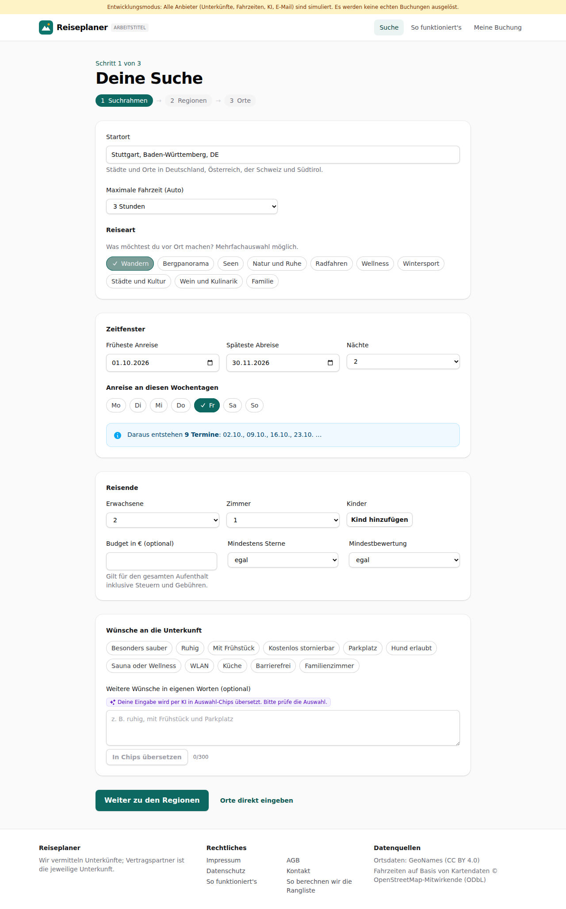
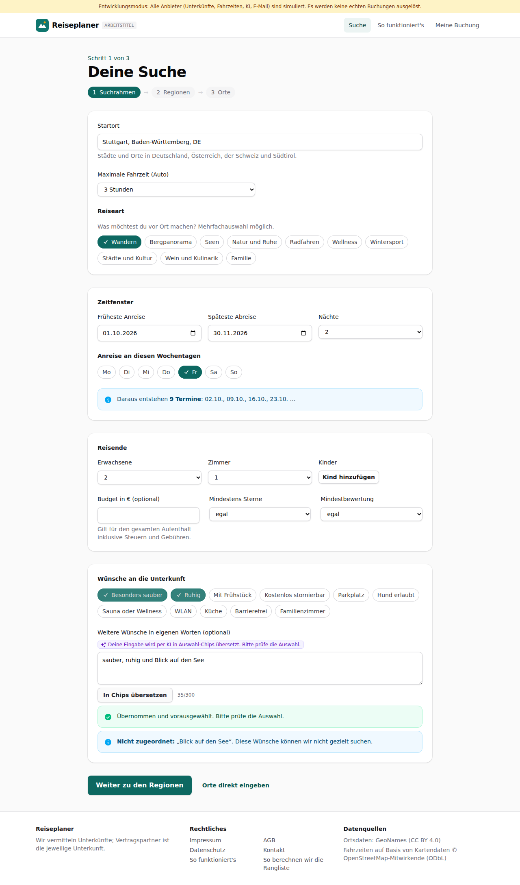
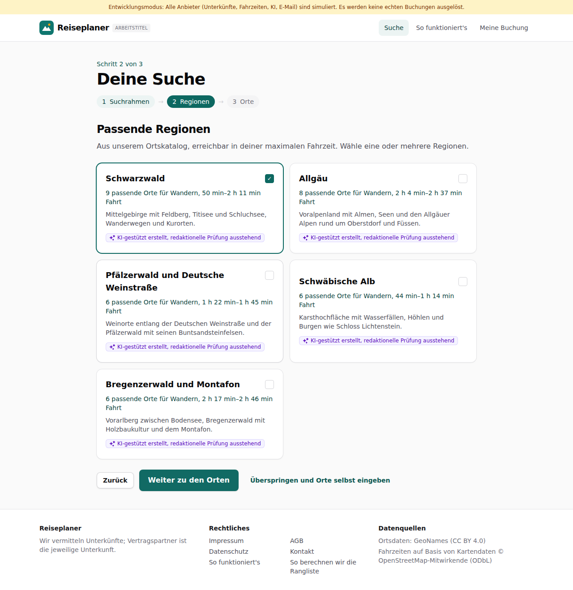
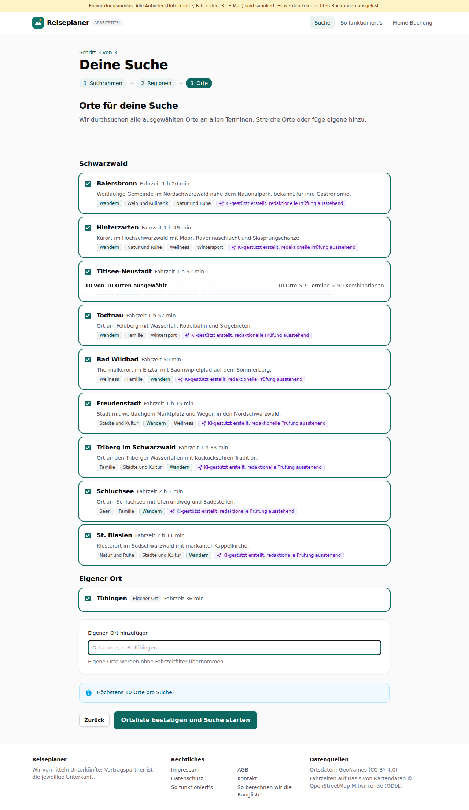

# Dogfood-Walkthrough 2026-09-27T15-28-22-P-suchrahmen

- Modus: P – Pfad (Nutzerablauf mit Eingaben)
- Flows: suchrahmen
- Basis-URL: http://localhost:43149 (echter lokaler Stack, Anbieter im Fake-Modus)
- Stand: a1cdc68, gestartet 2026-09-27T15:28:22.531Z
- Ergebnis: ✅ bestanden (32/32 Prüfungen erfüllt)

## Flow „suchrahmen“

Assistent Schritt 1 bis 3 (F1–F3): Startort per Autovervollständigung, Zeitfenster mit Live-Terminanzahl, Freitext per KI in Chips, Regionsvorschläge mit Begründung, Ortsliste mit Fahrzeiten, eigener Ort, Bestätigung.

### 01 Suchrahmen öffnen

- URL: `/suche`
- Screenshot: (Screenshot `01-suchrahmen-o-ffnen.png` nur im lokalen Lauf)
- Prüfungen:
  - [x] enthält „Schritt“
  - [x] enthält „Suchrahmen“
  - [x] enthält „Regionen“
  - [x] enthält „Orte“
  - [x] enthält „Startort“
  - [x] enthält „Reiseart“
  - [x] enthält „Zeitfenster“
- Überschriften: „Deine Suche“
- KI-Kennzeichnungen (`data-ai-provenance`): „Deine Eingabe wird per KI in Auswahl-Chips übersetzt. Bitte prüfe die Auswahl. [ai_assisted]“
- Konsolenfehler: keine
- Fehlgeschlagene Anfragen: keine

<details><summary>Sichtbarer Text</summary>

```text
Entwicklungsmodus: Alle Anbieter (Unterkünfte, Fahrzeiten, KI, E-Mail) sind simuliert. Es werden keine echten Buchungen ausgelöst.
Reiseplaner
ARBEITSTITEL
Suche
So funktioniert's
Meine Buchung

Schritt 1 von 3

Deine Suche
1
Suchrahmen
→
2
Regionen
→
3
Orte
Startort

Städte und Orte in Deutschland, Österreich, der Schweiz und Südtirol.

Maximale Fahrzeit (Auto)
Keine Begrenzung
1 Stunde
1 h 30 min
2 Stunden
2 h 30 min
3 Stunden
4 Stunden
5 Stunden
6 Stunden
Reiseart

Was möchtest du vor Ort machen? Mehrfachauswahl möglich.

Wandern
Bergpanorama
Seen
Natur und Ruhe
Radfahren
Wellness
Wintersport
Städte und Kultur
Wein und Kulinarik
Familie
Zeitfenster
Früheste Anreise
Späteste Abreise
Nächte
1
2
3
4
5
6
7
8
9
10
11
12
13
14
Anreise an diesen Wochentagen
Mo
Di
Mi
Do
Fr
Sa
So
Daraus entstehen 6 Termine: 09.10., 16.10., 23.10., 30.10. …
Reisende
Erwachsene
1
2
3
4
5
6
Zimmer
1
2
3
4
5
Kinder
Kind hinzufügen
Budget in € (optional)

Gilt für den gesamten Aufenthalt inklusive Steuern und Gebühren.

Mindestens Sterne
egal
2+
3+
4+
5+
Mindestbewertung
egal
7+
7,5+
8+
8,5+
9+
Wünsche an die Unterkunft
Besonders sauber
Ruhig
Mit Frühstück
Kostenlos stornierbar
Parkplatz
Hund erlaubt
Sauna oder Wellness
WLAN
Küche
Barrierefrei
Familienzimmer
Weitere Wünsche in eigenen Worten (optional)
Deine Eingabe wird per KI in Auswahl-Chips übersetzt. Bitte prüfe die Auswahl.
In Chips übersetzen
0/300
Weiter zu den Regionen
Orte direkt eingeben

Reiseplaner

Wir vermitteln Unterkünfte; Vertragspartner ist die jeweilige Unterkunft.

Rechtliches

Impressum
AGB
Datenschutz
Kontakt
So funktioniert's
So berechnen wir die Rangliste

Datenquellen

Ortsdaten: GeoNames (CC BY 4.0)
Fahrzeiten auf Basis von Kartendaten © OpenStreetMap-Mitwirkende (ODbL)
```

</details>

### 02 Startort „Stutt“ → Stuttgart

- URL: `/suche`
- Screenshot: (Screenshot `02-startort-stutt-stuttgart.png` nur im lokalen Lauf)
- Prüfungen:
  - [x] Element `[data-origin="2825297"]` vorhanden (1)
- Überschriften: „Deine Suche“
- KI-Kennzeichnungen (`data-ai-provenance`): „Deine Eingabe wird per KI in Auswahl-Chips übersetzt. Bitte prüfe die Auswahl. [ai_assisted]“
- Konsolenfehler: keine
- Fehlgeschlagene Anfragen: keine

<details><summary>Sichtbarer Text</summary>

```text
Entwicklungsmodus: Alle Anbieter (Unterkünfte, Fahrzeiten, KI, E-Mail) sind simuliert. Es werden keine echten Buchungen ausgelöst.
Reiseplaner
ARBEITSTITEL
Suche
So funktioniert's
Meine Buchung

Schritt 1 von 3

Deine Suche
1
Suchrahmen
→
2
Regionen
→
3
Orte
Startort

Städte und Orte in Deutschland, Österreich, der Schweiz und Südtirol.

Maximale Fahrzeit (Auto)
Keine Begrenzung
1 Stunde
1 h 30 min
2 Stunden
2 h 30 min
3 Stunden
4 Stunden
5 Stunden
6 Stunden
Reiseart

Was möchtest du vor Ort machen? Mehrfachauswahl möglich.

Wandern
Bergpanorama
Seen
Natur und Ruhe
Radfahren
Wellness
Wintersport
Städte und Kultur
Wein und Kulinarik
Familie
Zeitfenster
Früheste Anreise
Späteste Abreise
Nächte
1
2
3
4
5
6
7
8
9
10
11
12
13
14
Anreise an diesen Wochentagen
Mo
Di
Mi
Do
Fr
Sa
So
Daraus entstehen 6 Termine: 09.10., 16.10., 23.10., 30.10. …
Reisende
Erwachsene
1
2
3
4
5
6
Zimmer
1
2
3
4
5
Kinder
Kind hinzufügen
Budget in € (optional)

Gilt für den gesamten Aufenthalt inklusive Steuern und Gebühren.

Mindestens Sterne
egal
2+
3+
4+
5+
Mindestbewertung
egal
7+
7,5+
8+
8,5+
9+
Wünsche an die Unterkunft
Besonders sauber
Ruhig
Mit Frühstück
Kostenlos stornierbar
Parkplatz
Hund erlaubt
Sauna oder Wellness
WLAN
Küche
Barrierefrei
Familienzimmer
Weitere Wünsche in eigenen Worten (optional)
Deine Eingabe wird per KI in Auswahl-Chips übersetzt. Bitte prüfe die Auswahl.
In Chips übersetzen
0/300
Weiter zu den Regionen
Orte direkt eingeben

Reiseplaner

Wir vermitteln Unterkünfte; Vertragspartner ist die jeweilige Unterkunft.

Rechtliches

Impressum
AGB
Datenschutz
Kontakt
So funktioniert's
So berechnen wir die Rangliste

Datenquellen

Ortsdaten: GeoNames (CC BY 4.0)
Fahrzeiten auf Basis von Kartendaten © OpenStreetMap-Mitwirkende (ODbL)
```

</details>

### 03 Zeitfenster 01.10.–30.11.2026, 2 Nächte, Anreise Freitag, Wandern

- URL: `/suche`
- Screenshot: 
- Prüfungen:
  - [x] enthält „9 Termine“
  - [x] enthält „02.10.“
  - [x] enthält „Fr“
- Überschriften: „Deine Suche“
- KI-Kennzeichnungen (`data-ai-provenance`): „Deine Eingabe wird per KI in Auswahl-Chips übersetzt. Bitte prüfe die Auswahl. [ai_assisted]“
- Konsolenfehler: keine
- Fehlgeschlagene Anfragen: keine

<details><summary>Sichtbarer Text</summary>

```text
Entwicklungsmodus: Alle Anbieter (Unterkünfte, Fahrzeiten, KI, E-Mail) sind simuliert. Es werden keine echten Buchungen ausgelöst.
Reiseplaner
ARBEITSTITEL
Suche
So funktioniert's
Meine Buchung

Schritt 1 von 3

Deine Suche
1
Suchrahmen
→
2
Regionen
→
3
Orte
Startort

Städte und Orte in Deutschland, Österreich, der Schweiz und Südtirol.

Maximale Fahrzeit (Auto)
Keine Begrenzung
1 Stunde
1 h 30 min
2 Stunden
2 h 30 min
3 Stunden
4 Stunden
5 Stunden
6 Stunden
Reiseart

Was möchtest du vor Ort machen? Mehrfachauswahl möglich.

Wandern
Bergpanorama
Seen
Natur und Ruhe
Radfahren
Wellness
Wintersport
Städte und Kultur
Wein und Kulinarik
Familie
Zeitfenster
Früheste Anreise
Späteste Abreise
Nächte
1
2
3
4
5
6
7
8
9
10
11
12
13
14
Anreise an diesen Wochentagen
Mo
Di
Mi
Do
Fr
Sa
So
Daraus entstehen 9 Termine: 02.10., 09.10., 16.10., 23.10. …
Reisende
Erwachsene
1
2
3
4
5
6
Zimmer
1
2
3
4
5
Kinder
Kind hinzufügen
Budget in € (optional)

Gilt für den gesamten Aufenthalt inklusive Steuern und Gebühren.

Mindestens Sterne
egal
2+
3+
4+
5+
Mindestbewertung
egal
7+
7,5+
8+
8,5+
9+
Wünsche an die Unterkunft
Besonders sauber
Ruhig
Mit Frühstück
Kostenlos stornierbar
Parkplatz
Hund erlaubt
Sauna oder Wellness
WLAN
Küche
Barrierefrei
Familienzimmer
Weitere Wünsche in eigenen Worten (optional)
Deine Eingabe wird per KI in Auswahl-Chips übersetzt. Bitte prüfe die Auswahl.
In Chips übersetzen
0/300
Weiter zu den Regionen
Orte direkt eingeben

Reiseplaner

Wir vermitteln Unterkünfte; Vertragspartner ist die jeweilige Unterkunft.

Rechtliches

Impressum
AGB
Datenschutz
Kontakt
So funktioniert's
So berechnen wir die Rangliste

Datenquellen

Ortsdaten: GeoNames (CC BY 4.0)
Fahrzeiten auf Basis von Kartendaten © OpenStreetMap-Mitwirkende (ODbL)
```

</details>

### 04 Zu viele Termine → verständliche Meldung

- URL: `/suche`
- Screenshot: (Screenshot `04-zu-viele-termine-versta-ndliche-meldung.png` nur im lokalen Lauf)
- Notiz: Mit Fr, Sa und So entstehen zu viele Termine; danach wieder nur Freitag.
- Prüfungen:
  - [x] enthält „Möglich sind höchstens 12“
- Überschriften: „Deine Suche“
- KI-Kennzeichnungen (`data-ai-provenance`): „Deine Eingabe wird per KI in Auswahl-Chips übersetzt. Bitte prüfe die Auswahl. [ai_assisted]“
- Konsolenfehler: keine
- Fehlgeschlagene Anfragen: keine

<details><summary>Sichtbarer Text</summary>

```text
Entwicklungsmodus: Alle Anbieter (Unterkünfte, Fahrzeiten, KI, E-Mail) sind simuliert. Es werden keine echten Buchungen ausgelöst.
Reiseplaner
ARBEITSTITEL
Suche
So funktioniert's
Meine Buchung

Schritt 1 von 3

Deine Suche
1
Suchrahmen
→
2
Regionen
→
3
Orte
Startort

Städte und Orte in Deutschland, Österreich, der Schweiz und Südtirol.

Maximale Fahrzeit (Auto)
Keine Begrenzung
1 Stunde
1 h 30 min
2 Stunden
2 h 30 min
3 Stunden
4 Stunden
5 Stunden
6 Stunden
Reiseart

Was möchtest du vor Ort machen? Mehrfachauswahl möglich.

Wandern
Bergpanorama
Seen
Natur und Ruhe
Radfahren
Wellness
Wintersport
Städte und Kultur
Wein und Kulinarik
Familie
Zeitfenster
Früheste Anreise
Späteste Abreise
Nächte
1
2
3
4
5
6
7
8
9
10
11
12
13
14
Anreise an diesen Wochentagen
Mo
Di
Mi
Do
Fr
Sa
So
Das ergibt 26 Termine. Möglich sind höchstens 12: Bitte verkürze das Zeitfenster oder wähle weniger Anreisetage.
Reisende
Erwachsene
1
2
3
4
5
6
Zimmer
1
2
3
4
5
Kinder
Kind hinzufügen
Budget in € (optional)

Gilt für den gesamten Aufenthalt inklusive Steuern und Gebühren.

Mindestens Sterne
egal
2+
3+
4+
5+
Mindestbewertung
egal
7+
7,5+
8+
8,5+
9+
Wünsche an die Unterkunft
Besonders sauber
Ruhig
Mit Frühstück
Kostenlos stornierbar
Parkplatz
Hund erlaubt
Sauna oder Wellness
WLAN
Küche
Barrierefrei
Familienzimmer
Weitere Wünsche in eigenen Worten (optional)
Deine Eingabe wird per KI in Auswahl-Chips übersetzt. Bitte prüfe die Auswahl.
In Chips übersetzen
0/300
Weiter zu den Regionen
Orte direkt eingeben

Reiseplaner

Wir vermitteln Unterkünfte; Vertragspartner ist die jeweilige Unterkunft.

Rechtliches

Impressum
AGB
Datenschutz
Kontakt
So funktioniert's
So berechnen wir die Rangliste

Datenquellen

Ortsdaten: GeoNames (CC BY 4.0)
Fahrzeiten auf Basis von Kartendaten © OpenStreetMap-Mitwirkende (ODbL)
```

</details>

### 05 Freitext per KI in Chips übersetzen

- URL: `/suche`
- Screenshot: 
- Prüfungen:
  - [x] enthält „Nicht zugeordnet:“
  - [x] enthält „„Blick auf den See““
  - [x] enthält „Deine Eingabe wird per KI in Auswahl-Chips übersetzt“
  - [x] Element `[data-ai-provenance]` vorhanden (1)
  - [x] Element `[data-testid="wish-chips"] button[aria-pressed="true"]:has-text("Besonders sauber")` vorhanden (1)
  - [x] Element `[data-testid="wish-chips"] button[aria-pressed="true"]:has-text("Ruhig")` vorhanden (1)
- Überschriften: „Deine Suche“
- KI-Kennzeichnungen (`data-ai-provenance`): „Deine Eingabe wird per KI in Auswahl-Chips übersetzt. Bitte prüfe die Auswahl. [ai_assisted]“
- Konsolenfehler: keine
- Fehlgeschlagene Anfragen: keine

<details><summary>Sichtbarer Text</summary>

```text
Entwicklungsmodus: Alle Anbieter (Unterkünfte, Fahrzeiten, KI, E-Mail) sind simuliert. Es werden keine echten Buchungen ausgelöst.
Reiseplaner
ARBEITSTITEL
Suche
So funktioniert's
Meine Buchung

Schritt 1 von 3

Deine Suche
1
Suchrahmen
→
2
Regionen
→
3
Orte
Startort

Städte und Orte in Deutschland, Österreich, der Schweiz und Südtirol.

Maximale Fahrzeit (Auto)
Keine Begrenzung
1 Stunde
1 h 30 min
2 Stunden
2 h 30 min
3 Stunden
4 Stunden
5 Stunden
6 Stunden
Reiseart

Was möchtest du vor Ort machen? Mehrfachauswahl möglich.

Wandern
Bergpanorama
Seen
Natur und Ruhe
Radfahren
Wellness
Wintersport
Städte und Kultur
Wein und Kulinarik
Familie
Zeitfenster
Früheste Anreise
Späteste Abreise
Nächte
1
2
3
4
5
6
7
8
9
10
11
12
13
14
Anreise an diesen Wochentagen
Mo
Di
Mi
Do
Fr
Sa
So
Daraus entstehen 9 Termine: 02.10., 09.10., 16.10., 23.10. …
Reisende
Erwachsene
1
2
3
4
5
6
Zimmer
1
2
3
4
5
Kinder
Kind hinzufügen
Budget in € (optional)

Gilt für den gesamten Aufenthalt inklusive Steuern und Gebühren.

Mindestens Sterne
egal
2+
3+
4+
5+
Mindestbewertung
egal
7+
7,5+
8+
8,5+
9+
Wünsche an die Unterkunft
Besonders sauber
Ruhig
Mit Frühstück
Kostenlos stornierbar
Parkplatz
Hund erlaubt
Sauna oder Wellness
WLAN
Küche
Barrierefrei
Familienzimmer
Weitere Wünsche in eigenen Worten (optional)
Deine Eingabe wird per KI in Auswahl-Chips übersetzt. Bitte prüfe die Auswahl.
In Chips übersetzen
35/300
Übernommen und vorausgewählt. Bitte prüfe die Auswahl.
Nicht zugeordnet: „Blick auf den See“. Diese Wünsche können wir nicht gezielt suchen.
Weiter zu den Regionen
Orte direkt eingeben

Reiseplaner

Wir vermitteln Unterkünfte; Vertragspartner ist die jeweilige Unterkunft.

Rechtliches

Impressum
AGB
Datenschutz
Kontakt
So funktioniert's
So berechnen wir die Rangliste

Datenquellen

Ortsdaten: Ge
… (90 weitere Zeichen)
```

</details>

### 06 Regionsvorschläge mit Begründung

- URL: `/suche`
- Screenshot: 
- Prüfungen:
  - [x] enthält „Passende Regionen“
  - [x] enthält „passende Orte für Wandern“
  - [x] enthält „Fahrt“
  - [x] enthält „Weiter zu den Orten“
  - [x] Element `[data-testid="region-card"]` vorhanden (5)
  - [x] Element `[data-ai-provenance]` vorhanden (5)
- Überschriften: „Deine Suche“, „Passende Regionen“
- KI-Kennzeichnungen (`data-ai-provenance`): „KI-gestützt erstellt, redaktionelle Prüfung ausstehend [ai_assisted]“, „KI-gestützt erstellt, redaktionelle Prüfung ausstehend [ai_assisted]“, „KI-gestützt erstellt, redaktionelle Prüfung ausstehend [ai_assisted]“, „KI-gestützt erstellt, redaktionelle Prüfung ausstehend [ai_assisted]“, „KI-gestützt erstellt, redaktionelle Prüfung ausstehend [ai_assisted]“
- Konsolenfehler: keine
- Fehlgeschlagene Anfragen: keine

<details><summary>Sichtbarer Text</summary>

```text
Entwicklungsmodus: Alle Anbieter (Unterkünfte, Fahrzeiten, KI, E-Mail) sind simuliert. Es werden keine echten Buchungen ausgelöst.
Reiseplaner
ARBEITSTITEL
Suche
So funktioniert's
Meine Buchung

Schritt 2 von 3

Deine Suche
1
Suchrahmen
→
2
Regionen
→
3
Orte
Passende Regionen

Aus unserem Ortskatalog, erreichbar in deiner maximalen Fahrzeit. Wähle eine oder mehrere Regionen.

Schwarzwald
✓

9 passende Orte für Wandern, 50 min–2 h 11 min Fahrt

Mittelgebirge mit Feldberg, Titisee und Schluchsee, Wanderwegen und Kurorten.

KI-gestützt erstellt, redaktionelle Prüfung ausstehend
Allgäu

8 passende Orte für Wandern, 2 h 4 min–2 h 37 min Fahrt

Voralpenland mit Almen, Seen und den Allgäuer Alpen rund um Oberstdorf und Füssen.

KI-gestützt erstellt, redaktionelle Prüfung ausstehend
Pfälzerwald und Deutsche Weinstraße

6 passende Orte für Wandern, 1 h 22 min–1 h 45 min Fahrt

Weinorte entlang der Deutschen Weinstraße und der Pfälzerwald mit seinen Buntsandsteinfelsen.

KI-gestützt erstellt, redaktionelle Prüfung ausstehend
Schwäbische Alb

6 passende Orte für Wandern, 44 min–1 h 14 min Fahrt

Karsthochfläche mit Wasserfällen, Höhlen und Burgen wie Schloss Lichtenstein.

KI-gestützt erstellt, redaktionelle Prüfung ausstehend
Bregenzerwald und Montafon

6 passende Orte für Wandern, 2 h 17 min–2 h 46 min Fahrt

Vorarlberg zwischen Bodensee, Bregenzerwald mit Holzbaukultur und dem Montafon.

KI-gestützt erstellt, redaktionelle Prüfung ausstehend
Zurück
Weiter zu den Orten
Überspringen und Orte selbst eingeben

Reiseplaner

Wir vermitteln Unterkünfte; Vertragspartner ist die jeweilige Unterkunft.

Rechtliches

Impressum
AGB
Datenschutz
Kontakt
So funktioniert's
So berechnen wir die Rangliste

Datenquellen

Ortsdaten: GeoNames (CC BY 4.0)
Fahrzeiten auf Basis von Kartendaten © OpenSt
… (26 weitere Zeichen)
```

</details>

### 07 Ortsliste mit Fahrzeiten

- URL: `/suche`
- Screenshot: (Screenshot `07-ortsliste-mit-fahrzeiten.png` nur im lokalen Lauf)
- Notiz: 5 Regionen vorgeschlagen.
- Prüfungen:
  - [x] enthält „Orte für deine Suche“
  - [x] enthält „Fahrzeit“
  - [x] enthält „von 10 Orten ausgewählt“
  - [x] enthält „Kombinationen“
- Überschriften: „Deine Suche“, „Orte für deine Suche“
- KI-Kennzeichnungen (`data-ai-provenance`): „KI-gestützt erstellt, redaktionelle Prüfung ausstehend [ai_assisted]“, „KI-gestützt erstellt, redaktionelle Prüfung ausstehend [ai_assisted]“, „KI-gestützt erstellt, redaktionelle Prüfung ausstehend [ai_assisted]“, „KI-gestützt erstellt, redaktionelle Prüfung ausstehend [ai_assisted]“, „KI-gestützt erstellt, redaktionelle Prüfung ausstehend [ai_assisted]“, „KI-gestützt erstellt, redaktionelle Prüfung ausstehend [ai_assisted]“, „KI-gestützt erstellt, redaktionelle Prüfung ausstehend [ai_assisted]“, „KI-gestützt erstellt, redaktionelle Prüfung ausstehend [ai_assisted]“, „KI-gestützt erstellt, redaktionelle Prüfung ausstehend [ai_assisted]“
- Konsolenfehler: keine
- Fehlgeschlagene Anfragen: keine

<details><summary>Sichtbarer Text</summary>

```text
Entwicklungsmodus: Alle Anbieter (Unterkünfte, Fahrzeiten, KI, E-Mail) sind simuliert. Es werden keine echten Buchungen ausgelöst.
Reiseplaner
ARBEITSTITEL
Suche
So funktioniert's
Meine Buchung

Schritt 3 von 3

Deine Suche
1
Suchrahmen
→
2
Regionen
→
3
Orte
Orte für deine Suche

Wir durchsuchen alle ausgewählten Orte an allen Terminen. Streiche Orte oder füge eigene hinzu.

9 von 10 Orten ausgewählt
9 Orte × 9 Termine = 81 Kombinationen
Schwarzwald
Baiersbronn
Fahrzeit 1 h 20 min

Weitläufige Gemeinde im Nordschwarzwald nahe dem Nationalpark, bekannt für ihre Gastronomie.

Wandern
Wein und Kulinarik
Natur und Ruhe
KI-gestützt erstellt, redaktionelle Prüfung ausstehend
Hinterzarten
Fahrzeit 1 h 49 min

Kurort im Hochschwarzwald mit Moor, Ravennaschlucht und Skisprungschanze.

Wandern
Natur und Ruhe
Wellness
Wintersport
KI-gestützt erstellt, redaktionelle Prüfung ausstehend
Titisee-Neustadt
Fahrzeit 1 h 52 min

Ferienort am Titisee, nah an Feldberg und Wutachschlucht.

Seen
Wandern
Familie
Wintersport
KI-gestützt erstellt, redaktionelle Prüfung ausstehend
Todtnau
Fahrzeit 1 h 57 min

Ort am Feldberg mit Wasserfall, Rodelbahn und Skigebieten.

Wandern
Familie
Wintersport
KI-gestützt erstellt, redaktionelle Prüfung ausstehend
Bad Wildbad
Fahrzeit 50 min

Thermalkurort im Enztal mit Baumwipfelpfad auf dem Sommerberg.

Wellness
Familie
Wandern
KI-gestützt erstellt, redaktionelle Prüfung ausstehend
Freudenstadt
Fahrzeit 1 h 15 min

Stadt mit weitläufigem Marktplatz und Wegen in den Nordschwarzwald.

Städte und Kultur
Wandern
Wellness
KI-gestützt erstellt, redaktionelle Prüfung ausstehend
Triberg im Schwarzwald
Fahrzeit 1 h 33 min

Ort an den Triberger Wasserfällen mit Kuckucksuhren-Tradition.

Familie
Städte und Kultur
Wandern
KI-gestützt erstellt, redaktionelle Prüfung ausst
… (777 weitere Zeichen)
```

</details>

### 08 Eigenen Ort hinzufügen (Tübingen)

- URL: `/suche`
- Screenshot: 
- Prüfungen:
  - [x] enthält „Tübingen“
  - [x] enthält „Eigener Ort“
- Überschriften: „Deine Suche“, „Orte für deine Suche“
- KI-Kennzeichnungen (`data-ai-provenance`): „KI-gestützt erstellt, redaktionelle Prüfung ausstehend [ai_assisted]“, „KI-gestützt erstellt, redaktionelle Prüfung ausstehend [ai_assisted]“, „KI-gestützt erstellt, redaktionelle Prüfung ausstehend [ai_assisted]“, „KI-gestützt erstellt, redaktionelle Prüfung ausstehend [ai_assisted]“, „KI-gestützt erstellt, redaktionelle Prüfung ausstehend [ai_assisted]“, „KI-gestützt erstellt, redaktionelle Prüfung ausstehend [ai_assisted]“, „KI-gestützt erstellt, redaktionelle Prüfung ausstehend [ai_assisted]“, „KI-gestützt erstellt, redaktionelle Prüfung ausstehend [ai_assisted]“, „KI-gestützt erstellt, redaktionelle Prüfung ausstehend [ai_assisted]“
- Konsolenfehler: keine
- Fehlgeschlagene Anfragen: keine

<details><summary>Sichtbarer Text</summary>

```text
Entwicklungsmodus: Alle Anbieter (Unterkünfte, Fahrzeiten, KI, E-Mail) sind simuliert. Es werden keine echten Buchungen ausgelöst.
Reiseplaner
ARBEITSTITEL
Suche
So funktioniert's
Meine Buchung

Schritt 3 von 3

Deine Suche
1
Suchrahmen
→
2
Regionen
→
3
Orte
Orte für deine Suche

Wir durchsuchen alle ausgewählten Orte an allen Terminen. Streiche Orte oder füge eigene hinzu.

10 von 10 Orten ausgewählt
10 Orte × 9 Termine = 90 Kombinationen
Schwarzwald
Baiersbronn
Fahrzeit 1 h 20 min

Weitläufige Gemeinde im Nordschwarzwald nahe dem Nationalpark, bekannt für ihre Gastronomie.

Wandern
Wein und Kulinarik
Natur und Ruhe
KI-gestützt erstellt, redaktionelle Prüfung ausstehend
Hinterzarten
Fahrzeit 1 h 49 min

Kurort im Hochschwarzwald mit Moor, Ravennaschlucht und Skisprungschanze.

Wandern
Natur und Ruhe
Wellness
Wintersport
KI-gestützt erstellt, redaktionelle Prüfung ausstehend
Titisee-Neustadt
Fahrzeit 1 h 52 min

Ferienort am Titisee, nah an Feldberg und Wutachschlucht.

Seen
Wandern
Familie
Wintersport
KI-gestützt erstellt, redaktionelle Prüfung ausstehend
Todtnau
Fahrzeit 1 h 57 min

Ort am Feldberg mit Wasserfall, Rodelbahn und Skigebieten.

Wandern
Familie
Wintersport
KI-gestützt erstellt, redaktionelle Prüfung ausstehend
Bad Wildbad
Fahrzeit 50 min

Thermalkurort im Enztal mit Baumwipfelpfad auf dem Sommerberg.

Wellness
Familie
Wandern
KI-gestützt erstellt, redaktionelle Prüfung ausstehend
Freudenstadt
Fahrzeit 1 h 15 min

Stadt mit weitläufigem Marktplatz und Wegen in den Nordschwarzwald.

Städte und Kultur
Wandern
Wellness
KI-gestützt erstellt, redaktionelle Prüfung ausstehend
Triberg im Schwarzwald
Fahrzeit 1 h 33 min

Ort an den Triberger Wasserfällen mit Kuckucksuhren-Tradition.

Familie
Städte und Kultur
Wandern
KI-gestützt erstellt, redaktionelle Prüfung aus
… (857 weitere Zeichen)
```

</details>

### 09 Ortsliste bestätigen

- URL: `/suche`
- Screenshot: (Screenshot `09-ortsliste-besta-tigen.png` nur im lokalen Lauf)
- Prüfungen:
  - [x] enthält „Ortsliste bestätigt“
  - [x] enthält „Kombinationen“
- Überschriften: „Deine Suche“, „Ortsliste bestätigt“
- KI-Kennzeichnungen (`data-ai-provenance`): keine
- Konsolenfehler: keine
- Fehlgeschlagene Anfragen: keine

<details><summary>Sichtbarer Text</summary>

```text
Entwicklungsmodus: Alle Anbieter (Unterkünfte, Fahrzeiten, KI, E-Mail) sind simuliert. Es werden keine echten Buchungen ausgelöst.
Reiseplaner
ARBEITSTITEL
Suche
So funktioniert's
Meine Buchung

Schritt 3 von 3

Deine Suche
1
Suchrahmen
→
2
Regionen
→
3
Orte
Ortsliste bestätigt

Die Kombinationssuche startet mit diesen Orten und Terminen.

10 Orte × 9 Termine = 90 Kombinationen

Baiersbronn
Hinterzarten
Titisee-Neustadt
Todtnau
Bad Wildbad
Freudenstadt
Triberg im Schwarzwald
Schluchsee
St. Blasien
Tübingen
Zurück

Reiseplaner

Wir vermitteln Unterkünfte; Vertragspartner ist die jeweilige Unterkunft.

Rechtliches

Impressum
AGB
Datenschutz
Kontakt
So funktioniert's
So berechnen wir die Rangliste

Datenquellen

Ortsdaten: GeoNames (CC BY 4.0)
Fahrzeiten auf Basis von Kartendaten © OpenStreetMap-Mitwirkende (ODbL)
```

</details>

