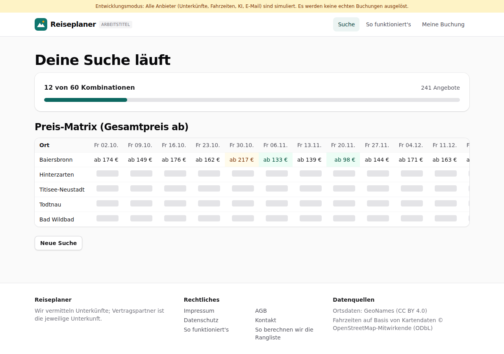
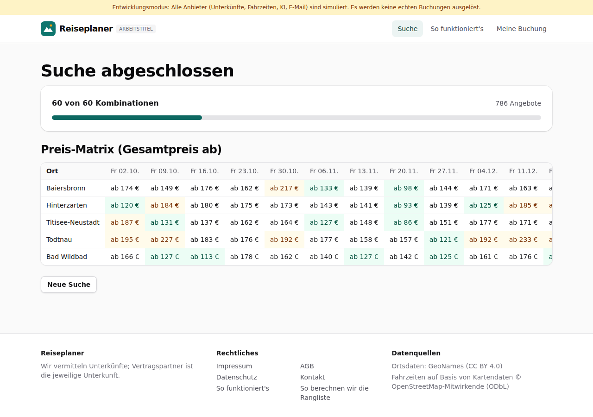

# Dogfood-Walkthrough 2026-09-27T15-58-19-P-suche

- Modus: P – Pfad (Nutzerablauf mit Eingaben)
- Flows: suche
- Basis-URL: http://localhost:44187 (echter lokaler Stack, Anbieter im Fake-Modus)
- Stand: ac8ee78, gestartet 2026-09-27T15:58:19.213Z
- Ergebnis: ✅ bestanden (13/13 Prüfungen erfüllt)

## Flow „suche“

Kombinationssuche (F4): 5 Orte × 12 Termine, Start mit ALTCHA im Browser, Fortschritt „x von 60“, Matrix füllt sich live, Hinweis bei Teilergebnissen.

### 01 Ortsliste bestätigt: 60 Kombinationen

- URL: `/suche`
- Screenshot: (Screenshot `01-ortsliste-besta-tigt-60-kombinationen.png` nur im lokalen Lauf)
- Prüfungen:
  - [x] enthält „Ortsliste bestätigt“
  - [x] enthält „5 Orte × 12 Termine = 60 Kombinationen“
  - [x] enthält „Suche starten“
  - [x] enthält „Rechenaufgabe“
- Überschriften: „Deine Suche“, „Ortsliste bestätigt“, „Suche starten“
- KI-Kennzeichnungen (`data-ai-provenance`): keine
- Konsolenfehler: keine
- Fehlgeschlagene Anfragen: keine

<details><summary>Sichtbarer Text</summary>

```text
Entwicklungsmodus: Alle Anbieter (Unterkünfte, Fahrzeiten, KI, E-Mail) sind simuliert. Es werden keine echten Buchungen ausgelöst.
Reiseplaner
ARBEITSTITEL
Suche
So funktioniert's
Meine Buchung

Schritt 3 von 3

Deine Suche
1
Suchrahmen
→
2
Regionen
→
3
Orte
Ortsliste bestätigt

5 Orte × 12 Termine = 60 Kombinationen

Suche starten

Wir fragen jetzt alle Kombinationen aus Ort und Termin gleichzeitig ab. Das dauert meist unter einer Minute.

Baiersbronn
Hinterzarten
Titisee-Neustadt
Todtnau
Bad Wildbad
Zurück
Suche starten

Zum Schutz vor automatisierten Anfragen löst dein Browser eine kleine Rechenaufgabe. Es werden keine Cookies gesetzt.

Reiseplaner

Wir vermitteln Unterkünfte; Vertragspartner ist die jeweilige Unterkunft.

Rechtliches

Impressum
AGB
Datenschutz
Kontakt
So funktioniert's
So berechnen wir die Rangliste

Datenquellen

Ortsdaten: GeoNames (CC BY 4.0)
Fahrzeiten auf Basis von Kartendaten © OpenStreetMap-Mitwirkende (ODbL)
```

</details>

### 02 Suche gestartet: Fortschritt und Matrix mit Platzhaltern

- URL: `/suche/1bf1ca2e-397d-4ca7-8ad0-c13c9c70e024#t=5Say4ioss-J3G2GYUUasoYrSRD2Ioia_bSp32lizKbs`
- Screenshot: 
- Prüfungen:
  - [x] enthält „Kombinationen“
  - [x] enthält „Preis-Matrix“
  - [x] Element `[data-testid="matrix"]` vorhanden (1)
  - [x] Element `[role="progressbar"]` vorhanden (1)
- Überschriften: „Deine Suche läuft“, „Preis-Matrix (Gesamtpreis ab)“
- KI-Kennzeichnungen (`data-ai-provenance`): keine
- Konsolenfehler: keine
- Fehlgeschlagene Anfragen: keine

<details><summary>Sichtbarer Text</summary>

```text
Entwicklungsmodus: Alle Anbieter (Unterkünfte, Fahrzeiten, KI, E-Mail) sind simuliert. Es werden keine echten Buchungen ausgelöst.
Reiseplaner
ARBEITSTITEL
Suche
So funktioniert's
Meine Buchung
Deine Suche läuft

12 von 60 Kombinationen

241 Angebote

Preis-Matrix (Gesamtpreis ab)
Ort	Fr 02.10.	Fr 09.10.	Fr 16.10.	Fr 23.10.	Fr 30.10.	Fr 06.11.	Fr 13.11.	Fr 20.11.	Fr 27.11.	Fr 04.12.	Fr 11.12.	Fr 18.12.
Baiersbronn	ab 174 €	ab 149 €	ab 176 €	ab 162 €	ab 217 €	ab 133 €	ab 139 €	ab 98 €	ab 144 €	ab 171 €	ab 163 €	ab 166 €
Hinterzarten												
Titisee-Neustadt												
Todtnau												
Bad Wildbad												
Neue Suche

Reiseplaner

Wir vermitteln Unterkünfte; Vertragspartner ist die jeweilige Unterkunft.

Rechtliches

Impressum
AGB
Datenschutz
Kontakt
So funktioniert's
So berechnen wir die Rangliste

Datenquellen

Ortsdaten: GeoNames (CC BY 4.0)
Fahrzeiten auf Basis von Kartendaten © OpenStreetMap-Mitwirkende (ODbL)
```

</details>

### 03 Suche abgeschlossen: 60 von 60, Matrix gefüllt

- URL: `/suche/1bf1ca2e-397d-4ca7-8ad0-c13c9c70e024#t=5Say4ioss-J3G2GYUUasoYrSRD2Ioia_bSp32lizKbs`
- Screenshot: 
- Notiz: Matrix: 60 Zellen mit Angebot, 0 ohne Daten.
- Prüfungen:
  - [x] enthält „60 von 60 Kombinationen“
  - [x] enthält „Angebote“
  - [x] enthält „ab “
  - [x] enthält nicht „wird gesucht“
  - [x] Element `[data-testid="matrix"] td[data-state="offer"]` vorhanden (60)
- Überschriften: „Suche abgeschlossen“, „Preis-Matrix (Gesamtpreis ab)“
- KI-Kennzeichnungen (`data-ai-provenance`): keine
- Konsolenfehler: keine
- Fehlgeschlagene Anfragen: keine

<details><summary>Sichtbarer Text</summary>

```text
Entwicklungsmodus: Alle Anbieter (Unterkünfte, Fahrzeiten, KI, E-Mail) sind simuliert. Es werden keine echten Buchungen ausgelöst.
Reiseplaner
ARBEITSTITEL
Suche
So funktioniert's
Meine Buchung
Suche abgeschlossen

60 von 60 Kombinationen

786 Angebote

Preis-Matrix (Gesamtpreis ab)
Ort	Fr 02.10.	Fr 09.10.	Fr 16.10.	Fr 23.10.	Fr 30.10.	Fr 06.11.	Fr 13.11.	Fr 20.11.	Fr 27.11.	Fr 04.12.	Fr 11.12.	Fr 18.12.
Baiersbronn	ab 174 €	ab 149 €	ab 176 €	ab 162 €	ab 217 €	ab 133 €	ab 139 €	ab 98 €	ab 144 €	ab 171 €	ab 163 €	ab 166 €
Hinterzarten	ab 120 €	ab 184 €	ab 180 €	ab 175 €	ab 173 €	ab 143 €	ab 141 €	ab 93 €	ab 139 €	ab 125 €	ab 185 €	ab 185 €
Titisee-Neustadt	ab 187 €	ab 131 €	ab 137 €	ab 162 €	ab 164 €	ab 127 €	ab 148 €	ab 86 €	ab 151 €	ab 177 €	ab 171 €	ab 169 €
Todtnau	ab 195 €	ab 227 €	ab 183 €	ab 176 €	ab 192 €	ab 177 €	ab 158 €	ab 157 €	ab 121 €	ab 192 €	ab 233 €	ab 200 €
Bad Wildbad	ab 166 €	ab 127 €	ab 113 €	ab 178 €	ab 162 €	ab 140 €	ab 127 €	ab 142 €	ab 125 €	ab 161 €	ab 176 €	ab 107 €
Neue Suche

Reiseplaner

Wir vermitteln Unterkünfte; Vertragspartner ist die jeweilige Unterkunft.

Rechtliches

Impressum
AGB
Datenschutz
Kontakt
So funktioniert's
So berechnen wir die Rangliste

Datenquellen

Ortsdaten: GeoNames (CC BY 4.0)
Fahrzeiten auf Basis von Kartendaten © OpenStreetMap-Mitwirkende (ODbL)
```

</details>

