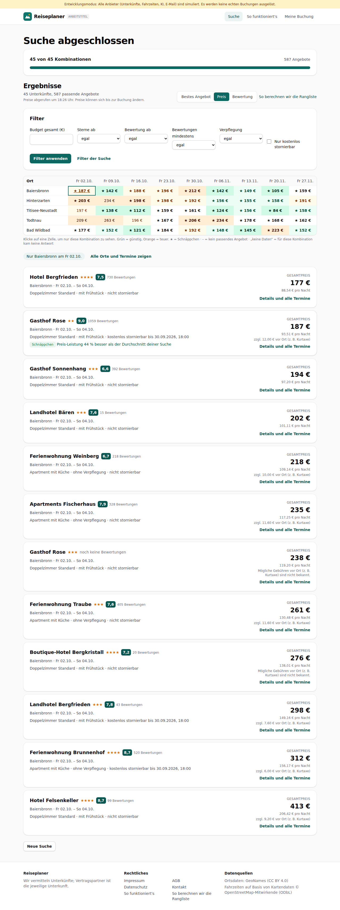
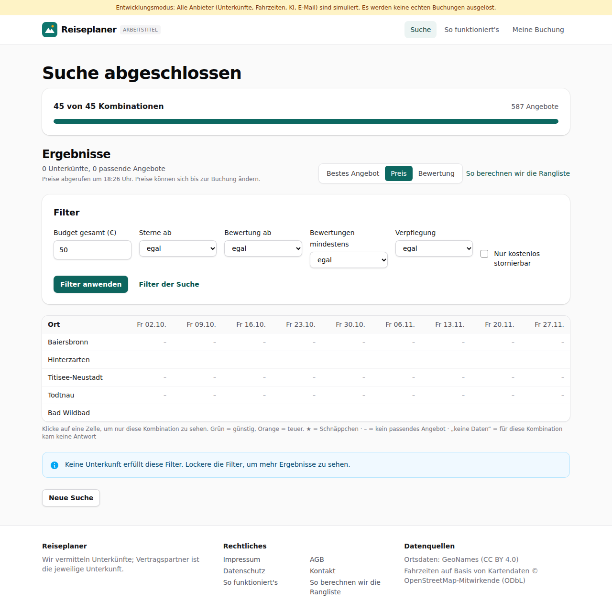
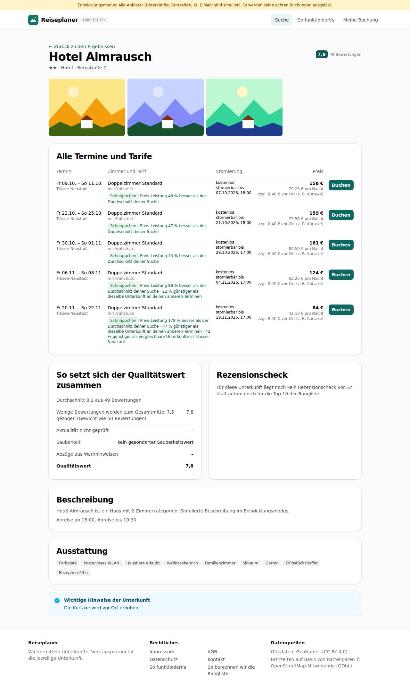
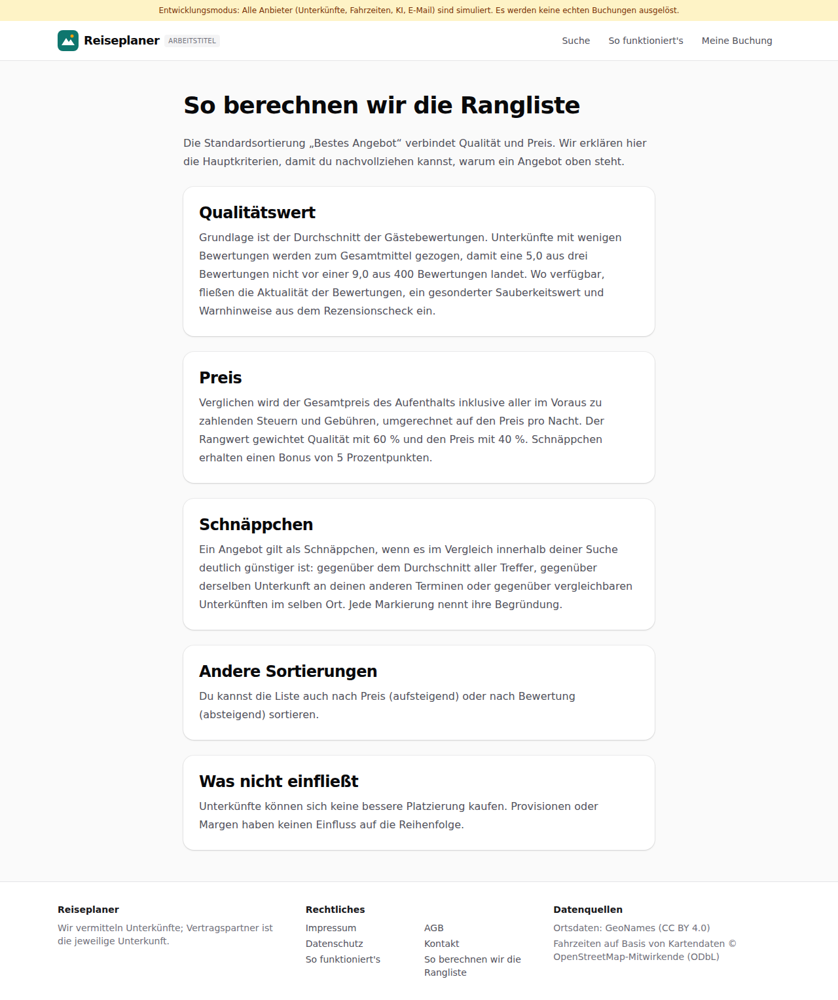

# Dogfood-Walkthrough 2026-09-27T16-25-53-P-ergebnisse

- Modus: P – Pfad (Nutzerablauf mit Eingaben)
- Flows: ergebnisse
- Basis-URL: http://localhost:34559 (echter lokaler Stack, Anbieter im Fake-Modus)
- Stand: 8e22d9d, gestartet 2026-09-27T16:25:53.267Z
- Ergebnis: ✅ bestanden (27/27 Prüfungen erfüllt)

## Flow „ergebnisse“

Ergebnisse (F5, F7, F9, F10, Akzeptanzbeispiel 1): Suche Stuttgart, 5 Orte × 9 Freitage; Matrix mit Farbstufen, Liste mit Schnäppchen-Begründung, Sortierung, Zellfilter, Filter ohne neue Suche, Detailansicht mit Score-Aufschlüsselung, Seite zur Rangliste.

### 01 Suche 5 Orte × 9 Termine gestartet und abgeschlossen

- URL: `/suche/33bdc66c-8747-4cf0-86ae-a596d9e168fa#t=WYq3QfyHp9hnq1I1x08jbTAvixY8E8jsxEQI1mwVmtI`
- Screenshot: 
- Prüfungen:
  - [x] enthält „45 von 45 Kombinationen“
  - [x] enthält „Ergebnisse“
  - [x] enthält „Preise abgerufen um“
  - [x] enthält „Bestes Angebot“
  - [x] enthält „So berechnen wir die Rangliste“
  - [x] enthält „pro Nacht“
  - [x] enthält „Schnäppchen“
  - [x] Element `[data-testid="result-matrix"]` vorhanden (1)
  - [x] Element `[data-testid="bargain-reason"]` vorhanden (29)
  - [x] Element `[data-testid="result-filters"]` vorhanden (1)
- Überschriften: „Suche abgeschlossen“, „Ergebnisse“
- KI-Kennzeichnungen (`data-ai-provenance`): keine
- Konsolenfehler: keine
- Fehlgeschlagene Anfragen: keine

<details><summary>Sichtbarer Text</summary>

```text
Entwicklungsmodus: Alle Anbieter (Unterkünfte, Fahrzeiten, KI, E-Mail) sind simuliert. Es werden keine echten Buchungen ausgelöst.
Reiseplaner
ARBEITSTITEL
Suche
So funktioniert's
Meine Buchung
Suche abgeschlossen

45 von 45 Kombinationen

587 Angebote

Ergebnisse

45 Unterkünfte, 587 passende Angebote

Preise abgerufen um 18:26 Uhr. Preise können sich bis zur Buchung ändern.

Sortierung
Bestes Angebot
Preis
Bewertung
So berechnen wir die Rangliste
Filter
Budget gesamt (€)
Sterne ab
egal
2+
3+
4+
5+
Bewertung ab
egal
7+
7,5+
8+
8,5+
9+
Bewertungen mindestens
egal
10
20
50
100
Verpflegung
egal
ohne
Frühstück
Halbpension
Vollpension
All inclusive
Nur kostenlos stornierbar
Filter anwenden
Filter der Suche
Ort	Fr 02.10.	Fr 09.10.	Fr 16.10.	Fr 23.10.	Fr 30.10.	Fr 06.11.	Fr 13.11.	Fr 20.11.	Fr 27.11.
Baiersbronn	★ 187 €	★ 142 €	★ 188 €	★ 196 €	★ 212 €	★ 142 €	★ 149 €	★ 105 €	★ 159 €
Hinterzarten	★ 203 €	234 €	★ 198 €	★ 198 €	★ 192 €	★ 156 €	★ 155 €	★ 158 €	★ 191 €
Titisee-Neustadt	197 €	★ 138 €	★ 112 €	★ 159 €	★ 161 €	★ 124 €	★ 156 €	★ 84 €	★ 158 €
Todtnau	209 €	263 €	196 €	★ 167 €	★ 206 €	★ 234 €	★ 178 €	★ 168 €	★ 162 €
Bad Wildbad	★ 177 €	★ 152 €	★ 121 €	★ 184 €	★ 192 €	★ 148 €	★ 145 €	★ 223 €	★ 152 €

Klicke auf eine Zelle, um nur diese Kombination zu sehen. Grün = günstig, Orange = teuer. ★ = Schnäppchen · – = kein passendes Angebot · „keine Daten“ = für diese Kombination kam keine Antwort

Gasthof Rose
★★
9,0
1059 Bewertungen

Baiersbronn · Fr 20.11. – So 22.11. · 6 weitere Termine

Doppelzimmer Standard · mit Frühstück · kostenlos stornierbar bis 18.11.2026, 17:00

Schnäppchen Preis-Leistung 157 % besser als der Durchschnitt deiner Suche · 34 % günstiger als dieselbe Unterkunft an deinen anderen Terminen

GESAMTPREIS
105 €
52,48 € pro Nacht
zzgl. 12,00 € vor Ort (z. B. 
… (15244 weitere Zeichen)
```

</details>

### 02 Sortierung nach Preis

- URL: `/suche/33bdc66c-8747-4cf0-86ae-a596d9e168fa#t=WYq3QfyHp9hnq1I1x08jbTAvixY8E8jsxEQI1mwVmtI`
- Screenshot: 
- Notiz: Matrix mit 45 Zellen; Liste mit 45 Einträgen, jede Unterkunft genau einmal (45 verschiedene Unterkünfte).
- Prüfungen:
  - [x] Element `[data-testid="sort"] [aria-checked="true"]` vorhanden (1)
- Überschriften: „Suche abgeschlossen“, „Ergebnisse“
- KI-Kennzeichnungen (`data-ai-provenance`): keine
- Konsolenfehler: keine
- Fehlgeschlagene Anfragen: keine

<details><summary>Sichtbarer Text</summary>

```text
Entwicklungsmodus: Alle Anbieter (Unterkünfte, Fahrzeiten, KI, E-Mail) sind simuliert. Es werden keine echten Buchungen ausgelöst.
Reiseplaner
ARBEITSTITEL
Suche
So funktioniert's
Meine Buchung
Suche abgeschlossen

45 von 45 Kombinationen

587 Angebote

Ergebnisse

45 Unterkünfte, 587 passende Angebote

Preise abgerufen um 18:26 Uhr. Preise können sich bis zur Buchung ändern.

Sortierung
Bestes Angebot
Preis
Bewertung
So berechnen wir die Rangliste
Filter
Budget gesamt (€)
Sterne ab
egal
2+
3+
4+
5+
Bewertung ab
egal
7+
7,5+
8+
8,5+
9+
Bewertungen mindestens
egal
10
20
50
100
Verpflegung
egal
ohne
Frühstück
Halbpension
Vollpension
All inclusive
Nur kostenlos stornierbar
Filter anwenden
Filter der Suche
Ort	Fr 02.10.	Fr 09.10.	Fr 16.10.	Fr 23.10.	Fr 30.10.	Fr 06.11.	Fr 13.11.	Fr 20.11.	Fr 27.11.
Baiersbronn	★ 187 €	★ 142 €	★ 188 €	★ 196 €	★ 212 €	★ 142 €	★ 149 €	★ 105 €	★ 159 €
Hinterzarten	★ 203 €	234 €	★ 198 €	★ 198 €	★ 192 €	★ 156 €	★ 155 €	★ 158 €	★ 191 €
Titisee-Neustadt	197 €	★ 138 €	★ 112 €	★ 159 €	★ 161 €	★ 124 €	★ 156 €	★ 84 €	★ 158 €
Todtnau	209 €	263 €	196 €	★ 167 €	★ 206 €	★ 234 €	★ 178 €	★ 168 €	★ 162 €
Bad Wildbad	★ 177 €	★ 152 €	★ 121 €	★ 184 €	★ 192 €	★ 148 €	★ 145 €	★ 223 €	★ 152 €

Klicke auf eine Zelle, um nur diese Kombination zu sehen. Grün = günstig, Orange = teuer. ★ = Schnäppchen · – = kein passendes Angebot · „keine Daten“ = für diese Kombination kam keine Antwort

Hotel Almrausch
★★
7,8
49 Bewertungen

Titisee-Neustadt · Fr 20.11. – So 22.11. · 4 weitere Termine

Doppelzimmer Standard · mit Frühstück · kostenlos stornierbar bis 18.11.2026, 17:00

Schnäppchen Preis-Leistung 178 % besser als der Durchschnitt deiner Suche · 47 % günstiger als dieselbe Unterkunft an deinen anderen Terminen · 42 % günstiger als vergleichbare Unterkünfte in Titisee-Ne
… (15244 weitere Zeichen)
```

</details>

### 03 Klick auf eine Matrix-Zelle filtert die Liste

- URL: `/suche/33bdc66c-8747-4cf0-86ae-a596d9e168fa#t=WYq3QfyHp9hnq1I1x08jbTAvixY8E8jsxEQI1mwVmtI`
- Screenshot: 
- Prüfungen:
  - [x] enthält „Nur “
  - [x] enthält „Alle Orte und Termine zeigen“
  - [x] Element `[data-testid="result-list"]` vorhanden (1)
- Überschriften: „Suche abgeschlossen“, „Ergebnisse“
- KI-Kennzeichnungen (`data-ai-provenance`): keine
- Konsolenfehler: keine
- Fehlgeschlagene Anfragen: keine

<details><summary>Sichtbarer Text</summary>

```text
Entwicklungsmodus: Alle Anbieter (Unterkünfte, Fahrzeiten, KI, E-Mail) sind simuliert. Es werden keine echten Buchungen ausgelöst.
Reiseplaner
ARBEITSTITEL
Suche
So funktioniert's
Meine Buchung
Suche abgeschlossen

45 von 45 Kombinationen

587 Angebote

Ergebnisse

45 Unterkünfte, 587 passende Angebote

Preise abgerufen um 18:26 Uhr. Preise können sich bis zur Buchung ändern.

Sortierung
Bestes Angebot
Preis
Bewertung
So berechnen wir die Rangliste
Filter
Budget gesamt (€)
Sterne ab
egal
2+
3+
4+
5+
Bewertung ab
egal
7+
7,5+
8+
8,5+
9+
Bewertungen mindestens
egal
10
20
50
100
Verpflegung
egal
ohne
Frühstück
Halbpension
Vollpension
All inclusive
Nur kostenlos stornierbar
Filter anwenden
Filter der Suche
Ort	Fr 02.10.	Fr 09.10.	Fr 16.10.	Fr 23.10.	Fr 30.10.	Fr 06.11.	Fr 13.11.	Fr 20.11.	Fr 27.11.
Baiersbronn	★ 187 €	★ 142 €	★ 188 €	★ 196 €	★ 212 €	★ 142 €	★ 149 €	★ 105 €	★ 159 €
Hinterzarten	★ 203 €	234 €	★ 198 €	★ 198 €	★ 192 €	★ 156 €	★ 155 €	★ 158 €	★ 191 €
Titisee-Neustadt	197 €	★ 138 €	★ 112 €	★ 159 €	★ 161 €	★ 124 €	★ 156 €	★ 84 €	★ 158 €
Todtnau	209 €	263 €	196 €	★ 167 €	★ 206 €	★ 234 €	★ 178 €	★ 168 €	★ 162 €
Bad Wildbad	★ 177 €	★ 152 €	★ 121 €	★ 184 €	★ 192 €	★ 148 €	★ 145 €	★ 223 €	★ 152 €

Klicke auf eine Zelle, um nur diese Kombination zu sehen. Grün = günstig, Orange = teuer. ★ = Schnäppchen · – = kein passendes Angebot · „keine Daten“ = für diese Kombination kam keine Antwort

Nur Baiersbronn am Fr 02.10.
Alle Orte und Termine zeigen
Hotel Bergfrieden
★★★★
7,5
730 Bewertungen

Baiersbronn · Fr 02.10. – So 04.10.

Doppelzimmer Standard · mit Frühstück · nicht stornierbar

GESAMTPREIS
177 €
88,54 € pro Nacht
Details und alle Termine
Gasthof Rose
★★
9,0
1059 Bewertungen

Baiersbronn · Fr 02.10. – So 04.10.

Doppelzimmer Standard · mit Frühstück · kostenlos stor
… (2955 weitere Zeichen)
```

</details>

### 04 Filter ohne neue Suche: Budget 200 € lässt einen Teil übrig

- URL: `/suche/33bdc66c-8747-4cf0-86ae-a596d9e168fa#t=WYq3QfyHp9hnq1I1x08jbTAvixY8E8jsxEQI1mwVmtI`
- Screenshot: 
- Notiz: Budget 200 €: 31 Unterkünfte, 182 passende Angebote (vorher: 45 Unterkünfte, 587 passende Angebote); alle 31 angezeigten Gesamtpreise ≤ 200 €.
- Prüfungen:
  - [x] Element `[data-testid="result-total"]` vorhanden (31)
- Überschriften: „Suche abgeschlossen“, „Ergebnisse“
- KI-Kennzeichnungen (`data-ai-provenance`): keine
- Konsolenfehler: keine
- Fehlgeschlagene Anfragen: keine

<details><summary>Sichtbarer Text</summary>

```text
Entwicklungsmodus: Alle Anbieter (Unterkünfte, Fahrzeiten, KI, E-Mail) sind simuliert. Es werden keine echten Buchungen ausgelöst.
Reiseplaner
ARBEITSTITEL
Suche
So funktioniert's
Meine Buchung
Suche abgeschlossen

45 von 45 Kombinationen

587 Angebote

Ergebnisse

31 Unterkünfte, 182 passende Angebote

Preise abgerufen um 18:26 Uhr. Preise können sich bis zur Buchung ändern.

Sortierung
Bestes Angebot
Preis
Bewertung
So berechnen wir die Rangliste
Filter
Budget gesamt (€)
Sterne ab
egal
2+
3+
4+
5+
Bewertung ab
egal
7+
7,5+
8+
8,5+
9+
Bewertungen mindestens
egal
10
20
50
100
Verpflegung
egal
ohne
Frühstück
Halbpension
Vollpension
All inclusive
Nur kostenlos stornierbar
Filter anwenden
Filter der Suche
Ort	Fr 02.10.	Fr 09.10.	Fr 16.10.	Fr 23.10.	Fr 30.10.	Fr 06.11.	Fr 13.11.	Fr 20.11.	Fr 27.11.
Baiersbronn	187 €	142 €	188 €	157 €	–	★ 142 €	★ 149 €	★ 105 €	★ 118 €
Hinterzarten	★ 123 €	188 €	198 €	198 €	192 €	156 €	155 €	★ 95 €	142 €
Titisee-Neustadt	197 €	138 €	★ 112 €	159 €	161 €	★ 124 €	156 €	★ 84 €	158 €
Todtnau	–	–	190 €	167 €	–	170 €	154 €	168 €	★ 115 €
Bad Wildbad	177 €	143 €	★ 121 €	184 €	162 €	148 €	★ 145 €	136 €	★ 125 €

Klicke auf eine Zelle, um nur diese Kombination zu sehen. Grün = günstig, Orange = teuer. ★ = Schnäppchen · – = kein passendes Angebot · „keine Daten“ = für diese Kombination kam keine Antwort

Hotel Almrausch
★★
7,8
49 Bewertungen

Titisee-Neustadt · Fr 20.11. – So 22.11. · 4 weitere Termine

Doppelzimmer Standard · mit Frühstück · kostenlos stornierbar bis 18.11.2026, 17:00

Schnäppchen Preis-Leistung 102 % besser als der Durchschnitt deiner Suche · 47 % günstiger als dieselbe Unterkunft an deinen anderen Terminen · 39 % günstiger als vergleichbare Unterkünfte in Titisee-Neustadt

GESAMTPREIS
84 €
42,10 € pro Nacht
zzgl. 8,40 € vor Ort (z. B. 
… (8756 weitere Zeichen)
```

</details>

### 05 Filter ohne neue Suche: Budget 50 €

- URL: `/suche/33bdc66c-8747-4cf0-86ae-a596d9e168fa#t=WYq3QfyHp9hnq1I1x08jbTAvixY8E8jsxEQI1mwVmtI`
- Screenshot: 
- Prüfungen:
  - [x] enthält „Keine Unterkunft erfüllt diese Filter“
- Überschriften: „Suche abgeschlossen“, „Ergebnisse“
- KI-Kennzeichnungen (`data-ai-provenance`): keine
- Konsolenfehler: keine
- Fehlgeschlagene Anfragen: keine

<details><summary>Sichtbarer Text</summary>

```text
Entwicklungsmodus: Alle Anbieter (Unterkünfte, Fahrzeiten, KI, E-Mail) sind simuliert. Es werden keine echten Buchungen ausgelöst.
Reiseplaner
ARBEITSTITEL
Suche
So funktioniert's
Meine Buchung
Suche abgeschlossen

45 von 45 Kombinationen

587 Angebote

Ergebnisse

0 Unterkünfte, 0 passende Angebote

Preise abgerufen um 18:26 Uhr. Preise können sich bis zur Buchung ändern.

Sortierung
Bestes Angebot
Preis
Bewertung
So berechnen wir die Rangliste
Filter
Budget gesamt (€)
Sterne ab
egal
2+
3+
4+
5+
Bewertung ab
egal
7+
7,5+
8+
8,5+
9+
Bewertungen mindestens
egal
10
20
50
100
Verpflegung
egal
ohne
Frühstück
Halbpension
Vollpension
All inclusive
Nur kostenlos stornierbar
Filter anwenden
Filter der Suche
Ort	Fr 02.10.	Fr 09.10.	Fr 16.10.	Fr 23.10.	Fr 30.10.	Fr 06.11.	Fr 13.11.	Fr 20.11.	Fr 27.11.
Baiersbronn	–	–	–	–	–	–	–	–	–
Hinterzarten	–	–	–	–	–	–	–	–	–
Titisee-Neustadt	–	–	–	–	–	–	–	–	–
Todtnau	–	–	–	–	–	–	–	–	–
Bad Wildbad	–	–	–	–	–	–	–	–	–

Klicke auf eine Zelle, um nur diese Kombination zu sehen. Grün = günstig, Orange = teuer. ★ = Schnäppchen · – = kein passendes Angebot · „keine Daten“ = für diese Kombination kam keine Antwort

Keine Unterkunft erfüllt diese Filter. Lockere die Filter, um mehr Ergebnisse zu sehen.
Neue Suche

Reiseplaner

Wir vermitteln Unterkünfte; Vertragspartner ist die jeweilige Unterkunft.

Rechtliches

Impressum
AGB
Datenschutz
Kontakt
So funktioniert's
So berechnen wir die Rangliste

Datenquellen

Ortsdaten: GeoNames (CC BY 4.0)
Fahrzeiten auf Basis von Kartendaten © OpenStreetMap-Mitwirkende (ODbL)
```

</details>

### 06 Detailansicht mit allen Terminen und Score-Aufschlüsselung

- URL: `/suche/33bdc66c-8747-4cf0-86ae-a596d9e168fa/unterkunft/lpf-4792-819-0#t=WYq3QfyHp9hnq1I1x08jbTAvixY8E8jsxEQI1mwVmtI`
- Screenshot: 
- Prüfungen:
  - [x] enthält „Alle Termine und Tarife“
  - [x] enthält „So setzt sich der Qualitätswert zusammen“
  - [x] enthält „Aktualität nicht geprüft“
  - [x] enthält „Rezensionscheck“
  - [x] enthält „Buchen“
  - [x] Element `[data-testid="score-breakdown"]` vorhanden (1)
  - [x] Element `[data-testid="book-offer"]` vorhanden (5)
- Überschriften: „Hotel Almrausch“, „Alle Termine und Tarife“, „So setzt sich der Qualitätswert zusammen“, „Rezensionscheck“, „Beschreibung“, „Ausstattung“
- KI-Kennzeichnungen (`data-ai-provenance`): keine
- Konsolenfehler: keine
- Fehlgeschlagene Anfragen: keine

<details><summary>Sichtbarer Text</summary>

```text
Entwicklungsmodus: Alle Anbieter (Unterkünfte, Fahrzeiten, KI, E-Mail) sind simuliert. Es werden keine echten Buchungen ausgelöst.
Reiseplaner
ARBEITSTITEL
Suche
So funktioniert's
Meine Buchung
← Zurück zu den Ergebnissen
Hotel Almrausch

★★ · Hotel · Bergstraße 7

7,8
49 Bewertungen
Alle Termine und Tarife
Termin	Zimmer und Tarif	Stornierung	Preis	

Fr 09.10. – So 11.10.
Titisee-Neustadt
	
Doppelzimmer Standard
mit Frühstück
Schnäppchen Preis-Leistung 48 % besser als der Durchschnitt deiner Suche
	kostenlos stornierbar bis 07.10.2026, 18:00	
158 €
79,25 € pro Nacht
zzgl. 8,40 € vor Ort (z. B. Kurtaxe)
	Buchen

Fr 23.10. – So 25.10.
Titisee-Neustadt
	
Doppelzimmer Standard
mit Frühstück
Schnäppchen Preis-Leistung 47 % besser als der Durchschnitt deiner Suche
	kostenlos stornierbar bis 21.10.2026, 18:00	
159 €
79,56 € pro Nacht
zzgl. 8,40 € vor Ort (z. B. Kurtaxe)
	Buchen

Fr 30.10. – So 01.11.
Titisee-Neustadt
	
Doppelzimmer Standard
mit Frühstück
Schnäppchen Preis-Leistung 45 % besser als der Durchschnitt deiner Suche
	kostenlos stornierbar bis 28.10.2026, 17:00	
161 €
80,59 € pro Nacht
zzgl. 8,40 € vor Ort (z. B. Kurtaxe)
	Buchen

Fr 06.11. – So 08.11.
Titisee-Neustadt
	
Doppelzimmer Standard
mit Frühstück
Schnäppchen Preis-Leistung 88 % besser als der Durchschnitt deiner Suche · 22 % günstiger als dieselbe Unterkunft an deinen anderen Terminen
	kostenlos stornierbar bis 04.11.2026, 17:00	
124 €
62,20 € pro Nacht
zzgl. 8,40 € vor Ort (z. B. Kurtaxe)
	Buchen

Fr 20.11. – So 22.11.
Titisee-Neustadt
	
Doppelzimmer Standard
mit Frühstück
Schnäppchen Preis-Leistung 178 % besser als der Durchschnitt deiner Suche · 47 % günstiger als dieselbe Unterkunft an deinen anderen Terminen · 42 % günstiger als vergleichbare Unterkünfte in Titisee-Neustadt
	kostenlos stornierbar bis 18
… (1151 weitere Zeichen)
```

</details>

### 07 Seite „So berechnen wir die Rangliste“

- URL: `/ranking`
- Screenshot: 
- Prüfungen:
  - [x] enthält „Qualitätswert“
  - [x] enthält „Preis“
  - [x] enthält „Schnäppchen“
  - [x] enthält „Provisionen oder Margen haben keinen Einfluss“
- Überschriften: „So berechnen wir die Rangliste“, „Qualitätswert“, „Preis“, „Schnäppchen“, „Andere Sortierungen“, „Was nicht einfließt“
- KI-Kennzeichnungen (`data-ai-provenance`): keine
- Konsolenfehler: keine
- Fehlgeschlagene Anfragen: keine

<details><summary>Sichtbarer Text</summary>

```text
Entwicklungsmodus: Alle Anbieter (Unterkünfte, Fahrzeiten, KI, E-Mail) sind simuliert. Es werden keine echten Buchungen ausgelöst.
Reiseplaner
ARBEITSTITEL
Suche
So funktioniert's
Meine Buchung
So berechnen wir die Rangliste

Die Standardsortierung „Bestes Angebot“ verbindet Qualität und Preis. Wir erklären hier die Hauptkriterien, damit du nachvollziehen kannst, warum ein Angebot oben steht.

Qualitätswert

Grundlage ist der Durchschnitt der Gästebewertungen. Unterkünfte mit wenigen Bewertungen werden zum Gesamtmittel gezogen, damit eine 5,0 aus drei Bewertungen nicht vor einer 9,0 aus 400 Bewertungen landet. Wo verfügbar, fließen die Aktualität der Bewertungen, ein gesonderter Sauberkeitswert und Warnhinweise aus dem Rezensionscheck ein.

Preis

Verglichen wird der Gesamtpreis des Aufenthalts inklusive aller im Voraus zu zahlenden Steuern und Gebühren, umgerechnet auf den Preis pro Nacht. Der Rangwert gewichtet Qualität mit 60 % und den Preis mit 40 %. Schnäppchen erhalten einen Bonus von 5 Prozentpunkten.

Schnäppchen

Ein Angebot gilt als Schnäppchen, wenn es im Vergleich innerhalb deiner Suche deutlich günstiger ist: gegenüber dem Durchschnitt aller Treffer, gegenüber derselben Unterkunft an deinen anderen Terminen oder gegenüber vergleichbaren Unterkünften im selben Ort. Jede Markierung nennt ihre Begründung.

Andere Sortierungen

Du kannst die Liste auch nach Preis (aufsteigend) oder nach Bewertung (absteigend) sortieren.

Was nicht einfließt

Unterkünfte können sich keine bessere Platzierung kaufen. Provisionen oder Margen haben keinen Einfluss auf die Reihenfolge.

Reiseplaner

Wir vermitteln Unterkünfte; Vertragspartner ist die jeweilige Unterkunft.

Rechtliches

Impressum
AGB
Datenschutz
Kontakt
So funktioniert's
So berechnen wir die Rangliste

Datenquellen


… (103 weitere Zeichen)
```

</details>

