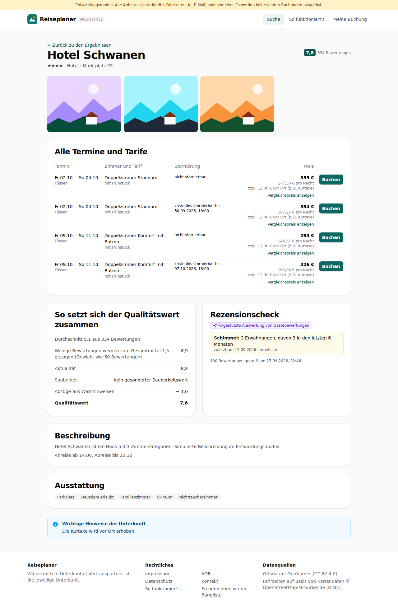

# Dogfood-Walkthrough 2026-09-27T20-45-39-P-warnungen

- Modus: P – Pfad (Nutzerablauf mit Eingaben)
- Flows: warnungen
- Basis-URL: http://localhost:43685 (echter lokaler Stack, Anbieter im Fake-Modus)
- Stand: 28ab584, gestartet 2026-09-27T20:45:39.860Z
- Ergebnis: ✅ bestanden (21/21 Prüfungen erfüllt)

## Flow „warnungen“

Rezensionscheck (F8, Akzeptanzbeispiel 4): Suche Stuttgart → Füssen × 2 Freitage; die Rezensionen der Top 10 werden geprüft. „Hotel Schwanen“ zeigt in Liste und Detailansicht „Schimmel: 3 Erwähnungen, davon 3 in den letzten 6 Monaten“ mit KI-Kennzeichnung; eine geprüfte Unterkunft ohne Treffer zeigt „keine Auffälligkeiten“.

### 01 Suchrahmen gesetzt und eigener Ort Füssen gewählt

- URL: `/suche`
- Screenshot: 
- Prüfungen:
  - [x] enthält „1 Ort × 2 Termine = 2 Kombinationen“
  - [x] enthält „Suche starten“
- Überschriften: „Deine Suche“, „Ortsliste bestätigt“, „Suche starten“
- KI-Kennzeichnungen (`data-ai-provenance`): keine
- Konsolenfehler: keine
- Fehlgeschlagene Anfragen: keine

<details><summary>Sichtbarer Text</summary>

```text
Entwicklungsmodus: Alle Anbieter (Unterkünfte, Fahrzeiten, KI, E-Mail) sind simuliert. Es werden keine echten Buchungen ausgelöst.
Reiseplaner
ARBEITSTITEL
Suche
So funktioniert's
Meine Buchung

Schritt 3 von 3

Deine Suche
1
Suchrahmen
→
2
Regionen
→
3
Orte
Ortsliste bestätigt

1 Ort × 2 Termine = 2 Kombinationen

Suche starten

Wir fragen jetzt alle Kombinationen aus Ort und Termin gleichzeitig ab. Das dauert meist unter einer Minute.

Füssen
Zurück
Suche starten

Zum Schutz vor automatisierten Anfragen löst dein Browser eine kleine Rechenaufgabe. Es werden keine Cookies gesetzt.

Reiseplaner

Wir vermitteln Unterkünfte; Vertragspartner ist die jeweilige Unterkunft.

Rechtliches

Impressum
AGB
Datenschutz
Kontakt
So funktioniert's
So berechnen wir die Rangliste

Datenquellen

Ortsdaten: GeoNames (CC BY 4.0)
Fahrzeiten auf Basis von Kartendaten © OpenStreetMap-Mitwirkende (ODbL)
```

</details>

### 02 Suche mit Rezensionscheck abgeschlossen

- URL: `/suche/074ce4d9-c866-409c-8f5a-e655429e1ea7#t=eicxlYeGNPX5v1Aeh4ysbTkVp_BRd5R4aRXV4iNa2CI`
- Screenshot: 
- Notiz: Der Rezensionscheck war zu schnell für den Zwischenstand.
- Prüfungen:
  - [x] enthält „Suche abgeschlossen“
  - [x] enthält „2 von 2 Kombinationen“
  - [x] enthält „Ergebnisse“
  - [x] Element `[data-testid="result-warnings"]` vorhanden (4)
- Überschriften: „Suche abgeschlossen“, „Ergebnisse“
- KI-Kennzeichnungen (`data-ai-provenance`): „KI-gestützte Auswertung von Gästebewertungen [ai_assisted]“, „KI-gestützte Auswertung von Gästebewertungen [ai_assisted]“, „KI-gestützte Auswertung von Gästebewertungen [ai_assisted]“, „KI-gestützte Auswertung von Gästebewertungen [ai_assisted]“
- Konsolenfehler: keine
- Fehlgeschlagene Anfragen: keine

<details><summary>Sichtbarer Text</summary>

```text
Entwicklungsmodus: Alle Anbieter (Unterkünfte, Fahrzeiten, KI, E-Mail) sind simuliert. Es werden keine echten Buchungen ausgelöst.
Reiseplaner
ARBEITSTITEL
Suche
So funktioniert's
Meine Buchung
Suche abgeschlossen

2 von 2 Kombinationen

34 Angebote

Ergebnisse

14 Unterkünfte, 34 passende Angebote

Preise abgerufen um 22:46 Uhr. Preise können sich bis zur Buchung ändern.

Sortierung
Bestes Angebot
Preis
Bewertung
So berechnen wir die Rangliste
Filter
Budget gesamt (€)
Sterne ab
egal
2+
3+
4+
5+
Bewertung ab
egal
7+
7,5+
8+
8,5+
9+
Bewertungen mindestens
egal
10
20
50
100
Verpflegung
egal
ohne
Frühstück
Halbpension
Vollpension
All inclusive
Nur kostenlos stornierbar
Filter anwenden
Filter der Suche
Ort	Fr 02.10.	Fr 09.10.
Füssen	★ 118 €	★ 179 €

Klicke auf eine Zelle, um nur diese Kombination zu sehen. Grün = günstig, Orange = teuer. ★ = Schnäppchen · – = kein passendes Angebot · „keine Daten“ = für diese Kombination kam keine Antwort

Ferienwohnung Sonnenhof
7,2
29 Bewertungen

Füssen · Fr 02.10. – So 04.10. · 1 weiterer Termin

Apartment mit Küche · ohne Verpflegung · kostenlos stornierbar bis 30.09.2026, 18:00

Schnäppchen Preis-Leistung 108 % besser als der Durchschnitt deiner Suche · 54 % günstiger als vergleichbare Unterkünfte in Füssen

Rezensionen geprüft: keine Auffälligkeiten

GESAMTPREIS
118 €
59,18 € pro Nacht
Mögliche Gebühren vor Ort (z. B. Kurtaxe) sind nicht bekannt.
Details und alle Termine
Pension Waldesruh
8,0
114 Bewertungen

Füssen · Fr 02.10. – So 04.10.

Doppelzimmer Standard · mit Frühstück · kostenlos stornierbar bis 30.09.2026, 18:00

Schnäppchen Preis-Leistung 59 % besser als der Durchschnitt deiner Suche · 34 % günstiger als vergleichbare Unterkünfte in Füssen

Baulicher Zustand: 4 (4 in 6 Mon.)
KI-gestützte Auswertung von Gästebewertungen
GE
… (4268 weitere Zeichen)
```

</details>

### 03 Liste: Warnhinweis mit KI-Kennzeichnung

- URL: `/suche/074ce4d9-c866-409c-8f5a-e655429e1ea7#t=eicxlYeGNPX5v1Aeh4ysbTkVp_BRd5R4aRXV4iNa2CI`
- Screenshot: 
- Notiz: Liste: 4 Unterkünfte mit Warnhinweisen, 6 geprüft ohne Auffälligkeiten.
- Prüfungen:
  - [x] enthält „Schimmel: 3 (3 in 6 Mon.)“
  - [x] enthält „KI-gestützte Auswertung von Gästebewertungen“
  - [x] Element `[data-testid="result-warnings"] [data-ai-provenance="ai_assisted"]` vorhanden (4)
  - [x] Element `[data-testid="result-review-ok"]` vorhanden (6)
- Überschriften: „Suche abgeschlossen“, „Ergebnisse“
- KI-Kennzeichnungen (`data-ai-provenance`): „KI-gestützte Auswertung von Gästebewertungen [ai_assisted]“, „KI-gestützte Auswertung von Gästebewertungen [ai_assisted]“, „KI-gestützte Auswertung von Gästebewertungen [ai_assisted]“, „KI-gestützte Auswertung von Gästebewertungen [ai_assisted]“
- Konsolenfehler: keine
- Fehlgeschlagene Anfragen: keine

<details><summary>Sichtbarer Text</summary>

```text
Entwicklungsmodus: Alle Anbieter (Unterkünfte, Fahrzeiten, KI, E-Mail) sind simuliert. Es werden keine echten Buchungen ausgelöst.
Reiseplaner
ARBEITSTITEL
Suche
So funktioniert's
Meine Buchung
Suche abgeschlossen

2 von 2 Kombinationen

34 Angebote

Ergebnisse

14 Unterkünfte, 34 passende Angebote

Preise abgerufen um 22:46 Uhr. Preise können sich bis zur Buchung ändern.

Sortierung
Bestes Angebot
Preis
Bewertung
So berechnen wir die Rangliste
Filter
Budget gesamt (€)
Sterne ab
egal
2+
3+
4+
5+
Bewertung ab
egal
7+
7,5+
8+
8,5+
9+
Bewertungen mindestens
egal
10
20
50
100
Verpflegung
egal
ohne
Frühstück
Halbpension
Vollpension
All inclusive
Nur kostenlos stornierbar
Filter anwenden
Filter der Suche
Ort	Fr 02.10.	Fr 09.10.
Füssen	★ 118 €	★ 179 €

Klicke auf eine Zelle, um nur diese Kombination zu sehen. Grün = günstig, Orange = teuer. ★ = Schnäppchen · – = kein passendes Angebot · „keine Daten“ = für diese Kombination kam keine Antwort

Ferienwohnung Sonnenhof
7,2
29 Bewertungen

Füssen · Fr 02.10. – So 04.10. · 1 weiterer Termin

Apartment mit Küche · ohne Verpflegung · kostenlos stornierbar bis 30.09.2026, 18:00

Schnäppchen Preis-Leistung 108 % besser als der Durchschnitt deiner Suche · 54 % günstiger als vergleichbare Unterkünfte in Füssen

Rezensionen geprüft: keine Auffälligkeiten

GESAMTPREIS
118 €
59,18 € pro Nacht
Mögliche Gebühren vor Ort (z. B. Kurtaxe) sind nicht bekannt.
Details und alle Termine
Pension Waldesruh
8,0
114 Bewertungen

Füssen · Fr 02.10. – So 04.10.

Doppelzimmer Standard · mit Frühstück · kostenlos stornierbar bis 30.09.2026, 18:00

Schnäppchen Preis-Leistung 59 % besser als der Durchschnitt deiner Suche · 34 % günstiger als vergleichbare Unterkünfte in Füssen

Baulicher Zustand: 4 (4 in 6 Mon.)
KI-gestützte Auswertung von Gästebewertungen
GE
… (4268 weitere Zeichen)
```

</details>

### 04 Detailansicht: Schimmel 3 von 3 in den letzten 6 Monaten, KI-gestützt

- URL: `/suche/074ce4d9-c866-409c-8f5a-e655429e1ea7/unterkunft/lpf-4757-1070-1#t=eicxlYeGNPX5v1Aeh4ysbTkVp_BRd5R4aRXV4iNa2CI`
- Screenshot: 
- Prüfungen:
  - [x] enthält „Schimmel: 3 Erwähnungen, davon 3 in den letzten 6 Monaten“
  - [x] enthält „KI-gestützte Auswertung von Gästebewertungen“
  - [x] enthält „erheblich“
  - [x] enthält „Bewertungen geprüft am“
  - [x] enthält „Abzüge aus Warnhinweisen“
  - [x] enthält nicht „Hinweis (ungeprüft)“
  - [x] Element `[data-testid="review-check"] [data-ai-provenance="ai_assisted"]` vorhanden (1)
  - [x] Element `[data-testid="warning"][data-verified="true"]` vorhanden (1)
- Überschriften: „Hotel Schwanen“, „Alle Termine und Tarife“, „So setzt sich der Qualitätswert zusammen“, „Rezensionscheck“, „Beschreibung“, „Ausstattung“
- KI-Kennzeichnungen (`data-ai-provenance`): „KI-gestützte Auswertung von Gästebewertungen [ai_assisted]“
- Konsolenfehler: keine
- Fehlgeschlagene Anfragen: keine

<details><summary>Sichtbarer Text</summary>

```text
Entwicklungsmodus: Alle Anbieter (Unterkünfte, Fahrzeiten, KI, E-Mail) sind simuliert. Es werden keine echten Buchungen ausgelöst.
Reiseplaner
ARBEITSTITEL
Suche
So funktioniert's
Meine Buchung
← Zurück zu den Ergebnissen
Hotel Schwanen

★★★★ · Hotel · Marktplatz 29

7,8
334 Bewertungen
Alle Termine und Tarife
Termin	Zimmer und Tarif	Stornierung	Preis	

Fr 02.10. – So 04.10.
Füssen
	
Doppelzimmer Standard
mit Frühstück
	nicht stornierbar	
355 €
177,50 € pro Nacht
zzgl. 12,00 € vor Ort (z. B. Kurtaxe)
Vergleichspreis anzeigen
	Buchen

Fr 02.10. – So 04.10.
Füssen
	
Doppelzimmer Standard
mit Frühstück
	kostenlos stornierbar bis 30.09.2026, 18:00	
394 €
197,22 € pro Nacht
zzgl. 12,00 € vor Ort (z. B. Kurtaxe)
Vergleichspreis anzeigen
	Buchen

Fr 09.10. – So 11.10.
Füssen
	
Doppelzimmer Komfort mit Balkon
mit Frühstück
	nicht stornierbar	
293 €
146,57 € pro Nacht
zzgl. 12,00 € vor Ort (z. B. Kurtaxe)
Vergleichspreis anzeigen
	Buchen

Fr 09.10. – So 11.10.
Füssen
	
Doppelzimmer Komfort mit Balkon
mit Frühstück
	kostenlos stornierbar bis 07.10.2026, 18:00	
326 €
162,86 € pro Nacht
zzgl. 12,00 € vor Ort (z. B. Kurtaxe)
Vergleichspreis anzeigen
	Buchen
So setzt sich der Qualitätswert zusammen
Durchschnitt 9,1 aus 334 Bewertungen
Wenige Bewertungen werden zum Gesamtmittel 7,5 gezogen (Gewicht wie 50 Bewertungen)
8,9
Aktualität
8,8
Sauberkeit
kein gesonderter Sauberkeitswert
Abzüge aus Warnhinweisen
− 1,0
Qualitätswert
7,8
Rezensionscheck
KI-gestützte Auswertung von Gästebewertungen
Schimmel: 3 Erwähnungen, davon 3 in den letzten 6 Monaten
zuletzt am 19.09.2026 · erheblich

100 Bewertungen geprüft am 27.09.2026, 22:46.

Beschreibung

Hotel Schwanen ist ein Haus mit 3 Zimmerkategorien. Simulierte Beschreibung im Entwicklungsmodus.

Anreise ab 14:00, Abreise bis 10:30

Ausstattung

… (442 weitere Zeichen)
```

</details>

### 05 Geprüfte Unterkunft ohne Auffälligkeiten

- URL: `/suche/074ce4d9-c866-409c-8f5a-e655429e1ea7/unterkunft/lpf-4757-1070-10#t=eicxlYeGNPX5v1Aeh4ysbTkVp_BRd5R4aRXV4iNa2CI`
- Screenshot: 
- Prüfungen:
  - [x] enthält „Keine Auffälligkeiten in den geprüften Rezensionen“
  - [x] enthält „Bewertungen geprüft am“
  - [x] Element `[data-testid="review-no-issues"]` vorhanden (1)
- Überschriften: „Ferienwohnung Sonnenhof“, „Alle Termine und Tarife“, „So setzt sich der Qualitätswert zusammen“, „Rezensionscheck“, „Beschreibung“, „Ausstattung“
- KI-Kennzeichnungen (`data-ai-provenance`): keine
- Konsolenfehler: keine
- Fehlgeschlagene Anfragen: keine

<details><summary>Sichtbarer Text</summary>

```text
Entwicklungsmodus: Alle Anbieter (Unterkünfte, Fahrzeiten, KI, E-Mail) sind simuliert. Es werden keine echten Buchungen ausgelöst.
Reiseplaner
ARBEITSTITEL
Suche
So funktioniert's
Meine Buchung
← Zurück zu den Ergebnissen
Ferienwohnung Sonnenhof

Ferienwohnung · Sonnenweg 29

7,2
29 Bewertungen
Alle Termine und Tarife
Termin	Zimmer und Tarif	Stornierung	Preis	

Fr 02.10. – So 04.10.
Füssen
	
Apartment mit Küche
ohne Verpflegung
Schnäppchen Preis-Leistung 108 % besser als der Durchschnitt deiner Suche · 54 % günstiger als vergleichbare Unterkünfte in Füssen
	kostenlos stornierbar bis 30.09.2026, 18:00	
118 €
59,18 € pro Nacht
Mögliche Gebühren vor Ort (z. B. Kurtaxe) sind nicht bekannt.
Vergleichspreis anzeigen
	Buchen

Fr 09.10. – So 11.10.
Füssen
	
Apartment mit Küche
ohne Verpflegung
Schnäppchen Preis-Leistung 35 % besser als der Durchschnitt deiner Suche · 32 % günstiger als vergleichbare Unterkünfte in Füssen
	kostenlos stornierbar bis 07.10.2026, 18:00	
183 €
91,64 € pro Nacht
Mögliche Gebühren vor Ort (z. B. Kurtaxe) sind nicht bekannt.
Vergleichspreis anzeigen
	Buchen
So setzt sich der Qualitätswert zusammen
Durchschnitt 6,8 aus 29 Bewertungen
Wenige Bewertungen werden zum Gesamtmittel 7,5 gezogen (Gewicht wie 50 Bewertungen)
7,2
Aktualität
7,2
Sauberkeit
kein gesonderter Sauberkeitswert
Abzüge aus Warnhinweisen
–
Qualitätswert
7,2
Rezensionscheck

Keine Auffälligkeiten in den geprüften Rezensionen (29 geprüft).

29 Bewertungen geprüft am 27.09.2026, 22:46.

Beschreibung

Ferienwohnung Sonnenhof ist ein Ferienquartier mit 1 Zimmerkategorien. Simulierte Beschreibung im Entwicklungsmodus.

Anreise ab 15:00, Abreise bis 10:30

Ausstattung
Parkplatz
Kostenloses WLAN
Sauna
Wellnessbereich
Küche
Bar
Terrasse
Garten
Frühstücksbuffet
Hallenbad
Nichtraucherzimmer

Wichtig
… (364 weitere Zeichen)
```

</details>

