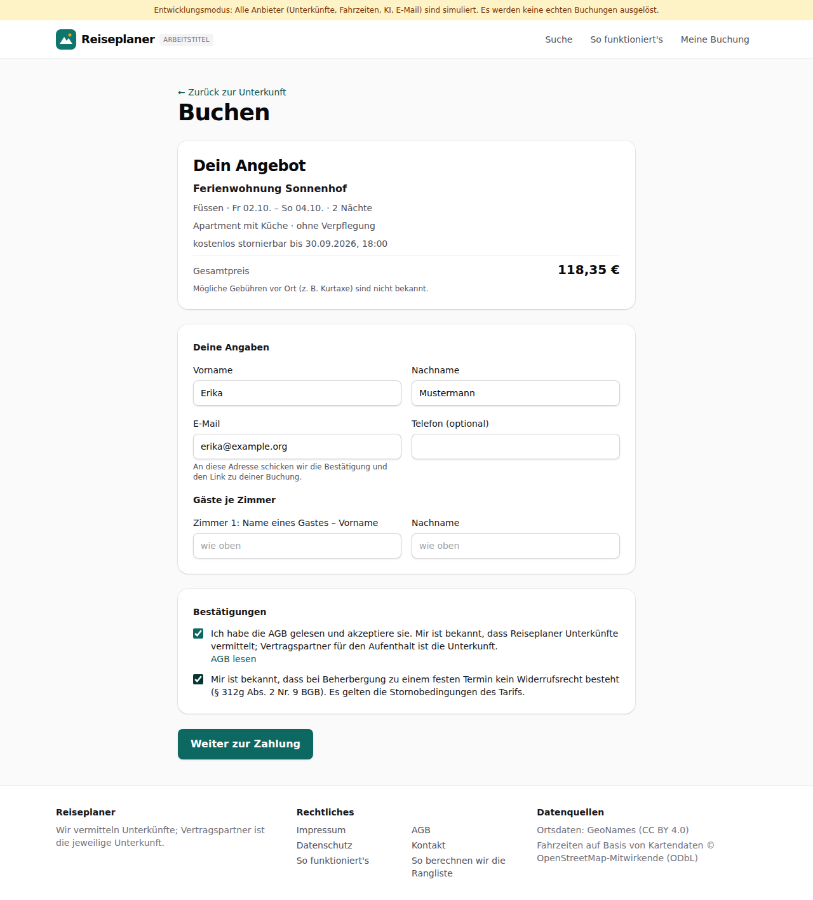
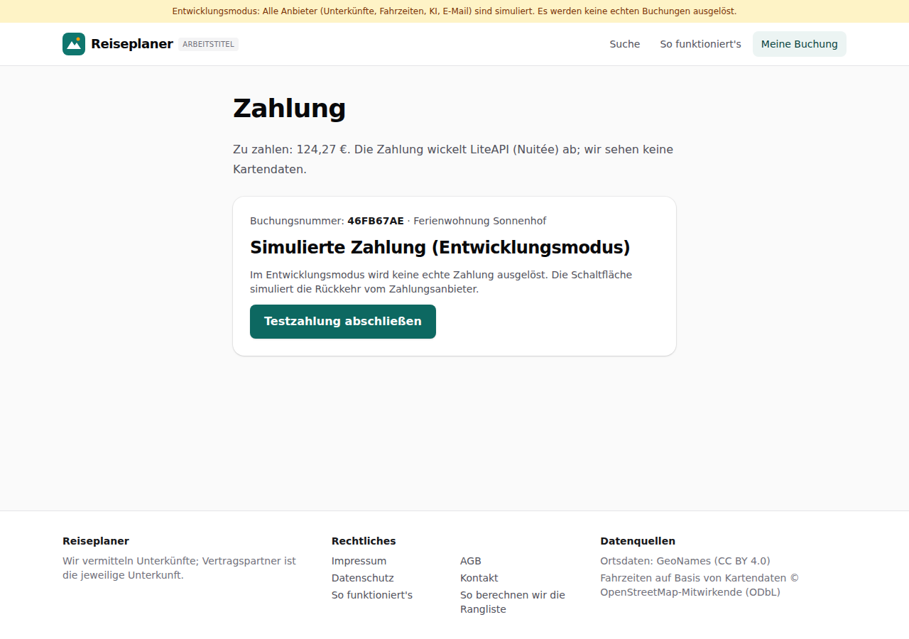
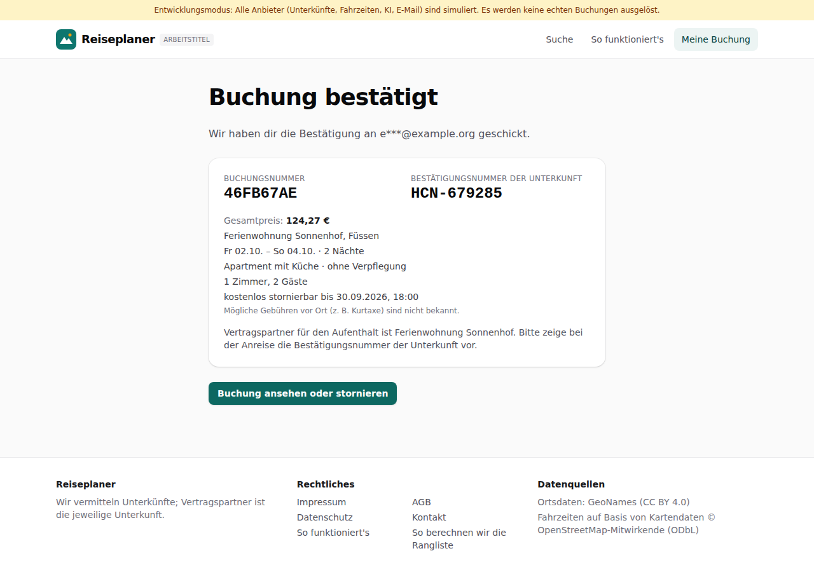
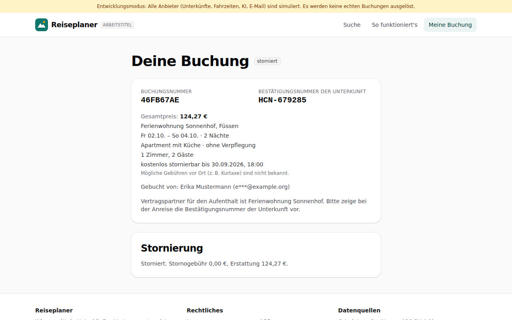
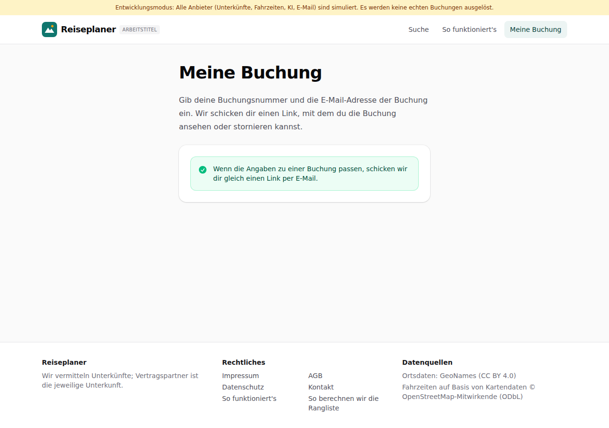

# Dogfood-Walkthrough 2026-09-27T21-18-14-P-buchung

- Modus: P – Pfad (Nutzerablauf mit Eingaben)
- Flows: buchung
- Basis-URL: http://localhost:46499 (echter lokaler Stack, Anbieter im Fake-Modus)
- Stand: 078aed9, gestartet 2026-09-27T21:18:14.245Z
- Ergebnis: ✅ bestanden (36/36 Prüfungen erfüllt)

## Flow „buchung“

Buchung (F11–F13, Akzeptanzbeispiel 5): Suche Füssen × 2 Freitage → Detailansicht → Buchungsformular mit Pflicht-Bestätigungen → simulierte Zahlung (Fake-Modus) → Bestätigung mit Buchungsnummer und Hotel-Bestätigungsnummer → Buchungsansicht → Stornierung mit Kostenvorschau → Zugangslink unter „Meine Buchung“.

### 01 Suche abgeschlossen, Detailansicht geöffnet

- URL: `/suche/0fd27011-9efe-46e4-8c85-9134067dd979/unterkunft/lpf-4757-1070-10#t=jiHpVuME7OwBLwkTv3aEGWuMs2YHcxLNsSXQHbja1yQ`
- Screenshot: 
- Prüfungen:
  - [x] enthält „Alle Termine und Tarife“
  - [x] enthält „Buchen“
  - [x] Element `[data-testid="book-offer"]` vorhanden (2)
- Überschriften: „Ferienwohnung Sonnenhof“, „Alle Termine und Tarife“, „So setzt sich der Qualitätswert zusammen“, „Rezensionscheck“, „Beschreibung“, „Ausstattung“
- KI-Kennzeichnungen (`data-ai-provenance`): keine
- Konsolenfehler: keine
- Fehlgeschlagene Anfragen: keine

<details><summary>Sichtbarer Text</summary>

```text
Entwicklungsmodus: Alle Anbieter (Unterkünfte, Fahrzeiten, KI, E-Mail) sind simuliert. Es werden keine echten Buchungen ausgelöst.
Reiseplaner
ARBEITSTITEL
Suche
So funktioniert's
Meine Buchung
← Zurück zu den Ergebnissen
Ferienwohnung Sonnenhof

Ferienwohnung · Sonnenweg 29

7,2
29 Bewertungen
Alle Termine und Tarife
Termin	Zimmer und Tarif	Stornierung	Preis	

Fr 02.10. – So 04.10.
Füssen
	
Apartment mit Küche
ohne Verpflegung
Schnäppchen Preis-Leistung 108 % besser als der Durchschnitt deiner Suche · 54 % günstiger als vergleichbare Unterkünfte in Füssen
	kostenlos stornierbar bis 30.09.2026, 18:00	
118 €
59,18 € pro Nacht
Mögliche Gebühren vor Ort (z. B. Kurtaxe) sind nicht bekannt.
Vergleichspreis anzeigen
	Buchen

Fr 09.10. – So 11.10.
Füssen
	
Apartment mit Küche
ohne Verpflegung
Schnäppchen Preis-Leistung 35 % besser als der Durchschnitt deiner Suche · 32 % günstiger als vergleichbare Unterkünfte in Füssen
	kostenlos stornierbar bis 07.10.2026, 18:00	
183 €
91,64 € pro Nacht
Mögliche Gebühren vor Ort (z. B. Kurtaxe) sind nicht bekannt.
Vergleichspreis anzeigen
	Buchen
So setzt sich der Qualitätswert zusammen
Durchschnitt 6,8 aus 29 Bewertungen
Wenige Bewertungen werden zum Gesamtmittel 7,5 gezogen (Gewicht wie 50 Bewertungen)
7,2
Aktualität
7,2
Sauberkeit
kein gesonderter Sauberkeitswert
Abzüge aus Warnhinweisen
–
Qualitätswert
7,2
Rezensionscheck

Keine Auffälligkeiten in den geprüften Rezensionen (29 geprüft).

29 Bewertungen geprüft am 27.09.2026, 23:18.

Beschreibung

Ferienwohnung Sonnenhof ist ein Ferienquartier mit 1 Zimmerkategorien. Simulierte Beschreibung im Entwicklungsmodus.

Anreise ab 15:00, Abreise bis 10:30

Ausstattung
Parkplatz
Kostenloses WLAN
Sauna
Wellnessbereich
Küche
Bar
Terrasse
Garten
Frühstücksbuffet
Hallenbad
Nichtraucherzimmer

Wichtig
… (364 weitere Zeichen)
```

</details>

### 02 Buchungsformular mit Angebot, Pflicht-Bestätigungen und Hinweis auf Beträge vor Ort

- URL: `/buchen/0fd27011-9efe-46e4-8c85-9134067dd979/lpf-4757-1070-10/15#t=jiHpVuME7OwBLwkTv3aEGWuMs2YHcxLNsSXQHbja1yQ`
- Screenshot: 
- Prüfungen:
  - [x] enthält „Dein Angebot“
  - [x] enthält „Gesamtpreis“
  - [x] enthält „Deine Angaben“
  - [x] enthält „Gäste je Zimmer“
  - [x] enthält „Vertragspartner für den Aufenthalt ist die Unterkunft“
  - [x] enthält „kein Widerrufsrecht“
  - [x] enthält „Weiter zur Zahlung“
  - [x] Element `[data-testid="booking-summary"]` vorhanden (1)
  - [x] Element `[data-testid="guest-row"]` vorhanden (1)
- Überschriften: „Buchen“, „Dein Angebot“
- KI-Kennzeichnungen (`data-ai-provenance`): keine
- Konsolenfehler: keine
- Fehlgeschlagene Anfragen: keine

<details><summary>Sichtbarer Text</summary>

```text
Entwicklungsmodus: Alle Anbieter (Unterkünfte, Fahrzeiten, KI, E-Mail) sind simuliert. Es werden keine echten Buchungen ausgelöst.
Reiseplaner
ARBEITSTITEL
Suche
So funktioniert's
Meine Buchung
← Zurück zur Unterkunft
Buchen
Dein Angebot

Ferienwohnung Sonnenhof

Füssen · Fr 02.10. – So 04.10. · 2 Nächte

Apartment mit Küche · ohne Verpflegung

kostenlos stornierbar bis 30.09.2026, 18:00

Gesamtpreis
118,35 €

Mögliche Gebühren vor Ort (z. B. Kurtaxe) sind nicht bekannt.

Deine Angaben
Vorname
Nachname
E-Mail

An diese Adresse schicken wir die Bestätigung und den Link zu deiner Buchung.

Telefon (optional)
Gäste je Zimmer
Zimmer 1: Name eines Gastes – Vorname
Nachname
Bestätigungen
Ich habe die AGB gelesen und akzeptiere sie. Mir ist bekannt, dass Reiseplaner Unterkünfte vermittelt; Vertragspartner für den Aufenthalt ist die Unterkunft.
AGB lesen
Mir ist bekannt, dass bei Beherbergung zu einem festen Termin kein Widerrufsrecht besteht (§ 312g Abs. 2 Nr. 9 BGB). Es gelten die Stornobedingungen des Tarifs.
Weiter zur Zahlung

Reiseplaner

Wir vermitteln Unterkünfte; Vertragspartner ist die jeweilige Unterkunft.

Rechtliches

Impressum
AGB
Datenschutz
Kontakt
So funktioniert's
So berechnen wir die Rangliste

Datenquellen

Ortsdaten: GeoNames (CC BY 4.0)
Fahrzeiten auf Basis von Kartendaten © OpenStreetMap-Mitwirkende (ODbL)
```

</details>

### 03 Angebot reserviert, Zahlungsseite (simuliert)

- URL: `/buchung/46FB67AE/zahlung`
- Screenshot: 
- Notiz: Der Preis hatte sich geändert; der neue Preis wurde im Dialog bestätigt.
- Prüfungen:
  - [x] enthält „Zahlung“
  - [x] enthält „Simulierte Zahlung (Entwicklungsmodus)“
  - [x] enthält „Testzahlung abschließen“
  - [x] enthält „wir sehen keine Kartendaten“
- Überschriften: „Zahlung“, „Simulierte Zahlung (Entwicklungsmodus)“
- KI-Kennzeichnungen (`data-ai-provenance`): keine
- Konsolenfehler: keine
- Fehlgeschlagene Anfragen: keine

<details><summary>Sichtbarer Text</summary>

```text
Entwicklungsmodus: Alle Anbieter (Unterkünfte, Fahrzeiten, KI, E-Mail) sind simuliert. Es werden keine echten Buchungen ausgelöst.
Reiseplaner
ARBEITSTITEL
Suche
So funktioniert's
Meine Buchung
Zahlung

Zu zahlen: 124,27 €. Die Zahlung wickelt LiteAPI (Nuitée) ab; wir sehen keine Kartendaten.

Buchungsnummer: 46FB67AE · Ferienwohnung Sonnenhof

Simulierte Zahlung (Entwicklungsmodus)

Im Entwicklungsmodus wird keine echte Zahlung ausgelöst. Die Schaltfläche simuliert die Rückkehr vom Zahlungsanbieter.

Testzahlung abschließen

Reiseplaner

Wir vermitteln Unterkünfte; Vertragspartner ist die jeweilige Unterkunft.

Rechtliches

Impressum
AGB
Datenschutz
Kontakt
So funktioniert's
So berechnen wir die Rangliste

Datenquellen

Ortsdaten: GeoNames (CC BY 4.0)
Fahrzeiten auf Basis von Kartendaten © OpenStreetMap-Mitwirkende (ODbL)
```

</details>

### 04 Bestätigung mit Buchungsnummer und Hotel-Bestätigungsnummer

- URL: `/buchung/46FB67AE/abschluss`
- Screenshot: 
- Notiz: Buchungsnummer 46FB67AE, Bestätigungsnummer der Unterkunft HCN-679285.
- Prüfungen:
  - [x] enthält „Buchung bestätigt“
  - [x] enthält „BUCHUNGSNUMMER“
  - [x] enthält „BESTÄTIGUNGSNUMMER DER UNTERKUNFT“
  - [x] enthält „HCN-“
  - [x] enthält „Vertragspartner für den Aufenthalt ist“
  - [x] enthält „e***@example.org“
  - [x] Element `[data-testid="booking-ref"]` vorhanden (1)
  - [x] Element `[data-testid="hotel-confirmation"]` vorhanden (1)
  - [x] Element `[data-testid="view-booking"]` vorhanden (1)
- Überschriften: „Buchung bestätigt“
- KI-Kennzeichnungen (`data-ai-provenance`): keine
- Konsolenfehler: keine
- Fehlgeschlagene Anfragen: keine

<details><summary>Sichtbarer Text</summary>

```text
Entwicklungsmodus: Alle Anbieter (Unterkünfte, Fahrzeiten, KI, E-Mail) sind simuliert. Es werden keine echten Buchungen ausgelöst.
Reiseplaner
ARBEITSTITEL
Suche
So funktioniert's
Meine Buchung
Buchung bestätigt

Wir haben dir die Bestätigung an e***@example.org geschickt.

BUCHUNGSNUMMER
46FB67AE
BESTÄTIGUNGSNUMMER DER UNTERKUNFT
HCN-679285

Gesamtpreis: 124,27 €

Ferienwohnung Sonnenhof, Füssen

Fr 02.10. – So 04.10. · 2 Nächte

Apartment mit Küche · ohne Verpflegung

1 Zimmer, 2 Gäste

kostenlos stornierbar bis 30.09.2026, 18:00

Mögliche Gebühren vor Ort (z. B. Kurtaxe) sind nicht bekannt.

Vertragspartner für den Aufenthalt ist Ferienwohnung Sonnenhof. Bitte zeige bei der Anreise die Bestätigungsnummer der Unterkunft vor.

Buchung ansehen oder stornieren

Reiseplaner

Wir vermitteln Unterkünfte; Vertragspartner ist die jeweilige Unterkunft.

Rechtliches

Impressum
AGB
Datenschutz
Kontakt
So funktioniert's
So berechnen wir die Rangliste

Datenquellen

Ortsdaten: GeoNames (CC BY 4.0)
Fahrzeiten auf Basis von Kartendaten © OpenStreetMap-Mitwirkende (ODbL)
```

</details>

### 05 Buchungsansicht mit Stornierung und Kostenvorschau

- URL: `/buchung/46FB67AE#a=eyJiIjoiYjEwNTYyODItYzhmNi00Zjc4LThkYTMtZjNmZThlYTAyMzkyIiwicCI6ImFjY2VzcyIsImUiOjE3OTMxMzU5MjAsImgiOiJfMVA1eWw2V2VTVEZDUmNRQXBFMGdmIn0.QYDesLMgM9PKcbt2_Hfow5bSn-kGlTMXPnsJOiuB6U8`
- Screenshot: 
- Prüfungen:
  - [x] enthält „Deine Buchung“
  - [x] enthält „bestätigt“
  - [x] enthält „Buchung stornieren?“
  - [x] enthält „Die Stornierung ist jetzt kostenlos“
  - [x] Element `[data-testid="cancel-confirm"]` vorhanden (1)
- Überschriften: „Deine Buchung“, „Stornierung“, „Buchung stornieren?“
- KI-Kennzeichnungen (`data-ai-provenance`): keine
- Konsolenfehler: keine
- Fehlgeschlagene Anfragen: keine

<details><summary>Sichtbarer Text</summary>

```text
Entwicklungsmodus: Alle Anbieter (Unterkünfte, Fahrzeiten, KI, E-Mail) sind simuliert. Es werden keine echten Buchungen ausgelöst.
Reiseplaner
ARBEITSTITEL
Suche
So funktioniert's
Meine Buchung
Deine Buchung
bestätigt
BUCHUNGSNUMMER
46FB67AE
BESTÄTIGUNGSNUMMER DER UNTERKUNFT
HCN-679285

Gesamtpreis: 124,27 €

Ferienwohnung Sonnenhof, Füssen

Fr 02.10. – So 04.10. · 2 Nächte

Apartment mit Küche · ohne Verpflegung

1 Zimmer, 2 Gäste

kostenlos stornierbar bis 30.09.2026, 18:00

Mögliche Gebühren vor Ort (z. B. Kurtaxe) sind nicht bekannt.

Gebucht von: Erika Mustermann (e***@example.org)

Vertragspartner für den Aufenthalt ist Ferienwohnung Sonnenhof. Bitte zeige bei der Anreise die Bestätigungsnummer der Unterkunft vor.

Stornierung
Buchung stornieren

Reiseplaner

Wir vermitteln Unterkünfte; Vertragspartner ist die jeweilige Unterkunft.

Rechtliches

Impressum
AGB
Datenschutz
Kontakt
So funktioniert's
So berechnen wir die Rangliste

Datenquellen

Ortsdaten: GeoNames (CC BY 4.0)
Fahrzeiten auf Basis von Kartendaten © OpenStreetMap-Mitwirkende (ODbL)
Buchung stornieren?
Die Stornierung ist jetzt kostenlos. Du erhältst 124,27 € zurück.
Buchung behalten
Jetzt stornieren
```

</details>

### 06 Buchung storniert

- URL: `/buchung/46FB67AE#a=eyJiIjoiYjEwNTYyODItYzhmNi00Zjc4LThkYTMtZjNmZThlYTAyMzkyIiwicCI6ImFjY2VzcyIsImUiOjE3OTMxMzU5MjAsImgiOiJfMVA1eWw2V2VTVEZDUmNRQXBFMGdmIn0.QYDesLMgM9PKcbt2_Hfow5bSn-kGlTMXPnsJOiuB6U8`
- Screenshot: 
- Prüfungen:
  - [x] enthält „storniert“
  - [x] enthält „Stornogebühr 0,00“
  - [x] enthält „Erstattung“
  - [x] Element `[data-testid="cancelled-note"]` vorhanden (1)
- Überschriften: „Deine Buchung“, „Stornierung“
- KI-Kennzeichnungen (`data-ai-provenance`): keine
- Konsolenfehler: keine
- Fehlgeschlagene Anfragen: keine

<details><summary>Sichtbarer Text</summary>

```text
Entwicklungsmodus: Alle Anbieter (Unterkünfte, Fahrzeiten, KI, E-Mail) sind simuliert. Es werden keine echten Buchungen ausgelöst.
Reiseplaner
ARBEITSTITEL
Suche
So funktioniert's
Meine Buchung
Deine Buchung
storniert
BUCHUNGSNUMMER
46FB67AE
BESTÄTIGUNGSNUMMER DER UNTERKUNFT
HCN-679285

Gesamtpreis: 124,27 €

Ferienwohnung Sonnenhof, Füssen

Fr 02.10. – So 04.10. · 2 Nächte

Apartment mit Küche · ohne Verpflegung

1 Zimmer, 2 Gäste

kostenlos stornierbar bis 30.09.2026, 18:00

Mögliche Gebühren vor Ort (z. B. Kurtaxe) sind nicht bekannt.

Gebucht von: Erika Mustermann (e***@example.org)

Vertragspartner für den Aufenthalt ist Ferienwohnung Sonnenhof. Bitte zeige bei der Anreise die Bestätigungsnummer der Unterkunft vor.

Stornierung

Storniert. Stornogebühr 0,00 €, Erstattung 124,27 €.

Reiseplaner

Wir vermitteln Unterkünfte; Vertragspartner ist die jeweilige Unterkunft.

Rechtliches

Impressum
AGB
Datenschutz
Kontakt
So funktioniert's
So berechnen wir die Rangliste

Datenquellen

Ortsdaten: GeoNames (CC BY 4.0)
Fahrzeiten auf Basis von Kartendaten © OpenStreetMap-Mitwirkende (ODbL)
```

</details>

### 07 „Meine Buchung“: Zugangslink anfordern

- URL: `/buchung`
- Screenshot: 
- Prüfungen:
  - [x] enthält „Meine Buchung“
  - [x] enthält „Wenn die Angaben zu einer Buchung passen“
- Überschriften: „Meine Buchung“
- KI-Kennzeichnungen (`data-ai-provenance`): keine
- Konsolenfehler: keine
- Fehlgeschlagene Anfragen: keine

<details><summary>Sichtbarer Text</summary>

```text
Entwicklungsmodus: Alle Anbieter (Unterkünfte, Fahrzeiten, KI, E-Mail) sind simuliert. Es werden keine echten Buchungen ausgelöst.
Reiseplaner
ARBEITSTITEL
Suche
So funktioniert's
Meine Buchung
Meine Buchung

Gib deine Buchungsnummer und die E-Mail-Adresse der Buchung ein. Wir schicken dir einen Link, mit dem du die Buchung ansehen oder stornieren kannst.

Wenn die Angaben zu einer Buchung passen, schicken wir dir gleich einen Link per E-Mail.

Reiseplaner

Wir vermitteln Unterkünfte; Vertragspartner ist die jeweilige Unterkunft.

Rechtliches

Impressum
AGB
Datenschutz
Kontakt
So funktioniert's
So berechnen wir die Rangliste

Datenquellen

Ortsdaten: GeoNames (CC BY 4.0)
Fahrzeiten auf Basis von Kartendaten © OpenStreetMap-Mitwirkende (ODbL)
```

</details>

