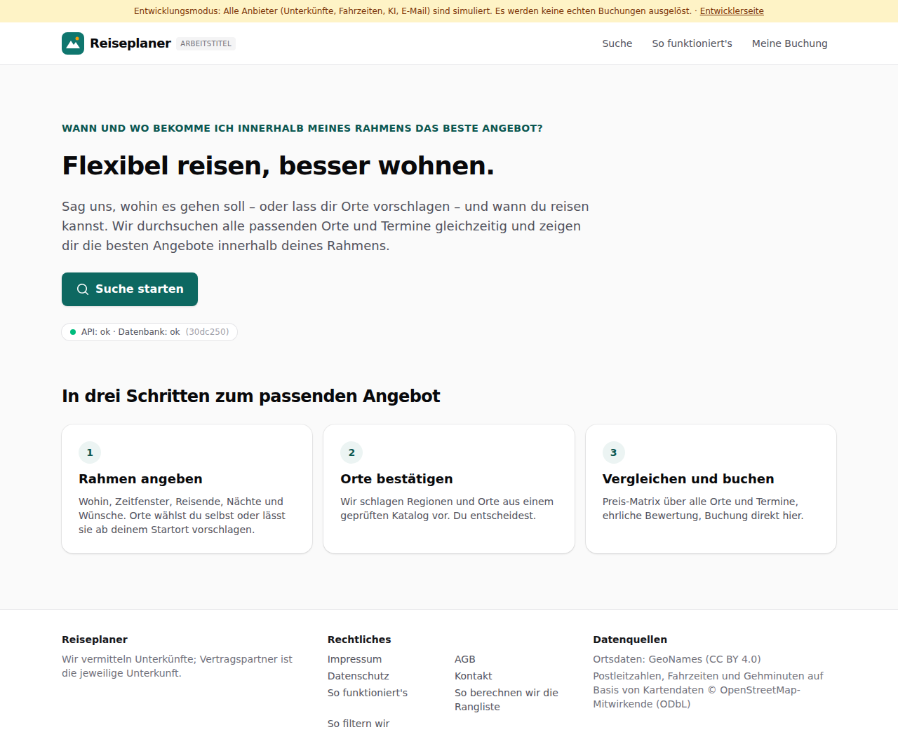
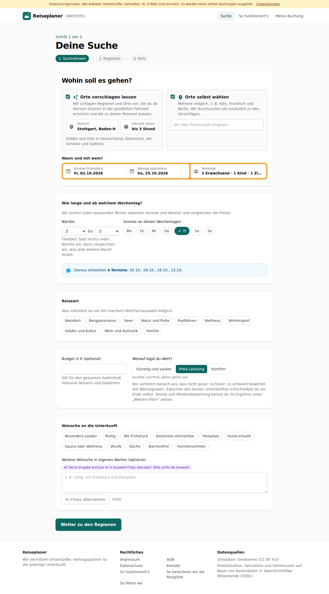

# Dogfood-Walkthrough 2026-09-29T19-12-33-P-all

- Modus: P – Pfad (Nutzerablauf mit Eingaben)
- Flows: startseite, suchrahmen, orte, naechte, zimmer, bewertung, attraktivitaet, filter, bilder, ausstattung, karte, suche, ergebnisse, finale, warnungen, buchung, entwickler, langsam
- Basis-URL: http://localhost:44601 (echter lokaler Stack, Anbieter im Fake-Modus)
- Stand: 30dc250, gestartet 2026-09-29T19:12:33.871Z
- Ergebnis: ✅ bestanden (374/374 Prüfungen erfüllt)

## Flow „startseite“

Startseite mit einem Button „Suche starten“; auf der Suchseite „Wohin soll es gehen?“ oben (Vorschläge ab Startort und/oder eigene Orte), darunter verbunden die Leiste mit Kalender (zwei Klicks: Anreise, dann Abreise) und Reisenden im Aufklappfeld.

### 01 Startseite: nur ein Button, keine Eingabefelder

- URL: `/`
- Screenshot: 
- Prüfungen:
  - [x] enthält „Suche starten“
  - [x] enthält „Flexibel reisen, besser wohnen.“
  - [x] enthält nicht „Anreise frühestens“
  - [x] enthält nicht „Fahrzeit (Auto)“
  - [x] Element `[data-testid="hero-search"]` vorhanden (1)
- Überschriften: „Flexibel reisen, besser wohnen.“, „In drei Schritten zum passenden Angebot“
- KI-Kennzeichnungen (`data-ai-provenance`): keine
- Konsolenfehler: keine
- Fehlgeschlagene Anfragen: keine

<details><summary>Sichtbarer Text</summary>

```text
Entwicklungsmodus: Alle Anbieter (Unterkünfte, Fahrzeiten, KI, E-Mail) sind simuliert. Es werden keine echten Buchungen ausgelöst. · Entwicklerseite
Reiseplaner
ARBEITSTITEL
Suche
So funktioniert's
Meine Buchung

WANN UND WO BEKOMME ICH INNERHALB MEINES RAHMENS DAS BESTE ANGEBOT?

Flexibel reisen, besser wohnen.

Sag uns, wohin es gehen soll – oder lass dir Orte vorschlagen – und wann du reisen kannst. Wir durchsuchen alle passenden Orte und Termine gleichzeitig und zeigen dir die besten Angebote innerhalb deines Rahmens.

Suche starten

API: ok · Datenbank: ok
(30dc250)

In drei Schritten zum passenden Angebot
1
Rahmen angeben

Wohin, Zeitfenster, Reisende, Nächte und Wünsche. Orte wählst du selbst oder lässt sie ab deinem Startort vorschlagen.

2
Orte bestätigen

Wir schlagen Regionen und Orte aus einem geprüften Katalog vor. Du entscheidest.

3
Vergleichen und buchen

Preis-Matrix über alle Orte und Termine, ehrliche Bewertung, Buchung direkt hier.

Reiseplaner

Wir vermitteln Unterkünfte; Vertragspartner ist die jeweilige Unterkunft.

Rechtliches

Impressum
AGB
Datenschutz
Kontakt
So funktioniert's
So berechnen wir die Rangliste
So filtern wir

Datenquellen

Ortsdaten: GeoNames (CC BY 4.0)
Postleitzahlen, Fahrzeiten und Gehminuten auf Basis von Kartendaten © OpenStreetMap-Mitwirkende (ODbL)
```

</details>

### 02 Klick auf „Suche starten“: oben „Wohin soll es gehen?“, darunter verbunden Datum und Reisende

- URL: `/suche`
- Screenshot: 
- Prüfungen:
  - [x] enthält „Wohin soll es gehen?“
  - [x] enthält „Orte vorschlagen lassen“
  - [x] enthält „Orte selbst wählen“
  - [x] enthält „Startort“
  - [x] enthält „Fahrzeit (Auto)“
  - [x] enthält „Wann und mit wem?“
  - [x] enthält „Anreise frühestens“
  - [x] enthält „Abreise spätestens“
  - [x] enthält „2 Erwachsene · 1 Zimmer“
  - [x] Element `[data-testid="where"] [data-testid="search-bar"]` vorhanden (1)
  - [x] Element `[data-testid="way-suggest"] [data-testid="origin-fields"]` vorhanden (1)
- Überschriften: „Deine Suche“, „Wohin soll es gehen?“
- KI-Kennzeichnungen (`data-ai-provenance`): „Deine Eingabe wird per KI in Auswahl-Chips übersetzt. Bitte prüfe die Auswahl. [ai_assisted]“
- Konsolenfehler: keine
- Fehlgeschlagene Anfragen: keine

<details><summary>Sichtbarer Text</summary>

```text
Entwicklungsmodus: Alle Anbieter (Unterkünfte, Fahrzeiten, KI, E-Mail) sind simuliert. Es werden keine echten Buchungen ausgelöst. · Entwicklerseite
Reiseplaner
ARBEITSTITEL
Suche
So funktioniert's
Meine Buchung

Schritt 1 von 3

Deine Suche
1
Suchrahmen
→
2
Regionen
→
3
Orte
Wohin soll es gehen?
Orte vorschlagen lassen
Wir schlagen Regionen und Orte vor, die du ab deinem Startort in der gewählten Fahrzeit erreichst und die zu deiner Reiseart passen.
Startort
Fahrzeit (Auto)
egal
bis 1 Stunde
bis 1 h 30 min
bis 2 Stunden
bis 2 h 30 min
bis 3 Stunden
bis 4 Stunden
bis 5 Stunden
bis 6 Stunden

Städte und Orte in Deutschland, Österreich, der Schweiz und Südtirol.

Orte selbst wählen
Mehrere möglich, z. B. Köln, Frankfurt und Berlin. Wir durchsuchen sie zusätzlich zu den Vorschlägen.

Wann und mit wem?

Anreise frühestens
Di, 06.10.2026
Abreise spätestens
Di, 17.11.2026
Reisende
2 Erwachsene · 1 Zimmer
Wie lange und ab welchem Wochentag?

Wir suchen jeden passenden Termin zwischen Anreise und Abreise und vergleichen die Preise.

Nächte
1
2
3
4
5
6
7
8
9
10
11
12
13
14
bis
2
3
4
5
6
7
8
9
10
11
12
13
14

Flexibel? Stell rechts mehr Nächte ein, dann vergleichen wir, was jede weitere Nacht kostet.

Anreise an diesen Wochentagen
Mo
Di
Mi
Do
Fr
Sa
So
Daraus entstehen 6 Termine: 09.10., 16.10., 23.10., 30.10. …
Reiseart

Was möchtest du vor Ort machen? Mehrfachauswahl möglich.

Wandern
Bergpanorama
Seen
Natur und Ruhe
Radfahren
Wellness
Wintersport
Städte und Kultur
Wein und Kulinarik
Familie
Budget in € (optional)

Gilt für den gesamten Aufenthalt inklusive Steuern und Gebühren.

Worauf legst du Wert?

Günstig und sauber
Preis-Leistung
Komfort

Qualität und Preis zählen gleich viel.

Wir sortieren danach aus, was nicht passt: zu teuer, zu schwach bewertet, mit Warnsignalen. Zwis
… (832 weitere Zeichen)
```

</details>

### 03 Startort „Stutt“ → Stuttgart

- URL: `/suche`
- Screenshot: 
- Prüfungen:
  - [x] Element `[data-origin="2825297"]` vorhanden (1)
- Überschriften: „Deine Suche“, „Wohin soll es gehen?“
- KI-Kennzeichnungen (`data-ai-provenance`): „Deine Eingabe wird per KI in Auswahl-Chips übersetzt. Bitte prüfe die Auswahl. [ai_assisted]“
- Konsolenfehler: keine
- Fehlgeschlagene Anfragen: keine

<details><summary>Sichtbarer Text</summary>

```text
Entwicklungsmodus: Alle Anbieter (Unterkünfte, Fahrzeiten, KI, E-Mail) sind simuliert. Es werden keine echten Buchungen ausgelöst. · Entwicklerseite
Reiseplaner
ARBEITSTITEL
Suche
So funktioniert's
Meine Buchung

Schritt 1 von 3

Deine Suche
1
Suchrahmen
→
2
Regionen
→
3
Orte
Wohin soll es gehen?
Orte vorschlagen lassen
Wir schlagen Regionen und Orte vor, die du ab deinem Startort in der gewählten Fahrzeit erreichst und die zu deiner Reiseart passen.
Startort
Fahrzeit (Auto)
egal
bis 1 Stunde
bis 1 h 30 min
bis 2 Stunden
bis 2 h 30 min
bis 3 Stunden
bis 4 Stunden
bis 5 Stunden
bis 6 Stunden

Städte und Orte in Deutschland, Österreich, der Schweiz und Südtirol.

Orte selbst wählen
Mehrere möglich, z. B. Köln, Frankfurt und Berlin. Wir durchsuchen sie zusätzlich zu den Vorschlägen.

Wann und mit wem?

Anreise frühestens
Di, 06.10.2026
Abreise spätestens
Di, 17.11.2026
Reisende
2 Erwachsene · 1 Zimmer
Wie lange und ab welchem Wochentag?

Wir suchen jeden passenden Termin zwischen Anreise und Abreise und vergleichen die Preise.

Nächte
1
2
3
4
5
6
7
8
9
10
11
12
13
14
bis
2
3
4
5
6
7
8
9
10
11
12
13
14

Flexibel? Stell rechts mehr Nächte ein, dann vergleichen wir, was jede weitere Nacht kostet.

Anreise an diesen Wochentagen
Mo
Di
Mi
Do
Fr
Sa
So
Daraus entstehen 6 Termine: 09.10., 16.10., 23.10., 30.10. …
Reiseart

Was möchtest du vor Ort machen? Mehrfachauswahl möglich.

Wandern
Bergpanorama
Seen
Natur und Ruhe
Radfahren
Wellness
Wintersport
Städte und Kultur
Wein und Kulinarik
Familie
Budget in € (optional)

Gilt für den gesamten Aufenthalt inklusive Steuern und Gebühren.

Worauf legst du Wert?

Günstig und sauber
Preis-Leistung
Komfort

Qualität und Preis zählen gleich viel.

Wir sortieren danach aus, was nicht passt: zu teuer, zu schwach bewertet, mit Warnsignalen. Zwis
… (832 weitere Zeichen)
```

</details>

### 04 Klick auf Anreise öffnet den Kalender mit zwei Monaten

- URL: `/suche`
- Screenshot: 
- Prüfungen:
  - [x] enthält „Wann kannst du frühestens anreisen?“
  - [x] enthält „Oktober 2026“
  - [x] Element `#window-start[aria-expanded="true"]` vorhanden (1)
- Überschriften: „Deine Suche“, „Wohin soll es gehen?“
- KI-Kennzeichnungen (`data-ai-provenance`): „Deine Eingabe wird per KI in Auswahl-Chips übersetzt. Bitte prüfe die Auswahl. [ai_assisted]“
- Konsolenfehler: keine
- Fehlgeschlagene Anfragen: keine

<details><summary>Sichtbarer Text</summary>

```text
Entwicklungsmodus: Alle Anbieter (Unterkünfte, Fahrzeiten, KI, E-Mail) sind simuliert. Es werden keine echten Buchungen ausgelöst. · Entwicklerseite
Reiseplaner
ARBEITSTITEL
Suche
So funktioniert's
Meine Buchung

Schritt 1 von 3

Deine Suche
1
Suchrahmen
→
2
Regionen
→
3
Orte
Wohin soll es gehen?
Orte vorschlagen lassen
Wir schlagen Regionen und Orte vor, die du ab deinem Startort in der gewählten Fahrzeit erreichst und die zu deiner Reiseart passen.
Startort
Fahrzeit (Auto)
egal
bis 1 Stunde
bis 1 h 30 min
bis 2 Stunden
bis 2 h 30 min
bis 3 Stunden
bis 4 Stunden
bis 5 Stunden
bis 6 Stunden

Städte und Orte in Deutschland, Österreich, der Schweiz und Südtirol.

Orte selbst wählen
Mehrere möglich, z. B. Köln, Frankfurt und Berlin. Wir durchsuchen sie zusätzlich zu den Vorschlägen.

Wann und mit wem?

Anreise frühestens
Di, 06.10.2026
Abreise spätestens
Di, 17.11.2026

Wann kannst du frühestens anreisen?

Oktober 2026

Mo
Di
Mi
Do
Fr
Sa
So
1
2
3
4
5
6
7
8
9
10
11
12
13
14
15
16
17
18
19
20
21
22
23
24
25
26
27
28
29
30
31

November 2026

Mo
Di
Mi
Do
Fr
Sa
So
1
2
3
4
5
6
7
8
9
10
11
12
13
14
15
16
17
18
19
20
21
22
23
24
25
26
27
28
29
30

42 Tage Zeitraum

Reisende
2 Erwachsene · 1 Zimmer
Wie lange und ab welchem Wochentag?

Wir suchen jeden passenden Termin zwischen Anreise und Abreise und vergleichen die Preise.

Nächte
1
2
3
4
5
6
7
8
9
10
11
12
13
14
bis
2
3
4
5
6
7
8
9
10
11
12
13
14

Flexibel? Stell rechts mehr Nächte ein, dann vergleichen wir, was jede weitere Nacht kostet.

Anreise an diesen Wochentagen
Mo
Di
Mi
Do
Fr
Sa
So
Daraus entstehen 6 Termine: 09.10., 16.10., 23.10., 30.10. …
Reiseart

Was möchtest du vor Ort machen? Mehrfachauswahl möglich.

Wandern
Bergpanorama
Seen
Natur und Ruhe
Radfahren
Wellness
Wintersport
Städte und Kultur
Wein und Kulinarik
Famili
… (1126 weitere Zeichen)
```

</details>

### 05 Erster Klick: Anreise 02.10. – der Kalender springt auf die Abreise

- URL: `/suche`
- Screenshot: 
- Prüfungen:
  - [x] enthält „Und wann musst du spätestens zurück sein?“
  - [x] enthält „Fr, 02.10.2026“
  - [x] enthält „23 Tage Zeitraum“
  - [x] Element `#window-end[aria-expanded="true"]` vorhanden (1)
- Überschriften: „Deine Suche“, „Wohin soll es gehen?“
- KI-Kennzeichnungen (`data-ai-provenance`): „Deine Eingabe wird per KI in Auswahl-Chips übersetzt. Bitte prüfe die Auswahl. [ai_assisted]“
- Konsolenfehler: keine
- Fehlgeschlagene Anfragen: keine

<details><summary>Sichtbarer Text</summary>

```text
Entwicklungsmodus: Alle Anbieter (Unterkünfte, Fahrzeiten, KI, E-Mail) sind simuliert. Es werden keine echten Buchungen ausgelöst. · Entwicklerseite
Reiseplaner
ARBEITSTITEL
Suche
So funktioniert's
Meine Buchung

Schritt 1 von 3

Deine Suche
1
Suchrahmen
→
2
Regionen
→
3
Orte
Wohin soll es gehen?
Orte vorschlagen lassen
Wir schlagen Regionen und Orte vor, die du ab deinem Startort in der gewählten Fahrzeit erreichst und die zu deiner Reiseart passen.
Startort
Fahrzeit (Auto)
egal
bis 1 Stunde
bis 1 h 30 min
bis 2 Stunden
bis 2 h 30 min
bis 3 Stunden
bis 4 Stunden
bis 5 Stunden
bis 6 Stunden

Städte und Orte in Deutschland, Österreich, der Schweiz und Südtirol.

Orte selbst wählen
Mehrere möglich, z. B. Köln, Frankfurt und Berlin. Wir durchsuchen sie zusätzlich zu den Vorschlägen.

Wann und mit wem?

Anreise frühestens
Fr, 02.10.2026
Abreise spätestens
Datum wählen

Und wann musst du spätestens zurück sein?

Oktober 2026

Mo
Di
Mi
Do
Fr
Sa
So
1
2
3
4
5
6
7
8
9
10
11
12
13
14
15
16
17
18
19
20
21
22
23
24
25
26
27
28
29
30
31

November 2026

Mo
Di
Mi
Do
Fr
Sa
So
1
2
3
4
5
6
7
8
9
10
11
12
13
14
15
16
17
18
19
20
21
22
23
24
25
26
27
28
29
30

23 Tage Zeitraum

Reisende
2 Erwachsene · 1 Zimmer
Wie lange und ab welchem Wochentag?

Wir suchen jeden passenden Termin zwischen Anreise und Abreise und vergleichen die Preise.

Nächte
1
2
3
4
5
6
7
8
9
10
11
12
13
14
bis
2
3
4
5
6
7
8
9
10
11
12
13
14

Flexibel? Stell rechts mehr Nächte ein, dann vergleichen wir, was jede weitere Nacht kostet.

Anreise an diesen Wochentagen
Mo
Di
Mi
Do
Fr
Sa
So
Daraus entstehen 6 Termine: 09.10., 16.10., 23.10., 30.10. …
Reiseart

Was möchtest du vor Ort machen? Mehrfachauswahl möglich.

Wandern
Bergpanorama
Seen
Natur und Ruhe
Radfahren
Wellness
Wintersport
Städte und Kultur
Wein und Kulinarik
Fa
… (1130 weitere Zeichen)
```

</details>

### 06 Zweiter Klick: Abreise 25.10. – der Kalender schließt sich

- URL: `/suche`
- Screenshot: 
- Prüfungen:
  - [x] enthält „Fr, 02.10.2026“
  - [x] enthält „So, 25.10.2026“
  - [x] Element `#window-end[data-value="2026-10-25"]` vorhanden (1)
- Überschriften: „Deine Suche“, „Wohin soll es gehen?“
- KI-Kennzeichnungen (`data-ai-provenance`): „Deine Eingabe wird per KI in Auswahl-Chips übersetzt. Bitte prüfe die Auswahl. [ai_assisted]“
- Konsolenfehler: keine
- Fehlgeschlagene Anfragen: keine

<details><summary>Sichtbarer Text</summary>

```text
Entwicklungsmodus: Alle Anbieter (Unterkünfte, Fahrzeiten, KI, E-Mail) sind simuliert. Es werden keine echten Buchungen ausgelöst. · Entwicklerseite
Reiseplaner
ARBEITSTITEL
Suche
So funktioniert's
Meine Buchung

Schritt 1 von 3

Deine Suche
1
Suchrahmen
→
2
Regionen
→
3
Orte
Wohin soll es gehen?
Orte vorschlagen lassen
Wir schlagen Regionen und Orte vor, die du ab deinem Startort in der gewählten Fahrzeit erreichst und die zu deiner Reiseart passen.
Startort
Fahrzeit (Auto)
egal
bis 1 Stunde
bis 1 h 30 min
bis 2 Stunden
bis 2 h 30 min
bis 3 Stunden
bis 4 Stunden
bis 5 Stunden
bis 6 Stunden

Städte und Orte in Deutschland, Österreich, der Schweiz und Südtirol.

Orte selbst wählen
Mehrere möglich, z. B. Köln, Frankfurt und Berlin. Wir durchsuchen sie zusätzlich zu den Vorschlägen.

Wann und mit wem?

Anreise frühestens
Fr, 02.10.2026
Abreise spätestens
So, 25.10.2026
Reisende
2 Erwachsene · 1 Zimmer
Wie lange und ab welchem Wochentag?

Wir suchen jeden passenden Termin zwischen Anreise und Abreise und vergleichen die Preise.

Nächte
1
2
3
4
5
6
7
8
9
10
11
12
13
14
bis
2
3
4
5
6
7
8
9
10
11
12
13
14

Flexibel? Stell rechts mehr Nächte ein, dann vergleichen wir, was jede weitere Nacht kostet.

Anreise an diesen Wochentagen
Mo
Di
Mi
Do
Fr
Sa
So
Daraus entstehen 4 Termine: 02.10., 09.10., 16.10., 23.10.
Reiseart

Was möchtest du vor Ort machen? Mehrfachauswahl möglich.

Wandern
Bergpanorama
Seen
Natur und Ruhe
Radfahren
Wellness
Wintersport
Städte und Kultur
Wein und Kulinarik
Familie
Budget in € (optional)

Gilt für den gesamten Aufenthalt inklusive Steuern und Gebühren.

Worauf legst du Wert?

Günstig und sauber
Preis-Leistung
Komfort

Qualität und Preis zählen gleich viel.

Wir sortieren danach aus, was nicht passt: zu teuer, zu schwach bewertet, mit Warnsignalen. Zwisch
… (830 weitere Zeichen)
```

</details>

### 07 Reisende: 1 Kind dazu

- URL: `/suche`
- Screenshot: 
- Prüfungen:
  - [x] enthält „2 Erwachsene · 1 Kind · 1 Zimmer“
  - [x] enthält „Alter Kind 1“
  - [x] enthält „Fertig“
- Überschriften: „Deine Suche“, „Wohin soll es gehen?“
- KI-Kennzeichnungen (`data-ai-provenance`): „Deine Eingabe wird per KI in Auswahl-Chips übersetzt. Bitte prüfe die Auswahl. [ai_assisted]“
- Konsolenfehler: keine
- Fehlgeschlagene Anfragen: keine

<details><summary>Sichtbarer Text</summary>

```text
Entwicklungsmodus: Alle Anbieter (Unterkünfte, Fahrzeiten, KI, E-Mail) sind simuliert. Es werden keine echten Buchungen ausgelöst. · Entwicklerseite
Reiseplaner
ARBEITSTITEL
Suche
So funktioniert's
Meine Buchung

Schritt 1 von 3

Deine Suche
1
Suchrahmen
→
2
Regionen
→
3
Orte
Wohin soll es gehen?
Orte vorschlagen lassen
Wir schlagen Regionen und Orte vor, die du ab deinem Startort in der gewählten Fahrzeit erreichst und die zu deiner Reiseart passen.
Startort
Fahrzeit (Auto)
egal
bis 1 Stunde
bis 1 h 30 min
bis 2 Stunden
bis 2 h 30 min
bis 3 Stunden
bis 4 Stunden
bis 5 Stunden
bis 6 Stunden

Städte und Orte in Deutschland, Österreich, der Schweiz und Südtirol.

Orte selbst wählen
Mehrere möglich, z. B. Köln, Frankfurt und Berlin. Wir durchsuchen sie zusätzlich zu den Vorschlägen.

Wann und mit wem?

Anreise frühestens
Fr, 02.10.2026
Abreise spätestens
So, 25.10.2026
Reisende
2 Erwachsene · 1 Kind · 1 Zimmer
Erwachsene
2
Kinder
1
Alter Kind 1
0 Jahre
1 Jahr
2 Jahre
3 Jahre
4 Jahre
5 Jahre
6 Jahre
7 Jahre
8 Jahre
9 Jahre
10 Jahre
11 Jahre
12 Jahre
13 Jahre
14 Jahre
15 Jahre
16 Jahre
17 Jahre
Zimmer
1
Fertig
Wie lange und ab welchem Wochentag?

Wir suchen jeden passenden Termin zwischen Anreise und Abreise und vergleichen die Preise.

Nächte
1
2
3
4
5
6
7
8
9
10
11
12
13
14
bis
2
3
4
5
6
7
8
9
10
11
12
13
14

Flexibel? Stell rechts mehr Nächte ein, dann vergleichen wir, was jede weitere Nacht kostet.

Anreise an diesen Wochentagen
Mo
Di
Mi
Do
Fr
Sa
So
Daraus entstehen 4 Termine: 02.10., 09.10., 16.10., 23.10.
Reiseart

Was möchtest du vor Ort machen? Mehrfachauswahl möglich.

Wandern
Bergpanorama
Seen
Natur und Ruhe
Radfahren
Wellness
Wintersport
Städte und Kultur
Wein und Kulinarik
Familie
Budget in € (optional)

Gilt für den gesamten Aufenthalt inklusive Steuern und Gebü
… (1041 weitere Zeichen)
```

</details>

### 08 Terminvorschau und Startort passen zu den Angaben

- URL: `/suche`
- Screenshot: 
- Prüfungen:
  - [x] enthält „Schritt 1 von 3“
  - [x] enthält „Fr, 02.10.2026“
  - [x] enthält „So, 25.10.2026“
  - [x] enthält „2 Erwachsene · 1 Kind · 1 Zimmer“
  - [x] enthält „Daraus entstehen 4 Termine“
  - [x] Element `[data-origin="2825297"]` vorhanden (1)
- Überschriften: „Deine Suche“, „Wohin soll es gehen?“
- KI-Kennzeichnungen (`data-ai-provenance`): „Deine Eingabe wird per KI in Auswahl-Chips übersetzt. Bitte prüfe die Auswahl. [ai_assisted]“
- Konsolenfehler: keine
- Fehlgeschlagene Anfragen: keine

<details><summary>Sichtbarer Text</summary>

```text
Entwicklungsmodus: Alle Anbieter (Unterkünfte, Fahrzeiten, KI, E-Mail) sind simuliert. Es werden keine echten Buchungen ausgelöst. · Entwicklerseite
Reiseplaner
ARBEITSTITEL
Suche
So funktioniert's
Meine Buchung

Schritt 1 von 3

Deine Suche
1
Suchrahmen
→
2
Regionen
→
3
Orte
Wohin soll es gehen?
Orte vorschlagen lassen
Wir schlagen Regionen und Orte vor, die du ab deinem Startort in der gewählten Fahrzeit erreichst und die zu deiner Reiseart passen.
Startort
Fahrzeit (Auto)
egal
bis 1 Stunde
bis 1 h 30 min
bis 2 Stunden
bis 2 h 30 min
bis 3 Stunden
bis 4 Stunden
bis 5 Stunden
bis 6 Stunden

Städte und Orte in Deutschland, Österreich, der Schweiz und Südtirol.

Orte selbst wählen
Mehrere möglich, z. B. Köln, Frankfurt und Berlin. Wir durchsuchen sie zusätzlich zu den Vorschlägen.

Wann und mit wem?

Anreise frühestens
Fr, 02.10.2026
Abreise spätestens
So, 25.10.2026
Reisende
2 Erwachsene · 1 Kind · 1 Zimmer
Wie lange und ab welchem Wochentag?

Wir suchen jeden passenden Termin zwischen Anreise und Abreise und vergleichen die Preise.

Nächte
1
2
3
4
5
6
7
8
9
10
11
12
13
14
bis
2
3
4
5
6
7
8
9
10
11
12
13
14

Flexibel? Stell rechts mehr Nächte ein, dann vergleichen wir, was jede weitere Nacht kostet.

Anreise an diesen Wochentagen
Mo
Di
Mi
Do
Fr
Sa
So
Daraus entstehen 4 Termine: 02.10., 09.10., 16.10., 23.10.
Reiseart

Was möchtest du vor Ort machen? Mehrfachauswahl möglich.

Wandern
Bergpanorama
Seen
Natur und Ruhe
Radfahren
Wellness
Wintersport
Städte und Kultur
Wein und Kulinarik
Familie
Budget in € (optional)

Gilt für den gesamten Aufenthalt inklusive Steuern und Gebühren.

Worauf legst du Wert?

Günstig und sauber
Preis-Leistung
Komfort

Qualität und Preis zählen gleich viel.

Wir sortieren danach aus, was nicht passt: zu teuer, zu schwach bewertet, mit Warnsignale
… (839 weitere Zeichen)
```

</details>

### 09 Handy (390 px): Kalender mit einem Monat

- URL: `/suche`
- Screenshot: 
- Prüfungen:
  - [x] enthält „Wann kannst du frühestens anreisen?“
- Überschriften: „Deine Suche“, „Wohin soll es gehen?“
- KI-Kennzeichnungen (`data-ai-provenance`): „Deine Eingabe wird per KI in Auswahl-Chips übersetzt. Bitte prüfe die Auswahl. [ai_assisted]“
- Konsolenfehler: keine
- Fehlgeschlagene Anfragen: keine

<details><summary>Sichtbarer Text</summary>

```text
Entwicklungsmodus: Alle Anbieter (Unterkünfte, Fahrzeiten, KI, E-Mail) sind simuliert. Es werden keine echten Buchungen ausgelöst. · Entwicklerseite
Reiseplaner
Suche
Meine Buchung

Schritt 1 von 3

Deine Suche
1
Suchrahmen
→
2
Regionen
→
3
Orte
Wohin soll es gehen?
Orte vorschlagen lassen
Wir schlagen Regionen und Orte vor, die du ab deinem Startort in der gewählten Fahrzeit erreichst und die zu deiner Reiseart passen.
Startort
Fahrzeit (Auto)
egal
bis 1 Stunde
bis 1 h 30 min
bis 2 Stunden
bis 2 h 30 min
bis 3 Stunden
bis 4 Stunden
bis 5 Stunden
bis 6 Stunden

Städte und Orte in Deutschland, Österreich, der Schweiz und Südtirol.

Orte selbst wählen
Mehrere möglich, z. B. Köln, Frankfurt und Berlin. Wir durchsuchen sie zusätzlich zu den Vorschlägen.

Wann und mit wem?

Anreise frühestens
Fr, 02.10.2026
Abreise spätestens
So, 25.10.2026

Wann kannst du frühestens anreisen?

Oktober 2026

Mo
Di
Mi
Do
Fr
Sa
So
1
2
3
4
5
6
7
8
9
10
11
12
13
14
15
16
17
18
19
20
21
22
23
24
25
26
27
28
29
30
31

23 Tage Zeitraum

Reisende
2 Erwachsene · 1 Kind · 1 Zimmer
Wie lange und ab welchem Wochentag?

Wir suchen jeden passenden Termin zwischen Anreise und Abreise und vergleichen die Preise.

Nächte
1
2
3
4
5
6
7
8
9
10
11
12
13
14
bis
2
3
4
5
6
7
8
9
10
11
12
13
14

Flexibel? Stell rechts mehr Nächte ein, dann vergleichen wir, was jede weitere Nacht kostet.

Anreise an diesen Wochentagen
Mo
Di
Mi
Do
Fr
Sa
So
Daraus entstehen 4 Termine: 02.10., 09.10., 16.10., 23.10.
Reiseart

Was möchtest du vor Ort machen? Mehrfachauswahl möglich.

Wandern
Bergpanorama
Seen
Natur und Ruhe
Radfahren
Wellness
Wintersport
Städte und Kultur
Wein und Kulinarik
Familie
Budget in € (optional)

Gilt für den gesamten Aufenthalt inklusive Steuern und Gebühren.

Worauf legst du Wert?

Günstig und sauber
Preis-Le
… (984 weitere Zeichen)
```

</details>

## Flow „suchrahmen“

Assistent Schritt 1 bis 3 (F1–F3): Startort per Autovervollständigung, Zeitfenster mit Live-Terminanzahl, Freitext per KI in Chips, Regionsvorschläge mit Begründung, Ortsliste mit Fahrzeiten, eigener Ort, Bestätigung.

### 10 Suchrahmen öffnen

- URL: `/suche`
- Screenshot: 
- Prüfungen:
  - [x] enthält „Schritt“
  - [x] enthält „Suchrahmen“
  - [x] enthält „Regionen“
  - [x] enthält „Orte“
  - [x] enthält „Startort“
  - [x] enthält „Reiseart“
  - [x] enthält „Anreise frühestens“
  - [x] enthält „Abreise spätestens“
- Überschriften: „Deine Suche“, „Wohin soll es gehen?“
- KI-Kennzeichnungen (`data-ai-provenance`): „Deine Eingabe wird per KI in Auswahl-Chips übersetzt. Bitte prüfe die Auswahl. [ai_assisted]“
- Konsolenfehler: keine
- Fehlgeschlagene Anfragen: keine

<details><summary>Sichtbarer Text</summary>

```text
Entwicklungsmodus: Alle Anbieter (Unterkünfte, Fahrzeiten, KI, E-Mail) sind simuliert. Es werden keine echten Buchungen ausgelöst. · Entwicklerseite
Reiseplaner
ARBEITSTITEL
Suche
So funktioniert's
Meine Buchung

Schritt 1 von 3

Deine Suche
1
Suchrahmen
→
2
Regionen
→
3
Orte
Wohin soll es gehen?
Orte vorschlagen lassen
Wir schlagen Regionen und Orte vor, die du ab deinem Startort in der gewählten Fahrzeit erreichst und die zu deiner Reiseart passen.
Startort
Fahrzeit (Auto)
egal
bis 1 Stunde
bis 1 h 30 min
bis 2 Stunden
bis 2 h 30 min
bis 3 Stunden
bis 4 Stunden
bis 5 Stunden
bis 6 Stunden

Städte und Orte in Deutschland, Österreich, der Schweiz und Südtirol.

Orte selbst wählen
Mehrere möglich, z. B. Köln, Frankfurt und Berlin. Wir durchsuchen sie zusätzlich zu den Vorschlägen.

Wann und mit wem?

Anreise frühestens
Di, 06.10.2026
Abreise spätestens
Di, 17.11.2026
Reisende
2 Erwachsene · 1 Zimmer
Wie lange und ab welchem Wochentag?

Wir suchen jeden passenden Termin zwischen Anreise und Abreise und vergleichen die Preise.

Nächte
1
2
3
4
5
6
7
8
9
10
11
12
13
14
bis
2
3
4
5
6
7
8
9
10
11
12
13
14

Flexibel? Stell rechts mehr Nächte ein, dann vergleichen wir, was jede weitere Nacht kostet.

Anreise an diesen Wochentagen
Mo
Di
Mi
Do
Fr
Sa
So
Daraus entstehen 6 Termine: 09.10., 16.10., 23.10., 30.10. …
Reiseart

Was möchtest du vor Ort machen? Mehrfachauswahl möglich.

Wandern
Bergpanorama
Seen
Natur und Ruhe
Radfahren
Wellness
Wintersport
Städte und Kultur
Wein und Kulinarik
Familie
Budget in € (optional)

Gilt für den gesamten Aufenthalt inklusive Steuern und Gebühren.

Worauf legst du Wert?

Günstig und sauber
Preis-Leistung
Komfort

Qualität und Preis zählen gleich viel.

Wir sortieren danach aus, was nicht passt: zu teuer, zu schwach bewertet, mit Warnsignalen. Zwis
… (832 weitere Zeichen)
```

</details>

### 11 Startort „Stutt“ → Stuttgart

- URL: `/suche`
- Screenshot: 
- Prüfungen:
  - [x] Element `[data-origin="2825297"]` vorhanden (1)
- Überschriften: „Deine Suche“, „Wohin soll es gehen?“
- KI-Kennzeichnungen (`data-ai-provenance`): „Deine Eingabe wird per KI in Auswahl-Chips übersetzt. Bitte prüfe die Auswahl. [ai_assisted]“
- Konsolenfehler: keine
- Fehlgeschlagene Anfragen: keine

<details><summary>Sichtbarer Text</summary>

```text
Entwicklungsmodus: Alle Anbieter (Unterkünfte, Fahrzeiten, KI, E-Mail) sind simuliert. Es werden keine echten Buchungen ausgelöst. · Entwicklerseite
Reiseplaner
ARBEITSTITEL
Suche
So funktioniert's
Meine Buchung

Schritt 1 von 3

Deine Suche
1
Suchrahmen
→
2
Regionen
→
3
Orte
Wohin soll es gehen?
Orte vorschlagen lassen
Wir schlagen Regionen und Orte vor, die du ab deinem Startort in der gewählten Fahrzeit erreichst und die zu deiner Reiseart passen.
Startort
Fahrzeit (Auto)
egal
bis 1 Stunde
bis 1 h 30 min
bis 2 Stunden
bis 2 h 30 min
bis 3 Stunden
bis 4 Stunden
bis 5 Stunden
bis 6 Stunden

Städte und Orte in Deutschland, Österreich, der Schweiz und Südtirol.

Orte selbst wählen
Mehrere möglich, z. B. Köln, Frankfurt und Berlin. Wir durchsuchen sie zusätzlich zu den Vorschlägen.

Wann und mit wem?

Anreise frühestens
Di, 06.10.2026
Abreise spätestens
Di, 17.11.2026
Reisende
2 Erwachsene · 1 Zimmer
Wie lange und ab welchem Wochentag?

Wir suchen jeden passenden Termin zwischen Anreise und Abreise und vergleichen die Preise.

Nächte
1
2
3
4
5
6
7
8
9
10
11
12
13
14
bis
2
3
4
5
6
7
8
9
10
11
12
13
14

Flexibel? Stell rechts mehr Nächte ein, dann vergleichen wir, was jede weitere Nacht kostet.

Anreise an diesen Wochentagen
Mo
Di
Mi
Do
Fr
Sa
So
Daraus entstehen 6 Termine: 09.10., 16.10., 23.10., 30.10. …
Reiseart

Was möchtest du vor Ort machen? Mehrfachauswahl möglich.

Wandern
Bergpanorama
Seen
Natur und Ruhe
Radfahren
Wellness
Wintersport
Städte und Kultur
Wein und Kulinarik
Familie
Budget in € (optional)

Gilt für den gesamten Aufenthalt inklusive Steuern und Gebühren.

Worauf legst du Wert?

Günstig und sauber
Preis-Leistung
Komfort

Qualität und Preis zählen gleich viel.

Wir sortieren danach aus, was nicht passt: zu teuer, zu schwach bewertet, mit Warnsignalen. Zwis
… (832 weitere Zeichen)
```

</details>

### 12 Zeitfenster 01.10.–30.11.2026, 2 Nächte, Anreise Freitag, Wandern

- URL: `/suche`
- Screenshot: 
- Prüfungen:
  - [x] enthält „9 Termine“
  - [x] enthält „02.10.“
  - [x] enthält „Fr“
- Überschriften: „Deine Suche“, „Wohin soll es gehen?“
- KI-Kennzeichnungen (`data-ai-provenance`): „Deine Eingabe wird per KI in Auswahl-Chips übersetzt. Bitte prüfe die Auswahl. [ai_assisted]“
- Konsolenfehler: keine
- Fehlgeschlagene Anfragen: keine

<details><summary>Sichtbarer Text</summary>

```text
Entwicklungsmodus: Alle Anbieter (Unterkünfte, Fahrzeiten, KI, E-Mail) sind simuliert. Es werden keine echten Buchungen ausgelöst. · Entwicklerseite
Reiseplaner
ARBEITSTITEL
Suche
So funktioniert's
Meine Buchung

Schritt 1 von 3

Deine Suche
1
Suchrahmen
→
2
Regionen
→
3
Orte
Wohin soll es gehen?
Orte vorschlagen lassen
Wir schlagen Regionen und Orte vor, die du ab deinem Startort in der gewählten Fahrzeit erreichst und die zu deiner Reiseart passen.
Startort
Fahrzeit (Auto)
egal
bis 1 Stunde
bis 1 h 30 min
bis 2 Stunden
bis 2 h 30 min
bis 3 Stunden
bis 4 Stunden
bis 5 Stunden
bis 6 Stunden

Städte und Orte in Deutschland, Österreich, der Schweiz und Südtirol.

Orte selbst wählen
Mehrere möglich, z. B. Köln, Frankfurt und Berlin. Wir durchsuchen sie zusätzlich zu den Vorschlägen.

Wann und mit wem?

Anreise frühestens
Do, 01.10.2026
Abreise spätestens
Mo, 30.11.2026
Reisende
2 Erwachsene · 1 Zimmer
Wie lange und ab welchem Wochentag?

Wir suchen jeden passenden Termin zwischen Anreise und Abreise und vergleichen die Preise.

Nächte
1
2
3
4
5
6
7
8
9
10
11
12
13
14
bis
2
3
4
5
6
7
8
9
10
11
12
13
14

Flexibel? Stell rechts mehr Nächte ein, dann vergleichen wir, was jede weitere Nacht kostet.

Anreise an diesen Wochentagen
Mo
Di
Mi
Do
Fr
Sa
So
Daraus entstehen 9 Termine: 02.10., 09.10., 16.10., 23.10. …
Reiseart

Was möchtest du vor Ort machen? Mehrfachauswahl möglich.

Wandern
Bergpanorama
Seen
Natur und Ruhe
Radfahren
Wellness
Wintersport
Städte und Kultur
Wein und Kulinarik
Familie
Budget in € (optional)

Gilt für den gesamten Aufenthalt inklusive Steuern und Gebühren.

Worauf legst du Wert?

Günstig und sauber
Preis-Leistung
Komfort

Qualität und Preis zählen gleich viel.

Wir sortieren danach aus, was nicht passt: zu teuer, zu schwach bewertet, mit Warnsignalen. Zwis
… (832 weitere Zeichen)
```

</details>

### 13 Zu viele Termine → verständliche Meldung

- URL: `/suche`
- Screenshot: 
- Notiz: Mit Fr, Sa und So entstehen zu viele Termine; danach wieder nur Freitag.
- Prüfungen:
  - [x] enthält „Möglich sind höchstens 12“
- Überschriften: „Deine Suche“, „Wohin soll es gehen?“
- KI-Kennzeichnungen (`data-ai-provenance`): „Deine Eingabe wird per KI in Auswahl-Chips übersetzt. Bitte prüfe die Auswahl. [ai_assisted]“
- Konsolenfehler: keine
- Fehlgeschlagene Anfragen: keine

<details><summary>Sichtbarer Text</summary>

```text
Entwicklungsmodus: Alle Anbieter (Unterkünfte, Fahrzeiten, KI, E-Mail) sind simuliert. Es werden keine echten Buchungen ausgelöst. · Entwicklerseite
Reiseplaner
ARBEITSTITEL
Suche
So funktioniert's
Meine Buchung

Schritt 1 von 3

Deine Suche
1
Suchrahmen
→
2
Regionen
→
3
Orte
Wohin soll es gehen?
Orte vorschlagen lassen
Wir schlagen Regionen und Orte vor, die du ab deinem Startort in der gewählten Fahrzeit erreichst und die zu deiner Reiseart passen.
Startort
Fahrzeit (Auto)
egal
bis 1 Stunde
bis 1 h 30 min
bis 2 Stunden
bis 2 h 30 min
bis 3 Stunden
bis 4 Stunden
bis 5 Stunden
bis 6 Stunden

Städte und Orte in Deutschland, Österreich, der Schweiz und Südtirol.

Orte selbst wählen
Mehrere möglich, z. B. Köln, Frankfurt und Berlin. Wir durchsuchen sie zusätzlich zu den Vorschlägen.

Wann und mit wem?

Anreise frühestens
Do, 01.10.2026
Abreise spätestens
Mo, 30.11.2026
Reisende
2 Erwachsene · 1 Zimmer
Wie lange und ab welchem Wochentag?

Wir suchen jeden passenden Termin zwischen Anreise und Abreise und vergleichen die Preise.

Nächte
1
2
3
4
5
6
7
8
9
10
11
12
13
14
bis
2
3
4
5
6
7
8
9
10
11
12
13
14

Flexibel? Stell rechts mehr Nächte ein, dann vergleichen wir, was jede weitere Nacht kostet.

Anreise an diesen Wochentagen
Mo
Di
Mi
Do
Fr
Sa
So
Das ergibt 26 Termine. Möglich sind höchstens 12: Bitte verkürze das Zeitfenster oder wähle weniger Anreisetage.
Reiseart

Was möchtest du vor Ort machen? Mehrfachauswahl möglich.

Wandern
Bergpanorama
Seen
Natur und Ruhe
Radfahren
Wellness
Wintersport
Städte und Kultur
Wein und Kulinarik
Familie
Budget in € (optional)

Gilt für den gesamten Aufenthalt inklusive Steuern und Gebühren.

Worauf legst du Wert?

Günstig und sauber
Preis-Leistung
Komfort

Qualität und Preis zählen gleich viel.

Wir sortieren danach aus, was nicht passt: z
… (884 weitere Zeichen)
```

</details>

### 14 Freitext per KI in Chips übersetzen

- URL: `/suche`
- Screenshot: 
- Prüfungen:
  - [x] enthält „Nicht zugeordnet:“
  - [x] enthält „„Blick auf den See““
  - [x] enthält „Deine Eingabe wird per KI in Auswahl-Chips übersetzt“
  - [x] Element `[data-ai-provenance]` vorhanden (1)
  - [x] Element `[data-testid="wish-chips"] button[aria-pressed="true"]:has-text("Besonders sauber")` vorhanden (1)
  - [x] Element `[data-testid="wish-chips"] button[aria-pressed="true"]:has-text("Ruhig")` vorhanden (1)
- Überschriften: „Deine Suche“, „Wohin soll es gehen?“
- KI-Kennzeichnungen (`data-ai-provenance`): „Deine Eingabe wird per KI in Auswahl-Chips übersetzt. Bitte prüfe die Auswahl. [ai_assisted]“
- Konsolenfehler: keine
- Fehlgeschlagene Anfragen: keine

<details><summary>Sichtbarer Text</summary>

```text
Entwicklungsmodus: Alle Anbieter (Unterkünfte, Fahrzeiten, KI, E-Mail) sind simuliert. Es werden keine echten Buchungen ausgelöst. · Entwicklerseite
Reiseplaner
ARBEITSTITEL
Suche
So funktioniert's
Meine Buchung

Schritt 1 von 3

Deine Suche
1
Suchrahmen
→
2
Regionen
→
3
Orte
Wohin soll es gehen?
Orte vorschlagen lassen
Wir schlagen Regionen und Orte vor, die du ab deinem Startort in der gewählten Fahrzeit erreichst und die zu deiner Reiseart passen.
Startort
Fahrzeit (Auto)
egal
bis 1 Stunde
bis 1 h 30 min
bis 2 Stunden
bis 2 h 30 min
bis 3 Stunden
bis 4 Stunden
bis 5 Stunden
bis 6 Stunden

Städte und Orte in Deutschland, Österreich, der Schweiz und Südtirol.

Orte selbst wählen
Mehrere möglich, z. B. Köln, Frankfurt und Berlin. Wir durchsuchen sie zusätzlich zu den Vorschlägen.

Wann und mit wem?

Anreise frühestens
Do, 01.10.2026
Abreise spätestens
Mo, 30.11.2026
Reisende
2 Erwachsene · 1 Zimmer
Wie lange und ab welchem Wochentag?

Wir suchen jeden passenden Termin zwischen Anreise und Abreise und vergleichen die Preise.

Nächte
1
2
3
4
5
6
7
8
9
10
11
12
13
14
bis
2
3
4
5
6
7
8
9
10
11
12
13
14

Flexibel? Stell rechts mehr Nächte ein, dann vergleichen wir, was jede weitere Nacht kostet.

Anreise an diesen Wochentagen
Mo
Di
Mi
Do
Fr
Sa
So
Daraus entstehen 9 Termine: 02.10., 09.10., 16.10., 23.10. …
Reiseart

Was möchtest du vor Ort machen? Mehrfachauswahl möglich.

Wandern
Bergpanorama
Seen
Natur und Ruhe
Radfahren
Wellness
Wintersport
Städte und Kultur
Wein und Kulinarik
Familie
Budget in € (optional)

Gilt für den gesamten Aufenthalt inklusive Steuern und Gebühren.

Worauf legst du Wert?

Günstig und sauber
Preis-Leistung
Komfort

Qualität und Preis zählen gleich viel.

Wir sortieren danach aus, was nicht passt: zu teuer, zu schwach bewertet, mit Warnsignalen. Zwis
… (974 weitere Zeichen)
```

</details>

### 15 Regionsvorschläge mit Begründung

- URL: `/suche`
- Screenshot: 
- Prüfungen:
  - [x] enthält „Passende Regionen“
  - [x] enthält „passende Orte für Wandern“
  - [x] enthält „Fahrt“
  - [x] enthält „Weiter zu den Orten“
  - [x] Element `[data-testid="region-card"]` vorhanden (5)
  - [x] Element `[data-ai-provenance]` vorhanden (5)
- Überschriften: „Deine Suche“, „Passende Regionen“
- KI-Kennzeichnungen (`data-ai-provenance`): „KI-gestützt erstellt, redaktionelle Prüfung ausstehend [ai_assisted]“, „KI-gestützt erstellt, redaktionelle Prüfung ausstehend [ai_assisted]“, „KI-gestützt erstellt, redaktionelle Prüfung ausstehend [ai_assisted]“, „KI-gestützt erstellt, redaktionelle Prüfung ausstehend [ai_assisted]“, „KI-gestützt erstellt, redaktionelle Prüfung ausstehend [ai_assisted]“
- Konsolenfehler: keine
- Fehlgeschlagene Anfragen: keine

<details><summary>Sichtbarer Text</summary>

```text
Entwicklungsmodus: Alle Anbieter (Unterkünfte, Fahrzeiten, KI, E-Mail) sind simuliert. Es werden keine echten Buchungen ausgelöst. · Entwicklerseite
Reiseplaner
ARBEITSTITEL
Suche
So funktioniert's
Meine Buchung

Schritt 2 von 3

Deine Suche
1
Suchrahmen
→
2
Regionen
→
3
Orte
Passende Regionen

Aus unserem Ortskatalog, erreichbar in deiner maximalen Fahrzeit. Wähle eine oder mehrere Regionen.

Schwarzwald
✓

9 passende Orte für Wandern, 50 min–2 h 11 min Fahrt

Mittelgebirge mit Feldberg, Titisee und Schluchsee, Wanderwegen und Kurorten.

KI-gestützt erstellt, redaktionelle Prüfung ausstehend
Top-Urlaubsort · 8,4
Allgäu

8 passende Orte für Wandern, 2 h 4 min–2 h 37 min Fahrt

Voralpenland mit Almen, Seen und den Allgäuer Alpen rund um Oberstdorf und Füssen.

KI-gestützt erstellt, redaktionelle Prüfung ausstehend
Top-Urlaubsort · 9,0
Bregenzerwald und Montafon

7 passende Orte für Wandern, 2 h 17 min–2 h 58 min Fahrt

Vorarlberg zwischen Bodensee, Bregenzerwald mit Holzbaukultur und dem Montafon.

KI-gestützt erstellt, redaktionelle Prüfung ausstehend
Top-Urlaubsort · 9,5
Pfälzerwald und Deutsche Weinstraße

6 passende Orte für Wandern, 1 h 22 min–1 h 45 min Fahrt

Weinorte entlang der Deutschen Weinstraße und der Pfälzerwald mit seinen Buntsandsteinfelsen.

KI-gestützt erstellt, redaktionelle Prüfung ausstehend
Beliebter Urlaubsort · 6,3
Schwäbische Alb

6 passende Orte für Wandern, 44 min–1 h 14 min Fahrt

Karsthochfläche mit Wasserfällen, Höhlen und Burgen wie Schloss Lichtenstein.

KI-gestützt erstellt, redaktionelle Prüfung ausstehend
Beliebter Urlaubsort · 6,6
Zurück
Weiter zu den Orten
Überspringen und Orte selbst wählen

Reiseplaner

Wir vermitteln Unterkünfte; Vertragspartner ist die jeweilige Unterkunft.

Rechtliches

Impressum
AGB
Datenschutz
Kontakt
So funkt
… (205 weitere Zeichen)
```

</details>

### 16 Ortsliste mit Fahrzeiten

- URL: `/suche`
- Screenshot: 
- Notiz: 5 Regionen vorgeschlagen.
- Prüfungen:
  - [x] enthält „Orte für deine Suche“
  - [x] enthält „Fahrzeit“
  - [x] enthält „von 10 Orten ausgewählt“
  - [x] enthält „Kombinationen“
- Überschriften: „Deine Suche“, „Orte für deine Suche“
- KI-Kennzeichnungen (`data-ai-provenance`): „KI-gestützt erstellt, redaktionelle Prüfung ausstehend [ai_assisted]“, „KI-gestützt erstellt, redaktionelle Prüfung ausstehend [ai_assisted]“, „KI-gestützt erstellt, redaktionelle Prüfung ausstehend [ai_assisted]“, „KI-gestützt erstellt, redaktionelle Prüfung ausstehend [ai_assisted]“, „KI-gestützt erstellt, redaktionelle Prüfung ausstehend [ai_assisted]“, „KI-gestützt erstellt, redaktionelle Prüfung ausstehend [ai_assisted]“, „KI-gestützt erstellt, redaktionelle Prüfung ausstehend [ai_assisted]“, „KI-gestützt erstellt, redaktionelle Prüfung ausstehend [ai_assisted]“, „KI-gestützt erstellt, redaktionelle Prüfung ausstehend [ai_assisted]“
- Konsolenfehler: keine
- Fehlgeschlagene Anfragen: keine

<details><summary>Sichtbarer Text</summary>

```text
Entwicklungsmodus: Alle Anbieter (Unterkünfte, Fahrzeiten, KI, E-Mail) sind simuliert. Es werden keine echten Buchungen ausgelöst. · Entwicklerseite
Reiseplaner
ARBEITSTITEL
Suche
So funktioniert's
Meine Buchung

Schritt 3 von 3

Deine Suche
1
Suchrahmen
→
2
Regionen
→
3
Orte
Orte für deine Suche

Wir durchsuchen alle ausgewählten Orte an allen Terminen. Streiche Orte oder füge eigene hinzu.

9 von 10 Orten ausgewählt
9 Orte × 9 Termine = 81 Kombinationen
Schwarzwald
Baiersbronn
Beliebter Urlaubsort · 6,9
Fahrzeit 1 h 20 min

Weitläufige Gemeinde im Nordschwarzwald nahe dem Nationalpark, bekannt für ihre Gastronomie.

Wandern
Wein und Kulinarik
Natur und Ruhe
KI-gestützt erstellt, redaktionelle Prüfung ausstehend
Hinterzarten
Beliebter Urlaubsort · 7,8
Fahrzeit 1 h 49 min

Kurort im Hochschwarzwald mit Moor, Ravennaschlucht und Skisprungschanze.

Wandern
Natur und Ruhe
Wellness
Wintersport
KI-gestützt erstellt, redaktionelle Prüfung ausstehend
Titisee-Neustadt
Top-Urlaubsort · 9,1
Fahrzeit 1 h 52 min

Ferienort am Titisee, nah an Feldberg und Wutachschlucht.

Seen
Wandern
Familie
Wintersport
KI-gestützt erstellt, redaktionelle Prüfung ausstehend
Todtnau
Top-Urlaubsort · 8,2
Fahrzeit 1 h 57 min

Ort am Feldberg mit Wasserfall, Rodelbahn und Skigebieten.

Wandern
Familie
Wintersport
KI-gestützt erstellt, redaktionelle Prüfung ausstehend
Bad Wildbad
Beliebter Urlaubsort · 6,7
Fahrzeit 50 min

Thermalkurort im Enztal mit Baumwipfelpfad auf dem Sommerberg.

Wellness
Familie
Wandern
KI-gestützt erstellt, redaktionelle Prüfung ausstehend
Freudenstadt
Beliebter Urlaubsort · 6,2
Fahrzeit 1 h 15 min

Stadt mit weitläufigem Marktplatz und Wegen in den Nordschwarzwald.

Städte und Kultur
Wandern
Wellness
KI-gestützt erstellt, redaktionelle Prüfung ausstehend
Triberg im Schwarzwald

… (1054 weitere Zeichen)
```

</details>

### 17 Eigenen Ort hinzufügen (Tübingen)

- URL: `/suche`
- Screenshot: 
- Prüfungen:
  - [x] enthält „Tübingen“
  - [x] enthält „Eigener Ort“
- Überschriften: „Deine Suche“, „Orte für deine Suche“
- KI-Kennzeichnungen (`data-ai-provenance`): „KI-gestützt erstellt, redaktionelle Prüfung ausstehend [ai_assisted]“, „KI-gestützt erstellt, redaktionelle Prüfung ausstehend [ai_assisted]“, „KI-gestützt erstellt, redaktionelle Prüfung ausstehend [ai_assisted]“, „KI-gestützt erstellt, redaktionelle Prüfung ausstehend [ai_assisted]“, „KI-gestützt erstellt, redaktionelle Prüfung ausstehend [ai_assisted]“, „KI-gestützt erstellt, redaktionelle Prüfung ausstehend [ai_assisted]“, „KI-gestützt erstellt, redaktionelle Prüfung ausstehend [ai_assisted]“, „KI-gestützt erstellt, redaktionelle Prüfung ausstehend [ai_assisted]“, „KI-gestützt erstellt, redaktionelle Prüfung ausstehend [ai_assisted]“
- Konsolenfehler: keine
- Fehlgeschlagene Anfragen: keine

<details><summary>Sichtbarer Text</summary>

```text
Entwicklungsmodus: Alle Anbieter (Unterkünfte, Fahrzeiten, KI, E-Mail) sind simuliert. Es werden keine echten Buchungen ausgelöst. · Entwicklerseite
Reiseplaner
ARBEITSTITEL
Suche
So funktioniert's
Meine Buchung

Schritt 3 von 3

Deine Suche
1
Suchrahmen
→
2
Regionen
→
3
Orte
Orte für deine Suche

Wir durchsuchen alle ausgewählten Orte an allen Terminen. Streiche Orte oder füge eigene hinzu.

10 von 10 Orten ausgewählt
10 Orte × 9 Termine = 90 Kombinationen
Deine Orte
Tübingen
Eigener Ort
Wenig los · 3,8
Fahrzeit 36 min
Schwarzwald
Baiersbronn
Beliebter Urlaubsort · 6,9
Fahrzeit 1 h 20 min

Weitläufige Gemeinde im Nordschwarzwald nahe dem Nationalpark, bekannt für ihre Gastronomie.

Wandern
Wein und Kulinarik
Natur und Ruhe
KI-gestützt erstellt, redaktionelle Prüfung ausstehend
Hinterzarten
Beliebter Urlaubsort · 7,8
Fahrzeit 1 h 49 min

Kurort im Hochschwarzwald mit Moor, Ravennaschlucht und Skisprungschanze.

Wandern
Natur und Ruhe
Wellness
Wintersport
KI-gestützt erstellt, redaktionelle Prüfung ausstehend
Titisee-Neustadt
Top-Urlaubsort · 9,1
Fahrzeit 1 h 52 min

Ferienort am Titisee, nah an Feldberg und Wutachschlucht.

Seen
Wandern
Familie
Wintersport
KI-gestützt erstellt, redaktionelle Prüfung ausstehend
Todtnau
Top-Urlaubsort · 8,2
Fahrzeit 1 h 57 min

Ort am Feldberg mit Wasserfall, Rodelbahn und Skigebieten.

Wandern
Familie
Wintersport
KI-gestützt erstellt, redaktionelle Prüfung ausstehend
Bad Wildbad
Beliebter Urlaubsort · 6,7
Fahrzeit 50 min

Thermalkurort im Enztal mit Baumwipfelpfad auf dem Sommerberg.

Wellness
Familie
Wandern
KI-gestützt erstellt, redaktionelle Prüfung ausstehend
Freudenstadt
Beliebter Urlaubsort · 6,2
Fahrzeit 1 h 15 min

Stadt mit weitläufigem Marktplatz und Wegen in den Nordschwarzwald.

Städte und Kultur
Wandern
Wellness
KI-gestützt 
… (1149 weitere Zeichen)
```

</details>

### 18 Ortsliste bestätigen

- URL: `/suche`
- Screenshot: 
- Prüfungen:
  - [x] enthält „Ortsliste bestätigt“
  - [x] enthält „Kombinationen“
- Überschriften: „Deine Suche“, „Ortsliste bestätigt“, „Suche starten“
- KI-Kennzeichnungen (`data-ai-provenance`): keine
- Konsolenfehler: keine
- Fehlgeschlagene Anfragen: keine

<details><summary>Sichtbarer Text</summary>

```text
Entwicklungsmodus: Alle Anbieter (Unterkünfte, Fahrzeiten, KI, E-Mail) sind simuliert. Es werden keine echten Buchungen ausgelöst. · Entwicklerseite
Reiseplaner
ARBEITSTITEL
Suche
So funktioniert's
Meine Buchung

Schritt 3 von 3

Deine Suche
1
Suchrahmen
→
2
Regionen
→
3
Orte
Ortsliste bestätigt

10 Orte × 9 Termine = 90 Kombinationen

Suche starten

Wir fragen jetzt alle Kombinationen aus Ort und Termin gleichzeitig ab. Das dauert meist unter einer Minute.

Baiersbronn
Hinterzarten
Titisee-Neustadt
Todtnau
Bad Wildbad
Freudenstadt
Triberg im Schwarzwald
Schluchsee
St. Blasien
Tübingen
Zurück
Suche starten

Zum Schutz vor automatisierten Anfragen löst dein Browser eine kleine Rechenaufgabe. Es werden keine Cookies gesetzt.

Reiseplaner

Wir vermitteln Unterkünfte; Vertragspartner ist die jeweilige Unterkunft.

Rechtliches

Impressum
AGB
Datenschutz
Kontakt
So funktioniert's
So berechnen wir die Rangliste
So filtern wir

Datenquellen

Ortsdaten: GeoNames (CC BY 4.0)
Postleitzahlen, Fahrzeiten und Gehminuten auf Basis von Kartendaten © OpenStreetMap-Mitwirkende (ODbL)
```

</details>

## Flow „orte“

Startort per Postleitzahl, Orte selbst wählen (Köln, Frankfurt, Berlin) auf derselben Seite wie die Vorschläge; einmal nur die eigenen Orte, einmal eigene Orte zusätzlich zu den Vorschlägen.

### 19 Startort per Postleitzahl 70173

- URL: `/suche`
- Screenshot: 
- Prüfungen:
  - [x] enthält „Wohin soll es gehen?“
  - [x] enthält „Orte vorschlagen lassen“
  - [x] enthält „Orte selbst wählen“
  - [x] Element `[data-origin="2825297"]` vorhanden (1)
- Überschriften: „Deine Suche“, „Wohin soll es gehen?“
- KI-Kennzeichnungen (`data-ai-provenance`): „Deine Eingabe wird per KI in Auswahl-Chips übersetzt. Bitte prüfe die Auswahl. [ai_assisted]“
- Konsolenfehler: keine
- Fehlgeschlagene Anfragen: keine

<details><summary>Sichtbarer Text</summary>

```text
Entwicklungsmodus: Alle Anbieter (Unterkünfte, Fahrzeiten, KI, E-Mail) sind simuliert. Es werden keine echten Buchungen ausgelöst. · Entwicklerseite
Reiseplaner
ARBEITSTITEL
Suche
So funktioniert's
Meine Buchung

Schritt 1 von 3

Deine Suche
1
Suchrahmen
→
2
Regionen
→
3
Orte
Wohin soll es gehen?
Orte vorschlagen lassen
Wir schlagen Regionen und Orte vor, die du ab deinem Startort in der gewählten Fahrzeit erreichst und die zu deiner Reiseart passen.
Startort
Fahrzeit (Auto)
egal
bis 1 Stunde
bis 1 h 30 min
bis 2 Stunden
bis 2 h 30 min
bis 3 Stunden
bis 4 Stunden
bis 5 Stunden
bis 6 Stunden

Städte und Orte in Deutschland, Österreich, der Schweiz und Südtirol.

Orte selbst wählen
Mehrere möglich, z. B. Köln, Frankfurt und Berlin. Wir durchsuchen sie zusätzlich zu den Vorschlägen.

Wann und mit wem?

Anreise frühestens
Di, 06.10.2026
Abreise spätestens
Di, 17.11.2026
Reisende
2 Erwachsene · 1 Zimmer
Wie lange und ab welchem Wochentag?

Wir suchen jeden passenden Termin zwischen Anreise und Abreise und vergleichen die Preise.

Nächte
1
2
3
4
5
6
7
8
9
10
11
12
13
14
bis
2
3
4
5
6
7
8
9
10
11
12
13
14

Flexibel? Stell rechts mehr Nächte ein, dann vergleichen wir, was jede weitere Nacht kostet.

Anreise an diesen Wochentagen
Mo
Di
Mi
Do
Fr
Sa
So
Daraus entstehen 6 Termine: 09.10., 16.10., 23.10., 30.10. …
Reiseart

Was möchtest du vor Ort machen? Mehrfachauswahl möglich.

Wandern
Bergpanorama
Seen
Natur und Ruhe
Radfahren
Wellness
Wintersport
Städte und Kultur
Wein und Kulinarik
Familie
Budget in € (optional)

Gilt für den gesamten Aufenthalt inklusive Steuern und Gebühren.

Worauf legst du Wert?

Günstig und sauber
Preis-Leistung
Komfort

Qualität und Preis zählen gleich viel.

Wir sortieren danach aus, was nicht passt: zu teuer, zu schwach bewertet, mit Warnsignalen. Zwis
… (832 weitere Zeichen)
```

</details>

### 20 Orte selbst wählen: Köln, Frankfurt, Berlin

- URL: `/suche`
- Screenshot: 
- Prüfungen:
  - [x] enthält „Köln“
  - [x] enthält „Frankfurt am Main“
  - [x] enthält „Berlin“
  - [x] enthält „Weiter zu den Regionen“
- Überschriften: „Deine Suche“, „Wohin soll es gehen?“
- KI-Kennzeichnungen (`data-ai-provenance`): „Deine Eingabe wird per KI in Auswahl-Chips übersetzt. Bitte prüfe die Auswahl. [ai_assisted]“
- Konsolenfehler: keine
- Fehlgeschlagene Anfragen: keine

<details><summary>Sichtbarer Text</summary>

```text
Entwicklungsmodus: Alle Anbieter (Unterkünfte, Fahrzeiten, KI, E-Mail) sind simuliert. Es werden keine echten Buchungen ausgelöst. · Entwicklerseite
Reiseplaner
ARBEITSTITEL
Suche
So funktioniert's
Meine Buchung

Schritt 1 von 3

Deine Suche
1
Suchrahmen
→
2
Regionen
→
3
Orte
Wohin soll es gehen?
Orte vorschlagen lassen
Wir schlagen Regionen und Orte vor, die du ab deinem Startort in der gewählten Fahrzeit erreichst und die zu deiner Reiseart passen.
Startort
Fahrzeit (Auto)
egal
bis 1 Stunde
bis 1 h 30 min
bis 2 Stunden
bis 2 h 30 min
bis 3 Stunden
bis 4 Stunden
bis 5 Stunden
bis 6 Stunden

Städte und Orte in Deutschland, Österreich, der Schweiz und Südtirol.

Orte selbst wählen
Mehrere möglich, z. B. Köln, Frankfurt und Berlin. Wir durchsuchen sie zusätzlich zu den Vorschlägen.
Köln
· 4 h 6 min
Frankfurt am Main
· 2 h 12 min
Berlin
· 7 h 43 min

Wann und mit wem?

Anreise frühestens
Do, 01.10.2026
Abreise spätestens
Mo, 12.10.2026
Reisende
2 Erwachsene · 1 Zimmer
Wie lange und ab welchem Wochentag?

Wir suchen jeden passenden Termin zwischen Anreise und Abreise und vergleichen die Preise.

Nächte
1
2
3
4
5
6
7
8
9
10
11
12
13
14
bis
2
3
4
5
6
7
8
9
10
11
12
13
14

Flexibel? Stell rechts mehr Nächte ein, dann vergleichen wir, was jede weitere Nacht kostet.

Anreise an diesen Wochentagen
Mo
Di
Mi
Do
Fr
Sa
So
Daraus entstehen 2 Termine: 02.10., 09.10.
Reiseart

Was möchtest du vor Ort machen? Mehrfachauswahl möglich.

Wandern
Bergpanorama
Seen
Natur und Ruhe
Radfahren
Wellness
Wintersport
Städte und Kultur
Wein und Kulinarik
Familie
Budget in € (optional)

Gilt für den gesamten Aufenthalt inklusive Steuern und Gebühren.

Worauf legst du Wert?

Günstig und sauber
Preis-Leistung
Komfort

Qualität und Preis zählen gleich viel.

Wir sortieren danach aus, was nicht passt: zu 
… (882 weitere Zeichen)
```

</details>

### 21 Häkchen „Orte vorschlagen lassen“ raus → Startort verschwindet, Ortsliste mit genau diesen Orten

- URL: `/suche`
- Screenshot: 
- Prüfungen:
  - [x] enthält „Deine Orte“
  - [x] enthält „Köln“
  - [x] enthält „Frankfurt am Main“
  - [x] enthält „Berlin“
  - [x] enthält „3 von 10 Orten ausgewählt“
- Überschriften: „Deine Suche“, „Orte für deine Suche“
- KI-Kennzeichnungen (`data-ai-provenance`): keine
- Konsolenfehler: keine
- Fehlgeschlagene Anfragen: keine

<details><summary>Sichtbarer Text</summary>

```text
Entwicklungsmodus: Alle Anbieter (Unterkünfte, Fahrzeiten, KI, E-Mail) sind simuliert. Es werden keine echten Buchungen ausgelöst. · Entwicklerseite
Reiseplaner
ARBEITSTITEL
Suche
So funktioniert's
Meine Buchung

Schritt 3 von 3

Deine Suche
1
Suchrahmen
→
2
Regionen
→
3
Orte
Orte für deine Suche

Wir durchsuchen alle ausgewählten Orte an allen Terminen. Streiche Orte oder füge eigene hinzu.

3 von 10 Orten ausgewählt
3 Orte × 2 Termine = 6 Kombinationen
Deine Orte
Köln
Eigener Ort
Top-Urlaubsort · 8,7
Fahrzeit unbekannt
Frankfurt am Main
Eigener Ort
Top-Urlaubsort · 8,7
Fahrzeit unbekannt
Berlin
Eigener Ort
Top-Urlaubsort · 8,7
Fahrzeit unbekannt
Eigenen Ort hinzufügen

Eigene Orte werden ohne Fahrzeitfilter übernommen.

Zurück
Ortsliste bestätigen und Suche starten

Reiseplaner

Wir vermitteln Unterkünfte; Vertragspartner ist die jeweilige Unterkunft.

Rechtliches

Impressum
AGB
Datenschutz
Kontakt
So funktioniert's
So berechnen wir die Rangliste
So filtern wir

Datenquellen

Ortsdaten: GeoNames (CC BY 4.0)
Postleitzahlen, Fahrzeiten und Gehminuten auf Basis von Kartendaten © OpenStreetMap-Mitwirkende (ODbL)
```

</details>

### 22 Zurück, Frankfurt entfernen, Wandern, Weiter zu den Regionen: eigene Orte und Vorschläge zusammen

- URL: `/suche`
- Screenshot: 
- Prüfungen:
  - [x] enthält „Deine Orte“
  - [x] enthält „Köln“
  - [x] enthält „Berlin“
  - [x] enthält nicht „Frankfurt am Main“
- Überschriften: „Deine Suche“, „Orte für deine Suche“
- KI-Kennzeichnungen (`data-ai-provenance`): „KI-gestützt erstellt, redaktionelle Prüfung ausstehend [ai_assisted]“, „KI-gestützt erstellt, redaktionelle Prüfung ausstehend [ai_assisted]“, „KI-gestützt erstellt, redaktionelle Prüfung ausstehend [ai_assisted]“, „KI-gestützt erstellt, redaktionelle Prüfung ausstehend [ai_assisted]“, „KI-gestützt erstellt, redaktionelle Prüfung ausstehend [ai_assisted]“, „KI-gestützt erstellt, redaktionelle Prüfung ausstehend [ai_assisted]“, „KI-gestützt erstellt, redaktionelle Prüfung ausstehend [ai_assisted]“, „KI-gestützt erstellt, redaktionelle Prüfung ausstehend [ai_assisted]“, „KI-gestützt erstellt, redaktionelle Prüfung ausstehend [ai_assisted]“
- Konsolenfehler: keine
- Fehlgeschlagene Anfragen: keine

<details><summary>Sichtbarer Text</summary>

```text
Entwicklungsmodus: Alle Anbieter (Unterkünfte, Fahrzeiten, KI, E-Mail) sind simuliert. Es werden keine echten Buchungen ausgelöst. · Entwicklerseite
Reiseplaner
ARBEITSTITEL
Suche
So funktioniert's
Meine Buchung

Schritt 3 von 3

Deine Suche
1
Suchrahmen
→
2
Regionen
→
3
Orte
Orte für deine Suche

Wir durchsuchen alle ausgewählten Orte an allen Terminen. Streiche Orte oder füge eigene hinzu.

10 von 10 Orten ausgewählt
10 Orte × 2 Termine = 20 Kombinationen
Deine Orte
Köln
Eigener Ort
Top-Urlaubsort · 8,7
Fahrzeit unbekannt
Berlin
Eigener Ort
Top-Urlaubsort · 8,7
Fahrzeit unbekannt
Schwarzwald
Baiersbronn
Beliebter Urlaubsort · 6,9
Fahrzeit 1 h 20 min

Weitläufige Gemeinde im Nordschwarzwald nahe dem Nationalpark, bekannt für ihre Gastronomie.

Wandern
Wein und Kulinarik
Natur und Ruhe
KI-gestützt erstellt, redaktionelle Prüfung ausstehend
Hinterzarten
Beliebter Urlaubsort · 7,8
Fahrzeit 1 h 49 min

Kurort im Hochschwarzwald mit Moor, Ravennaschlucht und Skisprungschanze.

Wandern
Natur und Ruhe
Wellness
Wintersport
KI-gestützt erstellt, redaktionelle Prüfung ausstehend
Titisee-Neustadt
Top-Urlaubsort · 9,1
Fahrzeit 1 h 52 min

Ferienort am Titisee, nah an Feldberg und Wutachschlucht.

Seen
Wandern
Familie
Wintersport
KI-gestützt erstellt, redaktionelle Prüfung ausstehend
Todtnau
Top-Urlaubsort · 8,2
Fahrzeit 1 h 57 min

Ort am Feldberg mit Wasserfall, Rodelbahn und Skigebieten.

Wandern
Familie
Wintersport
KI-gestützt erstellt, redaktionelle Prüfung ausstehend
Bad Wildbad
Beliebter Urlaubsort · 6,7
Fahrzeit 50 min

Thermalkurort im Enztal mit Baumwipfelpfad auf dem Sommerberg.

Wellness
Familie
Wandern
KI-gestützt erstellt, redaktionelle Prüfung ausstehend
Freudenstadt
Beliebter Urlaubsort · 6,2
Fahrzeit 1 h 15 min

Stadt mit weitläufigem Marktplatz und Wegen in den No
… (1212 weitere Zeichen)
```

</details>

### 23 Bestätigen und Suche über eigene und vorgeschlagene Orte starten

- URL: `/suche/06429bb1-67db-4523-941a-eb9b18667d8f#t=r9jZRgyykZevLGquhD2VcJMLEQu7gmmOvWFjUhgO5vU`
- Screenshot: 
- Prüfungen:
  - [x] enthält „Köln“
  - [x] enthält „Berlin“
- Überschriften: „Suche abgeschlossen“, „Deine Auswahl“, „Alle Angebote“
- KI-Kennzeichnungen (`data-ai-provenance`): „KI-gestützte Auswertung von Gästebewertungen [ai_assisted]“, „KI-gestützte Auswertung von Gästebewertungen [ai_assisted]“, „KI-gestützte Auswertung von Gästebewertungen [ai_assisted]“
- Konsolenfehler: keine
- Fehlgeschlagene Anfragen: keine

<details><summary>Sichtbarer Text</summary>

```text
Entwicklungsmodus: Alle Anbieter (Unterkünfte, Fahrzeiten, KI, E-Mail) sind simuliert. Es werden keine echten Buchungen ausgelöst. · Entwicklerseite
Reiseplaner
ARBEITSTITEL
Suche
So funktioniert's
Meine Buchung
Suche abgeschlossen

20 von 20 Kombinationen

262 Angebote

Für einige Kombinationen kamen keine Daten zurück. Die übrigen Ergebnisse sind vollständig.
Deine Auswahl

Wir haben aussortiert, was nicht zu deinem Ziel passt. Zwischen diesen Unterkünften entscheidest du.

Günstig und sauber
Preis-Leistung
Komfort

Qualität und Preis zählen gleich viel.

79 Unterkünfte aussortiert
123 €
günstigste
Apartments Alpenblick
Unsere Wahl
8,1
122 Gästebewertungen inkl. Tripadvisor
8,1
Unser Wert

Hinterzarten · Fr 02.10. – So 04.10.★★★

Sauna/Wellness
Ruhig
Küche
138 €
+15 €
Pension Seeblick
8,8
19 Gästebewertungen
8,3
Unser Wert

Titisee-Neustadt · Fr 09.10. – So 11.10.★★

Frühstück
kostenlos stornierbar
Lift 7 min
Bahnhof 9 min
Ruhig
Küche
+10
146 €
+23 €
Pension Brunnenhof
8,2
149 Gästebewertungen
7,5
Unser Wert

Schluchsee · Fr 02.10. – So 04.10.★★

Frühstück
Bus 6 min
Restaurants nah
Bequeme Betten
Ruhig
Küche
Sauberkeit
+4
147 €
+24 €
Ferienwohnung Felsenkeller
9,2
487 Gästebewertungen
7,5
Unser Wert

Freudenstadt · Fr 02.10. – So 04.10.

kostenlos stornierbar
487 Bewertungen
Bus 3 min
Restaurants nah
Sauna/Wellness
Ruhig
Schimmel
+7
164 €
+41 €
Ferienwohnung Seeblick
7,5
481 Gästebewertungen
7,5
Unser Wert

Köln · Fr 09.10. – So 11.10.★★★

481 Bewertungen
Besonders sauber
Parkplatz
Ruhig
Sauna/Wellness
Küche

Legende

Verglichen mit der günstigsten Unterkunft

Sauna
zusätzlich
Bus 5 min
gleich
Pool
fehlt
Unsere Wahl
bestes Verhältnis aus Preis und Bewertung

Aus Gästebewertungen

Ruhig
Lob
Lärm
Kritik

Lob und Kritik stammen aus Bewertungen von Gästen, nicht von der U
… (22915 weitere Zeichen)
```

</details>

## Flow „naechte“

Flexible Nächte: Füssen, Freitage 02.–19.10., 2 bis 3 Nächte → je Freitag Fr–So und Fr–Mo; Matrix-Spalten je Variante, Übersicht „3 statt 2 Nächte?“, Hinweis zur 3. Nacht in Liste und Detailansicht.

### 24 2 bis 3 Nächte einstellen: 6 Termine

- URL: `/suche`
- Screenshot: 
- Prüfungen:
  - [x] enthält „Daraus entstehen 6 Termine“
  - [x] enthält „02.10.–04.10.“
  - [x] enthält „02.10.–05.10.“
  - [x] enthält „mit 2 bis 3 Nächten“
- Überschriften: „Deine Suche“, „Wohin soll es gehen?“
- KI-Kennzeichnungen (`data-ai-provenance`): „Deine Eingabe wird per KI in Auswahl-Chips übersetzt. Bitte prüfe die Auswahl. [ai_assisted]“
- Konsolenfehler: keine
- Fehlgeschlagene Anfragen: keine

<details><summary>Sichtbarer Text</summary>

```text
Entwicklungsmodus: Alle Anbieter (Unterkünfte, Fahrzeiten, KI, E-Mail) sind simuliert. Es werden keine echten Buchungen ausgelöst. · Entwicklerseite
Reiseplaner
ARBEITSTITEL
Suche
So funktioniert's
Meine Buchung

Schritt 1 von 3

Deine Suche
1
Suchrahmen
→
2
Regionen
→
3
Orte
Wohin soll es gehen?
Orte vorschlagen lassen
Wir schlagen Regionen und Orte vor, die du ab deinem Startort in der gewählten Fahrzeit erreichst und die zu deiner Reiseart passen.
Orte selbst wählen
Mehrere möglich, z. B. Köln, Frankfurt und Berlin. Einen Startort brauchst du dafür nicht.

Wann und mit wem?

Anreise frühestens
Do, 01.10.2026
Abreise spätestens
Mo, 19.10.2026
Reisende
2 Erwachsene · 1 Zimmer
Wie lange und ab welchem Wochentag?

Wir suchen jeden passenden Termin zwischen Anreise und Abreise und vergleichen die Preise.

Nächte
1
2
3
4
5
6
7
8
9
10
11
12
13
14
bis
2
3
4
5
6
7
8
9
10
11
12
13
14

Wir suchen jede Anreise mit 2 bis 3 Nächten und zeigen dir, ob sich eine Nacht mehr lohnt.

Anreise an diesen Wochentagen
Mo
Di
Mi
Do
Fr
Sa
So
Daraus entstehen 6 Termine: 02.10.–04.10., 02.10.–05.10., 09.10.–11.10., 09.10.–12.10. …
Reiseart

Was möchtest du vor Ort machen? Mehrfachauswahl möglich.

Wandern
Bergpanorama
Seen
Natur und Ruhe
Radfahren
Wellness
Wintersport
Städte und Kultur
Wein und Kulinarik
Familie
Budget in € (optional)

Gilt für den gesamten Aufenthalt inklusive Steuern und Gebühren.

Worauf legst du Wert?

Günstig und sauber
Preis-Leistung
Komfort

Qualität und Preis zählen gleich viel.

Wir sortieren danach aus, was nicht passt: zu teuer, zu schwach bewertet, mit Warnsignalen. Zwischen den besten Unterkünften entscheidest du am Ende selbst. Sterne und Mindestbewertung kannst du im Ergebnis unter „Weitere Filter“ setzen.

Wünsche an die Unterkunft
Besonders sauber
Ruhig
Mit Früh
… (629 weitere Zeichen)
```

</details>

### 25 Nur Füssen, Suche starten

- URL: `/suche/9775fe6e-d147-46af-9ed0-1310717d0721#t=KKYbLWoFGCnvDNjWs2QxGMTUfTYHytJkau3grnMsti0`
- Screenshot: 
- Prüfungen:
  - [x] enthält „6 von 6 Kombinationen“
  - [x] enthält „2 Nächte“
  - [x] enthält „3 Nächte“
  - [x] enthält „3 statt 2 Nächte?“
  - [x] enthält „3. Nacht“
  - [x] Element `[data-testid="nights-summary"]` vorhanden (1)
  - [x] Element `[data-testid="extra-night"]` vorhanden (8)
- Überschriften: „Suche abgeschlossen“, „Deine Auswahl“, „Alle Angebote“
- KI-Kennzeichnungen (`data-ai-provenance`): „KI-gestützte Auswertung von Gästebewertungen [ai_assisted]“, „KI-gestützte Auswertung von Gästebewertungen [ai_assisted]“
- Konsolenfehler: keine
- Fehlgeschlagene Anfragen: keine

<details><summary>Sichtbarer Text</summary>

```text
Entwicklungsmodus: Alle Anbieter (Unterkünfte, Fahrzeiten, KI, E-Mail) sind simuliert. Es werden keine echten Buchungen ausgelöst. · Entwicklerseite
Reiseplaner
ARBEITSTITEL
Suche
So funktioniert's
Meine Buchung
Suche abgeschlossen

6 von 6 Kombinationen

117 Angebote

Deine Auswahl

Wir haben aussortiert, was nicht zu deinem Ziel passt. Zwischen diesen Unterkünften entscheidest du.

Günstig und sauber
Preis-Leistung
Komfort

Qualität und Preis zählen gleich viel.

8 Unterkünfte aussortiert
118 €
günstigste
Ferienwohnung Sonnenhof
Unsere Wahl
6,8
86 Gästebewertungen inkl. Tripadvisor
6,7
Unser Wert

Füssen · Fr 02.10. – So 04.10.

kostenlos stornierbar
Sauna/Wellness
Pool
Bus 5 min
Supermarkt 7 min
Parkplatz
+1
172 €
+54 €
Pension Waldesruh
9,3
114 Gästebewertungen
8,6
Unser Wert

Füssen · Fr 16.10. – So 18.10.

Frühstück
Ortskern
Restaurants nah
Schöne Aussicht
Sauna/Wellness
Pool
Baulicher Zustand
+8
179 €
+60 €
Landhotel Bären
10,0
2 Gästebewertungen
7,7
Unser Wert

Füssen · Fr 09.10. – So 11.10.★★★

Frühstück
Familienzimmer
barrierefrei
Sauna/Wellness
Pool
Supermarkt 7 min
+4
197 €
+78 €
Gasthof Waldesruh
8,9
44 Gästebewertungen
8,9
Unser Wert

Füssen · Fr 02.10. – So 04.10.★★

Frühstück
Ruhig
Gute Lage
Hund erlaubt
kostenlos stornierbar
Sauna/Wellness
+6
271 €
+152 €
Landhotel Lindenhof
7,9
264 Gästebewertungen
7,9
Unser Wert

Füssen · Fr 02.10. – So 04.10.★★★

Frühstück
Ortskern
Familienzimmer
Restaurant
Sauna/Wellness
Pool
+5

Legende

Verglichen mit der günstigsten Unterkunft

Sauna
zusätzlich
Bus 5 min
gleich
Pool
fehlt
Unsere Wahl
bestes Verhältnis aus Preis und Bewertung

Aus Gästebewertungen

Ruhig
Lob
Lärm
Kritik

Lob und Kritik stammen aus Bewertungen von Gästen, nicht von der Unterkunft.

Gehminuten: Kartendaten © OpenStreetMap-Mitwirkende

Links steht de
… (6459 weitere Zeichen)
```

</details>

### 26 Detailansicht: Hinweis zur 3. Nacht je Termin und Zimmer

- URL: `/suche/9775fe6e-d147-46af-9ed0-1310717d0721/unterkunft/lpf-4757-1070-10#t=KKYbLWoFGCnvDNjWs2QxGMTUfTYHytJkau3grnMsti0`
- Screenshot: 
- Notiz: Hinweise zur 3. Nacht in der Liste: 8 (günstig 2, normal 5, teuer 1).
- Notiz: Übersicht: 3 statt 2 Nächte? Bei 8 Unterkünften gibt es dasselbe Zimmer auch mit einer Nacht mehr. Die 3. Nacht kostet im Mittel +80 € (die Nächte davor im Mittel 118 €). Deutlich günstiger als die Nächte davor ist sie bei 2 von 8, deutlich teurer bei 1. Den Hinweis findest du bei jeder Unterkunft.
- Prüfungen:
  - [x] enthält „3. Nacht“
  - [x] enthält „Fr 02.10. – Mo 05.10.“
  - [x] Element `[data-testid="detail-offers"] [data-testid="extra-night"]` vorhanden (3)
- Überschriften: „Ferienwohnung Sonnenhof“, „Alle Termine und Tarife“, „So setzt sich der Qualitätswert zusammen“, „Rezensionscheck“, „Beschreibung“, „Ausstattung“
- KI-Kennzeichnungen (`data-ai-provenance`): keine
- Konsolenfehler: keine
- Fehlgeschlagene Anfragen: keine

<details><summary>Sichtbarer Text</summary>

```text
Entwicklungsmodus: Alle Anbieter (Unterkünfte, Fahrzeiten, KI, E-Mail) sind simuliert. Es werden keine echten Buchungen ausgelöst. · Entwicklerseite
Reiseplaner
ARBEITSTITEL
Suche
So funktioniert's
Meine Buchung
← Zurück zu den Ergebnissen
Ferienwohnung Sonnenhof

Ferienwohnung · Sonnenweg 29

6,8
86 Gästebewertungen inkl. Tripadvisor
6,7
Unser Wert
Alle Termine und Tarife

Zimmer dieser Unterkunft an deinen Terminen (du suchst für 2 Personen):

Apartment mit Küche
ab 118 €
· für bis zu 4 Personen

Preise für den ganzen Aufenthalt. Zimmer, die deutlich größer sind als nötig, zeigen wir, rechnen sie aber nicht in Preisvergleich und Auswahl ein.

Apartment mit Küche · ab 118 €
Termin	Verpflegung	Stornierung	Preis	

Fr 02.10. – So 04.10.
Füssen
	
ohne Verpflegung
Schnäppchen 35 % günstiger als dieselbe Unterkunft an deinen anderen Terminen (gleiches Zimmer: hier 118 € gesamt, an deinen anderen Terminen im Mittel 183 € gesamt)

3. Nacht +53 €, etwa wie die Nächte davor (59 €)

	kostenlos stornierbar bis 30.09.2026, 18:00	
118 €
59,18 € pro Nacht
Mögliche Gebühren vor Ort (z. B. Kurtaxe) sind nicht bekannt.
Vergleichspreis anzeigen
	Buchen

Fr 02.10. – Mo 05.10.
Füssen
	
ohne Verpflegung
Schnäppchen 32 % günstiger als dieselbe Unterkunft an deinen anderen Terminen (gleiches Zimmer: hier 171 € gesamt, an deinen anderen Terminen im Mittel 252 € gesamt)
	kostenlos stornierbar bis 30.09.2026, 18:00	
171 €
57,08 € pro Nacht
Mögliche Gebühren vor Ort (z. B. Kurtaxe) sind nicht bekannt.
Vergleichspreis anzeigen
	Buchen

Fr 09.10. – So 11.10.
Füssen
	
ohne Verpflegung

3. Nacht +69 €, etwa wie die Nächte davor (92 €)

	kostenlos stornierbar bis 07.10.2026, 18:00	
183 €
91,64 € pro Nacht
Mögliche Gebühren vor Ort (z. B. Kurtaxe) sind nicht bekannt.
Vergleichspreis anzeigen
	Buchen

F
… (2361 weitere Zeichen)
```

</details>

## Flow „zimmer“

Zimmer und Personen: 1 Erwachsener, Füssen und Oberstdorf, Freitage im Oktober. Ferienwohnungen für 4 sind größer als nötig: unten unter „Nur größere Unterkünfte frei“, nicht in Liste und Matrix; Zimmerübersicht in der Detailansicht (passende zuerst, größere grau).

### 27 Suche 1 Erwachsener, Füssen und Oberstdorf, 4 Freitage

- URL: `/suche/d96d8f3f-0c46-48ce-9def-f2653f27223e#t=21sjzCVA2CRGbYXqfy0htnu7HW1UHdc0Wbj1p6GuRLc`
- Screenshot: 
- Prüfungen:
  - [x] enthält „8 von 8 Kombinationen“
  - [x] enthält „Nur größere Unterkünfte frei“
  - [x] enthält „größer als nötig – nicht im Preisvergleich“
- Überschriften: „Suche abgeschlossen“, „Deine Auswahl“, „Alle Angebote“
- KI-Kennzeichnungen (`data-ai-provenance`): „KI-gestützte Auswertung von Gästebewertungen [ai_assisted]“, „KI-gestützte Auswertung von Gästebewertungen [ai_assisted]“, „KI-gestützte Auswertung von Gästebewertungen [ai_assisted]“
- Konsolenfehler: keine
- Fehlgeschlagene Anfragen: keine

<details><summary>Sichtbarer Text</summary>

```text
Entwicklungsmodus: Alle Anbieter (Unterkünfte, Fahrzeiten, KI, E-Mail) sind simuliert. Es werden keine echten Buchungen ausgelöst. · Entwicklerseite
Reiseplaner
ARBEITSTITEL
Suche
So funktioniert's
Meine Buchung
Suche abgeschlossen

8 von 8 Kombinationen

121 Angebote

Deine Auswahl

Wir haben aussortiert, was nicht zu deinem Ziel passt. Zwischen diesen Unterkünften entscheidest du.

Günstig und sauber
Preis-Leistung
Komfort

Qualität und Preis zählen gleich viel.

19 Unterkünfte aussortiert
82 €
günstigste
Hotel Kastanienhof
Unsere Wahl
6,9
162 Gästebewertungen
6,8
Unser Wert

Oberstdorf · Fr 09.10. – So 11.10.★★★

Frühstück
Sauna/Wellness
Supermarkt 4 min
Parkplatz
Küche
Familienzimmer
+1
113 €
+31 €
Gasthof Waldesruh
8,9
44 Gästebewertungen
8,9
Unser Wert

Füssen · Fr 02.10. – So 04.10.★★

Bus 10 min
Ruhig
Gute Lage
Hund erlaubt
Sauna/Wellness
Küche
+5
137 €
+55 €
Pension Fischerhaus
9,1
610 Gästebewertungen
8,4
Unser Wert

Oberstdorf · Fr 23.10. – So 25.10.★★

Pool
610 Bewertungen
Ruhig
Bequeme Betten
Sauna/Wellness
Küche
Sauberkeit
+7
138 €
+56 €
Pension Waldesruh
9,3
114 Gästebewertungen
8,6
Unser Wert

Füssen · Fr 16.10. – So 18.10.

kostenlos stornierbar
Bus 7 min
Ortskern
Restaurants nah
Sauna/Wellness
Supermarkt 4 min
Baulicher Zustand
+8
143 €
+61 €
Landhotel Bären
10,0
2 Gästebewertungen
7,7
Unser Wert

Füssen · Fr 09.10. – So 11.10.★★★

kostenlos stornierbar
Bus 4 min
barrierefrei
Sauna/Wellness
Supermarkt 4 min
Parkplatz
+4

Legende

Verglichen mit der günstigsten Unterkunft

Sauna
zusätzlich
Bus 5 min
gleich
Pool
fehlt
Unsere Wahl
bestes Verhältnis aus Preis und Bewertung

Aus Gästebewertungen

Ruhig
Lob
Lärm
Kritik

Lob und Kritik stammen aus Bewertungen von Gästen, nicht von der Unterkunft.

Gehminuten: Kartendaten © OpenStreetMap-Mitwirkende

Links ste
… (7543 weitere Zeichen)
```

</details>

### 28 Detailansicht eines Hotels mit Einzel- und Familienzimmer: Zimmerübersicht

- URL: `/suche/d96d8f3f-0c46-48ce-9def-f2653f27223e/unterkunft/lpf-4741-1028-0#t=21sjzCVA2CRGbYXqfy0htnu7HW1UHdc0Wbj1p6GuRLc`
- Screenshot: 
- Notiz: Unterkünfte nur mit größeren Wohnungen: 4
- Notiz: In der Liste (passende Zimmer): Hotel Kastanienhof, Gasthof Waldesruh, Pension Fischerhaus, Pension Waldesruh, Landhotel Bären, Landhotel Lindenhof, Hotel Alte Mühle, Boutique-Hotel Panorama, Pension Kaiserblick, Hotel Schwanen, Hotel Zur Post
- Prüfungen:
  - [x] enthält „Zimmer dieser Unterkunft an deinen Terminen (du suchst für 1 Person)“
  - [x] enthält „für bis zu“
  - [x] Element `[data-testid="room-overview"]` vorhanden (1)
- Überschriften: „Hotel Kastanienhof“, „Alle Termine und Tarife“, „So setzt sich der Qualitätswert zusammen“, „Rezensionscheck“, „Beschreibung“, „Ausstattung“
- KI-Kennzeichnungen (`data-ai-provenance`): keine
- Konsolenfehler: keine
- Fehlgeschlagene Anfragen: keine

<details><summary>Sichtbarer Text</summary>

```text
Entwicklungsmodus: Alle Anbieter (Unterkünfte, Fahrzeiten, KI, E-Mail) sind simuliert. Es werden keine echten Buchungen ausgelöst. · Entwicklerseite
Reiseplaner
ARBEITSTITEL
Suche
So funktioniert's
Meine Buchung
← Zurück zu den Ergebnissen
Hotel Kastanienhof

★★★ · Hotel · Marktplatz 23

6,9
162 Gästebewertungen
6,8
Unser Wert
Alle Termine und Tarife

Zimmer dieser Unterkunft an deinen Terminen (du suchst für 1 Person):

Einzelzimmer
ab 82 €
· für 1 Person
Doppelzimmer Standard
ab 114 €
· für bis zu 2 Personen

Preise für den ganzen Aufenthalt. Zimmer, die deutlich größer sind als nötig, zeigen wir, rechnen sie aber nicht in Preisvergleich und Auswahl ein.

Einzelzimmer · ab 82 €
Termin	Verpflegung	Stornierung	Preis	

Fr 02.10. – So 04.10.
Oberstdorf
	
mit Frühstück
	nicht stornierbar	
118 €
59,02 € pro Nacht
zzgl. 4,00 € vor Ort (z. B. Kurtaxe)
Vergleichspreis anzeigen
	Buchen

Fr 02.10. – So 04.10.
Oberstdorf
	
mit Frühstück
	kostenlos stornierbar bis 30.09.2026, 18:00	
131 €
65,57 € pro Nacht
zzgl. 4,00 € vor Ort (z. B. Kurtaxe)
Vergleichspreis anzeigen
	Buchen

Fr 09.10. – So 11.10.
Oberstdorf
	
mit Frühstück
Schnäppchen 30 % günstiger als dieselbe Unterkunft an deinen anderen Terminen (gleiches Zimmer: hier 82 € gesamt, an deinen anderen Terminen im Mittel 117 € gesamt)
	nicht stornierbar	
82 €
41,08 € pro Nacht
zzgl. 4,00 € vor Ort (z. B. Kurtaxe)
Vergleichspreis anzeigen
	Buchen

Fr 09.10. – So 11.10.
Oberstdorf
	
mit Frühstück
Schnäppchen 30 % günstiger als dieselbe Unterkunft an deinen anderen Terminen (gleiches Zimmer: hier 91 € gesamt, an deinen anderen Terminen im Mittel 130 € gesamt)
	kostenlos stornierbar bis 07.10.2026, 18:00	
91 €
45,64 € pro Nacht
zzgl. 4,00 € vor Ort (z. B. Kurtaxe)
Vergleichspreis anzeigen
	Buchen

Fr 16.10. – So 18.10.
Oberstdorf
	
m
… (2071 weitere Zeichen)
```

</details>

## Flow „bewertung“

Gästebewertung und unser Wert nebeneinander in Liste, Auswahl und Detailansicht; das „i“ erklärt beim Draufhalten, warum sich die Werte bei dieser Unterkunft unterscheiden, mit Link zur Rechenweise.

### 29 Suche Füssen, Liste mit beiden Werten

- URL: `/suche/ef3bcc91-e39a-4fde-b1b3-b2180c033e2a#t=m92ldpp9jvR30UZQO9UNLyubcyugBqvLU1esBlIBskY`
- Screenshot: 
- Prüfungen:
  - [x] enthält „Gästebewertungen“
  - [x] enthält „Unser Wert“
  - [x] Element `[data-testid="rating-pair"] [data-testid="guest-rating"]` vorhanden (11)
  - [x] Element `[data-testid="rating-pair"] [data-testid="our-rating"]` vorhanden (11)
- Überschriften: „Suche abgeschlossen“, „Deine Auswahl“, „Alle Angebote“
- KI-Kennzeichnungen (`data-ai-provenance`): „KI-gestützte Auswertung von Gästebewertungen [ai_assisted]“, „KI-gestützte Auswertung von Gästebewertungen [ai_assisted]“
- Konsolenfehler: keine
- Fehlgeschlagene Anfragen: keine

<details><summary>Sichtbarer Text</summary>

```text
Entwicklungsmodus: Alle Anbieter (Unterkünfte, Fahrzeiten, KI, E-Mail) sind simuliert. Es werden keine echten Buchungen ausgelöst. · Entwicklerseite
Reiseplaner
ARBEITSTITEL
Suche
So funktioniert's
Meine Buchung
Suche abgeschlossen

2 von 2 Kombinationen

40 Angebote

Deine Auswahl

Wir haben aussortiert, was nicht zu deinem Ziel passt. Zwischen diesen Unterkünften entscheidest du.

Günstig und sauber
Preis-Leistung
Komfort

Qualität und Preis zählen gleich viel.

8 Unterkünfte aussortiert
118 €
günstigste
Ferienwohnung Sonnenhof
Unsere Wahl
6,8
86 Gästebewertungen inkl. Tripadvisor
6,7
Unser Wert

Füssen · Fr 02.10. – So 04.10.

kostenlos stornierbar
Sauna/Wellness
Pool
Bus 5 min
Supermarkt 7 min
Parkplatz
+1
173 €
+54 €
Pension Waldesruh
9,3
114 Gästebewertungen
8,6
Unser Wert

Füssen · Fr 02.10. – So 04.10.

Frühstück
Ortskern
Restaurants nah
Schöne Aussicht
Sauna/Wellness
Pool
Baulicher Zustand
+8
179 €
+60 €
Landhotel Bären
10,0
2 Gästebewertungen
7,7
Unser Wert

Füssen · Fr 09.10. – So 11.10.★★★

Frühstück
Familienzimmer
barrierefrei
Sauna/Wellness
Pool
Supermarkt 7 min
+4
197 €
+78 €
Gasthof Waldesruh
8,9
44 Gästebewertungen
8,9
Unser Wert

Füssen · Fr 02.10. – So 04.10.★★

Frühstück
Ruhig
Gute Lage
Hund erlaubt
kostenlos stornierbar
Sauna/Wellness
+6
271 €
+152 €
Landhotel Lindenhof
7,9
264 Gästebewertungen
7,9
Unser Wert

Füssen · Fr 02.10. – So 04.10.★★★

Frühstück
Ortskern
Familienzimmer
Restaurant
Sauna/Wellness
Pool
+5

Legende

Verglichen mit der günstigsten Unterkunft

Sauna
zusätzlich
Bus 5 min
gleich
Pool
fehlt
Unsere Wahl
bestes Verhältnis aus Preis und Bewertung

Aus Gästebewertungen

Ruhig
Lob
Lärm
Kritik

Lob und Kritik stammen aus Bewertungen von Gästen, nicht von der Unterkunft.

Gehminuten: Kartendaten © OpenStreetMap-Mitwirkende

Links steht der
… (5370 weitere Zeichen)
```

</details>

### 30 Maus auf das „i“ neben „Unser Wert“ einer Unterkunft mit Unterschied

- URL: `/suche/ef3bcc91-e39a-4fde-b1b3-b2180c033e2a#t=m92ldpp9jvR30UZQO9UNLyubcyugBqvLU1esBlIBskY`
- Screenshot: 
- Notiz: Gäste → unser Wert in der Liste: 6.8 → 6.7, 9.3 → 8.6, 10 → 7.7, 8.9 → 8.9, 7.9 → 7.9, 9.1 → 8.4
- Notiz: Erklärung: Warum 6,7 statt 6,8? | Die Gästebewertung ist der reine Durchschnitt. Für unseren Wert zählen außerdem die Zahl der Bewertungen, wie aktuell sie sind und welche Mängel Gäste melden. | Neuere Bewertungen fallen schlechter aus (−0,1). | So berechnen wir unseren Wert
- Prüfungen:
  - [x] enthält „Die Gästebewertung ist der reine Durchschnitt“
  - [x] enthält „So berechnen wir unseren Wert“
  - [x] Element `[data-testid="rating-info-panel"] a[href="/ranking"]` vorhanden (1)
- Überschriften: „Suche abgeschlossen“, „Deine Auswahl“, „Alle Angebote“
- KI-Kennzeichnungen (`data-ai-provenance`): „KI-gestützte Auswertung von Gästebewertungen [ai_assisted]“, „KI-gestützte Auswertung von Gästebewertungen [ai_assisted]“
- Konsolenfehler: keine
- Fehlgeschlagene Anfragen: keine

<details><summary>Sichtbarer Text</summary>

```text
Entwicklungsmodus: Alle Anbieter (Unterkünfte, Fahrzeiten, KI, E-Mail) sind simuliert. Es werden keine echten Buchungen ausgelöst. · Entwicklerseite
Reiseplaner
ARBEITSTITEL
Suche
So funktioniert's
Meine Buchung
Suche abgeschlossen

2 von 2 Kombinationen

40 Angebote

Deine Auswahl

Wir haben aussortiert, was nicht zu deinem Ziel passt. Zwischen diesen Unterkünften entscheidest du.

Günstig und sauber
Preis-Leistung
Komfort

Qualität und Preis zählen gleich viel.

8 Unterkünfte aussortiert
118 €
günstigste
Ferienwohnung Sonnenhof
Unsere Wahl
6,8
86 Gästebewertungen inkl. Tripadvisor
6,7
Unser Wert

Füssen · Fr 02.10. – So 04.10.

kostenlos stornierbar
Sauna/Wellness
Pool
Bus 5 min
Supermarkt 7 min
Parkplatz
+1
173 €
+54 €
Pension Waldesruh
9,3
114 Gästebewertungen
8,6
Unser Wert

Füssen · Fr 02.10. – So 04.10.

Frühstück
Ortskern
Restaurants nah
Schöne Aussicht
Sauna/Wellness
Pool
Baulicher Zustand
+8
179 €
+60 €
Landhotel Bären
10,0
2 Gästebewertungen
7,7
Unser Wert

Füssen · Fr 09.10. – So 11.10.★★★

Frühstück
Familienzimmer
barrierefrei
Sauna/Wellness
Pool
Supermarkt 7 min
+4
197 €
+78 €
Gasthof Waldesruh
8,9
44 Gästebewertungen
8,9
Unser Wert

Füssen · Fr 02.10. – So 04.10.★★

Frühstück
Ruhig
Gute Lage
Hund erlaubt
kostenlos stornierbar
Sauna/Wellness
+6
271 €
+152 €
Landhotel Lindenhof
7,9
264 Gästebewertungen
7,9
Unser Wert

Füssen · Fr 02.10. – So 04.10.★★★

Frühstück
Ortskern
Familienzimmer
Restaurant
Sauna/Wellness
Pool
+5

Legende

Verglichen mit der günstigsten Unterkunft

Sauna
zusätzlich
Bus 5 min
gleich
Pool
fehlt
Unsere Wahl
bestes Verhältnis aus Preis und Bewertung

Aus Gästebewertungen

Ruhig
Lob
Lärm
Kritik

Lob und Kritik stammen aus Bewertungen von Gästen, nicht von der Unterkunft.

Gehminuten: Kartendaten © OpenStreetMap-Mitwirkende

Links steht der
… (5629 weitere Zeichen)
```

</details>

### 31 Detailansicht: beide Werte oben, Aufschlüsselung mit Art der Unterkunft

- URL: `/suche/ef3bcc91-e39a-4fde-b1b3-b2180c033e2a/unterkunft/lpf-4757-1070-10#t=m92ldpp9jvR30UZQO9UNLyubcyugBqvLU1esBlIBskY`
- Screenshot: 
- Prüfungen:
  - [x] enthält „Unser Wert“
  - [x] enthält „Gästebewertungen“
  - [x] enthält „So setzt sich der Qualitätswert zusammen“
  - [x] Element `[data-testid="rating-pair"]` vorhanden (1)
- Überschriften: „Ferienwohnung Sonnenhof“, „Alle Termine und Tarife“, „So setzt sich der Qualitätswert zusammen“, „Rezensionscheck“, „Beschreibung“, „Ausstattung“
- KI-Kennzeichnungen (`data-ai-provenance`): keine
- Konsolenfehler: keine
- Fehlgeschlagene Anfragen: keine

<details><summary>Sichtbarer Text</summary>

```text
Entwicklungsmodus: Alle Anbieter (Unterkünfte, Fahrzeiten, KI, E-Mail) sind simuliert. Es werden keine echten Buchungen ausgelöst. · Entwicklerseite
Reiseplaner
ARBEITSTITEL
Suche
So funktioniert's
Meine Buchung
← Zurück zu den Ergebnissen
Ferienwohnung Sonnenhof

Ferienwohnung · Sonnenweg 29

6,8
86 Gästebewertungen inkl. Tripadvisor
6,7
Unser Wert
Alle Termine und Tarife

Zimmer dieser Unterkunft an deinen Terminen (du suchst für 2 Personen):

Apartment mit Küche
ab 118 €
· für bis zu 4 Personen

Preise für den ganzen Aufenthalt. Zimmer, die deutlich größer sind als nötig, zeigen wir, rechnen sie aber nicht in Preisvergleich und Auswahl ein.

Apartment mit Küche · ab 118 €
Termin	Verpflegung	Stornierung	Preis	

Fr 02.10. – So 04.10.
Füssen
	
ohne Verpflegung
	kostenlos stornierbar bis 30.09.2026, 18:00	
118 €
59,18 € pro Nacht
Mögliche Gebühren vor Ort (z. B. Kurtaxe) sind nicht bekannt.
Vergleichspreis anzeigen
	Buchen

Fr 09.10. – So 11.10.
Füssen
	
ohne Verpflegung
	kostenlos stornierbar bis 07.10.2026, 18:00	
183 €
91,64 € pro Nacht
Mögliche Gebühren vor Ort (z. B. Kurtaxe) sind nicht bekannt.
Vergleichspreis anzeigen
	Buchen
So setzt sich der Qualitätswert zusammen
Durchschnitt 6,8 aus 86 Bewertungen
Ferienwohnung: ab 20 Bewertungen zählt der Durchschnitt voll
6,8
Aktualität
6,7
Sauberkeit
kein gesonderter Sauberkeitswert
Abzüge aus Warnhinweisen
–
Qualitätswert
6,7

Die Note fasst die Bewertungen der Unterkunft mit Bewertungen von Tripadvisor zusammen, weil sie in unserer Datenquelle nur wenige Bewertungen hat. Bewertungen von Tripadvisor zählen dabei halb.

Rezensionscheck

Keine Auffälligkeiten in den geprüften Rezensionen (29 geprüft).

29 Bewertungen geprüft am 29.09.2026, 21:13.

Beschreibung
Ferienwohnung Sonnenhof

Das Ferienquartier bietet 1 Zimmerkatego
… (1020 weitere Zeichen)
```

</details>

### 32 Handy: Tippen auf das „i“

- URL: `/suche/ef3bcc91-e39a-4fde-b1b3-b2180c033e2a/unterkunft/lpf-4757-1070-10#t=m92ldpp9jvR30UZQO9UNLyubcyugBqvLU1esBlIBskY`
- Screenshot: 
- Notiz: Erklärung auf 390 px: links 94 px, rechts 382 px
- Prüfungen:
  - [x] enthält „So berechnen wir unseren Wert“
- Überschriften: „Ferienwohnung Sonnenhof“, „Alle Termine und Tarife“, „So setzt sich der Qualitätswert zusammen“, „Rezensionscheck“, „Beschreibung“, „Ausstattung“
- KI-Kennzeichnungen (`data-ai-provenance`): keine
- Konsolenfehler: keine
- Fehlgeschlagene Anfragen: keine

<details><summary>Sichtbarer Text</summary>

```text
Entwicklungsmodus: Alle Anbieter (Unterkünfte, Fahrzeiten, KI, E-Mail) sind simuliert. Es werden keine echten Buchungen ausgelöst. · Entwicklerseite
Reiseplaner
Suche
Meine Buchung
← Zurück zu den Ergebnissen
Ferienwohnung Sonnenhof

Ferienwohnung · Sonnenweg 29

6,8
86 Gästebewertungen inkl. Tripadvisor
6,7
Unser Wert
Warum 6,7 statt 6,8?
Die Gästebewertung ist der reine Durchschnitt. Für unseren Wert zählen außerdem die Zahl der Bewertungen, wie aktuell sie sind und welche Mängel Gäste melden.
Neuere Bewertungen fallen schlechter aus (−0,1).
So berechnen wir unseren Wert
Alle Termine und Tarife

Zimmer dieser Unterkunft an deinen Terminen (du suchst für 2 Personen):

Apartment mit Küche
ab 118 €
· für bis zu 4 Personen

Preise für den ganzen Aufenthalt. Zimmer, die deutlich größer sind als nötig, zeigen wir, rechnen sie aber nicht in Preisvergleich und Auswahl ein.

Apartment mit Küche · ab 118 €
Termin	Verpflegung	Stornierung	Preis	

Fr 02.10. – So 04.10.
Füssen
	
ohne Verpflegung
	kostenlos stornierbar bis 30.09.2026, 18:00	
118 €
59,18 € pro Nacht
Mögliche Gebühren vor Ort (z. B. Kurtaxe) sind nicht bekannt.
Vergleichspreis anzeigen
	Buchen

Fr 09.10. – So 11.10.
Füssen
	
ohne Verpflegung
	kostenlos stornierbar bis 07.10.2026, 18:00	
183 €
91,64 € pro Nacht
Mögliche Gebühren vor Ort (z. B. Kurtaxe) sind nicht bekannt.
Vergleichspreis anzeigen
	Buchen
So setzt sich der Qualitätswert zusammen
Durchschnitt 6,8 aus 86 Bewertungen
Ferienwohnung: ab 20 Bewertungen zählt der Durchschnitt voll
6,8
Aktualität
6,7
Sauberkeit
kein gesonderter Sauberkeitswert
Abzüge aus Warnhinweisen
–
Qualitätswert
6,7

Die Note fasst die Bewertungen der Unterkunft mit Bewertungen von Tripadvisor zusammen, weil sie in unserer Datenquelle nur wenige Bewertungen hat. Bewertungen von Tripadvisor
… (1248 weitere Zeichen)
```

</details>

## Flow „attraktivitaet“

Attraktivität: Regionen und Orte mit Stufe (Top-Urlaubsort … Wenig los) und Erklärung beim Draufhalten; ein kleines Dorf (Balderschwang) als eigener Ort ist in Preis-Matrix und Liste als „wenig los“ markiert, bleibt aber drin.

### 33 Regionen mit Stufe

- URL: `/suche`
- Screenshot: 
- Prüfungen:
  - [x] enthält „Top-Urlaubsort“
  - [x] Element `[data-testid="region-list"] [data-testid="attractiveness"]` vorhanden (5)
- Überschriften: „Deine Suche“, „Passende Regionen“
- KI-Kennzeichnungen (`data-ai-provenance`): „KI-gestützt erstellt, redaktionelle Prüfung ausstehend [ai_assisted]“, „KI-gestützt erstellt, redaktionelle Prüfung ausstehend [ai_assisted]“, „KI-gestützt erstellt, redaktionelle Prüfung ausstehend [ai_assisted]“, „KI-gestützt erstellt, redaktionelle Prüfung ausstehend [ai_assisted]“, „KI-gestützt erstellt, redaktionelle Prüfung ausstehend [ai_assisted]“
- Konsolenfehler: keine
- Fehlgeschlagene Anfragen: keine

<details><summary>Sichtbarer Text</summary>

```text
Entwicklungsmodus: Alle Anbieter (Unterkünfte, Fahrzeiten, KI, E-Mail) sind simuliert. Es werden keine echten Buchungen ausgelöst. · Entwicklerseite
Reiseplaner
ARBEITSTITEL
Suche
So funktioniert's
Meine Buchung

Schritt 2 von 3

Deine Suche
1
Suchrahmen
→
2
Regionen
→
3
Orte
Passende Regionen

Aus unserem Ortskatalog, erreichbar in deiner maximalen Fahrzeit. Wähle eine oder mehrere Regionen.

Schwarzwald
✓

9 passende Orte für Wandern, 50 min–2 h 11 min Fahrt

Mittelgebirge mit Feldberg, Titisee und Schluchsee, Wanderwegen und Kurorten.

KI-gestützt erstellt, redaktionelle Prüfung ausstehend
Top-Urlaubsort · 8,4
Allgäu

8 passende Orte für Wandern, 2 h 4 min–2 h 37 min Fahrt

Voralpenland mit Almen, Seen und den Allgäuer Alpen rund um Oberstdorf und Füssen.

KI-gestützt erstellt, redaktionelle Prüfung ausstehend
Top-Urlaubsort · 9,0
Bregenzerwald und Montafon

7 passende Orte für Wandern, 2 h 17 min–2 h 58 min Fahrt

Vorarlberg zwischen Bodensee, Bregenzerwald mit Holzbaukultur und dem Montafon.

KI-gestützt erstellt, redaktionelle Prüfung ausstehend
Top-Urlaubsort · 9,5
Graubünden

7 passende Orte für Wandern, 3 h 4 min–3 h 57 min Fahrt

Engadin, Davos und Flims mit Hochtälern, Seen und der Rhätischen Bahn.

KI-gestützt erstellt, redaktionelle Prüfung ausstehend
Top-Urlaubsort · 9,0
Pfälzerwald und Deutsche Weinstraße

6 passende Orte für Wandern, 1 h 22 min–1 h 45 min Fahrt

Weinorte entlang der Deutschen Weinstraße und der Pfälzerwald mit seinen Buntsandsteinfelsen.

KI-gestützt erstellt, redaktionelle Prüfung ausstehend
Beliebter Urlaubsort · 6,3
Zurück
Weiter zu den Orten
Überspringen und Orte selbst wählen

Reiseplaner

Wir vermitteln Unterkünfte; Vertragspartner ist die jeweilige Unterkunft.

Rechtliches

Impressum
AGB
Datenschutz
Kontakt
So funktioniert's
So be
… (190 weitere Zeichen)
```

</details>

### 34 Maus auf das „i“ einer Region

- URL: `/suche`
- Screenshot: 
- Prüfungen:
  - [x] enthält „Eine Region zählt so viel wie ihre besten Orte.“
  - [x] enthält „Die besten Orte:“
  - [x] enthält „So bewerten wir Orte“
- Überschriften: „Deine Suche“, „Passende Regionen“
- KI-Kennzeichnungen (`data-ai-provenance`): „KI-gestützt erstellt, redaktionelle Prüfung ausstehend [ai_assisted]“, „KI-gestützt erstellt, redaktionelle Prüfung ausstehend [ai_assisted]“, „KI-gestützt erstellt, redaktionelle Prüfung ausstehend [ai_assisted]“, „KI-gestützt erstellt, redaktionelle Prüfung ausstehend [ai_assisted]“, „KI-gestützt erstellt, redaktionelle Prüfung ausstehend [ai_assisted]“
- Konsolenfehler: keine
- Fehlgeschlagene Anfragen: keine

<details><summary>Sichtbarer Text</summary>

```text
Entwicklungsmodus: Alle Anbieter (Unterkünfte, Fahrzeiten, KI, E-Mail) sind simuliert. Es werden keine echten Buchungen ausgelöst. · Entwicklerseite
Reiseplaner
ARBEITSTITEL
Suche
So funktioniert's
Meine Buchung

Schritt 2 von 3

Deine Suche
1
Suchrahmen
→
2
Regionen
→
3
Orte
Passende Regionen

Aus unserem Ortskatalog, erreichbar in deiner maximalen Fahrzeit. Wähle eine oder mehrere Regionen.

Schwarzwald
✓

9 passende Orte für Wandern, 50 min–2 h 11 min Fahrt

Mittelgebirge mit Feldberg, Titisee und Schluchsee, Wanderwegen und Kurorten.

KI-gestützt erstellt, redaktionelle Prüfung ausstehend
Top-Urlaubsort · 8,4
Schwarzwald: Top-Urlaubsort (8,4 / 10)
Eine Region zählt so viel wie ihre besten Orte.
Die besten Orte: Titisee-Neustadt, Todtnau, Hinterzarten.
So bewerten wir Orte
Allgäu

8 passende Orte für Wandern, 2 h 4 min–2 h 37 min Fahrt

Voralpenland mit Almen, Seen und den Allgäuer Alpen rund um Oberstdorf und Füssen.

KI-gestützt erstellt, redaktionelle Prüfung ausstehend
Top-Urlaubsort · 9,0
Bregenzerwald und Montafon

7 passende Orte für Wandern, 2 h 17 min–2 h 58 min Fahrt

Vorarlberg zwischen Bodensee, Bregenzerwald mit Holzbaukultur und dem Montafon.

KI-gestützt erstellt, redaktionelle Prüfung ausstehend
Top-Urlaubsort · 9,5
Graubünden

7 passende Orte für Wandern, 3 h 4 min–3 h 57 min Fahrt

Engadin, Davos und Flims mit Hochtälern, Seen und der Rhätischen Bahn.

KI-gestützt erstellt, redaktionelle Prüfung ausstehend
Top-Urlaubsort · 9,0
Pfälzerwald und Deutsche Weinstraße

6 passende Orte für Wandern, 1 h 22 min–1 h 45 min Fahrt

Weinorte entlang der Deutschen Weinstraße und der Pfälzerwald mit seinen Buntsandsteinfelsen.

KI-gestützt erstellt, redaktionelle Prüfung ausstehend
Beliebter Urlaubsort · 6,3
Zurück
Weiter zu den Orten
Überspringen und Orte selbst 
… (356 weitere Zeichen)
```

</details>

### 35 Orte mit Stufe, eigenes kleines Dorf dazu

- URL: `/suche`
- Screenshot: 
- Prüfungen:
  - [x] enthält „Balderschwang“
  - [x] enthält „Wenig los“
  - [x] Element `[data-testid="place-row"] [data-testid="attractiveness"]` vorhanden (10)
- Überschriften: „Deine Suche“, „Orte für deine Suche“
- KI-Kennzeichnungen (`data-ai-provenance`): „KI-gestützt erstellt, redaktionelle Prüfung ausstehend [ai_assisted]“, „KI-gestützt erstellt, redaktionelle Prüfung ausstehend [ai_assisted]“, „KI-gestützt erstellt, redaktionelle Prüfung ausstehend [ai_assisted]“, „KI-gestützt erstellt, redaktionelle Prüfung ausstehend [ai_assisted]“, „KI-gestützt erstellt, redaktionelle Prüfung ausstehend [ai_assisted]“, „KI-gestützt erstellt, redaktionelle Prüfung ausstehend [ai_assisted]“, „KI-gestützt erstellt, redaktionelle Prüfung ausstehend [ai_assisted]“, „KI-gestützt erstellt, redaktionelle Prüfung ausstehend [ai_assisted]“, „KI-gestützt erstellt, redaktionelle Prüfung ausstehend [ai_assisted]“
- Konsolenfehler: keine
- Fehlgeschlagene Anfragen: keine

<details><summary>Sichtbarer Text</summary>

```text
Entwicklungsmodus: Alle Anbieter (Unterkünfte, Fahrzeiten, KI, E-Mail) sind simuliert. Es werden keine echten Buchungen ausgelöst. · Entwicklerseite
Reiseplaner
ARBEITSTITEL
Suche
So funktioniert's
Meine Buchung

Schritt 3 von 3

Deine Suche
1
Suchrahmen
→
2
Regionen
→
3
Orte
Orte für deine Suche

Wir durchsuchen alle ausgewählten Orte an allen Terminen. Streiche Orte oder füge eigene hinzu.

3 von 10 Orten ausgewählt
3 Orte × 2 Termine = 6 Kombinationen
Deine Orte
Balderschwang
Eigener Ort
Wenig los · 2,0
Fahrzeit 2 h 18 min
Schwarzwald
Baiersbronn
Beliebter Urlaubsort · 6,9
Fahrzeit 1 h 20 min

Weitläufige Gemeinde im Nordschwarzwald nahe dem Nationalpark, bekannt für ihre Gastronomie.

Wandern
Wein und Kulinarik
Natur und Ruhe
KI-gestützt erstellt, redaktionelle Prüfung ausstehend
Hinterzarten
Beliebter Urlaubsort · 7,8
Fahrzeit 1 h 49 min

Kurort im Hochschwarzwald mit Moor, Ravennaschlucht und Skisprungschanze.

Wandern
Natur und Ruhe
Wellness
Wintersport
KI-gestützt erstellt, redaktionelle Prüfung ausstehend
Titisee-Neustadt
Top-Urlaubsort · 9,1
Fahrzeit 1 h 52 min

Ferienort am Titisee, nah an Feldberg und Wutachschlucht.

Seen
Wandern
Familie
Wintersport
KI-gestützt erstellt, redaktionelle Prüfung ausstehend
Todtnau
Top-Urlaubsort · 8,2
Fahrzeit 1 h 57 min

Ort am Feldberg mit Wasserfall, Rodelbahn und Skigebieten.

Wandern
Familie
Wintersport
KI-gestützt erstellt, redaktionelle Prüfung ausstehend
Bad Wildbad
Beliebter Urlaubsort · 6,7
Fahrzeit 50 min

Thermalkurort im Enztal mit Baumwipfelpfad auf dem Sommerberg.

Wellness
Familie
Wandern
KI-gestützt erstellt, redaktionelle Prüfung ausstehend
Freudenstadt
Beliebter Urlaubsort · 6,2
Fahrzeit 1 h 15 min

Stadt mit weitläufigem Marktplatz und Wegen in den Nordschwarzwald.

Städte und Kultur
Wandern
Wellness
KI-ges
… (1126 weitere Zeichen)
```

</details>

### 36 Suche: Matrix und Liste markieren das Dorf

- URL: `/suche/3141d307-c787-4886-855a-a392c0213853#t=CY0IYjsDxM2i9YE6d9jlKANOXEhvmRTuYFCjUIvT77I`
- Screenshot: 
- Prüfungen:
  - [x] enthält „wenig los“
  - [x] enthält „günstiger, hat aber wenig zu bieten“
  - [x] Element `[data-testid="matrix-place-level"][data-level="wenig"]` vorhanden (1)
  - [x] Element `[data-testid="place-little-to-offer"]` vorhanden (4)
- Überschriften: „Suche abgeschlossen“, „Deine Auswahl“, „Alle Angebote“
- KI-Kennzeichnungen (`data-ai-provenance`): „KI-gestützte Auswertung von Gästebewertungen [ai_assisted]“, „KI-gestützte Auswertung von Gästebewertungen [ai_assisted]“
- Konsolenfehler: keine
- Fehlgeschlagene Anfragen: keine

<details><summary>Sichtbarer Text</summary>

```text
Entwicklungsmodus: Alle Anbieter (Unterkünfte, Fahrzeiten, KI, E-Mail) sind simuliert. Es werden keine echten Buchungen ausgelöst. · Entwicklerseite
Reiseplaner
ARBEITSTITEL
Suche
So funktioniert's
Meine Buchung
Suche abgeschlossen

6 von 6 Kombinationen

76 Angebote

Deine Auswahl

Wir haben aussortiert, was nicht zu deinem Ziel passt. Zwischen diesen Unterkünften entscheidest du.

Günstig und sauber
Preis-Leistung
Komfort

Qualität und Preis zählen gleich viel.

21 Unterkünfte aussortiert
123 €
günstigste
Apartments Alpenblick
Unsere Wahl
8,1
122 Gästebewertungen inkl. Tripadvisor
8,1
Unser Wert

Hinterzarten · Fr 02.10. – So 04.10.★★★

Sauna/Wellness
Ruhig
Küche
149 €
+27 €
Pension Wiesengrund
8,2
74 Gästebewertungen inkl. Tripadvisor
8,0
Unser Wert

Balderschwang: günstiger, hat aber wenig zu bieten

Balderschwang · Fr 09.10. – So 11.10.★★

Frühstück
Supermarkt 9 min
Ortskern
Restaurants nah
Ruhig
Küche
+4
187 €
+64 €
Gasthof Rose
9,0
1059 Gästebewertungen
9,0
Unser Wert

Baiersbronn · Fr 02.10. – So 04.10.★★

Frühstück
kostenlos stornierbar
1.059 Bewertungen
Bus 9 min
Sauna/Wellness
Küche
+8
202 €
+79 €
Landhotel Bergfrieden
8,1
43 Gästebewertungen
8,0
Unser Wert

Baiersbronn · Fr 09.10. – So 11.10.★★★

Frühstück
kostenlos stornierbar
Bus 2 min
Restaurants nah
Parkplatz
Küche
+5
203 €
+80 €
Hotel Kastanienhof
9,3
749 Gästebewertungen
9,2
Unser Wert

Hinterzarten · Fr 02.10. – So 04.10.★★

Frühstück
Lift 11 min
Bahnhof 13 min
Bus 1 min
Sauna/Wellness
Ruhig
+8

Legende

Verglichen mit der günstigsten Unterkunft

Sauna
zusätzlich
Bus 5 min
gleich
Pool
fehlt
Unsere Wahl
bestes Verhältnis aus Preis und Bewertung

Aus Gästebewertungen

Ruhig
Lob
Lärm
Kritik

Lob und Kritik stammen aus Bewertungen von Gästen, nicht von der Unterkunft.

Gehminuten: Kartendaten © OpenStreet
… (7862 weitere Zeichen)
```

</details>

## Flow „filter“

Info-Symbol an der Preis-Matrix: beim Draufhalten kurzer Hinweis, dass vorgefiltert wurde und was, mit Link „Mehr Details hier“ auf die Seite „So filtern wir“.

### 37 Ergebnisse: „i“ neben der Preis-Matrix, Hinweis nicht dauerhaft sichtbar

- URL: `/suche/3e0e4588-83a4-4fd2-81f5-4d1cf04e441e#t=n1L9M2nnO7hV9JSLIJdhbGxcdfUKi0FG4x06MsEEK6A`
- Screenshot: 
- Prüfungen:
  - [x] enthält „Preis-Matrix (Gesamtpreis ab)“
  - [x] enthält nicht „Nicht eingerechnet“
  - [x] Element `[data-testid="matrix-filter-info"]` vorhanden (1)
- Überschriften: „Suche abgeschlossen“, „Deine Auswahl“, „Alle Angebote“
- KI-Kennzeichnungen (`data-ai-provenance`): „KI-gestützte Auswertung von Gästebewertungen [ai_assisted]“, „KI-gestützte Auswertung von Gästebewertungen [ai_assisted]“
- Konsolenfehler: keine
- Fehlgeschlagene Anfragen: keine

<details><summary>Sichtbarer Text</summary>

```text
Entwicklungsmodus: Alle Anbieter (Unterkünfte, Fahrzeiten, KI, E-Mail) sind simuliert. Es werden keine echten Buchungen ausgelöst. · Entwicklerseite
Reiseplaner
ARBEITSTITEL
Suche
So funktioniert's
Meine Buchung
Suche abgeschlossen

2 von 2 Kombinationen

40 Angebote

Deine Auswahl

Wir haben aussortiert, was nicht zu deinem Ziel passt. Zwischen diesen Unterkünften entscheidest du.

Günstig und sauber
Preis-Leistung
Komfort

Qualität und Preis zählen gleich viel.

8 Unterkünfte aussortiert
118 €
günstigste
Ferienwohnung Sonnenhof
Unsere Wahl
6,8
86 Gästebewertungen inkl. Tripadvisor
6,7
Unser Wert

Füssen · Fr 02.10. – So 04.10.

kostenlos stornierbar
Sauna/Wellness
Pool
Bus 5 min
Supermarkt 7 min
Parkplatz
+1
173 €
+54 €
Pension Waldesruh
9,3
114 Gästebewertungen
8,6
Unser Wert

Füssen · Fr 02.10. – So 04.10.

Frühstück
Ortskern
Restaurants nah
Schöne Aussicht
Sauna/Wellness
Pool
Baulicher Zustand
+8
179 €
+60 €
Landhotel Bären
10,0
2 Gästebewertungen
7,7
Unser Wert

Füssen · Fr 09.10. – So 11.10.★★★

Frühstück
Familienzimmer
barrierefrei
Sauna/Wellness
Pool
Supermarkt 7 min
+4
197 €
+78 €
Gasthof Waldesruh
8,9
44 Gästebewertungen
8,9
Unser Wert

Füssen · Fr 02.10. – So 04.10.★★

Frühstück
Ruhig
Gute Lage
Hund erlaubt
kostenlos stornierbar
Sauna/Wellness
+6
271 €
+152 €
Landhotel Lindenhof
7,9
264 Gästebewertungen
7,9
Unser Wert

Füssen · Fr 02.10. – So 04.10.★★★

Frühstück
Ortskern
Familienzimmer
Restaurant
Sauna/Wellness
Pool
+5

Legende

Verglichen mit der günstigsten Unterkunft

Sauna
zusätzlich
Bus 5 min
gleich
Pool
fehlt
Unsere Wahl
bestes Verhältnis aus Preis und Bewertung

Aus Gästebewertungen

Ruhig
Lob
Lärm
Kritik

Lob und Kritik stammen aus Bewertungen von Gästen, nicht von der Unterkunft.

Gehminuten: Kartendaten © OpenStreetMap-Mitwirkende

Links steht der
… (5370 weitere Zeichen)
```

</details>

### 38 Maus auf das „i“

- URL: `/suche/3e0e4588-83a4-4fd2-81f5-4d1cf04e441e#t=n1L9M2nnO7hV9JSLIJdhbGxcdfUKi0FG4x06MsEEK6A`
- Screenshot: 
- Prüfungen:
  - [x] enthält „Vorgefiltert“
  - [x] enthält „Nicht eingerechnet“
  - [x] enthält „Schimmel“
  - [x] enthält „Mehr Details hier“
- Überschriften: „Suche abgeschlossen“, „Deine Auswahl“, „Alle Angebote“
- KI-Kennzeichnungen (`data-ai-provenance`): „KI-gestützte Auswertung von Gästebewertungen [ai_assisted]“, „KI-gestützte Auswertung von Gästebewertungen [ai_assisted]“
- Konsolenfehler: keine
- Fehlgeschlagene Anfragen: keine

<details><summary>Sichtbarer Text</summary>

```text
Entwicklungsmodus: Alle Anbieter (Unterkünfte, Fahrzeiten, KI, E-Mail) sind simuliert. Es werden keine echten Buchungen ausgelöst. · Entwicklerseite
Reiseplaner
ARBEITSTITEL
Suche
So funktioniert's
Meine Buchung
Suche abgeschlossen

2 von 2 Kombinationen

40 Angebote

Deine Auswahl

Wir haben aussortiert, was nicht zu deinem Ziel passt. Zwischen diesen Unterkünften entscheidest du.

Günstig und sauber
Preis-Leistung
Komfort

Qualität und Preis zählen gleich viel.

8 Unterkünfte aussortiert
118 €
günstigste
Ferienwohnung Sonnenhof
Unsere Wahl
6,8
86 Gästebewertungen inkl. Tripadvisor
6,7
Unser Wert

Füssen · Fr 02.10. – So 04.10.

kostenlos stornierbar
Sauna/Wellness
Pool
Bus 5 min
Supermarkt 7 min
Parkplatz
+1
173 €
+54 €
Pension Waldesruh
9,3
114 Gästebewertungen
8,6
Unser Wert

Füssen · Fr 02.10. – So 04.10.

Frühstück
Ortskern
Restaurants nah
Schöne Aussicht
Sauna/Wellness
Pool
Baulicher Zustand
+8
179 €
+60 €
Landhotel Bären
10,0
2 Gästebewertungen
7,7
Unser Wert

Füssen · Fr 09.10. – So 11.10.★★★

Frühstück
Familienzimmer
barrierefrei
Sauna/Wellness
Pool
Supermarkt 7 min
+4
197 €
+78 €
Gasthof Waldesruh
8,9
44 Gästebewertungen
8,9
Unser Wert

Füssen · Fr 02.10. – So 04.10.★★

Frühstück
Ruhig
Gute Lage
Hund erlaubt
kostenlos stornierbar
Sauna/Wellness
+6
271 €
+152 €
Landhotel Lindenhof
7,9
264 Gästebewertungen
7,9
Unser Wert

Füssen · Fr 02.10. – So 04.10.★★★

Frühstück
Ortskern
Familienzimmer
Restaurant
Sauna/Wellness
Pool
+5

Legende

Verglichen mit der günstigsten Unterkunft

Sauna
zusätzlich
Bus 5 min
gleich
Pool
fehlt
Unsere Wahl
bestes Verhältnis aus Preis und Bewertung

Aus Gästebewertungen

Ruhig
Lob
Lärm
Kritik

Lob und Kritik stammen aus Bewertungen von Gästen, nicht von der Unterkunft.

Gehminuten: Kartendaten © OpenStreetMap-Mitwirkende

Links steht der
… (5710 weitere Zeichen)
```

</details>

### 39 „Mehr Details hier“ → Seite „So filtern wir“

- URL: `/so-filtern-wir`
- Screenshot: 
- Prüfungen:
  - [x] enthält „So filtern wir“
  - [x] enthält „Schimmel, Ungeziefer, Schmutz“
  - [x] enthält „Zu schwach bewertet“
  - [x] enthält „Viele Sterne zum Billigpreis“
  - [x] enthält „Was nicht herausfällt“
- Überschriften: „So filtern wir“, „Deine Wünsche“, „Passende Zimmer“, „Schimmel, Ungeziefer, Schmutz“, „Zu schwach bewertet“, „Viele Sterne zum Billigpreis“, „Ohne Bewertungen und auffällig“, „Was nicht herausfällt“, „„Deine Auswahl““
- KI-Kennzeichnungen (`data-ai-provenance`): keine
- Konsolenfehler: keine
- Fehlgeschlagene Anfragen: keine

<details><summary>Sichtbarer Text</summary>

```text
Entwicklungsmodus: Alle Anbieter (Unterkünfte, Fahrzeiten, KI, E-Mail) sind simuliert. Es werden keine echten Buchungen ausgelöst. · Entwicklerseite
Reiseplaner
ARBEITSTITEL
Suche
So funktioniert's
Meine Buchung
So filtern wir

Die Preis-Matrix und die Liste zeigen „ab“-Preise: den günstigsten Preis einer Unterkunft, die zu deiner Suche passt. Extrem billige Angebote, die sich im Urlaub als Reinfall entpuppen würden, rechnen wir vorher heraus. Hier steht, was wir herausnehmen und warum.

Deine Wünsche

Was du angegeben hast, gilt streng: Budget, Hund, Parkplatz, Verpflegung, kostenlose Stornierung, Sterne und Mindestbewertung. Angebote, die das nicht erfüllen, zählen nicht.

Passende Zimmer

Wir vergleichen nur Zimmer und Wohnungen, die zu deiner Personenzahl passen. Ist eine Wohnung um mehr als 2 Plätze größer als nötig – etwa die Ferienwohnung für sechs, wenn ihr zu zweit reist –, zeigen wir sie weiter unten, rechnen sie aber nicht in die Preise ein.

Schimmel, Ungeziefer, Schmutz

Wir lesen die Bewertungen der aussichtsreichsten Unterkünfte. Häufen sich Beschwerden, fliegt die Unterkunft raus: bei einem Hotel ab 3 Gästen und 10 % der geprüften Bewertungen mit Schimmel oder Ungeziefer (Schmutz ab 4 Gästen und 15 %), bei einer Ferienwohnung schon ab 2 Gästen und 5 %, weil es dort genau die Wohnung trifft, die du buchst. Einzelne Meldungen zeigen wir als Hinweis bei der Unterkunft und ziehen sie vom Qualitätswert ab.

Zu schwach bewertet

Jedes Ziel hat eine Mindestbewertung (unser Wert): Günstig und sauber: 7,0 · Preis-Leistung: 7,5 · Komfort: 8,3. Darunter zählt eine Unterkunft nicht – außer bei „Günstig und sauber“ und „Preis-Leistung“, wenn sie geprüft ist, keine Warnsignale hat, mindestens 6,5 erreicht und mindestens 25 % günstiger ist als die günstigste Unterkunft
… (1555 weitere Zeichen)
```

</details>

## Flow „bilder“

Detailansicht: Klick auf ein Foto öffnet es groß, mit Vor/Zurück, Pfeiltasten, Zähler und Vorschaubildern; Escape schließt.

### 40 Detailansicht mit Fotos

- URL: `/suche/df49871e-16b4-4f5f-9171-4050404511fc/unterkunft/lpf-4757-1070-10#t=oXFI6_9Qw5IrAiaUbvIEURNfz98_PLOaYWpGbBO9rbY`
- Screenshot: 
- Prüfungen:
  - [x] Element `[data-testid="detail-photo"]` vorhanden (3)
- Überschriften: „Ferienwohnung Sonnenhof“, „Alle Termine und Tarife“, „So setzt sich der Qualitätswert zusammen“, „Rezensionscheck“, „Beschreibung“, „Ausstattung“
- KI-Kennzeichnungen (`data-ai-provenance`): keine
- Konsolenfehler: keine
- Fehlgeschlagene Anfragen: keine

<details><summary>Sichtbarer Text</summary>

```text
Entwicklungsmodus: Alle Anbieter (Unterkünfte, Fahrzeiten, KI, E-Mail) sind simuliert. Es werden keine echten Buchungen ausgelöst. · Entwicklerseite
Reiseplaner
ARBEITSTITEL
Suche
So funktioniert's
Meine Buchung
← Zurück zu den Ergebnissen
Ferienwohnung Sonnenhof

Ferienwohnung · Sonnenweg 29

6,8
86 Gästebewertungen inkl. Tripadvisor
6,7
Unser Wert
Alle Termine und Tarife

Zimmer dieser Unterkunft an deinen Terminen (du suchst für 2 Personen):

Apartment mit Küche
ab 118 €
· für bis zu 4 Personen

Preise für den ganzen Aufenthalt. Zimmer, die deutlich größer sind als nötig, zeigen wir, rechnen sie aber nicht in Preisvergleich und Auswahl ein.

Apartment mit Küche · ab 118 €
Termin	Verpflegung	Stornierung	Preis	

Fr 02.10. – So 04.10.
Füssen
	
ohne Verpflegung
	kostenlos stornierbar bis 30.09.2026, 18:00	
118 €
59,18 € pro Nacht
Mögliche Gebühren vor Ort (z. B. Kurtaxe) sind nicht bekannt.
Vergleichspreis anzeigen
	Buchen

Fr 09.10. – So 11.10.
Füssen
	
ohne Verpflegung
	kostenlos stornierbar bis 07.10.2026, 18:00	
183 €
91,64 € pro Nacht
Mögliche Gebühren vor Ort (z. B. Kurtaxe) sind nicht bekannt.
Vergleichspreis anzeigen
	Buchen
So setzt sich der Qualitätswert zusammen
Durchschnitt 6,8 aus 86 Bewertungen
Ferienwohnung: ab 20 Bewertungen zählt der Durchschnitt voll
6,8
Aktualität
6,7
Sauberkeit
kein gesonderter Sauberkeitswert
Abzüge aus Warnhinweisen
–
Qualitätswert
6,7

Die Note fasst die Bewertungen der Unterkunft mit Bewertungen von Tripadvisor zusammen, weil sie in unserer Datenquelle nur wenige Bewertungen hat. Bewertungen von Tripadvisor zählen dabei halb.

Rezensionscheck

Keine Auffälligkeiten in den geprüften Rezensionen (29 geprüft).

29 Bewertungen geprüft am 29.09.2026, 21:13.

Beschreibung
Ferienwohnung Sonnenhof

Das Ferienquartier bietet 1 Zimmerkatego
… (1020 weitere Zeichen)
```

</details>

### 41 Klick auf das erste Foto: groß

- URL: `/suche/df49871e-16b4-4f5f-9171-4050404511fc/unterkunft/lpf-4757-1070-10#t=oXFI6_9Qw5IrAiaUbvIEURNfz98_PLOaYWpGbBO9rbY`
- Screenshot: 
- Prüfungen:
  - [x] enthält „1 /“
  - [x] Element `[data-testid="lightbox"]` vorhanden (1)
  - [x] Element `[data-testid="lightbox-next"]` vorhanden (1)
- Überschriften: „Ferienwohnung Sonnenhof“, „Alle Termine und Tarife“, „So setzt sich der Qualitätswert zusammen“, „Rezensionscheck“, „Beschreibung“, „Ausstattung“, „Ferienwohnung Sonnenhof“
- KI-Kennzeichnungen (`data-ai-provenance`): keine
- Konsolenfehler: keine
- Fehlgeschlagene Anfragen: keine

<details><summary>Sichtbarer Text</summary>

```text
Entwicklungsmodus: Alle Anbieter (Unterkünfte, Fahrzeiten, KI, E-Mail) sind simuliert. Es werden keine echten Buchungen ausgelöst. · Entwicklerseite
Reiseplaner
ARBEITSTITEL
Suche
So funktioniert's
Meine Buchung
← Zurück zu den Ergebnissen
Ferienwohnung Sonnenhof

Ferienwohnung · Sonnenweg 29

6,8
86 Gästebewertungen inkl. Tripadvisor
6,7
Unser Wert
Alle Termine und Tarife

Zimmer dieser Unterkunft an deinen Terminen (du suchst für 2 Personen):

Apartment mit Küche
ab 118 €
· für bis zu 4 Personen

Preise für den ganzen Aufenthalt. Zimmer, die deutlich größer sind als nötig, zeigen wir, rechnen sie aber nicht in Preisvergleich und Auswahl ein.

Apartment mit Küche · ab 118 €
Termin	Verpflegung	Stornierung	Preis	

Fr 02.10. – So 04.10.
Füssen
	
ohne Verpflegung
	kostenlos stornierbar bis 30.09.2026, 18:00	
118 €
59,18 € pro Nacht
Mögliche Gebühren vor Ort (z. B. Kurtaxe) sind nicht bekannt.
Vergleichspreis anzeigen
	Buchen

Fr 09.10. – So 11.10.
Füssen
	
ohne Verpflegung
	kostenlos stornierbar bis 07.10.2026, 18:00	
183 €
91,64 € pro Nacht
Mögliche Gebühren vor Ort (z. B. Kurtaxe) sind nicht bekannt.
Vergleichspreis anzeigen
	Buchen
So setzt sich der Qualitätswert zusammen
Durchschnitt 6,8 aus 86 Bewertungen
Ferienwohnung: ab 20 Bewertungen zählt der Durchschnitt voll
6,8
Aktualität
6,7
Sauberkeit
kein gesonderter Sauberkeitswert
Abzüge aus Warnhinweisen
–
Qualitätswert
6,7

Die Note fasst die Bewertungen der Unterkunft mit Bewertungen von Tripadvisor zusammen, weil sie in unserer Datenquelle nur wenige Bewertungen hat. Bewertungen von Tripadvisor zählen dabei halb.

Rezensionscheck

Keine Auffälligkeiten in den geprüften Rezensionen (29 geprüft).

29 Bewertungen geprüft am 29.09.2026, 21:13.

Beschreibung
Ferienwohnung Sonnenhof

Das Ferienquartier bietet 1 Zimmerkatego
… (1050 weitere Zeichen)
```

</details>

### 42 Weiter mit dem Pfeil-Knopf und der Pfeiltaste

- URL: `/suche/df49871e-16b4-4f5f-9171-4050404511fc/unterkunft/lpf-4757-1070-10#t=oXFI6_9Qw5IrAiaUbvIEURNfz98_PLOaYWpGbBO9rbY`
- Screenshot: 
- Notiz: Nach „zurück“ vom ersten Foto: 3 / 3 (springt ans Ende)
- Prüfungen:
  - [x] Element `[data-testid="lightbox-image"]` vorhanden (1)
- Überschriften: „Ferienwohnung Sonnenhof“, „Alle Termine und Tarife“, „So setzt sich der Qualitätswert zusammen“, „Rezensionscheck“, „Beschreibung“, „Ausstattung“, „Ferienwohnung Sonnenhof“
- KI-Kennzeichnungen (`data-ai-provenance`): keine
- Konsolenfehler: keine
- Fehlgeschlagene Anfragen: keine

<details><summary>Sichtbarer Text</summary>

```text
Entwicklungsmodus: Alle Anbieter (Unterkünfte, Fahrzeiten, KI, E-Mail) sind simuliert. Es werden keine echten Buchungen ausgelöst. · Entwicklerseite
Reiseplaner
ARBEITSTITEL
Suche
So funktioniert's
Meine Buchung
← Zurück zu den Ergebnissen
Ferienwohnung Sonnenhof

Ferienwohnung · Sonnenweg 29

6,8
86 Gästebewertungen inkl. Tripadvisor
6,7
Unser Wert
Alle Termine und Tarife

Zimmer dieser Unterkunft an deinen Terminen (du suchst für 2 Personen):

Apartment mit Küche
ab 118 €
· für bis zu 4 Personen

Preise für den ganzen Aufenthalt. Zimmer, die deutlich größer sind als nötig, zeigen wir, rechnen sie aber nicht in Preisvergleich und Auswahl ein.

Apartment mit Küche · ab 118 €
Termin	Verpflegung	Stornierung	Preis	

Fr 02.10. – So 04.10.
Füssen
	
ohne Verpflegung
	kostenlos stornierbar bis 30.09.2026, 18:00	
118 €
59,18 € pro Nacht
Mögliche Gebühren vor Ort (z. B. Kurtaxe) sind nicht bekannt.
Vergleichspreis anzeigen
	Buchen

Fr 09.10. – So 11.10.
Füssen
	
ohne Verpflegung
	kostenlos stornierbar bis 07.10.2026, 18:00	
183 €
91,64 € pro Nacht
Mögliche Gebühren vor Ort (z. B. Kurtaxe) sind nicht bekannt.
Vergleichspreis anzeigen
	Buchen
So setzt sich der Qualitätswert zusammen
Durchschnitt 6,8 aus 86 Bewertungen
Ferienwohnung: ab 20 Bewertungen zählt der Durchschnitt voll
6,8
Aktualität
6,7
Sauberkeit
kein gesonderter Sauberkeitswert
Abzüge aus Warnhinweisen
–
Qualitätswert
6,7

Die Note fasst die Bewertungen der Unterkunft mit Bewertungen von Tripadvisor zusammen, weil sie in unserer Datenquelle nur wenige Bewertungen hat. Bewertungen von Tripadvisor zählen dabei halb.

Rezensionscheck

Keine Auffälligkeiten in den geprüften Rezensionen (29 geprüft).

29 Bewertungen geprüft am 29.09.2026, 21:13.

Beschreibung
Ferienwohnung Sonnenhof

Das Ferienquartier bietet 1 Zimmerkatego
… (1050 weitere Zeichen)
```

</details>

### 43 Escape schließt

- URL: `/suche/df49871e-16b4-4f5f-9171-4050404511fc/unterkunft/lpf-4757-1070-10#t=oXFI6_9Qw5IrAiaUbvIEURNfz98_PLOaYWpGbBO9rbY`
- Screenshot: 
- Prüfungen:
  - [x] Element `[data-testid="detail-photos"]` vorhanden (1)
- Überschriften: „Ferienwohnung Sonnenhof“, „Alle Termine und Tarife“, „So setzt sich der Qualitätswert zusammen“, „Rezensionscheck“, „Beschreibung“, „Ausstattung“
- KI-Kennzeichnungen (`data-ai-provenance`): keine
- Konsolenfehler: keine
- Fehlgeschlagene Anfragen: keine

<details><summary>Sichtbarer Text</summary>

```text
Entwicklungsmodus: Alle Anbieter (Unterkünfte, Fahrzeiten, KI, E-Mail) sind simuliert. Es werden keine echten Buchungen ausgelöst. · Entwicklerseite
Reiseplaner
ARBEITSTITEL
Suche
So funktioniert's
Meine Buchung
← Zurück zu den Ergebnissen
Ferienwohnung Sonnenhof

Ferienwohnung · Sonnenweg 29

6,8
86 Gästebewertungen inkl. Tripadvisor
6,7
Unser Wert
Alle Termine und Tarife

Zimmer dieser Unterkunft an deinen Terminen (du suchst für 2 Personen):

Apartment mit Küche
ab 118 €
· für bis zu 4 Personen

Preise für den ganzen Aufenthalt. Zimmer, die deutlich größer sind als nötig, zeigen wir, rechnen sie aber nicht in Preisvergleich und Auswahl ein.

Apartment mit Küche · ab 118 €
Termin	Verpflegung	Stornierung	Preis	

Fr 02.10. – So 04.10.
Füssen
	
ohne Verpflegung
	kostenlos stornierbar bis 30.09.2026, 18:00	
118 €
59,18 € pro Nacht
Mögliche Gebühren vor Ort (z. B. Kurtaxe) sind nicht bekannt.
Vergleichspreis anzeigen
	Buchen

Fr 09.10. – So 11.10.
Füssen
	
ohne Verpflegung
	kostenlos stornierbar bis 07.10.2026, 18:00	
183 €
91,64 € pro Nacht
Mögliche Gebühren vor Ort (z. B. Kurtaxe) sind nicht bekannt.
Vergleichspreis anzeigen
	Buchen
So setzt sich der Qualitätswert zusammen
Durchschnitt 6,8 aus 86 Bewertungen
Ferienwohnung: ab 20 Bewertungen zählt der Durchschnitt voll
6,8
Aktualität
6,7
Sauberkeit
kein gesonderter Sauberkeitswert
Abzüge aus Warnhinweisen
–
Qualitätswert
6,7

Die Note fasst die Bewertungen der Unterkunft mit Bewertungen von Tripadvisor zusammen, weil sie in unserer Datenquelle nur wenige Bewertungen hat. Bewertungen von Tripadvisor zählen dabei halb.

Rezensionscheck

Keine Auffälligkeiten in den geprüften Rezensionen (29 geprüft).

29 Bewertungen geprüft am 29.09.2026, 21:13.

Beschreibung
Ferienwohnung Sonnenhof

Das Ferienquartier bietet 1 Zimmerkatego
… (1020 weitere Zeichen)
```

</details>

### 44 Handy: Foto groß

- URL: `/suche/df49871e-16b4-4f5f-9171-4050404511fc/unterkunft/lpf-4757-1070-10#t=oXFI6_9Qw5IrAiaUbvIEURNfz98_PLOaYWpGbBO9rbY`
- Screenshot: 
- Prüfungen:
  - [x] enthält „2 /“
- Überschriften: „Ferienwohnung Sonnenhof“, „Alle Termine und Tarife“, „So setzt sich der Qualitätswert zusammen“, „Rezensionscheck“, „Beschreibung“, „Ausstattung“, „Ferienwohnung Sonnenhof“
- KI-Kennzeichnungen (`data-ai-provenance`): keine
- Konsolenfehler: keine
- Fehlgeschlagene Anfragen: keine

<details><summary>Sichtbarer Text</summary>

```text
Entwicklungsmodus: Alle Anbieter (Unterkünfte, Fahrzeiten, KI, E-Mail) sind simuliert. Es werden keine echten Buchungen ausgelöst. · Entwicklerseite
Reiseplaner
Suche
Meine Buchung
← Zurück zu den Ergebnissen
Ferienwohnung Sonnenhof

Ferienwohnung · Sonnenweg 29

6,8
86 Gästebewertungen inkl. Tripadvisor
6,7
Unser Wert
Alle Termine und Tarife

Zimmer dieser Unterkunft an deinen Terminen (du suchst für 2 Personen):

Apartment mit Küche
ab 118 €
· für bis zu 4 Personen

Preise für den ganzen Aufenthalt. Zimmer, die deutlich größer sind als nötig, zeigen wir, rechnen sie aber nicht in Preisvergleich und Auswahl ein.

Apartment mit Küche · ab 118 €
Termin	Verpflegung	Stornierung	Preis	

Fr 02.10. – So 04.10.
Füssen
	
ohne Verpflegung
	kostenlos stornierbar bis 30.09.2026, 18:00	
118 €
59,18 € pro Nacht
Mögliche Gebühren vor Ort (z. B. Kurtaxe) sind nicht bekannt.
Vergleichspreis anzeigen
	Buchen

Fr 09.10. – So 11.10.
Füssen
	
ohne Verpflegung
	kostenlos stornierbar bis 07.10.2026, 18:00	
183 €
91,64 € pro Nacht
Mögliche Gebühren vor Ort (z. B. Kurtaxe) sind nicht bekannt.
Vergleichspreis anzeigen
	Buchen
So setzt sich der Qualitätswert zusammen
Durchschnitt 6,8 aus 86 Bewertungen
Ferienwohnung: ab 20 Bewertungen zählt der Durchschnitt voll
6,8
Aktualität
6,7
Sauberkeit
kein gesonderter Sauberkeitswert
Abzüge aus Warnhinweisen
–
Qualitätswert
6,7

Die Note fasst die Bewertungen der Unterkunft mit Bewertungen von Tripadvisor zusammen, weil sie in unserer Datenquelle nur wenige Bewertungen hat. Bewertungen von Tripadvisor zählen dabei halb.

Rezensionscheck

Keine Auffälligkeiten in den geprüften Rezensionen (29 geprüft).

29 Bewertungen geprüft am 29.09.2026, 21:13.

Beschreibung
Ferienwohnung Sonnenhof

Das Ferienquartier bietet 1 Zimmerkategorien und liegt im Ort. Die Besc
… (1019 weitere Zeichen)
```

</details>

## Flow „ausstattung“

Detailansicht: Ausstattung auf Deutsch, nach Gruppen mit Symbol (Internet, Parken, Wellness, Draußen …); keine englischen Begriffe.

### 45 Ausstattung in der Detailansicht

- URL: `/suche/d99c23ba-54a8-4286-ac35-5613df73d293/unterkunft/lpf-4757-1070-10#t=xeZgWko6QSUUT2EHKyDQCq5-IV75MIfYXY_KQkZBVDA`
- Screenshot: 
- Prüfungen:
  - [x] enthält „Ausstattung“
  - [x] enthält „Heizung“
  - [x] enthält „Internet“
  - [x] enthält nicht „Free WiFi“
  - [x] enthält nicht „Parking“
  - [x] enthält nicht „Heating“
  - [x] enthält nicht „Non-smoking“
  - [x] enthält nicht „Tour desk“
  - [x] enthält nicht „Pets allowed“
  - [x] enthält nicht „Hiking“
  - [x] enthält nicht „Terrace“
  - [x] enthält nicht „Garden“
  - [x] Element `[data-testid="facility-group"]` vorhanden (7)
- Überschriften: „Ferienwohnung Sonnenhof“, „Alle Termine und Tarife“, „So setzt sich der Qualitätswert zusammen“, „Rezensionscheck“, „Beschreibung“, „Ausstattung“
- KI-Kennzeichnungen (`data-ai-provenance`): keine
- Konsolenfehler: keine
- Fehlgeschlagene Anfragen: keine

<details><summary>Sichtbarer Text</summary>

```text
Entwicklungsmodus: Alle Anbieter (Unterkünfte, Fahrzeiten, KI, E-Mail) sind simuliert. Es werden keine echten Buchungen ausgelöst. · Entwicklerseite
Reiseplaner
ARBEITSTITEL
Suche
So funktioniert's
Meine Buchung
← Zurück zu den Ergebnissen
Ferienwohnung Sonnenhof

Ferienwohnung · Sonnenweg 29

6,8
86 Gästebewertungen inkl. Tripadvisor
6,7
Unser Wert
Alle Termine und Tarife

Zimmer dieser Unterkunft an deinen Terminen (du suchst für 2 Personen):

Apartment mit Küche
ab 118 €
· für bis zu 4 Personen

Preise für den ganzen Aufenthalt. Zimmer, die deutlich größer sind als nötig, zeigen wir, rechnen sie aber nicht in Preisvergleich und Auswahl ein.

Apartment mit Küche · ab 118 €
Termin	Verpflegung	Stornierung	Preis	

Fr 02.10. – So 04.10.
Füssen
	
ohne Verpflegung
	kostenlos stornierbar bis 30.09.2026, 18:00	
118 €
59,18 € pro Nacht
Mögliche Gebühren vor Ort (z. B. Kurtaxe) sind nicht bekannt.
Vergleichspreis anzeigen
	Buchen

Fr 09.10. – So 11.10.
Füssen
	
ohne Verpflegung
	kostenlos stornierbar bis 07.10.2026, 18:00	
183 €
91,64 € pro Nacht
Mögliche Gebühren vor Ort (z. B. Kurtaxe) sind nicht bekannt.
Vergleichspreis anzeigen
	Buchen
So setzt sich der Qualitätswert zusammen
Durchschnitt 6,8 aus 86 Bewertungen
Ferienwohnung: ab 20 Bewertungen zählt der Durchschnitt voll
6,8
Aktualität
6,7
Sauberkeit
kein gesonderter Sauberkeitswert
Abzüge aus Warnhinweisen
–
Qualitätswert
6,7

Die Note fasst die Bewertungen der Unterkunft mit Bewertungen von Tripadvisor zusammen, weil sie in unserer Datenquelle nur wenige Bewertungen hat. Bewertungen von Tripadvisor zählen dabei halb.

Rezensionscheck

Keine Auffälligkeiten in den geprüften Rezensionen (29 geprüft).

29 Bewertungen geprüft am 29.09.2026, 21:13.

Beschreibung
Ferienwohnung Sonnenhof

Das Ferienquartier bietet 1 Zimmerkatego
… (1020 weitere Zeichen)
```

</details>

## Flow „karte“

Passende Regionen: eine kleine Karte je Region zeigt die Lage; das große Übersichtsbild oben gibt es nicht mehr (Ben, 29.09.).

### 46 Regionen ohne große Übersichtskarte, aber mit Mini-Karte je Region

- URL: `/suche`
- Screenshot: 
- Notiz: 5 Regionskarten, jede mit Mini-Karte; keine große Übersichtskarte.
- Prüfungen:
  - [x] enthält „Passende Regionen“
  - [x] enthält nicht „Wo liegen die Regionen?“
  - [x] Element `[data-testid="region-card"] svg[data-testid="overview-map"]` vorhanden (5)
- Überschriften: „Deine Suche“, „Passende Regionen“
- KI-Kennzeichnungen (`data-ai-provenance`): „KI-gestützt erstellt, redaktionelle Prüfung ausstehend [ai_assisted]“, „KI-gestützt erstellt, redaktionelle Prüfung ausstehend [ai_assisted]“, „KI-gestützt erstellt, redaktionelle Prüfung ausstehend [ai_assisted]“, „KI-gestützt erstellt, redaktionelle Prüfung ausstehend [ai_assisted]“, „KI-gestützt erstellt, redaktionelle Prüfung ausstehend [ai_assisted]“
- Konsolenfehler: keine
- Fehlgeschlagene Anfragen: keine

<details><summary>Sichtbarer Text</summary>

```text
Entwicklungsmodus: Alle Anbieter (Unterkünfte, Fahrzeiten, KI, E-Mail) sind simuliert. Es werden keine echten Buchungen ausgelöst. · Entwicklerseite
Reiseplaner
ARBEITSTITEL
Suche
So funktioniert's
Meine Buchung

Schritt 2 von 3

Deine Suche
1
Suchrahmen
→
2
Regionen
→
3
Orte
Passende Regionen

Aus unserem Ortskatalog, erreichbar in deiner maximalen Fahrzeit. Wähle eine oder mehrere Regionen.

Schwarzwald
✓

9 passende Orte für Wandern, 50 min–2 h 11 min Fahrt

Mittelgebirge mit Feldberg, Titisee und Schluchsee, Wanderwegen und Kurorten.

KI-gestützt erstellt, redaktionelle Prüfung ausstehend
Top-Urlaubsort · 8,4
Allgäu

8 passende Orte für Wandern, 2 h 4 min–2 h 37 min Fahrt

Voralpenland mit Almen, Seen und den Allgäuer Alpen rund um Oberstdorf und Füssen.

KI-gestützt erstellt, redaktionelle Prüfung ausstehend
Top-Urlaubsort · 9,0
Bregenzerwald und Montafon

7 passende Orte für Wandern, 2 h 17 min–2 h 58 min Fahrt

Vorarlberg zwischen Bodensee, Bregenzerwald mit Holzbaukultur und dem Montafon.

KI-gestützt erstellt, redaktionelle Prüfung ausstehend
Top-Urlaubsort · 9,5
Graubünden

7 passende Orte für Wandern, 3 h 4 min–3 h 57 min Fahrt

Engadin, Davos und Flims mit Hochtälern, Seen und der Rhätischen Bahn.

KI-gestützt erstellt, redaktionelle Prüfung ausstehend
Top-Urlaubsort · 9,0
Pfälzerwald und Deutsche Weinstraße

6 passende Orte für Wandern, 1 h 22 min–1 h 45 min Fahrt

Weinorte entlang der Deutschen Weinstraße und der Pfälzerwald mit seinen Buntsandsteinfelsen.

KI-gestützt erstellt, redaktionelle Prüfung ausstehend
Beliebter Urlaubsort · 6,3
Zurück
Weiter zu den Orten
Überspringen und Orte selbst wählen

Reiseplaner

Wir vermitteln Unterkünfte; Vertragspartner ist die jeweilige Unterkunft.

Rechtliches

Impressum
AGB
Datenschutz
Kontakt
So funktioniert's
So be
… (190 weitere Zeichen)
```

</details>

### 47 Handy (390 px)

- URL: `/suche`
- Screenshot: 
- Prüfungen:
  - [x] Element `[data-testid="region-list"]` vorhanden (1)
- Überschriften: „Deine Suche“, „Passende Regionen“
- KI-Kennzeichnungen (`data-ai-provenance`): „KI-gestützt erstellt, redaktionelle Prüfung ausstehend [ai_assisted]“, „KI-gestützt erstellt, redaktionelle Prüfung ausstehend [ai_assisted]“, „KI-gestützt erstellt, redaktionelle Prüfung ausstehend [ai_assisted]“, „KI-gestützt erstellt, redaktionelle Prüfung ausstehend [ai_assisted]“, „KI-gestützt erstellt, redaktionelle Prüfung ausstehend [ai_assisted]“
- Konsolenfehler: keine
- Fehlgeschlagene Anfragen: keine

<details><summary>Sichtbarer Text</summary>

```text
Entwicklungsmodus: Alle Anbieter (Unterkünfte, Fahrzeiten, KI, E-Mail) sind simuliert. Es werden keine echten Buchungen ausgelöst. · Entwicklerseite
Reiseplaner
Suche
Meine Buchung

Schritt 2 von 3

Deine Suche
1
Suchrahmen
→
2
Regionen
→
3
Orte
Passende Regionen

Aus unserem Ortskatalog, erreichbar in deiner maximalen Fahrzeit. Wähle eine oder mehrere Regionen.

Schwarzwald
✓

9 passende Orte für Wandern, 50 min–2 h 11 min Fahrt

Mittelgebirge mit Feldberg, Titisee und Schluchsee, Wanderwegen und Kurorten.

KI-gestützt erstellt, redaktionelle Prüfung ausstehend
Top-Urlaubsort · 8,4
Allgäu

8 passende Orte für Wandern, 2 h 4 min–2 h 37 min Fahrt

Voralpenland mit Almen, Seen und den Allgäuer Alpen rund um Oberstdorf und Füssen.

KI-gestützt erstellt, redaktionelle Prüfung ausstehend
Top-Urlaubsort · 9,0
Bregenzerwald und Montafon

7 passende Orte für Wandern, 2 h 17 min–2 h 58 min Fahrt

Vorarlberg zwischen Bodensee, Bregenzerwald mit Holzbaukultur und dem Montafon.

KI-gestützt erstellt, redaktionelle Prüfung ausstehend
Top-Urlaubsort · 9,5
Graubünden

7 passende Orte für Wandern, 3 h 4 min–3 h 57 min Fahrt

Engadin, Davos und Flims mit Hochtälern, Seen und der Rhätischen Bahn.

KI-gestützt erstellt, redaktionelle Prüfung ausstehend
Top-Urlaubsort · 9,0
Pfälzerwald und Deutsche Weinstraße

6 passende Orte für Wandern, 1 h 22 min–1 h 45 min Fahrt

Weinorte entlang der Deutschen Weinstraße und der Pfälzerwald mit seinen Buntsandsteinfelsen.

KI-gestützt erstellt, redaktionelle Prüfung ausstehend
Beliebter Urlaubsort · 6,3
Zurück
Weiter zu den Orten
Überspringen und Orte selbst wählen

Reiseplaner

Wir vermitteln Unterkünfte; Vertragspartner ist die jeweilige Unterkunft.

Rechtliches

Impressum
AGB
Datenschutz
Kontakt
So funktioniert's
So berechnen wir die Rangliste
So fi
… (159 weitere Zeichen)
```

</details>

## Flow „suche“

Kombinationssuche (F4): 5 Orte × 12 Termine, Start mit ALTCHA im Browser, Fortschritt „x von 60“, Matrix füllt sich live, Hinweis bei Teilergebnissen.

### 48 Ortsliste bestätigt: 60 Kombinationen

- URL: `/suche`
- Screenshot: 
- Prüfungen:
  - [x] enthält „Ortsliste bestätigt“
  - [x] enthält „5 Orte × 12 Termine = 60 Kombinationen“
  - [x] enthält „Suche starten“
  - [x] enthält „Rechenaufgabe“
- Überschriften: „Deine Suche“, „Ortsliste bestätigt“, „Suche starten“
- KI-Kennzeichnungen (`data-ai-provenance`): keine
- Konsolenfehler: keine
- Fehlgeschlagene Anfragen: keine

<details><summary>Sichtbarer Text</summary>

```text
Entwicklungsmodus: Alle Anbieter (Unterkünfte, Fahrzeiten, KI, E-Mail) sind simuliert. Es werden keine echten Buchungen ausgelöst. · Entwicklerseite
Reiseplaner
ARBEITSTITEL
Suche
So funktioniert's
Meine Buchung

Schritt 3 von 3

Deine Suche
1
Suchrahmen
→
2
Regionen
→
3
Orte
Ortsliste bestätigt

5 Orte × 12 Termine = 60 Kombinationen

Suche starten

Wir fragen jetzt alle Kombinationen aus Ort und Termin gleichzeitig ab. Das dauert meist unter einer Minute.

Baiersbronn
Hinterzarten
Titisee-Neustadt
Todtnau
Bad Wildbad
Zurück
Suche starten

Zum Schutz vor automatisierten Anfragen löst dein Browser eine kleine Rechenaufgabe. Es werden keine Cookies gesetzt.

Reiseplaner

Wir vermitteln Unterkünfte; Vertragspartner ist die jeweilige Unterkunft.

Rechtliches

Impressum
AGB
Datenschutz
Kontakt
So funktioniert's
So berechnen wir die Rangliste
So filtern wir

Datenquellen

Ortsdaten: GeoNames (CC BY 4.0)
Postleitzahlen, Fahrzeiten und Gehminuten auf Basis von Kartendaten © OpenStreetMap-Mitwirkende (ODbL)
```

</details>

### 49 Suche gestartet: Fortschritt und Matrix mit Platzhaltern

- URL: `/suche/2f567a7e-4c25-469d-8ac2-963943818c2f#t=O3xzEHeY9KNEfntHFf8uKOOqVKgWzC9f0RsSiuxxCss`
- Screenshot: 
- Prüfungen:
  - [x] enthält „Kombinationen“
  - [x] enthält „Preis-Matrix“
  - [x] Element `[data-testid="matrix"]` vorhanden (1)
  - [x] Element `[role="progressbar"]` vorhanden (1)
- Überschriften: „Deine Suche läuft“, „Preis-Matrix (Gesamtpreis ab)“
- KI-Kennzeichnungen (`data-ai-provenance`): keine
- Konsolenfehler: keine
- Fehlgeschlagene Anfragen: keine

<details><summary>Sichtbarer Text</summary>

```text
Entwicklungsmodus: Alle Anbieter (Unterkünfte, Fahrzeiten, KI, E-Mail) sind simuliert. Es werden keine echten Buchungen ausgelöst. · Entwicklerseite
Reiseplaner
ARBEITSTITEL
Suche
So funktioniert's
Meine Buchung
Deine Suche läuft

0 von 60 Kombinationen

0 Angebote

Preis-Matrix (Gesamtpreis ab)
Ort	Fr 02.10.	Fr 09.10.	Fr 16.10.	Fr 23.10.	Fr 30.10.	Fr 06.11.	Fr 13.11.	Fr 20.11.	Fr 27.11.	Fr 04.12.	Fr 11.12.	Fr 18.12.
Baiersbronn												
Hinterzarten												
Titisee-Neustadt												
Todtnau												
Bad Wildbad												
Neue Suche

Reiseplaner

Wir vermitteln Unterkünfte; Vertragspartner ist die jeweilige Unterkunft.

Rechtliches

Impressum
AGB
Datenschutz
Kontakt
So funktioniert's
So berechnen wir die Rangliste
So filtern wir

Datenquellen

Ortsdaten: GeoNames (CC BY 4.0)
Postleitzahlen, Fahrzeiten und Gehminuten auf Basis von Kartendaten © OpenStreetMap-Mitwirkende (ODbL)
```

</details>

### 50 Suche abgeschlossen: 60 von 60, Matrix gefüllt

- URL: `/suche/2f567a7e-4c25-469d-8ac2-963943818c2f#t=O3xzEHeY9KNEfntHFf8uKOOqVKgWzC9f0RsSiuxxCss`
- Screenshot: 
- Notiz: Ergebnisansicht (Suche schon fertig): 60 Zellen mit Angebot, 0 ohne Daten.
- Prüfungen:
  - [x] enthält „60 von 60 Kombinationen“
  - [x] enthält „Angebote“
  - [x] enthält nicht „wird gesucht“
  - [x] Element `[data-testid="matrix"] td[data-state="offer"], [data-testid="result-matrix"] td[data-state="offer"]` vorhanden (60)
- Überschriften: „Suche abgeschlossen“, „Deine Auswahl“, „Alle Angebote“
- KI-Kennzeichnungen (`data-ai-provenance`): „KI-gestützte Auswertung von Gästebewertungen [ai_assisted]“, „KI-gestützte Auswertung von Gästebewertungen [ai_assisted]“
- Konsolenfehler: keine
- Fehlgeschlagene Anfragen: keine

<details><summary>Sichtbarer Text</summary>

```text
Entwicklungsmodus: Alle Anbieter (Unterkünfte, Fahrzeiten, KI, E-Mail) sind simuliert. Es werden keine echten Buchungen ausgelöst. · Entwicklerseite
Reiseplaner
ARBEITSTITEL
Suche
So funktioniert's
Meine Buchung
Suche abgeschlossen

60 von 60 Kombinationen

821 Angebote

Deine Auswahl

Wir haben aussortiert, was nicht zu deinem Ziel passt. Zwischen diesen Unterkünften entscheidest du.

Günstig und sauber
Preis-Leistung
Komfort

Qualität und Preis zählen gleich viel.

40 Unterkünfte aussortiert
84 €
günstigste
Hotel Almrausch
Unsere Wahl
8,1
49 Gästebewertungen
8,1
Unser Wert

Titisee-Neustadt · Fr 20.11. – So 22.11.★★

Frühstück
kostenlos stornierbar
Sauna/Wellness
Supermarkt 8 min
Besonders sauber
Parkplatz
+2
95 €
+11 €
Apartments Alpenblick
8,1
122 Gästebewertungen inkl. Tripadvisor
8,1
Unser Wert

Hinterzarten · Fr 20.11. – So 22.11.★★★

Ruhig
Küche
Frühstück
kostenlos stornierbar
Supermarkt 8 min
Besonders sauber
+4
105 €
+21 €
Gasthof Rose
9,0
1059 Gästebewertungen
9,0
Unser Wert

Baiersbronn · Fr 20.11. – So 22.11.★★

1.059 Bewertungen
Bus 9 min
Ruhig
Bequeme Betten
Sauna/Wellness
Supermarkt 8 min
+9
105 €
+21 €
Pension Seeblick
8,8
19 Gästebewertungen
8,3
Unser Wert

Titisee-Neustadt · Fr 20.11. – So 22.11.★★

Lift 7 min
Bahnhof 9 min
Bus 2 min
Gutes Frühstück
Gute Lage
Besonders sauber
+9
115 €
+31 €
Landhotel Zur Post
7,8
319 Gästebewertungen
7,8
Unser Wert

Todtnau · Fr 27.11. – So 29.11.★★★

Lift 8 min
Bahnhof 10 min
Bus 7 min
Restaurants nah
kostenlos stornierbar
Supermarkt 8 min
+8

Legende

Verglichen mit der günstigsten Unterkunft

Sauna
zusätzlich
Bus 5 min
gleich
Pool
fehlt
Unsere Wahl
bestes Verhältnis aus Preis und Bewertung

Aus Gästebewertungen

Ruhig
Lob
Lärm
Kritik

Lob und Kritik stammen aus Bewertungen von Gästen, nicht von der Unterkunft.

Geh
… (16250 weitere Zeichen)
```

</details>

## Flow „ergebnisse“

Ergebnisse (F5, F7, F9, F10, Akzeptanzbeispiel 1): Suche Stuttgart, 5 Orte × 9 Freitage; Matrix mit Farbstufen und Hinweis beim Draufhalten (Unterkunft, Zimmer, Schnäppchen-Begründung), Liste mit Schnäppchen-Begründung, Sortierung, Zellfilter, Filter ohne neue Suche, aussortierte Unterkünfte ohne Bewertungen unten, Detailansicht mit Score-Aufschlüsselung und lesbaren deutschen Texten, Seite zur Rangliste.

### 51 Suche 5 Orte × 9 Termine gestartet und abgeschlossen

- URL: `/suche/382c887d-6b05-4dfd-a989-98b6b45f44d8#t=oLZLNqxlq3-U3wTTQHMgZD6jjITbVY7Kyhl2x2pc2y4`
- Screenshot: 
- Prüfungen:
  - [x] enthält „45 von 45 Kombinationen“
  - [x] enthält „Deine Auswahl“
  - [x] enthält „Alle Angebote“
  - [x] enthält „Preise abgerufen um“
  - [x] enthält „Unsere Wahl zuerst“
  - [x] enthält „So berechnen wir die Rangliste“
  - [x] enthält „pro Nacht“
  - [x] enthält „Schnäppchen“
  - [x] enthält „dasselbe Zimmer“
  - [x] Element `[data-testid="result-matrix"]` vorhanden (1)
  - [x] Element `[data-testid="bargain-reason"]` vorhanden (17)
  - [x] Element `[data-testid="result-filters"]` vorhanden (1)
- Überschriften: „Suche abgeschlossen“, „Deine Auswahl“, „Alle Angebote“
- KI-Kennzeichnungen (`data-ai-provenance`): „KI-gestützte Auswertung von Gästebewertungen [ai_assisted]“, „KI-gestützte Auswertung von Gästebewertungen [ai_assisted]“
- Konsolenfehler: keine
- Fehlgeschlagene Anfragen: keine

<details><summary>Sichtbarer Text</summary>

```text
Entwicklungsmodus: Alle Anbieter (Unterkünfte, Fahrzeiten, KI, E-Mail) sind simuliert. Es werden keine echten Buchungen ausgelöst. · Entwicklerseite
Reiseplaner
ARBEITSTITEL
Suche
So funktioniert's
Meine Buchung
Suche abgeschlossen

45 von 45 Kombinationen

613 Angebote

Deine Auswahl

Wir haben aussortiert, was nicht zu deinem Ziel passt. Zwischen diesen Unterkünften entscheidest du.

Günstig und sauber
Preis-Leistung
Komfort

Qualität und Preis zählen gleich viel.

41 Unterkünfte aussortiert
84 €
günstigste
Hotel Almrausch
Unsere Wahl
8,1
49 Gästebewertungen
8,1
Unser Wert

Titisee-Neustadt · Fr 20.11. – So 22.11.★★

Frühstück
kostenlos stornierbar
Sauna/Wellness
Supermarkt 8 min
Besonders sauber
Parkplatz
+2
95 €
+11 €
Apartments Alpenblick
8,1
122 Gästebewertungen inkl. Tripadvisor
8,1
Unser Wert

Hinterzarten · Fr 20.11. – So 22.11.★★★

Ruhig
Küche
Frühstück
kostenlos stornierbar
Supermarkt 8 min
Besonders sauber
+4
105 €
+21 €
Gasthof Rose
9,0
1059 Gästebewertungen
9,0
Unser Wert

Baiersbronn · Fr 20.11. – So 22.11.★★

1.059 Bewertungen
Bus 9 min
Ruhig
Bequeme Betten
Sauna/Wellness
Supermarkt 8 min
+9
105 €
+21 €
Pension Seeblick
8,8
19 Gästebewertungen
8,3
Unser Wert

Titisee-Neustadt · Fr 20.11. – So 22.11.★★

Lift 7 min
Bahnhof 9 min
Bus 2 min
Gutes Frühstück
Gute Lage
Besonders sauber
+9
115 €
+31 €
Landhotel Zur Post
7,8
319 Gästebewertungen
7,8
Unser Wert

Todtnau · Fr 27.11. – So 29.11.★★★

Lift 8 min
Bahnhof 10 min
Bus 7 min
Restaurants nah
kostenlos stornierbar
Supermarkt 8 min
+8

Legende

Verglichen mit der günstigsten Unterkunft

Sauna
zusätzlich
Bus 5 min
gleich
Pool
fehlt
Unsere Wahl
bestes Verhältnis aus Preis und Bewertung

Aus Gästebewertungen

Ruhig
Lob
Lärm
Kritik

Lob und Kritik stammen aus Bewertungen von Gästen, nicht von der Unterkunft.

Geh
… (15582 weitere Zeichen)
```

</details>

### 52 Maus auf einen ★-Preis der Matrix: Unterkunft, Zimmer und Begründung

- URL: `/suche/382c887d-6b05-4dfd-a989-98b6b45f44d8#t=oLZLNqxlq3-U3wTTQHMgZD6jjITbVY7Kyhl2x2pc2y4`
- Screenshot: 
- Notiz: Hinweis beim Draufhalten: Landhotel Bergfrieden | Doppelzimmer Standard · mit Frühstück | ★ Schnäppchen: 26 % günstiger als dieselbe Unterkunft an deinen anderen Terminen (gleiches Zimmer: hier 202 € gesamt, an deinen anderen Terminen im Mittel 273 € gesamt) | Klick: nur diese Kombination in der Liste zeigen
- Notiz: Beschriftung für Screenreader: Baiersbronn, Fr 09.10. – So 11.10.: 202 €. Landhotel Bergfrieden. Doppelzimmer Standard · mit Frühstück. Schnäppchen: 26 % günstiger als dieselbe Unterkunft an deinen anderen Terminen (gleiches Zimmer: hier 202 € gesamt, an deinen anderen Terminen im Mittel 273 € gesamt)
- Prüfungen:
  - [x] enthält „günstiger als dieselbe Unterkunft an deinen anderen Terminen (gleiches Zimmer: hier“
  - [x] enthält „pro Nacht“
  - [x] enthält „Klick: nur diese Kombination“
  - [x] Element `[data-testid="tooltip"] [data-testid="matrix-bargain-reason"]` vorhanden (1)
- Überschriften: „Suche abgeschlossen“, „Deine Auswahl“, „Alle Angebote“
- KI-Kennzeichnungen (`data-ai-provenance`): „KI-gestützte Auswertung von Gästebewertungen [ai_assisted]“, „KI-gestützte Auswertung von Gästebewertungen [ai_assisted]“
- Konsolenfehler: keine
- Fehlgeschlagene Anfragen: keine

<details><summary>Sichtbarer Text</summary>

```text
Entwicklungsmodus: Alle Anbieter (Unterkünfte, Fahrzeiten, KI, E-Mail) sind simuliert. Es werden keine echten Buchungen ausgelöst. · Entwicklerseite
Reiseplaner
ARBEITSTITEL
Suche
So funktioniert's
Meine Buchung
Suche abgeschlossen

45 von 45 Kombinationen

613 Angebote

Deine Auswahl

Wir haben aussortiert, was nicht zu deinem Ziel passt. Zwischen diesen Unterkünften entscheidest du.

Günstig und sauber
Preis-Leistung
Komfort

Qualität und Preis zählen gleich viel.

41 Unterkünfte aussortiert
84 €
günstigste
Hotel Almrausch
Unsere Wahl
8,1
49 Gästebewertungen
8,1
Unser Wert

Titisee-Neustadt · Fr 20.11. – So 22.11.★★

Frühstück
kostenlos stornierbar
Sauna/Wellness
Supermarkt 8 min
Besonders sauber
Parkplatz
+2
95 €
+11 €
Apartments Alpenblick
8,1
122 Gästebewertungen inkl. Tripadvisor
8,1
Unser Wert

Hinterzarten · Fr 20.11. – So 22.11.★★★

Ruhig
Küche
Frühstück
kostenlos stornierbar
Supermarkt 8 min
Besonders sauber
+4
105 €
+21 €
Gasthof Rose
9,0
1059 Gästebewertungen
9,0
Unser Wert

Baiersbronn · Fr 20.11. – So 22.11.★★

1.059 Bewertungen
Bus 9 min
Ruhig
Bequeme Betten
Sauna/Wellness
Supermarkt 8 min
+9
105 €
+21 €
Pension Seeblick
8,8
19 Gästebewertungen
8,3
Unser Wert

Titisee-Neustadt · Fr 20.11. – So 22.11.★★

Lift 7 min
Bahnhof 9 min
Bus 2 min
Gutes Frühstück
Gute Lage
Besonders sauber
+9
115 €
+31 €
Landhotel Zur Post
7,8
319 Gästebewertungen
7,8
Unser Wert

Todtnau · Fr 27.11. – So 29.11.★★★

Lift 8 min
Bahnhof 10 min
Bus 7 min
Restaurants nah
kostenlos stornierbar
Supermarkt 8 min
+8

Legende

Verglichen mit der günstigsten Unterkunft

Sauna
zusätzlich
Bus 5 min
gleich
Pool
fehlt
Unsere Wahl
bestes Verhältnis aus Preis und Bewertung

Aus Gästebewertungen

Ruhig
Lob
Lärm
Kritik

Lob und Kritik stammen aus Bewertungen von Gästen, nicht von der Unterkunft.

Geh
… (15860 weitere Zeichen)
```

</details>

### 53 Sortierung „Unsere Wahl zuerst“ (Standard: Preis)

- URL: `/suche/382c887d-6b05-4dfd-a989-98b6b45f44d8#t=oLZLNqxlq3-U3wTTQHMgZD6jjITbVY7Kyhl2x2pc2y4`
- Screenshot: 
- Notiz: Matrix mit 45 Zellen; Liste mit 32 Einträgen, jede Unterkunft genau einmal (32 verschiedene Unterkünfte).
- Notiz: Standard nach Preis: 31 Unterkünfte, aufsteigend. Oben bei „Unsere Wahl zuerst“: Hotel Almrausch.
- Prüfungen:
  - [x] Element `[data-testid="sort"] [aria-checked="true"]` vorhanden (1)
  - [x] Element `[data-testid="result-list"] li:first-child [data-testid="recommended"]` vorhanden (1)
- Überschriften: „Suche abgeschlossen“, „Deine Auswahl“, „Alle Angebote“
- KI-Kennzeichnungen (`data-ai-provenance`): „KI-gestützte Auswertung von Gästebewertungen [ai_assisted]“, „KI-gestützte Auswertung von Gästebewertungen [ai_assisted]“
- Konsolenfehler: keine
- Fehlgeschlagene Anfragen: keine

<details><summary>Sichtbarer Text</summary>

```text
Entwicklungsmodus: Alle Anbieter (Unterkünfte, Fahrzeiten, KI, E-Mail) sind simuliert. Es werden keine echten Buchungen ausgelöst. · Entwicklerseite
Reiseplaner
ARBEITSTITEL
Suche
So funktioniert's
Meine Buchung
Suche abgeschlossen

45 von 45 Kombinationen

613 Angebote

Deine Auswahl

Wir haben aussortiert, was nicht zu deinem Ziel passt. Zwischen diesen Unterkünften entscheidest du.

Günstig und sauber
Preis-Leistung
Komfort

Qualität und Preis zählen gleich viel.

41 Unterkünfte aussortiert
84 €
günstigste
Hotel Almrausch
Unsere Wahl
8,1
49 Gästebewertungen
8,1
Unser Wert

Titisee-Neustadt · Fr 20.11. – So 22.11.★★

Frühstück
kostenlos stornierbar
Sauna/Wellness
Supermarkt 8 min
Besonders sauber
Parkplatz
+2
95 €
+11 €
Apartments Alpenblick
8,1
122 Gästebewertungen inkl. Tripadvisor
8,1
Unser Wert

Hinterzarten · Fr 20.11. – So 22.11.★★★

Ruhig
Küche
Frühstück
kostenlos stornierbar
Supermarkt 8 min
Besonders sauber
+4
105 €
+21 €
Gasthof Rose
9,0
1059 Gästebewertungen
9,0
Unser Wert

Baiersbronn · Fr 20.11. – So 22.11.★★

1.059 Bewertungen
Bus 9 min
Ruhig
Bequeme Betten
Sauna/Wellness
Supermarkt 8 min
+9
105 €
+21 €
Pension Seeblick
8,8
19 Gästebewertungen
8,3
Unser Wert

Titisee-Neustadt · Fr 20.11. – So 22.11.★★

Lift 7 min
Bahnhof 9 min
Bus 2 min
Gutes Frühstück
Gute Lage
Besonders sauber
+9
115 €
+31 €
Landhotel Zur Post
7,8
319 Gästebewertungen
7,8
Unser Wert

Todtnau · Fr 27.11. – So 29.11.★★★

Lift 8 min
Bahnhof 10 min
Bus 7 min
Restaurants nah
kostenlos stornierbar
Supermarkt 8 min
+8

Legende

Verglichen mit der günstigsten Unterkunft

Sauna
zusätzlich
Bus 5 min
gleich
Pool
fehlt
Unsere Wahl
bestes Verhältnis aus Preis und Bewertung

Aus Gästebewertungen

Ruhig
Lob
Lärm
Kritik

Lob und Kritik stammen aus Bewertungen von Gästen, nicht von der Unterkunft.

Geh
… (15582 weitere Zeichen)
```

</details>

### 54 Klick auf eine Matrix-Zelle filtert die Liste

- URL: `/suche/382c887d-6b05-4dfd-a989-98b6b45f44d8#t=oLZLNqxlq3-U3wTTQHMgZD6jjITbVY7Kyhl2x2pc2y4`
- Screenshot: 
- Prüfungen:
  - [x] enthält „Nur “
  - [x] enthält „Alle Orte und Termine zeigen“
  - [x] Element `[data-testid="result-list"]` vorhanden (1)
- Überschriften: „Suche abgeschlossen“, „Deine Auswahl“, „Alle Angebote“
- KI-Kennzeichnungen (`data-ai-provenance`): „KI-gestützte Auswertung von Gästebewertungen [ai_assisted]“
- Konsolenfehler: keine
- Fehlgeschlagene Anfragen: keine

<details><summary>Sichtbarer Text</summary>

```text
Entwicklungsmodus: Alle Anbieter (Unterkünfte, Fahrzeiten, KI, E-Mail) sind simuliert. Es werden keine echten Buchungen ausgelöst. · Entwicklerseite
Reiseplaner
ARBEITSTITEL
Suche
So funktioniert's
Meine Buchung
Suche abgeschlossen

45 von 45 Kombinationen

613 Angebote

Deine Auswahl

Wir haben aussortiert, was nicht zu deinem Ziel passt. Zwischen diesen Unterkünften entscheidest du.

Günstig und sauber
Preis-Leistung
Komfort

Qualität und Preis zählen gleich viel.

41 Unterkünfte aussortiert
84 €
günstigste
Hotel Almrausch
Unsere Wahl
8,1
49 Gästebewertungen
8,1
Unser Wert

Titisee-Neustadt · Fr 20.11. – So 22.11.★★

Frühstück
kostenlos stornierbar
Sauna/Wellness
Supermarkt 8 min
Besonders sauber
Parkplatz
+2
95 €
+11 €
Apartments Alpenblick
8,1
122 Gästebewertungen inkl. Tripadvisor
8,1
Unser Wert

Hinterzarten · Fr 20.11. – So 22.11.★★★

Ruhig
Küche
Frühstück
kostenlos stornierbar
Supermarkt 8 min
Besonders sauber
+4
105 €
+21 €
Gasthof Rose
9,0
1059 Gästebewertungen
9,0
Unser Wert

Baiersbronn · Fr 20.11. – So 22.11.★★

1.059 Bewertungen
Bus 9 min
Ruhig
Bequeme Betten
Sauna/Wellness
Supermarkt 8 min
+9
105 €
+21 €
Pension Seeblick
8,8
19 Gästebewertungen
8,3
Unser Wert

Titisee-Neustadt · Fr 20.11. – So 22.11.★★

Lift 7 min
Bahnhof 9 min
Bus 2 min
Gutes Frühstück
Gute Lage
Besonders sauber
+9
115 €
+31 €
Landhotel Zur Post
7,8
319 Gästebewertungen
7,8
Unser Wert

Todtnau · Fr 27.11. – So 29.11.★★★

Lift 8 min
Bahnhof 10 min
Bus 7 min
Restaurants nah
kostenlos stornierbar
Supermarkt 8 min
+8

Legende

Verglichen mit der günstigsten Unterkunft

Sauna
zusätzlich
Bus 5 min
gleich
Pool
fehlt
Unsere Wahl
bestes Verhältnis aus Preis und Bewertung

Aus Gästebewertungen

Ruhig
Lob
Lärm
Kritik

Lob und Kritik stammen aus Bewertungen von Gästen, nicht von der Unterkunft.

Geh
… (5533 weitere Zeichen)
```

</details>

### 55 Filter ohne neue Suche: Budget 200 € lässt einen Teil übrig

- URL: `/suche/382c887d-6b05-4dfd-a989-98b6b45f44d8#t=oLZLNqxlq3-U3wTTQHMgZD6jjITbVY7Kyhl2x2pc2y4`
- Screenshot: 
- Notiz: Budget 200 €: 21 Unterkünfte passen zu deinem Ziel, 12 weitere haben wir aussortiert. Eine davon hat keine Bewertungen und steht ganz unten. (vorher: 31 Unterkünfte passen zu deinem Ziel, 16 weitere haben wir aussortiert. Eine davon hat keine Bewertungen und steht ganz unten.); alle 22 angezeigten Gesamtpreise ≤ 200 €.
- Prüfungen:
  - [x] Element `[data-testid="result-total"]` vorhanden (22)
- Überschriften: „Suche abgeschlossen“, „Deine Auswahl“, „Alle Angebote“
- KI-Kennzeichnungen (`data-ai-provenance`): „KI-gestützte Auswertung von Gästebewertungen [ai_assisted]“, „KI-gestützte Auswertung von Gästebewertungen [ai_assisted]“
- Konsolenfehler: keine
- Fehlgeschlagene Anfragen: keine

<details><summary>Sichtbarer Text</summary>

```text
Entwicklungsmodus: Alle Anbieter (Unterkünfte, Fahrzeiten, KI, E-Mail) sind simuliert. Es werden keine echten Buchungen ausgelöst. · Entwicklerseite
Reiseplaner
ARBEITSTITEL
Suche
So funktioniert's
Meine Buchung
Suche abgeschlossen

45 von 45 Kombinationen

613 Angebote

Deine Auswahl

Wir haben aussortiert, was nicht zu deinem Ziel passt. Zwischen diesen Unterkünften entscheidest du.

Günstig und sauber
Preis-Leistung
Komfort

Qualität und Preis zählen gleich viel.

41 Unterkünfte aussortiert
84 €
günstigste
Hotel Almrausch
Unsere Wahl
8,1
49 Gästebewertungen
8,1
Unser Wert

Titisee-Neustadt · Fr 20.11. – So 22.11.★★

Frühstück
kostenlos stornierbar
Sauna/Wellness
Supermarkt 8 min
Besonders sauber
Parkplatz
+2
95 €
+11 €
Apartments Alpenblick
8,1
122 Gästebewertungen inkl. Tripadvisor
8,1
Unser Wert

Hinterzarten · Fr 20.11. – So 22.11.★★★

Ruhig
Küche
Frühstück
kostenlos stornierbar
Supermarkt 8 min
Besonders sauber
+4
105 €
+21 €
Gasthof Rose
9,0
1059 Gästebewertungen
9,0
Unser Wert

Baiersbronn · Fr 20.11. – So 22.11.★★

1.059 Bewertungen
Bus 9 min
Ruhig
Bequeme Betten
Sauna/Wellness
Supermarkt 8 min
+9
105 €
+21 €
Pension Seeblick
8,8
19 Gästebewertungen
8,3
Unser Wert

Titisee-Neustadt · Fr 20.11. – So 22.11.★★

Lift 7 min
Bahnhof 9 min
Bus 2 min
Gutes Frühstück
Gute Lage
Besonders sauber
+9
115 €
+31 €
Landhotel Zur Post
7,8
319 Gästebewertungen
7,8
Unser Wert

Todtnau · Fr 27.11. – So 29.11.★★★

Lift 8 min
Bahnhof 10 min
Bus 7 min
Restaurants nah
kostenlos stornierbar
Supermarkt 8 min
+8

Legende

Verglichen mit der günstigsten Unterkunft

Sauna
zusätzlich
Bus 5 min
gleich
Pool
fehlt
Unsere Wahl
bestes Verhältnis aus Preis und Bewertung

Aus Gästebewertungen

Ruhig
Lob
Lärm
Kritik

Lob und Kritik stammen aus Bewertungen von Gästen, nicht von der Unterkunft.

Geh
… (10259 weitere Zeichen)
```

</details>

### 56 Filter ohne neue Suche: Budget 50 €

- URL: `/suche/382c887d-6b05-4dfd-a989-98b6b45f44d8#t=oLZLNqxlq3-U3wTTQHMgZD6jjITbVY7Kyhl2x2pc2y4`
- Screenshot: 
- Prüfungen:
  - [x] enthält „Keine Unterkunft erfüllt diese Filter“
- Überschriften: „Suche abgeschlossen“, „Deine Auswahl“, „Alle Angebote“
- KI-Kennzeichnungen (`data-ai-provenance`): keine
- Konsolenfehler: keine
- Fehlgeschlagene Anfragen: keine

<details><summary>Sichtbarer Text</summary>

```text
Entwicklungsmodus: Alle Anbieter (Unterkünfte, Fahrzeiten, KI, E-Mail) sind simuliert. Es werden keine echten Buchungen ausgelöst. · Entwicklerseite
Reiseplaner
ARBEITSTITEL
Suche
So funktioniert's
Meine Buchung
Suche abgeschlossen

45 von 45 Kombinationen

613 Angebote

Deine Auswahl

Wir haben aussortiert, was nicht zu deinem Ziel passt. Zwischen diesen Unterkünften entscheidest du.

Günstig und sauber
Preis-Leistung
Komfort

Qualität und Preis zählen gleich viel.

47 Unterkünfte aussortiert
Keine Unterkunft passt zu deinem Ziel und deinen Filtern. Probiere ein anderes Ziel oder sieh dir alle Angebote an.
Alle Angebote

Jede Unterkunft mit ihrem besten Angebot, mit Filtern, Sortierung und Preis-Matrix.

0 Unterkünfte passen zu deinem Ziel.

Preise abgerufen um 21:14 Uhr. Preise können sich bis zur Buchung ändern.

Sortierung
Preis
Unsere Wahl zuerst
Bewertung
So berechnen wir die Rangliste
Filter
Budget gesamt (€)
Verpflegung
egal
ohne
Frühstück
Halbpension
Vollpension
All inclusive
Nur kostenlos stornierbar
Weitere Filter: Sterne und Bewertungen
Filter anwenden
Filter der Suche
Preis-Matrix (Gesamtpreis ab)
Ort	Fr 02.10.	Fr 09.10.	Fr 16.10.	Fr 23.10.	Fr 30.10.	Fr 06.11.	Fr 13.11.	Fr 20.11.	Fr 27.11.
Baiersbronn
beliebt
	–	–	–	–	–	–	–	–	–
Hinterzarten
beliebt
	–	–	–	–	–	–	–	–	–
Titisee-Neustadt
Top-Ort
	–	–	–	–	–	–	–	–	–
Todtnau
Top-Ort
	–	–	–	–	–	–	–	–	–
Bad Wildbad
beliebt
	–	–	–	–	–	–	–	–	–

Jede Zelle zeigt die günstigste passende Unterkunft. Zeig mit der Maus auf einen Preis für Unterkunft, Zimmer und Begründung; ein Klick zeigt nur diese Kombination. Grün = günstig, Orange = teuer. ★ = Schnäppchen: dasselbe Zimmer ist an diesem Termin deutlich günstiger als an deinen anderen Terminen · – = kein passendes Angebot · „keine Daten“ = für diese Kombination kam keine 
… (457 weitere Zeichen)
```

</details>

### 57 Aussortierte Unterkünfte ohne Bewertungen stehen unten, mit Grund

- URL: `/suche/382c887d-6b05-4dfd-a989-98b6b45f44d8#t=oLZLNqxlq3-U3wTTQHMgZD6jjITbVY7Kyhl2x2pc2y4`
- Screenshot: 
- Notiz: 1 Unterkünfte ohne Bewertungen unten: Ferienhaus Panorama Spa („Auffällig günstig: Vergleichbare bewertete Unterkünfte kosten in deiner Suche im Mittel 81 € pro Nacht.“)
- Notiz: Zähler: 31 Unterkünfte passen zu deinem Ziel, 16 weitere haben wir aussortiert. Eine davon hat keine Bewertungen und steht ganz unten.
- Prüfungen:
  - [x] enthält „Ohne Bewertungen, nicht in unserer Auswahl“
  - [x] enthält „nicht zwingend schlecht“
  - [x] enthält „noch keine Bewertungen“
  - [x] Element `[data-testid="unrated-section"] [data-testid="unrated-doubt"]` vorhanden (1)
- Überschriften: „Suche abgeschlossen“, „Deine Auswahl“, „Alle Angebote“
- KI-Kennzeichnungen (`data-ai-provenance`): „KI-gestützte Auswertung von Gästebewertungen [ai_assisted]“, „KI-gestützte Auswertung von Gästebewertungen [ai_assisted]“
- Konsolenfehler: keine
- Fehlgeschlagene Anfragen: keine

<details><summary>Sichtbarer Text</summary>

```text
Entwicklungsmodus: Alle Anbieter (Unterkünfte, Fahrzeiten, KI, E-Mail) sind simuliert. Es werden keine echten Buchungen ausgelöst. · Entwicklerseite
Reiseplaner
ARBEITSTITEL
Suche
So funktioniert's
Meine Buchung
Suche abgeschlossen

45 von 45 Kombinationen

613 Angebote

Deine Auswahl

Wir haben aussortiert, was nicht zu deinem Ziel passt. Zwischen diesen Unterkünften entscheidest du.

Günstig und sauber
Preis-Leistung
Komfort

Qualität und Preis zählen gleich viel.

41 Unterkünfte aussortiert
84 €
günstigste
Hotel Almrausch
Unsere Wahl
8,1
49 Gästebewertungen
8,1
Unser Wert

Titisee-Neustadt · Fr 20.11. – So 22.11.★★

Frühstück
kostenlos stornierbar
Sauna/Wellness
Supermarkt 8 min
Besonders sauber
Parkplatz
+2
95 €
+11 €
Apartments Alpenblick
8,1
122 Gästebewertungen inkl. Tripadvisor
8,1
Unser Wert

Hinterzarten · Fr 20.11. – So 22.11.★★★

Ruhig
Küche
Frühstück
kostenlos stornierbar
Supermarkt 8 min
Besonders sauber
+4
105 €
+21 €
Gasthof Rose
9,0
1059 Gästebewertungen
9,0
Unser Wert

Baiersbronn · Fr 20.11. – So 22.11.★★

1.059 Bewertungen
Bus 9 min
Ruhig
Bequeme Betten
Sauna/Wellness
Supermarkt 8 min
+9
105 €
+21 €
Pension Seeblick
8,8
19 Gästebewertungen
8,3
Unser Wert

Titisee-Neustadt · Fr 20.11. – So 22.11.★★

Lift 7 min
Bahnhof 9 min
Bus 2 min
Gutes Frühstück
Gute Lage
Besonders sauber
+9
115 €
+31 €
Landhotel Zur Post
7,8
319 Gästebewertungen
7,8
Unser Wert

Todtnau · Fr 27.11. – So 29.11.★★★

Lift 8 min
Bahnhof 10 min
Bus 7 min
Restaurants nah
kostenlos stornierbar
Supermarkt 8 min
+8

Legende

Verglichen mit der günstigsten Unterkunft

Sauna
zusätzlich
Bus 5 min
gleich
Pool
fehlt
Unsere Wahl
bestes Verhältnis aus Preis und Bewertung

Aus Gästebewertungen

Ruhig
Lob
Lärm
Kritik

Lob und Kritik stammen aus Bewertungen von Gästen, nicht von der Unterkunft.

Geh
… (15582 weitere Zeichen)
```

</details>

### 58 Fusionierte Note nennt ihre Quelle in Liste und Detailansicht

- URL: `/suche/382c887d-6b05-4dfd-a989-98b6b45f44d8/unterkunft/lpf-4790-811-2#t=oLZLNqxlq3-U3wTTQHMgZD6jjITbVY7Kyhl2x2pc2y4`
- Screenshot: 
- Notiz: Liste: 122 Gästebewertungen inkl. Tripadvisor
- Notiz: Detail: Die Note fasst die Bewertungen der Unterkunft mit Bewertungen von Tripadvisor zusammen, weil sie in unserer Datenquelle nur wenige Bewertungen hat. Bewertungen von Tripadvisor zählen dabei halb.
- Prüfungen:
  - [x] enthält „inkl. Tripadvisor“
  - [x] enthält „Bewertungen von Tripadvisor zusammen“
  - [x] enthält „zählen dabei halb“
  - [x] Element `[data-testid="rating-sources"]` vorhanden (1)
  - [x] Element `[data-testid="rating-sources-note"]` vorhanden (1)
- Überschriften: „Apartments Alpenblick“, „Alle Termine und Tarife“, „So setzt sich der Qualitätswert zusammen“, „Rezensionscheck“, „Beschreibung“, „Ausstattung“
- KI-Kennzeichnungen (`data-ai-provenance`): keine
- Konsolenfehler: keine
- Fehlgeschlagene Anfragen: keine

<details><summary>Sichtbarer Text</summary>

```text
Entwicklungsmodus: Alle Anbieter (Unterkünfte, Fahrzeiten, KI, E-Mail) sind simuliert. Es werden keine echten Buchungen ausgelöst. · Entwicklerseite
Reiseplaner
ARBEITSTITEL
Suche
So funktioniert's
Meine Buchung
← Zurück zu den Ergebnissen
Apartments Alpenblick

★★★ · Apartments · Seestraße 33

8,1
122 Gästebewertungen inkl. Tripadvisor
8,1
Unser Wert
Alle Termine und Tarife

Zimmer dieser Unterkunft an deinen Terminen (du suchst für 2 Personen):

Apartment mit Küche
ab 95 €
· für bis zu 4 Personen
Apartment Deluxe mit Balkon
ab 159 €
· für bis zu 5 Personen
· größer als nötig

Preise für den ganzen Aufenthalt. Zimmer, die deutlich größer sind als nötig, zeigen wir, rechnen sie aber nicht in Preisvergleich und Auswahl ein.

Apartment mit Küche · ab 95 €
Termin	Verpflegung	Stornierung	Preis	

Fr 02.10. – So 04.10.
Hinterzarten
	
ohne Verpflegung
Schnäppchen 23 % günstiger als dieselbe Unterkunft an deinen anderen Terminen (gleiches Zimmer: hier 123 € gesamt, an deinen anderen Terminen im Mittel 158 € gesamt)
	nicht stornierbar	
123 €
61,35 € pro Nacht
zzgl. 9,60 € vor Ort (z. B. Kurtaxe)
Vergleichspreis anzeigen
	Buchen

Fr 02.10. – So 04.10.
Hinterzarten
	
ohne Verpflegung
Schnäppchen 23 % günstiger als dieselbe Unterkunft an deinen anderen Terminen (gleiches Zimmer: hier 136 € gesamt, an deinen anderen Terminen im Mittel 176 € gesamt)
	kostenlos stornierbar bis 30.09.2026, 18:00	
136 €
68,16 € pro Nacht
zzgl. 9,60 € vor Ort (z. B. Kurtaxe)
Vergleichspreis anzeigen
	Buchen

Fr 09.10. – So 11.10.
Hinterzarten
	
ohne Verpflegung
	nicht stornierbar	
188 €
94,05 € pro Nacht
zzgl. 9,60 € vor Ort (z. B. Kurtaxe)
Vergleichspreis anzeigen
	Buchen

Fr 09.10. – So 11.10.
Hinterzarten
	
ohne Verpflegung
	kostenlos stornierbar bis 07.10.2026, 18:00	
209 €
104,50 € pro Nacht
zzgl. 9
… (4721 weitere Zeichen)
```

</details>

### 59 Detailansicht mit allen Terminen und Score-Aufschlüsselung

- URL: `/suche/382c887d-6b05-4dfd-a989-98b6b45f44d8/unterkunft/lpf-4792-819-0#t=oLZLNqxlq3-U3wTTQHMgZD6jjITbVY7Kyhl2x2pc2y4`
- Screenshot: 
- Prüfungen:
  - [x] enthält „Alle Termine und Tarife“
  - [x] enthält „So setzt sich der Qualitätswert zusammen“
  - [x] enthält „Aktualität“
  - [x] enthält „Rezensionscheck“
  - [x] enthält „Bewertungen geprüft am“
  - [x] enthält „Buchen“
  - [x] enthält „Beschreibung“
  - [x] enthält „Wichtige Hinweise der Unterkunft“
  - [x] enthält „Junggesellenabschiede“
  - [x] enthält nicht „<p>“
  - [x] enthält nicht „<strong>“
  - [x] enthält nicht „&amp;“
  - [x] enthält nicht „This property“
  - [x] enthält nicht „nur auf Englisch“
  - [x] Element `[data-testid="score-breakdown"]` vorhanden (1)
  - [x] Element `[data-testid="book-offer"]` vorhanden (5)
  - [x] Element `[data-testid="hotel-description"] h3` vorhanden (2)
  - [x] Element `[data-testid="important-information"]` vorhanden (1)
- Überschriften: „Hotel Almrausch“, „Alle Termine und Tarife“, „So setzt sich der Qualitätswert zusammen“, „Rezensionscheck“, „Beschreibung“, „Ausstattung“
- KI-Kennzeichnungen (`data-ai-provenance`): keine
- Konsolenfehler: keine
- Fehlgeschlagene Anfragen: keine

<details><summary>Sichtbarer Text</summary>

```text
Entwicklungsmodus: Alle Anbieter (Unterkünfte, Fahrzeiten, KI, E-Mail) sind simuliert. Es werden keine echten Buchungen ausgelöst. · Entwicklerseite
Reiseplaner
ARBEITSTITEL
Suche
So funktioniert's
Meine Buchung
← Zurück zu den Ergebnissen
Hotel Almrausch

★★ · Hotel · Bergstraße 7

8,1
49 Gästebewertungen
8,1
Unser Wert
Alle Termine und Tarife

Zimmer dieser Unterkunft an deinen Terminen (du suchst für 2 Personen):

Doppelzimmer Standard
ab 84 €
· für bis zu 2 Personen

Preise für den ganzen Aufenthalt. Zimmer, die deutlich größer sind als nötig, zeigen wir, rechnen sie aber nicht in Preisvergleich und Auswahl ein.

Doppelzimmer Standard · ab 84 €
Termin	Verpflegung	Stornierung	Preis	

Fr 09.10. – So 11.10.
Titisee-Neustadt
	
mit Frühstück
	kostenlos stornierbar bis 07.10.2026, 18:00	
158 €
79,25 € pro Nacht
zzgl. 8,40 € vor Ort (z. B. Kurtaxe)
Vergleichspreis anzeigen
	Buchen

Fr 23.10. – So 25.10.
Titisee-Neustadt
	
mit Frühstück
	kostenlos stornierbar bis 21.10.2026, 18:00	
159 €
79,56 € pro Nacht
zzgl. 8,40 € vor Ort (z. B. Kurtaxe)
Vergleichspreis anzeigen
	Buchen

Fr 30.10. – So 01.11.
Titisee-Neustadt
	
mit Frühstück
	kostenlos stornierbar bis 28.10.2026, 17:00	
161 €
80,59 € pro Nacht
zzgl. 8,40 € vor Ort (z. B. Kurtaxe)
Vergleichspreis anzeigen
	Buchen

Fr 06.11. – So 08.11.
Titisee-Neustadt
	
mit Frühstück
	kostenlos stornierbar bis 04.11.2026, 17:00	
124 €
62,20 € pro Nacht
zzgl. 8,40 € vor Ort (z. B. Kurtaxe)
Vergleichspreis anzeigen
	Buchen

Fr 20.11. – So 22.11.
Titisee-Neustadt
	
mit Frühstück
Schnäppchen 44 % günstiger als dieselbe Unterkunft an deinen anderen Terminen (gleiches Zimmer: hier 84 € gesamt, an deinen anderen Terminen im Mittel 151 € gesamt)
	kostenlos stornierbar bis 18.11.2026, 17:00	
84 €
42,10 € pro Nacht
zzgl. 8,40 € vor Ort (z. B. Kur
… (1741 weitere Zeichen)
```

</details>

### 60 Vergleichspreis auf Abruf

- URL: `/suche/382c887d-6b05-4dfd-a989-98b6b45f44d8/unterkunft/lpf-4792-819-0#t=oLZLNqxlq3-U3wTTQHMgZD6jjITbVY7Kyhl2x2pc2y4`
- Screenshot: 
- Notiz: Vergleichspreise für 3 Termine: Für diesen Termin liegt kein öffentlicher Vergleichspreis vor. | Öffentlicher Preis bei Expedia: 155 € | Öffentlicher Preis bei Expedia: 170 €
- Prüfungen:
  - [x] enthält nicht „Bestpreis“
  - [x] enthält nicht „spare“
  - [x] enthält nicht „günstiger als bei“
  - [x] Element `[data-testid="reference-price"]` vorhanden (3)
- Überschriften: „Hotel Almrausch“, „Alle Termine und Tarife“, „So setzt sich der Qualitätswert zusammen“, „Rezensionscheck“, „Beschreibung“, „Ausstattung“
- KI-Kennzeichnungen (`data-ai-provenance`): keine
- Konsolenfehler: keine
- Fehlgeschlagene Anfragen: keine

<details><summary>Sichtbarer Text</summary>

```text
Entwicklungsmodus: Alle Anbieter (Unterkünfte, Fahrzeiten, KI, E-Mail) sind simuliert. Es werden keine echten Buchungen ausgelöst. · Entwicklerseite
Reiseplaner
ARBEITSTITEL
Suche
So funktioniert's
Meine Buchung
← Zurück zu den Ergebnissen
Hotel Almrausch

★★ · Hotel · Bergstraße 7

8,1
49 Gästebewertungen
8,1
Unser Wert
Alle Termine und Tarife

Zimmer dieser Unterkunft an deinen Terminen (du suchst für 2 Personen):

Doppelzimmer Standard
ab 84 €
· für bis zu 2 Personen

Preise für den ganzen Aufenthalt. Zimmer, die deutlich größer sind als nötig, zeigen wir, rechnen sie aber nicht in Preisvergleich und Auswahl ein.

Doppelzimmer Standard · ab 84 €
Termin	Verpflegung	Stornierung	Preis	

Fr 09.10. – So 11.10.
Titisee-Neustadt
	
mit Frühstück
	kostenlos stornierbar bis 07.10.2026, 18:00	
158 €
79,25 € pro Nacht
zzgl. 8,40 € vor Ort (z. B. Kurtaxe)

Für diesen Termin liegt kein öffentlicher Vergleichspreis vor.

	Buchen

Fr 23.10. – So 25.10.
Titisee-Neustadt
	
mit Frühstück
	kostenlos stornierbar bis 21.10.2026, 18:00	
159 €
79,56 € pro Nacht
zzgl. 8,40 € vor Ort (z. B. Kurtaxe)

Öffentlicher Preis bei Expedia: 155 €

Zwischengespeicherter Preis für denselben Aufenthalt, Stand 21:14 Uhr. Zimmer und Bedingungen können abweichen.

	Buchen

Fr 30.10. – So 01.11.
Titisee-Neustadt
	
mit Frühstück
	kostenlos stornierbar bis 28.10.2026, 17:00	
161 €
80,59 € pro Nacht
zzgl. 8,40 € vor Ort (z. B. Kurtaxe)

Öffentlicher Preis bei Expedia: 170 €

Zwischengespeicherter Preis für denselben Aufenthalt, Stand 21:14 Uhr. Zimmer und Bedingungen können abweichen.

	Buchen

Fr 06.11. – So 08.11.
Titisee-Neustadt
	
mit Frühstück
	kostenlos stornierbar bis 04.11.2026, 17:00	
124 €
62,20 € pro Nacht
zzgl. 8,40 € vor Ort (z. B. Kurtaxe)
Vergleichspreis anzeigen
	Buchen

Fr 20.11. – So 22.11.
Ti
… (2037 weitere Zeichen)
```

</details>

### 61 Seite „So berechnen wir die Rangliste“

- URL: `/ranking`
- Screenshot: 
- Prüfungen:
  - [x] enthält „Qualitätswert“
  - [x] enthält „Preis“
  - [x] enthält „Unsere Wahl“
  - [x] enthält „Schnäppchen (★)“
  - [x] enthält „dasselbe Zimmer“
  - [x] enthält „Durchschnittspreis an deinen anderen Terminen“
  - [x] enthält „ganz unten“
  - [x] enthält „Provisionen oder Margen haben keinen Einfluss“
  - [x] enthält nicht „Wir empfehlen keinen Favoriten“
  - [x] enthält nicht „gegenüber dem Durchschnitt aller Treffer“
  - [x] enthält nicht „Rangwert“
- Überschriften: „So berechnen wir die Rangliste“, „Qualitätswert“, „Preis“, „„Unsere Wahl““, „Schnäppchen (★)“, „„Deine Auswahl“: So sortieren wir vor“, „Warnsignale“, „Lob-Labels“, „So bewerten wir Orte und Regionen“, „Sortierungen“, „Was nicht einfließt“
- KI-Kennzeichnungen (`data-ai-provenance`): keine
- Konsolenfehler: keine
- Fehlgeschlagene Anfragen: keine

<details><summary>Sichtbarer Text</summary>

```text
Entwicklungsmodus: Alle Anbieter (Unterkünfte, Fahrzeiten, KI, E-Mail) sind simuliert. Es werden keine echten Buchungen ausgelöst. · Entwicklerseite
Reiseplaner
ARBEITSTITEL
Suche
So funktioniert's
Meine Buchung
So berechnen wir die Rangliste

Wir erklären hier die Hauptkriterien, nach denen wir Angebote ordnen, aussortieren und markieren, damit du nachvollziehen kannst, warum ein Angebot oben steht.

Qualitätswert

Grundlage ist der Durchschnitt der Gästebewertungen. Ab einer gewissen Zahl von Bewertungen zählt er so, wie er ist; darunter ziehen wir ihn zum Gesamtmittel, damit eine 10 aus drei Bewertungen nicht vor einer 9,0 aus 400 Bewertungen landet. Die Zahl hängt von der Art der Unterkunft ab, weil ein Hotel mit vielen Zimmern naturgemäß viel mehr Bewertungen sammelt als eine einzelne Ferienwohnung: bei Hotels 30, bei Pensionen und Gasthöfen 25, bei Ferienwohnungen 20 Bewertungen. Umgekehrt wiegen Mängel wie Schimmel, Ungeziefer oder Schmutz bei einer Ferienwohnung schwerer als bei einem großen Hotel, denn sie betreffen genau die Wohnung, die du buchst; eine Ferienwohnung fliegt deshalb schon bei weniger Meldungen aus unserer Auswahl. Bewertungen, die älter als 36 Monate sind, zählen dabei ein Drittel, sobald wir ihr Datum kennen. Wo wir die Rezensionen geprüft haben, fließen die Aktualität der Bewertungen und Warnhinweise ein. Sterne fließen nie in den Qualitätswert ein.

Preis

Verglichen wird der Gesamtpreis des Aufenthalts inklusive aller im Voraus zu zahlenden Steuern und Gebühren. Die Liste zeigt jede Unterkunft einmal mit ihrem günstigsten passenden Angebot, standardmäßig die günstigste zuerst.

„Unsere Wahl“

„Unsere Wahl“ markiert das Angebot, bei dem nachweisbare Vorteile den Preis am besten aufwiegen. Dafür rechnen wir jeden Preis in einen Vergleichsprei
… (5162 weitere Zeichen)
```

</details>

## Flow „finale“

Entscheidungshilfe (F15–F17, konzept.md 9.9–9.11): Ziel „Günstig und sauber“ im Suchformular, Suche Stuttgart → 5 Orte × 3 Freitage; oben „Deine Auswahl“ als Preisleiter mit höchstens 5 Unterkünften, die günstigste zuerst, bei den anderen Aufpreis und Badges (Legende: grün zusätzlich, weiß gleich, durchgestrichen fehlt, gelb Lob, grau Kritik), Gehminuten aus OpenStreetMap, „Unsere Wahl“ markiert; aussortierte Unterkünfte mit Gründen; Zielwechsel ohne neue Suche; Lob-Labels in Liste und Detailansicht; Sterne und Mindestbewertung unter „Weitere Filter“.

### 62 Suchformular: Ziel „Günstig und sauber“ mit einem Tipp

- URL: `/suche`
- Screenshot: 
- Prüfungen:
  - [x] enthält „Worauf legst du Wert?“
  - [x] enthält „Günstig und sauber“
  - [x] enthält „Preis-Leistung“
  - [x] enthält „Komfort“
  - [x] enthält „Der Preis zählt am meisten, Sauberkeit ist Pflicht.“
  - [x] enthält „Weitere Filter“
  - [x] enthält nicht „Mindestens Sterne“
  - [x] enthält nicht „Mindeststandard“
  - [x] Element `[data-testid="goal-switch"] [aria-checked="true"][data-goal="sparen"]` vorhanden (1)
- Überschriften: „Deine Suche“, „Wohin soll es gehen?“
- KI-Kennzeichnungen (`data-ai-provenance`): „Deine Eingabe wird per KI in Auswahl-Chips übersetzt. Bitte prüfe die Auswahl. [ai_assisted]“
- Konsolenfehler: keine
- Fehlgeschlagene Anfragen: keine

<details><summary>Sichtbarer Text</summary>

```text
Entwicklungsmodus: Alle Anbieter (Unterkünfte, Fahrzeiten, KI, E-Mail) sind simuliert. Es werden keine echten Buchungen ausgelöst. · Entwicklerseite
Reiseplaner
ARBEITSTITEL
Suche
So funktioniert's
Meine Buchung

Schritt 1 von 3

Deine Suche
1
Suchrahmen
→
2
Regionen
→
3
Orte
Wohin soll es gehen?
Orte vorschlagen lassen
Wir schlagen Regionen und Orte vor, die du ab deinem Startort in der gewählten Fahrzeit erreichst und die zu deiner Reiseart passen.
Startort
Fahrzeit (Auto)
egal
bis 1 Stunde
bis 1 h 30 min
bis 2 Stunden
bis 2 h 30 min
bis 3 Stunden
bis 4 Stunden
bis 5 Stunden
bis 6 Stunden

Städte und Orte in Deutschland, Österreich, der Schweiz und Südtirol.

Orte selbst wählen
Mehrere möglich, z. B. Köln, Frankfurt und Berlin. Wir durchsuchen sie zusätzlich zu den Vorschlägen.

Wann und mit wem?

Anreise frühestens
Do, 01.10.2026
Abreise spätestens
Di, 20.10.2026
Reisende
2 Erwachsene · 1 Zimmer
Wie lange und ab welchem Wochentag?

Wir suchen jeden passenden Termin zwischen Anreise und Abreise und vergleichen die Preise.

Nächte
1
2
3
4
5
6
7
8
9
10
11
12
13
14
bis
2
3
4
5
6
7
8
9
10
11
12
13
14

Flexibel? Stell rechts mehr Nächte ein, dann vergleichen wir, was jede weitere Nacht kostet.

Anreise an diesen Wochentagen
Mo
Di
Mi
Do
Fr
Sa
So
Daraus entstehen 3 Termine: 02.10., 09.10., 16.10.
Reiseart

Was möchtest du vor Ort machen? Mehrfachauswahl möglich.

Wandern
Bergpanorama
Seen
Natur und Ruhe
Radfahren
Wellness
Wintersport
Städte und Kultur
Wein und Kulinarik
Familie
Budget in € (optional)

Gilt für den gesamten Aufenthalt inklusive Steuern und Gebühren.

Worauf legst du Wert?

Günstig und sauber
Preis-Leistung
Komfort

Der Preis zählt am meisten, Sauberkeit ist Pflicht.

Wir sortieren danach aus, was nicht passt: zu teuer, zu schwach bewertet, mit Warnsignalen. Z
… (835 weitere Zeichen)
```

</details>

### 63 Suche abgeschlossen: „Deine Auswahl“ steht oben

- URL: `/suche/99a610ce-c7fc-479e-9212-c213adaaac0c#t=O4UBAJTGVoFt5zLThGhmFO9Kx9tnSzCI9ZrTBSUPzR4`
- Screenshot: 
- Notiz: 5 Finalisten, Gesamtpreise 120.64 € · 122.69 € · 137.94 € · 152.14 € · 158.49 €; Aufpreise +2.05 €, +17.3 €, +31.5 €, +37.85 €.
- Prüfungen:
  - [x] enthält „Deine Auswahl“
  - [x] enthält „Wir haben aussortiert“
  - [x] enthält „günstigste“
  - [x] enthält „aussortiert“
  - [x] enthält „Legende“
  - [x] enthält „zusätzlich“
  - [x] enthält „fehlt“
  - [x] enthält „Lob und Kritik stammen aus Bewertungen von Gästen“
  - [x] enthält „Unsere Wahl“
  - [x] enthält „Alle Angebote“
  - [x] enthält nicht „Unsere Empfehlung“
  - [x] enthält nicht „Testsieger“
  - [x] Element `[data-testid="finalist"]` vorhanden (5)
  - [x] Element `[data-testid="excluded"]` vorhanden (1)
  - [x] Element `[data-testid="feature-badge"]` vorhanden (30)
  - [x] Element `[data-testid="finale-legend"]` vorhanden (1)
- Überschriften: „Suche abgeschlossen“, „Deine Auswahl“, „Alle Angebote“
- KI-Kennzeichnungen (`data-ai-provenance`): „KI-gestützte Auswertung von Gästebewertungen [ai_assisted]“, „KI-gestützte Auswertung von Gästebewertungen [ai_assisted]“, „KI-gestützte Auswertung von Gästebewertungen [ai_assisted]“, „KI-gestützte Auswertung von Gästebewertungen [ai_assisted]“
- Konsolenfehler: keine
- Fehlgeschlagene Anfragen: keine

<details><summary>Sichtbarer Text</summary>

```text
Entwicklungsmodus: Alle Anbieter (Unterkünfte, Fahrzeiten, KI, E-Mail) sind simuliert. Es werden keine echten Buchungen ausgelöst. · Entwicklerseite
Reiseplaner
ARBEITSTITEL
Suche
So funktioniert's
Meine Buchung
Suche abgeschlossen

15 von 15 Kombinationen

207 Angebote

Deine Auswahl

Wir haben aussortiert, was nicht zu deinem Ziel passt. Zwischen diesen Unterkünften entscheidest du.

Günstig und sauber
Preis-Leistung
Komfort

Der Preis zählt am meisten, Sauberkeit ist Pflicht.

42 Unterkünfte aussortiert
121 €
günstigste
Apartments Bachhaus
Unsere Wahl
8,9
632 Gästebewertungen
7,2
Unser Wert

Bad Wildbad · Fr 16.10. – So 18.10.

Pool
632 Bewertungen
Lift 11 min
Bahnhof 13 min
Bus 3 min
Supermarkt 6 min
Schimmel
+5
123 €
+2 €
Apartments Alpenblick
8,1
122 Gästebewertungen inkl. Tripadvisor
8,1
Unser Wert

Hinterzarten · Fr 02.10. – So 04.10.★★★

Sauna/Wellness
Ruhig
Pool
632 Bewertungen
Lift 11 min
Bahnhof 13 min
+7
138 €
+17 €
Pension Seeblick
8,8
19 Gästebewertungen
8,3
Unser Wert

Titisee-Neustadt · Fr 09.10. – So 11.10.★★

Frühstück
kostenlos stornierbar
Sauna/Wellness
Gutes Frühstück
Pool
632 Bewertungen
+13
152 €
+32 €
Gasthof Wiesengrund
8,3
21 Gästebewertungen
7,2
Unser Wert

Bad Wildbad · Fr 09.10. – So 11.10.★★

Frühstück
Restaurants nah
Parkplatz
Hund erlaubt
Pool
632 Bewertungen
Abweichung von Fotos oder Beschreibung
+9
158 €
+38 €
Hotel Almrausch
8,1
49 Gästebewertungen
8,1
Unser Wert

Titisee-Neustadt · Fr 09.10. – So 11.10.★★

Frühstück
kostenlos stornierbar
Sauna/Wellness
Besonders sauber
Pool
632 Bewertungen
+11

Legende

Verglichen mit der günstigsten Unterkunft

Sauna
zusätzlich
Bus 5 min
gleich
Pool
fehlt
Unsere Wahl
bestes Verhältnis aus Preis und Bewertung

Aus Gästebewertungen

Ruhig
Lob
Lärm
Kritik

Lob und Kritik stammen aus Bewertungen von Gäs
… (14859 weitere Zeichen)
```

</details>

### 64 Aussortiert, mit Grund und Anzahl

- URL: `/suche/99a610ce-c7fc-479e-9212-c213adaaac0c#t=O4UBAJTGVoFt5zLThGhmFO9Kx9tnSzCI9ZrTBSUPzR4`
- Screenshot: 
- Notiz: Gründe: 1 ohne Bewertungen und auffällig billig, auffällig gut ausgestattet oder für dein Ziel nicht einschätzbar · ansehen ↓ | 10 zu schwach bewertet für dein Ziel und nicht deutlich günstiger | 29 zu teuer für dein Ziel | 2 mit einem besseren Angebot: nicht teurer, mindestens gleich gut bewertet, mit allem, was dieses bietet
- Prüfungen:
  - [x] enthält „zu teuer für dein Ziel“
  - [x] Element `[data-testid="excluded"] li[data-reason]` vorhanden (4)
- Überschriften: „Suche abgeschlossen“, „Deine Auswahl“, „Alle Angebote“
- KI-Kennzeichnungen (`data-ai-provenance`): „KI-gestützte Auswertung von Gästebewertungen [ai_assisted]“, „KI-gestützte Auswertung von Gästebewertungen [ai_assisted]“, „KI-gestützte Auswertung von Gästebewertungen [ai_assisted]“, „KI-gestützte Auswertung von Gästebewertungen [ai_assisted]“
- Konsolenfehler: keine
- Fehlgeschlagene Anfragen: keine

<details><summary>Sichtbarer Text</summary>

```text
Entwicklungsmodus: Alle Anbieter (Unterkünfte, Fahrzeiten, KI, E-Mail) sind simuliert. Es werden keine echten Buchungen ausgelöst. · Entwicklerseite
Reiseplaner
ARBEITSTITEL
Suche
So funktioniert's
Meine Buchung
Suche abgeschlossen

15 von 15 Kombinationen

207 Angebote

Deine Auswahl

Wir haben aussortiert, was nicht zu deinem Ziel passt. Zwischen diesen Unterkünften entscheidest du.

Günstig und sauber
Preis-Leistung
Komfort

Der Preis zählt am meisten, Sauberkeit ist Pflicht.

42 Unterkünfte aussortiert
1 ohne Bewertungen und auffällig billig, auffällig gut ausgestattet oder für dein Ziel nicht einschätzbar · ansehen ↓
10 zu schwach bewertet für dein Ziel und nicht deutlich günstiger
29 zu teuer für dein Ziel
2 mit einem besseren Angebot: nicht teurer, mindestens gleich gut bewertet, mit allem, was dieses bietet
121 €
günstigste
Apartments Bachhaus
Unsere Wahl
8,9
632 Gästebewertungen
7,2
Unser Wert

Bad Wildbad · Fr 16.10. – So 18.10.

Pool
632 Bewertungen
Lift 11 min
Bahnhof 13 min
Bus 3 min
Supermarkt 6 min
Schimmel
+5
123 €
+2 €
Apartments Alpenblick
8,1
122 Gästebewertungen inkl. Tripadvisor
8,1
Unser Wert

Hinterzarten · Fr 02.10. – So 04.10.★★★

Sauna/Wellness
Ruhig
Pool
632 Bewertungen
Lift 11 min
Bahnhof 13 min
+7
138 €
+17 €
Pension Seeblick
8,8
19 Gästebewertungen
8,3
Unser Wert

Titisee-Neustadt · Fr 09.10. – So 11.10.★★

Frühstück
kostenlos stornierbar
Sauna/Wellness
Gutes Frühstück
Pool
632 Bewertungen
+13
152 €
+32 €
Gasthof Wiesengrund
8,3
21 Gästebewertungen
7,2
Unser Wert

Bad Wildbad · Fr 09.10. – So 11.10.★★

Frühstück
Restaurants nah
Parkplatz
Hund erlaubt
Pool
632 Bewertungen
Abweichung von Fotos oder Beschreibung
+9
158 €
+38 €
Hotel Almrausch
8,1
49 Gästebewertungen
8,1
Unser Wert

Titisee-Neustadt · Fr 09.10. – So 11.10.★★

Frühstück
kostenlo
… (15174 weitere Zeichen)
```

</details>

### 65 Preisleiter: Aufpreis und Badges statt Sätzen, Gehminuten aus OpenStreetMap

- URL: `/suche/99a610ce-c7fc-479e-9212-c213adaaac0c#t=O4UBAJTGVoFt5zLThGhmFO9Kx9tnSzCI9ZrTBSUPzR4`
- Screenshot: 
- Notiz: Leiter: Apartments Bachhaus (günstigste): Pool, 632 Bewertungen, Lift 11 min, Bahnhof 13 min, Bus 3 min, Supermarkt 6 min || Apartments Alpenblick (+2 €): +Sauna/Wellness, +Ruhig, −Pool, −632 Bewertungen, −Lift 11 min, −Bahnhof 13 min || Pension Seeblick (+17 €): +Frühstück, +kostenlos stornierbar, +Sauna/Wellness, +Gutes Frühstück, −Pool, −632 Bewertungen || Gasthof Wiesengrund (+32 €): +Frühstück, +Restaurants nah, +Parkplatz, +Hund erlaubt, −Pool, −632 Bewertungen || Hotel Almrausch (+38 €): +Frühstück, +kostenlos stornierbar, +Sauna/Wellness, +Besonders sauber, −Pool, −632 Bewertungen
- Prüfungen:
  - [x] enthält „min“
  - [x] enthält „Kartendaten © OpenStreetMap-Mitwirkende“
  - [x] enthält nicht „Dafür nicht:“
  - [x] enthält nicht „gegenüber“
  - [x] Element `[data-testid="feature-badge"][data-code^="lage_"]` vorhanden (7)
  - [x] Element `[data-testid="osm-attribution"]` vorhanden (1)
- Überschriften: „Suche abgeschlossen“, „Deine Auswahl“, „Alle Angebote“
- KI-Kennzeichnungen (`data-ai-provenance`): „KI-gestützte Auswertung von Gästebewertungen [ai_assisted]“, „KI-gestützte Auswertung von Gästebewertungen [ai_assisted]“, „KI-gestützte Auswertung von Gästebewertungen [ai_assisted]“, „KI-gestützte Auswertung von Gästebewertungen [ai_assisted]“
- Konsolenfehler: keine
- Fehlgeschlagene Anfragen: keine

<details><summary>Sichtbarer Text</summary>

```text
Entwicklungsmodus: Alle Anbieter (Unterkünfte, Fahrzeiten, KI, E-Mail) sind simuliert. Es werden keine echten Buchungen ausgelöst. · Entwicklerseite
Reiseplaner
ARBEITSTITEL
Suche
So funktioniert's
Meine Buchung
Suche abgeschlossen

15 von 15 Kombinationen

207 Angebote

Deine Auswahl

Wir haben aussortiert, was nicht zu deinem Ziel passt. Zwischen diesen Unterkünften entscheidest du.

Günstig und sauber
Preis-Leistung
Komfort

Der Preis zählt am meisten, Sauberkeit ist Pflicht.

42 Unterkünfte aussortiert
1 ohne Bewertungen und auffällig billig, auffällig gut ausgestattet oder für dein Ziel nicht einschätzbar · ansehen ↓
10 zu schwach bewertet für dein Ziel und nicht deutlich günstiger
29 zu teuer für dein Ziel
2 mit einem besseren Angebot: nicht teurer, mindestens gleich gut bewertet, mit allem, was dieses bietet
121 €
günstigste
Apartments Bachhaus
Unsere Wahl
8,9
632 Gästebewertungen
7,2
Unser Wert

Bad Wildbad · Fr 16.10. – So 18.10.

Pool
632 Bewertungen
Lift 11 min
Bahnhof 13 min
Bus 3 min
Supermarkt 6 min
Schimmel
+5
123 €
+2 €
Apartments Alpenblick
8,1
122 Gästebewertungen inkl. Tripadvisor
8,1
Unser Wert

Hinterzarten · Fr 02.10. – So 04.10.★★★

Sauna/Wellness
Ruhig
Pool
632 Bewertungen
Lift 11 min
Bahnhof 13 min
+7
138 €
+17 €
Pension Seeblick
8,8
19 Gästebewertungen
8,3
Unser Wert

Titisee-Neustadt · Fr 09.10. – So 11.10.★★

Frühstück
kostenlos stornierbar
Sauna/Wellness
Gutes Frühstück
Pool
632 Bewertungen
+13
152 €
+32 €
Gasthof Wiesengrund
8,3
21 Gästebewertungen
7,2
Unser Wert

Bad Wildbad · Fr 09.10. – So 11.10.★★

Frühstück
Restaurants nah
Parkplatz
Hund erlaubt
Pool
632 Bewertungen
Abweichung von Fotos oder Beschreibung
+9
158 €
+38 €
Hotel Almrausch
8,1
49 Gästebewertungen
8,1
Unser Wert

Titisee-Neustadt · Fr 09.10. – So 11.10.★★

Frühstück
kostenlo
… (15174 weitere Zeichen)
```

</details>

### 66 Legende unter der Auswahl (Aufgabe 10)

- URL: `/suche/99a610ce-c7fc-479e-9212-c213adaaac0c#t=O4UBAJTGVoFt5zLThGhmFO9Kx9tnSzCI9ZrTBSUPzR4`
- Screenshot: 
- Prüfungen:
  - [x] enthält „Verglichen mit der günstigsten Unterkunft“
  - [x] enthält „Aus Gästebewertungen“
  - [x] enthält „Lob“
  - [x] enthält „Kritik“
- Überschriften: „Suche abgeschlossen“, „Deine Auswahl“, „Alle Angebote“
- KI-Kennzeichnungen (`data-ai-provenance`): „KI-gestützte Auswertung von Gästebewertungen [ai_assisted]“, „KI-gestützte Auswertung von Gästebewertungen [ai_assisted]“, „KI-gestützte Auswertung von Gästebewertungen [ai_assisted]“, „KI-gestützte Auswertung von Gästebewertungen [ai_assisted]“
- Konsolenfehler: keine
- Fehlgeschlagene Anfragen: keine

<details><summary>Sichtbarer Text</summary>

```text
Entwicklungsmodus: Alle Anbieter (Unterkünfte, Fahrzeiten, KI, E-Mail) sind simuliert. Es werden keine echten Buchungen ausgelöst. · Entwicklerseite
Reiseplaner
ARBEITSTITEL
Suche
So funktioniert's
Meine Buchung
Suche abgeschlossen

15 von 15 Kombinationen

207 Angebote

Deine Auswahl

Wir haben aussortiert, was nicht zu deinem Ziel passt. Zwischen diesen Unterkünften entscheidest du.

Günstig und sauber
Preis-Leistung
Komfort

Der Preis zählt am meisten, Sauberkeit ist Pflicht.

42 Unterkünfte aussortiert
1 ohne Bewertungen und auffällig billig, auffällig gut ausgestattet oder für dein Ziel nicht einschätzbar · ansehen ↓
10 zu schwach bewertet für dein Ziel und nicht deutlich günstiger
29 zu teuer für dein Ziel
2 mit einem besseren Angebot: nicht teurer, mindestens gleich gut bewertet, mit allem, was dieses bietet
121 €
günstigste
Apartments Bachhaus
Unsere Wahl
8,9
632 Gästebewertungen
7,2
Unser Wert

Bad Wildbad · Fr 16.10. – So 18.10.

Pool
632 Bewertungen
Lift 11 min
Bahnhof 13 min
Bus 3 min
Supermarkt 6 min
Schimmel
+5
123 €
+2 €
Apartments Alpenblick
8,1
122 Gästebewertungen inkl. Tripadvisor
8,1
Unser Wert

Hinterzarten · Fr 02.10. – So 04.10.★★★

Sauna/Wellness
Ruhig
Pool
632 Bewertungen
Lift 11 min
Bahnhof 13 min
+7
138 €
+17 €
Pension Seeblick
8,8
19 Gästebewertungen
8,3
Unser Wert

Titisee-Neustadt · Fr 09.10. – So 11.10.★★

Frühstück
kostenlos stornierbar
Sauna/Wellness
Gutes Frühstück
Pool
632 Bewertungen
+13
152 €
+32 €
Gasthof Wiesengrund
8,3
21 Gästebewertungen
7,2
Unser Wert

Bad Wildbad · Fr 09.10. – So 11.10.★★

Frühstück
Restaurants nah
Parkplatz
Hund erlaubt
Pool
632 Bewertungen
Abweichung von Fotos oder Beschreibung
+9
158 €
+38 €
Hotel Almrausch
8,1
49 Gästebewertungen
8,1
Unser Wert

Titisee-Neustadt · Fr 09.10. – So 11.10.★★

Frühstück
kostenlo
… (15174 weitere Zeichen)
```

</details>

### 67 Preisleiter auf dem Handy (390 px)

- URL: `/suche/99a610ce-c7fc-479e-9212-c213adaaac0c#t=O4UBAJTGVoFt5zLThGhmFO9Kx9tnSzCI9ZrTBSUPzR4`
- Screenshot: 
- Prüfungen:
  - [x] Element `[data-testid="finalist"] [data-testid="feature-badge"]` vorhanden (30)
- Überschriften: „Suche abgeschlossen“, „Deine Auswahl“, „Alle Angebote“
- KI-Kennzeichnungen (`data-ai-provenance`): „KI-gestützte Auswertung von Gästebewertungen [ai_assisted]“, „KI-gestützte Auswertung von Gästebewertungen [ai_assisted]“, „KI-gestützte Auswertung von Gästebewertungen [ai_assisted]“, „KI-gestützte Auswertung von Gästebewertungen [ai_assisted]“
- Konsolenfehler: keine
- Fehlgeschlagene Anfragen: keine

<details><summary>Sichtbarer Text</summary>

```text
Entwicklungsmodus: Alle Anbieter (Unterkünfte, Fahrzeiten, KI, E-Mail) sind simuliert. Es werden keine echten Buchungen ausgelöst. · Entwicklerseite
Reiseplaner
Suche
Meine Buchung
Suche abgeschlossen

15 von 15 Kombinationen

207 Angebote

Deine Auswahl

Wir haben aussortiert, was nicht zu deinem Ziel passt. Zwischen diesen Unterkünften entscheidest du.

Günstig und sauber
Preis-Leistung
Komfort

Der Preis zählt am meisten, Sauberkeit ist Pflicht.

42 Unterkünfte aussortiert
1 ohne Bewertungen und auffällig billig, auffällig gut ausgestattet oder für dein Ziel nicht einschätzbar · ansehen ↓
10 zu schwach bewertet für dein Ziel und nicht deutlich günstiger
29 zu teuer für dein Ziel
2 mit einem besseren Angebot: nicht teurer, mindestens gleich gut bewertet, mit allem, was dieses bietet
121 €
günstigste
Apartments Bachhaus
Unsere Wahl
8,9
632 Gästebewertungen
7,2
Unser Wert

Bad Wildbad · Fr 16.10. – So 18.10.

Pool
632 Bewertungen
Lift 11 min
Bahnhof 13 min
Bus 3 min
Supermarkt 6 min
Schimmel
+5
123 €
+2 €
Apartments Alpenblick
8,1
122 Gästebewertungen inkl. Tripadvisor
8,1
Unser Wert

Hinterzarten · Fr 02.10. – So 04.10.★★★

Sauna/Wellness
Ruhig
Pool
632 Bewertungen
Lift 11 min
Bahnhof 13 min
+7
138 €
+17 €
Pension Seeblick
8,8
19 Gästebewertungen
8,3
Unser Wert

Titisee-Neustadt · Fr 09.10. – So 11.10.★★

Frühstück
kostenlos stornierbar
Sauna/Wellness
Gutes Frühstück
Pool
632 Bewertungen
+13
152 €
+32 €
Gasthof Wiesengrund
8,3
21 Gästebewertungen
7,2
Unser Wert

Bad Wildbad · Fr 09.10. – So 11.10.★★

Frühstück
Restaurants nah
Parkplatz
Hund erlaubt
Pool
632 Bewertungen
Abweichung von Fotos oder Beschreibung
+9
158 €
+38 €
Hotel Almrausch
8,1
49 Gästebewertungen
8,1
Unser Wert

Titisee-Neustadt · Fr 09.10. – So 11.10.★★

Frühstück
kostenlos stornierbar
Sauna/Wellness
Be
… (15143 weitere Zeichen)
```

</details>

### 68 Zielwechsel ohne neue Suche: „Komfort“

- URL: `/suche/99a610ce-c7fc-479e-9212-c213adaaac0c#t=O4UBAJTGVoFt5zLThGhmFO9Kx9tnSzCI9ZrTBSUPzR4`
- Screenshot: 
- Notiz: Komfort-Finalisten: Pension Seeblick, Pension Talblick, Gasthof Rose, Hotel Kastanienhof, Pension Waldesruh
- Prüfungen:
  - [x] enthält „Qualität zählt mehr als der Preis.“
  - [x] Element `[data-testid="finale"][data-goal="komfort"] [data-testid="finalist"]` vorhanden (5)
- Überschriften: „Suche abgeschlossen“, „Deine Auswahl“, „Alle Angebote“
- KI-Kennzeichnungen (`data-ai-provenance`): „KI-gestützte Auswertung von Gästebewertungen [ai_assisted]“
- Konsolenfehler: keine
- Fehlgeschlagene Anfragen: keine

<details><summary>Sichtbarer Text</summary>

```text
Entwicklungsmodus: Alle Anbieter (Unterkünfte, Fahrzeiten, KI, E-Mail) sind simuliert. Es werden keine echten Buchungen ausgelöst. · Entwicklerseite
Reiseplaner
ARBEITSTITEL
Suche
So funktioniert's
Meine Buchung
Suche abgeschlossen

15 von 15 Kombinationen

207 Angebote

Deine Auswahl

Wir haben aussortiert, was nicht zu deinem Ziel passt. Zwischen diesen Unterkünften entscheidest du.

Günstig und sauber
Preis-Leistung
Komfort

Qualität zählt mehr als der Preis.

33 Unterkünfte aussortiert
2 ohne Bewertungen und auffällig billig, auffällig gut ausgestattet oder für dein Ziel nicht einschätzbar · ansehen ↓
31 zu schwach bewertet für dein Ziel
138 €
günstigste
Pension Seeblick
Unsere Wahl
8,8
19 Gästebewertungen
8,3
Unser Wert

Titisee-Neustadt · Fr 09.10. – So 11.10.★★

Frühstück
kostenlos stornierbar
Sauna/Wellness
Lift 7 min
Bahnhof 9 min
Bus 2 min
+8
175 €
+38 €
Pension Talblick
8,7
64 Gästebewertungen inkl. Tripadvisor
8,4
Unser Wert

Bad Wildbad · Fr 16.10. – So 18.10.★★

Besonders sauber
E-Ladestation
kostenlos stornierbar
Sauna/Wellness
Lift 7 min
Bahnhof 9 min
+10
187 €
+49 €
Gasthof Rose
9,0
1059 Gästebewertungen
9,0
Unser Wert

Baiersbronn · Fr 02.10. – So 04.10.★★

1.059 Bewertungen
Ruhig
Bequeme Betten
E-Ladestation
Sauna/Wellness
Lift 7 min
+12
198 €
+60 €
Hotel Kastanienhof
9,3
749 Gästebewertungen
9,2
Unser Wert

Hinterzarten · Fr 16.10. – So 18.10.★★

Restaurants nah
Besonders sauber
Bequeme Betten
kostenlos stornierbar
Sauna/Wellness
Gutes Frühstück
+11
224 €
+86 €
Pension Waldesruh
9,0
731 Gästebewertungen
8,3
Unser Wert

Bad Wildbad · Fr 02.10. – So 04.10.★★★

731 Bewertungen
kostenlos stornierbar
Supermarkt 6 min
barrierefrei
Restaurant
Frühstück
Lärm
+9

Legende

Verglichen mit der günstigsten Unterkunft

Sauna
zusätzlich
Bus 5 min
gleich
Pool
fehlt

… (7760 weitere Zeichen)
```

</details>

### 69 Lob-Labels erscheinen von selbst in der Liste

- URL: `/suche/99a610ce-c7fc-479e-9212-c213adaaac0c#t=O4UBAJTGVoFt5zLThGhmFO9Kx9tnSzCI9ZrTBSUPzR4`
- Screenshot: 
- Notiz: Labels in der Liste: Gutes Frühstück, Gute Lage, Besonders sauber, Ruhig, Bequeme Betten, Freundliches Personal (14 insgesamt).
- Prüfungen:
  - [x] Element `[data-testid="result-list"] [data-testid="praise-label"]` vorhanden (14)
- Überschriften: „Suche abgeschlossen“, „Deine Auswahl“, „Alle Angebote“
- KI-Kennzeichnungen (`data-ai-provenance`): „KI-gestützte Auswertung von Gästebewertungen [ai_assisted]“
- Konsolenfehler: keine
- Fehlgeschlagene Anfragen: keine

<details><summary>Sichtbarer Text</summary>

```text
Entwicklungsmodus: Alle Anbieter (Unterkünfte, Fahrzeiten, KI, E-Mail) sind simuliert. Es werden keine echten Buchungen ausgelöst. · Entwicklerseite
Reiseplaner
ARBEITSTITEL
Suche
So funktioniert's
Meine Buchung
Suche abgeschlossen

15 von 15 Kombinationen

207 Angebote

Deine Auswahl

Wir haben aussortiert, was nicht zu deinem Ziel passt. Zwischen diesen Unterkünften entscheidest du.

Günstig und sauber
Preis-Leistung
Komfort

Qualität zählt mehr als der Preis.

33 Unterkünfte aussortiert
2 ohne Bewertungen und auffällig billig, auffällig gut ausgestattet oder für dein Ziel nicht einschätzbar · ansehen ↓
31 zu schwach bewertet für dein Ziel
138 €
günstigste
Pension Seeblick
Unsere Wahl
8,8
19 Gästebewertungen
8,3
Unser Wert

Titisee-Neustadt · Fr 09.10. – So 11.10.★★

Frühstück
kostenlos stornierbar
Sauna/Wellness
Lift 7 min
Bahnhof 9 min
Bus 2 min
+8
175 €
+38 €
Pension Talblick
8,7
64 Gästebewertungen inkl. Tripadvisor
8,4
Unser Wert

Bad Wildbad · Fr 16.10. – So 18.10.★★

Besonders sauber
E-Ladestation
kostenlos stornierbar
Sauna/Wellness
Lift 7 min
Bahnhof 9 min
+10
187 €
+49 €
Gasthof Rose
9,0
1059 Gästebewertungen
9,0
Unser Wert

Baiersbronn · Fr 02.10. – So 04.10.★★

1.059 Bewertungen
Ruhig
Bequeme Betten
E-Ladestation
Sauna/Wellness
Lift 7 min
+12
198 €
+60 €
Hotel Kastanienhof
9,3
749 Gästebewertungen
9,2
Unser Wert

Hinterzarten · Fr 16.10. – So 18.10.★★

Restaurants nah
Besonders sauber
Bequeme Betten
kostenlos stornierbar
Sauna/Wellness
Gutes Frühstück
+11
224 €
+86 €
Pension Waldesruh
9,0
731 Gästebewertungen
8,3
Unser Wert

Bad Wildbad · Fr 02.10. – So 04.10.★★★

731 Bewertungen
kostenlos stornierbar
Supermarkt 6 min
barrierefrei
Restaurant
Frühstück
Lärm
+9

Legende

Verglichen mit der günstigsten Unterkunft

Sauna
zusätzlich
Bus 5 min
gleich
Pool
fehlt

… (7760 weitere Zeichen)
```

</details>

### 70 Detailansicht: „Was Gäste loben“ mit Zahlen

- URL: `/suche/99a610ce-c7fc-479e-9212-c213adaaac0c/unterkunft/lpf-4792-819-2#t=O4UBAJTGVoFt5zLThGhmFO9Kx9tnSzCI9ZrTBSUPzR4`
- Screenshot: 
- Notiz: Detail: Frühstück: 6× gelobt, 0× kritisiert | Lage: 4× gelobt, 0× kritisiert
- Prüfungen:
  - [x] enthält „Was Gäste loben“
  - [x] enthält „× gelobt“
  - [x] enthält „× kritisiert“
  - [x] enthält „ohne KI“
  - [x] Element `[data-testid="praise"] [data-testid="praise-label"]` vorhanden (2)
  - [x] Element `[data-testid="praise-count"]` vorhanden (2)
- Überschriften: „Pension Seeblick“, „Alle Termine und Tarife“, „So setzt sich der Qualitätswert zusammen“, „Rezensionscheck“, „Beschreibung“, „Ausstattung“
- KI-Kennzeichnungen (`data-ai-provenance`): keine
- Konsolenfehler: keine
- Fehlgeschlagene Anfragen: keine

<details><summary>Sichtbarer Text</summary>

```text
Entwicklungsmodus: Alle Anbieter (Unterkünfte, Fahrzeiten, KI, E-Mail) sind simuliert. Es werden keine echten Buchungen ausgelöst. · Entwicklerseite
Reiseplaner
ARBEITSTITEL
Suche
So funktioniert's
Meine Buchung
← Zurück zu den Ergebnissen
Pension Seeblick

★★ · Pension · Lindenallee 18

8,8
19 Gästebewertungen
8,3
Unser Wert
Alle Termine und Tarife

Zimmer dieser Unterkunft an deinen Terminen (du suchst für 2 Personen):

Doppelzimmer Standard
ab 138 €
· für bis zu 2 Personen
Familienzimmer
ab 193 €
· für bis zu 4 Personen

Preise für den ganzen Aufenthalt. Zimmer, die deutlich größer sind als nötig, zeigen wir, rechnen sie aber nicht in Preisvergleich und Auswahl ein.

Doppelzimmer Standard · ab 138 €
Termin	Verpflegung	Stornierung	Preis	

Fr 02.10. – So 04.10.
Titisee-Neustadt
	
mit Frühstück
	kostenlos stornierbar bis 30.09.2026, 18:00	
197 €
98,29 € pro Nacht
zzgl. 12,00 € vor Ort (z. B. Kurtaxe)
Vergleichspreis anzeigen
	Buchen

Fr 09.10. – So 11.10.
Titisee-Neustadt
	
mit Frühstück
Schnäppchen 32 % günstiger als dieselbe Unterkunft an deinen anderen Terminen (gleiches Zimmer: hier 138 € gesamt, an deinen anderen Terminen im Mittel 204 € gesamt)
	kostenlos stornierbar bis 07.10.2026, 18:00	
138 €
68,97 € pro Nacht
zzgl. 12,00 € vor Ort (z. B. Kurtaxe)
Vergleichspreis anzeigen
	Buchen

Fr 16.10. – So 18.10.
Titisee-Neustadt
	
mit Frühstück
	kostenlos stornierbar bis 14.10.2026, 18:00	
211 €
105,57 € pro Nacht
zzgl. 12,00 € vor Ort (z. B. Kurtaxe)
Vergleichspreis anzeigen
	Buchen
So setzt sich der Qualitätswert zusammen
Durchschnitt 8,8 aus 19 Bewertungen
Pension oder Gasthof: Der Durchschnitt zählt ab 25 Bewertungen voll, darunter gleichen wir ihn etwas an das Gesamtmittel 7,5 an (Gewicht wie 6 Bewertungen)
8,5
Aktualität
8,3
Sauberkeit
kein gesonderter Sauberkeitsw
… (1497 weitere Zeichen)
```

</details>

### 71 Sterne und Mindestbewertung unter „Weitere Filter“

- URL: `/suche/99a610ce-c7fc-479e-9212-c213adaaac0c#t=O4UBAJTGVoFt5zLThGhmFO9Kx9tnSzCI9ZrTBSUPzR4`
- Screenshot: 
- Prüfungen:
  - [x] enthält „Weitere Filter: Sterne und Bewertungen“
  - [x] enthält „Sterne ab“
  - [x] enthält „Bewertung ab“
  - [x] enthält „Sterne sagen wenig über Sauberkeit und Zustand.“
- Überschriften: „Suche abgeschlossen“, „Deine Auswahl“, „Alle Angebote“
- KI-Kennzeichnungen (`data-ai-provenance`): „KI-gestützte Auswertung von Gästebewertungen [ai_assisted]“, „KI-gestützte Auswertung von Gästebewertungen [ai_assisted]“, „KI-gestützte Auswertung von Gästebewertungen [ai_assisted]“, „KI-gestützte Auswertung von Gästebewertungen [ai_assisted]“
- Konsolenfehler: keine
- Fehlgeschlagene Anfragen: keine

<details><summary>Sichtbarer Text</summary>

```text
Entwicklungsmodus: Alle Anbieter (Unterkünfte, Fahrzeiten, KI, E-Mail) sind simuliert. Es werden keine echten Buchungen ausgelöst. · Entwicklerseite
Reiseplaner
ARBEITSTITEL
Suche
So funktioniert's
Meine Buchung
Suche abgeschlossen

15 von 15 Kombinationen

207 Angebote

Deine Auswahl

Wir haben aussortiert, was nicht zu deinem Ziel passt. Zwischen diesen Unterkünften entscheidest du.

Günstig und sauber
Preis-Leistung
Komfort

Der Preis zählt am meisten, Sauberkeit ist Pflicht.

42 Unterkünfte aussortiert
121 €
günstigste
Apartments Bachhaus
Unsere Wahl
8,9
632 Gästebewertungen
7,2
Unser Wert

Bad Wildbad · Fr 16.10. – So 18.10.

Pool
632 Bewertungen
Lift 11 min
Bahnhof 13 min
Bus 3 min
Supermarkt 6 min
Schimmel
+5
123 €
+2 €
Apartments Alpenblick
8,1
122 Gästebewertungen inkl. Tripadvisor
8,1
Unser Wert

Hinterzarten · Fr 02.10. – So 04.10.★★★

Sauna/Wellness
Ruhig
Pool
632 Bewertungen
Lift 11 min
Bahnhof 13 min
+7
138 €
+17 €
Pension Seeblick
8,8
19 Gästebewertungen
8,3
Unser Wert

Titisee-Neustadt · Fr 09.10. – So 11.10.★★

Frühstück
kostenlos stornierbar
Sauna/Wellness
Gutes Frühstück
Pool
632 Bewertungen
+13
152 €
+32 €
Gasthof Wiesengrund
8,3
21 Gästebewertungen
7,2
Unser Wert

Bad Wildbad · Fr 09.10. – So 11.10.★★

Frühstück
Restaurants nah
Parkplatz
Hund erlaubt
Pool
632 Bewertungen
Abweichung von Fotos oder Beschreibung
+9
158 €
+38 €
Hotel Almrausch
8,1
49 Gästebewertungen
8,1
Unser Wert

Titisee-Neustadt · Fr 09.10. – So 11.10.★★

Frühstück
kostenlos stornierbar
Sauna/Wellness
Besonders sauber
Pool
632 Bewertungen
+11

Legende

Verglichen mit der günstigsten Unterkunft

Sauna
zusätzlich
Bus 5 min
gleich
Pool
fehlt
Unsere Wahl
bestes Verhältnis aus Preis und Bewertung

Aus Gästebewertungen

Ruhig
Lob
Lärm
Kritik

Lob und Kritik stammen aus Bewertungen von Gäs
… (15180 weitere Zeichen)
```

</details>

## Flow „warnungen“

Rezensionscheck (F8, Akzeptanzbeispiel 4) und Warnsignale nach Anteil (Ben, 29.09.): Suche Stuttgart → Füssen und Höfen (Tirol) × 2 Freitage; die Rezensionen der wahrscheinlichen Finalisten werden geprüft. Häuser mit 3 Schimmel-Meldungen bei 100 geprüften Bewertungen stehen ganz normal in der Liste, mit Warnhinweis und KI-Kennzeichnung; die Detailansicht zeigt „Schimmel: 3 Erwähnungen, davon 3 in den letzten 6 Monaten“. Ein kleines Haus in Höfen mit denselben 3 Meldungen bei 38 Gästen ist aussortiert („Beschwerden … häufen sich“). Eine geprüfte Unterkunft ohne Treffer zeigt „keine Auffälligkeiten“.

### 72 Suchrahmen gesetzt, eigene Orte Füssen und Höfen gewählt

- URL: `/suche`
- Screenshot: 
- Prüfungen:
  - [x] enthält „2 Orte × 2 Termine = 4 Kombinationen“
  - [x] enthält „Suche starten“
- Überschriften: „Deine Suche“, „Ortsliste bestätigt“, „Suche starten“
- KI-Kennzeichnungen (`data-ai-provenance`): keine
- Konsolenfehler: keine
- Fehlgeschlagene Anfragen: keine

<details><summary>Sichtbarer Text</summary>

```text
Entwicklungsmodus: Alle Anbieter (Unterkünfte, Fahrzeiten, KI, E-Mail) sind simuliert. Es werden keine echten Buchungen ausgelöst. · Entwicklerseite
Reiseplaner
ARBEITSTITEL
Suche
So funktioniert's
Meine Buchung

Schritt 3 von 3

Deine Suche
1
Suchrahmen
→
2
Regionen
→
3
Orte
Ortsliste bestätigt

2 Orte × 2 Termine = 4 Kombinationen

Suche starten

Wir fragen jetzt alle Kombinationen aus Ort und Termin gleichzeitig ab. Das dauert meist unter einer Minute.

Füssen
Höfen
Zurück
Suche starten

Zum Schutz vor automatisierten Anfragen löst dein Browser eine kleine Rechenaufgabe. Es werden keine Cookies gesetzt.

Reiseplaner

Wir vermitteln Unterkünfte; Vertragspartner ist die jeweilige Unterkunft.

Rechtliches

Impressum
AGB
Datenschutz
Kontakt
So funktioniert's
So berechnen wir die Rangliste
So filtern wir

Datenquellen

Ortsdaten: GeoNames (CC BY 4.0)
Postleitzahlen, Fahrzeiten und Gehminuten auf Basis von Kartendaten © OpenStreetMap-Mitwirkende (ODbL)
```

</details>

### 73 Suche mit Rezensionscheck abgeschlossen

- URL: `/suche/6256dc55-0a66-4ce9-98e3-0b1c8877d8fa#t=krEOzD9NE18nNB_7UCbrzyuqfLjD0Wr4bWT22Fj9044`
- Screenshot: 
- Notiz: Der Rezensionscheck war zu schnell für den Zwischenstand.
- Prüfungen:
  - [x] enthält „Suche abgeschlossen“
  - [x] enthält „4 von 4 Kombinationen“
  - [x] enthält „Alle Angebote“
  - [x] Element `[data-testid="result-warnings"]` vorhanden (3)
- Überschriften: „Suche abgeschlossen“, „Deine Auswahl“, „Alle Angebote“
- KI-Kennzeichnungen (`data-ai-provenance`): „KI-gestützte Auswertung von Gästebewertungen [ai_assisted]“, „KI-gestützte Auswertung von Gästebewertungen [ai_assisted]“, „KI-gestützte Auswertung von Gästebewertungen [ai_assisted]“
- Konsolenfehler: keine
- Fehlgeschlagene Anfragen: keine

<details><summary>Sichtbarer Text</summary>

```text
Entwicklungsmodus: Alle Anbieter (Unterkünfte, Fahrzeiten, KI, E-Mail) sind simuliert. Es werden keine echten Buchungen ausgelöst. · Entwicklerseite
Reiseplaner
ARBEITSTITEL
Suche
So funktioniert's
Meine Buchung
Suche abgeschlossen

4 von 4 Kombinationen

86 Angebote

Deine Auswahl

Wir haben aussortiert, was nicht zu deinem Ziel passt. Zwischen diesen Unterkünften entscheidest du.

Günstig und sauber
Preis-Leistung
Komfort

Qualität und Preis zählen gleich viel.

18 Unterkünfte aussortiert
118 €
günstigste
Ferienwohnung Sonnenhof
Unsere Wahl
6,8
86 Gästebewertungen inkl. Tripadvisor
6,7
Unser Wert

Füssen · Fr 02.10. – So 04.10.

kostenlos stornierbar
Sauna/Wellness
Pool
Bus 5 min
Supermarkt 7 min
Parkplatz
+1
173 €
+54 €
Pension Waldesruh
9,3
114 Gästebewertungen
8,6
Unser Wert

Füssen · Fr 02.10. – So 04.10.

Frühstück
Ortskern
Restaurants nah
Schöne Aussicht
Sauna/Wellness
Pool
Baulicher Zustand
+8
179 €
+60 €
Landhotel Bären
10,0
2 Gästebewertungen
7,7
Unser Wert

Füssen · Fr 09.10. – So 11.10.★★★

Frühstück
Familienzimmer
barrierefrei
Sauna/Wellness
Pool
Supermarkt 7 min
+4
197 €
+78 €
Gasthof Waldesruh
8,9
44 Gästebewertungen
8,9
Unser Wert

Füssen · Fr 02.10. – So 04.10.★★

Frühstück
Ruhig
Gute Lage
Hund erlaubt
kostenlos stornierbar
Sauna/Wellness
+6
211 €
+93 €
Hotel Rose
8,8
35 Gästebewertungen
8,8
Unser Wert

Höfen: günstiger, hat aber wenig zu bieten

Höfen · Fr 02.10. – So 04.10.★★★

Frühstück
Schöne Aussicht
Freundliches Personal
Hund erlaubt
kostenlos stornierbar
Sauna/Wellness
+6

Legende

Verglichen mit der günstigsten Unterkunft

Sauna
zusätzlich
Bus 5 min
gleich
Pool
fehlt
Unsere Wahl
bestes Verhältnis aus Preis und Bewertung

Aus Gästebewertungen

Ruhig
Lob
Lärm
Kritik

Lob und Kritik stammen aus Bewertungen von Gästen, nicht von der Unterkunft.

Ge
… (8071 weitere Zeichen)
```

</details>

### 74 Liste: Häuser mit wenigen Schimmel-Meldungen normal gelistet, „Pension Alpenblick“ (3 bei 38 Gästen) aussortiert

- URL: `/suche/6256dc55-0a66-4ce9-98e3-0b1c8877d8fa#t=krEOzD9NE18nNB_7UCbrzyuqfLjD0Wr4bWT22Fj9044`
- Screenshot: 
- Notiz: Aussortiert: 3 ohne Bewertungen und auffällig billig, auffällig gut ausgestattet oder für dein Ziel nicht einschätzbar · ansehen ↓ | 1 mit Warnsignalen: Beschwerden über Schimmel, Ungeziefer oder Schmutz häufen sich | 1 Sterne-Falle: 4 oder mehr Sterne zum Preis eines einfachen Hauses, aber ohne geprüfte gute Bewertungen | 9 zu schwach bewertet für dein Ziel und nicht deutlich günstiger | 3 zu teuer für dein Ziel | 1 mit einem besseren Angebot: nicht teurer, mindestens gleich gut bewertet, mit allem, was dieses bietet
- Notiz: Liste: 14 Unterkünfte; mit Schimmel-Hinweis normal gelistet: „Hotel Schwanen“ (Platz 11); „Hotel Schwanen“ zeigt „Schimmel: 3 (3 in 6 Mon.) KI-gestützte Auswertung von Gästebewertungen“; „Pension Alpenblick“ nicht dabei.
- Prüfungen:
  - [x] enthält „mit Warnsignalen: Beschwerden über Schimmel, Ungeziefer oder Schmutz häufen sich“
  - [x] enthält „KI-gestützte Auswertung von Gästebewertungen“
  - [x] Element `[data-testid="excluded"] li[data-reason="red_flag"]` vorhanden (1)
  - [x] Element `[data-testid="result-warnings"] [data-ai-provenance="ai_assisted"]` vorhanden (3)
  - [x] Element `[data-testid="result-review-ok"]` vorhanden (5)
- Überschriften: „Suche abgeschlossen“, „Deine Auswahl“, „Alle Angebote“
- KI-Kennzeichnungen (`data-ai-provenance`): „KI-gestützte Auswertung von Gästebewertungen [ai_assisted]“, „KI-gestützte Auswertung von Gästebewertungen [ai_assisted]“, „KI-gestützte Auswertung von Gästebewertungen [ai_assisted]“
- Konsolenfehler: keine
- Fehlgeschlagene Anfragen: keine

<details><summary>Sichtbarer Text</summary>

```text
Entwicklungsmodus: Alle Anbieter (Unterkünfte, Fahrzeiten, KI, E-Mail) sind simuliert. Es werden keine echten Buchungen ausgelöst. · Entwicklerseite
Reiseplaner
ARBEITSTITEL
Suche
So funktioniert's
Meine Buchung
Suche abgeschlossen

4 von 4 Kombinationen

86 Angebote

Deine Auswahl

Wir haben aussortiert, was nicht zu deinem Ziel passt. Zwischen diesen Unterkünften entscheidest du.

Günstig und sauber
Preis-Leistung
Komfort

Qualität und Preis zählen gleich viel.

18 Unterkünfte aussortiert
3 ohne Bewertungen und auffällig billig, auffällig gut ausgestattet oder für dein Ziel nicht einschätzbar · ansehen ↓
1 mit Warnsignalen: Beschwerden über Schimmel, Ungeziefer oder Schmutz häufen sich
1 Sterne-Falle: 4 oder mehr Sterne zum Preis eines einfachen Hauses, aber ohne geprüfte gute Bewertungen
9 zu schwach bewertet für dein Ziel und nicht deutlich günstiger
3 zu teuer für dein Ziel
1 mit einem besseren Angebot: nicht teurer, mindestens gleich gut bewertet, mit allem, was dieses bietet
118 €
günstigste
Ferienwohnung Sonnenhof
Unsere Wahl
6,8
86 Gästebewertungen inkl. Tripadvisor
6,7
Unser Wert

Füssen · Fr 02.10. – So 04.10.

kostenlos stornierbar
Sauna/Wellness
Pool
Bus 5 min
Supermarkt 7 min
Parkplatz
+1
173 €
+54 €
Pension Waldesruh
9,3
114 Gästebewertungen
8,6
Unser Wert

Füssen · Fr 02.10. – So 04.10.

Frühstück
Ortskern
Restaurants nah
Schöne Aussicht
Sauna/Wellness
Pool
Baulicher Zustand
+8
179 €
+60 €
Landhotel Bären
10,0
2 Gästebewertungen
7,7
Unser Wert

Füssen · Fr 09.10. – So 11.10.★★★

Frühstück
Familienzimmer
barrierefrei
Sauna/Wellness
Pool
Supermarkt 7 min
+4
197 €
+78 €
Gasthof Waldesruh
8,9
44 Gästebewertungen
8,9
Unser Wert

Füssen · Fr 02.10. – So 04.10.★★

Frühstück
Ruhig
Gute Lage
Hund erlaubt
kostenlos stornierbar
Sauna/Wellness
+6
211 €
+93 €
Hotel R
… (8572 weitere Zeichen)
```

</details>

### 75 Detailansicht des Hauses mit wenigen Schimmel-Meldungen: 3 in den letzten 6 Monaten, KI-gestützt (Akzeptanzbeispiel 4)

- URL: `/suche/6256dc55-0a66-4ce9-98e3-0b1c8877d8fa/unterkunft/lpf-4757-1070-1#t=krEOzD9NE18nNB_7UCbrzyuqfLjD0Wr4bWT22Fj9044`
- Screenshot: 
- Notiz: Detailansicht „Hotel Schwanen“.
- Prüfungen:
  - [x] enthält „Schimmel: 3 Erwähnungen, davon 3 in den letzten 6 Monaten“
  - [x] enthält „KI-gestützte Auswertung von Gästebewertungen“
  - [x] enthält „erheblich“
  - [x] enthält „Bewertungen geprüft am“
  - [x] enthält „Abzüge aus Warnhinweisen“
  - [x] enthält nicht „Hinweis (ungeprüft)“
  - [x] Element `[data-testid="review-check"] [data-ai-provenance="ai_assisted"]` vorhanden (1)
  - [x] Element `[data-testid="warning"][data-verified="true"]` vorhanden (1)
- Überschriften: „Hotel Schwanen“, „Alle Termine und Tarife“, „So setzt sich der Qualitätswert zusammen“, „Rezensionscheck“, „Beschreibung“, „Ausstattung“
- KI-Kennzeichnungen (`data-ai-provenance`): „KI-gestützte Auswertung von Gästebewertungen [ai_assisted]“
- Konsolenfehler: keine
- Fehlgeschlagene Anfragen: keine

<details><summary>Sichtbarer Text</summary>

```text
Entwicklungsmodus: Alle Anbieter (Unterkünfte, Fahrzeiten, KI, E-Mail) sind simuliert. Es werden keine echten Buchungen ausgelöst. · Entwicklerseite
Reiseplaner
ARBEITSTITEL
Suche
So funktioniert's
Meine Buchung
← Zurück zu den Ergebnissen
Hotel Schwanen

★★★★ · Hotel · Marktplatz 29

9,1
334 Gästebewertungen
8,4
Unser Wert
Alle Termine und Tarife

Zimmer dieser Unterkunft an deinen Terminen (du suchst für 2 Personen):

Doppelzimmer Komfort mit Balkon
ab 293 €
· für bis zu 2 Personen
Doppelzimmer Standard
ab 355 €
· für bis zu 2 Personen

Preise für den ganzen Aufenthalt. Zimmer, die deutlich größer sind als nötig, zeigen wir, rechnen sie aber nicht in Preisvergleich und Auswahl ein.

Doppelzimmer Komfort mit Balkon · ab 293 €
Termin	Verpflegung	Stornierung	Preis	

Fr 09.10. – So 11.10.
Füssen
	
mit Frühstück
	nicht stornierbar	
293 €
146,57 € pro Nacht
zzgl. 12,00 € vor Ort (z. B. Kurtaxe)
Vergleichspreis anzeigen
	Buchen

Fr 09.10. – So 11.10.
Füssen
	
mit Frühstück
	kostenlos stornierbar bis 07.10.2026, 18:00	
326 €
162,86 € pro Nacht
zzgl. 12,00 € vor Ort (z. B. Kurtaxe)
Vergleichspreis anzeigen
	Buchen
Doppelzimmer Standard · ab 355 €
Termin	Verpflegung	Stornierung	Preis	

Fr 02.10. – So 04.10.
Füssen
	
mit Frühstück
	nicht stornierbar	
355 €
177,50 € pro Nacht
zzgl. 12,00 € vor Ort (z. B. Kurtaxe)
Vergleichspreis anzeigen
	Buchen

Fr 02.10. – So 04.10.
Füssen
	
mit Frühstück
	kostenlos stornierbar bis 30.09.2026, 18:00	
394 €
197,22 € pro Nacht
zzgl. 12,00 € vor Ort (z. B. Kurtaxe)
Vergleichspreis anzeigen
	Buchen
So setzt sich der Qualitätswert zusammen
Durchschnitt 9,1 aus 334 Bewertungen
Hotel: ab 30 Bewertungen zählt der Durchschnitt voll
9,1
Aktualität
9,0
Sauberkeit
kein gesonderter Sauberkeitswert
Abzüge aus Warnhinweisen
− 0,6
Mängel wie Schimmel betreffen
… (1557 weitere Zeichen)
```

</details>

### 76 Geprüfte Unterkunft ohne Auffälligkeiten

- URL: `/suche/6256dc55-0a66-4ce9-98e3-0b1c8877d8fa/unterkunft/lpf-4757-1070-10#t=krEOzD9NE18nNB_7UCbrzyuqfLjD0Wr4bWT22Fj9044`
- Screenshot: 
- Prüfungen:
  - [x] enthält „Keine Auffälligkeiten in den geprüften Rezensionen“
  - [x] enthält „Bewertungen geprüft am“
  - [x] Element `[data-testid="review-no-issues"]` vorhanden (1)
- Überschriften: „Ferienwohnung Sonnenhof“, „Alle Termine und Tarife“, „So setzt sich der Qualitätswert zusammen“, „Rezensionscheck“, „Beschreibung“, „Ausstattung“
- KI-Kennzeichnungen (`data-ai-provenance`): keine
- Konsolenfehler: keine
- Fehlgeschlagene Anfragen: keine

<details><summary>Sichtbarer Text</summary>

```text
Entwicklungsmodus: Alle Anbieter (Unterkünfte, Fahrzeiten, KI, E-Mail) sind simuliert. Es werden keine echten Buchungen ausgelöst. · Entwicklerseite
Reiseplaner
ARBEITSTITEL
Suche
So funktioniert's
Meine Buchung
← Zurück zu den Ergebnissen
Ferienwohnung Sonnenhof

Ferienwohnung · Sonnenweg 29

6,8
86 Gästebewertungen inkl. Tripadvisor
6,7
Unser Wert
Alle Termine und Tarife

Zimmer dieser Unterkunft an deinen Terminen (du suchst für 2 Personen):

Apartment mit Küche
ab 118 €
· für bis zu 4 Personen

Preise für den ganzen Aufenthalt. Zimmer, die deutlich größer sind als nötig, zeigen wir, rechnen sie aber nicht in Preisvergleich und Auswahl ein.

Apartment mit Küche · ab 118 €
Termin	Verpflegung	Stornierung	Preis	

Fr 02.10. – So 04.10.
Füssen
	
ohne Verpflegung
	kostenlos stornierbar bis 30.09.2026, 18:00	
118 €
59,18 € pro Nacht
Mögliche Gebühren vor Ort (z. B. Kurtaxe) sind nicht bekannt.
Vergleichspreis anzeigen
	Buchen

Fr 09.10. – So 11.10.
Füssen
	
ohne Verpflegung
	kostenlos stornierbar bis 07.10.2026, 18:00	
183 €
91,64 € pro Nacht
Mögliche Gebühren vor Ort (z. B. Kurtaxe) sind nicht bekannt.
Vergleichspreis anzeigen
	Buchen
So setzt sich der Qualitätswert zusammen
Durchschnitt 6,8 aus 86 Bewertungen
Ferienwohnung: ab 20 Bewertungen zählt der Durchschnitt voll
6,8
Aktualität
6,7
Sauberkeit
kein gesonderter Sauberkeitswert
Abzüge aus Warnhinweisen
–
Qualitätswert
6,7

Die Note fasst die Bewertungen der Unterkunft mit Bewertungen von Tripadvisor zusammen, weil sie in unserer Datenquelle nur wenige Bewertungen hat. Bewertungen von Tripadvisor zählen dabei halb.

Rezensionscheck

Keine Auffälligkeiten in den geprüften Rezensionen (29 geprüft).

29 Bewertungen geprüft am 29.09.2026, 21:13.

Beschreibung
Ferienwohnung Sonnenhof

Das Ferienquartier bietet 1 Zimmerkatego
… (1020 weitere Zeichen)
```

</details>

## Flow „buchung“

Buchung (F11–F13, Akzeptanzbeispiel 5): Suche Füssen × 2 Freitage → Detailansicht → Buchungsformular mit Pflicht-Bestätigungen → simulierte Zahlung (Fake-Modus) → Bestätigung mit Buchungsnummer und Hotel-Bestätigungsnummer → Buchungsansicht → Stornierung mit Kostenvorschau → Zugangslink unter „Meine Buchung“.

### 77 Suche abgeschlossen, Detailansicht geöffnet

- URL: `/suche/1553ecb8-3c44-48cd-b9b1-e32fccaa96ab/unterkunft/lpf-4757-1070-10#t=TrBIqxzQGFOrgKalzgc-os_825h5TbTS11_KRaUk3kQ`
- Screenshot: 
- Prüfungen:
  - [x] enthält „Alle Termine und Tarife“
  - [x] enthält „Buchen“
  - [x] Element `[data-testid="book-offer"]` vorhanden (2)
- Überschriften: „Ferienwohnung Sonnenhof“, „Alle Termine und Tarife“, „So setzt sich der Qualitätswert zusammen“, „Rezensionscheck“, „Beschreibung“, „Ausstattung“
- KI-Kennzeichnungen (`data-ai-provenance`): keine
- Konsolenfehler: keine
- Fehlgeschlagene Anfragen: keine

<details><summary>Sichtbarer Text</summary>

```text
Entwicklungsmodus: Alle Anbieter (Unterkünfte, Fahrzeiten, KI, E-Mail) sind simuliert. Es werden keine echten Buchungen ausgelöst. · Entwicklerseite
Reiseplaner
ARBEITSTITEL
Suche
So funktioniert's
Meine Buchung
← Zurück zu den Ergebnissen
Ferienwohnung Sonnenhof

Ferienwohnung · Sonnenweg 29

6,8
86 Gästebewertungen inkl. Tripadvisor
6,7
Unser Wert
Alle Termine und Tarife

Zimmer dieser Unterkunft an deinen Terminen (du suchst für 2 Personen):

Apartment mit Küche
ab 118 €
· für bis zu 4 Personen

Preise für den ganzen Aufenthalt. Zimmer, die deutlich größer sind als nötig, zeigen wir, rechnen sie aber nicht in Preisvergleich und Auswahl ein.

Apartment mit Küche · ab 118 €
Termin	Verpflegung	Stornierung	Preis	

Fr 02.10. – So 04.10.
Füssen
	
ohne Verpflegung
	kostenlos stornierbar bis 30.09.2026, 18:00	
118 €
59,18 € pro Nacht
Mögliche Gebühren vor Ort (z. B. Kurtaxe) sind nicht bekannt.
Vergleichspreis anzeigen
	Buchen

Fr 09.10. – So 11.10.
Füssen
	
ohne Verpflegung
	kostenlos stornierbar bis 07.10.2026, 18:00	
183 €
91,64 € pro Nacht
Mögliche Gebühren vor Ort (z. B. Kurtaxe) sind nicht bekannt.
Vergleichspreis anzeigen
	Buchen
So setzt sich der Qualitätswert zusammen
Durchschnitt 6,8 aus 86 Bewertungen
Ferienwohnung: ab 20 Bewertungen zählt der Durchschnitt voll
6,8
Aktualität
6,7
Sauberkeit
kein gesonderter Sauberkeitswert
Abzüge aus Warnhinweisen
–
Qualitätswert
6,7

Die Note fasst die Bewertungen der Unterkunft mit Bewertungen von Tripadvisor zusammen, weil sie in unserer Datenquelle nur wenige Bewertungen hat. Bewertungen von Tripadvisor zählen dabei halb.

Rezensionscheck

Keine Auffälligkeiten in den geprüften Rezensionen (29 geprüft).

29 Bewertungen geprüft am 29.09.2026, 21:13.

Beschreibung
Ferienwohnung Sonnenhof

Das Ferienquartier bietet 1 Zimmerkatego
… (1020 weitere Zeichen)
```

</details>

### 78 Buchungsformular mit Angebot, Pflicht-Bestätigungen und Hinweis auf Beträge vor Ort

- URL: `/buchen/1553ecb8-3c44-48cd-b9b1-e32fccaa96ab/lpf-4757-1070-10/2478#t=TrBIqxzQGFOrgKalzgc-os_825h5TbTS11_KRaUk3kQ`
- Screenshot: 
- Prüfungen:
  - [x] enthält „Dein Angebot“
  - [x] enthält „Gesamtpreis“
  - [x] enthält „Deine Angaben“
  - [x] enthält „Gäste je Zimmer“
  - [x] enthält „Vertragspartner für den Aufenthalt ist die Unterkunft“
  - [x] enthält „kein Widerrufsrecht“
  - [x] enthält „Weiter zur Zahlung“
  - [x] Element `[data-testid="booking-summary"]` vorhanden (1)
  - [x] Element `[data-testid="guest-row"]` vorhanden (1)
- Überschriften: „Buchen“, „Dein Angebot“
- KI-Kennzeichnungen (`data-ai-provenance`): keine
- Konsolenfehler: keine
- Fehlgeschlagene Anfragen: keine

<details><summary>Sichtbarer Text</summary>

```text
Entwicklungsmodus: Alle Anbieter (Unterkünfte, Fahrzeiten, KI, E-Mail) sind simuliert. Es werden keine echten Buchungen ausgelöst. · Entwicklerseite
Reiseplaner
ARBEITSTITEL
Suche
So funktioniert's
Meine Buchung
← Zurück zur Unterkunft
Buchen
Dein Angebot

Ferienwohnung Sonnenhof

Füssen · Fr 02.10. – So 04.10. · 2 Nächte

Apartment mit Küche · ohne Verpflegung

kostenlos stornierbar bis 30.09.2026, 18:00

Gesamtpreis
118,35 €

Mögliche Gebühren vor Ort (z. B. Kurtaxe) sind nicht bekannt.

Deine Angaben
Vorname
Nachname
E-Mail

An diese Adresse schicken wir die Bestätigung und den Link zu deiner Buchung.

Telefon (optional)
Gäste je Zimmer
Zimmer 1: Name eines Gastes – Vorname
Nachname
Bestätigungen
Ich habe die AGB gelesen und akzeptiere sie. Mir ist bekannt, dass Reiseplaner Unterkünfte vermittelt; Vertragspartner für den Aufenthalt ist die Unterkunft.
AGB lesen
Mir ist bekannt, dass bei Beherbergung zu einem festen Termin kein Widerrufsrecht besteht (§ 312g Abs. 2 Nr. 9 BGB). Es gelten die Stornobedingungen des Tarifs.
Weiter zur Zahlung

Reiseplaner

Wir vermitteln Unterkünfte; Vertragspartner ist die jeweilige Unterkunft.

Rechtliches

Impressum
AGB
Datenschutz
Kontakt
So funktioniert's
So berechnen wir die Rangliste
So filtern wir

Datenquellen

Ortsdaten: GeoNames (CC BY 4.0)
Postleitzahlen, Fahrzeiten und Gehminuten auf Basis von Kartendaten © OpenStreetMap-Mitwirkende (ODbL)
```

</details>

### 79 Angebot reserviert, Zahlungsseite (simuliert)

- URL: `/buchung/R4R6NJZN/zahlung`
- Screenshot: 
- Notiz: Der Preis hatte sich geändert; der neue Preis wurde im Dialog bestätigt.
- Prüfungen:
  - [x] enthält „Zahlung“
  - [x] enthält „Simulierte Zahlung (Entwicklungsmodus)“
  - [x] enthält „Testzahlung abschließen“
  - [x] enthält „wir sehen keine Kartendaten“
- Überschriften: „Zahlung“, „Simulierte Zahlung (Entwicklungsmodus)“
- KI-Kennzeichnungen (`data-ai-provenance`): keine
- Konsolenfehler: keine
- Fehlgeschlagene Anfragen: keine

<details><summary>Sichtbarer Text</summary>

```text
Entwicklungsmodus: Alle Anbieter (Unterkünfte, Fahrzeiten, KI, E-Mail) sind simuliert. Es werden keine echten Buchungen ausgelöst. · Entwicklerseite
Reiseplaner
ARBEITSTITEL
Suche
So funktioniert's
Meine Buchung
Zahlung

Zu zahlen: 124,27 €. Die Zahlung wickelt LiteAPI (Nuitée) ab; wir sehen keine Kartendaten.

Buchungsnummer: R4R6NJZN · Ferienwohnung Sonnenhof

Simulierte Zahlung (Entwicklungsmodus)

Im Entwicklungsmodus wird keine echte Zahlung ausgelöst. Die Schaltfläche simuliert die Rückkehr vom Zahlungsanbieter.

Testzahlung abschließen

Reiseplaner

Wir vermitteln Unterkünfte; Vertragspartner ist die jeweilige Unterkunft.

Rechtliches

Impressum
AGB
Datenschutz
Kontakt
So funktioniert's
So berechnen wir die Rangliste
So filtern wir

Datenquellen

Ortsdaten: GeoNames (CC BY 4.0)
Postleitzahlen, Fahrzeiten und Gehminuten auf Basis von Kartendaten © OpenStreetMap-Mitwirkende (ODbL)
```

</details>

### 80 Bestätigung mit Buchungsnummer und Hotel-Bestätigungsnummer

- URL: `/buchung/R4R6NJZN/abschluss`
- Screenshot: 
- Notiz: Buchungsnummer R4R6NJZN, Bestätigungsnummer der Unterkunft HCN-679285.
- Prüfungen:
  - [x] enthält „Buchung bestätigt“
  - [x] enthält „BUCHUNGSNUMMER“
  - [x] enthält „BESTÄTIGUNGSNUMMER DER UNTERKUNFT“
  - [x] enthält „HCN-“
  - [x] enthält „Vertragspartner für den Aufenthalt ist“
  - [x] enthält „e***@example.org“
  - [x] Element `[data-testid="booking-ref"]` vorhanden (1)
  - [x] Element `[data-testid="hotel-confirmation"]` vorhanden (1)
  - [x] Element `[data-testid="view-booking"]` vorhanden (1)
- Überschriften: „Buchung bestätigt“
- KI-Kennzeichnungen (`data-ai-provenance`): keine
- Konsolenfehler: keine
- Fehlgeschlagene Anfragen: keine

<details><summary>Sichtbarer Text</summary>

```text
Entwicklungsmodus: Alle Anbieter (Unterkünfte, Fahrzeiten, KI, E-Mail) sind simuliert. Es werden keine echten Buchungen ausgelöst. · Entwicklerseite
Reiseplaner
ARBEITSTITEL
Suche
So funktioniert's
Meine Buchung
Buchung bestätigt

Wir haben dir die Bestätigung an e***@example.org geschickt.

BUCHUNGSNUMMER
R4R6NJZN
BESTÄTIGUNGSNUMMER DER UNTERKUNFT
HCN-679285

Gesamtpreis: 124,27 €

Ferienwohnung Sonnenhof, Füssen

Fr 02.10. – So 04.10. · 2 Nächte

Apartment mit Küche · ohne Verpflegung

1 Zimmer, 2 Gäste

kostenlos stornierbar bis 30.09.2026, 18:00

Mögliche Gebühren vor Ort (z. B. Kurtaxe) sind nicht bekannt.

Vertragspartner für den Aufenthalt ist Ferienwohnung Sonnenhof. Mit der Bestätigungsnummer der Unterkunft kannst du die Buchung auch direkt dort prüfen; zeige sie bei der Anreise vor.

Buchung ansehen oder stornieren

Reiseplaner

Wir vermitteln Unterkünfte; Vertragspartner ist die jeweilige Unterkunft.

Rechtliches

Impressum
AGB
Datenschutz
Kontakt
So funktioniert's
So berechnen wir die Rangliste
So filtern wir

Datenquellen

Ortsdaten: GeoNames (CC BY 4.0)
Postleitzahlen, Fahrzeiten und Gehminuten auf Basis von Kartendaten © OpenStreetMap-Mitwirkende (ODbL)
```

</details>

### 81 Buchungsansicht mit Stornierung und Kostenvorschau

- URL: `/buchung/R4R6NJZN#a=eyJiIjoiZWI3NjY1MDMtZmU5YS00NDkxLThkNTUtZWY3OTAxZDgzYWQ4IiwicCI6ImFjY2VzcyIsImUiOjE3OTMzMDEzMjksImgiOiJfMVA1eWw2V2VTVEZDUmNRQXBFMGdmIn0.QOXEe2KI_a_JnLAnbpAJ1_8VmY4BMVSaiz1bEItgx0c`
- Screenshot: 
- Prüfungen:
  - [x] enthält „Deine Buchung“
  - [x] enthält „bestätigt“
  - [x] enthält „Buchung stornieren?“
  - [x] enthält „Die Stornierung ist jetzt kostenlos“
  - [x] Element `[data-testid="cancel-confirm"]` vorhanden (1)
- Überschriften: „Deine Buchung“, „Stornierung“, „Buchung stornieren?“
- KI-Kennzeichnungen (`data-ai-provenance`): keine
- Konsolenfehler: keine
- Fehlgeschlagene Anfragen: keine

<details><summary>Sichtbarer Text</summary>

```text
Entwicklungsmodus: Alle Anbieter (Unterkünfte, Fahrzeiten, KI, E-Mail) sind simuliert. Es werden keine echten Buchungen ausgelöst. · Entwicklerseite
Reiseplaner
ARBEITSTITEL
Suche
So funktioniert's
Meine Buchung
Deine Buchung
bestätigt
BUCHUNGSNUMMER
R4R6NJZN
BESTÄTIGUNGSNUMMER DER UNTERKUNFT
HCN-679285

Gesamtpreis: 124,27 €

Ferienwohnung Sonnenhof, Füssen

Fr 02.10. – So 04.10. · 2 Nächte

Apartment mit Küche · ohne Verpflegung

1 Zimmer, 2 Gäste

kostenlos stornierbar bis 30.09.2026, 18:00

Mögliche Gebühren vor Ort (z. B. Kurtaxe) sind nicht bekannt.

Gebucht von: Erika Mustermann (e***@example.org)

Vertragspartner für den Aufenthalt ist Ferienwohnung Sonnenhof. Mit der Bestätigungsnummer der Unterkunft kannst du die Buchung auch direkt dort prüfen; zeige sie bei der Anreise vor.

Stornierung
Buchung stornieren

Reiseplaner

Wir vermitteln Unterkünfte; Vertragspartner ist die jeweilige Unterkunft.

Rechtliches

Impressum
AGB
Datenschutz
Kontakt
So funktioniert's
So berechnen wir die Rangliste
So filtern wir

Datenquellen

Ortsdaten: GeoNames (CC BY 4.0)
Postleitzahlen, Fahrzeiten und Gehminuten auf Basis von Kartendaten © OpenStreetMap-Mitwirkende (ODbL)
Buchung stornieren?
Die Stornierung ist jetzt kostenlos. Du erhältst 124,27 € zurück.
Buchung behalten
Jetzt stornieren
```

</details>

### 82 Buchung storniert

- URL: `/buchung/R4R6NJZN#a=eyJiIjoiZWI3NjY1MDMtZmU5YS00NDkxLThkNTUtZWY3OTAxZDgzYWQ4IiwicCI6ImFjY2VzcyIsImUiOjE3OTMzMDEzMjksImgiOiJfMVA1eWw2V2VTVEZDUmNRQXBFMGdmIn0.QOXEe2KI_a_JnLAnbpAJ1_8VmY4BMVSaiz1bEItgx0c`
- Screenshot: 
- Prüfungen:
  - [x] enthält „storniert“
  - [x] enthält „Stornogebühr 0,00“
  - [x] enthält „Erstattung“
  - [x] Element `[data-testid="cancelled-note"]` vorhanden (1)
- Überschriften: „Deine Buchung“, „Stornierung“
- KI-Kennzeichnungen (`data-ai-provenance`): keine
- Konsolenfehler: keine
- Fehlgeschlagene Anfragen: keine

<details><summary>Sichtbarer Text</summary>

```text
Entwicklungsmodus: Alle Anbieter (Unterkünfte, Fahrzeiten, KI, E-Mail) sind simuliert. Es werden keine echten Buchungen ausgelöst. · Entwicklerseite
Reiseplaner
ARBEITSTITEL
Suche
So funktioniert's
Meine Buchung
Deine Buchung
storniert
BUCHUNGSNUMMER
R4R6NJZN
BESTÄTIGUNGSNUMMER DER UNTERKUNFT
HCN-679285

Gesamtpreis: 124,27 €

Ferienwohnung Sonnenhof, Füssen

Fr 02.10. – So 04.10. · 2 Nächte

Apartment mit Küche · ohne Verpflegung

1 Zimmer, 2 Gäste

kostenlos stornierbar bis 30.09.2026, 18:00

Mögliche Gebühren vor Ort (z. B. Kurtaxe) sind nicht bekannt.

Gebucht von: Erika Mustermann (e***@example.org)

Vertragspartner für den Aufenthalt ist Ferienwohnung Sonnenhof. Mit der Bestätigungsnummer der Unterkunft kannst du die Buchung auch direkt dort prüfen; zeige sie bei der Anreise vor.

Stornierung

Storniert. Stornogebühr 0,00 €, Erstattung 124,27 €.

Reiseplaner

Wir vermitteln Unterkünfte; Vertragspartner ist die jeweilige Unterkunft.

Rechtliches

Impressum
AGB
Datenschutz
Kontakt
So funktioniert's
So berechnen wir die Rangliste
So filtern wir

Datenquellen

Ortsdaten: GeoNames (CC BY 4.0)
Postleitzahlen, Fahrzeiten und Gehminuten auf Basis von Kartendaten © OpenStreetMap-Mitwirkende (ODbL)
```

</details>

### 83 „Meine Buchung“: Zugangslink anfordern

- URL: `/buchung`
- Screenshot: 
- Prüfungen:
  - [x] enthält „Meine Buchung“
  - [x] enthält „Wenn die Angaben zu einer Buchung passen“
- Überschriften: „Meine Buchung“
- KI-Kennzeichnungen (`data-ai-provenance`): keine
- Konsolenfehler: keine
- Fehlgeschlagene Anfragen: keine

<details><summary>Sichtbarer Text</summary>

```text
Entwicklungsmodus: Alle Anbieter (Unterkünfte, Fahrzeiten, KI, E-Mail) sind simuliert. Es werden keine echten Buchungen ausgelöst. · Entwicklerseite
Reiseplaner
ARBEITSTITEL
Suche
So funktioniert's
Meine Buchung
Meine Buchung

Gib deine Buchungsnummer und die E-Mail-Adresse der Buchung ein. Wir schicken dir einen Link, mit dem du die Buchung ansehen oder stornieren kannst.

Wenn die Angaben zu einer Buchung passen, schicken wir dir gleich einen Link per E-Mail.

Reiseplaner

Wir vermitteln Unterkünfte; Vertragspartner ist die jeweilige Unterkunft.

Rechtliches

Impressum
AGB
Datenschutz
Kontakt
So funktioniert's
So berechnen wir die Rangliste
So filtern wir

Datenquellen

Ortsdaten: GeoNames (CC BY 4.0)
Postleitzahlen, Fahrzeiten und Gehminuten auf Basis von Kartendaten © OpenStreetMap-Mitwirkende (ODbL)
```

</details>

## Flow „entwickler“

Entwicklerseite (S11.8): über den Hinweisbalken erreichbar; KI-Prüfung mit einem Schalter aus- und wieder einschalten; bei ausgeschalteter KI ist das Freitextfeld der Suche ausgegraut (simulierte KI: standardmäßig an, echte KI: standardmäßig aus); Suchgrenzen im lokalen Test.

### 84 Entwicklerseite über den Hinweisbalken

- URL: `/entwickler`
- Screenshot: 
- Prüfungen:
  - [x] enthält „Entwicklerseite“
  - [x] enthält „nie für Kunden“
  - [x] enthält „KI-Prüfung der Rezensionen“
  - [x] enthält „simuliert und kostet nichts“
  - [x] enthält „Suchgrenzen im Test“
  - [x] enthält „60 Suchen pro Stunde, 200 pro Tag“
  - [x] Element `[data-testid="ai-switch"][aria-checked="true"]` vorhanden (1)
- Überschriften: „Entwicklerseite“, „KI-Prüfung der Rezensionen“, „Suchgrenzen im Test“
- KI-Kennzeichnungen (`data-ai-provenance`): keine
- Konsolenfehler: keine
- Fehlgeschlagene Anfragen: keine

<details><summary>Sichtbarer Text</summary>

```text
Entwicklungsmodus: Alle Anbieter (Unterkünfte, Fahrzeiten, KI, E-Mail) sind simuliert. Es werden keine echten Buchungen ausgelöst. · Entwicklerseite
Reiseplaner
ARBEITSTITEL
Suche
So funktioniert's
Meine Buchung
Entwicklerseite

Schalter für deinen lokalen Test. Diese Seite gibt es nur auf deinem Rechner, nie für Kunden.

KI-Prüfung der Rezensionen
an

Die KI ist simuliert und kostet nichts. Ausschalten zeigt, wie die Seite ohne KI aussieht.

Gilt ab der nächsten Suche.

Suchgrenzen im Test

60 Suchen pro Stunde, 200 pro Tag (für Kunden gelten niedrigere Grenzen).

Reiseplaner

Wir vermitteln Unterkünfte; Vertragspartner ist die jeweilige Unterkunft.

Rechtliches

Impressum
AGB
Datenschutz
Kontakt
So funktioniert's
So berechnen wir die Rangliste
So filtern wir

Datenquellen

Ortsdaten: GeoNames (CC BY 4.0)
Postleitzahlen, Fahrzeiten und Gehminuten auf Basis von Kartendaten © OpenStreetMap-Mitwirkende (ODbL)
```

</details>

### 85 KI ausschalten: Hinweisbalken und Schalter zeigen „aus“

- URL: `/entwickler`
- Screenshot: 
- Notiz: Zustand nach Neuladen: aus
- Prüfungen:
  - [x] enthält „aus“
  - [x] enthält „Gilt ab der nächsten Suche.“
  - [x] Element `[data-testid="ai-switch"][aria-checked="false"]` vorhanden (1)
- Überschriften: „Entwicklerseite“, „KI-Prüfung der Rezensionen“, „Suchgrenzen im Test“
- KI-Kennzeichnungen (`data-ai-provenance`): keine
- Konsolenfehler: keine
- Fehlgeschlagene Anfragen: keine

<details><summary>Sichtbarer Text</summary>

```text
Entwicklungsmodus: Alle Anbieter (Unterkünfte, Fahrzeiten, KI, E-Mail) sind simuliert. Es werden keine echten Buchungen ausgelöst. · Entwicklerseite
Reiseplaner
ARBEITSTITEL
Suche
So funktioniert's
Meine Buchung
Entwicklerseite

Schalter für deinen lokalen Test. Diese Seite gibt es nur auf deinem Rechner, nie für Kunden.

KI-Prüfung der Rezensionen
aus

Die KI ist simuliert und kostet nichts. Ausschalten zeigt, wie die Seite ohne KI aussieht.

Gilt ab der nächsten Suche.

Suchgrenzen im Test

60 Suchen pro Stunde, 200 pro Tag (für Kunden gelten niedrigere Grenzen).

Reiseplaner

Wir vermitteln Unterkünfte; Vertragspartner ist die jeweilige Unterkunft.

Rechtliches

Impressum
AGB
Datenschutz
Kontakt
So funktioniert's
So berechnen wir die Rangliste
So filtern wir

Datenquellen

Ortsdaten: GeoNames (CC BY 4.0)
Postleitzahlen, Fahrzeiten und Gehminuten auf Basis von Kartendaten © OpenStreetMap-Mitwirkende (ODbL)
```

</details>

### 86 Suche bei ausgeschalteter KI: Freitextfeld ausgegraut, Chips wählbar

- URL: `/suche`
- Screenshot: 
- Prüfungen:
  - [x] enthält „KI ausgeschaltet (Entwicklerseite)“
  - [x] Element `#wish-text:disabled` vorhanden (1)
  - [x] Element `[data-testid="wish-chips"] [aria-pressed="true"]` vorhanden (1)
- Überschriften: „Deine Suche“, „Wohin soll es gehen?“
- KI-Kennzeichnungen (`data-ai-provenance`): „Deine Eingabe wird per KI in Auswahl-Chips übersetzt. Bitte prüfe die Auswahl. [ai_assisted]“
- Konsolenfehler: keine
- Fehlgeschlagene Anfragen: keine

<details><summary>Sichtbarer Text</summary>

```text
Entwicklungsmodus: Alle Anbieter (Unterkünfte, Fahrzeiten, KI, E-Mail) sind simuliert. Es werden keine echten Buchungen ausgelöst. · Entwicklerseite
Reiseplaner
ARBEITSTITEL
Suche
So funktioniert's
Meine Buchung

Schritt 1 von 3

Deine Suche
1
Suchrahmen
→
2
Regionen
→
3
Orte
Wohin soll es gehen?
Orte vorschlagen lassen
Wir schlagen Regionen und Orte vor, die du ab deinem Startort in der gewählten Fahrzeit erreichst und die zu deiner Reiseart passen.
Startort
Fahrzeit (Auto)
egal
bis 1 Stunde
bis 1 h 30 min
bis 2 Stunden
bis 2 h 30 min
bis 3 Stunden
bis 4 Stunden
bis 5 Stunden
bis 6 Stunden

Städte und Orte in Deutschland, Österreich, der Schweiz und Südtirol.

Orte selbst wählen
Mehrere möglich, z. B. Köln, Frankfurt und Berlin. Wir durchsuchen sie zusätzlich zu den Vorschlägen.

Wann und mit wem?

Anreise frühestens
Di, 06.10.2026
Abreise spätestens
Di, 17.11.2026
Reisende
2 Erwachsene · 1 Zimmer
Wie lange und ab welchem Wochentag?

Wir suchen jeden passenden Termin zwischen Anreise und Abreise und vergleichen die Preise.

Nächte
1
2
3
4
5
6
7
8
9
10
11
12
13
14
bis
2
3
4
5
6
7
8
9
10
11
12
13
14

Flexibel? Stell rechts mehr Nächte ein, dann vergleichen wir, was jede weitere Nacht kostet.

Anreise an diesen Wochentagen
Mo
Di
Mi
Do
Fr
Sa
So
Daraus entstehen 6 Termine: 09.10., 16.10., 23.10., 30.10. …
Reiseart

Was möchtest du vor Ort machen? Mehrfachauswahl möglich.

Wandern
Bergpanorama
Seen
Natur und Ruhe
Radfahren
Wellness
Wintersport
Städte und Kultur
Wein und Kulinarik
Familie
Budget in € (optional)

Gilt für den gesamten Aufenthalt inklusive Steuern und Gebühren.

Worauf legst du Wert?

Günstig und sauber
Preis-Leistung
Komfort

Qualität und Preis zählen gleich viel.

Wir sortieren danach aus, was nicht passt: zu teuer, zu schwach bewertet, mit Warnsignalen. Zwis
… (917 weitere Zeichen)
```

</details>

### 87 KI wieder einschalten

- URL: `/entwickler`
- Screenshot: 
- Prüfungen:
  - [x] Element `[data-testid="ai-switch"][aria-checked="true"]` vorhanden (1)
- Überschriften: „Entwicklerseite“, „KI-Prüfung der Rezensionen“, „Suchgrenzen im Test“
- KI-Kennzeichnungen (`data-ai-provenance`): keine
- Konsolenfehler: keine
- Fehlgeschlagene Anfragen: keine

<details><summary>Sichtbarer Text</summary>

```text
Entwicklungsmodus: Alle Anbieter (Unterkünfte, Fahrzeiten, KI, E-Mail) sind simuliert. Es werden keine echten Buchungen ausgelöst. · Entwicklerseite
Reiseplaner
ARBEITSTITEL
Suche
So funktioniert's
Meine Buchung
Entwicklerseite

Schalter für deinen lokalen Test. Diese Seite gibt es nur auf deinem Rechner, nie für Kunden.

KI-Prüfung der Rezensionen
an

Die KI ist simuliert und kostet nichts. Ausschalten zeigt, wie die Seite ohne KI aussieht.

Gilt ab der nächsten Suche.

Suchgrenzen im Test

60 Suchen pro Stunde, 200 pro Tag (für Kunden gelten niedrigere Grenzen).

Reiseplaner

Wir vermitteln Unterkünfte; Vertragspartner ist die jeweilige Unterkunft.

Rechtliches

Impressum
AGB
Datenschutz
Kontakt
So funktioniert's
So berechnen wir die Rangliste
So filtern wir

Datenquellen

Ortsdaten: GeoNames (CC BY 4.0)
Postleitzahlen, Fahrzeiten und Gehminuten auf Basis von Kartendaten © OpenStreetMap-Mitwirkende (ODbL)
```

</details>

## Flow „langsam“

Suche mit langsamen Anbietern (REISEPLANER_FAKE_LATENCY_MS, z. B. 4000 wie die echte LiteAPI): 5 Orte × 12 Termine; jede Fortschrittsabfrage der Seite gelingt, keine Serverfehler, die Suche endet mit Ergebnissen.

### 88 Ortsliste bestätigt: 60 Kombinationen

- URL: `/suche`
- Screenshot: 
- Prüfungen:
  - [x] enthält „5 Orte × 12 Termine = 60 Kombinationen“
  - [x] enthält „Suche starten“
- Überschriften: „Deine Suche“, „Ortsliste bestätigt“, „Suche starten“
- KI-Kennzeichnungen (`data-ai-provenance`): keine
- Konsolenfehler: keine
- Fehlgeschlagene Anfragen: keine

<details><summary>Sichtbarer Text</summary>

```text
Entwicklungsmodus: Alle Anbieter (Unterkünfte, Fahrzeiten, KI, E-Mail) sind simuliert. Es werden keine echten Buchungen ausgelöst. · Entwicklerseite
Reiseplaner
ARBEITSTITEL
Suche
So funktioniert's
Meine Buchung

Schritt 3 von 3

Deine Suche
1
Suchrahmen
→
2
Regionen
→
3
Orte
Ortsliste bestätigt

5 Orte × 12 Termine = 60 Kombinationen

Suche starten

Wir fragen jetzt alle Kombinationen aus Ort und Termin gleichzeitig ab. Das dauert meist unter einer Minute.

Baiersbronn
Hinterzarten
Titisee-Neustadt
Todtnau
Bad Wildbad
Zurück
Suche starten

Zum Schutz vor automatisierten Anfragen löst dein Browser eine kleine Rechenaufgabe. Es werden keine Cookies gesetzt.

Reiseplaner

Wir vermitteln Unterkünfte; Vertragspartner ist die jeweilige Unterkunft.

Rechtliches

Impressum
AGB
Datenschutz
Kontakt
So funktioniert's
So berechnen wir die Rangliste
So filtern wir

Datenquellen

Ortsdaten: GeoNames (CC BY 4.0)
Postleitzahlen, Fahrzeiten und Gehminuten auf Basis von Kartendaten © OpenStreetMap-Mitwirkende (ODbL)
```

</details>

### 89 Suche mit langsamen Anbietern bis zum Ergebnis, ohne Serverfehler

- URL: `/suche/c864de8e-0250-4b41-8d53-ccda035ee636#t=tuNsE90y_3cwLn2orgyqS1hWiIM99yDDmNSvvXrgGIo`
- Screenshot: 
- Notiz: Latenz der simulierten Anbieter: 150 (Standard) ms je Aufruf (0,5- bis 1,5-fach).
- Notiz: Bis zu den Ergebnissen: 3 s; längste Zeit ohne neue Anzeige: 2 s.
- Notiz: Fortschritt: 0 s: 0 von 60 Kombinationen → 2 s: 60 von 60 Kombinationen → 3 s: Ergebnisse
- Notiz: Serverfehler der Seite während der Suche: 0.
- Prüfungen:
  - [x] enthält „Deine Auswahl“
  - [x] enthält „Alle Angebote“
  - [x] Element `[data-testid="results"]` vorhanden (1)
- Überschriften: „Suche abgeschlossen“, „Deine Auswahl“, „Alle Angebote“
- KI-Kennzeichnungen (`data-ai-provenance`): „KI-gestützte Auswertung von Gästebewertungen [ai_assisted]“, „KI-gestützte Auswertung von Gästebewertungen [ai_assisted]“
- Konsolenfehler: keine
- Fehlgeschlagene Anfragen: keine

<details><summary>Sichtbarer Text</summary>

```text
Entwicklungsmodus: Alle Anbieter (Unterkünfte, Fahrzeiten, KI, E-Mail) sind simuliert. Es werden keine echten Buchungen ausgelöst. · Entwicklerseite
Reiseplaner
ARBEITSTITEL
Suche
So funktioniert's
Meine Buchung
Suche abgeschlossen

60 von 60 Kombinationen

821 Angebote

Deine Auswahl

Wir haben aussortiert, was nicht zu deinem Ziel passt. Zwischen diesen Unterkünften entscheidest du.

Günstig und sauber
Preis-Leistung
Komfort

Qualität und Preis zählen gleich viel.

40 Unterkünfte aussortiert
84 €
günstigste
Hotel Almrausch
Unsere Wahl
8,1
49 Gästebewertungen
8,1
Unser Wert

Titisee-Neustadt · Fr 20.11. – So 22.11.★★

Frühstück
kostenlos stornierbar
Sauna/Wellness
Supermarkt 8 min
Besonders sauber
Parkplatz
+2
95 €
+11 €
Apartments Alpenblick
8,1
122 Gästebewertungen inkl. Tripadvisor
8,1
Unser Wert

Hinterzarten · Fr 20.11. – So 22.11.★★★

Ruhig
Küche
Frühstück
kostenlos stornierbar
Supermarkt 8 min
Besonders sauber
+4
105 €
+21 €
Gasthof Rose
9,0
1059 Gästebewertungen
9,0
Unser Wert

Baiersbronn · Fr 20.11. – So 22.11.★★

1.059 Bewertungen
Bus 9 min
Ruhig
Bequeme Betten
Sauna/Wellness
Supermarkt 8 min
+9
105 €
+21 €
Pension Seeblick
8,8
19 Gästebewertungen
8,3
Unser Wert

Titisee-Neustadt · Fr 20.11. – So 22.11.★★

Lift 7 min
Bahnhof 9 min
Bus 2 min
Gutes Frühstück
Gute Lage
Besonders sauber
+9
115 €
+31 €
Landhotel Zur Post
7,8
319 Gästebewertungen
7,8
Unser Wert

Todtnau · Fr 27.11. – So 29.11.★★★

Lift 8 min
Bahnhof 10 min
Bus 7 min
Restaurants nah
kostenlos stornierbar
Supermarkt 8 min
+8

Legende

Verglichen mit der günstigsten Unterkunft

Sauna
zusätzlich
Bus 5 min
gleich
Pool
fehlt
Unsere Wahl
bestes Verhältnis aus Preis und Bewertung

Aus Gästebewertungen

Ruhig
Lob
Lärm
Kritik

Lob und Kritik stammen aus Bewertungen von Gästen, nicht von der Unterkunft.

Geh
… (16294 weitere Zeichen)
```

</details>

